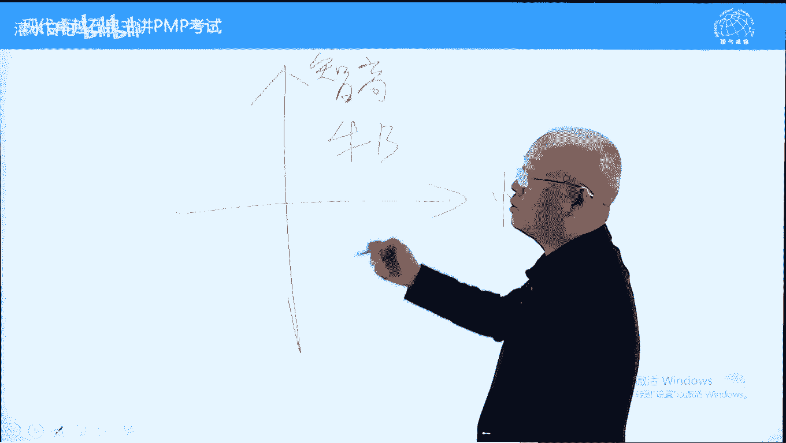
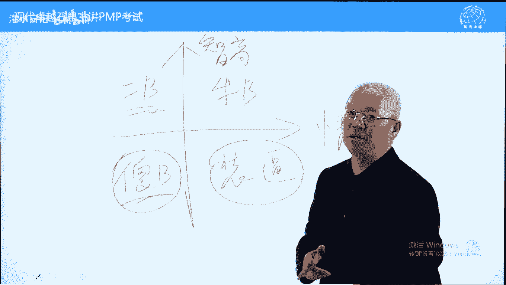

# PMP考试精讲 - P5：5 - 灌水日记 - BV1VN411w7cC

课程现在呢我们讲一下第三章项目经理的角色，这章内容不多，主要讲什么呢，项目里一在项目中有什么作用，以及我们对于项目里应该有哪些期望和要求。

好，首先我们说一下在项目中，项目经理负责做什么事情，首先从启动到设为五大过程组的工作，49个过程都应该是项目命令，来负责管理的工作，除此之外，项目里的作用呢还在往前往后延伸，往前是什么呢，参加商业论证。

商业分析，这这在之前传统上来说呢，应该是应该是公司高层战略部门做的事情，但是呢为了促进项目里对于项目的管理，对于项目的了解，他要参与，其次后续项目完成之后，要交给运营部门去运营的，按理来说。

到这个时候呢，项目的责任已经结束了，但是呢现在要求项目里呢可以根据后跟进，后续的运营工作，我们叫什么呢，扶上马再送再送一程，这些呢都是项目的新的责任，但主要还是什么呢，从启动开呃开始到项目收尾。

我们这段时间的一个作用，往前往后是可以延伸的好，另外一个呢我们形象的比喻一下项目，你在项目中的角色相当于乐队，指挥，乐队的各个声部，各个呃，这个叫乐器的演奏者，都属于项目团队成员是按专业分工的。

不同专业的人合在一起的，效命的话呢，把所有的人整合成一起演奏，演奏族很复杂的，很美妙的交响乐，这个呢是乐队指挥，对于乐队指挥而言，他不需要精通每一样乐器，但是呢它需要精通音乐，要对音乐有理解有体会。

另外一个呢，它虽然不需要掌握每一个乐器的操作和演奏，但是呢他必须知道每一个乐器它的特点是什么，它的优势劣势是什么，这个呢是对于项目的一个要求，下面呢其实是对于项目的管理的职能。

就是我们叫领导力的一个作用吧，这个作用呢我们待会详细再讲，这是领导力的一个作用啊，好对于项目的技知识和技能要求，我们先概括一下，越多越好，项目里最好是全台像0071样的，什么都会。

像汤姆克鲁斯在碟中谍一样，什么都会，这是最好的，好我们再看对于项目的定义，公司委派实现项目标的个人，这个呢叫项命令，我们可以这样说，对具体项目结果负责的责任人叫项命令，他对项目结果负责。

项目结果只要不好，就是找项目里，他没有什么别的理由，不能说别的不配合供应商出问题了，一切问题都是项目经理的问题，我们叫兵熊熊一个将熊熊一窝，我们再讲一个词，这个词呢应该是有一个湘军将领叫胡林翼，说的啊。

晚清的著名的知名将领胡林翼，他这样说，有不可战之将，有不能打仗的将领啊，叫无不可战之兵，不能埋怨兵，无不可战之兵，兵都能打，关键在于谁领导无不可战之兵啊，有不可战之将，项目的问题都是项目的责任。

他是对结果负责的，个人好，在项目中，项目呢跟职能经理跟运营经理，他们呢有分工，我们简单说一下，前面讲过项目经理在项目中负责三件事，范围进度成本做什么，什么时候做好和花多少钱做好，职能经理负责两方面。

资源和技术谁来做，怎么做，而运营经理负责什么呢，接受项目结果，接受项目结果的部门经理叫运营经理，比如说项目完成之后，e r p项目交给物流部门，军营或交给财务部门，军营交给谁运营谁，哪个部门呢。

就是运营部门，还有他的经理呢，叫运营经理，而在项目中，职能经理跟运营经理的区别怎么区别呢，就是看跟项目的关系，如果只是对项目提供支持，技术和资源的支持，它属于职能经理，如果接受项目结果，它就是运营经理。

要根据跟项目的关系，它不是绝对的，是相对的，另外一个呢职能经理我们一般也叫直线经理，也叫一线经理，直线经理l a lab manager一样的意思啊，它的分工刚才讲过了，不多说了。

我们下面呢再看一下对于项目里的一个要求，首先项目里的要求，我们从项目角度，组织角度，行业角度，专业角度，跨领域角度来说一下，这张图呢写的比较庞大，但是呢它的意思其实呢比较简单，我们能用直白的来说一下。

就是项目经理需要把项目管理的知，识和这种能力发扬光大，要影响很多，不要妄自菲薄项目，首先要把项目管理的知识和能力，用于项目之中来完成项目工作，这是他的一个要求，对他的一个要求，这是基本要求啊。

另外一个帮助提高公司的项目工程水平，通过跟其他项目里互动分享经验，分享技能来提高别人的水平啊，另外一个呢在行业中我们可以积累，我们可以写一些叫经验之类的，然后呢建立我们行业的项目管理的一个基础。

或者说提高整个行业的项目管理水平，另外呢专业学科指的是，如果你在项目管理中很有技术，你有必要到高校里面去分享一下，去影响一些这种高校里面的，他那些一些专业学术上进行一个研究，一个一个一个就影响。

让他们呢呃在学校里面他时间要稍微少一些呃，国外的高校教授的话呢，大部分都是工作一段时间，教一段学，工作一段时间教教一段学，把工作中学到的东西在高校里面去分享，在高校里面去影响别人，学科建设好。

跨领域指的是我们可以影响别的领域，别的行业不光是我们这个行业，比如说it行业项目做做的比较好，甚至你可以做特别特别好的时候，可以影响影响这个叫其他的建筑行业之类的，比如华为他管理比较好，它的模式的话呢。

其他企业的模仿不光是it企业，其他企业呢可能也在模仿，这个呢叫跨领域，一句话下命令，不要妄自菲薄，穷则独善其身，达则妻妾成群，达则兼善天下，开玩笑，就这个呢对于向命理的能力影响，你呢要做好项目。

在做好项目基础上，你发挥的影响力越大越好，我们再说一个具体的，就是尽量劝别人去学习项目管理，去考p mp这一页，就这个意思啊，好下面呢我们再看对于项目里的三种能力要求，也叫人才三角啊。

人才三讲三方面的能力要求，前面讲的比较多，我们给他概括一下三个方面，第一个叫技术，项目管理，什么叫技术，项目管理指的是项目管理中的应用技巧，项目管理知识体系中的硬技巧。

简单说一下这本书内容可以划分为两大部分，应激想跟软技巧，什么叫应急响，它的背后有数学可以量化的，可以复制的，这叫应极小，比如说项目管理中有w b s技术，有pdm技术，有e v m技术。

这些技术背后都有数学，它可以重复，可以量化，可以用于计划与控制，这个呢叫应技巧，这个学习呢比较简单，我们呢在上课的时候学一下，看书学一下就可以了，应急小的学习不需要互动难。

另外一个呢叫战略和商务管理技能，这叫什么呢，这叫本行业的专业知识，本行业的啊，你所在行业的，你要了解你所在行业的一些专业知识，这个专业知识呢比如说你行业，你是it行业，你要对i t呢有所了解。

不一定说特别精通，但是要有所了解，除此之外的话呢，对于本公司的所有部门，比如说战略规划部，行政部，人事部呃，这个叫人力资源，人事部，生产部，销售部，研发部门都要有了解，这叫战略跟商务管理能力。

就是对本行业运营的一个情况，包括本公司各个部门的一个运营情况，越了解越好，有人说过，什么人适合最适合做项目，你在公司所有部门都呆过的人，最适合做项目，命理为什么呢，他了解本公司各个部门。

也了解本行业比较全面一些，这个呢叫战略跟商务管理技能，我们再看第三个呢叫领导技能，领导技能也可以这样说，项目管理中的软技巧，什么叫软技巧，软技巧呢是一门艺术艺术啊，什么叫艺术，艺术是练出来的。

我们前面讲过一个故事，什么叫专业练出来的，它呢是一种直觉，这种直觉来自于实践，没有实践，没有艺术的好，软技巧的话呢，只可意会不可言传，它不能直接复制的，它呢都是互动得来的，也叫社会学的一些知识。

那什么叫互动得来的呢，我们可以这样说，吃什么最苦恼，答案是吃亏最补脑，这些技巧大多数跟吃亏有关系，而且跟人的悟性是有关系的，包括哪些呢，领导力有三个方面最重要，我们记住这三个就可以了，第一个叫指导。

也叫提出愿景，什么叫提出愿景愿景啊，红旗往哪里打，我们往哪个方向发展，这个呢叫提出愿景，好激励就是提高士气，我们也叫激励，鼓励领导呢必须能够提高士气，为什么呢，呃管理学中有这样的认识，士气决定生产效率。

士气决定生产率的，好，带团队也叫整合团队，让大家形成一个团体，形成一个整体，也可以叫团结，所有的人，什么叫团结，可以这样说，团结你不喜欢的人才叫团结，团结喜欢的人不叫团结啊，要把大家能够变成一个团队。

这个要求其实更高一些，所以呢我们大多数情况下，我们会发现领导不一定是智商最高的人，但是领导一般来说是情商最高的人，在现实生活中，现实工作中，很多人呢，尤其是技术人员，他喜欢跟领导比比专业，比这个叫智商。

这个比的话，那是没有意义的，我们选领导主要是不根据，不是根据专业，根据这三方面，这三方面你能做好，那就是个好领导，所以呢管理学中有个说法，每一个员工心中都有一个白痴领导，他跟领导比专业。

那领导在专业方面肯定不如你，马云说过，那是就是员工他的专业技能必须比我强，否则我要他干什么，这个呢是一样道理的，这三个是领导力的核心内容，三个内容提出愿景，整合团队和激励鼓励。

后面这些内容呢知道就可以了，都是一些具体的能力要求，我们在第九章可能会提到人际交往好，我们可以这样说，前面也说过了，在项目管理中有一个宏观沟通的概念，在项目管理中，所有的问题都是沟通问题。

所有问题通过沟通来去解决，我们前面呢在讲下面定位的时候，在讲p mi主义的时候，也说过项目你是一个管理者，对于管理者而言，最核心的作用就什么呢，协调关系，他呢人际交往要占很多时间，多长时间呢。

90%以上，通过沟通协调来把大家整合在一起，来激励来鼓励好领导的，记者的品质和技能越优秀越好，最好把人类所有的优秀品质都集中于一身，好的地方都集中于一身，这是最好的好，如果不能够如愿。

只能够有一个技能的话呢，大家记住核心技能就是沟通技能了，对项目体而言，最核心的技能要求沟通技能，我们可以这样说，中国有俗话叫好哥好胳膊，好腿不如一张好嘴，领导是靠沟通在活着，领导的核心能力。

也就是沟通能力了，好这个考试中曾经考过的，我们再看管理关系和解决冲突的方式，这里面提到一个叫什么呢，常言远光跟领导品质相关的，我们可以把它概括一下之后，就是一个情商问题啊，做领导靠的是情商。

靠的不是智商，靠在情商啊，有人说智商决定一个人的起点，情商决定一个人的发展上限是多少，领导的上限就是情商，情商高，能当领导，那我们讲一下关于情商的一个概念，情商为什么跟长远眼光有关系。

我们呢大概说一下啊，情商智商这一块的话呢是两个方向。

跟我们的叫认识是有关系的，智商智商高低的话呢。

决定我们的一个学习能力啊，决定你能不能考上大学，你的一个起点，而情商的话呢呃跟有人说情商低有什么表现。

简单说一下情商有跟什么有关系啊。

情商低两个主要表现，第一个呢就是加自私吧。

自私自私是一种情商低的表现啊，我们都不喜欢自私的人，另外一个呢就是脾气暴躁。

也叫控制不住自己的脾气，这个呢也是情商低的表现。

这两种表现的话呢，在心理学中都这样认为。

这是一个什么呢，这是一个价值观的价值，就不叫价值观。

世界观的问题，这个呢不叫性格缺陷，这叫什么呢。

这叫思维缺陷，它的思维不健全，最早谁说过呢。

美国第一个五星上将叫马歇尔说过。

说什么呢，脾气暴躁不是一个性格问题，是一个思维缺陷。

正常思维应该是叫全面的，我们今天讲三观，我们这边讲一下世界观，世界观世界观包括两方面，这个世界来自于佛教用语啊，是一个佛教用语，什么叫是有限的时间，教室仪式大概30年，它是一个时间概念。

什么叫借有限的空间叫借，它是一个空间概念，世界的1000倍叫小千世界，那这个呢是世界的一个概念，佛教佛家佛家用语好，这代表两种思维方式，一种呢叫空间思维，一种呢叫时间思维，智商高是空间思维比较强大。

比如说男生智商比较高，空间思维强大，红绿灯开车的时候，男司机剩十秒钟绿灯，正确的空间思维很强大，它能判断距离，这是靠直觉的，而女生的话呢，这方面可能天生要差一些，他可能先踩刹车，又踩刹车。

正好在斑马线前面停下来，为什么呢，空间思维稍微差一些，时间思维决定我们的形象，什么叫自私或脾气暴躁，都跟时间思维缺乏有关系的，好，我们来解释，简单解释一下，自私指的是喜欢占别人便宜，不能吃亏。

这种人的话呢是思想不长远，或者说没有长远考虑，当你有长远考虑的时候，这个世界上没有白占的便宜，只有白吃的亏，另外一个呢博博弈论里面有这样的说法，包括道德经里面也有这样的说法，叫什么呢。

首先吃亏的人能占大便宜，当你考虑到未来的时候，你能够克制自己的自私，能够考虑长远一些，来获得更高的利益，所以呢自私的人他表面上眼下他得到好处了，但是将来他没有出入的，他不可能发达的，为什么呢。

没有人喜欢跟他配合打交道的，这是一种时间思维缺陷，他没有长远考虑，脾气暴躁呢更是如此，脾气暴躁，比如说别人得罪你，得罪你了，你呢占领可以不吐不快，你可以发泄一下吧，把别人劈头盖脸骂一顿。

别人也不能说什么，但是呢你如果能想到在准备发脾气的时候，想到对方他有资源，将来呢你的孩子考去上学，要找人家，这种情况下呢，你能够克制住你的怒火，你能够平静的来处理这个问题了，这叫什么呢，这叫长远考虑。

人无远虑必有近忧，我们考虑长远之后呢，才能知道现在的决策对还是不对，比如说我们前面举个例子，开车你必须要看2百米，在高速公路上才能保持车头正直，人无远虑必有近忧，当你有长远考虑之后，你的情商会提高的。

你能克制住自私，你也能克制住脾气暴躁这两个缺陷，下面呢我们再画一个职场的4b象限，这个内容呢也相对来说比较经典啊，大家呢我们共共勉啊。

我们这个叫这个叫情商高。

这个呢叫智商高，我们把智商高，情商高呢化为四个象限啊。

我们这儿写一个高啊高啊，这里也写个高，第一象限，智商也高。

情商也高，我们叫什么呢，这个象限啊，这种的人中龙凤智商情商都很高的。

这种呢我们叫。

智商很高，情商很低。

这人死的很惨，他存在的意义就是证明自己比别人强，别人比自己差劲。

天天想着怎么样的压别人，打压别人来显摆自己啊，这种人没有活明白。

他将来的结果就是怀才不遇，怀才不遇这个词专门给他的。

他的人生没有积累，而这个呢象限呢是这个象限啊。

这种人傻白甜，智商也低，情商也低。

对别人没有伤害，在一个企业中待的最久的就是这个象限的人，他能待很久，为什么呢。

对别人没有伤害啊，他的要求也不是很高，好这个象限呢。

智商不咋地，但是呢情商很高啊。

这个象限当领导的象限啊。

考虑别人，善于把复杂问题简单化啊，具体例子呢我们就不讲了。

讲一个顺口溜啊，牛逼象限很稀少。

2b象限被人搞，被别人搞来搞去的，象限欢乐多装逼，向先出领导要当管理者，要考虑别人，因为自己即使智商很高，要装的少一些，但是呢情商一定要高，什么叫情商高，考虑别人，处处考虑别人，你想不成功都很难好。

关于这个叫长远考虑跟情商的关系，我们都讲，我们就讲到这啊，下面呢我们继续再看全数权利和办好事，什么意思，其实就是政治了，政治不分对错，没有好坏，只有什么呢，只有一个利益，我们呢能实现结果。

或者说呢能实现好的结果就可以了，人民内部的矛盾呢都是内部矛盾，不是敌我矛盾，没有必要分对错，所以呢在解决很多问题的时候，我们不要分对错，要保证双赢，保证可持续发展，这是第一位的。

因为呢大多数问题人民内部的矛盾啊，好这个呢不多说了，了解应用方式，刚才讲过了，借助权利，人际关系来进行他人，什么意思呢，就是职位权利有限的情况下，要靠个人魅力，包括人际关系。

别人喜欢你或者跟别人有交情来解决具体问题，什么意思呢，要利用政治来解决很多问题，因为呢项目管理中项目具有独特性，缺少支柱，还有一个呢项目的权利有限，职位权力有限，很多问题呢要靠感情来去解决。

行使权利的方式，我们呢书上举了很多，大概看一下啊，太多了，我们反而不需要一一列举了，有十几条，另外一个呢要主动地寻求权利，不能坐等组织授权，这种权利是很有限的，我们呢要主动寻求权利，什么权利呢。

比如说夸人家孩子，夸你狗会获得权利的好，有权有钱多请客，有力多干活，也能够获得更多权利的，这样的话呢我们解决问题，落实项目的事项会更加容易一些，另外一个内容对比一下领导力跟管理的区别，在这本书中。

其实呢他把管理放在领导力之下，但是呢又区别了一下，怎么样区别呢，大家翻一下书表，三杠一，我们呢大概看一下啊，这张表的话呢，我们大概的从宏观角度来区分一下就可以了，书上呢其实讲的还比较细节，比较简单。

在64页，左边呢是管理，右边呢是领导，大概的一个区别，管理相对来说，微观具体以任务为导向，强调效率，强调步骤，强调细节，而管理的话呢比较宏观一些，强调愿景，强调目标，强调团队，强调战略更加宏观一些。

呃这个呢抽象一些，宏观一些，这样来区分，我们可以这样说，领导的管理吧是眼前的苟且和未来的苟且，而领导力呢是诗和远方的前田野，他呢跟理想更关系更大一些，跟战略关系更大一些，跟愿景关系更大一些。

这个呢大概的理解就可以了，细节自己再看一下，好领导风格，书上呢讲了六种，我们呢主要把前三种大概说一下，后面三种的特点并不是特别的明显，有点牵强附会，或者说呢拼凑的感觉，什么叫放任型。

其实就授权领导当甩手掌柜，对于团队很信任，有前提，团队成员非常自觉自觉来去执行各种事情的，而且呢能力都很强，不需要领导出面，领导在和不在一样的，而教育学领导要考虑客户，要考虑双赢，考虑团队成员的利益的。

我们叫什么呢，以德服人行的布置任何任务，不强迫我们呢都是要说服的，用什么说服，用利益来去说服，这个叫交易型的对等价交换要对等的，这个对等的话，那不一定是钱呐，可以是别的东西。

比如说教父一里面有一句台词怎么说呢，男主角马路巴拉巴拉诺演的那个教父啊，迈迈克吧，他说什么呢，我会给你一个无法拒绝的理由，这就是交易型的任正非也说过一句话，什么叫人才，钱给多了都是人才。

这个呢也属于可以理解为交易型领导，服务型后勤部长型的敏捷项目中，项目里的大多数这种情况，他呢也是让团队人员冲锋陷阵在前面，包括规划，包括执行团队成员当家做主，项目的话呢，负责营造氛围，负责提供后勤支持。

负责解决一些琐碎的事情，这些做好，那项目呢就能完成对于项目团队要求，能力呢，对于项目，项目团队的要求也是相对来说比较高的，魅力型呢就个人魅力很强大，交互型呢就混合型吧，不多说了。

好个性就是人和人之间它的一些区别，人和人之间有共性，这个共性叫人性啊，在人性相同的基础上，每个人呢会有自己的小脾气，我们叫什么呢，叫个性，要承认个性的差异，没有好没有坏。

我们呢都要都要承认的存在都是合理的，把别人当成目标啊，不要因为这些跟你的习惯不一样，你就认为是不好不好的，我们这刚才也讲过了，这里面的不讲对错，只讲利弊，我们只讲对项目有利就可以了，这个内容不展开了。

好，关于第四第三章的话呢，还有一个重要内容，我们大概再说一下就可以了，这个内容其实我们前面讲过了，叫执行整合，其实执行整合并不是第三章的内容，他只是提到了一下，为什么要整合，前面讲过。

因为项目管理是一个和分合的过程，分的过程中产生大量接口衔接需要整合，这个呢是呃，为什么要整合，怎么整，怎么整合，沟通协调来整合，整合对象是什么，四类接口才记得不记得好，我说的四类接口也叫界面。

很多书上提到过的，比这三个的话呢要具体一些，这里面提到一个过程，就是先后顺序的认知层面，可以理解为技术方面的，背景层面的，人的方面的，利益方面的，他呢相对来说呢没有，那么具体，我说的这四类接口。

前面讲过的产品技术过程先后顺序啊，还有什么呢，人的接口，包括团队的，包括利益相关方的，这个呢讲的更好一些，整合和复杂性，因为要整合，所以很复杂，而且呢我们拆分的越多，上的人越多，复杂性是越强的。

由于复杂性在整合方面呢，有些原则稍微注意一下哪些原则呢，简单说一下美国人说的原则就属于要要整合，所以呢我们在安排很复杂工作的时候，要注意两个原则，第一个呢叫case法则。

只是有有作用的一些法则提示提示一下而已啊，什么叫case法则，英文缩写就是英文缩写case啊，叫keep it simple and stupid，keep it simple and stupid。

让事情简单一些，让事情傻一些，也就是说让事情呢呃简单一些，具体一些也可以的，我们当成傻一些好一些，这个呢也叫傻瓜法则，什么意思呢，当有很多人来配合你工作，你需要布置任务的时候，把别人当成傻瓜。

不要当成天才，这样的话呢在接口管理的过程中不容易出问题，另外一个法则跟它对应的叫混蛋法则，没有缩写了，混蛋法则说的什么呢，只要在工作中有人需要给你配合，需要别人给你配合。

你一定把那个和你配合的人先当成混蛋，我们叫至于死地而后生，不要期望过高，这样的话呢，接下来出现问题可能性不是很大，这个呢是整合方面提示到的，跟考试没有关系，我们大概讲一下好，第三章内容不多。

我们就讲到这儿。