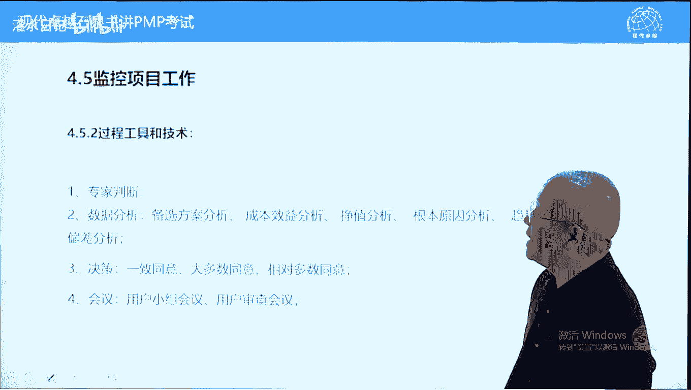
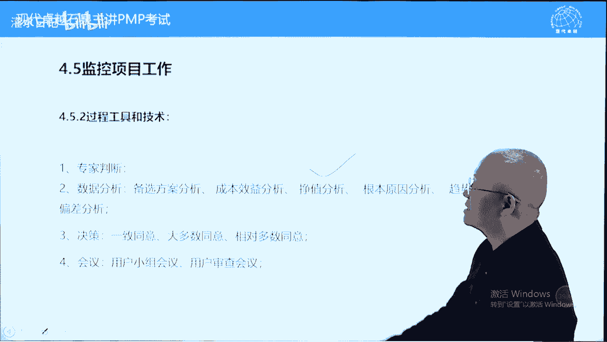

# PMP考试精讲 - P7：7 - 灌水日记 - BV1VN411w7cC

制定项目管理计划，前面呢我们也讲过，凡事预则立，不预则废，计划呢对于项目是很重要的，那这个玉呢就是一个计划的一个意思，计划的作用前面呢我们也讲过，首先计划是一个找路的过程，条条道路通罗马。

我们实现目标有很多条道路，我们找一条最合适的，这个呢是一个通过，这是通过计划来去实现的，另外一个呢我们在找路的时候呢，能够预先识别问题，所以呢计划过程也是一个问题，愈发现预识别的过程，在识别到问题之后。

我们可以很从容的在计划过程中，很从容地为这些问题呢制定解决方案，预定方案啊，这个呢所以计划它也是一个问题的预解决过程，我们预先发现问题，制定解决方案，计划呢它还能够建立秩序，它相当于一个叫秩序。

能让能让我们在复杂的情况下建立秩序，做到忙而不乱，就相当于很繁忙很繁忙，路口的红绿灯有红绿灯能建立秩序，没有红绿灯的话呢，会乱成一锅粥啊，这个呢是计划的另外一个作用，它能够知道我们先做什么再做什么好。

最后呢计划还是一个标杆，它能让我们知道当前我们执行执行的情况好，还是不好能能否按时完成任务，或者说花多少钱，最终能够完成任务，计划呢它还起一个标杆的作用，当计划制定完之后，我们要求呢团队人员要了解计划。

并且呢签字确认，承诺他能完成某一部分，他一旦签字之后，我们可以拿这个计划呢来去盯着他工作，所以呢计划也能增加项目里的一些权利，书上呢这样说，计划确定项目的执行监控和收尾方式。

这样理解任何一个执行监控或收尾，过程组的过程，他的第一输入都应该是项目管理计划，项目管理计划的指导，这三个内容好计划呢应该基准化，有三个计划是需要变成基准的，什么叫基准，最基础的计划，标杆计划。

轻易不能动的计划要动的话呢，可能会对项目产生重大影响的这样一个计划，哪三个呢，范围进度和成本，这三个呢我们把它叫做基准，加在一起，也叫绩效基准，也叫绩效测量基准，另外一个呢。

基准是批准word批准过之后的重要计划，没有批准之前可以渐进明细，就是可以随时更新，但是计划一旦批准，必须要经过整体变更，控制过程批准之后才能更新，这个我们在讲到4。6的时候呢，再强调一下。

下面呢我们大概看一下，制定项目管理计划的输入工具和输出，好计划呢应该是在章程制定完之后就要开始了，当然了，制定章程属于启动过程的过程，启动过程组呢还有另外一个过程叫什么呢，叫识别相关方好。

其他这个视频相关方呢跟计划也有关系，为什么呢，我们强调让相关方参与的好，这里面呢有一个输入，这个输入呢要稍微注意一下，他说其他过程的输出，严格来说应该叫其他规划过程的输出，什么意思，这个项目管理计划呢。

它首先是一个壳，是一个框架，它包含很多子计划，所以呢这些子计划加在一起，构成项目管理计划啊，这个壳里面包括什么呢，壳里面本身包括我这个项目管理计划，应该包括哪些子计划，并且这些子计划应该怎么样的制定。

这是壳里面的内容，壳整理完之后，项目管理计划，其实呢他也知道其他规划过程，按照项目管理计划的要求，我们呢一个一个的制定其他计划，这个呢是其他规划过程的输出，因为呢项目管理计划是把所有计划整合在一起。

叫做项目管理计划，当时呢一开始也有一个项目管理计划，其他计划没有做出来，之前这个计划呢这个项目管理计划是一个空壳，空壳里面呢告诉我们项目管理计划应该有哪些，计划，应该怎么制定。

所以呢我们在很多规划过程中，我们发现一个输入叫项目管理计划，这里面有一个问题，先有蛋还是先有机，应该是先有一个空壳计划，也叫项目管理计划，然后呢随着其他子计划的制定完，项目管理计划呢不断的被填充。

被丰富，直到呢所有的计划都做完，世界环境因素，组织工程，产理论上任何一个过程都应该考虑的啊，这个呢不多说了，下面呢我们看一下工具，工具呢跟制定章程很类似，有专家判断，有经验的人，靠直觉。

专家班段强调的是没有具体依据，都是根据经验，根据直觉做判断，他有前提条件，就是这执行专家判断或进行专家判断的人，比如项目命令，他必须有经验，没有经验，无法进行专家判断。

数据收集技术就是我们制定项目管理计划，需要一些信息，信息如何收集，这里面呢我们这三个讲过的啊，讲一下这个核对单，核对单是什么呢，就是清单，比如说你要到国外旅游，你呢需要带很多东西，数一数呢，几十样。

这几十几十样东西你在收拾行李的时候呢，有可能会遗忘，如何防止遗忘，我们列一张清单，核对单就是这样一张清单，它的主要作用是防止遗漏，它能提醒我们要做什么事情，要带什么东西的。

人际关系与团队技能跟前面差不多，冲突解决有冲突，我们是要解决的，解决冲突要达到一个双赢，达到一个一致同意，我们的第九章详细讲引导多方意见，不一致的时候要达成一致意见，我们呢可以开现场会的方式，现场拍板。

现场解决，比一家一家找他去解决呢，效率要高很多，好会议管理，前面也讲过，主要强调会议要有效果，要根据规则，要有规则，有一本书可以推荐一下，叫罗伯特议事规则，这是所有会议的罗伯特罗伯特啊。

这个罗伯特这个博罗伯特议事规则，这本书呢在会议管理中很强大，在国外有很多ngo，所有的ngo它都有章程，ngo的章程，ngu当成的最后一条一般都会写会计事宜，参见罗伯特议事规则。

他告诉我们怎么开会很厚的那本书啊，有时间可以看一下的好，另外一个呢就是开工会议，这个要详详细讲一下什么叫开工会议，英文呢叫kick off meeting，也叫kt会议足球中的开t啊。

k of meeting meeting，写到这儿了啊，指的是计划批准之后召开的一个会议，这个会议呢要求所有成员，所有团队时间都参加项目，向所有成团队成员呢介绍项目计划，英文叫review plan。

介绍项目计划，让大家了解项目，了解项目的计划，了解项目的流程，其次呢分配任务，因为人员都到齐了，分配任务，计划的作用之一，分配任务获得承诺，那相关方那就是团队成员要签字确认的，你能不能做到。

你能不能你愿意不愿意承担签个字，确和认这个呢叫获得承诺，第三个作用，第四个作用呢叫相互认识，建立沟通渠道，它有一定的团队建设的作用，这个呢叫ko meeting，考试的时候呢。

ko meeting永远或者大多数情况下，他不翻译成开工会议，它翻译成另外两个字啊，叫启动大会，启动大会，这个看到启动大会说的应该就是qq meeting，可以看一下英文的作用。

按照k o meeting来去理解四个作用，再说一下第一个review plan，项目里向大家展示项目计划，当然了，这个会议不光团队成员开，相关方也要开，也是了解项目计划的计划，做完之后要跟大家分享的。

其次呢分配任务和决策，指的是针对团队成员分配任务和决策，第三个作用获得承诺，分配完之后，对相关方签字确认的，或者说团子学签字确认的，第四个相互认识，建立沟通渠道，这个呢是qq meeting的内容。

而cao meeting它属于什么过程组，这个呢不同项目是不同的，书上说对于小型项目，它属于规划过程组，为什么呢，因为小型项目参加计划的人就是实施的人，计划批准之后不再增加人手。

所以呢这些人直接召开会议就可以了，相当于规划过程的一个延续，它属于规划工程组，而大型项目计划做完之后，大部分的团队人员要在计划做完之后，组建团队的时候才能进入项目，而组建团队呢它属于执行过程组了。

所以呢大型项目的ko meeting属于执行过程组，他首先他的制定计划的人是一小拨人，计划做完之后，要根据计划让团队人员呢加入项目，进入项目，进入项目之后才能够召开k comeeting。

所以呢它属于执行过程组，知道就可以了，好多阶段项目中每个阶段都要召开qq meeting，什么意思，前面讲过，我们讲过程组跟阶段的关系的时候，这样说，把每个阶段当成一个小项。

原则上理论上都要使用五大过程组，以及四九过程，包括制定计划，包括制定计划完之后，k comeeting啊，这个呢是关于k comeeting的一个说法，多阶段项目的话呢，我们49个过程。

理论上都应该重新执行一遍的，下面我们看一下过程的输出，主要输出就是项目管理计划，它呢由一系列子计划构成，子计划包括什么呢，这边有十个子计划跟模块呢是对应的，其次呢有三大基准，最核心的计划。

项目管理围绕这三个基准展开的，包括偏差分析，预测趋势分析，包括绩效报告，都以三大基准为核心，除此之外另外两个计划变更管理计划，配置管理计划，这个呢都以计划来结尾的，或者以计划来命名的，加在一起。

这是15个，再加上项目管理计划，一共有16个，以计划结尾的这样一个词，这个呢我们称为16个计划，这个呢也属于计划的一部分，但是呢他没有叫计划呃，绩效测量基准呢是三大基准的综合体，刚才讲过的合在一起。

而开发方法就是我们的项目管理计划，应该制定哪些，如何制定，这个呢是跟方法相关的，我们重点讲这16个计划，这两个这三个上面十个还有一个啊，这16个计划我们呢分为三种计划，哪三种呢，一种我们叫程序性计划。

什么叫程序型计划，告诉我们怎么做的，怎么做，叫程序性计划，程序计划，程序型计划吧，另外一类呢叫实体计划，什么叫实体计划，告诉我们做什么的，比如说三大基准，还有呢第三种叫综合计划，什么叫综合计划。

从内容中既包含了做什么，又包含怎么做的计划，叫综合计划，好我们呢首先讲一下实体计划，它只有三个，哪三个呢，三大基准我们叫实体计划，只告诉我们做什么好，实体计划呢我们用法律来形容一下，相当于实体法。

法律中包括实体法，也包括程序法，比如说刑法就是一个实体法，而刑事诉讼法它是一个程序法，民法也属于实体法，民事诉讼法它是一个程序刑，法律计划呢我们也这样划分一下，而实体计划主要是三个综合计划。

是四个综合计划指的是既包含实体计划，又包含程序计划的哪四个呢，项目管理计划首先是一个，它包含了所有的叫计划，它呢是一个实体计划，另外有三个和人相关的计划，哪三个呢，资源管理计划。

沟通管理计划和相关方参与计划，这三个计划呢跟人相关，它既包含做什么，也包含怎么做，除此之外，这些计划都叫程序型计划，程序型计划只告诉我们怎么做，不告诉我们做什么的，我们这样划分有什么意义呢。

因为项目中存在一个问题叫变更，变更主要改变的是实体计划以及综合计划，程序计划一般不受变更影响，因为我们变的时候只变做什么不变，怎么做怎么做是不变的，无论你做什么怎么做，方法应该是一样的啊。

理论上怎么做呢，也可以变，但是呢在实际中程序性计划很少发生变更的，注意一下，再说一下三类计划，实体计划就这三个实体计划，综合计划有四个项目管理计划，加三个和人相关的计划，其他都属于纯程序性计划。

我们在密集里面有关于实体计划，程程序计划，综合计划的一个区分，包括在考试中，哪些词可以选，比如说针对程序进行计划查看，可以选创建，可以选，而更新一般是不选，更新的话呢，一般更新的是实体计划。

综合计划这样一个情况啊，好这个呢是计划的分类，另外呢我们看一下表，89页有一张表，这张表呢告诉我们有项目计划，有项目文件，好，项目计划呢跟项目文件，从本质上来说都可以叫文件，只不过呢项目计划需要批准。

文件不需要批准，相对来说呢要简单一点，或者说呢没有那么正式好，89页这张表左边都是计划或者计划内容，这个不多说了，我们看右边，右边的都叫文件，文件不需要批准，项目中可能我们需要用。

而文件的话呢可以随时更新计划的更新，正常情况要走变更流程的文件可以更新，不需要走流程，另外一个呢文件更新指的是执行过程，规划过程，只要你做事情了，都要记录一下，好记性不如烂笔头，只要你记录下来。

都可以叫文件更新，在文件中我们讲一个内容，什么内容呢，就是89页，右边的文件，第15条，有一个项目进度计划，批准过程，进度计划叫进度基准，那进度基准呢是在左边计划里面的，而右边在文件中。

为什么会有一个项目进度计划呢，这个解释一下这里面的内容，它不是计划，我们这样理解它是实际进度，实际进度也要表示出来，用什么表示呢，用进度计划来表示，所以进度计划呢有两个意思，一个呢代表计划。

一个呢代表实际进度在89页，右边第15条，这个项目进度计划指的是项目的实际进度，它是随时更新，随时记录的，所以呢他叫文件，不再叫计划了，好关于规划过程呢，我们就讲到这儿。

下面呢我们讲第三个过程叫指导与管理，项目工作，这个内容呢在实际工作工作中工作量很大，但是呢在我们讲pmbok的时候，这个内容呢并不是很多，为什么呢，要具体情况具体分析。

我们呢纸上谈兵的指导与管理项目工作，他就做一件事情，哪件事情呢执行计划产生，结果就这样一个事情啊，好在执行过程中除了执行项目管理计划之外，还要执行批准国际变更请求，变更一旦批准要更新到计划里面去。

跟计划同等，所以呢批准变更请求跟项目管理计划划等号，即变更变更请求一旦批准之后，要更新到计划，要纳入计划也要执行，在哪里执行，在4。3中去执行的执行过程，再说一下执行计划，也执行批准工作变更。

产生可效仿成果，另外呢还产生工作绩效数据，前面讲过什么叫工作绩效数据，指的是在执行过程中产生的，原始得和基础的数据，主要指三大基准的情况范围，进度成本的情况啊，好我们再看适应环境因素，组织高生产。

这都属于老生常谈，文件的话呢，大概看一下这个文件的话呢，呃我们这个需要特别考虑的，没有什么特别考虑的，都是泛泛的，像这个比如说进度计划，它不在计划里面，这个指的是实际进度，要考虑实际进度。

结合实际进度做一个参考，那我们执行主要执行计划，世界环境因素，组织生产都不多说了，我们下面呢看一下工具专家，半段跟前面一样，不说了，项目管理信息系统，简称p miss。

这个要说一下什么叫项目管理信息系统，项目管理中使用的计算机支持的工具，都叫项目管理信息系统，计算机支持的跟项目管理相关的工具系统，都叫项目管理信息系统，它的特点就是有计算机支持啊，包括什么呢。

首先一个软件工具，比如说p6 软件project软件我们都叫什么呢，进度软件也叫项目管理的进度引擎，好进度计划软件差不多的工作授权系统，这个指的是分配任务，安排任务，任务授权的这样一个系统。

安排工作的配置管理系统，主要指的是我们存档的，包括可交付成果的命名，以及保存的这样一个系统，信息收集和发布系统，就是我们如何收集信息，如何发布信息，一般来说呢都是通过网上，通过计算机来进行的。

这个呢都属于p miss的一部分，当然呢配置管理系统下面还包括变更控制系统，以系统结尾的词呢，大多数或多或少都与项目管理信息系统有关系，我们都可以归到这下面呃，这个这个下面呢，因为现在很多工具的话呢。

跟信息相关的工具都计算机化了，所以呢我们都把它叫做项目管理信息系统，这个呢是一个大的概念，以计算机支持的都可以，这样的，在现实中有些工具的话呢，我们可能没有计算机支持。

但是呢也可以属于项目管理信息系统的一部分，只不过你没有信息化而已，比如说文件的不叫文件啊，合同的存档，合同的保管，应该来说有合同管理系统，应该属于p miss一部分啊，好不多说了，会议在执行过程中。

我们会开一些会议，哪些会议呢，这里面列举的比较多一些，开工会议讲过了，它可能属于执行工程组，也可能属于监控呃，叫规划工程组的技术会议，也叫解决具体问题的问题解决的会议啊，敏捷迭代规划会议。

注意这个会议呢，它属于范围加进度一起的规划会议呃，放呃敏捷开发呢把范围和进度放在一起，这个呢也理解为敏捷方法中的一个沟通方式啊，我们今天做了什么，明天做什么，我们呢还有什么工作，我应该完成了。

我完成什么工作之类的啊，指导小组会议，这个呢可以理解为呃监控的一个会议，或者说呢我们团队领导召开的一个小会议，项目团队的问题解决跟技术会议差不多，进展跟进会议跟这个叫呃指导小组会议。

或者说跟这个叫叫状态审查会议差不多的，回顾会议也是敏捷特有的总结经验教训，在敏捷项目中总结经验教训，教父回顾会议啊，好有些呢考的比较多，有些呢基本上不考啊，说一下考的比较多的开工和回顾。

其他呢其他基本上没有什么了，一般来说在题干中出现，选项中不出现的，不用管那么多好，我们继续再看4。3的输出，我们前面讲过4。3的主要是执行计划，产生可交付成果，所以呢他的第一条叫可交付成果。

什么叫可交付成果，说一下，指的是在任意过程呃，阶段或项目完成时所完成的呃，可测量的产品服务或成果，这个呢叫可交付成果，就是我们项目的交服务好，这个可交付成果，我们要对比一个概念。

要看一下它到底是什么跟什么呢，跟产品组成部分对比一下，跟产品的组成部分对比一下，可交付成果是大于产品组成部分，产品组成部分只包括产品的具体的组成部分啊，可交付成果除了包括全部的产品组成部分。

它还包括未实现产品结果而做的一些中间工作，比如说盖大楼要搭脚手架，脚手架属于可交付成果，但它不是产品组成部门交给客户的，不包括脚手架，包括软件项目，如果跟客户签签协议，不包括源代码。

源代码属于项目的可交付成果，但是呢它不属于产品组成部分，还有我们在制造业中，经常呢要通过模具来生产一些零件，这些零部件属于叫产品服务成果，而中间的模具它属于可交付成果，它未必属于产品服务成果。

所以呢可交付成的概念大于产品服务成果，在考试中，你呢把它当成想象中的产品也是可以的，工作绩效数据强调三大基准的数据，比如说范围，我们完成哪些工作，进度进展到哪一步了，成本花了多少钱，他呢没有对比。

所以它叫工作绩效数据，问题一致强调一下问题，一致强调急需解决的问题，需要解决的问题，记住在问题一致，问题是有三要素，哪三个要素呢，一什么问题，二什么时间解决，三谁负责解决，应该是顺序先稍微颠倒一下。

什么问题，谁来负责解决，什么时间解决，他设定责任人，设定期限，以确保问题得以解决，问题意识中记录的都是问题，而在现实中我们会有一个问题啊，问题风险基因教学怎么区别，简单说一下，首先问题他强调需要解决。

另外一个呢问题大多数跟人的责任有关系，这里面的人呢更多指的是项目命令，比如说质量中的问题，质量的缺陷都叫问题，不叫风险，为什么呢，因为质量中有原则，质量可以零缺陷，因此呢任何缺陷都是责任问题。

它是跟人的责任相关的，它不叫风险，问题跟人责任有关系，而风险呢具有客观性，比如说下大雨下暴雨，这个呢叫风险，而什么叫问题，下大雨下暴雨，上海的2号线地铁线停运了，瘫痪了，这叫什么，这叫问题。

因为1号线4号线它都没有瘫痪，就2号线瘫痪了，跟人的责任是有关系的，包括某一个小区被淹了，下大雨导致的这个呢叫问题，不叫风险，为什么呢，因为下水道排水设施没有处理好，污水设施没有处理好，导致小区被淹。

这个呢叫问题，跟人的责任有关系，风险具有客观性，而问题的话呢，问题它相对而言跟人的责任是有关系的，我们呢这样来区别风险不可抗，问题呢是本来可以避免的，或者说你只要负责任是能够解决的。

而经验教训呢都是事后的，事后记住经验教训，而经验教训一般跟选择有关，跟选择无关的，不叫经验教训，我们前面讲过的啊啊比如说这个长得丑，这个呢叫问题，有一个两个女孩儿，一个呢性格好，一个长得漂亮。

你选择长得漂亮了，没有选性格好的，结果后悔一辈子，这叫什么呢，这叫经验教训，经验教训一定跟选择有关，而且经验教训都是事后的问题，都是还没有解决的，这个呢是它们的区别，变更请求说一下，在执行过程中。

我们会发现有些计划可能实现不了，或者计划是失误的，我们要提出变更请求，包括执行过程中，我们发现执行的结果不对，也要提出变更请求，变更指的是当现实跟计划不一致的时候。

我们我们想办法设法让现实跟计划保持一致，这叫变更，变更应该走流程，走变更流程，我们到4。6详细讲，而变更一共有四种，纠正措施，预防措施，缺陷补救和更新，前三种是同一类，都属于什么呢，改变现实。

让它符合计划，更新单独一类更新的意思呢是改变计划，让它符合现实，我们的目标跟现实差距很大的时候，或者改变现实，让它符合计划，他比较主动，所以前三个比较主动一些，第四个被迫迫不得已的时候，改变计划。

让计划符合现实，保持计划跟现实的一致性，为什么呢，我们说过计划的作用之一，它相当于红绿灯，如果如果计划跟现实偏离很远的话呢，那就会出现混乱，出现了失控的，因此的话呢必须要保持计划跟现实一致性。

当然现实中我们还采取另外一种方式，叫随它去吧，现实跟计划差距很大的时候，我们改变现实，改变计划都不选随它去，走，到哪算哪，这也是现实的一种情况，在项目管理中是不允许的，前三种怎么区别，先说一下预防措施。

他是事先的，而纠正措施跟缺陷补救都是事后的，那缺陷补救跟纠正措施怎么区别呢，也区别一下纠正措施对象比较广泛一些，它可以针对进度成本范围，质量而缺陷补救范围比较窄，只针对可交付成果的质量缺陷。

可交付成果质量出现缺陷，我们呢用缺陷补救只针对可交付成果质量缺陷，或只针对质量缺陷，这个这个呢是三呃四类变更的一个区别，前三类的区别好，项目管理计划更新变更请求提出之后，要进入4。6，4。4。6的过程。

是批准或否决变更的过程，变更一旦批准，要更新项目管理计划，注意变更批准才能更新项目管理计划，一旦项目批准之后啊，那计划批准之后，计划批准之前不存在变更，但是呢计划批准之后，任何的变更都要走变更流程。

批准之后才能更新到计划里面去，好，我们再看更新，项目管理计划跟更新文件有什么不同，在规划执行监控输出中都有文件更新，文件更新没有特殊性，只要你做事情了都要记下来啊，不存在一个变变变动问题。

而计划更新项目管理，计划更新一定是变更批准之后，经4。6批准之后才能够更新计划，所以呢文件更新稀松，平常计划更新很严肃，变更没有批准计划，一般不更新的组织过，资产更新指的是在执行过程中。

我们可能积累了一些经验，教学要更新到组织生产，供以后项目借鉴的，供别人借鉴的好，下面呢我们再进入4。4，叫管理项目知识知识管理，这是第六版，新出现的内容，为什么新出现。

因为呢他认为pmi认为知识管理越来越重要了，所以单独列出一个过程，这个过程的话呢内容并不是很多，但是呢有一些必考的考点，我们先看知识管理呢跟我们想象不一样，它不光是把现有知识积累。

并且利用它还要产生新知识，使用现有知识并产生新知识，然后呢改善当前情况，改善以后的情况，这是知识管理的一个目的，或者说一个核心内容，这个这条一样的，不多说了，我们再看知识呢，有显性的，有隐性的。

什么叫显性的，比如说大量数据库这个工作需要多长时间，需要多少人，需要什么技能，这叫显性知识，可以直接看得见摸得着的，而什么叫隐性知识呢，隐性知识的话呢，别人不说，你不知道，也可以叫窍门，也可以叫诀窍。

很多行业都是有诀窍的，比如说骑三轮车跟骑自行车不一样，不会骑自行车的人骑三轮很简单，会骑自行车的人呢，骑三轮往往会摔跤的，会拐到沟坑里面去的原因是什么呢，骑三轮一个诀窍就是呢你只要把方向把握住。

别管身体歪不歪，三轮不会倒的，不要怕身体歪，骑自行车身体一歪，赶紧要要转转车把的，但是呢三轮车身体歪了之后，不要转车把，一转车把就可能会翻车，拐到沟里面去啊，这个叫诀窍，我呢再讲一个隐形知识。

比较有趣的一个段子，我大学一毕业，当时呢是在可口可乐工作，有一段时间在河南工作，呃，当时的话经常出差，90年代年代的话呢，河南的交通主要他有个十字路线的高铁，不是高铁地叫铁路，经常做铁路，做铁路的话呢。

当时车比较慢啊，车上无聊就跟旁边人聊天，有一天呢我旁边坐了一个老头，然后他这个人呢好像识多见广，知识面很广啊，跟我聊起来了，给我讲个故事，什么故事呢，他说他们县他们老家。

现在他们老家那边呢有一个唱武生的，当然唱豫剧的，唱武生的师傅呃，以前呢很有名，他带了个徒弟，更有名是当呃，叫当前当红炸子鸡非常火的一个武生，五声呢强调翻跟头，要在舞台上翻跟头，要五把子弹。

另外呢五声强调扮相越漂亮越好啊，他这个土地的话呢很火，但是呢有一个问题没有解决什么问题呢，5l很多武将头上都有那个靠，就是显示你是武武武将的那个很沉，然后那个call的话呢，翻跟头的时候可能会掉下来啊。

然后怎么办呢，用绳子在底下记一下，记下之后呢就不掉下来了，但是呢这个绳子很影响半相好，这个5l的话呢没有解决这个问题，要翻跟头必须要系绳子，不系绳子的话呢，可能帽子会摔掉，就难看了啊。

但是呢他师傅翻跟头戴帽子从来不需要系绳子，帽子也从来不掉，所以呢这个徒弟呢就认为师傅留了一手，没有教会他，所以每年三节就是端午节，中秋节，春节，1年三节呢徒弟带厚礼看师傅。

每次见到师傅呢跟师傅喝酒的时候，都要问一个这个翻跟头的时候，怎么样能让帽子不掉呢，师傅都是笑而不答，每次都这样问，师傅从来不回答，然后呢师娘这个不忍心了，徒弟的话呢开始走师娘路线，找师娘，给师娘送东西。

让师娘看能不能解决这个问题，能让师傅的开口，师娘呢心比较软，就跟师傅说了，这个徒弟多好看，这么多年来这么红还都来看你，很恭敬的，你教他不就行了吗，师傅说我一旦教会他，他就不来了，所以不教他是否有私心啊。

实际上说不会的，我来保证你教会他，他绝对会继续再来的，这个孩子我看的很准，然后师傅呢拗不过师娘，然后再再下一次徒弟来看他的时候，徒弟再问这个问题，师傅就说了，怎么样解决翻跟头不掉帽子呢。

在翻跟头的时候要咬一下后槽牙，只要你咬后槽牙，太阳穴会凸起，就能把帽子卡住了，就正好关正好能戴下的帽子的，正好能卡住，不会掉，诶，这是什么呢，这叫隐形知识，想不想知道后来结果师娘有没有对师娘错了。

这个徒弟呢再不来了，这叫人性啊，正常的情况好，教会徒弟饿会饿死师傅，正常的好，这个呢叫隐性知识，隐性知识的分享需要信任，没有信任，没有隐性知识分享，所以呢项目应该营造一种氛围，要怎么样呢。

要让大家信任隐性知识能分享，否则的话呢大家会掖着藏着，就跟我刚才讲的故事一模一样的，知识管理两个误解，哪两个误解呢，第一个只是在社会的时候去更新，去总结经验教训，更新知识。

错误的应该在整个项目期间对组织工生产，对经验教训进行增补，第二个呢呃只是使用这个现有知识，没有说产产呃，创业新知识，这个这也是个误解，就是我们不光要使用现有知识，还有呢创造新的知识，这两个误解呢。

注意我们大概可以这样说，三个好点，第一个现有知识产生新知识，另外一个呢全生命周期，还有一个呢营造一个环境，在考试中都考过的，这个呢并不是很难记住啊，内容相对来说比较比较单，单纯一些或者单一一些。

这三个呢要记住好过程的输入工具和输出，这个内容呢倒不是很重要啊，前言重要一些具体的过程输入输出不是很重要，这里面有什么呢，这里面有主要是计划了啊，或者说更核心的经验教训等等，一色不叫计划项目文件了。

其他的话呢其他的标准政策流程之类的，可以作为一个帮助，为什么呢，在原有的知识情况下呃，原有的知识下产生新知识，有这样一个作用的，其他不多说了，我们看一下工具，工具呢知识管理营造一个氛围，分享引擎知识啊。

信息管理就是要保管好，要便于大家共享，公以后项目借鉴的人际关系技能，要建立信任呃，要能够让大家把知识呢能够展现出来，或者分享出来，这个内容呢不多说了好，我们再看过程的输出经验教训登记册。

早期创建结束时要纳入知识库，随时总结，收尾的时候纳入经验教学知识库好，我们说更新经验教训更新，组织生产，随时的纳入知识库，是收尾的时候再纳入的，这个呢考试中也是有的，不矛盾好这里面呢有个计划更新。

这个计划更新理解为在g在这个叫什么呢，呃计划并批准的时候，它呢可以随时更新计划，一旦计划批准了，这个更新呢就有问题了，或者说这个计划更新全当不存在，因为呢这里面没有提出变更请求，没有变更请求。

计划更新就无从谈起，所以呢理解为计划还没有批准，随时更新，不管它了，4。4内容刚才讲的三个内容重要一些，下面呢我们进入4。5叫监控项目工作，这项工作呢在实际工作中是很重要的，内容很多。

但是呢我们在讲pf课的时候，这个内容也比较虚一些，也比较空洞一些，简单简单来说两个主要内容主要作用啊，哪两个，第一个对比对比什么呢，监控过程就是对比实际情况跟结果，发现偏差，提出变更的过程，没有对比。

没有伤害，拿实际结果跟计划对比，跟其他指标对比，跟别的项目的指标对比，判断一下我们这个项目好还是不好，是否需要采取措施，是否需要变更，这是第一件事情啊，第二件事情在对比过程中产生一个重要文件，叫什么呢。

叫绩效报告，绩效报告，绩效报告我们前面讲过了，它强调的是书面格式，只要以书面格式向相关方汇报项目情况的文件，都叫绩效报告，目的呢让相关方了解情况，越了解越放心好，4。

5主要是两间工作对比对比产生一个结果，还有一个结果叫什么呢，工作绩效信息，当然呢4。5的话呢，工作绩效信息所输入的不是作为输出输出，输出技校报告呃，监控工作呢我们叫监控工程组啊。

它本身来说产生工作需要信息r，4。5呢它属于监控工作的终结者集大成者，他把所有监控过程的输出作为输入，在这儿啊，所有其他监控工程的输出作为输入，然后呢用来产生一个绩效报告。

按理来说绩效报告哦不是不叫绩效报告，工作绩效信息它是监控过程的输出，但是呢在4。5中它是4。5的输入，4。5理解为所有监控过程的终结者，他把所有监控过程的结果汇总在一起，目的生成绩效报告。

答案也是对比的一个结果，我们看一下大概的内容啊，监督整体进展，了解状态，当然了解状态呢生成绩效报告之后，在10。60。2中去发布，10。2中去发布的好，另外一个呢预测，这也是绩效评估，我们叫趋势分析啊。

对比刚才说过了，定期评估绩效决定是否采取措施，是不是要变更的，是否要变更的风险不多说了，风险的话呢我们专门一个过程风险管理的好，过程的输入要对比计划，另外一个呢要看项目执行过程中的一些文件。

它里面这里面包括什么呢，变更问题之类的，也属于绩效报告的一部分，工作绩效信息来自于其他监控过程的输出协议，就是合同，我们要对比，和这个合同呢跟计划差不多的作用啊，也是一个对比的依据。

好世界环境因素组织过生产，这就不多说了，解决问题的一个可以参考的一个东西，下面看一下工具专家判断。

前面讲过很多次经验直觉，而数据分析这里面呢有一些词，大概说一下什么意思。

在监控过程中，我们对比的时候使用的备选方案分析，指的是监控中发现缺陷，需要缺陷修复，需要纠正措施，而纠正措施这一块的话呢，具体修复这一块可能有多种方案，找最好的备选方案分析，也叫配对比较。

把两个方案放在一起比较一下成本平，效益分析指的是投入产出比，纠正措施有一些效率高一些，性价比高一些，有些的差一些，他呢就是性价比量化之后看哪一个最好，正值分析。

判断偏差大小的s v c v s p i c p i，主要是s v c v啊，我们后面呢第七章讲正直的时候，这个内容呢这分别叫进度偏差，成本偏差，根本原因分析，救助措施，缺陷补救。

都要找到根本原因之后才能够解决问题，好趋势分析，这是一种预测技术，让历史告诉未来，这叫趋势分析，趋势分析一定有一段对比的时间段，比如说大盘的k线图呃，叫一周的这周来走平了还是向下还是向上。

我们可以预测接下来应该是什么情况，根据一个月来的向上向下，我们可以预测时间更长一些，根据1年来的趋势呢，预测时间更长一些，因此呢趋势分析它首先有一个时间段，不同时间段趋势呢可能是不一样的。

时间段长短不一样，整个趋势呢可能会不一样的，好趋势分析预测技术决策，这里边呢提到了一个多叫什么来着，多方决策的问题啊，多方角色里面有这样一些原则，三个原则，第一个叫一致同意，一致同意呢。

其实翻译成一致同意呢，跟他意思不符的，应该翻译成一票否决，不需要每个人都同意啊，通过决议不需要每个人都同意，比如说联合国安理会五个常任理事国，他们的突破原则就一致同意，但是呢不是说都要同意。

有弃权的不算弃权不算，所以呢一致同意呢理解为一票否决更好一些，大多数同意指的是50%以上的人赞同，通过这个呢比较严谨一些了，相对多数同意不需要50%，少数服从多数就可以了。

这个内容呢考过的他不要求过50%好，会议监控过程中审查会议是有的，我们叫状态审查，会议跟用户有什么关系关系，不是很大，我们更多的是自我内部监控的，跟会跟客户呢，我们主要是绩效报告来去汇报的。

我们就理解为状态审查会议，定期召开的例会，每周开一次，然后呢判断项目情况，分析项目情况，另外一个呢绩效报告的周期，也决定了会议的周期，绩效报告多少钱发一次会议，这种制定绩效报告的会议呢。

也可以多长时间发一次，当然你可以放在这周，会以周回为单位也可以的，但是呢我们绩效报告应该来说可能不是，一周发一次，有可能周期更长一些的，一个月发一次会议的话呢，理解为开会来去讨论或跟踪项目的绩效情况。

4。5的内容呢简单说一下，比较简单两件事，第一个对比对比结果跟计划，包括跟其他指标发现偏差，提出变更的过程，另外一个呢就是叫制定绩效报告，让别人来了解项目情况，看一下输出了工作绩效报告。

这个呢其实也就是对比的一个结果，包括什么呢，状态报告三大基准，当前情况进展报告主要是进度情况到哪一步了，其他几个内容呢大概看一下就可以了，这里面有一个叫储备燃尽图，到第11章会讲一下。

它通过显示剩余储备有多少，来显示剩余的储备跟剩余风险是否依然对应，是否能够足以应对剩余的风险，缺陷直方图在第八章出现的，用直方图来显示缺陷的种类，以及缺陷发生的频率啊，其他几个呢顾名思义看一下就可以了。

变更请求监控过程发现偏差，当偏差超出一定程度的时候，要提出变更请求，变更主要针对三大基准变更请求，要经过4。6过程，整体变更控制过程批准之后，更新到计划里面去，这个变更正儿八经的有变更，有计划批准。

这个是正常的，如果只有呃，这有计划不需要计划批准，有计划更新，如果只有计划更新，没有变更请求，那个计划更新我们的存疑，或者说不要太太当回事，这个很正式的变更请求，计划更新。

而其他的话呢没有可以根据结构计划更新，这个解释起来是有问题的，或者说呢我们可以相相对来说忽略它，它解释不通的啊，正常来说，计划批准之后要通过变更请求的文件更新，在任何时候都可以有，只要你做事情了。

都可以在文件中记录一下的好，这个是4。5。