# PMP考试精讲 - P9：9 - 灌水日记 - BV1VN411w7cC

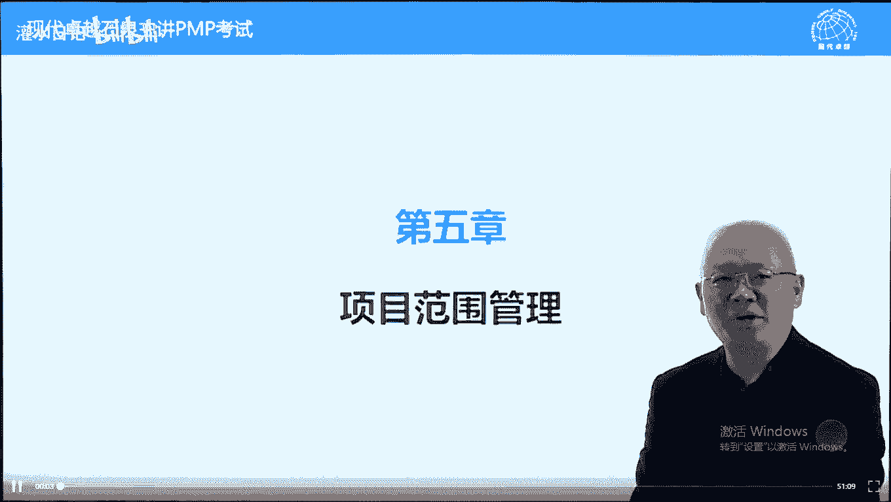

pb网络课程，我们下面呢讲第五章叫项目范围管理。

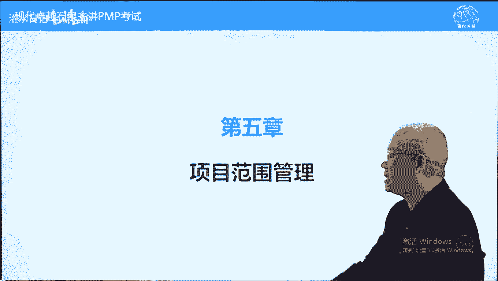

那什么叫范围呢，范围就理解为项目的交付物，可以理解为产品服务成果，但是呢这个范围是有限的。

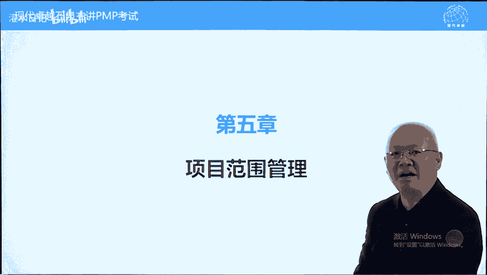

我们叫产品组成部分，我们这边讲的范围应该叫所有可交付成果，就是一个确定可交付成果的过程。

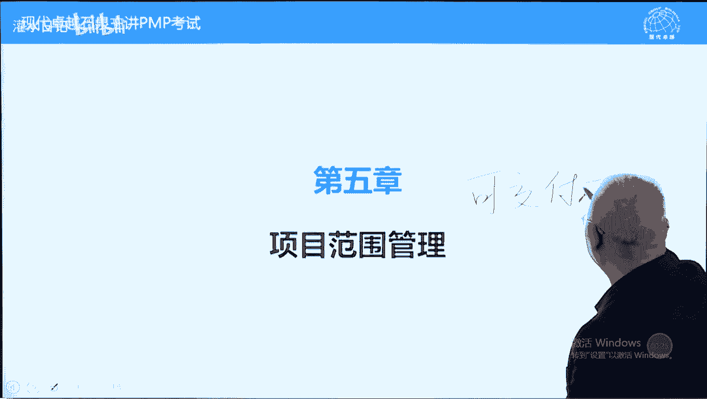

可交付成果我们刚才讲了，他是大于产品组成部分的，它包括未实现产品而需要做的一些中间工作，中间结果可交付成果都是名词。

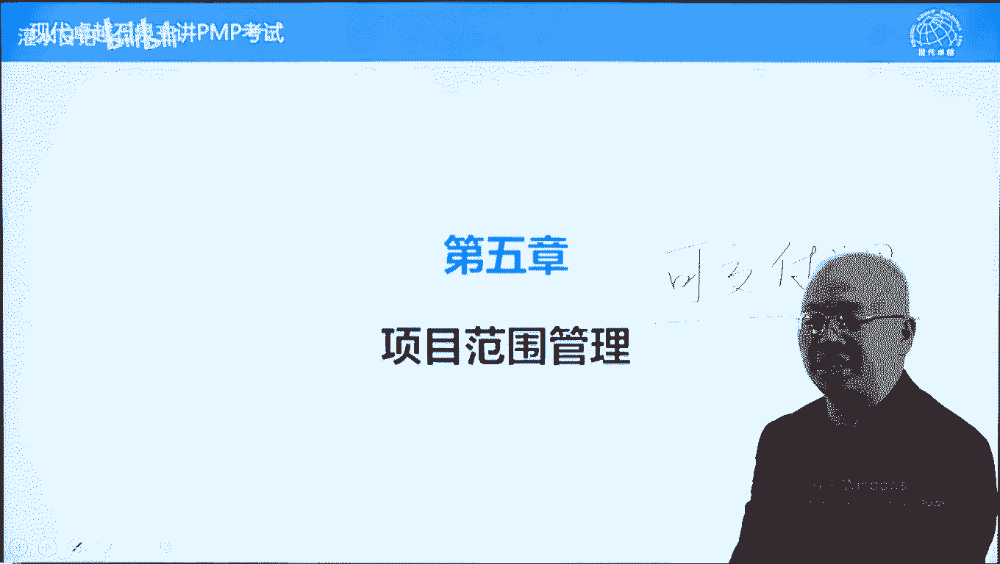

这点注意一下，都是名词啊，下面我们首先看一下前言书上说的内容啊，范围管理一个原则叫o and only，叫什么呢，全部和仅仅我们要确定全部的工作，而且只要做这么这么多工作，地点也不多，一点也不少。

好我们再看哪些工作包含哪些工作不包含，最后呢我们有个文件或者一个内容叫什么的除，外，责任要确定一下，我们到讲到范文说明书的时候，再讲一下这个概念，另外呢产品范围跟项目范围，我们刚才讲过了。

产品范围指的是产品组成部分，而项目范围呢包括产品组成部分，也包括未实现产品组成部分，而产生的一些中间结果，比如说源代码，比如说脚手架，比如说一些模具，这些呢可能不属于产品范围，但它属于项目范围。

另外呢预测型生命周期跟敏捷型生命周期，敏捷式开发的关于范围管理的不同，好这个大概说一下，敏捷强调拥抱变更，它不需要变更或者不需要考虑变更流程，流程不重要，重要的是呢满足客户的需求，客户随时提需求。

我们随时可以添加内容，这是敏捷的原则，而预测型生命周期就是我们说的传统项目管理，比较经典的项目管理，它呢一开始定义范围范围，开始定义完之后就确定了，中间如果有增加有改变，必须走变更流程才能改变。

但是呢适应性和敏捷性不是这样的，它那是每一次迭代，每一次它是分成多个迭代，迭代周期来完成一个项目目标的，每次迭代确定任务可以随时添加范围，添加的范围呢我们叫未完项，随时添加功能好。

未完项呢我们把它把这个新功能列入未完下，每次迭代的时候，决定我们这次迭代来完成哪些未完项，急用的先做，不急用的可以晚些做啊，我们是边边边确定需求边去完成，它是可以这样的，他满足随时提变更，随时有变化。

互联网项目呢这一点就比较适合了，因为有些项目的话呢，它是与时俱进的变化，很快收集需求，定义范围创建到p p s就是需求的确认工作，只在开始时完成，一旦完成之后就确定好了，再变更要经过整体变更控制过程。

好确认和控制变更，因为我们一开始结局确定好的，结果确定好的，所以呢可交付出完成的时候再来进行一个确认，每次可加分成果完成之后来检查，而这个呢是每次迭代周期的，每次迭代周期的结束的时候。

我们呢进行一个检查或确认答案，也也可以说每个每次迭代的时候，我们进行一个确认好，另外呢基准构成有三要素需要背的，而这个适应性生命周期只有未完项，未完项呢就是我们需要完成的需求。

这个需求的话呢可以写整体写出来，完成的时候迭代完成，什么叫迭代，迭代的话呢，就是重复，我们举个例子啊，有个故事啊，碰到在某个电视台的记者，碰到在陕北碰到一个放羊的，放羊的很辛苦，穿得破破烂烂的啊。

天天日晒雨淋的，显得很老，问他，你养这么多羊干什么呢啊，像盖房盖房干什么呢，娶媳妇娶媳妇干什么呢，生娃生化干什么呢，放羊这叫迭代啊，一个迭代周期完成了，它是重复相应的工作，而这个呢是预测形式。

先开始确认定义范围，收集需求，然后呢直到最后完成，它呢不重复不重复啊，这个呢是重复的啊，知道就可以了，下面呢我们再看书上的一些说法，有些说法我们呢认真去分析一下，也就是说法的话呢看一看就行了。

第一个发育完成，根据项目管理计划来衡量，我们这句话呢不符合我们一般的理解，我们会认为根据范围说明书，范围说明书啊，我们写一个范书吧，或者说根据范围基准，这个呢是比较范围是否完成的一个依据。

但是呢书上有一句话，按这句话来去理解，考试中曾经考过的，其实考的不是很多，产品范围是按产品需求的来衡量，什么叫产品需求，我们前面呢讲过一个内容，大概叫soo w，可以理解为他，但是呢这个叫工作说明书。

他没有说是产品需求，所以这个内容呢到底是什么，我们不太确定，这两句话都存疑啊，我们知道就可以了啊，什么叫需求，我们在前面讲过一个概念，就是i sow，sow不叫需求，叫什么呢，叫问题。

项目都是要解决问题，而sw是客户或发钱需要解决的问题，有问题我们做项目来帮他解决，而这个问题怎么解决，达到客户满意呢，要了解客户他的需求是什么，而这个需求我们叫什么呢，就是愿景，什么叫愿景。

就是客户心中的效果图，他希望达到什么具体效果，这叫需求，i sow加问题需求，我们叫愿景，这个愿景的话呢是别人心中的，所以呢你要去收集需求才可以，你不收集就是闭门造车，有可能达不到客户的满意效果图啊。

结果我们家里装修，装修公司会议画个效果图，是不是你要的，如果不对，重新给你画，直到达到你满意为主为为止啊，这叫愿景好，最后一个呢叫范围说明书，范围说明书是什么呢，具体的解决方案。

解决方案啊叫范围说明书一脉相承的，先是问题再说愿景再试，解决方案分别叫sow需求跟范围说明书，我们写一个范书啊，好举个例子，比如说我要解决在上海的住宿问题，这是个sow愿景是什么呢。

你希望住的怎么样一个效果，我希望要很热闹，但是呢不能够很乱，要热闹但不是很乱，而且呢要有吃饭方便，买菜也方便，交通也方便，不光有地铁高架不应该太远，我要出行的话呢，不应该绕很多的路，这个呢叫什么呢。

叫愿景，希望住的舒服，而且的话呢风景要好，闹中取静之类的，好解决方案，可以租房子，可以买房子，可以住宾馆，这些呢都是解决方案，找一个最合适，最能满足愿景的解决方案。

当然呢性价比最高的这个呢叫制定范围说明书，发文说明书就确定最终产品范围，说明书就是确定最终产品，并且呢用可交付成果把最终产品描述一下，这个呢叫范围说明书，好这个呢是需求sow跟范围说明书的一个关系。

问题愿景和解决方案这样理解就容易理解了，好下面呢我们再看需求管理，始于需求评估，也叫商业分析了，从商业分析开始就要了解需求，就是这个项目他要解决的问题是什么，他为什么要做这个事，情，为什么想做这个事情。

他的问题到底是什么，什么时候结束到移交，也交到项目收尾吧，服务称产品服务成果移交给接收方啊，这个内容呢知道就可以了，意义不是很大，商业分析师来参与，但是它项目你也可以参与，为什么呢。

我们在第三章都强调了，第三章，第四章都强调项目经理的这个作用呢越来越大，往前往后都要参与了另外一个呢项目，确保满足需求，并且呢按预算按时完成，需求是制定预算，制定进度的一个基础，没有需求。

我们不知道时间，也不知道要花多少钱，下面呢我们看第一个过程叫规划范围管理。

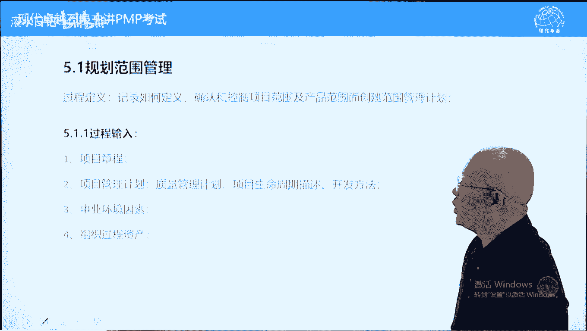

这个过程呢它还比较简单啊，它是制定一个计划。

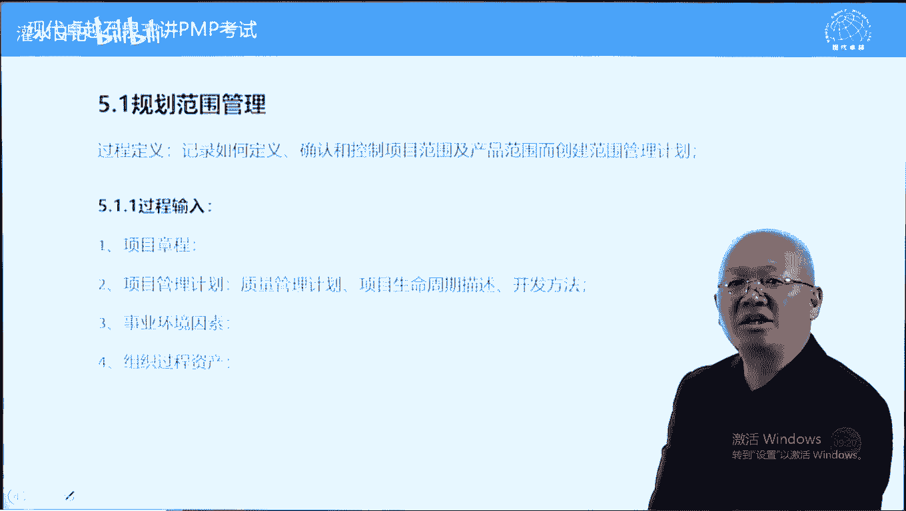

程序性计划，什么计划呢，叫范围管理计划，制定范围管理计划的过程。

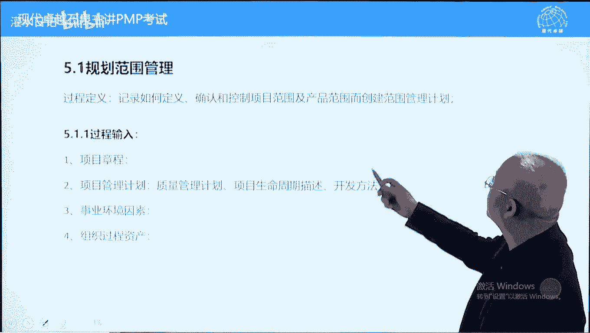

这个计划是一个程序性计划，他指导第五章的所有工作，包括收集需求，包括定义范围，包括创建w bs，包括确认范围和最后一个过程叫控制范围。

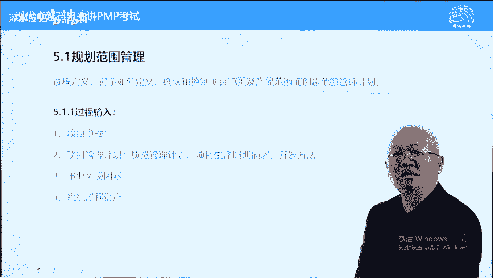

他都知道这个呢是一个直接的指导计划，但是呢这是一个程序性计划。

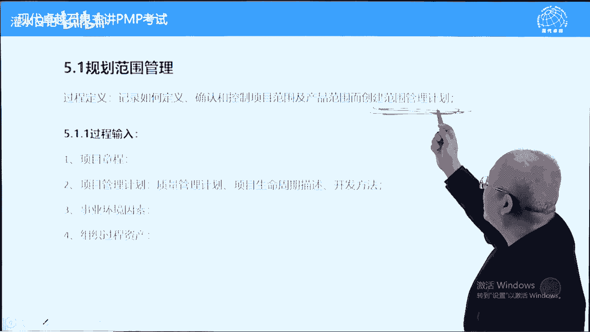

程序性计划告诉我们怎么做，不告诉我们做什么。

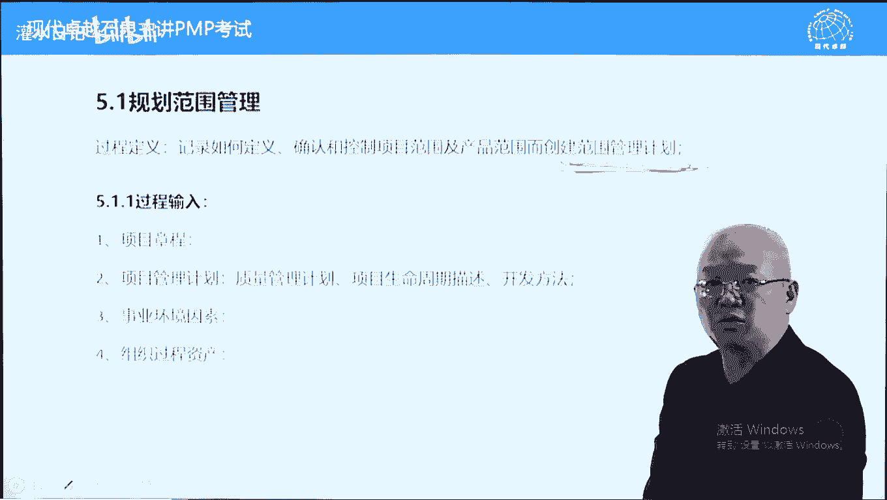

做什么会变怎么做，一般是不变的，好过程的输入工具输出，我们大概看一下比较简单章程，由于呢这个过程比较早，因为我们说需求或范围是规划的基础，有了范围之后，进度成本规划才能开始。

所以呢规划范围管理又是管理范围的一个基础，所以呢它比较早是早期的规划工作，在此之前只有一个项目章程，那就说为什么会有项目管理计划好，这就是我们刚才说的项目管理计划两层含义，第一层含义它是一个壳空壳。

库克里面包括什么内容呢，两个内容我们需要制定哪些计划，并且这些计划怎么制定，他指导我们就是如何制定范围管理计划，范围管理计划呢在这里面列出了，所以要制定。

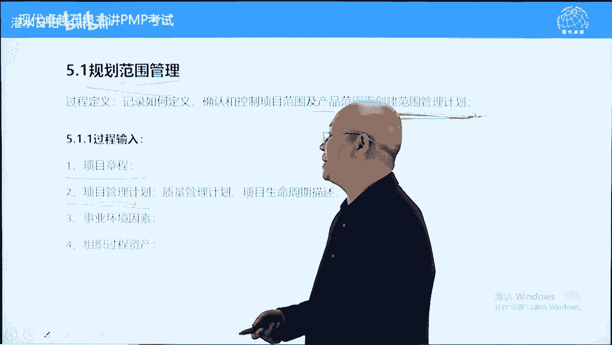

这是个输入，另外呢这里面告诉我们如何制定了好它呢，不是一步到位的，它是滚动式的，有人说，那这里面为什么会有质量管理计划，我们理解为滚动式规划。

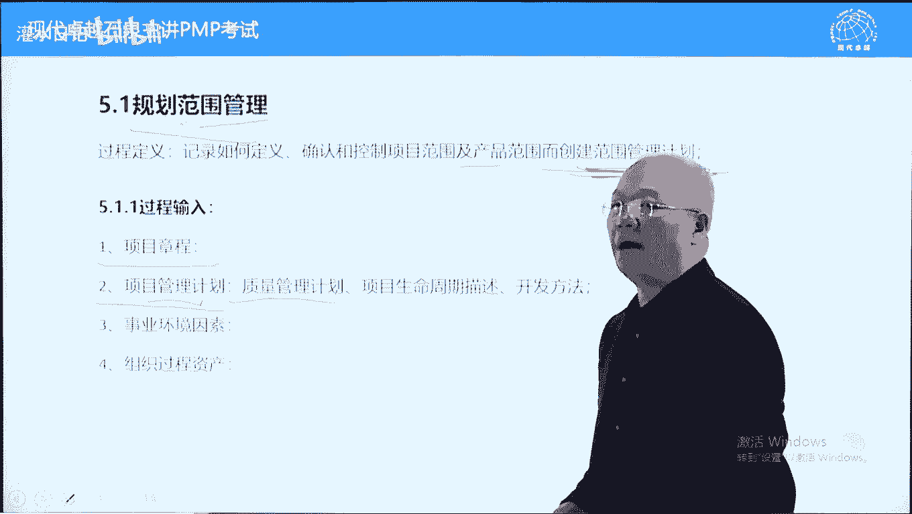

滚动式规划就是我们最大管理计划，做完之后可能会重新影响方案，管理计划，质量包含在范围之中，这两个的话呢就像皮跟毛的关系，世界环境因素，组织和生产到什么山唱什么歌，我们要考虑外部的环境。

另外一个呢要考虑我们能利用的东西，尽量利用，这个就不多说了，老生常谈，看一下工具，工具呢专家判断就是根据直觉，有经验的人，根据直觉啊，数据分析这个内容呢没有展开啊，大家呢大概稍微看一下。

包括收集收集数据的一些一些大概的工具啊，这工具的话呢重要性不是很大，因为呢5。1它本身来说的话呢，输出相对重要一些，但是呢在第五章来说，5。1呃，有没有都可以的，因为以前的计划里面。

以前的这个版本里面都说可以简单，可以复杂，可以有可以没有严格一些，应该来说是有的数据收集技术和数据分析。

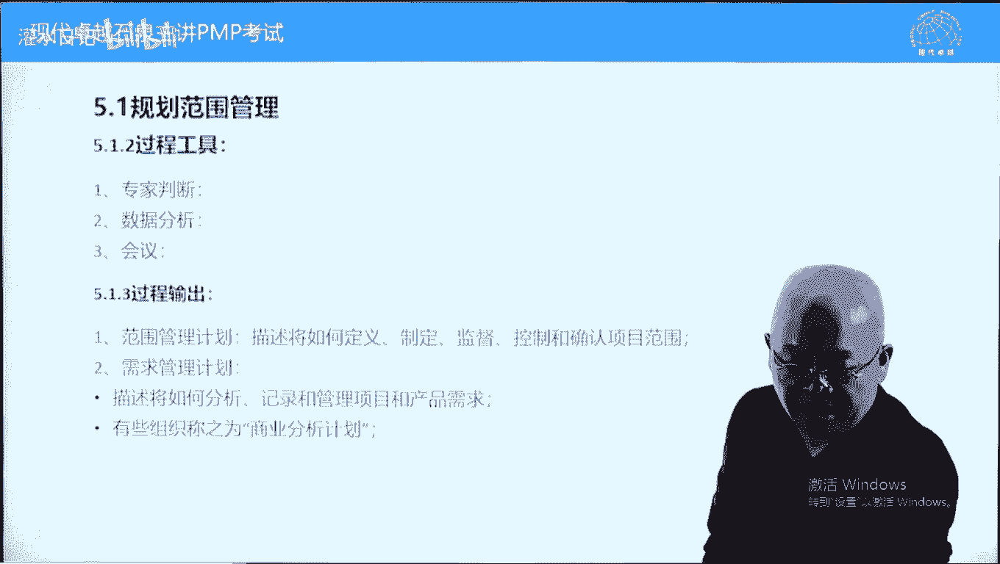

这里面的话呢没有没有展开来啊，没有展开来。

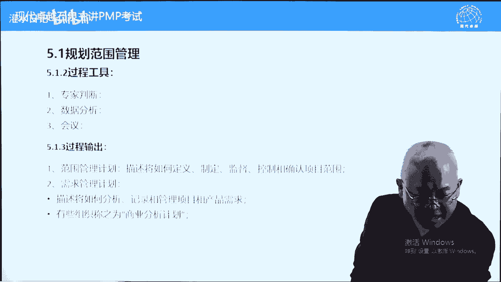

我们也不用管那么多了啊，这个内容呢我们数据分析，真的我们这边没有写原因，书上也没有啊，啊我们可以忽略它，会议倒是说一下，就是我们所有的规划都强调有会议制工具。

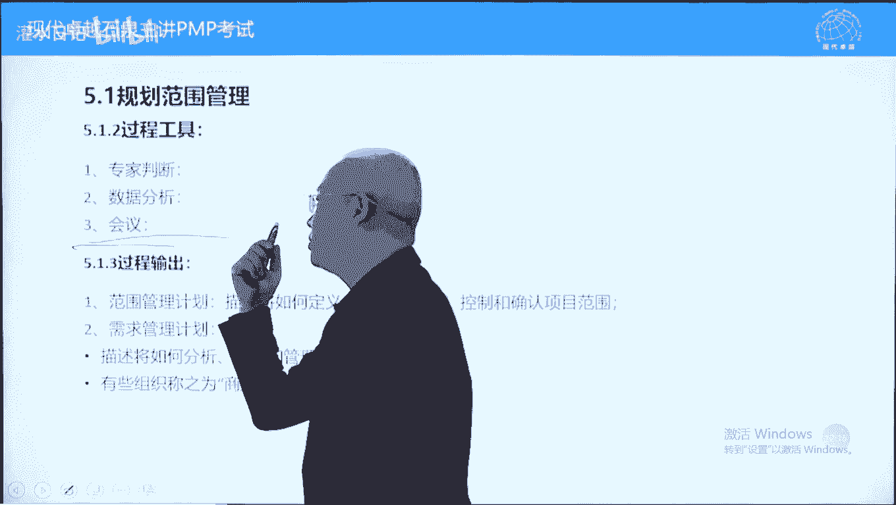

什么意思呢，他强调的是让团队时间参与，参与规划有两个好处，第一个呢贡献团队学的技能，让团队成员呢能贡献技能，计划做的更好一些，另外一个呢提高团队成员的承诺，因为他制定的计划，自己制定的计划呢。

责任感要强很多了。

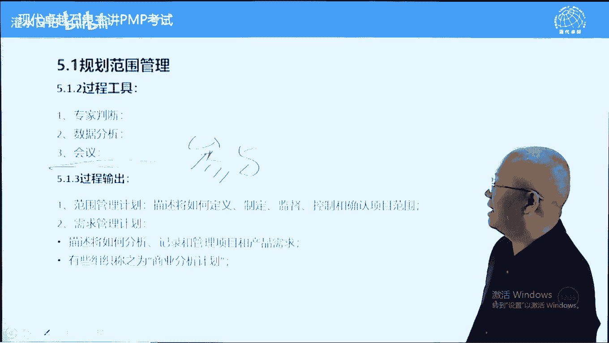

看一下输出，主要输出就这个叫范围管理计划，指导后续的所有范围管理工作，需求管理计划是一个补充，也是千年老二，即使在收集需求过程中，需求管理计划也排在范围管理计划之后，在考试中几乎可以忽略这个内容呢。

考试中到目前为止基本上没有考过之前第四版，第五版里面还有内容，需求管理计划呢，确定阶段怎么怎么划分，但是呢现在没有了阶段怎么划分。

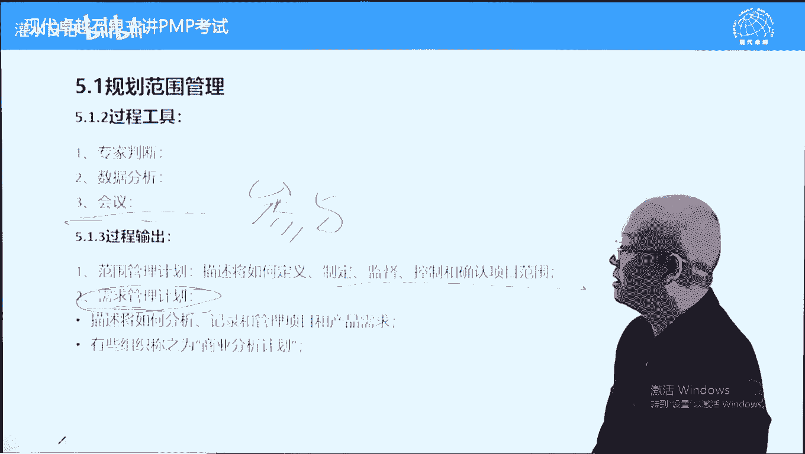

直接记录在项目管理计划里面，跟需求管理计划关系不是很大，也叫商业分析计划，这个在有个考试啊，叫p p a，这里面呢可能强调一些，但是呢这属于项目早期的跟项目管理呢，它的关系没有那么紧密。

这个内容呢点到为止啊，需求管理计划在考试中一般我们不要选的，主要根据范围管理计划就可以了，下面呢我们看一下第二个过程叫收集需求，前面讲过什么叫需求，客户相关方心中的愿景，他心中的效果图叫需求。

这个需求呢是实现客户满意，我们必须要了解的，否则的话呢无法实现客户满意的好，因此呢要向相关方收集需求，来了解他心中的效果图，根据需求再制定解决方案，再确定范围，这样一个意思啊，好我们看一下。

了解并记录相关方需求的这样一个过程，这个需求的话呢作用比较大一些，它能促进项目成功，另外一个呢它是工作分解结构的基础，也是后续的一个基础，这个说法呢有点远，或者说呢绕弯子绕的比较大一些。

我们先说根据需求，我们创建什么呢，范围说明书，根据范围说明书，我们创建什么呢，wb，wabs有了之后，我们再规划进度和成本，没有w bs，这是细化的原则，没有细化的东西。

我们制定不了准确的进度和成本计划，后面呢包括范围，包括采购，当然都要都以这个发文说明书，发文比较方为基准嘛，不叫发文说明，发文基准为主方案，记者呢包括范围说明书，w b s以及wb s点这样一个意思啊。

这个这句话呢绕的比较远，可以忽略它的好，另外一个概念叫需求陷阱，指的是我们在向相关方收集需求的时候，可能会由于专业不对等专业不一样，我们的误解客户的需求是什么，那什么叫需求陷阱呢。

我们说一下客户或相关方跟你说的需求，你再问他，你需要什么，你要解决什么问题的时候呢，它的需求分为四个层次，分别叫什么呢，must，must重新写一下，m u s t must need。

could will not，will not 4个层次，这两个是必须要实现的，这两个不需要实现，可可有可不有的，可有可无的，都不要去实现啊，但是呢我们在收集需求的时候，由于双方的专业不对等。

客户呢讲的更多的东西是，这两个东西显得比较高大上，显得自己比较有水平，比如说我要去翻一辆汽车独一无二的汽车啊，我们呢找这个专业的团队来帮我研发，我要什么样的功能，我会强调无人驾驶呃。

我会强调叫防碰撞之类的很高精尖的东西，这些呢反而是可以有可以没有的，而汽车有四个轮子，有驾驶台，有方向盘这些的话呢，我反而可能会忽略，我觉得说这个东西呢垃圾拉低彼此的智商了啊。

但是呢如果专业不对等的话呢，这两个内容的话呢，可能而不是这两个must和need，就是比如说要四个轮子，要有驾驶台，要有座位，要有方向盘，反而会不说，如果对方专业比较差的话呢，可能这方面就出现问题了。

汽车不会这样一个情况，但是呢有些行业会出现这种情况的，专业不对等，比如说我们给银行，银行开发软件，给一个学校开发软件，互互相的信息不对等，我们了解到的可能都是could will not。

而must need，我们忽略了这个呢会出现虚缺陷阱，所以呢收集需求有很多工具来防止稀缺陷阱，包括一个圆形法，能降低彼此双方的一个专业程度，这样的话呢让我们很现实一些。

防止出现需求陷阱好关于需求这块呢很重要，我们要了解对方到底想要的是马，还想要的是快，这个呢是需要区分清楚的，否则的话呢我们的目标会出现问题，这里面呢讲一个概念，讲一个故，讲一个理论吧。

有一个质量大师叫朱兰，他呢竹兰啊，这个兰兰花的兰，他呢关于项目管理呢，他提出过他的一个观点，他认为项目就是要解决一个问题，而项目的成败取决于我们对于问题，定义的准确与否，他认为很多项目失败。

属于我们最初对这个问题定义是失败的，定义错了，导致呢项目失败了，怎么理解，讲个故事说一下互联网时代，一个说法叫内事不决，问老婆，外事不决，问百度，有一个it屌丝，没有老婆，他不知道怎么做。

他呢就在网上挂个帖子，他问蛋炒饭先放蛋还是先放饭，百度贴吧吧挂个帖子，短时间内有200多人，有100多人回答问题，跟他回答说先放蛋再放饭，这是正确的操作方法方法，这个网友呢埋怨其他人说。

你们100多个人给我回答问题，没有一个人告诉我要先放油，要先放油才可以的，别人不是问他问的，其实不是说先放蛋先放饭，他根本不知道怎么做，怎么做的问题没有定义清楚，会导致项目失败，所以呢收集需求很重要。

一定要知道我们要解决的问题到底是什么，到底是快还是马的问题，有些时候呢不是说表面上谈的那那个内容啊，会有虚区陷阱的好，下面呢我们看一下过程的输入工具和输出章程，里面有项目的目标。

这个目标的话呢也包括战略计划，防止我们跑偏的，我们要解决的问题到底是什么，这里面是有的，我们可以这样说，有个s w问题是什么，围绕这个问题，我们了解需求，也就是了解客户需求的愿景，当然了。

这里面有个项目管理计划，主要指的什么呢，范围管理计划指导我们如何收集需求，那输入呢他搞的是这个项目管理计划，这里面主要指的是范围管理计划好，其他文件有的都要考虑假设日志，这是对外的一个假设假设条件啊。

不是说对外的，就是我们在项目一开始的时候，在制定章程的时候，考虑到的一些知因素跟假设条件，经验教训，这个呢都很简单的啊，之前项目的经验教训啊，类似项目的一些数据之类的，我们都可以看一下。

重要的是这个要向相关方收集需求，要了解有哪些相关方，哪些重要，哪些不重要，我们呢根据相关方登记册来确定向谁收集需求，这个呢在输入中比较重要啊，商业认证是对项目章程的一个补充，这里面有个内容叫什么呢。

项目的边界，项目边界的话呢，能告诉我们我们项目范围应该包括哪些，不应该包括哪些，当然这个呢到5。3的时候我们才用到的协议，就是合同，合同里面条合同条款都应该遵守，不能违反的，后面两个老生常谈，不多说了。

下面呢我们继续再看，工具我们前面讲过，收集需求的主要难点就是容易出现叙事陷阱，所以呢我们通过工具，大量的专业工具来防止这个情况，因此的话呢5。2的重点就是工具，整个第五章也是以5。2的工具为最。

重要的部分，专家班怎么说了，我们下面看一下头脑风暴，头脑风暴呢就是通过团队人员开会，集思广益那个意识，前面写错了，集思广义是这个意啊，找非常好，后来告诉我了，好，集思广义来去收集客户的需求到底是什么。

有些时候呢他可能说不出来，说不出来的话呢，我们帮他想一下，想完之后呢让他再确认一下，访谈前面讲过强调一对一的焦点，小组的话呢，强调主持人好讲义空间问卷调查，问卷调查的话呢，它有三个特点。

考试中呢一般也会考的哪三个特点，写一下受众多，受众这个种子啊，受众多，另外一个呢叫快速，还有一个呢叫统计，有统计结果，有统计结果，或者是利用统计方法，这个呢是问题等差三个特点，最重要的受众多啊。

比如说一个企业要要开发一个，或者要要开展一个设置门禁系统，设置门禁的这个企业呢有上万员工都要通过门，都要使用门禁，这个呢要调查他们的需求的话呢，人太多的时候必须用文件调查好，这个呢是问卷调查。

我们还有实际例子，比如说你如果用支付宝，支付宝上的这个功能，你可以帮助你这个领积分的，就是每天一点钟之前，你可以判断一下，选一下，猜一下今天股票上涨还是下跌，你可再选一下分数啊，如果选对了。

如果你猜对了，就可以得到一个叫支付宝的积分的，然后呢它也显示现在有多少人，50%的人，还有60的人猜猜的是涨啊，多少人呢猜的是跌到三点03：15之后，它会显示，然后呢你能够看能得多少分的，能不能得分。

还是猜错了，这个呢就是一个问卷调查，受众多啊，这是最主要的特点，好另外一个内容呢叫标杆对照，标杆对照啊，什么叫标杆对照指的是借鉴参考，借鉴参考，可以是别的公司的，可以是别的行业的，别人这方面做得好。

我们可以借鉴一下，可以去参考一下，吉利汽车老板在刚开始设计汽汽车的时候呢，大量接近日本，称出现侵犯人专利了，改一下侵犯专利了，改一下，最后呢全变成自己专利了，首先来说它是参照啊。

那这个参照参照对标杆对照的话呢，也可以用另外一个词来去深刻的解释一下，我们理解为什么呢，山寨但前提条件不能侵犯别人的知识产权，山寨这个债吧，这个债底下是个墓啊，山寨一下，我借鉴一下标杆对照。

包括我们建立绩效考核标准的时候，也可以借鉴别的行业的别的公司的这个标准，我们呢建立起来自己没有的，借鉴一下别人，更好的，我们可以借鉴一下啊，数据分析这个数据分析的主要文件分析，分析一些什么的行业数据库。

行业里面的积累的一些东西，包括呢呃组织过程，资产里面积累的东西就不多说了，决策前面也讲过，投票一致同意，有大多数原则，相对多数原则，根据自己的想法来去做决策的，多标准决策分析，我们刚才讲过了。

就是评分法有非加权评分，有加权评分，好数据表现，说一下这个内容呢，呃还是比较重要的，数据表现技术有两个，一个叫清河图，一个叫思维导图，什么叫数据表现，就是可视化工具，可视化的一切可视化的表格图表。

都叫数据表现技术，它能画成图，很直观很形象的，清河图也叫关系图，它显示什么呢，亲属关系有没有直接联系的，它是一种分类工具，分组分类工具啊，分组分类的目的，以便进一步的叫审查和评估，用于什么呢。

用于头脑风暴结果，对头脑风暴结果进行分类分组，然后呢，同一组的我们一起来分析，能提高效率的思维导图，它是一种发散思维，它是一种创新技术，好它呢也用于头脑风暴，结果他对通网通道通往的结果。

可以进一步的发散思维，进行一个创新思维，他呢本质本质上来说也能够分组的，但是呢它更多强调的是创新创新啊，我们呢就是脑洞再开大一些，再往深入想一些，这个工具呢在快速记忆中用的比较多。

比如说整个呃一个国家的地理，一个一个国家的地理的话呢，可以用思维导图写一下整个物理这本书学科，物理学科也可以用思维导图来去画一下，化学也一样，包括哲学也可以用思维导图画一下。

也有人呢把这个pmbok的49个过程，用思维导图画一下，便于理解，便于记录，记记忆的，他找什么呢，找内在联系的，这个呢是直观的联系，这个是内在联系，都能够分组，然后呢它更多强调的是创新好。

另外呢人际关系跟团队技能也说一下，民意组写一下，说一下叫投票排序，也叫民意小组投票排序，也叫吴继明投票，中国翻译成无名无记名投票更多一些，英文叫nominal technique，不写名字的。

也叫无记名投票，投票排序排序啊，它是一种投票排序工具，这种投票排序呢是主观的排序，这个序啊，秩序的序，投票排序工具，另外一个排序工具我们会提到的叫什么呢，帕累托也叫二八法则，在这两中大量使用了。

说一下区别，帕雷托也排序，民意组也排序，民意组他强调投票排序，它跟帕里托排序呢不一样，帕里托呢是对缺陷的排序好，它是客观的，它是主观的，比如说给一个班的，给一个公司的女生颜值排序，用名义组。

用帕雷托呢应该用名义组，为什么呢，这是主观概念，到底谁漂亮，没有一个单一标准，而如果给女生的身高排序用什么呢，用帕雷托为什么呢，身高是客观的，它不是主观概念，这个呢是民意组跟帕雷托的一个区别，注意一下。

那观察与交谈，项目里的话呢，通过观察交谈，或者说呢随时的很随意的非正式沟通，来了解项目情况或了解需求的，可以收集需求，这个内容呢比较呃偏一些，不用管它了，引导技术要说一下，这是一个非常重要的技术呃。

在现实中很很管用，而且的话呢考试中经常考考的内容比较多，这个引导技术呢也叫引导式研讨，会写详细一些啊，引导师研讨会，它有三个特点，先说一下特点啊，哪三个特点呢，跨部门意见不一致。

跨部门也可以叫跨专业意见不一致啊，跨部门不同意见，写一下跨部门不同意见，第二个特点呢快速也是一道快速啊，跟那个跟那个交问卷调差不多的，最后一个呢达成一致，这个可以这样说，它没有关系啊。

出现跨部门意见不一致的时候，用引导式技术能快速达成一致意见，三个特点要记住，要注意一下好，那引导这些导会它是什么一种方式呢，简单说一下，比如说某一个公司有一个问题，这个问题呢需要解决。

而这个问题呢跟abcd 4个部门都有关系，我们解决方法传统一些的话呢，可以这样解决，先找a部门解决跟他们有关的问题，再找b部门解决跟他们相关的问题，但是呢这种方法有问题，有有个缺陷。

我们解决完a部分问题之后，当跟b部门解决问题的时候，会重新给a部门带来新的新的问题，这叫什么呢，这叫按下葫芦起了瓢，cd更是这样的，那这样的话呢解决问题的效率就比较低，不能快速解决了。

那怎么解决效率高呢，我们把a b c d4 部门的人喊在一起，现场开会解决，这叫现场会，现场会啊，也叫现场拍板会，在pm中叫引导式研讨会，引导式研讨会，他能呢能够呢快速达成一致，为什么呢。

都在所有问题都能现场提出来，然后呢找到一个都能够满意的方案，这叫跨部门意见不一致的时候，通过引导时间长会能快速达成一致意见，好这种这种技术呢用于收集需求，需求意见不一致的时候。

对于范围的目标意见不一致的时候，对于项目管理计划，项目章程意见不一的时候，意见不一致的时候，都可以用引导人员党会来快速达成一致意见，这里面呢他举了三个例子，我们也简单说一下，jd叫联合应用开发。

也只到项目现场帮客户解决问题，比如说想吃什么东西，直接把厨师喊过来，想吃什么做什么，想吃什么做什么，现场解决问题啊，也叫现场会，q f d呢叫质量功能展开，指的是一个产品，他是有多种质量要求。

不同部门呢对质量要求不一样，财务部门希望成本低一些，市场部门呢希望工艺简单一些，那市场部销售部认为要要要功能全面一些，这些的话呢可能相互矛盾，意见不一致，我们现场来开会，现场解决达到一个平衡。

积木水火度达到一个平衡啊，这样一个意思好，另外一个呢叫用户故事，它用于什么呢，敏捷敏捷对于功能对于需求都叫什么呢，用户故事目的是什么，确保每一个功能都是有价值的，都是有意义的，都能帮客户解决问题。

这叫用户故事，就是我们项目范围中任何一个需求功能，它都有价值有意义，这样才做通过用户故事，这个用户能带来什么好处，能解决这种问题来确定这个需求是有必要的，是需要做的，我们呢举两个用户故事的例子。

其实也很简单，比如说古代的时候，打仗呢都用有一种有种工具叫枪，冷兵器时代的枪的话呢，就是那种红缨枪，标枪标枪，红缨枪一般要加个什么呢，加个因子，而且这个音字呢一般用红色来染一下，这个音质完全为了好看吗。

不是的，它有实战作用，因为呢在古代战场，你拿枪扎别人的时候会出血啊，这个血的话呢有可能顺着枪杆流到你手上，血很黏的，很滑的，你就抓不住枪了，而有了红缨之后的话呢，这个血会顺着因子流下来。

它不会顺着枪杆再流下来了，它呢是一个能排水的一个作用啊，这样的话呢防止这个血流到枪杆上，它有实战作用的，所以呢枪都有英子，这个呢叫红缨枪，这是什么呢，用户不是为什么要加个因子红龙枪。

那这个呢是为了就像那个血槽排血一样的好，再讲个故事，比如说汽车啊，10年前出现过问题，叫什么呢，丰呃叫丰田汽车，在美国也有很多用户的话呢，出现什么呢，刹车失灵导致车毁人亡。

好当时呢这个事情闹得很闹得很很厉害，而且丰田汽车在美国赔了很多钱，好这里面呢就存在一个概念，什么概念呢，叫刹车优先系统，刹车优先系统啊啊这个车子重新写一下，刹车优先系统就是很专业的概念了。

优先系统什么意思，丰田汽车在当时没有装这个系统，这个系统呢是个软件，它呢有专利，当时一辆车需要交48美元，来去买这个专利的48美元，丰田汽车呢就没有装，日系汽车，大部分都没有装刹车运行优先系统。

但是丰田出事了，其他车没有出事，跟设计有关系啊，什么意思，就是丰田汽车它有有一款车也记不得什么了，大概有多款车，多款车吧，同一个系统呢，它就是刹车这块，在冬天踩死的时候有可能被卡死，那不叫油门啊。

油门在冬天的时候踩到底的时候有可能被卡死，冬天很冷的地方有可能出现这种情况，其他车呢可能没有这种问题吧，你踩刹车没有用，而刹车优先系统的作用就是它是个软件啊，刹车优先，油门不优先，那丰田在这个问题上呢。

他可能想当然了，他认为那不可能同时踩油门踩刹车的，所以他也没有考虑，他说这个东西48美元根本没有必要，谁会同时踩刹车踩油门呢，但是呢他没有考虑到他设计这块，他设计的某款车在冬天的时候，天很冷的时候呢。

北方地区东东北地区吧，很冷的地方，刹车油门踩踩到底的时候有可能被卡住，油门一旦卡住的话呢，踩刹车不管用，所以呢车就是什么呢，一直往前冲，直到碰到障碍物，我直到油烧完它才能停下来，导致了很多情况。

社社毁人亡，就是根本没有刹车痕迹，高速撞向一个障碍物，最后呢车毁人亡了，后来发现呢就是刹车优先系统它没有装，后来呢都装了，因为这个事情呢是啊就被索赔很多，美国呢呃呃可能人命比较贵一些，索赔了很多。

这叫什么呢，这叫用户故事，我们必须要讲一下这个需求，它能有它有什么功能，它有什么好处，来确定我们需要做这个事情来确定需求，这个是这样一个意思啊，好系统交互图指的是需求是多方面的。

有很多需求的话呢是相互有影响，相互制约的，比如飞机战斗机的话呢，希望快一些，又希望呢装甲就是防护能力要强一些，那这个呢就是个矛盾，如何达到一个平衡，系统交互图的话呢，我们这样说，就是金木水火土。

人的五行也是一样的，金木水火土五行，这个金木水火土是相生相克，相爱相杀的，对于这个系统我们希望达到一个平衡，哪个多了也不好，哪个少了也不好，另外一个呢它们之间是互相作用的，金金生水，金呢金有科目。

而土呢土又生金，没有一个因素呢是孤立的，我们呢要研究它们之间怎么样相互作用，最终目的是希望让这个系统呢达到一个平衡，平衡之后呢，它是稳定的，是可持续的，这个呢叫系统交互图，理解为任何一个产品。

它的组成部分或者一个系统，它的需求的话呢，都是相互影响的，我们呢要看一看他们怎么样相互影响，我们利用影响关系来达到一个平衡好，第八个叫圆形法，这个呢第七个没有考过，第八个叫圆心法，圆形法指的什么呢。

制定原型，让需求的收集更加简单一些，它能降低双方对双方的专业要求好，举个例子，以前的皇帝太后都需要修陵墓，而这个陵墓修的是否符合太后或皇帝的需求呢，啊皇帝和太后他不懂建筑学，以前的话呢也没有建筑图纸。

那怎么样达到他们的满意呢，好在明清两代，故宫里面有一个家族专门负责一件事情，这个家族呢姓雷叫什么呢，叫样式雷，他们专门来做设计啊，那皇帝和太后的陵墓的话呢，不光有地下建筑，还有地上建筑都很复杂的。

地下建筑也很很复杂，地上建筑也很复杂，怎么样的设计能让太后皇帝满意呢，样式雷专门负责做什么呢，做纸样用硬字硬纸板做，可以拆卸的模型，供电的模型，包括这个铃木的模型，然后呢可以拆卸的。

做完之后让太后皇帝看是不是这个样子，是不是这个意思，不满意的修，直到满意为主，所以呢这叫原形法，原性化符合渐进明细理念，项目管理有个特点叫渐进明细啊，原心法就符合渐进明细理念，第一版，第二版，第三版。

直到满意为主啊，渐进明细好，还有一个例子就是，公安机关根据目击证人的描述，给嫌疑人画像，它也符合原型法，原型法制定原型，让当事人看它有个好处，能降低对双方的一个专业要求，另外一个呢防止出现需求呃。

就是收集需求出现问题，出现需求陷阱，好，知道就可以了，好另外我们再看，不好意思啊，我们再看过程的输出，主要是这个叫需求文件，它反映显示所有需求，就什么呢，效果图，客户心中的效果图。

我们呢满足了能拿到满意，不满足的话呢达不到满意，我们制定发文说明书，制定解决方案，要根据需求文件，另外一个呢需求我们说分层次的项目里呢，需要管理需求，怎么样管理需求呢，有些需求需要实现。

有些需求不需要实现好，需要实际的需求必须都写下来，取下来之后呢，怎么样确保这些需求在最终项目完成的时候，得以实现呢，有一个跟踪工具叫需求跟踪矩阵，他把所有需要实现的需求列出来，1234列出来。

列出来之后呢啊收集需求定义范围，然后呢创建w p s定义活动之类的，一步一步这个需求会变成什么，会变成什么，一步一步地进行跟踪记录，以确保最初的每个需求，最终都变成了可交付成果，反过来说。

也确保最终的每个可交付成果都是有原因的，它原因是什么呢，对应了某个需求什么概念，all and only，全部和紧紧啊，这个呢是需求跟踪矩阵，它有两个好处，第一个好处呢防止遗忘。

这个需求呢最终后来没有实现，通过需求跟踪矩阵能防止需求被遗忘了，没有湿性可消防沉波，另外一个呢防止需求不跑偏，这个需求也写上去了，但是呢在执行过程中哎跑偏了，跑偏之后呢，导致结果呢跟需求不对应。

通过需求根的理论也能够防止这个问题，考试中呢这个目前呢考的比较多一些啊，这个呢说一下每个需求有商业价值，就是需要实现的需求要记录下来，另外一个呢每个需求呢最终得到交付，还有一个呢就是每个课交付成果。

都是有一个对应的一个需求啊，这个呢是管理变更提供了框架，出现争议的时候，或者说呢结果呢不对，我们呢可以查看需求跟踪矩阵，可能是这方面出问题了，这个内容呢目前比较多一些，注意它的作用，第一条的作用。

另外一个呢它再细再细化一些，每个需求在结果中变成可加复成果，反过来说，每个可加班成果都是源于最初的某一个需求，作用，两条了，第一条呢防止遗忘，另外一条呢防止跑偏，跑偏呢就是不知不觉中。

这个需求呢变成别的东西了，没忘记初心了，通过它能实现的好，5。35。2，我们讲到这儿，下面呢我们进入5。3定义范围，地域范围是什么呢，我们前面讲过了，sow项目需要解决的问题，需求我们叫愿景，愿景啊。

也就是客户心中的效果图，我们叫需求了，这些需求是需要实现的，怎么实现转化为解决方案，解决方案叫什么呢，叫范围说明书，第一范围就是把需求变成最终解决方案的过程，条条道路通罗马，找一条最合适的。

找一个最好的解决方案，我们看一下强调呢制定项目和产品的详细描述，什么意思，先把需求变成解决方案，而解决方案呢我们可以把它交流产品，通过产品的形式来去解决啊，比如租房子，买房子都是具体解决方案。

好把产品呢用可交付成果详细描述一下，就是把需求变成产品，并且呢用可交付成果解决方案把它形象化，把它显示出来，这个呢是定义范围的过程，确定解决方案，并且呢把解决方案描述一下，用可交付成果描述好。

我们看一下选择最终的项目需求，前面应该有了需求跟踪矩阵，已经记住了，另外一个呢编程解决方案来去确定，还有一个呢需要反复开展定义范围，什么意思呢，可能会有一些变更，当然了，敏捷开发就利敏捷。

项目呢就就另外另另当别论了啊，这个呢定义范围它也是个渐进明细的过程，它有可能需要滚子式规划好，另外呢最后一条讲的什么呢，讲的是这个叫迭代型生命周期敏捷开发，他每个阶段要去确定详细范围。

先把总动范围确定完之后，这个总成范围可以随时变的，每个迭代再确定这个迭代要做什么范围，就是在敏捷开发中，范围和进度是连在一起的，每个迭代周期进度干线确定范围不说了，我们看一下过程的输入工具和输出。

主要输入什么呢，需求文件，这个是核心输入啊，而这里面呢主要是项目管理计划了，项目章程也是最对比的依据，最核心的是需求文件，把需求文件转化为具体产品的过程，具体解决方案的过程，下面呢看一下工具。

工具呢有个对备选方案分析，条条道路通罗马，解决方案很多，我们哪个方案更好一些，这里面呢我们举一个例子啊，比如说呃一个大楼办公大楼人气很旺，很高吧，电梯呢不够用，每天到早晨的时候都会出现问题。

排队冬天的还好一些，夏天排队的时候呢，人很焦躁，另外呢有人可能因为迟到几分钟要被扣钱，他会呢情绪更加激动，可能在排队的时候呢，破坏破坏公物，比如说把这个绿植拽掉，或者往墙上踹一脚，吐口痰之类。

吐口痰之类的，对物业进行破坏，这是一个问题需要解决，而解决这个问题的话呢，有多种渠道，比如说增加电梯数量难度比较大了，那还有什么呢，搞单双号停也能提高效率，搞高层低层停也能提高效率。

那除此之外呢还有方案，比如说在大厅中多装几面镜子，镜子装多之后呢，能够降低人的叫叫叫叫焦躁情绪，为什么呢，两个原因，第一个呢当自己很焦躁，表现不好的时候，如果自己能看见他会克制一下的。

自己都觉得自己很难看啊，这种情况形象不好，看不到的话呢，他可能无所谓，能够降低焦躁情绪了，另外一个呢人在照镜子的过程中，是一种自我欣赏，自我的美的欣赏，他会觉得时间过得快了，不知不觉中时间就快了。

他焦躁情绪呢也能降低，这也叫被选方案，都能解决问题的条条道路通罗马，决策拍板，到底选哪一种解决方案，人际关系和团队技能，包括意见不一致的时候，召开引导领导会，包括开会的时候，我们呢怎么样呢。

能提高效率好，第五条工具叫产品分析，产品分析想干什么呢，就是我们解决方案选定之后，然后呢怎么样把解决方案优化的过程，每个解决方案都是个产品啊，我们选择其中一个解决方案，就是确定产品确定完之后。

进一步的提高产品的性价比，好产品分解，我们看一下产品有哪些组成部分，深入了解一下需求，分析它对应的需求能解决什么需求，系统分析，系统工程指的是，如何让这个产品的系统达到一个平衡稳定。

就像人的五行金木水火土，能不能达到一个平衡稳定这个过程啊，价值分析，价值工程就是提高性价比，怎么样提高性价比，解释一下如何在功能不变的情况下降低成本，反过来说如何在成本不变的情况下提升功能。

价值工程更多针对新产品的研发价值分析，更多针对老产品的升级换代，知道就可以了，另外呢我们要强调一下，知道定义范围，工具中有一个产品分析，要把解决方案确定一下，解决方案就是具体产品。

并且呢让这个产品它达到一个最优化好过程，输出范围说明书，我们的确定好解决方案变成产品之后，要把这个产品呢变成什么呢，详细的叫可交付成果的一个描述，这这个句话详细描述和交付成果。

就是这个产品有哪些组成部分，然后呢我们详细描述一下，组成部分叫可交付成果，比如说结婚这个项目有哪些可交付成果呢，有结婚证，婚纱照，装修好的婚房，花车游行的录像带，那这个呢是结婚的。

比较传统婚礼的一个可交付成果，要详细描述一下，描述一下这个解决方案到底是什么，答案，不同解决方案可交付成果可能不同，比如说你在巴厘岛搞一个海岛式婚礼，海边婚礼，跟在这个叫迪拜搞一个水晶公式的婚礼。

他的可交付成果稍有不同，我们用可交付成果来描述，项目解决的方案是什么，方案范围，说明书呢有四要素，产品范围描述就是我们用什么解决方案，选择什么解决方案，这个产品结果是什么，是呃叫迪拜式的婚礼。

还是巴厘岛式的婚礼，可交付成果具体交付有哪些验收标准，针对可期复成果的，这些可期复成果要达到什么标准，比如说我需要一个浪漫的婚礼，什么叫浪漫，婚礼仪式，现场上80%的人流眼泪了，叫浪漫，或者说上头条了。

在头条待了两天都转发了，那这个叫浪漫，这个呢叫验收标准，验收标准越客观越好，最好是量化的，否则呢验收的时候会出现扯皮好，另外呢叫除外责任，什么叫除外责任，项目中不包括的内容啊。

这个呢是西方的一种哲学里概念了，通过否定来进一步的肯定，这样的话呢范围更加清楚一些，比如说精装修的房子，不同公司精装修标准是不一样的，精装修你要写出包括什么，不包括什么，比如说空调包括不包括啊。

电热水器一般都是包括的，那是窗帘，包括不包括这个呢要写清楚，否则的话呢也会引起扯皮的，除外责任呢在范围说明书中很重要，因为呢我们范围将来要验验收，为了防止有误解，我们呢要除外责任。

其次的话呢其实还是细分一些描述，描述的详细一些的话呢，也能防止出现扯皮的情况啊，这个呢是访问说明书有四要素，它的特点呢是描述了可交付成果，那作用呢有两个作用，第一个各方共识，因此呢当可交付成果出现。

双方呢出现扯皮的时候，有可笑不出口，形成之后，有人说对，有人说不对，查看什么呢，查看范围说明书，看到底是谁错了，是我们做错了，还是你的要求不对，另外一个呢就这句话了。

判断变更和外工作是否超出边界提供基准，它是一个对比的依据，因为呢它是各方共识，因此的话呢当结果有扯皮的时候，有分歧的时候呢，可以查看它，它是各方的一个共识，因此的话呢他也需要各方签字确认才可以的。

文件更新不多说了，发个说明书，它的组成部分以及这两条作用很关键，是需要记住的好，关于5。3定义范围呢。

