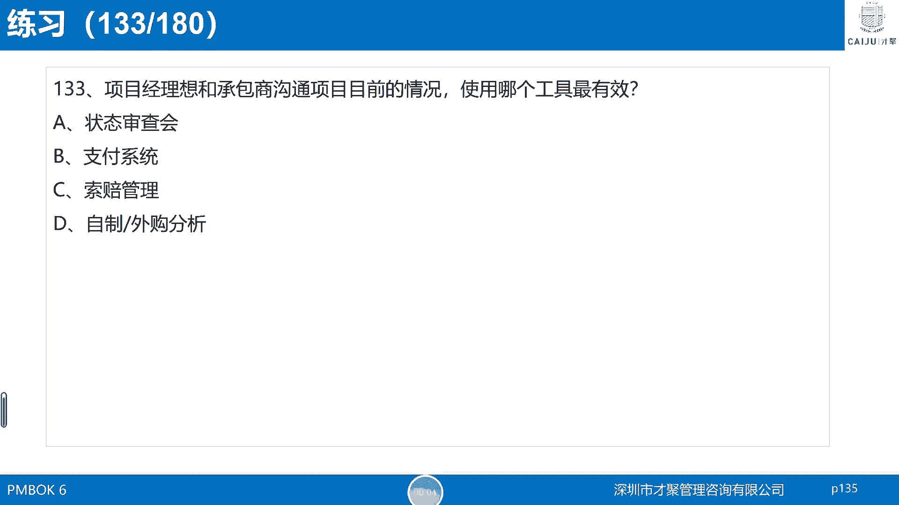
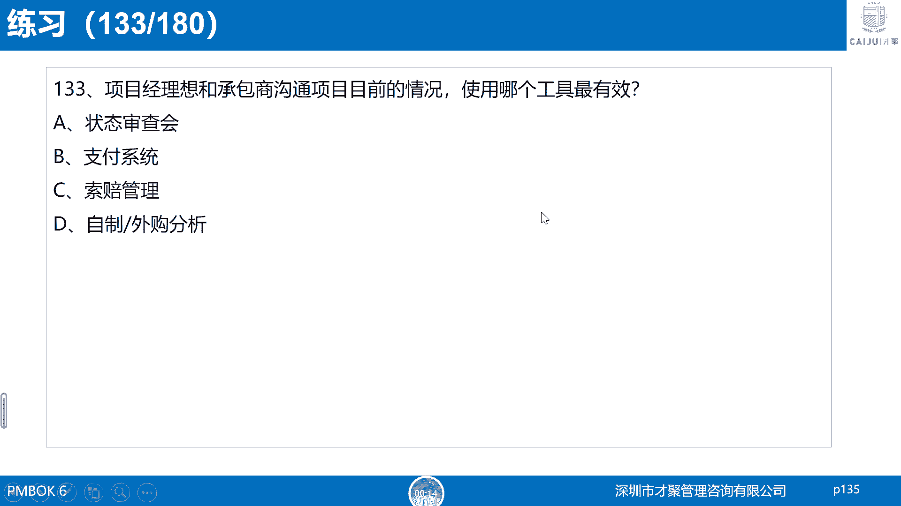
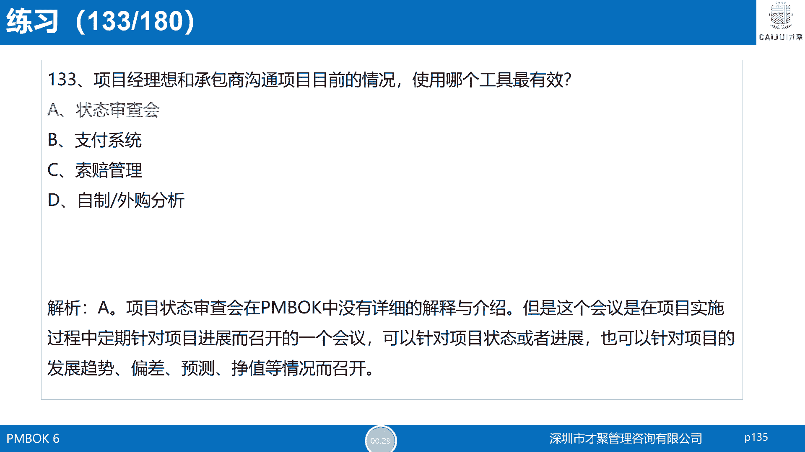
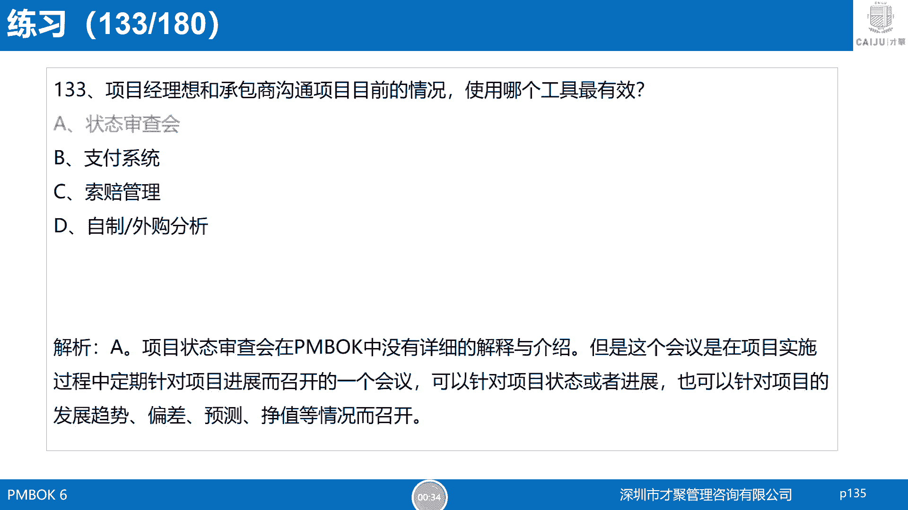

# PMP考试精选模拟题及解析第二套第133题 - P1 - 才聚PMP - BV1sb4y1u7Pd

第33题。

项目经理想和承包商沟通项目目前的情况。

使用哪个工具最为有效，A状态审查会，B支付系统，C索赔管理D自制外购分析，这道题的正确答案是A选项状态审查会。

状态审查会在PMBOK中没有详细的解释与介绍。

但是这个会议在项目实施过程中。

会定期的针对项目进展而召开，可以针对项目的状态或者是进展。

也可以针对项目的发展趋势，偏差。

