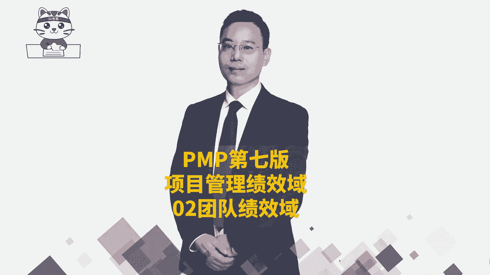
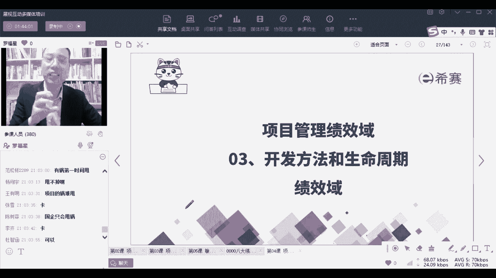

# PMP考试系统课程（第六版+第七版）项目管理资格认证考试，零基础一次上岸 - P75：PMP第七版8大绩效域之02团队绩效域-下 - 不爱哭的美少女 - BV1VcWDeUEt9

一定都要有人去指导你，你才会变得更快，关于这个指导，还有一个很有意思的，我不知道你们有没有看过最近的一条视频，就是一个餐厅客户点了餐以后，可能是那种有汤汤水水的餐，那他去送餐之前的话。

那个餐厅就会拿一个保鲜膜去把它盖住，对不对，然后那个小小哥哥拿了个保鲜膜盖住，那个师傅就说那你有没有去把它擦拭干净，然后那个那个师傅又重新演示了一遍，先拿一个纸巾把那个把那个盘子周围擦一遍。

然后再拿那个东西把它去盖住，盖住了以后再插了几个孔透气，然后再盖一个盖子，然后再又擦一遍，你一定要去指导他，哪怕是一种很小的事情，永远都有人不会，所以我们经常说的是，我说你听你说，我听我做。

你看你做我看，这样他才能真的学会你，如果说是在企业做管理的话，你会有一个词叫什么叫扶善马走一程，你要把他扶上马以后，带他一段时间，而不是说让他自己去驾着马往前去奔腾，他还没有开始学会骑马了。

可可能会摔死去，所以你你对他的指导是需要一些时间的，你要去指导他，指引他哎啊，这边还给了一些呃呃让他去更好的去成长好，这是这是你作为一个仆人式领导，你要干的事情啊，你要给大家分清楚角色和职责。

能够去分清楚这个项目目标，并且实时的去关注这种目标，对战少林，你说的很对，就是丰田他其实会就用到这种方式，丰田本身它就是一种成长型的组织，学习型的组织，这种学习型的组织就格外会关注这个点好。

接下来我们来说一个牛逼的一个环境，就是如果说你要真的是，让这个团队变得很牛逼的话，很多时候我们说一个好的土壤，它能够让坏人变成好人，而一个坏的土壤，它能够让好人变成坏人。

那你是否能够去营造一个好的土壤呢，你是否能够去营造一个好的氛围呢，你作为一个项目经理，你会给给大家营造一个营造一个什么氛围，虽然公司有公司的企业文化，公司会有一个大的环境和氛围。

但是你作为一个这个团队的领导者，你其实可以在小范围内，一定程度上去实现你的这种管理的理念和思想，像我自己说一下啊，我自己的管理理念是什么呢，就是我我比较懒，我不喜欢去管别人，我不喜欢管的很死。

所以我会跟每一个人都讲，我说我不会去在你的屁股后面追着你跑，我说呵呵，要么你就把它做得好呀，要么就滚蛋，当然我们不会说滚蛋这个词，但是其实就是说如果实在是不合适的话，我可能就我可能会放弃你。

我真的是这样的，我也就是我嗯也也有几个，也有几个不太听话，不太合适的人，我也确实把他放弃掉了，有这种情况，就你要么就做好，你，要么你要是实在不合适，我就会放弃掉你，我不会想着，但是你在我手下干活的时候。

我会护着你，我还是比较会护护护护着大家的这种方式，那你作为一个项目经理，你其实可以去营造一个好的环境，那你营造一个什么环境，你看形成一个维护一个安全的环境，安全的环境，一个尊重的环境，相互尊重的环境。

还有一个是没有偏见，什么叫没有偏见，就是让每一个人都觉得受重视，每一个人都能够受重视的这样一种环境，OK在这种环境下，大家就可以比较好的去行为处事，就能够去减少很多的麻烦啊，陆蒙你说的这种问题的话。

这个我解决不了啊，这个我解决不了这种这种顽疾性的东西的话，不是不是一个小小的项目经理，甚至说不是一个小小的一个，不是一个找一个什么职业经理人就能够解决的，因为里面有太多的利益的关系。

有很多很多利益的关系，当那种涉及到利益的时候，真的是有些东西你无解呃，一时半会儿是无解的，嗯所以不要那么着急，先我们先把自己能够，就是我们只能够去处理那些，我能够处理的环境和氛围。

有一些我处理不了的那个叫什么呢，叫事业环境因素，就是有一些叫组织过程资产，有一些叫叫事业环境因素，所以你要你还是要去能够去分辨，哪一些是你能够左右的，哪一些是你不能左右的。

你尽量能够去左右那些你能左右的部分，这样子OK好，那我们如果说能够去做一个好的环境和氛围，那么你看他是什么样的透明的团队，透明的沟通就减少了很多猜忌，是不是很多麻烦，是不是啊，然后呢还有诚信的这种。

就是诚信友善的来去做事情，公平公开公正的去做事情，能够尊重大家，因为我们每一个人可能职位不相同，但是人格是平等的，那我们每一个人都有自己擅长的，你所擅长的东西，我不我不会，我们可以相互去就是补补位。

我们可以相互补位，可以相互就是去支撑对吧，好积极的去交流和讨论，相互去支撑，相互去支持哈，这里给了一个词叫勇气，这个勇气呢我们换一个词叫say NO的勇气，就说不的勇气，因为有的时候领导给的这些建议。

其实也可能是不正确的，也可能会下一些不好的指令对吧，那如果领导给了一些不好的指令，你得要去能够勇敢的去表达出来，能够帮助领导去纠正它也是一种，当然不是说让你真的去纠正啊，我有没有在第一节课讲过。

讲过一个案例，说那个就是有个原有个学员呃，把自己的那个公司的一个亚太区的副总裁给查，给给踢出群的一个故事，我讲过没有，我讲过了，打打个一没有讲过，打一个二，没有讲的话，我要重重点讲一下啊。

啊对就是发广告了，一个是的啊，讲过了啊，OK所以一定要记得啊，兄弟姐妹们学习的时候不要学的太死死了啊，不要学的太死了，不要说是罗老师教你的那个锅我可不背啊，内锅我不背啊，OK好。

然后呢还有就是啊后面有一些什么庆祝之类的，你你得要了解这个情况，所以很多时候我们做事情，当然还是要去审时度势，你要去了解这样一个情况，你看才能看怎么样去弄这个事情对吧，同时呢关于领导的风格。

你也可以适当的去裁剪，裁剪这个词，我们换一个开始，换过一个词叫取舍，对不对，我们说用过一个词叫取舍，那么其实这里你再换一个词叫适应，来帮我把适应两个词敲出来，适应换一个词叫适应。

就是你要根据具体的情况去去去换一种风格，去适应这个当下的这个场景嗯，比方说你们是什么类型的项目，你想刘强东他去管那些送外送快递的，那些快递小哥，就那些那些那些那些那些快递员的管理方式。

和管那些开发人员的管理方式是一样的吗，一定不相同，你想都不用想，一定不相同，是不是，那你需要做建筑的那种管，管那些建筑，建筑工人的方式和你们这些白领资产，白领们管的方式是一样的吗，它一定不相同。

所以你要根据这种项目本身的这种特定类型，来搞明白好，还有一个是团队成员的成熟度，如果团队都是一些新手，都是都是一些新手的话，你要手把手的去教，我们，在后面会有一个叫呃叫是情境领导力模型。

但如果说大家都是已经是很熟练了的话，你要怎么办，你得你可以放手，你可以放手，让他去做事情，你要给他一些机会，对不对对吧，还有就是公司的一些不同的这种治理的结构，就公司的一个整体的氛围是压抑的。

还是什么样的，还这里给了什么分布式的项目团队，就是你是一种一种集权式的管理，集中式的管理，还是能够去自组织团队的管理方式，你风格不相同，你的管理方式是不一样的，OK那么关于这样一个团队的管理呢。

这里给了一个叫共享责任，也说是人人有责，但这个事情是大家的，而不是项目经理一个人的，你把这事情能够去分下去，OK能够分下去做事情，他说所有团队成员，他能够去了解这个项目的一个大的愿景，然后自己做的事情。

应该是对这个愿景是有加分的，关于这点，其实我还可以多分享一个啊，就说我们团队成员有，因为人也有一点点多啊，不算很多，但也有点多，有的时候他们也会做一些事情，我也会问他，我说你现在做的这个事情。

对团队是加分还是减分，你这样想一想，如果说是一个加分项，你可以放开手来去做，但如果说是减分项，你要稍微思虑，思虑就比较简单，我没有那么多时间去管你，但是你要自己有一个判断能力，我前期就他们进来的时候。

其实我们都会有培训，但是到之后的时候就是大家一起去做事情，那做事情的过程中，你要去想一想，你现在正在做的东西，对于整个团队或对于整个这些事情，是在加分还是在减分，你要搞搞清楚情况对吧。

因为如果做错了的话，大家都是呃都都都要挨挨挨批都有呵，都有损失，这边好，还有就是建立一个高效团队，那么高效团队是相互能够配合默契啊，能够相互合作啊，协作啊，所以这个的话做事情的时候。

其实我们是需要有有很多点需要去考虑的，OK有很多点，比方说我们做的事情应该是战略一致啊，我们要能够去授权呐，能够去鼓励团队多样性呢，而有很多这种方式来去做这种高质量团队，后面会展开讲。

还有就是所有的项目团队成员都展现领导力，OK什么叫所有人都可以展现领导力，那我不在的时候，你能不能够去带这个团队呀，你能不能去管这个事情呢，你能不能把这个事情给做好呀，一定会有他的一些东西，对不对。

我看一下，有同学说国企只会甩锅，其实他即便是只会甩锅，你依然也舍不得离开，为什么他一定有他很多的魅力，有他很多吸引人的地方，他有很多吸引你的地方。

