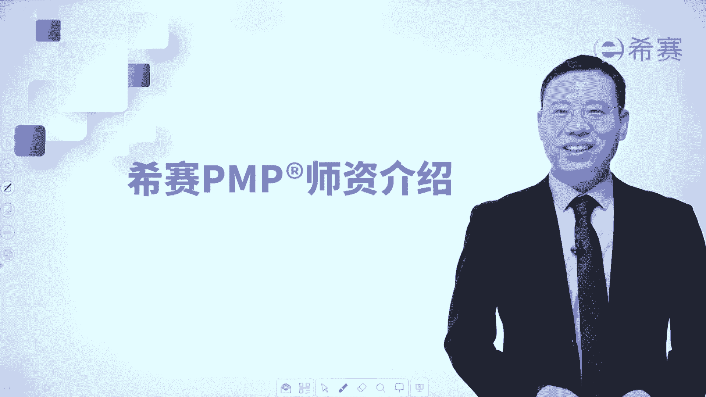
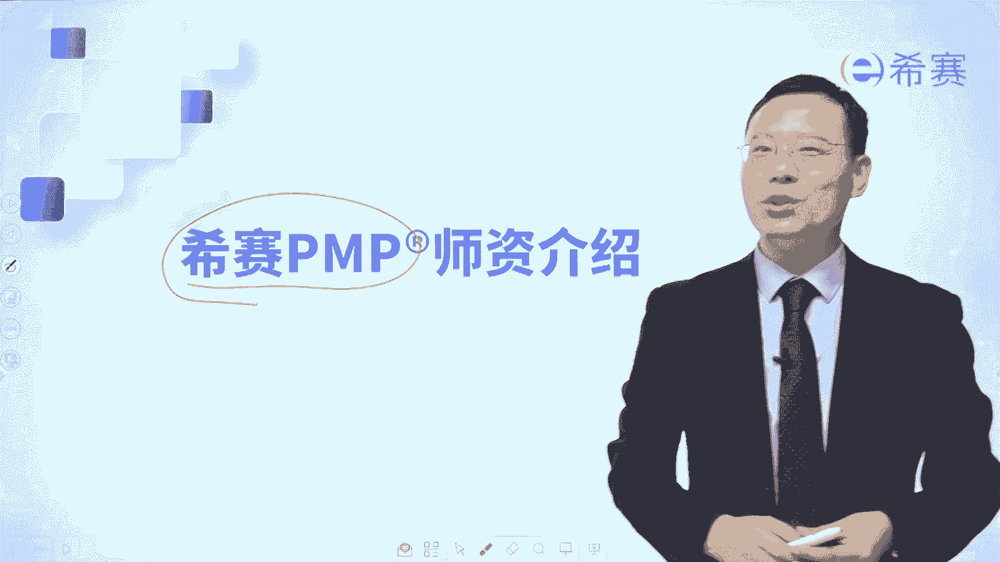

# PMP考试系统课程（第六版+第七版）项目管理资格认证考试，零基础一次上岸 - P2：PMP第六版 0.2PMP师资介绍 - 不爱哭的美少女 - BV1VcWDeUEt9

大家好，接下来我们一起分享一下，西塞PMP的师资团队，西夏每一年都会收一两万的，这样一个偏僻的学员，然后呢，我们也有一个比较庞大的这样一个教师团队，来去做支撑，当然这只是我们的讲课老师和助教老师。

还有班主任呢，还有一些其他的工作人员呢没有放进来呃，在这里你可以看到啊，我们的主讲老师我给稍微你圈一下啊，啊罗老师就我自己了，然后呢是呃陈翔老师，然后是呃佩奇老师呃，然后是陌陌老师呃，然后是刘伟老师呃。

然后是孟玉老师，然后是诶看一下啊，呃比方说是杨丹老师呃，还有楠楠老师，还有钱钱老师，还有芷若老师啊等等，我们这有很多的老师，那我们每一年都会开很多个偏僻的班级，每一个班级都会固定是由几位老师来去组合着。

来完成这个课程的讲解，那你在什么时候报名，你就刚好是赶上这个班级，是这样的一个安排情况，呃，其他老师呢不去做更多的介绍，来详细介绍一下我自己啊，我是中南大学硕士毕业，有没有我的校友。

我在习下目前讲的课程主要是有两个，一个是PMP的课程，还有一个呢是NPDP课程，那同时我还在ACP这个课程中，录了一个完整的课程视频，以及之前还讲过信息系统项目管理师，也就是高项。

那我自己呢呃因为对于这种教育学，心理学比较感兴趣，所以在好几年以前，十多年以前，我就考过了国家二级心理咨询师，并且呢还是思维导图管理师，嗯我给很多企业做过培训，做做过服务，包括像中海油的总部啊。

中国建设银行的深圳某分行呢，然后宁德时代潍柴动力蓝思科技呃，吉利汽车的湘潭制造基地，然后还有中车集团的这样一个例行科技，以及还有像韩发呃，国家电网下面的一个寄北电力中心。

还有像京东这样的一个小的团队啊等等，我在做培训讲师之前，其实是在企业里面工作，我以前呃一直是在北京工作，有若干年的项目管理的经验，然后做很多的项目，后来加入到西塞来做了全职的培训讲师以后呢。

就给很多企业做培训，我在培训的时候，也是尽量把这些比较枯燥乏味的知识，讲到通俗易懂的方式来给大家讲解，那我们现在的这些个师资团队中，有一些人可能会更擅长于去讲一些个考试，有一些呢可能能够去把这课程。

讲的更加的有趣味性啊，能够去落地，那当然也有些具有更多的拓展，那每个老师的风格会略有不同啊，你如果加入到西夏来，我们是会给大家开放三个不同的老师的课程，能够让你去看别人的回放啊。

这是关于我们讲师的这样一个简单的介绍啊，如果说你对我们有更多的兴趣，想要更深的了解我们呢，可以去加入到我们的西塞PNP的课程，来一起共同学习，我们会竭尽全力的去帮助大家。

