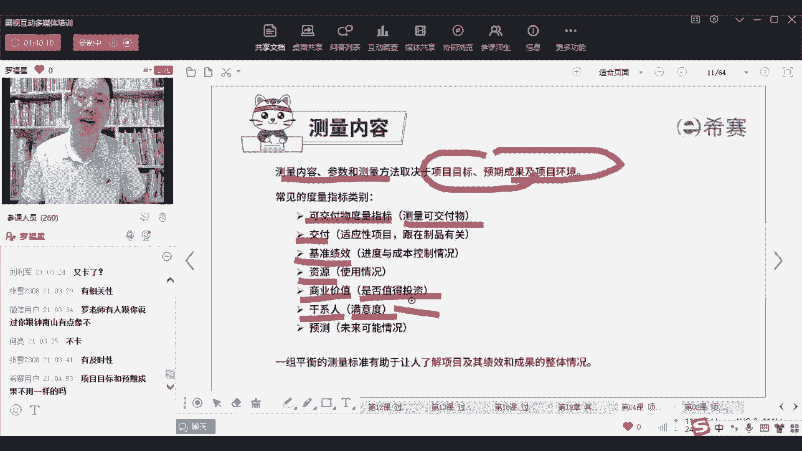

# PMP考试系统课程（第六版+第七版）项目管理资格认证考试，零基础一次上岸 - P88：PMP第七版8大绩效域之07测量绩效域-上 - 不爱哭的美少女 - BV1VcWDeUEt9

大家好，欢迎来到习赛网专业的职业教育平台，我是罗福兴，那今天晚上呢。

我们一起来分享的是项目管理课程中，叫测量绩效率。

测量绩效率它讲的是什么呢，其实我们在前面预测型项目管理中讲，测量的时候，有一个叫正值分析，大家有印象吗，我们说用了多少时间，该干多少活，花了多少钱，干了多少活，找到这个PVEV和AC。

然后呢EV减PVEV减AC，EV除PVEV除AC，类似这样一个意思啊对吧，这是在做测量，但是测量绩效率，它就不仅仅只是去测量这个进度和成本，它还可以测量更多，它还可以去测量更多，OK他还可以去测量。

比方说我们现在目前这个资源的使用情况啊，团队目前的阵营水平和能力呀，这些东西也都算是测量绩效率的，然后测量绩效率，你看他说是涉及到评估项目的这样一些，绩效情况，以及采取适当的行动去维持可接受的绩效活动。

也就是说我们去看一看，目前这个项目健康还是不健康，如果不健康，我们可以采取什么样的方式来去行为处事，所以这里给了这样几个，他说有效的去执行这样一个测量绩效率的话呀，能够产生以下的预期效果。

第一个说是对于目前项目的一个健康状况，是能够有比较认识和了解，最简单就是通过正值分析的方式，能够知道它目前是超前还是落后，那同时呢我们还有一个叫做团队绩效评价，那么基于团队绩效评价。

我们能够知道目前团队是水平比较牛，还是比较挫，呃对吧，类似这个意思好，第二个他说是促进决策的可操作数据，什么叫决策，如果你目前落后的话，我们该怎么办，该如何下手狠手。

你通过测量你就知道你目前还有资源可以动用，你就用现在的资源，你没有资源用，你就只能赶工啊，你就只不是你就只能够快速跟进等等对吧，就给到你一些决策的这样一个依据和方式好，第三个就是及时采取适当的行动。

就如果说他已经是跑piano的话，我们可以适当的去采取一些些的行动，来让他回到正常的这些轨道来啊，还有一个就是根据可靠的预测和评估，做出及时的决策来实现项目目标，其实也就是说对未来做一些新的调整。

我们未来可能要如何做一些新的调整，来让我们去达到啊，这是整个测量气效率就说了这么几件事情，我们来看一下它们会三个词，一个词呢叫度量指标，那度量指标其实有很多，比方说你说目前它是CPI大于一。

CPI等于一，CPI小于零对吧，CPI他肯定是个度量指标，然后SSPI它也可能是一个多量指标啊，类似这些东西对吧，就是对于项目或者说是这样些个产品，他的某一些测量等东西来进行一个描述。

这就是你的一个度量指标，比方说团队的一个离职率诶，这个可能也是一个度量的指标，然后比方说那个团队的这种掌握批，就是已经考PMP考试，就是PMP证书持有者的比例唉，这也是一个度量指标。

虽然不是说你考了偏僻，你就显得更牛，但是你考了偏僻，总不会让你变得更差吧，对不对，好，这是第一个，第二个是基准，基准这个词你需要去了解基准呢，我们前面学过范围基准进度基准成本基准。

它讲的是说我们一些经过批准的计划对吧，关于范围这个维度，如果说经过领导们批准以后，就变成了一个计划，而成本的维度什么什么之类的，哎就是叫计划，然后基准它是一个经过批准的计划，他有什么好处呢。

首先第一个它是用来去指导我们实践的，他是指导我们去工作，指导我们去实践的，这是第一个，第二个呢它是用来去做参考和对比的，也是我们监督与控制的时候，监控的时候，拿那些结果来去跟这个基准进行比对。

来去发现目前是什么状态好，第三个是第三个陌生的词汇，定义叫仪表盘，什么叫仪表盘呢，你想你们在开车的时候，你们在开车的时候，他是不是有一个上面显示的一个速度，120迈60卖多少对吧，然会有油表。

现在是已经是油满油一半油快没有油，类似这些东西，对不对，嗯这个就是这些个所谓的仪表盘，那我们在项目管理中呢，他也是他说用一些图表的方式，用一些图形的方式，来去显示项目的一些重要指标。

那么这些显示重要指标包括什么什么进展啊，绩效啊等这些东西，这个呢就是所谓的仪表盘好，我们一起来看一下，对应它就是一个dashboard啊，就是一个dashboard。

OK然后接下来我们来看一下整个测量器效率呢，测量它涉及到是说评估项目的绩效的这些情况，和我们去找到，如果发现它不好的地方，我们就去应对，我们就去应对，我们整个在做事情的时候呢，其实你是要去。

首先有一个基础的一些东西需要去测，你有一些基础东西需要去测，并且呢你拿测的东西要去跟某个东西去比对，通过比对以后发现目前是好的，继续不好改一改，再继续类似这样一种方式，所以他这里有这样几个词。

首先第一个是说他说去对比那些计划的东西，来看你目前的这个健康情况，然后去跟踪你这个资源的利用情况，看目前这个资源还剩多少，还差多少，还有多少，他这个还给了一个叫表明单折情况。

其实也就是说你目前的这个东西东西呃，已经是执行到什么程度的这些情况，但这个这个词没有一个很完整的解释啊，就是目前已经执行到一种什么样，一种程度和状态，还有一个呢是我们去监测的时候呢，要向大家去提供信息。

也是同步信息，向一些重要的相关方干系人去提供信息啊，这里还有一个说是看他如果说是处于正轨，我们就采取措施，如果没有呃，如果说是处于正轨，就继续没有，处于正轨就如何如何，这其实就是在做一个监控。

就是监督与控制，做监控好，还要聚焦于什么什么权衡呐，取舍呀，威胁呀，机会其实都是去，就是我们在风险管理中要去监督风险对吧，哎这就是一些跟某一些监督风险很类似的，这种方式，监督这些机会呀，威胁呀之类的好。

从而能够去确保通过这种测量方式来，确保他做出的东西是我所需要的，但是有一个问题你要搞清楚哦，如果测量就能够达到一个理想的状态吗，就像有同学想要减肥，你天天去称那个重量，你称重量就能够达到减肥的效果吗。

它并不能够啊，测量它只能够提醒你目前的位置和状态，接下来该怎么样去行为处事，还是要靠你自己明白吗，所以测量本身，它其实你不要把所有东西都指望在，那些测试人员或者那种那种什么那种QQA啊，QC啊。

你不要把东西都指望在他们身上，你知道吗，你要去是团队很牛逼才牛逼，团队不牛逼，啥都不是，我说的可能有点粗糙啊，但是是这个道理，你一定要搞得清楚明白吗，像我最近我也每天在称重量，但称的重量有什么用。

称了重量一天一天在长重而已而已，OK好，那么测量价值，你看测量价值不在于去收集和传播信息，而是通过这种方式能够去帮助我们做一些决策，做什么决策呢，采取适当行动的决策，比方说少吃一碗饭。

但是我今天晚上又吃了两碗饭，为什么，因为我今天晚上要给你们讲课，讲到十点钟，我不吃两碗饭，我到时候会饿晕啊，真是没办法咳，那整个在测量时候呢，首先就要通过测量，他说确保对于正确的事情进行这样测量。

然后让大家去知道目前这个状态，然后再去采取适当的这样一个状态，而整个测量中会认识两个，一个叫关键绩效指标，一个呢叫有效的度量指标，OK叫有效的度量指标，通过测量方式来去跟踪这些信息。

来去帮我们去做一些改善呐，就是告诉大家目前这个情况是什么样的呀，接下来可以采取什么样的措施啊，什么什么，所以它的焦点其实最终就是通过测量，来指导我们如何去做啊，及时做决策，并且采取适当的行动。

就像现在最近我在我前面，其实也没有很刻意的减肥，但是我太太说她说你要少吃一点，然后你太胖了，然后我就每天稍微少吃一点点，确实稍微减重了一点，但是但是少吃了以后又说身体有难受，那么在测量中。

首先第一个说关键绩效指标，那么关键绩效指标有一种叫提前指标，有一种叫事后指标，提前指标呢就说我提前去能够提前去测这东西，就是你知道说如果我们说因上努力，果上随缘，如果说是你因上比较好的话。

那么果善基本上就是水到渠成对吧，就基本上是水到渠成，就类似这样一个意思，那如果说你能够提前去测出这东西，AOKB也OK，C也OK，那么这些东西，你后面你才能够比较顺利的去往前推进，你知道吗。

OK所以提前量其实就是说我提前去测了这东西，我对未来就有一些把关，就是这个，而还有一个呢叫滞后指标，滞后指标就说事情发生以后，他是测量这些东西，测量这已交付，事后，事情发生以后。

我们再去测量目前的这个状态，而基于这个目前的状态，我们就知道未来的这样一些偏差趋势呀，偏差分析啊，趋势分析啊，然后再去知道未来怎么样去弄啊，这是大概简单稍微了解一下，稍微了解一下。

然后呢在另外一个词叫有效的度量指标，什么叫有效的度量指标，这里再一次讲到一个叫smart原则，smart原则我们在前面有讲过，但是不同的版本，它会把smart稍微用几个不同的词汇来去表示，不同的版本。

用不同的词汇来去表示这1smart呃，但是大方向基本上是一致的啊，smart首先要有一个词呢叫specific，就是具体的，比方说诶你要去保持身体的健康啊，这是一个更加健康，什么叫健康呢。

如果我太胖了的话，那可能就某些指标就不太好对吧，嗯什么之类的，那首先第一个就是要去可能要体重要控制一下，同时呢要多运动啊，这是才是具体的，然后meaningful就是做这个事情要有价值有意义。

如果说这个事情是不能产生价值，唉何必呢，哼对吧，像我自己的话，其实我在什么时候控制体重，我会比较有动力跟你讲，就是去你们公司培训的时候，我比较有动力，每一次要去单位给企业做培训。

我就比较有动力稍微控制一下，要不然的话，就是平常自己也不愿意去做这个事情，因为多难受啊，但是要出去的时候还是要形象还是很重要，虽然长得不帅，但是但是但是至少少形象一下对吧，形象还是很重要的好。

第三个呢是可达到的，Ok cheerable，而CHEVABLE其实就是你做的这个目标，最好是能够可以实现，比方说你说你不要，你说不要吃晚饭，这个对不起，我做不了，但是你说老师他说呃呃说说嗯。

罗同学罗罗老师，罗同志，你晚上只吃一碗饭，哎这个我可以只做，只吃一碗饭，我可以做得到，还有的是有相关性，就是你目前做的这个事情，跟你的大目标是相一致相匹配，而不是反过来对吧，有有相关性。

这还用的是这个叫TIMONY，叫及时性，及时性，有效性好，我不举我不举手了啊，我不我不做大动作了啊，嘶咳OK那当然还有一些别的词汇表达，其实本质上没有什么差别啊。

这个smart也有什么meaningful，就是可测量啊，同意啊，切合实际呀，有时效性啊等等这些哎，这都是这都是这个调调啊，都是这些啊，不要把我跟那些大咖大神比，我不要捧杀我，不要捧杀我。

你只要不要记恨我就可以了，我有时候对你们太凶了，那你不要记恨我，我也是为你好等等，这不是我，这不是我对你凶的理由啊，我我检讨一下，我这个我自己错了，我错了好，那么测量的时候呢。

首先第一个就是我们要有清晰的一个说，测量内容和测测量内容参数和测量方法，它是取决于我们的目标，预期成果以及环境，就你要去测量什么东西，你要搞搞清楚，比方说我们在测量时候有这些类别的指标。

一个是叫可交付物的这个测量，关于可交付质量，就是要去测量这个可交付测，测量这个可交付成果做了没做，有没有啊等等啊，这是一个，另外一个是交付，这个交付呢，他其实讲的是说在这个对应的节点上。

你有没有是按照节奏来交付，按照节奏来去交东西好，还有个是测量这些绩效基准，就是呃S嗯，就是那个正值分析的那一套啊，正值分析那一套来测量，然后呢还有测量资源使用情况，就资源目前有多少，还差多少啊。

什么之类的，然后呢还有就是测量商业价值，所谓测量商业价值，其实就是去测量这东西是否值得图投资，这个括弧里面东西都是我新加的啊，就是方便你去看清楚，测量这东西是否值得投资，还有呢是测量干系人怎么测量呢。

测量干系人的满意度，就各位上帝们，然后你要对我们的满意度做一个反馈，满意度几何对吧。

