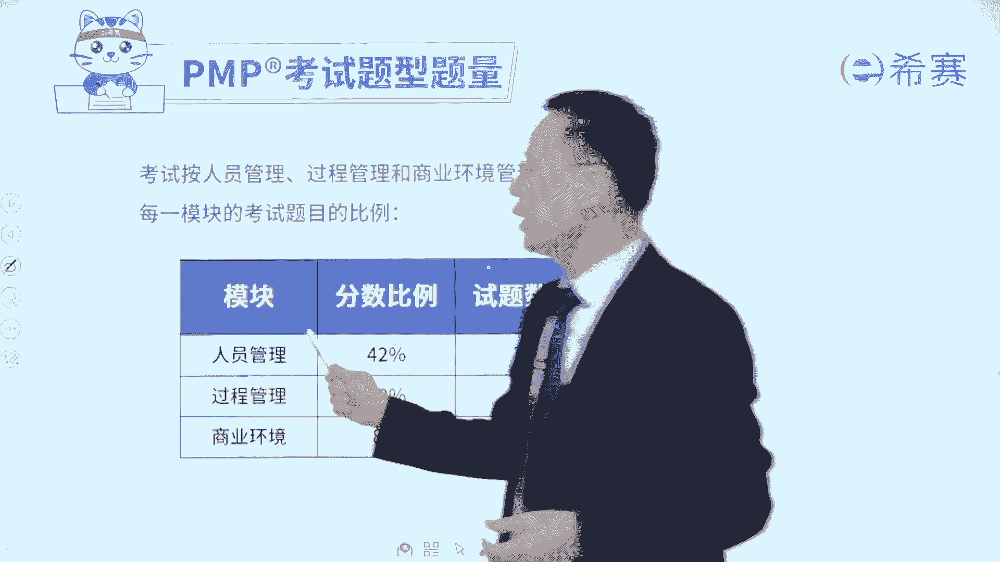
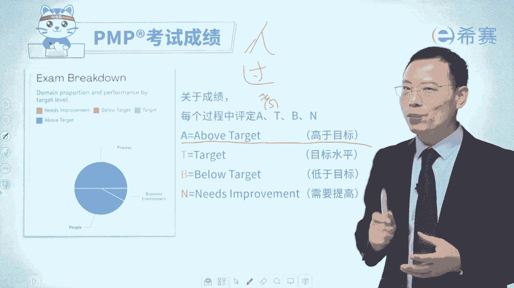
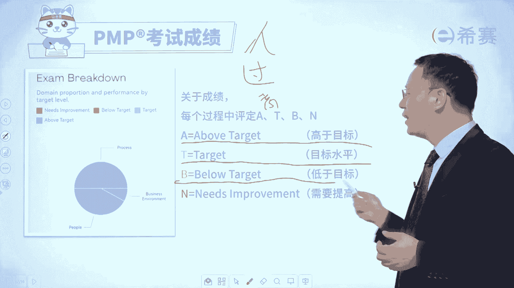

# PMP考试系统课程（第六版+第七版）项目管理资格认证考试，零基础一次上岸 - P8：PMP第六版 0.8PMP考试的题型题量是怎样的？ - 不爱哭的美少女 - BV1VcWDeUEt9

大家好，很多同学会关心说，PMP考试它的那个题型是什么样的呀。

它有多少题呀，我们一起来稍微给大家分享一下啊，就是关于PMP考试，它的题型和题量是什么样的。

那整个考试呢它的考试内容会分到三个板块。

一个是人员的板块，一个是过程的板块，一个是商业环境的板块，那么人员板块占比占到42%，有76道题目，而过程板块呢占到50%，有90道题目，而商业环境板块占到8%，有14道题目，也就是说总分是180分。

然后我们考试通过的话呢，大概是108分以上，你就可以顺利的通过考试，那么这些考试内容它是这样的，有50%是预测型项目管理部分，有50%是敏捷项目管理部分，所以预测也好，敏捷也好，都重要。

那相对来讲你做到108以上，基本上就通过考试了，当然如果说你在中国香港，在中国澳门，或者说是在海外考试的话呢，那么通常情况下它会加来一些，就是这种匹配题啊，填空题啊，这些其实你也不用怕。

它都是这些知识内容里面的，尤其是填空题，它几乎就相当于是选择题这种方式，而这个连线匹配题它就是连线的方式，就是这里1234，这里有ABCD啊，哪个相关哪个相关呃，哪个相关哪个相关啊，通过这种方式去连线。

那整个考试呢它的题目是这样的，就是每一道题目下面是英文，底下是中文的翻译，像这个题目它是一个单选题，就是有四个选项，ABCD4个选项四选一，那么还有一种题目呢是像这种定向多选题，它下面也是全英文啊。

因为这个版面太小了，放不下，所以我没把它放下来，上面是英文，下面是中文，它这里面明确告诉你有若干个选项，你从若干个选项中要选几项，这叫定向多选题，那么对于考试的话，它是这样的。

就是一般来讲170个单项选择题，十个左右的定向多选题，一般是这样的一个安排，OK那么对于考试你可能也听说过说啊，有谁谁考了3A3A是什么意思呢，就是我们的这些个关于人关于过程。

然后关于那个商业这三个板块中，每一个板块都会单独来去给你做一个记分，记完分以后，如果说你做的非常棒，那么就是叫above target，就是高于目标。

也是A那如果说是刚好及格或及格以上，但是还没有达到A呢，叫target叫达到目标水平叫及格以上，如果说你都没有及格的话，呸呸呸，你不会啊，你肯定会及格的，那就是BB叫been low。

target就是低于水平就有点low，那还有有少部分的一些人，他会有need improvement，就是还需要提高，就差的太多了，他会用四种不同的颜色，A呢用的是深绿色，然后T呢是用的浅绿色。

而B呢用的是黄色，而N呢用的是红色，那我希望看到这一段视频的同学唉，来公屏上面敲下来，3AK3A3A3A啊。

