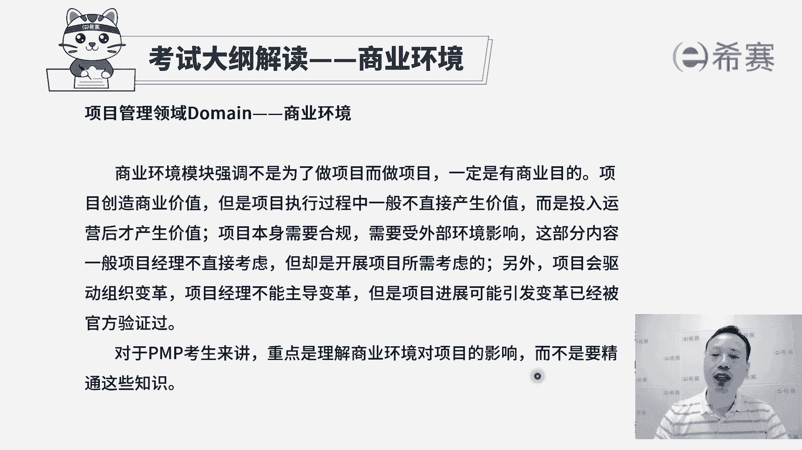
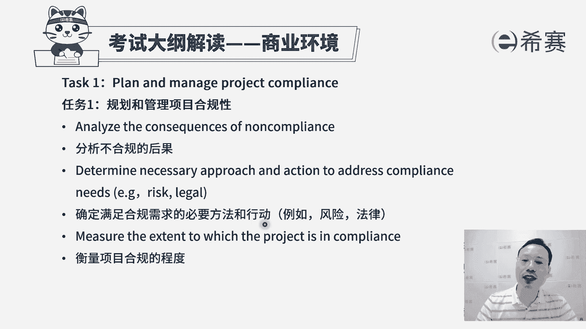
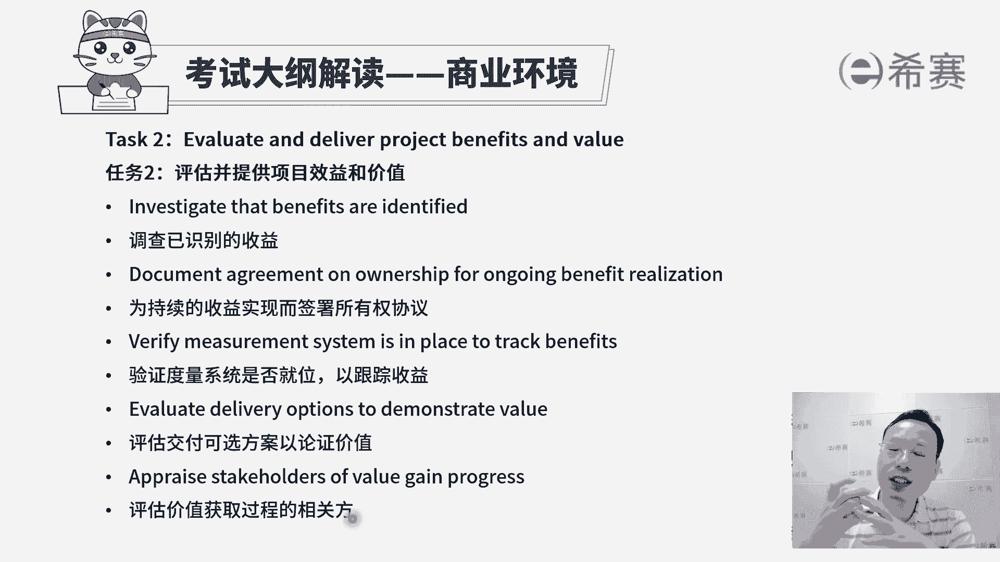
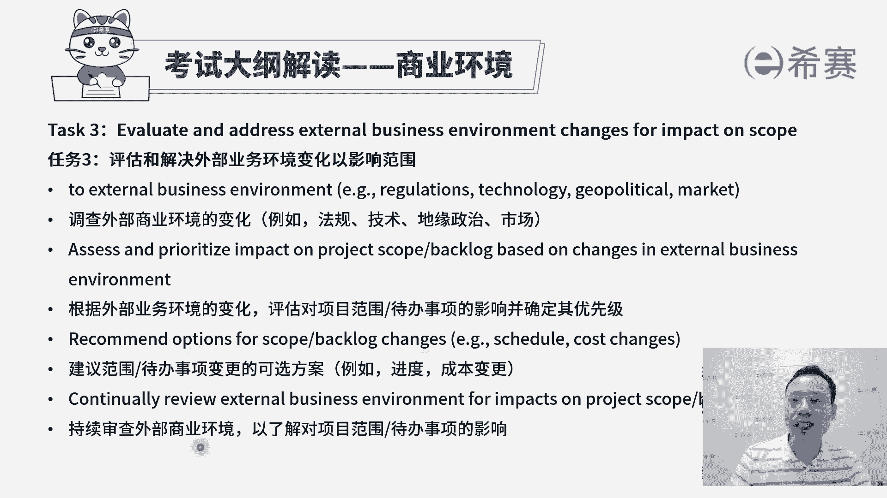
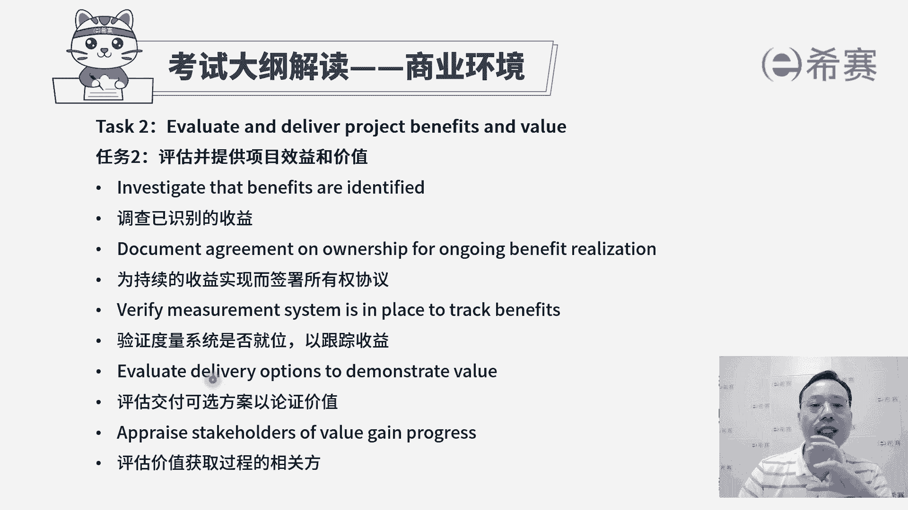
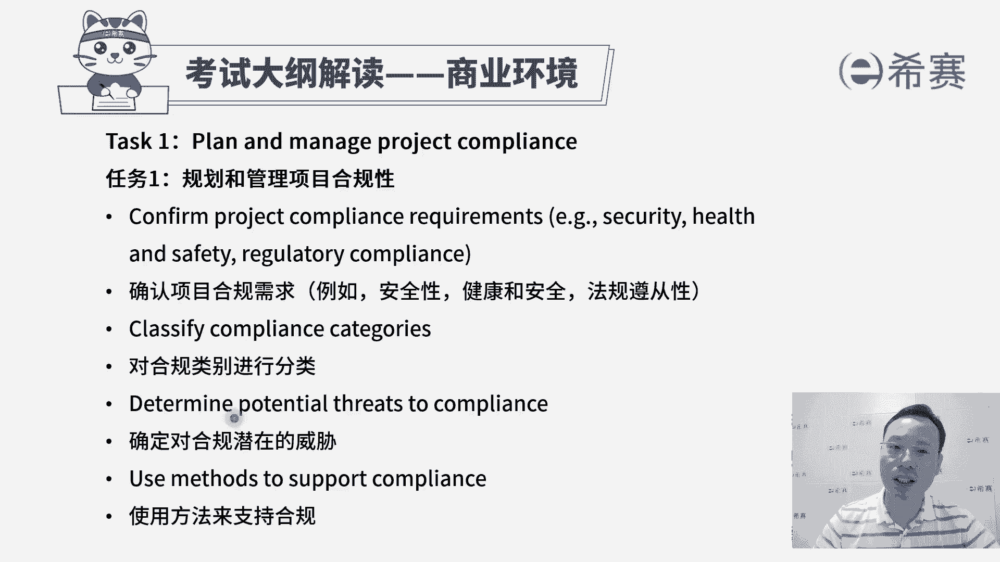

# PMP认证考试PMBOK第七版精讲课程完整126集！ - P5：第七版考纲解读之商业环境 - PMP项目管理 - BV1RwYYe4EDN

大家好，接下来我们一起分享的是PMP考试，第七版考纲的解读，那考试中目前是按照第六版的拼搏指南，第七版的拼搏指南，以及第七版的考纲来进行考察，整个考试呢是按照三个模块来计分，一个模块是关于人员。

一个是关于过程，还有一个呢是关于商业环境，它们分别占比人员占到42%，有76道题目，过程呢占到50%，有90道题目，而商业环境它相对会少很多，它只有8%，有14道题目，它们加到一起。

一共是有180道题目，那我们一起来看到的是关于商业环境，这样一板块，它的考纲内容呃，整个关于商业环境考纲呢只有四条信息。

只有四条，我们一起来认识一下，其实关于商业环境，首先它会给到一个非常重要的信息，就是我们既然要去做项目，他不是为做而做，一定是能够产生商业价值，我们前面已经学过了，价值，包含有形的价值和无形的价值。

那是有形价值加上无形价值，它们一起让我们会判定说，这样一个项目是值得做的，并且其实很多时候项目它产生价值，不是说在做的过程中就会产生，而是做完以后投入到运营，投入到使用的过程中，它会产生价值。

而咱们在整个关于商业环境这个板块中呢，他还要强调一个特别重要的词汇叫合规，什么叫合规呢，你可以把它简单理解为是合符规范规则规律啊，合规这样一个意思就是不违规，不违法就是合规。

那如果说一个项目它如果是违规的话，那肯定就是不适合存在他合规的情况下，就或者说他在擦边的情况下，怎么样去做一些什么样的操作，让他能够达到合规，当然我们考试不会考的这么复杂啊。

但是你至少知道做的事情一定是合规的，再有一个呢就是其实企业它会有这样一个变革，原来那一套方式如果已经是不适用的话，他可能就会有一些新的方式来去产生，那么这里就涉及到那种驱动组织变革，其实是项目。

它会驱动组织变革，一个一个的项目的完成，它能够去驱动组织变革，但是这里有一点我们需要搞清楚，项目经理本身，它不具备这种直接去主导变革的这个位置，因为它的位置是相对比较小，比较低的。

但是它可以去促进这个事情，当然整个关于偏僻考试中，关于商业环境的认识和了解呢，不会考的特别的细，就是我们稍微有所了解就可以了。

我们来看一下整个考纲中的四条有哪些内容，首先第一条是关于合规，说规划项目的合规性，并且呢去管理项目的合规性，就是我们要把这个词分开来读啊，就是我们去做项目管理的时候呢，在前期规划的时候。

一定要去尽量做的东西就是合规的，罗翔老师有讲过，说最赚钱的项目都写在刑法里面，那类型呢通常都是不合规的，而咱们在做事情的时候，你看确认项目合规的需求，就是包括它的安全呐，健康呐，各方面这个安全健康啊。

其实一方面是说不违规不违法，还有一方面是，现在更加强调了一个叫可持续发展，就是既能够让我们赚到钱，同时不会破坏环境，也不会去伤害这些个用户，以及不会去伤害这些个工作人员，那这是合规的一个要求。

所以说要求安全性呢，健康啊，这方面都是有有标准和要求的啊，第二个是对于合规类别来进行分类，那么这里面就可能会包含，我们经常会讲到一个词叫三三重底线，就是做一个项目，它既要能够赚到钱。

同时呢也不能够去破坏这个环境，那么关于破坏环境这块，可能也有很多分类的方式，还有一个呢就是不能够对这人有伤害，对这个社会有伤害，这个就包括了工人，以及使用这样一个项目结果的人员，就是用户。

那这里就是对这样一个合规的可能类别，来做一个区分，还有就是确定对合规潜在的威胁，其实也就是说如果哪些事情没有做好，就有可能会导致它不合规，那么如果有一些方式可能会导致不合规呢。

我们是一定要去杜绝或者一定要去处理的，使用合适的一些方式和方法来去支持合规，想办法让我们做的项目是合乎规范，和服这一个法律要求的，还有就是如果不合规的话，我们要了解一下不合规它的这些后果。

其实很多时候为什么像现在有一些人，他去做某一些事情，他为什么去做违法，就是因为他违法的成本实在太低了，他如果安安分分的去做事情呢，可能就觉得自己他不想要去安抚的去做事情，他宁愿去擦边。

那如果说我们的这一个法律法规，对某一些东西的要求会比较严格的话，我们需要去了解一下不合规可能导致的后果，这样的话就三思而后行好，还有一条就是确定满足合规需求的，必要的方法和行动。

其实也就是我们需要去了解呃，各种不确定性呢，风险呢以及可能会有哪些法律条款啊，条文啊什么，这些东西我们需要去如何去满足它啊，衡量整个项目的合规程度，理论上来就是完全合规的，既能够去啊赚到钱。

也不会破坏环境，也不会对这些人有伤害，有影响，也不会去违规，不会去违法，这是商业环境中的第一条，我们做事情要合规，并且要管理项目的合规。

第二条呢是评估，并且是提供项目的效益和价值，那他讲的是效益呢，其实是好处，benefit就是我们做项目啊，本身一定是产生价值的项目才值得去做对吧，那我们首先要去分析一下这样一个项目。

它能够为客户带来什么样的价值和收益，以及能够为我们自己带来什么样的一个，价值和收益，需要搞搞清楚这样一个情况，所以是调查已经识别到了这些收益和价值，好为持续的收益实现而签署所有的协议。

其实也就是说我们要做什么样的一些操作，从而能够去确保双方能够达到这样一个，共赢的状态，就是他能够有收益，你也能够有收益啊，就是我们可以产生收益，并且呢我们的客户也能够从中获得收益，那么这样的话。

我们可能需要去跟哪一些人去产生合作，合作的话呢，可能许有这种协议或者合同会有一个约束，第三个验证度量系统是否就位以跟踪收益，其实这个很少会去做啊，通常我们的收益在什么时候才会去实现呢。

是项目已经完成以后，已经是投入到运营使用以后才会去产生收益，那么这都是呃叫什么啊，后评价系统这种后评价系统的话，其实咱们在做项目的时候不太会去涉及到，因为我们整个偏僻考试。

他几乎就是讲的是项目在交付之前的这一段，但是你至少知道应该是有人负责，那谁来负责，通常是产品经理是这样一个产品经理啊，关注更框的这一个产品生命周期，他会关注产品已经是做完了，并且是投入使用的过程中。

他去跟踪这个收益的情况，他有一套度量的标准和系统，好再下一条说评估交付可选方案的，以论证价值，其实也就是说做事情可能有多种方案，那么我们想要去了解每一种方案，它所产生的这个价值，以及他所付出的代价。

也就是经常我们会讲到一个叫投入产出比，或者你可以这样来理解，就是我做这样一件事情划算还是不划算，我在这个项目中做某一个动作或做某一些行为，他是合适还是不合适，这也是所谓的去评估这个交付的这样可选方案。

它的这样一个价值，最后还有一条说评估价值获取过程的这样一些，相关方，其实也就是我们在做事情的过程中，要产生一些价值，并且呢可能会想尽办法来争取干系人，或者相关方他们的这样一个参与。

想办法让他更好的去支持这个项目，而把这个抵制呢降到最低，那我们需要去评估一下，在我们去获取价值的这样一个过程中，相关方，他的这个做法，是不是有利于我们这个事情往前推进，呃其实总体来讲就是说价值。

因为项目是一定要产产生价值才值得去做。

它如果不产生价值，就不值得去做好，第三条关于商业环境的考纲呢，他讲的是说要去评估，并且呢要去解决这些外部业务，环境变化与影响范围，什么意思呢，就是我们其实是在一个动态的环境中做事情，那么在动态环境中。

他不可能说所有东西都是，跟你最开始启动项目的时候的东西是一模一样，可能外部有很多的东西在不断的调整和变化，包括一些法律法规呀，一些政治因素呀，一些市场条件呢，以及技术在做新的发展。

那呃这个你们经常会讲到一个词叫pistol分析，叫宏观态势分析，那我们需要去了解这些宏观态势的发展变化，看他对我们现在目前正在做的项目，有没有一些影响，但咱们在偏僻中。

其实不要求你去做这一些什么宏观态势分析，只是说要有这样一个意识，就是有可能我们不仅仅只是关注项目上的事情，还有就是别的外部的东西可能会对他有影响，别的外部东西对它有影响，我们也要适当的去关注。

是这个意思啊，啊，所以他给的第一条是调查外部商业环境的变化，那么技术有什么变化，法律有什么调整，政治这个叫地缘政治，其实说本地的这样一些政治情况，或当地的这样一个政治情况。

有什么一些可能会对我们的项目影响啊，要了解这些个外部环境的影响，这是第一个，第二个，根据外部业务环境的变化来评估，对于项目他的这个影响，并确定它的优先级，或者评估他对于代办事项的影响，并确定优先级哈。

这里面有两句，为什么要断开呢，其实是这样的，就前面说评估这些个外部环境的变化，对于项目的影响，他讲的是预测型项目管理，中外部发生变化以后，我们的项目环境，我们的需求他要去实现的话。

可能会有一些什么新的挑战和困难，而另外一个词待办事项，它通常会是用在这样一种叫敏捷项目管理，也就是拥抱变化的这种方式嗯，尤其是像互联网软件呢这种行业，它的变更特别频繁，他就需要去拥抱变化。

那么对于这种待办事项目的这个影响，我们也需要去了解外部的影响，他对于我们现在正在做的事情，其实简单来讲，这一句话，就是说我们需要去根据外部的这个环境的变化，来评估他对于我们正在做的这些事情的影响。

并且来去敲定哪一些所谓敲定优先级啊，有一个点一定要清洗啊，就是我们所有东西去排优先级，一定是基于资源有限，在资源有限的情况下，我要优先做什么，然后再做什么，再做什么，那么这里同样的。

就是我的这样一个资源有限的情况下，我要去处理某些事情，我会优先最先去处理什么东西，最重要的，然后再处理什么，然后再其次有这一个优先顺序，所以是根据外部的环境来评估它对我们的影响。

从而能够去给出我们的一个决策，或者是解决方案，我们先去搞什么，再搞什么呃，在第三句建议范围变更的科学方案呃，就是范围做一些调整，变更可能会影响到成本呐，影响到这样一些进度啊，影响到资源诶，我们去看一下。

如果说外部环境发生了影响以后，我们可能需要去对我们的这个范围，做什么样一个调整，或者呢说是建议待办事项的这个变更，其实也还是我们要做的，只是说是一个是说预测型，一个是敏捷型啊。

总之就是我们要做的这些事情，内容本身可能要做什么样的一些新的调整，所谓的可选方案就是plan b呀之类的好，最后一句，持续的去审查外部的这些商业环境，以了解对于项目或者代办事项目的这个影响。

也就是说我们的这个调查和了解并不是一时的，而是持续的，因为只要你在做项目，他一定是在社会中去做，然后在这一社会环境中去做事情的话，外部环境发生的影响，一定会对我们项目本身产生影响。

大家都知道我们一个人是在一个企业的工作，然后企业做的事情他是在一个行业，而行业呢它也是属于一个整个大的一个环境，商业环境，所以如果大环境影响，它会对整个行业造成影响，行业影响可能会对我们的企业有影响。

企业有影响，对我们的工作内容也有影响，对这个项目本身也有影响，所以我们才需要去关注外部的这些环境，真单只是了解啊，你有有这一个概念就可以了。

有这样一个大致的这个思想就可以，接下来我们看到是考纲中关于商业环境的，最后一个任务叫支持组织变革，其实为什么要变革，变个多难啊，多累呀，很多时候其实是因为原有的那套方式和方法，它已经不那么管用。

所以才会迫使我们去发生变革，那对于原有方法不管用的时候，我们去发生变革，一定也是从上往下的方式变革才会比较管用，那个项目经理其实是不太能够去主导变革的，但是呢我们说过叫越位思考，本位操作。

你需要去替领导去分忧解难，那我们来看一下关于知识组织变革，首先第一个评估组织文化，就是了解一下我们公司的这个状态和文化，因为有一些企业文化它是拥抱变化的，也有一些企业文化它是相对比较僵化的。

或者说是像那种等级比较森严的，哎，我们需要去了解了解，我们公司的这个企业文化情况，然后评估组织变革对于项目的影响，并且去确定所需要做的操作，也就是如果说我们公司在某一些方面，发生什么调整的话。

他对于我正在做的这个项目会有什么影响，其实有的时候啊它是双向的，很多时候是基于这个项目需要做什么调整啊，另一个项目做了什么调整啊，一个一个调整下来，公司慢慢就发生了一些调整和变化。

也有可能会是公司的某些政策发生调整以后，对项目有一些影响，那总之就是我们需要去了解这些个变革，相关的信息，然后再看我们作为一个项目组的成员，需要在里面去做什么事情，完成什么工作好，最后一句。

评估项目对于组织的影响，并确定所需要的行动，你看前提就是说组织的变革对于项目的影响，这就是呢项目对于组织变革的影响，所以是双向的，就是不管说是公司对我们这个项目上的影响，变变化导致的影响也好。

还是项目对于整个公司的调整的影响也好，我们都需要去有所了解，那这里面其实会在整个呃偏僻考试的第七版呢，他加了一些这种变革的模型，我们后面也会去给大家去讲一讲，这些个变革的模型。

所以整个关于考纲中的商业环境，可能讲的比较粗糙啊，就是嗯你也只需要稍微有所了解，你把我们课程中的第一章和第二章认真学过，然后后面内容大方向的了解了以后呢。

基本上这个商业环境大部分内容就已经包含了，他一个是关于知识组织的变革。

一个是关于评估一下外部的这些环境变化，然后第三个呢是去评估这样一个项目的这样。

效益和价值，而第一个呢是去做一个合规性好。

