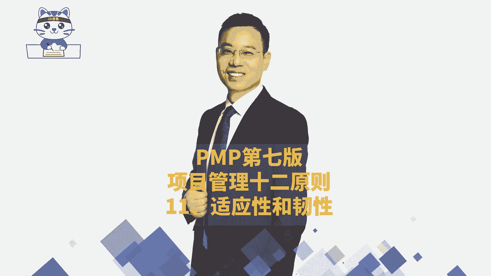
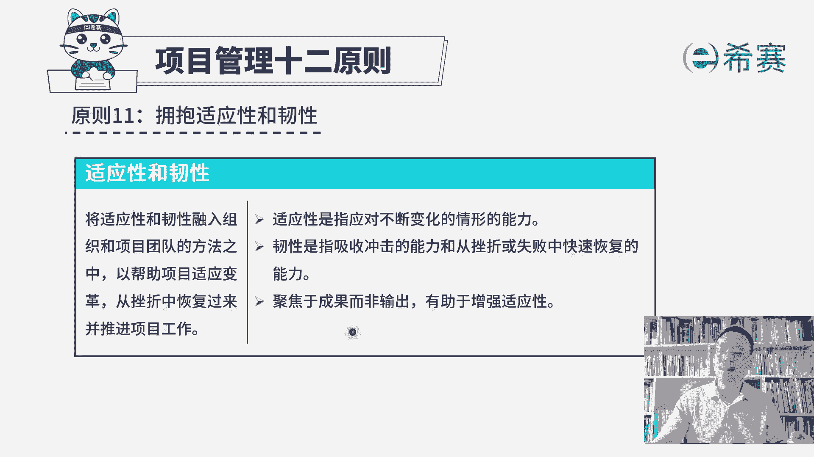
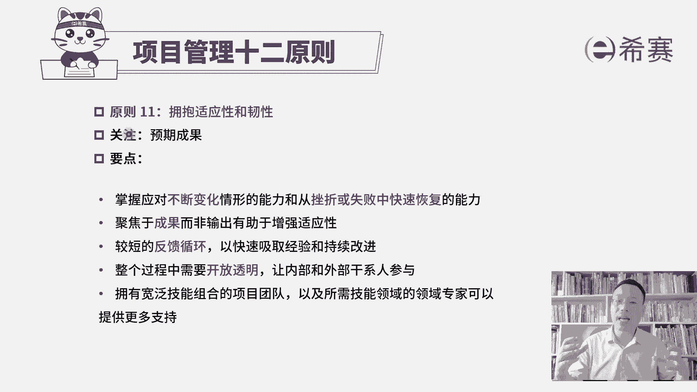

# PMP认证考试PMBOK第七版精讲课程完整126集！ - P58：PMP第七版项目管理原则之11适应性和韧性 - PMP项目管理 - BV1RwYYe4EDN

我们继续来分享的是，项目管理12原则中的第11条，叫拥抱适应性和韧性，那关于拥抱适应性和韧性，首先我们得要知道什么是适应性，什么是任性，关于适应性，官方的解释是这样的，说是指应对不断变化的情形的能力。

你就是想我们在生活中经常会讲啊，那个谁谁谁，他的适应能力很强，把他扔到沙漠里面，他都能活下来，这就是面对那种外界有不确定的，可能会有不断变化的这种情形的时候，他依然可以有效的把事情往前去推进。

或者依然能够去灵活应对各种情形，这就是说适应力很强好第二个词叫任性，什么叫任性呢，官方的解释是这样说的，说，它是指吸收冲击的能力，和从挫折或失败中快速恢复的能力，呃给你简单举个例子啊。

比方说如果你手上有一个玻璃球，你手一松啪掉下去会怎么样碎了，对不对，但如果说你手上有一个钢球，你手一松啪掉下去怎么样，杆球不会碎，同时这个地板有可能会被他砸一动哈，第三个关键点就是。

如果你手上拿的是一个乒乓球，你手一松，它掉下去啪，然后又会弹起来，就是他面对这种冲击力，面对这种挫折能力，他能够去快速恢复到原有的状态，这是任性，那项目管理的第11条原则叫拥抱，适应性和任性。

也就是我们在做项目的时候，我们需要能够拥有这样一种适应性，能够去应对不断变化的这样一个情形和能力，也就是在敏捷中，你会不断的去学习到的这种迭代的方式，来去做一些调整，去拥抱变化。

还有呢我们需要有这种韧性，因为在做项目的时候呀，挫折是在所难免的，但是有一句话叫什么叫杀不死我的，必使我强的就是哈哈哈，这个意思对不对，那你要有这样一个任性，因为在项目中挫折是在所难免的好。

所以你看他说将适应性和韧性，能够融入组织和项目团队的方法之中，能够去帮助项目来适应变革，从挫折中恢复过来，并推进项目工作，所以这就极其已经是比较好理解了，对不对，那它这里还有一句叫聚焦于成果而非输出。

有助于增强适应性，这个怎么理解呢，就是你想，如果说你的目的地是为了达到某一个地方，那么你中间即便是走了一些弯路，也不是那么的要紧，你只要目的地没有发生改变，你永远都是往那个方向去走。

你即便中做了一些调整，也在往那个方向去走，假如说你跟谁谁，你们决定说在哪个地方去会师，那本来约定是到那个地方去会师，但是他因为临时接到一个电话，他又需要去到另外一个地方来，去干一件什么什么事情。

然后再赶过来，然后你又想要更快的去跟他会试的情况下，有可能你会调整你的见习路径和方向，你最后的结果是为了能够跟他成功会师，而不是说到达最开始所约定的那个地点，所以当我们可以去聚焦于成果的时候。

而不只是说最开始所约定的这样一些个输出，output的时候，那我们的这个适应性会更强，我们会不断去调整自身，调整自己，这是关于聚焦于成果而非输出，有助于增强适应性。

那我们一起来看一下关于拥抱适应性和韧性，如果是重复的呢，就不再去解读，新的呢，我们再多说一下，他的关注焦点其实是适应性和韧性，同时呢他会关注这个预期的成果，为了达到成果。

我们可以不断去调整调整自身的这个状态，以及能够去从挫折中恢复过来，所以是要掌握应对这种不断变化的情形的能力，以及从挫折或者失败中去恢复的这种能力好，还有第二个就是聚焦于成果，而非是输出。

有助于增强适应性，接下来我们再来看另外几条，是我们开始没有讲的，一条是说较短的反馈循环，以快速吸取经验和持续改进，也就是我们在后面会学敏捷项目管理，在敏捷项目管理中，我们会拥抱变化的同时呢。

每一个周期都会去获取别人的反馈，而他们的反馈其实是给我们去指路指路指路，让我们去到他想要的地方，做他想要的结果，那么这种方式其实是有助于我们去改进，所以快速去反馈，去循环去迭代。

我们就能够获取更多的这样一些有效的信息，吸取更多的经验和教训，从而能够去持续调整我们的路径，改进我们自身可以更好的做好，下一句呢，整个过程中需要开放透明，让内部和外部人员都参与进来，其实你就这样去想。

如果说我们不开翻透明，会变得更加有适应性吗，但不开翻透明的时候，外部发生某一个变化的时候，别人都不知道他怎么样去响应，所以如果越是开放透明的话呢，信息越是同步的话，对于外部的各种不断变化的情形和环境。

大家能够更快的去同步信息，能够更快的去掌握，就能够更有效的去应对这样一种变化的情形，也就是适应力会更强好，还有最后一条，拥有宽泛技能组合的这样一个项目团队，以及所需技能领域的领域专家。

可以提供更多的支持，这就是在给我们的韧性来增加筹码，当我们荡到谷底的时候，依然有这些可以依赖的，这样一些专家和工作人员，能够去让我们重新弹回来，能够恢复到原有的这个战斗力，那整个项目管理的第11条原则。

拥抱适应性和任性，我们来简单总结一下，首先第一个呢就是我们需要有这样一种适应性，能够应对不断变化的情形，同时呢需要有这样一个韧性，能够从挫折中快速恢复，能够从失败中能够回到原有的状态。

第二个呢是我们聚焦于成果本身，而不是只是一个简单的输出，这样的话呢那个成果可能会不断调整的时候，我们也会更有这样一个不断变化，这种能力能够有更好的这个适应性，并且呢我们在做项目的时候。

可能会依赖更多的专家和人员，他们能够让我们更有底气。

