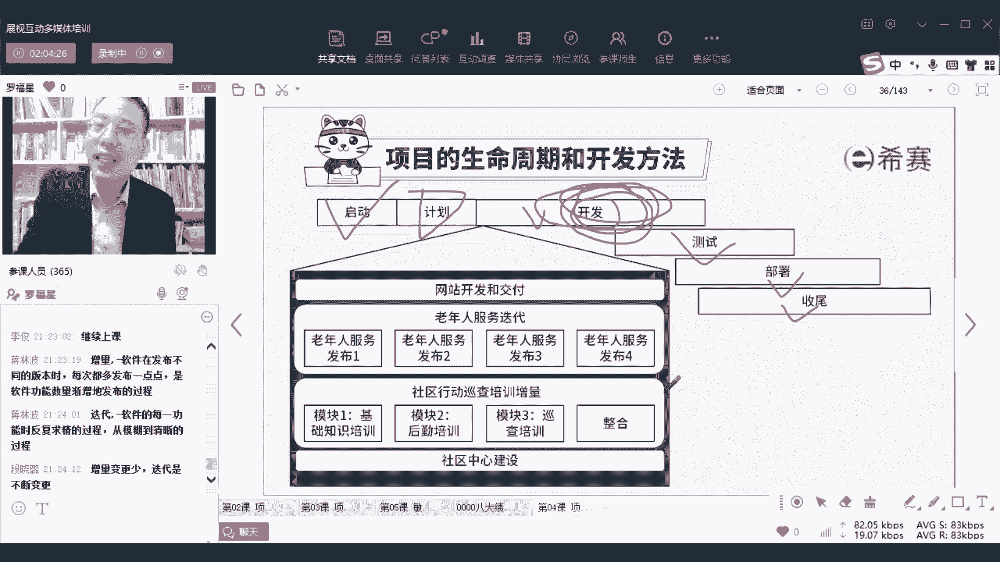

# PMP认证考试PMBOK第七版精讲课程完整126集！ - P67：PMP第七版8大绩效域之03开发方法和生命周期绩效域-中 - PMP项目管理 - BV1RwYYe4EDN

我们在做事情的时候，没有某一种方法能够去满足生活中所有的场景，你一定会有一些这种中间的空间，所以开发方法它其实是一个渐进的过程，根据你的需要来去做，而这张图可能会展现的更加直接，这张图我前面讲过没有。

如果是第一次的话，我们稍微稍微先过一下，后面还会展开讲的，就是如果这个项目它的那个需求是变化特别多，讲过是吧，需要变化特别多，那么就是属于变化特别多，如果变化很少，就变化比较少。

还有呢就是他那个交互频度很高，交互频度很低好，那么基于这四个维度来去划分，你会发现这种是预测型，其他三个呢都叫敏捷型，或者呢都叫适应型，有了这样一个区分以后，你就知道那什么叫混合型呢。

嗯只要是预测加增量是混合，预测加敏捷是混合，预测加迭代也是混合，所以混合就是有多种方式去混合啊，还有一种就是说密预测比较多，敏捷比较少，还有就是敏捷比较多，预测比较少，还有就是先敏捷再预测。

也是先预测再敏捷，都是混合，OK这是关于混合，稍微稍微解释一下，那我们在具体做这个事情的时候呢，会跟公司的能力有关系，跟项目本身特质有关系，跟这个项目他所做的一个结果有关系，而不同的结果不同的东西。

我们的搞法会不一样，就还是类类似于，比方说你如果做的东西是很确定的对吧，需求是很确定的，就是修桥修路，那这就是用这种预测的方式来去做呀，你如果说是这个项目的风险非常低，你能够明显知道他没有什么风险。

都是在可控范围之内，那你可能就用预测的方式来去做，都是可以的对吧，但是如果说你的范围非常的不清晰，非常不稳定，那个难度也是很大，太多的，不确定性，那么你可能用敏捷的方式去快速试探，去试错，我们说敏捷呢。

敏捷是低成本快速试错，敏捷是低成本快速试错，那么你用这种低成本快速试错的方式，它来解释这个东西就会又变得不相同，又会变得更合适一点好还有就是项目中的资金，你如果你的资金不能一次打给大家，你只能是分批打。

那就没办法咯，那么你就只能是分批次的打，你就是增量交付的方式来做事情咯，你如果说是可以那种按照某种方式约定的方式，来去一次的打，那就会呃不相同，就可能会更好一点对吧，还有一个就是各种因素啊。

什么进度的制约因素啊，成本的制约因素啊，各种制约因素来去处理事情，这都会有，还有一个是公司，你们公司的文化就是那种压制的文化，或者等级很森严，如果说公司他是那种等级很严，很森严的这种方式的话。

那么肯定是用一种预测的方式来做事情，OK但是如果说公司的这种是一种啊，像比方比方说像抖音啊，或者是这种这种新的公司啊，他会用一种很快速变化的方式来做事情呢，那他的这种扁平化管理。

他这种扁平化管理他的这一种思路，他可能处理方式就会完全不相同，但是这个不相同啊，其实不是因为公司是怎么样，所以不相同，而是说是因为他不相同，所以公司才会怎么样，这个他们之间到底是先有鸡，还要是先有蛋。

没有一个先和后的关系，就有可能你是正好做这种软件行业，就必定会导致这个公司的这种处理方式，是不相同的，他们一定是这种偏扁平化的管理，偏灵活，偏自由度高，对这种方式来去做事情，他可能会是有不相同的。

可以理解吗，所以并不是说我们公司是这样的公司，所以我们才做要做做这样的项目，很有可能是说我们公司是在从事这个领域，从事这个领域，所以我们就用这种方式来去组织会比较合适。

因为很多时候都他都是要去试探试探的去适应，看怎么样去做事，能够更好的去做，OK嗯那这里面给了一个小小的案例来看一下啊，说某一个公司嗯，他要去开发一个网站，他开发的这个网站呢，其实要去给某个社区来去呃。

就是他要去开发网站的话，他更适合做什么呢，他如果要去开发这一网站的话，就可能要大量的去交付对吧，所以开发网站的方式，可能会大量的用这种呃适应的方式啊，迭代的方式啊，增量的方式。

可能会用大量这种争那种那种，敏捷的方式来去做事情，OK大量用敏捷的方式来做事情，然后呢，还有就是我们有可能会需要去做某一个项目，这个项目呢是要给这些老年人提供某一些服务，他是给某些老年人提供服务的时候。

你会做的第一个版本发布出去，后面又做第二个版本发布，可能又做一些更新，又做第三个版本去发布，第四个版本去发布，那么你做这种类型的项目呀，可能会更倾向于是那种迭代的方式，OK每一轮都会在上一轮的基础上面。

又做一些调优调优调优的方式来去做事情，那他说还有一种项目呢，这个项目这个这个案例是教材上面的啊，这个案例是那个拼搏指南第七版教材上面的，还有一个案例，就是说那社区他说社区要建一个社区中心。

你要去建房子的话，你怎么建，你要去建社区中心，你要去建房子的话，那么你就用预测的方式来做事情，你就完全用预测的方式来去做事情就可以了，那还有一种方式呢，哎说是社区中会有一个模块诶，先做A模块。

然后再做B模块，再做C模块诶，再整合，那么这种方式呢，它就是会用一种叫什么要增量的方式，OK增量的方式就是我做的第一块，然后再做第二块啊，再做第三块诶，再做第四块，用增量的方式来去做事情。

所以他只是给了你，就说给了一个简单的样例，来去表示它们之间的这样一个差异，只是用一种简单方式来表明这个差异，当然了，这个内容的话，因为开始也有同学讲过，说这个这个东西其实已经前面讲过好几次。

大家可以去看前面的课程，也可以直接去预习，你可以预习第14章吧，应该是第14章，第14章应该会详细的去讲，第13会详细的去讲，这个迭代更多的就是说改来改去，就像你们写论文一样的，你们小的时候写论文。

你们以前在念书的时候写论文，改来改去，改来改去，大量去写论文对吧，或者说是啊，比方说领导让你去做一个设计，你设计一版，你又改，你又在设计，又交付，改来改去啊，改很多轮，就类似这个意思，OK好。

这个案例呢它只是会告诉你，不同的方式会有这样一个区别，而增量和迭代我不想跟你去解释，你看一下前面的课程可好，今天不解释了啊，要不然这个地方一直重停留在这里，然后呢还有后面其实也会讲，后面展开的时候会讲。

我们既然都在做一个介绍，你只要知道有这么一个东西就好了，好不好，后面会展开再介绍啊，那么其实整体做事情我们会分到这样几个阶段，前面是启动开始做，然后呢做规划啊，做规划就是做计划，包括范围的计划呀。

进度的计划呀，成本的计划呀，资源计划等等啊，做这样一些规划性的工作，然后接下来就开始去做开发或者做构建，做做事情好，做了事情以后呢，后面会有测试呀，部署啊，收尾他可能会经过这些东西。

但是具体在做开发的时候呢，不同的项目他的搞法会完全不一样，不同项目它的搞法会不一样，他的项目的搞法，就是你看到这四个不同类型的项目，你就知道他的搞法是不相同的，可能会是用增量的方式来去做啊。

你也可能是用迭代的方式，也可能是用适应的方式或者是预测的方式，我先把课讲完以后，我再去给你解释啊，算了我我马上就讲完了，马上讲完以后我再给你解释啊，啊这只有最后一页了，第三个和最后一页。

那我们我们来看一下，就整个关于开发方法中的，这几个成果的检查成果，你看首先第一个，他说与项目的可交付成果相符合的开发方法，你到底是用预测的方式，用混合的方式，还是用适应的方式，用什么样的方式来去做。

会跟这个项目本身的特质有关系，如果说是做软件项目，如果说是变动特别频繁，你就用敏捷，如果不是，那你可能就用预测的方式来去做，这是第一条，你要去看到啊，第二个那个生命周期。

从开始到结束的各个阶段组成这个生命周期，那么生命周期的各个阶段，你倒要做一些不同的事情，它都会有一些对应的要求，你要能够去看你能够达到什么样的一个结果，对不对，要看对应的要求以及达到什么样的一个结果。

那么基于这样一个结果的话，你要做的事情是不一样的，你在前期的时候你去获取需求，你在中间你要去做开发，你在后面你要去做测试，你后面还要去部署呃，要去试运行，不同阶段要做不同的事情。

你只要知道是从开始到结束要做一些事情，并且呢做事情的时候那个节奏是不一样，而这个节奏呢我们后面会有两张很有意思的PPT，好像是在交付那个交付那个知识域中，会有很多的，会有两张很有意思的PPT。

能够让你比较清晰的去看到，关于节奏的这样一个概念，那关于这个关于这样一个开发方，那个就是生命周期和开发方法呢，我就先简单解释到这里。

接下来开始回答你们的问题啊。