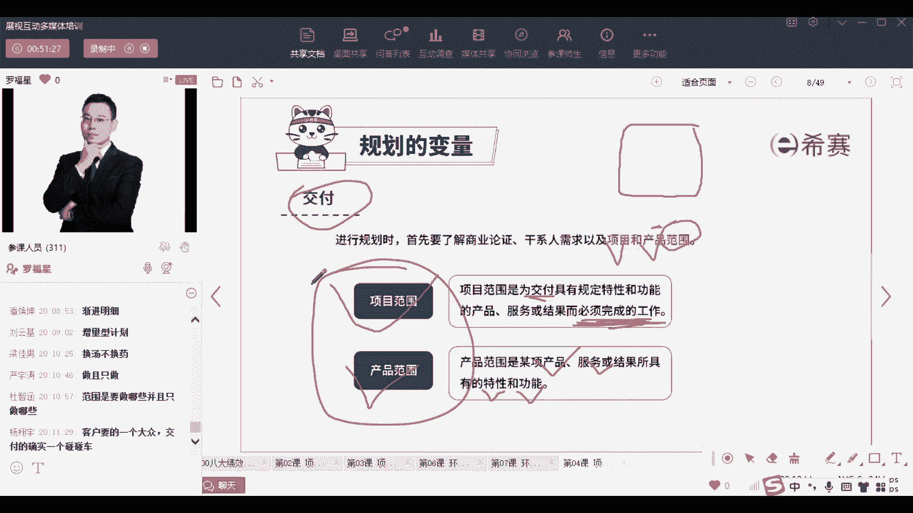

# PMP认证考试PMBOK第七版精讲课程完整126集！ - P70：PMP第七版8大绩效域之04规划绩效域-上 - PMP项目管理 - BV1RwYYe4EDN

大家晚上好，欢迎来到西夏晚专业的职业教育平台，我是罗福兴，那今天晚上呢，我们花一些时间来一起看PMP课程，第四章项目绩效预规划，绩效预规划也可能叫计划，其实规划呀，计划呀它就是一个单词啊。

其实都就是一个单词，就是plan，那么也就是说关于做计划的这个事儿，我们专门去把所有跟做计划相关的事情，把它放到一起来来说一说，你看一下规划绩效率，它是要干什么，整个规划绩效率。

它设计的是为了交付那些可交付成果和结果，我们去他所所需要的这些初始的，以及持续进行演变组织的一些相关的活动啊，这个词好拗口啊，就是为了去交付某个结果，所需要一些初始的活动以及持续的活动。

那我们需要把那些东西给拎出来，所以呢整个绩效预中我把这一句话给圈红了，就是我把它改了一下啊，你们如果说有一些同学手上有新的讲义的话，我把这句话我把这一句话给全红了，就是说整个做规划绩效与，其实目的。

就是能够去做出一个有一种交付项目成果的，一种整体方法，就是给到一套方法，能帮助我们来交付可交付成果，可以理解吗，就是咱们这个计划就是你做了一个计划，你这个计划能够帮助我们去交付可交付成果。

就是能够去完成这个工作内容，这是这样一个交付绩效育，他有规划计教育他要干的事情，我们来读一下啊，有效的去执行这个规划，绩效率的话呢，他说产生预期的结果，第一个是有条理的统协调一致的。

经过周密思考的一些方法推进，那不就是说做一个这个计划，这个计划能够经过领导们的同意，能够论证过的计划啊，对吧，给的是这个，然后呢是有一套能够交付成果的，这样一个整体方法，就是一套技法。

能够对于这些东西来不断的做出一些，演变的说明，OK有一堆信息来告诉我们，如果发生一些改变，发生一些变更，我们可以怎么做，可以怎么做呢，如果是预测性的项目，你就有变更走流程的方式来做，如果是敏捷型的项目。

你就用拥抱变化的方式来去做，总之呢你只要有变化，我有都有一套规范来去应对着好，然后就是规划所需要的这些时间，OK那不就是进度管理吗，然后规划足够的对信息来去管理相关方的期望，就是其实是沟通管理啊。

其实是沟通管理，就是相关方他需要什么东西，我们可以通过什么样的方式，来让他去获得这样一些东西，然后这样的话他心里面是踏实的，还包括说有一个东西是能够对计划进行调整，也就是说咱们这里做的这个计划。

计划赶不上变化呀，他可能有一些需要去改的地方，那么如果有改的地方呢，没关系，不要怕，我们在这里也包含，专门有一套能够对于这种计划进行调整的计划，也在这里面，OK这是规划绩效率，他所关心的东西。

那整个规划计划里面有这样一些名词，我们来提前认识一下，当然我们后面会展开啊，比方说关于估算，我们会在成本管理中去展开，关于精度，精度和那个就是精确度和准确度，我们会在质量管理中展开赶工，快速跟进。

会在成本会在进度管理中展开，然后预算也是在成本管理中展开啊，但是我们先来认识一下，先来稍微认识一下，首先什么叫估算呢，就是我们可能会对于要做这个事情，咱们得需要多少人力资源去完成对吧。

我们需要多少人力的投入，我们需要多少物力的投入，我们需要多少时间的投入，以及我们需要多少成本的投入，这些东西咱都要做一个估算，而这个估算呢它其实不是一个精确值，是一个大概的值，也就说是一个近似的估算啊。

这要个近似的估算，首先会先认识一下，我们我们今天都是先过一过啊，啊先做一个大致的估算，然后呢还有一个叫预算，那预算呢其实就是说经过批准的，谁来批准，领导们批准，经过领导们批准的这样一个估算啊。

前面讲了一些定语，对什么什么什么什么什么做活动的，其实也就是咱做好这个项目得花多少钱，得投入多少钱，得这个东西的估算，然后如果是领导们批准同意了，他就叫做项目的预算，OK这是这个词。

然后再来看两个词叫准确度和精确度，那准确度和精确度呢，我们直接看这张图片可能会来的更清晰一点，耶耶耶耶耶耶耶，讲了算了，他这没有讲准确度，首先说一个准确度，什么叫准确度呢。

就是咱们做的这个结果它能够接近于真实值，做的这个结果能够接近于真实值，这个呢叫很准确，就是准不准确，就离这个真实值靠的是不是很近，叫很准确，那什么叫精确呢，精确就是我做了很多次估算，那估算的很聚焦。

我每一次的估算它都离这个结果都比较相近，相似，就结果很聚焦，那么这种呢叫精确，这个我们在质量管理中还会再展开来说一，说好再来认识两个词，一个叫赶工，一个叫快速跟进，这两个词它们是干什么的呢。

就是当进度有落后的时候，我想要去压缩进度，那我要如果要压缩进度的话，我该怎么办呢，我要通过用什么样的方式来去压缩进度呢，一种方式是通过赶工的方式，通过赶工就是增加资源，比方说我多安排一些人手过来。

来帮你完成这些工作，这样的话可以做的更快对吧，人手越多的话，人多力量大嘛，人手越多对就是这样就会比较快，这是一种赶赶工的方式，还有一种赶工的方式呢，虽然我不能够多安排人手，但是可以加班呢。

你本来只工作八个小时，那么996是福报，让你工作十个小时，你就多来一些时间，你每天多两个小时，你四天就多了八个小时，你四天就相当于多出一天的工作出来，所以这也是赶工，不管是加资源也好。

还是延长工作时间也好，这都是在做赶工的这样一种进度压缩的方式，那除了赶工这种方式以外呢，还有另外一种方式叫快速跟进，那快速跟进它是什么意思呢，本来说好了，这个事情是做完A然后再做B做完B再做C。

做完C再做D本来是一串一串轮着来的对吧，但是现在呀觉得时间来不及，来不及，怎么呢，A还没有完全做完的时候，B就已经开始了，B才做了一点点，C就已经开始了，就他们就是嵌套着来进行。

就是能够去原来是这样来去做，这样来去做，这样来去做，现在是这样来去做，这样来去做，这样来去做，OK现在是这样来去做，就顶着顶着来的这种方式，这就是把原来串行的事情，咱们现在并行并行的方式来去开展。

对这就是快速跟进，好我们把这几个词稍微认识了一下啊，你有一个简单的印象就可以了，没有咱们在这里没有去展开来讲，然后接下来来看到整个规划过程中，其实我们去做计划呀，有意一些项目。

你是可以一开始就清晰的目标，就开始做一个非常详细和细致的计划，但是并不是每个项目都有这种机会哦，所以还有一些项目呢，我们是一开始做一个叫高层级的规划，什么叫高层级，其实就是颗粒度比较粗。

就颗粒度比较粗的计划叫高层级的计划，可以理解吗，就是很大颗粒啊，大颗粒，大颗粒就很大颗粒的计划叫高层级的计划，一开始做了一个高层级的计划，大概列出来，我们可能啊要做什么，要做什么东西。

然后再往后面去慢慢去细，怎么细化呢，啊到后面去做一个列出一个愿景是什么样，然后再去做商业论证啊，再去做项目章程啊，再去做那种发布计划呀，再去做迭代计划呀，就一点一点的去往下面来。

所以他有可能会是通过一种某一种方式，来去做出一个计划，但是这个计划呢可以是一开始就很很细致，但也可以是一开始很粗略，对很粗略，很大框架，然后慢慢做着做着逐渐的去清晰，这都是可以的，OK这是都是可以规划。

所以你看整个规划的目的就是积极主动去做定，制定一些方法来帮我们，对于后面如何去创造成果来做指导，就是你做了计划以后，后面就是一步一步按部就班的去做，你只要按部就班的去做，就能做出结果来，这是规划绩效率。

他在干的事情，OK那整个规划绩效与里面呢，他说其实有很多东西需要去考虑，比方说我们要去做一个估算，估算什么呢，我们要去估算他的时间呢，我们要去估算它的成本呢，我们要去估算它的资源呢。

但这几个词是我后来加上去的，因为我觉得加上去以后，你可能会看的更清晰啊，所以我们需要去做一些，这也是在做规划的事情啊，我们还要做什么呢，我们还要做一些预算，预算由哪些东西组成呢，也要去搞搞清楚。

还有就是关于进度，进度规划，那我们做进度的规划的话，有些什么样的步骤，第一步，第二步，第三步，第四步，让我们搞搞清楚做进度的规划的步骤是什么，还有给了一个词呢，就是规划的交付，什么叫交付。

其实关注的是范围，也就是说我们最后要交付一些什么东西，交付什么东西呢，这就是我们项目的范围，把这项目的范围给搞搞清楚，所以开始有同学在问说啊，变化很变化很大，对样子看上去变化很大。

但其实你如果仔细去看明白以后，发现他内里的逻辑还是一样的，内在的东西还是一样的，它就是一个新瓶装老酒，就这么一个东西啊，好那我们一起来展开看一下这几个点，做规划的时候，首先是交付，交付什么呢。

你要关注的是范围，关注的范围，什么叫范围，就要要做哪些东西，不做哪些东西，这个就叫范围，要做哪些东西，不做哪些东西，这是范围，并且呢我们一般是说做且只做所要做的东西，所以规划的时候我们就需要去搞。

搞清楚我们的范围范围，包括项目的范围，也包括产品的范围，这个呢在是那个范围管理那一章会展开讲，但是你先了解一下产品的范围，他就是说我这个产品需要什么呃，服务啊，需要什么特性呢，需要什么功能啊之类的。

比方说你要装修一个房子，你要的东西是什么样子，最后呢基于你所要的东西，我给你做了一个效果图哇，那个效果图非常漂亮，像一个皇凡尔赛宫殿一样的漂亮，那就是你的一个产品的范围，那项目的范围呢。

它是说我为了去交付这一个凡尔赛宫电，我需要去具体做哪些具体的工作，我为了去交付这些东西而必须完成的工作，比方说我可能需要去在地下面挖一个渠，挖一个孔啊，然后在里面去埋一根电线呐，然后上面搞一些水泥啊。

还要去找平呢，然后还要去贴贴地砖呢，我要做很多很多具体的事项，那些事项呢在这个效果图中是看不到的，就是在效果图中是看不到的，你需要去你需要去一点一点去做到，那么这些呢就是项目的范围。

或者咱们可以理解为叫施工图纸，就我的这个施工图纸能够告诉你具体怎么做，所以你现在要认识一下，我们去做规划的时候啊，先搞搞清楚我们的范围。

包括产品范围。