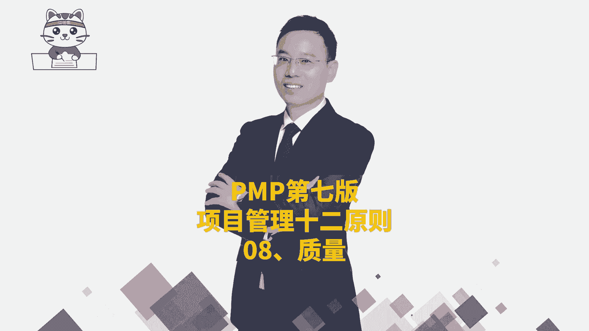
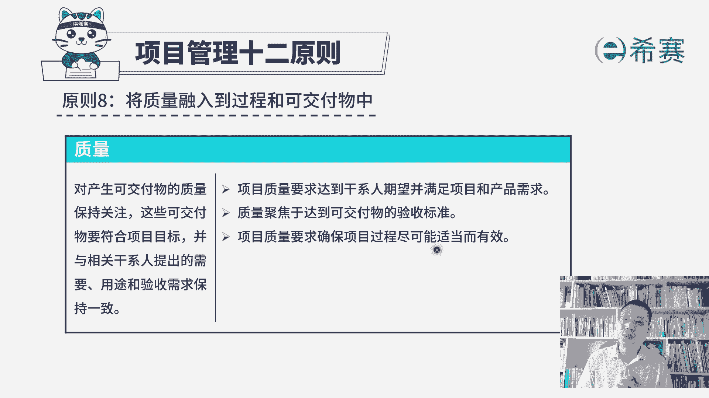
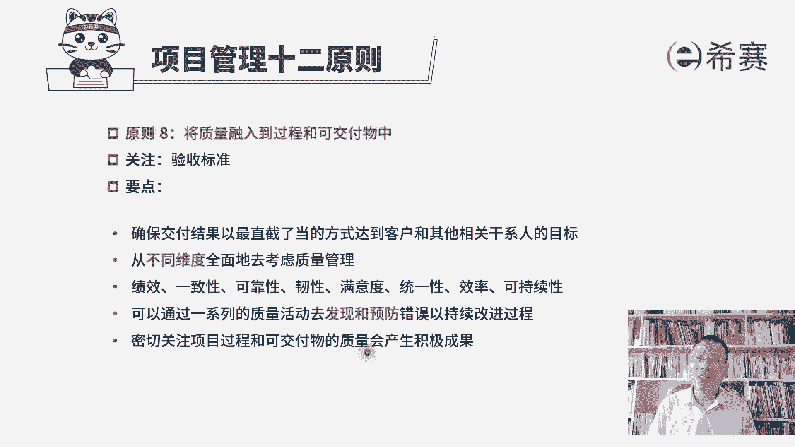

# PMP认证考试PMBOK第七版精讲课程完整126集！ - P55：PMP第七版项目管理原则之08质量 - PMP项目管理 - BV1RwYYe4EDN

接下来我们一起看到的是项目管理师啊，原则的第八条，叫把质量融入到过程和可交付成果中啊，我们在前面的预测型项目管理中呢，专门有讲到质量，其实质量我们既要去在开始制定一个质量，测量指标。

制定一个质量管理计划，在整个做项目的过程中呢，我们需要去管理好质量，要实施质量保证，并且呢我们对于做出的成果需要去控制质量来，去确保这些东西的质量没问题，然后才去走确认范围来进行验收。

走最后的结束项目或阶段来进行项目大的验收，所以你会发现项目验收它的一个前提条件，就是这些东西的质量没毛病，等到后面我们再去学敏捷的时候，你也会发现敏捷中它会特别强调的是什么呢。

我们要去交付一个可工作的软件，可用的软件，那这个可工作可用它的前提是质量没毛病，如果质量都不能达标，那别人是没有办法用的，所以质量在整个项目的过程中，其实是非常重要的一个内容。

那我们一起来看一下项目管理原则，第八条中的质量，这个板块对应产生可交付物的质量，保持关注，这些可交付物它需要符合项目的目标，并与相关干系人提出的需要，用途和验收需求保持一致。

也就是说对方他对这个项目希望做成什么样子，希望包含什么功能，那这样一些测量指标我们都要去满足它，能够达到他的一个验收的标准啊，所以展开来看的算，项目质量要求达到干系人7万。

并且呢能够满足项目和产品的需求，也就是说客户或者是相关方干系人，他们对这个项目有什么样一些期待和要求，我们是能够去做到他的这个基本程度，质量是聚焦于达到可交付成果的验收标准，这个点很重要。

就是我们的东西是不是做得越好，才是一个好事情呢，我们前面学过项目质量管理，其实你大概知道，如果你希望那个东西的质量，达到一个极其好的一个状态，你需要付出代价是很昂贵的，而我们每一个项目呢。

他都有一定的资金，对应的，它就会有一个质量的一个标准，理论上来讲是刚好够用，刚好达标是最为合适的一个状态，并不是越高越好，因为每一份质量的提高都是带着金钱的味道，好在第三句，项目质量要求。

确保项目过程尽可能适当而有效，所谓的这个适当而有效，他讲的是什么呢，就是为我们后面的敏捷项目管理来做一个铺垫，这并不是说每一个项目，它都是像我们在预测型项目管理中，一开始就完全定好这些指标啊。

然后就去去落实，去执行，然后去检查质量，在敏捷中可能某一些需求他提出来，直到我们在某一轮迭代开发的时候，才会定好它的一个DOOD叫验收的标准，或叫完成定义，所以他是在持续的过程中会逐步去定义清楚。

并且逐步去落实，您只要知道他会用一种迭代的方式，用一种敏捷的方式来去完成就没毛病。

那我们来一起看一下关于这条原则，将质量融入到过程和可交付成果中，他关注的焦点其实是质量，关于这个项目它的这个验收标准，或者说是具体的可交付成果，它的验收标准，那这里要领有这样几个，第一个。

要确保交付结果，以最直截了当的方式来达到，客户或其他相关方案的这一个目标，就是满足客户的要求，包括质量的要求，以及他的这个验收的要求好，第二句，从不同维度来全面的去考虑项目的质量，哪些维度呀，关于绩效。

关于一致性，关于可靠性，韧性，满意度，统一性，效率可持续性，那这些词里面可能有一个词叫任性，你不是很好去理解，我们前面稍微讲过一个词，说一个东西弹下去，然后又弹上来，他重新回到原有的这个状态。

这是所谓的韧性，也就是说他面对挫折和困难，能够恢复到原来状态，这个能力，这叫任性，我们做某一些产品的时候，他需要考虑到这样一种韧性，你可能从一些枪战片里面看到，类似这样的一个桥段，一把枪扔过来。

结果没接住，然后掉到地上，他都已经是摔开了，但是你把它重新组装以后，依然可以瞄准你看啪啪啪啪诶，这也是它的一种任性，就是他能够去对抗这种环境的破坏，依然可以恢复到原有的状态。

但这只是任性的一个小小的维度解释啊，你要知道一下，我们在做项目质量的时候呢，要把这些因素都考虑进来，那还有一个关于可持续性嗯，你可以把它叫做循环的概念，就是去生产这个原材料，去组装这个产品，去卖给客户。

去使用，客户用完以后啊，把它丢掉，那丢掉丢弃的东西他又可以去回收利用，可以去回收其中的一些些的原部件，哎这都是一种所谓的可持续好，接下来看到下一句，说可以通过一系列质量活动去发现和预防错误，以持续改进。

所以这里面会讲到那个质量的持续改进，我们有一个叫PDCA循环，那通过这个PDC循环不断去优化改进，优化改进，并且前面在讲质量的这一些个呃原理的时候，有讲过说预防胜于检查，因为检查。

你只能去把那些已经产生的错误给挑出来，而预防是尽量让它少产生错误，甚至不产生错误，所以这都是跟我们项目质量管理那一段，是完全相关的，一致的，密切关注项目过程和可交付成果的质量，会产生积极的成果。

什么积极的成果能够更好的去通过验收啊，对不对，所以这是关于项目管理12条原则的第八条，将质量融入到过程和可交付成果中。

关注质量。