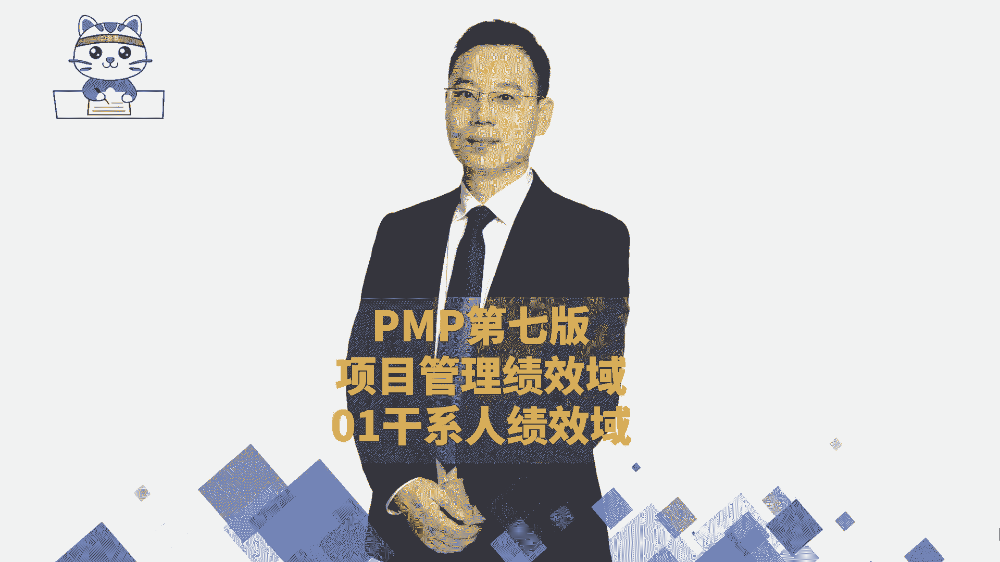
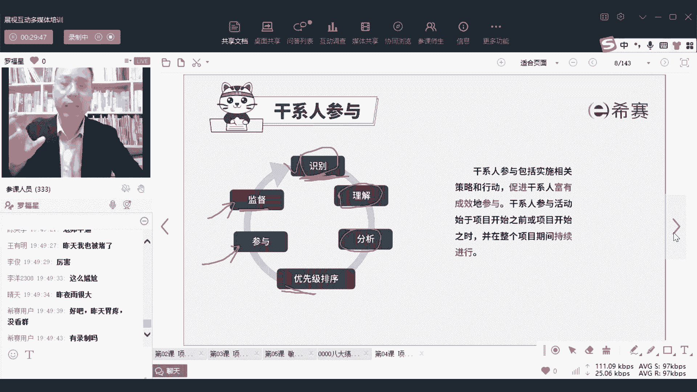

# PMP认证考试PMBOK第七版精讲课程完整126集！ - P60：PMP第七版8大绩效域之01干系人绩效域-上 - PMP项目管理 - BV1RwYYe4EDN

大家晚上好，欢迎来到西塞晚专业的职业教育平台，我是罗福兴，那今天晚上我们一起来看到的是偏僻课程的，第四课叫项目管理绩效预呃，这个内容呢是咱们第七版教程里面新增的内容，而这个新增内容它跟啊。

我们在之前第六版里面所讲的内容，其实本质上是一样的，它只是换一种形式来去包装，我们会花一节半课的时间来完成，今天可能会讲六个绩效语，然后剩下两个呢在下一次课程讲，当然啦，这个课程内容呢。

它其实相对来讲是以概要的这种形式来去介绍，因为具体内容展开会是在后面啊，所以呢我们会是有这样一个方式，大家尽量是能够去理解就好，并且呢我今天是在群里面给大家发了一个，关于880视频教程。

和我们现在这个课程的对照表，你可以看一下880视频课程和这个直播课程，它的对照表能够比较清晰的去看到，我还做了一个备注，哪一些东西是可以跳过，哪一些东西是可以去理解啊，这个呢其实概要性的东西具体很多。

详细的内容，我们都会是从第六讲开始再展开来讲，会是这样一个情况啊，整个八大绩效域，首先来认识一下什么叫绩效玉呢，绩效玉其实啊我们经常会说到啊，你是什么区域对吧，你是什么领域。

这个区域领域其实就是一个范围，你可以把它理解是一个范围，那项目的绩效率，它是指我们去做项目的时候呀，要去完成一些事情，才能够达到一个结果，如果我想要去交付一个结果的话，我可能需要去做很多很多的事情。

也就是说做很多相关的活动，那跟某一个东西相关联的，所有这种重要的活动放到一起来，就给它取一个名字叫绩效玉，打个比方，我们拿干系人来举例的话，就是首先你得要知道什么叫干系人呢，所有会影响这个项目的人员。

以及所有会被项目所影响的人员，他都叫干系人对吧，那么项目干系人这个绩效率，他讲的就说所有跟我们去处理干系人关系，去争取干系人，去让干系人支持这个项目，让干系人把这个抵制变得更低，而做的努力做的各种活动。

他们都是干系人，绩效欲里面的内容可以理解吗，所以绩效与绩效率，其实也就是说，所有跟这个领域相关的所谓的活动的集合，叫绩效率，而事实上项目管理，它的第七版教材里面给了八大绩效语，而这八大绩效语呢。

它们之间呢其实没有说切割的特别的完整，它们之间有很多的关联关系，有很多的依赖关系，我们只需要去理理解它的意思就可以了啊，理解这八大绩效率的意思，而这具体的八大绩效率呢，一个是干系人的绩效率。

一个是团队的绩效率，一个是开发方法和生命周期计划工作交付，还有呢是测量和不确定性，那我们今天的话大概率会讲完这六个，我们大概率会讲完前六个，然后后面还有两个呢留到下一次课程，因为这个内容其实有点多啊。

我在给你们讲的时候呢，我会是去我稍微筛选了一下，我稍微去删减了一些些，把有一些不那么重要的东西，留着文字的东西你自己去看，我会希望是通过的，讲完以后，你再去看这个章节的讲义，你能够比较好的去理解它。

学一个东西他没有办法说那么快，听一次就全部都记住，我相信没有几个人有这个能力和水平，我自己也没有，所以我们学习的话，他其实既要学理解，然后再去回顾啊，要要有这样一个过程啊，好了，那我们就一起来开始。

看到的是第一个绩效率，叫项目的干系人的绩效率嗯，首先干系人绩效玉啊，他讲的是所有涉及到跟干系人相关的这些活动，所有跟干系人相关的活动，也就是说你要知道呃，这个项目呢你们的团队成员。

他是一个重要的干系人呃，你的那个项目经理，你你自己啊，你就是项目经理是干系人，你可能会有你的领导，你可能会有一些什么财务的经理啊，职能经理呀，人事部经理呀，他们都是干系人，那还有就是你的客户呀。

你的客户的领导呀，那你的监理方呢，你的各种供应商呢，他们全部都是你的干系人，而咱们做好干系人的这个绩效率，其实就是要想办法，让大家更好的去支持这个项目，把这个项目能够往前去推动，让这个知识变得更大。

让这个抵制变得更小，这就是干纪人纪效玉他要干的事情，所以我们会看到说，如果要有效的去执行这样一个干系人，绩效率的话呢，将会产生以下的这些预期成果，也就是说我们如果做好了干系人的管理，会希望有什么结果呢。

一个是能够在整个项目期间，与干系人建立一个良好的工作关系，什么叫良好的工作关系，就是呃它能够比较好的去支持，支持越多越好，它能够比较少的去抵制，抵制越小越好，能够让这个项目能够去往前推进。

所以他这边给了一个词叫富有成效，而这个富有成效，其实就是让他的支持变得大大的，让他抵制，变得小小的，让这个项目能够有效地往前去推进，唉这就是有富有成效的这样一个工作关系，那具体的表现形式呢。

首先第一个是他们的这一个对项目的目标，达成情况表示一致，表示同意呃，干西人其实会有很多种啊，你知道就说我们说经常会讲到一个词，有人的地方就有江湖，有人的地方就有是非，有人的地方就有争执。

那么关于这一个项目，有人会支持他，也有人会抵制他，那那些会这个对这个项目来讲，而他会受益的这个群体呢，他们应该是对这个项目表示支持，并且呢对这个项目的结果也觉得还不错，会支持会满意。

那也有一些人他是会反对这个项目的对吧，他会对这个项目反对，这个人呢要想办法让这些反对的人，尽量是不要产生那么多的负面的影响，OK他是不会，OK请注意是说让他不会产生负面的影响，至于说它会不会产生。

不一定，但是我们至少是尽量让这个负面影响，在你能够控制的范围之内，在你能够控制的范围之内嗯，我看一下啊，梁梦琪问了一个问题，说对于项目或其交付表示反对的干系人，不会对项目产生负面影响。

为什么不会产生负面影响，这就是说你要想办法去争取它呀，我们在谍战剧里面有一个词叫策反呃，大家知道吗，就是你要去把那个本来他是你的敌人的那个人，你要把他策反过来，让他成为你的人。

你让那些本来对这个事情是抵制，你能够去游说他，你能够去说服他，让他成为你的人，或者让他能够去支持这个项目，哈哈是这个意思，你能够理解吗，或者说你在一定的程度上去满足它，让他能够在一定程度上。

对你的这个抵制没有那么大，让他的火气变得没有那么大，不要那么着急，好不好，我们先我们先把这个主体内容讲完，讲完以后，大家的这种问题，我们在一起来慢慢的去考虑好吗，这个绩效率怎么样去衡量。

其实有个最简单的方式，你会发现如果你翻过教材的话，或者你翻过这一章的讲义的话，他在最后面其实都会有一个测量，OK都会有一个检查结果，仔细去看一看好不好，我们一起来顺着思路往下面看啊。

那么首先你得要认识一下什么是干系人，干系人是包括我们项目团队成员，包括项目经理自己，包括大家以及你的一些啊项目管理办公室啊，你的领导们呐，什么指导委员会，委员会这个是什么概念呢，委员会这个词其实是呃。

你可以把它理解为就是一小撮人，一小拨人，这一拨人他可能会组成一个小的团体，对于这个项目有一定的这种职能性的指导，比方说他是专门去指导你干什么事情，这是指导委员会，他是专门负责去做一些变更控制。

这是变更控制的委员会，而他是翻专门负责善食伙食，这一块的，那么是伙食膳食的委员会，你可以这样来去理解，就是可能嗯，你想比方说我们国家每一次发生什么样的一种，地质灾害的时候，来去到当地来去指挥救援。

委员会，委员会这个词，你把它简单这样理解就好了，那么就是生产的指导委员会，他是管销售，那可能是销售的这个什么什么的什么的，这种策划的委员会，类似这样的，他如果专门管变更。

那就是变更的管理委员会这个意思啊，这是生活中的一个词汇啊，这是生活中的一个词汇，它不是我们的这个科目的专有词汇，你有兴趣你也可以去搜一下这个词好不好，我只想给你解释一下，简单来讲就是领导们啊。

第二个板块呢就是领导们就除了你们自己以外，还有领导们啊，也是你的干系人，那除此以外呢，还有就是各路客户啊，客户包括用户都是你的干系人，还有就是你的供应商，他也是你的干系人。

比方比方说你现在做了一个什么什么项目，你这个项目呢是给全国人民去使用的，那么全国人民他都是你的干系人啊，那你先想干系人这么多，能够让所有干系人都满意吗，其实很难，你没有。

你有可能没有办法让所有的干系人都满意，但是你会让大部分或者对你来讲，很重要的干系人去满意，这就已经足够了，所以在这在这一条里面的说，让那些反对人尽量的不要产生负面影响，就是他们的负面影响。

其实是在一个比较小的范围内，在一个可控的范围内，在一个可控的范围内，OK那竞争对手是不是干系人，当然是干系人，因为竞争对手会不会受到你这个项目的影响，他一定会受到你这个项目的影响。

所以他一定是你的重要的干系人，他会不会支持你这个项目，他不太会支持，但是你可以怎么样去做到它，就是怎么样去争取它，你可能有一种更好的方式，就是去保密，你把这个项目做到极其的保密。

然后突然有一天把这个项目拿出来的时候，突然对对方才发现哦，他是你你你犯出了一个杀手锏，就类似这个意思啊，所以这个话，你不要用那种很死板的方式去理解啊，这里我也要先提前给大家打一个预告啊。

就是说我们的这样一个项目管理的课程呢，你不要用那种很死板的语文，小时候那种那种方式去理解，非得是指能量，即使生活啊，工作呀，场景啊，他都有很多灵活性，你要大概能够理解这个意图和意思就可以了。

那些反对的人，他肯定是不希望你这个项目成功的，那你怎么样让他的影响变得更小啊，比方说你就能够做到很好的保密，而不让别人去知道，这也是一种方式嘛，对不对，方式有很多啊，那我们整个项目干系人。

就是要想办法去让那些知识人，知识的人尽量多的去参与这个项目，去支持项目，让那些反对的人尽量的是不去反对这个项目啊，尽量的甚至能够变得反向来支持这个项目啊，对吧，用这种方式来去做。

你看积极以培养积极的这样一个关系，什么叫积极的关系，就是把这个事情能够往正向去推进的关系，叫积极的关系，那你们一般跟客户是怎么搞关系的，兄弟姐妹，你们是怎么跟客户搞关系的。

是不是有的时候也会给客户去送点什么呀，什么请请他们去吃吃喝喝呀，呃去什么一条龙啊之类的对吧，你一定会有你的一些方式和套路的，你总有你的一些方式和方法对吧，嗯这有一些东西可能上不了台面，但是你自己懂的啊。

你自己懂就好，那事实上呢，我们如果要去做好这样一个干系人的话，你其实有很多事情需要去做，那首先你要去识别累一些人跟你这个项目相关，你现在要去知道哪一些人跟你这个项目相关，对吧，你去理解到了解到呃。

如果大家有预习到比较后面的内容，题目就是如果有同学已经是预习到那个项目的，干系人管理那一章，就第13章干系人管理这一章的话，你可能看过，我当时在880中讲过一个案例，就是我以前有一个同事。

他也是我的老乡呃，我跟他去吐槽一个另外一个部门的领导，因为那个部门领导老是找我做事情，但是从来找我做了事情以后就没有了，然后也没有去告诉我这个事情成成了，也没有说这个事情没有成，也没有对你表示感谢。

啥也没有，一次两次三次四次，你就会会觉得这个人很那个，而且结果后面我跟那个跟我那个老乡去吐槽，那个人，后来的后来我才知道他们是两口子哇，这种就是很典型的没有去识别到干系人，你没有去识别到干系。

这是一个很很扯的一个事情，对不对，那你要去做好干系人管理，你一定要提前去识别到这个群体，一定要尽量提前去识别到它啊，然后呢你去理解他们的这些个啊，各种一些具体情况呢，需求啊啊权利呀什么。

这样去分析他们这种喜好呀，各方面的事情，而干系人有很多，你可能没有办法把所有人都去满足，你可以怎么办呢，我们可以做优先级排序，我们可以把这些干系人做优先级排序，累一弦是最最重要的方案。

比较靠重要的位置去对待，累一弦是没有那么重要的，我们可以放在一个比较靠后的方式去对待对吧，那么你对于领导，对于客户，客户的领导，那你一定是很要重点去管理，重点去对待的人群，那对于某一个小小的一个职员。

他对这个项目无关紧要的人，你可能就不那么重视对吧，然后呢，接下来就是要鼓励他们去参与，你要想尽办法让这些人更好的去配合你，去做这个项目，去支持这个项目，但是你又不是他的领导，你又不能去管理他。

你又不能去要求他，那你可以通过你的影响力去影响他，你可以通过你一一定的影响力去影响他，让他更好的去支持，或者是至少让他没有那么的去反对，那当然了，在整个做的过程中呢，我们还要去监督一下。

看咱们去争取它的时候，争取的怎么样，有没有很好的去争取到，如果没有争取到的话呢，那我们可能还要再调整一些策略，我们要调整一些策略来去满足大家，那打个比方，昨天晚上我要给你们上课。

但是因为我自己的电脑还是网络，不知道什么原因导致没有上成，没有上乘以后，我做了一个什么事情呢，我回到家以后，我还是给大家去上了大概有几10分钟的课程啊，40多分钟来去做一个答疑。

那我为什么要去做这样一答疑呢，我能不能直接去结束掉呃，我其实也可以结束掉对吧，当时我们的那个工作人员，已经是给大家发了个信息，说，因为我在堵车，昨天确实很堵车啊，就是长沙在下雨下暴雨。

但是我想我还是有必要去做一点点措施来去，让大家的感受会稍微好一点点，对不对，所以我在做这个监督干线参与的过程中，哎我会去用我的方式，那我就那牺牲一下我自己的时间，来去满足一下大家咯，就这样子吗。

OK不知道什么会什么情况，我昨天不是发群里面了吗，都没有看群，我发到群里面了啊，我特意发了个截图，发到哪个群里面了，回头要认真看一下老师发的信息啊，好了，至少你知道就说我们做干系人参与的。

他也会有一套流程，也有也有一套流程来做事情，第一步，第二步，第三步，第四步对吧，有一套流程来做这个事情，而整个要做这些事情的话，结果其实是希望他能够更好地支持这个项目。

有录有录录下来了。