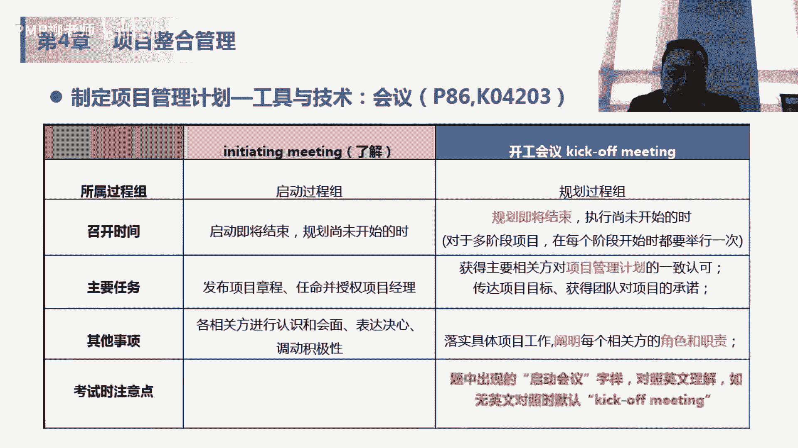
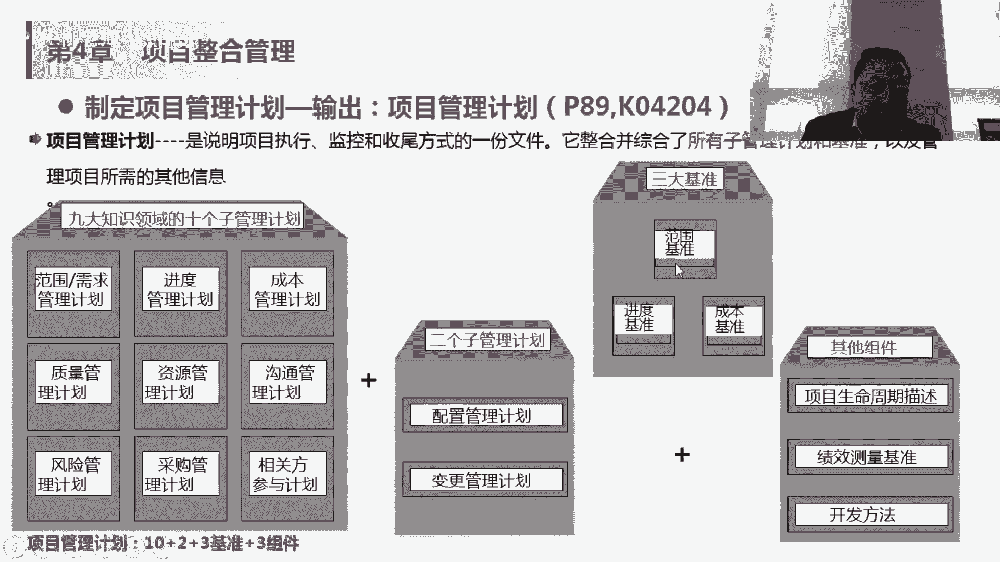
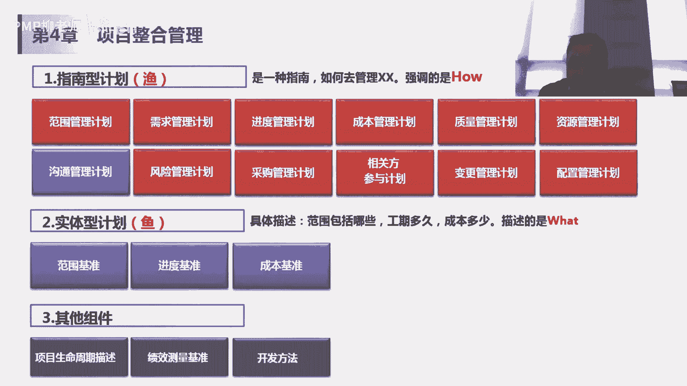
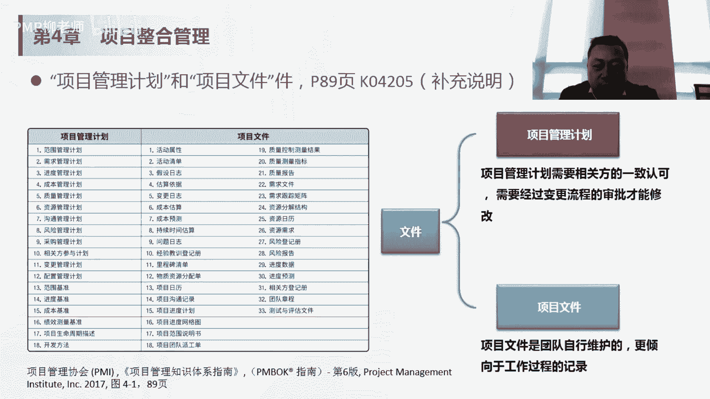
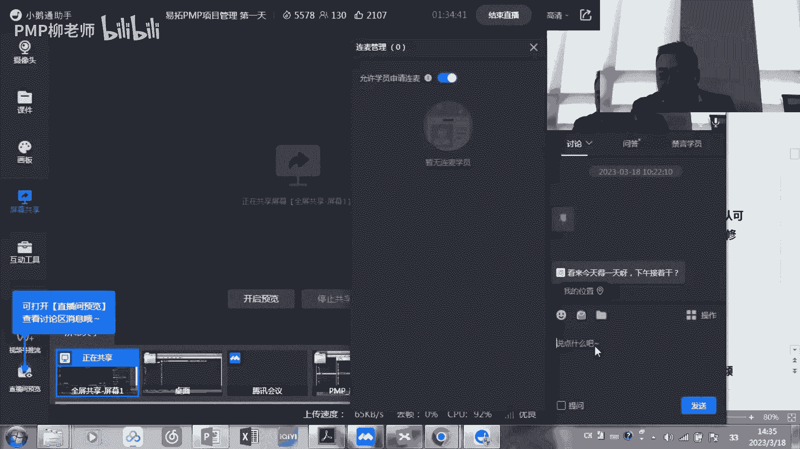
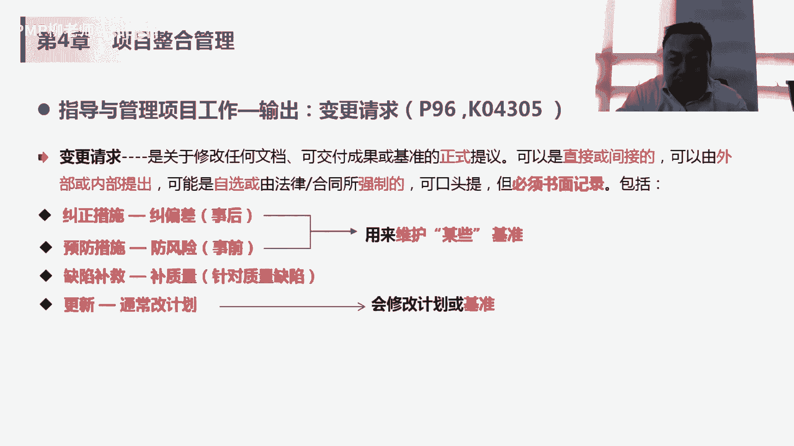

# PMP认证考试课程备考课程 短期冲刺3A 免费观看视频教程 - P1：PMP认证考试课程备考课程（13）零基础一次通过项目管理PMP考试 包过 - PMP土豆学长 - BV1Lo4y1c7C3

第二个项目计划的话，尽可能的话是要有项目团队参与会更好，项目的团队参与的话，会提高他们对这个项目的承诺，这个项目这个设计估了三天，将来女方老师说哎我过了三天，我就得按三天晚上做出来。

我过两天冯老师不认可，说这个明显是三天的活，你项目经理压我，你可以压我两天，他可能还是按照上面的去做，他不会有这个承诺，而如果他参与的话，比如说在这个阶段，我跟黄老师，咱们商量一下，其实我说过了。

黄老师，其实两天这个像没那么难，两天也能做，觉得你看第四天上海跟我沟通，说明对我还是比较重视，然后他就说了一个道理，两边做也不是做不了，那我就改天做出来，那这次可能到时候做的时候，可能两天就做出来了。

如果没有参与这个过程，可能这次会出现我过两天这样做，三天就做完，三天做，这样的话这个像计划，我玩两天多的地方就会有偏差，所以呢它会有一个在这个过程中，会有一个传达项目目标。

然后呢获得团队对项目承诺这样一个过程，那也是提提醒，就是团队尽可能的参与这个规划，但是通常有的时候可能项目不是所有人都到位，在规划阶段不是所有人都到位的话，有的时候可能还是需要在执行阶段。

项目经理对这个项目团队进行一些说服，后面我们讲冲突管理的时候，会有这种，所以这个take off meeting嗯应该是必考的，这个考点，但是大家记住k方meeting是在规划过程中，已经说明星的话。

这个大家应该一般不考，大家了解一下就行。

然后它的整体输出呢就是我们讲的刚才，九个知识领域的十个管理子计划，然后两个子管理计划啊，十个指管理计划和两个子管理计划，一共是12个管理计划加三个基准范围，提升进度，集成成本，利润。

和其他组件项目生命周期描述，绩效测量基准开发方法，如果问你，我们这个项目到底是用预测法还是用适应法，这个在哪定的，在项目管理计划里，然后呢是说诶我们怎么去度量成本，我们到底是用人月去度量成本。

还是用额人民币，还用dollar，是度量换成货币，是度量成本，这个东西也是在项目中的一个环节，别的地下测量的一个梯子啊，关于上升周期分多大阶段，每个阶段做什么事情，有有哪些这种我们讲那个阶段关口吧。

审核和这个决策，那这个是关于上升周期的这个描述，也是在这个项目管理计划里面，目前为止我们知道这个事情就可以了，12个指管理计划，三个基准，其他组件在这里，那接下来我们讲后面的话。

会把这个三轮管理计划和三个基准，从从头再讲一遍。

所以呢这个管理计划呢他也是，去分其实是不太一样的，第一个就是指南型计划，教你如何做，强调是how这个have里面这些里面没有真正的计划，所以没有真正计划，就是范围管理计划是告诉你怎么去管file的。

但是呢范围的这个最终的实体性计划呢，就是我们讲的这个范围基准，大概哪些是我们属于我们范围的，那进度管理计划是讲我们怎么去管进度，我们用人天做单位，还是什么样一个力度，做单位去去做管理一个进度。

那最终我要排出来的这个项目计划，放在某个时间段内的，比如说从6月3月份到5月份，我们做p p的这个认证班和3月份到4月份，我们讲前面五天的课，到后面怎么去做，这个属于进度基准。

它是放在这个实体性计划里面，包括成本也是一样的，这这些只是强调怎么管，但是真正，计划出来的东西，或者说将来我们作为变更变哪些东西的话，基准进度基准和成本基准，后面我们讲的时候，你看一个规划过程组。

大家看这个讲义行不看我们这个塑封这个材料，那规划过程组里面你看在范围，项目范围管理里面有绘画创业管理，收集需求，定义范围，创建w i p s，一直到创业打开b s为止，我们才能出现我们的范围精准。

才能出现我们刚才讲的这个实体编辑化，但是你说范围管理计划，它是指的讲如何管道的，那你像进度计划一直到6。5，制定进度计划的时候，所有这个五个过程完事之后，才能得到一个进度基准，那成本基准也是在7。1。

7。2，7。3之后得到一个成本基准，所以这个大家区分一下，这个子弹型计划和实体性计划方案，其他主页就可以了，三点水那个鱼吧是讲的如何捕鱼嘛，是halo，然后那个没有三点水，这个鱼是假的，真正的实体。

真正的鱼是what，这块肉这刚才讲那个指南形和实体型的话，其实刚才我们对所有规划过程都是适用的，对一般来说，计划里面没计划是指的，计划里面他讲的是怎么做，具体的计划是在这个范围基准其他里面去做的。

这个我们后面一直会强调的，这个考试应该不考，但是有助于理解我们这个计划和基准，它们之间的这个差异差别。

你看这里举了一个例子，进度管理计划，那我们讨论方法论和工具，我们用project这个软件，用关键路径法来排进度，那我们准确进度呢每个活动重复两天，那计量单位是天，我们cos临界值在进度偏差5%以内。

我们认为是可以ok的啊，可以接受的，肯定会解决，进度超过5%的话，需要及时纠正，但是真正的进度基准是这样的，我们在什么时间做什么事情，这是排的真正的进度计划，所以你看进度管理计划是告你怎么管。

然后呢进度基准呢是实体的，告诉你具体的分配到人呢，或者说分配到具体时间了，由谁来做什么什么事情，然后我们讲项目管理计划做完了之后，一定要相关方的这个批准，或者是主要相关方的批准。

会有一些题目考完了去考试，说诶我我项目计划已经做完了，我下一步要干嘛，是需要相关法来批准的，确保大家对这个项目管理计划的理解是一致的，然后呢这个批准了的这个计划的话，会作为主要相关方支持和承诺。

然后也会作为我们下面工作的一个baseline，批准和依据，不能随意修改，如果需要修改的话，一定要走变更流程，并且告知相关方，我们一会在这个4。6整体变更控制，实施整体变更控制里面会讲在什么的情况下。

我们需要走变更流程，变革流程是怎么样的，其中就有一项就是说哎不管成功与拒绝，这件事情要告知相关方，所以计划不是pm做完就ok了，还是需要批准的，然后呢对于计划的这个变更，要走变更流程。

那项目我们讲了项目管理计划，还有一些项目文件，它有什么区别，这个我觉得大家嗯这个也是一个考点哈，但是理解就行，项目管理计划，刚才我们讲了那18个对吧，12个计划加三个基准，再加三个其他的组件。

涉及到他们的变更，一定要走变更审批的流程，项目文件是团队自行维护的，更倾向于工作过程的记录，变更项目文件是不需要走变更流程的对吧，我们前面碰到的一个项目文件叫假设日式，假设日志是一个项目文件。

我们更改它里面会有假设和这些制约因素，而是不需要走别的流程，那后面我们会讲这个项目文件大概33个，这个项目文件哈，那我会在不同的过程中去讲，但是33个项目文件啊，不是每个都是考点吗。

有些考点有些是常考的啊，有些不太考的，我们就基本略过，所以这里会有一个这样的一个补充说明，项目文件是什么，管理计划是什么，然后如果辩证的话，需要做什么样的流程，嗯我们大概讲了一个半小时，呃。

我这样我开麦给大家开麦，然后有什么东西我们讨论一下，讨论之后呢，我们可以休息，诶已经开卖了。

大家有什么问题吗，就是我们今天讲的这个整合管理的两个过程中，还两个过程，制定项目章程和制定项目管理计划，所以这张大家记得他是个整合的概念，它不做具体的这个事情，这个我刚开始我们讲的那个火锅。

我不管这个羊肉是怎么来的，我不管这个青菜是什么样的，但是我要整个说谁去买羊肉，谁去做青菜，要大概要买多少对啊，要进行整合，我把这些东西最重起来，我把这个事实给你整出发了，好项目经理是有。

这个他要负这个整合的这个职责的，他不能迁移基准和机械，基准和基线的话是一个词，就是baseline，所谓baseline的话，比如说我们讲范围成本和进度会有一个贝斯拉，就刚才那个这个图这个例子吧。

我做完进度计划之后，我得到一个进度的基准，现在的这个比如说一点版，就是我的极限，如果我要改，我要走变更流程，变成1。1，那我就从极限一点变成1。11。1，如果是说客户已经ok可以变，那我1。

1就变成我现在的进度，记者，那下次再变的话，是在1。1的基础上去变的，我不知道这个有没有回答这个这里的问题，它不是一根线啊，它是一个计划，那成本计划的话就是说我在什么时候，我需要多少钱。

或者说多少资源这些东西范围计划的话，范围的极限的话是说我这个项目的这个产品，范围的项目范围是什么样的，包含哪些内容对吧，我这个产品包含哪些功能，这些东西作为一个我们固定下来的版本，要变的话。

要通过变更流程来走，一旦变更流程ok了，这部分变成纳入到极限了，那我们就会形成新的极限，形成1。11。22或者202点的极限，然后再基于这个极限，我们做我们的执行，按照我们修改后的这个进度管理计划啊。

修改后的进度机械，然后再实施，按这个进度去监控我们是不是按照极限走的，如果对于极限有达到一定的偏差以后，那我们就要采取相应的action，前面我们讲了，制定项目章程和制定项目管理计划，项目计划管理计划。

经过这个主要相关方的这个批准之后，下一步就是开干了，就是说指导和管理项目工作，那就是在执行阶段，这个比较理解起来比较简单啊，就是做项目管理计划中，我们做具体要做的东西，然后呢并实施以批准的变更。

嗯这块我们后面会讲，这是为什么是以批准的变更，该管理过程会实施已经计划好的项目活动，管理各种技术接口，组织接口和不说有编程影响，并实施已批准变更，收集工作绩效数据，我们讲工作绩效数据是在执行过程组里面。

产生的一个原始的数据哈，他后面对应的信息和报告，那原始数据是在这个执行过程中产生的，输入项目管理计划批准的变更请求，大家看一下这个哈，那在项目管理计划，我们刚才讲了，我们做了我们的18个12个子计划。

三个基准再加三个，其他供电用18个，如果要对它产生变化的时候，就要产生变更，要走变更流程，那所以呢是在执行工作过程中，会有这种变更的产生，那不管是变更产生哪儿，产生于哪。

只要是刚才讲的项目进化管理计划的相关辩论，都会产生变更请求a，那变更请求a呢，会在我们刚才讲的4。6里面，实施整体变更控制，也就是在监控过程组里面会被批准，或者是说被否决，如果是被批准的话，它会作为。

指导项目管理工作的输入，那这个变更已经审批过了，那我们还是要做呀，还是要干嘛，对他要作为批准的变更请求a，然后呢，和项目管理计划，作为它的输入到我们现在4。3，指导与项目管理项目工作里面。

在这个过程过程中有可能会产生电能请求对吧，有可能会产生a也有可能产生b，如果a已经被批准的话，a就会被纳入到，刚才我们讲的机械极限的1。1版本里面，或者是二点版本里面，然后在这个基础上又产生了变更。

可能会产生变更b那变更b还要走这个流程啊，走四次变更整体变更控制流程，如果被批准的话，还会变成这个输入批准门，变更请求b会作为具体我们工作的出，但是a和变更以批准的变更请求，a和变更请求b它不是一个。

虽然都是变更请求，但是它不是一个东西，这个能理解就是说你在过程中客户出来说哎，我要加一个功能，这时候提出一个变量请求a变更选项，a在通过这个整体变更控制之后，再通过批准了，那就变成以批准的。

这个变更是可以请求a要做吗，所以会变成输入，在做这输入的过程中，可能会产生别的哎变更请求，说我这个基准有变化，我要嗯延长工时或者增加成本啊，会产生其他的变动，请求这块有点绕，但是大家理解的是说。

为什么它的输入是批准的，变更请求。

