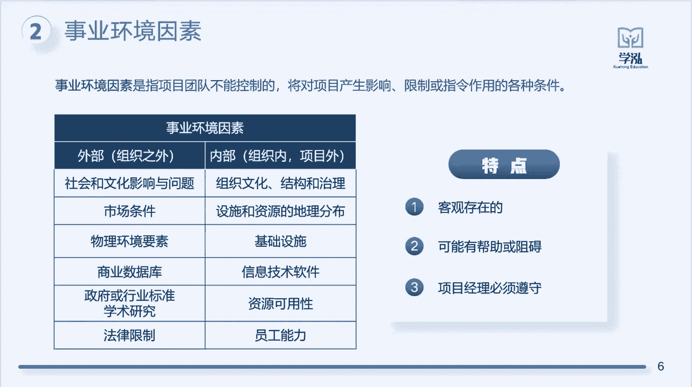

# PMP认证考试课程最新完整PMP免费课程零基础项目管理PMP考试第二章-项目运行环境2-事业环境 - P1 - 学泓教育PMP - BV1Np4y1m71X

我们一起来看一下什么是事业环境因素呢，我说作为一个打工人，我们上班的目的是什么，是赚钱对吧，是获取劳动报酬啊，那如果说哎我告诉你做传销啊，非常的赚钱对吧，像某某明星夫妇啊，就涉及引力传销这样的盆满钵满。

那如果是你，你要不要也加入呢，当然不行对吧，那么他俩的结果就是我们的前车之鉴啊，所以我们永远不能够去触碰法律，红线之外的事情，我们不能够去做越界的事情，我们必须要遵守法律法规啊对吧，比如说再比如说啊。

去年对吧，之前啊我们国家实施了双减政策，双减政策，那就是我们不允许孩子周末上补习班对吧，就所以的话呢如果是有这样的一个政策出现了，那如果是你，你还会继续做K12教育吗，肯定不会啦对吧，因为失去了市场了。

所以除了这种法律法规，我们是必须要去遵守的，还有什么需要遵守的，比如说我们公司内部，公司内部的话呢啊，一些公司的规章制度要不要遵守，我们做项目肯定不能够任性对吧，我们不能够去打破公司的一些规则啊。

所以像组织之外的一些法律法规对吧，政策条例，市场条件因素啊，以及我们公司内部的一些规章制度，那我们作为项目经理，我们能够去控制吗，能够去改变吗，改变不了，改变不了啊，所以对于这个事业环境因素的话呢。

我们就做了三个特点的一个总结啊，我们一起来看一下，首先第一条就是客观存在的，说到客观存在，我们会想到什么，马克思唯物主义对吧，不是不以人的意志为转移，嗯还有呢唯心主义对吧，唯心主义是什么。

就是我认为是怎样就怎样，但我要我觉得我不要你觉得对啊，所以作为事业环境因素的话呢，不会因为你不想让它存在，它就不存在了，那么结合到我们项目当中的话呢，就是不管你的这个项目存在与否，公司的制度。

国家的法律法规它都会存在那里对吧，不会因为你的这个项目的成败，而发生任何的变化啊，这就是它是客观存在的意思，好好第二条可能有帮助或者阻碍，因为它是客观存在的对吧，它不以人的意志为转移。

所以的话呢它带来的影响是不是也是客观的，也是客观的对吧，你像比如说啊前段时间疫情对吧，疫情的出现对你们的工作，对你们的项目会不会有影响，肯定会有影响，那是有好的影响还是有不好的影响呢。

这个有一个绝对的答案吗，没有是不是啊，这要取决于你做的是什么行业啊，如果说哎我的工作我是做企业管理培训，那我做这个项目的话呢，但是由于疫情的出现的话呢，国家不允许大规模人员的密集。

所以我的这个项目会因此受到帮助还是阻碍，当然是阻碍对吧，但如果说哎我的这个项目是属于线上教育，那不允许线下大规模聚集，那么就成了什么就成了优势了对吧，因为相比于线下教育的话，那我是不是占有绝对的优势。

报不了线下课，想报线下课的客户对吧，都来报我们线上课程了，是不是啊，所以说任何一个事业环境因素的话呢，它都是客观存在的，它本身的话呢是没有好坏之分的，好与坏基于我们自己项目的情况。

基于客户的需求而定义的，这是第二个好，那么第三个项目经理必须遵守，不管是法律法规嗯，还是公司的规章制度，我们作为项目经理对吧，我们是一个执行者的角色，我们更加是一个管理者的角色，那对于这些规则制度。

我们都是必须要去遵守的，你不能因为他对我的项目产生了阻碍对吧，产生了一些负面的影响诶，我就不去遵守它了，所以的话呢，这样子我们可能就会受到法律的制裁，或者说道德的谴责，对不对，所以对于这一些啊。

我们项目经理是必须要去遵守的啊，所以我们一起来总结一下他的一个概念，事业环境因素指的是项目团队不能够控制的，我不能够掌控的，因为它是客观存在的对啊，它将会对我们项目产生影响，什么影响呢。

那可能是好的影响给我带来帮助，也有可能是负面影响给我带来阻碍对吧，产生影响限制或指令作用的各种条件啊，这些我都是要必须去遵守的啊，所以啊我们再来看一下视野环境因素啊，它具体有什么样的一些内容呢。

比如说像外部什么的，外部公司的外部对吧，组织就是公司嘛，外部的话呢，你像比如说我们的社会和文化影响有问题，社会环境的问题，市场条件的问题对吧，一些物理环境的一些要素啊，这些我们是无法把控的吧。

像商业数据库啊，政府部门对吧，一些行业的标准，学术研究的一些内容，法律的一些限制，这些我们都是无法把控的，我们必须要去遵守的啊，像我们公司内部，公司内部的话呢，你比如说公司内部已有的一些组织文化对吧。

每家公司都有自己的企业文化啊，治理环境对吧，这些都是属于客观存在的，我们无法去改变一些什么的内容，像公司的已有的一些设施资源对吧，基础的一些设施啊，一些硬件或者说一些啊软件对吧，就是一些资源。

它的一个可用性，员工的一个能力啊，这些都是属于我们公司内部已有的这种，我们无法去把控的一些因素，所以我们作为项目经理啊，我们在做项目之前，这些内容是不是我们都要去考虑。

因为它会对我们的项目造成一定的影响，所以做项目之前，我们一定要考虑一些事业环境因素。

