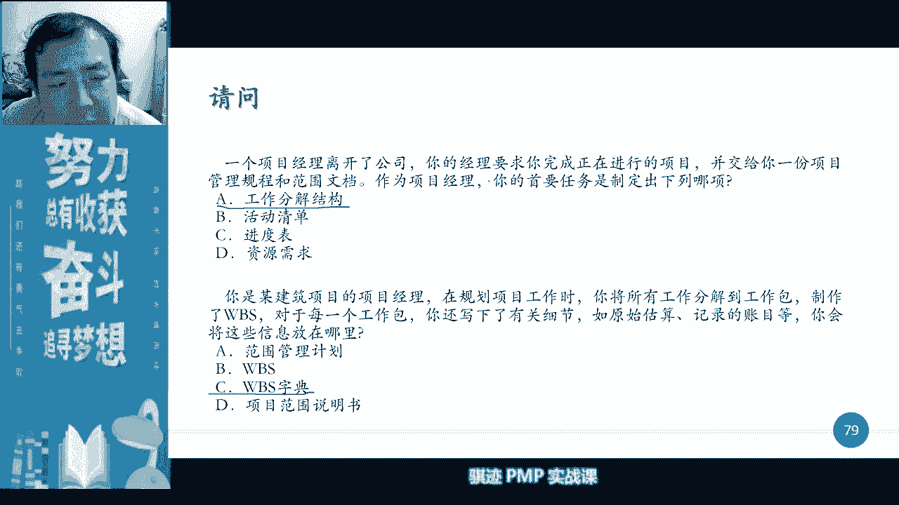
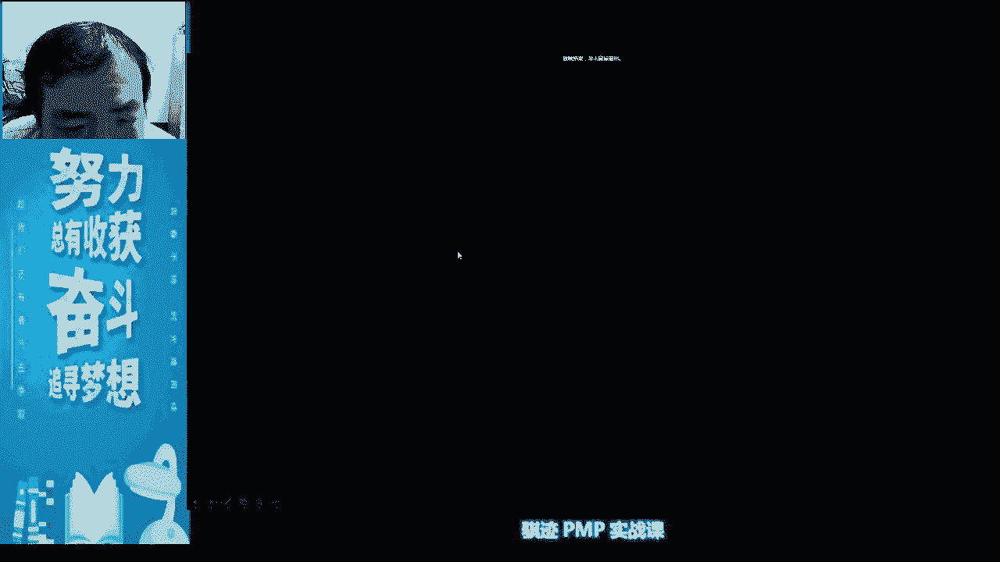
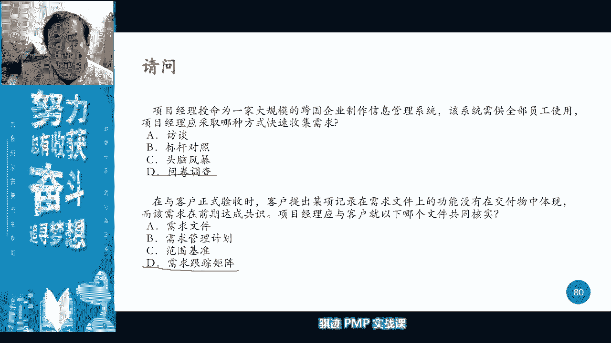

# PMP认证考试课程最新完整免费课程零基础一次通过项目管理PMP考试 - P13：PMBOK第六版 第五章项目范围管理-14 - 骐迹PMP - BV1Sb4y1f7Yt

通过这样的kpi考核进度，预算和成本等等，我们的绩效和我们的啊，正值和我们的工作呢实际连接在一起，进行绩效和控制考核，这就是控制账户的意义啊，工转为意，所以我们可以想象到任何一项工作。

最后都会落到某一个人的脑袋上，也就是说会落到某一个控制账户上，会饶了，那么你在使用控制网管理层，对项目经理就很简单了啊，对于家里大扫除这几个项目，那么我们做到下午五点的时候，我们检查一下啊。

看看啊小孩组工作工作做完了没有啊，看看小孩的工资账户下有你想工作，然后看看他们的进度，成人组空账户下那些工作空，看看一下他们的进度，然后给出一个什么绩效评分，然后老人组给个几号评分。

然后所有的控制让我们合在一起，就是整个项目的什么绩效状态啊，绩效状态，记本记，记得不解来，我们讲这个规划里面的工作呢，一般我们不拆开来不拆开来，那么会提高效率对吧。

我们统一给什么家里的成年组的爸爸去做啊，爸爸用力气比较大，打蜡比较辛苦对吧，我们同一任给爸爸去做，那么爸爸去做这个事情的时候，我们规定啊，爸爸一个人把这个听客厅和卧室的，我们的地板呢统一全部打蜡。

那么爸爸打蜡的时候呢，就是说大家的就不要去做打蜡了，那么可以提高工作效率对吧，一个人做效率比较高，会是这样，会有这样好，那么为了进行绩效考核，那么每个控制账户我们是账户。

不是我们在银行账户里面不是有个账户号码，账户号，那么我们在w bs的管理当中，注意我的表述，某一个控制账户的，就必然含有什么东西啊，控制账户的账户编码，所以说如果这样工作是一个，比如说家里的孩子做的。

那么我们可以认定为孩子编码是零一，零一开头，0101表示小朋友清洁自己的什么写字台，0102呢，小朋友清洁自己的什么啊，呃自己的卧室的床对吧啊，0103呢是小朋友收拾自己的文具对吧啊，通过这个编码。

我们就很容易看出这个活是谁干的，这在一些比较大型的复杂的项目当中，会尤其注意，因为大型复杂项目，我怎么知道世界上浮跟谁啊，我只有看他的编码啊，这个编码开头是002的，那么是某一组人做的啊，015的。

那么是某一组人做的，我这个一看就找，那我去找某个人问他啊，为什么这些事情没做好，所以这个管理是不是就变得简单有效了啊，或是这样的好，那么不知道大家对这个事情理解了没有啊，理解的话，我们会继续讲啊。

那么如果理解了，请把这个事，请把你们的理解打在公屏上，如果没有理解，请把你们疑问打在公屏上啊，不要打在公屏上，好等待下一会，为什么有一个哭脸啊，什么意思啊，啊理解，ok啊，因为今天可能有些同学。

可能我们的直播观看体验不是最好，对吧啊，这是请大家理解啊，所以要确认一下你们的状态啊，不要因为我们的卡顿，这就不太好了，当然你们可以回看啊，你可以回看，那么就自查一下。

历史上这样一个一个一个分分就分完了对吧，我们的工作分解结构分完了，这个东西就结束了吗，为什么没有解释你在这里我们的最底层，sorry啊，我们仅仅给它一个名字，它的详细性质有没有定义，没有诶。

那么怎么样去描写他的详细定义呢，所以会有一些工具，后面会有个工具叫w bs词典，前面b s c啊，我们往后翻往后翻啊，这个呢我们后面再讲啊，这里当中我们会有一个w bs资源，w bs资源当中呢。

我们会为w bs，每一个组件呢设置一个认识编码啊，这是每一个w变四，g元素里面会有一个唯一的编码啊，能够看到，bb哎sorry啊，好我们来讲wb 4啊，那么wb是词典当中呢会有唯一的一个编码。

它的归属属性，接下来呢这个把bbs词典当中我们叫做英文，叫做work work breakdown structure，工作的一个内容，一个描述啊，注意它是对结果的描述，不是对过程的描述啊。

过程的描述下这个活动之后才有，那么它有什么有假设条件制约因素对吧，谁来负责的对吧，里程碑属于哪个里程碑，到哪里应该做到结束，注意这里有相关的进度活动是什么意思，我们讲到进度了吗，没有还没有讲到进度。

那么它的相关进度活动什么意思啊，就是当你在做进度的定义活动的时候，做完之后要在wbs实践当中回填，注意回填我们相应的每一个w bs下面的工作，下面的所对应的进度活动，注意回填啊。

然后呢会有所需要的我们的资源所需要的成本，然后呢我们的质量要求如何去验收的，那么这个验收标准来自于哪里啊，也注意也是来自于我们的项目的定义范围，来自于定义范围，那么它是把我们定义的总验收这样一个方式呢。

一个一个拆成每一个w bs的各种各分级结构，它的验收的细化标准，细化标准好，那么从这个事情上来说，一个项目，它的验收标准其实也是在什么进行微调的，你先定一个总的验收标准。

等我们做出了w bs会是什么东西啊，再把详细的验收标准反馈，详细我们整个项目范围的总体验收标准当中，还有哪些验收的细节对吧，你一开始定总体范围之后，你肯定没有细节的对吧，当你把你拆拆拆拆拆。

我们做分解的时候，分解到最细的之后，然后再把它上网上汇总，是不是详细的总体验收标准就有了，所以你看工作就是这样，它是有关联的去展开的啊，会很有意思，然后要技术参考文献和协议信息等等之类的啊。

好这就是w bs指点他帮助我们啊，帮助我们啊，或者每一集工作的每一个工作层次的，好，那么我们在制定w bs过程当中呢，我们会根据不同的项目类型啊，我们会去做一个w bs分解啊，大家可以看。

这是我们w bs里面描述的一个呃，这是我给他贴了一个一个网上，随便找到一个w bs的一个分解结构，但是这依然做的挺好的啊，你看他会按照什么可交付物，然后按照阶段，就是按照我们哪个第二种类型的方法对吧。

去介绍，所以它会有第一层，第二层对吧，第三层和第四层，你看第四层它总是分到细分的可交付成功，那么讲在项目当中呢，我们有一些项目是敏捷型的项目，它可能略有不同，它不是按照啊。

因为敏捷呢很多时候呢他的项目是啊，项目范围呢是比较什么啊，范围是比较边比较范围变动是比较大的，所以它会按照我们的项目的一个，敏捷的定义来做，所以他会按照史诗级的需求，以及史诗级需求所对应的。

我们的项目故事需求和项目故事所对应的任务，不同的工作啊，会用这样一种形式，不知道大家玩过了吗，这是集院里边我们常用的一种定义啊，我们在敏捷管理当中，一直是这么定义项目的各个层面的需求。

那不同的需求就代表不同级别的什么项目范围，当我们把这些需求实现了，也就是范围被实现了，然后我们把它拼接到项目当前的范围定义当中，所以敏捷的项目我们讲只有当前范围定义，然后呢，未来范围定义呢。

是根据我们的当前敏捷周期当中，拿到哪些需求去计时定义的对吧，不是去细化的对吧，明白啊，所以敏捷的一个项目当中呢，我们可能会有若干个epic过来，也有可能有若干个story过来，也有可能若干个task。

甚至三个task过来，然后不断的像拼积木一样拼啊拼啊拼啊拼，就从一个敏捷的项目的产品，结果，它的定义从这样慢慢慢慢慢慢拼啊拼啊拼啊，拼啊拼就拼了，我这样一个手的形象形象过程，不知道大家能够理解。

那么一直拼到这个项目的范围，达到了我们项目最初所定义的某一个目标结果，那么这个项目就结束了，我就这样好，所以学过这一段之后，你们就知道了啊，敏捷的项目呢范围定量会略有不同。

它会使用epic stories task，super dusk，这样去分割个层次，但是你看很巧的，他正好又是四层，哎有意思吧，啊正好又是四层，所以一个项目当中的它的分级啊，w b是分级分层。

基本上遵循四层这样的原则，那么我们再稍微详细讲一下定义好了哈，因为本次课时的课时，这节课的课时不是很紧啊，而且我们不是说马上要改版了，马上要加入很多敏捷那种偏僻啊，我们将会介绍一下什么是epic。

ipad是在敏捷的管理当中一个最大的用户需求，这个预期需求一般会定义为一下子，你没办法看到解决方案，但是不是没有讲一下，看不到全系具体的解决方案的时候，你会你会把它定义为ipad。

然后一个ipad为什么会定义成后面是story是，那么它有一个很庞大的，一下子无法看到的一个用户需求，那么它是由什么诸多的用户故事做成的，所以这个story我们一般认为叫做user story。

用户故事，那么什么叫用户物质啊，主要用户告诉你啊，啊谢谢老师啊，我们这里有我们这里有一个需求啊，我们这里呢想要一个信息系统的功能，那么我们这里呢呃工作太忙了，我们我们的工作人员。

那么一天要处理500多个啊，500多个各种各样的啊，那任务请求，那么能不能用自动化去实现，这500多个任务请求啊，但是我不是搞it的，所以我不知道，所以他就成为了一个user，sorry，然后呢。

epic是什么呢，在这个之上我们有很多不同的游戏，直到这个需求它组成一个了，我们需要一个完整的，能够解决工作中一切事情的一个it信息系统，那么它就成为了一个什么ipad，那么有可能是什么呢。

我们也有一个这样一个完整的实现，所有的工作内容的自动化的，信息化的这样一个新系统，做是作为一个新系统，作为一个ipad，还有一个什么可以解决，所有的跟客户相关的事件处理的一个信息系统。

作为另外一个ipad，那么前一个ipad就是什么e r p，后面一个ipad呢就是c i m对吧，还有一个epic是什么，比如说某某某某系统对吧啊，注注入这些系统，就好比如说我们还有一个oa。

解决办公流程的内容对吧，那么诸多的ipad拼在一起，最后整个一个这样一个initiative呢，就变成了什么整个企业的信息化平台，所以他就这样拆拆1234434啊，不知道我这样描述你们就明白。

所以实现这样一个过程当中，我们并不是一下子所有东西都要实现，而是什么根据用户不断产生的需求，然后我们不断的去开发去做，在开发去做，1。1。一点，把这东西由小到大嘛嘛嘛嘛嘛嘛嘛嘛嘛。

拼成一个大的企业信息化平台，这就是一个敏捷，所以我们ig最最常用的就是做我们的敏捷开发，对吧，敏捷开发啊，所以就这样慢慢慢搭出来，所以你看到敏捷开发为什么和i t这么契合，就是因为跟他们的敏捷。

这个这样工作和t的特性特别强啊，当然当然了，实践工作当中一切轻量化，并且需要市场反馈的啊，这些工作都可以用敏捷来保，但是i t特别契合，只是那种啊，但不仅仅只有i t是轻量化工作，对吧啊。

这一点能够理解了吧啊，那么我们当我们学完了这些东西之后，那么我们就已经明白了怎么样去拆解w b s，当我们学会了如何去拆解了bs之后呢，最后我们就得出了一个什么啊啊项目范围基准，当然了。

项目范围基准之前呢，我们讲怎么样确定我们的拆解是否合适呢，我们可以合并细化我们的啊工作历史对吧，能不能完成工作啊，诸如此类这些东西大家可以看一下啊，这些呢其实更贴近实践，但是这些东西呢边界是比较模糊的。

根据在这工作自己需要就可以了啊，那么拆解完w bs之后呢，我们要做一些验证，验证完之后呢，我们的方位基准就出来了，那么验证哪些东西啊，是不是所有的工作都已经拆掉了啊，分解了分解在里面了啊。

那么wb s呢可能会不平衡，不同的分支层数呢可能会不同，分解的越细呢，成本越高，对吧啊，这里还有滚动分解法，ok啊，那么很重要的一个事情，最主要事情是什么，是100%，就是说什么。

w bs必须完全的把我们的范围拆卸，但是呢同时我们的分解结果呢要恰好合起来，要等于我们的项目范围，一定要是拆起来的，强化等于，否则就是什么就放我蔓延了对吧，回头镀金了啊，这点要注意。

那么等到把w bs像我刚才所描述一gg拆卸，并且每个东西都定义好，是不是很繁琐的工作，ok这必须做啊，做完之后，那么我们就得到了一个什么范围基准，所以范围基准由三部分组成。

注意第一部分是项目范围说明书啊，s o w第二部分呢是什么啊，w bs啊，w b s第三部分是什么呢，w bs词典啊，我们对于w bs里面每一层的详细定义，当然w bs里面的各级呢。

有可能跟我们的控制账户啊，ok啊这个大家知道一下就行，所以我们传统都传统意义上都认为，项目范围组成项目的范围基本组成是吗，soo w w b s w b s dictionary。

这三件东西三件套组成了项目的范围基准啊，那么一个项目如果他有任何东西涉及到这些，就要进行什么东西啊，整体变更啊，整选项啊，所以项目的范围我们一直讲是项目的一个基呃，基础的基础啊，基准基准啊。

项目之母对吧，项目的最基础的东西，所以它应该被最优先的定义出来，其他的范围和之后的进度和成本，应该随着范围的定义的细化而进行细化，所以我们在之后我们会学到进度的细化，范围定的越详细。

那么进度就可能定的越详细，进度定的越详细了，最后最后一个维度成本就会定的越详细啊，所以我们讲为什么我们讲定义后面呢，我们的定义活动当中，进到管理进度当中，我们先是什么定义活动，然后还要排列活动顺序。

然后呢才能故障活动时间，制定出活动的啊，制定了活动的时间长度和我们的进度基准，就是这个道理，历年细化成本也是成本，最开始的我们会讲究成本匡算，然后这段叫成本预算，然后呢叫做成本啊，成本估算，sorry。

说错啊，成本估算，然后呢是成本预算，最后是成本决算啊，这一系列算你们去看一下啊，自己去看一下，或者是了解，想一想就知道啊，这是一个由粗略到精细的过程，这个粗略到精细的过程也是什么。

我们项目范围在管理中有粗略到精细的过程，和我们项目在执行当中进度的，有粗略到精细的过程，它是伴随的上范围和范围的逐步实现啊，进行逐步进行啊，黑所以范进程并不是割裂的三个部分，他们相互之间关联的。

尤其是以范围为带动，那么我们接下来讲的是确认范围，我们已经把整个范围做出来对吧，那么确认范围之后，我们可以如果我们做完确认啊，我们做完定义范围之后，做完打bs，制定完打vbs。

那么我们接下来该进入什么阶段了啊，请到公屏上告诉我定义完w bs，我们其他领域知识领域如果不考虑定义完，制作完了w bs之后，我们接下来进入什么阶段，然后应该做什么事情，请在公屏上把锁啊，又到啊。

上午的课的特点就是不停的要被提问，也不停的要被我灌输知识，执行诶开工会议嗯，非常好啊啊非常开心，我们讲假设如果不考虑唉监控呢，监控不是接下来执行，监控是永远同时在执行的啊。

所以啊这些东西都可以都可以做啊，我们去制定完单位b4 给乙方确认啊，你是甲方角度，那也可以啊，好我们当我们制作完了w bs之后，当然确认是肯定的啊，确认是一个小动作啊，确认是你们知道肯定要确认就行。

那么接下来做什么，要开开工会，接下来就是指导和管理项目工作，对不对，记得吧，指导管理，指导和管理相关工作会做出什么东西啊，可交付成果对吧，我们这里可交付成果有了可交付成果呢，接下来我要做什么事情啊。

就要进行什么内部的质量验收，也就是说嘛，我们的qc控制质量，这个过程得出一个什么东西啊，得出一个验核实的可交付成果，注意核实的可交付成果，可交付成果被核实之后就开始做，我们这个回来在项目范围当中回来。

那么你可以看到合适的可交付成果，和我们回来做确认范围的输出，会输出一个什么啊，大家可以看到啊，后面会输出一个验收的可交付成功，核实的可交付成功变恶验收都可交不成，这弓箭是什么，将内部的质量标准呢。

通过转化为最终转化为客户的一个确认，通过确认验收标准的一个确认，是这么一个过程，那么既然是这么一个过程，那么他为什么在范围里做呢，因为跟客户去确认更多的确认的是什么，客户想要的中的范围做不做了。

因为客户很多时候是不能够什么直接的，或者他有能力的去确认质量，如果我们是企业，对企业还好，我们可以确认质量，如果你是消费者，你怎么去确认质量啊，我这个东西不用段时间，我怎么知道质量对不对啊。

这就是为什么淘宝京东有一个功能叫做追平啊，我就说淘宝京东有个东西叫追平，为什么一开始收到东西啊，觉得挺好的，用了段时间觉得不好了，就要追平啊，追一个差评或者追一个好评，对吧好。

那么这就是为什么在用客户签收，客户验收的时候，要有一个要一个动作是确认范围，它放在范围这个知识领域，而我们在内部的内部通过验收的时候呢，要放的质量是控制质量的原因，明白了吧。

啊我们内部验收的时候更注重的是，更多注重的是什么，注重的是质量，外部验收的时候更注重的是范围啊，那么确认范围呢我们的定义是呢，正式验收已经可交付成果这个过程，所以他明确需要客户和发起人参与。

为什么有时候是发起人去验发起发，因为有时候我们做的产品和项目，结果呢是针对于公众视场的，你不可能说啊，我中国移动做一个项目，做一个产品，然后让全中国使用中国移动服务人都来去解说，会编哎呀，那是不可能的。

那只是什么，让发起人代表我们的客户去验收一点，明白了吧啊，针对客户，公众客户时，往往是由发起人去做验收，那么如果这个项目是有项目的产品经理的话，那么就是产品经理是代表了乙方。

发起人是代表了甲方两边做验收啊，这个时候就是考验产品经理的时候，然后如果发起人觉得产品经理做了反正不好啊，就是把那个验收那个担子欻甩在他脸上对吧，你做了什么样的东西啊，啊明天啊马上到给我。

明天到财务部去结一下账，不要来了，所以产品经理压力就是从这里开始啊，ok啊那么稍微插一句啊，这时候项目经理要不要担心啊，不用担心，你只要按照项目的范围，过程按部就是这么做对吧，控制最后结果就行。

做出来的东西符不符合发起的诉求，符不符合客户诉求，不是项目经理当前的事情，这是产品经理好的事情，当然你说啊，你又做项目经理，又说产品经理，ok啊，那你自投国服啊，这个，那么它是相当于对我们验收的一个。

相当于验收的测试对吧，那么在验收当中呢，我们要说啊，如果是瀑布型的，就是在完成阶段做，如果是迭代呢，就是每一个迭代的末期交付以后去做啊，交付的时候去做，但是有一点注意，肯定要么要发起人，要么发。

要么是查客户或者是发起人，客户一起去参加验收，一定要用这个最重要的结果是什么，那么确认范围最主要的结果是什么，ok从理论上来说，验收的最主要结果是什么，验收的可交不成功，那么实际工作中最主要是什么。

发起人注意啊，发起人和客户签字验收单这个东西无比的重要，如果你当场把他们搞定了，让他们去签单了，千万不要有任何迟疑，在那个单子上，让他们以最快的速度把这个东西切掉，万一他事后后悔了怎么办。

除以所以如果他只要点头，肯定可以达到我的标准，叫他马上就签字，这是第一要务，其他事情都可以不管，确认范围当中，最主要事情就是签那个验验收单，注意了吧啊这是这是经验之谈啊，验证，那么在验书当中。

我们最常用的工具叫做叫做检查，检查指的是对产品的一些检验，看看符合书面的桌面标准啊，符不符合我们的要求，那么如果作为客户来说，他的验收最主要是查什么东西啊，他能客户往往尤其是公众客户。

他的验收能力比较弱，所以他主要出了什么，查了什么，这个东西的功能，是不是符合，我事先和你达成了一个对范围的一个想，一个一致的认识啊，所以会对这个进行验收，那么他验收的检查当中很难对质量进行检查啊。

公正客户，企业客户呢比较专业，那么他就可以用专业的方法进行检查，所以它会既会检查范围，也会检查质量，但是更多的也是以范围为主啊，检查也可以称之为审查同行审查审计巡检，那么我问你们审查同行。

审查审计巡检当中，哪一个词严肃性和严厉性是最强的，请在公屏上告诉我，审计，审查审计，你们觉得审计是最严的对吧，ok啊，那么你是经验不足啊，其实最严厉的是巡查，什么叫巡查。

巡查可以认为是突击的或者是常规的一种检查，啊，啊可以啊，我我告诉你，我肯定会来查，我已所随机或者是确定，但是确定次数，确定内容和性质，但是不确定时间的一种检查，称之为不定期巡查啊。

巡查当中的不定期训呢是最严苛的，他随时就会来，你没办法做准备和事先的什么美化啊，会不会能做这个事情，也就是说呃就好比说什么，就好比说什么，你是个小伙子，你谈了个对象，那么你爸妈呢说你爸妈要过来看一看。

你未来的儿媳妇，那么你如果他爸你的爸妈呢，比如说到你的身呃，跟你说啊，三天以后到你身边了，那么你会怎么对你儿媳妇，对你的，对你的女朋友呢，事先做一系列的什么啊，事先准备工作啊，我爸妈喜欢他们听什么话。

就和我们喜欢什么样装扮的样子，如果你爸妈跟你说，我们会来跟跟你说，我们会见到未来儿媳妇，但不管是怎么来，然后突然哪天晚上就冲到你家里来，然后就见，那么这个难度是不是又高了啊，这就称之为巡查啊。

这个难度其实是最高的，审计的话，一般他会告诉你，我们会回来，什么时候审计，因为要准备审计资料，那你还可以做美化，有时候巡查是很难做美化的啊，明白了吧，那不就是突击检查，对巡查还有突击检查的意思。

对突击查你们卡了吗，ok啊我来看一下我的品质啊，今天的这个卡顿，今天这个卡顿呃，让人有点忘，反正那个啊ok啊，大家可以看到老师的拼值一直是很正常的，十也就15ms，那么假设。

那么我们可以假设老师的大概率，还是老师的网络是正常的啊，我只能做到这一点对吧，ok好，好那么我们可以看到啊，啊巡查检查就是这个意思，当然这只是大家了解啊，考试没有考那么细了，巡查检查，同行检查审查。

这些都是称之为检查，得了检查，那么通过检查之后呢，就得出了可交付成果啊，那么我们的我们的可交付成果的一个关系链呢，就来了啊，所以验收当中呢需要客户签字，发行人签字批准对吧，但是我们注意一点。

我们在之前也讲过，验收的可交付成果，并不是可交付成果的一个终点，它的终点是什么，一定要注意啊，最终的产品和服务的啊，成果的移交，他是最后一个结束和项目阶段的时候，去做这个事情啊，移交，看一下。

啊那那就好比说是什么东西的客户验收呢，就好比说了吧，就是说你父母过来检查对吧，看一下儿媳妇，然后验收通过了，儿媳妇很满意，那么最终结果什么，白酒宴澄清，你这个谈恋爱项目呢就结束了。

进入下一个长期项目叫做结婚，结婚，那么在这个过程中呢，又会更新我们的工作绩效信息啊，这是我们pp当中所展示的工作绩效信息，那么这就不多谈了，落单了啊，那么我们在确认范围当中。

还是要注意最主要一点是什么啊，要让客户签字画押，再说一遍啊，考试当中也是要把我们的核实的可交付成果，变成什么东西啊，那那那这里边要把最主要的一点就是，把核实的可交付成果，通过客户签验收单的方式。

变成验收的可交付成果，这是确认范围唯一的意义，唯一的意义唯一的意义啊，我们有些同学说哦，我们客户满意度，那个还是质量范围，那还是控制质量当中所说的哎你们知道了，验收当中唯一的意义就是什么，签收单。

签收把可交付成果变成验收的可交付成果啊，当然我们也说验收的可交付成果，最终还是要它的意义什么，移交到我们的客户和用户的现场当中，并达到产生价值对吧，这还是要有有意义的啊，但是签了这个就意味着可以什么呢。

乙方可以收钱了对吧啊，这大家都知道啊，那么最后一个最后一个子过程，什么是控制范围啊，控制范围呢是控制过程组，我们讲的所有的子过程是所有知识领域的标配，每个知识有一个都知道放在最后。

所以控制方面主要是看什么呢，在整个项目的生命周期当中，看看项目有没有超出范围，有没有范围没做啊，做不到，那么范围做得快做得慢是什么啊，范围快，做的快，做的慢是我们的控制进度，管这个事情，那是控制进度啊。

控制范围只看你范围，做大了，做小了啊，做得快做得慢不是他考虑的事情啊，这要注意啊，快和慢是进度大和小是范围啊，这样一说是不是就理解了好，那么控制范围当中我们最主要使用两个工具啊。

这两边的东西就不谈了对吧，都是一些常规的东西，那么注意所有的控制范围，控制过程组的过程都会有一个输出，叫做变更请求，因为只要在监控过程中，你发觉有问题有任何异常，那么都可以什么。

通过变更这种方式去进行调整和干预，所以所有的控制范围呃，的子过程都会输出一个变更请求，如果需要的话啊，啊好像我也有点卡啊，我好像觉得我有点卡啊，看我不知道是问什么问题啊，但是我看一下我的评值还是正常的。

我们清晰可见对吧，我们可以一边开着拼着一边上课对吧，老师是ok的，好这是我们这是我们控制我们的，我们的控制范围的一个主要定义啊，其实没有什么太大的太大的啊，难以理解的东西啊，只要知道它是大和小技巧。

那么最主要使用的两个过程是什么啊，一个是偏差分析，偏差分析，当然偏差分析里面用到的是我们的eva，eva这个东西呢我们才会在成本管理里讲啊，这是我们下节课很重点的内容，但是下节课也不直接讲到。

是下下节课我们元旦之后的第一节课会用到啊，我们稍后呢，在课后的我们的群里会布置一个功课啊，这是要把所有e v m的所有的单词要背出来啊，ok那么偏差分析指的是什么，我们和原来的基准。

我们讲范进程都有基准对吧，我们在范围这个领域和原来的基准相比，我们是不是有偏差了啊，但是呢这个bm恰恰是不能用，为什么范围只比较大小，cv sv这种呢是比较进度和成本，恰恰是跟范围没关系的。

所以注意这个例子当中，这个虽然印在你的p p t上，其实s b cb cp i s p i是不能用于范围管理的，请在你们的书上这里范围管理当中的偏差分析，所以请在书上这里划一个叉啊，画一个叉。

我靠有些东西还要要要我测mtu对吧，你这个要求点高啊，ok啊，我已经忘记p m g u的那个命令行是怎么打的，ok啊好那么所以偏差分析往往是什么，怎么怎么做，偏差分析的范围管理一般是说原始范围的定义。

我们讲现在范围的定义，这些工作量和原始范围的工作量，这个两个工作量之比，比如说现在工作的范围的工作量是百分之，是原始范围的110%就意味着什么，我们的范围偏差了多了，10%是这么比较的，知道吧。

但是不是按照s v c v s p i c p，这些都没有意义啊，这些在范围管理都没有意义，还有一种叫趋势分析，比如说我们现在业绩不好，但是我们的未来趋势是好的，这叫趋势分析对吧。

比如说我们现在业绩是好的，但是我们未来趋势会变坏，这也是一种趋势分析，到底是往上面加还是往下面压啊，就是这种趋势分析，那么会变好还是会变坏，那么如果判断呢会变坏呢，我们要采取及时的纠正措施，及时调动成。

那么这里所说预测项目的进度延误，所以这个趋势分析呢，在我们原始的pp当中呢也是有问题啊，他不是预测进度延误，而是什么，我们趋势分析，在最近这段时间内，项目的相关方提了大量的变更请求。

变更范围导致我们的范围越变越大，那么我们要采取什么措施啊，有效地对相关方进行干预和疏导，将他们的需求控制在合理范围内，以避免项目范围过于扩大，造成一系列不可控的后果对吧。

或者是说什么项目本来要做很多内容，但是由于各种客观条件，我们导致我们能做的实际很少，那么我们应该采取什么措施啊，才及时采取纠正措施对吧，然后要让团队成员思想不滑坡，困难总不如办法多啊，办法总比困难多。

这种方式将我们的项目法尽可能做到，我们预先和客户商定的范围的范围内容，这是我们的趋势分析和相应的对策，明白了吧啊，这里的表述也是有问题的，有问题啊，有问题ok明白了，好吧有些东西卡的话。

我们可能啊课后的话我们可能要回看一下啊，所以但是这里很重要，所以希望大家一定要理解啊，好我们发为张东的知识总结啊，那么我们上完这一章这一块的，我们的呃理论知识之后呢，我们会做一个总结。

那么你会看到范围来自于项目章程，来自于我们，如果他已经制定过进行更新的话，会来自于项目管理计划，首先我们定了一个规矩，叫做范围管理的规划，范围管理的高规矩，这个规矩会产生两个计划，一个是管范围。

一个是管需求，通过商业论证和协议的和相关方登记册等等，这些东西呢去收集需求，把需求收集完了后呢，变成需求文件和需求跟踪矩阵，有需求文件和需求跟踪矩阵呢，去产生一个叫定义范围的。

我们的w b啊s o w项目范围说明书，有项目范围说明书呢去创建w b s，创建了w bs之后呢，有w b s，w b s词典，和我们的s o w共同组成了一个东西，叫做什么项目的范围基准。

项目的范围基准啊，我就是对吧，就这个这个的词典和项目方位说明书加在一起，等于我们的范围的范围基准对吧，然后根据范围基准，我们去干活，干出来的活呢，先给质量呢去做内部质量审定，审核通过之后呢。

我们去找客户签字画押，确认范围变成我们那验收的可交付成果啊，同时在验收过程中，我们我们也可以提到一下啊，客户有可能会根据原先客客户约定好的需求，跟踪矩阵去逐逐一认定客户提的需求，最终有没有被纳入范围。

会有这样一个过程啊，回收这样一个过程，学渣求弹，又完犊子了，ok好，那么最后一个呢是控制范围，我们讲控制范围主要看项目范围，做大了做小了，做快做慢，跟我们没有关系，一定要注意啊。

所以我们的p p t理论上其实这里是有瑕疵的，所以我们回过去看这一段的这一部分啊，叉叉啊，这些都不能表示范围，也不能用这里所描述的进度延误啊，在范围管理当中的趋势分析和进度没有关系。

它仅仅看范围是做大了还是做小了，现在范围是不是变得越来越大，还是变得越来越小，如果变得越来越大呢，要适当控制，如果大家做不到呢，要不要拉拉大，就是这么个意思，好这是我们的一个知识总结。

那么知识总结之后呢，好我们我不知道啊，在线的所有的同学是不是已经听说了课程，所以我们稍事等几秒钟，等所有的同学把这些课程在缓冲听完之后，好大家都看完了吗，前面的有没有缓冲的。

看完了所有看完缓冲的同学呢啊，请在看完缓冲不卡了哦，ok都已经恢复到了现在状态了，再在公屏上打一个，看完看完，在公屏上打个看完，啊有些同学问你，老师为啥老是喝饮料，那么老师也会口渴的。

你要知道老师这种人靠嘴巴吃饭对吧，我干了一天的活，是不是嘴巴有点累啊对吧，如果如果你觉得老师和老师喝，一定要喝太多的话，我以后偷偷少喝一点好吧，ok啊，看完，诶有些同学说从头到尾没卡过，诶不错哦。

好那么我们继续吧啊ok继续，为啥不喝白开水啊，因为老师这个人比较矫情，喜欢喝巴黎水，多喝热水，少喝饮料，罢了，巴黎水挺健康的啊，ok啊，那么我们结束了啊，中间这些过程如果没有缓冲掉，这个没有关系啊。

开始做题了啊，我们开始做题了啊，总喝饮料，总总总合饮料，对饮料不好，哈哈啊，这位同学啊，你真机智的啊，我们开始做题啊，不逗不逗了啊，我们开始做题，第一题，第一题，项目经理发现在计划编制期间呢。

有部分工作呢范围没有定义，那么他应该怎么办，第一题啊，第一题a继续编制项目管理计划，直到啊，然后因为工作没有完成，所以我们要继续变质好，那么第一套选什么啊，老师太可爱了，ok，那么应该做什么。

b进大最大可能是工作范围得到定义，c等工作范围得到定义后，发布个病人第一相，管理层抱怨，我觉得选题的同学勇气加100，选什么，好像看似喝了奶啊，这这都被你发现了啊，b和c b和c有没有选a的啊啊啊。

我看到很多b和c啊，ok啊，主要答案都集中在b和c对吧，ok啊，那么答案是比你们，因为你很快啊，很明显啊，我们答题目都被删了，你们答案就出来了，ok啊ok那么为什么是答案选b呢，因为你可以看啊。

我们大部分人都是选b和c的，所以a和d很容易排除掉啊，那么c可以看到等工作范围内得到定义之后，发布一个变更，我们讲一现在发现是在计划编制期间啊，那么如果我们现在处于计划编制期间，还处于计划编制期间。

那么是不是说我们还没有进入实施状态，工作执行状态对吧，这时候不需要变更，直接改一改计划执行，如果我们已经进入执行状态，但是我们发现有部分工作没有定义的话，我们应该做什么走变更流程。

而不是直接发布一个变更，为什么改变范围，或者是对范围的定义进行更新，需要怎么样呢，需要走整体变更流程，因为改变了范围的基准啊，而且他文中所说是没有定义，而不是说什么范围定义没有细化，没有定义。

就意味着你要重新定义它是一个改变，细化只是把细节描绘的更详细一点，他是可以不用变更的，但是没有定义就意味着要对它重新有一个定义，它是必须要走变更流程，所以应该说什么，c如果想对可以对。

那么就等待工作范围得到定义之后呢，去申请一个变更请求是可以的啊，ok明白了，然后呢他也不是完全对，为什么如果我们是使用的是适应型，增量型，敏捷型，是不是没有范围定义，很正常啊。

部分工作范围没有定义是不是很正常，需不需要变更，不需要对吧好，所以c无论怎么看都是一个很难补全的答案，所以他肯定不是最好的啊，b是最好的，为什么尽最大可能的是工作得到定义，是不是这句话没错啊。

横看竖看都没错，所以选b绝对不会有错啊，明白了好明白了，我们进入第二题啊，为什么不是a呀，有同学又问了，为什么不是a，那么问题继续编制计划，因为工作范围没有准备好，我们讲如果你使用的是增量型，敏捷型。

迭代型，需不需要继续进行编制，不需要呀，我们先把事情先有的先做起来呀，对吧啊，所以工作是准备好的啊，工作范围是准备好了，只不过不用全部定义，对不对，我们有没有说过生命周期类型啊对吧。

所以a在很多的设定下，很多不同的生命周期的设定下是不成立的，所以a是错的，明白了吗，好有人选d啊，勇气加100对吧，勇气加100好，ok我们做第二道，第二题，第二题第二题呢，阿米特管理一个软件项目。

初期客户认同方法说明书内容，可是到研究可交付成果之后，客户要求增加一些功能，阿密特与客户一起寻找项目规划时，遗漏了哪些功能，并考虑在以后做规划做得更好，那么对于该项目当前状况，以下哪个描述最正确最佳。

选哪个啊，选b啊，选b，选b啊，选b啊，ok啊，我觉得我这里可能我的我的直播自己回看，也有点点有一点点小卡啊，大家克服一下啊，马上结束了啊，好那么这道题目呢ok我就不给大家多买关子。

这道题目是典型的p p的翻译的渣翻译，所以这道题目是没有正确答案的，所以这道题目选a b c d都可以啊，都可以，那么这道题目的应该是怎么样的呢，注意这道题目是它的翻译。

是如果现在就要给用户增加一些功能的话，那么它应该是范围蔓延，但是他的翻译当中说考虑以后如何规划，做得更好，是不是现在没有给客户增加，所以它既不是镀金，也不是范围蔓延，c和d是不是根本没有这种呃理论讲法。

ok啊，所以这道题目是没有正确答案的，但是如果要选的话，他的原来原始正确答案是选b啊，选b好，那么这种题目呢往往要看干什么啊，记住一点，看英文，如果你看英文还看不懂，说明这道题目出的有问题。

多数是什么题目没有出好啊，不用担心这道题目会不计分的，又来了，如果这道题目你看不懂，下一道题目也看不懂，现在的题目还看不懂，那说明什么，说明你没好好学啊，不可能这么多都看不懂，明白了啊。

好我们做下一个第三题，下一个第三题啊，第三题范围控制的成果结果是什么啊，这个很很明显对吧，我们讲所有的控制过程组的子过程，都会有一个什么成果啊，什么第三题，看所有题目，英文都看不懂。

同学请为了通过p考试，请加强英文，这个明显应该选择a，怎么可能呢，可交付成果明明是指导管理项目工作啊，大哥啊对吧啊，还有这么多人选a呀，好换上限啊，来来来，我们翻过去看一下啊，刚刚教过啊。

同学们刚刚教过啊，什么，看一看，是什么，看一看，同学们请看一看啊，这个是什么，这个是啥，还用回答吗，好刚刚在课上教过啊，你们就给我出这种东西啊，ok啊是不是很对不起我啊，ok啊，所以这道题选择变更请求。

那么下面的你最近被拍到一个大项目当中啊，第四题，第四题，你最近配拍到一个大项目中，这个项目是开发下一代cad cam辅助系统，你将该项目分为需求调研，不不不不不不不。

我都懒得讲这种w bs分解的最小单元，称之为什么这些在这个横杠之前，在这个横杠之前的所有东西都是什么，废话只有这句话有意义，应该选什么，迪士尼，啊这个没有人错了吧，选变更请求啊，这个没有人错了对吧。

选变更请求，啊这个没有错啊，那我想下一页啊，项目接近尾声，团项目团队来让客户验收产品，客户发掘了少了个预期功能，这是以下哪种情况，少了一个功能，第五题，a客户增加功能比客户团队为造成一致。

c缺少变更控制，敌没有发钱批准，这是哪个，第五题，abc都有了对吧，就差题了对吧，a b啊，cb啊，ok啊，正确答案是b，为什么是比亚我客户发现少了一个功能，并不是说客户要新增功能啊。

有可能你团队漏座了呢，是不是啊，是不是啊，所以a有可能是不对的，那么b是对的，我们范围没有达成一致，所以少了一个功能对吧，团队认为做99个，客户认为要做100个，是不是没有达成一致啊，c缺少变更。

我前面有说客户不一定是变更，有可能是你少做也有可能啦，所以c不一定正确，第一没有发及批准，这就更错了啊，所以这个题目很简单啊，是不是选b吧啊选b啊，选b啊，选b的同学正确啊，第六题。

我们来看第五题对吧啊，第六题，d对d是不是很简单，在项目的执行过程中，内容团队不知道怎么做，说明我们的项目管理计划中缺少什么，计划要改变范围，首先要干什么，看什么东西啊，要改变范围，首先要看什么东西啊。

哎哟哟非常好非常好非常好非常好哟，都选择a啊，这个其实有点搞脑子啊，这到你们都回答出来啊，因为我们刚刚讲过方法管理局啊对吧，答案是a，有些同学可能会说变更控制计划，首先a点啊，为什么这道题就选a。

首先就算选项c是变更管理计划，变更管理计划有没有的啊，没有变更控制计划，有变更管理计划，就算是有变更管理计划的，也是先看范围，管理计划当中怎么定义，有没有达到整体变更控制那个程度，如果没有达到的话。

是不是直接项目经理走一下就行了啊，改一下就行了对吧，因为它不涉及到范围，金属成分不涉及到基准对吧，如果涉及到了，再去看变更管理计划去执行，是不是这个意思啊，所以这道题选a是对的啊。

所以选c的同学呢啊ok啊，首先名词没有记证据，其次呢对这个理解可能还不够深入啊，我们要做哪个方面的东西，首先需要看哪个方面的管理计划，看他怎么定义的，然后看看是不是在这个定义当中，要走到变更那个流程区。

然后再看变更管理计划中怎么走变更对吧好，所以这道题是选a下面的啊，小梅的第七题，你几点啊，我们快一点啊，还要内容就不多了啊，好多啊，第七题，一个项目经理离开了公司，你的经理要求你完成正在项目。

所以你是谁啊，你是谁，你是填坑侠啊，并交给你一个项目管理文档和范围范围文档，作为项目经理，你首先要任务是制定哪一项，a工作分解结构比活动清单，第几题很简单吧，第几题啊，填坑侠们，你们应该选哪个。

ok啊当然是a了，为什么有了工作分解结构才有项目基准，有了项目基准才能去做活动清单，进一步分解为活动对吧，有了活动清单才能去做进度表，然后同时你才能估出对项目的资源需求，是不是，所以a是最前面的啊。

而且我们刚刚讲过a对吧，猜也能猜出来啊，答案是a啊，答案是a，哦sorry，谁啊啊好后面的题目，你是建筑项目的项目经理啊，并且对每个w bs，你现在喜欢细节，如何估算，你会把这些细节写在哪里。

考试遇到这种题目，是不是送分啊，第八题是什么，有问题，a之类的，他给你的是项目管理的规程和范围文档，范围文档就意味着什么，有的同学说啊，这不是有的吗，范围文档就是s o w啊。

他有没有给你w bs的工作分解，结构和范围文档是两个东西对吧，c对吧，这个东西有没有意义了啊。

啊这个东西明这个答案明显就是c。

没有任何一，好最后两道题目啊，做完就我们今天就收工了啊，哎呀sorry，收工了啊，再坚持一下，该系统需要供全部人员使用，项目经理应该采用哪一种方式快速收集需求，那么先看a b c d里面。

哪一种是快速收集需求的啊，想一想，然后呢告诉我答案，第九题，内容都快做手机去了，dog dog dog dog c c c c c啊，ok啊，还是很多的对吧，好看到第九题有大量的选dog，ok啊。

还有一个叫c的，那么快速收集，有明显是什么，b c d其实c呢头脑风暴没有那么快，因为头脑风暴要想半天还要进行反复验证，没有那么快，标杆对照和问卷调查都是最快，那么他因为涉及到全部人员使用。

所以相比之下问卷调查会更好对吧，所以这道题目选d是正确的啊，同学都答对了啊，选的是正确，ok最后一道第十题，第十题啊，那么与客户正式验收的时候呢，项目经理的客户呢，提出某个记录在需求上的文件呢。

没有在交付中体现，而钙需求呢就前期达成了一致，那么客户，项目经理与客户就哪个文件共同核实啊，a需求文件，b需求管理计划，c需求范围啊，范围基准比，需求跟踪矩阵选哪个，第四题选哪个。

选d需求跟踪矩阵很好啊，答案是需求跟踪矩阵，为什么，因为这样一条啊，首先在需求文件当中，那功能没有体现，所以它肯定是在需求功能文件里面有，那么但是他没有体现，说明他没有进入什么东西啊。

他就前期而且达成一致，所以他没有进入需求跟踪矩阵对吧，所以没有实现，所以这道题目选需求跟踪矩阵是最对的，他进入了需求文件，最后被项目经理，在我们在需求的最后的裁剪过程当中呢，被砍掉了。

所以应该跟需求跟踪矩阵相关，或者是说什么呢，在需求的实现过程中，项目实现不了，所以他被放弃了，明白了吧，好好，那么我们课后会在群里发布一个，我们课后的要求啊，要求背诵我们呃元旦之后有一门课的叫bm。

有门课的当中的12个我们的定义的词的中文，英文和英文缩写，要求大家全部背出来啊，务必做到啊，然后呢，我希望大家这两天呢虽然马上就要进入元旦了，尤其是下面两次课会压力得非常大，我们的成本管理内容。

是p p课程当中最最最啊内容最最多的啊，所以希望大家呢呃元旦后的第二次课啊，sorry那个是元旦，但是也要背出来，是希望大家花最多的精力在元旦前后呢，对这些成本的内容和我们进度的内容啊。

那么今天的课程就到这里啊，那避免大家做噩梦。