# PMP认证考试课程最新完整免费课程零基础一次通过项目管理PMP考试 - P15：PMBOK第六版 第六章项目进度管理-16 - 骐迹PMP - BV1Sb4y1f7Yt

好有同学说l j l j怎么不完美了，f加f级15，f到g 15，这个空格对吧啊，ok啊，其实那也行啊，人家这里就说这是15天，行不行也行啊，这个没有太大的问题啊。

hk hk是三个从开始开始的三个并行的活动，并行的活动没问题啊，没问题啊，使劲ok啊ok啊，那么ok大家动一下脑子其实挺好的啊，我这个这部第六章和第七章，尤其需要大家参加互动和动脑子啊，非常重要。

那么这里不完美单了呀，l和j是什么关系啊，f f关系同时结束对吧，无论是l指向结截止二幺，他们俩都是同时结束关系，既然是同时结束，为什么两个人的屁股不是平行的呢，是不是是不是啊。

所以这个图不完美的地方只有这一个，就是l应该放在这个位置，是不是更完美啊，虽然这个画法不会错，但是这个画法会导致什么，导致人产生误解，以为l在前面，结在后面对吧，就在后面好。

因为我们默认虽然平时我们不这么说，但是在日常的日常的表活当中，我们默认pdm上面，人们总是默认pdm的图上面有一个时间轴，所以你们在画pdm中一定要注意，我们一般都称为默认pdm上面会有一个时间轴。

他有可能没有详细的刻度，但是呢如果若干的活动是在一个，纵线上是在一个纵线上的话，我们认为这些活动大致都是在一个时间内，同时发生的，所以你看这些活动可不可以在同时一个时间可，这里因为加了15。

所以我会认为这中间是跨了15天也没有问题，但是你l和结应该是同时结束，所以他的屁股应该是对齐的，所以把l放在这里会更加完美，你们明白吧啊，i和l2 i和l没有关系啊，i和l因为i和l因为是什么。

因为他们本来就没有任何关系，a和a有直接关系，没有直接关系啊，你随便放就行了对吧，i和l没有直接关系，和相互之间的箭头没有箭头啊，没镜头，啊把l拉长可不可以也行啊，有些同学就是这么的有恶趣味。

喜欢把人家拉长对吧，也行啊，也行也行也行，可以啊，但是一般我们图都是用啊标准方块来表示，标准框框来表示一个活动的，你把它拉得这么长，就是表达了就不太重要，规范k和i影响吗，不影响啊。

k和r本来就是一个fs关系啊，你看这是个fs关系就行了，我又没有说这有多少宽度，他只是说我们在一个纵列上代表，这我们一般都会默认在一个纵列上，我们代表他们是同时发生的，这一个纵列呢代表同时发生。

这个纵列代表同时发生，这里是同时发生，这里是同时发生，那么我l其实放在这框，在这里其实会更完美对吧，为什么没有颈后关系图，ok啊同学你可以发明一个啊，你可以发明一个，你可以玩一下，发明一个可以玩一下啊。

但是没有太大意义，没有太大意义，ok那么这是颈前关系图的一个绘图方法，绘图方法。

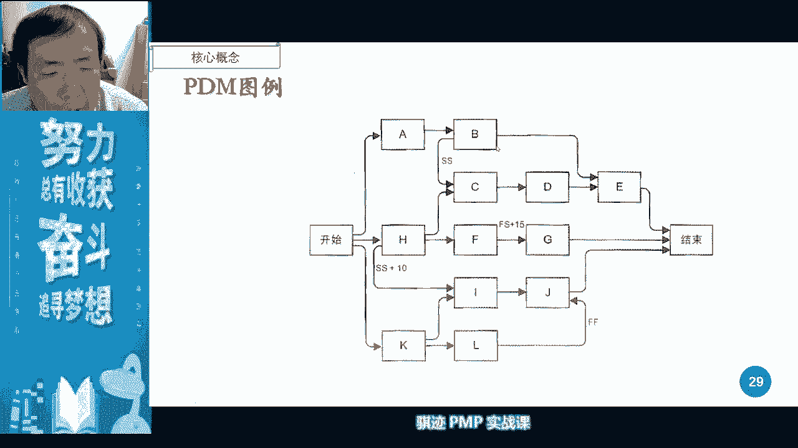

那么颈前关系图当中啊，颈前关系当当中我们会有一个什么样的特点啊。

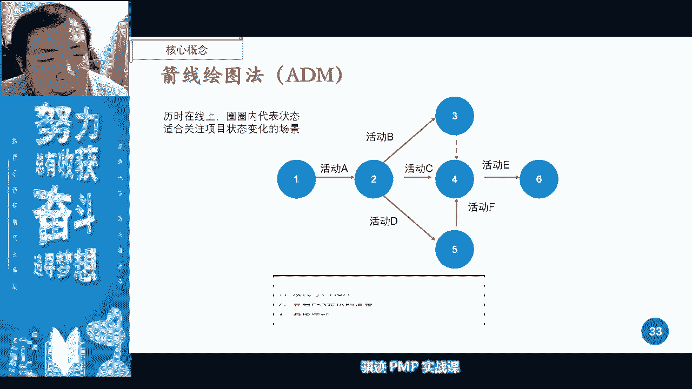

我会大家跟大家说，颈肩关系当中有一个特点是，我在这里没有写出来的啊，但是要一定要注意的是什么啊，啊后面也会在此提到，hi加时间是因为i宽了。

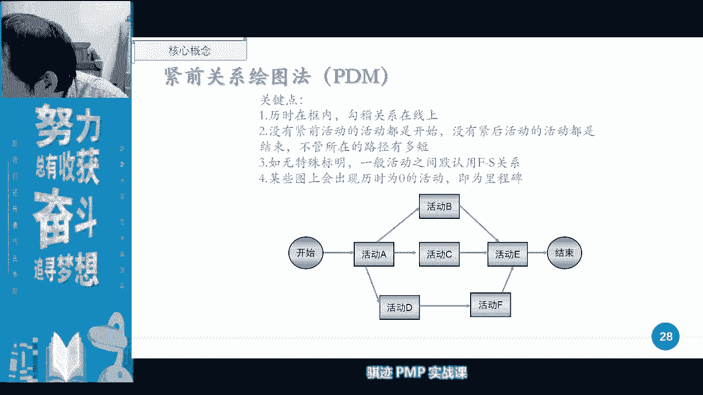

往后移了吗，这个没有关系吧，这个啊对，你如果因为他确实这个这个画法是没有问题，是因为加了十天，所以往后移的，确实这个表示更好看一点啊，所以hi不是同时发生，这样更好看一点，更好看一点，只能说啊。

所以这里也是个手间轴，但是这个中间的刻度呢是未知的，未知的，只知道同一个轴上肯定是一个时间发生的啊，差不多是这个意思，hi和l是不是同时发生的，i和l不是同时发生的啊，不一定是同时发生的，不知道。

但是i和l和解肯定是同时，什么同a和解肯定是同时结束的，明白吗，因为它有f f关系，保证，b到e和d到一是不是也不玩b到一没有啊，是因为b这个后面没有活动了，那么他又紧接着他发声。

所以直接一个长腿就过来了，没关系啊，1~1是因为他接得到，因为这里的话是c后面接了个b到一，b后面直接到一的，所以这里跳过去了一个，但这并不代代表着中间有有历史啊，我们讲历史都在活动里面。

而线只是代表逻辑关系对吧。

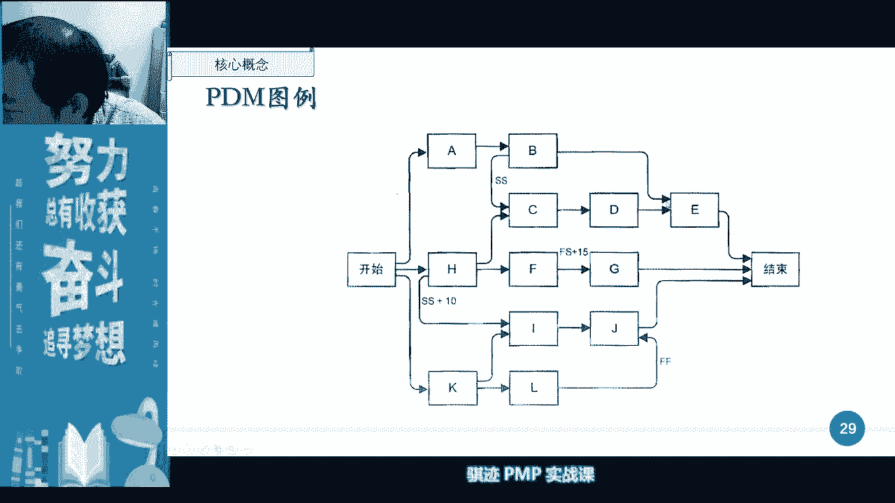

好我们继续讲啊，ok我们继续讲，我们继续讲，ok啊，有如果再有问题的话，个别我们我们群里面私下来要讲啊，私下来讲都可以，那么讲颈前关系法有一个很重要的事情，有一个很重要的事情，你们一定要记住。

后面也会强调，但是有很重要的事情，颈肩关系吧，在这样一个简单的图例当中呢，是只有一个开始，只有个结束，但是一定要注意是什么，颈前关系法很有可能有多个开始和多个结束，而且在之后我们使用颈前关系法。

画关键路径图的时候，一定要找出所有的开始和所有的结束，这是非常重要，否则我们的关键路径图就画不准确啊，这一点要特别注意，那么怎么样去识别开始和结束呢，没有紧前活动的活动就是开始有什么意思啊。

没有人比我在前面了啊，没有人比我在前面了，我就是头对吧啊，就像懂王说，没有人比我更懂china了对吧，没有人比我更懂核武器的，没有人比我更懂一切了对吧啊，那么它就是最大的对吧，这个逻辑明白了啊。

很很有意思对吧啊，ok啊，颈肩关系法的绘图法叫project dependency，然后是measurement，ok啊，好像那个稍微网上查一下啊，我突然间也卡壳了啊，我有点忘记我。

我课余的时候帮大家啊，帮大家查一下啊，sorry，我又有点忘记了，我要查一下原版书，然后没有紧扣活动的活动就是结束，不管他在所在路径有多短啊，我后面有道题目就会看到啊，那么什么叫没有紧后活动的活动呢。

就是说我是最后一个，没有人比我更后面了，那么我就是结束一个pdm画法当中，会有多个颈前多个井后，明白了吧，但是如果我们要利用这张pdm图，去做关键路径法的绘图的话，一定要找出所有的开始和所有的结束。

这个很重要啊，ok这一条我们在后面当中会继续强调啊。

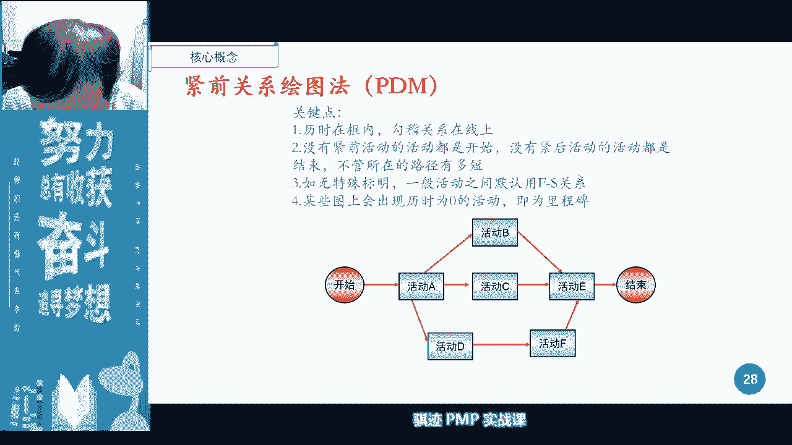

这里不用记，好我们继续往下讲，就是pdm那个图例，当然我们通过这样的解释，大家都应该都已经看得懂了，对吧啊，啊不是product data management，ok不对啊，这个不对的啊，你们解释不对。

不要瞎解释啊。

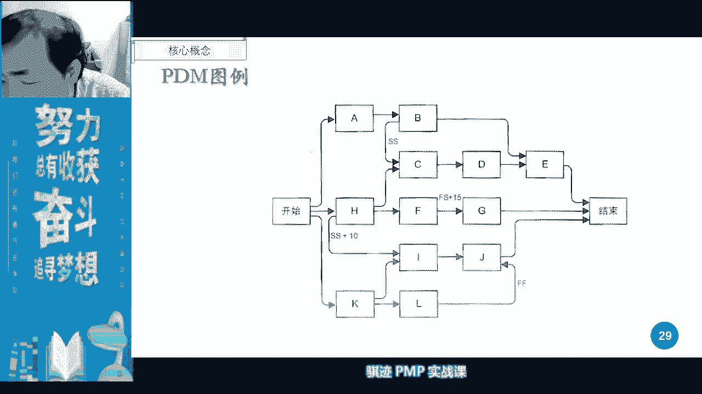

同学们不要瞎解释啊，然后我们如果确定依赖关系呢，会有一些强依赖关系和弱啊和选择性依赖关系，还有外部依赖关系和内部依赖关系啊，这个理解一下就行啊，这个没有太大意思，有些依赖关系是强制性的，有些关系呢。

基于我们的一些逻辑顺序和最佳实践，做决定的啊，可选可不选的，选了选择产生依赖的话，会更好为外部依赖和内部依赖啊，ok这个稍微了解一下，这个不是很重点，那么这个提前量和滞后量这张图。

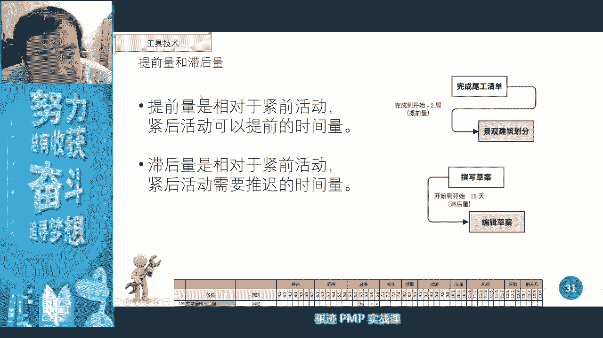

我后面的在下一节课当中，我给大家更新一下啊，突然之间我在因为这个这个图不是我画的，但我觉得这个图是有问题的啊，确实是有问题，好我们不用这个来解释，往后看，那么我们使用颈前关系法绘图呢。

就会绘出一个东西叫做进度网络图啊。

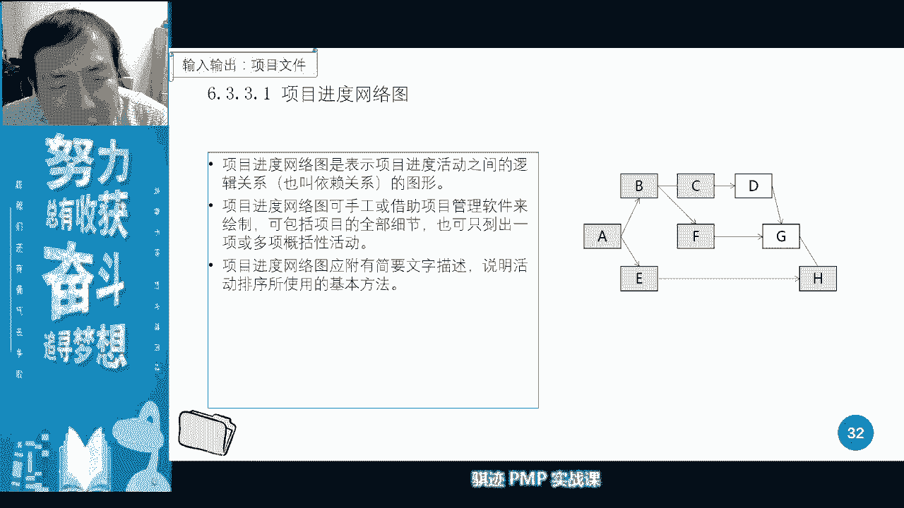

但是呢我们要知道不仅仅只有颈前关系法，pdm可以画出我们的进度网络图，还有一种图叫做a d m，当然d600 已经不考，但是有些同学说一定要让我介绍一下，那么我就介绍一下。

还有一种绘图方法叫做p a d m，他也会画出什么东西啊，画出我们的啊，我进度网络图，但是你会特点是什么，大家看到第一个特点是什么，你会看到活动是在线上的，所以a b m又叫做间线绘图法啊，界限绘图法。

他的活动是在线上的，我们在仅pdm当中活动是在框框里的，而我们的a d m当中呢活动是在线上，那么圈圈里是什么东西，啊有的人说的对啊，开始和结束可以有多个对，肯定是有多个，可以有多个，也可以只有一个啊。

那么圈圈里是什么东西啊，圈圈里代表的是状态，圈圈里代表的是状态啊，那么a d m的画法的好处是什么啊，他现在用现在用的越来越少了，但是它依然有它的好处，在一些特殊场景下有它的好处，它的好处是什么呢。

它可以描绘出一个项目，通过不同活动所产生出的一些状态变化，明白了在一些项目的安排中，他如果和一些项目的进度安排当中，规划当中，如果我们特别在意关注项目的状态的时候，那么a d m是更好的选择对吧。

他会项目当中经过不同的活动，会有状态一，状态二，状态三，状态四，状态五，直到一个状态六，ok啊搞错啊，不是交付物，而是一种状态，当然他也可能是交付物，但是它也有可能是项目的某个状态状态啊。

我15的状态描述更好，好那么我们又来了啊，举个例子啊，举举个例子，ok啊啊举个例子对吧，那么比如说炸猪排，我们又来炸猪排对吧，炸猪排我们开始从菜场买回来的猪排是什么，是生猪排好。

那么我们啊我们不呃对我们主板，那么炸猪排一般是不用焯水，如果我们要焯水呢，我们第一步活动什么活动a是超水猪排，焯水焯了下水之后呢，它变成状态啊，叫做焯过水的猪排，然后超过水的猪排之后呢。

我们要我们要做其他的什么活动啊，活动d活动d是什么，放油里面第一遍去炸一遍对吧，炸一遍，然后呢同时呢我们把猪盘呢也做一个活动，b活动币是什么，我们把这个活动呢啊把猪排呢上上粉，猪排是不是要炸猪排。

炸粉了对吧，然后呢我们再哦，sorry，这个这个这个关系有点不对啊，这个关系有点不对啊，啊不用助跑，用注牌不太好啊，我们我们我们换个例子，换个例子，我突然发现炸猪排，猪排是不能合并状态的啊。

ok因为他有这里有个虚活动啊，我们我们换一个，sorry，sorry，换一个恶排列入地理，饿不饿啊，我们换个例子，我们说小明考试啊，我们小明考试是一个项目，小明考试最初的状态一是什么，没有考过任何考试。

他的成绩是什么都没有的，先活活动a考语文，得到一个什么有语文成绩的什么小明，那么有了语文成绩，小明之后呢，如果语文成绩达到了80分以上，他才有资格什么去考什么数学活动，第数学啊，数学数学考完了之后。

然后呢，只有考完了数学呢才能去考高等数学对吧，那么语文考过了之后呢，才可以去考什么东西啊，啊咱可以去考英文啊，假设只能看到英文啊，那么考完英文之后呢，才会变成一个状态三，学过英文的小名。

然后呢状态四呢是一个学过高等数学的小明，那么还有一个活动c是什么，学过高等物理，学过高等物理之后呢，那么状态四呢，其实应该说状态是一个学过高等理科的小名，那么一个学过高等文科的小名。

和一个学过高等理科的小名，再通过毕业考试活动一就会得出一个什么啊，从高等学府毕业的小明，明白了没有，ok啊所以刚才炸猪排有点翻车对吧，那时候你们要举例子，我从来没想到啊，那么我们再回过来啊。

我们dm举个例子，这个东西我不会花很长时间，因为d m现在已经不考了，但是你要明白意思啊，首先小明是一个初入大学的小明，然后活动a是什么考啊，一些基础科目我们可以讲考一些基础科目，然后考完基础科目呢。

有一个活动必考一个什么理工科目，然后活动币呢是考文科科目，然后活动c呢是考一些什么选修科目啊，选修的啊，理工科目，然后呢理工科目有技术的理工科目，活动地学完了，考完了之后呢。

必然要考一个什么高等的理工科目，变成一个活动f高等理工科目，选修的理工科目和高等理工考完之后呢，小明的状态就变成状态四，通过了学校所有理工科考试的小明，然后呢我又考过了什么，我们高等的文科的考试的小明。

这两个状态合并起来就是一个什么又会文，又会武的小明，那么他就要毕业了，要达到状态六毕业这个状态我们一定要什么，通过一个活动，一什么毕业考试，拿到一个什么毕业的啊，论文或者毕业要做毕业设计。

达到了毕业设计，然后我们就变成一个什么，通过大学高等教育的一个小名，他就走向社会啊，所以a d m可以表现出一个人，比如说小明这个人，在大学生活当中的一系列变化，觉得pdm bgm对呀。

pdm确实就是比a d m更方便，这就是为什么大部分场景下使用pdm更多啊，啊也是同学又想吃炸猪排了吧，ok ok我去再也不举炸猪排的例子啊，那个例子没有了，好ok啊。

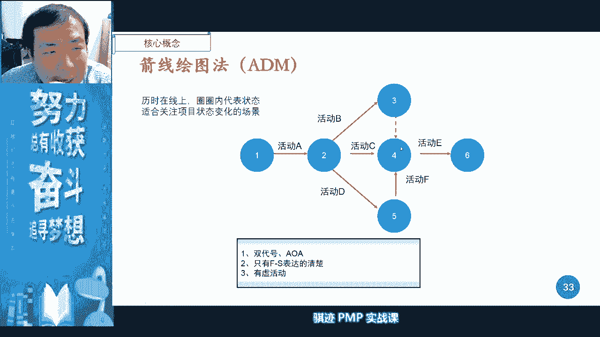

那么我们回过去看我们在pdm的画法当中。

有没有活动状态啊，啊有没有项目的状态啊，你看到没有状态，所以当我们很关注项目状态的时候，我们就不适合用pdm。

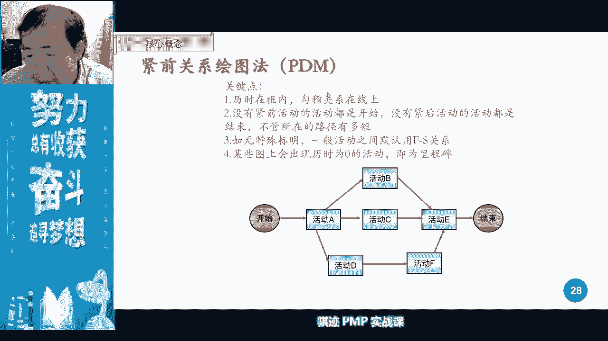

但是这种场景呢越来越少越来越少。

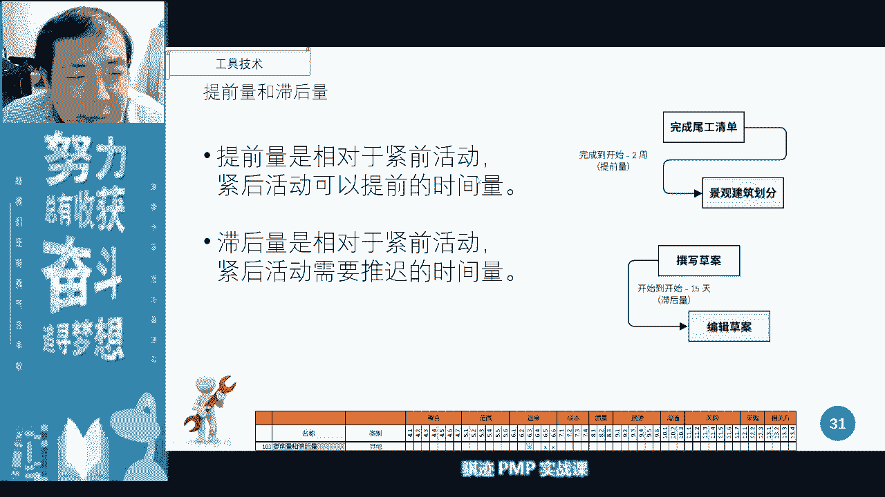

好这是dm和pdm对吧，那么我们在规划项目的进度网络图当中呢，我们还应该有时配以简单的文字啊，那么在这样一个图示当中，我们在这样一个图当中，我们看到a就是一个开始，h都是结束啊。

它只有一个开始和一个什么结束，但是在啊当然如果这个箭头如果是这么指的话，急就是个解说啊，这道图也画的不好，这是原始的，我们的p t也画的不好，这个箭头往极值，那么急就是个结束，往h指南h就是个结束。

取决于这个往哪里指，ok这就是一个进度网络图的一个不恰当适宜啊。

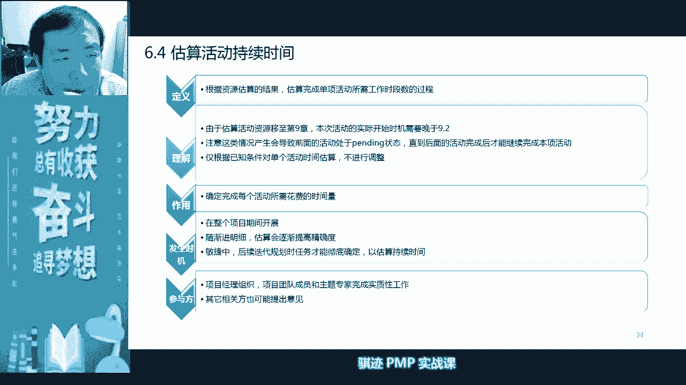

那么当我们完成了进度网络图之后。

我们就可以得出一个什么东西啊，啊，我们可以得出一个我们的进度。

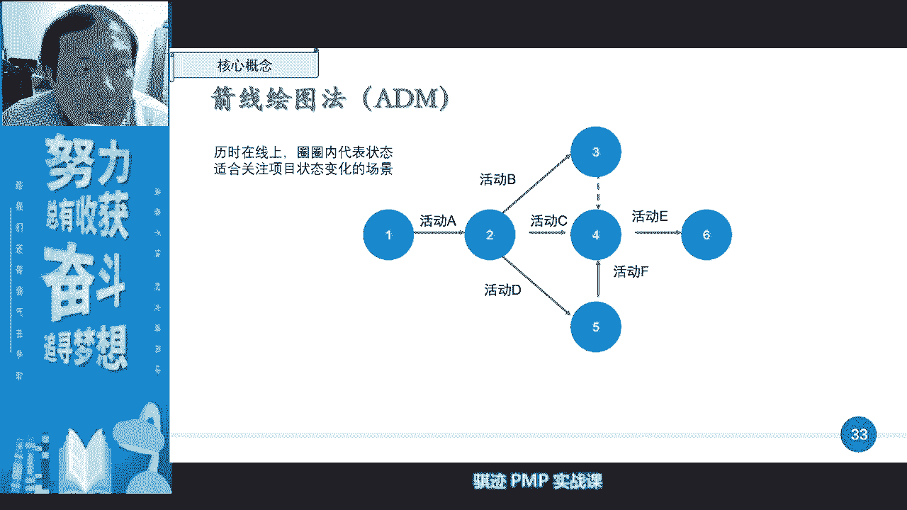

网络图的一个勾稽关系，勾稽关系，勾稽关系。

但是在这个进度网络图上，比如说啊，比如说我们在这样进进度上，我们完成了他的逻辑关系，这时候我们有没有项目的进度，啊没有他没有项目的进度，所以完成了进度，网络图是没记住，有一点啊，考试经常会问题，没有啊。

这个要记住，仅仅完成进度，网络图是没有项目的进度的啊，但是它可以确定活动之间的逻辑关系，确定下来的啊。

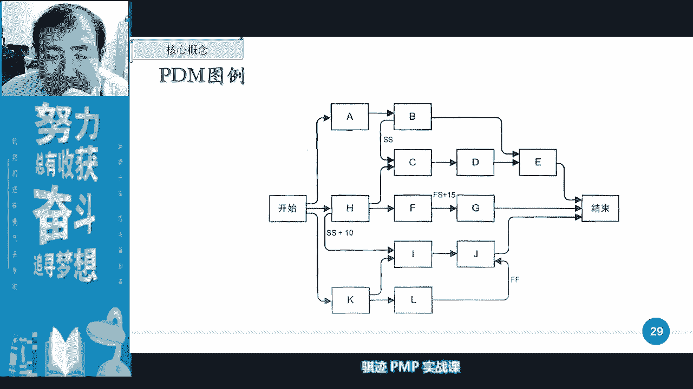

ok好，那么讲完这一段之后呢，我们就进入下一段活动，我们就要进入下一个阶段，叫做估算活动，持续时间。

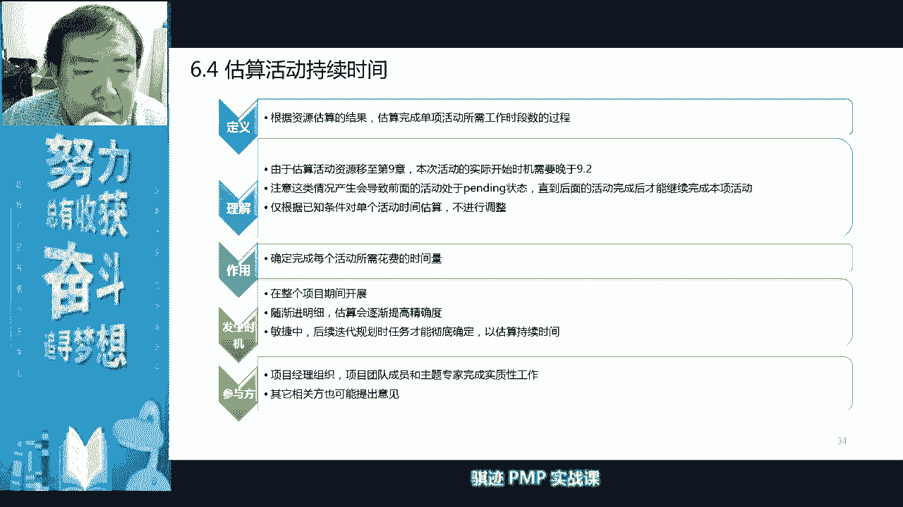

那么在估算活动持续时间了之后呢，我们就会多一个东西啊，多一个东西就会出现一个新的估算时间的，估算依据和估算方法，估算依据和估算方法，去得出一个活动的持续时间啊，好怎么讲估算一个活动最开始的时候。

我们会用一种什么估算，就打个比方说我们打个比方说，比如说你做一件事情，一开始你要估算的时候呢，比如说你要估算你从家里走到公司要走多久，那么你是不是很多同学住的离家离公司挺远的，对吧啊，那么离家里挺远的。

那么我要我要估算从家里提到公司，我肯定没有走过了，那我只有类比什么东西啊，比如说我从家走到我家附近的一个公交车站，比如说距离是1km，我要走多久时间，那么我估估算一下，我走到公司需要多少时间。

类比一下是不是有个类比出啊，我比如说我大致是，比如说我家走到我家附近最近的公交车站，可能需要十分钟，但是我家走到公交，我家的公交车上和我家走到公司可能是什么，要远十倍，那么我就变成什么。

可能需要100分钟对吧，拍脑袋对，拍有一点拍脑袋，但是它有一个可以有类比对吧，类比对吧，我们大十倍，那么距离长十倍，是不是走了路程就一定长十倍啊，有时候不一定的对吧，比如说有些同学住在重庆对吧。

那就来了，重庆是个山城对吧，你从山上面往下面走啊，十分钟，山下面往山上面走呢，有些同学我觉得给你30分钟，你也不一定做的完对吧。

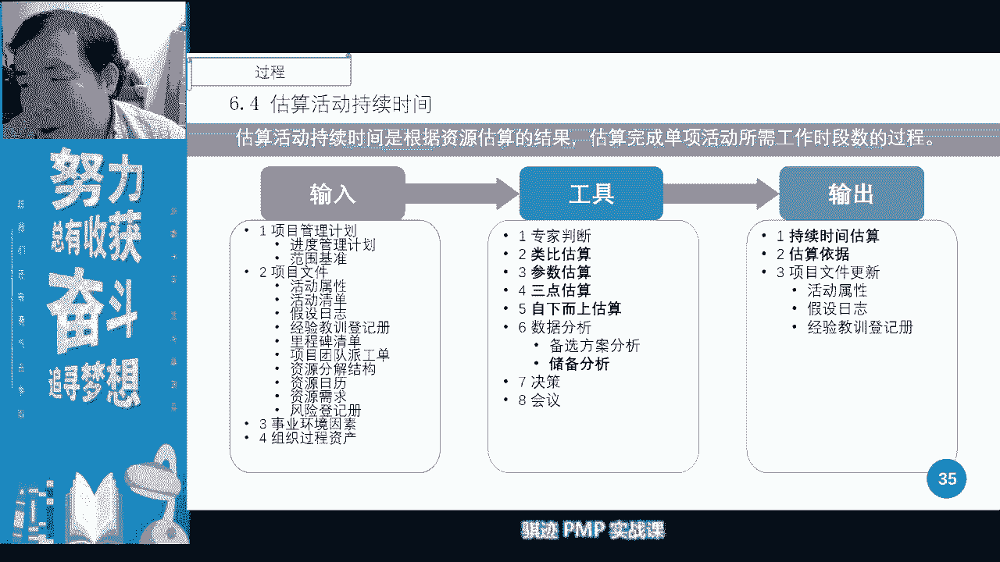

所以类比估算它的误差率是很大的，并且往往很难参考很多的依据，所以你只能如果有过去的参考值，你可以用来参考，但没有过去参考值的时候，你没办法进行参考啊，这是类比估算的特点，所以类比估算呢。

它估算的成本呢是比较低的对吧，不要任何专业的基础，耗时也比较少啊，脑袋一拍就有了，所以它的优点是成本比较低，耗时比较少，缺点也比较明显，它的准确度也比较低，所以在所有估算当中，我给大家下面一条红字。

大家看到了所有估算当中，类比估算是成本是最低的，用时是最短的，准确性是最自然的，最差的，它一般用是什么呢，项目刚刚启动或者在商业论证阶段，在这个阶段当中，我们对项目的信息是严重不足的对吧。

所以使用类比呢是最恰当的，所以类比估算会提供一个粗略的依据，为我们今后之后的一些项目内容呢做准备，做铺垫，类比估算和标杆对照对，其实啊这位同学，能够触类旁通了啊，啊要表扬一下叫做无奇的同学，对吧啊。

就是那个经常经常和我开玩笑的同学，对吧啊，吴邪同学说的对对，类比估算其实很很大，程度也非常类似于标杆对照，只不过类比估算呢可以什么有一些放大缩小，标刀可以调哪一边没有放大缩小啊，会有些例外差别。

但是你可以在意思上很接近，很接近，好这是类比估算特点，所以当我们没有依据，项目刚刚开始没有数据缺乏经验的时候呢，我们会使用类比估算啊，那么类比估算之后呢，我们会有第二种估算方式，当我们有大量的历史数据。

注意啊，有比较精确的历史数据，大量历史数据，同时呢我们又有一个嗯参数模型的时候呢，我们可以使用什么，可以使用参数估算，啊参数估算参数估算的估算方法呢就是什么啊，用一个模型。

但是参数估算并不像我们的活动历时这样会啊，有这么简单的就可以进行参数估算它，所以参数估算一般要比这个例子呢，六六微更复杂一点啊，我六更复杂一点，那么参数估算它成本呢，用时呢精度呢就比较中等。

但是呢它这个中等呢是建立在一般意义上，它非常依赖于什么东西啊，数据的准确性，有效性，可靠性和模型的有效性，所以呢它可以在项目的各个阶段当中使用，但是不适用于没有历史数据的项目。

那么有哪些项目会直接拿参数估算，作为我们项目的一个最精确的依据啊，唉比如说我们做一个啊作为一个科学实验项目，那么我们可以经过，可以使用科学实验模型来进行估算，然后呢进行什么最终的结果测定，因为什么。

比如说我们是进行一个什么天文估算，我们要估算一个比如说太阳的重量，那么我问你太阳的重量，除了用参数估算，还能用什么东西估算，没办法估算，类比估算肯定没有这个精确对吧，你又不能把太阳拉过来撑一撑对吧。

那么只有参数估算明白了，在这种情况下没有其他选择了啊，所以比如说我们讲说给太阳算一算太阳的质量，所以太阳的质量人类已经能算得很清楚，因为这个模型很成熟，而且太阳离地球很近。

所以呢我们估算太阳呢有各种各样的方法，可以随时随地测量，所以总会越过越准，越估越准，所以参数估算呢会很准，所以太阳的质量呢人类是过的很准，但是如果我们要估算一颗比邻星的质量呢，就没有太阳那么准。

如果我们要估算一个1亿光年之外的，某个行星的质量呢，那么有可能就没办法用参数估算，或者只能很粗糙的赞数估算，更多的依据是依据什么，以太阳作为参照物进行估算啊，所以在天文学上会有这样的东西啊。

他经常会描绘说什么某一个星球，它的质量大致是多少个太阳的质量，它会用这种描述方式，为什么他没办法说出这个东西有多少质质量，但是呢它可以毛咕咕的算出啊，比较粗略的估算出这个东西。

大致和多少个太阳是差不多的，那么所以天文学上的估算呢特别的不精确，因为所有的星星都是不能用来称的对吧，那么怎么怎么办呢，那只有怎么办呢进行估算，所以天文学上一般认为，只要不估错，我们的数量级都是可以的。

比如说你可以估计，这个星球是9000个太阳的质量，也可以雇这个星球呢是5000个太阳质量，或者1000个太阳质量，在天文学上当中呢都不算是误差太大啊，啊是天文学，搞天文学的人。

千万不要和他说精确这两个字，他会疯掉的，很有意思，所以但是这些方法主要都是依靠什么参数估算，参数估算，那么参数估算可以在项目的各个阶段使用，但是不适用于没有历史数据的啊，没有历史数据尤其注意。

或者是数据极其不可靠的，极其不可靠啊，就比如说中国古代打仗啊，嚯嚯东过来两张什么啊，赤壁之战曹军83万大军啊，然后然后被打的片甲不留在实际，经过科研考证，当时曹操也就十来万人，十来万人啊。

83万是扯淡啊，他可能算出大量的后勤民工也算进去啊，所以这个数据历史数据呢就严重灌水，那么这会导致什么。

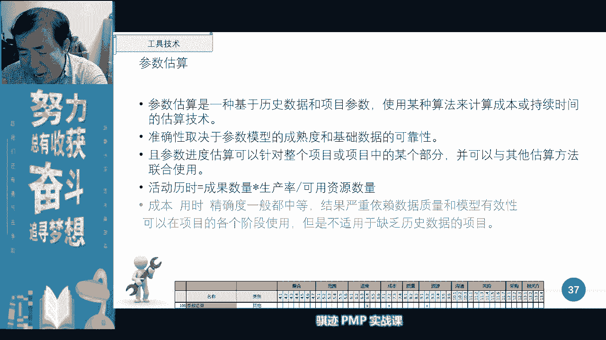

我们的评价都是不可靠的，好我们继续看，那么参数估算之后呢，我们会有一种估算依据的啊，这种估算呢就要精确的去计算了，这种估算呢叫做三点式估算，这是在进度当中使用的，注意三点估算不仅仅可以在进度当中使用。

还可以在哪里使用啊，成本当中使用啊，还有成本当中使用都是可以的，那么这种估算是什么意思呢，啊我们首先有个概念，就是啊一个事物它总归会有个波动的区间范围，他总会有个什么最乐观的数值啊，最乐观的时间。

最悲观的时间，最有可能的时间，那么当我们把这三个时间取作是什么啊，曲作是一个作为一个平均值的时候，那么你就会得出一个什么，它最有可能是多长时间啊，所以我们在公式当中可以看到啊。

这是我们三点估算的一个估算值，三点估算的估算值，这里面可以看到啊，在三点估算当中，我们会取一份取一份最乐观的时间啊，这个o叫optimize，好像是乐观，然后呢举一圈p叫positive啊，最悲观的。

然后取一个most possible对最有可能的，然后呢这里要乘，然后把它除以六七，平均等分之六，就得出了一个什么啊，我们的期望值，the most expected time啊。

我们的期望时间这种这种估算方式啊，我们称之为什么贝塔估算，三角估三点估算当中的贝塔估算，这个叫贝塔估算啊，那么贝塔估算有什么好处呢，因为这里是四份呢，最有可能，所以这种估算呢很容易应用到什么这个当中。

大家看到啊，这种分布方式是一个什么，是一个左右对称的费用分布方式，对不对，好在这种左右对称的分布当中，其实我们四不四分，其实说对于我们最后出来的一个平均，最有可能的值有没有影响，是没有影响啊。

算术平是没有影响，但是贝塔用于科普什么情况，假设我这个啊大家看到我的鼠标啊，我们用一个鼠标画一个啊，假设我们这个值的分布是，这样了咋办，这是一个对称分布吧，这就不是一个对称，但是这是一个分布啊。

这很很可能是一个分布啊，ok啊那最悲观的是一种根据经验，根据经验，根据经验，所以这种分布情况下，如果你取一个最乐观，取一个最悲观，然后取一个最有可能的值的话，是不是和它的正态分布的。

它其实它的中心值在哪里啊，它中心值在这里，是在这里，是不是你算出来的值其实是在这里附近对吧，而是在这里附近，你如果取最最悲观，最乐观，最有可能，然后取出这个值一拉，它的值是算出来的值是这里。

其实这个分布它的中心值是在哪里啊，是在这里，这个时候是不是偏差就特别大，所以我们会把这个东西叫做加四份啊，这里中心加四份去算出它一个什么最呃，算出来一个最呃最合理科学的一个期望值。

尤其是他在不对称分布的时候，不对称分布之啊，所以这种是一个比较科学的算法，那么当我们有一个粗略的算法的时候，我们发生一个粗略的算法的时候，你会看到什么，我们会使用三角估算。

当用三角估算的时候就是非默认的，所以考试当中如果没有特别说明，我们一律都有使用这种这种算法，这种算法叫做啊贝塔算法啊，我稍微写一下啊，e t a叫贝塔算法啊，我们默认都是使用这种贝塔算法啊。

但是如果考试它恰恰指明要用三角算法，因为三角算法现在已经不在，pm博客当中默认出现了，所以可能不高，但是如果真的出现，就要记住什么，直接将他们三个相加除以三，但是它的缺点就是精度不高，精度不高啊。

所以会明确要求在使用三角算法的时候，才采用三角估算的算法去做，ok明白了，ok听明白的同学可以在公屏上打一个，听明白了，没有听明白的同学呢，你可在公屏上说没有听明白，我们再讲遍，听明白了，好好谢谢啊。

好我问个问题是让大家稍事休息下啊，因为连续讲了一个半小时课，大家可能听的有点累了对吧，好像听明白了，四是怎么来的，四是一个根据经验来的啊，不好意思，根据经验来，那么你问我经验从哪里来呢，ok谢谢啊。

贝塔算法的来源其实很有名，是根据美国nasa在航天领域估算的一个经验，来，这里加一个四是最科学的，那么你就不要问我为什么四你去问nasa啊，ok大家可以网上搜一下，贝塔估算。

曾经在美国六七十年代登月活动当中啊，产生了呃，起到了一定的作用，好有同学说没有听明白，ok啊，没听到，我再讲一遍啊，我们在期望估算的时候呢，如果我们用计算的方式去进行期望的计算，期望值是计算。

那么我们最害怕的是什么东西啊，是它不对称对吧，对称的话，我们把最高最低和当中的值1÷3，差不多就可以了，或者是接近对称这个数值，我们出来的期望值和我们的实际的产生的值，是很接近的。

但是呢如果如果我们发生了一件这样的事情，就是他像我们图上所说的途径严重的不注意成，那么它通过我们简单的三角估算，所算出来的这个公式呢，会严重的偏离我们的什么，实际的应该产生的测量值结果。

那么是不是对我们故障来说就非常不利啊，在这种情况下，我们就会额外的提高中心值的，最有可能指不定中心值啊，最有可能值的比重，以把我们的测算值和我们的啊，和我们的就是说啊，就这个最有可能就是一个峰值啊。

最后和我们的一个测量值呢相接近，然后达到一个什么减小误差的目的，这小误差的问题好，那么在这个在这个例子当中就是什么啊，我们可以看到我们用一份的啊，在公式当中，我们用一份的最乐观和一份最贵平方加四分呢。

最有可能除以六，得出一个期望值，这个期望值就代表了什么，一个叫东西叫数学期望，ok啊，有些东西可能在这一点可能明白什么叫期望值，就是数学期望，认为这个事情，这个这个事情它的分布。

它的期望的分布最有可能会出现在哪里啊，最期望我们会出现在哪里啊，是出现在这个值的这个值的附近，这个值的附近，那么当我们是完全对称的时候，期望值就是最有可能的，期望值就是最有可能的。

但是这个值仅仅指的是什么，它的概率分布，当它概率分布不平均的时候呢，你看起来好好像期望值和最有可能是化生一样，其实他们两个呢可能会离得像这样啊啊sorry，像这样和这样离得非常远。

最后导致我们实际发生的值呢，更偏向于什么东西啊，更偏向于实际的期望值，而不偏向于可能性，那么我们要消除这种偏差，就把这两个单用四份相加，这样的方式呢将他们两个拉近拉近了一个什么。

一个误差是可以接受的这样一个范围里，就是那么有人说老师啊，有人喜欢刨根问底，说老师最有可能时间是怎么出来的，因为有可能我甚至不知道这个东西的分布啊，注意有可能不知道这个事情，这个东西的分布。

那我是怎么做的呢，我可能不断的对这个值进行测量，测量测量出现概率最高的那个值，是不是最有可能的值啊，是的，但是有没有可能我们在测量其实是有偏差的，偏见的或者时段性的，那么怎么办呢。

通过这样的公式去进行一定的妥协，校正设定这样一个值，那么这个值呢很有可能是什么，真正客观上它存在的一个期望值啊，就是这个意思，所以期望值期望值就是这么出来的，ok不知道大家听明白了没有，好好。

那么这个听出来之后呢，我们会后面会讲一个东西叫标准差，标准差，标准差在pmbok第六版中已经提的比较少了啊，但是依然为了预防可能会考到，我们依然会讲这个东西啊，那么什么叫标准差呢，以中心为例。

假设这个分布呢是比较偏中心的，那么它的标准差是什么呢，我们左边和右边各分啊，各分，一个半西格玛加起来，这个整个一个叫三个西格玛，所以我们在西格玛当中，一个如果在三个西格玛的精确范围内，就认为什么它99。

7%，都是在这三个西格玛的范围内，那就表示这个值这个值域呢涵盖面非常大，涵盖面非常大，所以这次就是有三个西格玛啊，ok但是啊我们以前传统的这个奖叫半个西格玛，现在ok我们现在讲扩大成一个西格玛门。

没关系，那么两边就是什么六个西格玛，六西格玛，六西格玛和六个西格玛确实不是一回事啊，六西格玛是另外一个理论啊，那么我们讲一个值，如果在左半落在左半边和右半边当中，我们如果是认为它的三个西格玛范围内。

那么所有的西格玛都落在范围内的，值的概率是多少，是99。3，那么落在两个西格玛范围内的呢，是95。4%的概率，落在一个西格玛范围内，62。6%，18。26这个范围内，那么只要落落在这些范围内。

都算作命中一个西格玛，命中两个西格玛或者命中三个西格玛啊，那么在这种情况下考试，他这个考试的形式会比较傻，他只会问你，我们说某一个值，大家比如说考试问你它的概率是95%，那么请问他是哪里到哪里呢。

那么你只要把这个to是不是在这里，这个极端tp是不是这个极端啊，这两个极端减一减，是不是这个东西的宽度啊，是不是啊，是这个东西的宽度，这这一个一个直的面的宽度，把他除六份，是不是一个两个，一个西格玛。

两个西格玛，三个西格玛，四个西格玛，五个星嘛，六个星巴啊，然后他跟你说95%，那么你把这个西格玛呢除以六，然后再乘以四，就是四个西格玛，如果他说是宽度是97%多呢，他很有可能是这么一段。

他很有可能就是这么一段，哎呦sorry，有可能是这么大，那么那你就把它除以6x5啊，就是这么傻，所以这个题目呢现在已经不怎么考了啊，它其实跟西格玛那个东西，在统计学没有太大关系，没有太大关系。

ok啊明白了啊，所以这个题目你不太好，你们只是了解一下，万一考到呢，这个属于就是超纲了啊，现在已经属于超纲了，好那么这个就是一个三点估算，不知道大家听明白了没有，好那么三点估算讲完之后呢。

我们就讲最后一种估算。

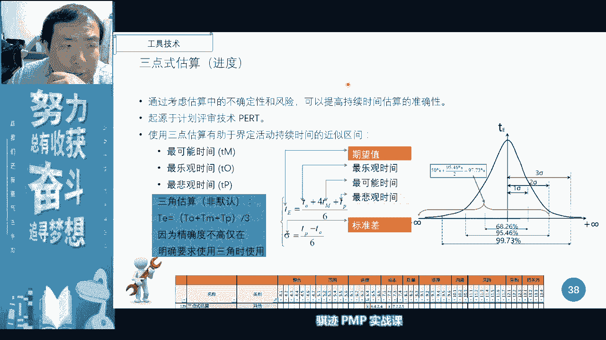

今天讲了最后一种估算啊，我们会看到这是一种最为精确的估算方式，最为精确的估算方式，这种估算方，一个一个一个一个一个拆卸，从顶注意啊，这个过程注意先从顶上拆到下面，拆到最细，拆到下面一个项目范围。

拆到最细，拆到进度，最后拆到是什么东西，最细的最细的单元是什么啊，最细的单元是什么啊，再给我打在公屏上，一个项目从顶上开始往下去，最顶上是什么，是使我们的s o w x6 上面最细是什么东西啊。

请打在公屏上，我们今天刚刚学过activity活动，一个项目从顶上拆到下面，最细是供我们的活动，那么那什么东西啊，项目的进度的汇总，这个时候的进度时间是不是最精确的对吧，是最精确的啊，如果自己进去。

那么我们会就会得到一个最最精确的项目中，所以所以你看项目管理当中总是从什么，我们会在后面的成本当中也会看到这个特点啊，先从上面往上分解，再从下面往上面汇总汇总出来，这个时间就是我们最精确的时间。

那么也可想而知，这样一个过程是不是一个成本最高，耗时最长，精确度也最高的，那么如果我们到了这个阶段，就意味着什么，我们对项目呢非常的有把握，它的范围进度成本非常的有把握。

然后呢已经到了最终要依靠这个分解和汇总呢，进行执行实施的阶段了啊，这个阶段我们会用这种方式，因为它精度最高，最吃得准，那么以此为基准呢是最可靠的，这样情况，那么如果无法以合理的可信度。

对项目的持续时间进行估算呢，则应将活动中的工作呢进一步细化，说明什么，这句话什么意思啊，就是说如果不能够进行估算，说明你的活动呢拆的不够细，再拆细一点，再拆细一点啊，那么然后呢估算具体活动的时间。

再汇总，中间得到每个活动的持续时间啊，那么什么意思啊，啊就是这个就又来了啊，就是说这时候有时候说明什么，你这个活动动作做的太粗啊，动作或者太粗，那么我们最简单的动作过多，再出一个例子。

什么我问你们大象装进冰箱要几步，这个都会回答是吧，三步冰箱我来开，把大象塞进去，把门关上，那么实际操作中这个是能实现的吧，当然是不能实现啊，一步啊，有些同学说请问一步怎么把大象装进冰箱啊，那我不知道啊。

那么所以大象装进冰箱就是一个没办法，故乡应该是什么呢，应该是首先把大象把冰箱门拉开，是可以估算时间的，把大象怎么塞进冰箱，应该细化到一个很细化的程度对吧，怎么塞怎么塞怎么塞怎么塞对吧，先塞头发，先塞脚。

先塞先塞尾巴，还是先塞鼻子对吧，走着慢慢慢慢塞，塞塞塞，把它塞进去之后，最后一步把门关上，门关上可能有技巧的吧，先关上面跟下面慢慢关，是用力挤对吧，关不上去，怎么样把它勒进去，对吧啊，这种步骤。

那么所以很多工作当中，当我们发现某些活动不能够进行合理，可信的估算，就意味着什么，活动拆分的太粗，我们会把这种活动拆分成更细的活动，来进行统计啊，如果他能合理估算时间。

就意味着这个活动一般来说就足够细啊，因为有了足够可信的活动持续时间，就意味着这个活动是能够按部就班的去执行，对吧，那么活动和活动之间我们这里有看啊，这里第三段看，活动和活动之间。

可能存在或不存在影响资源利用的关系，如果存在，就应该加以著名并记录当中，所以活动和活动之间，有时候呢是不存在资源的关系，但是有些活动呢会共用某些资源，所以就会形成一个对资源的依赖和约束啊，会有这种情况。

那么我们在活动活动的阶段中，要特别注意这一点啊，好然后不论怎么样，所以一般的项目注意一般的项目，最后的项目基准的产生，那么这种自洽的过程是从哪里下面开始呢，是从活动开始，活动开始。

但是活动在不同的我们讲，在不同的时间轴的位置上有不同的长度，这是为什么，是因为在不同时间轴上的不同位置，他可能能利用到的资源，它的外部的事业环境因素可能都不一样，会导致这个活动持续的时间段不一样。

然后再把活动串起来的逻辑不一样，它的提前量滞后量也可能下，最后导致整个项目的活动程度呢，就导致不一样啊，明白了啊，这是一个非常复杂的东西啊，有些东西也想到了切碎的塞啊，看你们这个啊今天有点意了啊。

不要太执着这个事情好吧，那么我们在活动的故障当中呢。

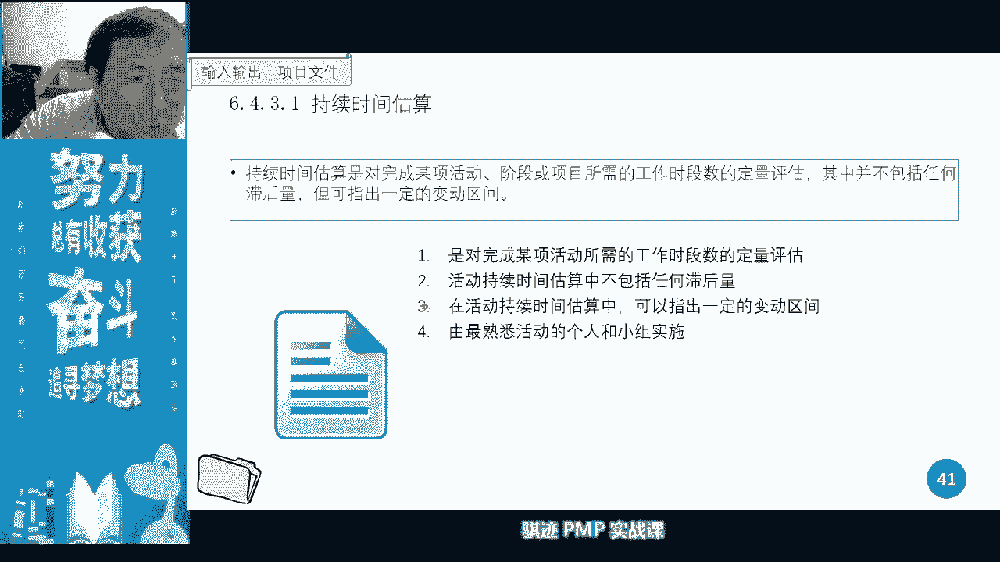

会输出一个东西啊，会做一个东西啊，这个就是我们今天讲的最后一个概念啊，最后一个概念啊，我们讲最后的一个概念当中，我看看啊，k活动持续时间啊。

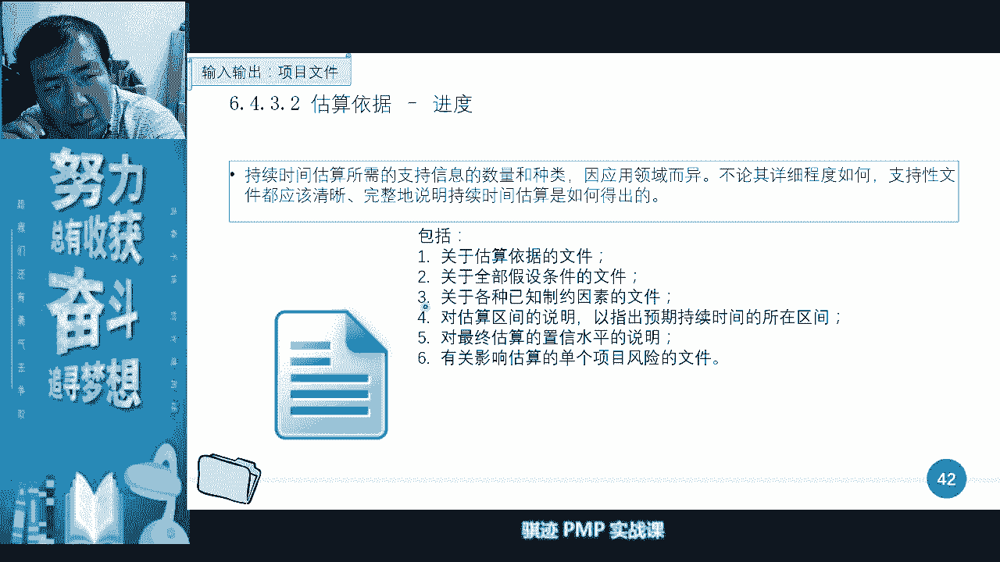

我们明天再做啊，我们只会讲一个概念叫做储备分析，什么叫储备分析，就是我们干活的时候，比如说比如说领导让你干活，说这个活多少天干完，比如这个活多少天干完，那你会呃你你估算了一下，你说这个活大致20天干完。

你会跟领导说这个活我要多少天干完，我问你们，25天30天啊，ok有没有讲20天以内的，啊都给自己宽限的，一个月100天，一至少五期啊，你们有些人挺黑的啊，ok啊，但是都是比20天长对吧。

那么比20天长的部分你们用来干嘛，ok可以啊，非常好啊，防止意外对印度突发事件划水，ok都是可以啊，那么如果你们知道这个啊，就比如说我们项目估计20，这个事情20天做完，然后你跟领导报了30天。

领导批准那么多余的这个十天，你如果知道干嘛，那么它就是一种什么应急储备，它因为它已知道用来干嘛，用来应对于什么啊，可能出现的意外，比如说你干活干到干活干到一半，比如说身体不舒服了，生了两天病对吧。

或者你干到干到一半了，你想出去，可你的男朋友女朋友对吧，老公老婆对吧，出去旅游几天对吧，回到你干活，干到一半呢，觉得什么心情不好，不想干了对吧，这些都是意外的风险因素，用于应对已知的。

但是不知道什么时候发生的对吧，我们讲啊，很多女生在一个月当中总共会有那么几天对吧，心情不佳，有很多女生当心情不佳的时候呢，就会导致身边的男生呢也心情不佳，这个时候呢你已知这个事情，每个月都会发生一次。

但是你不知道它什么时候会发生，或者是你不知道它发生的程度如何，那他这就是一种什么已知风险，但未知何时发生的一种风险，那么这个时候我们要用应急储备去应对它啊，这已经知道还有一种储备呢叫做。

你不知道什么时候发生，你也不知道什么什么时候呢啊，它是一种什么性质的东西，但是呢你留着对吧，你留着，那么这种储备呢就管理储备，管理储备，那么典型的管理储备是什么啊，就是说你啊不知道什么时候。

比如说啊走在路上，不知道什么时候啊，就就就突然之间啊被人家啊什么拐骗，骗到了什么传销组织里去了对吧，然后呢p m p课没有上对吧，然后呢就中断了几天，你留了十天的管理储备去应对这种情况。

然后你十天后呢从传销组织当中逃了出来，这个时候呢这个是你浪费了时间，十天呢就用管理储备呢去进行应付，所以这就是一个储备分析，当我们管理一个项目当中，记住任何时候都应该有管理者。

尤其是项目管理项目的项目经理，都应该拥有一定的什么管理储备和应急储备，去应对，可能的啊风险很可能风险，但是这个中间有一个很重要的概念，就是应急储备是算你的管理绩效啊，啊女生是风险啊，老师说的对吧啊啊啊。

这样啊，老师啊，注意啊，我们回到课程正题啊，我们在这个课程的最后一讲，回到个人，我们在应对风险的当中，我们注意，应急储备所应对的已知风险是算绩效的，而管理储备所应对的未知风险是不算绩效的。

那么为什么我们先讲一个简单的道理，作为啊这个这个这这一页的一个结论，因为已知风险是通过你项目经理，对于这个项目的分析所得出的结果，它是经过你的劳动啊，然后这个事情呢被甲方应该是知道的。

所以他应该算作迹象，而管理储备呢，他应对未知风险好，根本不知道什么时候会发生，也根本没有预料到这种事情呢，是你没有做过努力的，你仅仅花钱去解决，所以呢它是未知未知风险，那么甲方不知道甲方不知道的东西。

他认为不应该算作你的绩效，所以这个东西应该不算绩效啊，后面ok但是不要急，等到我们学到成本那一章，管理储备和应急储备，为什么算绩效，不算绩效，应会有更深刻的描述解释，这里就不多讲了啊。

好我们继续讲下面一页，讲储备分析呢，然后做出来之后呢，我们的估算项目的持续时间呢，就会输出一个结果，叫做持续时间估算，持续时间估算指的是什么呢，对于完成某个项目，某某项项目，某个项目的阶段。

和整个项目所需工作时段的定量评估，但可以指出一定的变量区间啊，什么储备啊，什么东西啊，所以是对完成某个项目所估算的一个定量估算，注意它是定量的，所以要客观在活动储备当中估算，在活动持续的时间当中。

可以指出一定的变化区间，那么这个什么意思呢，因为有时候我们我们在后面的一章当中，会学到啊，后面一个章节当中会知道，当你估算一个活动的时候，它会有一个最早开始时间和一个最晚结束时间，他有一个最早啊。

最早开始时间，最早结束时间和一个最晚开始时间和，最晚结束时间，这两个时间之间会有时间差，这个时间差叫做滞后量，也就是说这个事情你可以今天5号做，也可以最晚7号做，那么对你来说。

你5号座7号座对整个项目都没有影响，那么所以它会有滞后两天的这个滞后量，会有这样一个量存在，但是呢我们在管理项目当中，不可能说你每个活动都有来回有一个摆动，麦会有个摆动。

我们就很难估算整个项目的持续的整体状况，所以我们约定，在项目在估算持续估算时间的估算当中，我们暂时不考虑滞后量，暂时不考虑，直到什么时候会考虑啊，直到我们在后面章节去制定项目进度计划。

使用关键路径法去制定进度计划的时候，才会去考虑啊，ok啊这要注意，那么在活动持续时间过程当中呢，我们可以只动一个b站区间对吧，我们留有区间的来回正-2天对吧，这个项目呢最最多呢用三天对吧。

最快的一天对吧，多数两天回来就会有一个变动区间对吧，这很熟悉，那么项目呢应该假在估算这个当中呢，会有假设有最熟悉活动的个人和小组实施，这指的是什么，这条指的是什么意思啊。

啊这条更多指的是我们现在在估算的时候，在尤其是针对于单个活动去估算的时候，我们用的是最理想状态去估算，注意最理想，那么我们工作状态不可能永远是最理想状态，那么当你的最理想计划遇到非理想状态环境。

怎么办呢，不要急，在我们最后制定项目的进度计划的时候，我们再做调整，ok明白了，这一点要注意啊，所以在估算项目的活动的持续时间的时候，我们基本上是以活动为主，但是我们对活动假设一个最理想的条件。

再把它拼接起来，做成整个项目的进度基准的时候，我们在考虑什么，他的合同各种制约因素和非最理想状态，注意啊。

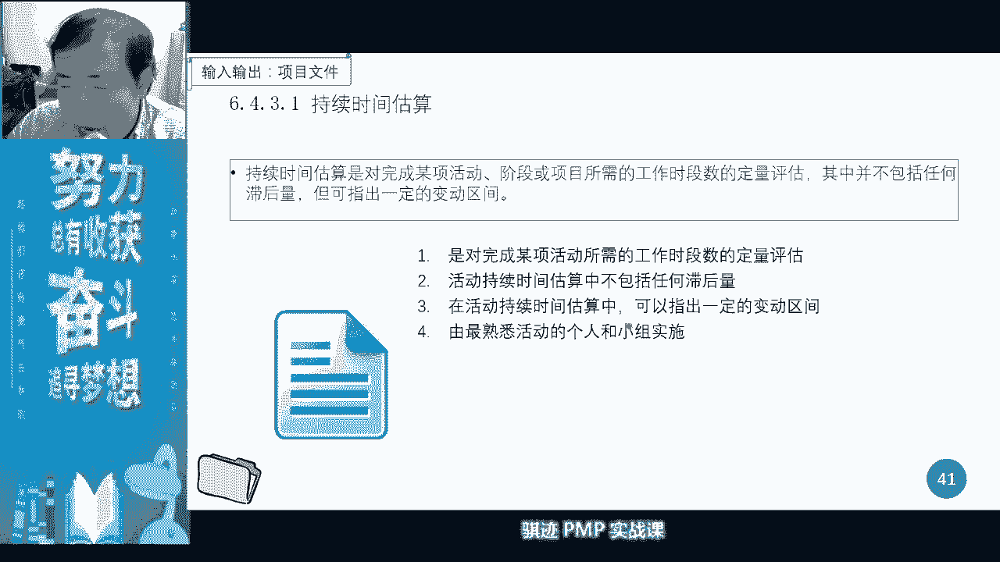

这要注意，好我们估算呢会有一个估算依据，为什么这么估算，依据的文件，假设条件和制约因素，对估算区间的说明，置信区间说明啊，诸如此类，那么质性区间呢一般在使，如果说到看到置信区间，那么一般说明什么。

它使用统计学的原理啊，我们一般会说，此估算的置信区间是95%，就比方说95%都是这个这个东西呢，都是准的，那么有5%可能不准对吧，当然自信水平越高，那么说明它的可准确率就越高，是这样意思。

大致这只是统计学原理啊，那么持续时间估算的所需要的支持的信息类型，应应用领域而已，不论其详细的中心融合支持的文件，都应该清晰完整的说明，持续时间估算是如何得出的啊，你这么孤的理由是什么对吧。

你可以写这么贵的理由是因为我是专家，我脑袋一拍就叫专家判断，也可以说我的故障理由是，因为我有最先进的参数模型，也可以说我的估算理由是，最详细的估算，所以得出了这样一个理由都是可以的。

那么这种估算是不是都可以存在在项目文件里，当然都可以，因为你在不同的项目阶段，肯定有不同的项目阶段的估算的方法对吧。

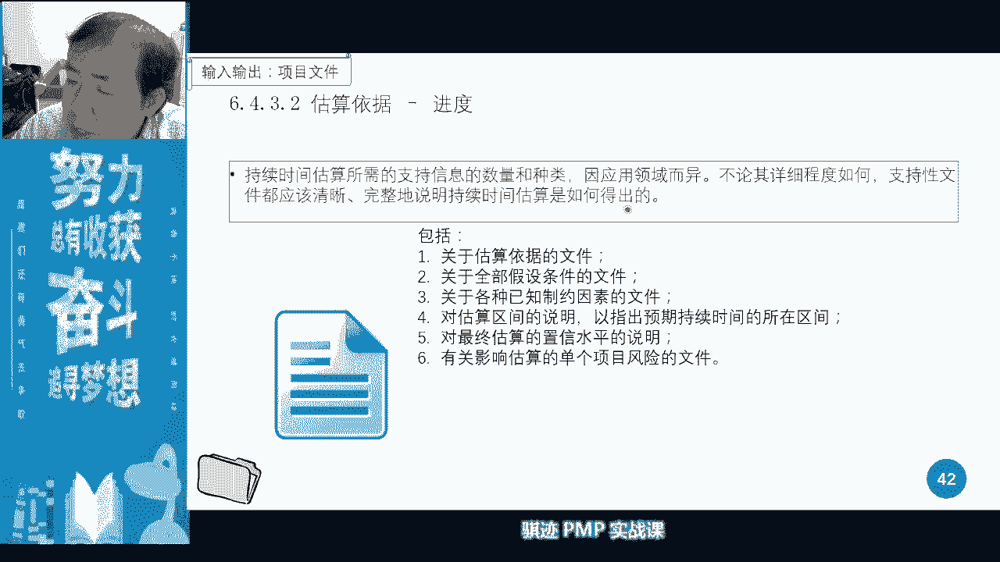

所以有估算依据，ok啊，这是一个活动估算的一个估算的一个估算文档，那么w bs编号多少，比如0001活动的描述呢，它是依据w v v0 活动什么虚，这里会填写活动的描述啊，活动描述是砌砖。

人力投入是多少呢，这是一个啊砌砖砌个砖，砌个砖墙，什么砖墙的啊，2米高是吧，10米长的一个砖墙投入人力，投入两个工人要投入多少小时啊啊，比如说气五个小时，气完啊，起五个小时气丸。

然后通常使用的五小时也可以用天对吧，然后估算时间呢有完成所需要的时间长度，通常用天也可以表示，比如说我们用两个人一天干完啊，这样就是活动时间进来，然后一条一条记，就得出了我们所有活动的估算时间啊。

所有活动，所以持续的活动的持续时间的估算，往往是只要针对单个活动。

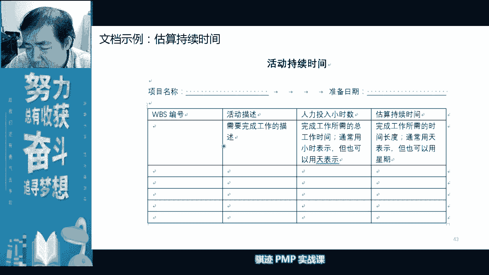

当他们放在一起，可能会产生一些意想不到的情况啊，那么我们的参数估算法怎么样估算呢，w b s编号，人力资源资源可以获得的百分比对吧，绩效系数对吧，诸如此类，那么我们也可以使用什么，这是参数估算。

所以它会有个参数怎么算的啊，参数怎么算的，也可以说三点估算的最乐观，最有关，也可以使用类比估算以前做过什么，我们现在做过什么，以前的项目呢是一倍的项目。

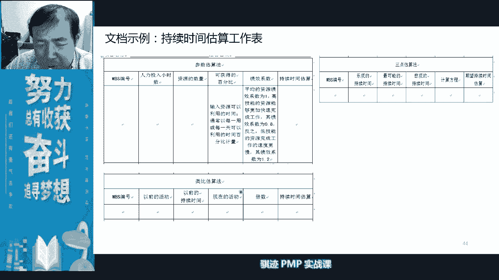

现在做两倍的项目，倍数是二，所以我们乘以二就行对吧，ok啊好。

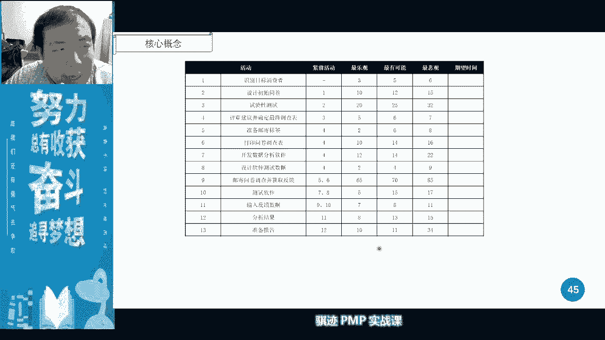

我们会在下一次课当中做。

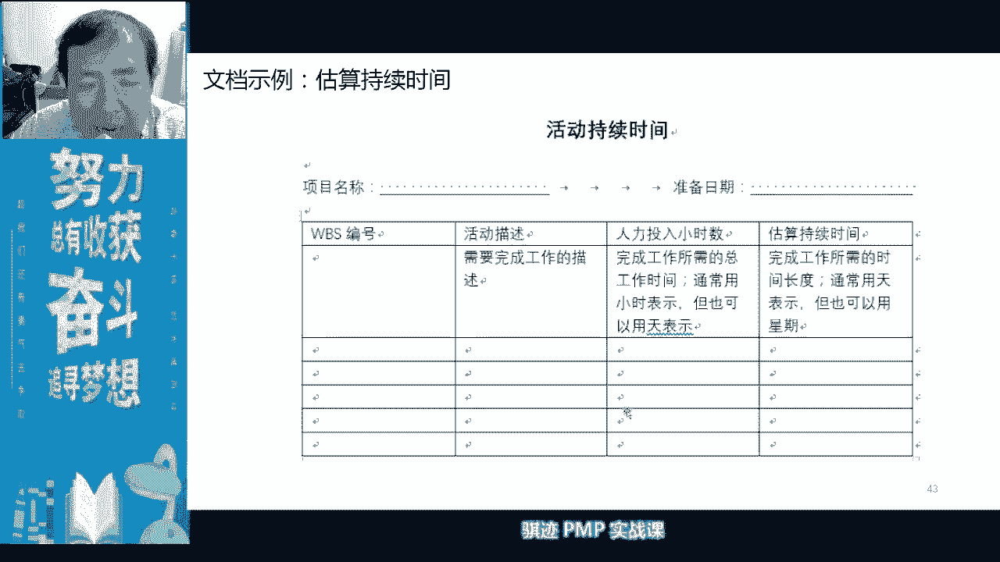

下一次课注意我们在上课之前，会把将今天所讲的所有内容呢快速的再过一遍。

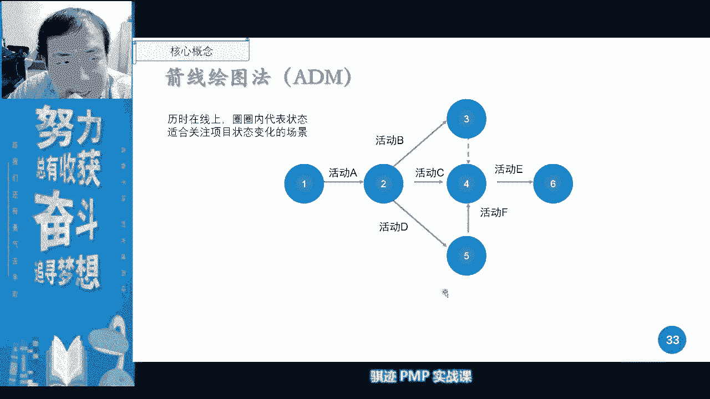

因为项目的进度管理非常的重要。

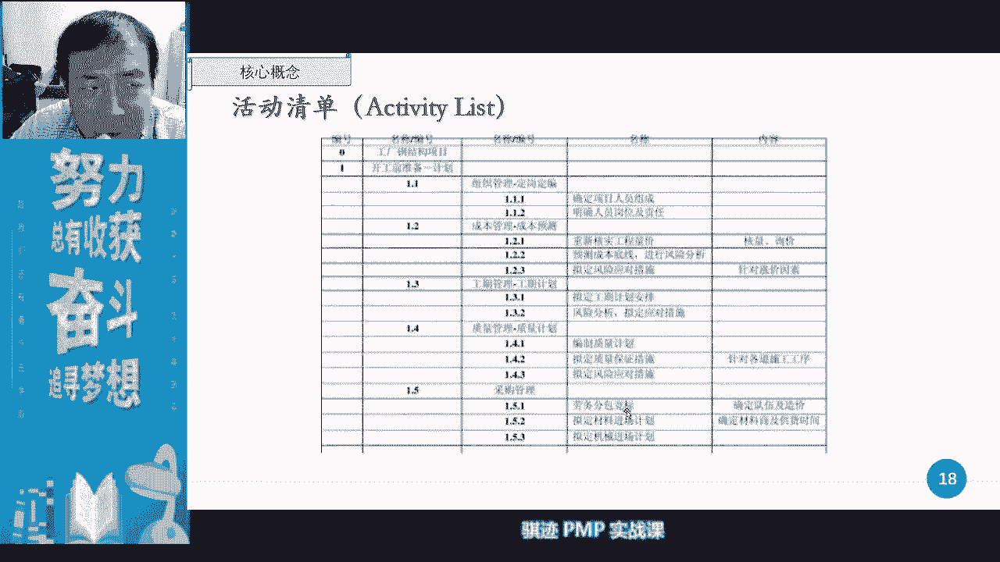

我们会再次快速的过一遍，但是过完这一遍之后呢，所以下每次上课的时候，同学们一定要全神贯注。

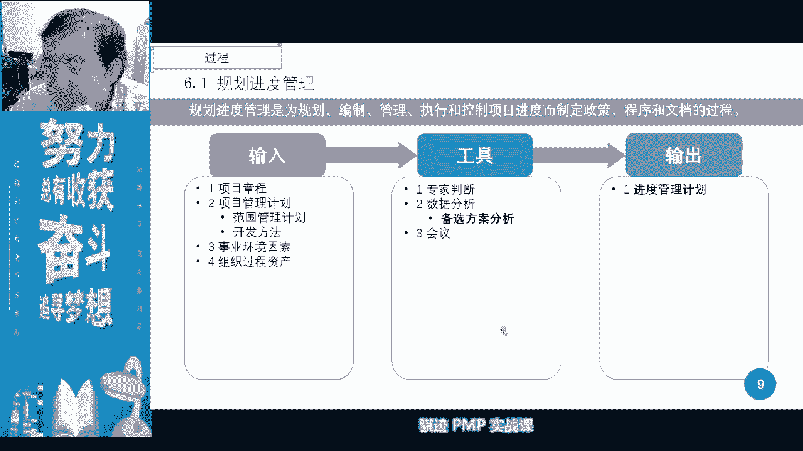

贴在我们的公屏上，可以吧，好那么我们今天的课程差不多就到这里，那么感谢大家参与我们新年之啊，元旦之后，新年之后功利性的时候，首次课程祝大家新年愉快，阖家安康啊，在这样一个是非之秋的世界，是非之秋的。

20202021的这样一个世界里啊，身体健康啊，一切无恙。

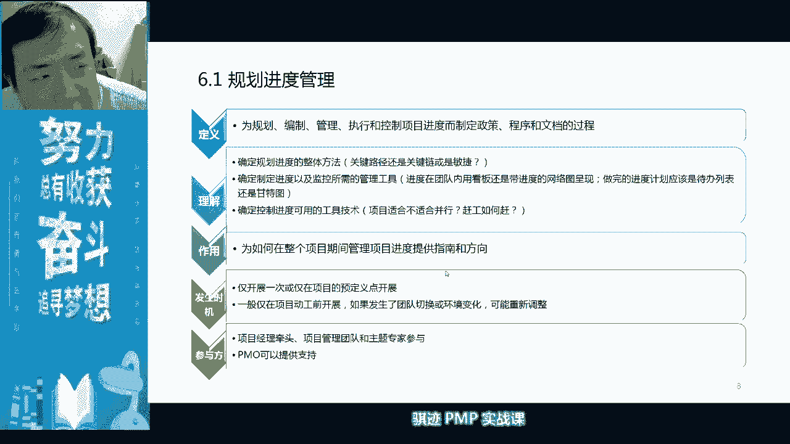