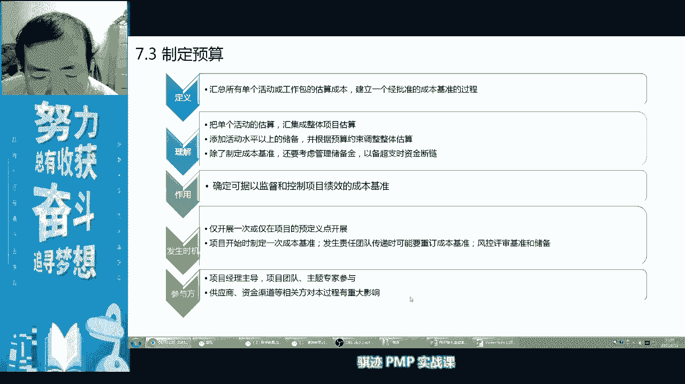
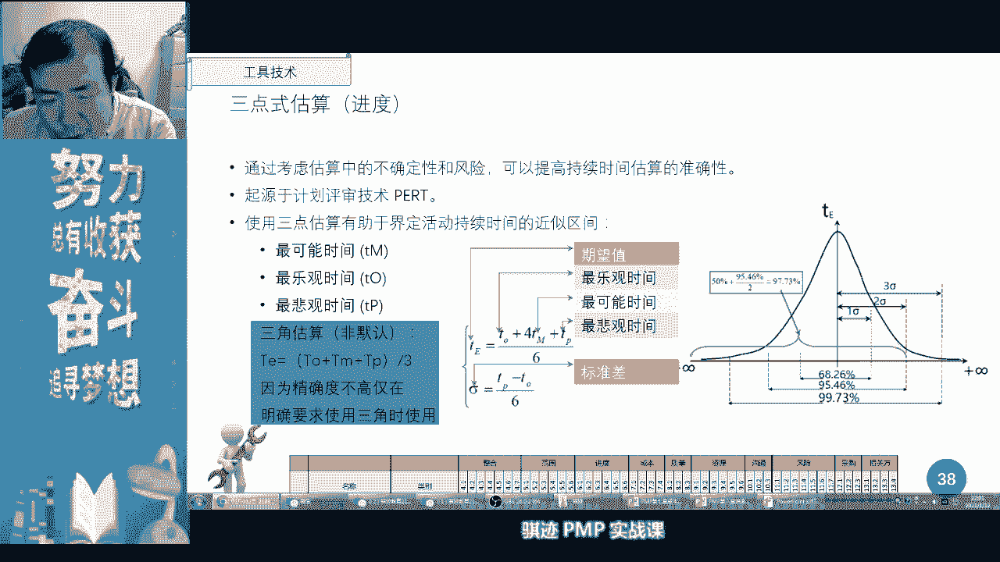

# PMP认证考试课程最新完整免费课程零基础一次通过项目管理PMP考试 - P19：PMBOK第六版 第七章项目成本管理-20 - 骐迹PMP - BV1Sb4y1f7Yt

我的家乡在伦敦，我的家乡在巴黎，对吧啊，这叫凡尔赛啊，一看我也不像对吧啊，我们一看就是genuine chinese，好那么最后呢在我们估算完之后呢，就开始进入什么，我们的制定预算，制定预算好。

那么这节课呢时间呢我们稍微简单一点，其他前其实前面的内容都不难，都不难啊，所以这课我们稍事休息一会好吧，我们稍事休息十分钟，我们到09：15啊，继续啊，我们稍事休息十分钟，这节课前面不难。

但是后面一节课上课的内容就比较难了啊，后面上节课上节课就相对比较难，我们是要上我们的e v m算法，要有两个小时时间讲1v m算法好吧，我们到09：15休息十分钟，到09：15继续回来。

好老师也稍微休息一会儿啊。

我今天呢那鼻子。

ok ok我在啊，我难得我难得逛一下，让大家休息十分钟啊，大家说啊，我卡了，不要紧张啊，王嘉彤同学不要紧张，你没有卡啊，是我关了一下直播啊，那我就开着好了，开始时播，那我开的时候给大家播一个。

我喝矿泉水啊，ok ok ok没有卡没有卡没有卡，ok啊，再给他，再给大家放个东西，这是啥，这是一个青釉啊，以色列青柚啊，挺好吃的，就是皮超级厚啊，这个东西啊挺有意思。

等会我晚上我晚上熬夜做做资料的时候，我就准备吃掉它，刷个礼物喝，播一个，喝不动喝不动啊，老师已经过了喝酒的年龄啊，不动喝不动，稍事休息啊，我们到九点09：15继续上课啊。

因为这节课的时间其实是比较宽裕的啊，比较宽裕，后面我会重点讲一下预算怎么构成，和一些工作上的一些细节要点啊，这个大家要注意，嗯因为pp是这样的，课程当中，其实很多时候呢是嗯课程的内容呢会有不同的。

每个晚上呢可能内容呢会有不同不均，因为有些内容呢你挤在一个晚上呢嫌多，分两个晚上又会略少，但我尽量能够可能均匀，所以p m p的内容其实并不是适合，并不特别适合，就是说每个晚上平均的去讲啊。

所以他会有盲嫌不均的时候，所以有些课程就是会晚上那会时间会短一点，有些人往上长一点，所以成本这一章呢，如果你全放在今天晚上去讲呢，又稍微有一点紧张，所以拆成两个晚上这样比较好，但是拆成两个晚上讲呢。

就是说前一个晚上呢可能就相对比较那个啊，时间会比较宽裕一点啊，需要宽松一点，所以我们之前先讲了一下，高清的不卡，我这也卡，可同学卡吗，不卡吗，看一看，ok啊，请大家有网络问题的同学。

请大家调整一下大家自己个人的网络啊，我这里应该是不卡的，因为我这里的话老师有两个屏幕啊，老师有两个屏幕，我可以拍给大家看，我可以我我手机拍给大家看啊啊拍给大家，我用手机拍给大家看，我有两个屏幕。

所以我可以监控大家的一举动，所以我如果我我可以看到自己卡不卡，因为我也是从平台绕回平台回下来的，所以大家一旦卡的话，我是比较容易方便看清楚的啊，ok啊，老师的直播环境不错的，有一个监控屏对吧。

老师的直播还是专业的啊，很多主播都用监控屏的，知道吧，颜值吃饭我们靠的是才华，好大家稍等一下啊，今天晚上我不知道，可能有些东西还是比较忙的啊，稍事休息一下，赶快去该喝水的喝口水。

该上洗手间的上个洗手间啊，我上课呢晚上如果两个小时连着上呢，我一般呢大家知道啊，上多了大家也知道，我一般是不休息，今天呢是额外啊，例外给大家放放个松啊，因为今天的网上的课程内容呢没有那么紧，没那么紧。

后面会讲到制定预算呢是比较重要的，比较重要，诶被你看见哔哩哔哩，被你看见哔哩哔哩的b站对吧，为什么老是看看会哔哩哔哩不行啊，还有四分钟啊，大家抓紧休息啊，抓紧休息，对有些网络不好了，你会退出调试。

再调试一下，嗯哼哼哼，啊我们休息的时候，顺便闲话问大家一句，我们直播室里有没有石家庄的同学啊，河北的同学啊，如果如果有，如果有的话啊，我这里再喊一下啊，我啊给大家送上我能有的仅有的关心啊，祝福啊。

希望大家在石家庄和在河北生活的同学，一定要挺住啊，一定要挺住，估算成本输入有问题，日志吗，估算成本的输入通过风险一般没有，但是你也可以说是有啊，你也可以说是有，一般没有，因为估算成本这个过程一般是什么。

是对于所需要的资源和成本进行近似估算，所以在估算成本的时候，理论上来说是什么啊，理论上来说，我们项目还没有开始会去制定估算成本，用于继续制作预算的，所以这个时候应该还没有发生问题。

所以理论上应该是没有问题日志的啊，领上是没有的啊，但是我们对于成本进行监控的时候，是有问题日志的，对吧啊，这是有的啊，啊你也可以认为它有吧，可以啊，啊这个我可以查一下。

问题是你这个这个问题问的略有点那个啊，等会我们课后我可以给你查一下，可以查一下pmbok，pmbok为准啊，我们上课就不馋了，好吧，都回来了都回来了吧，同学们都回来了啊，我们继续开始上课啊。

这我们讲今天最后一个子过程啊，子过程制定预算，制定运算，ok都回来了吧，啊制定预算，那么在制定预算的过程当中，我们可以看到啊，我们会有很多的工具和输出呢要进行做啊，这是比较重要的，第一个是成本汇总。

最最重要的一个知识点啊，所以我们会弄清楚，我们会弄清楚成本到底它的构成是怎么样的啊，大家学过这门课，这节课之后，大家就知道一个项目当中，成本到底是怎么构成的，这很重要，而就够。

而且要明白它的构成的细微差别和变化啊，然后呢要进行历史信息审查，要明白，然后呢要弄清楚什么叫融资对吧，作为一名有经济学学位的啊，讲师我会跟你们说一下什么叫融资，什么叫直接融资，什么叫间接融资是吧。

那么首先成本是怎么会扯成的呢，大家从概念这个层次讲，成本首先是什么啊，甲方和乙方签订合同会有一个合同价格，合同价格，所以很多时候一个项目的成本在初始状态下，对于乙方来说，它是通过简单的内部计算。

然后得报出个报价，然后呢从而赢得合同，到当合同下来之后呢，他要对这个报价呢进行分解，把全分解，这时候呢会得出两块东西，第一个叫做项目预算，第二块东西呢叫做毛利润对吧，我们说千做万做亏本生意不足对吧。

一个项目我们作为一个乙方，我们肯定是要有乙方自己的实际成本额，毛利润毛利润，那么接下来说啊，实际成本当中呢，我们首先是有活动成本构成，活动成本能够预算啊，活动成本至上呢，我们这样活动的应急预算。

然后再加上整个项目的应急，算得到了我们的控制账户成本啊，就是我们各个控账户的总和，然后得出了一个成本基准，成本基准啊啊啊这个当中我们也可以看到啊，应急储备和加活动性储备呢，构成所有已知的总应急储备啊。

总应急储备，然后呢成本基准呢就形成了我们的预算预算，项目预算管理储备呢就构成了我们什么毛利润，所以你们发现一件事情，没有管理储备，其实是我们项目当中乙方的毛利润，毛利毛利不是净利啊，是毛利。

还要扣除一些其他的费杂费对吧，储备呢是我们项目的真实成本之一，那么作为一个乙方，你能把你真实挣多少钱告诉甲方吗，答案是不行，但是注意，但是注意啊，这仅仅是理论上，我们在另外一个维度解释的时候。

我们会解释这个东西，注意我们会细微的解释这个差别，所以这张图告诉我们成本是怎么做成的啊，那么首先我们要有什么活动成本，然后呢在活动成本之上呢，对吧，这样问，然后这两部分构成工作报的物理成本预算。

还要加上什么活动的应急储备对吧啊，那么活动成本注意啊，不仅仅是生产活动，是活动对吧，支持型和依附型活动都是活动对吧，除此之外质量活动也是活动，质量活动也是活动对吧，商务活动那就不是活动了吗对吧。

那p p媒体对吧啊诸如此类的活动都算活动，各种各个共识账户可能是一个项目当中，不同的工作团队，那么不同的工作团队呢最后就构成了什么，整个项目的成本基准，搞项目的成本基本。

那么这个当中还要加上一块什么项目的，整体经济储备啊，我们学过风险会对这个更有了解，为什么一个项目当中呢会有一些高风险活动，我们针对特定的高风险活动，已经留有应急储备，但是一个项目当中。

还有一些总体性的风险不高的，或者风险很高的活动，那些活动要在总体上留有一点钱去应付，这就叫做总体的应急储备，所以总体的英雄啊，所以整个的全部的应急储备，和我们的活动应储备两块东西。

这两块东西是项目经理能够直接动用的啊，没问题，所以项目经理总有点小钱钱对吧啊，我们前面我们在我们在整个管理当中讲了对吧，在结束项目工作讲中讲，一个项目如果顺利结束了，项目管理的好对吧。

项目经理风险应对的好，是不是风险应急储备是不是留有剩余啊，那么留有剩余的应急储备是不是可以用来啊，搞一些轻工会呀，搞一些金额，我们做一些小纪念品啊，大家发一发啊，诸如此类好，这是一个项目当中。

我们当中啊，乙方项目当中我们都会留下的储备啊，这些储备呢是通过各种理由，列入到我们的成本当中，列入到我们成本集中当中，形成项目预算的啊，但是项目预算并不是整个的报价，还要加上一部分利润，管理层利润。

这就是这部分为什么不算工作绩效了，所以讲到这里，大家是不是明白了明白了，这个是我们ppt上的，讲义上讲了管理储备储备连的是项目预算，是改了吗，ok对改了啊，所以我们的p p t上的讲义这个是有错误的啊。

有错误，这是pmi的定义，这是pmi的定义啊，讲义上印的是有错误的，请以我的ppt问这根线是我改的，ok为什么我拐我有pmi的支持啊，因为老师背后有人，老师背后人叫做偏mi啊。

我老师背后叫人叫pmbok啊，那么为什么，请看next page，那当然了，管理储备，我们先来讲一下管理储备，应对未知风险，项目经理无权直接控制，我们要申请，所以他是无权控制的啊，默认无权控制要申请。

那么我们要注意next page，next page是什么呢，在一个项目当中，我们是这张图是pmi，我们的pm博客，pmi置顶的pm博客的图，7。6，预算构成，这个当中它大家可以看到啦，这个是成本基准。

成本基准之上的是管理储备，管理储值为，这是整个项目预算，这个整个项目预算是报给甲方的总预算，所以这块显然就是什么利润，当然如果一个项目当中应急储备没有花完，活动储备没有花完，也一并成为乙方的利润。

所以同学们注意，你们没有花完的tm building的钱没有花完的啊，庆功会的钱就会最后都会成为什么，乙方组织的利润啊，ok啊，所以一个乙方项目经理，他在利润的实现上呢是有一定压力的啊。

暂时作为甲方就没有这么要求啊，那么我们看这个构成呢，这是一个按照pmi的图表所形成的一个设计啊，pm的图表形成一个设计，那么pm图表形成上级当中呢，你可以看到啊，第一层是活动成本主要是什么人力成本。

质量成本，其他成本我们讲前面讲过的对吧，活动活动主要是人构成的，要花在活动当中，要花这些东西做，我们在质量当中做质量的，很多活动要嵌入到生产活动中去对吧，比如说我们生产一个零部件，生产出来之后。

是不是要对这个零部件就自检质检啊，质检是不是活动要花钱了对吧，所以是形成了活动成本，然后加上一些活动应急储备，应对于单个活动风险应急储备，他除了这些成本之外，还会含有。

其实这里当中这个图当中还会含有一些，他没有表面出的主要为物料成本的这些成本啊，其实他应该合成为这两部分，所以大家就看到这个评级的，看到吧，我们在这个图尤尤其注意这个图，为什么明白平齐啊，这个图当中。

加上活活动成本价的活动的应急储备啊，那么活动成本当中呢，其实最主要我们从活动当中拆分出来的呢，是人力资源质量和其他成本，其实也对应于活动啊，只不过他直接有些呢没办法拆在某些活动里面。

最终合成起来的呢就是我们的什么，我们在整体上要加一块风险的准备金，好应急储备准备金，这就叫做应急储备，然后这一块东西准备好了之后呢，我们就开始分摊摊到每个团队头上啊，那么我们在后面的风险会讲风险。

有各个风险责任人，风险责任人会去执行具体的风险应对措施，所以他们会分到相对应的，我们的应急储备一部分，而有一部分风险的应急储备呢，它不用应对特定的风险，它是整体上应对一部分第一优先级。

低概率低影响的风险，这部分钱呢有项目经理直接控制发生的，用钱直接靠外表，直接开不了好，那么这块东西最终就形成了每个供应商，控制商户的工作迹象，所以你看到了应急储备，为什么只有工作绩效的。

就是因为他被分到了每个团队，不同的团队代表不同的专家，不同的专家应对不同领域的风险，我们要让专业的人做专业的事啊，所以这个和后面的成本，和后面的风险是联系在一起。

啊我们看到成本当它分合并到了控制账户之后，它就形成了一个成本基准对吧，再加上了一个管理储备，然后就形成了一个什么叫做项目预算，注意啊注意来了啊，这是关键点啊，这个在很多的p m p课上是讲不清楚的。

但是在我的课上是讲清楚了，这个预算是甲方预算还是乙方预算，这个是乙方报价，甲方预算，这是乙方报给甲方的钱，那么这个怎么比喻呢，就说我给你打个比方，一个项目当中，乙方算活动成本是50万。

活动的应急储备呢是10万，60万呢再加上20万的应急储备，就是80万，所以我们的成本基准呢就是80万的成本基准，控制账户呢是多少啊，是80万的总绩效，那么80万可能分为a b c3 个团队。

a团队呢做30万的工作，b团队呢做30万的工作，c团队呢做20万的工作对吧，然后呢形成了成本基准，注意这个成本基准叫做乙方的成本基准，所以我们pp默认是乙方角度，所以当我们讲成本基准的时候。

它默认是乙方的成本基准，然后加上什么利润，比如说我们项目的成本基准是80万，加上100万的利润，我们报给甲方的时候，甲方的预算是多少啊，是180万，所以甲方的b a c是180万。

为什么要讲b a c预算叫做budget accomplish，所以我们今后再给甲方报工作绩效的时候，要把什么算进去，要把在甲方看到的工作绩效报告当中，要把管理储备摊进我们的，摊进我们的什么各种成本里。

就比如说你原来人工，我们说工作活动成本是80啊，100万啊，80万呃，我们的管理的储备呢是100万，那么就100万是100万，是利润了，那么我们把它人工做一天，比如说你工工资一天是500块钱。

一天500块钱，跟我们同学啊，那有点过了，高了给你高了啊，一天给你200块钱啊，太太也太抠了，一天给你300块钱好了，一天给你300块钱，我们给甲方报多少，我们可能给甲方报的是你的工资。

一天就是800块钱，800块钱，实际一天拿到手只有300块钱对吧，然后呢，我们假设你一你为甲方干了一天活，你的工作的绩效在甲方看来就是800块钱，但是我们内部给你做绩效的时候呢，你只值300块，明白了。

所以就是甲方工作，我们将工作绩效的在成本管理的后面，我们讲控制成本当中的工作绩效报的时候，所以实践工作当中很重要一点，就是项目经理报给甲方的账，和自己内部乙方做的账是不一样的，这中间的区别很大。

一块就是利润，明白了吧，扎心了，老铁我跟你说，真的是这样的啊，真的是这样的啊，我跟你说，甚至比这还夸张啊，有很多公司我就不点名了啊，有很多很有名的公司跟你算人力资源的时候，人是比如说1000块一天的。

他其实给那些干活的人是多少钱啊，可能是100多块钱一天，这不骗哎，人们的生育价值就是这么过去了，ok真的是这样的啊，真的是这样啊，相信我，要么你们就别信啊，800块钱还不算最夸张的啊，还有更夸张好。

可以在这样的情况下，你会看到甲方的e v m其实和乙方的em不一样，所以项目经理如果要报告绩效，记住一定要给甲方报，按照他的预算为基础的，我们的成本基准的预算啊预算，所以预算和成本基准中间是差了一块。

管理储备的，所以说我们在默认在emm当中使用预算的时候，其实我你们是800块钱一天还是300块钱一天，你们是800块钱一天的，实际你们的工作只值300块钱一天，99600起步学，知道吧啊知道吧啊ok好。

这是很多啊很多的课外面的课程啊，很多学校完了，其他老师讲的时候没有讲清楚这个事情，所以应该是甲乙双方200章，那为什么我这么清楚呢，是因为我做过甲方的项目经理，也做过乙方的项目经理啊。

这这种事情呢就比较清楚啊，哈哈哈哈对吧，所以如果你是一个乙方的项目经理，如果你把自己乙方的内部的绩效报告，发给了甲方，你就等你这怎么被开除吧啊，所以当我们在做1b m的时候，如果看到预算。

那么默认我们是报给甲方的工作，你就按照我们这个例子当中，就按照什么你的公式是800块钱一天来算啊，就把我们各种利润摊到你的脑袋上，明白了，那么实际内部，我们作为乙方自己内部核算的时候呢。

那你就只值300块钱，然后我们按照300块钱的内部公式给你结啊，小张啊，今天的活是值300块钱，你干了300块钱活了啊，你看看1000块钱的活啊，勉勉强强算了，勉勉强算，好这就是甲乙双方预算报价形成。

所以这张图可以帮助你们解释，为什么各种成本形成这样，所以很多项目当中你会发觉经过乙方层层注水，这个印活动应急储备不花完是利润吗，是利润，应急储备不花完10万是利润，管理储备不花还是利润，是利润。

经过乙方层层注水之后，甲方拿到了报价，就为什么这么贵，就是这么道理形成的，明白了没有，ok明白了，请在公屏上打一个明白，好同学们，为了大家以后能够拿着800块钱的工资，干1800块钱的活。

然后所以你们现在要拿着300块钱的工资，努力以后学生p np以后拿800块钱工资啊，ok但是也一样啊，你工资拿的越高，所以你有本事，欢迎什么，但是你接不到单子对吧，公司维持不下去啊，关门倒闭。

好这就是我们的成本项目预算的构成啊，训练过程，那么这个当中甲方是看不见里面的东西，他只知道大致知道乙方给他做了一些分割，但是他并不知道详细啊，我们这个当中会进行注水啊，所以明白了吧。

好我们再讲一个资金问题，一个项目当中，我们讲资金并不是一下子都投入了对吧，一个项目当中资金一不一，并不是一下子就这么投入了，ok啊，80%财富结啊，不20人手里明白了，打个人，打个人打工人嘛哈ok啊。

一个项目当中资金并不是一下子投入，它是它分阶段逐步逐步逐步投入的啊，所以项目当中我们应该根据时间节点，设置一个项目资金的到位日，比如说这几条线啊，这条线当我们钱划划划划划划到这里的时候呢。

我们应该在这个节点设置一个什么啊，这个是资金到位日，那么在这一天呢我们必须收到项目的啊，下一阶段的启动资金可以收到这一点，其实呢需要这一点钱，这是我们的起始前啊，这是我们的起始前，然后呢哗哗哗哗哗。

随着项目的推进来，钱慢慢花花花花花到这个时候呢，应该你拿到了项目的下一阶段的钱，然后下一阶段钱是这样的，在画画画画花花到了之后呢，在一个阶段一个阶段慢慢花，最后累积做完活呢。

应该达到一个什么b a c项目的预算，按照项目计划成本基准呢，花花到项目预算项目就结束了，有时候呢项目呢啊太难做了对吧，我们的储备量太少了，项目呢难度太高了，我们会花的太多，这时候呢就要划到管理储备。

就划到利润啊，所以很多项目最后做着做着做着就亏本了，所以有些项目经理做着做着就亏了啊，然后坐着坐着就被开除了啊，就是这个道理啊，所以一个项目经理要在项目的过程中，设置若干个资金需求点啊。

资金的一个到账点，这个点当中呢你会检查说已经花了多少钱，还需要多少钱进入下一个阶段，那么每一个阶段当中，我们规划下一阶段这钱怎么花啊，对于很多乙方来说很重要啊，很重要。

这些点也可以设置在乙方设置为里程碑，可以设置为我们的选择性里程碑，或者是强制性里程碑，明白了啊，阶段款，啊阶段款啊要钱最难的哦，非非常好啊，我们很多同学敢啊，感触颇深是吧。

最近这段时间已经进入了乙方项目经理，最难熬的日子，因为要向到了要向甲方要钱的时候，要钱的时候，那么向甲方要钱最主要干什么，一凭合同对吧，二凭签收对吧，然后让甲方签收我们相应的合同的，我们的里程碑。

然后呢确认已经达到里程碑，然后呢进行付款打款啊，要钱是最难的啊，所以大家在这个过程当中一定要注意啊，有礼有节，不卑不亢的向甲方要钱要钱啊，没有钱怎么过年对吧好，这就是个要钱过程对吧。

这就是一步一步向甲方要钱的过程啊，当然有些项目当中，甲方是最后项目结束一次性打款，那么这个钱哪里来呢，乙方组织内部出钱，一步一步资助这个项目完成，然后一次性甲方付钱啊，但是注意我们讲钱有个什么特性啊。

钱是有时间价值，所以一般来说，如果你这个钱项目是项目结束一次性打款的，它的报价应该比什么项目分阶段打款，要什么报价要略高一点，因为有资金时间成本啊，所以如果你们是一个项目的项目经理。

看到项目的商务经理去谈那个商务，谈下来是一次性打款，中间没有钱，然后呢，又要你一次性的从组织内部拿钱去干活的时候，你那么你们就知道那个商务经理呢，肯定是要接这个单子，那个销售呢肯定是借这个单子接的。

是很不容易的啊，肯定是啊呃为了接单不惜一切手段啊，否则的话一般乙方都会要求什么分阶段付钱，强势的乙方甚至要求什么先付钱后干货，这是最好的，当然一般都是强势乙方啊，现在哪些乙方会先付钱再干活啊。

最近这段时间最牛叉的是什么，做外贸急需外贸商品啊，有些东西啊老外到了到了冬季了啊，比如说他们需要羽绒服，需要中国可能加工了冬季的使用商品，但是国外呢疫情严重啊，生产不出来怎么办，紧急向中国人买。

这时候呢中国人就牛叉了啊啊先付钱，钱到账了再说话啊，钱到账了，先等啊，我们我们的订单已经排到了明呃，呃春节后一个月了啊，哦哟这个时候呢就是乙方牛了，所以呢我们的考题当中垫资啊。

对垫资垫资是不是很傻的事情啊，对啊，因为你要被人家占利息对吧，所以项目当中会有一类考题，他是什么样的考题啊，你听清楚啊，他问项目第一阶段启动资金是多少，比如说项目的第一阶段启动资金需要50万。

那么整个项目呢是呃，组织呢需要500万资金完成，估计呢需要500万资金完成，这个项目组织的账面上呢有60万钱，问这个项目能不能启动啊，请在公屏上告诉我，如果这个项目的第一阶段启动资金呢是50万。

整个项目呢投累计投500万，这个项目呢组织呢目前账面上有60万资金，那么请问这个项目能不能启动，好有一个同学回答啊，可以启动，还有没有接到来，啊可以啊，注意啊，回答可以的，能扒啊，考试的时候能写个八字。

表示你模棱两可吗，当然不行啊，答案是可以启动，所以pmp考试中会有一类很很傻缺的题目啊，你就要知道，如果可，如果项目的启动资金在组织的资金范围内，哪怕他有一部分不在范围内，只要能够满足最低需求。

有可能满足最低需求就可以先启动，因为钱是分部投入的啊，所以只要满足最低需求，有可能的话就应该启动项目啊，这是我们pmi的定义，偏博客的定义啊，注意随时可以启动，啊要安全的底线值吧，这个没有要求啊。

没有要求啊对吧，项目可以先做嘛，做的过程当中再融资吗，同学们，什么叫融资啊，风险大，谁跟你说风险大啊，好那么接下来我们就会讲一个东西叫融资，什么叫融资呢，项目获得资金，融资呢可以内部融资。

也可以外部融资啊，首先讲什么叫内部融资对吧，比如说到年底了，突然之间呢，你们这家公司的规模呢可能不大不小对吧，突然之间老板召集所有员工开会，跟所有员工说啊，我们到年底了，我们公司快没钱了。

这样我出让一部分公司股权对吧，大家每个人做股东，然后呢到时候以后工资来年赚大钱了呢，每个人呢都可以分到很多红对吧，这叫什么叫内部融资啊，内部融资明白了吧，所以很多企业有没有哪些部分是有。

然后但是你要看清楚，记住清汉，就如果你的工资，你们如果你们的工资连工资都发不出来了，还内部融资，那么老板离跑路也就不快啊，不远了啊，所以这时候千万看清楚啊，如果你们的公司，比如说效益挺好的，老板说啊。

这样我出了一部分股权卖给你们，便宜卖给你们，很多的很多的互联网企业就是这样的啊，内部股权对吧，就是这样的啊，大饼啊也是大饼对啊，内部融资，那么大部分融资呢都是外部融资，大部融资，外部融资。

外部融资又分为两大类型，说到我的专业对吧，有两大类型，第一大类型叫做什么呢，叫做直接融资，什么叫直接融资人，实际融资呢就是融资人，出资人是直接对接，没有中间商赚差价的，叫做直接融资。

那么最典型的直接融资是什么，上市发股票，ipo为什么上市发股票，只需要中券商做一些服务性工作，收取一些成本很低的服务性的一些服务费，其他的钱都是直接从投资人口袋里到哪里啊，到上市公司口袋里。

这叫做直接融资啊，然后呢比如说上市公司啊，不是非常认同公司，各种公司去发行债券，这也叫直接融资，因为什么呢，是从什么，是从投资者口袋里变成了什么钱，变成了融资者口袋里，然后呢融资者付出了什么是一个债权。

契约到期呢，其他会把契约拿回来，还要把什么钱还回去，还要还利息对吧，这叫直接融资，什么叫间接融资啊，问银行贷款叫间接融资，这叫欺诈，哈哈啊，问一下为什么你去作为一个企业主，你去问银行借钱的时候。

你根本不会问银行，也不会告诉你，这个钱是他从哪个储蓄储户那里拿过来，借给你的，也搞不清楚啊，无所谓，他是对你来说，你找不到这个钱的源头，你只知道这个钱是我银行拿的，银行中间什么要抽头抽头。

那么我们我们国家，我们的银行1年期的存款利率，大概2%几吧，3%不到，3%不到，然后呢，我们的银行贷款，现在最低最低也要什么百分之到 5%，这是已经很优惠了啊，大部分的融资还在78%啊。

那么这个中间银行会吃一个东西，叫做利息差，有中间商赚差价，有中商赚差价，所以间接融资成本高，直接融资呢成本很低或者没有成本，所以大部分的企业更倾向于能融资的话，要直接融资更好。

但是直接融资对融资的主体是有要求的，你要必须符合一定的资信资质对吧，比如说你的公司要上市，直接融资需要你有什么要有一定的指标，符合一定的指标对吧，如果你尤其是呃发i p o对吧，股市发行股票。

你的公司呢必须财务健康，或者符合上市要求对吧，或者政策鼓励，然后进行发行啊，如果你要发债券呢，你要有足够的信用对吧，要有信用评级机构给你做信用评级才能发债券，间接融资呢只是取决于银行对你的评估。

银行觉得愿意借给你钱呢，就借给你钱，银行不愿意借给你钱，那你就借不到钱啊，在中国融资更多的呢还和政治因素有关系对吧，比如说有一个人他说要一个小目标，那个人啊，小目标他爸就是一个典型的是吧，受政策影响啊。

它的企业呢常年是其实依靠政策给予的贷款，支持的啊，发展壮大了，然后呢因为啊小目标太棒了，太过啊啊太呃有些时候呢做的太过明显，所以呢银行都不借给他钱了，所以他为了还债，为了能够渡过难关。

就把很多东西的资产都给卖了啊，小目标呢就没有了啊，这样，所以这就叫融资，你们明白了吧啊，分为直接融资，间接融资啊，分为直接融资，间接融资，外部融资，内部融资啊，然后呢我们在我们在成本制定。

我们制定预算当中呢，我们还会用历史信息审查什么，有助于进行参数估算和类比估算，那么预算当中呢，我们会使用历史信息的各种项目特征，进行数学建模，然后呢，以比以比较和确定我们的成本是不是精确啊。

就比如说再一个再一个i t的项目当中，那么他大部分成本构成应该是什么人力资源啊，他们比率应该占到80%以上，是人的成本，那么对于一个建筑项目来说呢，它的建筑成本呢占了大头啊，其次是人力资源占了大头。

是这样的啊，所以不同行业的不同项目，它会有自身的项目特征参数，比如说他总归会有人的资源，比人的比例和物料的比例会有一定特征，我们根据数学建模，有助于判断我们当前制定出的预算，是不是科学准确。

因为预算将成为我们整个项目的一个什么，项目基准，有了这个基准之后，我们才能对项目进行成本的考核啊，如果你的基准不准确，那么这个项目当中的预算呢执行就会不准确，要么呢钱申请的太多，要么拿钱的申请代少。

但没有人会嫌钱申请太多对吧，往往是什么钱申请的代少，导致这个项目进行不下去，然后不断去追加资金，追加资金追加资金，然后就项目预算超啊超啊超啊超啊，就变成了一个什么啊，就凭人家叫叫叫就叫叫敞口的窗。

就是说人的一个创伤啊，疮疤，这个疮疤呢在不断的给你伤痛，但是呢他又不收口啊，这时候人非常动，又在流脓，又在出血啊，这个时候呢人就非常难受，所以你把组织想象那个人，但一个管理不良的项目。

就像在一个组织伤口的一个疮疤一样啊，会对这个项组织呢造成伤害，所以组织一般会倾向于使用历史信息审查呢，对这个项目来进行估算啊，这个工作是谁做的，但请大家问大家一下，对关于历史新式审家。

对一个项目呢利用建立建模进行信息审查，以对比我们成本的精准程度，这样一个工作，预算工作应该是谁和谁做，或者是谁做啊，我请问大家，专家判断不对啊，我们已经建立数学建模了啊，利用参数参照进行历史信息审核了。

这个过程跟谁做呢，成本会计发起人啊，你们都不对啊，你们说明经验不正确啊，这个里面最好的答案应该是什么，项目经理的项目团队以及pmo pm，哎有人答对了对啊，pm所以一个公司当中如果有一个组织叫po。

那po里的人他的很多外科工作是什么，对于系各项公司当中的各个他管的各个项目呢，进行项目的什么成本核算，进行一个成本的估估量，你的项目报上的这个项目啊到底合理不合理，你的成本构成合理不合理。

他会利用历史信息核算的啊，po所以记住了吧，这个事情主要是po做的，但是项目经理也会参与一起做啊，因为他会用什么什么他的估算依据去向po解释，我是符合参数模型的啊。

po也会将这个参数模型来和项目经理分享，要求他们什么规范合理有效科学的估算，用科学数学模型去估算一个项目的，预测的总成本，明白了吧，好那么最后呢我们就形成了最后输出当中呢，我们就形成了。

最后我们想要的结果叫做成本基准，成本基准是经过批准的，按时间段分配的啊，所以一个是一个成本呢，如果它有成本基准，那么我们默认它是甲方角度还是乙方角度，它是默认是乙方角度，注意乙方。

所以它不含任何的管理储备，我看任何的管理储备啊，但是它可以在时间点上，按任意一个时间点进行分配，项目的预算构成一条连续的曲线，通过这条连续曲线，我们可以知道项目每一个时间片上，应该随着工作量的发生。

应该花多少钱，那么默认状态注意默认状态很重要啊，我说了一句很重要，默认状态我们都是怎么样默认的，花一块钱的成本就会干完一块钱的活，一块钱的成本，干一块钱活，一块钱的，每干一件活。

所以默认的成本基准也是我们的工作量基准，默认默认啊，默认，那么为什么这么说呢，因为实际工作当中往往是什么，有可能花两块钱的成本才干一块钱的活，也有可能花八毛钱的成本盖一块钱的活对吧。

向各位999997996007的，那么你们是在加班的时候呢，花零元的成本干若干员的活，明白了吧，所以这个时候呢我们会根据时间的你评估单，默认工作的一个累积曲线，和成本的一个累积曲线是同一条曲线。

或者说没有成本的累积权，只有工作价值的一个累积曲线，通过这条曲线我们可以判断当前花钱，如果工作是满足当前绩效的工作，尽量绩效的话，那么当前花钱是省钱还是费钱啊，明白了啊，默认状态花一块钱的成本。

做一块钱的事情，这个是很重要的，在我们后天所讲的控制成本当中，evm当中这个事情是非常重要的，可以吧可以吧，那么我们讲项目的资金需求呢是根据这样的啊，一点一点来，那么既然我们有了我们这个图。

是就是前面那个图，既然我们有了成本基准，那么根据这个基准，我们就有一个什么实际支出，这条线是实际支出，看到吧，那么根据这条曲线，我们可以得出什么结论啊，这条图上，我们在实际日初一开始是比成本基准要低。

注意实际支出比成本低，并不一定代表着什么东西啊，啊注意啊，这是一个很重要的概念，很重要的概念，实际支出比我们的成本基准低，并不一并代表着我们的花钱效率高，也不就是也就是不代表着我们的花钱是花钱效，率。

是省钱状态或者是费钱状态，为什么，有可能因为客观环境因素，当前阶段项目无法开展，导致支出缓慢，但是工作量也缓慢，这种情况下支出单独去评估是没有意义的，他要随着工作量去评估啊。

所以我这是我们之后控制成本的一个，很基础的概念，也是非常重要，不要忘记概念成本的评估，它是费钱还是省钱，永远是跟着工作量去定的，所以这条成本基准其实就是工作量的原始基准，工作量除了范围变化。

工作量是不是不变的对吧，所以工作量在没有改变方法情况下是不变的，但是花出去的钱的成本，有时候呢是花两块钱干一块钱活，有时候呢是花五毛钱的钱，干一块钱的活，他会有波动，这种情况下。

它的支出并不一定代表着什么，它是省钱和成本基准相比，并不一定代表着什么，是省钱还是费钱，明白了吧，好具体的定义呢，我们会在后天的课程当中讲，不要着急啊，不要急好，那么这是今天讲到为止所有的内容。

那么今天因为课程时间比较轻松，那么最后还剩五分钟时间，大家对于今天的课程还有什么问题，或者对上节课我们讲的关键路径法，还有什么问题，大家可以提一下问题，如果没有问题的话，今天的课程就到此结束好。

我会在在线稍微等一会儿，大家，啊注意今天跟你讲的要点啊，尤其是以后千万不要把报给自己发起人的，乙方的成本基准的实际分析报告发给甲方啊，项目押金算什么成本，项目押金不算成本啊，押金会退给你的呀。

项目押金会退给你的呀，他不算成本啊，项目押金押在甲方那里的押金，它的利息是什么，沉没成本，正值和成本的区别啊，啊那个东西没听清楚啊，我们可以啊，那我等会再讲一讲啊，首先我们解释一下正直什么的。

正值表示什么，你把它干完了，你就挣了500块的钱对吧，挣了500块的正直就干了500块钱活，但是你为了干这个活，连人工带物料花了600块钱，那么你的成本就是600，这就是正直和我们的成本的关系。

所以我们在计划之中，这个东西应该花500块钱干完了，你用600块钱干完，那么你的政治是500，但是你的实际成本是600ac就是600，ev就是500，三角梅的对吧，好看一下回放。

那么我们稍微快速讲一下嘛，没关系没关系没关系，我们稍微讲一下，好我们稍微讲一下啊，进度管理当中的这道题，好就这一页对吧，那么这段交通大家可以看到啊，我们前面讲的是什么一个项目，我们最早，稍等啊。

我来看一下那个题目，那个那个那个那呃eb a c那个东西诶，我在群里贴的呢，走走走，为什么中线是11呀，中线是11，很简单啊，然后我在群里，我看见那张图片呢，sorry啊可以啊，我们解解释这道题目。

我来下线啊，sorry，我来看一下群里让聊天记录呢，嗯好，接下来我们再复制再粘贴一下啊，好，这这道题目当中我们可以看到什么，这道题目当中，因为我们是用贝塔计算方式。

所以我们要中间的最有可能要乘以四倍啊对吧，你算一算是不是最乐观，最悲观，再将最有可能要乘以4÷6，所以算出来中间值是11对吧，然后中间至11之后呢，嗯我们最小的那个值是多少啊，最小的那个值是六天对吧。

最小的那个值是六天，所以它的最小值边界是六，那么它的最大值最有可能是什么，是11+67啊，10+67，所以最大可能是17天做完，所以这个项目当中啊，这个项目当中他最小是六天做完，最大是17天做完。

那么我们把它六等分是不是两个，一个两个一个中间恰好是11啊，对不对啊，两个圆恰好是11啊，史诗八的，所以我的数学数学老师是门卫大爷教的啊，ok啊是11，所以它的中间值是11，那么11当中大家可以看到啊。

18-6等于多少啊，12，那么12÷6，那么就等于什么一个西格玛，等一下啊，是这样的结果啊，一个鲜花等于二，那么11加一个西格玛是13，那么11减一个西格玛是，是九。

所以所以我们说一个项目他在这个项目当中，在这个活动当中，他在九天到13天之内，完成的概率是两个西格玛，我们从图上可以看到，两个西格玛的宽度是68。26%啊，这个大家可以去查一个西格玛多少宽。

两个西格玛多少宽啊，那么他说如果我们说这个项目当中呢，是七天到15天完成呢，就是两个四个西格玛，那么就是95。46，明白了吧，就这么算了o，好这就是本地答案，你再算一下啊，同学啊，你的计算有点问题啊。

再算一下啊，ok啊好，我们今天的课程就到这里，那么有问题我们微信群当中继续聊啊，ok有任何问题艾特我一下，我就会回答啊。

