# PMP认证考试课程最新完整免费课程零基础一次通过项目管理PMP考试 - P20：PMBOK第六版 第七章项目成本管理-21 - 骐迹PMP - BV1Sb4y1f7Yt

好的我们的啊ebm啊，一边政治分析啊，政治分歧和政治管理，成本管理当中的概念，是讲了整个成本管理当中的各个生命周期，它的成本是怎么样出来的对吧，有成本的概算，成本的框算，然后成本的估算。

然后成本的预算，然后制定出预算对吧啊是这样的过程好，我们会有各种各样类型的成本，大家记得吧，直线折旧啊，这是会有还有价值工程对吧。

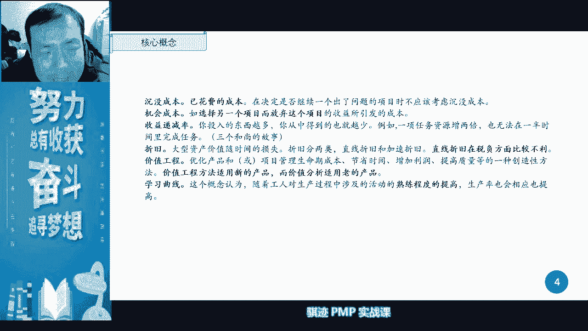

还有沉没成本对吧，集结我说的那个那个那个那个租那个。

租玛莎拉蒂的那个例子对吧。

那么在成本管理当中，我们先是规划成本管理，然后估算成本。

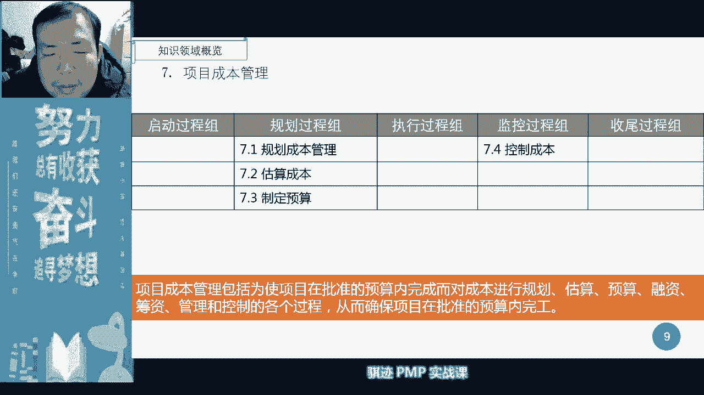

然后制定计算，那么这个工这个过程当中呢，在控制成本这一章会讲我们的evm啊。

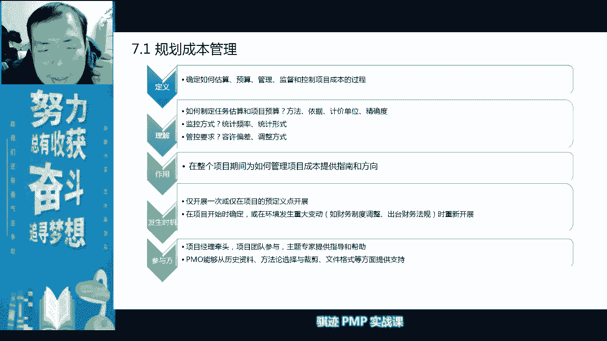

那么控制成本之前我们讲了很多东西，这些东西呢啊成本估算估算当中。

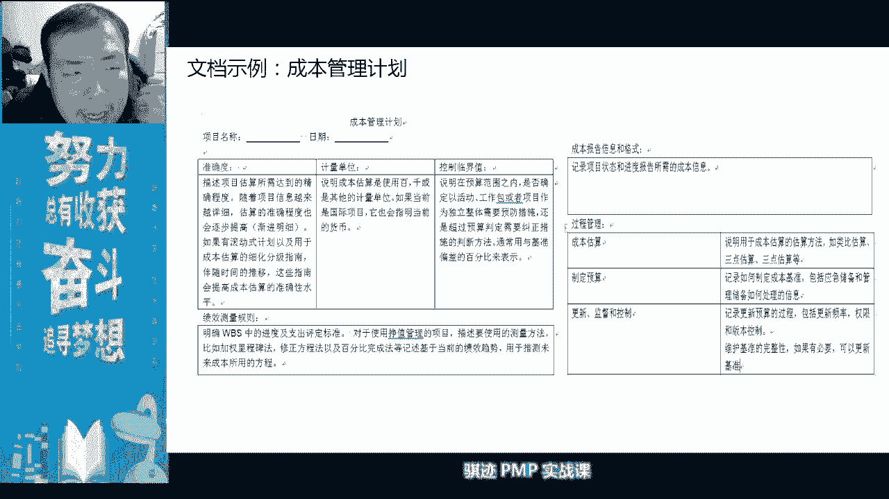

我们讲主要讲它是波动幅度从宽到窄对吧。

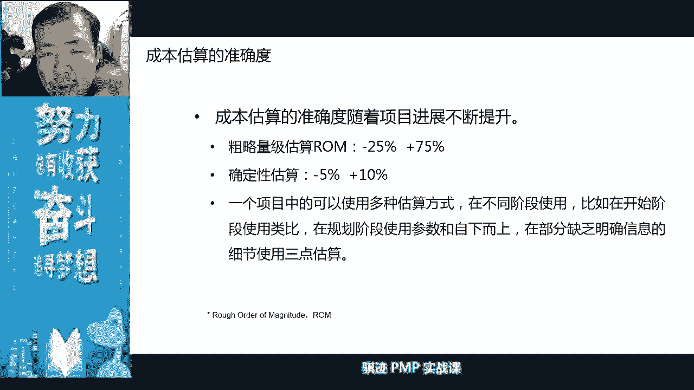

但是都是往高了估对吧，大家原理大家都懂，用三点估算方式，这个我们之前在进度跟你讲过的，就不用讲了对吧。

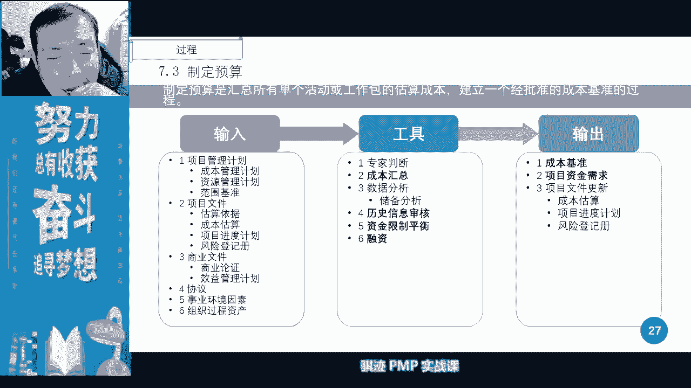

然后去制定预算，制定预算当中，最主要的是搞清楚我们在制定预算当中，预算是怎么构成的啊，这张图表和后面那张图表要特别记清楚啊。

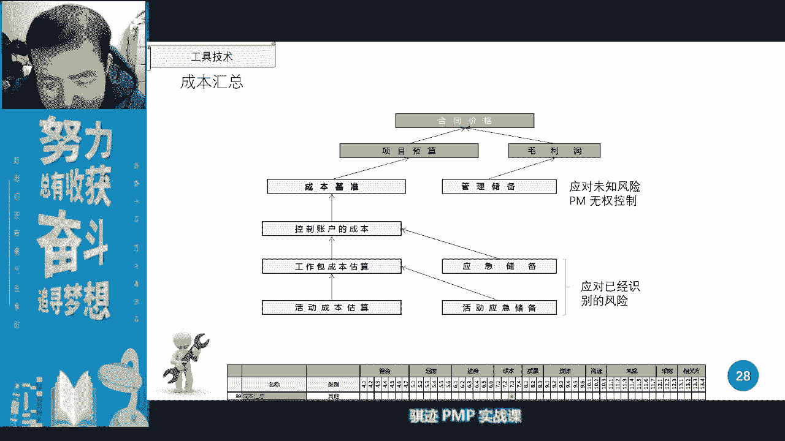

或者是你记后面这张图表会更清楚啊，这是这是pm上的啊，尤其要搞清楚什么是项目预算，什么是成本基准，这两个特别搞清楚啊，因为考试虽然他不会考得那么细节，但是你一定要看清概念。

记清楚成本基准加管理储备等于项目预算，项目预算是报给甲方的，乙方报给甲方的，但是乙方自己实际控制呢，是以是以成本基准为基础的，但是呢我们的vm最后再算bm的那个b a c是，什么是预算。

所以我们默认我们的vm是报给甲方的，这个我们的政治分析啊，注意是报给甲方的，所以你的工资是310天还是810天啊，是810天啊，瞬间觉得自己有钱了对吧，然后摸摸干瘪的口袋啊，然后想象要快过年了。

心情不特别不愉快对吧，然后然后我们决定留在工作地对吧，咱多挣个几千块对吧，最近最近那个那个各地各地宣传宣传委的，都开始宣传，大家不要回家过年了对吧，这个当然是对是对的啊，这是对的。

然后挣钱也是一部分对吧，然后呢大家做好防疫工作也是一部分啊，好那么我们继续继续讲，那么我们会这张图呢会稍微给大家多多说一下，再回顾一下啊，记得啊，活动成本估算当中成本估算当中，第一部分呢先估算活动成本。

这个比较简单，活动成本比较能看得出，那是我们当中所使用的人力资源成本，质量成本和其他成本，然后呢物料成本呢，我们这主要针对，分为物料成本加上人力资源成本，这样不合并起来，合并向去组成的啊。

然后这两块之外呢，还有一块东西叫活动应急储备啊，当你的项目呢有比较多的储备预算的时候呢，你会在活动这几年编编制活动应急储备，当然这活动应急储备呢在成本这一块呢，是指值钱，如果是在进度，那个呢。

就可能是我们的活动的什么自由浮动时间，总浮动时间，或者你特意加的冗余时间啊，我们在总体上加一块应急储备，这块应储备干什么呢，由项目经理在整个项目全局统一的进行调配，用于干什么，应付我们的风险对吧。

整体性的风险高风高高风险高风险，活动的风险对吧，以及一些啊你识别到的，然后去进行拆解的一些风险，比如整体性的对风险啊，这是此类，然后呢最终就合成了一个什么东西啊，合成了一个我们的成本基准对吧，然后呢。

我们又把这个成本基准呢，拆成了若干个控制账户，那么一个项目当中所有的成本基准啊，成本基本就等于所有控制账户当中，每个控制账户的他的绩效的总和啊，绩效总和，所以我们会把比如说这个项目1000万。

我们会把比如a团队分300万，b团队分300万，c团队分400万对吧，或者其他若干等等，反正他们合起来正好就等于成本基准，那么在成本基准之上，我们讲有一有一个坏东西叫管理储备。

那么管理储备呢它其实它的设定的厚度，我们上面上次讲了个例子对吧，工资为什么给报个甲方800块，实际我们只有300块，工资，800块就四五百块就给什么管理层赚去了对吧，这就是管理储备。

那么这部分是什么设定的啊，当然这上节课我没有细讲啊，有一个东西可以联系起来，大家记得我们之前学过一个效益管理计划吗，管理储备的这个厚度，一定程度上就是在效益管理结构当中设定的，比如说效益计划。

管理计划是规定，我们这个项目利润率不能低于60%，也就是说我们向甲方报100块钱，要求其中60块钱是利润啊，那么我们就会把什么预算，比如说整个项目是1000万预算，那么我会就会设定管理储备呢是600万。

成本基准，你就400万啊，不要觉得我黑啊，很多项目比这个还要黑，就是这样的，那么再加上利润，加上成本基准之后呢，就变成项目预算报给甲方去，加乙方报给甲方去啊，那么管理储备如果我们管理的好，一切风调雨顺。

那么这块利润呢不会动，那么结束之后呢，这块就成为我们的利润，如果出现了意外，我们发现了一些风险，事先没有判断到，评估到根本不知道它的存在了，那么因为不必须花钱，那么怎么办呢，只能向管理层申请。

向发起申请，从管理储备当中拿钱去应付对吧，那么当然既然这个事情是甲方，事先是不会知道的，所以他不会认可你这个工作努力的，所以就不算绩效，明白了明白了啊，那么这就是整个项目预算的一个构成。

这个啊一层一层剥姜，剥洋葱，一层一层一层一层剥下去，发现洋葱是没有心的对吧，像项目的成本啊，一层一层一层剥下去，发现了吗，里边深不可测对吧，其实洋葱里面呢啊我也不知道有没有写，反正两边里面越剥越小。

这么大一个洋葱可以剥剥出来，心里面心都这么小啊，你们的工资就是这么小一块过一个大项目的话，有可能啊，ok啊开个玩笑啊，你明白这个意思就好好。

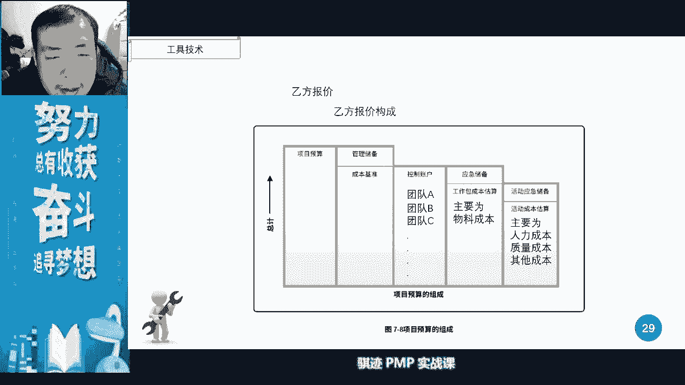

这是我们讲预算的构成，预算构成，我们讲预算构成之后呢，我们讲一个项目当中呢，我们要设置若干个关键点，我们把有可能把这个关键点呢，同时也设为里程碑来设定，到了一定阶段，我们需要哪些资金，哪些资金。

如果资金不到位的，项目就可能终止乃至终止对吧，大家知道哪个中和哪个中的啊啊，会终止或者是终止好。

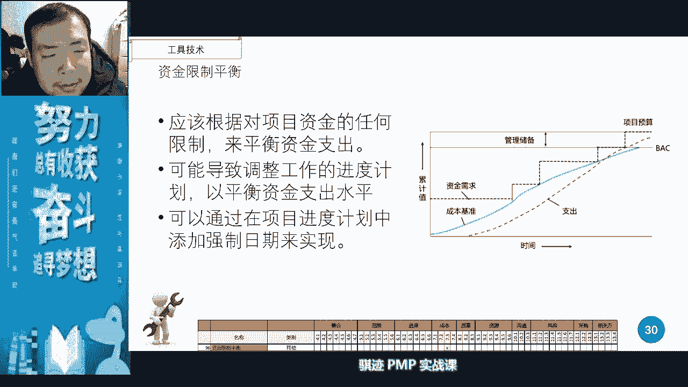

那么项目的资金当中呢，所以我们会添加强制时间来实现，那么项目为了获取资金呢，有时候呢是自有资金去做的，有时候是甲方去做，有时候乙方呢先去垫款，那么有时候呢乙方钱不足的时候，他就会向外面去融资啊。

我上次给你们扩展一下，什么叫内部融资，什么叫外部融资对吧，什么叫内部融资，外部融资啊，什么叫直接融资，什么叫间接融资，凡是直接出钱人和收钱人，相互之间知道对方存在的，能够对接起来的，那就叫做直接融资。

如果相互之间不知道对方存在的，或者根本找不到对方的，那叫间接融资对吧，然后呢，我们在成本的估算当中，还有历史信息审核，所以成本是要经得起审核，哎呀又要一个数理模型，然后要能够进行复现。

他能够原来这么预测的，然后重新还能算出来一遍，怎么预测啊，才能有啊，我们当时数理模型呢一般针对于大项目啊，一般针对大项目会比较多一点。

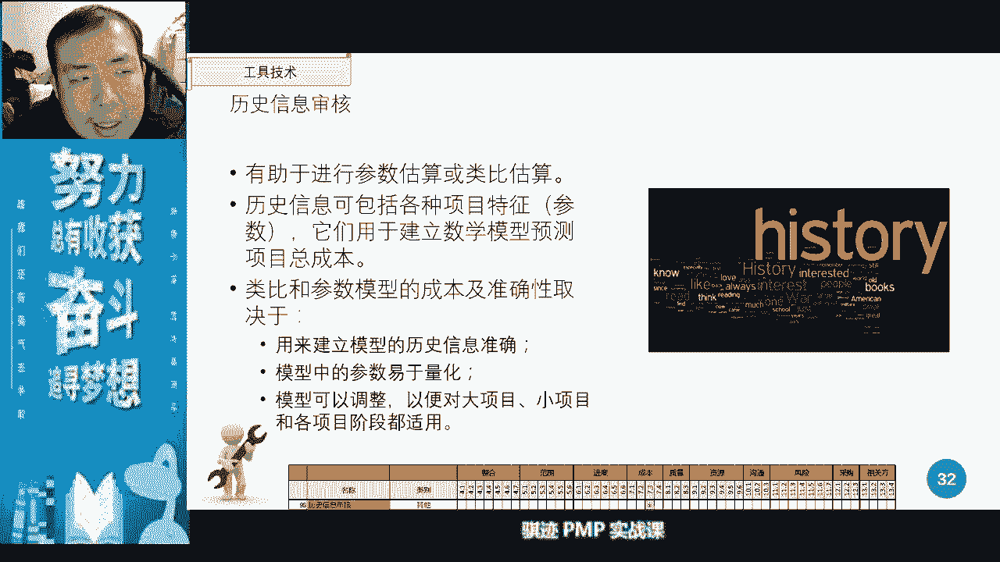

最后呢我们就会做出成本基准对吧，成本基准呢会确定我们的总资金需求量，阶段性需求量啊，我们上课有讲过，我们的上课当中讲的啊，sorry我把话筒拿这里可能啊，sorry，我忘记把话筒拿过来啊。

话筒虽然我语音是嗓音是比较大的，大家也听得见对吧，所以项目的资金需求当中，大家大家可以记住一点啊，就是说我们的项目资金需求只要满足，我们在账面上的组织造成了资金，能够满足项目的第一期的初期的资金需求。

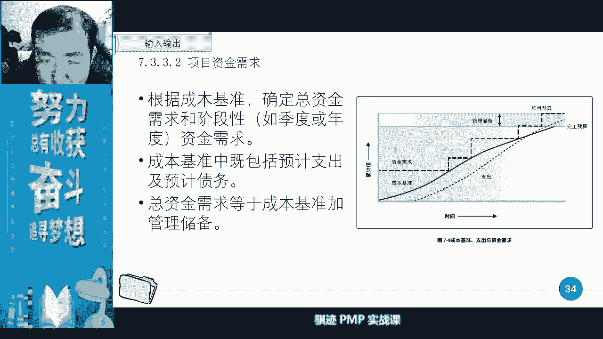

就可以启动，就可以启动，只要在这范围内就可以启动。

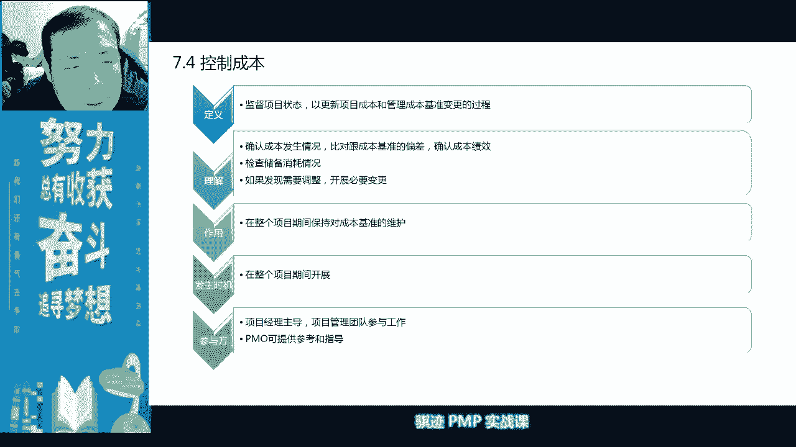

那么接下来是控制成本，那么控制成本当中呢，我们就会讲到了啊，正值分析啊，正值分析来了，政治分析大家来了啊，重点开始来了，首先政治分析教你们背的英文单词都背了没有，英文单词啊，英文缩写和中文都背了没有啊。

背了的同学请把呃背过了，打在公屏上，如果没有背的同学，请老老实实的打出，没有背啊，如果如果有很多人没有背的话，我会讲的更慢一点点，很慢一点点啊，我照顾一下大家，所以大家要啊。

请在公屏上打出你到底背了还没有背，但是我想我相信大部分人应该是背了啊，但是没有背没关系，要坦诚，或者你没有空对吧啊，有没有空好，请打在公屏上，会了，但是不能理解啊，有人说对了，不能理解。

不能理解没有关系，我跟你们讲啊，我跟你们讲这个没有关系，这个不是这个不是问题，这些都不是问题啊，背过了没有，全背下来，中文和英文简写背了英文没有背，你知道为什么英文一定要背吗。

是因为如果你把英文全部背下来的话，会有个什么好处呢，就是说你可以通过英文，因为英文的表达比中文呢其实要严谨一点啊，在有些专业词上要严谨一点，所以你可以通过它严谨的表达，记起这个词原来是什么意思啊。

不理解没关系，有相当多的同学啊背了，有相当多的同学也没有背，对吧啊，ok啊，还有没有啊，还有没有啊，贝拉ok，那么我看到现在上线的同学还不是很多嘛，啊今天为什么啊，快到春临近春节了。

就开始不好好上课了是吧，有时候和题目联系，你呢背了记不住没关系，你如果背了就ok了啊，等到我等到我给你们一个一个解释了，按照我的方法帮你们一步一步一步解释了，讲完了。

那么你自然理解了之后就更容易记住了啊，ok，ok啊，很多同学没来啊，好那么我们就不等了，有什么不可以啊，那么首先讲我先给大家讲一个概念啊，记住政治分析是这样的，政治分析的目的，政治管理。

政治分析的目的是什么样的呢，要把一个项目它关于钱，主要是关于钱，也附带关于进度的状况要搞清楚，所以呢它会一步一步由基础概念，基础值深入到一个什么分析值啊，但这个分析值其实相当于专业分析来说，是很粗浅的。

但是呢很重要很重要非常重要啊，所以我叫他这么比喻啊，中国人讲究阴阳调和，讲究八卦，大家看看八卦看过没有，八卦八卦是不是一个圆盘对吧，有阴有阳，阴中有阳，阳中有阴对吧，有黑黑中有白，白中有黑对吧啊。

那么所以政治管理也是一个这样的过程，它是由最基础的阴阳去生成万物啊，但是八卦这种东西生成万物是什么，叫做阴和阳角的两仪对吧，两仪呢生成东西叫做四项，四象呢会生成一个八卦阵，八卦门那个八个卦叫八卦。

八卦会生成万物，所以中国人呢，这个这个这个这个这个传统理论中的太极八卦，这种理论当中，我们叫两仪生四象，四象生八卦，八卦生万物对吧，所以我教过的学生都会用这一套来啊，叫做两仪生四象，四象生八卦。

八卦生万物，所以你们就第一个啊，后面还会有另外一个段子啊，那么首先第一个两仪在哪里，就是阴阳在哪里啊，当然pp里面没有只有两个值产生阴阳啊，p m p里是四个值生成阴阳。

就是我们我们p p t在当前这一页啊，叫做g b a c e b和b a c，那么我们先记一下啊，我们会讲的比较慢，因为很多同学确实没有学过pv叫做planned value。

planned value，计划价值，就是说我们已经是不是在政治分析的，是不是一定要成本基准了，我们上节课我们讲过成本基准，什么叫成本基准，成本基准首先记住这个定义啊，成本计算和其他基准不一样。

有个定义，成本基准的定义是有额外的定义的啊，这个定义是用来帮助你们理解，非常重要，所以我讲的特别慢啊，要记住啊，跟上成本基准的定义，是在使这个条曲线上任意一点所对应的时间，它都会有一个值。

是这个值是代表是当前应该完成的工作量，以及当前完成这个工作量应该花的钱，注意先有工作量，所以你们要注意啊，那注意先这节课当中，你们先帮我在公屏上呀打字啊，不停的打字，讲话机给我先给我打字。

在这我们的成本记账当当中，任意一个时间点上，先有这个时间点的工作量，然后有对应工作量的实际成本给我打上啊，在公屏打上啊，然后跟着我打，老师打字是不是很快啊，打字快也是一个人啊工作效率高的一个反应。

对吧啊，当然也是当年聊天聊多了，哈哈好，所以panda value代表是完预期要完成的工作量，它和我们的预算呢是相关的，那么它代表的是这个调我们的那条曲线上，我们的那条或者直线上，无论什么线。

我们的那条基准线上，每一点它应该完成的工作量，也是他每一点应该完成的一个工作量，对应的一个成本啊，对所以这一点先要记住，这一点一定要记住，因为成本永远是跟着你完成工作量来的，活干的越多。

肯定九成九肯定是钱就花的越多，你活越往超前干，那么钱也会往超前干，所以我们在以后在比较成本是不是超支，还是节约的时候，不和基准比，而是和实际完成工作量比，记住没有啊，所以这就是为什么我讲题先有国增量。

然后又对应成本，啊啊啊，老是有点咳嗽，那么接下来就来了，所以成本基准，这条线是我们当前每一科应该完成的工作量，以及的成本，但是我们在tm当中，把所有的工作量都折算成了价值，这个价值恰好就是整个总预算。

原来的初始预算的一个价值，比如说你的预算是500万，那么你的工作量呢就值500万，那么你每天完成多少工作量，其实就相当于每一天干了值多少钱的活对吧，然后呢你也会相应的成本，在初始状态下。

我们是不是干一块钱的活，我们我们那没有发生实际工作，在做计划的时候，pa value的那种那种状态下，play value的状态下，是不是干一块钱的活，花一块钱的成本啊。

所以工作量那条曲线和成本那条曲线是不是同，一条曲线是不是同一定要去对吧啊，这点一定要记住啊，一定按过头了吗，打错字也复制，啊ok啊，这点要记住，那么所以伴随着计划工作价值而产生的，有一个是是第呃。

第三个啊，n n的value实际完成工作量啊，那么计划工作量和实际工作量，这个关系很容易理解对吧，就是我计划今天或者累积到今天我要完成，比如说价值啊10万块钱的工作，那么实际完成量不可能正正好完成了。

总归会有多有少啊，但是这是总体工作量啊，我们就先不讲一个，我们今天在下午在群里聊到了一个，有一个有一个问细化的问题啊，这个后面再讲啊，这个后面再讲，所以工作量实际的工作量是我们完成的。

总当前累积的总工作量，那么它会和我们的计划工作量呢相比较，咱比较，那么就比和a比，就说我们当前是超计划的还是不超计划的对吧，那么还会产生一个比较是什么，还会产这个东西。

就是伴随着我们的工作量n的value，实际工作量产生那个实际成本就actual cost，actual cost啊，老师的发音非常标准非常标准对吧，actual cost啊，ok所以我们工作就是这样。

然后不断的去完成工作，完成工作，完成工作，当什么时候工作就做完了呢，在一切都不改变啊，没有其他潜入精神下，默认状态下，当我们完成的工作量，达到项目的总工作量的时候就完成了对吧。

那么项目的总工作量在初始状态下是多少呢，正好恰好等于我们的项目的初始预算，就是b a c b a c，什么budget cost at complete completion啊。

budget cost at completion b a c啊，当然这个cost可以不翻译啊，这个词写的在这个pp这里有点多余，一般我们就叫budget at completion啊。

completion啊，完项目完成时候的啊，一个预算也是完成时候的一个我们的工作价值，那么后面有一个概念啊，b a c已经有可能不是那个b a c，后面会有一个概念，那么项目有没有可能超预算，有超预算。

我就追加了预算之后，我如果没有改项目范围，项目工作量会不会超啊，我问你啊，大家在公屏上回答，如果我修改了预算，去追加了预算，那么我的范围没有改，我的工作量是不是会改，我的工作价值会不会改。

请在公屏上告诉我，好可以啊，我上来讲的非常慢，就是希望能够一遍帮你们所有的东西都理清楚，千万不要有误区，因为学e bm如果有误区，后面再去学，你就会脑子就装不进去了啊，容易工作量是不会改的，哎对不会改。

为什么说会啊错了啊，说会的同学都错了啊，当我的项目范围没有改的时候，我的工作量是不会改，所以我的工作量还是原来那个b a c，但是我的预算已经不是那个b a c的对吧，一算已经不是那个b a c的对吧。

就像杨过和小龙女，杨过失去了一只手臂，她还是那个杨过啊，但是杨过又不是那个杨过，因为杨过已经是一只独臂的杨过了对吧，所以杨过的心还是杨过，但是杨过的身体已经不是杨过了啊，就是ok啊哈明白这个意思啊。

不要唱这个啊，好那么接下来是这样，那么这就是政治分析的基础，四个值，四个值就是我们的啊，就是我们的的两仪，所谓两仪就是我们的计划价值，实际成本正值和我们的总预算啊，那么在初始状态下。

一切都是按照预预计的情况下来的时候呢，这个时候干一块钱的活，是不是花一块钱成本了对吧，就是很计划良好，但是我们知道现实往往和计划总会有差距，所以往往可能什么干一块钱的活，要花两块钱的成本。

或者干一块钱活呢花八毛钱的成本对吧，都有可能啊，好那么接下来，所以我们要判别当前到底是钱花多了，还是钱花少了，进度呢是落后的还是进度时呢，什么是超前的。

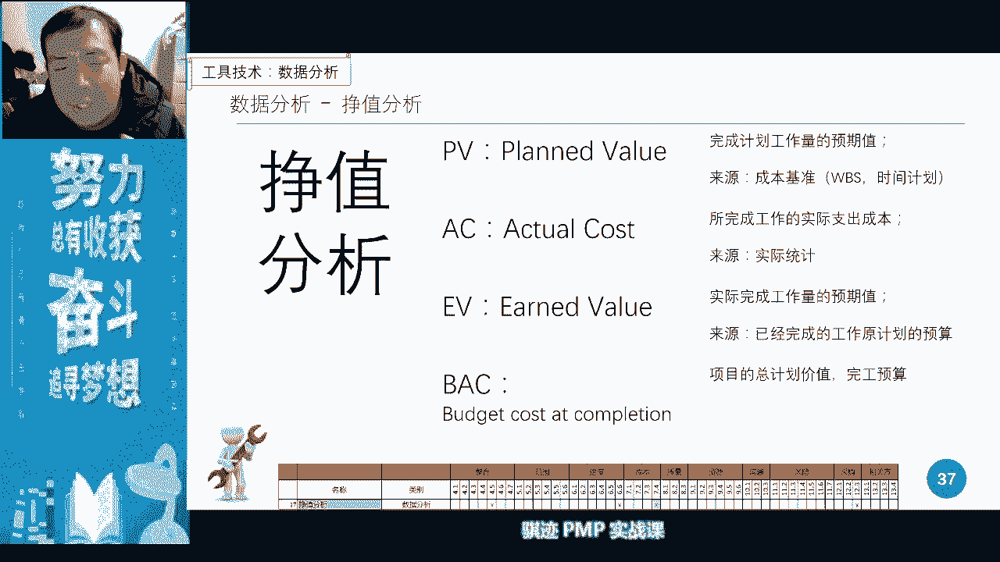

所以就有两仪产生了四项，所谓的四项就来了啊，ok 4项来。

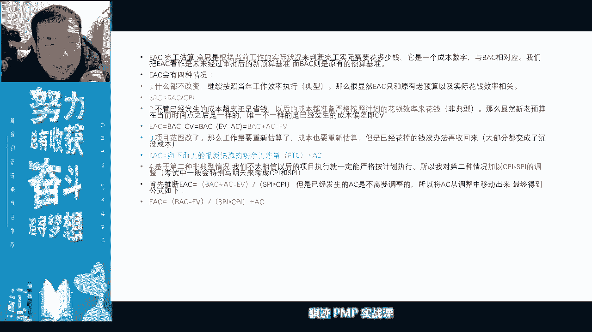

四项就来到了我们的s v c v s spi和cpi，ok啊，然后呢我把那个我把那个，等会我把那个图片拿过来，哎哟等会稍等啊。

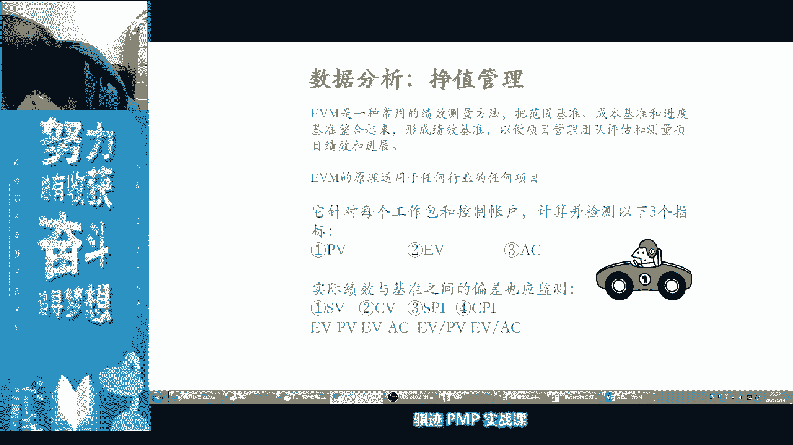

我把那个图片贴过来复制啊，然后大家切换到我的word。

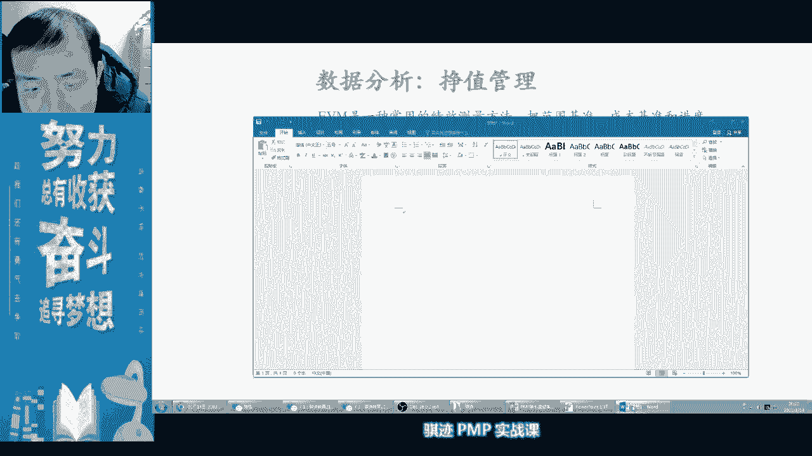

我我用我的word继续给大家演示啊，大家都看得到我屏幕了对吧。

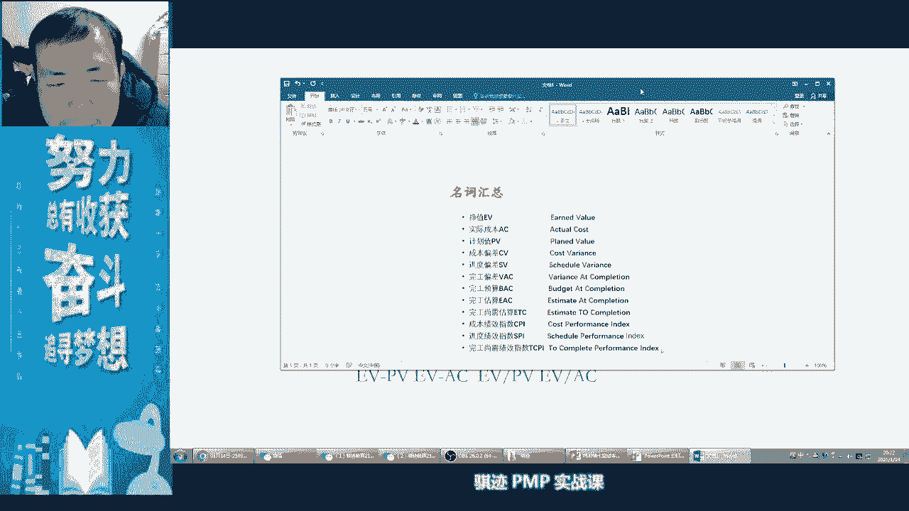

ok啊，没问题好，那么我们这里当中，我们的我们的呃，e v a c p b和b a c都解释过了对吧，那么我们要知道当前我们在项目当中，当前我们的进度，首先讲进度进度是不是落后，那我们就要看什么。

我们的计划值和实际政治之间差距对吧，我们计划干多少工作量，到某一天为止，打他是肯定到某一个时刻为止的，还有一个时刻，到某一个时刻为止，我们计划应该干多少活，比如计划应该干100万的活，实际干了多少活呢。

我们实际干了价值80万的活，那么他在干活是不是落后了，那么这个时候就产生一个叫进度偏差，叫做schedule various，老师发音标准吗，schedule variance啊，那么我们缩写为sb。

那么s b就等于什么呢，sb就等于什么呢，计划值减去正直是这个吧，是不是计划值减去证人，是不是好字，字字放大一点啊，字体放大一点，嗯嗯加两，三，诶等一下啊，字号放大一点，啊再大一点，是不是反了。

非常好啊，这是我故意的，为什么，这是我要教给你们的第一个原则，ev永远注意啊啊这是我故意的，所以大家知道我上课很喜欢挖坑对吧，非常好啊，ev永远在分子或者在被减数上，记住一点啊。

这个在你们考试当中要记不记公式，就记住ev永远在分子上或者在被减数上，明白吗啊，所以s v应该是什么，这个就不对了对吧，我们s b这个改一改啊，先把字体改改，所以s v应该是什么，他应该在被减数对吧。

ev减去pv就是我们干的活啊，我们干的活减去我们计划应该干的活对吧，所以sv如果为正代表什么，哎呀加粗啊，有好好好好，同学们都是对的，同学们都是对的啊，有道理，加粗看得见了吧，ok啊。

所以a4 b如果为正的代表什么，哎很好，同学书上卫生先在前面对啊，ok啊，有些同学可能有点延迟严重啊，我是故意的啊，我是故意的，说明对总进度提前，注意总进度，这里是总进度，总进度进度快。

对超前进度非常好，非常好，进度超前啊，所以明白了吧，e b永远在前面啊，那么还有一个，那么既然有一呃，那么我们要表现出，如果我们要表现出我们的进度，超前的这个百分比多少呢。

我们就会使用到一个叫s spi，那么s spi在这里，进度绩效指数schedule performance index，schedule performance index啊，老师发音非常标准。

1b除以pv，注意啊，ev要在什么分子上，1v要在被减数上啊，ok啊，那么来了好，那么这两个值可以用于表现我们的进度，偏差值和进度的效率，s p i是不是效率啊啊可以表现出效率。

有些同学被减数在前面简述在后面，有些同学你的小学数学是学到几年级的，气不好记啊，意思理解的词语不好记啊，ok啊明白了这意思，ok啊，小姐我已经有简书背简书这么规范的用词了，ok啊啊ok没关系。

我只是开个玩笑，你不要在意啊，c v啊，那么同样的有个叫c v c v呢指的是什么成本，注意指的是成本，cv指的是什么，cost variance成本偏差，那么我来了，成本偏差是不是等于pv啊。

不不不对不对不对啊，sorry，是是不是等于ac减去一个pv，是不是等于a c d p r对吧，计划计划成本减去计划成本，减去我们的实际成本啊，就是成本常识，对不对，对不对，对不对，我这公司就说对不对。

不是不对，ok啊啊啊ok啊，所以我是故意要把你们在日常做做作业当中，考试当中最喜欢犯的错误，在这里全部先说一遍，明白了吧，啊这是我故意的啊，你们记住一点，在pp的世界里永远没有啊，西安那么大。

pp的时间点永远没有计划成本，实际成本永远是和正，去比较的啊，这句话是第二句话啊，pp的世界里永远没有计划成本，没有planet coast这个东西，更加没有plant value这个东西在成本里。

所以pv仅仅只能用于跟进度相关的注意啊，所以我们还可以补一句，pv只能用于和进度相关的计算，这一句要记住啊，ok啊这些句子不要急，等到我们写啊，写完了之后呢，我会贴在群里啊。

ok但是我给大家的一些上次以前的概要里面，也写过一点啊，好所以这个应该是怎么写的，因为ev永远在前对吧，ev永远在前，ev减去ac对吧，那么eb减ac如果大于零，说明什么，说明成本节约1v减1c大于零。

说明什么，干的活比花的钱多，干的活只要比花的钱多，那肯定会会是一个什么结果啊，我们花钱省钱呀对吧，干一块钱的活只花了八毛钱，是不是省钱了对吧，老板最喜欢这种事情对吧，那么在这种情况下。

我们要看我们的花钱效率啊，注意花钱效率不是花的越快越好，而是花的越慢越好对吧，所以花钱效率是什么，叫cost performance index，cost for performance index啊。

再次秀一下我的那么公式也一样，ev除以ac啊，这个时候就可我们的pb没有关系啊，大家会看到后面的所有计算，其实跟pv都没有关系，因为后面所有的东西都是跟成本有关系，pp值和什么进度有关系啊，好来了。

那么是不是这里正好形成了这四个公式啊，ok啊，形成的四公式，这个四个公式，用于描述我们项目的进度和成本的这个状态当，中的我们的进度偏差，进度效率指数，成本偏差，成本效率指数。

我称之它为四项四个表现象对吧，四项四个表现象对吧，好，这是四象，两仪生四象，四象生八卦，那么八卦肯定不是八个了，因为没有那么多词对吧，八卦就只有一个东西，八卦就是我们要注的啊。

ea c p np的考试当中，考题的80%以上，有关e bm计算的，都是围绕着e a c这个事情来的啊，啊不能80%，至少50%以上，都是围绕着e a c这个事情来了，为什么在做一个项目当中，关于成本。

我们现在战场成本这一章，关于这个成本这件事情上，老板啊，客户啊，发起人啊，相关方啊啊各种各样的人或财务部经理啊对吧，永远会问你一个问题，完工需要花多少钱，是不是，这是不是一个灵魂拷问啊。

啊我把它打在公屏上啊，完工需要花多少钱，啊这是我们每一个人啊，这是我们每一个项目经理，在管项目当中的一个灵魂拷问啊，尤其是跟钱有关的啊，如果你们公司不差钱啊，我那我只想说你们公司还招人吗。

啊完工需要花多少钱好，那么完工需要花多少钱，就需要我们计算一个东西叫做完工估算，estimate at completion啊，completion，estimate at completion啊。

啊老师鼻音就开始来了，读completion的时候就有点鼻音了。

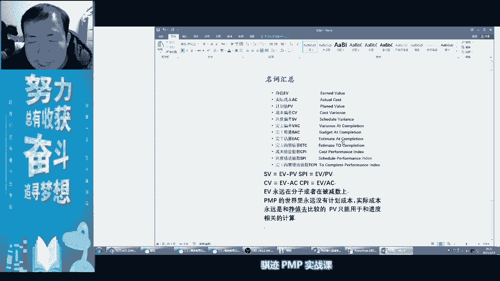

对吧啊，ok理解一下，那么e a c呢就涉及到了一个另外一个事情。

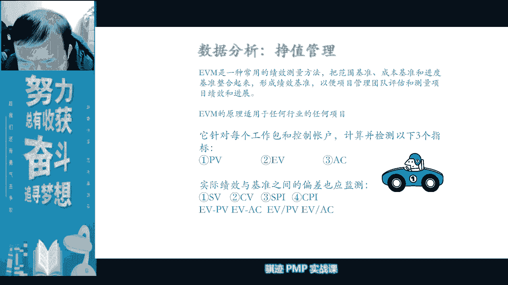

我们回到p p t，e a c就涉及到另外c ea c会有四种算法啊，以后只要你们是啊叉老师教的，你们以后都会想起一个叉老师讲段子啊，那么什么段子呢，ok我会跟你们讲啊，乔老师会讲这个段子。

就是说大家都学过一个一个一个一个一个文章，语文课里面学过一个文章，叫做孔乙己，大家学过吧啊这是这是我最喜欢讲的段子，百讲不厌对吧，孔乙己走进咸亨酒店酒家走进咸亨酒家，摆出九文大钱对吧，摆出九文大钱。

我很有钱的叫孔乙己，然后呢喝了一口绍兴黄酒对吧，喝了一口绍兴黄酒，咸亨酒家，咸亨酒店现在有这个酒店的啊，你们真的有买绍兴黄酒啊，然后呢脸色才逐渐什么缓了过来对吧，从由白转红，然后呢开始卖弄起他的学问。

然后他问人民一句什么话，你知道茴香豆的回字有几种写法吗，请在公屏上告诉我茴香豆的回字有几种写法啊，如果你们还记得课文的话，茴香豆的回字几种写法，女儿红一个对啊，有些人还没有把客房忘记。

茴香豆的回字有四种写法，ok你们以后学过这个章节之后，如果是我教的，你们就会出去跟别人吹，怎么吹牛啊，你们跑到啊，你们跑到喜茶点了，点了一杯喜茶，然后嗦了一口喜茶之后问旁边身边的年轻人。

你知道ea c有几种算法吗，答案是四种啊，ok记不住了，我可能没见过孔乙己是不是都要学的吗，ok啊这么这么经典课文啊，e a c有四种算法，茴香豆有四种写法，孔乙己会用回茴香豆的回字炫耀自己读过书。

你们会用e a c去四种算法去炫耀，你们学过pp，学过政治管理啊，ok就可以了好，那么我们开始来了，ok来了啊，那么esc有哪四种算法啊，第一种任何改变都不做，我们按照当前啊，sorry这个我字写错啊。

当然就当哦，解释一下，我修个子修个子啊，老师打的太快，当前，当前效率ok保存，按照当前效率完成项目，按照项目就是现在如果是成本超支，那么我们就成本超支，如果现在是成本节约，就成本节，我们什么都不改。

那么很显然e a c和什么有关系啊，我们的完工需要花什么的，花多少钱和什么有关系啊，第一原来有多少预算，第二呢实际花钱的效率，比如说我们原来有100万预算，但是我们的花钱效率指数cpi呢只有什么。

只有0。5，那么我们很显然可能要完工，要花200万才能够完工，对吧啊，ok没有这个课文啊，ok啊，那那可能有些地方可能教材里面没有啊，孔乙己是不是中国语文课本里面，一篇一篇非常经典的语篇课文啊。

你们晚上可以去搜一下啊，真的是很经典啊，反正你们记住就行了啊，用来卖弄啊，你们以后学过e a c k卖弄对吧，然后你以后遇到同行，比如说他也是项目经理，你问一下啊，e a c有几种算法。

如果他回答不是四种的，那么就可以确定啊，他要么当年没好好学，要么就是不是真懂啊，ok啊懂了吧，那么第一种我们讲就是和老预算，以及和我们的实际花销有关，那么这里就会感到为什么讲老预算，是。

因为ea c这个东西呢，是要用来判断完工实际要花多少钱呢，那么我们算出这个值之后，是不是要和原来的值相比较，然后有可能需要追加预算对吧，如果超值时会再于预算，如果他追加预算得到批准了之后。

是不是它成为新的预算了对吧，你比如说这个项目花100万呢，跟甲方爸说，甲方爸爸不差钱，他是一个土财主，对吧啊，200万给你有了好，那么这个时候你的e a c就成了一个新的。

b a c budget at completion啊，completion啊，这个时候呢所以我称之它为新预算，所以很多时候呢我们称之它为新预算，b a c呢是老预算，因为老预算也代表着原始工作量。

对吧啊，记住啊，b a c g代表了老预算，也代表了原始工作量，e a c只代表新预算，不代表新工作量啊，这主啊只有一种情况会代表性工作量啊，这是第三种好ok啊，所以我们讲会讲讲了第一种。

e a c没有任何改变啊，e a c处于什么项目，什么都不变，就按照原来做超支就超支，解约就解约，那么他只会和什么老预算和花钱效率相关，所以很显然可以推得e a c等于b a c除以c。

p p i b a e a c呢是新的预算，也叫完工估算，你看到了估算它是估的啊，还是毛估估估的，对于老的预算好，我们的经过批准的预算，b a c budget at completion啊。

除以我们的cp i cost performance index啊，成本绩效指数好，这是第一种，明白了吧啊，如果听明白了，请把明白两个字打在公屏上，没有明白，请把没明白打在公屏上。

我看看有多少同学没明白啊，没关系，如果没明白，我再说一遍好这里这里是根据我的教学经验，一定要慢，必须慢，能多慢多慢，因为如果你现在第一遍没有听懂，你后面再去学，有可能会被概念找他。

因为evm当中的概念很多啊，这个学完之后，我会帮他再把概念过一遍，你们又会头晕啊，又会头晕，但是没有关系，好有同学没有明白对吧，好，太绕了太绕了，就是这么绕，就是这么绕，ok啊好好有。

有些同学连茴香豆的第一种算法都没有明白啊，第一种算法最简单的啊，那么再再来一遍啊，我们再说一遍，完工估算是一个，根据当前工作的实际情况来判断，我们完工需要花多少钱对吧，我们工作已经进行一段时间了对吧。

我们工作预计我本来预算是100万，那么有100万的活要干对吧，然后呢我们做做做做做呢，本来预计是十个月干完的，然后呢我们已经做了五个月了，是不是干到一半了，理论上来说我们已经干了一半活，花了一半钱了。

然后我们算了算呢，现在只干了什么1/3的活，却花掉了60%的钱，那么这个时候是不是我们要重新估算一下，完工要花多少钱啊，我们只干了1/3活，说明什么，我们的效率太低了对吧，那明显追加预算。

但是说我们说追加预算的话，那么势必是还要还要做什么啊，有可能我们工作当中可能要提高工作效率，节省成本对吧，但是呢我们的工作呢又很难提高效率，比如说我们是一个研究型项目，研究这个东西很难提高效率的对吧。

那只能按照原来画抄了就只能抄了，这个时候呢什么东西都不改变，那么什么东西都不改变的话，你原来怎么花钱，现在还怎么花钱，你原来画的超还是画的超，那么它会呈现出一个百分比吧对吧，如果原来我们的cpi等于0。

5意味着什么，我干一块钱的活是不是要花两块钱的成本，那我的cpi才对，0。5对吧，1÷2=0。5对吧，那么如果我现在原来在干一块钱的活，要花两块钱成本的这个基础上，如果我原来有100万的预算。

那么我实际最后要花多少钱才能买这个项目，干完是不是要200万，所以就是1000000÷0。5吧，明白吗，就是b a c除以c p i，原来的老预算除以花钱效率，这下明白了吧，那这下明白了吧。

ok啊如果还没有明白的同学啊，都要看一下视频啊，看视频啊，这是第一种，这是最简单的，就按照原来花钱修理花，花超了就花超了，花省就花省了对吧好第二种呢略微就搞一点点，略微高一点点啊。

比那种呢稍微复杂一点点一点点，这是茴香豆的第二种写法，那么e c来了，我们也是算e c完工到底要花多少钱，这时候呢我们讲之前已经花出去的钱，能收回来了啊，不能收回来对吧，你就花出去钱怎么收回来对吧。

你已经买好的东西可能还能退，你吃下肚子里边呢，今天的晚饭你能退，你能退给我外卖店里吧，那不能退啊对吧，这个叫做沉没成本对吧，那么这个时候我们已经花出去钱赚钱了就算了，但是我们呢不论是之前省钱还是不省钱。

我们计划今后呢，我们计划今后呢完全按照计划来花钱，严格按照原计划的花钱效率来花钱，就是cpi等于一来花钱，那么这个时候以后是不是还会花钞或者花神啊，不会了，那么老预算和新预算。

ea c和b a c唯一的差距在哪里呀，已经花出去的那部分钱是超了还是省了，我们只要把那部分钱调整一下，是不是就能得出我们实际的e a c啊，这个时候他们唯一的偏差就偏差了，那么cv我要把cv扣掉。

是不是偏差就没有了啊，所以eac就等于bc减cd对吧，成本偏差就等于原始的预算减去成本偏差，那么成本偏差cv又等于什么。

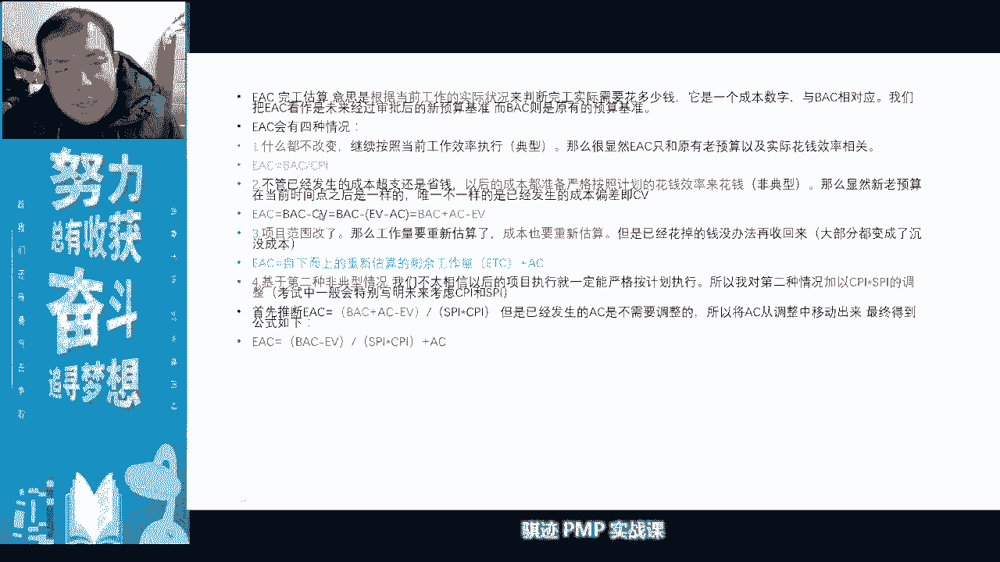

e b减a c，这个我们大家前面学过了对吧。

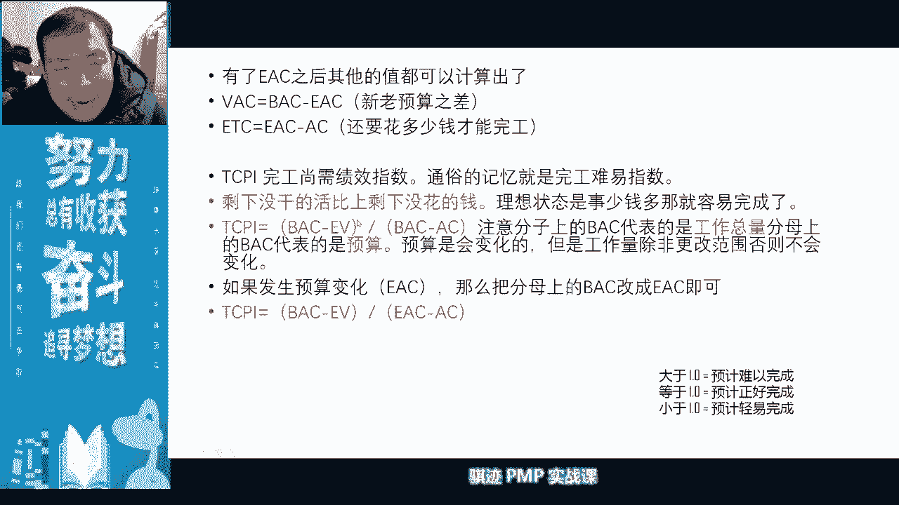

我们把它切到这个好，把它切到这个啊，c b等于e v减ac，这个大家已经都已经学过了对吧，正值减去我们的成本对吧。

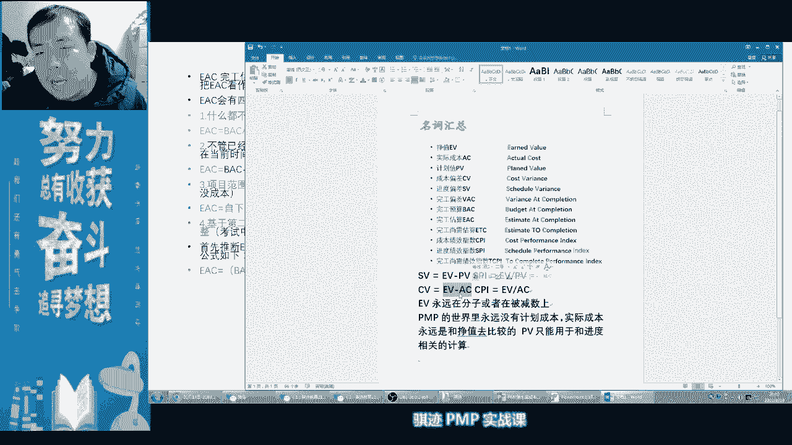

那我们把这个公式解开来，就等于b a c加上ac减去1v减去1v好，这个时候e v有没有被解，有没有被减啊，没有啊，他在第一次出现在在减速上，当然这个你们可以忽略。

因为你们只要记住b a c减c b就行了，ok啊你们要记住这个公式就行啊，ok好，这是第二种，第二种啊，第二种不知道大家明白了没有，不知道明白没有啊，如果第二种也明白了，在公屏上打打回乡得多啊。

你就打第二种也明白了就可以打，第二种也明白了，第二种也明白了就可以啊，我看一下多少同学明白了，因为第二种直接涉及到第四种的计算方式啊，明白了第二种，明白老师上课喝酒，ok同学，这是叫巴黎水，ok啊。

perior lemon的sold sold water啊，巴黎水气泡水，柠檬味的，你也可以拥有，按箱卖的话，一瓶大概就三块多钱，很便宜的，但是很很有install b的感觉啊，很有凡尔赛的感觉。

第二种也明白了，不明白，ok啊，有同学没有明白，ok ok第二种是容易搞的，但是如果第二种不搞清楚，第四种更容易搞，ok啊，那么再解释一遍，第二种情况是怎么样的呢，啊有些项目是这样的啊。

所以我们要结合实际讲，我们再讲一遍，结合实际讲，有些项目是这样的，有些项目你在做的时候呢，领导希望你呢既不要省钱，也不要超支，因为有些大家可能有些国企知道对吧，国企有很多时候到年底的时候，财务特别忙。

什么要把钱正正好花完，尤其是事业单位，它是按照按照国家预算拨款来的，你不把钱花完，明年的预算呢就下来了对吧，今年给你企业，比如说是1000万呢，就是说1000万呢，比如说是啊，企业的执行的预算对吧。

你到年底只花了900万，那么你可能明年你的预算，给你的预算就900万没了对吧，他不希望你什么不希望你省下来，但是呢也不希望你抄，也不希望你抄，所以他希望什么，因为抄了以后没人补的对吧对吧，然后抄了多。

为什么成本会超这么多对吧，他希望你正正好好花完啊，所以呢可有可能会有各种情况要求你呢，以后呢按照正正好好花完呢，去估算一下还要花多少钱，明白意思吧，就是会有限时设定的，真的会有限时定有，有些项目当中。

尤其跟政府相关的很多项目当中嗯，他希望你什么钱政治好好花完，不要吵，不要省，就是说可以略有很小的浮动，但是呢不要花太吵，也不要花太少，所以呢他你在执行完一段时间的项目，执行之后呢。

你会去评估一下当前呢有没有偏差，如果有偏差呢，把这份偏差扣掉之后，或者贴上去之后，看看完工要花多少钱，如果偏差太大的话，那么你可能要想办法去调整，如果偏差不大的话，我们就估算一下。

按照当前这个偏差做到完工要花多少钱对吧，那么这个时候比如说我们项目本来做十个月，现在已经做了三个月，然后呢成本呢节约了10万块钱，然后呢领导说啊，你再这样节约下去，我们的预算呢就会呃。

最后做完的预算就会低很多，整个工整个单位，我们这个事业单位呢，可能预算呢也会也会低下来一块，明年国家给我们的预算补啊，拨款呢可能就少了，所以呢你前面的就算了，因为花式也就黄了，就花了。

没花的钱呢也不能偷计划，现在事业单位也管得很紧对吧，事业单位管钱管的很简单对吧，你乱花钱，这个领导脑袋上那个误伤帽更保不住对吧，所以呢你之前花的省了，你就当省了之后呢，你也不要省钱花，但是也不要超。

就按照我们原来计划应该花多少钱，做完明白了吧，那么这个时候你因为花了省了10万块钱，那么你的完工偏差就是10万，注意是10万，不是-100000啊，因为你是正的，所以完工平算是正10万是好的。

省了10万块，然后呢我们把这个10万块呢从原来预算里扣掉，是不是我们真正的完工估算，e a c是不是比老预算就少10万块钱，所以他是怎么计算呢，新预算等于老预算减去偏差。

那么偏差又等于ev减去ac成本偏差值的，ev减去ac所以把它解开来，是不是等于bc加上ac减去1米，讲到这里你们就懂了吧啊，所以这个东西不是说pm也不是pm拍的脑袋，就说为什么要这么算的。

就是有会有这种场景设计，要求你严格按照原来的钱去花完，但是呢总有会有偏差的呢，那么有偏差的，你把那个偏差提出来以后，不要再发生偏差就行啊，不知道大家明白没有，好还没有明白的同学，请把还没明白打在公屏上。

我来看看还有多少，哎都不好意思，打了没有关系啊，如果你们真没有明白，打个公屏没关系，打在公屏上的同学，我可以，我们那当然不会课上不会再花更多的时间啊，我会在课后你单独在群里艾特我一下，来问我啊。

没明白吗，你解释一下啊，好有一个同学古文海同学还没有明白，ok你可以单独加我微信，或者是在群里我们单独再聊好吧，ok我明白了，还有没有其他同学啊，b a c是老预算提出偏差了，最后还是偏差对呀。

但是我们说以后的发生的成本，都按照严格按照计划花掉了，所以花钱，那么就cpi等于一，那么以后就不会有偏差了对吧，我们只要看看以前有多少平差，把这个偏差体现在完工，最后需要花多少钱上，体现在完工算上。

对吧啊，ok还好有些同学有些同学故意抓到我了对吧，这个这个不算啊，这e a c的计算当中不算啊，啊有些同学抓到我小辫子对吧，哎有些项目里面对多出来10万块钱，不需要花掉吗，注意啊。

有些同学可能工作经验不足，我刚才举的例子，那个例子里面那个10万块钱也不能随便花，你真的只能够什么啊，最后的项目结算里截掉，然后呢可能在啊企业里面其他流程能花掉，因为乱花钱，如果在事业单位里被审计出来。

你花了省钱呢，最多预算被压掉一点，但是你乱花钱，如果被审计查出来，如果你被如果你被审计部门查出来的话，那你更吃不了，多多注意，知道吧啊所以其实现在企业里面也不敢乱花钱，尤其是事业单位啊，尤其是事业单位。

死记硬背吧哈哈不用死记硬背啊，这个我理解ok啊，大部分同学还是理解的，有个背部同学啊，有个别同学可能没懂啊，那个各位没有同学啊，没有懂的同学，下课之后啊，跟我跟我跟我提一下，跟我提一下。

然后我再单独给你讲一下，ok好，那么e a c的前两种算法，大家大部分人都明白了对吧，我们今天讲第三种算法啊，讲的非常慢，但是很细，因为考试必然会考，然后呢我也希望大家能拿到分。

然后以后大家在实际工作当中写报告，这个也会有会用到啊，好第三种方法呢，第三种业计算方法呢，其实最容易理解就是项目范围改了改了，那么我给你举个例子啊，项目我们原来的项目工程箱是一个工程项目。

要造一个六层楼的小楼房啊，做到后续预算了行不行啊，那你不要纠结这个事情啊，我们就事论事啊，后续预算也可能不是我这个项目经理管好不好，谢谢ok啊，那么我们继续回来啊，第三种方法相当于什么，举个例子。

我们现在要盖个小楼房，盖个六层楼的小楼房，然后呢呃预算是比如500万盖个楼坑，进坑进坑进坑进先去什么打地基，然后呢地面平整，先去地面平整硬化，然后打地基，打完地基上盖，刚盖了两层楼的时候呢。

领导跟我们说啊，我们现在这个地块呢政府重新规划了以后，这里是一个黄金地段，盖六层楼的楼房，太吃亏了，抢了重盖，我们要干60层楼啊，给你三个亿的预算，我靠什么，几百万的预算变三个亿吨的好。

那么这个时候项目范围改了，那么既然项目范围改了，我问你盖60 60层楼和盖六层楼，这个预算能一样吗，肯定不一样，工作量页面肯定也不一样，然后里面的很多东西可能都要改掉，是不是啊，所以项目范围改了。

那么原来的东西都退掉了，但是有一样东西是不能退的，已已经花掉的钱也是没办法收回来的吧，你原来打的地基是不是要重新打，因为大家知道六层楼的地基，肯定和60层楼的地基不能一样了，如果你敢盖六。

用六层楼的地基去盖60层楼，那你的楼肯定最后免不了一个东西，什么东西叫楼倒倒，楼倒倒，你的楼肯定会倒掉对吧，啊楼肯定会倒掉，所以地基要重新打，但是呢有可能呢，地面平整的一部分成本可以省下来。

不用重新平整，平整是一样的，对吧好，那么这种情况下，我们只能重新去估算成本了吧，那么重庆估算成本当中，哪一种估算成本方式是最精确的，请在请在公屏里告诉我，哪一种估算成本的话是最精确的。

哎对那个时候那么吃ac是个沉默成本，对ac这个时候就是一个大部分是沉没成本了啊，那么有可能不是沉没成本啊，所以大家请告诉我，哪种方式估算工作量是最精确的，哎对记住啊，ok所以第三种ec因为工作范围变了。

那么我们就开始重新开始，只要工作范围不变了，那么预算肯定要变，预算变了，那么我们的啊成本基准要变对吧，工作范围要变，什么都要变，重新估算的剩余工作量叫etc加上一个什么ac，因为ac已经花出去钱对吧。

ac act your cost，花出去钱，那么就是还没有花的钱，预计要花的这些工作量的钱，再加上已经花出去的钱，是不是等于总的我们的项目的估算，这种是不是很容易理解，对吧啊，这种很容易理啊。

所以第三种大家明白了没有啊，请在公屏上，如果第三种明白了，请在公屏上打一个，明白了，如果第三种文明明白也给我打一个，没有明白，第三种是比较容易理解的啊，这个明白ok啊啊，有同学不明白，你有同学不明白。

就那么我这样这样细细的讲一遍，啊啊我知道总会有同学不明白，那么我们再细细讲一遍，那这个就不会太细啊，第三种情况，回乡度的第三种写法是怎么写的呢，ea系的第三种方法怎么算的呢。

当我们项目执行到一半发生了什么，发射项目范围改掉了对吧，就像我们前面举个例子，六层楼变成盖60层楼了，那么你的预算一定是什么，不可能用六六层楼的钱去盖60层楼，要么你盖的是什么三只小猪里那个茅草屋的。

对吧啊，茅草屋能概率算落单也是技术对吧啊，所以他预算肯定会要重新去制定预算对吧，那么制定预算的前提是，你先要估算新的预算是多少啊对吧，所以我们要去估对吧，这个时候呢原来的工作量。

工作范围呢已经部分的话就全部都没有意义的，我们要重新制定一个范围对吧，那么根据这个工作范围，从soo w大家记得把范围管理sow去拆，拆成w bs，再用w bs呢去拆成什么，拆成activity活动。

w bs活动组合在一起，是不是进行成本估算，咕啊咕啊咕啊咕叽的吧。

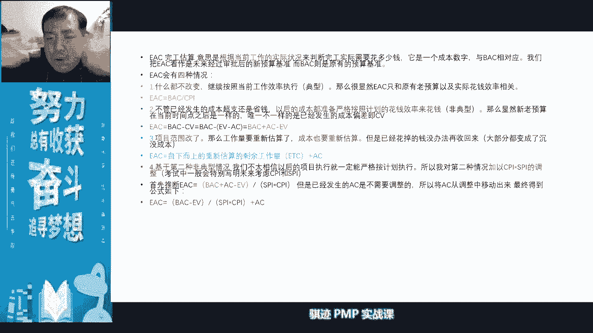

那张那张表，然后我们不要忘记了对吧，拆成了我们这里的成本估算对吧，拆成了成本估算啊，成本啊，这两个加起来再加一储备，再加一层一层加。

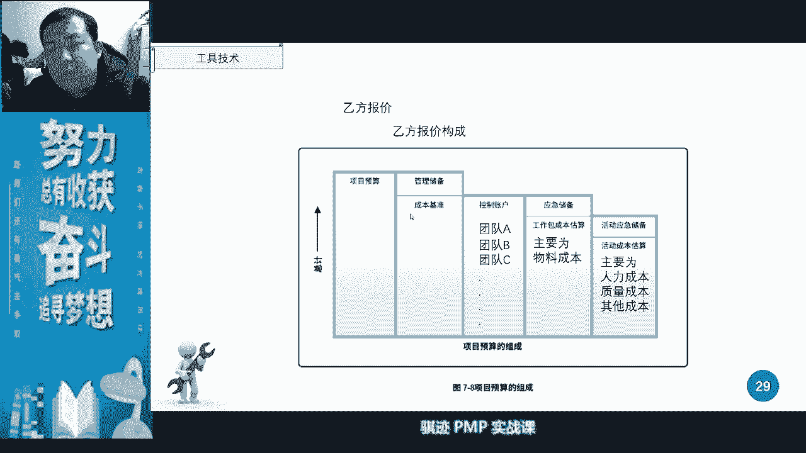

是不是生成了一个新的项目预算，你这样估出来嘛，所以我们叫做估算，所以叫e a c，它是一个估算，estimate估算就叫estimate at completion completion。

那么这种估算呢就要算剩下工作量吗，因为虽然范围改了，但是有可能原来做的工作里面，可能有一小部分是我们还能继续用的，但有可能很大一块呢就不能继续用了，就像我们看六层楼和60层楼地面平整。

可能是这个工作就不用重新做了，他这个工作量呢是有无效的，但是呢打地基呢是无效了，之前盖的三层楼，那可能要推倒重来，全都无效了对吧，那么以简而言之，那些花出去的钱呢也收不回来了。

所以那些钱呢就是一一就是ac啊，干过多少活去完成，那么叫etc etc是叫做estimate to completion啊。

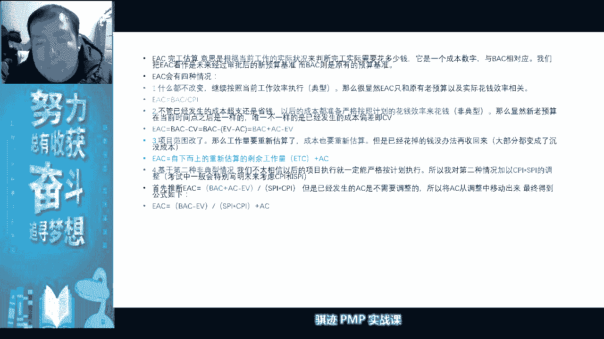

to completion好，etc不是那个高速公路etc啊，啊你们记这个词的时候，千万注意不是高速公路或者过收费口，无人收费的那个etc啊，这叫estimate to completion。

完工尚需估算。

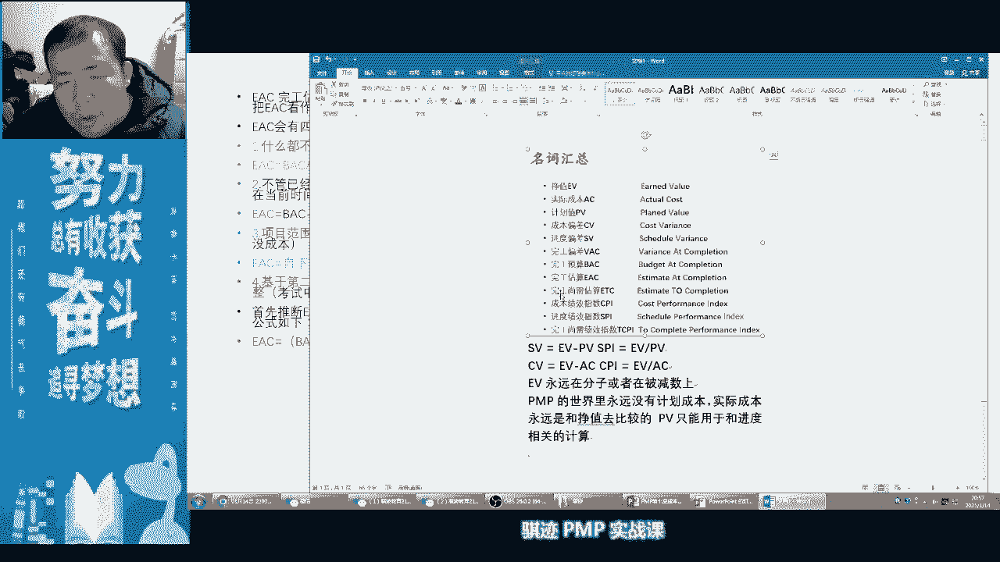

就说完工还要花多少钱对吧，因为我在这里正好完工还要花多少钱，再加上已经花出去的钱，是不是就是整个项目我们估算的一个成本啊，对吧好，这就是ea c的第三种算法，茴香豆已经有第三种写法了。

好ok了吧好那么第四种，第四种是基于第二种的，第二种呢我们也称之为，当然你知道一下，这个也称之为叫非典型，因为它不是很典型的一种方式，但是因为他要控制那个他要控制那个叫什么，那个花钱不能超不能多。

就是这种非典型的管理方式啊，喂喂喂方式，那么第四种呢是我们还是按照非典型，就是一严格按照计划来去进行执行，我们后面的啊项目的花钱，注意啊，e a c总是个钱，是个钱的概念。

所以我们是严格去按照项目的计划来进行，以后的花钱，但是我们知道，如果你的项目之前花钱花超了，那你之后呢也还是容易花潮，如果你之前进度落后，是不是之后也容易进度落后啊，那么我们能不能对未来做判断啊。

做预测是可以，但是未来是不能完全预测的，对不对，那我只能按照当前状态，我我现在当前状态如果是呃成本是节约的，进度是超的，那我预测我总归是预测在基于谨慎原则，我呢也可能预测未来也是处于成本节约进度，进度。

那么延迟，那么但是进度拖得越长，是不是最后晋级也会导致项目的总成本会增加，对吧，那么所以进度效率和成本效率，会当前的进度效率和成本效率，在不考虑未来可不可不可预测的未来情况下。

我们将当前的效率去推测未来是可以的吧，啊至于已经有条件，所以我们加了一个东西叫调整因子，所以我们会在公式二的基础上，公式二的基础上，这个b a c加ac减ab这个基础上去除。

以一个s spi乘以cpi作为一个调整因子，那么有另外最终一个项目的成本是取决于一，是取决于你花钱的效率，因而取决于你进度做的都快，有些时候呢你的花钱效率不高，因为你来拼命的花钱加班干活。

但是你花钱去加班干活呢，能够让项目进度缩短，是不是能够节省人力资源成本是可以的，因为加班付加班费去加班干活，但长期来看，项目从五个月，比如缩减到三个月，那我可以省两个月的人工工资，算下来比加班费要合算。

这就是为什么很多的企业，他996是给工资的啊，某些996公司是给工资的啊，0079的他是给给加班费的，因为他算过了他那个加班费所花的额外的成本，cpi的这个指数的下降，会带来什么s p i的剧烈上升。

最终导致什么我们的项目的预算呢，啊项目最终的就是成本呢反而会下降啊，你们现在可以从第四个公式当中明白为什么啊，996007就是通过啊牺牲一点点的cpi，甚至不牺牲对吧。

不给你加班费或者牺牲一点点的cpi，大幅度的提高s p i指数，从而使它的调整因子呢什么大于一总和大于一，总和大于一之后呢，我们整个项目的完工估算就会下降对吧，那么我们就以第二个公式为基础。

除以一个调整因子，就得出了第四个公式，但是这个当中我们讲ac是已经发生的成本，已经发生的成本是不应该受到未来的调整，它已经换出去了对吧，你花出去100块钱，他就是花出去100块钱对吧。

那么你花出去一块钱，你不是说未来工作效率高了，那么花出去就可以把它试做，90块钱不行的是钱就是钱，钱不能被调整，已经花数据线不能被调整，所以要把ac从这里拿出来，所以大家看到我的第二个公式当中。

用绿色的这个字体去表示我们的第二个公式，那么在第二公式当中，我们要特别注意ac要把它拉到外面来，单独放到外面来，最后第四个公式就形成了，现在这个公式e a c等于b a c减cv。

除以s spi乘以c p i加上a c明白了吗，这个公式是p啊，p mp里边我们e v m里面最难记的一个公式，因为这个公式呢初看上去没道理，所以我为什么花那么多口舌。

帮你们去解释这个公式公式是怎么来的，就是希望能够通过这样一个推导过程，让你们理解这个公式怎么来，同时帮助大家去记这个公式，万一考试考到你们，我脑子一紧张，哎呀公式是什么，忘记了。

那么你可以通过推导的方式，把这个公式最终推导出来，ok好那么至此我们eva c的四种算法，茴香豆的四种写法都已经交过了啊，如果四个呃，第四个我们考虑特例啊，p m g里面不考虑特例，就有同学说的有道理。

但是我们不考虑特例就是特例啊，我们没有其他特殊情况，a s p i乘c p呢是一个调整因子，调整因子它用于说什么意思啊，因为有时候如果进度快，我们我们讲的是，我们讲的是基于第二种公式是什么。

cp i等于一对吧，s p i等于一，未来什么都不按照计划来，比如你现在是大手大脚惯了，比如你现在大手大脚挂了啊，啊比如你有有又有人挑挑我刺是吧，a c e也是做分母了吧，有些人啊啊又挑我刺是吧。

比如说比如说你是一个大手大脚惯的人，那么你现在大手大脚花钱，那么虽然你向我保证，你未来肯定会啊，按照你的当前收入水平去花钱，那么你觉得我会相信你吧，那肯定不会的对吧，人总是有惯性的，由俭入奢易。

由奢入俭难啊，所以我们会加一个调整因子叫做cpi，同理你做事情现在拖沓，那么你以后说你不会拖沓，就一定不会拖沓了吗，当然也会拖沓，可能会改好一点点对吧，就好比说啊，好比有人说啊，我现在要节约一点对吧。

比如有些男同胞，比如说抽烟的老师不抽烟啊，有些男同胞抽烟，他一开始丑的是中华啊，抽个华子对吧，好有，然后呢，有一天我跟你说啊，你这个家里有有老有小要养对吧，你就不要抽烟了，抽烟都不好。

要浪费钱又伤害身体对吧，不抽烟啊，你答应老师啊，我不抽烟，我不抽烟，然后呢你呢是省钱了，但是呢你没有戒掉烟，只是把中华换成了什么大前门对吧，那么省钱的话是省钱，但是还是会受到以前喜欢抽烟的影响对吧。

所以我们要把这个因子考虑在这里啊，因子考虑，那么进度效率指数也是一样的意思对吧，如果你是一个拖沓的人，你告诉我，老师说我以后肯定不拖沓了，该干的事情一定要干，当然是当日币对吧。

但是实际上呢你还是可能会拖沓，只要好一点，所以我们不能说你答应我了，我就那样，那么我还是把你视做什么，把你视作效率没有变，人没有改变情况下，我来看一看未来会怎么样啊，会怎么样。

所以我会把s spi和cpi作为一种调整因子，出在这里，就像我们第一个公式当中除一个cpi一样，我们把它视作是一个调整因子，cpu我好像没有啊，cpi的我看成cpu了，ok啊。

所以这个不知道大家明白了吗，好所以呢在这种情况下，我们就使用第二种公式，因为第二种公式讲的是什么呢，你向老师保证了以后，花钱严格按照我们原来计划花钱，效率就是cpi等于一不超花也不省钱对吧。

然后呢进度呢不不超前也不落后，按照计划去完成，我保证按照计划完成对吧，但实际上呢你还是有可能会影响我们，按照这种情况去推测，那么就第二个公式加上一个调，除以一个调整因子，然后呢得到我们的公式。

然后呢ac呢又是不能实际花销呢，又不是不能被调整了，我们把它单独拎出来呢，从这个公式单独拎成这个公式，把它拎出来，拎到外面来，最后就形成我们的ea系的第四种模式啊，所以ea c就这四种公式。

所以我们最后问一句，大家四个公式都记明白了吗，茴香豆的四种算法都学明白了吗，学明白了，请在公屏上打一个明白好，谢谢大家，996例子为什么会被除啊，ok啊，有些东西在990很隐私，阿尼，那那我问你啊。

那我问你，我们项目如果要，那么我问你项目啊，ok啊，项目如果要原来要我五个月完成，如果项目要原来要五个月完成，假设我们的项目是软件开发项目，软件开发项目都是我们叫码农嘛对吧，都懂了。

就是人力成本没有其他的啊，然后呢，本来是呢我们五个月呢是按照朝九晚五做的，朝九晚五做的对吧，work life balance对吧，然后呢然后呢公司来了一位黑心老板，然后我们要996的干活。

但是呢我不会让你们吃亏的对吧，我可以付给你加班工资，加班工资是啊，你们日常工平时工资的，比如说1。5倍，1。5，比二本工资要比平时高对吧好，那么说平时花一块钱干一块钱的活，是不是啊，一块钱干一朋友。

现在同样也是开发，因为就是码农工资就是成本吧，花一块五毛钱才能干一块钱活，是不是cpi下降了对吧，那么这首cpi大值下降多少，大概原来的如果说全程都是加班，天天996，天天007，天天007好吧。

极端点，那么这个时候我们大致cpi下降到了，大概是百分之原来的75%左右，66%，60%，但是我们的项目原来要五个月做完的，我们现在两个月就做完了，s spi变多少了，s p i变成了原来的2。5。

那么你用2。5去乘以0。667，你算一下多少是不是比原来要大了，这个总因子是不是比原来大，总因子大了，你把预预算这一块东西去除以一个总因子，最后算出来是不是整个项目的ec反而小了，明白了吧。

这就是老板有时候宁可花钱，也要让你加班的道理，就是因为他通过花钱可以达到建降，降低我们的什么进度，降低我们的进度，就是说呃时间啊，减少进度时间，然后呢通大幅度提升，通过少量的降低cpi。

大幅度提升s p i答，得到一个什么s p i乘c p i大于一，然后呢能够节省成本，明白了吧啊，当然有些黑心老板连加班费都不给对吧，给你们泡面干不干不干，拉倒啊，他连cpi都不愿意降。

然后呢还要提升sp，懂了吧，就记住茴香豆类，这招记住了对吧，第四种情况是不是经常出现进度成本偏差时，保证预算进度能完成整个项目计算，后面怎么调整s p i c p i啊，也可以这么用嘛，也可以这么用。

也可以这么用，ok啊这位同学说也可以这么用啊，那么有些人说通过加工加工资降低进度时间，最终减少成本对啊，啊第二种情况是不是就是b a c减1v哎，对的呀，同学第二第二种情况的etc。

是不是就是比a c e减e b对的啊，这个这位同学啊数学学的非常好啊，这个在第二种，仅仅在第二种情况下，这个加这个就是etc etc加ac就是e a c，这是e a c后面算出来以后才有的啊。

当然你的逻辑不错啊，逻辑不错没问题，老板给了份螺蛳粉，啊老板给他们说四分哈，好惨，ok难道不是应该给你们个康师傅吗，啊加班搞专享的吧，ok啊好，那么这一段讲完之后，那么我们学完这一段之后。

我们e a c的四种方法都会了啊，茴香豆的四种算法就都会了，会了之后，那么我们讲两仪生四象，四象是什么，s b c b c p i s p i对吧，四象生八卦八卦就是e a c。

有了e a c为什么叫八卦生万物啊，为什么要记住这个，因为有了ec后面所有的东西都能算出来，为什么来了好，我们再继续来算啊。

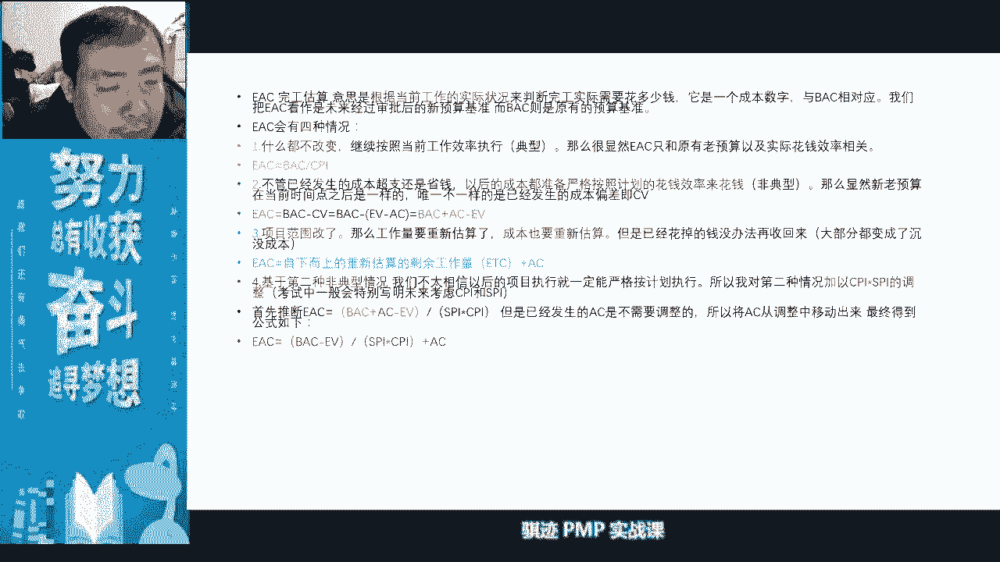

有了e c这个后面所有的东西都算出来，比如说v c v是什么。

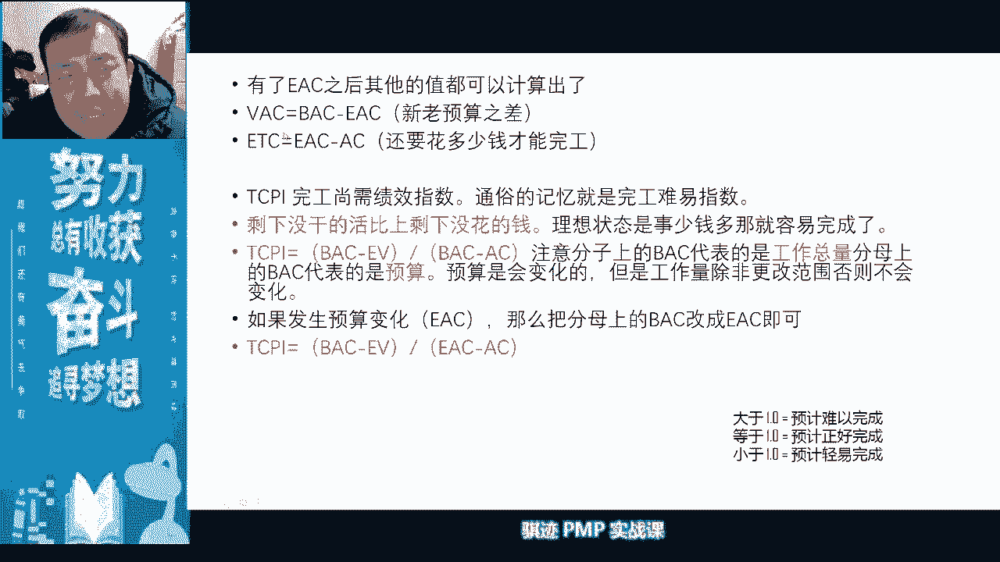

来来我们来看一下v a c是什么，vc叫做varians at completion啊，完工偏差什么意思，完工的偏差差在哪里，完工了还要算偏差，那么就肯定是新老预算之差了。

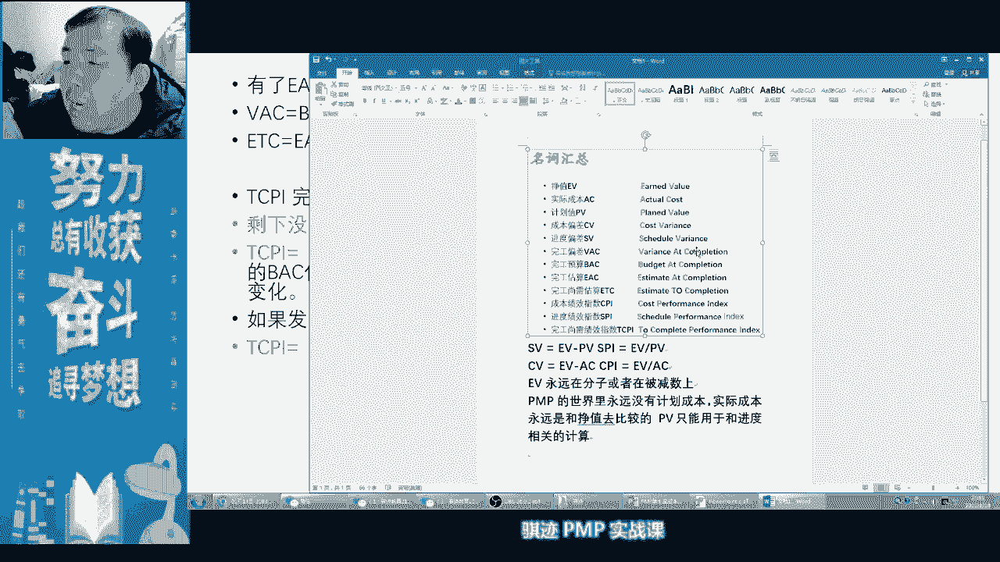

那么我把新老预算放在一起减一减，那么是老预算在前面，新运算减前面当老的减新的对吧，因为如果它是负的。

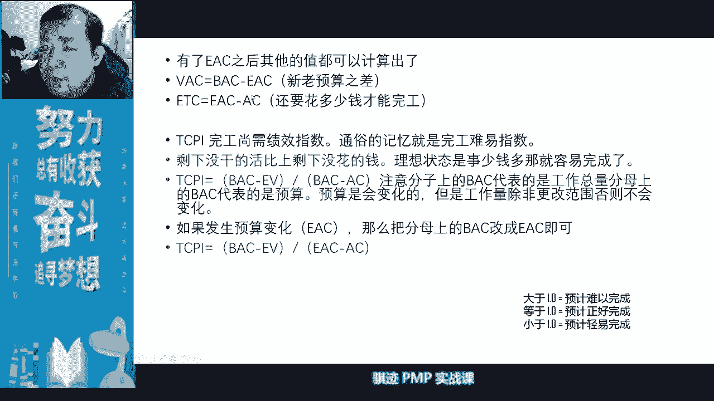

说明超了对吧，如果是正的，那说明节约了啊，注意pmp里面有个概念啊，p n p又有概念，那么我们学校的话再总结个p n p的世界，正值挣钱，正的，啊帮助大家记这个，我相信经过我这样的话洗脑。

你们的好负的，不好啊，屏蔽的世界里永远是政治是正的好负的，不好啊，效率呢除了我们后面会讲的tcp i住了啊，那tcp i算了，我打错了，tcp i除了t t p i以外，永远是正呃，大于一，小于一。

不好，明白了吧，ok ok好，这个概念很重要啊，所以你们在p m p的世界里看到e v m以后，如果你做项目管理报告，或者你们看报告，如果你们看到的是正直正的数值偏差，值值是正的，说明他肯定是好的。

如果它的值是负的呢，肯定是不好的啊，它通过正负就能看出来，知道吧，不用你去想这个东西到底是啊，真的是好的不好的，不用这么想，我们统一都是这么规定效率数呢，除了tcp tcp还是例外。

我为什么后面会讲为什么是例外，永远是什么，永远是大于一小于一不好，你看s p i是不是大于一好s p i大于一，什么叫e v大于pb对吧，我们进度提前，cp i大于一呢，就是e v大于a c。

所以我们的什么花钱什么花啊，干的活多，花的钱少，明白了吧，什么情况下ev是负的，没有情况下一名啊，b情况要负的，有1v5 情况呢只能在局部，比如说有些导弹不但不干活，还要搞破坏，ev就是负的啊。

ok啊不会存在这种事情，考试不会存在，请不要脑开这个脑洞啊，我们考试永远不会考ev为负啊，只只会说什么s v cv为负啊，或者是说什么我们后面我们这里讲了啊，什么为负啊。

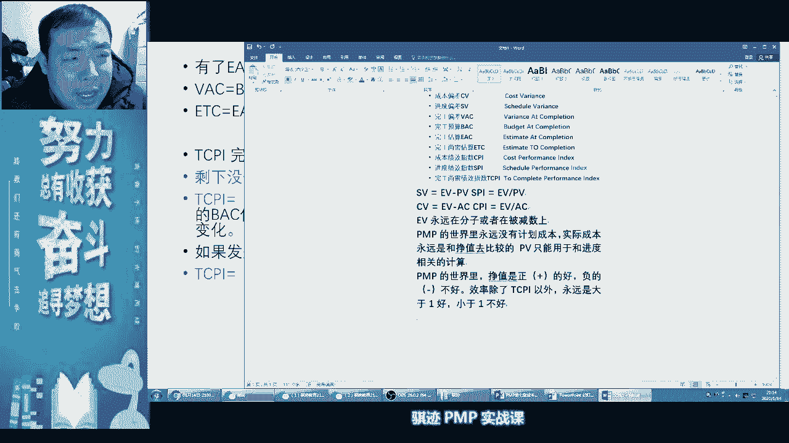

v a c为负对吧，v a c负，为什么vc为负啊，如果新预算大于老预算，领导问你啊，项目完工了，项目的预算情况如何，最后执行的预算情况如何，你跟他报告v a c等于100万，那么就意思是什么。

我们节约了100万，比如vcc是负数万，是老预算减轻运算啊，ok啊，所以如果你是一个懂行的人，你看到vn c等于一个正的数，你就知道啊，项目就省钱了就可以了，不用去思考。

这个东西到底是简单还是被简单什么的，不用去思考啊，这是我们约定俗成的事情啊，那么相对应之下还有一个东西叫etc，我们讲讲了啊，不是高速公路那个e t c啊，是estimate to complish啊。

老师英文是不是很标准，to complish对吧，就是e a c减去a c，就是我完工的估算减去实际花的钱意味着什么，我还要花多少钱才能完工对吧，etc那么这两个数值可以看到什么。

这两个东西在数值上其实有有很有意思的地方，vc是不是可正可负的，vc是不是可正可负的，etc会不会是负的，请在公屏上告诉我，etc会不会是负的，啊你们已经吐了啊，你们有点过分啊，不会ok啊，不会。

啊不会啊，那非常好啊，所以etc是不会为负的，那么我们还可以引申一个概念，当e t c等于零的时候。

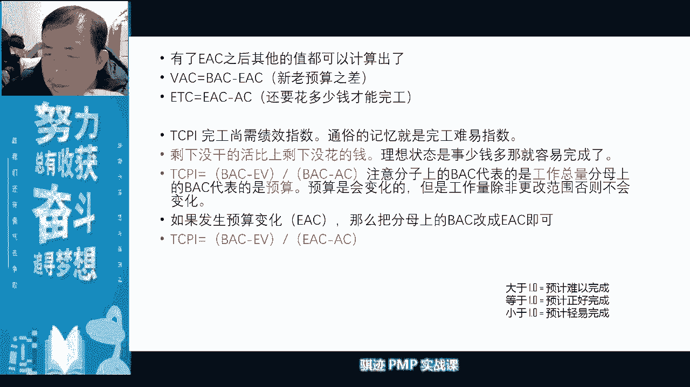