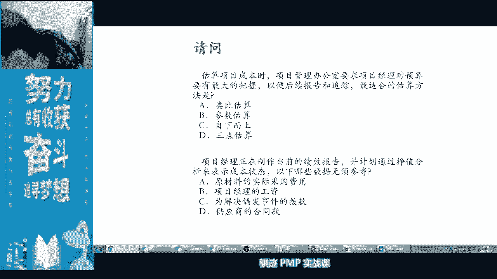
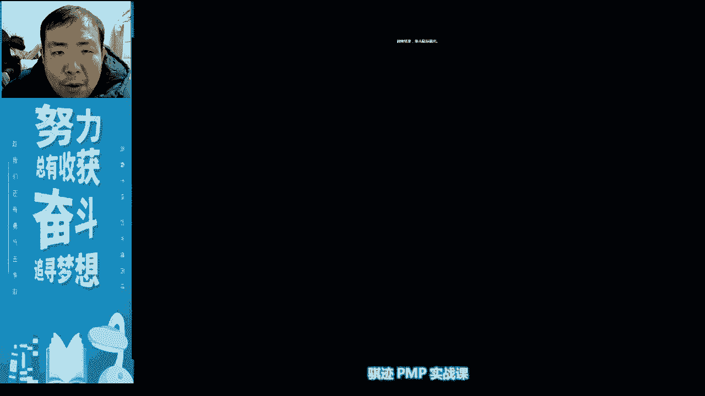
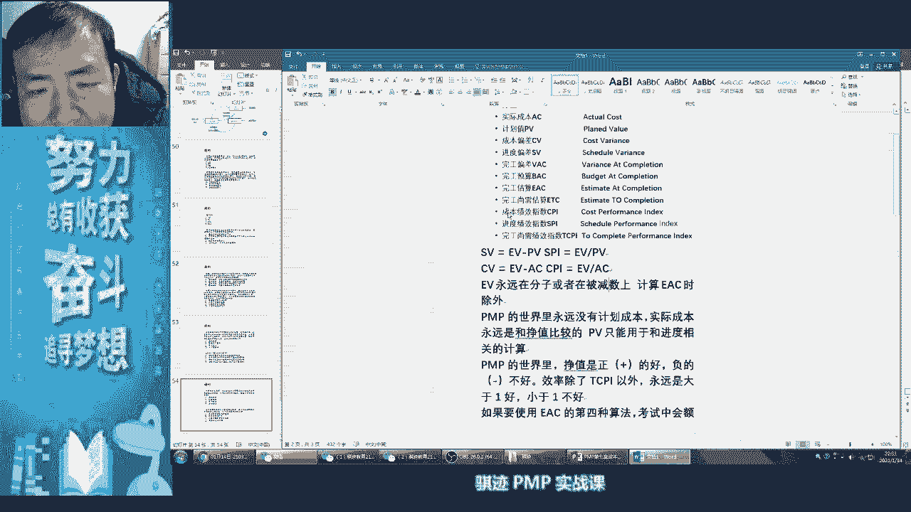

# PMP认证考试课程最新完整免费课程零基础一次通过项目管理PMP考试 - P21：PMBOK第六版 第七章项目成本管理-22 - 骐迹PMP - BV1Sb4y1f7Yt

好意味着什么，难不成项目不贴钱吗，对吧，ok啊，项目部贴钱也是一种预算呀，追加预算啊，这是另外一种预算的追加方法，也是追加预算啊，对总归会是终止对吧啊，项目完工或者是终止，对终止也是有可能啊，钱花完了。

活不一定干完，但是钱花完了，没有多余的钱了，也有可能的对吧，比如说我项目完工呢，注意啊，这个概念也是很重要啊，比如我项目完工呢需要花300万，花300万，然后呢我们ee c呢就估了300万。

就问你300万拿上来之后呢，花花花又花完了，然后呢甲方再去见甲方啊，但是活还没干完，再去问甲方要钱，甲方说一个字滚好，你没有钱了，那怎么办，终止对吧，所以etc为零就意味着要么项目做完了。

要么项目已经终止了，终止了啊，拿不到新钱了对吧，那结束啊，vc是不是一个可正可负的对吧啊，所以这种v c可正可负，e t c呢总是大于等于零，最多等于零，如果等于零呢，他就要意味着项目要么完工了。

要么已经被终止了啊，ok啊不知道大家明白了吗，ok所以有了e a c之后，这些这些东西都可以都可以算出来了啊，都可以算出来，这就是v a c和e t c这种复杂概念算出来，那么我们在做报告当中。

我们做报告当中，比如说领导他总会有两个问题，第一个问题项目当前进度如何，那么如果你要用啊很专业很装的那种方式啊，科研领导汇报，那就回报跟领导汇报什么啊，领导我们当前的我们当前的进。

我们的当前进度状态是s p i等于1。1啊，领导说有1。1啊啊领导是懂行对吧，哦1。1啊，项目进度是超前的啊，可以过，然后他问你完工，那么说完工到底要花多少钱，然后你跟他说啊，完工我们的ea。

我们的v a c呢是50万啊，领导说哟，vc 500000说明省钱的了，过对吧，就不用额外去p c算了，就可以过对吧，然后领导问啊，我们我们项目还有多少，还需要花多少钱才能做完啊，就是领导。

我们整个项目估计再花200万就做完了啊，啊领导说啊，现在已经花了，比如说500万了，再花200万就做完了啊，知道，所以领导可能要去，他也要像什么财务部门啊，或者向客户啊去申请下一批资金。

我们讲项目的资金是不是分不到位的，所以你etc也可以用来汇汇报给什么，汇报给啊客户对吧，甲方爸爸啊，再换了弯弯就结束了对吧，再花200万，再花200万，再花200万，这就被诈骗了对吧。

哈哈所以诈骗的一个特征就是etc永不完结，哈哈ok是不是学以致用啊，是不是很有意思啊，ok啊好的，那么学完这个之后，学完这个之后，我给大家休息十分钟好吧，你们理一理脑子，是不是觉得现在脑子很混。

我们李林老师最后讲t t p i，休息十分钟，我们到九点半继续啊，今天会晚一点点啊，讲的非常慢，今天讲的非常慢，情况下，我觉得应该绝大部分同学能听得懂的，那么如果有各位同学呢确实理解有困难。

有些同学可能不是做项目管理的，或者他对这个根本不管钱，不管成进度的，ok我可以理解我们呢个别课下再交流，好吧好，我们休息十分钟啊，昨天今天时间很紧，但是这里要给大家说略微放松一下。

大家去上个洗手间吃个东西，然后呢把脑子思路理一理，想一想什么是两仪，什么是四项，什么是八卦，茴香豆的八卦的茴香豆有几种写法对吧，有四种写法，每种写法怎么写对吧，好八卦是怎么生万物的。

vc怎么出来etc怎么出来就可以了啊，ok啊最后还有个t cpi好休息十分钟，九点半回来啊，本来记者就能听懂了，记不住一个听懂了，记不住的同学，请反复听我们的视频，可以在线看的啊，有点懵，我知道了。

对学这个东西都会有点懵的啊，所以给大家十分钟时间啊，大家可以回回神，好那么我也稍事休息一下，我也稍事休息一下，好那么，我稍微引申一下哦，你在说什么，我又回来啦，哈哈有个同学说接了接了三个电话给岔开思路。

搞迷糊了，ok啊ok没关系啊，同学啊，如果你搞迷糊了没有关系，我们等会全部讲完之后，我们快速的再过一遍，非常非常快速啊，因为今天时间非常有限啊，但是我现在是讲尽可能讲的简单，尽可能讲的细致。

就是希望大家能一遍学会啊，啥也没听全，有些同学网络不太好，没关系，哎哎好感觉休息一下啊，水喝了吗，你看我又换了一种水啊，这个不是啤酒哦，这个也是巴黎水，这是易拉罐装，这个只要两块多一点点一瓶，矿泉水啊。

气泡矿泉水啊，没有热量了对吧，很健康，healthy，那给大家看一下啊，那我贴到镜头前面看见了，有看不见对吧啊，这个这个这个这个清晰度有限对吧啊，零卡反正是零卡看到吧，这个这里大家都看得清楚啊。

零卡很健康啊，所以老师上课不是喝啤酒啊，啊吴奇这位同学呢把所有的公式贴上来，你背下来也行，我不反对你背下来，但是你要知道公式背下来背这么多，你万一考试的时候忘记怎么办，你不记得推导公式忘记怎么办。

所以记住推导公式，哪怕你忘记了，把它再记起来，其实也是可以的啊，所以这是我为什么上课都喜欢，用推导的方式去记啊，ok能背下来也行啊，我不是说不能死背，ok啊，我们上p n p课呢可以啊，可以用灵魂吗。

但是我们上另外一门课，比如像上软考的课呢，那就不行了啊，软考一定要下画很大的功夫去背，软考真的有些东西只能是背啊，只能是背，啊对t g b i没有讲，四分钟继续啊，有些同学可能比较辛苦啊。

后面还有六个章节呢，够你忘记咋办，我现在在忘，然后你再然后理解你抢的吧，然后里面没关系没关系啊，可以你可以用死的方法也可以活的方法啊，软考大家注意啊，我们另外我们学校刚开了另外一门课程。

软考当中呢就他大部分主体70%也是啊，也是p np啊，但是他其实要求其实就cp多，他的专业知识也是比pp量要大很多啊，所以他那个考试呢就真的是要背要记，偏偏计算还算好吧，所以你也能死记硬背啊。

我跟你说啊，所以人和人是有差异的，有些人就是靠死记硬背把p过的，有些人记忆就是好，没有办法，你要承认，像我这个人的记忆特点，就是我一定要理解了就能记住，非常深刻，记住，我不理解总量忘掉。

这是我这人的特点对吧，所以但是我相信大部分人都是有这个特点，就是当你理解一件事情，你是容易把它记住对吧，ok我觉得我觉得记住就行了，后面不怕王子，ok好，我们还有一分钟啊，一分钟就准时开始啊。

啊我们后面还有很多内容我们就讲了啊，不要觉得ppt没结对吧，ok啊我们当时要看时间啊，我们可能留给大家回家去做啊，虽然我当时我把答案给大家附上，希望每个人自己自觉的去做的，因为那道复杂的那道题目。

我不可能上课花这么多时间去做这个东西啊，因为时间太长了啊，真的太难了，除非我要去教学这个东西，但是你如果没有学过，就又教学又又又怎么说呢，又不太好又不太好，好我们时间到啊，时间没到，还有一分钟。

还有几秒钟的，要不我看我的，以我的手机为准啊，好我们开始了啊，时间到开始好，只剩下最后一个东西没有讲过了，叫做tcp i啊，tcp还是什么呢，先看一下英文啊。

先看讲英文叫to complete performance index啊，没有背的同学可以记一下啊，完工尚需绩效指，tcp i to complete performance index啊。

在此让你们感受到我pure english accent啊，kudo，you this is fine啊，do you see f好，那么完工尚需绩效指数，顾名思义就是王。

如果我们要把这个事情按计划做完，要做成什么样的效率，做成什么样效率，所以书上这个讲的，完工就要只说解释的有点复杂，我给你们解释的方法是以我的方法来解释，最容易理解的方法，你们只要记住。

看到tcp i脑子就反映出一样东西，我们要比较一下，剩下还有多少事情，和剩下还有多少钱去比较一下，就用剩下没干的活，那么很容易想想看，你希望剩下的事情多，还是希望希望剩下的钱多对吧。

我们有句话叫做工作最好是什么事多钱少，离家近，数钱数到手抽筋对吧，所以一般情况下我们都是希望事情少而钱多，但事实上依然会如此吗，不知道，那么首先我们来看看啊，所以他的公式很容易就能记住。

所以这个公式很容易就记住，剩下没干的活活的工作总量是什么，我们之前正好讲过哪个值代表工作总量，b a c啊，这时候的b a c这三个词不代表的是预算，而代表的是工作总量，所以它在分母上代表的是工作容量。

在分子上代表的是工作总量，在分母上才能代表预算啊，所以这里的b a c列表，工作总量减去1v是已经干完的活，是不是剩这个减除以后就是剩下没干的活对吧，剩下没干货，然后除以一个什么，剩下梅花的钱。

剩下梅花的钱是什么呢，b a c预算减去ac是不是减去ac啊，那么就是我们的剩下梅花的钱，那么剩下没干的活，剩下比如说我们剩下还有300万活没干，但是我们剩下的有500万钱没花。

那么之后你可以你的完工绩效指数，尚需绩效指数是什么啊，3000000÷5000000，那么就是0。6，就是说原来你要花十成力干的事情，那么你现在只要花六成立就可以了，所以你可以很通俗非常俗的认为。

在tcp的原始状态下等于一的时候，就认为什么我们要花十成力去干活，一点就代表花十成力去干活，如果tcb 2算出来是0。8的，就代表你只要花八成立，你可以省两成立，因为什么你剩下没干的事情少。

但是剩下没花的钱多，总括号可以省点力吧，如果不巧，你t cpi算出来是1。5，那你要花15成立去干活啊，所以t cpi越高，就意味意味着接下来干活你要花多少，成立一点默认就是十成立，那么1。

5呢就是15成立，二点呢就要花两倍的力气去杠啊，就这么意思，不知道大家听懂了，没花的钱移到最新的预算，ok啊，这位同学，你跳的太快了啊，我这里没有说最新预算，因为我在这里在计算tp i的时候。

我默认状态是不估算，我们是不是要进行新预算调整的好，如果要进行新预算调整了，如果说我们要重新估算一下，比如说我的项目原来预算是500万，但是呢我们估算了一下，房间500万是做不完的。

我们追加到了700万，那么这个时候呢，我们就会把什么ea c在分子还是分母上，在分母上把它替换掉b a c对吧，因为在分母上的b a c代表的是预算，这个是预算替换掉，但分子上是什么工作量都没变。

工作量没变啊，所以工作量呢还是bc还是bc，所以t c p i当我们预算发生变化的时候，那么我们就把e a c去替换掉，分母上的那个b a c就可以了，我不要同时提升啊，只要换一个，那么公式就变成了。

tcp i等于b a c e v除以e a c减ac，那么就是说剩下没干的活，比上我们的什么追加预算后没花的钱，所以说如果我们是按照能够按时完工去做完的，那么它的tcp i经过调整之后。

因为我们多砸了钱，它的完工难度就会从二点降为一点对吧，所以完工难易指数你可以认为什么啊，大家看没看过什么跳水体操，是不是难度系数越高，那个那个那个那个动作越难做啊，ok啊。

所以tcp啊你们也可以认为是什么，我们可以在ppt上这些，t c a t c pi可以啊，俗的认为是王公之后完工的难度系数，跳水等比赛系数越高，难度越大，越南完成，或者要更加努力的完成对吧，ok明白了。

分子不变化，分母变化，ok完工难度系数k啊，所以通过老师这样一个解释，你们是不是觉得tcp i很容易理解，ok啊，就按照我的解释，这个解释是对的啊，只不过我我用最通俗的语言帮你们解释了啊。

如果你们去看书上，书上那个解释会让你觉得有点头晕啊，但是老师这么一解释，ok你们就ok啊，都ok了对吧，不是o j b k对吧，都是ok了啊，所以t c p i现在明白了吧，完工难易度指数对吧。

那完工难度系数t c p i越高，它的完工难度越一难完成，所以t c p i和我们的工作绩效指数，不是一回事，所以我们这个当中讲，我们的效率指数越越是大于一越好，但是tc p i除外。

因为tc pi不是一个效率指数，而是一个完工难度的难度系数啊，难度系数，难度系数o，好那么至此我们还有没有什么东西没有讲的，没有了好，那么我们快速的回忆一遍啊，e v a c p v这三个值是什么。

n value指的是我们实际完成的工作量，然后它值多少钱对吧，earned value ac呢就是actual cost，指的是我们实际根据工作量所发生的对应成本，pv，那叫pla value。

就是实际按照我们计划应该做完多少工作量啊，那么接下来就会有一个什么b a c叫做budget，and completion，我们的预算完工预算啊，预算就是我们原来计划花多少钱完成的。

那么这四个值就构成了我们的两仪，两仪就会产生四项pb c b啊啊啊cv sv啊，cp i s b叫做2亿，2亿可以开始用于汇报我们的项目状态，那么s v如果cv为正的话。

那么就代表了我们进度超前或者是成本节约，s spi必然回大于一，cpi呢变为大于一，所以如果cv为负，那么c p i必然也为小于一啊，不是为负啊，小于一cpi是不能不会为负的啊。

c p i必然也会小于一，那么同理s一如果小于零的话，s spi也必然为小于一啊，那么又记住一个原则对吧，我们在教程第一个原则是，1v永远在分子上和被减数上，然后但是计算ea c除外啊。

有些同学啊中我的叉子，那么我只能加一句，计算e a c 10除外啊，这样你不能抓我叉子了吧，有些头像坏坏的对吧好，那么，另外一个啊这是一个原则，那么另外一个原则是什么，pv只会参与跟进度有关的。

而跟进度有关的只有这两个值对吧，我们一圈都学完了吧，跟进度有关呢，只有这两个值，一个值是什么，sv schedule variance，进度偏差以及s spi进度绩效指数啊，pb只和这几个计算。

其他的都不参与对吧，后面的我们都没有，我们后面的课程当中就没有讲到过，涉及到pp的对吧啊，所以成本永远是跟着我们的实际完成，工作量发生的啊，成本永远是跟着工作量的对吧，干的多才能花的多对吧。

干得少也意味着相应的花的少的，但未必啊，未必有些同学就是吃的多，干的少对吧，有些同学是吃的少，干的多啊，所以也未一定啊，不一定啊，未必，那么是这样，那么有了两仪，有了四项，最后我们就开始算什么算八卦。

八卦就是e a c ec的四种算法啊，记住老师给教给你们的，就是茴香豆的四种写法对吧，以后出去啊问一下对方啊，你学没学过p np啊，那你就不好意思问对吧，然后问，然后你可以问一下对方啊。

比如说你是甲方更容易啊，你问一下乙方啊，你给我算个ec，你用第三种算法算一下啊，对方如果说啊不知道也是几种方法，那你问一下也是几种算法，不知道啊，要么他没学过啊，要么他们要么他是学渣，ok好。

所以esc就有四种算法，第一种算法什么都不改变，当什么都不改变的情况下，e a c值和什么东西啊，原来的老预算和实际化销有关，所以它的公式就是b a c除以cpi，预算除以花钱效率，可想而知。

花钱效率越高，预算越节约啊，我们的新预算就越低，那么第二种，还是节约了，我们以后都严格按照计划来花钱，s p啊，cp i呢等于一这种情况来花钱，那么我们老预算和新预算之间的偏差，只会有跟一个有关。

已经发生的偏差，那么已经发生了偏差是什么，cv对吧，那么我们只要用老预算去减去cd就等于新预算，那么cp如果为正，那么就说明什么省钱，那么新预算就会小于老预算，如果cpu为负，表示超支。

那么新运算就会大于老预算啊，大于老预算啊，那么cv又等于e b减ac，这个我们前面学过了，那么公式整理一下，就等于b a c加ac减e v b a c加ac减1米，ok好，这是第二种。

第三种呢项目范围改了，如果你们记不住了，60层楼盖到一半推倒重来盖60层楼啊，这个时候呢预算也要改掉范围，改掉所有东西都改掉了，所以之前算的这些东西都没有意义，唯一有一点什么，之前花出去多少钱。

这是有意义的对吧，然后重估工作量，然后算一下这些工作量所对应的，工作的预算成本，再加上已经花出去的钱，就是我们e a c完工需要花多少钱对吧好，这是第三种，第四种是什么呢，第四种是我们的啊。

基于第二种情况，我们讲人是不可信的对吧，你给我承诺以后不会乱花钱了，但是最后还是乱花钱对吧，有有些人就是这样的啊，所以我们在未来考虑的时候呢，不会完全相信你啊，我们会以你当前的表现来评估。

你以后会怎么办啊，回应屏幕怎么，那么我们会在第二个公式的基础上，b a c加ac减一位，基础上除以一个s p i乘c p i啊，除以一个s b s那么除了之后呢，我们会发现什么呢。

成实际发生成本呢是不应该被调整了，所以我们把它拉到外面了，最后得出了一个什么b a c等于什么啊，e a c等于什么，b a c减e v除以s spi乘c p i，加上一个ac啊。

这就是ea c的四种算法，e a c有了四种算法，算出来之后，我们就可算出v a c就是新老预算之差，也可以算出etc还要花多少钱能完工，estimate to complish vis。

a variance at complish啊，所以当中这个词其实很关键啊，a叫at t叫做tat，它就到某个点为止，to呢就是后面这一段有多长对吧，ok好，那么这些都算出来之后呢，已经足够。

你既要报告了，那么以tcp是适用于什么环境呢，如果领导问你接下来工作，你准备花多少力气或者裁决怎么样措施去做，那么你就要来了，这是属于什么纠偏纠错和改进措施这些东西，那么你就告诉领导。

我们准备tcp i等于0。5去做啊，那你是在凡尔赛工作上，凡尔赛领导请领导，如果他不懂行的话，就那个就那个就傻了对吧，领导如果懂行的哦，t c p i等于0。5，接下来只要花一半的力气去做啊。

你小子项目管的可以来来来来，这个项目你也一起管一下啊，然后呢你就管了两个项目对吧，然后你项目越管越多了，然后你就成为什么项目及经理对吧，或者成为pm的manager对吧啊，然后出任ceo，迎娶白富美。

走上人生巅峰啊，然后你就梦就行了，ok啊，那么t z p i是完工上学绩效指数，我们刚才刚刚学过，他其实就是什么完工难易度的一个什么，完工难度系数，完工难度系数他的意思是什么呢，剩下没干的活。

剩下没干活是什么呢，b a c减e v总工作量减去已经惯了，工作量，比a c呢也是预算减去我们的ac就是什么，我们的我们的实际花销就是还没花出去钱，对吧啊，没关系钱，所以我们讲成本基准。

我们的项目预算指的是什么，我既指的是我们有多少钱花，也指的是有多少工作量做对吧，当然我们还记不记得，老师之前跟你们讲一个事情啊，成本基准是用于乙方内部去算的，对吧啊，那个土鸡的吧。

成本基准是用于乙方内部去算的，乙方内部去测算的，还有一块管理储备，所以b a c永远是按照甲方口径算的，所以你们的工资呢在成本基准身上呢，就是300块，项目预算案就是800块啊，那么这一套下来。

那么我们t t p i是不是就算出来了啊，t t p i只要等于一，正好能够完成大于一呢，难以完成难度系数越大越难完成对吧，或者需要越花越多的力气去完成，那么这时候如果说你告诉领导这个情况，领导说了哦。

你这个项目很难完成，没关系，我们有的是钱，我们就不差钱对吧，砸钱好，我们把预算往上提一提啊，e a c我们出一个新ea预算往上提一提，当然这个e a c还是没有经过审批的啊。

注意ea c都是没有经过审批啊，经过审批他就成为新的b a c的，知道吧啊他是没有经过审批，因为b a c是预算要甲方批准的，知道吧，没有经过审批，那么但是甲方说不差钱做好，你们把预算往上提。

这时候如果我们是e a c大于b a c的情况下，往上提了，那么肯定得出个什么结论啊，tcpi肯定会难度系数会下降，钱多了总是好办事对吧，钱多了不少少对吧，钱多总是好办事啊。

所以t t p i必然会下降，难度系数就会下降好，那么至此，e v m的所有公式概念都已经快速回过一回，一遍了，好没问题吧，这些东西讲完之后呢，那么我们来做一些脑洞啊，做一些脑洞。

做一些脑洞的那个啊啊好，这是一常规情况啊，我们的特殊情况呢，我们等下节课，下节课等大家做了更多的关于呃，再做再讲啊，只有上次就有个同学跟我提了什么s p i，就是我们进度计要指数是大于一的。

但是我们进度呢反而是落后了，为什么这种情况，这是一个很特殊的一个情况，这个涉及到实践工作了啊，那么我们暂且不讲，防止大家讨讨呃，脑子搞晕好吧，考试呢这个题目也几乎不会怎么问，几乎不会这么问啊。

因为这个太过深入实践和边边角角了，当然不保证4月份以后考啊，这个我就老是不保证，目前为止我没看到会怎么考好，那么来如果我们成本绩效指数大于零呢，节约成本成本技巧指数小于零呢，成本超值。

那么a啊s b呢工大于零呢，工期提前啊，suv小于零呢，我们工序落后啊，这如果sb同时成本节约啊，那么呃同时大于零了，那么成本节约工期体检，如果s b c b同时大于小于零呢，那么成本超支攻击落后。

这个很容易啊，现在又来了，最有意思的是，如果cv为正s比户，就是说什么我们钱是省的，进度落后，那我们可以干什么啊，我们可以什么啊，我们可以拿钱换精度，所以在一道题目分析当中说，如果他说cv为正。

s比v s b为负，那么他有可能的是什么，当前公花钱效率呢是挺高的，但是呢进度落后，那么我们可以适当的花一部分钱，因为省下来部分钱嘛，我们可以适当的花一部分钱，然后来赶工啊，啊赶工对很好啊。

这些算法的单位是什么，这些算法的单位都是money dollar i m b啊，啊欧元对吧啊，你要用比特币算好像也可以啊，所以我们算的这些单位都是指数，都是一个百分比，没有意义，没有单位的对吧。

所有其他的啊非指数的都是money钱钱啊，这点这点知道就是啊都是money，所以叫e bm n m value management，都是以前作为单位，我们这节课上节课是不是讲过有个正进度单位。

就以时间为单位对吧，evm呢都是以前为单位，ok啊，所以cb为正s为负呢，我们可以花钱买进度，那么如果cb为负，s v为正怎么办呢，那么我们可以适当的什么啊，进行什么东西啊，来来来啊。

这个呢是有点难度的，如果4v为正，cpu为负，我们要进行调整，争取让两个呢，争取让两个东西呢都为正，是不是都为正为最好，我们可以采取什么措施，cv cv为负就意味着成本超支，但是呢进度超前。

我们可以怎么做，为什么进度也用钱，我也单位诶，这个就是说我哎同学啊资源平衡啊非常好，有些同学说说资源平衡了非常好啊，对可以使用资源平衡啊，资源平衡非常好啊，我们可以牺牲一点进度来换取什么资源，合理使用。

这样呢比如说有一些事情，专家做一天做完的，我们可以让小朋友来做的，做三天对吧，小朋友的工资比专家便宜多了对吧，然后就可以省钱啊，非常好啊，资源平衡偷工减料，大家懂啊，居然偷工减料。

违反职业职业道德啊啊李斌这位同学问，为什么进度也用前文单位，进度用前文单位什么意思啊，我给你解释一下啊，就是说他我们比较的是一个什么，是要客观量，因为领导问你进度当前如何，那么我会告诉领导说什么。

一我可以告诉我啊，我们进度领先五天，可以这么表示，他用天也可以表示，领主说啊，我们比预计的项目进度多，干了价值50万的活也是可以的对吧，内核能级啊，50多干了50万的活，意思是说。

我们现在已经超前了50万的工作量了，用工作量来表示，那么就是一个用钱来表示工作量，就是钱对吧，好非常好啊，都都打出了资源平衡，非常好，我为你们感到高兴啊，你们倒是学进去对吧，那你去好就是这种情况。

所以这两种情况呢，我们可以用分别用不同的方式去进行解决对吧，那么我问你们，如果cv为负，sv也为负怎么办，cv和sv都为负，最糟糕的情况，项目经理我怎么办，管理组被开除，申请预算，ok同学们。

你们可以有专业的办法解决啊，ok申请资源加资源是可以申请加资源，不要花钱啊，ok啊，不干了一个啊，缩缩减范围对吧，理论上可以啊，但是这不是正度，如果进度也为负，这成本也为负，你们可以考虑使用快速跟进啊。

记得吧啊都忘记了对吧，快速跟进，为什么快速跟进可以把进度缩短，是不是可以可以去追赶进度对吧，虽然不能追赶里程碑，但可以追赶进度啊对吧，可以可以抓抓上一部分的sv对吧，第二因为我的进度缩短了。

所以我可能我付的工资会减少吧对吧，语系列按照时间计的那些成本可缩短了，也可以纠正一部分的什么cpu为负吧对吧，快速跟进冒的风险是很大的，但是可以同时纠正这两个，知道了吧。

但是不是所有的情况都能快速跟进啊，快速跟进也要取决于各种各样的勾稽关系对吧，要取决于项目经理管不管的过来对吧，有时候万一快速跟进嘭炸了，是啊，取决于你们的能力，所以一个能力强的项目经理。

能够频繁地使用快速根据，去调整各种各样不利的局面啊，这是你们能力，所以这是你们的value value对吧，这是你们的actual value对吧，你们懂的，这是你们的actual value。

ok好好，那么政治管理呢是一种，可以说是p p考证最重要的内容之一啊，这是我们继续讲p p t，你们要记得一点，政治管理不仅仅p m p考p g m p，也考p f m p还得好啊，可以啊。

所以他告诉我们项目可以进行到什么程度啊，花了多少钱了，还有一个怎么样纠偏，做出难度如何，对吧啊，对于通过那些我刚才说的那些值，都可以进行进行了，那么政治管理当中呢，ok啊，来我们来出道题目，现场做啊。

我ppt上没有放特别多，因为我觉得你们可能来不及啊，那么我们来现场做现我现场出的题目，我是喜欢现场出题，我现场出的题目快速跟进，不算耍流氓，工作密度八也不给钱，ok同学，这个不对啊。

那那那那你有没有很快速跟进，是什么多个工作同时开展，我没有说让一个人干很多活啊，我只是说很多的活并行一起开始开展，是不是快速跟进，那么是不是可以可以压缩我们的项目进度啊，有可能间接降降。

降低部分项目成本，人干的活还是一样的，只不过只不过本来是比如说我先干完你再干，现在变成什么，我和你同事去干活，是不是效率高了会省钱，对不对，ok啊，我们来现场出一道题目，假设小明，小明的呃假期现在马上。

现在已经很多人放假了对吧，风险大，那没办法，你你现在进度又落后了，成本又落后了，你还不冒风险去干活，那你干什么，等着被开除啊，小明假期到工地打工搬砖，啊假设啊推一车，砖，啊砖啊砖块啊，假设退车砖。

呃价值一车砖，退车砖，价值五块，耗时一小时啊，假设推出了耗时一小时啊，那么啊当前，100车砖，100车穿需要小明推啊，小明是个很苦逼的人，推砖是吧，需要小明推，哦我跟你说啊，推车装五块钱已经很多了。

我跟你说啊，你们工地做过没有啊，我也没做过，退赊账五块钱已经很多了啊，需要小兵推，那么当前这个什么，那么小明花了20个小时推了，15车砖，那么请问小明当前的ev pv a c a b a c是多少。

来当场给我算算出来了，直接大家在公屏上公屏上啊，这是第一道第一部分题目啊，那么算出来的同学当场在公屏上啊，告诉我答案，把四个东西写写全，告诉我答案，一小时五块也会被开除啊，一小时中午一小时。

我一天一天算了算了啊，推车装不要一小时好啊，算了算，我们就假设一小时好吧，啊他长距离推车啊，长距离推啊，他从他从啊，他从卸货地推一车砖到工地，卸货地到工地可能好几公里，一小时五块钱，太惨了。

ok啊你们是不是觉得小明小明才是你们惨啊，我故意写的惨一点，然后让你们觉得小明比你们惨多了，让你们有幸福感对吧，ok啊一小时前八小时才40块啊，这位同学这就来了啊，你要知道一天干八小时40块。

在很多地方也是有人干的，也是有人干，有些穷苦的地方真的是有人干的，当然全部地方越来越少了，越来干的越来越少了对吧，所以像我这种黑心的工头越来越少了啊。

请大家把p e b p b a c b a c写出来，又换饮料啊，没有呀，就是那个巴黎水啊，诶这是拿拿拿给你看，给你看，这个是易拉罐装的巴黎水啊，你看看我不是一直上课喝百里水吗，ok答案给我。

这不是这么快的答案，给我一下，快点快点，我要在公屏里看到答案，ev ok很好啊，有的同学第一个算出来的pv等于500，嗯啊对也对啊，p p z500 吗，不对啊，你看一做题目就错了，对吧啊啊。

叫郑慧丰的同学啊，你只有三个值，我们不是四个字吗，b a c呢，那么e b p b和ac呢，零件同学啊，你刚才听差了是吧，actual value，我只是开个玩笑，ac好吧，ok啊，你这个真听进去了。

没有ab的，ok啊我看到很多同学开始回答了啊，我希望越来更多的同学参与，但是今天时间是有限啊，我们快速讲，我就不买很多关子啊，b c等于零，ok啊，b c是有的呀，b c是整个项目要花多少钱对吧。

ok啊，老板要花多少钱对吧，ok啊那我先看小明推了15车砖，那么一车砖砖值五块钱，15车砖是不是1v很简单嘛，等于75吧对吧，那么小明花了20个小时，那么20个小时应该推多少车砖呢，一小时推一车砖。

20个小时应该推20车砖吧，那么pv应该得多少，100，对不对，ac呢我们这里没有讲ac对吧，没有讲ac，那么a c你可以在这个提示这里面，我们没有讲，那么它没有发生实际成本，小明是个打工仔。

他花费的是利器，对不对啊，花费的力气，所以ac可以是什么，可以是零，也可以是什么，我们实际的工作量，那么假设小明推一车砖，就要花费五块钱的利息对吧，我们假设啊要花费五块钱的利息，那么就是什么s也得75。

因为我这里没有特殊说明，对吧啊，默认就是75啊啊这个不要杠精，但是考试不会这么问，你们那么那么那么的恶劣的问题对吧，别人记得多少啊，b c是100车砖值多少钱，对不对，他总共的工作要推完100车。

那么100车砖值多少钱，一车赚五块钱，100车就是500啊，所以这个题目小明当中，e v a p b a c a b a c那么接下来第二问，那么小明当前向前的sv cv spi cpi是多少。

请告诉我，好，来公平，你快点打，啊我们抓紧了，已经十点了啊，抓紧了啊，k老师今天已经讲得最细了对吧，ok我们已经讲到最细的状态，ok啊我看看谁是第一个答出来了啊，ok啊非常好啊，下文静同学非常好啊。

sb已经算出来了对吧，ok因为很简单吧，因为我们讲两一胜四项吧，你两一算出来四项很容易对吧，a4 b一就等于什么1v减pb啊对吧，1b减pb等于多少，sb就等于75-100等于-25对吧，很容易cb呢。

我们这里没有提到过什么成本成本偏差对吧，我们只看到了进度偏差对吧，没有看到成本偏差，那么直接眼睛看就零吧，对吧，那么s p i，那么sp下就来了，等于0。75，cpi等于一，那么。

假设来假设假设小明中午啊嘴馋，吃了一杯奶茶，花费了20元，我靠20元太贵了，对小明这种人花十块钱就可以了，20块太贵了，那么球当前的，ec，来了啊黑色来了啊，虽然这个题目很简单，来了啊。

来算e a c的，首先你们要想清楚，这是用ec的第一种算法对吧，小明现在嘴馋，吃了一杯奶茶，花了十块钱，求当前的业绩，奶奶快乐的，负哦，这位同学，请问负是怎么算出来。

我很好奇父是怎么e a c c attainment，at complish，完工估算你完成这个工作需要花多少钱的估算，ok啊那么我问，那么我看到已经看到很多很多答案了，我问你们。

首先我问你们有没有人回答500的566，请问566是怎么算出来的，我好奇呃，53435是怎么算的，好奇诶，有人回答500是吧，是不是故意打的是吧，ok啊啊我看到一个500好，那我问在这个设定当中。

我们讲有没有小明有没有改变花钱效率，我们讲的话前一定是干活的，花钱效率有没有改没改呀，我们讲一切都不变啊，小明喝个奶茶和王工人花多少钱有什么关系，是不是，所以没有感效率的情况下。

是不是应该是使用第一种算法对吧，第一种算法因为没有改变花钱效率，买奶茶，不算是项目当中的花费啊，没有对吧，不算是项目小明自己买的，不是项目当中花费啊，所以e a c等于什么。

b a c除以c p i等于什么500对吧，我说不改变吗，没有改变啊对吧，对吧好，那么来了又假设，工头插，工头上老师看小明可怜，小明，奶茶费，但是要求他，不得涨工钱，按照计划完成所有工作，问ea c。

那我问你们这个时候ec都是多少啊，对吧，考试有可能会有这个套路啊，他有可能这个钱不算在项目预算里边，他们说算项目预算的，我们现在做的项目报告啊，同学们，我们我们没有说是算小明工资收入啊。

你们这个代入感太强了，我知道你们的工作有时候很悲惨，和小明一样对吧，ok啊ok ok我接下来就看到很多答案了对吧，为什么有人还算435啊对啊，所以这算到这个十块钱，算到项目的预算里吧。

算到预算里的额外多花了十块钱对吧，然后工头又说不得涨工资，按照原计完成，说明后面划线效率，还必须按照什么c p i等于一去算，所以这是这是我们e v e a c的第几种情况啊，第二种情况，对吧。

第二种情况啊，那么第二种情况公式什么，e a c等于是什么b a c对吧，减什么啊，减去一个cv等于多少啊，500减去-10对吧，花出去是-10吧，50对吧，等于是马500 十对吧，sorry，510。

对吧，没错啊，负负得正对吧，负负得正啊，就500 十啊，不用这就不用括号了对吧，第二种情况，ok是不是ok是不是就都算出来了，第四种情况我没有说第三第四种情况啊，同学啊，这里来了啊，那么来了。

这里有一个这里有一个第四种情况，有一个有一个这样的东西啊，有个同学非常好，我是很赞同你们的很多的啊，对于这种看法观点的啊，如果我们要使用第四种情况，就给你们的pb站额外好了，额额外再加一条。

或者或者是不要在皮皮张开，我们在这里直接加一条，在这里加一条，如果要使用，如果要使用aac的第四种算法，考试中仅限考试中会额外注明，在未来考虑进度绩效指数啊和成本绩效指数好，会加这一句啊，会加这一句。

如果考试如果要使用e a c的第四种方法，考试中会额外注明在未来会考虑这个事情，会加这一条啊，所以我跟你讲这条没关系，如果没有加这条，你们可以把第四种算法呢放在我旁边可以吗，ok。

ok啊有些同学说好那个算好，如果有些同学说要求什么安，按原计划完成所有工作，我没有说在未来要，他说在未来要考虑那个事情啊，他们说为未来考虑对吧，我们现在问的确实问的ea c啊。

所以我们如果没有特别著名的话，我们是不会考虑进度的啊，所以p p的设定里边啊，当然你在实际工作中可以去加设定没有问题的，p n p的考试设定是这，这种题目肯定会加一个这样一个著名的啊，不会再考太深了。

第三种怎么算出500 十啊，哦同学，第三种是他是第二种算法呀，确定哦，我再写一个ec对吧，ec第二种方法对吧，第三种的话是范围改掉了，比如说如果是第三种的话是怎么啊，我会怎么出题啊。

但是我就不我就不出了啊，第三种呢，小明本来要推100车砖，项目经理觉得什么他太可怜了，觉得他赚的太少，跟他说推1000车砖，然后小明就被累死对吧，他不改了范围，我现在用不用说改范围对吧。

第三种情况改改范围没有懂，为啥要减十啊，咦我们讲你现在说我们说为啥减时呢，小明奶茶费是支出啊，那么支出额外有的支出是不是预算会上涨啊，所以要加十块钱啊，因为所以cv为负呀对吧，cv为负呀。

我们本来是ev和ac是相等，都是75对吧，都是啊，e v和ac都是啊，e v和ac都是75对吧，是不是ac这个时候在这种情况下啊，或者说在这种情况下，在这种情况下，ac就变成了75，加10=85了对吧。

这时候cb就变成了-10，所以b a c解cb就等于的好，可以啊，稍微跳的快一点，可以理解了吧，ok啊这个word文档，等会我们下课之后呢，我发到群里，大家可以看一下，结合我们的那个看一下啊。

当然我就给大家给的一个概念啊，我们的概要里面也有啊，ok立体的你可以看一下啊，这个这个非常有意思的例子啊，这个题目都是我临时出的，我也没有时间准备过，我跟大家是一模一样的，好吧好。

所以你看考试当中大家也要随机一遍对吧，就像我一样好，我们下次有机会的话，如果有有时间，好那么我们接下来继续往下讲了啊，那么e v m这个课程啊，内容呢基本上讲到这里，我们在书上有一个非常复杂的。

我给大家印了一个非常复杂的例子，在书上的四，我们的p p t的46页，有一个非常复杂的一个例子，这个例子当中你们可以试一下，我希望大家每一个人，如果能够如果能够不看后面的答案，把整个这道题目做出来。

并且做对，我觉得你十成里面已经有八成可以做，八成可以ok了，同时把进度和成本都已经搞清楚了啊，十成里已经有八成，那么今天就没有那么多时间给大家做了啊，今天能做，那么我们在最后呢。

我们会把e t e a讲，会讲基于成本的，我们的预测，我们会把ea c和etc记录下来，传给相关方好，那么这是今天呢我们的课程里面，名词解释有专门的主题，我们不是已经讲过了吗。

属名词属于解释专有名词的主题吗，不是属于啊，没有我们没有专门解释名词解释的主题啊，但是我们的名词解啊，对你也可以认为是这个吧，如果你也认为是因为主题就可以吧，好那么我们今天的课程，我们先做第一道啊。

所以会慢一点啊，但是抓紧点啊，第一题第一题，如果成本绩效指数是0。85，实际成本是400块，预算1600，樱花325，计划价值也是325，那么请问项目正值多少，请作答，第一道题目，选a哦。

有位同学说选a啊，ok非常好啊，迅速选出a的同学都是非常好，为什么选a呀，这道题目啊答案就是a啊，非常好，那么为什么选a啊，很简单，大家看成本绩效指数0。75，实际成本400块，说明什么。

干活干的比成本低呀对吧，这个四个里面只有a 14，a是比那个d吧对吧，一看就知道了，选350算了，我不用算，如果这道题我来做算都不用算，直接算上350，pmi的考试有一个特点，就是说如果没有最精确值。

选一个最接近值也是对的对吧，350明显是最接近这个结果的，虽然结果也是35000，你最近眼睛一扫，直接好，后面全是干扰项，ok下一个next，明白了吗，策略项目呢已经持续九个月，计划呢是18个月完成。

现在已经预算是300万啊，然后呢迄今已经花费的支出呢是400万，项目完成了20%规划了，pv的计划呢是200万，你决定通知管理层，现在项目的最终最终费用为多少，那么项目的最终费用是不是哪个值啊啊。

第二道题目，项目最终费用是哪个值，选b为什么选b，来来来，那个那个江祖军同学啊，那你能公平的打一下，为什么选b，如果你能用非常合理的理由，马上说出选b的话啊，我请我私人请你喝喝一瓶芬达，或者47。

好还有没有其他答案，还有没有其他的，ok啊是不是都被数字一大，数字一大，是不是是不是就开始开始头晕了，ok好，再给你们几秒钟时间啊，这个题目非常简单，啊这就是思路问题啊，那那位姓张的同学非常好。

答案是对的啊，来我们选b的，有人算了，我们来剪啊，看啊我们讲是要算项目预测的最终费用，那么项目的最终费用是什么，e a c e对吧，its tamas complish啊。

coma competition，那么e a c等于什么，我们讲这里改变改变没改变效率，所以说e v m的很多东西，先如果要涉及到e a c先看改不改效率对吧，他呢不改不改效率是什么。

e a c的b a c除以c p i，那么b a c是什么啊，300万对吧啊，b a c是300万，cpi是什么cp，不知道cpi是等于上ev除ac ac有了吧，400万有了ev呢，项目完成了20%。

20%的项目，我们的预算也是我们的总工作量对吧，预算是我们的总工作量，所以所有的total的项目的总工作量是300万，项目做了20万，那么就是60万，我们项目实际完成的工作量价值呢是60万。

那么四六十万除以4000000等于多少，等于0。15，那么3000000÷0。15就2000万，所以答案就是这么算的，但是这么算是不是，太没效率了，这道题我们可以快速算法，我们说项目已经持续九个月。

计划18个月，项目完成了20%，完成20%的项目花了400万，那我完成项目是不是需要五个400万，那么就2000万直接出来啊，下一道，怎么不砍价啊，怎么说看不惯改变效率，他的题目没有说要改变效率。

他没说默认就是不改效率，明白了吧啊张宇同学明白了吧，ok啊很多同学都已经算出偷懒算法对吧，所以p mp考试那个特点，如果你能偷懒算出来，ok你能省时间的，我们很鼓励这种事情，前提要做对啊，ok好。

那么来了下面一道第三道，第三道第三道s spi用到什么东西，spi，这道题目是不是直接就出来了，用a吧，因为s p i等于什么，s p i等于e v，pb对吧，那么用的pb s p i是个进度效率指数。

所以这道题也看了，s p i是个进度效率指数，a c e t c和e a c都是一个什么啊，跟成本有关的东西都跟他们搭建，只有一个pv啊，直接出来对吧，选a啊，非常好啊非常好，那么第四道。

若干结果记录在案报告在报告当中，以下哪项最不可信，最不可信啊，注意啊，a精度变更不充分，b站啊不爱占项目成本2%的固定价格，出乎意外的延误了，c模拟估算使用不当，第一延迟报告0。15的成本绩效指数。

这个哪个最不可信啊，第四道，啊这个也很快吧，眼睛一扫吧，啊pm b考试当中会有一部分题目，就是难度和这个相对比较接近啊，比较接近，哪个选还要选什么的吧，呀中年油腻男的标志动作又出来挠头是吧。

因为我看到你们头很痛啊，选a选c，那么有没有选d的，有选d就全了啊，啊有选d的是吧啊啊范培栋这位同学选d啊，这是第一个选题的对吧，还有没有思考一下，思考一下啊，再给你们五秒钟时间啊。

4321好好选d的同学是对的啊，这道题目一看就知道吗，那么预算超支cp啊，cpi 0。15就意思意味着预算节约，这个和这个是不是完全相悖的，只要看到答案这个题其他可以不用考虑，是不是啊。

这道题眼睛一看0。15的成本绩效指数，其他的可以先不看眼睛一粗略一扫一看，0。15的成本价是cp i是0。15的，说明什么，说明节约成本了，这个肯定是不可信的嘛对吧，难道看不到我打字吗，ok啊。

这位同学，你打的稍微慢了一点啊，可能有延迟，看不到啊，延迟延迟，ok好好，我们讲后面的啊，后面的刚才是后面的啊，第五道对吧，第五道第五章讲的是呃，发起人考虑是否投资一个重要项目啊，我们讲的第五道。

发起人投资一个重要项目，根据客户的招标需求呢，成本可能在54万~126万，公司公司可以支配的流动资金呢是75万，请问应该如何报告，建议放弃，因为成本呢超过范围了，建议立项成本虽然超出资的项目很重要。

建议放弃，项目经理不实施有风险的项目，建议立项可能在成本的流动范围内，这道题目也是一看眼睛一扫，基本人都知道做什么好，请问题不大，赶快啊，给你们这个题目，给你们15秒钟考虑时间啊，123。

678 90 11 12 13 14 15好，结束了，ok还有其他单位有啊，都选d啊，我非常好非常好非常好，非常开心啊，首先我们讲项目公司可支配资金是75万，项目的预算呢可能在54万~126万。

公司资金能匹配到这个区间里面对吧，会有波动，再说我们说什么，我们的一个项目当中投入的成本是分批投入的，所以不太可能一期全投入到75万以上，这种可能性很小，所以应该建议定向ac先排掉。

然后项目还在进行招标，所以根本没有启动，哪来的成本超支，所以bb掉，所以直接选d，尤其是c是最荒谬的，项目经理就是应该要实施有效风险的项目，否则要你项目经理何用，对吧，非常好啊，都对的啊，第六道好。

新产品开发的初始阶段，我们成本是1000万，可能最高到1200万，到最低到800万，然后项目预计划十个要完成，下面进行了八个半个月了，成本为900万，你还需要哪些信息，a剩余的项目工作价值。

b计划工作预算成本c已经使用到的应急储备，第一当前已经使用的储备，第六道好，第六道呢给你们留多点时间，给你们20秒钟，我开始倒计时二三，6789，12 13 14 15 16 17 18 19 22到。

请告诉我答案还有吗，还有没有，a和d ok啊，这道题目呢啊一看就知道什么，首先分析一下，虽然它罗列了很多数字，但是他的答案里面没有数字，说明什么大很大的可能是不要你计算的，因为没办法计算对吧。

然后呢他是说还需要哪些信息，说明当前信息不全，他要报告能否在范围内完成，说明什么，他要计算出新老预算对吧，只有新老预算，只有新预算低于老预算才能得出，所以它需要e a c就来了，他现在需要改。

不要改变范围对吧，他们又说要改变高，不用，他们又说要改变范围，也没有说改变效率吧，所以当前是什么第几种啊，典型非典型第几种啊，第一种对吧，b a c除以cpi，那么b a c有没有啊。

有1000万总成本，项目的总成本就是预算啊对吧，项目总成本是不是就预算有了，cpu呢没有直接有ev和ac，那么我们的ac呢已经有了，那么还有什么需要ev，但是它有剩余的项目工作价值。

如果我们知道剩下的项目工作价值，是不是我们已经完成的工作价值，可以通过这个b a c减一减就知道了对吧，所以选a就可以算出来，对不对，这个逻辑很简单吧，好下面的ok啊好，我们还剩四道题目啊，第七道底下。

那么你已经规划好项目中需要完成工作量，幸运的是啊，三个月前我们完成新呃，相似的历史信息，为了保为了当项目成本估算你计划中工作量，可以前项目发生单位成本，这是哪种例子，这道题目是不是一看也知道答案啊。

给你们十秒钟时间一啊，六，90好绕就不绕啊，有些有一个同学李斌说好绕不绕，就是怎么样的逻辑，一步步推啊对吧，逻辑步步推啊，你连静心下来去想的这个都没有，对吧啊啊这个选a啊，都知道。

因为有历史性信息相比较，并且是乘以一个系数去发计算单位成本，所以它是类比估算对吧，我们都讲过啊，这个就不说了啊，怎么讲第八道啊，第八道，cpi等于0。8表示什么意思啊，直到一个一看就是送分题。

cpi等于零八，这个这道题目我都不好，我都不好意思让你们做了对吧，我们的花一块钱的成本干的是多少钱的工作啊，八毛钱的工作对吧，那么花一块钱成本干八毛钱工作是选哪个，ok对。

我看到已经有很多同学花一块钱成本，干八毛钱工作，那么应该是哪个，选c吧，c，这不是参数估算啊，这个这位同学建议你p p t往前翻一下啊，叫姜鹏同学，你们p p t往前翻一下。

我们p p t前面有一页讲了，我们的类比估算当中会有一个估算比例系数，它也是类比估算啊，ok为什么会有人选d就跟计划工作有没有，cpi是一个成本绩效指数，为什么和pv有关系啊，啊选d的同学让我很伤心啊。

他是cp i e v除以一个a c跟pv有什么关系啊，跟计划工作有什么关系啊，是不是计划工作价值是不是pb啊，跟p有什么关系啊，选c啊啊怎么这么多人选d啊，让我有点伤心啊，第九道，估算项目成本时。

项目项目办公室要求新项目经理有最大的把握，以便会跟踪哪种方法最好，请告诉我，直接告诉我，在公屏上告诉我这道题目，啊非常好啊，相信所有的同学啊，90%的同学都会选择c对吧，这道题目我看都不用看。

眼睛看花了啊，哈哈哈啊哈哈啊，所以做题目的时候当心啊，眼睛不要看花啊，好最后一道sorry，项目经理正在制作当前的绩效报告，并计划通过政治分析列表示成本状态，下列哪项数据无需参考，第十道最后一道啊。

最后一道做成本分析，表示成本状态，哪个东西是无需参考的，那么先看看这四个东西都花钱了，a原材料实际采购费用花钱的，比项目经理工资花钱的，c为偶发事件的拨款，花钱的第供应商合同管也花钱了。

那么应该考虑哪个，啊挺好挺好，非常好啊，ok非常好，我看到很多难，ok我已经看到很多答案了啊，答案是选c，为什么选c呀，很简单，原材料的成本是成本吧，是成本啊，项目经理的工资就不是工资了，你就不算人了。

你的工资也是成本啊，注意啊，项目经理在核算一个项目的成本当中，也要把自己的工资算进去啊，工资算进去啊，只要发起人批你给自己工资算大点，没关系啊，这就我说的啊对吧，迪供应商的合同款是不是供成本。

当然也是什么偶发事件的拨款，偶发事件是一种什么事先没有预料到的，运用的是管理储备，算不算绩效，不算绩效的呀，所以他是无需考虑的东西啊，它是一个a c c隐藏起来，用利润去覆盖掉的东西。

所以它不是表示成本状态，甲方看不到，不应该让甲方看到啊，所以应该选择c管理储备啊。

好那么今天的课程就到此结束啊，谢谢大家啊。

然后我马上就把这个文档，我们今天用的这个文档。

等会发到群里好吧。