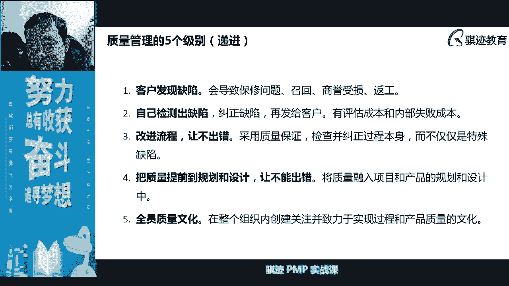

# PMP认证考试课程最新完整免费课程零基础一次通过项目管理PMP考试 - P22：PMBOK第六版 第八章项目质量管理-23 - 骐迹PMP - BV1Sb4y1f7Yt

好我们开始了啊，我们开始了，八点开始了，多讲一些实践的内容，ok我也想讲实践内容啊，我们开始了啊，想让老师把话筒给嗯，我想说让你把话筒拿过来，把我的小话筒拿过来好，那么我们正式开始。

今天的有人喜欢讲实践的人，只要理论看不懂啊对啊，就有同学说啊，你上来就就三个子过程，然后又看不懂，那就说明什么东西啊，它简单啊，他精妙，但是并不代表这个东西简单啊，对吧好，那我们正式开始质量啊。

项目的质量管理是我们在项目的知识领域当中，之后是范进程之后，第一个讲的范进程之外，支持用于支持范进程的啊，今天有个同学问我，什么叫三重约束，就范围进度成本，我我喜欢叫它三个项目的三个要素。

最大的三个要素就是范围进度成本对吧，之外去支持范围进度成本的一个一个章节，一个章节，它呢和范围有关，和成本有关啊，和进度呢关系没有那么大，但是也可能会影响到进度啊，但是最主要是影响范围和成本。

只有前几章视频，我等等等到没有找到今天的日期，只有前几章的视频，ok啊啊好，那么我们开始啊，那么项目的质量管理质量是什么概念呢，质量是一种对于项目的在理，传统理论，认为是对于项目的可交付成果的。

一种恒定的标准衡量的标准，一种标准，项目的质质量好坏呢，直接会影响到我们最终可交付成果的一个，交出去的，给用户带来的价值，带来的满意度啊等等一些一些一系列的结果，所以质量很关注的东西。

一个是一个一个结果，就是说用户的满意程度和，为用户能够创造什么样的价值，这是质量的最原始的最初啊，最朴素的一个定义，应该一个定义啊，质量，那么质量当中呢，其实我们又在后面的管理当中呢。

我们分为项目质量和产品质量啊，这个稍微有点甜啊，其实在篇博客第六版当中已经不提项目质量了，啊啊ok啊，注意注意啊，我们在这一章当中就可以看出这个ppt，因为不是我写的，我后来帮他们改了一下。

但是我没有把东西删掉，我只往里面加了一点，所以这我们的这节课当中会内容比较丰富，会第五第六一起学，然后呢第五章学一学其实没有坏处，如果你们以后考软考的，软考是以第五篇博客第五版为基础的啊。

然后再告诉你们个事情啊，pm快出第七版了啊，我原来说不会马上改版好了，我被打脸了啊，巨巨巨，有人告诉我，他说屏幕和第七版改版了啊，这样直接就出第几版，我觉得第五版还有还有很多小错误要修订了。

他们直接就出第七版了，ok啊我们暂且讨论这个事情，不是今天的话题，所以项目当中呢，我们在第六版当中已经不强调项目质量，但是你们你要知道什么，如果项目整个项目的管理质量的低下呢，就会导致什么啊。

超负荷工作，利润下降，风险增加，不知道这些东西，但这个概念呢现在第六版就不强调了，所以你不用看产品质量，你要知道啊，产品质量呢不能如果达不到的话，就不能够满足我们的内部验收对吧，我们在控制质量当中。

会有个有个环节叫做内部验收对吧，然后呢变成在内部验收的基础上才能进行什么，外部验收，就是确认范围对吧，我们学过的啊啊这是质量，那么首先要看一下东西质量到底是什么，那么质量在pm博客当中定义的。

第六版当中定义的是是一系列内在特性，满足需求的程度啊，ok啊如果大家学过艾特的话，我也是艾特老师对吧，如果大家学过艾特的话，就知道啊，呃一个一个像服务的价值取决于两个方面啊，组成一个叫做用途。

一个叫做保障，一个叫做utility，一个叫warranty啊，英文叫utility和warranty啊，我把你打在公屏上，ut 6 t，utility和warranty啊，那么质量就代表的是后面一个。

实际上主要代表的定义是后面一个叫warranty，warranty啊，保证就是能够满足要求的这个保证保证啊，那么与质量相对应的，我们在pp当中会有一个概念啊，叫做等级等级，要说满足啊，用途相同。

但是技术特性不同的等级分类啊，这个什么意思呢，就是说就好比说什么一部qq也是一部汽车对吧，啊，我们后面会有图演讲啊，一部qq也是一部汽车对吧，然后一部啊这是什么车，我也不知道什么车啊。

也只是原来ppt也不如汽车对吧，一部啊玛莎拉蒂也是五汽车对吧，他们都是汽车，但等级肯定不一样，等级就是等级越高，能够实现了高级的特性和功能就越多，但是他们总体上的满足特性要求是一样的。

汽车就是为了载人去运行对吧，他得用附加这些功能可能不一样，所以等级更多的是这样一种体现，那质量呢就体现出什么能不能满足要求对吧，不要一个自行车这里的啊，前车轱辘这里断掉了，然后他就不能够骑行了对吧。

他能不能满足基本的保证，warranty就没有了对吧好，所以是所以是这样这样两个特性啊，这样两个特性，所以一开始当中我们在接触到质量当中，我们讲一个项目当中，项目经理和项目管理团队呢。

要负责恰当的等级和质量，那么为什么要负责恰当等级奖项水平呢，是因为用户会提出要求，但是用户很有可能不专业，而且极有可能不是专业的，那他不是专业情况下，他提不出，他是没有办法提出对质量提出专业的标准的。

所以也专业的要求的，那么当然也和成本啊和范围有关，所以应该由项目经理来作为这样，质量的一个制定人，质量和等级的一个制定人啊，真的，那么这里呢就会有一个啊，有一个大脑的思考的辨析啊，会很有意思啊。

这个这节课开始有很多大脑，那么你们在公屏上给我提一下，首先有哪些产品是等级不高，但是质量很高的，有哪些产品是等级不高但是质量很高的啊，有没有人在公屏上打一个给我看看啊，举个例子。

有哪些产品呢功能非常简单，或者是看起来有点low的，但是呢它质量意外的很好，有很多产品都是这样啊啊ok啊，每届每届教的学生里面都会提到一个东西，叫诺基亚永久自行车矿泉水，对吧啊ok对，小时候用的血压高。

白血压高对吧，轴承轴承轴承就不一定了对吧，高端轴承和低端成人，日系车也不一定就等级不高呀对吧，你要知道加价之王对吧，加价之王呃，那个那个叫什么来着啊，雷克萨斯的那个什么啊。

200l m要加价80几万才能提车对吧，大宝ok啊，对这些同学们提的这些都挺好的，这些都是什么呢，看上去挺low的，或者看上去呢呃挺简单的，但是呢它的质量意外就很好，风油精哈哈啊也行啊也行吧对好。

那么同学们来了，我们生活在反过来说，我们生活中有哪些东西是质量不高，但是等级很高，然而它不是问题产品的，有没有例子，ok啊，呃gucci的鞋子，哈哈你怎么能不说普拉达的鞋子了，哈哈哈哈哈啊。

是不是很有眼，很应景啊对吧，拼多多，呵呵ok啊ok啊，拼多多长的很多产品是质量也不高，等级也不高，但是人家便宜对吧啊，人家不这不是等级啊，阿玛尼，香奶奶啊，灭火器灭火器为什么质量不高啊啊ok啊。

ok大家这些说的都很对，所以大家对这个东西的理解，基本上就是这样就可以了，对大家能理解这些东西就可以了啊，我给你们举个例子，可以思啊，人类社会当中啊，有哪个哪些东西的质量是典型的质量质量不高。

但等级很高，但是人还一直在用，还只能用的呢啊可呃叫做火箭，你们知道吧，航天火箭，航天火箭是典型的一个产品，就是说它的质量不高的，因为它作为一种交通工具，它的失败率实在太高了，对吧啊。

人类历史上最成功的航天火箭，在长期使用当中都会有发射，失败的，都会有发射，没有100%的啊，真达不到99。9%几啊，99999啊，我们六七个马都完全做不到的，因为这个东西太复杂，要进入太空太复杂。

但它工程等级很好，可以把我们人送入太空对吧，可以把东西放到指定的轨道上去，它的等级其实是很高的，但是呢它的质量量不高啊，但是呢人类别无选择，因为这是人类科技的极限对吧，呃我有啊，ok啊。

刚才有点好像我的诶，我的等会我看一下我的直播间里面，为什么我的直播间好像有点卡吗，我自己看自己有点卡啊，ok啊，那么我继续说，如果你们如果你们听得见我说话，然后不卡的话，请把啊，ok就不用打字啊。

就可以，如果你没有卡的话，直播间里给我说一下，或者在微信群里给我说一下啊，这是质量和等级的概念，你们明白这个概念就行了啊，反正记住项目经理和项目管理团队负责，可适量的适当的等级和质量。

因为提到这个东西之后，就提到这样我们讲质量越高，等级越高肯定成本越高对吧，那么说我们之前其实也讲过啊，什么叫做镀金，什么叫做范围蔓延，我们讲镀金是啊乙方的团队，项目管理，项目团队主动为了讨好客户。

主动给客户做额外的东西，那么在质量上呢，它这个体现为主动给客户更好的质量的，质量的产品，或者超出用户期望的质量的产品，还有一个东西概念叫做范围蔓延，是指什么，客户要求你啊，给客户做额外的东西。

这两项事情的共同特点都是都不走变更流程，没有经过正式的变更啊，啊偏方认为这些都是这些都是不好的啊，所以质量和镀金呢是有关的啊，不恰当的，过高的质量标准是一种镀金啊，这是p m i所反对的，反对的，那么。

为什么要讲这个呢，因为讲到这里呢，我又会讲到一个例子，还有一次例子，这个例子啊，刚才那位卡了一下，刚才卡了对吧，ok啊好，那么我想了个什么例子呢，这是我经常举例的例子，但是确实也很恰当啊，那么我问你们。

如果你们要买一只锅子，比如说买一只锅子，你们期望这只锅子的使用寿命多久，如果你们要买只锅子，你们期望使用寿命多久，3年5年永远啊，有些同学有点心黑啊，有些点心黑啊，好那么，还要永远一辈子，什么子。

哈哈啊，同学啊，什么马冬梅又来了对吧，买买一只锅子呀，炒菜用的锅子刷刷刷炒菜的锅子，对吧啊，3~5年10年对吧，ok啊，但是现实当中大家会看到啊，有些做做锅子的品牌啊，我就不说了，免得有人说说啊。

免得也免得说做广告啊，锅子其实是没有用一辈子啊，你无论什么锅子都不可能用一杯，他总会坏的那一天，因为他他他要承受卓少的那种硬币啊，什么东西的啊，然后总归会有坏的一天的啊，当然当然可以很久。

你会看到外面上很多高端品牌做锅子，它的使用使用，使用寿命会远远超出我们大部分人讲了，那么这个东西算不算是镀金呢，章丘铁锅传三代，那个说说的那个说说的长久地高山赛再说说，ok啊好。

那么你们会想一想这个问题，那酸不酸镀金呢，那为什么你要想想为什么啊，为什么他算镀金，或者为什么不算他镀金啊，等会我们在后面的内容在深入当中，就会你们就会逐渐的用理论去解释，为什么有些东西算多金不算多经。

它是有道理的啊，他是有道理的，为什么不算呢，有道理量，那么你要告诉我理由哎，我们要用理论的理由来说，我们要理论理由告诉我，这个东西为什么要算租金啊，好这节课呢我会比较多的跟你们互动啊，会讲东西啊。

所以这里先卖个关子啊，那么这个锅子到底算波兰镀金呢，我们后面在学完相应的理论之后呢，你们就可以去用理论解释，那么讲质量当中呢会有一个东西叫精确和准确，这个在pm pp的第五版当中呢。

强调过第六版的也不怎么强调啊，那么你可以理解一下，说大家看这个图就知道了啊，精确呢叫做什么东西呢，就是它的它的波动很小，你可以这么理解，准确呢就是它离我们设定的标准范围呢很接，很接近。

或者在标准方法里边，所以越准确，它越是在标准范围内，但标准范围当中，如果它相彼此之间差异过大呢，它也不叫精确，所以精确和准确是这样的概念，ok啊明白了吧，好，那么属性变量属性啊，抽奖属性变量啊。

那么什么叫属性抽样和变量抽样呢，就是说我们在检测质量当中呢，会有这样一个概念，就是说我们对于某一个属性来进行抽样，那么抽样呢就是用这种抽象概念对吧，打靶的那个把的环数就是一种抽样的方式。

结果啊这个呢了解消息，了解消息，有时候呢它的属性并不是什么啊，并不是按照那个来的好，按照这个数值来的，有时候看按照性质来合格还是不合格对吧，有些是有些是按照什么，有些但是在极限之内还是在极限之外啊。

会有这样的各种各样的区别好，所以会有控制线和公差线，ok啊这个东西大家后面在学的时候知道啊，这个这张图就是火，我们后面会学的叫控制图啊，我们在学控制图的时候自然就会学到了，所以这里不用不用特别去学啊。

不用特别去学考试呢，但是要记住特性就行了啊，好那么我们接着往后讲，质量当中呢会有一些成本，会有一些成本啊，质量当中分为这几类，成本其实分为四类成本啊，就是看啊分为预测成，预防成本，评估成本。

内部失败成本和外部失败成本，它又分为一致性成本和非一致性成本，那么首先你要记住一点啊，我们就不卖关子，有些什么不要记住一点啊，今天鼻子有点不舒服啊，sorry一致性成本技术都是好的，成本都是好的什么。

所以如果要花钱，必须要在质量上花钱的话，尽可能的花在一致性成本上总是好的，总是好的，只要没有达到那个盈亏平衡点之前，一次性成本花的越多越好，达到之后怎么办呢，啊不一定不知道啊，我们要到时候再具体看啊。

我们会举一个还有一次例子，那么不一执行成本的，你们应该这么记住，不应执行成本的，它是不好的，但是有时候极难完全避免，我们尽可能的去避免，这叫不一致性成分啊，这是质量桩成本，那么质量当中成本大家会看到啊。

成本它它到不同的成本是发生在不同的阶段的，我们在这里讲其实也无所谓，和后面讲也可以啊，那么它分为四种，第一种叫做预防成本，就是什么事情还没有开始做，我们在事情做之前，为了避免发生质量问题。

或者要让质量达到我们的要求所花的成本，这种成本其实是做在事前的，是最好的啊，是最好的，因为什么我们要建立一个，上来就要建立一个现代的质量观念，现在的质量观念是什么，质量观念呢。

质量是一个永远坐在事前比坐在事后好的东西，对吧啊，我们举个例子来说，比如说你要生小孩，你生小孩之前是不是要比如说要备孕对吧，然后呢你要什么戒烟戒酒，男生啊，男性要戒烟戒酒对吧啊。

女性呢要比如说刺激性的东西不要吃对吧，然后呢孩子啊，然后呢吃叶酸两期望孩子生的好一点，这叫做什么，这叫做预防成本，对吧啊啊然后但是你孩子生下来之后，比如说你孩子里面有什么身体缺陷啊，我的发育迟缓啊。

然后你再去补救，无论怎么补救，一成本很高，第二你总不能达到满意结果啊，所以如果你爸是很生孩子，这件事情看作是一个产品项目的交付成果的话，那他永远是坐在事前比坐在事后好，事情永远哪怕钱花了多。

永远会让你觉得什么物有所值，在花了之后，只要有失败成本发生，那么对你来说永远是会存在遗憾的，对不对，这就叫做质量成本，花在前面永远比花在后面好，所以预防成本总是最好的，记住一点啊，预防成本总是最好的。

如果能够花预防成本来避免其他成本，这个这个花费永远是值得的啊，记住这点，啊视频卡壳了吗，啊生命没有卡啊，卡了吗，看看我这里，我这里是正常啊，现在没有卡啊，好那么这是这是质量。

那么质量当中还有第二种成本呢，叫评估成本，评估成本用于评估的测试，那这部分成本要注意什么，第一他那也是好的，肯定也是好的，它是用于评价质量，告诉我们当前质量的状态，它有可能是最终生产出来之后可交付的。

也有可能是生产过程中的一些评估啊，所以评估成本会发生在我们后面，讲的叫管理质量当中，也可以发生在我们后面讲的叫控制质量当中，都有可能会发生啊，但是预防成本只会发生在管理成本当中，这要注意啊。

预防成本只会发生在管理质量当中啊，硬盘当中，而评估成本呢两个都会发生，因为你会有过程检测和结果检测，对不对啊，但是做检测总也不是坏事情对吧，做检测总也不是坏事情，它用于帮助你确定我们的质量的一种状态。

但是这里又来了，接下来继续纠正观念，有一个观念就是做p p当中，一定要消除一些固有思维惯性，就是什么检测做的再多，并不会改变可交付物的结果和属性啊，就像你怀疑你的娃不是你亲生的，你去做亲子鉴定。

做一遍和做100遍都是一样的结果啊，当然是正规机构啊，啊正规机构啊，这正正啊正式的检测方法啊，不会有任何的意外，只是反复告诉你这件事情是什么状态，你做的越多越能确信，对不对啊。

亲子鉴定方面不会直接跟你说啊，你和你的孩子有没有血缘关系，他会告诉你说，你和你孩子的血缘关系的可能性是百分之多少，多少多少，一般来说它只有一个什么99。9%几，是你的孩子，或者跟你有血缘关系。

或者是99。9%几是是吧，和你没有血缘关系，一般是这么结果啊，那么为什么老师知道这么清楚呢，是因为老师研究过，老师没有去做过啊，你放心啊，我不用，我没有这种担心，还有我说是什么呢。

就是说生完孩子后记得及时去报户口啊，超过一定时间不报户口的话，再去报户口，要要凭亲子鉴定证明才能报啊，哈哈哈啊，就是提个意思啊，告诉你告诉你们这样一件事情，所以质量呢是预防和规划出来啊。

有位同学里面很少啊，主质量是质量是生产出来的，这个理念已经可以，但是不对啊，质量是规划出来的，从规划开始啊，规划开始检测是告诉你状态的，检测出来问题，是帮助你在今后的生产当中做改进用的啊。

或者是在生产过程当中帮助你实时确定的状态，进行及时的过程纠正啊，明白这个意思吧，好这是两种成本，但是这两种成本总是好的对吧，花的总是好的，有意义的，但是后面两种成本呢我们尽力避免。

因为发生了这个是没有对你没有好处，只有坏处，但是你又不得不去做的，比如说我们在内部当中发生失败成本，比如说我们在内部检测还没有交付给用户，还没有被用户发现的时候呢，我们发现这有质量问题了。

这种就是一种不好的质量成本啊，那么这种叫做内部的失败成本，还有一种叫外部失败成本，叫被客户发现，只要被客户发现，就算外部的失败成本啊，那么如果被客户发现，报废补救等等这些额外的花费。

还要损失客户的信任对吧，损失客户的满意度，失去商机，失去市场份额这些事情啊，一来来一系列变化啊，有些东西，所以说质量是规划出来是对的啊，我还没来得及讲，你们已经学的不错了啊，好这个概念要有。

那么最不好的成本是外部失败成本，我们在管理当中，一个质量管理爱好当中，我们说应该是杜绝外部失败成本的，但实践当中极难极难完全避免外部失败者们，但是我们可以把它无限趋近于零，在有一些项目当中，我们会什么。

难以在一段时间内难以避免内部室外成本，比如说很多的产品，很多产品在生产过程中一开始是什么，要进行爬坡，要进行不断的调试，它的生产过程中肯定会有大量的次品产生，对吧，这是很正常的。

这个时候内部市场成本是有时候是不可避免的，或者难以避免，但是我们要压缩到最小，当我们的一切都成熟之后，也应该和外部失败成什么样，应该无限趋近于零，是这样的感觉啊，好这个不知道大家听明白了没有。

懂得是老师懂得事多，懂得不多，怎么能当你们老师呢，对吧好，那么接下来接下来我问你们个问题啊，又没有问题，如果你有一样产品尚未交付给客户，但是呢客户在拜访你的工厂期间呢，偶然发现了产品上有瑕疵。

请问这是内部失败成本还是外部失败成本，请在公屏上告诉我，有的同学说啊，项目中发现和检测中发现怎么区别，就是说一个是生产最终可交付成果，最终被生产出来之前发现，一个是最终生产出来之后发现啊，他是这样。

啊很好啊，很多同学说了内部，很多同学说外部ok啊，那么你们要记住啊，这个这个例子当中是外部失败成本，因为被客户发现了，又被客户发现了好客户关系，所以它是外部失败，什么好，这个沿着这个例子继续说。

你们能理解吧，不管在哪里，不管在什么状态下，只要被客户发现了都算，因为你可你可以跟客户说啊，我这个东西没有交付给你，所以这个不算，等我交付给你再说，那么客户会对你也会对你产生怀疑和不满啊，有可能啊。

所以这不是内部失败成本，这是外部失败成本，记住只要被客户发现了，不但不论在哪个场合都算外部失败成本啊，卧槽我不明白了吗，下场监制啊，对好，有些东西就明白了对吧，所以很多工厂，中国的很多代工厂啊。

他们的安保监控都很严密，一方面用来监控自己的职工，另一方面监控什么，万一有客户过来什么验厂的时候及时发现对吧，会有这样的事情，那么好了，那么这个例子继续说啊，然后你经过核实发现客户发现呢。

有次品的产品其实并不是为此客户生产，而是会另外一个客户生产的，请问这个失败成本是外部失败成本，还是内部失败成本，啊有位同学问，如果是自查发现的是内部完，自查发现就是内部自查发现就是内部。

无论是哪一步自查，只要没有叫被用客户发现之前，都算作内部是完成本啊，ok都算啊，好那么我们继续来啊，好我们刚才题目再重复一遍啊，如果你合适的时候，发现这个产品不是为此客户生产，是另外一个客户生产。

那么算不算外部失败成本呢，依然算老师，你这就不讲道理，老师你这个都不讲道理啊，又不是给你生产的，为什么你说呢，因为我们讲我们最终是以什么成本，是以体现在最后付不出代价的，如果你的客户，你会实践想一下。

如果你的客户当中，比如说突击了你的生产现场检查，发现你的生产现场当中有有有明显的次品，虽然这个次品不是卖给此客户的，那么他心里也会想，会不会也有可能什么，以后也有相同类型的视频产生卖给我了呢。

有没有这种可能，对不对，所以也会对用户的信任造成损失，这是一种无形损失，虽然不会马上变成线啊，变成金钱损失，但是这也是一种损失，所以它也是一种失败成本，只要被客户发现就算啊，对有些有些太卡啦。

ok啊我我让我跟技术沟通一下啊，稍你们稍等，我也觉得有点啊。

ok我跟技术沟通一下，好同学们好，我来看一下，我来开个拼啊。

啊我这里网网络貌似还是可以的啊，虽然波动拼的波动有点大啊，但是还是可以的啊，大家可以看到这个延迟就是一个典型的什么，这个延迟就典型的就是一个什么是准确，但不精确看到吗，它的延迟是在我们的。

我们呢能够承受的范围内的，但是呢上下偏离有点多，数值的相互偏离有点多啊，它是要准确不精确啊，可能是略微有点问题，ok啊那么我们大家克服一下，克服一下，时不时有点对吧，也就是说只要客户发现是我不管是客户。

当时群啊，对所以记住一点就是其实是这样的，只要你的存在质量问题的产品被客户发现了，不管是在哪里发现的，不管客户发现的是不是为客户生产的，都有可能造成成本，这些成本都是外部失败成本啊。

因为有可能的话是你损失的是什么啊，损失商机，损失的是产品责任，更有可能损失的是吧，客户的信任，市场满意度对吧，客户满意度，是这样的情况好，这就是质量概念，所以我们讲了质量的概念当中，我们希望什么。

既然如果质量管理质量肯定得花钱啊，有一个概念就是换标签对吧，怎么了，那么有一个概念就是这样，如质量是一定要花钱的，不花钱搞质量是搞不好的，记住这一点啊，第二那么既然要花质量成本。

那么质量成本越往前面滑越好，越往预防成本化越好，越往评价成本化越好啊，越少花在内部失败成本和外部失败成本越好，那么这些预防成本评估成本，内部失败成本，外部失败，所有这些成本加起来。

就是我们的什么质量的总成本，质量总成本嗯，但是我们之前学过我们的呃项目的呃呃呃，成本管理对吧，项目成本管理当中，并没有单独说我们的质量成本这一块，那么它的体现在哪里呢。

我们讲无论是预防的成本和评估的成本，都是发生在什么，发生在我们的质量活动当中，我们都会在质量当中呢，的一些质量活动啊，质量活动，质量，这些质量活动呢，会被穿插在我们的活动的一些路径上啊。

我们的关键路径那些路径网络图，我们的甘特图里面啊，各种各样图里面，然后呢这些活动是会发生活动成本，所以活动当中的活动成本，有时候并不用于什么去制造某些东西，有可能是什么用于质量。

进行质量管理和质量控制时产生的一些成分，也是会有发展，但是这些也是活动成本对吧好，那么这个其实也牵扯到我们我们之前讲的，我们的管理活动当中，很多的活动拆解出来之后，并不会直接说就拿这些工作做判断。

因为还要把质量活动插进去对吧，但是呢他可能会插在一些活动当中进行编排啊，有些质量活动呢会属于某个工作啊，我一个产品，比如说我一个齿轮，我要生产一个齿轮，但是这个齿轮呢我们生产质量。

一定要对它进行质量检测对吧，但是也有些质量活动，也可能有啊，好那么这就是我们项目当中的质量成本啊，记住这是总的，那么我们会发现什么特点，还有一个发现什么特点，就是质量当中。

我们如果把预防成本和评估成本多花一点，是不是有可能是不是有可能只是说有可能啊，管理的好的话是一定管理不好，是有可能能降低失败成本和内部，失败成本和外部失败成本，也就是说多花一致性。

或者说多花一致性成本可以降低，不宜进行成本，那么有没有可能质量的总成本是会下降的，答案是可以的啊，这点要记住啊，比如说质量当中我们多花钱并不意味着什么，多花钱并不意味着成本提高，相反在某些阶段。

我们多花钱反而可能导致成本降低，因为我们可以避免视频，避免啊客户发现退货，这些东西反而有可能会降低成本，对吧啊这样有这两个概念啊，好那么我们继续往下讲，这是质量的成本，质量成本当中。

我们在质量生产过程当中，为预防不合格啊，不合不符合要求的成本而产生的这些东西对吧，这是质量成本，好我们我们讲质量成本再分为一致性成本，非一致性成本对吧，一是预防成本啊，是规划成本，培训成本啊。

标准化成本，选择做适应成本，检测啊，那么说到破坏性测试呢，这里又有一个啊，又有一个很有意思啊，叫什么叫做破坏性测试，比如说你老婆啊，我们举个有意思的例子啊，调动一下，调动一下大家的想法，比如说你老婆啊。

比如说你老公或者你男朋友，女朋友就跟你说，要求你给他买，要求你给他买一只苹果啊，两只对吧，也有单只装的，也有特别大的对吧，一般来说两只三只小一点，小苹果嘛，四五只，比如说你买一斤，买一斤小苹果。

然后你买了之后呢，担心这个苹果酸，他吃的不开心，那你怎么办呢，你每个苹果咬一口，那么每个苹果被咬一口了之后，那么这个苹果是不是就被咬过了，那么被咬过的苹果就你检定啊都是甜的，那么这个鉴定过程产生的损失。

是不是破坏性测试，应该是湿的对吧啊，所以这是破坏性测试，那么如果这些苹果都被咬过之后，给你老婆老公男朋友，女朋友去吃，她不愿意吃，那么怎么样去挽回这个损，破坏性测试造成的损失呢。

已经iphone 12啊，同学如果你咬得到iphone 12的话，牙口还是不错的啊，啊看自己吃重新买嗯，自己吃试毒的感觉对吧，自己吃重新买啊，啊ok啊ok啊，那所以从我们的群里面可以看到啊。

我们有很多同学的思维啊，还不够开拓对吧，那么已经知道他不愿意吃你咬过的，已经咬过的苹果对吧，切成块不让发现啊，这个也是不对，这是欺骗客户对吧，这是切苹果，那很简单呀，你咬过以后怎么办呢。

你把这些苹果榨汁变成苹果汁不就行了吗，对不对对吧，吃掉切下啊，吃掉了切下来啊，那么你一次吃不了那么多的呀，苹果你不可能一天都吃完对吧，你可以把苹果榨成苹果汁啊对吧，就可以避免损失了吗，对不对啊。

所以你知道为什么有些同学，比如说在大学里学，学校里学的时候，你们知道为什么大学里有时候什么会卖什么，有啊油炸馄饨啊，油炸饺子啊，这些馄饨饺子就是卖不掉的，学校里本来要报废了。

他往里油里炸一炸再卖给你们对吧，ok啊，这本来是啊，剩下的由已经从合格的质量变成不合格质量，然后他通过重新加工变成又变成合格质量了啊，ok啊ok啊，这是讲一个讲一个段子啊。

所以我们很多时候在做事情的时候呢，要开拓思路，明白要开拓思路，榨汁又奇怪，啥区别，同学让你一口75只苹果，你吃得下吗，你吃不下，放的久了，是不是这个苹果要生锈啊，要变味啊，对不对，榨汁的话。

你和你和你的男朋友，女朋友老公老婆喝一喝一下就喝完了，ok啊这我只是讲个故事啊，给你给你们开拓一下思路啊，所以错作为一个项目经理，处理很多事情的时候要有开拓性思维对吧，ok啊好，那么质量成本。

我们前面质量成本这些当中，内容就都已经讲过了对吧，然后大家可以在p站也可以看一下啊，那么这张p p t要注意啊，这张p p t要这个上面的概念都是要记住，并且背出来的啊，最好能背上，不背出来的话。

严格记住就行了啊，好那么质量当中我们分为考试当中，也会问到，分为传统的质量观点和现代的质量观点，我们传统的质量观点，和现在正好是一一对应的啊，所以我们一个一看传统的质量，认为质量是检测出来的。

这个其实隐含了什么意思啊，质量是一个事后的事情，现在的质量认为质量是靠规划出来不行，现在的质量观点认为质量是一个事前的事情，只有事前管理才是有效的，传统的质量认为是质量是一个事后的事情啊。

好这是第一个能明白吗，这个很重要，明白的同学请把明白两个字打在公屏上啊，这个这个是很重要的事情啊，考试的时候，如果你不能不能正确的理解这两个观点，如果你不能理解这两个观点的话，那么你考试很容易选错啊。

一定要把这个概念深入进去，ok啊稍等ok同学们稍等啊，我有点事情离开一下啊啊直播暂停暂停几秒钟。

啊同学们，不好意思，非常不好意思啊，我有点有点急事有点急事啊，我回来了，不好意思哦，家里人有点不舒服，然后去处理一下，紧急处理一下啊，浪费了大家一点点宝贵的时间啊，等会我会补偿你们的，好。

我结束之后给你们唱首歌，好吧好，我们继续讲，不好意思啊，好我们讲质量，质量当中，我们讲有现在的传统质量观点啊，这个事情啊，啊有人有人骂我吗，老老婆拉去跪键盘了，广告之后更精彩，老师有事去了，不好意思啊。

我家里有人啊，我老婆好像有点身体不舒服，有点痛，然后有点有点难受，我去稍微稍微照顾一下，两分钟了，我回来了，可以了吧啊好，那么我们继续讲，我们前面讲到传统的质量观点和现在质量观点。

但是考试的时候一定要记住一点啊，我刚才离开之前，中段离开之前有有点特别有点急事，然后我强调了一下，回来再强调一下，考试的时候一定要记住一点质量，现在的质量观点是一个事前的事情，永远坐在前面好。

所以千万不要认为质量就是检查啊，千万不要认为是质量是检查，你现在梳理一个观点，质量是一种规划，质上是一种规划和管理，而不是一种检查，检查是一种手段，明白没有啊，明白没有，这个非常重要非常重要啊。

质量是一种手段，是用来让你确保能够交出符合要求的，可交付成果的一种呃，手段是检查，但是质量是通过规划的方式去预先定义，和规划和控制的方式去进行啊，输出可交付正确的可交付物的啊，这个观念一定要正确。

否则你的考试当中，你会不自觉的把传统观念带偏啊，所以我们后面会讲讲到这时你会知道的，比如质量指的是产品质量啊，产品质量传统就是传统观念，单单指我们的物理商品的质量，现在质量观点成为质量，这个什么意思呢。

就是质量这个东西，交付给用户的过程，交费用是吧，所以我们讲一个项目，并不是说从确认范围，我们之前范围里面学过确认范围，就是说我们东西被客户验收了，项目就成功了，而是说一定要我们的可交付成果。

我们生产出来的东西，可交付成果一定要交付到用户的现场当中去，让它在用户的生产现场或者使用现场，开始正确的使用，为用户创造价值了，它才能够算是什么完成，才能算是最终交付项目才能结束，那么质量也一样。

质量定义在当中，我们什么样的东西是合格的质量，这不仅仅是用户能够验收通过的，而且是要能够在用户的使用线上，生产线上开始为用户创造价值了，他才能说是质量合格，明白这意思吧。

交付的过程也是一个质量的提现过程啊，这个是很重要的概念，好这个不知道大家明白，这个是很重要，所以西方现在有一个理论观点认为，当然现在中国也越来越多人认可一件事情。

就是everything is service，任何一样东西都是还有服务的，对不对，还还有交付的过程，那么质量当中还有一个概念是什么，质量当中我们认为质量使缺陷是不可避免的啊，只是传统认为啊。

只要缺陷不可免疫，实际当中呢确实缺陷是不可能100%避免，但是现在的质量，我认为事情一次性做对是成本最低的方式，这种方式下我们认为是零缺陷，缺陷不能所谓的零缺陷，并不是说缺陷完全没有是零。

而是说它无限趋近于零，是一个正确的做事方式啊，所以当我们知道正确方式的时候，我们努力把它无限的去趋向于零，只要在合理成本合理的情况下，无限趋向于零，是成本最低的，而传统认为质量是不可避免之后呢。

我们不会把它趋向于零，这个时候呢很多事情不可避免事情就发生了啊，所以这是传统的质量观念，和现代质量观念不一样，接下来说质量管理师，质量部门责任啊，这个是很多人固有的概念，好产品有质量问题。

那么项目经理直接找质量质量团队，这个是不对的啊，质量管理人人有责啊，所以这个和结合起来看，质量管理人有责，但是质量管理呢，一个项目当中，所以一个项目的整体上如果有整体的质量责任。

那么项目经理要承担85%，但是人人有责，人人有责啊，这感觉知道吧啊然后呢质量呢是越高越好，一个叫质量就是越高越好，然后呢这是传统质量观念对吧，质量总归是越高越好，那么越高越好的质量就意味着什么。

质量其实是什么啊，不一定是符合什么，符合成本收益考虑的，所以质量的现代管理人为什么要符合用户要求，达到一个用户满意，成本收益适用等等一个平衡点，平衡点啊好那么在这个方面呢又讲了啊。

所以质量当中会有很多的东西给你们讲，很有意思啊，就是说大家可能知道个例子啊，日本人呃，呃日本的家电现在已经不行了对吧，中国人已经打得满地找牙了啊，中国人当日本人，当年就是呃家电在中国销售的时候。

当年黄金的时代的时候，日本家电成为很多的家里的，肯定会有一样的电电器，日本家电电器对吧，日本家电电器就表现出一种很很明显的特点，就是说我约定这个东西，比如说可以用5年了，5年之内绝对不会坏，你要正常生。

绝对不会坏，他1~5年就坏，这是不是一种合格的，非常好的现代质量管理结果，是的啊，是的，那么你们有没有想过啊，你们有没有想过，为什么日本人做的家电1~5年就坏呢，请问你们你们有没见过啊，这个事情。

当时因为我们上网课就可能沟通的比较啊，成本比较高，成本高啊，我让你们稍微思考一下，还是我来打啊，就很有意思，你会发现什么，就是因为人，日本这个国家原来在承担这电子产品啊，电气产品这些生产的过程中。

消费产品，消费电电气产品就有生产过程中，他们这个国家形成了一个质量体系，不仅仅是呃我们所购买到的，比如说的什么索尼啊啊松下啊啊东芝啊，这些这些厂商他们会什么，他们他们会用一个现代质量管去管理。

他们的供应商，是正是他们供应商的供应商，也会用这种现代的质量去管理，就这么他们做出来的东西一定向你承诺，我能保证使用5年，如果我的产品最终向最终用户销售的时候，承诺5年，那他的所有产业链上。

所有的厂家都会去承诺保佑5年，但是呢日本人的嗯，它是在一些理念是什么，在保证情况下受到成本最低对吧，所以他可能尽可能让成本压到最低的情况下，要能保证5年，所以他的产品做出来。

每一个零部件都会它的标准的寿命值在5年，那么这个时候就来了，当它做成尽可能去靠近5年的时候，这么多部件组成一个日本家电之后，只要有任何一个比较关键的部件坏了，它可能家电就坏了。

所以每一个坏的可能性比如说都不高，比如说百分之啊，1%的概率是坏，但是一个家庭里面可能比如说在5年，正好到5年换，那么这么这么多电器，它可能所有的所有的产品加起来，可能概率就可能高达百分之好几十。

有可能到第5年，第6年就坏掉了啊，就是这样，所以这是一个表象，是日本当年的家电电器到了5年，比如说到了5年就换是一种表象，人们觉得啊小日本挺坏的啊，故意做成那种坏，让你去买。

其实你们没有看到的是他的背后，日本人现代质量管理深入到整个日本社会，当年的整个社会生产体系当中去，你们没看这一点，所以人家才能做出正好保5年，超过5年正好就能坏的产品，这是一种现代质量管理结果啊。

但反过来说，现代质量管理的很多的理论，都是从日本当年的制造业出来的啊，啊那那也是一面一面对吧好，所以我们要从现象去看本质，所以我高为什么讲这个过程有点想讲段子，但是你反过来看。

很多时候我们看到的现象背后，其实很多时候是有什么深刻道理的，本质本源在里面啊，不知道你们明白了没有啊，人家并不是说为了增加重新购买次数啊，重新购真的不是人，人家就是用用用一个什么。

现在的质量管理去管理东西啊，ok，好那么最后一个是质量要靠预防和评估，质量和检查和反攻啊对吧，一个就是事前一个时候啊，所以说穿了，你会看到现在的质量观念是怎么样的啊，总结起来就是什么依靠事前不依靠。

事后尽可能做到没有缺陷，人人有责，项目经理承担主要责任对吧，然后是质量要适用对吧，差不多就是这样观点与此相对应，就是传统观点，尤其在传统观念当中，我们在考试当中一定要避免什么东西呢。

然后一质量就要多检查对吧，第二质量就是质量部门的负责的事情，千万要排除这两点啊，千万要排除这两点，考试当中，比如说有一道题目，我问你们，比如说有题目啊，项目经理怀疑产品质量有重大缺陷，于是决定采取措施。

那么以下哪个措施不能使用啊，那么要提高产品质量，以下哪个措施不能使用啊，对所有的产品进行逐一核查，这个是不能够提高质量的，只能更加确定质量明白，如果有这道题目的话，这个选项就是错的。

但是很多人就会在这样，比如说假项目经理怀疑，只要有重大权限，想要提高质量，他应该怎么做，还要提高指什么，多检查呀，多检查啊，你就错了啊，这是以前考过的题目啊，题目我已经忘记了，但是那类似一次就是这样的。

知道吧，他就利用了你什么，脑子中还是传统认为要提高质量就多检查，多检查就能做出放心问题，对吧啊，这是错的啊，因为已经把有缺陷的东西生产出来，你再去检查与事无补啊，所以应该从头开始。

在规划和预防当中多投入成本，多优化流程啊，不知道大家明白了没有，ok啊，所以这个质量的责任，这一块当中的传统质量观点和现代质量观点啊，明白的同学请在公屏上打明白，没有明白的同学啊。

在公屏上打出你们不明白的点啊，我看你们一些反馈，啊没有关系啊，我我也很我也很坦诚，就是说大家有同学如果不明白的话，可以在公屏上告诉我，没有关系啊，或者说微信当中有些同学可能比较腼腆。

就公屏上大家都点明白，你打不明白，然后可能觉得很没面子的呀，没关系，你也可以单独跟我说，get up basically understand啊。

啊有位同学开english english微拉微拉古打对吧，我给你开的是咖喱英文对吧，微辣微辣，good，ok啊我们继续，那么这是质量的观点和质量责任啊，这个东西呢在考试当中经常会拿来。

在质量会拿来用来进行考考题目啊，非常有意思，现在没有，我就做题又懵了，没关系，你做题错两次，然后你就又明白了，没关系啊，过程的质量什么，可以啊，呃这位同学不太理解清楚啊，基本明白。

我跟妈现在不太理解清楚，反正你就只记住一点啊，那位叫伪音的同学啊，你知道如果你觉得没有理解，其实你就记住这一点，现在的质量观点认为是质量的成本，投入和管理的介入越早越好，越是前越好。

好的结果是自然而然的，在良好的控制当中产生的，传统的质量观点认为，质量是通过事后的补救，和事后的管理控制局产生的啊，那么很显然哪个更加先进一点对吧，然后传统质量观点认为，什么质量是质量部门责任的事情啊。

现在质量观点是质量是人人有责，每个人都是这个环境当中一环，但是呢项目经理承担主要责任，在项目当中，项目经理对项目的质量责任承担主要责任啊，是这样的观点，那么传统的质量认为什么质量就高越好。

现在的质量观点认为呢质量要适用就好，满足客户需求使用呃，有经济成本收益就好啊，ok好，这是传统的和现代质量观点，你可以再理解一下，如果还不懂的话，我们事后课后呢还可以跟跟我讨论一下啊，也可以。

我们群里讨论也可以好，那我们就继续，那么质量当中强调什么预防剩余检查对吧，预防剩余检查是什么，检查剩余次品对吧啊，这是我给你补充的啊，这个是肯定对的，预防剩余检查，检查剩余次品对吧。

但是不检查呢你可能不知道次品对吧啊，过程不知道怎啊，那么客户满意度啊，注意啊，客户满意度也是一个质量的体现啊，好这中间的class by jjon啊，close比juan这些东西呢，ok同学们啊。

你们有福了啊，然后close比juan马尔科姆布德里奇，然后是那个啊来了，ok啊这里啊啊juan的crosby啊，fire bomb，然后马尔克波多里奇对吧，然后还有田口玄一这些大师的质量理论。

在偏波和第六段当中都不考了啊，都不考了，ok啊放过你们，但是呢我会上课略微提一下，略微提一下啊，我会我会略微提一下，因为什么有些同学可能后面还是去学，然后去给你们打个基础对吧，略题。

而且这些东西呢概念呢其实是用了呃，粗略的概念其实对你们是比较有启发的，但考试技术不好，所以这个p p t呢是旧了旧了，我给他，我会给他指出啊，只有代名的p d c a是考的啊，p d c a是考的。

其他的都不考了啊，好那么我给你们介绍一下啊，首先在现在的质量管理提出来之后呢，就是有很多大师提出自己对质量的不同观点，他们从他们从自己的角度呢去阐述的，质量是应该怎么样去管理的。

朱然提出了什么叫朱兰三部曲，或者叫质量管理三元论，那么比如策划控制和改进，主要认为一个一点啊，你们大致知道一点，完成的，质量应该是在市场的检验当中逐步去提高的，所以主板这个理论是适合工业时代。

它是什么呢，我生产一样东西，我不断的拿到市场上去检验，通过一个一个的循环之后，在市场检验的过程当中去提高质量啊，市场对我的质量的要求的改变，会促使我内部流程的质量不断提高啊。

所以朱院士体重适合使用就是什么，适合市场使用啊，是不是，所以质量也不是说质量无限提高了，质量也是说如果你投向市场的产品，如果质量过高了，我甚至以后的生产当中会把质量降低，降低到恰好符合用户的适用的诉求。

那就够了，这是周量提出来代名啊，p dc大家都知道对吧，ok啊，同学们不翻书，请告诉我pdc是什么意思啊，啊那我来告诉你们好的，我来告诉你们我们节省点时间啊，我来告诉你们pdc什么意思。

pdc就是plan delay cancel apology，哈哈哈啊，计划延迟取消道歉啊，pdc ok啊，这是后人编的段子啊，啊pd c其实就是plan，do you check和act啊。

就是计划的执行啊，检查和整改啊，执行计划检查整改啊，dm待命，当年为什么p d c a后来被发扬的这么光大呢，是因为代明当年呢去日本指导日本的生产，然后呢在日本生产当中呢，正好赶上日本的。

就是说啊制造业的那个繁荣大爆发时期，所以他的p t t很有效的解决了日本产品，在进入欧美市场当中所遭受的歧视和质疑啊，就像当年中国人生产的东西，都被西方认为是质量伪劣啊，这些东西啊，我去啊欧啊。

西方人欧洲人老双标了，你知道吧，当年当年一开始的之后，德国人当年制造业兴起的时候，也说德国或者垃圾货，你知道吧，英国人法国人都认为德国或是垃圾货啊，都是他们都是这样的啊，他们都是这样。

所以呢呃朱兰帮助日本人呢，提高了日本产品的成人品质，然后呢，一定程度上，其实也创，也保证了日本的当年制造业的繁荣过程，对经营商，对质量这一块很多肯定是精益生产对吧，这个肯定逃不开令是逃不开的嘛，对吧啊。

ok然后，所以就是说带明被提到特别高的一个位置啊，但其实代明的啊啊叫他们叫戴明环，其实这个pdc cycle p tc环呢是修哈特提出的，叫或者叫翻译叫修华特提出的啊，修哈特提出的。

然后呢带明经过修改和进行光大光大的啊，好那么这是这是代名了，然后呢还有一些过程改进的理论，比如说马尔科波啊，马尔科姆波多里去啊，全面质量理论叫fire bomb的好，马尔科夫啊，万波多里奇的啊。

这些理论，那么crosby呢提出了一个什么叫零缺陷，所以零缺陷我们当中这里提的零缺陷呢是crossy，第一次提出来，就是什么是领缺性呢，就一次性把东西做对，这个是成本是最低的，是免费的。

所以crossy其实带领的啊，就是说质量向更强往前面走，closp的概念就提出了，质量应该是在规划和策划和预防当中就去做，是成本最低的，之后的质量呢是免费提供给你的一个奖，励，给你一个正确结果。

这是closb的基本思想，所以cross bees样也很也很好啊，然后呢但是实践当中呢啊，又有其他的大使呢提出一些其他理论，比如说这里没有写的啊，这这个ppt不知道为什么啊，又漏了一个。

当然我也我也我也没来得及写，但因为不考，你们记住有个人啊，有个日本老头子呃，几年前刚叙事啊，非常厉害的老头子叫舔狗玄一，田口玄音，我们后面好像也提到过，甜口弦音提出的理论叫质量损失函数。

那么他的理论是什么，缺陷呢是尽可能避免，但是呢你要承认它存在，所以他提出一定的质量的损失和质量缺陷，的一些管理方法，理论啊，他更加面对面对实际，ok无论是哪个大师。

他们都把自己对于质量的一些管理的观点和，帮助一个企业质量提高，一个企业和一个社会是一个国家，质量提高放在了一个很重要的位置上啊，所以形成了现在当今的普遍，大家通用和共识的一些质量观点。

就是我们之前给大家这里放了这个啊，我给大家放这个ppt，这是我插进去的啊，对我们原始的pp当中没有这个啊，但是这个很重要，好以上说的这些啊统统不考，哈哈哈啊，如果你考软考倒是考的啊，你考偏p第六版呢。

他就不考了啊，ok啊，因为这些大师所说的质量理论，在现在互联网社会当中已经越来越不适用，它，更适用于制造业社会啊，好那么你们要听互联网时代的质量理论吗，啊啊互联网质量的时代理论，那我没有总结的。

我跟你们说几啊，但是呃也不会浪费大家太多时间啊，有一个概念制度啊，互联网时代啊，数字时代的它的质量的观点是什么啊，质量有缺陷是常态，质量有问题是常态，这个是永远会存在的。

只要质量的缺陷在人们的容忍度之下就可以，这是第一个，第二质量的缺陷，要要永远是只能存在于，它可以被快速修复的状态，那么什么意思啊，就是说我知道有些东西会出质量问题的，没有关系。

但是一定是能够被快速修复的，并且是在人们容忍的程度之下就行，因为数字时代的特点就是东西迭代更新，变化发展的非常迅速，这种过程当中强调的是速度，速度一快就必然会产生什么东西啊，各种缺陷。

所以曲线在数字化时代，在轻量产品当中，我们已经不再去追求零缺陷，这种现代工业时代的正确的质量观点，而追求什么东西啊，能够质量是能够被快缺陷，任何缺陷是能够被快速修复。

并且是能够在一定用户的容忍程度之下的，就行了，那么它更隐藏一部分概念是什么呢，缺陷不能被长期存在，但是它可以短期存在，然后这个缺陷一定是可以通过途径补救的，如果是不能够补救的，那么这个缺陷不能被容忍啊。

差不多就是现在的互联网时代，很多数字产品啊，互联网产品啊，任何轻量上面都会有的，一个都会有的一个叫什么啊，一个普遍特性，所以质量的关键人又变了，所以说若干年后，人类全面进入数字时代之后，量子时代之后。

可能这些大师的质量理论呢，我们也可能也把它放作叫传统的质量观念，而把以前传统质量叫做古啊，古老的质量观念啊，会会有那么一天的相信啊，ok啊，所以这个是很有意思的事情啊，非常有意思的事情。

所以给大家介绍一下，但是这些东西呢考试是不考，但是大家扩展一下知识有好处啊，然后呢，我们还会有一个专门的专业的，一个一套理论体系，去用完全用客观的方法进行质量管理的，叫六西格码。

six格玛叫d m i c，d m a i c啊，他的他的那个一个体系要d m i c，然后也会有精益六西格玛，令six西格玛这样一套方法啊，ok啊这些呢也是是质量管理的一套体系方法。

它们的共同特点是完全依靠客观的，以统计学为基础的客观的统计方式，去判断质量和管理，质量和规划质量，ok大致明白意思就行啊，如果大家有兴趣，大家可以去学一下六七格玛课程啊，那个课程，反正啊对统计学不感冒。

或者讨厌统计学的同学谨慎啊，ok如果你对统计学很严谨，对数字世界很有兴趣啊，这个很适合你啊，好好这是质量管理的一些东西，那么质量过程当中我们要树立一个概念，预防剩余检查，预防永远是在检查前面的。

预防永远比检查好对吧，但是记住一点，预防事情简单不等于说不要检查，预防性检查，就是说能做预防的就能做预防解决的，就不要用错检查解决，但是检查是不能完全被替代的，注意啊，这个概念一定要注意。

好那么继续讲质量，当管理当中有五个级别，五个级别啊，啊五个级别就是说它代表了五种不同的层次，第一个层次是最糟糕的，注意啊，12345是依次提高的啊，第一个层次呢叫做客户发现质量缺陷。

那么它就会导致什么保修维修，质量成本这些东西好，第二个叫自己选数学，所以这两个当中你会看到什么，如果你的质量当中大量成本出现在第一，第二个这样的级别呢，说明什么，你质量管理非常的不良。

产生了大量的非一致性成本对吧，非一致性成本啊，那么第三种呢叫做什么改进流程，让不出错啊，让其不出错，那么我们采用质量保证手段检查就诊过程本身，但是不仅仅不仅仅是特殊缺陷，那么第三个呢第三个过程当中呢。

我们注重过程啊，但是我们仅仅着眼于产品本身，着眼于产品本身，第四个当中，第四个把质量提升到规划和设计，让其功能，第四个就开始什么着眼于流程，所以第三个第四区别，第三个是着眼于产品。

第四个是着眼于啊我们的流程流程，那么质量当中其实最好的是什么，是第五个，我们在全员质量嘛，将质量变成了文化啊，所以质量文化是甚至于很多优秀企业，比如说谈到精益，谈到质量就不能提到丰田对吧。

谈到改进这边的丰田啊，丰田啊，丰田精益对吧，啊你们知道上任何一门课啊，让任何一门精一课，只要不提丰田，那那那那这个课就是失败了啊。

