# PMP认证考试课程最新完整免费课程零基础一次通过项目管理PMP考试 - P24：PMBOK第六版 第八章项目质量管理-25 - 骐迹PMP - BV1Sb4y1f7Yt

做的过程当中和对过程的监控当中，我们也有可能提出一些变更请求，改变管理质量的一些过程，所以管理质量和控制质量，双方都可以向相互之间提交变更请求，这一点是要注意的啊，这地方是要注意的啊。

那么我们在这个过程当中，我们还会使用到各种各样的工具，所以呃质量当中在篇博客第五版当中，难的难的一点就是，管管理质量和控制质量的工具特别多啊，但是第六版当中呢，这工具已经被砍掉很多了。

所以大家已经简单很多了啊，听我娓娓道来，这个今天这个过程会比较有意思啊，好那么我们现场管理质量，管理，质量呢是要把我们的组织质量政策用于项目，将质量管理计划呢转化为可执行的活动的，这个过程。

也就是说其实说已经就是说就落地去干活。

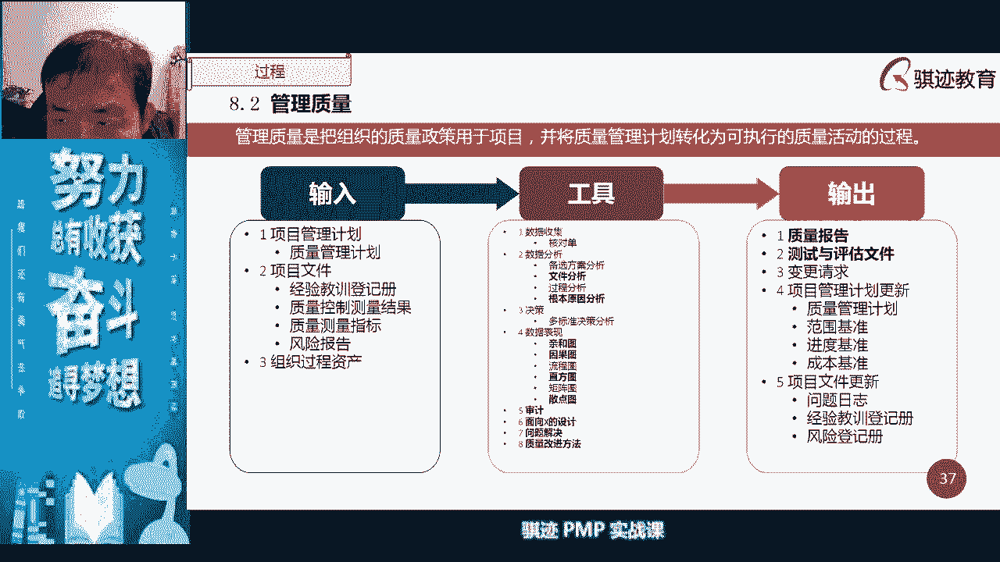

转化为干活的过程去干活，好，那么它的目的在于实现质量目标的可能性，就是尽可能的在过程中去提高我们的质量，达到我的目标，识别无效的过程而导致低劣的过程啊，所以管理质量当中，我们后面还会牵扯到一个东西。

叫做过程改进对吧，过程改进过程改进有个过程改进计划，那么良好的管理质量，有助于设计出最优的产品啊，因为我们讲质量不仅仅是满足特性程度，他还是说什么有有一个恰当的质量，恰当的等级去满足客户要求。

有时候恰当不仅仅是在设计当中要去实现，还是要在执行当中要去落地，有些时候能计划做的很好，但是你怎么去落地，做到这个标准很难对吧，就像我们上节课讲的啊，日本人啊，日本人当年做家电，做电器的时候。

为什么啊一到保保质期，一过保质期就坏呢，就是因为他能设计出这样的东西，同时他也能把这些这些政策，这些方法严格的去落地，以此来控制成本，以此控制质量，对吧啊，这是一个我们讲这是一个我们呃呃讲怎么说呢。

就是说管理指南当中的一个啊一个一个目标，工作目标啊，然后呢又要确保质量目标，然后然后提高效能效能啊，这就是我们的过程改进，所以管理质量是所有的责任，每一个参与项目过程当中的。

我们的内部和外部的相关方都有责任，尤其是内部相关方都有责任去管理质量，管理质量，但是它要依据什么，项目经理在规划质量管理当中。

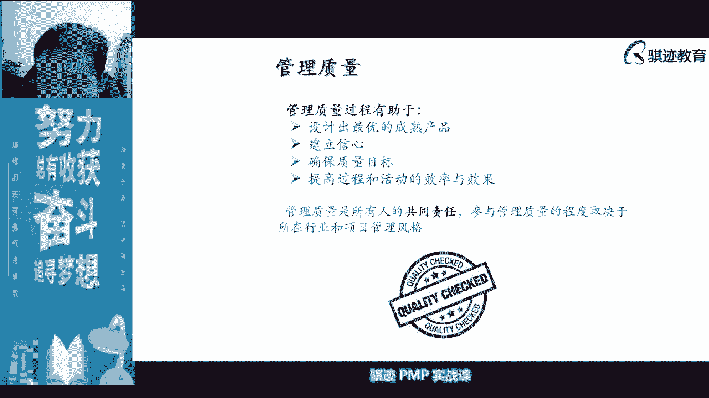

所制定的一系列质量政策和质量标准啊，我们在管理质量当中呢，因为具体的质量活动，比如说我们在管理质量中，质量活动我们就检测啊，做一些预防啊，这些东西呢没办法描述，因为每个项目不一样。

所以我们会在执行当中会使用什么东西啊，会使用一些共同的工具进行描述啊，很多东西没办法描述的，就是大家会知道，凡是一切在过程当中对质量，达成质量目标有帮助，那些活动都可以认为它是质量活动的一部分。

那么我们会在这个过程会运用过程分析啊，过程分析什么叫过程分析呢，就是说它会有一个什么过程改进计划啊，我们在质量当中会有一个，这里ppt没有提，我们会有一个东西叫做过程改进计划啊，当第六版已经提得少了。

那么过程改进计划当中，它是帮助我们对过程进行分析，然后呢找出致命因素，找出问题从而加以改进。

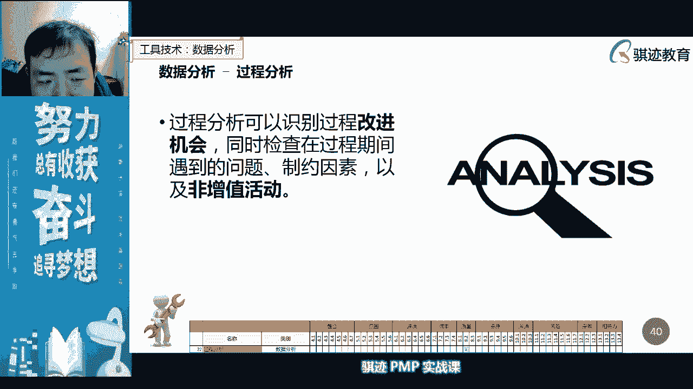

从而提高质量啊，这个呢就会涉及到一个概念，然后我给大家讲一下。

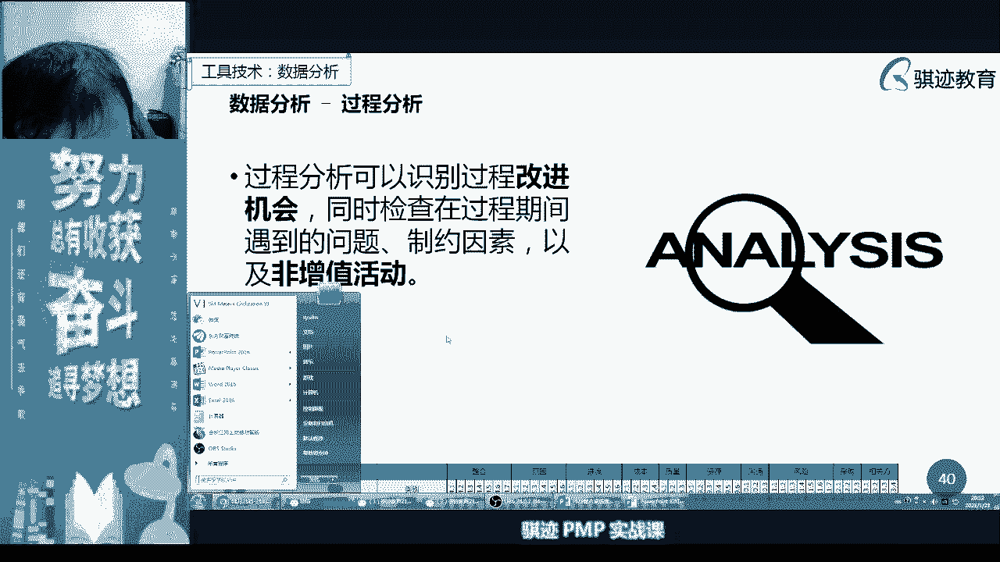

我给大家啊写个文档哈当中，那么他会用什么东西呢，就是现在有很多种方法在精益当中，我给大家打一下，诶sorry，在经营当在经营当中，我们我们会使用我们会使用一种东西，使用一种工具，这种工具叫什么。

叫做value string，叫做价值流以及绘制和价值，叫wild stream mapping，map，vue remap，那么它是什么，它就是一种过程改进它的过程改进是什么呢。

因为这是在经营当中很很很常见啊，那value stream mapping啊，我们把它字体放大一点。

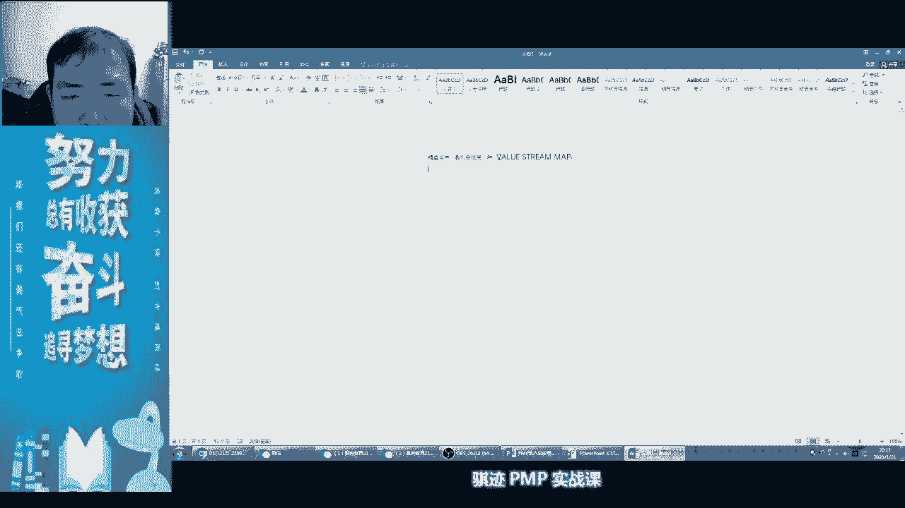

它就是一种过程的改进，一种改进方法啊，一种改进方法，然后呢他通过这个这个图呢，它主要不是看它的工艺过程，而是看什么，在精英里面，看您过程当中会有哪些东西是浪费的，哪些东西哪些哪些东西呢是什么。

哪些东西呢是制约的，有瓶颈的或者有堵塞的经济当中呢，当然这个讲的多一点，经历当中我们讲的有很多种浪费，比如说最典型的浪费是什么，等待是一种浪费，东西，等在那里不生产，它是种浪费东西，做成半成品。

但是没有做成成品，交费和用户暂时放在那里是浪费啊，流水现象，正在加工过程中的半成品不是浪费，但是加工到一半放在那里，没有继续进行加工，都是浪费啊，还有什么浪费呢，过呃不必要的交接是一种浪费对吧。

反攻是一种浪费对吧，技能不足是种浪费啊，所以有很多种浪费，它通过识别我画via stream mapping，我会识别这个整个产品，从比如原材料到成品，这个过程当中会有哪些环节是存在浪费的。

通过改进浪费这种东西来提高价值，来提高客户满意度啊，提高产品价值，所以它用于识别非增值活动，识别非增值，我们会将在过程改进当中，会将不增值的东西改成增值对吧，比如说有些工作当中。

我们发现什么瓶颈在于什么啊，人工去做的时候呢，人的交接动作太多，导致呢效率低下，然后呢很多产品在上一个环节生产完之后呢，对待下一个环节呢来不及处理，那么我们考虑什么，可可以考虑一投多投入资源去解决啊。

看看能不能解决，第二呢我们可以利用自动化，用机器去解决，在这个过程中，我们就可以识别哪些活动是非增值，因为比如说我们很多东西是在等待当中，有些很多东西要交接，交接的越多，就是说a和b交接。

比赛再和c交接，这些交接会产生额外的等待和额外的浪费时间，对吧，这些东西是不会增加我们的价产品价值的，所以这个东西呢都是应该，我们可以通过良好的过程的设计和改进，去避免掉，尽可能减少，甚至不要较劲。

这就是过程分析啊，当然过程分析大家个人兴趣，看了我们这个课肯定是讲不清楚的啊，给大家有个概念，过程分析里边绝大部分的东西呢，都来自于精益啊，过程改进的都来自经，英文叫lin啊。

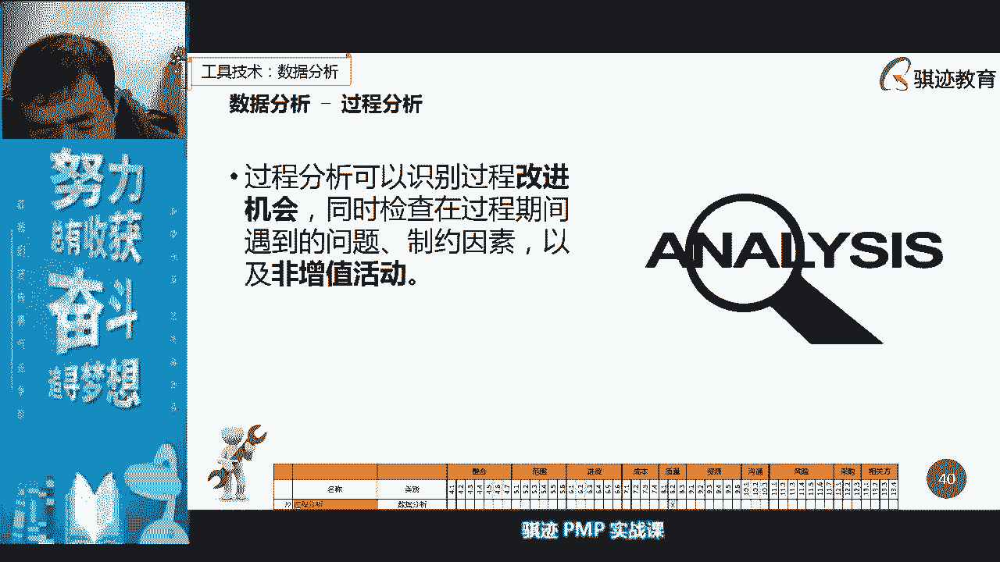

来自于精益。

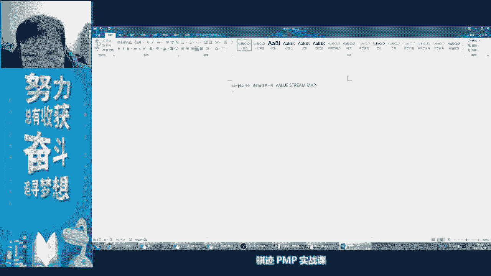

啊那么讲到这里面讲的体系啊，在现在的我们的我们的管理当中，刚才怎么有其i t管理器啊，尤其有很多同学搞it的管理器，会知道有四个东西是台柱啊，台柱一个台柱呃，偏僻是一个台柱啊，项目管理是一个台柱。

另外的台词就是精益，还有一个台柱呢是ito，第四个台柱呢就是什么，就是敏捷啊，敏捷啊，ile p m p和精e，是i t管理当中的四个台柱啊，如果呢你管理看的不太宽，不太严格的话。

你可以把它认为是所有轻量级的，或者倾向于无形无形劳动，无形要素，生产要素更多的那些行业，都可以把这四项看作是什么啊，看作是呃四个管理的支柱啊，所以这是pp当中会涉及到一点点非常小。

非常小的尾巴会涉及到精益的啊，好精力更注重过程改进，它是从内部去挖掘潜力啊，当然也有一些理论从外部去挖掘潜力也有好，我们稍微提一下，要过程改进，大家有兴趣可以学学学精啊，如果你学精益又会讲到一个东西。

就和我们前面讲到了，会和丰田管理，丰田生产会相关紧密，情人，因为经营当中，80%的理论都总结于丰田啊，这家伟大的公司啊，toyota好看啊，那么我们再次就先放到这里。

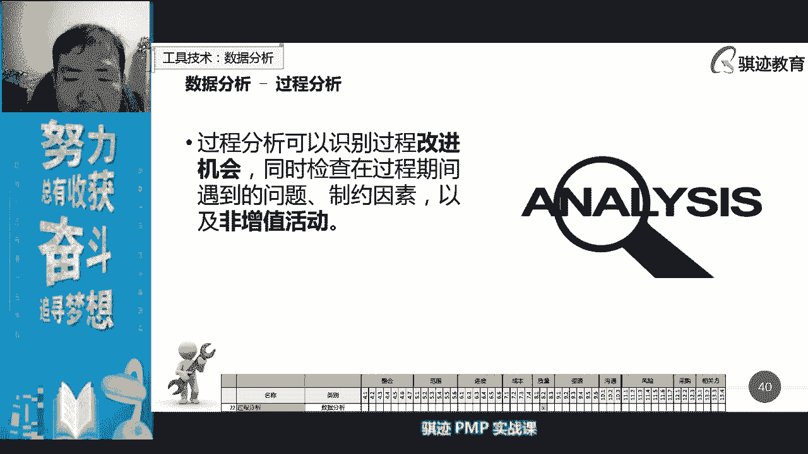

我们后面还有很多内容好，接下来是根本原因分析，根本原因分析呢是一种分析确定引起啊，我们的这基本啊基本原因啊，偏差所产生的一种啊技术，它呢用于分析，就是说找出根本原因，然后去消除根本原因的啊。

所以叫我们有一个词很常见啊，叫r c a，啊ioi t i l k啊啊，不是搞it的同学可能不熟啊，搞i t同学可能还熟，i t i l稍微提了一下，歪头。

而且它叫information technology infrastructure library啊，名字挺土的，但是这是it界的一个基石理论，基石理论还是最基础的，但是呢呃任何理论要往上去发展。

你现在的体系都绕不开它是这样一个东西，好啊，那我们继续讲，那我们继续讲啊，去考软考的话，艾特也是要了解啊，艾特里学一些东西也会影响到，很有意思啊，不好意思啊，这这这i7 是i t管理界的一个基石理论好。

那么根本原因分析是一种我们寻找根本原因，并从根本上杜绝问题再次发生的东西，然后我们如果寻找根本原因呢，会出分报告叫r c a report，ok啊，所以我们先来看一看啊，当然我们今天讲到这里就看看啊。

r c a是怎么写的，这个东西其实很重要，很多时候呢p p里面的一个知识点。

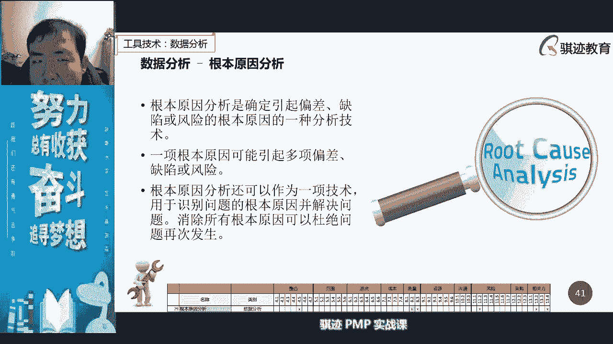

pr讲一下过去，其实它是有于是有作用含义的啊，比如说这就是一个典型的r c a report，根本原因分析报告啊，这是我帮你们写的啊，举个例子啊，i c e poke呢一般是三段体，一般是三段体啊。

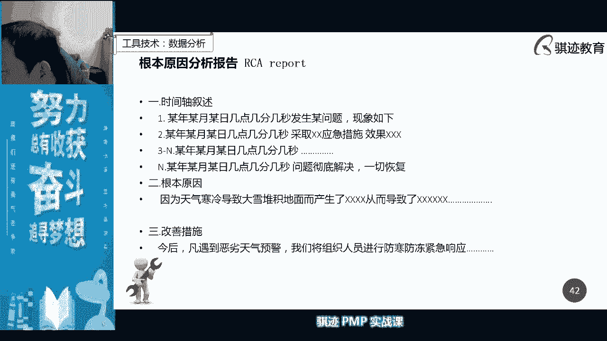

r c a ok这里有啊，这里有啊对吧，我的鼠标大家大家看到我的鼠标肯定看到了啊，老师英文还是很标准对吧。

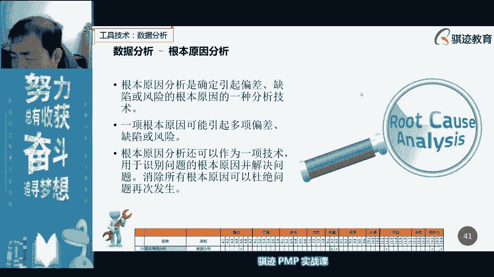

那么r c a报告呢一般它是三段体，我们常用的标准r c a报告呢是三段体，那么它是哪三段呢，第一段，它会用时间轴的方式去描述，这个事情发生的过程，那么一般来说需要分析根本原因。

他就肯定是说发生了某些事情，他才会去分析某些原因，一般是发生某个问题才会发生，所以它会根据我们最早能感知到这个问题，什么时候发生的，开始去描述啊，那么我会写某年某日某某几点几分几秒，我们发生了什么问题。

比如说我们发生了什么，水管冻转不能使用现象，如下的，水管冻住了，水管开开不开啊，是然后我们随便怎么样也放不出，放不出水，对吧好，那么接下来呢我们就会在这个过程中去描述，在这个问题发生过程当中。

我们采取了哪些步骤，那么接下来还是某年某月某日，注意啊，注意啊，都会使用以时间为开头啊，表明你在什么时间做什么事情，采取某些措施，比如说我们紧急对我们的水管上面来去浇水啊，浇热水，然后效果呢不理想。

因为动作太厉害了对吧，那么接下来呢我们会采取各种各样的措施，然后最终呢把这个问题解决掉，比如说有些有些地方啊，我们在生活在北方对吧，然后冻室外水管冻住了，冻得很厉害，根本没办法，根本没办法。

就是说用水了，那么怎么办呢，浇热水效果不好，那我怎么办啊，我们可能有些同学说啊，我们对于室外暴露的那部分，反正水管是金属水管吧，我们用火烤，然后点个火把，然后用火把呢对这个管子呢用火加热啊。

然后就然后就开了啊啊，所以北方同学可能知道啊，有些时候是室外水管冻住了，我们用火烤的方式把这个水管，把这个水管了，然后呢呃呃加热一下，然后呢可能能解决问题，当然很多时候我们也是为了预防，比如说即将的话。

有可能是预防直接就把水管里的水排空了，因为热胀冷缩水管也可能把水管给撑爆掉，对吧，好去解决问题，然后最终反正我们通过各种方案，最终会在几点几分几分把问题彻底解决掉，恢复了。

所以c2 report的肯定是个事后的，还能事后的，那么第二部分我们是我们就开始寻找根本原，第二部分就是寻找根本原，在这个事情经过之后呢，我们会通过根本应分析分析出什么天气寒冷，导致大雪堆积地面。

而产生了什么水管啊，水管的结冻，水管解冻，虽然我们可能采取措施是吧，有些地方可能水管防止结冻呢，可能是什么啊，可能是不知道我们外面扎点稻草对吧，扎点稻草，然后呢或者怎么样才采取一些方式啊，回去呃。

有措施了，北方表示什么不动啊，还是有水管，有地方还是有水管冻的啊，好那么当这种方式呢可能不理想，所以导致了因为气温降的比我们预期要低，所以可能导致了我们的水管的冻结冻，甚至是血管的开裂对吧。

那么我们找到根本原因之后呢，第三部分就是我们的改善措施，那么为了预防今后发展怎么样，我们会说安排专人，比如说在这个整个园区里面，比如说我们在整个园区里面，我们落实增加燃烧，然后呢每天看天气预报。

如果发现天气预报里面有恶劣天气预警呢，我们就要紧急响应，比如说我们预先先把水管里的水给放空了对吧，降温之前先把水放空了，那么这样的话，因为一般来说是总水管很很难被冻住，一般被冻住的都是支水管。

支线的小水管，大水管是很难被冻住的，那么我们在支线水管呢，我们把它全弄，先闸门关闭，先全部都放空放空，然后呢等气温降了，稳定了呢，我们再把水管放开，这样的水流呢就不会再冻在里面。

然后呢我们尽量让平时让大家的水呢，就是水龙头呢保持一个畅通，不易被冻结，对吧啊，所以大家能看到啊，这就是一个我们刚才举个例子，r c a报告的一个例子，所以r c a报告就是我们的常规常规过程当中。

就是按照第一部分时间轴的事情叙述，描述到底发生了什么事情，第二部分呢，寻找根本原因到底是什么原因导致的，第三部分呢，我们在未来会采取什么措施，防止这个问题再次发生，或者永久解决这个问题。

这是我们最常见的rc一报告的三段题，那么为什么要讲这个呢，啊为什么老是要花这么多时间，怎么讲真理啊，因为这是一个老生常谈的事情，因为偏僻的默认角度是不是乙方啊，是不是乙方，作为一个乙方。

你经常会遇到一个事情，就是什么甲方向你甩锅，啊甲方向你甩过啊，或者是甲方要求你解释某个事情，出了事情要进行解释，这时候你就要用r c a report这种标准形式，告诉甲方这个东西到底怎么导致的啊。

所以作为一个乙方项目经理，一定要懂得正确的去写r c a reporter，否则会变成第一会被人看不起一下踢过来说啊，你这个reporter根本就不是r c a reporter，格式不对。

内容内容形式都不对，回去重写，然后你就很没面子对吧，然后你事情还没讨论清楚了，你先理亏三分对吧啊，这是第一个，第二个呢，rc报告在乙方的角度描写，主要是为了什么甩锅啊，甲方把锅甩过来，你就把锅甩回去。

那么你你的目的是什么，通过r c e的这个report呢，将这个事情尽可能的往什么东西推呢，如果有友伤，你就往友商身上推对吧，哈哈啊，当然这不厚道啊，但是当然这不厚道，但有时候没有办法对吧，这是第一种。

第二种的啊，等会我把镜头往下拉一下啊，啊这我看那个我清楚一点对吧，第二种，我们尽可能把这个事情的原因往我客观事情，就是我们讲事业环境因素，客观因素去推，对吧啊，天气太寒冷导致什么，对对对吧。

很像刚才的例子当中啊，其实在很多地方，其实我们大家都已经知道，在很多，尤其在北方地区，这种冬季防止水管冻裂，这种已经是常规操作，这些相关的人员大家都应该是常规的事情，你如果还发生这种事情呢。

多多少少都有些管理员对吧，然后呢把这事情解决掉对吧，这是甲方，那么啊这是乙方的角度，为什么要向r c a报告，那么从甲方的角度为什么需要r c a报告呢，啊我一直跟大家说个例子啊。

大家有没有看过一部电影，很好的影巩俐演的啊，巩俐演的电影，那部电影演的真是出神入化啊，那部那部电影里面，巩俐成功的演了一个很有意思的农村妇女，叫做秋菊，那部电影叫秋菊打官司，秋菊没事情。

为什么老是去打官司啊，他并不是说要一定要多少赔偿或怎么样，他就有一个东西啊，就是我想说的东西就讨个说法，他一字嘴巴里说，我要讨个说法，讨个说法啊，所以r c a报告从甲方看。

为什么要乙方说r c报告他就要讨个说法，这个说法可能甲方自己用于什么，内部相互之间进行解释，比如说你的甲方是一个甲方的某个业务部门，他的用户问他也有客户，他的客户可能也因为你的这个事情造成影响。

他要跟他的客户去解释，所以他要问你要r c a报告，然后用这个报告呢去跟他的客户去解释，还有可能是什么呢，它有上级对吧，甲方也有上级，那么甲方的上级啊，问他为什么这个事情会发生啊，造成了影响，造成损失。

为什么会这样，那么他要给上级个说法对吧，他要讨一个说法，所以r c a报告在甲方看来更多的是什么，因为事情已经发生了损失情造成了吧，很多时候都是没法挽回的嘛，他只要讨个说法。

让你乙方一承认这个有这个事情发生，第二呢希望你以后以后不要再发生这个事情打，所以你要明白这个目的，双方之间的目的和意义了之后呢，你就以后会写啊啊，所以r c报告呢对乙方来说，主要就是一尽可能的甩锅。

对吧，第二呢给甲方一个说法，让甲方有面子啊，可以下下到两台，就是这个意思明白了啊，所以我作为管理很多年的甲方，我看乙方的r c报告写上来，我看了好多年，几乎就没有说啊，是因为甲方啊。

乙方说因为自己的管理不良什么的，直接打到说是因为他的错啊，他怎么会有找原因的啊，然后就算有时候他推卸不了原因，没有任何的客观啊，视野环境素可以推，没有任何的友商可以甩。

这是因为什么什么什么引起了我们已经解决了，不会的，他的重点肯定会落在什么改善措施上啊，他不会从管理原因，程序导说对吧好，那么这个r c report大家可以知道一下，这是我们日常工作当中。

在项目管理和日常管理中，经常会看到的一种report啊，嗯卡了，同学啊，今天我在这个直播挺好的，我自己的监控屏上其实挺好的啊，我应该没有，我们应该也没有卡哎，哎差不多差不多啊，很多的。

有有有有同学说这个和listen reporter其实是一样的，对吧啊，很多地方其实形式抄了抄去嘛，目的其实可能不一样对吧，雷斯林更主要是总结经验对吧，r c e那种主要是甩锅对吧。

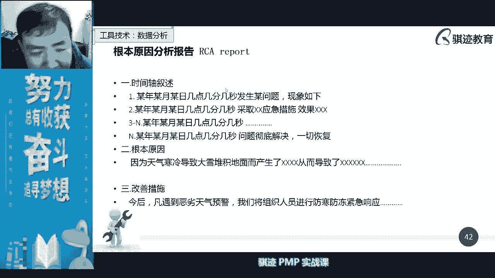

那么这是一个接下来就是清河图啊，就有意思啊，青铜都是我们将用于对大量创业经分组的这样，然后再寻找潜在原因啊，七刻度这个我们上次讲过没有，我们之前好像讲过，好像是没有讲过啊，ok啊我们来玩一下切刻度。

很有意思，我们来用我的这个东西来玩一次啊，很有意思，亲和图，一个十个同志同学，帮助我们的同学进行选择和分类的东西，尤其适合帮助什么啊，选择困难症，选择困难症啊，好我们来玩一个清河图的例子，很有意思啊。

那么我们亲和度就上来干什么，用大量的潜在选择当中呢，我们进行分组讨论，以便寻找出真正原因的一个，或者是真正应该关心出领域的一个例子啊，那么我们来，我们来玩一下清河图或者清河的例子，那么我们来想一想。

比如说那么呃我们学校马上过年了嘛，你讲过年，你你在过年最想吃到的一道菜是什么，请在啊啊讲过对吧，我记得讲过，那么我们还是来一下，有些同学可能因为之前的课可能都没有听过啊，什么我们快速讲一下啊。

你请大家所有人告诉我，你在过年最想吃到的一道菜是什么，请大家在公屏上，然后我来帮你们记录下来，然后我们来玩一下清河图啊，这位同学，你很有意思，油条还有呢想吃妈妈做的菜，这个太虚了啊，红烧猪蹄。

还有呢火爆肥肠，我靠你们这个啊，白斩鸡，白切鸡的，白切鸡啊，可乐鸡翅，可乐鸡翅对吧，然后不过回不去了，一个，有你们，你们这个发的比我比我打字打的快啊，ok啊，来来来来来，我成功调动去了红杉菜台的太抬。

啊菜台啊，这鲫鱼对吧，肘子啊肘子有了，对吧啊，炸带鱼，炸带鱼回家吃饺子，饺子饺子没有对吧，饺子想吃饺子对吧啊，拔丝地瓜红焖大虾，地瓜红焖大虾，还有什么螃蟹，红烧狮子头，螃蟹红烧狮子头。

红烧狮子头麻叶麻叶是什么东西啊，ok啊你讲了一个那个那个姓雷的，雷超强的那位同学，你讲的麻叶我不太懂哈，可能这个中国饮食王国的对吧，粽子，粽子大碗肉火锅火太强了啊，差不多，火锅佛跳墙烤羊腿。

我靠你们这个打窝了打窝了打窝了，我靠啊，差不多得了差不多，ok啊，字有点小，没关系，我我我放大一下就行了，这下看得出来吧啊我们我改改成2号字号字，这也看得出来吧，再加粗对吧，好，这是这是一个啊。

后面后面后面加过啊，那么这是我们这是我们所有同学饿了对吧，肠粉啊，来不及打了啊，麻辣烫非常黑啊，有些同学饿了，那么这是我们同学，是选出了过年最想吃的菜对吧，那么如果我们讲的就是过年吃的菜，是我们心啊。

心中想想做东西，但是不可能每样一道菜都吃对吧，然后呢，我们要从这些菜当中选择一道所有人都公认的，就大家都可以接受的某一道菜，那么怎么做呢，这时候就要清河图了，那么首先我们对归类这些东西这么多。

我们就要对归类对吧，首先我们把它归类归类哪几类啊，啊这里看上去都是过年吃的都是中国菜对吧，没有西式菜对吧，我们首先归类是这样规啊，给大家看一下啊，首先我们划归为几类，第一像这种红烧猪蹄呀。

啊像这种什么红烧猪蹄啊，啊肥肠啊，白切鸡啊，可乐鸡翅啊，这种这种手食指，这种是不是属于大荤啊，第一类属于大荤对吧，炸带鱼也是也属于大荤吧对吧，就属于纯纯肉类，纯肉食动物类对吧，螃蟹也算啊。

螃蟹不算螃蟹是海鲜类，红烧狮啊，狮子头这个也算对吧，啊啊啊带鱼不算钓鱼，我们另外归一类，第二类就是海鲜类，海鲜类对吧，红焖大虾和螃蟹算不算海鲜啊对吧，海鲜类对吧，海鲜河鲜鱼类对水产类，那么第二种对吧。

然后是鲫鱼也算对吧，好那么火锅对吧啊，不火锅不算大碗肉，大豌豆也算是肉类对吧啊，ok啊，那么接下来呢是我们的呃传统的小吃，吃食类对吧，吃的东西类啊，比如像火锅，佛跳墙啊，麻辣烫啊，这样东西都算一类对吧。

最后呢最后一类呢我们把它称之为其他类对吧，其他的这些类啊，ok啊，那么大致上我们会分为这几类，一，啊一类啊纯肉食动物类对吧，第二个类呢是海鲜类，第三类呢是我们的呃，呃火锅，佛跳墙这种这种大呃。

这种大型的或者是综合性的吃吃东西，第二第四种呢是点心类，或者接近于点心类这种东西对吧好，那么我们会去在这几类当中先去筛选，亲和度当中，我们会只会对对它进行进行分类，然后呢我们会加一个条件。

比如说我们希望我们过年吃的东西呢，都是希望的带有啊比较好的象征意义的，或者是说什么带有这种呃，或者是说呢我们希望什么吃的，过年吃的相对丰盛一点，好一点的肉食类多一点的，那么我们可能就会选择一个。

先选那个什么大类啊，肉食动物类对吧，这个里面呢是纯肉的，什么素质都没有对吧啊，当然待遇也算，但是这个属于海鲜对吧，属于纯红肉对吧，纯红肉类的这里啊这里都是纯红肉，那么那么我们就会选择这里。

那纯红肉里面呢，还是喜欢金牛还是羊还是猪对吧，然后我们再去选，然后一层这样选，大家会看到我们这里的选择当中，我们的红烧红烧蹄，胖啊啊，红烧猪蹄啊，肥肠啊，狮子头和大碗肉都是猪类的。

白切鸡和可乐鸡翅呢是鸡肋的，那么分为这两大类，那么如果说我们想想去吃鸡肋的啊，呃鸡肉类的，那么我们会选择白切鸡和可乐鸡翅，那么最后我们选择的呢可能就是说啊，所有人觉得都能通俗都能接受的啊。

可能就是肉类的，我们吃鸡肉类，那么可能选择可乐鸡翅和白切鸡，这就是一个清河图使用的例子，我们吸烟广广泛的去寻找各种各样的原因，在质量当中，我们也是我们广泛的寻找各种各样的质量原因。

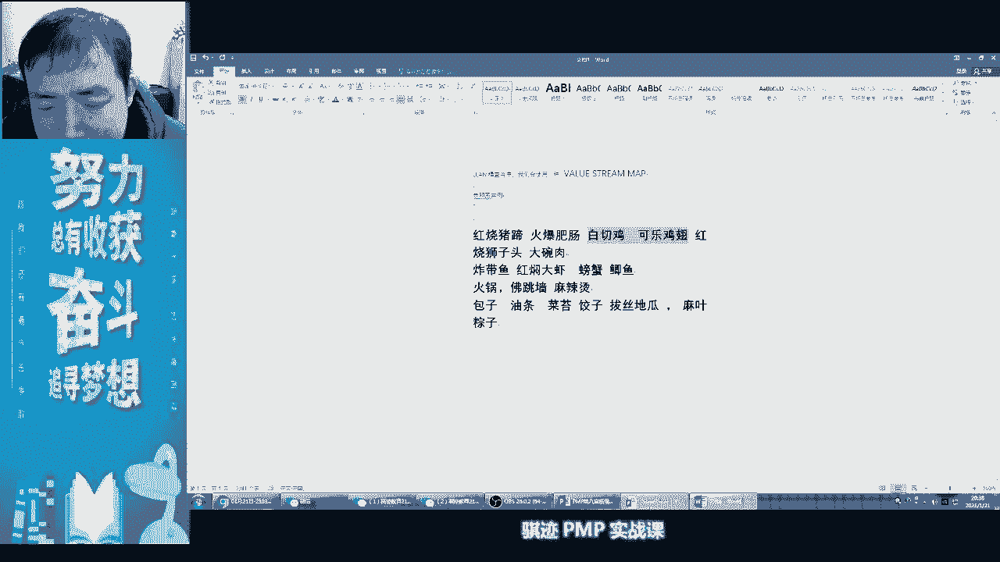

元音，然后呢确确认的成因呢，然后呢我们对它进行分类，各种的分类，按照一定的标准对它进行分类，多个类，那么多个类之后呢，我们再逐步逐步将我们选择的条件明细，或者说教我们缺陷的。

他的条件和因素呢明细逐渐逐渐清晰，越来越清晰之后，那么我们的选择我们的原因就会越来越少，可能的人就越少，最终会展示出我们最后选出的一些原因，然后我们会对我们选出那些原因，来加以重点的关注和进行处理。

ok我只是举个例子啊，不是让你们真吃啊，我只是举个例子，就是清河图是怎么玩的，亲和图当中，我们首先会把所有各种各样的选项都放在一起，尽可能的你看，所以我一开始上来问你们，说我不会带有倾向性的问你们。

我会把所有东西都问你们问一遍，然后问完之后呢，我会把一个一个一个把它摘出来，按照一定规律进行归类，规律完之后呢，然后我根据一定的附加条件，去进行规律当中的进一步筛选，最终找出我们真正想要关注的那些分类。

和那些啊缺陷成因的因子，对这不是主要对，这就是逐渐缩小范围呀，对呀这就是主角算范围，所以亲和度就是一个逐渐缩小范围的过程啊，ok所以你很理理解的没有错啊，好这就是亲和度。

但是因为亲和度我们之前讲过了对吧，那我就不再继续讲了啊，好那么接下来一个很重要的啊，那么清河图讲过了，讲后面一个很重要的，后面一个东西叫因果图，因果图，那么请所有同学注意啊。

因果图示篇博客里面历年都要考了，这张卡经常喜欢卡，而且特别喜欢呃考，然后又特别容易的东西，所以记住因果图的四个名字，一定一定要给我背出来，因果图又名石川图，鱼骨图和yy图，那么为什么叫鱼骨图呢。

因为图在右边大家看到吧，是不是像个鱼骨头一样的啊，最近得名鱼骨图yy图呢，是因为什么他不停的问y为什么为什么是这样，那么为什么这里的这个东西它不一定能用，通过用问问题的方式，去寻找根本原因或者主要原因。

所以得名叫yy分析图，最后一个为什么叫石川主，是因为这是日本的质量管理大师，石川所发明的一种图啊，所以叫做石川图，所以在因果图当中，我们会看到我们会把原因来自于呃，来自于一个问题的根本原因。

该会分成若干大类，不一定是六类啊，不一定是六类啊，根据实际需要不一定是六类，但是我们会根据不同的情况呢去使用不同大类，然后在大类当中再分小类，小类当中再分小类，如果有必要的话。

然后通过不停的进行条件的细化和明确，寻找到一个东西的根本原因在哪里，那是欧美人哪里，所以这叫做根本原因，那么这个事情呢但是呢有点复杂，但偏慢呢，因为他不想放弃因果图，但是他又觉得图太多了啊。

他想放你们水啊，所以这这你要感谢品牌，所以他因果图的pm博客的第五版当中呢，它仅仅使用识别是根本原因处理啊，啊root cos啊，不是main course啊，root co，那么在第五版当中。

主要原因是用帕累托图去进行识别的，那么稍微讲一下什么叫帕累托图啊，图我就不画了，就是大家可以想象一下，有一个二八原则，大家知道吧，特性要因图啊，ok啊，还有一种是偏僻考试，反正只要记住这四种名字就行了。

ok啊你出去只要说阴古图，鱼骨图，石川图的yy图这种东西ok就行了，名字当然各行各业图挺多的对吧，然后我们讲识别主要原因，首先有个原则，二八原则大家知道吧，80%的我们一般都会认为。

80%的质量导致的缺陷，结果是由20%的质量的主要原因造成的，或者原因在大类造成，所以当你使用恰当的颗粒度去切分，各种各样的分类的时候，你总能发掘什么20%的主啊，主要的原因会导致80%的一些缺陷。

结果啊，所以在这种情况下，我们只要关注那20%，就可以起到什么80%的作用，那么其实其实也一样，就是说这个时候呢，就是呃我们经常讲项目管理当中有个特性，也叫二八原则，生活中存在很多二八原则。

项目经理如果管很多项目或者项目工作，他永远是把80%的时间花在，20%的最主要的工作上面啊，或者管理一个团队，你永远是把80%时间放在20%的，最主要的那些工作上面，然后把剩下的20%的时间呢。

均匀的覆盖在剩下的80%，不重要的哪些方面，这叫突出重点啊，又覆盖全面，所以这是帕累托图的主要作用啊，那么你会看到帕累托图，主要是把各种各样的原因来进行排序，然后呢画个圈。

这个圈圈呢刚好能覆盖80%就可以了啊，那么在第五版当中呢有帕累托图啊，软考也会考到，但是在第六版当中呢，没有了，被砍掉了被砍掉了啊，所以在第六版当中，如果我们要寻找主要原因，寻找根本原因，都使用因果图。

记住了啊，这也很重要，本次要参加今年上半年度的p m p考试，那么请你记住，看到根本原因，看到主要原因这个关键字啊，所以特地标红了，只要你看到主要原因，看到根本原因这四个字，马上脑袋动冰就亮几个灯泡。

会不会再说因果图，鱼骨图，yy图，史传图啊，这些图都是用于识别主要原因跟美元，所以这是一个高频词啊，考试当中这是个诀窍，你看到这些东西词汇，你就知道什么该用什么工具，甚至你还没有看完这个里面的题目选项。

你就知道该用什么工具，好这就是呃我们的因果图啊，当然你在偏僻考试当中呢，你可以不用细细的理解这些东西啊，当然你看这个图其实也很容易明白啊，所以石川大师很厉害的一点就是，他这个图就是让不懂行的人。

一看就知道我应该怎么做对吧，ok啊好。

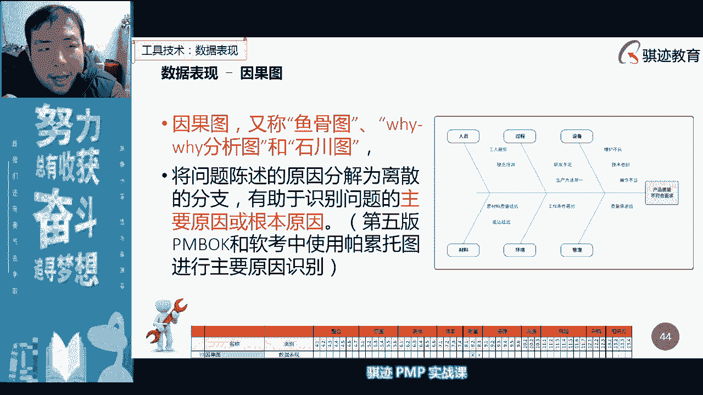

那么这是因果图啊，因果图，那么接下来一个东西叫直方图啊，这是我们质量工具，注意啊，我们现在讲的是管理质量的工具，因为后面还有控制质量工具，在pm驳回的第五版当中，这两个里面都有七八个工具要学。

加起来有十几个工具，你会感到头晕目眩，但是在pmbok第六版当中，他们被大幅度缩减了，所以很容易理解直方图用于什么管理质量，注意啊，管理质量，那么它是用什么图啊，我们常问，其实这个我们经常很用的啊。

这很常见的吧对吧，比如说这是一个x轴和这是一个y轴和x轴，我们一般用x轴代表什么时间，一般x轴直方图都是xo，一般来说xo都代表时间，直方图的xo都代表时间，y轴呢代表数量，它是一般都是表现出一般啊。

都是表现出随着时间的变化，随着x轴x轴代表的时间，随着时间的变化，而我们的y轴的数量呈现变化的一个趋势啊，那么就像比如说我们就像看这个图里面，就像什么又类似于健康吗，我们在啊。

一个组织当中我们生产某样产品，那么一开始的时候呢，我们项目的开展的比较少，或者项目进入执行阶段比较少，可交付成果比较少，缺陷比较少，随着可交付成果呢大量的被做出来的时候呢，缺陷上升。

但是呢随着我们的质量管理的不断改进，我们那过程呢不断改进，然后呢它的缺陷可能呢数量可能继续往上升，但是可能呢它的缺陷数量就往下降，总体呈现这样的趋势啊，所以直方图很容易大家打开x x2 。

然后或者打开啊p p t，然后插入一个图表里面，就有直方图，直方图是最简单的一种图像啊，他用柱状的数字代表着一种趋势，这种趋势往往是随着时间的变化啊，或着时间变化，所以也叫柱状图对，今天特别卡吗。

还卡我的监控屏今天就没有卡过啊，ok好，所以直方图很容易理解，对不对，没问题吧。

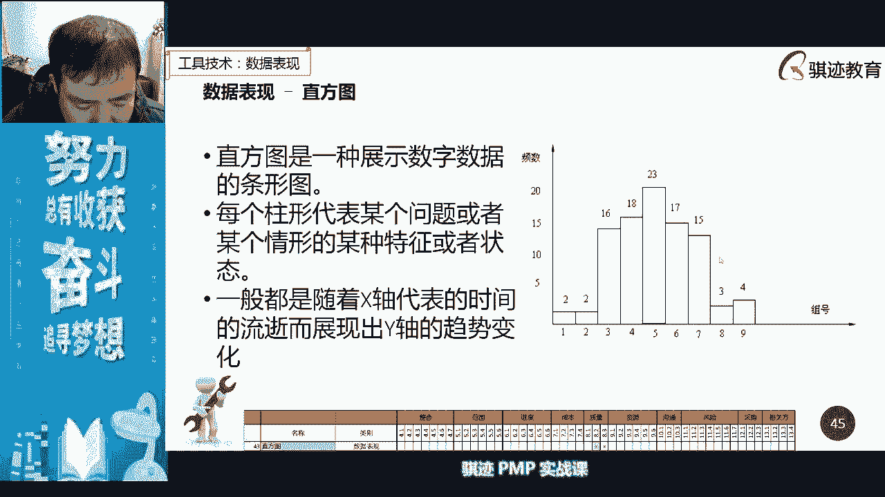

那么接下来一个叫散点图，散点图啊，这这个我们的ppt的例子当中啊，ppt当中是程序员，程序员的水平和每个模块的插座数量对吧，那么很啊，这个呢其实呢怎么说呢，散点图这个东西呢其实说啊给大家来看一下啊。

散点图这个在pp当中呢。

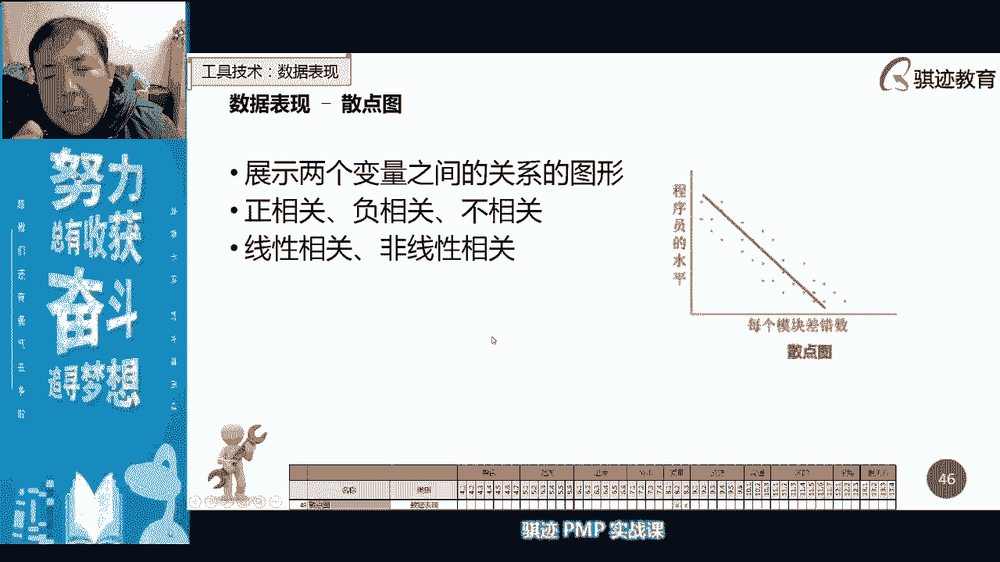

其实pp当中写的不太好啊，当然我这里也没有特别讲解，散点图主要用来干什么来给大家打，大家先记住三个字，找关系，散点图最主要是干什么，用于，找关系啊。

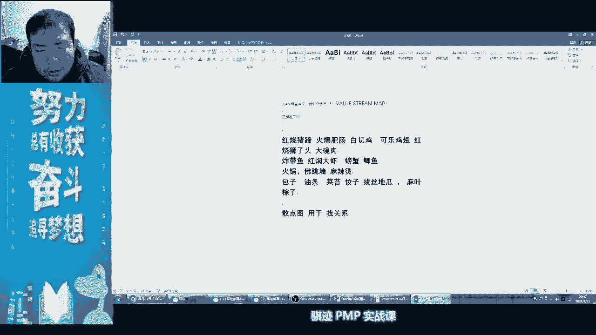

所以啊我们在偏僻的考试当中和日常工作当中，我们要看两个因子之间相互之间有没有关系，那么我们就会使用什么散点图，散点图咱们其实可以讲一讲故事，很有意思啊，所以大家记住啊，那么呃如果明白的话。

大家说三电图是要干什么了啊，请在公屏上打字，告诉我三点图用来干什么的啊，就可以了。

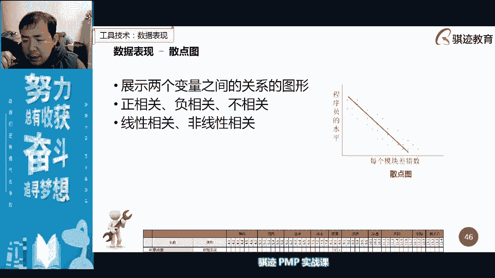

脑子经老老师今天还是有点鼻子有点塞住啊，不太舒服，那么三点图的关系又可以分为什么关系啊，啊没关系，从没关系开始，弱关系，强关系，和完美关系，对找关系，所以你们所以看到长关系就是什么，为什么告诉你关键词。

因为考试当中你当你发现的时候，要找出某个某个之间的联系的时候，你马上相互之间的因果关系的时候，你马上就会想到一个工具叫做散点图啊，散点图，那么考试当中你就来了啊，所以考试很多时候就是用什么。

用关键词去记忆啊，很多东西的作用了啊，三点图，那么散点图是用来一个一个点。

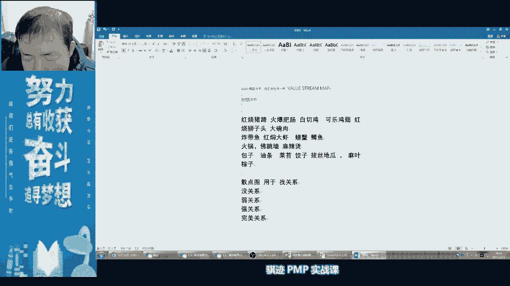

它肯定会有x和y轴，通过x和y轴的关系，不同的点在头上过去去寻找，那么三点都有这样几个特性啊，第一点越多越能确定他们的关系，假设他的点很多，像这里这个图中当中这个散点图当中。

大家有看到围绕这个直线下降的这个直线，成一个我们的负函数啊，是呃是依依次的复函数，这样一个下降的一个直线的话，大家可以看到这个关系其实是比较不明显，所以在这个图当中，我们可以粗略认为它是什么。

它是弱关系有关系啊，爻但是它是比较弱的，因为比较散，那么三点通会有什么特性啊，三点图我们的实际应用当中离某条曲呃，呃二维二维函数线啊，不一定是直线，也有可能曲线抛物线双抛物线双曲线都是可以。

只要离某一条的函数曲线离它越近，大家都聚集在这个函数曲线，只要聚集得越近，那么它的关系就越强，如果玩正好很完美的在某条函数曲线上，我们认为就是完美关系，如果离大都分布的都很近呢，我们叫它什么叫强关系。

像这个图上呢，但是它离得那比较远，所以它接近于什么强关系和弱关系之间。

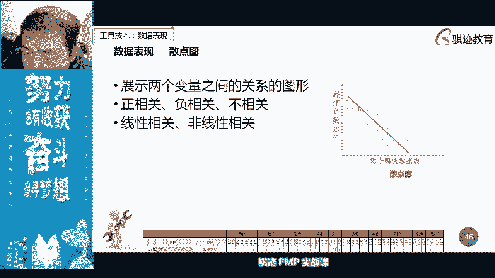

如果我这个图当中，比如说我再加一些点，比如说这个图当中啊，当然啊我再加一些点。

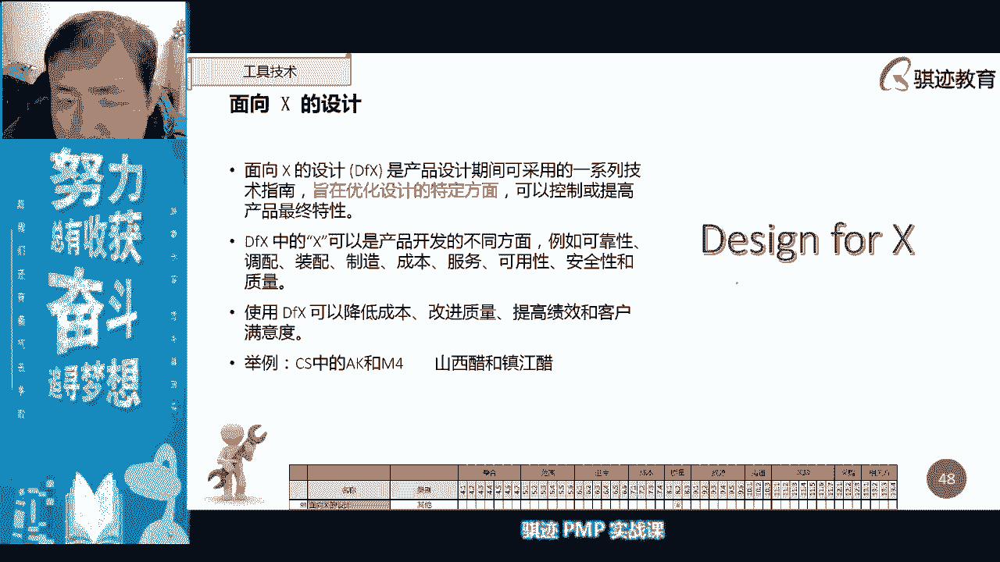

啊sorry嗯，好比如说我再加一点，那么请请告诉我，在如果在我在屏幕上在再加了这些点的情况下，他们有关系的吧，你看得出关系啊，你是不是又看不出关系了啊，当你看不出关系的情况下，那么他就是没关系。

所以并不是所有两个因子都会相互之间，有关系的啊，啊那么那么我们举个例子啊，举个例子啊，举个很简单，但是有些人可能不一定理解例子，比如说人的情商和人的智商有关系吧，你去看一下。

你会发觉什么人的情商和人的智商，你去画点的话，如果去进行测伤测伤的话，但是情商的测量可能不太有客观的，客观的工具啊，啊智商是有客观公正，你会发现什么大智上，人的情商和人的智商是没有太大的关系。

几乎呈现无关系，几乎可能有关系啊，好那么，这线怎么来的，一个这个线就是说我们找出个数字啊，咱们能不能举个例子吧，那我们在这个图上举个例子啊，可以啊，大家看到我的手是吧，那么怎么来的呢。

比如说我这里有个坐标轴，这个坐标轴，那么我们在这个坐标轴当中呢啊，那么我们在做这个，这个是我们找关系，找什么关系呢，假设这个坐标轴这里是叫什么，这叫做我们叫做放量，这里叫做放量啊。

sorry老师的这个呃，因为这个呃放量对吧，放量这个坐标轴呢叫做什么体重，那你们老师的老师的饭和体重点在哪里，应该点在哪里啊，你们肯定认为点在这里对吧，体重高，饭量高对吧，其实不是啊，好了。

体重其实挺高，但饭量不大，其实我应该在这里应该在这里，好会画一个点，这是我的体重和饭量关系对吧，体重当中呢我是以公斤，他表示饭量呢是一顿饭吃多少克食物，作为标尺对吧，这两个轴标尺可不一样，没关系啊。

完全不一样的，没关系好，那么我们再找一个女生，比如说我们现在很多女生对吧啊，比如说很多女生，很多女生什么呢，体重呢是在这里对吧，远远低于我对吧，远远低于我，然后呢饭量呢可能跟我一样啊，他就在这里。

那么如果我仅有两个点的话，是不是我可以得出个结论，现役连接点认证就是说体重是自由分布的，但是所有人的分量都一样，这个合理吧，这个结论当然不合理啊，所以我们肯定会找出很多人，当你找的人多之后。

你会发现什么啊，会这样这样这样这样这样这样这样这样，然后这样啊这样啊，然后呢你会然后我把我把线条改一改啊，然后最终你会在这个线上越来越多，之后之后你会发现什么，体重和饭量。

大致上呈现一个弱关系到强关系的，一个之间的水平，你把这些点去拟合，它花了越多，你会发现这些点都是分布在某一条曲线上的，都是分布在某一条曲线和曲线附近的，所以我们可以得出结论。

体重和饭量其实是成正比关系的，就是体重时的饭量增加增加的，但是呢不一定会有例外，比如说有些人怎么吃都不胖对吧，这种人这种人一般在哪里呀，怎么吃都不胖的人，一般他在这里，所以在体重这个体重这个事情上。

有人有些人如果处于第四象限的话，才是最遭人恨的对吧，有些人呢像老师这种呢比较惨，是吃的不怎么多，但体重比较重，那么他属于在什么第二象限对吧，而大部分人呢都处于什么一三象限，这这样一个方向啊。

所以三点图就是通过不停的在这个图上面描绘，各种各样的点，点，越多越能够体现这两个因子相互之间关系，如果他们有关系的话，它会肯定会借助某种曲线，这就是散点图的作用，ok啊。

其实你们就你们就描绘一下就可以知道了啊，呃呃体重和饭量，其实接近于是弱关系和强关系之间啊，结局与弱根接近于弱关系接近于弱关系啊，肯定是有关系的，所以体重越中人一般饭量都会越大啊，一般都会放量越大。

那么散点图有什么用，所以这下明白了多了就能看出来对啊，多了就能看出来三点头有什么用啊，三点头讲到就是有点讲故事了啊，你就是当年中国人，中国人当年在啊49年49年新中国成立之后，中国人要搞很多科研开发。

然后呢中国人呢当时一穷二白，除了人什么都没有，然后呢很多科研开发需要什么，要需要电子计算机对吧，那个时候呢，中国人根本没有什么好的电子计算机，所以很多大量的计算呢做做不出来。

然后呢中国人只用什么人力人力去算，然后呢很多科学的计算呢需要什么啊，先进的研究，中国人需要很多先进研究的那些模型的，那些公式和数据和模模型，但是中国人没有西方世界有，但西方世界我们拿不到对吧。

那么中国人后来怎么办，中国人后来就有个办法叫散点图，中国人就傻作，就是吧人多吗，我派很多很多人去做实验，去做计算，一个一个一个做出一个实验，我在这个点上我取不同的参数值，我不停的在一个某一个图上。

我去画这个点，我把这个坐标轴散点图，这个坐标轴画的特别精细，特别特别的精细，特殊机器可以做到对吧，我把尺描的很很精细一点，就可以做出一个特别精细的点，不停的往上去描点，当一个实验。

一个实验或者一个模型的数据，虽然我不知道它的公式，但是我知道不断的得出了点了之后，我把这些很多很多的点上去点了，多了之后，他应该是有模型，它肯定会符合某一个图形的一个函数，图形的变化规律。

那么我通过这样不停的描点，我就可以得出一个什么经验公式和经验函数，这个东西呢，我不知道正确的最正确的函数和公式怎么样，我不知道，但是我通过不断的去用数值带进去居测去算，我可以得出一个经验公式和经验函数。

通过经验公式进行时，我们一样能够在科学和科学研究上面去使用，我们新中国成立之后搞科研开发，最初的科研开发的人，怎么样去做科研的一种方法，啊这个是中中国科学发展史上，就是说啊一个不可避免不可避免啊。

有经常会提到的一个话题，就是说当年就用散点图这种方式去寻找公式，对吧，西方世界不告诉我们，他们用花大量成员就说科学公式他们不告，当然人家那不会告诉你对吧，然后呢我们就用散点图的方式一点点去描。

我们用我们用大量的人力，我们去堆人力去描述那个点，描出那条函数，然后呢大致最后能大致呢是用一个精简的函数，经验的公式去算啊，就得出啊，这这样一个事情，能用怎么样的公式去描述这个公式呢。

可能和真正的公式相差无几，非常接近，但描述方式不一样啊，会了啊，这就是散点图的作用，所以散点图也可以去拟合，拟合出一个什么曲线出来啊，啊这是散点图，ok好啊，这是我们讲的散点图的一个使用方法。

和它的意义啊，ok啊你们在考试当中只要知道什么，只要知道三点多用来找关系就可以了啊，找关系就可以了，好那么三点图之后呢。

接下来的工具叫做审计啊，每次学到这一点的时候，很多有些同学就先问我了啊，是被逼出来对吧啊，ok啊，你们能你们能理会体会到那种过程就可以了啊，所以当年就是在散点图那个年代，后来好好以及后面很长一段时间。

他们有一有一个有一个部门，也会有一个团队，那个团队有上千人，那些人是什么，其他的都不用会，只要会一个东西，一定要精什么珠算，中国要是不是长期以前在民间，就是说推广珠算吗，现在不怎么讲了，你们知道吧。

珠算噼里啪啦打算盘，因为珠算算很多东西特别的快特别的快，还有很多的科研院所，也会有上千人，上千人那种注册团队，每人一个算叭叭叭叭叭叭，整天就在那边算盘了，不停的在打打算盘，通过打算盘算出来的数据。

就是用人肉人肉计算机算出来的数据，然后去怎么做散点图，然后做描绘，做数据科学计算啊，这是中国人当没有计算机，但是有珠算的时候，会用这种方法去做了，3500÷24车六进一对吧，ok我已经其他经记不得了。

好ok啊，这是散点图，所以我们就从散点图就讲了很多科学历史啊，当然花了一些时间，好k啊，好我们继续讲，那么在呃管理管理质量当中，我们会涉及到一个工具，这个工具叫做审计，每次讲到审计的时候，总有人跟我说。

老师为什么审计不是一个控制质量的工具，而是一个管理质量的工具，好那我先来公屏里问一下大家，请大家在公屏告诉我啊，你们想一想或者知道的话，请告诉我为什么审计是个管理质量，而不是一个控制质量的工具。

好为什么，有人知道吗，ok啊那么normal no more，我就说了啊，为什么审计是一个管理者，因为审计是一个注重审查过程的，一个一个过程啊，哦审查你有没有正确的执行过程。

所以审计应该是在过程当中去被做更好，虽然早在结果之后对他进行治疗，审计也是可以审计的，但是更主要的是使用在什么，更主要是使用在什么使用的过程当中明白吧，所以这就是为什么是管理者管理质量。

更注重什么东西啊，过程的改进和产品本身生产过程的一个啊，得出一个正确结果，控制质量更注重什么，因为东西已经生产出来，控制质量更注重什么，对于结果的一个确认，和以后改进的一个措施的一个反馈。

和他的绩效的控制，所以审计使用在过程当中，要比使用在结果当中更好，这就是为什么审计是一个管理质量的工具啊，这是最主要的原因，那么我们看审计是个什么东西啊，我们前面讲过，我们在呃之前也讲过。

我们讲过的一个叫什么项目治理和项目管理，知道吧，审计是一个治理工具，它主要注重的什么过程，而不是结果，审计是不看见结果了啊，看你过程是不是对，所以大家看审计的目的是什么啊。

识别正在执行的良好实践和最佳实践对吧，看看有什么好的做法，识别所有的违规做法和差距不足，分享良好实践对吧，积极主动协助进行过程改进，所以其实和我们前面的过程改进，其实过程分析其实是相符的对吧。

然后呢强调每次审计呢，我们会进行经验总结对吧，这些审计的主要目的啊，质量审计的主要目的，所以审计是一种大家注意啊，我们前面已经强调过，什么叫结构化，就是说它的过程不是由你主观决定的，而是什么，它有标准。

第一步该做什么，第二步该做什么，第三步干什么，每一步相互之间呢都是有客观逻辑，或者事先约定好的程序的，是不能随意去改了啊，这叫做审计啊，所以审计是起到这样一个看你过程是否正确的。

帮助你进行过程改进和控制，过程不至于失控的这样的过程，所以它放在管理当中呢更为恰当，当你在结果已经出来之后再去做审计，有意义吧，没有意义啊，所以我们有时候做的项目审计，项目审计为什么是结束之后做。

是因为项目结束之后，明白吧，但是在项目过程中，为了保证我们的可交付成果，能够最有可能的交付出正确的质量的结果呢，可交付成果我们会把审计放在过程当中啊，当然这个审计呢不一定是外面来的啊，通常是外面的。

咱也可以说里面内部来的啊，我们寻找审让审计师过来通，帮助我们去识别这个过程，有哪些可以改进的地方，这是质量审计的一个一个呃，质量审计的一个啊主要目的啊，所以质量审计呢我们这里讲可以事先安排。

也可以随机啊，但是一般来说，如果你被随机到了质量审计，或者随机到项目质量啊，审计说明可能什么有人打你小报告，哈哈这么先说的啊，你知道吧啊，一般来说审计是不会随便进行的，审计需要一个预先准备过程的啊。

所以审计一般都是事先通知好的，如果你被突击审计了，那么肯定是有人打你小报告了，有人肯定是有人背刺你，好，良好的实践结果识别做法，所以审计是不审产品是否是符合质量注意啊，他当然要看你什么质量。

审计当中会看你什么注意啊，他会看你有没有遵循质量管理计划，遵循质组织的质量政策，遵循呃，呃，遵循我们在质量管理计划当中，所制定的一系列质量过程，有没有去落实执行落地。

同时看看这个过程是不是在实践当中合理，这是审计在具体工作中会做的事情，同时看他会看你有没有进行总结提高，然后呢，他会如果说组织内部po进行组织审计的话，他也可能说，我们看看其他团队做的一些质量过程。

有没有可以帮助你们进行提高的，会有这样的东西啊，请告诉我，如果pm啊，项目管理办公室，pm组织这个对你项目组织一个审计，那么这个pm应该是什么类型的pm，请在公屏里告诉我啊，啊有个同学在公屏里说啊。

客户审厂对吧，客但是客户审厂其实盈利上不是审计，客户生产更多的是什么，他要检查你的产品质量和过程啊，科普成长更多的是注重结果，更注重更多的是注重结果，但是他也要看过程，但更多的是注重结果，一般是好。

请告诉我po如果去执行审计，那么po是什么类型的，好非常好，我看到大量的同学能啊，记得吧啊对大量的同学都打出来，有个同学打出指令型啊，指令性我知道你记住一个叫指令型，但其实不是啊。

就大量同学打出一个控制型啊，这个啊有有同学打出知识型知识型，不是的啊，控制型啊非常好，因为我们讲控制型的pm有个责任是什么，要求项目治理服从对吧，对项目会定期进行审计调查对吧，帮助提高对吧，ok啊。

所以审审计如果pm去执行审计，他肯定是一个控制型啊，非常好非常好啊，所以大家都学进去了啊，很好我很开心啊，今天这个我很开心啊，啊突击查了一个以前的知识点，大家都记住了啊，好这是审计这些特征啊。

注意审计的这些作用，大家记住啊，查过程不查结果对吧，然后查改进更多的是查改进而不查缺陷对吧啊，好这是审计，那么继续往下面讲好，那么这里后面呢我们会有一个新的工具啊，新的工具叫做面向x设计。

什么叫面向x设计呢，啊不是面向我的设计啊，面向差的设计，不是面向我的设计啊，ok啊我们以前有时候上课，有些人会给我说啊，老师你不是微信名字叫叉对吧，面向叉的设计啊，不是啊，不是这个意思。

面向x是就是只在对特定方面进行优化，他可能是什么，放弃一部分其他方面，但是对特定方面进行优化的一种设计，这种设计呢在现在dfx t3 n负x叫dfx，是用于什么，现在的社会当中有个主力。

有个已经很普遍的概念，知道吗，差异化竞争，因为现在这个社会啊，社会的生产很复杂，然后呢每个人都有自己的生态位对吧，对于自己的立足的地方，每个企业要找到自己的立足，一定要针对他立足的地方。

和强化它的核心竞争力，强化的表现是它的产品，会针对于某一方面做特定的优化设计对吧，ok啊好这张卷就讲的故事就很多了对吧，就比如比如说我们举个例子明白啊，我啊服务型啊，拿来我拿来pm有服务性啊。

这位同学啊就有点让我伤我伤心了啊，po拿来服务型的啊，叫支持型啊，你用词不当啊，好我们举个例子啊，当当男生大部分男生都玩过cs吧，cs里面有两把著名的墙角ak和m4 对吧。

然后就是一个老生常谈的那呃呃呃，木乃伊铁对吧，懒婆娘的裹脚布贴对吧，ak m4 哪个好用啊，现实当中，ak和m4 恰好是一个非常典型的，面向x设计的两个例子，对比例子啊，很有意思，那我给大家讲一讲啊。

我们快速讲讲，今天上课不是讲段子，大家可以讲一讲，这个很有意思，给大家ak，它全称叫a阿卡拉什尼科夫47年型突击步枪，老师老师讲了，叫什么武器设计大师，他设计了ak 47啊，当然是设计出来的时候。

24级大战已经结束了，对吧啊啊，我觉得，哎呀ok啊，那么ak它的面向是什么设计啊，ak面向的是什么高耐用性，高精度高精度啊，所以当这个c4 当中，我们为了平衡ak不能这么设计，否则m4 就没得玩了对吧。

ak ak 47它的设计当时设计是什么，它的高，它的精确度非常高，因为什么ak 4级当中使用的栓动步件，对当时来说是加工难度非常高的一种，一种一种部件，但是呢他在其他部件当中非常强调什么易用性，简单性。

所以它注重什么高的精度，但是呢易用简单，所以ak 47的俄罗斯当年的苏联原版不便宜，所以不像cs当中讲的那么便宜啊，所以它是针对什么高射击精度，但是呢它不强调什么连续射击，所以它是突击步枪用于点射。

点射加上不需要很高精度的扫射为主的啊，所以ak里面这点很可能我玩cs当中，大家都这样对吧，ak只能一扫，然后他的子弹就飘了，但是它高精度射击，单点射击呢精度比较高啊，这是它的设计特点。

那么那么与此相对应的美国的m4 那个步枪，它是什么特点呢，m4 步枪在现实当中的特点，大家啊，ak无人维护工人卡对啊，所以ak这么多特点，mc有什么特点，m4 其实没有什么特点，mc的特点几乎没有。

维护昂贵，然后维护成本高昂贵，容易卡壳，容易容易出故障，但是他说那么美国人为什么要装备m4 呢，说以前不是有个段子吗，美国人在越南战争当中把自己m4 扔掉，用用那个叫月月供的那个叫什么ak来打，对吧啊。

秀这种事情啊，但是不是原子，那么m4 他面向什么样的设计，我要讲这个例子啊，m4 在现实当中虽然被黑得塌糊涂，但是其实它有一个很很重要的特点，什么特点，m4 是它所使用的子弹口径是北约通用口径。

它有一个非常大的好处，就是什么，它的口子弹口径是跟北约通用的，它的弹药在整个美国代表的，当年北约是口径是通用的，所以他的子弹可以很容易从其他枪械当中去替，换，ak不行，ak的前身，前一任的苏联突击。

当然二战当中看到波波沙的那个转盘，圆盘一样的那个射击精度不行，但是威力很大，冲冲冲冲冲对吧，美国人当初设计什么，他的设计理念是面向于什么样的方式优化，一通用m4 的特点是它的部件很通用。

虽然m4 经常会卡壳，但是m4 的维护呢方便，但是昂贵，它是什么，它很多时候坏了没关系，我直接把一个部件抗拆掉，不装上去就可以使用，所以大家阿甘正传，大家看过阿甘正传当中，那个那个m4 的那个步枪。

阿甘可以用很短的时间就把那个墙拆开，再装起来，以一把ak的步枪在战场上，几乎没有战士会去进行对它进行拆卸修理，因为那个拆卸修理很其实很麻烦，尤其是栓动部件很麻烦，拆开来感觉你就装不上去。

m4 可以现场应急修理，这就是人家的特点。

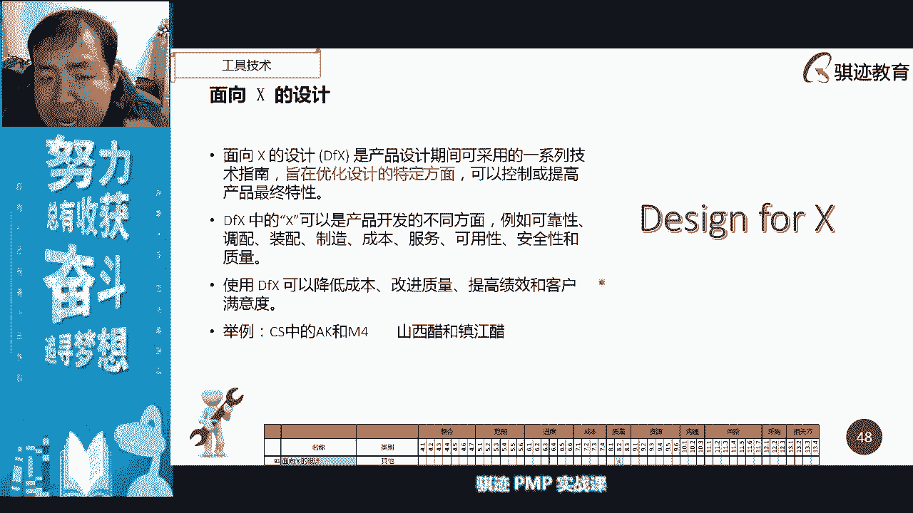