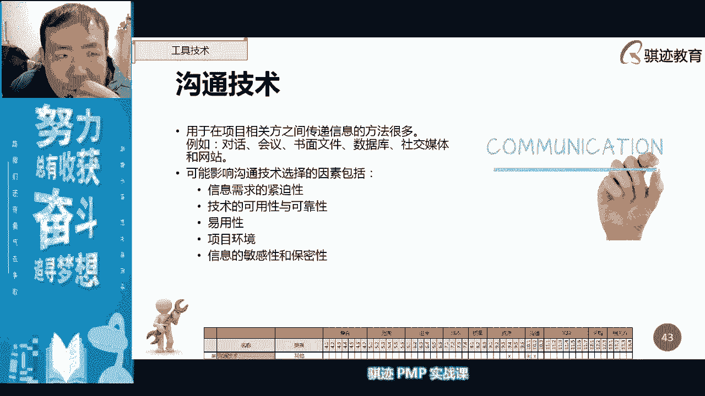

# PMP认证考试课程最新完整免费课程零基础一次通过项目管理PMP考试 - P29：PMBOK第六版 第九章项目资源管理-30 - 骐迹PMP - BV1Sb4y1f7Yt

啊项目经理去做项目管，来让某个员工，代表我们项目团队上去做项目回报对吧，满足了他这种啊，因为做的好嘛，肯定抱不起来，随便他怎么说就行了对吧，可以满足他的什么一种啊，存在感，荣誉感对吧，这些都是无形的。

不用花钱啊啊你事后跟发姐商量一下啊，找个安全房报告，省得花钱给他发奖金了对吧，这些都是对方法，而且什么这要比花，有些时候要比花钱干来的有效套路很多，来哎公开表扬，对公开表扬其实并不是一定是最好的。

无情奖励啊，啊不对，这个我想奖励啊，有时候呢给予不同的人不同奖励啊，所以有时候不一定公表扬，就满足他的内心诉求啊，尤其是虚荣心诉求就可以明白了，但是作为一个项目经理，你要低调啊，低调。

ok大家是不是学到了一些东西对吧。

ok啊好我们继续，我们在建设团队当中，当我们希望提高团队成员的能力的时候，我们就会用到的工具啊，这这是一个考点啊，就会使用training培训，培训，和我们之前讲的知识管理知识分享的来说呢。

是有区别的啊，培训相对知识管理知识分享的是一种正式活动，比如说你今天晚上来听我的偏僻歌，这就是一种什么培训，如果你在今天晚上上完课之后呢，然后然后在烧烤摊上撸了几个串，开了两瓶啤酒，和你的师兄呢喝酒。

你的师兄师兄叫你啊，教你是吧啊，回乡路的四种写法，这个叫什么，这叫知识分享，明白知识分享一般是非正式的，他教授的东西是非系统的，明白吗，在建设团队当中，我们更需要什么，更需要的是培训这种正式。

因为正式的教育有时候看起来比较死板，但是它是系统的，他接受的知识是严谨的，知识分享是未必严谨的，或者是带有片面性的，适用于你，而不一定适用于他的，虽然我们的知识管理当中，尽可能要把它进行泛用化。

但是有可确实可能会存在局限性啊，就是说有时候你适用的未必它适用啊，所以这是知识分享的局限性，所以我们要系统地有效地提高员工能力，更多的是什么要运用的啊，又要运用培训这种机制啊。

啊有人同有些有些同学的有些用，有些同学的硬点真是低啊，怎么叫你一声项目经理就满足了，对吧哈哈哈，ok啊，这位同学有没有想起，当年我讲了半夜讲的那个段子，那个项目经理对吧啊啊啊，ok我们继续聊啊。

培训是一种什么，是一种正式的知识知识传授和能力提高过程，但是我们也讲了，能员工的能力从短期来看是一种事业环境因素，所以培训在短期上是不可能提高你的能力，所以你们学了pp哪怕考过了p p。

也不能说你们的管理能力就有多大提高，但是你们已经有了正式的知识，正式的培训，那么你们很容易在实践当中，迅速的要比没有学过的人，更迅速的去提高你的管理实践，因为你的理论作为支撑，你遇到任何问题。

你可以用理论去帮你分析，什么样的方式是正确的大方向，具体手段呢你可以再考虑对吧啊，那么当我们涉及到更多的细枝末节，具体手段的时候呢，我们会更多的反而运用什么知识分享对吧。

所以员工如果缺乏必要的管理技能呢，可以把这种培训呢作为项目工作的一部分啊，所以有时候在有些项目的情况下，项目当中的人呢未必有能力足够，所以我们项目的工作一部分呢可能就是培训。

因为是要把人培训成符合工作要求的人去做，那么为什么不直接去符合工作要求，这样因为项目工作，有些项目工作它有特殊性，有适用性，所以未必你能找得到或者找得全，所以你需要那些人，所以培训是不可避免免的啊。

不可或缺的啊，是这样啊，那培训呢应该在资源管理建当中就已经安排好，我们在规划资源管理当中就已经规划好，体现在资源管理计划，我们规划整个项目当中，我们准备组织开展集资培训啊，嗯几次来源于什么样的培训。

同时呢如果有必要的话，我们会根据我们的项目的绩效评估结果，比如觉得大绩效不佳，大家记某方技能不足，有可能开着开展一些额外的培训，计划外的培训啊，所以看到了吧，所以乙方的培训所花的钱。

所以它是算绩效还是不算绩效的，也是算绩效啊，所以乙方理论上也是应该拿着甲方的钱，然后呢去啊考证对吧，去学p m p，然后呢去提高自己，然后更好的为甲方服务，那么甲方会说什么字啊，mp哈哈ok啊。

这是偏慢，这是偏慢所说啊，所以很多甲方一开始，有时候就就对乙方会有些人的资质上有，但是你要知道甲方对人的资质上，或者对乙方的资质上有更多的要求，要求乙方通过更多的培训，那么反过来说，乙方的报价和乙方的。

就是说成本的预算就会制定越高，所以羊毛最终还是出在羊身上啊，你要明白这一点，所以培训呢可以是内部的培训师，和外部的培训师进行啊，像我今天晚上给你们上pmp课，我就算外部培训，如果你自己内部有专。

那么内培师也算作培训他，因为他们是正式讲师啊，好那么培训之后呢，我们有一个有一个工具是什么啊，有个工具叫个人和团队评估，在建设团队当中，我们之前讲过，我们会用激励呀，啊我们会用团建啊，我们会用奖励啊。

培训啊，这样去管好人的这些方面，然后让人让大家团队呢能高效有效的去交付的，去工作，但是在工作过程当中，你也要注重团建这方面，从项目管理的角度去观察，人应该是怎么样运用去最好，这是一个你的管理方面啊。

从管理角度来方面，那么一个优秀的项目经理，应该洞察团队成员的每一个人的优势和劣势，我们说项目当中很少有完全没有用的人，也很少有完全都完美的人，是什么什么都能做的人啊，那么举个例子。

就记得我之前跟你们说了吧，比如说我们项目当中有一个人，这个人呢是项目的，然后安排的项目呢预分贝过来，记得吧，我举个例子，那么这个人呢经验不足对吧，那能力也一般，然后工作动力也一般。

那么这个人放在项目当中，完全就是很多人看见完全是个累赘，那么他有什么优势啊，他有的优势可能是就是有很多人就忽略什么，有时候直接换取过什么样的东西，它可以在不前的场合，你跟他搞好关系。

你给你给他安排个轻松点，才能做，能够满足他的马斯洛定层次，他他的层次就在项目，那么你给他安排一些满足于，能够能够满足于他的那个赫兹伯格的内在因素，里面的一些工作认知啊，啊这一些一些自我肯定啊。

一些一些东西的因素，然后呢给他满足一些呃，他不是零时光了，你看他的榜给他一些保证对吧，然后呢呃给他一些比较好的待遇，然后呢跟他搞好关系，他有什么作用啊，有些关系网作用是它，有些社会关系是你没有的。

那么你可以有些时候项目遇到困难，你可以运用这些关系呢，有关系的人说一句话，可能顶没有关系的人说100句话，就这就你们认可，对不对啊，所以当你这些人平时可能没有，但是当你项目遇到困难。

需要社会关系去支持的时候，这些人的relationship的value就体现出来了啊，还有一些人项目项目里面整天摸鱼，不好好干活对吧，工作经济基金不高，老是打哈哈，那么你要看这些人到底是怎么样的。

他到底有没有能力啊，有些人的能力呢是什么呢，我就遇到过，但我这亲身经历啊，我以前的团队中就遇到有这样一个人，这个人呢干活呢极其的让人不爽，然后呢就是说属于谁，它属于算珠型，算珠知道吧，就是拨一下动一下。

拨一下动一下，你不摸它不动了啊，完全没有主动工作积极性，但是但是我并没有完全放弃他，我给他的是什么工作，我就可以给他的一些机械性工作，就是说你只要拨它一下，第一我只我给他工作都是你只要拨它一下。

他就可以什么自己去运作的，然后你给他一个明确的实现，然后更多的这个这个实现结束的时候，有一个很严厉的结果，你不做网页很经济，我对吧，然后他就会自己去做，这个过程当中，你可以让他自己去动，它。

可以做一些自动自低级的事情，第二第二他可他呢我以前是工作那里，这些人呢，可能把把很多的时间呢花在工作内容之外，其他地方他有可能会知道一些工作之外，其他的信息，就信息可能对你有用。

比如说他可能我当初的那个，我说那些工资金不高的那个人，他可能什么对于工作当中啊，一些其他环境的未知信息可能会对我有很帮助，他可能在一个企业当中混的时间比较久了，他可能知道一些别人不太注重的信息。

被他收集到，或者这些人呢都相对比较闲的，不愿意工作就相对比较闲，他可能知道一些流言蜚语啊等等这些绯闻啊，或者是一些一些传闻啊，这些东西可能会对你的项目会有帮助，唉和事后我以前后来做了某些事情的时候。

确实就用到了这些东西，所以你不要认为一个在项目上，一个人不愿意好好干活，他就是没有value的，no value的，或者怎么样，你要好好利用它，你要安排工作呢，适合他的，最适合他。

最能让他好好干活的工作，用最适合方式就安排了，同时也利用他身上value每个人都是有价值，当然有些人价值高于身，价值低就肯定了，但是你利用好每个人价值，那么你整个团队的工作效能，肯定会上一个层次啊。

这是我的经验很少，有没有完全确实有些人是完全没有，也有有些人还带有负能量，还会影响别人能量，这种人要及时清理出项目，团队也是有的啊，所以不能说是我肯定没有人没有用，不是这样说，确实有人这样啊。

那么我今天啊今天还抽空了，还在网上看了一个短视频啊，短视频平台上有一个人跟工作上被人开除，开除的人是什么呢，他的嘴太欠，他什么东西都是直话直说，嘴太欠，老是得罪人，然后呢人家就把他开除了。

那后来呢人家这种人看上去就不适合，完全不适合职场生存嘛，但是人家就是什么恰当的，后来我我等会儿以后找个把这个短视频打开，发给你们，然后让人家给他找一个恰当的时候，干什么去啊，就是说比如说有人吵架了。

去劝架的时候呢，他就来了，主动把火，因为他嘴很欠嘛，能够很主很自然的把这种什么夫妻吵架啊，朋友吵架之间，然后很主动，能够把这个架呢，从两个人相对的吵架火力转移到他身上。

然后呢最后以牺牲自己为代价来去化解矛盾，诶大家对这个虽然有段子成分，细节成分，但不得不说啊，有些人合理利用确实能产生奇效啊，所以工作当中确实很少有完全没有用的人，有价值高，有价值低。

但是你怎么运用才是你项目经理的能力啊，你的牌烂是因为你捏着四个三，但是你把四个三分开除了对吧，除非你排烂到什么啊，人家都是大小王，大小王，四个二四个尖，你手上都是修什么啊。

三个三三个四三个五这种这确实没法玩，但是大部分情况下，你的人总会会能发出自己的应有的能力对吧，这才是一个好的项目经理，牌再烂也能把它打好，打到他你能做到打的最好，才是一个相当，那么怎么样发挥这种能力。

就要靠项目经理，对于团队成员的观察评估考核啊，这种东这种方式好，那么这些东西呢当对观察考核之后呢，把它们调整到最恰当的位置上去，能够最有效地提高他们的同时，人做出了成绩，就有人说什么呀啊什么成交六点半。

ok我等会晚，那么你们知道就行了，反正我看的是一个短视频，我也不知道什么东西啊，好那么继续讲，那么最后我们在建设团队的最后呢，会输出一个团队绩效评价，团队绩效评价是伴随着我们团建工作这种展开。

团队的绩效评价呢应该由各个相关方联合确定，就是说你因为他仅仅是对人的评价嘛，所以你要评价一个团队绩效好不好，那么你要你来评价，然后呢也要什么发起来评价，甚至要客户来评价，各个相关方共同的评价。

去确定他们的迹象，对吧啊，去确定他们绩效标准啊，根据这个标准来讲，当然也可以同时去呃，大家进行绩效评估，进行什么啊，评估的讲也是可以的，也是可以的啊，那么评价一个团队的绩效的好坏，技能对吧，凝聚力啊。

离职率啊，这些都是评价一个团队技巧的东西啊，我们仅仅讲的是团队绩效评价，不是工作绩效评价啊，注意啊，团队绩效更看重的是整个团队的工作能力的，那个方面，而不是他们完成什么工作，明白了吧啊，明白了。

那么这里就提到了团队成员的离职率的降低，是团队绩效评价有没有，那么团队离职率的降低，是项目经理应该为此负责的一个方面，那么一个团队当中，怎么样能够降低团队成员的离职率，你们的共同宣告。

怎么样才能降低一个团队成员的离职率啊，请告诉我，你们发挥一下脑洞，告诉我一下，做好team building，给钱给足待遇，ok啊ok啊，那么那么你们就那么你们就狭隘了啊，说明你们做管理的事。

做管理当中啊，就是管理角度当中，你们看东西更多的是用团队承认角度去看啊，钱到位确实能够降低离职率，但是钱到位的时候，我们讲钱给的多了，是不会产生，那个我们之前讲的认可与奖励的问题，对吧啊。

钱不不能解决离距离降低，关键是什么，第一你能了解好你的团队的人，所有人的诉求，第二很重要的是什么，你要控制一个团队的流动，最主要是控制什么，不要让第一个人走，一个团队的离职很重要的一部分原因。

我见我见过很多团队的啊，离职率高的主要原因就是有第一个人走，只要有第一个人走，就会有第二个人走，只要有第二轮，就第三个人，那么怎么样形成的呢，这是因为人一有一个羊群效应，第二个是个比较有个比较心理。

比如说走的是一个水平很高的人，那么他肯定离职之后呢，他可能有可能去了一个水平很大，总是会有很多人，很多工组织会去请了，那么很多人会觉得什么诶，他水平很高没问题，哎呀我是每个人都会有一个心理。

是觉得自己肯定也不比别人差，每个人内心都会有这样的暗示，我自己肯定不会比别人差的对吧，这是第一个，第二每个人也有个暗示，就觉得别人请的我也行，所以如果一个水平很高的人走，我们叫牛人走。

那么很多不是你认人，也觉得我也是牛人，我也可以试一试，最后最后造成什么东西啊，离职率就提高了，如果一个水平不高的人走，他更麻烦啊，所以这就是为什么，有时候团队当中有些人水平不高，你也要尽可能挽留。

不要让他去跳槽，为什么，因为他如果水平不高就跳槽了，那么水平更高的人是不是更想跳槽，对不对啊，所以离职率很多时候就是来自于什么东西啊，来自于有第一个人走，只要有一个人就后面要走。

然后就会什么像像那么像羊群效应一样，然后呃一拉一串就出来了啊，所以有时候团队有时候理智啪一下，就什么整个团队就会走都会走也有的啊，好团队离职奖励是要项目经理负责了啊，这凝聚力提高，项目经负责啊。

这些东西呢一部分是项目经理去，主要是负责，一部分项目经理，所以需要用什么培训和更好的实践对吧啊，这些东西像我们今天要创造环境啊，好，这些指标呢都应该是通过什么，项目经理的主观努力去实现。

但是这些东西呢都是一些比较主观的东西啊，很难去量化，很难去量化，但是离职率这个东西是很容易量化的啊，所以一个项目当中离职，有的人离职是正常的，但是如果离职率过高，很明显的会对你项目造成负面影响啊。

不论是什么样的人离职，都会对你造成负面影响啊。

好那么以上是我们讲了一些管理呃，建设团队的一些技能，你从建设团队当中可以看到什么，我们基本上是一种用积极的有效的对，积极有效的乐观的啊，正面的一些方法去让团队进行提高产能，但是项目管理当中。

总归会有些时候不得不使用权力。

使用一些强制性手段，命令式的手段去进行管理，这个时候呢我们就把它归为什么东西啊。

会归为项目的管理团队，管理团队，那么管理团队是什么，跟踪团队表现，提供反馈，解决变更啊，管团队的变更，优化绩效，所以管理团队往往是什么，我们在团队当中出了问题往往是更多是更多啊，是出了问题去解决。

那么管理团队解决团队的关于团队方面问题，最主要是什么，冲突冲突是占了管团队管理当中问题的最大类。

那么团队管理当中冲突是怎么管理的呢，来跟着我随着我展开啊，一个项目当中啊，一个项目当中，我们讲管理团队呢是跟踪团队表现，优化绩效，所以优化绩效看大家看到吧，优化就这资源就可以了吧，有可能本来不足。

所以要提高建设团队呢是什么，是提高绩效，他肯定是会往上走，不断的往上走的啊，所以这就又用错词区别，进行注重沟通，冲突解决对吧，有效的合理使用团队章程可以解决冲突啊，团队章程是一个规则。

对吧啊有些团队团队章程是什么，有的问题当上说有些道理当真是吧，不允许当场说对吧，都是可以的，要取决于不同的团队啊，因为有些团那条路呢，可能都是水平很高的大牛对吧，你当场冲突呢，大牛一拍两散。

完了我跟你说，人越是牛叉，越是难管，所以有些团队让他说，如果你的牛人比较多，团队要求人数要求高呢，你的项目经理就可能制定了团队要求，大家什么有问题，先跟我说，千万不要当场吵起来对吧。

项目经理总归会有粘合剂，会把它粘合起来，但是张强当场吵翻了很多事情就很难搞了，很难很很难伺候了，对吧啊，有些时候场景呢大家比如说有些老外，他们各群人有重组，当年的说起来有矛盾才能说啊。

甚至以前传闻啊我没见过啊，我真的没见过他们有传闻说有很多，有时候北欧的公司他们就喜欢什么，有时候冲突没关系，大家给大家关起门来，开个会会上可以吵起身，打起来，打完吵完了出门就解决对吧，发泄完了这些也有。

甚至很鼓励大家吵，吵完之后呢，大家会就事论事，去解决问题，啊这就是管理团队，所以管理团队很多当中会用到团队章程，以及团队的价值观和企业文化啊，那么这里注意啊，这个页这一页是非常重要的，一页。

就是冲突的解决次序，是团队管理当中非常重要啊，这是我给大家总结了这个一个冲突的解决过程，这个解决过程是你可以用在pmp考试当中，pmp考试中肯定会有冲突解决的场景问题，就是说每次考p p必然会有。

因为解决冲突是一个项目经理，再常见不过的场景之一，他有可能是什么团队内部的冲突，还有可能团队外部冲突，无论是怎么样的，基本上都会用这种冲突解决方式啊，这也是项目经理作为一个项目管理者。

解决冲突中会首先使用的一个次序，会优先考虑这个次序对吧，那么在发生冲突的时候，第一步我们应该怎么做，有些时候冲突是不用解决，为什么有些冲突只是个人意见不一致，就是我觉得什么，我觉得java更好。

我觉得偏僻更好，没关系，如果程序员炒这种东西呢，没关系，让他们去炒，没关系，他们最后会用什么，会用自己写的程序证明我做的最好，你就要让他们拼命的用程序在你的项目开软件。

开发项目上证明他们的程序是最好的就行，他们会把最好的程序写给你，你只要中间控制，他们不要过越过了那个技术比武这条线，反而会促进生产力，是不是啊啊所以叫技术呃，呃技术斗的时候，项目经理观虎斗对吧啊。

ok但是你不要让他们付，比如说呃一个程序员用java，一个程序员用pp，那么他们俩吵起来，然后java程序java程序员和p程序员说，你的程序以后不要跟我借，我看不起家了啊，一个呃呃pb的程序啊。

p h p的，不是p的，p h b的，程序员说，那你也不要给我借，这个时候是不是分级人物负面因素了，那么负面因素之后，然后项目就应该出，项目经理就应该出场了，项目经理出场第一步是什么来了。

如果分歧产生了负面因素，那么项目经理应该出场，项目出了第一步应该是哦，不是项目经理，算了算了算了算了，讲的快了啊，第一步应该是不是项目经理，是项目经理暗示，或者是项目经理通知他们。

让他们自行私下里解决啊，自行自想解决，然后跟他们，你可以我我一般采取形式是什么啊，私下里跟团队成员相互之间跟他们讲一下啊，这个冲突呢简直是紧接着那个啊，你们不要把它带到工作上。

然后呢你们私下里可以自己进行讨论，进行切磋，没有关系对吧，大家不要这样，然后你们私下里再去聊一聊啊，聊完之后跟我说一下啊，好你们，你们下了班两个人去搓啊，是啊没有什么矛盾，是一顿烧烤不能解决。

有就两顿啊，你去吃个烧烤对吧，自助你50块钱，ok啊，是诸如此类，可以让他们私下去解决，这样更有利于提高什么团队的协作生产力对吧，两个人最后决定什么再也不写ph pa java了，全部都写python。

ok啊啊，讲个笑话，这是第一步，让团队成员非正赏个四行解决，但是解决过程是他们自行的，但是触发这样一个过程呢，可以是项目经理先触发，但是让团队成员来自行去解决这个事情啊，这是第一步，那么第二步是什么。

如果还不能解决的，项目经理应该出面了，项目经理出面，然后怎么还是撕下来，因为正式场合就会人一到正式场合，比如说大家公开开会去解决这事，有时候人就拉不下面子对吧，人家觉得如果我一旦认输，就很很有面子啊。

诸如此类，甚至会丢失什么组织内地位啊，然后会产生负面影响的人，就不愿意去认错，知道吧，所以很多时候呢如果冲突升级了，项目经理觉得有必要让他们缓和解决，那么这个时候项目经理会自己出面。

然后呢用非正式场的磋商对吧，来来比如说把他们两个人拉起来，就我们三个人开一个小会对吧，某一关谁的，其他都不知道，用非正式场合，然后去解决这个问题啊，这是一个非常好，因为项目经理是一个协调人。

问题更容易解决，更容易解决啊，项目经理思想解决，如果这个问题仍然持续，冲突和破坏仍然持续，这个时候呢项目经理就要用正式程序解决了啊，召开正式会议，依据项目章程，依据团队章程和公示政策进行解决。

这个时候呢因为没办法，两个人已经矛盾不可弥合了，所以我们要用公平公开公正的方式去解决问题，但是一定要解决对吧，一定要有一个解决方法出来，这个时候呢就用正式项目经理出面正式解决啊。

第三个叫项目经理使用正式程序进行解决啊，那么这个时候呢严肃性上升了，这个时候项目经理呢就不再是个和事佬，叫和稀泥的和社，而是个什么，而是一个规则维护者，他会使用公司赋从通过项目章程组织。

通过项目章程所赋予项目经理的各个权利，去维护这个问题，维护我们正常的运行秩序，项目的运行秩序，维护公平公正啊，用这样的方式去解决对吧啊，如果这个还不能解决，大家还是依然是inity不认错。

那么最后一步是最最最后一步，没有办法的办法就是什么项目经理脱单，项目经理这句，因为在项目当中你是最大的，记住在项目当中你是最大的，你要从对整个项目最为有利，最不影响整个项目的完成和交付。

这个角度去解决事情啊，注意啊，这个时候你是一个管理者，你是一个管理的时候，你不能从一个事情的是非去解决事情啊，如果你是个工程师，你的思维是是非思维，那么如果你是一个项目经理。

你是知道什么是一个是一个解决事情的思维，是一个管理思维，管理思维和做事思维是不一样的啊，你要从怎么样这个事情，从一个项目管理的全局是最有利的，去解决这个角度，有时候会遭人非议，但是你要承受这种非议。

有时候确实无奈情况下只有这样的办法，这样没办法的时候，知道我正式程序里没有这一条，或者有事情就没有这种约定，那怎么办呢，你独特的时候，你要从全局中，项目当中啊，我做出了决定，这个决定有可能是不公平的。

好坦白的时候有可能经常有可能是会不公平的，有可能是吗，你没有选择最好的方案，但是你你做出的决定，一定是最有利于项目完成和交付的，记住这一点，ok好吧，这是我跟你们讲，这就是管理思维，结果打起来了啊。

这个项目经理过户不够深啊，先不进攻，ok啊，这是我们讲呃人际关系和管理的，人际关系和团队技能啊，冲突管理当中的五种方向啊，ok啊，这五种方向大家跟着我看啊，首先最好的管理冲突当中。

最好的一种解决方式是什么，合作解决问题，collaboration，collaboration，problem sol，那么合作解决问题他叫什么，综合不同的意见，然后采取开放那种这种方法。

可以在创里合作解决问题的结果是什么，就是说你在考试，如果我们讲应付考试啊，当然这些东西其实只是说偏偏提出个概念，你在解决这个问题的时候，你应该遵从于两个方向，第一个是解决人际关系冲突。

第二个是解决事情和问题，人际关系和问题是两个方，是一个是一个冲突的两个方面，这个两个方面往往很难兼顾，那么最好的解决方法是什么，人际关系得到解决，大家矛盾消除了啊，大家握手言欢了。

心心中的竭力取宠了对吧，然后呢问题也解决了，找到了最佳解决途径啊，这是最好的，叫collaboration pm soft啊，但是这种方式呢往往是很难达成，通常无法达成啊，比较难。

所以如果你处理一个项目当中，处理问题，如果能达到这个状态，那么说明你的水平很高的，或者是条件很好，或者幸运的是有很好的解决办法，这个时候有什么，反而有可能什么要求项目经理有开创性的思维，突破性的思维。

对吧啊，那我举个例子啊，举个例子，大家那个以前很老的一部片子，葛优演部片子也大腕级的吧，大腕记得吧，大腕里面大家记得吧，葛优，然后然后大葛优不是操办那个导演的桑啊啊，葬礼吗，葬礼吗，他在葬礼过程中。

突然有个人冲进来，要一个什么要做个广告，那个广告要整，它是有黑色和体型，一定要做那个广告，然后不知道我不给他那个打广告呢，他他就要把那个葬礼给砸了，然后呢双方起了冲突，后来葛葛又说了一句话什么的冷静。

然后他想出了一个点子，然后成功的把这个广告呢插到了这个叫什么，这个葬礼当中，既不破坏什么葬礼的气氛，又达到起到了广告的作用对吧，宾主尽欢，然后呢化负面为正面，然后人家黑啊。

带有黑道背景的那个人呢还很很给他面子啊，很有意思啊，这就是什么合作解决问题，在这种情况在这种情况下啊，既达到了解决人际关系问题，也达到了什么东西啊，就达到了处理问题的，处理问题的一个解决方法啊。

这是最好的，但是这种方法呢往往很难，或者需要项目经理有开创性思维，然后有啊很很强的那种啊，哲理思维等等去解决问题啊，这是一种，第二种呢是什么，第二种我们讲顺序过来啊，第二种是强迫命令啊。

有可能在项目当中，因为我们说首先是要求的吧，团队成员自己私下解决，比如说你的团队成员在处理当中，不是项目经理出面，是你团队这个团队主管和他的团队成员的，团队的成员和他的主管之间发生了问题。

那么团队主管可能就会用什么用命令的方式啊，不过竞争关系，因为你是我团队下面的，你要听我的，然后你按照我的方式来做，明白了吧啊，这种方式的时候呢往往是什么不顾及人际关系，但是注重问题的解决啊。

这种方式呢有时候呢是会提高效率，但是有时候会带来错误啊，这是第二种，它注重问题解决，不注重人情关系啊，第三种是我们最常见的叫做妥协调解啊，妥协调解啊叫做和稀泥啊，项目经理一向都被这个角色的。

在社会上的人的印象，就是这个人特会和稀泥特别会什么，捏合各个不同的相关方，然后呢把事情给解决掉，那么这个方法通常是什么，大家各让一步，然后呢保持一个至少最底线，保持一个表面关系的缓和对吧。

表面关系好和各个解决一部分关系对吧，这是最通常的解决办法啊，这也这种方法也经常见于国家和国家之间，因为国家，国家之间往往也很难做到一个什么双赢对吧，所以像中国和美国的冲突呢。

很多时候的解决办法就是什么妥协调解对吧啊，表面和气对吧，表面和谐啊，表面无常对吧，比较表面的啊，所以通通常啊，通常的做法呢是解决一部分人际关系，通常是表面的，然后呢解决部分问题。

让大家各有什么一定的满意的一个解决方案啊，各退一步采取了中庸的方案啊，这种方案呢，结果呢有可能对项目全局来说，并不是最优解决方案，但是是能够做到的最好的解决方案啊，注意所以这种方法是最常见的。

俗称和稀泥啊，和稀泥，这是第二种啊啊第三种，那么第四种是什么东西呢，当这个事情不重要，当这个事情不紧急的时候，但是人际关系很重要，比如说你项目当中的某位大牛和另一位大牛，出现冲突矛盾了。

这个时候你一定要什么一定要什么，因为大要因为呃怎么说呢，人才难得对吧，千金啊，千军易得，一将难求对吧，大牛就是那个一将，所以大牛和大牛，如果你团队当中两个大牛起冲突了，那么你应该第一时间干什么。

把他们拉开，缓和他们的关系，然后让他们呢能够在一个平和的状态下，解决人际关系这个问题，可以这个他们中间关于某个论论点或者问题，产生了争执，可以全部挖出来扔给其他的人去做。

或者说不再让他们牵扯这个情况方面，把尽可能把他们的人际关系搞好啊，不要解决去解决问题，因为问题总会有办法会解决的，但是大牛没了事情可能就真的没办法做了啊，那么注重的方面是解决人际关系问题呢。

并没有解决啊，注意啊注意啊，任题并没有解决啊，那么最后一种呢就是什么叫做啊，撤退回避，撤退回避，那是最后一种啊，最无奈的一种，注意撤退回避是什么啊，人际关系和问题都没有解决啊。

让比如说两位大牛不产生矛盾对吧，大家和好言出了对吧，事情呢反正也不做了啊，不让他们两个人做了啊，也可能这个事情也就不做了，但是呢他们俩的关系呢就画好了好了，不再产生矛盾，那么这个时候呢就划过光了。

如果这两位大牛比如说各不相让对吧，那么你也办法没有办法解决他们的关系，那么你怎么样才取撤退回避措施呢，作为项目经理呢来啊，大牛a来，你这样你以后呢去北京上班啊，你你你你呢去北京待一段时间。

大牛b呢来你待在上海，那么把跟这个两个人呢从物理上来，地理上来进行分开，然后呢让他们的矛盾呢不再发生，他们的人际关系呢可能还不好，但是矛盾呢不再发生问题呢，先搁置起来，也没有解决问题。

也没有解决人际关系，但是呢事情呢并不会继续恶化，不要让他们两个人整天在那里吵架，吵得不可言，换不不可言，不可不可言语啊，不可不可交往吧，不可理喻到这种程度，那么把人拆开之后呢，距离会产生什么。

会产生冷静对吧，距离会产生美吧，距离会产生冷静对吧，距离会产生的嘛啊一些一些结果啊，以待后续解决，所以撤退回避是一种最无奈的，但是是什么，能够保证情况不至于持续恶化的一种选项啊。

所以我们在冲突管理当中一般就会采用这五种，那么这五种呢各有各的适用场景，但是如果有可能，我们总归会优先选择合作解决问题，注意如果不行的话，后面几个实在太无奈，什么办法都不行的时候，最终才会选择撤退回避。

明白了吧，ok啊，如果听明白这一段的话，请把明白打在公屏上，要注意啊，这一段是肯定也会搞的，和我们之前讲的啊，我们的冲突解决次序和这的这些都是会考的，注意啊，肯定都是会考的好，请把明白点到公屏上。

如果不明白一下吧，不明白打在公屏上，我们在课后可以单独的进行辅导啊，不要急，ok啊，其实这个也是你们以后做项目经理，在解决冲突当中会采取的一些思路啊，给老婆做饭回来没听到啊，这位这位这位这位同学。

你上课还是挺忙的啊，ok啊记得回看啊，这不这不啊，那个叫赵学金的同学啊，记得等会儿啊，记得有空回看啊，这个这一段还是很重要的啊，好好，那么这是冲突管理的五个东西啊，我们在偏僻考试当中很常见。

会用场景去考察，我举个例子哈，场景啊，比如比如说我和我和我老婆吵架，然后然后我老婆对我说，我我老婆对我说，你你你不要跟我过来，你去和你的相好过吧，你你今你今天就可以从家里家里滚出去了。

我老婆如果对我说这句，那么他采取的是哪一种冲突，冲突解决方法，啊对值啊对啊，我们说如果你不太理解的话，你就看那个嘛，从解决人的关系和解决事情方向两个角度嘛，合作解决合作和解决问题是两个都解决。

强迫命令是解决事情，不解决人对吧，妥协调解的各解决一部分，车子会变，是两个都不解决，但是不至于恶化对吧，我已经写的很清楚，我刚才说的场景，我刚才说的场景是什么样的，冲击命令命令。

强迫命令唉你们这个同学怎么选强迫命令呢，哎你说天下会有哪个老婆强迫自己老公，和自己的相好在一起的，会有这种事情了，不是的呀，只是我老婆不愿意和我说话，所以他扯他采取的措施是什么，撤退回避。

不愿意和我继续吵下去了，所以不愿意和别人吵下去了啊，和对方暂时保持隔离隔开是一种撤退回避，知道吧啊，或者你们的女朋友，强迫你们和你们的相好在一起的话，那么你们你们应该感到高兴对吧。

你们感觉到你这天下总有这么这么啊，这么的善解人意的老公老婆对吧，ok啊，然后你不小心就醒过来了对吧，发现自己连女朋友，连女朋友老婆都没有对吧，ok啊，不好意思，又又刺激了我们就神经了啊，开个玩笑。

明白意思，所以在这个场景当中，所以我刚才为什么举这个场景，在这个场景当中，你要看他是用什么方向去处理人，处理人的关系和处理事情啊，有没有都解决，那么比如说我和我老婆又吵架了，比如说我和我老婆又吵架了。

我老婆吵架，吵到最后跟我说啊，算了算了算了，我们不要吵了好吧，就听你的，就听你的，你就听你的，就听你的，你就听你的，就听你的，你给我买个coach就行了，好不好，那么这我老婆的这种处理方式。

刚才说的那种场景处理方式是哪种处理方式啊，充足的处理方式，我再举个例子啊，今天当然今天时间不太早，呵呵啊，必然性必然性差对吧，我是叉老师啊，唉对这个就是妥协调解对吧，妥协调解啊，妥协调解对吧，各退一步。

然后各让一步解决一部分人际关系对吧，ok啊，ok啊，但是今天时间关系我们就不多说段子，有兴趣有兴趣以后，我可以叫跟大家交流一下，怎么样跟别人进行讨价还价磋商，也是记小例子好。

那么这是人际关系当中冲突管理的一种方式，和冲突管理的次序啊，ok啊，这是我们建设管理团队当中最常考的东西啊，我是必然会考的，那么我们在管理团队当中呢，我会用到一个彼得原理，所以这种叫彼得原理。

那么彼得原理在职场上呢会很好地体现在，什么领导都是傻瓜，会有这样一个情况，叫领导都是傻瓜，为什么，因为领导都是待在他位置上升不上去的，所以他傻瓜难得遇到一个好的领导，那么你要为什么很多人喜欢你。

愿意跟着一个好的领导或者有能力领导，因为它会不定往上升，它升上去之后会把你往上一带上去，但是他能收到那个位置，不见得你的能力就能更到那个位置，明白了吧啊，人要往上升，不仅仅要表现出当前职位能够胜任。

还要表现出你下个职位也能胜任的潜力啊，所以你是一个好工程师，没有问题，但是你要做一个好项目经理，那么你要在工程师这个岗位上，就要表现出项目经理一些特质，比如说懂项目管理原理呀对吧，有比较好的情商啊。

这是真的啊，然后最近有有一家企业找我去培训偏僻，你在培培训企业啊，呃pp的时候给我观察，有哪些适合做项目管理对吧，然后这个时候我就观察什么，看看有哪些人呢对技术感兴趣或者技术比较好。

但又开始哪些人呢情商比较高，项目经理更需要什么，在有技术基础上呢，最好情商更高一点啊，因为情商是表现出他成为项目经理，下一个阶段，下一个职位，项目经理的一些潜能的一个一个表现形式。

人情商高是确实适合当项目经理啊，好但是呢工程师有多少吗，工程师做的好呢，逻辑思维比较严密，知道吧，逻辑思维严密呢有助于是什么，你把工作计划排在合理对吧。

成本控制到位啊，注入此类好，我们继续往下看，那么最后我们在工具计算中还会使用什么，制定决策啊，制定决策，那制定决策呢我们就看有效的决策，遵循流程，研究环境分析，可用激发团队创造力，理解风险啊。

ok啊这些东西呢都是群策成立的一个过程，所以一个在管理一个团队当中呢，有些事情要跟大家分享，所以有时候呢有中国有句古话很好，很有意思啊，大事开小会就是什么，我总叫什么，和大多数人呢啊。

跟大多数人呢啊沟通和少部分商量，和个别人决策，然后自己拍板啊，这是一个决策科学的决策过程对吧，当然我说的是一般情况可以啊，好这是一个只是一个概念，大家知道一下就可以了，那么项目经理在管理当中呢。

还会用到一个工具叫做情商，进行情商，一个好的项目经理肯定是个情商不低的，那么什么叫情商，我给大家进行啊，当然今天时间嗯老师讲的有点有点多了啊，那么什么叫做情商，情商就是我给大家定义叫是。

第一能控制自己的情绪，第二能够感知别人的情绪，第三如果你还特别强的话，你可以干预别人，控制别人的情绪啊，这就叫情商，大部分人的呢情商呢做不到第一点，自己的情绪无法控制，能控制自己情绪的人呢。

并不一定乐于或者善于控感知别人的情绪啊，但是如果能做到这两点，你已经可以是一个优秀项目经理的一个底子了，如果你还能干涉控制别的情绪o非常棒啊，你可以在管理这个方向上可以做得更深入一点。

那么人在有情绪的时候会有会有很多反应的，那么人怎么样控制情绪啊，就跟你们说一个很简单的，人的大脑皮层会有一种机制，这种机制是什么，我经常跟上次讲，我以前学过，看过那个原理，人在受到外部刺激的时候。

情绪是一种外部刺激的反应，人在受到外部刺激的时候，他会做出的第一反应叫做动物反应，是因为刺激先进入大脑皮层的表层，大脑皮层表层是动物反应层，那一层呢是人的传统意思，因为人在原始我们的祖先几10万年前。

在原始状态的时候呢，如果没有动物反应，然后早就被自然淘汰了对吧，你要躲避野兽猛兽对吧，然后你要抓取猎物，都要靠动物反应，瞬间的动物反应啊，所以运动员这一层呢，动物动物皮层那一层呢特别的特别的敏感。

但是那一层经常会做出一些错误的决定，偷我的嘴，所以人要控制自己的情绪，就叫什么任何的外部刺激到他，刺激到你的动物反应皮层之后，你就要控制时告诉自己先不要动，要冷静对吧，要冷静。

然后人在经受过这几秒到十几秒的，动物皮层的刺激之后呢，这个信息就会进入一个深层次，更多深层是什么，叫做呃大脑皮层深层这个层次呢是一个什么，是一个理性逻辑的一个dance人。

就会运用什么智慧生物的一种能力，去合理判别我应该做出什么样的反应啊，所以情商高的人往往都是会说话的人，那么会说话的人，我曾经以前当年很长一段时间锻炼过自己，就是你，你说任何一句话之前。

你用零点几秒钟的时间想一想，这句话说出去适不适合当前场景，适不适合和当前的这个人说，我我会用这种大脑皮层去说，很多人为什么祸从口出或者是怎么样，他不会什么，这事情硬不跟人家说，这时候就体现出人情商不高。

那么当你会控制这个输入和输出的时候，那么你就会控制自己情绪，哪怕你心中很愤怒，你也会说什么，表达出的是一种冷漠，对吧啊大家，那个教父其gdfather看到过吗，教父里面马龙白兰度教育那个阿尔帕西诺。

就是一代教父，教育二代教父都有什么，他有一句很著名的话啊，就是表现出一个人如果有高超情商的话，呃，我分享给大家，他说一句话叫千万不要去憎恨痛恨你的敌人，因为它会影响你的判断，这就是一个极高情商。

这不是iq，这是eq极高的情商，你哪怕有敌人的行为达到让你愤怒的程度，你应该用自己的理性去控制，然后而不是用你的动物本能去反应，然后才能做出最有利的反馈啊，最有力的反馈，明白了啊，这就是情商自我控制。

那么感知别人控制当中要通过语言，通过眼神啊，那么一般情况下当然这个就说的就多了，一般情况下人会怎么样啊，人会呃在情商，人在这情商啊，感情商高，在感知别人情绪当中一般会什么，会通过言语来表达自己的情绪啊。

感知别人的情绪，如果有些人比较激动，他说话就会比较快啊，会比较快，音调会比较高，音调会比较高，这大家都容易知道吧，有些人呢会有不自觉的小动作啊小动作，所以这些东西都会有啊，就要用，去了解别人的行为。

了解别人，学会去了解别人情绪，了解平局，一定上去了解别人的思维想法，如果你能了解一个别人的思维想法，是不是对你来说工作就很有利啊，你不一定要去manipulate somebody啊，去利用别人。

但是你了解总是不是个坏事情，ok这就是情商，所以情商在工作当中的重要程度，我觉得比智商可能还要高一点，尤其是在项目经理这个角色上，ok啊这是给大家分享了一点东西，那么关于情商的很多东西呢。

有兴趣我们可以私下再分享，或者下节课再分享啊，我们这里就不多讲，那么我们在管理团队当中呢，最后一个啊，最后一样东西用用的呢就是影响力和领导力，那么营养领导力，我们讲项目经理的角色当中已经讲过了啊。

稍微讲一下什么叫做影响力，影响力就是用自己的各种光环，让别人心甘情愿的为你做事情，光环项目经理的五大光环对吧，什么是领导力，领导力就是说，能够带领大家往正确的方向去做的一种能力。

所以领导力的体现就体现在，你能指出正确方向啊，这就是领导力好，那么这是我们的，这是我们的管理管理资源啊，管管理团队啊，最后呢我们每一个子过程都有都有一个啊，每个知识领域都会有最后一个子过程。

叫做叫什么叫做啊控制控制监控子过程啊。

但是国外控制资源当中呢，子过程呢没有特别内容啊，大家觉得只要看到这个资源的使用情况，主要是评估资源的使用情况就行了啊，就没有特别考试要考的内容好，那么最后我们再回顾一下，最后再回顾总结一下啊。

在自规划资源过程当中呢，我们会根据质量管理计划需求啊，相关方登记等等的去规划资源，得出一个资源管理计划，然后去估算资源，估算资源也伴随着什么，也伴随着我们的进度的管理啊，精度的估算，成本的估算等等啊。

去这个构建出什么资源分解结构，ibs resource breakdown structure，然后去获取并分配资源对吧，获取配置换资源，然后形成资源关啊，资源日历啊，然后呢。

我们通过管理资源和管理团队和建筑团队，来进行团队的绩效评价，然后呢激发出团队的效能，降低他们的负面效应啊，最后通过控制资源呢去输出一些问题，日志这些东西，ok好，这些都是今天所有的内容。

那么我们最后用几分钟时间。

好吧好，比较快一点啊，我会讲的比较快啊，第一道题目呃，项目经理发现绩效比较低的问题在于，项目团队成相互推诿，借口非常模糊，我们可以采取什么技术，第一道题目迅速的回答我，好，那么第一道题目。

很显然我们只学过一个我们最常用的工具对吧，就是c啊，所以第一道题目的答案是c啊，ok没有问题吧，第二个题目，为了确保项目成功时有足够可用资源，应该编制哪个计划，啊这很简单吧，我们选了哪一张对吧。

资源管理计划啊对吧，可用资源啊，有资源配置计划没有啊，第三道一个跨国跨国集团的项目，由于项目团队的分散在各处，那么最大的挑战是什么，分散在各地最大的挑战是什么，第三道，好我来打一下啊，第三道。

好第三段很简单的，最大的挑战是什么，沟通对吧啊，沟通，啊啊sorry sorry sorry，说了算啊，他因为里面有文化，所以文化要比沟通更重要，因为文化是呃根本性的理念性的东西啊，比沟沟通更大同啊。

所以文化是第一位的啊，文化是第一位的啊，所以第三道选b，第三道选b啊，好第四道，第四大项目团队完成了全部作业指导书，完成流程的制定，他们处于什么状态啊，第四道，那么第三个很简单啊，我们看一下。

因为我们完成了作业指导时完成流程制定，所以我们已经请人肯定过了，形成和震荡，看是规范还是成熟对吧，因为我们做完了这些事情，所以我们已经形成规矩，所以我们更多的是形成规范对吧。

所以这道题目其实a和b都可以，但是b那会更加一点点接近，非常一点点接近我们的正确答案啊。

我们选b，好第四道，第四道选b，好那么第五大两个项目团队成员呢有冲突，来到项目经理，一个人说一个人解释的理由，另外一个说你我就知道你从来不会听我的，那么就按他的意思就好了，我们可以回去干活了。

这种是什么样的冲突解决机制，啊有同学说第三道我没说不同民族啊，你第三段你仔细审题，第三段里面他说跨国，第三道我们的题目里面叫跨国集团，他跨城市发展个股，那么他肯定是跨的很多国家的嘛对吧，撤退回避啊。

第五道所以很正确啊，撤退回避，第五道选a啊，没问题，撤退回避对吧，虽然他说你听他的就好了，我们回去干活，其实其实他什么意思啊，他是不愿意跟你聊，他是内心没有真正接受对吧，事情也没有解决，所以这是撤退。

你正在着手一个新项目，成员来自于项目正在进行的，正在进行一个项目，为了解这些成员，什么时候可以配置到您的项目上，你该怎么，你应该做什么啊，知道自愿从哪里来对吧，a你的项目的日程进度表。

比团队成员所在的项目的项目经理，c团队生那个项目的资源管理计划，第一你这个项目的沟通管理计划对吧，第六道ok啊，第一第六道肯定a和d不能选用a，你你的成员来自于另外一个项目。

那么你的程序项目的日程表出来，日程和资源是两回事情对吧，你有了日程，但不代表你你能拿到这些资源，比沟通没关系对吧，只是b c看是问另外一个项目的项目经理，和另外一个项目的资源管理计划。

答案应该选c更好一点，第六道选c更好一点，d选c，因为什么资源管理计划当中，资源管理计划当中有资源管理计划当中，有一有有一部分东西是制定什么东西的，我们的资源是怎么使用，怎么安排，怎么释放的，对不对。

正好可以根据来，因为项目经理并不一定是知道所有的这些呃，信息，或者是他知道这些信息，但是问他是非正式的，所以相比于正式和非正式，我们应该更该用什么，应该用正式的对啊，所以选c会更好一点好第七道。

人们在评价外国行为，总是他们本国文化为标准，认为本国文化英语听到吗，这是语言反映什么东西啊，这道题目随便贴了一下，这道题目其实没有什么意义啊，这道题目没有太大意义，第七道选a一定要选a，民族优越感。

对民族优越感，我们觉得我们本民族啊，那么为什么提民族优越感，另外民族优越感是体现了一个文化，对于项目资源当中的影响啊，所以所以我们在管理团队当中，一定要避免文化运啊，虽然我们在上课的时候。

因为我们都是中国人，我们笔试r3 ，但是你的工作当中，不能把这种鄙视运用到工作当中去，运用到工作情绪，或运用到组织团队文化当中去，会造成什么，会造成负面影响啊，明白了吧，好第八道，项目经理。

项目经理通知都委托的，你有一个误，第八道啊，有一个影响不大，冲突无法解决，建议能采取哪一种技术，啊第八道比较有意思啊，第八道，第八道选什么bc，这道题目很有意思，第八道选d啊，第八道选d，为什么选d啊。

因为这个题目是个语言陷阱，项目经理通知委托人的，你有一个影响不大的冲突吧，解决是项目经理没办法解决你，你作为委托人，你可能是什么，你可能是一个职能经理，项目经理没权利去解决，但是你职能经理有权限去解决。

那么你职能经理解决的时候，当然上了也是先应该用合作解决问题了对吧，对不对，所以这道题应该选d啊，对因为它存在一个语言陷阱，项目经理没法解决，但是你作为非项目经理，你可以就办法让他们合作解决对吧。

好好第九道，啊项目经理在获取人身上会有困难，虽然职能经理谈判了几次，但是无法获得解决方案，项目经理不能采取什么措施啊，这就导怎么选啊，这个挺有意思的，项目经理不能采取什么措施，就导，第八道是敌啊。

第八道题啊，第八大于挖坑，第九道选什么，第九道选什么，啊第九道啊，我们现在一个一个看啊，那么拿不到有利的资源解决方案，第一第一个方法是什么，面对该情况可不可以啊，当然可以了。

面对的情况就是什么资源不够怎么办，项目拖延啊，延长对吧，要么团队成员加班，多花钱对吧，花砸钱买资源对吧，当然可以面对了对吧啊a是肯定可以的，所以a不能选，不能采取什么措施对吧，我们想不能采取b。

让项目经理的上司和职能经理的上司谈，那么这个这个就不对了，因为沟通和获取资源是项目经理的职责，你有很多种方法做，但是你不能让项目经理上司发钱去谈发钱，没有职责为你去争取所有的资源啊。

所以这个是b是不能选的，c向职能经理施加压力可不可以，当然可以了，当然是可以的啊，向职向职能经理去施加压力，当然可以的对吧，怎么施加压力，我教你个方法啊，只能你不给门呃，不给人是吧，没关系。

你搬个小板凳，他走到哪里就跟到哪里，坐个小板，坐在旁边就愣愣看着他，然后一天到晚搁那说给我个人吧，给我个人吧，啊当当，开个玩笑，有点开玩笑啊，你就听到我前头像像一个甩不掉的那个口香糖，一样粘在他身上。

这也是施加压力对吧，施加压力不一定要是人身威胁啊，啊怎么人身攻击啊，这你可能施加无形压力啊对吧，或者卖惨，对不对，就像就像周星驰演的唐伯虎点秋香里面，对吧对吧，你可以施加压力什么，在秋香面前说哎呀。

一棍子把这手自己的直接手敲残了，是不加压力，试试加压力，最后红外不获取，当然也可以了对吧，可以外面去买嘛，对吧好，所以第九题的正确答案是b对吧，a不是负责面对该情况的，意思是接受现实，采取其他措施对吧。

我们把项目拉长，是不是采取其他措施，没办法，人不够吗，项目做的慢一点，面对该情况，接受现实很正常啊啊，啊第九道，所以选b b是不作为，对应该是你积极地发挥各种主观能力，解决问题对吧，a是不作为的啊。

最后一个根据赫兹伯格的双因素，如何达成更好的激励效果呢，a重点满足外在因素，比重量版的内在因素，同时满足内外因素，根据实际选第十道，显而键应该选是吧，第十道显而易见，该选择什么，选c啊，怎么会选d呢。

第十代当然选c了，就有人选d，同时满足呀，如果能同时内外激励是不是最好的啊，作为实际呃面对过的事情来说，b是觉得面对啊啊，所以有过项目经验的人肯定不会选b啊，让上级去谈。

这个实实在是太显得你太无能了对吧，你可以采取各种方法，但是你不能让上级去帮你解决擦屁股，这是太无能的一种表现啊，所以第十道选c啊，第十道选c，好那么我们今天的课程就到这里结束好吧。

然后大家有任何问题的话，大家课后然后再来啊。

问我好了，我在微信群里随时会回答，好，那么啊今天的课程就到此结束。

我们节前的话好像还有下周，还有最后还有一次课节线，还有四个，然后呢我们就过春节了哈，所以大家希望大家再接再厉啊。

坚持到最后好。