# PMP认证考试课程最新完整免费课程零基础一次通过项目管理PMP考试 - P2：PMBOK第六版 第一章引论-2 - 骐迹PMP - BV1Sb4y1f7Yt

这个问题问的非常的好，首先生命周期是由项目经理去定义的，你这个项目使用什么样的生命周期形式，而不是来根据需求的项目经理，根据项目的特性决定，这个项目是用传统的瀑布型还是用增量型，还是用迭代型。

还是用敏捷型，然后跟同根据不同的项目致命周期的定义，然后来做什么啊，做对于需求的响应，如果那么来同样一个需求，如果是在瀑布型呢，我们可以通过变更把它完成，但是我们会尽量避免重大的变更，如果敏捷呢。

我们很愿意做这样一个变更，因为它来自于市场的反馈，我们会把它体现在迭代的若干字典的，某一次迭代的结果当中，如果是迭代呢，我们可以先可能先向市场推出一个产品，然后看看是不是满足市场需求，然后呢。

我们再在下一个产品当中，再尝试去满足市场需求，如果是增量呢，我们会先一点一点的往上加，一直加到这个东西能够满足市场的需求为止啊，从我的描述当中，是不是不知道你是不是理解了，对于需求的不同响应。

是由我们的生命周，项目经理所定的生命周期所决定，ok吗，ok好，这是一个我们waterfall和aya的一个对比图啊，或者你可以把这个屏幕截一下也无所谓啊，也无所谓，那好那么我为什么要放这张图呢。

是因为我们在p p t当中呢还少了一种类型，或者说没有怎么提到一种类型啊，两种类型，sorry啊我错啊，第一个卫星叫做混合型，但在pm box第六版中提到了啊，这我们的p p t。

很多东西还是按照第五版来做啊，这个是有点小问题的，那么什么叫做混合型，就是混合了预测型和敏捷型，那么什么意思呢，啊什么意思呢，啊我先把这个讲完再回答你们的问题，什么意思呢。

就是说我的项目项目不是有不同的生阶段的嘛，大家记得把项目有不同阶段，有些阶段呢需求很确定不会改变，那么我们用什么型更有效率啊，预测性更有效，有些阶段呢项目的需求呢变化很大，那么我们用什么形较好。

敏捷性比较好，所以这种当我们用两种不同生命周期类型，在不同的阶段使用的时候，我们整体采用的是什么混合型，ok啊，这要记住啊，有一个东西叫做混合型，混合我俩可以等您打字，混合预测和适应，ok这要注意啊。

ok啊，ok啊有些同学啊明白了对吧，ok啊，我们在偏僻考试当中默认如果不解释，都是预测混敏捷，那么可不可以迭代活敏捷增量，活敏捷啊，迭代迭代混增量是其实也是可以，但是一般不会这么卡啊。

不用不会不要想那么复杂，一般不会这么卡，你好，这位又有同学讲的非常好，他这个os啊，我有点打喷嚏啊，混合型是不是呃不不不影响项目啊，管理计划的范围吗，ok非常好，我们讲项目啊，就会讲到范围。

管理范围管理，给我们讲项目的范围，有时候是渐进明细，就说近期详细，远期粗略，ok它本身就是这个有一个特性，ok，好有些同学问爆炸交付什么意思啊，爆炸交付就是一下子全给你叫爆炸交付啊。

爆炸交付就好比说什么啊，我们平时去饭店吃饭，如果饭店一下子把所有菜都上来，就抱大脚死对吧，你可能一下子不知道吃哪个菜哈，有时候的饭店呢，比较高档的饭店是怎么上菜的呢，先上前菜吧，先上冷菜咸菜。

然后你吃一下，先垫个肚子，然后再一道一道上对吧，从热菜到什么海鲜，最后再上个汤对吧，然后最后再上甜品，这叫什么东西啊，这叫逐步交付对吧，然后根据你的需求来，所以高档餐厅大家去过吧。

然后高档餐厅服务员还问你，爱先生可以不可以上下一道菜，意思看能不能进入下一个迭代循环了啊，明白意思吗，呃好快听不太懂，ok啊呃听不太懂的同学啊，有啊等会我们可以接下来教一下，因为啊当然因为时间的关系。

因为不可能，不可能所有的东西讲的那么细啊，因为后面很多内容，所以项目生命周期类型是一个考点，大家要注意啊，注意一下啊，如果不理解的话，大家可以将屏幕截下来。

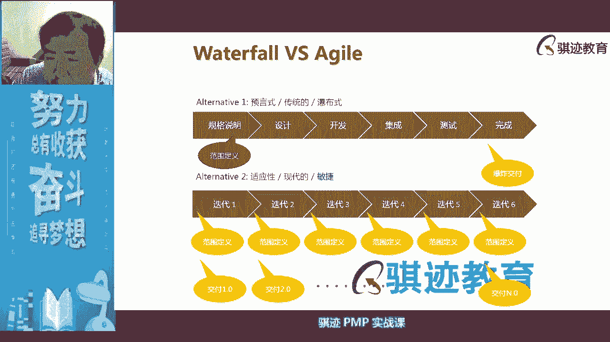

或者说之后呢大家可以再回看一下啊，好那么我们在pmbok第六版中还提到一种啊，不需要太多理解，但是只要知道概念，你要叫高度适应性的生命项目啊，我们这里我在这写，高度适应项目，适应性的项目呢。

往往在整个生命当中持续是持续的实施，所以他看到高度适应性的项目呢是什么，一个项目的生命周期呢会有启动规划，执行监控啊，当然还有收尾了，他没有写，但是呢他但是他不是一个做完再做，另外而是什么叠在一起。

如果一个项目当中，这个几个过程组都是始终是叠在一起做的，我们可以认为它是什么，是高度适应性的生命周期，好可以，但是这个考试当中你只要知道就可以，那么另外一个知道，但是不用考的，要知道。

一般只有经验丰富的项目经理，才会选择高度适应性生命周期，那么高度适应性周期有什么好处呢，管理费用最小，然后呢项目进行的最快，但是它带来什么弊端，项目的管理难度非常大，因为有并行的很多事情在做。

你要避免这个中间产生矛盾和冲突和相互影响，这对你的管理水平和管理经验和管理能力，是有很高的要求的啊，所以一般使用这种生命周期类型的呢，一般都是比较有经验的项目经理会做，否则很容易出岔子啊。

ok有些同学说为什么没有这个，这个是我帮你们改进的pv改进，如果你们这个没有的话，你截个图就行，ok啊是帮你改进，这个是有的，这个是原就是pm，这样提到这样一个生命周期类型，考试会考一个概念。

它不会考的太深入。

好我们讲啊，这个也是一个示意图啊，我们是我加出来的，那么大家可以看到一个项目当中，我们执行的过我们的各个过程组，启动规划，有时候是交叠在一起的，尤其是高度什么适应性，它是交叠在一起，大家看到了啊。

它是交叠在一起啊，这是一个示意图，但是有一点要注意，只监控过程组，你看到吧是贯穿于始终的啊，这一点要注意，监控过程组是贯穿于始终，大家可以在笔记上记一下，监控过程中是贯穿始终，好这个给大家看一下示意。

如果没有，如果你们应该都没有这一页的东西，如果有兴趣，你可以把它截一下啊，这个东西可以截一下。

ok啊谢谢我这位截图的同学可以截一下，好那么这是我们ppt当中，我们的讲义当中所写的这些东西啊，这些这些内容呢我都给大家讲过了，所以这一页我就不讲了啊，啊大家已经知道上完课之后，已经知道生命周期的不同。

生命周期类型的特征，和他们的阶段和关卡之间关系啊，那么我们在讲完生命周期之后，我们开始讲怎么描述五个过程组，五个过程组就相当于我们一天日常的吃喝拉撒，一天呢，这要是描述这个吃喝拉撒这个过程当中。

我们每一个过程都会用一种方式来描述啊，这种方式来说，那么这种方式叫做i t t o什么意思呢，i就是input输入的英文叫input o呢，是输出output tt是什么。

tooth and technology and tooth，tooth and technology，都是t t t开头的，ok啊，所以我们描述之后，大家记住，我们之后描述项目管理过程中。

任何一个单个的过程，他肯定一都会属于五大过程组里的某一个，某一个过程组，第二它肯定会属于某一个知识领域，第三它的描述形式肯定会是i t t，他又怎么样输入，他们又怎么样输出，中间使用了哪些工具和技术。

这是我们pmbok标准的一个描述过程的方式啊，大家大家明白啊，不用特别去记，那么我们可以看一下ppt上讲了，有些时候呢有些事情呢只做一次，在项目上只做一次就结束，比如说制定项目章程。

一般来说除非很特殊情况，一般来说一个项目项目章程是不会改的，一般来说啊咱不能绝对说不改对吧，然后有些事情呢要进行定期展开，比如说什么啊，评估业绩啊对吧，质量控制啊，这些东西呢我们可能要定期进行对吧。

有些东西呢要贯穿于始终的，比如说做监控，比如说项目经理很重要的一个监控工作是什么，进度监控，你做项目肯定每天要监控进度对吧，这是贯穿于始终，有些东西啊。

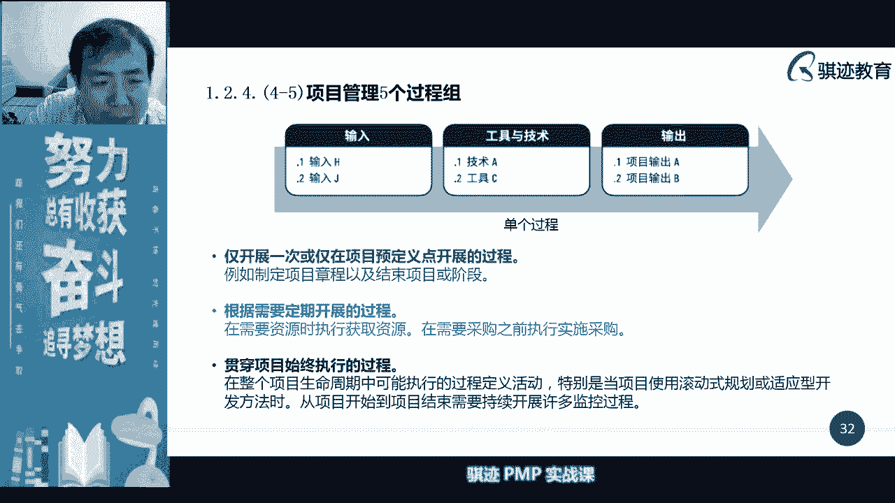

好那么讲项目的边界，我们刚才项目编辑已经讲了，项目的开始的边界是项目章程被批准，项目的结束边界是项目的团队解散，项目的最终的成果呢，移交交付啊，就这样，那么启动阶段呢。

就是对我们的整个项目的目标呢做个定义，所以启动过程组只有一个过程，就是制定项目章程啊，我们后面可以看到，我们可以看到项目启动过程的时候，只有一个东西叫做制定项目章程，规划过程中呢就是怎么定什么定方啊。

定管理方法就定规矩，你们可以在自己的笔记本里写一下，规划过程中做的事情叫做定规矩，我们只定个规矩定规矩，那么执行过程组呢就是什么，干活干活，监控过程组呢是跟踪监控，调整精工收尾过程组呢是什么收尾啊。

顾名思义收尾，然后呢把东西交付出去，这是五个过程中他们各自的分工啊。

各自分工，那么那么这张图其实还挺不错的啊，项目管理当中我们始终围绕着一个三角进行啊，三角进行项目管理当中哪三角啊，叫范进程啊，范进程范围，进度成本是一个项目，永远是由三个事情所组成的是吧，干什么干什么。

第一个是干什么，第二什么花多少钱干，第三用什么时间，多少时间完成一个项目，都是我要这三个事情一干什么，第二花多少钱，第三什么时候完成，都是围绕这三个事情因素啊，三个因素，三个维度所组成的对吧。

那么其他的知识领域，都是围绕着这三个因素去进行的，比如说质量，质量就是为了什么，保证什么，保证我们所做的结果呢能够被客户接收，验收对吧，但是呢它会产生成本，会影响进度对吧。

风险呢有可能会导致什么成本增加，进度落后对吧，范围超出对吧，诸如此类，所以每一个我们的知识领域，后面的知识领域，范进程之外的知识领域，都会对我们的范围，进度成本的一个或者若干个造成影响，有些影响正面。

有些影响负面啊，那么项目经理是在这个管理层面是什么呢，大家看到整合就是把它们捏在一起，所以一个项目经理这是后面讲了一个概念，一个项目经理不一样，不一定需要是成为这个项目当中，方方面面的专家。

但是你一定要在整体上把控整个项目，这是你的角色啊，叫整体把控，所以我一直跟很多人说，我说一个优秀的项目经验师，应该是怎么样的表现啊，你们以后，你们以后可以拿这个去解释你们的行为啊，当然你们要做的好。

一个优秀的项目经理应该是整天干活很悠闲啊，甚至看上去有点吊儿郎当，然后呢平时看着也没什么事，就把项目给做完了，没出什么事，一个不怎么优秀的项目经理是怎么样的，一天到晚叫火对吧，前脚忙完后脚脚不沾地。

然后呢勉勉强强把项目做完了，当然啦，一般来说从老板的眼睛里看，有时候后面那个项目经理有可能会，更吸引他的眼球眼光，但是如果论水平是前面那个项目经理更高一点，一个项目经理最优秀的地方。

就是说能够把一件很复杂的事情，一个很复杂的项目四平八稳的不出事情呢，能够搞定，这是一个游戏项目的体现啊，项目应该体现ok这后面也会可能会继续提到。

好我们继续往下讲啊，这是我们项目项目管理的五大工程组，把所有的子过程，ok这里我提出一个要求，同学们，我提这里要提出一个要求，就是这个这张表的五大过程组的所有的过程，要求要求我们同学啊，要求我们同学。

必须在上完这个所有的一系列课程之后，这里五个过程组的所有的子过程能够背出来，可以吗，如果可以的话，请在公屏上打，把可以打出来，请在公屏上把可以打出来，ok啊我不会要求你现在就死记硬背。

我因为这不符合我的教学理念，但是我认为我认为在上完这一系列的课程之后，最后一节课上完之后，你们应该能够把这个里面的所有的子过程，全都背出来，因为这是每个东西都存在里面的，每一项子过程都会存在逻辑关系。

和啊相互之间的顺序关系，只有把它们背出来之后，你的知识才能产生结构化，所以我希望你们全都背出来，因为我们不是线下课，我可以监督你们，甚至教你们默写，所以我希望你们能做到，可不可以好可以啊。

我看很多同学都说了，可以ok我非常好啊。

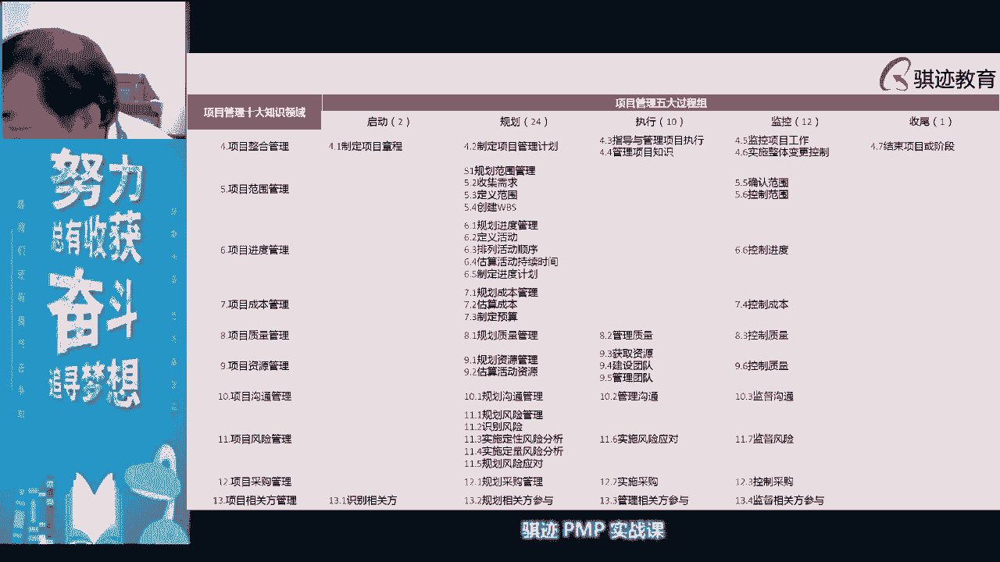

刚才你们说的那个啊，可以啊，可以啊，背过一次排网，那么你可以再背一次啊，ok没有关系，ok啊这个p p t里面的呃六问题，比如说这里应该是控制资源对吧，监控资源对吧对吧，这个屏ok你们看以书上为准啊。

这个这个里面稍微有点小问题啊，以书上为准，我都没有看这个东西，我作为一个老师早就已经背熟了对吧，好我们先跳过去，那么在我们的项目的引论当中，我们讲我们很重要的一个项目的最后的结果啊，有些同学问怎么背。

有方法吗，ok我告诉你们认真上我的课，我会告诉你们每一个知识领域当中，他们的子过程的逻辑关系是怎么样，当你认真上课，把这些逻辑关系记清楚，你自然而然的会把这些子过程背下来，甚至都不用死背，明白了吗。

对老师会告诉你理解心机嗯，很好，这位同学很有悟性啊，那么我们讲可交付成果是怎么样表现呢，注意啊，这里带有框的都是我们的一个子过程，当我们的可交付成果，它会有几种状态，注意啊，几种状态。

第一种叫做可交付成果，第二种叫做核实的可交付成果，第三个呢叫做验收的可交付成果，最后一个叫做可交付成果呢，最终移交只用移交，他有这样几种状态，那么这样几种状态都是来自于不同的范围产出。

那么可调不动物最终最初开始来自于哪里呢，当然先从范围开始，从范围定义开始，然后来自于指导和管理项目工作，然后呢通过控制质量叫做验收，然后再通过我们的确认范围，叫做叫做什么客户验收，这个叫做内部验收。

确认范围来叫做外部验收，叫客户验收，然后呢最后结束的时候呢，要做移交到客户现场，在客户现场进行实施，这样一个过程才能说我们的可不交付成果，最终为客户创造了价值。

ok所以这是一条我们的可交付成果的逻辑线啊，我们在这里提一下，所以这个里面的很多过程呢，第一次学的同学同学呢可能呢还不熟悉，但是呢大家要有个概念，后面呢我在上课当中会反复提这样一条线，ok不要急。

上到哪个子过程，我就会提哪个子过程，不要急啊。

啊这是我们工作绩效的一个管理线，ok工作绩效管理线当中，其实这里哪些子过程呢，我们可以不用看，因为每一个控制过程中都会有工作绩效，这些工作绩效汇集到项目经理所管的监控项目，工作啊，我们在整合管理中会讲。

就会变成工作绩效报告了，但是我们这里要讲的是这个三个的区别，什么是工作绩效数据，什么是工作绩效信息，什么是工作绩效报告o啊，这里注意啊，要概念清楚，第一工作绩效信息是什么，它是单啊，数据是什么。

它是单独孤立的数据，你通过这个数据没办法判断它是好是坏，也没办法判断它的趋势，比如说我数字，比如数字啊，比如说老师身高一米七六，那么如果你从1米76这个身高来看，你很难判断我人是高士矮吧。

我人是1米76啊啊那是对吧，你单看这个身高是很难判断是高甩了，那我问你如果把老师放在一群九零后的啊，人群当中，我的身高算高还算矮，九零后如果是一群九零后的话，算中等，有可能甚至会偏矮啊。

现在九零后尤其是九五后身高都挺高的啊，小朋友啊，但是如果把老师的身高放在一群八零后，尤其是八五前，八零后，八五前的这一群人，跟我的同龄人在一起的时候，我的身高是中等或者中等偏上的啊。

如果把我的身高放在一群六零后的人呢，身身高群体里，我绝对属于身高高的，所以数据单独是没有意义的，那么怎么让数据有意义呢，一定要让它变成一个数据的集合，也就是说数据要进行对比。

所以工作绩效信息就是一个有数据的集合，对比和跟踪的一个内容，ok跟踪的一个内容，跟踪哪有那么数据的跟，有了跟踪，有了对比之后，内容就要工作绩效信息，通过对比就看出，比如说小张身高一米八，我身高一米七六。

啊有些同学说老师84年，谢谢啊，谢谢，我又年轻了一点点啊，谢谢啊，然后呃比如说小张身高一米八，我身高一米七六，所以小张比我高4cm对吧，ok所以这就是一个工作就要对比，或者说老师去年体重200斤。

今年体重200 十斤，所以我的体重趋势是增加了对吧啊，这样一个趋势，所以工作绩效信息呢它会带有趋势，但是光有一个趋势，并不能让所有的相关方理解，你现在处于什么工作状态。

所以工作绩效报告和工作绩效相信息相比一，它来自于各个知识领域，他的信心更加全面，第二最重要的一点是啊，这一点要给我记住，也要记在笔记本上，记住工作绩效信息最主要放映三个东西，一个叫做过去，一个反应的。

现在还有一个反应，怎么预测将来回顾过去啊，反映现在预测将来，然后呢要判断趋势，找出差距啊，这是工作绩效报告，所以你们明白你们的报告问题在哪里吧，很多人为什么不会写报告，就是说不会去分析，光去罗列数据。

他们是没有那么多精力和时间去看的，所以给领导看到报，然后呢给他一个直观的图表展示，然后给他一个结论，我们现在趋势是如何，差距是如何，过去怎么样，现在怎么样，未来准备怎么样，我们采取怎么成了措施。

这是一个好的报告形式的内容，明白了吧，啊这个明白这个考试经常也会考。

这个逻辑比较复杂，所以这个大家稍稍看一下就行了啊，稍微看一下，但是他在每一个知识领域内的流程关系，其实还是比较还是比较清楚的啊，ok大家可以拿这个作为一个呃记忆的基础。

但是我后面会每一个知识点详细讲的时候，会讲的更加仔细些，报告的形式给你打出来了吗，有些同学啊，可以啊，我给你们打一架，分析现在预测将来，判断趋势，找出差距和制定相应的错，ok啊没关系，如果有任何的同学。

如果因为其实你们也可以回看回看，再看这一段也可以，如果你没有和人家当场记忆的话，你们可以跟我说哪段来不及记啊，来不及记，ok现在可以了吗，啊啊所以如果有，所以这位同学啊，这位叫呃。

我们那个另外一个群的小群的，那个叫曾曾雨婷的同学，这位同学体验非常好，当你没有上课，有任何的东西来不及或者跟不上的时候，你们要跟我说一下，跟我说一下，ok啊，因为每个人其实都有差啊，差异嘛对吧。

有些人手快也是手慢对吧，所以当你们觉得如果没有get到信息的话，一定要及时跟我说，ok非常好，我非常啊，非常认同这位同学的这个反馈啊，好我们项目管理的框架是这样的。

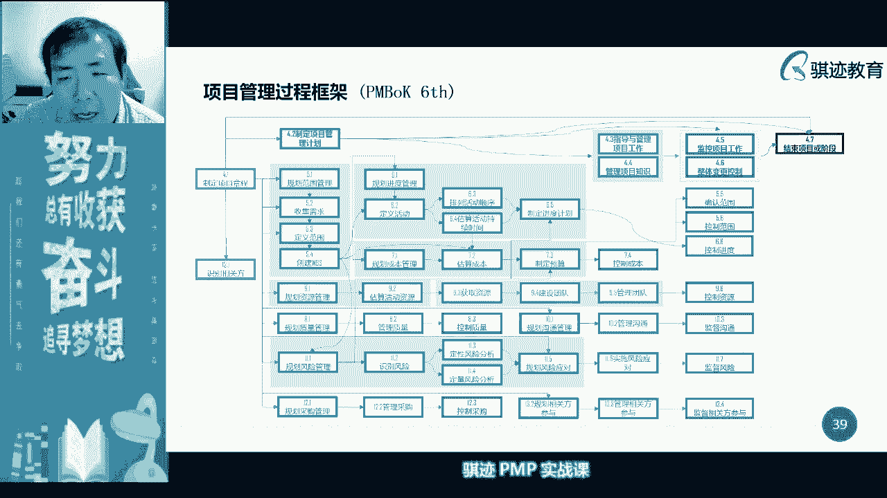

大家可以拿这个作为记忆基础啊，我们继续讲，那么你讲工作绩效信息数据绩效信息就要报告，这是我们这样制定的啊，这个里面是我们的特征啊，这是我们的特征，ok啊，我的讲的描述其实要比这个更加精髓一些。

这些p p t我就不细讲了，你讲在项目管理的工作当中啊，sorry oops，我要打个喷嚏，最近有点鼻子不太舒服，嗯也打不出来啊，啊我们继续，那么我们在项目管理当中，我们要采取一个要采取一个技术手段。

叫做裁剪，所谓的裁剪就是什么，有可能把有一些工作，有一些内容范围呢去掉，然后但是裁剪并不一定是说是去的，也有可能是说在一些情况下把有些内容，有些工作呢加进来，无论是加还是减，我们都称之为裁剪啊。

所以裁剪不一定都是减去啊，也可能会增加，但是这么做的目的只有一个，将项目尽可能地推向成功率高的那个方向，裁剪的目的，就是将项目尽可能推向成功率高的那个方向啊，当然这个理解就行了，不用不用刻意去记啊。

你要明白这个意思就行了啊，所以这个不用特地去记忆啊，大家可以看一下p p t就行。

好，那么后面我们就讲到，我们这些今天的课程当中的，有关计算的一个问题，那么一个项目，我们讲项目的开始关卡是项目的章程得到批准，那么项目章程得到批准的之前的前提是什么呢，项目有一个什么东西啊，商业论证。

商业论证如果做的比较大的项目呢，商业论证和项目可行性研究呢是分开的，我小的项目呢他可能并在一起做了，他做两件事情，第一个这个项目能不能做，就是说possible可不可做啊。

第二个呢啊值不值得做valuable啊，值不值得做，比如说我们说我们可不可以打车，从北京打车打到三亚，有没有可能可能的呀，可以啊，这个这个这个是可行的话是可以的，但是除非你钱太多，否则一般没有人会去做。

因为这么做不值得这么多的代价，我完全可以买一张飞机票，买一张火车票都是可以做到的，打车是一个没有效率的或不经济的一个事情，对吧，所以一件事情能不能做和值不值得做，是两回事情啊，只有这两个同时满足了。

项目才会启动，那么项目启动的时候呢，我们就会启动一个什么效益管理计划啊，注意，那么商业论证和消息管理计划合并起来，就会被提称之为项目的商业管理文，商业文件的主要内容啊，尤其这里注意啊。

尤其这里效益管理计划，注意啊，我给大家打一个打一串字吧，有些东西呢教育管理计划是唯一一个，在项目工程制定之前完成的管理计划，ok好，帮你们一个字啊，把你先打个字啊，sorry sorry，字打错了。

笑一会，好我把你我把你们捏捏贴一下啊，这个很重要啊，好这种概念指导一下就可以了，所以下一管理计划是唯一一个，在章程之前就制定好的管理计划，所以下一管理计划不是你们项目经理能动啊，什么时候能动呢。

就是我们后面讲风险为大，当你硬不得不要应对一些，你本来没有预测到风险，要花额外的钱去应对的时候，你可能会动那个东西啊，ok我们这里先了解一下。

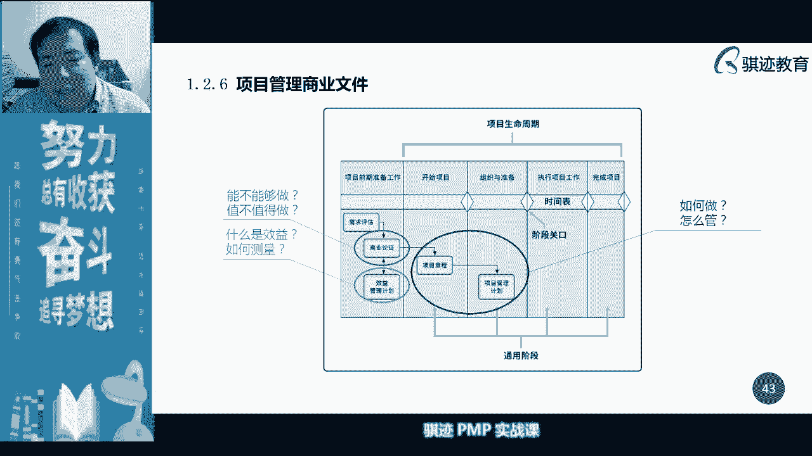

可以，那么商业论证当中有一些东西呢，我们会最后体现在我们的项目文件当中，那个项目文件叫做假设日志啊，因为它体现了项目的假设条件和前提因素。

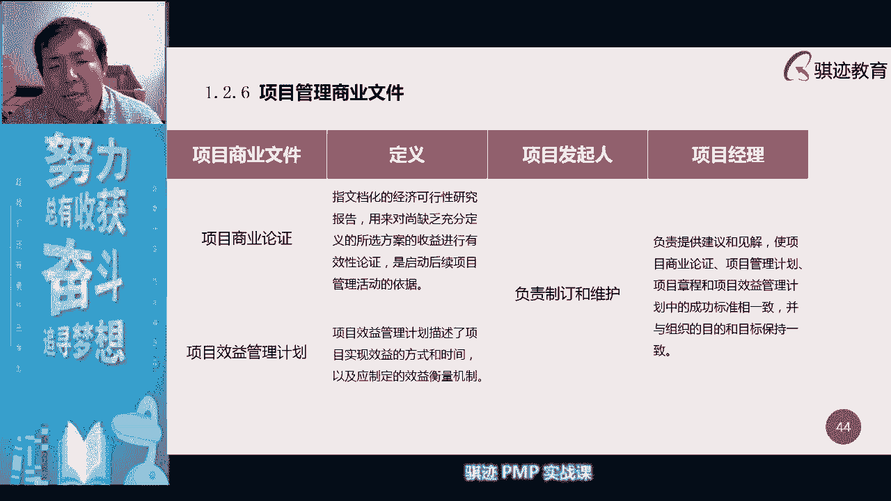

项目管理的商业文件，项目管理的商业商业论证当中，是由项目启动的目标和理由所组成的，有助于项目结束，衡量项目是否是成功对吧，然后呢他在整个项目当中都会用，然后呢有一点有一点大家可以科普一下。

就是项目的商业论证，在一些大的项目当中会做一些循环的商业人，他不是做一次就就做好了啊，它会在一定周期内进行重新的review，重新的审查，这是重新的制作，以证明这个比较大的长期的很重要的项目。

它的一些限制条件，基础啊，基础环境先决条件，外部环境和他的效益目的，是不是啊，仍然成立和存在，是这样，所以比较大的项目，小项目的话就不做，因为商业论证也是要花钱或者花精力啊，这样那么商业论证当中呢。

如果我们有兴趣的话啊，但是今天因为时间关系我就不多说了，有些话就看一下商业论证呢，一般都会会什么，会有甲方出，乙方出和第三方出第三方，比如说像著名的四大，像国内的一些会计事务，他们的演出商业论证啊。

所以不同方出的商业论证其实很有意思，比如说甲方出商业论证，它主要中描述的是什么，都是描述的风险在哪里，它主要是从风险角度啊，乙方出商业论证呢，他都是告诉甲方我这个项目是可行的。

他都是从能够被甲方赚钱的角度去论，第三方论证呢主要是什么，撇清关系，理清责任啊，然后呢呃给出各种各样的假设因素，告诉你会有哪些极端情况，他分析的比较全面啊，所以一般来说。

如果你要出一个比较好的商业论证呢，一般会有时候会找第三方，专业的机构去做商业论证啊，创业认证一般这里我们来pp单元写一遍，会用三种方案，不采取任何行动会怎么样，最想努力会最大努力会怎么样。

而中还有时候还会中什么环境最差会怎么样，一般环境怎么样。

比较有利的环境会怎么样啊，回合这样假设有各种假设，ok这个我们就不多说了啊，不多说了，那么商业论证是我们进行立项，制定商业帐篷的一个前提啊，没有前提，只有有了项，然后呃呃商业项目章程。

只有有了项目章程之后，我们才能接下去制定项目管理计划。

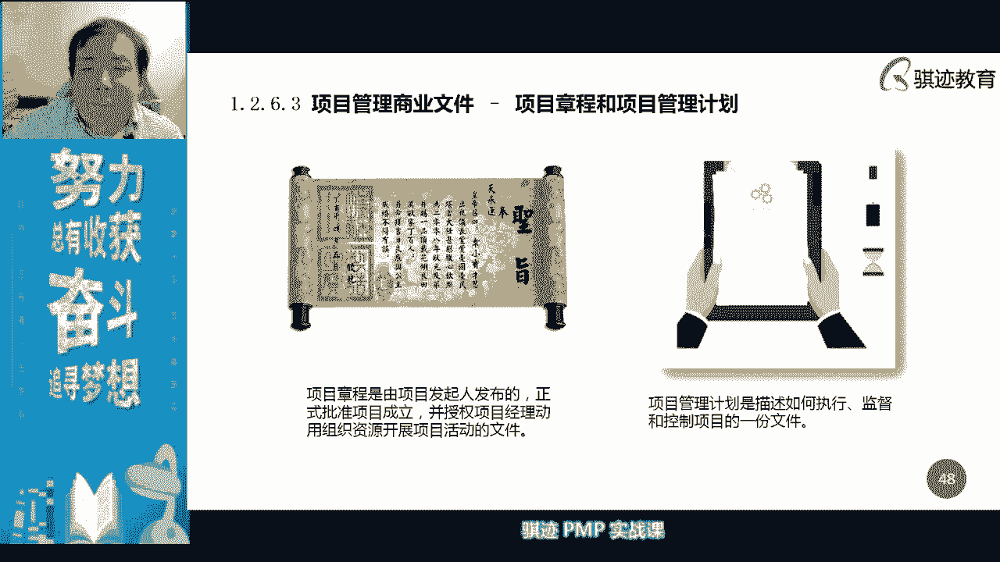

项目管理计划，啊这没了，那么这是项目管理情况，商业论证当中呢，我们又会涉及一些财务，才会去财务指标的财务指标测量，但这部分内容呢还是比较重要的，所以我要大家希望大家认真学，我们在p m p考试当中。

会涉及到这样一些财务指标，会像这样子，其中这三个指标啊，这两个指标npp和r社会要求大家计算的，大家要知道，这两个指标呢在很多的商业文件当中都有啊，大家有兴趣可以看一下啊，他们的募资报告。

ipo的报告里面都会必然会提i和n p，n p n p b和r i都会讨提东西，那么他们什么定义呢。

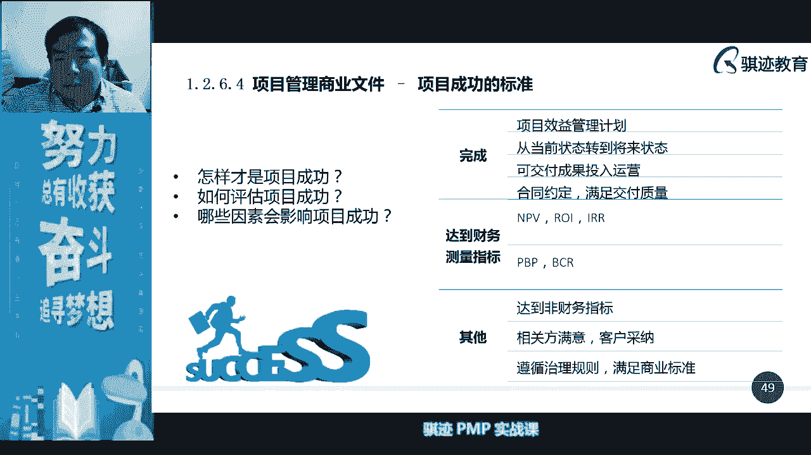

我们来看一下啊，先看定义，先看第一项要要计算的三项啊，要计算的第一项n p比较净现值，净现值也叫做动态收益，动态累计收益什么意思呢，呃首先我大家可能要明白一个概念啊，因为时间的关系，我们就不做做例。

不多说例子了，但是这个东西很重要，概念现在的100块钱和明年1年后的100块钱，价值是一样的，答案肯定是不一样，为什么有一个东西叫利息，有个东西叫折旧，有个东西叫通货膨胀，所以现在的钱永远是最值钱的。

未来的钱呢就没有现在的钱值钱，中间插了一个东西是什么，那么我们怎么样评估，那么我们怎么样评估啊，ok啊有同学截屏啊，我靠我们怎么样评估呃，我们未来若干年的赚了钱，他到底折算成现在值多少钱呢。

我们就会用m p v这样的公式啊，公式已经打在这上面，有同学已经截屏了，ok大家可以看一下群里啊，m p b呢就等于是什么，第1年的收入除以一加r加上第2年的收入，除以1+2的平方。

加上第3年的收入除以一加r的三次方，减去一个初始投资，如果有的话，如果提示里给你初始投资要减没有，就可以不减，同时我们要假设第1年的年末才有收入对吧，一般来说项目总共要投入，其投入之后才会有收入。

不会钱投下去马上就有收入啊，是这样，那么有没有第4年，有没有第5年呢，当然有，可以第n年都有，但是p m p考试当中，因为时间的关系，一般最多只考3年，所以这个公司一般只要知道1+2÷2。

除以1+2的三次方就够了啊，ok这是第一个，那么我们在考试当中，只要知道我们的每年的收入和我们的利息，就可以知道什么东西啊，然后再减去，如果有出手的，再减去筹资，就知道我们能净赚多少钱。

并且这个赚的钱是相当于我们现在的钱可以吧，用了这个衡量，那么我们就可以回答，如果n p b大于零，表示什么，这项项目投资是值得投资的，因为就算算上利息，我们也能挣钱对吧，如果小于零啊，就意味着什么。

如果考虑到时间成本，我们的项目是不挣钱的对吧，是这样啊，这是mp v，所所以它也叫做动态收益，那么像与之相对应的，我们有一个说法叫静态收益，什么意思呢，就是不考虑利息啊，不考虑游戏真的很容易理解对吧。

不考虑游戏r是什么参数啊，哦哦同学很好啊，这个我可能漏出r是利率利率利息利率啊，利率，利率啊，那么，讲完了这个概念明白了之后，后面一个概念就容易简单理解了吧，那么有人要问老师，我在做项目的时候。

我又不知道我的项目利息多少，比如说我的项目的很大部分资金来自于贷款，对吧，这很正常吧，项目的资金来自于贷款，这是很正常对吧，那么我也不知道我是贷款贷的利息到底多少，那么你这个时候你要做在我们做商业。

我们是不是在做商业论证分析分析的时候，你要考虑一个事情，那么我当我利息涨到多高的时候，我们就无利可图了，所以啊就是什么意思呢，我们就要把利息不停的往上涨，往上涨往上涨，涨到什么东西啊。

涨到我们每年的收入除以这个利息，减去初始投资恰好等于什么东西啊，零恰好等于零，那么这个时候，是不是我们能承受的利息的最高点啊，是不是，那么在这种情况下，是不是利息能够长期的利息越高。

我们项目能承受的风险就越大，大家想想看，如果我有一个项目，它的l r r是10%的利息，那么另外一个项目，它的l2 的利息是20%，哪个项目的抗风险能力更强啊，那肯定是20%嘛，一个利息涨到10%。

我就不能存钱，不挣钱了，我就不投了，另外一个项目呢要利息降到20%，我才不挣钱，那么当然是另外一个第二个项目更有赚钱前途，更风险更小对吧，所以r是个叫做什么啊，虽然叫做内部报酬率。

但其实它通俗来说是一个抗风险指标，看利息升到多高的时候，我们将无利可图啊，进线值注意这个东西特点就是进线值等于零对，所以为了进升值等于零，所以他肯定要计算什么一个东西叫做初始投资，所以算r里面肯定数值。

但是我们知道这个等于零，但是我们不知道r，不知道r，那么考试当中这个r怎么算，啊考试当中我们这个r怎么算，考试当中我们r不用自己去算，因为三次方的公式解开再整合很浪费时间，我们可以把答案中给出那个r。

一个一个带进我们的公式去算哪个最接近零，那个就是答案，知道吧，好我来给你打个小架，把答案记下来啊，是把答案中的r分别代入公式公式里，看哪个最接近零，哪个就是正确，代入法代入法嗯，很好啊。

对所以这掌握这个技巧可以大幅度节省时间啊，大幅度节省时间，那么这两个计算是我们要的，给大家做好标记，那么讲完这两个需要计算了，后面的就简单了啊，后面有一个投资回收期就很容易理解吧。

就是我投入的钱投入比较100万，我每年回收10万，那么要多少年才能回收回来，10年对吧，那么这个回收的10万要不要算利息，如果算利息的呢，它就是一个动态收益，按照np比来算，如果不算利息呢。

它就是个静态收益啊，考试当中如果没有告诉你利息r，我们一般默认就用静态收益来算，如果考试当中告诉你r了，它一般都是默认用npv来算，很简单吧啊ai是一个很容易简单，就是说一定周期内的利润处理它的成本。

利润出成本就是投资回报率，比如说我今年做这个生意投了1万块，然后挣了5000块，我的投资的投资回报率多少，50%，是不是，那么明年我投投资投了1万块，然后我的利润啊，注意是利润利润哈，我挣了8000块。

那么其实我回收了18000块对吧，那么我的利润是8000，那么我的投资回收率是多少，是80%，投资回报率是80%，这叫做投资回报率，所以投资回报率肯定会有一个东西，叫做什么时间段，它会有个时间段。

那么如果考虑整个项目的生命周期的投资回报。

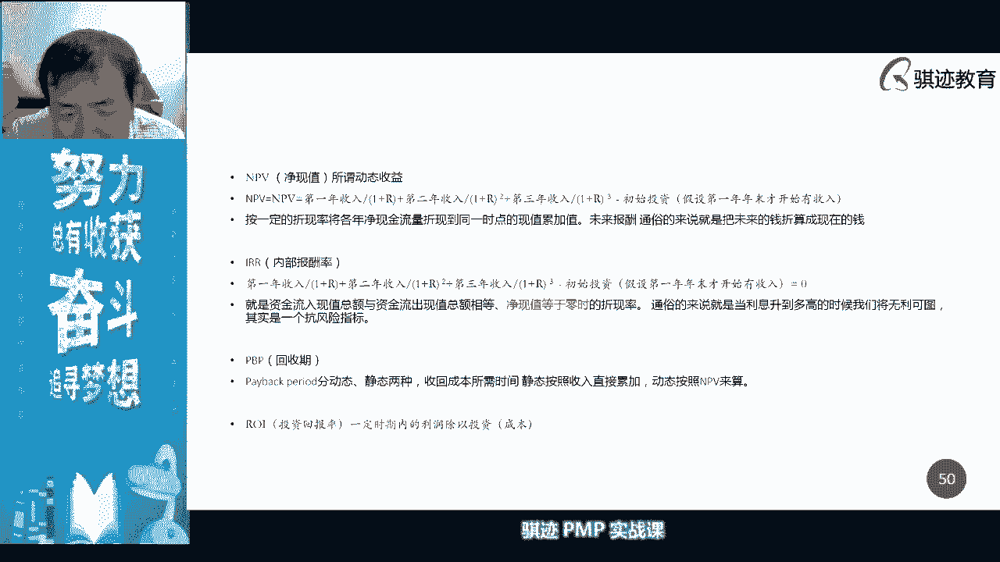

怎么看啊，那么就就是就是什么叫做b cr，整个项目的投资回报，生命周期内的回报的回报率就去看b c r，ok这就是最后的概念，当然b cr呢一般算的比较少，但是如果他他如果提的话，你们可以算一下。

其实计算也很简单，那我就不单独提了啊。

那么有一个稍微体现的就是，我们有一个叫做回投资回收期，可能说比如说如果我投资了7万块钱，每年回本回3万的话，我要几年才能回本，注意第2年是回回来收回6万，呃，啊有位同学说呃，收入指令吧，收入就是收入。

利润就是利润，不是啊，收入和利润是两回事啊，是一回事情，ok啊我们讲啊，我刚才讲到了啊，我们讲如果算回收期的话，也要注意，比如说我投资了7万块钱，1年回本，回3万的话，我第2年是不能够回本的对吧。

所以我的投资回收期是3年，不是2年，注意他虽然最后1年只有1万块钱，但是你也要算他1年，知道吧，要算他1年，所以pvp的计算的时候一定要注意什么东西啊，如果有零头的话，要自动进一，而不是四舍五入啊。

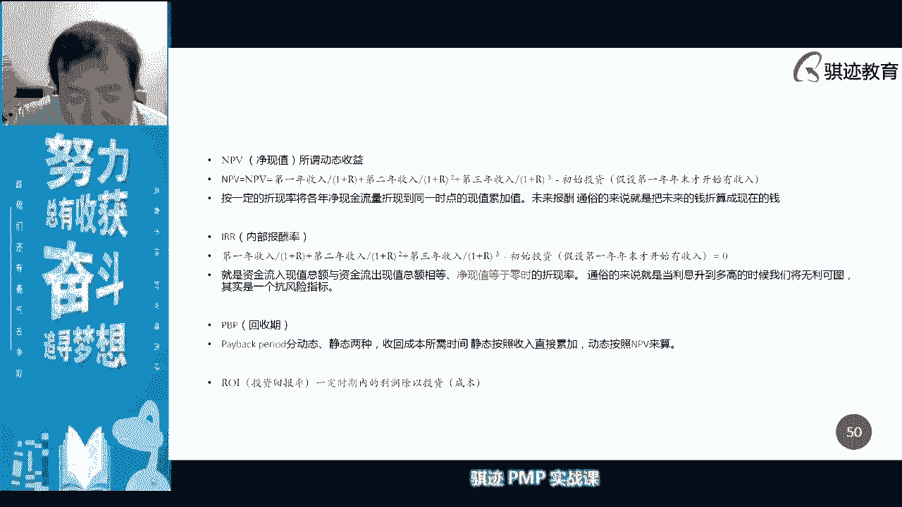

这个特别注意啊，主要其他的其实很简单啊。

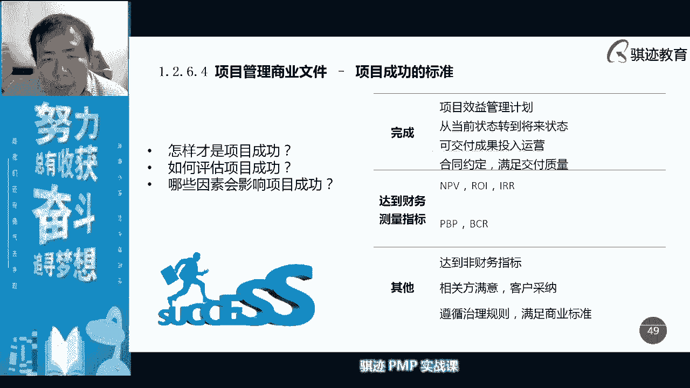

好这是我们的npp的计算，这里有一道例题，大家可以看一下，比如利某项目投资1万块，第1年收入3000，第2年收入5000，第3年收入7000，折现率也就是我们的利息是10%。

那么怎么n p p等于多少呢，就3000÷1+0。1，加上5000÷1+0。1的平方，加上期间除以一，加0。1的三次方减去1万是吧，r那就是说如果将你算r2 ，那就默认我们折现率是不知道就算。

那么我们投资了1万，这个3年的收入在折现完之后呢，正好等于它的投入，那么10000=3000÷1加啊，加上5000÷1加平方加1000多万，然后把这个公司解开了，是不是很复杂，没关系。

你把答案的r带进去，哪个让这个公式两边相等，哪个就是正确答案，啊有同学说sales sales revenue和profit有什么区别，一个是收入，一个是区别，一个要扣除成本。

ok啊这个概念我们当然课后在群里再调整好吧，ok啊这个也要这个东西例子大家可以看一下，需要的话可以截个图啊，好我们今天的课程上完了，因为今天第一天，所以我给大家节奏呢讲得慢一点，但是要点是满满的啊。

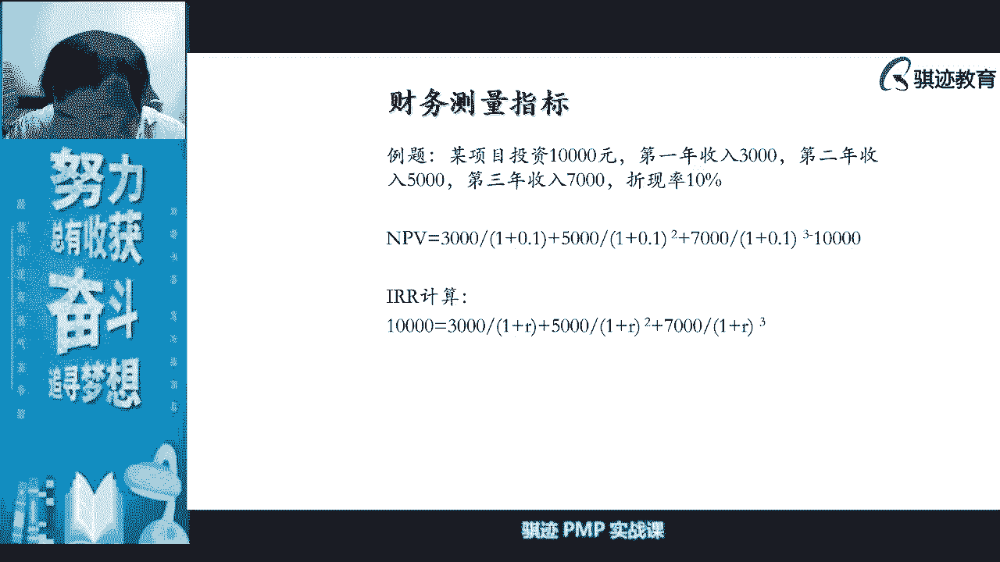

那么结束之后呢，不要急，不要急着离开。

现在第一题，第一题，埃里克是一名项目经理，最近他收到一份供应商赠送的礼品，价值1000块，根据项目所在国家法律，此证明不算贿赂，请问艾利克应该怎么做好，告诉我第一题答案，第一题答案，啊大家在公屏上打。

啊有同学说选b c a再选一个d，我们就全了对吧，这道题明显是问你什么东西啊，法律道德规范对吧，那么已经说法律不算贿赂供应商送你东西，那么你应该怎么做，你要根据责任道德来进行判别对吧。

那么首先第一个第一个收下礼物肯定就不行了，对吧啊，这是违反了道德，第二个上角好像是对的，第三个作为礼物发放，他也违反了道德，第四个敌支付5000块作为购买对价，没有完全支付，它也是变相的啊。

收了好处礼物，所以也是变相了违反道德，那么为什么不算贿赂也要做呢，因为我们要注意一点啊，注意一点，就是说在所在国家的法律不算户主，并不代表你这个行为不是什么，不是符合组织的有关政策。

很多组织有关政策是里面有零贿赂这样的政策，哪怕你这个东西收受礼物，在这个国家，在所在国家不算贿赂，但是违反组织政策，一样是违反了相关的条约规定的，所以是一样是不行的，注意啊，所以b是最恰当的答案。

嗯那么第二道啊b是正确答案，第一道第一道的答案是b，那么第二大x组织遇到了一个困境，因为项目预算有限，导致项目a与项目比，并不得不共用某一个关键资源，这导致两个项目项目经理，经常为资源可用时间吵架。

那么要解决这个问题，我们可以采取什么方法，a任何一个项目组合经理管理a b，b将资源授予ab两个项目，其中一个项目经理c撤销a和b其中一个项目，然后集中到资源的另外一个项目。

第一提升项目a的项目经理为项目基金经理，是他能获得所需要的资源，你们觉得应该选哪个，第二题，啊第二题你们选什么，选a选b，好我们可以看一下这道题目，明显是看是看一个什么东西啊。

啊我看大部分同学都是选a啊，好非常好，答案是a，这道题我们考的是一个项目及项目管理的，关于资源管理的，那我们讲当有资源分配的时候，我们使用项目组合管理是管理资源的分配对吧。

然后这个这个这一道题目的提示当中，a和b的项目呢没有协同作用，但是有什么有资源的竞争作用，所以用项目组合管理呢是可以，但是这道题目如果有选项说没有，用项目组合管理呢，用项目集管理呢也可以。

但是唯一有项目集的答案d提升项目呃，呃项目a的项目经理为项目级经理，以后会获取到所得的资源呢，过于偏颇，所以现在偏僻的考试当中讲，过于偏颇的答案往往不是最佳答案，所以这道题目第二道题目a啊。

a是最好的一个答案啊，啊有同学说这道题说呃题目感觉有问题，多大了还吵架很正常，好没有组合的经理的话，那个那你可以考虑一下d啊，当然这道题目不会存在这个东西啊，因为你们现在没有到考试阶段。

所以我不会给你们出特别难的题目，ok。

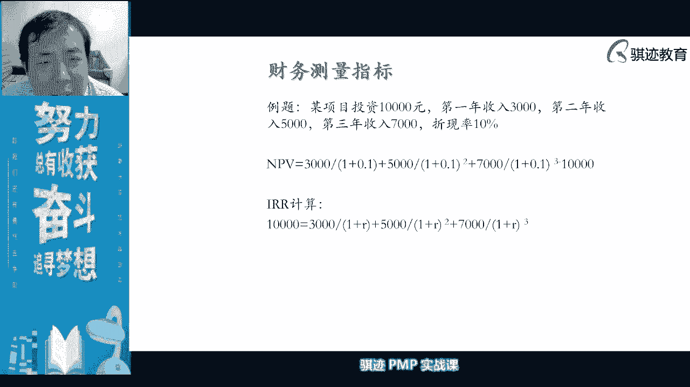

好好我们再做下面的诶，稍等啊，好，第三个，项目在各个生命周期所面临的风险，成本各有不同，其中变更的风险和成本最小的分别是什么，变更的风险和成本，第三道，第三道，第三套项目项目的我们讲讲没讲过啊。

有些同学选c b和d，还有c啊，我们讲项目在什么时候变更最容易啊，开始阶段最容易，所以这个答案只可能从什么a和c里面选，对吧对吧，变更的风险，项目一开始的时候做变更风险是最小的，因为只要改改计划就行。

项目到最后变更风险很大，因为改要改一改，有可能产生一春题对吧，那么变更的成本最小的是哪里啊，变成本最近也是开始，所以应该选c啊，因为什么项目一开始根本没有启动，所以我做变更的话。

也就改改计划就可以了对吧，只要动动笔就画几张纸就行了对吧，但是效果如果产品都做出来去做变更的话，它划分的成本就大了，所以项目一开始变更的风险和成本都是最小的，所以应该选择什么c啊。

所以这道题目是要动一动脑子啊，所以第二第三道题目应该选择什么嗯，变更风险小指的是我变更产生的风险小呀，变更产生的风险呀对吧，因为一开始的时候什么都没定嘛，你变了就变了，你到最后变更风险是很大。

我说项目的风险一开始是最大的，我我现在不是说项目说变更的风险啊，稍微想一想啊，ok有些同学可能延迟比较大对吧，ok啊没关系，跟上大部队项目立项好，我们做第四题，项目立项之后呢。

项目经理拿到详细的范围定义，但是客户表示呢，后续的产品推广阶段变更可能会很多，因此下列哪一项开发生命周期最为合适，预测迭代适应混合哪个，第四道，有选c的，有选d的啊，ok啊。

基本上是集中在c和d这道题到底是哪一个呢，啊这道题很有意思啊，到底哪个，啊这道题要注意一个啊，这道题是有挖坑的，然后呢同学们呢正好大部分人呢没有跳到坑里，但是这道题是有坑的啊。

首先客户表示后续的产品推广阶段，那么这个阶段是确定的，是不是，所以确定的阶段会有很多变更，那么在确定的阶段使用适应性，其实会更好地符合变更，可能很多这个设定，所以在其他的阶段，因为详细范围已经定义了。

所以它是用预测性更好，所以两个拼凑起来就是迪更横行，但是这道题如果说这个表述就不是低了，而是c那么项目立项之后，项目经理已经拿到了详细的范围定义，但客户表示后续的变更可能会很多。

他没有说产品推广阶段变更很多，因因此下面哪个项目最为适合，这个时候就应该选适应性，为什么，因为客户只说变更很多，但是他不知道哪个阶段变更很多，或者方说后续阶段变更很多，他也没说具体哪个阶段变更很多。

这个时候你就不知道在哪个阶段去用，适应行了吧，因为我们说项目的生命周期类型，是项目经理的事先制定好的，所以他必须事先知道，如果事先不知道，为了能够更好地适应变更，他只能全程使用适应性，明白了吗。

所以这道题如果改一改提示，就应该选c，目前的提示下就应该选d，不知道你们明白了没有啊，很多同学可能只看了一个混合，就选混合了，你们没有细细想想啊，细细品一下。

好我们再做后面一道题目啊，小王作为你扔的项目经理啊，发起人啊，作为一名女子项目发起人，小王接下去只要开展工作，开开展开的讨论，那么如果可能的话，小王应该首先参与哪一项工作呢，a拜访客户。

以最快的了解客户需求，比起到项目章程，你尽快拿到授权，c撰写s w w和rf p，第一召开icebreak会议，和项目成员相互熟悉，您先您先做哪个，我们第五道题目，ok我看了很多啊，我看了很多答案。

a和b有些同学觉得不是a就是b啊，很好选a的同学是根据经验出发的，ok但是不符合我们pmi的啊规范要求，所以很恭喜选b的统计答对了啊，ok啊一个项目经理如果要开展工作，首先应该什么尽快获得授权。

所以他一开始最初的一项工作，什么参与我们的商业论证，参与了杀人论证过程，可以了解项目，接下来要拿到授权以后，你才是一名真正的项目经理，你下去可以开展工作，否则你都没有权利去开展工作。

这是官方的标准的定义啊，啊这样你们所说的东西呢也有道理，中国人呢总是比较有责任心啊，但是这是一个全责的事情，所以这道题选b更合适，好第六章项目的第一阶段是可行性研究，根据偏概的呃。

可行研究需要哪个阶段的管理过程啊，过程组啊，好有人选a d配套，还有人选其他的吗，第一好有人选d啊，我明明你们的意思，因为d最长对吧，哎呀还底下打一个问号，打一个问号，就这么说吧。

你要知道这个题是有点小坑的，那坑在哪里呢，他写的项目的第一阶段，说明他是第一阶段的工作是可行性研究，这是个阶段，一个项目在一个阶段内，他肯定完整的执行了整个项目生命周期，所以他拥有所有的过程组。

所以答案是d，答案是d啊，还有选很多选a的同学就错了啊，ok啊所以这道题的重要自研啊，第一阶段的可行研究啊，第一阶段，所以它是一个项目阶段，这要是个阶段，他们才有完整的项目生命周期，对吧啊。

ok所以应该选d啊。

被挖坑了对吧啊，好那么最后哦还有两道sorry，我还要留两道选择题，然后还有一道回家作业啊，明天做，明天做点好，第七题，项目处于第二阶段的收尾阶段，作为项目经理的麦克不应该做哪个项目，哪项工作诶。

重新规划第二件的定义，并以和用户确认基准要求b，总结第二阶段工作成败得失，并推广c对第二阶段的交付进行确认，以满足下等要，第一要求团队做经验总结，不应该做哪个，好ok好的，大家都做的挺不错啊。

啊没有其他意义，第七道确实是选a啊，选a没问题，ok都明白了对吧，项目的阶段公考做哪些啊，一总结经验，在那成的经验成败得失对吧，然后呢进行改进对吧啊进行就呃就这么改进。

第三呢我们要做什么可交付成果的移交易，满足下一阶段的需求对吧，a这种人这种叫消毒士啊，消毒势吕是不行的啊，是不符合的好，最后一道选择题，项目因为意外情况终止了，项目经理jack应该做哪项工作。

a将项目终止的财务报告提交给财务部，以证明不是自己干的，b与项目团队召开项目结束庆功会，c因为项目终止了，所以将半成品的可交付成果交给组织职能部门，继续做完，第撰写项目报告。

叙述项目终止原因及经验教训啊，好那么第八题很简单啊，我看很多同学都回答了啊，没问题啊，第八题应该选d项目页，提前终止或者终止都要写什么终止原因对吧，ok啊，没问题，ok啊大家辛苦了。

那么今天的课程就到这里，最后的一道题目啊，大家会去做，做完之后呢，群里面贴一下，大家可以截个图，截个图，或者大家谁截个图，做了截一下图，然后我们留一下，最后一道题目好，好我第一啊，我们第一次的课啊。

课今天就上到这里啊，因为我们是第一次上课，所以我的节奏其实放的慢一点，内容讲的细了一点啊，细了一点，然后下次课程当中呢，我们可以节奏可能会再稍微快点啊，老师为了大家理解，知道吧。

其实我跟大家说了东西还是能够帮助大家理解，因为上来的一两次课呢，可能因为概念会比较多，可能大家会接受起来比较慢一点，之后的课程呢就会逐步逐步的加快啊，除了大家进入状态之后呢，我就逐步逐步加快好。

今天的课程就到这里，谢谢大家啊，已经有同学在群里面截图了啊，下次大家可以在明天到后天晚上之前，大家把题做完了，题目呢贴到群里或者进行讨论一下，然后回答一下问题。

ok好。