# PMP认证考试课程最新完整免费课程零基础一次通过项目管理PMP考试 - P33：PMBOK第六版 第十一章项目风险管理-34 - 骐迹PMP - BV1Sb4y1f7Yt

好我们开始上课啊，我们开始上课啊，然后我们前面讲到了风险登记册的第一次出现，对不对，然后我们讲到这个概念啊，就是在风险的从识别开始的各个后面的此过程，它都是会什么定期的重新展开，因为只有定期的重新展开。

才能保持我们风险当前的识别状态，详细信息呢是最新的，那么风险登记册是一个登记单个风险的，详细信息的东西啊，大家看啊，是登记单个风险的详细信息，那么风险的整体信息在哪里呢，是在风险报告当中。

那我们后面会讲，不要急，在整个项目的第一次出现的时候，只有已经识别的风险，潜在的责任和潜在的应对措施啊，注意第一次出现，那么如果我们后面迭代的去展开的话，那么我们每次新识别出来的风险。

都是只有在这个阶段，是都是只有已经识别的状态，已经识别的风险状态，已经识别的潜在风险责任人和潜在意内核实，但是对于老风险，他可能已经有老的风险状态需要和风险，责任和风险的措施和风险的应对计划。

都是有的啊，都是有的，但是新识别出来的只有潜在责任，潜在性的说这里这一点一定要记住，一定要记住，那么同时它也是最详细的，针对于单个风险的详细情况的一个描述文件啊，描述文件，那么如果考试当中大家遇到。

如果你要知道单个或者是风险的详细情况，看哪个文件，看风险登记册啊。

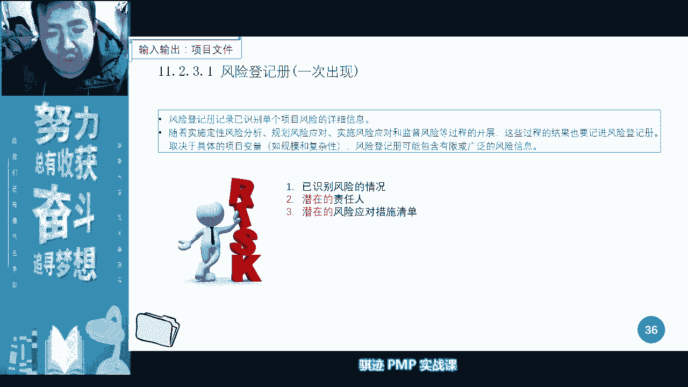

如果我们要看整体风险状态呢，就看风险报告，接下来一个啊，接下来就讲风险报告，风险报告是关于整体风险的信息，它对于已经识别了单个风险呢，有一定的概述信息，注意啊，这个描述其实是不严谨，应该饿了。

它有可能对于已经识别的高级别的，尤其我们非常要整体上非常关注的那些风险，有概述信息啊，它不会有所有风险的概述信息，注意啊，风险报告当中不会有所有单个风险的概述信息。

但是它只会有我们关注的高级别的大范围的啊，或者相关方特别在意的高级别的一些风险的，它的概述信息，嗯好我们就讲，那么在风险管理当中，风险报报告的编制是个渐进的过程，它随着我们的各种管理动作的展开呢。

也会被更新啊，这是第一个，第二个，记住风险报告和风险登记册没有直接的关系，也就是说我们不会从风险登记册形成风险报告，风险报告是根据我们风险的，各个方方面面的分析之后得出的，而不是根据风险登记册得出来。

这个特别注意啊，这个特别要注意啊，千万不要写错，千万不要写错，所以这两个没有直接的关系，但是他们里边都含有风险的信息对吧，只不过一个概要信息，一个是详细信息啊，但是他们没有对应的关系，没有形成关系啊。

因为他要通过分析才能够得出啊，不特殊，好那么风险报告当中还有什么整体的风险来源，就是说我们整个项目当中，主要的风险来自于哪里，对吧啊，后面会讲啊，不要急，然后呢。

第二个呢对于已经识别的单个风险的概述情况，比如说什么我们已经识别有多少个机会，多少个威胁对吧，这个整体概述情况啊，所以这个描述不太严谨，应该说是项目整体的风险概述信息，比如说整体上有多少风险。

多少个机会，或者说在整体上有哪几个风险是最大的风险，我们一定要特别当心，他也有可能出现风险大啊，但是非常少，但是它也而且不会有含有详细信息，就会有概述信息，那么在风险的分呃，还有呢风险的分类情况对吧。

我们有多少个高风险，多少个中风险，多少个低风险，然后呢我们根据风险管理计划的各个要求呢，还会含有其他信息，其他信息好，这就是风险报告啊，ok明白了，所以我们要看风险的整体状况，看什么，看风险报告。

我们要看单个风险它的优先级别看什么，看风险等级特对吧，我们要看看有多少个高优先级的风险，看什么，看风险不高，明白了吧，好那么风险报告是不是也是定期更新的，对所以风险报告是一个定期更新的东西啊。

每一期都不一样啊，每一期都不一样，那么如果我们就这样参照，我们昨天有个群里有个同学说啊，如果有一名相关方，他第一次参加项目的风险会议，那么我们应该可以给他看什么东西啊，最近一期的风险报告就可以了对吧。

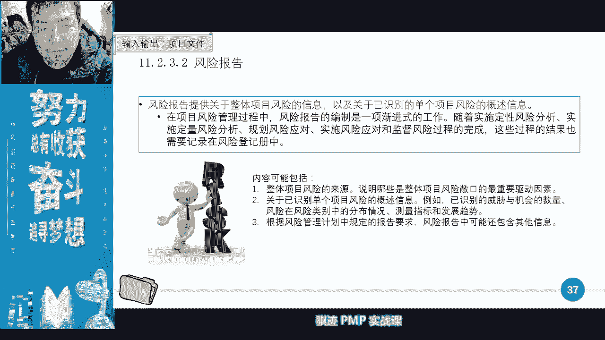

那么风险识别之后，我们就进入了风险的定性分析，所谓定性分析这个四个字啊，四个两个字，定性这两个字意味着什么，意味着它的识别方法是主观的，而非量化，它以人的主观判断为主要依据啊。

所以定性分析和之后定量分析区别是，定性分析是以人的主观方法为依据的，它不以客观的数理统计方法为依据啊，定量分析要求我们什么，完全是以定量工具作为同，尤其是以统计学的工具为基础进行分析，所展开的。

不允许有主观的成分，就是我不可能认为这个东西是0。6，这个东西是0。7，那么到底是0。6还是0。7呢，还是0。65呢，还是0。655呢，这个东西在定性分析的时候，你只能指定一个，但是在定量分析的时候。

你必须通过计算去证明，这个东西大致上是属于哪个，并且概率有多大，执行区间有多少，这个就是这就是不一样的东西啊，所以它更多的是一种主观的判断，那么定性分析主要的目的作用是什么啊，找出风险的优先级啊。

这是一个还有一个目的，就是找出风险的责任人。

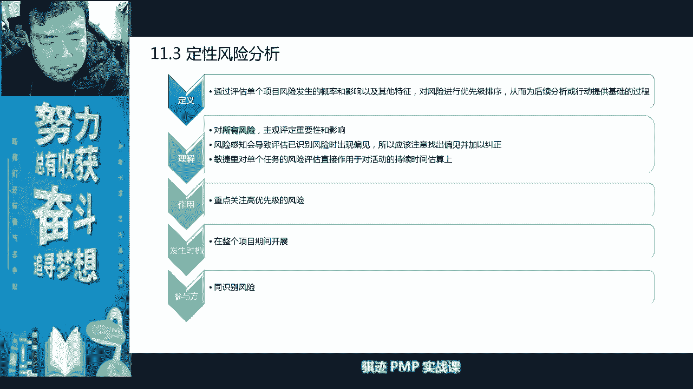

好，那么接下来我们要看风险的定性分析当中，会运用到很多工具，会运用到很多的分类啊，然后会运用到我们之前讲的风险的概率，影响矩阵啊概率，然后它会输出什么风险登记的风险报告，假设日志，风险日志。

那么假设日志其实就是输出更新什么，我们各种各样的假设条件，因为有一些风险就是根据假设条件来的，有一些风险呢会改变假设条件，所以它会假设日志啊，注意，所以我们在实施风险定性分析的时候。

输入也会有假设值输出，也会有假设值输出呢一般就是假设置的更新。

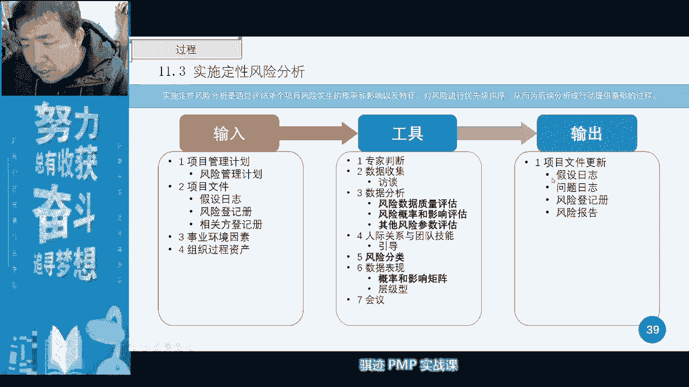

好那么实施风险定性分析，目的呢是评估单个风险，然后对风险来进行优优先级排序，尤其是关注什么啊，高优先级风险，因为这这定性的时候呢，因为是主观判断，所以呢要纠偏纠错啊，避免偏见，同时我们有个很重要的任务。

会在定性分析制作啊，这个是有很多东西忘记了，这个风险的责任人是在哪一步出现的，风险的责任人是在定性分析之后出现的啊，注意，但是风险的措施是在风险的规划，风险应对的时候出现，他和中间呢跳了一步。

跳了一个定量分析啊，所以一定要注意啊，出责任人的时候，你要记住一点，出责任人的时候还没有出方法，应对方法，应对措施啊，中间还要跳了一步，什么定量分析一定要记住这一点。

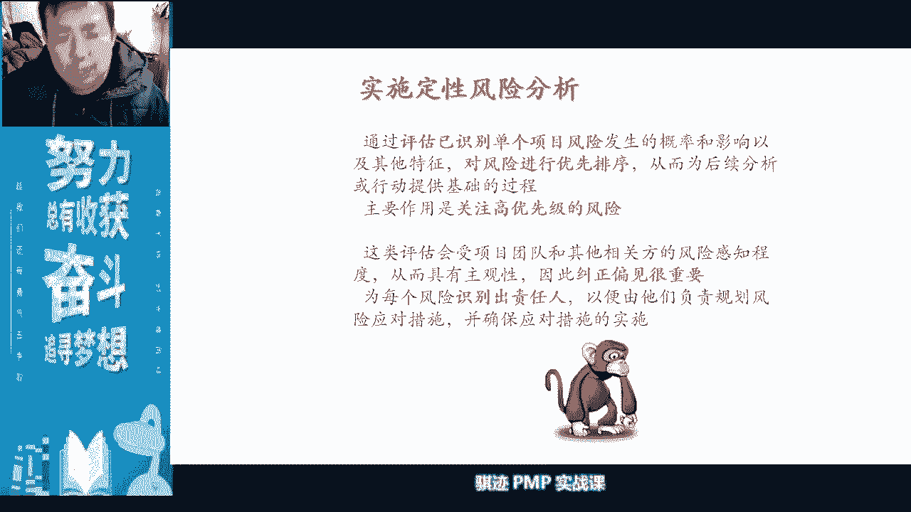

你不会跳好，我们具体看一下，那么在风险的定性分析当中呢，我们进行风险数据的数据质量评估，如果数据达不到，那我就无从评估啊。

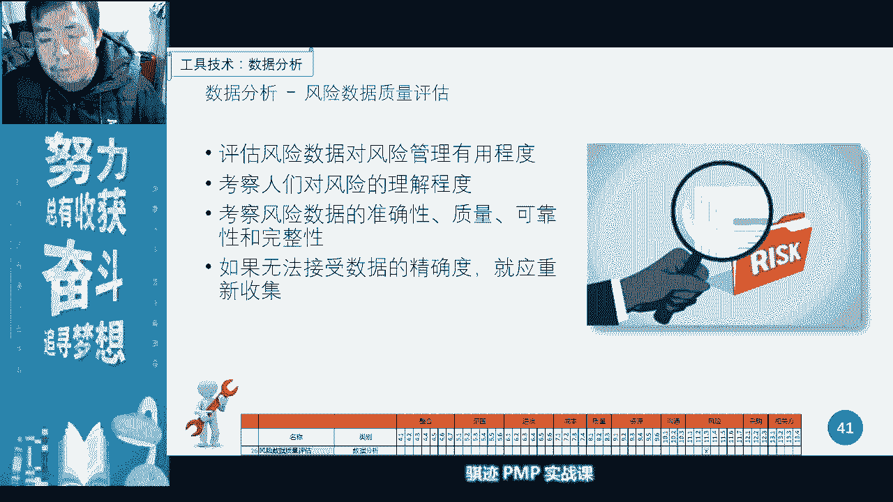

数据的评估，然后呢我们会使用风险概率影响的啊，矩阵这个矩阵呢进行什么进行风险的分类啊，那么如果我们有大量的风险，我们已经识别到，在识别风险当中已经大量风险了，那么我们会把对每一个风险呢对它进行打分。

两个维度打分，第一个它的可能性，第二个它的影响性，那么我问你们，彗星撞地球是一个什么样的风险，是高风险中风险还是低风险，同事问你们，彗星撞地球是一个风险还是机会还是风险，又是个机会。

啊彗星撞地球是一个同学说的对啊，是一个非常低的风险，非常高的啊，错了啊，那就理解错了，所以我就知道有些同学说是高风险，彗星撞地球是一个低风险，为什么彗星撞地球所带来的威胁是极大的是吧。

有可能造成生灵涂炭对吧，比如说地球上有，比如说现在地球上不到100亿人对吧，那么可能死了，死了以后呢，只剩下可能几亿人对吧，80%以上的人会死掉对吧，那么他的威胁几率呢，可能我们可以说0。99。

但是彗星撞地球的几率在你的有生之年，可以看到有生之年是0。00000001，多少个零，然后你把这两个数字，根据我们的风险概率影响的定义，矩阵也算他的成绩值是多少啊，零点几啊，它的它的权重只有零点几。

所以它是在非常非常这里的，这里这里这里这里的角落，这里头或者是这里的角度，所以它是一个低风险，明白吗，为什么为星象，地球是个低风险，就是因为它的概率和它的威胁或者的机会，成机呃。

机遇沉积起来是一个非常非常低的东西，那么卫星这彗星撞地球一定是个威胁吗，不是有可能是机会啊，灰烬赶紧多一下，之后呢，人类世界重组了对吧，带领人类从天灾当中走出来，对吧啊。

这个接下去就是就是那个叫什么小说了对吧啊，什么门户网站的小说了对吧，ok啊奇幻小说了ok啊，那么我们呃这个就不做草了啊，啊所以评估一个风险不能仅仅看他的什么啊，有些同学为什么说是高呢。

啊你是因为什么他只看到了影响程度高，但是他没有看到什么东西啊，概率高不高，一定要把概率和影响程度呢乘起来再看看，搞不好综合的品牌，所以我们在这个在这个方面，我们在风险评估上，可以使用访谈和会议的形式。

进行风险的一个什么评估，风险的评估，ok好，那么在这在这样这样一个过程，在这样一个过程和这样一个结果，然后呢，大家都已经对风险的概率和影响，提供了有所了解，所指纹怎么用了啊，所以纠偏纠错错很重要。

所以我刚才为什么纠偏纠错，就是你主观认为彗星撞地球是一个巨大，对人类极其巨大的威胁，所以它是一个高风险错，要看它的概率，概率乘一乘算下来，他概率加可影响极低，所以它是个低风险。

所以人类没有必要担忧彗星撞地球这件事情，至少在你的有生之年不用担心啊，非常低，所以恐龙是点背产品，觉得，人类目前还不用考虑这种点位的事情，因为恐龙生存了上亿年才遇到，你是比尔贝，所以这个经过了慢。

但长了非常漫长的时间之后，这个发生的概率极小，概率积累积累积累起来，从最终总会发生对吧，人类的历史还很短，所以还没有积累的这个东西，不用考虑点背这种事情好，所以纠偏纠错很重要。

我为什么举这个例子就有道理啊，啊所以我记得我们我们轻松也讲过的，记得啊有有个人讲过一个冷知识，网上看到一个冷知识，就是说人类做生存的时间，我们人类是现在的吧，从人类的历史也就几10万年最多了吧。

我们将原始人算上也算人吧，几10万年差不多吧，就是说在这几10万年人有人类开始到有孔呃，有霸王龙，这段时间大概差了1亿年，但是你们知道一个冷知是什么，霸王龙和我们侏罗纪公园。

经常看到那种三角龙吃草的那种三角龙，它们出现的时间也差了将近1亿年，所以人类和霸王龙相聚的时间，和霸王龙和三角龙相聚的时间是差不多的啊，我听到这样一个只是很有意思，因为恐龙存在时间特别长。

以至于很多事情你们你们都觉得不可思议啊，ok好，那么我们讲完这件事情之后，你们就知道恐龙为什么点背，恐龙没有点背，是因为他们存在时间太长了，总会挨到小概率事件对吧，我们人类还历史很短暂。

我们人类还是一个很新鲜的事物，所以我们不用考虑这种点背的事情，所以在风险概率影响矩阵当中，它是一个极低的优先级的风险，所以我们不用晚上是不是要考虑，明明天会心壮地就这么生存啊。

不用考虑这个事情好，你继续讲，然后呢，还有其他的风险参数的评估，风险当中我们除了考虑可能性和影响之外，还要考虑临近性紧迫性，可管理性和连通性啊，什么叫临近性紧迫性，潜伏性呢，就是说有些事情呢他呢和你来。

对你来说呢，接下来就会发生，有些事情它发生的概率很高，但它不是接下来就发生了，对吧啊，就比如说这件事情你们知道有一件啊，另外一个冷知识啊，所有的人类，所有的人类啊，不同人体质不一样，就开始白内障。

所有人无一例外的都会有白内障，所以每个人患白内障的概率是100%，那么白内障对你的来说是个这个风险大不大呢，不算很大，因为白内障不致命对吧，但是每一个人都会发生白内障，只要你活得够久，都会生白内障。

但是它只会在年老之后再生，所以它的临近性紧迫性呢很低，所以作为一个年轻人，我们直播间大部分都是年轻人，不用考虑白内障的危险，等到你60岁以后，你再考虑白内障，因为他已经跟你很临近，再考虑到白内障风险啊。

老年人可以免费做白内障手术啊，啊你们要知道啊，所以以后等你们年纪大了，觉得看不清东西了，不要担心，这是你正常的年呃，生理老化，你只要去做个白内障手术，你就有眼睛能看得清啊，不用担心。

所以就要临近性紧迫性啊，然后呢可管理性，可监控性。

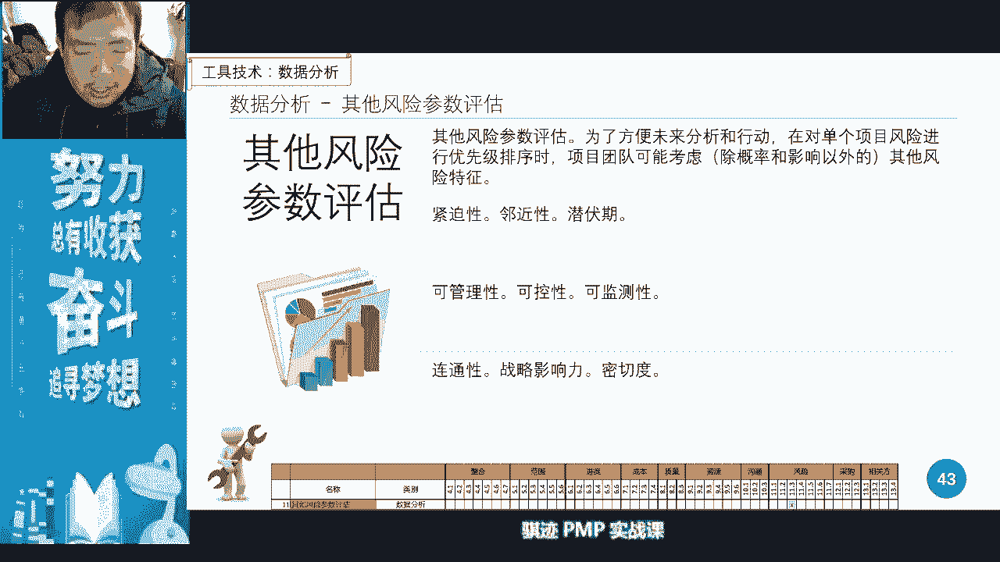

可控性，连通性，战略影响密切度啊，这些大家都容易理解，那么风险还有风险的分类，我们分类除了我们刚才讲的临近紧迫性，除了讲的概率会影响，还有什么风险来源，根本原因受影响领域在哪个阶段发生。

它有什么样预算等等这些东西，这些风险分类呢都会care category呢，都会什么在我们我们之前的啊，我们之前的风险的规划，风险管理当中，风险管理计划当中都会有定好定义好。

好那么那么我们可以看我们举个例子看啊，野餐项目我们的概率音箱矩阵，在一个野餐项目当中，我们讲天下雨它的概率高不高呢，第一那么影响程度呢高那么高和低呢，中中和一下呢，它影响程度就是中对吧，堵车概率不高。

影响不高，所以他就严重低，加油呢啊概率很加油，排队间过程啊很很高对吧，可能最近降油价了对吧，然后就高对吧，应该是中低，最后还是低对吧，然后呢有些什么东西是有多高的呢，比如说三明治也才三明治。

到了目的地发现我发现坏掉了，那么概率挺高啊，高的那么影响程度也很高，所以他是个严重风险对吧啊，因为如果我们出门出了距离远，是不是东西容易坏对吧，所以有钱人的车里会有一个车载冰箱对吧。

车载小冰箱到了墓地发现忘记带帐篷，固定装置对吧，ok这就是个例子啊，这就是个例子，我们通过概率和影响他们综合起来，成绩综合起来去判断他们的严重程度，但是注意这个是一个什么啊。

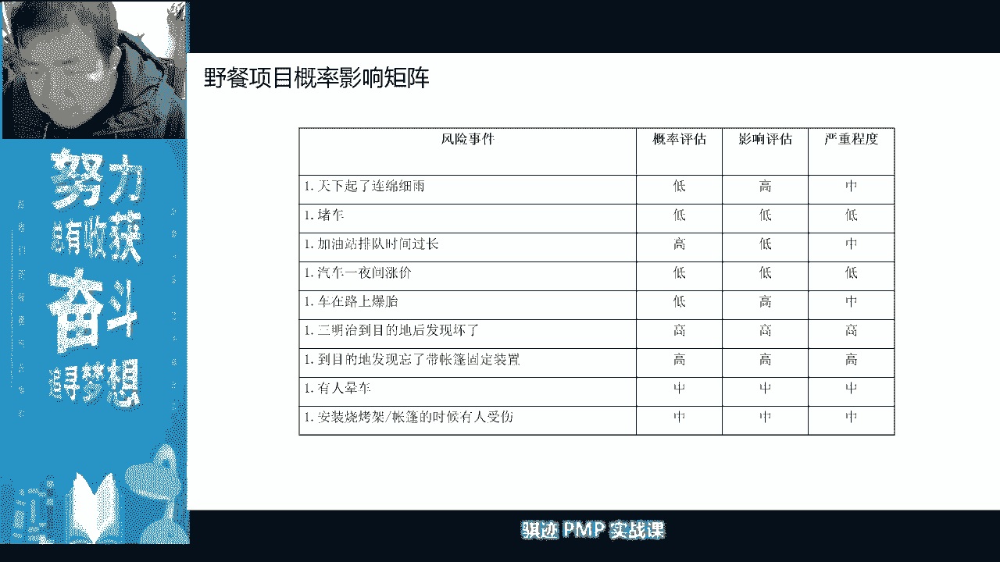

我们前面讲了，这是一个定性分析，为什么通过计算得来的风险。

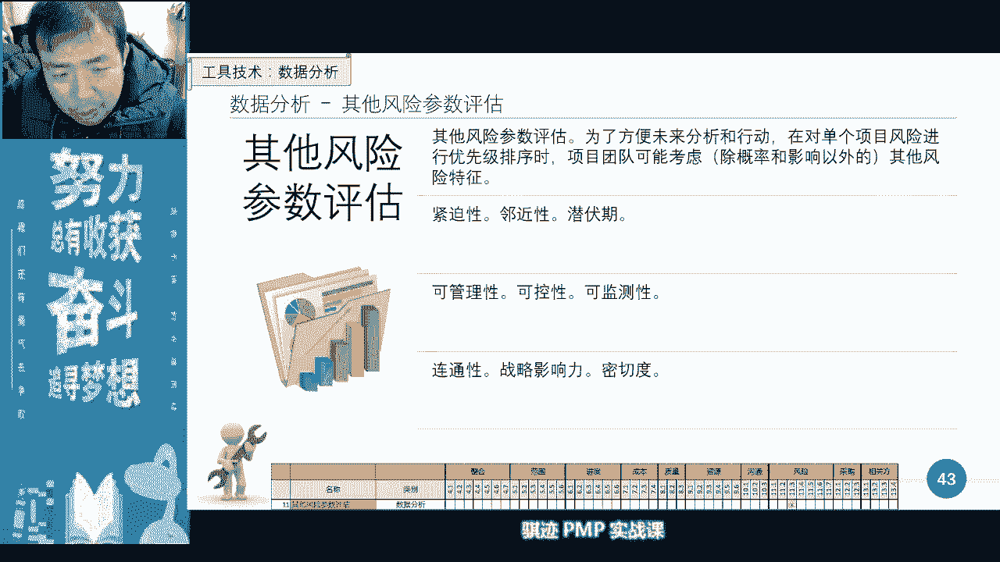

概率影响的一个结果得出的优先级，它是个定性，而不是定量呢，来公屏上告诉我，告诉我，为什么风险，概率影响评估得出的单个风险的优先级，它是一个定性分析，而不是定量分析，请告诉我理由啊，公屏上，请告诉我。

请告诉我为什么，有同学要回答，无准确的数据支撑，不是，啊有同学回答人的主观判断，嗯可以啊，这个回答可以，那么为什么呢，是因为我们讲每一个风险，它发生的这个概率，是你通过主观判断得出它的影响。

也是你主观判断得出了，这个格子也是你主张去划的，所以它划在哪里也是一个主观的过程，而且这个格子滑的也是一个非连续的，所以你看这个格子的分布，其实是个非连续的一个一个分布概率分布。

所以它不是一个客观量化的一个结果，所以它是一个什么定性分析，而非定量分析，ok啊这明白了，ok啊，所以对我故意问这问题的大家回答一下，所以会加深你们的印象啊，记住啊，所以风险概率影响评估是一个定性分析。

不是定量分析啊，就是这个道理，ok啊。

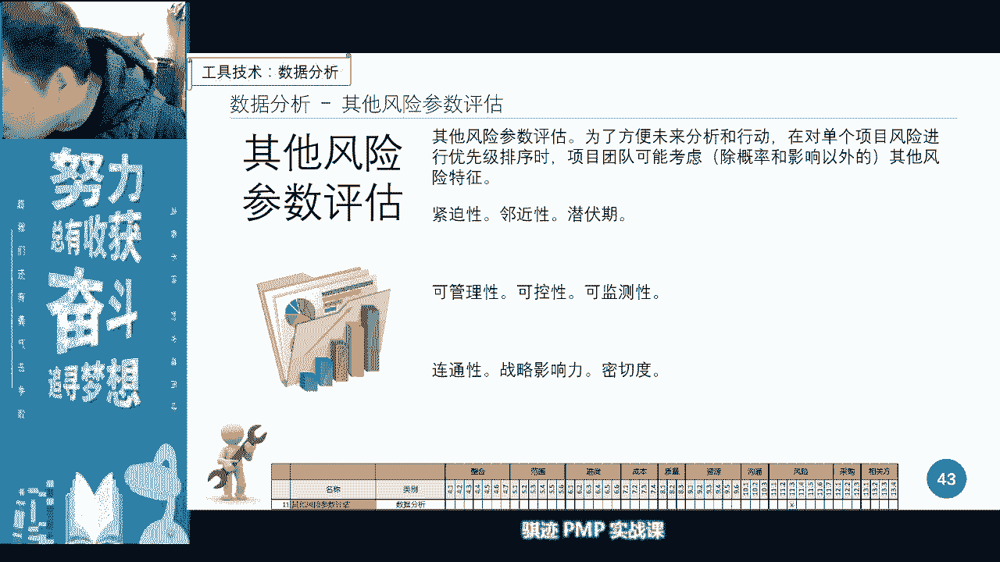

好啊咱们继续往下讲好，那么在风险概率的风险的定性分析当中呢，我们还会用一个东西叫层级图，叫做气泡图啊，气泡图的图呢是一种表现图，它是用一种汇报的，他是首先汇报我们整体风险的一个什么啊。

一个风险的一个状态，一个风险呢它分为什么临近性和可观测性，如果一个一个风险又临近，又可以观测得到，那么对你来说是不是威胁就大，如果有一个事情威胁非常大，而且迫在眉睫，是不是这个东西很难容忍啊。

如果有个事情威胁很大，但是呢会在很远以后再发生，是不是有些人就觉得无所谓对吧，比如说比如说哪天死神到你家里来说啊，年轻人30年后，30年以后回来取你狗命，那么你会觉得什么来好了，随着30年后发生什么事。

比如说死神跟你说，年轻人三天以后我来娶你狗命啊，那么你会怎么办，哎呀完了我只有三天寿命对吧，所以你从我刚才的表述就可以看到什么，这个事情当中越临近，那么这个气泡呢，风险这个气泡呢就算越小。

大的呢就不可接受对吧，同时呢这个事情越大是不是越不容易接受啊，所以在这个气泡图当中，我们用大小和邻近这样两个东西啊，大小和就是说它的可可监测性的这个大小，和它的邻近这两个维度属性的。

来表现整体风险的分布状况，分布状况，那么这张图就可以用来表现的风险的地方啊，那么我们可以看到呢，当前项目当中呢有一些临近的大的风险项目，但是呢也有很多呢非邻近的大的呃。

非邻近的大的风险在未来中间呢反而偏小，所以我们临近当中呢，只要解决一个临近的最大的项目，其他的邻近的最大的一个项目风险，其他的项目风险呢都是可以容忍接受啊，但是在未来呢。

我们又依然可能面对一个什么项目当中的，一个一个风险的一个冲击啊冲击，那么有了这样的气泡图，我们就可以在风险报告当中，能够很好地表现风险的现在状态和未来状态啊，以便于汇报状态或取决策。

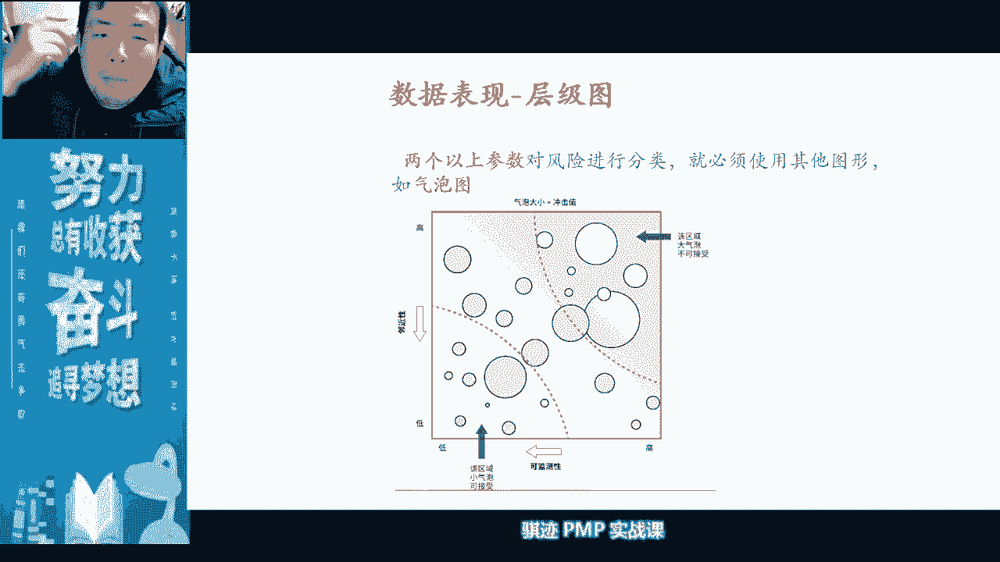

是这样的情况好，那么为此注意，我们会开第二个会议，第二个会议在风险定性，我们所有的向所有的风险进行定性之后，我们会或者定性过程中，风险研讨会，风险研讨会是干什么的，研讨已经识别的单个风险。

并为每一个单个风险分配责任人，注意是每一个单个风险责任人，我们后面会讲到，对于低优先级别的风险，我们不会有具体的风险的应对措施对吧，那么为什么呢，是因为低幼信息附件，不值得我们专人去进行盯对吧。

那么他可能的责任人是谁啊，是项目经理，但是每一个风险都会有一个责任，所以默认低优先级别的风险，是项目经理或者项目管理团队去负责，但是每一个风险，单个的项目文件都会有一个责任，注意啊，都会有一个责任。

ok如果不是指特定指定的专家，就是什么项目经理和项目团队的某个人好，那么来了又有一个概念，那么为什么项目当中我们要指定风险责任人呢，而不是什么质量当中，大家记得质量当中，项目经理全局负责。

所有质量的所有的定义和规划，那么为什么在风险当中，不是项目经理作为所有风险的责任呢，是因为项目因为项目当中的风险不像质量，它涉及到项目的各个方方面面，项目经理不是所有方方面面的专家。

所以他不能对所有的风险做出最好的未来，做出最好的风险规划应对，所以项目经理会在风险研讨会上，为项目单个项目风险逐一分配责任人，然后由专家或者说责任人，进行风险应对的规划和风险报告。

同时呢也把锅甩出去了啊，所以这里有一个很可爱的图，叫这个锅我不背对吧啊甩锅对吧，所以有些事情上要把锅甩出去，因为有些人更适合背着光，因为他是专家，他当然应该背这锅了对吧，你不是专家，你起什么哄对吧。

你不是专家，你不要去做规划，风险应对对吧，你是专家，你才知道啊，所以我们会在风险研讨会上，对已经识别的风险做出风险责任，那么从这个表述当中还可以引申出哪些例子啊，所以这个当初信息量很大。

所以经过风险研讨会的风险都是以识别的风险，是已知风险，所以他们之后的风险应对措施的马尼，都是来自于什么啊，我们的应急储备，所以最详细的应急储备，应该是我们在封规划完风险之后来的，那么它最初来源于什么。

已经识别完风险之后的我们的风险研讨会上，对于风险的责任分配，以及接下来的规划，风险应对，最后落实出最详细的应急储备，然后形成项目基准的一部分，所以这是一个起点，这是一个起点啊，其好。

那么所以项目经理会在这个研讨会上，我们做什么，做风险的整体的介绍，然后呢进行责任分配，然后问大家有没有意见啊，有没有意见啊，就会扯皮啊，这个不归我管啊，这就归你管吧，会有扯皮啊。

所以这是我们开的第二个会，风险研讨会啊，注意第一个会是什么风险规划会，第二个会是风险研讨会，第三个会是什么风险评审会，后面会讲啊，风险审查会好，那么开过这个会之后，我们就有风险责任人了吧。

有风险的优先级了吧，所以接下来我们会做什么东西啊。

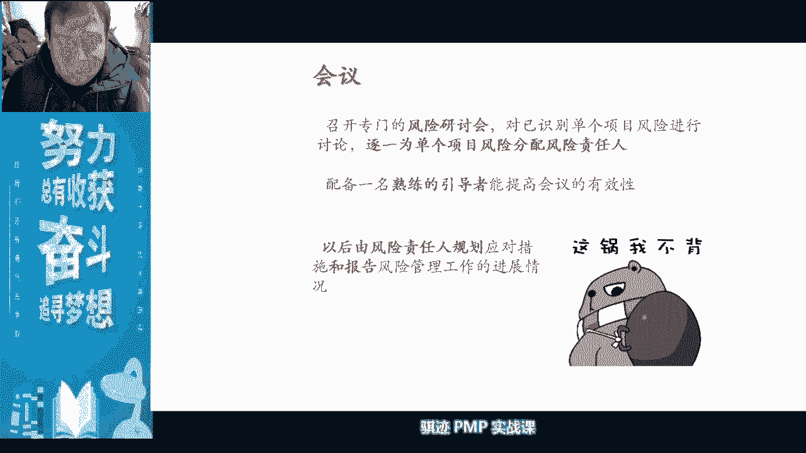

风险登记册的第一次更新啊，前面是风险登记册的第一次出现，这里是风险登记册的第一次更新啊，所以在这里时候风险登记册已经是有第二版，第二版相当于有第二版啊，那么在第二版当中我们添加了什么呢。

每一个单个风险呢，它的概率影响了评估它有多大概率，它的影响如何，第二呢它的优先级怎么样，优先级怎么样对吧，那么为什么风险要分优先级呢，我们有这样一个概念，是因为风险永远是大于我们能应对风险。

所能动用的资源或者钱的，所以我们要应对风险，不可能应对所有的风险，一一作出金钱和行动或者资源上的安排，所以我们仅仅能够什么根据风险的偏好，项目的风险偏好，项目的预算，项目的资源。

根据实际情况做一定范围内，我们能承受范围内的一定的一些安排，所以才会有优先级，让优先级别高的风险优先得到照顾，为什么他们概率高影响大，所以有时候难免要放弃一些低风险。

那么放弃那些我们只能说发生了就坦然接受，所以风险管理当中有一种态度叫做接受啊，有我们上我们上节课，在资源管理当中，我们讲人呃，可我们已经到题目，记得吧，我们和呃只能部门谈了几次，但是无望获得有利的安排。

我们我们不能怎么做，其中能怎么做的一个东西，什么接受该情况就是接受，因为有可能在这个项目当中，资源不到位或者资源不足，可能就是一种什么低u型风险，无所谓，人少见，那么活干的时间长一点，我们不我不急。

项目对于时间不敏感，这个时候他是一个低优先级风险，所以我们可以选择接受，不用花额外的钱啊，或者不用花额外的精力去管，接受就行，所以我们会对于高优先级别的风险来做出应对，规划和应对反应。

那么接下来我们会制定风险责任人，但是注意啊，我们前面还说过，再强调一遍，所有的风险都会有一个风险责任人，但是只有一定级别以上的，需要规划应对风险措施的那些风险，才会有特别的风险责任人。

如果不是特别风险的，默认就是项目经理或者项目管理团队，明白了吧啊，他会制定风险责任人，然后由风险责任人做进一步的风险分析，或者是风险的啊啊应对措施，那么进一步分析分析，分析的风险是由责任人去做分析的。

而不是项目经理，为什么特定的风险风险进一步分析，它需要量化分析，量化分析需要专业知识啊，要专业工具和专业技术方法，不是我们这种管理项目管理的啊，门外患能够决定的啊，蒙吧，明白吧。

项目经理和项目团里不是所有方面的专家，所以这个时候我们要撒手，相信专家，好而对于那些我们化为低优先级的风险呢，我们把它列入观察清单，观察清单观察清单就类似于什么，就像嗯现在新冠对吧啊。

有些人有些人比如说确诊了，那他是高风险对吧，有些人呢他是密切接触者，他是中风险，有些人呢是密切接触者的，密切接触者的密切接触者，他呢有一定风险，但是风险不大，那么他进就进入隔离区观察对吧。

那么他就是就是什么风险当中，我们就认为什么他是观察清单，它的风险很低，但是要观察对吧，我们这儿有个人，所以我们对于风险的应对措施就是什么，隔离对吧，观察啊，就和应应对疫情是一样的。

因为格力疫情当中被隔离观察的那些人，他们可能是什么概率很低，非常低，但是不能排除只为了保险，所以我们就把它隔离圈起来对吧啊圈钱，但是呢那些人因为他的得的概率很低，所以原则上其实不用过多的担心。

只要进行检查，看看有没有症状对吧，所以多做做几次核酸就结束了。

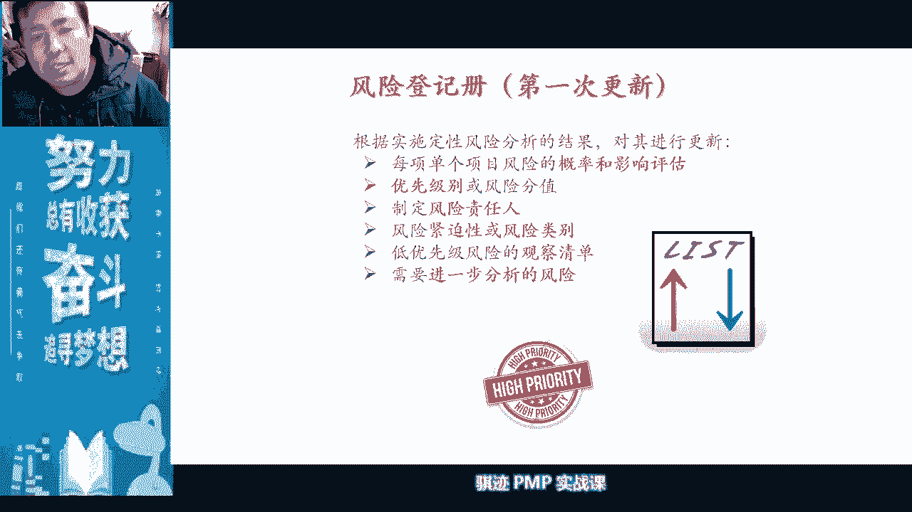

ok啊这是举的一个例子啊，好那么风险等风险登记册。

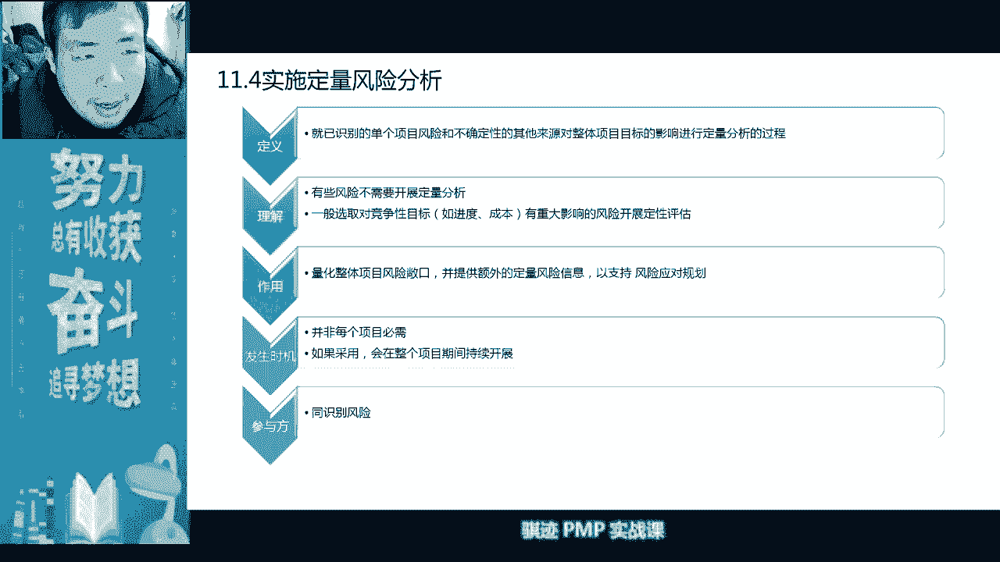

是在这个当中是我们进行第一次更新，那么风险定性分析之后有没有，我们更新风险报告，没有啊，所以定性分析没有风险报告好。

接下来我们开始讲风险的定量分析，定量分析，定量分析我们讲其实注意有个特点，它是非必须的啊，非必须，为什么，因为定量分析需要专业的知识和可靠的数据，才能得出有意义的结果。

如果有一些项目它不需要定性定量分析，或者有些项目呃相关方不要求啊，所以定量分析一般是什么高风险的项目，相关方要求的项目啊，这是软考当中啊，大家以后如果去学软考，这要知道啊，软考当中会讲定量分析。

为什么需要是因为软考当中是讲都要学啊，为什么是因为定当中因为是相关方要求的对吧，然后呢项目特性要求的是各种各样要求的啊，然后呃发起人要求的啊，这些要求人家要求，所以会做展开，所以我们如果要做定量。

那么它有个什么特点，定量分析有个特点就是它不会对所有的风险做，他只是在做，有可能一有可能进行定量的分析啊，有些事情风险是不会没办法做定量，比如说你老婆，你女朋友对你生气，这个能做定量吗，没办法定量。

女人有时候就是什么就是无法猜测对吧，就没有办法做定量，虽然这个风险很大，对吧啊，你有可能什么在那边打游戏对吧，你这边打游戏，然后你女朋友你老婆呢啊，对你很不满，他们可能会升级。

那么他升级有没有有没有一个定量分析，可以分析出他在什么情况，什么阶段下会升级，有多大升级概率啊，没办法取决于他们的心情，对吧啊，啊所以定量分析也是针对于能够定量的，有些呃我们有呃。

有一些我们的风险才能做定量啊，所以它是不是每个项目必须的，也不是每个风险必须，一般只针对于高优先级风险，或者你认为它潜在是高优先风险，比如说我们之前比如说识别了一个什么，识别了一个呃。

比如我们就叫彗星撞地球，我们叫彗星撞地球，我们对于它的影响不用做定量对吧，影响肯定是非常巨大的对吧，那么概率关系是怎么样，所以有些科学家觉得什么地球被彗星撞，这个东西的概率并不能起到忽视。

所以我们会用各种模型去测算啊，啊会有一定的措施去测算，然后测算出大概率，我们在最近100年或者1000年里边，会有多少概率是会寻找地球，所以这就是这就是这就是个定量的过程，定量的过程啊。

所以定量分析呢只只只是针对于高优先级风险，或者潜在高优先，你认为潜在有可能高于去做一些定量，然后呢定量分析成本是比较高的啊，因为会耗费专家的时间对吧，会耗费专家的啊经历对吧，而且要要有技术难度对吧。

所以定量分析呢一般不会大规模的去展开，除了项目特别有要求啊，这是定量分析的特点，所以要记住啊，非必须啊，一是非必须，第二是受限制，第三是什么啊，第四第三是一般仅针对于高优先级的啊。

或者潜在你认为潜在的高优先级的，会觉得电量啊，第四呢是相关方要求好。

我们接下来讲，那么定量分析当中我们的目标是什么呢，目标不仅仅是针对于单个风险，而是针对于整体项目的风险敞口，风险敞口就是一个风险的概率，乘以它的风险的影响对吧，就是讲了一个敞开的口子啊。

那么有些同学可能对，之前我也没有特别强调什么叫风险常稿，我给你们举个例子啊，风险敞口，风险敞口，大家可以脑洞一下，假设你家屋顶有个洞，这是不是个敞口啊，那么如果天气良好的时候。

你可以在坐在家里面外面看星星，是不是挺舒服的啊，天热的时候对吧，屋顶上有个洞，外面就是有点风刮进来，是不是挺凉飕飕的，但是刮风下雨是不是就很难受啊，所以这就叫风险敞口啊。

是暴露在外面没办法遮蔽的那一部分威胁啊，虽然他给人带来机遇，但也能带来威胁，这部分没办法遮蔽，叫做风险敞口，所以量化整体的项目风险高，有助于带来更多的信息，已支持风险应对规划，所以本过程非必须看到了吗。

一般仅仅是只对高优先级风险，能够展开稳健的分析，取决于高质量的数据和扎实的项目基准，所以定量风险分析，有人往往有时候可能会什么啊，在项目最后出基准或者出基准之前，或者出基准之后才进行定量分析。

因为有了一定的项目基准之后，我们的定量分析呢会更可靠，会更好，老师是无法定量分析的受害者，那你就错了啊，老师从来不会受到这种无法定量分析的迫害，对吧，你们懂的啊，只有你们这些啊，气管炎晚期患者。

只有你们这些气管炎晚期患者啊，才会有啊，或者是女朋友玩女朋友管炎晚期患者对吧。

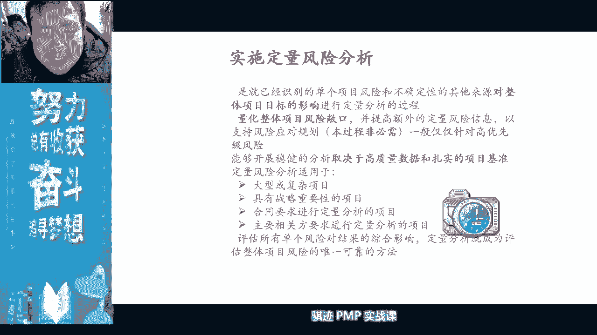

那么不确定那个方式啊，我们定量分析吗，所以我们在定量分析当中，我们会采取哪些东西呢，我们学过是不是三角分布，学过没有，贝塔分布，学过没有啊，哈我们自然界中最常见的分布是什么，正态分布对吧。

还有对数正态分布，伽马分布，r方r分布，泊松分布，离散分布，高斯分布，均匀分布对吧，种种分布，所以你可以看到定量分析和统计学密切相关，密切相关，所以在这种分析当中，我们可以用概率分布图来表现。

各种各样的分布啊，所以考试考不考分布不考，所以放心，你只要知道考试当中关键词看到什么啊，三角分布，北大分布这种，因为有可能会考那个范进程里边呢，我们讲计算不一定除了你要看到正态分布啊，对数正态分布。

均匀分布啊，高斯分布啊，保存分布之类这些关键词出了，你就知道它有可能怎么在做风险知识领域的，什么风险定量分析，风险定量分析好，那么风险定量分析当中，我们会用一个什么东西啊，叫累积曲线，分布分布曲线。

健康曲线来表现一个项目当中的一呃，一个累积的概率啊，寻找一个最恰当的点，那么这是一个非常好的工具啊，那么这个工具是什么呢，我们要应对风险，我们要应对风险，那么风险应对的越好。

是不是我们项目实现的几率就越高啊，目标几率越高，但是我们要应对风险花钱吗，钱花的越多，是不是成本就越高，所以一般来说随着花钱而实现一个目标，都会产生一个东西啊，叫做s曲线累积，因为实现目标的概率。

百分比最终只无限趋近于100%，所以s曲线这个是不是让我们记载什么，悬挂在质量当中，我们设置随着我们质量成本的一定成本的投入，我们的质量目标的上升情况，它会形成一个什么s型曲线，那么我们当然会取一个点。

取什么点啊，s曲线这个转折点，这个折叠这个折点成为了什么，是用一个最佳点，对吧啊，所以这是s曲线的一种释义，所以在很多随着一个数值变量变化，而在项目当中的风险，随着一个数值数量变化而产生一个概率变化。

当中经常会出现一个角的s曲线分布，只要s曲线的积累概率分布曲线啊，这个曲线当中我们取不同的值，就能实现什么不同的概率好，那么讲到这里啊，咱就是不是看过啊，我们之后一场考试p np的下半年考试当中。

我们开始有读图的题目啊，图章就不定项选择题和我们的啊有限填空题，其中一道题的事例就是拿这个图来做示例的啊，我们以后有以后可能有可能就在这个图上填空，做填空啊，ok啊，所以你们考试。

经济性小心后面哈哈哈哈，ok谢谢你们提醒啊，所以你们考试就遇到这种题目了，所以我希望你们在以后的pmp的生涯当中，只会在做报告的时候用的s曲线，而不会在考试当中遇到，ok啊一次性通过对吧。

否则我就要在下半年教你们，s曲线当中的一些东西啊。

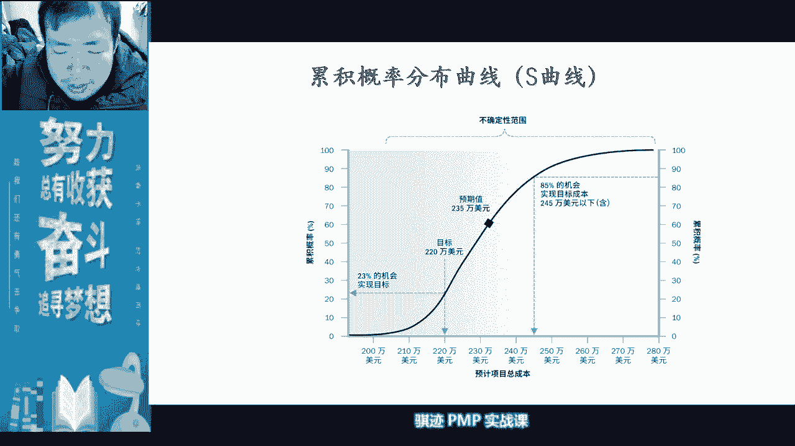

ok啊好啊，暂且不论，那么在定量分析当中，还有一种很重要的工具做的模拟啊，模拟看到模拟这两个字，你就会想到什么东西啊，monte carlo蒙特卡洛，蒙特卡洛模拟是这样吗，我们前面就说了。

他是说我们取一个变量值，然后模拟它随着时间的变化，产生的一个状态变化的一个时间状态，随着时间变化的一个状态变化的一个曲线，的一个曲线图，那么用蒙特卡洛方式，我们可以预测特定的时间，特定的概率。

特定风险的一个变化的趋势啊，所以模拟蒙特卡洛技术，蒙特卡洛模拟它的最主要目的是寻找出趋势，和他在不同的时间点的概率，所以这个过程是不是量化的，是量化，所以蒙特卡洛，既可以模拟我们很多当中的进度啊。

成本啊，质量当中的东西，也可以模拟风险当中的很多东西，我们看，比如说我们讲蒙特卡罗说啊，蒙特卡罗模拟可以模拟什么，我们可以比如抽取，比如说程序员，比如某一名程序员，比如说他每天干活对吧。

比如说很多程序员都是996007对吧，我们他抽取每一天，比如说是早上九点干的活的bug数量，早上十点干货分享，中午下午一点干活，报告数量是下午四点，下午七点，下午九点啊，晚上12点，晚上凌晨两点。

然后我们抽取不同时间段，同样一个人不同时间段它的八个数量，然后我们看随着时间的变化，他们不同的时间段的八个数量呈现什么样分布，我们会看到贾珍看到会看到是吧，如果我们按照一天来看，我们会看到不要看数量。

会看随着时间的往后推迟而逐步增加，尤其是在12点以后，人困了之后，但有些程序员呢，那相反为什么他是夜猫子，他有可能是八个数量，12点以后反而是最少的，但是呢早上八个数量反而是最高的，但是如果你抽取。

比如说某一个时间点来看，或者是某一个不同的时间段，按照时间来分母，你会看什么，基本上都是随着什么不同的时间段，单个数量呢是上升或者下降啊，所以通过这种技术，刚才那种技术就是我们很简单一种模拟。

通过这种模拟蒙特卡挤出的这种模拟，我们可以得出什么，程序员在哪段时间写代码是最好的啊，所以很多的公司是会是这样，你看到吧，程序员白天很多时间不是用来写代码，因为知道很多程序员是什么。

他的晚上的代码率是最低的，他人家早就做过模拟，然后呢怎么办呢，白天分析需求开会，然后到了下午晚上呢开始让程序员写代码，写到晚上996啊，所以很多公司的知识，都是按照这种方法去玩的啊。

他用蒙特卡洛模拟出你写八个时间点，时间段最低的那段时间，让你去写代码，好这是举个例子啊，当然了，有些公司无所谓啊，觉得程序员是不用睡觉了，24小时可以写啊，这是一种很残忍的行为，不是对程序员。

程序员残忍，而是对自己残忍对吧，最后你会发现什么这个这个代码质量惨不忍睹。

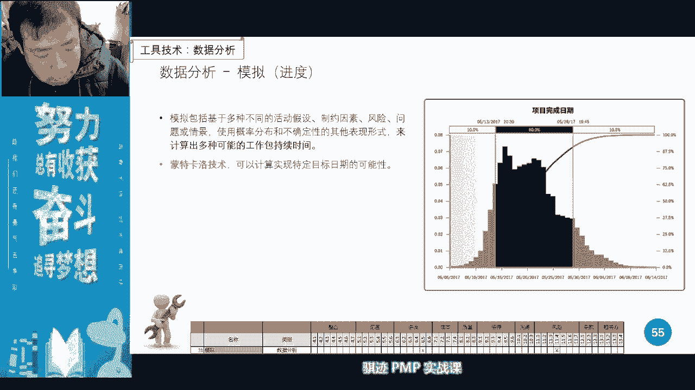

那么嗯量化分析量化我们的量化分析，定量分析当中还有一种工具是最常考的啊，是定量分析当中最常考的叫做敏感性分析，敏感性分析也叫做龙卷风图，因为在偏僻的领域当中，敏感性分析只考一个图，叫做龙卷风图啊。

龙卷风为什么叫龙卷风卷，大家看右边这个图是不是像龙卷风一样，上面大龙卷风是不是上面大，下面小hurricane是吧，呜呜呜呜呜，是hurricane，所以龙卷风图是用来干什么的呢。

是首先它是将各个单项的项目风险，确定它最大的影响范围，首先确定它最大影响范围，他说因为风险有可能是有好有坏，还是同时有好有坏，对吧啊，那么啊，就比如说什么东西啊，就呃风险是优惠外。

就就比如说就比如说你老板和你说，比如你老板和你说，突然间下半天说哎，你三天之内要把这个活给我干出来，干出来之后呢，有个活要交给你，你愿不愿意接这个活呢，三天之内干出来难度很大，但是你干出来了。

给你升一级对吧，给你加工资，如果你干不好的，直接滚蛋啊，所以这个事情是不是既有好事也有坏事对吧，那你要开始心理评估，这个事情到底是坏的更多一点，还是好的更多一点，坏的概率更大一点。

还是好的概率更大一点对吧，这时候有一件事情当中，所以很多事情他会同时有好的和坏的，两方面概率，所以这个图呢其实不太全面啊，所以龙卷风头其实会有什么东西啊，会有两边性能，有两边形啊，有些事情会有两边形啊。

会有既有好也有坏，或者既有正面有负面，既有领先，有落后都可以，ok啊，那么在这种情况下，我们将它所有的这个不论是好和坏的，这个区间呢给它全部画出来，把他的基边界画出来，然后不每一个项目。

单个的项目风险都会有它的区间，然后我们将它降序排列，是风险影响范围最大的，就概率最大，风险最大概率就是它的波动，然后呢依次下降，降完之后，然后为接下来怎么做啊，有一个东西大家记得吧。

我们之前指南讲过有个叫二八定律，记得吧，然后我们总能画出一个圈，那个圈呢，可以画出将近20%左右的数量的风险，但是呢却可以圈出百分之将近80的，什么东西啊，80%的风险的影响，累计影响的值风险数值。

那么我们是不是就有这个fire定律呢，对有了这个bug定律，是不是我们就要针对这20%的风险基金，重点管理就可以解决8%是的风险问题呢，对吧啊，所以这就是龙卷风度。

所以龙卷风度是不是一个客观定量的分析方法，是的，就是因为它的整个过程当中，是通过科学计算得来的，降序排列是科学计算对吧，不存在人为因素啊，它的风险的波动范围呢是通过概率的统计学，概率金来算出来的啊。

整个过程呢是客观数值的计算段，不但有人为人为判偏见和判断，好将它降序排列之后呢，我们可以找出自，因为它是降序，第二呢，我们可以找出80%的风险影响在哪个，20%的风险呢，车啊数量的集结啊。

集合里面ok啊，那么有了这个关系之后，就方便我们对风险进行优先级的重新校准，和优先级管理的什么重新的什么啊，重新的排序和关注啊关注，所以龙卷风土就可以找出我们项目当中，我们项目对于哪些风险是最敏感的。

所以叫它它就敏感性分析明白了啊，所以p p考试当中，如果你们看到敏感性三个字，那么你马上反映到龙卷风图最大潜在影响，降序排列最大风险，这些词都是和敏感性分析联系在一起，好学过了这个之后，知道了这个之后。

你们考试当中看到关键词啪选上去，一分到手，当你们每一道题目看到关键字再想一想，再做一做就能拍一分到手中，你们考试就过了啊，你们就不会在下半年再看到我了，当然你们可以在下半年的软考的培训课程当中。

再看到我，可以啊，那欢迎你们不会在pp的培训课程当中，再看到我了，好那么接下来我们会讲一个决策树分析，决策树分析是怎么的呢，就是讲我们是怎么样做决策的，作为决策树分析当中呢，我们可能往往人呢可能啊。

老师呢是老师是双鱼座的啊，老师是双鱼座的，所以双鱼座的人有个特点是什么东西啊，喜欢纠结，因为两条鱼喜欢纠结，老师的血型是ab型，ab型的，双鱼座是纠结中的啊，战斗机啊，所以老师做题目永远是喜欢什么。

有两个答案去纠结一下，如果没有答案纠结，我就选不来纠结中的战斗机，所以决策树风系，就是专门帮助那些纠结中的纠结的那些人，怎么样去解决纠结，所以他一般会什么给你两一条或者若两条啊，一条不行啊。

两条或者若干条路，然后让你去选择分别的路去走啊，就像玩rpg一样，此路不通，换一条路对吧，然后在路当中后面可能还有分支，后面还有分支，然后通过不同的路的分支去走，通过一定的数值判断。

去得出哪条路是最好的路啊，最好路，所以它是一个数值判断过程，所以它也是定量分析，定量分析，那么这个定量分析当中要注意一点啊，我们可以先看这个例子，书上这个例子，我们现在有个工厂，我们是新建一个新工厂。

还是造改造吧，老工厂，那么新建一个新工厂的投资是1。2亿，改造过老工厂的投资是5000万对吧，那么新建新工厂呢会面临两种情况，叫需求强劲，我们的销售额是两个亿，需求疲软呢，我们销售额是9000万。

然后呢改造老工厂呢，我们需求强劲呢，我们能能创造营业是1。2个亿，需求疲软呢，我们创造营业额6000万，那么这两条路怎么去判断呢，很简单，我们将概率和数值进行累积乘积对吧，我们看到啊。

首先这条路60%是需求强劲，那么乘以一个2亿，那么就得出什么这条路的价值是什么，是1。2亿对吧，1。2亿，1。2亿，那么减去这个呢减去投资，减去投资一二呢，然后呢需求疲软的概率呢是40%，那么40%呢。

那么就是呃9000万，然后减去1。2亿，那么就是什么3000万，那么3000万呢，然后再乘以40%，这两个的概率在累积起来，那么最终这个新建一个新工厂，他的盈利的概率呢是什么啊。

是36000000等于什么，六乘以这个这条路的，这条路是百分之60%，60%乘以八八百万啊，亏3000万累积起来的数学，简单累积求和呢是什么，3600啊，那么同理老厂房也是投资5000万是成本。

那么我们上面那条路呢，60%概率呢是盈利1。2亿，1。2亿呢，我们扣除成本是什么，成本是5000万，可以盈利7000万对吧，然后这条路呢呃需求疲软呢，是我们是一个收入是6000万。

但是我们投资5000万，那么是盈利是吧，1000万，那么1000万是40%，40%概率赚1000万，60%概率呢是赚多少，是赚7000万，那么累积起来呢，就是我们的总的盈利概率是多少，是4600。

14-600，那么这两条路我们用数值客观相比较，哪条路更容易赚钱，是改造老厂，所以我们最终决定什么不信件新场，而改造老厂，明白吧，所以决策树就是通过不同路径，它的概率和他概率之后的它的数值。

结果通过概率乘以数值来进行数值比较，一般我们用金钱，或者类似于像金钱这样的东西啊进行比较，然后决定选择哪个分支，选哪个分支，那么在这个过程中一定要注意一个原则啊，这是呃我们的决策树是今天最后一节内容。

一定要注意原则，什么原则啊，不同两条路径它的概率是一样的，并且它的设定环境，对两条路径都是使用同样的环境路径，比如说这个例子当中，需求我们是针对于这样需求，需求不会随着你的市场的需求。

不会随着你的盖新厂还是改改造老厂呃，这种选择而产生变化，对不对，所以我们会两条路径使用同样的概率，所以决策树当中，我们不同路径的概率必须是一样的，如果不一样就不公平，这叫是什么东西，这叫做双标，双标。

现在很多社会上很多东西就是双标，什么言语绿人宽以待己，这就叫双标，知道吧，所以角色中分析当中，不同路径的概率必须是一样的啊，并且它的设定条件应该是和这个东西的啊，是这个决策的这个过程无关。

但是和宏观背景啊，和事业环境所有关，才能做科学的决策分析，ok好，这就是决策树分析的大致用法，大家可以按照模仿的这个方式，按照一定的方式啊，套用到自己今后的工作当中去，因为这个决策树这个过程呢。

分析过程呢也很适合什么，做什么项目预测啊，项目分析报告啊，这是此类啊，领导说给领导提意见，因为你如果给领导提意见，比如说你给领导提发，领导会问你这三个方法到底哪个号，你帮我做一下判断。

这个时候他反过来问你一句的话，那么你就可以用角色的分析，对对吧，我们有三个选项，每个选项呢都是按照一个相同的背呃，事件背景对吧，每个每个选项都有背景当中的若干个概率，我们根据若干概率。

根据数字的简单的啊数值累积，然后得出这个三个是这三个选项呢，最终我们觉得什么哪个选项更好对吧，但是领导你考虑到我们实际情况，那么你再做决定对吧，我们根据客观中立，我们或许提出提议这个方案是最好啊。

诸如此，所以决策路分析是很好的，一个什么提议工具和一个分析工具好，那么我们今天的风险管理课程项目班里，批评评论就讲到这里，那么后面半截我们要到春节之后，所以不要急，我们在春节之后的第一堂风险课程。

管理课程当中呢，我们会把之前讲的内容呢再细细过一遍，但是希望大家在春节游乐玩乐之后，大家一定要认真的回顾一下我们的课程内容啊，尤其是回看一下视频，因为风险这当中概念和他的细分。

和他的很多的状态来更新是非常重要，经常成为考点，好吧好，那么我们春节之前的课程就到此结束，祝大家新年愉快，牛年大吉啊，明年是牛年吧，啊对牛年好，祝大家牛年大吉啊，牛牛牛啊，666好，我们牛年再见。

