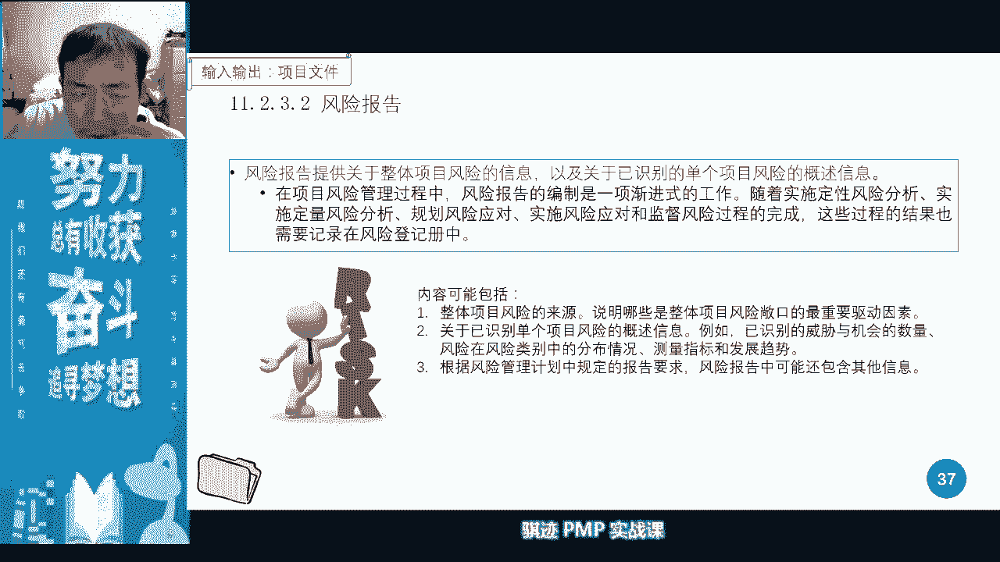
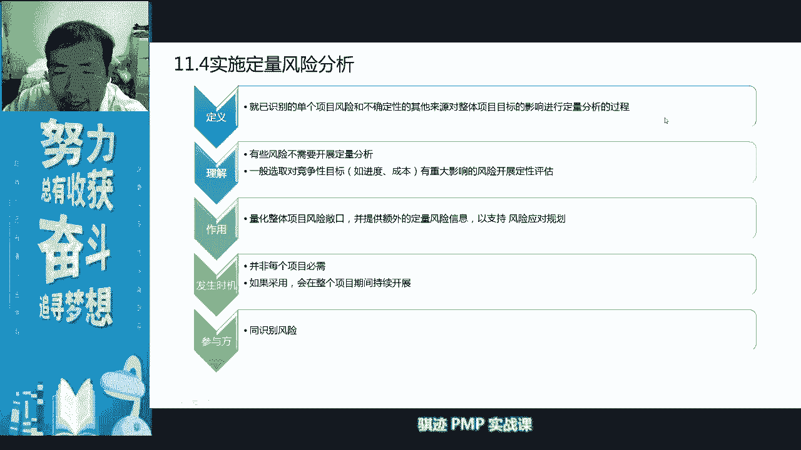
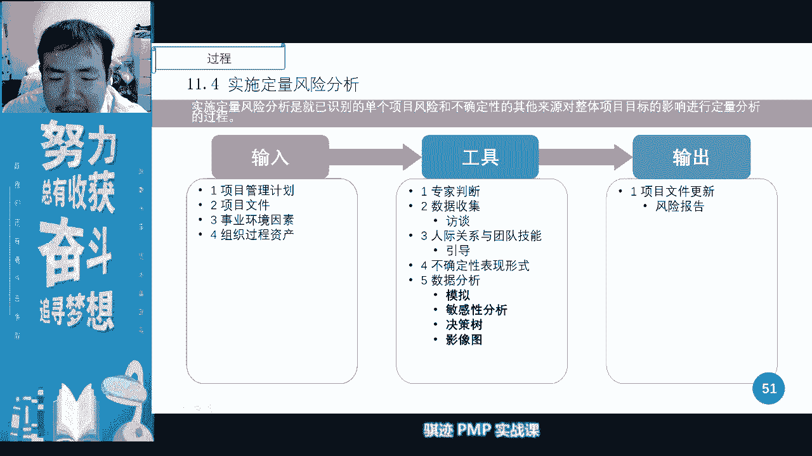
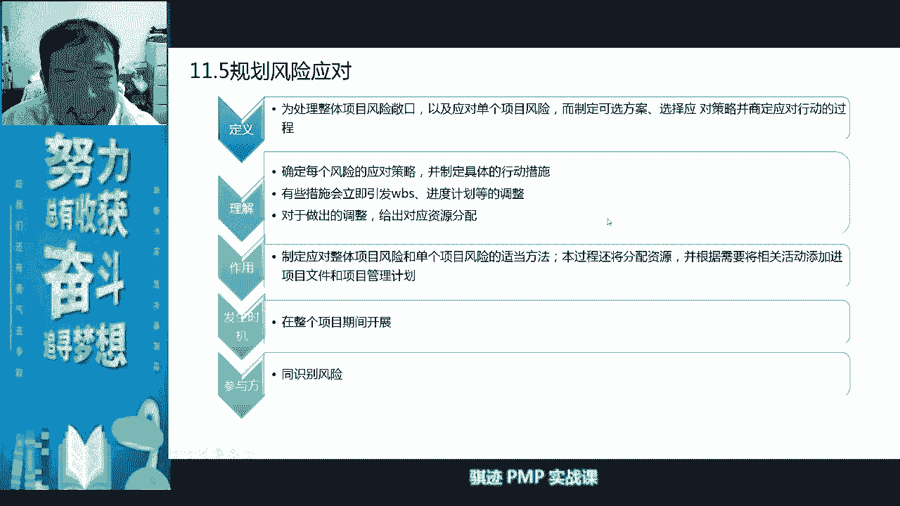
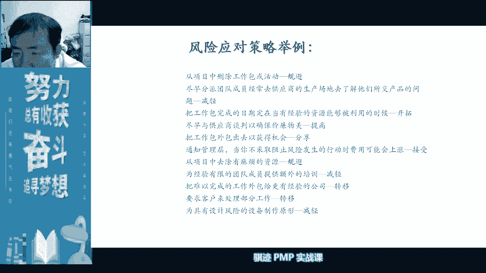

# PMP认证考试课程最新完整免费课程零基础一次通过项目管理PMP考试 - P34：PMBOK第六版 第十一章项目风险管理-35 - 骐迹PMP - BV1Sb4y1f7Yt

一下我们之前讲的内容啊，好那么我们上节课讲讲的是什么呢，上节课讲讲的是风险管理啊，在前半部分，那么风险管理是一个比较讲究逻辑，有很多方法，然后呢考点也非常多的一个知识领域啊，那我们上节课讲过。

那么风险呢分为这样几个过程，那么它中间很重要的，很多同学其实还记得吧，我们中药当中会分为有一个识别到分析到规划，到应对，最后到监督这样一个过程对吧，然后呢风险管理当中呢，我们还主要还做的是什么呢。

我们要做的是开各种各样的会对吧，我们讲风险有三个会对吧啊，第一个会记得吧，啊我们在风险当中第一个会叫风险的规划会。

第二个风险呢叫做风险的研讨会啊，第三个会呢叫后面，最后我们今天会学的叫风险的审查会啊，所以风险当中呢有三个会，这三个会呢会伴随着这三个会伴随着风险，不同过程，然后有不同变化啊。

只是考试会经常会偏p v经常会考的，所以我们变化当中最主要的哪些变化呢，我们讲是我们讲风险当中，管理当中是关于风险登记册当中有哪些东西，大家记得吧啊是不是有点开始回忆起来了，对吧嗯好，那么讲完这个之前。

我们先讲什么是风险，风险就是不确定性对吧，不确定，所以风险是没有发生的，但是你知道它存在不确定的叫做风险对吧，如果有个东西，哪怕它是消极的或者哪些积极，它已经发生了，那么它就不是不确定了。

他就没有不确定，因为它已经发生了，他称之为问题，如果是负面的，就称之为问题啊啊如果是积极的风险发生了。

你就称之为狗屎，哈哈哈对吧好，这是风险的定义啊，我们讲风险，它有概率和期望，还有它的场口对吧，敞口我们讲就相当于你家屋顶上有个口子对吧，天气好的时候呢啊可以风和日丽。

天气不好的时候，那就刮风下去对吧，这就叫常口啊，那么风险呢现在在pm个地板分为单个风险项目，整体风险啊，我们后面会讲，然后风险呢我们记得吧，和之前的知识联系的分已知风险和未知风险，记得吧，已知风险呢。

是我们经过一系列的科学的管理过程，然后准备过的，识别过这些风险，这些东西呢是我们付出劳动了，所以当它发生的时候呢，我们会主动的进行管理，所以应该算我们的绩效，所以它是我们的成本基准的一部分机的吧。

未知风险呢我们不知道或者没办法知道，或者没有能力知道，所以它不是我们劳动的结果，所以他应该算作是什么啊，管理储备的一部分，不算作我们的纪要基准对吧啊，所以风险这一块和成本这一块相联系，大家记得啊。

我们成本里面最大的一块是什么，叫做项目的预算是报给甲方的是吧啊啊b啊，8g的s compush b a c对吧，记得吧，我们的管理储备对吧，我们的应急储备和我们的活动成本对吧，活动和活动的储备对吧。

记得吧，所以这是成本的细分，其实和和我们的风险是紧密相关的，所以风险和我们的成本是有很大的关联，风险的管理和应对，其实就是伴随着成本的花小时进行。

那么风险当中我们讲有风险临界啊，偏好值有风险临界值对吧，偏好呢是一个主观因素，临界呢是啊，风险偏好呢是一个相对因素啊，相对比较大，记得我老师跟你们说的啊，打麻将我一个花五块钱到底算不算大，对记得吧。

啊还有一个是风险临界值和风险承受力，风险承受力那是主观风险。

临界值呢是客观对吧，好赌徒呢是临界力高于我们的。

我们的那个叫什么容忍度啊。

然后呢，呃吝啬鬼呢是我们的。

就是啊，ok啊只是大家稍微记一下就可以了。

对吧好，那么这是风险管理，所以风险管理当中呢我们有这样七个字过程，我们上节课讲到了什么，讲了四个字过程啊，我们讲了规划风险管理，识别风险，实施定性分析，定量分析规划风险应对，实施风险应对和进度风险。

我们上节课讲了规划识别定性和定量，对吧啊，所以风险就是一个嘛先规划再识别，先定量再定啊，先定性再定量，先定性再定量，然后呢规划风险应对，最后呢发生的时候呢去应对这种风险，最后呢要监督风险对吧。

一共有七个对吧，我们上次讲了四个啊，这次要讲的另外三个啊，ok啊大家回忆一下，是不是啊，都想起来了对吧，ok啊还有些同学可能没有进直播间啊，ok啊大家抓紧直播间，啊有人说卡了没有啊。

好啊，我这里拼一直常开着啊。

给你们看小的拼常开着啊，没有啊，我们的直播间很很流畅啊对吧。

好那么我们一个一个回啊，我们在规划风险当中呢，首先制定了风险管理计划对吧。

首先制定了风险管理计划，然后呢我们制定了如何去应对风险啊。

然后所以我们会开一个什么风险规划会。

这是第一个会记得吧，叫风险规划，然后呢，这个这当中会制定的风险当中的角色职责，风险的概率与影响，定义风险概率影响的矩阵，这个记得吧，这是非常重要的啊，规划会当中定义风险的概率。

影响的这个定义的基本定义规则和他的矩阵，注意啊，他是在规划风险当中定义的，但是呢不在后面识别风险当中使用。

而是在哪里定性分析当中使用啊，注意啊。

对，所以我们讲我们分析当中会有一个什么r b s，对吧，风险分解结构，risk breakdown structure，注意和resource breakdown sal像分开啊。

资源分解结构分解项分开啊。

那么风险的概率印象定义当中呢，我们小项目呢一般分三级就够了，大项目呢分为五级对吧，数值呢可以不用看，不同项目的数值是不能比较的啊，但是总归会分高中低或者分呢很高高中低很低。

这三级或者五级来分啊，然后呢我们会制定概率影响矩阵，我们记得吧，概率影响矩阵是一个人主观定义出来，上面的数值是主观，你用主观去判断的，它是带有主观性的，所以它是只能定性，不能定量，但是它很方便。

我们预先将啊之后我们已经识别好了很多的，我们的各种各样的风险呢，在识别完风险之后，在定性分析，将很多的风险进行分类。

迅速的分出高风险中风险，低风险，对吧啊，好这是我们讲风险规划当中最重要的东西。

规划完了之后呢，我们就开始识别风险。

在识别风险当中呢，我们会有各种各样的识别的方法的，头脑风暴核对单对吧啊。

然后呢我们比如说是s w o t分析对吧，然后呢我们的提示提示清单啊，提示清单是第六版新增的提示清单，pastel tackle宝宝卡对吧啊，对宏观中观微观对吧，可那么当我们去识别风险之后。

就会产生了第一风险登记册的第一次出现啊，也是第一次更新，如果但是要注意一点，我们之前讲课讲过，如果我们在识别风险的过程当中，我们的识别风险，是不是在整个项目过程当中是反复进行的。

如果你不是第一次识别风险的话，风险登记当中可能是已经存在老的风险是有的，还能再识别新风险是有可能的啊，但是如果第一次去识别风险的风险呢，就在一个上面上面什么都没有，那么我们第一次去登记它上面呢。

我们会登记使用什么东西啊，第一次登记会登记什么，已经识别的风险的情况和，潜在的责任人和潜在的应对措施啊，注意这两个叫潜在啊，正式确认，那么为什么要经过真实成名真实确认呢，我们后面讲了啊。

我们后面记得把讲过了，是因为风险应对是一个专业的事情，专业的事情让专业的人来，项目经理不一定是在项目当中，所有的方方面面都是专业的人，所以他只能说主观先做一个初步认定。

然后呢在风险的我们后面一个什么会啊，风险的研讨会上呢，我们进行什么进一步的什么啊进行确认，正式确认，然后又正式的风险责任人去规划最科学，最专业的风险应对措施对吧，所以这当中一开始我们去识别风险。

所制定出来的潜在风险，责任和潜在风险的措施，都是项目经理自认为，但不一定是最科学，还没有授权授过权的，知道吧啊，所以这是在第一次风险登记册当中出现，所以如果我们在考试中遇到我们进行识别风险。

但这个识别风险可能不是项目当中，第一次进行识别风险，那么风险登记当中也有可能会有什么，会有正式的风险责任和正式的风险责任，有可能的啊，当然这是仅限于不是第一次进行识别风险，如果你是在第一次进行执行。

执行识别风险这个子过程的时候呢，它只有已经识别的风险，然后呢钱在责任承担因素，其他都没有的啊，这是风险登记的第一次出现啊，第一次出现好记住了吧，是不是开始有点回忆上节课的内容了啊。

老师给你们讲的这些东西很重要啊，有考试有可能会考到，而且有可能会搞你脑子啊，但是你只要认识清楚了，这个分数是很容易拿的啊，风险是范进程之外的知识领域当中，考的会比较多的，因为里面的考的知识点会比较多。

相比沟通啊，相关方案是比较容易考出内容了啊，所以他考官比较容易出题，而且管理风险呢，我们在开课这呃这个知识点开之前也讲了，是项目经理，管理项目最主要的工作之一，因为项目就存在不确定性。

项目经理的value就是用于什么克服风险，知道吧，从整体上去克服风险。

这是你的value，好，我们继续讲，那么除了风险登记册之外，还有个东西叫风险报告，它是对于风险的整体描述，记得吧啊整体描述啊，就像我们质量当中是不是一个质量报告啊。

啊质量有质量里面还有一个什么测试与评估，文件级的吧，啊我们看质量的整体情况，看什么质量报告，看质量的详细的指标看什么，看测试与评估问文件啊，在风险当中，我们看详细的风险看什么啊，看我们的风险登记册。

看我们的风险的整体的报告，看整体况看什么，看风险报告它有整体概述信息啊，整体概述信息和单个的高，一般是高级别项目的概述信息，但是没有单个项目的详细信息啊，因为这不是在报告的范围内。

我们主要做的是对整体的风险状态，来进行描述啊，是不是知道区别区别，因是吧，这是考点啊，这是考点啊啊而且要记住一点，我们讲风险登记册和风险报告呢，并不是相互形成的关系，并不是风险登记册形成风险报告。

而是要通过什么东西啊，项目经理对于风险的一个，风险分析过程所形成的啊，所以这个形成过程当中，我们并不是从风景内的直接生成的。

而是要执行一系列过程所生成的啊，这要注意，所以我们在识别完风险之后呢，今天上节课呢我们讲就进入了定性分析，所谓的定性分析呢就是说最主要的目的是什么，排优先级顺序，这个排优先顺序我们考虑到效率的关系。

所以我们会用先用主观的方法去排一遍，优先通过人的主观方式，先把我们主观上认为哪些是高优先级的，挑出来啊，高兴的是，那么我们讲在一个项目当中，99。999%的项目都是什么啊，我们应对风险的资源是不足的。

但是风险是很多的，所以我们只能把最有限的资源，应用在最重要的风险上，这就是为什么风险要排优先级啊，用风险在排优先级，如果在我们的考试当中遇到了有风险，对风险进行优先级排序，那么他肯定在执行哪个子过程啊。

啊请告诉我，如果啊在公屏上当中，如果我们在题目当中出现了，那么他肯定在执行执行哪个子过程啊，请在公屏上告诉啊，这是我们新年上课的第一个课间互动问答，啊很好，我看到有位叫高敏的同学先回答了，定性非常好啊。

还有没有其他答案，好膨化菌就给同学也回答，风险定性分析，非常好啊，非常好，非常好，我看到很多同学都回答了定性分析，非常好，恭恭喜你们都答对了一半，定量分析就不不设定优先级了吗。

诶诶还有回在规划的这个就离谱了啊，啊是不是是不是啊，回去休息了一下都忘记了啊，风险的定量分析也会改变优先级，是不是啊，所以当我们就要进行优先级的排序的时候，是不是有可能既在执行定性分析。

也在执有可能在执行定量分析，要根据语境去决定，是不是啊，而定量分析更多的除了优先级的判定之外，还有什么发生的概率，和对项目的整体影响的趋势变化，这些东西对不对，所以不要忘记，还有一个叫定量分析啊，啊。

所以当题目里描述，对风险要进行啊优先级排序的时候，它不一定就是在执行定性分析，也有可能在执行定量分析啊，要根据题目的语境环境和它给的条件，就像他比如说我们对风险的优先级进行分析，同主要关注什么风险。

对于啊不同的项目对不同风险的敏感程度，那么这个时候他在执行什么，听到敏感程度是不是他不是在执行定性分析，因为敏感程度敏感这两个词就是敏感性分析，他用的是龙卷风图，所以它是定量分析，记住啊。

所以考试的时候不要看到优先级，啪一个定性分析就上去就错了啊，要看它的语境，ok，好希望我说的这一点啊，考试当中你们遇到，然后你们都答对啊，啊有人说能多出点题目吗，啊不要急，后面有的是题目啊。

不急好不要急啊，那么定性分析定啊。

足够你们爽的啊，不用急啊，然后定性分析，我们讲定性分析当中呢，我们会做哪些呢，首先我们会使用什么概率和影响矩阵，记得吧，我们我们上节课讲呢会使用概率和影响矩阵，然后呢我们会使用风险数据评估。

风险概率，影响评估和其他参数评估，然后通过各种各样的评估。

然后呢去确定这个风险的性质，但是最重要的一样工具就是风险概率影响评估，我们使用风险概率影响矩阵啊，这个矩阵和它的定义对吧，记得吧，这是在规划风险当中定义的，但是在定风险的定性分析当中使用的啊，记住啊。

这种啊好，那么当中呢当然我们在定性分析当中，我还分析什么临近性紧迫性对吧，记得啊，临近紧迫性是什么呢，啊有个人就好比说有人得了癌症对吧，癌症不会马上就死对吧，然后一个有呃，有个人被车撞了对吧。

他可能不救，他晚上就死了，那么先救哪个呢，虽然说癌症的死亡率可能更高，但是呢呃不就那个叫什么被车撞的可能就死了，所以救起来可能先救那个被车撞的对吧，医生如果同时只能有一个人，肯定先就被车撞了。

哎这又不会今天得癌症，明天就死对吧，就是这个意思啊。

那么我们当中会用到概率上矩阵，这个就不提了啊，这不就不提了啊，我们还会用到气泡图来表现风险的临近性，紧迫性对吧，可观测性和它的容忍度对吧啊。

然后呢我们会开第二个会啊，这里是重点，这是风险定性分析的重点啊，我们在风险定性分析中会开一个，第二个会很重要的会风险研讨会，风险研讨会干什么事情，逐一为每个风险分配责任人，注意啊，如果考谁问你啊。

你如果考试问你啊，因为风险有高风险，优先级，高优先级风险和低优先级风险，所以我们开风险那会时间有限，所以我们注重的是仅为高优先级风险分配责任，这句话是错的啊，风险研讨会当中，我们会为每一个风险。

只要是我们识别出来风险都会分配责任，只不过低优先级风险他的责任人是谁啊，你们打在公屏上啊，我继续讲课啊，然后你们都知道第一优先级风险的责任是谁啊，打在公屏上啊，然后呢我们会配一名熟练的引导员来开会对吧。

然后最主要的是正式的指派责任人，那么有了正式的风险责任人之后呢，我们就开始什么，就开始进行正式的风险规划，这个风险规划是由责任人进行规划，而不是由项目经理规划，因为项目经理我们说不是所有项范围啊。

项目范围各个范畴之内的专家对吧啊，对对说的对啊，项目经理对吧啊，所以第一优先级风险我看到你们已经打了啊，第一优先级风险它的则人默认就是项目经理啊，默认就是项目经理啊，所以在开会当中，我们班是这么开的啊。

我们会确实会把高优先级的风险呢挑出来，开会经讨论分配谁来负责这个风险，但是如果我们不挑出来，默认就是项目经理，除非有人主动跳出来说哎，项目经理这个这个这个事情，这个风险在d u g级风险。

但是我来承担也可以对吧，好，那么高中低风险的，一般有项目经理的主动分配责任人啊，把这个风险分配给你来定义，对这方面应对你来应对对吧，然后呢，印度人说啊，我不是专家，让让他来啊，张三说李四李四专家。

李四说王五是专家啊，我往往会出现这种扯皮情况，所以需要熟练的引导员，提高会议的有效性，明白了吧，那么有了风险研讨会之后。

风险登记册有了第一次更新啊，我们在识别风险的风险，定期的第一次出现，有了风险的研讨会之后呢，风险登记册在定性分析当中，我们风险有的第一次更新，更新更新是什么东西啊，我们上面已经有风险了，对不对。

那么我们更新的是正式的风险责任人，和风险优先级，而和它的风险的概率影响，评估的结果就是有些几对吧啊，然后呢如果是低优先级风险呢，他就会直接被列入观察清单啊，做进一步观察，然后呢高科技风险呢。

我们会等待风险责任人，在我们规划风险应对当中，进行正式的风险规划应对啊，这是我一个我们在后面讲，今天的课程内容会讲的啊，是不是讲的还是很相信啊，是不是逐渐逐渐找回我们节前上课的感觉了，对不对啊。

扯皮专家，嘿嘿好，有同学说的对啊，扯皮专家呃，风险这个事情大部分情况就是吃力不讨好的，所以大家一般都是能推就推吧，所以为什么要开风险研讨会，就是要落实责任人，每个人负责一摊。

所以要求项目经理或者项目当中，谁擅长开这个会的，要进行引导对吧，避免扯皮好，那么这个时候我们风险登记当中有什么，有风险吗，有风险有风险的优先级吧，有风险优先级有风险的概率影响啊，有概率影响。

有风险正是责任吗，有但是有没有风险的应对措施啊，没有有没有风险，对于整整体项目影响的概率啊，没有啊，所以针对于一些高优先级的风险。

我们会在后面当中会进行做，这么接下来就是什么定量分析，我们讲风险的定量分析，基本上是依据统计学原理所进行的啊，它的目的是确定整个项目的风险场口，提供额外的风险信息，然后对风险的性质呢进行重新评估。

但是风险的定风险的定量分析啊，这有没有同学说的对啊。

这个这个词是打的是错的啊，我们把它改一下，把这个词改一下啊，这是定量，这个吴老师也知道对吧，你们自己改一下就行了，我就省得再发一个，为了一个字再重新发一个版本，没意思啊，那么风险的定量分析当中啊。

定量分析当中，我们主要是针对一些高优先级空间，因为定量分析比较难。

它依据扎实的项目风险数据和数理基础，有时候很多项目的风险，定量分析是非常非常难的啊，啊就是举个例子说，比如说中国马上要进行一项伟大的工程，到底会不会对生态造成影响，这个风险一旦这个水电站造下去。

造成生态灾难的话，谁也谁也承担不起这个人，那么这个风险怎么定，定量分析呢，非常非常难，他要进行庞大的数理建模和统计统计过程，然后最后分析得出一个最好的结论，对吧啊，这就是定量分析。

所以它的成本可想而知是非常非常高的，所以我们一般来说只有对高优先级啊，或者是项目经理觉得某些风险他觉得不太放心，不太确定，他会要求提出啊进行定量分析，或者是相关方要求，比如说甲方爸爸啊。

他说这个一定要定量分析，定量分析，定量分析，甲方爸爸说啥就是啥对吧，否则讲妈妈不给钱啊，明白吧啊好，所以定量分析我们上节课讲了是非必须的，但是呢但是呢如果采用呢，我们会持续的展开啊，我会持续的展开。

同时呢我们会对它呃，有我对一个风险呢有一个最科学的认知，因为定量分析当中我们采用的是统计学的方法，所以在做全过程是不含有人工因素，所以它是最客观的啊。

这个关你讲定量分析当中呢，我们有很多关键词，大家看到啊。

就在这里啊，那么定量分析呢用于分析敞口对吧，用于分析整体场口整体风险的概率是等等。

那么定量分析当中有很多工具。

我们讲s曲线对吧，s曲线啊仔细看一下啊，定义啊，还有模拟关键词，我们看到模拟两个字，我们就像个什么蒙德卡洛啊，蒙德卡洛啊，蒙德卡洛是指我们一般是随着时间的变化，然后呢。

我们看看我们达成目标结果的概率的可能性啊，我们通过时间变化模拟某些状态，我们记得吧，我们用蒙特卡罗来模拟啊，码农我去我是结晶的那个课例子我还记得对吧，我们的蒙特卡罗模拟模拟卡分析啊。

码农在不同的时间段bug的数量，我们会看到哈，码农的bug的数量一般是在后半夜，bug数量是最多的对吧，这是一种模拟，那么它的工作质量是最差的啊，风险也就是最高的对吧啊，所以蒙特卡洛是一种模拟技术。

它是一种定量分析，就在风险当中啊，啊我们刚刚呢还可以用来预测，我们家在进度管理当中也越来进行模拟，进行预测，所以模拟也是偏僻考试的一个关键词，看到模拟就想到蒙特卡洛，如果是在风险相关的题目当中。

那么看到模拟它就是定量分析。

它就是蒙特卡罗啊，这是一个，然后呢接下来一个叫龙卷风图，什么叫龙卷风图呢，你们如果应对考试其实就很简单，我们就把风险呢由大到小排列，因为一个风险有可能是什么啊，有正向有负向。

我们把正向负向的最大范围呢都列出来，然后由大到小降序排列，然后找出风险的最大潜在影响，进行降序排列，这个排列过程呢是科学的啊，那么敏感性分析呢，就看项目对于哪些风险是最为敏感的，所以叫敏感性分析啊。

所以看到敏感性分析，看到龙卷风阻也就是意味着它就是什么，在p n p考试当中，就意味着是我们在考的是风险的定量分析，定量分析找出最大潜在影响啊，所以考试当中他有可能也不一定考你，定量的风险。

定量分析还要考，你说我们要找出，比如说我们要找出对于项目影响，最大的一个风险，我们可以用什么工具方法啊，龙卷风土敏感性分析啊，就来了对吧啊，然后呢决策树分析啊，我们上上节课最后讲了决策树分析啊。

就是指我们有不同的路径，那么我们要看哪条路径更合算呢，我们用盖概率与乘以数值的方式进行概率，数值的累积啊，啊我们的西格玛求和来得出啊，那么但是我们设置决策树分析的，一定要注意什么。

不同的分支概率情况一定要相等，否则就是双标对吧，那么数据影响分析当中我们会有影响图对吧啊，影响图啊。

大家可以看一下，那么通过定量分析，最后我们就得出了什么东西啊，得出了个一我们更新后的风险优先级，情商看到了单个项目风险的优先级呢，这个时候通过定量分析，有可能原来我们认为优先级没有那么高的风险。

他其实可能优先级很高，有可能我们认为风险用性很高的风险呢，它其实没有那么高对吧，所以这个就是什么啊，这个就是一个风风险，当风险当中啊，我们的定量分析都带来一些结果，然后呢它的风险的成功像我们的成功性。

像我们的变异性，概率分析等等情况啊，所以这个时候呢我们的风险报告呢会更新，那么我问你们，这个时候我们的风险登记会不会更新，也有可能会更新，但是是可选啊，所以他就不写在这里，它是可选，喝血啊。

好这是风险报告的更新，那定量分析，那么我们上节课就讲到这里，但是我希望这个半个小时是值得的，可以吧，因为风险这一章考的确实比较多。

p考试考的比较多的啊，好接下来就开始来规划风险应对，很有意思啊，就开始有意思啊，还是有一点高档在黑意思，这这这是我们今天的课程，什么叫规划风险应对待，我们现在有责任人了吧对吧。

但是没有正式的风险应对措施，我们这时候风险登记证上有什么东西啊，潜在的风险应对措施对吧，所以要有什么要有风险的正视责任人，规划出正式的风险引力的措施，然后呢，我们要根据正式的风险应对措施。

进行什么分配资源，分配资源就意味着什么马尼啊，所以规划风险应对这个子过程，如果我们要考软考，如果我们要开始学软考的话，其实这个子过程就是什么，相当于这个子过程，就相当于我们要在同时要在成本的最终的制定。

预算之前要做完啊，第一至少第一次要做完，所以规划风险应对，其实是在和成本同时在进行发生了，因为你要通过规划风险应对，得出我们在风险上到底要花多少钱，项目经理只是画了一个总账，然后每一个风险责任呢。

要从这个总账里拿取合适的自己需要的资源，就是钱，你吧然后去进行应对，有可能最终这些人拼起来，所需要的资源可能会超过项目经理，因此我们有可能会对一些策略来进行变化，能承受的成都极限，那么怎么办呢。

我们可能会采取一些措施，将某些项目他在风险优先级呢人为的去讲，低容忍一部分风险发生的，因为没钱，知道吧啊那么这个就好比什么比喻是什么，规划风险地当中就好，没什么，如果你是一个啥平时吃得饱，穿的暖生活。

出门有出门有车开，对吧啊，在家有高级公寓，甚至有别墅住的人，那么你肯定很惜命，对不对，然后你肯定会说我要规划风险，为什么我要保命，怎么办呢，我经常吃一些营养品保健品对吧，然后经常健身。

如果你是一个一天三顿都吃不起饭的人，你会规划啊，怎么我要吃点营养品保健品这种事情吗，不会对吧，因为什么我们已经容忍接受了健康，随时可能恶化，这个风险来就来吧，因为穷人不配啊，有这个应对应对的权利对吧。

我们就举个这个例子，你能明白吧，所以规划风险应对也要取决于我们对项目，整体上对项目的风险的容忍程度啊，有可能是什么，本来我们觉得容忍程度很低的，结果发现他花的太多了算了，我们容忍忍一下对吧。

就好比说什么啊，一开始你和你老婆去逛街对吧，你说哎呀，老婆你随便买，结果老婆呢你的老婆呢一会儿进prada一下进lv，一会进喵喵，然后你的老婆说老婆老婆我们不要随便买了，买不起买不起对吧，我们回家吧。

就这个意思对吧好，所以规划风险应对呢，是一个汽车和办事成本发生了，当然我给你们开了点玩笑啊，你明白这个意思，它因为它最终会影响到成本，之前我们的定量分析，定性分析呢都跟钱的关系不大。

但是在规划风险这一段呢，因为涉及到资源的分配，所以他跟钱关系大了啊，规划风险也是跟钱，但是他先画了个总账，所以一般规划啊，我们规划风险管理当中呢，花的那个风险的总资金，那个还总资金呢一般是运用什么。

我们的项目的成本估算，一般用在估算那个阶段的，到了规划风险应对的时候呢，一般我们已经到了什么啊，我们的项目的制定，项目成本基准，制定项目预算的这个之前，在这个关卡之前我要做掉了，明白了吧啊。

这就是区别啊，项目经理管总盘子，但是规划风险呢管细小的盘，最后得出一个精确的要在风险上花多少钱呢，一个成本啊，好扎心对吧，很扎心对吧，穷人不配，嘿嘿嘿哈哈啊，呃扎心了对吧，扎心啊。

瞬间觉得手里的泡面不香了对吧好。

那么规划风险应对当中呢，我们会有各种各样的策略啊，就来了，这个东西当中呢在篇幅和第六版当中，比第五版呢讲的略微高，因为它有个整体应对策略啊，他的表描述有点啰里啰嗦啰里啰嗦，虽然理论上很严谨。

但是表示很啰嗦，你们要跟着我就行了啊，那么首先我们的规划风险应对当中呢，我们讲因为不同的项目，它的具体的应对措施方法是全然不同的啊，不同的行业，不同的项目，是不是同一行业不同的项目。

风险应对措施呢也全然不同，对吧啊，我想出门应对下雨啊，这个风险我们可以随身带把伞对吧，我们也可以出门叫滴滴对吧，不同的项目也看有没有多少钱，所以他绘画是不一样的，但是策略是差，大致可行的啊。

所以我们讲规划风险理论当中，在偏僻当中讲，我们一般以策略方向为主，我们会讲五个策略方向啊，那么请听我给你们娓娓道来啊，娓娓道来，那么风险当中呢，我们讲规划风险当中，我们会秉承一个原则叫做什么啊。

按照我的我们的说法叫做老祖宗，说法很好，很多东西老祖宗其实都已经给我们早就总结好，叫做趋利避害，两利相权取其重，两害相权取其精啊，所以规划风险呢就是最小化威胁最大化，机会是不是趋利避害对吧。

降低整个项目风险的敞口对吧，那么我们总的目的还是不要光驱离对吧，我们也要避嫌，所以总体上我们要将风险敞口呢要缩小对吧，屋顶上遮不住，甚至没有是最好的啊，所以风险的应对方案呢也有风险重，重要度相匹配对吧。

要和你的马尼相匹配对吧，和重视度相匹配，要经济有效啊。

那么风险印度当中呢会有若干种术语啊，我们首先看啊，第一个叫做full backpack啊，那么搞i t的可能就是看这个东西比较熟，所谓的fog back就是什么抬回计划，就是回退计划，叫回滚计划。

都叫roll back for back啊，都是一样的啊，叫做回滚，回退指是什么，当我们当我们啊啊发生了意外情况的时候呢，我们会有一个我们会有一个计划呢，使之什么不会影响什么好硬。

这时候我们不会影响到的一个备用的计划，备用的计划啊，所以叫备用主谓备用计划，但是它跟t当中的robeat不一样，it robeer是原样还原，而我们的风险规划规划风险的行会计划了什么。

我们用另外一个方法对吧，另外一个方法啊，就比如说本来是自动的，我们改成手动对吧，本来自动改成手动啊，那么这叫做弹回计划，或者叫做four back play啊，我们叫做回文计划。

以便在组计划出问题的时候呢，使用他有可能是呢我们是什么采取一个方案，把风险呢直接搞掉，也有可能是什么，我们采取这个方案呢，通风险搞掉，但是这个搞定当中呢，我们发现什么主，原来我们所采取的方案失效了。

怎么办呢，我们还有一个另外的2号方案对吧，就比如说我们出门，我跟你讲出门下雨，什么叫弹回计划，弹回一句话就是什么啊，我们出门的时候不要应对下雨这样一个风险，我们身边拿着一把伞，然后兜里揣着100块钱。

万一出门的时候就在下雨了，怎么办呢，啊你身边站着你的女神对吧，蹭这个阳伞腾啊撑开，为他打伞，是不是啊，打伞，那么当然你是个穷小子对吧，兜里放100块钱，你比如说你这个学校啊，刚毕业啊。

兜里100块钱已经很贵了对吧，比如比如说蹭一下阳伞，打开的时候，你这折叠伞砰一下伞就飞出去了，这时候怎么办，马上使用弹回计划，然后拿出兜里，拿出100块钱，在路上会一下，哎，哪位出租车大哥接我一下对吧。

然后让女生上车，虽然心里暗暗的在滴血，100块钱没了，但是好歹什么，不至于让自己心中的女神淋雨对吧，这就叫做弹回计划，就是2号房，虽然2号方案可能不是1号方案哈对吧，给女生打个伞，又亲切，又不花钱对吧。

但是你阳伞飞出去了，砰一下飞出去了怎么办，只能花钱解决的事情，花更多钱，这些情这就是谈婚计划啊，那么什么叫应急计划呢，应急计划指的是如果有预警信号，那么我们就会在有预警信号，就风险还没有发生。

但是已经有预警信号的就去执行，就比如什么老师今天虽然没有感冒，那我就知道什么事情啊，我快感冒了，但是还没有感冒，那么它有预警信号，我感冒了吗，还没有，但是快了，但是余景象就是鼻子很不舒服。

那么我的应急计划是什么，多喝热水，洗热水澡，然后吃药，不管有感冒没感冒，先磕两片药对吧，但是我上课之前不能喝，为什么感冒要喝了，上课容易犯瞌睡，对你们来说是不负责的，对吧啊。

老师要坚持到给你们今天上完课，今天晚上好试一下啊，明天说不定会不会因为明天还有课，明天要软考的课，对吧啊，是不是很惊艳啊啊敬业的请点个赞啊啊好，那么这就叫应急计划，就是说应急计划是指的风险没有发生。

但是风险呢它的预警信号来的，比如说外面啊，突然天空乌云密布，狂风大作，雨还没有下下来，但你知道可以吗，肯定要下雨，这个时候什么你马上就干什么，直接把一把洋伞金撑起来啊，往外面走，温雨下来，啪一下。

倾盆大雨下下来不至于淋湿，对吧啊，这就叫做应急计划啊，啊所以因为有时候当有些风险真实发生的时候，你再去应对已经产生损失的，你当然希望什么，他如果有预警信号，它没有发生，但是已经有预警的时候。

你就采取措施，是不是能够完全避免损失啊，所以应急计划也是很重要的啊，所以应对当中，如果我们有应急计划，当然优先应该去执行应急计划对吧，然后呢，如果有时候他们有些风险没有预警信号呢，我们就执行风险啊。

应对计划对吧，然后应对计划，如果这个应对计划有可能不一定有效，怎么办呢，我们会设计一个什么弹回计划，就是这种备用计划啊，万一发生的时候，那我们就可以用备用计划去对付啊，这就是所谓的应急计划。

弹回计划和风险应对计划，明白了关系了吧啊，啊软考的课你们当然不能看了，因为学当然学校是要是要收费的对吧，ok啊当然关于软考的一些问题，你们可以课后来问我，或者问我们的张老师都可以啊，ok啊软考试啊。

软考是我们项目管理信息项目信息信息系统，项目管理师啊啊是我们考职称的，可以考代评对吧，可以有很多好处，ok啊，打个小广告好，那么首先如果你们明白了应急计划，弹回计划和我们的风险。

风险应对计划这些概念之后呢，请在公屏上给我打上两个字，明白啊，如果不明白呢，你们咋上不明白，我再解释一遍啊，这个很重要很重要啊，因为后面呢这个就不再讲了，但是你们要明白它的定义啊，啊啊有些同学问软考啊。

我们稍微插个小广告吧，好吧，软考呢就我们一般称之为啊是中国，相当于中国版的p m p，一般我们称之为中国版p p啊，它主要是什么呢，以p n p知识为主，但是呢它是i t技术背景。

那么考出来有什么好处呢，就考出来之后呢，可以评中级职称和高级职称呃，终极之神，那是以考带兵，只要你考的通过了，然后到啊社会人力资源社会保障部，大家去登记一下当地所带来的登记一下，那你就有证据支撑了。

那么有什么好处呢，可以居住证落户大城市的，居住证落户的积分对吧，然后呢可以办居住证对吧，可以落户对吧，然后呢你在国企系统当中呢，可以什么可以啊，那都是有要求，然后你退休之后呢。

有职称的还可以多一点退休工资啊，所以都是有很有好处的啊，而且考试费很便宜，比比考试费便宜才100多块钱啊，一般会，但是那个难度要比p n b高不少啊不少，但是很好，非常好用啊，而且考试费便宜，啊不明白。

特别是弹回计划啊，那我再说一遍，我知道有些人不明白啊，那么ok不要急啊，我们软考广告讲完了对吧，如果大家有兴趣，可以在考完批评之后呢，报软考，软考一般是1年考两次，上下半年各一次啊。

我们这一届的学校的软考是我们奇迹，第一次办软考，由鄙人来啊进行担任讲师啊，啊这个是比较辛苦的活啊，就是逼人了哈哈，第一次的人不算太多，所以可以享受vip待遇，那么好像没你往往还没有。

我们还没有讲的是什么刺身风险和残余风险啊，不要急，那么我们讲首先有些同学问啊，说不明白谈汇集吗，那不要急，我给大家解释啊，首先如果这个风险，我们讲要制定风险应对计划对吧，如果这个风险应对计划当中。

这个风险如果是有预警的，我们讲天气不太好的，但是呢天气不太好呢，我们将为乌云密布，它是个预警对吧，雨还没下下来，那么我们是不是就要带阳伞出门啊，然后打着阳伞打着顺着打着伞出去，那么雨一下下来。

我们就不会被淋到了对吧，那么这就叫应急计划，就是我们应对的时候，不是当风险真正发生的时候去应对，而是只要有预警信号，我们就应对了对吧，这叫应急计划，那么什么叫谈回计划呢，我们还是讲外面出车下雨。

你出门的时候，你出门的时候，比如说你在出门时候，你看外面乌云密布，准备下雨了，那么你规划好啊，出门的时候我就带把雨伞，但是呢我不是看到乌云呢，是嗯乌云密布，我不是看到外面乌云密布，狂风大作。

就直接把伞撑开对吧，我说那很，外面万一就是刮风，就是我云啊，风大啊，云云黑，但是就是不下雨，你一个人撑着伞，那边雨不下去，是不是闲得很傻叉对吧，这个时候呢你手里拿了把伞，这是你的风险应对计划，对不对啊。

这位叫林那个那个叫什么叫林满洲的对吧，是叫时是什么啊啊对零零满足了啊对吧，明白这是风险应对计划，你的羊，你的身边携带的雨伞，是你的风险应对计划，对不对，然后呢哗雨下下来，是不是你被雨淋到了对吧。

你不可能说雨下下来一瞬间你就开伞对吧，你人的反应也太快了，可能会雨淋到，然后你淋到几滴，然后就开伞对吧，这个时候你把雨伞打开的时候，发现雨伞打不开了，或者雨伞打开，拼雨伞飞出去了，这时候怎么办。

你马上有一个弹回计划，我们的应急措施什么，我们早就知道要下雨，然后我们早就知道马达给的伞啊，家里的伞呢不靠谱，那么我们走路的时候，我们都是挑有屋檐的地方去走，那么万一伞打不开怎么办呢。

我们紧急找一个屋檐，躲到屋檐下面躲一会儿，虽然躲在屋檐下面的时候，我们不能往前走了，但是我们至少没有以淋到雨，所以这个时候当我们的主计划打伞，在雨中前进不可行的时候，我们有一个备用计划。

这个备用计划虽然不如主计划好用，但是呢总比没有的强，可以避免损失，这种计划叫做弹回计划，叫full back plan啊，明白了吧，ok，是不是好有画面感啊，杠杠的对吧啊。

所以现在你们明白了什么是应急计划，什么是应对计划，什么是谈会计划，明白了啊，项目我们当常日常账户发现风险就已经应对，就应对计划啊，这就是规划风险应对对吧，我们应规划的结果就是风险应对计划。

那么应对计划当中有两个概念啊，有两个概念，这里呢我写写的有希望的有点简单了啊，但是我前面讲过了，应对计划当中有两个概念，一个叫做次生风险，还有一个叫做什么叫残余风险啊，那么什么叫做次生风险呢。

就是说因为应对a而产生了一个风险，b对吧，我们我们前面讲了，但你这个属于大部分情况下属于那相当谨慎啊，相当谨慎，因为有预警信号，我就采取措施，是不是这时候很容易采取措施啊，这时候你还要弹回去。

确保100%不能出错，对吧，这是相当谨慎的情况下，或者这个风险绝对不能造成损失，情况下，但是一般不会啊，一般不会，啊啊有些同学说b计划啊，可以给你还认为b计划啊，那么ok啊，那么回到我们回到次生风险。

什么是次生风险，自身梦想是当我们要应对一个风险，a而产生了一个风险，产生一个风险，b因为应对a而产生一个风险，b叫做次生风险，那么什么意思啊，比如说我要应对啊，我要应对，比如说我今天感冒了对吧。

我因为感冒，那么吃感冒药对吧，我吃感冒药虽然可以应对我感冒这个风险，但是产生一个什么自身风险，嗜睡啊，这是另外一个风险，这个风险是不是对我们上课有不利的，所以这叫次生风险，但是我们一般应对当中。

总是说感冒好还是嗜睡好，一般总是是就算是嗜睡也比感冒好对吧，感冒会人不舒服，会影响生生产，会影响人的状态，所以一般我们宁可接受一些人比较困倦，但是我们也会吃感冒药，对吧啊，这就是什么次生风险。

那么还有一种概念要记住啊，我们这里没有，我这里没有写，但是后面要记住，还有一种概念叫做残余风险，是应对一个大a应对完了之后，注意啊，我的用词是应对完了之后产生了一个小a，叫做残余风险。

残余粉就是说啊就是说啊你们知道，比如说呃针对比如说是现在不是说新冠对吧，我们就对新冠这样一个风险啊，新冠风险虽然这个新冠感染了以后，发生了以后是应对计划是啊去治疗对吧，但是我们对新冠这样一个啊。

这样一个巨大的安全的风险，我们的应急计划是什么，比如说我们周围啊，比如说我们是医务工作者啊，我们是啊很伟大的很辛苦的医呃，医务工作者或者一线的工作者，经常和高风险人群接触，那么我们应急计划是什么。

当有高风险人员，主要出现在我们身边周围的时候，那么啊我们这些一线的工作者啊，我们这些可敬可爱的一线工作者，应应急就玩什么，我们就打新冠疫苗，对不对，那么打新冠疫苗可以应对绝大部分的。

我们的新冠感染了这样一个风险，但是它不能100%的保证你不感染新冠，它会有残余文件，它还是有很小的概率感染新冠，但是我们知道打了疫苗之后，尤其中国人的疫苗之后，就算你不幸还是被感染了。

你变成重症的概率几乎为零，那么它的风险就降了很小，但是补还是存在，这就叫什么残余风险，所以我们应对应对新冠这样一个事情，我们使用了疫苗，然后产将新冠这个大的啊，风险变成了一个概率很小的一个小的风险。

但是它仍然有感染存在，所以新冠的疫苗不是100%，能够杜绝感染的啊，明白了啊，这就叫做残余风险，但是可以极大的降低概率啊，啊有同学问应急计划和应对计划，什么应急计划，大家看我们文字上已经写的很明白。

所谓的应急计划就是我们有预兆了，我们就去执行，而不是怎么等到发生了啊，就是说还还是讲我的例子对吧，你看什么叫应急计划，我老师今天觉得自己鼻子有点塞，虽然呢我还没有正式在你感冒，但是我觉得我快感冒了。

那么我已经征兆了什么，感冒的征兆之一就是鼻子有点塞住对吧，所以他没有流鼻涕下来对吧，然后当时鼻子已经塞住，已经整个上呼吸道已经不太舒服了，有可能已经快要感冒了，那么这个时候呢我就去吃感冒药。

这就是个应急计划，他有预兆了，我就去应对，这就是什么应急计划，那么什么叫做应对计划呢，我也我我制定一个计划，如果我感冒了，我就吃感冒药，这是应对计划吧，那么是怎么样全体会感冒呢。

一定要等到什么鼻涕流下来了是吧，什么眼泪，眼眼睛的眼泪流下来了，咳嗽了，然后整个人不舒服了，甚至发烧了，那么确定了他肯定是感冒了，这个风险已经发生了，成为一个问题的时候，我才去应对，这个叫做应对计划。

不知道你明白了没有啊，叫做梦晴新的对吧，同学啊，这样就明白了啊，考试当中这些概念要明白啊，考试当中就明白好，我们的残余风险和次生风险，明白啊，次生风，刺身风险就是因为应对a而产生一个b财运，风险呢。

就是为了应对一个大a而才应对，完了之后呢而产生了一个什么小a ok明白了啊，所以大a小a本质是一回事情，但是发生的概率影响程度不一样啊，但是次生风险为了应对ai，产生b它是两个不同的事情对吧。

你看我们有自身风险，比如说我们要为了应对感冒，吃感冒药啊，产生了什么嗜睡，嗜睡和感冒药是没有关系的对吧。

ok啊，明白就好好好，那么应急应对策略，就是说当有特定事件的发生时，我们所以应急应对策略一般是应用在什么用，于是当我们在一些风险，有我们的风险预警信号的时候，我们会制定应急应对策略。

应急应对策略就会成为我们应急计划的里边的，主要的策略方式啊，这就是应急计划的内容一部分啊，所以我们的应急计划叫content plan啊，或者叫emergency plan啊，都都是叫我们的应急计划。

好那么应急情况呢，这集完了，ok啊这就我们前面讲啊，讲就不太详细了。

不太详细重复了，好接下来我们开始讲风险规划，风险当中五种策略，注意啊，pmbok的第四版当中只有四种策略，pmbok第五版当中多一个策略叫做上报啊，escalate，上报啊，这五种策略大家记住啊。

你看理论呢容易搞头晕，然后呢你要跟着我上课的内容，我给你们最通俗的语言解释就可以了，起火疏散算应对计划吗，算了，集火疏散时应对计划，地震前疏散是应急，不是啊，地震钱数站，因为你地震前数站。

如果你有地震仪观测了，有可能会地震的，那算了，如果已经震起来再疏散，这是应对计划啊，站起来之前就疏散，那算应急计划，可以的，因为建起来之前，是不是有什么什么河里冒泡是吧，什么什么老鼠搬家这些。

这些是有地震前预兆，这个女警紧急数量是对的啊，是应急计划，没有问题，对对对，所以我们赵锦标同学讲的是正确的啊，正确啊，好，那么我们讲首先讲消极的或者叫威胁定对策略。

应对对啊，上报呢是第五版，现有，那么第一种就先讲上报，什么叫上报啊，就是说当你发生了一些发现，或者认识别到一些啊啊风险，这些风险呢是消极的，就是这样子做威胁，但是这个威胁呢不在我的项目管辖范围内。

或者应对措施超出了我的权限对吧，那么就采取上报策略，比如说我是一个项目经理对吧，我们在一个项目当中呢会涉及到什么东西啊，涉及到我们的啊，海海外的和合作的项目啊，一些工作。

但是海外合资项目呢我们识别了一个风险呢，会涉及到国家政治，你作为一个小小的项目经理，你能够关系关系到国家政治吧，现在不行，你只能默默地承受对吧，那么你只你只能说，我们可以说。

我们建议这个项目不要在这些有问题的国家，比如说阿三那种国家，对吧啊啊我们我们做了，我们不做了，但是这个事情绝不绝在，项目在不在什么阿三这种地方做，是不是有你项目经理距离不是有。

项目经济是由发起人和甲方爸爸等等，各种更层次更高的人决定，所以这个时候呢权限不在你这里，你就该怎么上报，告诉他们，我们现在项目要在阿三国做，但是阿三国现在不太平，很危险对吧，里边有，现在已经有。

据说已经有240种新冠变异病毒对吧啊，吓死人对吧，然后呢，新德里什么啊，1/3的人哈，一半的人已经得过新冠了啊，即将产生变异，第二波对吧，这种可怕的地方我们就不要去做项目了。

但是呢这个事情呢不是项目经理说了算，所以我们就采取上报啊，上报了之后呢，一旦上报了呢，项目团队呢就不再进行监督了，然后呢我们可以在登记册上留有登记供参考，所以上报这个概念大家明白了没有啊，很简单吧啊。

所以这条是告诉我们什么，在项目管理当中，如果你发现了风险，但这个风险呢你知道，但是对你有影响，但是你管不了，但是你管不了，或者你发现有风险，它不直接影响你，但可能是影响你的上一层次。

比如说你的项目是你的项目，是项目集当中的一部分，它会影响到项目级，但是不会直接影响项目，但是项目集出了问题，是不是你的项目也有受影响，那么你是不是应该上报上报给项目集，让他们去应对啊，明白了。

这就叫上报escalate，ok明白了没有啊，关键词叫做事不关己，好好挂起，事不关己高高挂起啊，ok啊，记住相貌就是一种事不关己，高高挂起的意思啊，当然也很合理，因为如果你没有权限，你就不要去做。

那不要去承担责任，注意啊，没有你不应人在职场和工作当中，不应该承担自己没有权限，应该承担的责任。

这一点是很关键的啊，那么第二种叫做规避，在消极的风险的领域当中，我们第二种措施叫规避，规避什么意思啊，就是将发生的概率降到零啊，它的关键词是发生概率降到零，注意啊，它用于发生概率较高。

并且严重的高优先级危险啊，我们一般把它降到零，那么降到零，注意啊，在风险呢，无论是啊消极还是积极的风险，都有一个怎么样的呢，都有一个概念，就是对这个原则啊，不要杠精啊，不要杠精，你的脑中千万别有杠精。

因为有时候我们讲概率降到零，是接近于非常接近于零就可以了，就千万不要杠精，说啊，这个东西就有可能不是这样的对吧，当你脑子有杠精的时候，一切东西都有可能对吧，一切事情都有可能的吧。

everything is possible对吧，所以规避这个事情呢，就是说接近于零，如果没有特别杠精的那个那个意思的话，就可以等于零了，你就可以认为它是接近零啊，所以规避是概率降到零，注意啊。

概率降到零，那么什么样的问题看调到零呢，而有些同学说啊，啊在其他一些知识领域当中说啊，我们的项目可能延期对吧，所以我们项目才是测试什么啊，缩小范围，这在项目进度管理当中呢是不可行的。

但是在我们的风险管理当中，这个策略是反而是可行的对吧，如果我们做不完怎么办，把有些不做了不就行了，把有些事情不做，是不是就可能做得完啊，对不对啊，所以项目当中啊，缩小范围啊，延长进度啊。

改变策略啊等等这些东西都可以，什么将概率降到零啊，将消极的部分降到零是可以的啊，所以规避的关键词是概率降到零，所以你在看它的描述当中，只要概率接近于零的，你就可以认为它是采用规避对吧，那么我们举个例子。

我们生活当中举个例子啊，我们出门发现外面啊乌云密布，狂风大作，即将下雨，那么我们规避出门淋到雨，终于是出门啊，不出门，那就肯定领不来吹逼，出门淋到雨，我们应该采取什么措施，注意是规避啊。

请在公屏里告诉我，我们说了不能我们说了不能够那个嘛，不能够不出门一定要出门啊，耍赖皮啊，不出门是耍赖皮啊，打车，哎哎哎我们说了，不能不出门的啊，打车去商场里面ok啊，可以，带雨伞雨衣可以啊。

带雨伞雨衣打车这些都是可以，都是规避，那么为什么我要说这个呢，有人说啊，打车你打车进车的时候，你室外进车，进到打车的出租车里面是不会淋到几滴雨啊，这也不算对吧，这就是杠精啊。

我们打伞了是不是就淋不到雨了，你说出门在外那个你打了伞就一定领不到云，总会飘了几滴，而学生说老师这个也不算啊，这个就是杠精，知道吧啊，所以说如果我们要出门要避免淋到雨，那么我们出门的时候呢，打把伞。

穿上雨衣，那么就是什么就是规避了对吧，规避啊，所以没有问题啊，所以但是记住这个例子啊，先躲起来不下的时候再走可以对吧啊，所以在回再选择风险当中，最为我们选择风险的应对措施的时候，记住千万不要杠精啊。

因为为什么要说这个呢。

我们例子马上就可以来的第二种啊，第二种风险呢消极风险应对策略叫做转移，转移的关键词是什么啊，记住啊，我们ppt上没有写，但是你们一定要在自己的ppt，我在纸上写一下转移的关系是什么，概率不会发生变化。

但是让损，但是损失让第三方去承担，然后支付一定的风险转移费用，让第三方存在，所以如果你选择转移的话，它是不会降低，概率一样会降低，但是呢损失让第三方承担才能弄出来，那么来了，你还是这个例子。

外面乌云密布，狂风大作，然后呢你要出门，那么你的出门的时候，为了不淋到雨，你必须出门啊，为了不淋到雨，那么你可以采取什么样的风险转移措施，转移措施，买保险可以啊，对可以买，可以买天气鞋对吧。

为了不领导就可以买天气鞋对吧，ok可以啊，还有什么样的措施是转移啊，叫大人带出门啊，行行行也行也行也行啊，也也算行，哎教别人带去也行啊，啊对啊啊，那我给你们画场景对吧，你们女生对吧，化好了妆对吧。

好不容易说啊啊样子打扮的漂漂亮亮，准备出门，一看外面狂风大作，又准备出门了，然后他又转头对自己的老公，老公，我今天要去，本来去给我开家长会了对吧，外面雨这么大，你替我去吗，对吧啊。

然后就可以把这个风险转移，然后老公一出门不被雨淋的像落汤鸡一样对吧，但是你没有淋到对吧，那么你付出什么样的智慧转移分享，老公，你替我去吗，我在家里给你做饭，做一桌好饭菜对吧，支付风险转移费用，给老公做。

做一桌好的饭菜，作为风险转移费用，对不对啊，是不是这个很形象对吧啊，啊至于说让别人带去啊，这些东西都一样，都是啊，可以说说买天际线，买保险啊，买买担保啊，买签协议啊，这些东西都可以啊，或者是什么。

知道吧啊，我们的或者叫找供应商啊，我们在考试中，这些东西都是叫什么风险的转移，它不会降低客观事物上这个事情出问题，出问题的概率，出风险的概率，但是它会让第三方去承担这个概率。

然后我们要付出一定的风险转移费用，比如说我们找供应商，那么就等于意味着给供应商赚一点钱对吧，这就是他给他赚的那些钱，就是我们的风险转移费用啊，有些人很残忍，叫儿子出门啊，你这个是亲爹吗，很怀疑你是这身。

你是亲爹吗，太残忍太残忍，好那么这是转移啊，那么转移之后啊，所以转移的主要的概念是什么，概率不变，然后损失由第三方承担，然后支付一定的转移费用，这是我们的转移，那么转移的最主要的关键词特征是什么。

保险担保供应商对吧啊，这些东西啊，都是我们风险应对特征中转移的一些关键词啊，注意啊，p p考试很多时候就转移，找监理是嘛，找监理是的是的是的，ok非常好啊，对样啊，找监理师的啊。

ok好，那么接下来一种呢叫做减轻，减轻指的是降低它的概率，注意但是降降不到零，降不到零啊，降不到零，所以减轻和我们前面讲的规避。

我们讲了规避，其实它的区别是规避是降到零。

减轻呢是什么啊，是降低概率，降低概率，对吧啊，那么我们讲出门外面乌云密布，狂风大作，我们要出门，要减轻我们采取的措施，减轻被淋到雨的概率，那么我们可以采取什么措施啊，来了注意，没关系。

后面还有40多页ppt，没关系，讲的话，因为不是每一页ppt都是关键词，知道吧。

不要挤，don't worry，don't worry，老师是有经验的啊，worry好，那么什么是减轻，请问什么是减轻，想一想出门淋到鱼，什么是减轻，多穿几件衣服，买一把大雨伞，买雨伞。

使用大雨伞已经是什么，已经是规避了啊，我们讲不用减轻了啊，可以啊，你们这个脑洞就很大，就是这个上坡就比较有意思，你知道吧，减轻只是降低他威胁几率，或者是降低程度和影响，那也可以啊，减轻一克是降低概率。

一个是降低影响都可以啊，所以带个大的啊头盔是吧啊，p鱼啊，那么减轻呢我们讲前面就讲了，我们出门因为没有雨伞对吧，我们不可能规避，那怎么办呢，减轻就是说我们走我们出门的时候。

尽可能挑有屋檐可以躲雨的线路走对吧，然后如果下雨了之后呢，我们可以尽快的到屋檐下面去躲雨，可以减轻我们的淋到雨的概率和倍与零响呢，与零到的影响啊，这是一种减轻对吧，还有同学说戴一个头盔。

让我想起来我们有同样叫大头大头，下雨不愁人家有伞，我有大头是吧，带个大头娃娃对吧，大头大头，披麻袋加快赶路啊，对加快赶路也是可以的啊，可以啊，因为加快赶路，路上走的时间少了，是不是概率就降低了。

可以都可以啊，所以你看我们无论是说什么，选择有避雨的线路走，加快走，赶路，带个大头，诸如此类，这些都不能绝对的发生啊，避免淋雨对吧，这是这是客观的对吧，这不是钢筋，但是可以降低概率或者降低影响。

所以这些都是减轻啊，ok啊我们这个例子是不是讲前后对比，是不是我们用一个例子讲前后对比，是不是就能够什么就能够啊，很容易理解这些概念对吧，我们的好，我们回到pp当中，我们在偏僻当中，我们讲减轻当中。

我们经常会遇到什么关键词啊，选用比较稳定的供应商，哎老师啊，这里有个词叫比较比较稳定的供应商，进行更多的测试，采取复杂度较低的流程，采取负责值较低的流程，课程更多测试确实是减轻对吧。

因为这个东西不一定就能保证不出问题对吧，但是老师说你不是说供应商是一个转移嘛，为什么选用比较稳定的供应商是一个减轻呢，有人告诉我，呵呵班上脑袋脑洞很大，沿着屋檐走的，啊你们都很有意思啊。

橘子儿子到头上挡雨，你们太清楚了，ok啊那我问你们为什么啊，学生比较稳定的供应商不是一种转移，而是一种减轻了啊，不是钢筋啊，不是钢筋啊，为什么知道啊，那我就不卖关子啊，我们上课还是稍微讲究一点节奏啊。

后面为什么是因为选用比较稳定供应商，意思是什么，我从供应商a换到公屏上b知道吧，所以考试的时候你会发生什么，如果我们从内部把有些工作转移到外部，这是一个什么啊，这叫转移，如果我们从一个供应商。

换成另外一个更好的供应商，这叫做什么减轻，明白了吧啊，考试一定要注意啊，看到供应商三个词，你的风险，这个应对的时候，看到供应商三个词，你下意识会认为是什么，它是转移，但看清楚。

如果他是说比较稳定的供应商，那么它有可能是什么啊，它不是转移，它是减轻，但是它还是有风险，我们换一个更稳定的供应商，是不是风险会降低一点，对吧啊啊减少风险啊，它不会降低概率，只是说出了问题。

供应商要承担责任，因为我们给他签合同，让他赚钱了吧对吧，但是如果这个供应商做的不好，我们换一下做得更好，是不是会降低供应商出问题的概率和它的影响，所以这个时候就是减轻啊，所以这个时候要注意啊，明白了吧。

还有一个关键词看到吧，又出现一个关键词，所以原型看到了圆形也是一种减轻啊，圆形法啊，我们我们说圆形法是不是用于收集需求啊，记得了啊，原心法用于设计需求对吧，然后原型法也可以是什么。

也可以使用开发方法对吧，原型法还可以是风险当中用于什么，进行风负面风险的减轻，你看到了啊，所以原型这个词关键词用的地方挺多的啊，考试当中如果看到原型这两个词要特别注意啊，英文叫ptotype啊。

prototype好。

可以吗，好这是减轻对吧，最后一种呢叫做接受，接受就是指什么啊，随便对吧来吧，鄙人是穷人来上吧，健康问题不算啥，我们先把肚子吃饱，肚子都吃不饱，你吃垃圾食品又有何妨对吧，这叫接受，明白吧。

一般用于低优先级风险或者无法应对的风险，对吧啊，比如说你的项目有个风险，我们讲讲陨石撞地球是不是个风险，它是低优先级原因，你的项目面对陨石撞地球，你有什么风险规避方法，没有谁会对陨石撞地球。

在项目管理当中做应对啊，这个是绝对是脑子被枪打过了对吧，所以它只有一种方法叫做接受接受的，就是留了一点点钱，然后呢观察万一真的发生与时尚地形呢，再e对吧，项目经理拿钱跑路对吧，哈哈哈啊。

所以这个策略是可以主动也是被动的，但是呢我们一般不会主动采取策略啊，不至于主动采取策略，那么接受什么时候是主动，我们说不会主动态，就是因为是主动什么，就是说我们有时候会采取这样的策略。

比如说我们说我们要采购一种物料，我们项目当中要采购一种物料，但是这个物料呢价格波动很大对吧，我们固然是可以采取一些措施，世间在价格低的时候买进是可以的，但是但是这个物料比如说是不加格波动了，并不会什么。

并不会，并不会对我们的项目的成本进展造成重大影响，那么我们可以怎么接受啊，我们就是在项目需要用的时候主动的去买，把它买完，确定下来就结束了，对吧啊，老子不差钱，你这个我们项目投资好几个亿。

你这个物料波动一下，就就就上下差个几万块钱，老子项目不差这点钱，直接买下来结束啊，贵就贵点，没事，对吧啊，所以接受就是这样啊，你们是不是都记住我了对吧，记住我的段子对吧啊，所以很多时候我们上课的时候。

老师给我们讲点段时帮助你们记忆，有时候你们比如说忘记概念了，想起老师讲了啊，穷人不配，穷人不会吃保健品对吧，然后上课怎么样去避雨对吧，有些同学老是拿儿子来避雨，对吧啊，这种这种事情大家都记住了啊。

记住之后呢，考试就不会忘记啊，只要考试拿到分，随便怎么记都行啊，ok好，那么这就是我们消极的风险的啊，五种应对策略，那么这种是无是我们概念上五种策略，但是具体的项目怎么去做的时候呢。

要取决于项目的特征啊，项目的各种特性啊，具体环境所采取具体措施，这个就是由项目的责任人负责了啊，正是责任人负责了，那么不同的项目不能一概而论。

所以p mp就没办法统一描述就知道了，好那么接下来我们会讲什么，积极的或者机会的应对策略也是五种，也多了一种叫上报。

那么与之相对应的呢，第一种也叫做上报，上报也叫什么事不关己，高高挂机，但是虽然说这是我看到有个机会，但是这个机会呢我管不着，那我怎么上榜啊，比如说我们的项目是什么呢，我们的项目呢我们是一个建筑工地项目。

我们造房子，但是我们的造房子方面发生什么，我们工地周围呢空着一块地，这块地地皮呢我们觉得它有很大的升值潜力，但是没有人买，我们是不是应该上报啊啊上报组织啊，这块地买下来。

我们以后等我们的等我们的商业中心盖起来了，这块地用来造房子，肯定能大赚对吧，但是你是个项目经理，你只是造商业地产，住宅地产不是你的项目范围内的事情，你能管吗，不能管，所以你应该上报对吧啊，或者是对吧。

或者是嗯，你知道你的项目上一点起来之后加上涨，然后呢你去筹钱，自己成立一家公司，然后把它做下来啊，这是后面另外一种方式，ok啊啊不要急啊啊，这是上报，上报和这个的消极，积极和消极的上报呢都是一样的啊。

完全一模一样的。

好那第二种叫开拓，开拓和前面的规避呢，就是正好相反，开拓是把好的机会，正面的风险概率提高到100%，100%，那么我问你们，通过p m p考试是不是有风险的事情，有风险对吧，风险不大。

那么考p np这件事情上，你怎么样让pp考试能够达到开拓，请问啊，请在公屏里告诉我，pmp考试怎么样才能说到是开拓，开卷有益，认真看书，好好听课，这口痰哈，有些东西很直接啊。

那我跟你说考p mp考试开拓是什么，每天至少看两个小时的教科书讲义，每天至少两个小时，从现在开始坚持，然后呢老师每次上课都认真听对吧，那么你的考试的概率就是接近于开拓，为什么p的考试和我们的软考不一样。

它的考点是有限的，不停的看书啊，认真的巩固，然后错题不断的改正，那你通过了考试的概率无限趋近于100%，我们也讲过，虽然无限趋近于百分之不等于百分之百，但是我们讲不要杠精，我们的通过考试就是一种开拓啊。

那么现在是2月20几号，就2月底，那么3月4月5月6月，我们还有三个多月，还有100多天的时间，那么我们只要花200多个小时，我们就要画他250，我们画一个250上去，我想全体的在座的每一位同学。

都能够偏僻考试开拓，这是我给你们的美好祝福，也是不是祝福，也是我给你们来信心，只能让你们花上250，你们就能看到啊，啊那么开头当中呢也一样要保持杠精对吧，那么我们的描述当中。

比如说把组织中最有能力的资源分配给项目，用来缩短完成时间，是不是最有能力的资源分配给项目多少，总归会缩短一点对吧，因为真正有能力肯定干得最快嘛，肯定多少能缩短一点啊，所以说。

如果说把组织中最有能力的资源分配给项目，来完成工作，这就不是开拓了，因为最有能力的资源也不一定能保证，一定能完成工作对吧，但是他缩短工作时间肯定是有可能的对吧，所以这是一种开拓啊，完全有可能啊。

好这是这是开拓，第一种就是概率提高到100%好。

那么第二种叫做分享，什么叫做分享呢，分享指的是什么，我们有一个机会，但是这个机会呢，我们自己呢可能不一定能把握得住，让我们找人合伙对吧，然后呢像合伙人付点费用，就像我前面举个例子。

说你是一个商业地产项目的项目经理，你再到商业地产，发现旁边有块地呢特别便宜，等你的地产造起来了，那块地肯定会升值，那怎么办呢，我们没有钱怎么办呢，我们找人来合伙，一起把那块地给盘下来。

等到我们的商业地产造起来了呢，那块地呢就升值了，我们就一起挣钱，大家分成对吧，让子弹飞里面有个记得吧，我们乡绅带头先捐百姓跟着就会捐，乡绅啊，捐的如数奉还，百姓捐的三七分账对吧，这就是一种什么分享。

虽然有点毁三观对吧，这就是一种分享对吧，大家都不相信的对吧，乡绅一起带头呢，大家就相信了对吧，然后呢，就是一同分享这个骗百姓钱的机会，ok啊是不是这个印象很深刻啊，哈哈ok啊。

那么通过老师讲的这样一个段子，一样的东段子一样的让子弹飞里面的一个段子，是不是我们就知道了分享的定义了啊，所以如果要分享，我们肯定会向对方来支付一定风险费用，比如说我们肯定说大家共同承担风险。

赚钱了要分给对方一部分对吧，所以这是分享，ok这就容易理解吧，所以像合资啊，合伙共同合作啊，大家这些东西都是分享。

好第四个呢叫做提高啊，提高和我们前面的降低啊，啊减轻是方向相反的啊，提高呢就是提个提升机会啊，提升机会的话提升影响，那么通过pmp考试对你来说，通过pmp考试提高的风积极风积极的风险，应对措施是什么。

注意是提高，请在公屏里告诉我，也是我们讲也是属于分享啊，可以的，那么提高在通过p考试这件事情上，什么是提高，我们前面讲了开拓对吧，等百分之百，那么什么是提高呢，什么是提高，总算考看出看到后我也想要答啊。

考前临时抱佛教有没有用，确实是提高啊，啊那么考前还有什么东西啊，考前三天沐浴更衣斋戒三日对吧，心诚拜佛，能够提高0。01%的几率啊，哈哈也是提高吧，也是提高啊，ok啊，就不一定是开错了啊，所以要想开拓。

那就是开拓啊，认认真真的有效时间啊，不是看五分钟书是什么什么，看五分钟书打一小时游戏，这个不算的啊，所以你认认真真的连续的时间花在上面，花250个小时绝对是可以，我认为是99%是接近于开拓。

99%是可以通过考试的，尤其是第六版这么简单的啊，ok啊哎你别说中了，拜佛确实可以考虑，为什么你拜了佛之后呢，会对自己有正面的心理影响，有了正面的积极心理影响之后，自信心提高之后，人呢会容易很轻微。

非常轻微的去增加他成做事情成功的概率，这是有科学依据，啊刷题不是啊认真的频繁的啊，刷题不是一种啊，不是一种提高，ok啊哎呦sorry，我刚才按到了啊，认真的频繁的啊，认真的有规律的反复刷题是一种开拓啊。

很多同学呢可能看书呢可能啊不一定看得见，但是呢他很努力，他频繁去刷题，认真的去刷题，把题都刷会了，每道题怎么做了，这是一种开拓，知道了吧啊爆发小宇宙临场发挥超常发挥提高。

哈哈哈啊，提高提高提高提高行行行好，最后一种是接受，接受和前面负面和正面的接受都是一样啊，就是说啊积极的机会当中呢，接受的就是什么，我们有个成语记得吧，叫守株待兔，是不是啊，这就是这种接受吧。

守株待兔是不是这种接受啊，啊，ok我们讲了这么多。

那么我们后面要在实实例题目当中呢，给大家做一下题目当中是怎么举例啊，注意啊注意啊，这当中就来了，我们这个例题当中为什么这么选，就是因为什么，就是因为这是根据考试来的，这时候你要会做这些例题。

知道为什么这么选，那么你就知道这个题目是怎么做的啊，所以我们在第一点啊，记住记住啊，这在我们课上会讲，记住在风险应对相类的题目当中，这些选项题目当中一定要记住，首先看这个题目的描述是正面的还是负面的。

只要它的描述是正面的，你就用机会的应对方式去回答，机会的话哪几种啊，上报开拓啊，提高对吧，然后是分享，然后是什么，然后是那个叫什么接受，如果他的描述是负面的呢，那你就用我们的校积极的威尔。

消极的威胁的一方面上报规避转移减轻对吧，然后我们的叫什么接受对吧啊，所以你要根据他的语境，它是消极语境还是积极语境，明白了吧啊，那么我们看第一道题目，这是一种消极描述啊，这叫积极描述啊。

它是一种消极描述，所以应该从我们的，我们的威胁的这个方面来进行应对，不做是不是就不出错啊，所以他是什么规避，好第二种尽早分配分配，团队成员经常去项目生供应商生产场地，了解他们所交付的产品的问题。

怎么这个为什么是减轻呢，是因为道了解他们所教产品，这个为止，这个是个正面嘛，知道吧，尽早去安排团队成员去了解产品，这是个正面描述啊，但是后面他还加了大问题，说明它变成一个负面描述。

那么它只能从我们的风险的，消极的风险这个方面去回答了，那么尽早了解问题，是不是一定能够让问题避免呢，不一定，但是肯定能够减轻对吧，所以应该选择什么减轻，卡了吗，我没有卡，ok同学啊，我没有卡，点清。

当有资金链的资源能够被利用的时候，那么当有经验的资源能够被利用，所以我们这道题目呢可以选择开拓，也可以选择提高，但是这个描述当中，他想了定在有经验的资源能够被利用的时候啊，完成时间。

那么它的确定性非常高，那么我们更倾向于开拓，但这道题目也是可以选择提高的啊，但是他是想开拓的偏得更多一点点啊，所以考试当中有可能会有这种模糊的题目啊，你会分辨一下啊。

比如说脑子呢难免有时候会略微杠精一下，略微杠精一下啊，好见面，接下来尽早与供应商谈判，以确保物廉价美啊，物价啊价廉物美啊，物物物廉价美，ok啊，物美价廉对吧好，那么物美价廉价廉物美这四个词是不是褒义啊。

那么既然这四个是褒义，所以要用什么正面机会均力啊，那么尽早谈判一定能保证吗，不一定，但是能够提高可能性对吧，所以它是提高对吧啊，这个是一个什么风险的规避，但是他后面写了一句以获得机会。

所以它变成了什么正面机会的啊，这么描述啊，变成了一种什么正面，那么正面的时候工作要不是叫做分享对吧，我们前面正好讲过是分享对吧，所以这里就是分享啊，如果它的风险的负面那边呢，我们叫做什么转移。

那么如果在风险的正面那一边呢，我们叫做分享，就像倒数第三题，到了b公司，那么它是什么啊，不是哦，sorry sorry，这不知道啊，最后第三题不是啊，就是说如果我们把风，它是一个什么风险的，什么减轻啊。

所以一定要看清楚考p mp考试当中，看清楚他的字眼，可以吧，好我们继续通知管理层，当你不采取阻止发风险发生在行动的时候，费用可能会上涨，费用可能会上涨，呃有些东西是不是掉出去了啊。

那么稍微我们这这一页讲完，我们稍微休息十分钟好吧，我们稍微休息十分钟啊，我们可以稍微缓缓冲一下啊，然后调试一下网络，我可能会看到在线人数不是很多啊，东西掉出去啊，那么通知管理层。

当你不采取阻止风险方向可能上涨，这里关键词看到虽然我们通知的管理层，他是上报吗，不一定为什么，但你不采取阻止红减料，是不是你这时候对你来说，你是不是可以采取阻止风险这种行动的，所以你是有权的。

我们讲上报什么时候是要上报，是你没有这个权限去做的时候，你就上报，这时候你是有权限，你只是告诉管理层，我不准备采取风险啊，防范措施，那么费用可能会上涨，那么我只能选择接受，为什么这个风险上涨呢。

幅度我们认真承受，或者在我们的计划范围内啊，这种就是采取什么接受接受，ok好，那么从项目中删除有麻烦的资源，麻烦这两次是不是负面描述啊，那么麻烦，既然是负面描述，那么我们就是什么。

从项目当中我们就是从负面的，我们消极的威胁这一面去解啊，那么资源被麻烦的资源被踢掉了，那么肯定是规避了，不会产生麻烦了，因为它就是规避对吧，为经验有限的团队成员提供额外的培训，因为是精力有限。

它是负面描述，所以它是减轻，因为我们讲培训不一定能够什么啊，一定能够提高团队成员能力达到要求啊，因为培训是一个长期的提高能力过程，短期不一定行，所以它只能是减轻对吧。

所以这道题目当中经验有限这四个字去掉，为团队成员提供额外的培训，他就是个正面描述吧，那么在正面描述的时候，是不是，那它应该选择什么，如果今年有限这四个字去掉呢，它就变成了什么，它就变成了提高，对吧好。

倒数第三题，那么这道题目里面为什么是转移啊，是因为他没有说从a公司转到b公司，他们难以完成工作，确保市值，我们内部难以完成，我们转给外部，那么内部的运转中长外部，那么它发生的概率一定是会降低吗。

不知道我不确定，但是肯定是责任人转掉了，所以他是转移，实际上是转移更多，那你可以说它是减轻对吧啊，是减轻，但是它主要的策略是什么，转移啊，要求客户来处理部分工作，他是转移对吧啊，这个挺牛的啊。

要客户来干活对吧，你不干，你让客户干啊，牛牛牛，然后为具有设计风险制作原型啊，最后一道题目原型这两个字大家看到了吧，看到原型我们就可以几乎在风险的应对策略，就会几乎认定什么是减轻好。

那么我们在风险的积极和消极的单个项目，风险的积极消极的应对策略当中呢，那么我们稍事休息十分钟，我们十分钟之后，现在是九点半，我们到09：40休息，十分钟之后，我们回来继续啊，回来继续，下面接下来的课程。

有些同学可能在之前的内容当中，我看到有些东西可能掉出去啊，那么大家调试一下网络啊。

