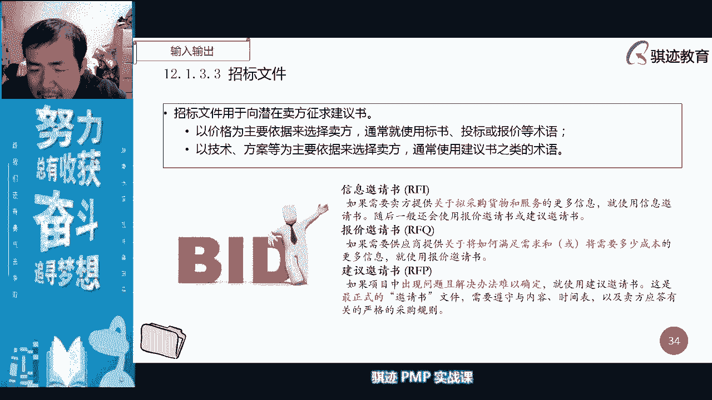

# PMP认证考试课程最新完整免费课程零基础一次通过项目管理PMP考试 - P37：PMBOK第六版 第十二章项目采购管理-38 - 骐迹PMP - BV1Sb4y1f7Yt

双方呢就有可能继续执行这个合同，从而保证生产经营呢能够稳定啊，能够稳定，这样的情况就叫做这种情况，我们运用总价将进程就可以保证买卖双方，买卖双方的啊，买卖双方的合同的履行意愿呢得到增强。

从而避免一些采购当中的不合同纠纷，产生的波动，好这下听懂了吧，以上海的房价举例就行啊，怎么样，还有另一种总结进行调整，什么意思啊，比如说航空公司买飞机，航空公司买飞机的时候，它是以什么东西啊。

它是以美金或者欧元去买的对吧，波音空客对吧，现在有大飞机的啊，我们有大飞机，以前是波音空客，那么他买回来之后呢，航空公司大部分的飞机是在国内，中国的航空大部分在国内飞的对吧，他收入是人民币。

那么就产生什么航空公司收入的人民币啊，但是付出就是美元，那么就会有个人民币转成美元，所以每当人民币贬值，美元上涨的时候，航空公司就会承担汇兑损失，但是相反相信最近美元跌得很厉害。

人民币相对美元是升值的时候呢，航空公司就会对收益，那么在这种情况下，航空公司固然希望有收益，但他也害怕万一美元涨上去了，会导致什么，会导致它产生额外损失，那么怎么办呢，他会签和航空公司签订，一定要。

规定我们每年进行结算的时候，如果美元和美元和人民币价格发生了啊，汇率发生一些比较大的波动的时候呢，我们自动把这个价格呢做一定的调整，双方各承担一部分汇率产生的损失啊，这也叫总价奖金调整。

明白了是因为会对造成的，中石油的价格是国家制定的，这中国不是石油价格，不是市场制定，而是国家制定的，所以这不是总价价进行调整，ok啊这不在此列啊，ok啊反正你们就要明白。

我们通过总价阶梯行的人可以保护双方，然后建立一个稳定，长期的合同履行的一个状态啊，就这个意思就可以了，这是总价类合同啊。

总价合同，总价类合同当中，因为有一个封顶的总价，所以对于甲方来说，总体保护比较高，甲方风险比较低，那么第二种呢叫做成本补偿类合同，什么叫成本补偿类，一般我们为什么会签成本补偿类合同呢。

是因为很多的项目他在项目做的时候嗯，可能对项目范围内有比较大的明确的了解，但是对项目这个范围所产生的成本，没有很大把握，没有很大把握，因为不知道最终要花多少钱去做，只知道做哪些事情。

或者但是不知道这个做这个事情，到底要花多少钱，对吧啊，啊就像就像就像美国当年那个造造造造，那个叫叫叫那个朱姆，那个那个朱姆沃特的那个那个驱逐舰一样，一开始说是二手啊，101000万艘，然后20亿艘。

后来做到最后变成1001000万艘，美元一艘对吧啊，价格翻了好几番啊，啊或者像德国法兰克福机场造那个机场一样，一开始的时候，预算和最终执行完的预算差了十倍啊，差了十倍很正常，那么在这种情况下。

往往就是什么，就是说成本是很难控制的，因为进度可能会发生各种各样的变化，因为其他的因素或者技术难度造成什么，执行很困难，或者是技术上实现结果和我们预期的不一致，会有可能造成成本的无法控制。

所以在这种情况下，甲方找不到人，愿意以固定总价的方式，和有总价天花板的方式去执行合同，这种时候，那么甲方迫不得已就必须采取什么，成本补偿类合同，所以成本补偿合同是什么，是以乙方注意啊。

是以乙方已经执行的完成的成本为基础，再加上一定的，以体现乙方利润的一些费用为辅助，构成了一个成本的付款总价啊，我再说一遍啊，这一定要注意，成本补偿的合同是指甲方找不出一个最高限价，或者他提出的最低价。

没有人愿意接这个单子，被迫它取消了一个最高限价，以乙方实际执行这个采购所发生的成本为基础，再加上一部分费用，这个费用最终体现为乙方的利润为辅助，组成了整个成本的总费用，以这样的方式去执行这样一个合同。

明白了吧，这就叫做成本补偿，所以成本补偿和总价合同，最大的区别就是没有天花板，没有一个付款天花板啊，那么成本补偿在合同当中我们也有一个要计算，叫做成本加激励，这就是我们前面所说的啊。

前面所说的成本降基地啊，好，那么因为成本加激励和总价加激励，其实是一样的，唯一的区别就是没有天花板，所以计算方式是一模一样的啊，而且没那么简单，因为不用算天花板，不用超过天花板。

这个东西直接抹零这种事情对吧，所以这个我们就不讲了啊，我们概念其实跟那个差不多的啊，但是成本加激励会有个什么事情啊，因为没有天花板的保护，当然所有的成分补偿都会有这样，因为没有天花板保护。

所以乙方如果执行出一个，甲方也只能什么也只能捏着鼻子，捏着鼻子认了对吧，虽然因为有激励因素，比如说八二开的这个因素，乙方也要承担20%，超越预期的那部分当中的，比如说我们前面那个例子当中，13万。

他最终做出了100万，那么超过部分130000+1000000，超股份87万，那一部分甲方还是要承担什么80%对吧，就是因为没有最高限价啊，是这个意思，ok好，那么这个中间粒子呢我们就不细说了啊。

好那么但这个兴趣呢，下次我们可以加总总价价低和成本讲解，就比如说那么这是一种成本加激励啊，所以激励激励我们前面说过了对吧，事先约定好的，对你的一种促进，让你为甲方服务的一种促进啊，我们讲激励。

那么第二种呢叫成本加固定费用啊，成本加固定费用，记住一点，它的特征是什么啊，它的特点首先是对于甲方最为不利，记住啊，所有合同类型，现在还在使用的合同类型当中，对于甲方最为不利的一种合同类型。

为什么乙方是旱涝保收的，啊嗯就比如说我预期这个这个项目呢，我预期这个项目呢要三四万，三四万做完30万做完，然后呢只要做完了呢，就额外付10%，那么它的利润已经是固定了30万，其实对于乙方来说。

最终花多少钱成本做完，对他来说已经无所谓了，他只要把这个事情做完，他就能拿到3万啊，最终他做出了300万的成本，他也能拿到这个3万，他丝毫不受影响，一分钱也不会少，而300万的成本呢，甲方只能打掉。

打掉牙往肚子里吞，给报销掉啊，这就是我就讲讲那叫成本价，固定费用，明白了吧，所以这种情况下对甲方的保护是最少最少的，最少的，对于乙方的约束是最少最少的啊，所以这种情况是甲方最为不利。

最为弱势的时候会签的一种合同啊，cost plus fixed fee contract，ok好，明白了吧啊好，那么第三种第三种成本补偿的合同，第三种叫成本加奖励，什么叫加奖励呢。

就是由甲方主观决定的费用，那么你们可以这么急啊，成本加奖励是什么啊，就是说成本全额甲方报销，乙方赚多少有由甲方说了算，啊甲方收割成本加起就是说啊成本加几的啊，加加奖励的合同就是说成本甲方全额报销。

乙方赚多少，有甲方说了算啊，所以成本加奖励还比成本加固定费用呢，甲方要权力要稍微大一点点，毕竟甲方如果对乙方很不满意，可以让乙方一分钱不挣对吧，理论上理论上可以让一分钱不挣啊。

所以这是这是一种倒数第二种对甲方不利的啊，成本补偿类合同都比总价价，总价合同呢对甲方更为不利，但是这个不利当中呢，成本加固定费用是最不利的，倒数第二呢是成本加奖励，倒数第三，那才是成本加激励啊。

注意那么对于甲方来说啊，安全系数最高的呢是固定总价，固定总价，接下来是成总价加激励，接下来是总价加经济调整啊，好，这个是我们讲的总价加激励的，一个费用的一个例子啊，这个大家可以自己去看，我就不说。

因为这个计算方式和前面的计算方式一毛一样，一毛一样啊，一模一样。

好那么最后一种第三类叫做公量合同，工料合同一般是事先不知道要干多少活，无法快速做出精确定义的时候，然后呢然后呢但是我们知道单价是多少的时候，然后我们先约定的单价啊，这不我们先约定一个单价。

约定个成本上限啊，约定一个时间限制啊，然后呢我们先做做看啊，所以这个时候呢我们叫做工料合同，他买的material contract，好这就是我们pp里面讲的一个啊合同。

那么我们在各个合同当中，为了规避成本，超值选的合同当中优先选择总价啊，单价合同和成本补偿类合同啊，所以公告合同在当中居中啊，它的可控范围呢很难评估，所以我们将它认为是中性总价合同呢，成本控制呢更为有利。

成本补偿合同，总价控成本控制更为不利啊，风险更高。

好我们从这张图上可以清晰啊，这个呢在偏颇和第五版当中呢，有第二版经可取消掉啊，第四版有第五版经取消掉啊，第四版有叫成本加酬金，这个就不用记啊，c p p这个就没有了啊，啊对第四版有好。

那么我们讲求合作当中，对于买方来说风险最低的是固定总价啊，然后风险最高的是什么成本加固定减，那么相反之就是什么，我们的卖方的风险最高最低啊，所以固定总价是卖方风险最高的啊，好大家如果要知道买房。

买房的风险和承担的责任，看这张表就可以了，ok明白了没有好，那么讲到这里，我们的所有的采购当中的合同就讲完了，ok不知道大家明白没有，如果有个别不明白的，在公屏上告诉我。

还有哪一种合同或者怎么样的不明白，请在公屏上告诉我啊，这个很重要，但是我不准备讲第二遍了，第七版有吧，第七版肯定不会有，但是这六这七种合同还是会有的啊，但是第七版肯定也不会有那个成本加酬金啊。

啊这个已经不用了不用了，因为这个有巨大的漏洞，啊公立合同啊，那么再讲一下公道合同好啊，什么叫工料合同，工料合同就是什么，买卖双方约定一个不说材料或者资源的单价，比如说我们我们比如说有个活。

但是我们不知道这个活要干多长时间干完，那么我们我们跟就是甲方和乙方约定好啊，你帮我把这个活干完，然后呢你人签到，我按照什么510天人天来算，然后呢你做完之后报给我个人听，我们按照五五百一天人天来算啊。

510天人天来算，或者是说什么你给我干活啊，我们按照500人听一天来算，我最高给你十天，把这个活干完，使劲把这个环，但具体怎么做，具体做多少天多少，根据你实际完成情况来做啊，就你实际完成情况来做。

这就叫做公量合同，工量合同，所以公量合同呢双方都不对，对范围呢没有精确定义，所以呢我们会约定一个什么工作时长，或者是约定一个什么啊，我们工作的一个单价，然后更多时长或者单价来进行计算。

整个合同的履行金额，明白了啊，然后就正好笔刷啊，就好比说你家里装修，你请一个油漆匠给你了，刷刷墙，然后你跟这个游戏要说啊，问他你干一天活多少钱啊，啊现在外面好像好一点的油漆，将干一件400块钱。

那你说你给我刷个墙，你给我看一下，我先问你，你给我看一下这些我家的这些墙面要刷多少，他说你家这墙面哎呀，你家这么小的蜗居，这么小的墙面啊，刷刷一天够了啊，那么说好，那刷一天就够了，然后呢，我给你。

我给你400块钱，你给我刷一天，然后刷刷刷刷下来呢，他最后给我刷了一天半啊，刷墙刷完了，那我也给他了多少呢，一天半的工钱对吧，虽然他跟我说一天就够了，但是我们实际没有约定时长，我们只是说刷一天是什么啊。

400块钱，但是我们刷了一天半，我给他多少钱，我就给他600块钱对吧啊，这就叫做公量合同，明白了吧，因为他在刷墙的时候发现什么，我们家虽然房子很小，但是这个墙刷起来呢有难度对吧，有难度。

所以他最后多少了半天，但是我也不能为难人家，对吧啊，差不多明白了，这就是公量合同啊，举个例子，激励和奖励有什么区别，ok激励是事先约定好了，所以激励对于买方卖方来说是有风险的，会扣你钱。

成本节约呢会奖励你钱，而奖励呢不是的，奖励呢是什么啊，旱涝保收，但是肯定不会亏钱，但是你到底赚多少钱是由甲方决定的，比如说甲方说会给你一个考核系数对吧，比如考核系数是五，他跟你说5%。

那么我们这个合同做完的时候呢，我们就给你干到按照这个合同标的的，我们原来标的的5%啊，100万的5%，5万给你奖金，如果你做的不太满意呢，甲方说只能给你2%啊，那么就按照原来合同标的。

什么2%给你奖励嗯，如果甲方对你特别不满意，他说是0%，那你一分钱挣不到，那么第一种可能是给你5%是什么，你最后这个项目做完呢，可能给甲方80万就做完了啊，甲方说啊给你85%的奖励奖励系数啊。

第二种情况呢是什么，你给甲方呢100万做完了，甲方说啊，给你个2%，第三种呢你给甲方做了个300万的成本啊，甲方咬着牙啊，他认了，但是一分钱都不给你利润，你就纯就是啊跑个腿，这就是奖励。

但是激励呢不一样，激励很有可能是会亏钱的，知道吧，比如说我们叫啊，我们原来心理预期10万块钱做完的，然后呢我们讲是酬金是1万块钱啊，1万块钱，然后大概是八二开是吧，是不是你要卖价。

你的卖价要承担2万块钱呢，惩罚你酬金只有1万块钱，但是你惩罚了2万块钱，是不是要倒贴1万对吧，这就是惩罚，所以激励和奖励区别就在于，一个是事先约定好的奖惩条款，而奖励呢是事后由甲方主观决定的啊。

甲方说你讲啥就是啥呢，叫做奖励，明白了，所以就和我们讲，我们之前讲的资源管理当中，前面讲的讲的啊，团队的激励和团队奖励，激励是在世贤的，奖励是在事后的，差不多一个意思，明白了没有，好那个叫张慧明的。

ok啊，这下我觉得你应该明白了吧，好好明白的话，请在公屏上打一个明白，好ok你们明白就是我最大的开心啊，我们继续往下讲啊，ok啊我为什么这里讲的细，因为我希望一边讲明白，因为这个地方肯定会考一道题。

我估计肯定会知道考一道题，但是明白了直接可以拿拿到分数，但是呢你在花时间反复去讲呢，不值得不值得，人间不值得，然后我们在规划采购当中，最后输出一个什么东西啊，采购管理计划啊，采购管理计划，采购标的。

采购各种内容。

资金来源等等等等啊，那么采购管理，采购管理计划当中呢，还有什么我们采购当中的角色，采购的测量指标，采购的时间，采购的制约因素，司法管辖权啊，采购当中为什么要写司法管辖权呢，是因为最后签合同时候。

我们跟对方约定，如果出现纠纷，如果需要进行法律解释，我们适用于哪个地方法律啊，因为什么呢，有一些跨国的合同，他会比较担心什么，我比如说我中国和非洲的一个国家签订的合同，但是我不了解非洲国家的法律啊。

他们那个法律什么奇葩法律，为了万一对他们国家有利，对我们中国不利，他明显是不合理的法律，但是人家毕竟是国家法律，对不对，那么我们一定要约定好，比如说我们跟非洲，哪个鸟不拉屎的国家去要做合同。

可以的要赚钱嘛对吧，可以的，然后我们约定这个合同签署了执行，那么很多时候呢，司法管辖权我们会使用中立地的法律，为什么要中立地啊，阿姆斯特丹啊这种地方，荷兰的法律啊，或者是瑞士的法律。

这些中立国中立地或者自由港，他们的法律呢一般是倾向于促进贸易，促进合同成功的，他比较相对比较中立啊，没有带有偏向性，相对比较中立，所以很多的国家再进行跨国贸易者，会选取中立地的法律啊。

会有会有这样的一种条款在里面啊，这个要注意的给你们科普一下，是不是应该怎么评估，还有采购怎么样风险，然后呢采购当中还有预审合格的卖方规划，采购当中为什么叫预审合格的卖方啊，这个叫预审核满分什么呀。

就是说你们很多组织里面就会有，讲一遍一块钱对吧，讲一遍一块太贱了啊，我讲一遍不止一块了，我呢还是时间还是很值钱的啊，那么什么叫做预审合格的卖方啊，就是很多组织当中，有一个叫什么叫做合格供应商，知道吧。

合格供应商一般会自动成为，如果你愿意选取，一般会自动成为你的某项采购当中，优先考虑的那个卖房，因为他已经通过组织的审核，是组织可以信赖的供应商，如果他在你的合格供应商卖方的名单里面。

他很容易就自动成为你的预先优先考虑的，卖房之一啊，所以很多的大公司，为什么很多的小公司，乙方小公司，为什么挤破脑袋想做大公司的供应商，合格供应商就是因为那些大公司一是订单多。

第二呢大公司会优先考虑合格供应商，然后呢做了大公司和供应商，你能保证业务量，同时呢还能给你树立招牌等等，所以很多的小公司愿意以更好的竞争的价格，或者不赚钱为大公司做生意啊，就是这个道理。

ok啊这个大家跟大家科普一下就知道好。

那么我们在规划采购当中还会数字叫采购策略，怎么去支付的，怎么去交付的啊，怎么去采购的，采购的交付方式怎么样，还是多次交付，采购是怎么支付呢，是分阶段付钱，还是一抢一次性付钱对吧，诸如此类啊。

这叫采购的采购策略，采购策略它是在规划采购管理当中，在采购管理计划当中写明确的。

写明确好，那么我们常见的采购策略当中，我们很常见的，比如说啊，很多时候我们常见的采购正版叫3331，知道吧，或者2222222211啊，或者是啊333要更多一点，就说哎开始犯-30%，当众付30%。

最后付30%，留15%到10%的什么维保金对吧啊，注册啊，这是采购策略一种，还有交付方式规定什么，比如说三个月交付一次呃，半年交付一次就全部做完，一口气交付也是一种交付方式啊。

这是你作为甲方会给乙方设定啊，这个怎么样交付方式啊，对于建筑行业当中来说，会有什么会有分阶段交付的啊，就比如说上海啊，有一个很有名的建筑啊，上海的第一高楼是什么啊，也是世界第几的。

我现在不知道叫上海中心，大家知道啊，上海中心上海中心当天没封顶的时候，我上去过，我上去玩过，还没封顶的时候，是上海建工造的，那时候我去参观，然后呢，我在上海中心那个没有封顶的那个。

他的那个那个脚手架旁边，然后站在那边，陆家嘴下面那个车跟米粒一样大哇，好高好高好高，然后旁边的那个上海的金茂大厦，知道吧，也很有名的，很高的楼，看上去就跟小弟弟一样，很矮很矮，闹了好高好高。

上面风呼呼呼的那个楼就很想吃，它就分段交付，他怎么分段交付啊，它下面的群楼就是最下面的矮楼，事先第一阶段就造完了，造完之后呢直接就开始营业了，一边那边还在营业，一边上面那个楼呢，当当当当当当当还在造。

就是说上面的楼还得到，下面都已经开始营业，这就是分段交付啊，给大家说一下酒瓶起子啊，不不不不，打蛋器打蛋器，酒瓶起子是那个那个那个那个那个，那个是是平安的那个楼还是什么楼啊。

酒瓶起子是另外一个是三件套集中啊，然后是经贸大，经贸经贸大厦是那个锥子，酒瓶起子是第二个造的，是那个是视频安大楼啊什么的，是上海中心是第三个找的是那个打蛋器，ok啊很有意思啊，给你们给你们讲一个东西啊。

我还有一个我还有一个视频录像，玩的是当年拍的一个视频录像，你们有兴趣以后，我可以把优酷的链接给你吗，我穿上传到优酷去，我给你们个优酷的链接啊，当年我在上面去拍的啊，你们有兴趣可以私下里可以找我。

或者我等会在用户上翻出来，然后给你们个链接卡死，如果没有被优酷删掉的话啊，这个采购策略，激励奖励费用啊，这也是采购策略里面的一种啊，我们用什么样的策略，比如说我们要更更好的激励奖励。

来协调双方的目的关系啊，诸如此类，啊环球金融中心对呃，啤酒啤酒瓶起子是那个环球金融中心对哦，sorry，我忘记了啊，然后上海中心是第三个是那个打蛋器，它上面是那个那个旋转上去的。

那个像打蛋器一样的对吧，三件套，厨房三件套，ok啊，规划采购当中还会输出一个什么东西啊，叫做招标文件，招标文件注意啊，有三种招标文件，第一种叫做fi啊。

英文叫什么叫request for information，用于西要求卖方提供尼采购物品的信息啊，然后呢他是就是相当于初步的咨询，你有没有这个东西可以卖，或者我们想买某个东西，你有没有。

或者你知道哪里有这叫做i fi，知道吧，request for information，我看这问题没那么第二种啊，我们的招标文件当中，第二种呢叫做request for quotation。

叫做报价建议书，那么说啊，接下来说啊，如果你说啊，我们有这个东西卖的，来给我报个价，给我初步报个价，r f q，注意r f q当中所报的价格，并不一定是最终价啊，它只是个初步询价。

它用于初步筛选那些供应商啊，所以他叫request for quotation，codition，codition就是询价的意思啊，那么寻完家之后呢，我们就会设定一个入围啊，谁入围，入围了之后。

我们开始发最终一个最有法律意义，然后是最严肃的，叫做i f p request for proposition啊，招标建议邀请书啊，招标建议邀请书，这个时候呢你不但要爆出最后一个正式的价格。

还要爆出你的解决方案，你怎么样将满足我们作为甲方的，我们提出这个需求，你怎么样通过什么样的价格，什么样的方式去满足我们的需求，这叫做i f p啊，然后呢后面我们讲在实时采空，讲讲卖方在收到了fp之后。

他会做一个叫fp的revise，他会将我们的招标邀请书呢填写好，根据固定格式填写好，做一个反馈，做一个反馈，在评估之前有可能还会什么，这卖家还会做一个东西叫做路演好，这叫做演示。

我们叫做fp printation啊，啊演示现场演示啊，所以你们如果参与过很多采购，我以前经常参与采购，很呵呵，其实很无聊的，就是说上面像演猴戏一样，下面那个下面那边都在玩手机，就是呢只有几家供应商。

一家一家来，每一家供应商呢打开一个ppt，然后有一个授权工程师啊，或者是就说讲标的人口若悬河地讲，他们产品怎么好怎么好怎么好，那么好怎么好，下面人呢啊随便看看对吧，然后等他怎么怎么讲完了之后呢。

然后呢作为甲方的我们啊，然后上去问几个问题，然后确定一下他是不是忽悠我们对吧，然后有时候有些甲方呢为了显摆自己，会问题很刁钻的问题哈，一般我不怎么会，我一般是问他们几个看似很简单，但是其实要回答呢。

好的呢是体现水平的问题，然后呢希望他们呢能够回答好，然后呢会问一些细节，我关心的东西，最后呢给他们，他们回答完之后呢，给他们一个评分啊，给他们评分作为技术方面的评分啊。

ok啊这就是i f p f u revise，if printation啊，ok啊，这涉及到后面的实时采购，我们讲，那么采购当中最有法律意义的严肃性呢，是rf p啊，注意所以rf p一般是什么招标。

入围了之后才会发出去的，但是f i r f q呢有可能是群发的啊，注意有可能是群发的，但f p一般是入围了之后再发给入围的人，发给入围的人啊，但是这些东西不会到实时采购再去做。

他会在规划采购当中就已经制定好这些东西，所以f p要带上解决方案了，注意啊，所以are request for information视角，你有没有东西卖，request for quotation。

是你要卖的价格如何，fp呢是讲你怎么样提供解决方案啊。

明白了没有啊，好所以采购工作说明书啊，我们想一般是甲方编写对吧，采购工作说明书ok啊，就我们前面已经讲了比较详细了对吧，比较详细啊，这我就不多说了，大家如果不明白还可以看一看文字啊，后面会看一下文字。

这就不多说了，所以f f p s o w，所以不是r p r i s o w，它主要的目的是什么，划清楚你要采购东西的边界标准要求啊，达到的技术标准，达到技术标准等等这些东西，但是不用写什么东西啊。

不用写验收标准，验收标准是在另外一些文件，s l a i等一些东西里写了啊，这不是验收标准，注意啊，他只是说你要达到那个程度，你希望达到那个程度，但是他不会说我怎么去验收的，这是不会写。

然后呢在规划采购当中的东西比较多，criteria比较多啊，还有一个东西要规划啊，当评委啊，评委还有评审会啊，傻不傻，评委这种东西，你以为评委这么好当啊，万一平的不对称呢，要要要要要要那个了吧。

要负法律责任的好吧，你想的太轻松了啊，评委这种就坐在上面啊，走个过场就能拿钱啊，这么简单的操，ok啊，我们不说了，继续讲公方选择标准是什么，在你决定某项采购的时候，你要选择你怎么最后中标的供应商。

他自身应该具有怎么样的特质，是这样一个东西啊，攻方选择标准，那么我们会选择什么能力啊，潜力啊，交付时间啊，员工能力啊，财务稳定啊等等一些东西啊，这个大家稍微看一下，官方选择标准。

不是选择你他卖给你的服务，而是说在服务达到你要求的基础上啊，你能够保证它提供的产品和服务，它的潜在的那些能力在哪里，他潜在的一些因素在哪里，所以很多时候呢产品可能是一回事，卖给你产品的人是另外一回事。

有时候最好的产品可能后面的人不是最好的，你可能不一定选，你万能选的可能不是最好的产品，但是你可能选的最好产不是最好，产品背后最好的那个人才，可能是你最好的一个采购解决方案，明白我意思吧。

这不仅仅指的是服务支持啊，他他们的合作态度啊啊，以及长期工作关系的稳定性啊等等一些东西啊，ok啊，这叫做工方选择标准，所以采购一方面是选产品，一方面是选择供应商，两方面都要选，还有那什么还有一些东西啊。

要选择什么供应商家应该有一定诚信资质，没有欺诈记录，没有贿赂记录啊，这些东西啊。

最低价中标同学看清楚啊，最低价中标我们前面讲过吧，最低价中标是官方选择分析啊，官方选择的选择分析对啊。

也可以可以，但是呃攻方选择标准一般不会觉得啊，这更多的时候，选择分析可能是更多是用在我们的采购呃，采购策略，采购策略当中啊，提最后体现在什么，体现在合同里面可好。

那么我们怎么样去评价一个供应商，以及他的东西呢，我们会用一个什么加权系统，就说我们会有各种设定，各种各样的权重，然后呢对不同的供应商的不同的产品进行打分，每一个供应商有一张加权表。

当我们对所有入围的供应商，都进行加权打分之后，打出来的分数就成为我们评判的唯一标准，当然你可以对于权重进行调整啊，这个进行调整好，那么我们在实际采购当中注意啊，我们看我们刚刚讲了一个规划。

已经只有半个小时了，所以采购方都讲不完，但没关系，因为我们后面相关方可能啊是比较简单的啊，所以不用那么长时间啊，所以懂wor，那么采购当中注意一点，就是说的作为一个项目经理和项目管理团队。

可能很难决定你采购什么东西，但是作为一个有经验的项目经理，一定会提出有根据自己本项目特点的啊，技术要求，而让商务要求由采购流程决定，但是项目经理一定要提出关，关于这个项目的技术性要求。

因为技术性要求采购是不懂的，那么我们讲哦，当然啊我们可能有些同学做采购了啊，做采购的同学知道采购的他的绩效是看什么，你的能过公司省多少钱，所以往往如果全凭采购去买东西，他们买来的肯定是最便宜的。

但是不一定是最适用的，但是对于做项目来说，你的目的不是赚钱，而是把事情做完，所以你希望买到的东西呢是物美价廉的，需要有一定品质保证，那么你怎么样保证这个品质，就要通过你提出的在加权系统当中。

供应商评判标准当中，你的最后的评标的评标的标准当中的，我们对于技术的评判的这样一个权重，和一个要求和一个资质烂决定啊，所以我们前面讲的资质也是很重要的，所以你可以设定一定的客观资质，去筛选一定的供应商。

也可以什么将你认为最关键的若干条技术指标，纳入到加权系统当中，给予足够的权重去筛选出，你认为可能会影响你最终采购结果的那些，你认为说应该删除了供应商，明白吧，因为有时候你会提出一个采购需求。

但是你在采购流程当中所选出的供应商，未必都是你觉得中意的，那么你要避免那些你不重要的供应商中标，怎么办，你用技术标的方式将它们贴在外面，他们可能商务标很高，但是技术标不满足的话，是不会最终中标的，明白。

但是前提是，你和你的团队要对技术有足够的发言权，通常来说采购对于技术是没有发言权，他们不懂技术啊，通常来说明白吧。

这是这是个这是一个诀窍啊，注意好，那么我们的规划采购当中，我们最终定出的文件当中，还有什么自制外购的决策，我们为什么需要自制，外公就要理由要作为记录啊，只是作为这项采购的动机啊。

对一些买卖价格很大的采购，我们会请外部的，比如说审计师啊啊这一来对买卖双方的价格，对卖方的报价，对买方的呃成本的心理估算呢，进行一个成本估算，得出一个公平合理的成本基准，意义又又最便宜又最好的。

毕竟是少数，大部分情况下还是什么啊，一分价钱一分货，但是贵的也不一定都好啊，所以这就是为什么老外很恨中国人是吧，因为中国人往往打破这个定律对吧，又便宜又好用对吧，虽然不是最好用的，但肯定是最便宜的对吧。

那么有时候阿三的东西比中国人还便宜，但是阿三总和中东西定律我是最便宜的，但是我最不好用啊，黑一下阿三啊。

好那么采购当中对于一些采购次数较少，还是相对简单项目，那么本项目可以有一些文件可以合并啊，直接使用什么组织过程资产，直接使用使用组织过程资产就什么叫资源，组织过程资产，就是对于一些小项目采购的不多的。

你值不不值得自己去制定这一系列规章，制度就不用了，然后怎么办呢，组织当中以前有的规范的模本文本照抄啊，照抄。

好这就是规划采购，ok听明白了吧，好我们接下来继续讲实施采购，在实施采购当中呢，我们会对采购呢进行一个招投标的运行过程。

实时采购就要招投标过程啊，那么招投标的第一步是什么，根据我们的采购文档啊，根据我们的采购文档先做采购的准备，那么采购文档有哪些呢，是我们规划采购当中制定好的招标文件，s o w成本估算公方选择标准。

然后呢我们将这些东西呢进行广告广告啊，这里的广告是一个抽象的东西啊，p m p传统意义上广告什么登报纸啊，大家以前看报纸上看过吧，老师休息一下啊，是不是讲的东西很充实啊，因为今天时间有点紧啊。

那就休息一下吧，现在是09：34，我算他35分好吧，我们休息十分钟，我们到09：45好吧，好感谢老师休息一下，是不是内容很充实啊，好休息一下啊，那我不下线，我跟大家聊一聊啊，那么我们先那么我们先回顾。

我们从接着休息完之后，我们从实时采购开始讲好吧，我们稍事休息，有些同学可能有点急对吧，有些女生可能需要补个妆对吧啊注意啊，女生去洗手间，很多时候呢要要注意表达对吧，要去补个妆，补个妆，补个粉对吧。

好去吧，太干了对吧啊，补个水补个水，太干了，喝水对哈哈，是太干了，货太干了，干货太多了，对吧啊，那么采购里面是有很多这个内容是没关系啊，大家如果看一遍，如果不懂，有些东西不懂的话。

其实我已经省掉很多东西，有些同学可以讲的更细啊，只不过我们是在满足p p的教学的基础上，给大家讲，知道吧，有些东西是讲的更细，根据软考啊，根据一些我们其他的项目实验，日常管理，很多东西可以讲的更细。

真的可以讲这些，尤其是做过经常做招投标的那些人，觉得我讲的课其实是很粗的啊，嗯下周还有一节课，下周最后还有一些相关方啊，有啊，是不是讲的慢，讲的慢点，希望我再给你们多讲讲是吧。

不舍得不舍得我啊啊讲完课离开，你们不要急啊，我一直在你们身边，我又不退群，你们以后有要求的话，我们直接跟学校说，我们开个直播室对吧，我们聊天直播聊天对吧，老师唱首歌好吧，3月份的课是你讲的吗。

今天元宵节哦好吧，随时开始，3月份的课是另外一个无线老师，因为我要带软考班，所以啊压力有点大，所以后来让吴老师，吴老师来开这个课了，本来3月份的课也是我开的，后来我们因为学校开软考嘛。

新课程什么时候开始，3月份开始在我们开始，你们具体可以在那个我们的b班群里面，可以问啊，当然没问题，无论是你们是哪个月份开始的，或者是哪个班级，你们有问题随时都可以问，我没有问题。

这个是no problem，好我来唱歌啊，小小姑娘清早起床，提着裤子上茅房，茅房有人没有办法，只好拉在裤子上，哈哈这个歌是这个歌，是不是很很很很很雷啊，啊这个就是我女儿知道吧，呵呵我老婆今天很很。

我老婆今天很压抑，我女儿今天一天一天上一天，这拉了四次屎，然后还不是拉肚子，正常就拉屎，能吃能拉，扛不住他，但是我想听你的，你可以看回回放啊，啊想听我的话还可以看回放啊，3月份开始的课我还能继续听吗。

那你要问课程顾问了，这个我不知道，如果只要时间允许，只要有空，你们让我讲，我是可以讲的，没有问题啊，只刷题能过吗，理论上是可以的，但是你要是你刷的量足够大，偏僻的组合答案，但是注意啊，这招对软考无效。

走心歌手，啊a班的同学3月份课能不能听，取决于学校的安排啊，我不知道你们问一下个人啊，我不敢轻易回答对吧啊，炸学校的啊啊太阳当空照花儿对我笑，小鸟说，早早早，我对小鸟说，我去炸学校，地上火，回头跑。

轰隆一声，学校不见了对吧，软考是什么，是信息系统项目管理师啊，是我们国家开的，他们说叫chinese p m p啊啊，里面大部分内容和pp差不多，考出来可以居住证加分。

但是他是以i t背背景知识为基础的，考出来可以加分，可以居住证加分，可以啊，呃呃国企系统里面可以啊，变优先评级，然后呢还可以啊，退休了多拿一点点养老金啊，不能这样啊，它最大优势是以考代评，然后获取职称。

中级的软考，通过中级呢是可以直接评上中级职称啊，软考考出高级呢达到一定条件，可以评上高级职称啊，软考是指哪方面呀，信息系统啊，软考试指的是信息系统管理师啊，但软考有很多科目，但涉及的面皮比较广了。

我仅止信息系统项目管理师，我们学校只开这个啊，因为我也只教这个，我其实能加，但是我背很长时间，然后考的也很少，我就啊不愿意做这个事情啊，比如说你们如果有100个人备，报考另外一个课程啊。

那我马上给你们备一套来，no problem技术增加多少分啊，那取决于当地政策，谢谢北京上海深圳广州，哪里哪里城市不同城市不一样，所以请参照当地政策，我也不知道，但是肯定都加分，所有城市。

大型城市落户的居住证积分都会有一条，是对于有职称的啊，工程师或者是专家等等有额外的积分考虑的啊，这点是肯定有的，软考都是选择题吗，13章老师还继续讲课，当然讲啊，13章下周讲啊，讲的。

对如果你要考软考的话，你可以先考个pmp，有p m p基础再去考软考比较好，因为软考是今年5月底开考，p m p是6月份开考，所以p p的软卡在p前面了，所以其实说如果你们都没有学过。

其实理论上可以先考软考，考完软考之后再考p mp啊，是可以的啊，因为软考的对项目管理知识要叫p n p的知识，要求其实比p n p高，因为他上午是选择题，下午是案例分析题，还有论文高项，还有论文。

他的要求其实比p n p还高啊，所以你如果能考出软考的话，对于考偏僻来说，难度就没有那么高了，对软考高级软考中级的话，下午就都是案例分析，就没有那个了，没有论文了啊，简单点论文是比较难的啊。

论文是因为论文是中国考试的特色，是会卡人的，他会卡一个分数线，很多人是达不到分数线，强行打广告，同学你这个要天地良心啊，我是义务打广告，不是强行打广告，因为软考班级人再多再少，和我们的班级人一样。

我是拿一样的课程给你们上课，只不过对我来说，我是希望大家能够考到更多的证书，对大家有用的证书，能够帮助大家今后前程似锦对吧，现在打强行打广告呢，那我强行打波广告好了啊，各位同学。

大家如果有学ito的需求的，无论是foundation的，没人觉得哎professional的还是master啊，我老师我都可以教啊，我是全中国少数的啊，有这个三个级别level教学教学能力的老师啊。

这个是不吹牛的啊，你们有兴趣的可以啊，私下联系我们学校没这个开没开这个课啊，以后有兴趣可以私下联系我啊，更欢迎大家如果企业组团报名啊，我们来企业做内训啊，然后还可以定制化，根据企业情况定制化内容。

就广告规定的吧啊老师的教的i to mp的，以前给你们看过mp还可以是吗，还可以啊，不是还可以，就是艾特m p的话，还是英文教学啊，我还是可以中英文双语教学，如果你们有兴趣的话，行了，软考贵不贵啊。

软考的为什么通过率不高，就是考试太便宜，高校才100多块，中向好像是90几块，好像是报名费很便宜，所以很多人不重视，知道吧，书非借不能读，也考试，不过不会过也知道吧。

认识我就够牛了，那不要这样。

你还不够不足够认识我啊，不足够认识我，ok啊，下周还有一堂课的呀，同学们，下周还有一堂课的啊，我看一下，下周应该是还有一堂课的，有的有的肯定有的，我来看一下日程安排，我记得是有的呀，呃我们3月2号。

3月2号，3月2号还有一堂课，3月2号有的，我是全能啊，我也不是全拿，也有些也有一些还没怎么教过啊，还有相关方啊，下周还有一个相关方，ok啊，我们09：45了，我们继续开始吧，我们开始讲我们的实时采购。

对吧啊，老师老师英文有什么证书推荐考吗，英文证书推荐啊，英文没有证，英文就是练一个字练啊，两个字多练啊，三个字经常练，英文就是从我列英文就是从看美剧开始啊，没事就看美剧，然后呢从看双语字母。

然后到看英文字母，到最后不看字母也能看得懂就行了对吧，然后呢跟老外去扯淡啊，工作中跟老王去作战就扯淡也就可以了啊，好好好英语八级，当年老师当当年大学大一的时候，大一的时候我就去，我就去把六级考出来了啊。

但是我不是英文专业，所以不能考英语八级啊，开始开始，英国注册是什么注册师，会计注册师那个挺牛的，好像是呃a f f a r c f f a啊，那个东西那个东西也挺难考的，那个男的有点难的，当然我没考过。

因为我不是这个专业，不是财会专业的啊，ok啊我们开始吧，不扯了啊，不是我们开始了啊，最后15分钟啊，我们讲实施采购。

我们讲实施采购，就是将我们是项目采购，前面采购当中所制定好的那些文件。

运用于采购实践当中，那么采购实践应用当中的第一步是什么呢，就是打广告，小广告小广告对吧，塞小广告啊，那么这个小广告在当年老师是个学霸，我不是学霸啊，老师啊不是当年啊，你们当年看过没看过啊，很多报纸当中。

中宋都会有留什么求购什么东西对吧，求购什么东西，那个求购是不是就是采购广告啊对啊，我现在呢互联网时代了，嗯嗯现在很多的采购呢都放到网上采购了，就别说阿里巴巴对吧，大家上过吧。

那个阿里巴淘宝的那个阿里巴巴那个网站对吧，然后呢还有什么呃，政府招标，政府招投标网对吧啊，我诸如此类这些东西都会在网上公布啊，网上公布，那么广告有时候呢也不不一定是在直接公布。

他也有可能是什么在一个圈子里去传，也有的啊，也也可以进行邀请，也是有的啊，朋友找朋友也是有的，很多的采购特别专业的采购，或者有些采购东西比较敏感的，涉及敏感技术的，有时候不会采用公开的这个广告方式。

进行征集啊，以避免暴露关系，有时候会采采取私下调查或者私下里去呃，进行咨询，通过咨询机构的方式去寻找那个潜在的卖家，也会有的啊，啊这是广告，然后接下来一个呢是一个呃重点啊，一个重点叫做投标人会议啊。

投标人会议，那么什么是投标人会议呢，叫做啊标前会，这个叫叫叫做标前会，供应商会，那么这会是干什么的，注意第一点啊，这个会有时候经常喜欢考概念是吧，首先投标论会不是真正的我们的啊，投标现场。

而是投标现场的一个预备，是开标前的一个预备，这个预备是干什么啊，就是所有的想要投标的人，都会在这一天派代表到场，然后呢，买方会在场统一给所有潜在的卖方呢解释一遍，他想买什么东西，解释一遍他想买什么东西。

目的是干什么的，让大家对于想要买什么东西呢，有一个清楚一致的理解啊，我统一以这次解释为准，告诉你们我要买什么啊，那么比如说外面传啊，叉老师想买一颗星星啊，想买个星星啊，然后呢我我开了一次投标的会。

然后带起来啊，有些人说啊，茶老师你要买的是天上的星星啊，有时候插老师你要买动物园里的星星，不是啊，是我既不是要天上的星星，也不知道动物园里的星星，而是我要买一个什么，我星星一样的玩具灯的星星啊。

我给你们都解释了，我要星星一样重的玩具灯，你们能做好最好好玩的玩具灯，星星给我女儿玩就可以了，这是我这次啊招标的一个目的，所以这就叫做投标人会在这个会上是不允，一般情况下是不允许嗯。

所有的潜在卖方相互之间交头接耳的，是不允许的啊，也不是让你们相互之间沟通的，主要的目的是什么呢，给你们解释清楚我需要什么啊，同时听取你们的反馈啊，嗯得出你们理，怎么理解我需要什么东西的。

一个一个理解反馈啊，明白了吧，这就叫做投标人会议啊，澄清范围，澄清需求，这不是澄清范围，范围呢要比需求我们都学过了吧，范围和需求关系，需求呢是一个主观的东西，范围呢是一个相对客观的东西啊，客观的东西。

我们在投标会议上，一般会描述的是一个相对比较主观的东西，我需要什么，因为还没开始投标，因为没有开始投标，没有提交建议书之前，是不是你的方案都没有出来，没有出方案，怎么谈得上精确的范围呢，对吧。

好接下来一步其实就是干什么啊，正式的开始招投标了，那么正式开始战斗问题之后呢，对于所有入围的短名单，入围的那些供应商，我们要求他对我们的招标建议书来进行应答啊，应答。

那么招标建议邀请书的应答的i f p的应答呢，就成为建议书，我们把这个建议书呢发下表格，发现之后呢，他们按照那个去抄抄写，然后呢再把那个东西收回来，把那个东西呢抄完之后收回来啊，这个过程很有意思啊。

很有意思，我们你讲个段子，虽然今天时间可能要讲段子，你们听没听说过一个事情叫做劫镖，现在啊现在就是这2年有一个事情叫做劫镖，你们知道吧啊这个段子我很喜欢讲，以前我听过之后念念念念不忘啊，叫劫镖。

古代什么叫劫镖啊，人家叫押运，那个就叫飙车对吧，然后去抢劫财物叫劫镖，现代也有劫镖，那个节标是什么，有些项目工程，比如说土建啊，比如说是那个基建啊，那些东西，他们的项目的建议书呢会格式非常的复杂。

而且呃国家规定还有很多行业规定，建议书必须分电子档和纸质档，但是最终有效的是以纸质档盖章的，纸质档为准的，所以你当天在呃投招投标开标的当天，如果不能把纸质的运到甲方指定的地点的话。

你是没有资格去参加招投标的，所以有些不存在为标的，有一些招投标项目当中，你的竞争对手，我觉得他争不过你后来当年发生过的事情，他们就暗中呢，而暗中呢顾好人，在你把标书那个标书会非常的重很大。

打开摞起来一个人那么高，然后用一个小推车推到甲方线上的，然后换派个人呢当场把那个东西截过来，然后他也他也不能当场把那个标书呢给毁掉，撕掉或者扔掉，把它搬掉，然后呢让你没办法参加投票，真的有这事情啊。

这个真的事情你们网上去找一下，叫做节标啊，好那么所以告诉你们是，很多招投标现场是以纸质的为准，但是甲方一般是不看纸，人，要看死人的，甲方一般看电子档，所以网上你们去搜一下，淘宝上专门有卖叫招投标u盘。

这个u盘呢扔给甲方就收不回来了啊，收不回来，所以那个u盘特别便宜，但是很容易坏啊，啊所以我们在甲方收到各个乙方的收到，诶好像今天好像又有人掉出去了吗，现在在线人数突然之间很少啊，啊没关系。

那么甲方如果收到乙方的各个标书啊，各个乙方的标书之前，在乙方的标书之后呢，他就会对对这些呃，是否是完整，然后呢通过我们前面讲的叫加权评分系统，进行标识评估，进行标识评估啊，然后评估之后呢。

最终呢我们会选出一个中标的人，但是这个过程呢，因为不同的项目标呢会不一样啊，我们在那个啊软考里面会讲的更多一点啊，其他里面会讲的更多一点，开标呢分为两种开标方式啊，第一种呢叫做明标，第二种呢叫做暗标啊。

什么叫做明标呢，就是说它的招投标现场，整个平方过程呢是所有人都在的，大家一起在公众的监督之下，所有的乙方的潜在乙方的监督之下，大家对标题进行一一的评判，最后得出结果，这叫明标，按标呢不是这样的。

它的评判过程呢是不告诉你的，然后呢他也不告诉你是什么，他也不告诉你最终你得了多少分，但是他只会告诉你什么哪一家中标了，那么这种情况呢也是有的啊，很多的很多时候呢为了有时候为了摆平。

就是各方利益呢才取名标呢，会更加什么，会更加的减少纠纷，但是有时候为了避免才是有些，同样为了避免求和，有时候我们会采取不公开竞标的方式，也是有的啊，所以这叫明标和暗标啊，明标和暗标好，那么讲。

汉苗最终都会选出一家中标的人，如果没有一家中标的呢，这次招投标就叫刘彪，那刘备，那么刘彪呢好招投标最惨的是呃招标狗啊，投标狗最惨的是什么，不是没中标，而是流标了，重新投，然后你的标注要重新写一遍啊。

那那那那是最惨的事情啊，所以很多做投标的同学啊，做投标的同学，当你看到什么啊，甲方需求又变了，重新流量重新来的时候，都会一口鲜血喷在屏幕上，ok啊好，那么假设没有留标，有一家中标了，那么中标的那一家。

最后还不是直接自动获得采购合同，而是要和什么，我们作为甲方要进行一场磋商，这个磋商呢我们双方根据甲方以他啊，根据乙方所提供的他的这个标书为基础，加上甲方提出的合同为基础，双方将这两部能动性呢合二为一。

将甲方的要求和乙方的应答合在一起，最终全部或者尽可能体现在合同里面，同时对合同的条款进行最后一遍，逐一澄清和理清双方的措辞，达成一致，最后签署合同啊。

最后签了合同，这叫做我们叫做谈判啊，标啊就是说合同就是采购合同前的谈判，那么这个谈判呢是一科，是有采购经理和采购团队呢负责的，然后呢，技术部分呢，也有可能是项目和项目管理团队，和项目的技术团队去参加的。

然后当双方达成一致后，一般是由采购团队当中拥有亲属权的人员主导，如果是重大合同，差不多这个意思，所以记住啊，有一家中标并不代表什么，是直接可以签合同，还要进行谈判，也有可能谈判最后谈崩了也有小可能啊。

比较小的可能，所以一个复杂的采购合同最后能够达成中标，是和签合同，最后去旅行也是不容易的啊，好那么谈判的目的是什么呢，获取公平合理的价格，建立良好的买卖关系，所以有些公司呢喜欢什么，最后在签合同之前呢。

再杀一杀价也是有的啊，当然了，千杀万杀，记住一点啊，总归要让乙方挣一点钱，如果你让乙方挣不到钱，那么乙方肯定会给你捣蛋对吧，千做万做亏本生意不做，记住这一点就行，项目经理不是负责挣钱的。

所以项目经理你们作为项目经理要记住一点，就是说我们是要把这个事情好好做好，但是呢我们当然也要控制成本对吧，不能成本过高，但是呢我们也不能让乙方呢完全无利可图，甚至亏本啊，就是这个样子。

最终我们得出一个实时采购的结果，叫选定的卖方，选定的卖方，最终呢啊我们会根据评标的结果。

得出一个最有竞争力的投标人，最后签署协议啊，最后签署协议，所以我们在采购当中的协议，就像我们在项目管理当中，我们作为乙方拿到的那个协议其实是一样的啊，你甲方怎么给你合同，就是你怎么给你的乙方怎么合同。

明白了啊，其实是一样的，里面的东西其实是一模一样，就是一，所以很多时候一个东西就是一个产业链吗，你的上游给你的合同，你给你的下游一个合同，你的下游可能还可以，下游再有一个合同都有可能对吧啊。

所以协议的内容和我们之前讲的，我们的项目章程的，输入的协议的内容是一致的啊，是一样一致的，他都有什么啊，验收标准好吧，嗯嗯我们的项目的采购的范围，工作说明书，成功的描述里程碑对吧，然后激励惩罚。

然后呢啊这争议替代方案解决方案对吗，诸如此类啊，好这个就是我们采购当中的直实施采购，一旦实施采购完成的结束节点，注意实施采购的节点是什么，签署合同签署开始执行合同之后，就不是实时采购的事情。

而是什么是控制采购的事情，所以之后对于采购的持续跟踪，绩效考核，质量评估也签收可交付成果，你的乙方给你交付可交付成果，这些工作是控制采购的那种好，那么以下的这一小部分内容呢。

最后我们在下一节课就是下周二了，我们pp常规课程的最后一堂课会讲好，那么今天的课程我们基本到这里，正好就是我们十点啊，老师控制时间的节奏还是不错的，对吧好，我们下节下周啊，还有最后一次课。

我们的所有的常规课程就结束了，我希望大家在常规学生解说之后，大家可以回看视频录像，有问题可以随时来问我好，那么今天如果没有什么其他问题的话，好，让我们下周二再欢聚，好拜拜。

