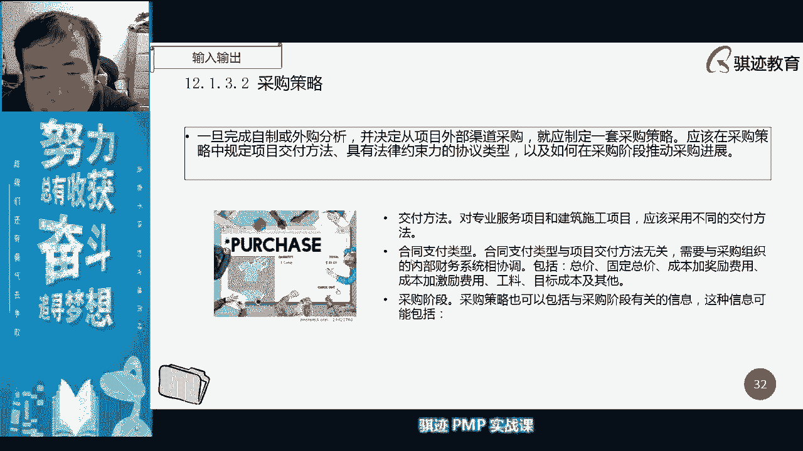

# PMP认证考试课程最新完整免费课程零基础一次通过项目管理PMP考试 - P38：PMBOK第六版 第十三章项目相关方管理-39 - 骐迹PMP - BV1Sb4y1f7Yt

其实其实就是这样顺序的小问题没啥大问题，好我们八点钟到了，我们最后一堂课开始了啊，最后一刻记得吧，我们是不是你们小时候学过，现在课外还有吧，就是讲那个当年普法战争后，法国割让那个嗯阿尔萨斯和洛林。

然后啊，法国地区的小朋友们要上最后一次法文课，以后要学德文了，对吧啊，最后一课那个黑色啊，好我们不多扯了啊，我们今天也是最后一场正式课程啊，正式教学课程啊，还没开始啊，ok啊好。

那么我们上节课我们讲采购最后还差一个。

剩最后一个子过程控制采购，所以我们今天把控制采购讲完啊，啊控制采购，那么控制采购当中呢啊控制采购当中呢，我们主要做a sorry，嗯嗯嗯嗯啊。

我们主要做的是啊，正对于采购进行绩效考核和跟踪，必要时进行合同的绩效的评估和关闭合同，这个过程啊，这控制采购其实是所有监控过程组当中啊，工作内容比较多的，工作内容比较多的啊。

这是控制抬高，那么控制采购当中呢，我们会注重什么东西呢，是否有偏差，这个偏差你就是作为甲方来看啊，所以在控制采购当中呢，如果比如说我们要进行绩效审查，也会用e bm，但是我们会再叫他一eva，为什么。

这是你的供应商，就是你的乙方，把那个e v m那个那套东西寄到我，当你们教你们的吧，啊去年我们教你们的时候，把那套东西做完了那套东西，然后呢做完之后呢交给你，你只要看得懂就行啊。

就是进行啊判断是否需要纠偏，然后呢跟供应商保持合作关系啊，进行协调，同时阐明立场啊，我们在这个过程中呢，我们要注重推进合同的付款，要根据我们大家记得吧，我们讲在我们的呃嗯成本管理当中。

我们讲了成本管理当中，我们讲要要设置我们的里程碑，我们的进度管理当中要设置里程碑，成本管理当中要设置付款的那个，我们的每个阶段的资金需求，有个付款点，那么我们就如现在作为甲方。

那么我们就要控制我们每一笔钱，是不是应该按照合同的约定，在约定触发的条件下付出去，哪加那个，我们合同我们那当中，比如说你们如果做装修，比如说采购当中很典型的，我们生活当中很典型的，比如装修。

装修当中怎么执行的呢，就是一般来说是什么啊，隐蔽工程，什么布线啊，铺广啊这些东西，开槽啊，这些东西啊，做完之后呢付一次钱对吧，一般是约定俗成的，然后呢我们在做完我们的墙面，做完我们的啊。

做完我们的啊地板这个之后呢再付一次钱，然后呢全面全部做完了，最后再付一次钱，然后呢隔隔我们约定的，比如说三个月之后付最后一个尾款，质量保证金，差不多是这样，所以你看实际交付不是在本过程进行的，而是在9。

35。65，6。38。3啊，这是什么意思呢，实际这个过程当中呢，是你作为甲方，在不同的其他的知识领域进行交付的啊，是这样的意思好，那么在履行合同的当中呢啊，在履行采购的过程当中呢。

双方要依据我们我们之前讲的协议，进行什么进行履行啊，所以我们的依据协议，所以我们监督采购绩效，主要是看了吧，看监督我们的什么合同的绩效完成情况。

所以合同当中会有约定，我们应该达到怎么样绩效啊，应该达到什么样的要求标准。

我们采购当中呢我们会收集控制，采购当中，我们会数据收集采购的数据和管理的记录啊，管理项目的记录，然后呢建立可以进行测量的采购绩效指数，制定完善的采购计划，进度计划，注意采购当中会有一个什么因素呢。

因为你是卖方交给你即可交付，所以这个进度呢并不直接由你来控制，所以作为一名项目经理，如果采购对你的项目非常重要，或者会对项目产生重大影响，那么你必须在采购当中呢，经常的去更新采购信息，你可以向你的乙方。

经常去要当前的采购的执行进度如何啊，相关方的你的呃供应商，你的卖家，这个相关方他的啊实际的工作进度如何，经常去收集信息，信息更新的比较频繁呢，对于你控制整个进度呢，修好处，尤其是在采购是对于项目会有。

非常重要的作用的那些项目当中啊，有些项目的采购会占非常大比例啊，很大部分工作是由呃卖方来呃，这个时候呢采购就管理就显得非常的重要，因为甲方自己可能不做什么事情，所有的事情都是让乙方来做，也有可能的啊。

那么采购控制实施的质量，然后同时呢道德和法律约束呢还是需要的，所以采购呢是一个什么东西啊，所以大家都知道对吧，所以很多时候呢有些人如果有决定采，有采购的决定权呢，就可以有花头对吧。

有花头画图这个东西呢大家都懂了啊，就当不在我们那缝讨论范围内，但是要注意啊，按照pp的原理来说，采购当中道德规范和法律要求是强制性的，是排在第一位的啊，采购当中呢我们还会做的事情是什么呢，向卖方付款。

像漫画付款呢，应该用工作进度下联系起来，我们讲全面讲的，在进度当中，我们不是要设置里程碑吗，好我们可以将向卖方付款，那个点锁应该完成的工作设置为一个里程碑，好吧，你将完成了工作的进度情况。

和付款相联系起来啊，这是我们常见的一个采购当中的财务管理啊，然后然后在项目收尾前，双方达成共识呢，可能进行变更啊，有可有可能在这个采购的执行过程中，某些部分发生了变化，只要双方一致同意。

我们可以根据修改条款合同更新啊，更新合同修改和变更控制条款来进行更改，是可以的，然后采光呢，我们要考虑到什么批准的命根请求啊，合同变更控制流程啊，注意合同变更的控制流程当中呢。

并不是在你的项目范围内的啊，为什么是因为很多的组织并不，总之啊，应该大部分情况下都不是另外大量的组织，他们对于合同的管理，是由采购法务来进行控制的，而不是由什么项目部来控制，或者是由职能部门来控制。

而不是由项目部来控制，局局举证啊，均匀使么样矩阵类型，所以在这种情况下，合同变更的控制系统，它是有遵循组织的合同管理流程来的啊，是遵循组织的合同管理流程来的，而不是。

而不是遵循什么项目的合同管理流程来的啊，所以一般来说，项目当中的合同变更的控制流程呢一般是什么，与组织的变更控制能量相紧密结合起来啊，一般是遵循组织或者直接照抄组织。

然后呢也与我们的整体变更控制栏相结合起来，是这样，这要注意啊，当采购发生争议的时候呢，按照pp的说法叫做索赔管理，索赔管理，所谓管理当中呢，我们会采取仲裁机构，中国就叫做什么叫做这个叫做调解。

法院调解啊，叫法院调解反应调节，或者叫做公证处公证啊，公证处调节啊，都是可以的，后来老外那里面呢就做争议替代解决程序啊，a d r都是可以的啊，这叫老外的说法，那么美国家不一样啊，所以当我们发声啊。

分歧不能达成一致，然后呢需要进行赔偿的时候呢，我们不一定要走诉讼，我们可以走争议解决流程，这个流程会更有效，谈判呢是所有正义和赔索赔的首要首选方法，所以当我们发生合同发生争议的时候。

不要一上来就想着什么打官司还是蛮可以，利用争议啊解决机制啊，利用比较法院的诉讼调反应的调节机制啊，利用我们的个中啊，中国在中国的话，有的公证的公证公证处的那个调解啊对吧，对诸如此类。

通过各种各样的调解机制，然后达成一致而避免诉讼，因为诉讼是一个耗费时间耗费精力，而且呢还是比较那个有各种各样，负面影响的事情啊，所以当双方都不能要明显有过错，或者但是有分歧的时候呢。

我们更倾向于用啊索赔和争议解决啊，来进行来进行处理，好那么在数据分析当中，我们讲要对采购的合同呢和采购的各种状态呢，进行工作，就要审查这个工作就要审查，其他其实就是ebm，那么当我们作为乙方的时候呢。

我们是做e v m做成各种各样的图表表格，做东西做出来扔给甲方，那么当你是甲方面，你就不用做了，你只要看得懂这些东西就行，明白了吧，但是要注意一点，就像我们前面我跟你们讲一下乙方他所写的。

比如说成本成本绩效，他的那个bc那些都是举报给你的项目预算的，知道吧，而不是基于他知自己真实的成本啊，你只要知道这一点就行了，也就是说你如果这个采购是100万的话，它是基于这个100万这个所对应的价值。

去计算的，而不是说他实际花费70万完成你这个采购，他中间赚30万，他不是针对于那个70万来进行计算的，那么趋势分析呢，可以用于编制成我们的完工估算啊，e a c啊，这些大家都学过。

以确定绩效的改善还是恶化啊，那么讲到这里呢，讲的内容，我们讲现在是成本落后啊，成本超支，进度落后，而且趋势仍然在恶化，请在公屏里告诉我，你请用vn的表示方法告诉我，成本超支，进度落后并且趋势恶化。

来请在公屏，你告诉我，正直副属，哎呀来来来来啊，林满洲同学，我知道你这个回答态度是很积极，但是你要用ev，我们讲要e v m的专业表述对吧，你写report，你写正值复数，谁懂你什么意思啊。

专业表述来还有没有，那那那啊吴奇同学，那那你这种你这种表述方式，拿拿去那个拿去拿去二班，然后然后跟人家进剧透，被人家牙齿都笑掉了，真的牙齿一笑的，你上来就卸了，你看cpi会不会小于零啊。

我问你cpi会不会小于零啊，s p i会不会小于零啊，会不会不会的啊，它只会在零和零和无穷大的区间里，但是它小于一的话，表示什么成本超支，它小于cpi小于一点的代表成本超支。

s spi小于一等于等于什么进度落后，对不对啊啊那么呃江祖军同学是说的对的啊，a c大于e v表示成本超支的cp i是小于一的，同理我们是什么e v是小于pv的，那么是进度落后对吧。

那么趋势恶化呢啊对啊，sp i小于也对了啊，可以的，尴尬不尴尬不哈哈哈哈哈哈哈啊，尴尬不，然后趋势恶化呢，那么你就你就你就应该这么表述啊，趋势的话没有直接的指标可以表述，就是你可以这么表述。

你可以表示说预计是下一期报告期的，我们的cpi和spi将小于本期的s p i和cpi，那么说明什么，趋势还在不断恶化，效率还在不断下降，对吧啊，ok，啊有同学写cpi大于s b a大于反了啊，反了啊。

cpi小于s p i小于，我就是举个例子明白了吧，所以你在看这个东西的时候，你要明白这是什么意思，对不对啊，这意思啊，所以你看这事是能连通起来的啊，采购知识和前面我们讲的成本的控制，成本当中呢。

我们的e bm是可以联系起来的啊，好我们继续讲啊，那么怎么样能确保供应商不忽悠你呢，很重要的一个工具就是检查，检查我们之前也讲过了，也讲过了啊，我们在质量管理当中也讲过的啊。

我们对于供应商的现场检查巡查，大家记得吧，work so巡查就是一个什么检查啊，是对于我们的工作质量本身的一个，结构化审查啊，所以我们可以指什么呢，对于我们的工作结构进行结构化审查，可以进行简单的审查。

实地审查以及联合巡查，以确保有共同的认识啊，所以现场检查是一种最严格的啊，最啊最具代表性，最不能抵赖的一种检查方式，那么检查当中呢我们还审，还有一个还有一个方法呢叫审计。

审计呢是针对我们采购过程进行结构化审查啊，采购审查是我们很多企业当中，财务当中必然要做的一件事情啊，政治管理系到政治系统挺挺绕的对吧啊，对是挺好，所以你学过之后，陈铭如果你学过这个车之后，你就知道啊。

我们车市管理怎么做的呢，啊叫两仪生四象，四象生八卦，八卦生万物对吧，然后最关键的是eva的四种写法，茴香豆的四种写法对吧，那么审计是一种结构化的审查啊，我们之前讲过这个工具讲过。

那么审计也可以用于在采购当中，对我们的采购进行审查，然后进行必要的调整，看看过程是否合理，很多时候采购审计也是用于我们，有时候有些同学玩花头对吧，所以对于重大项目的采购审计呢，我们采购呢我们会做审计啊。

看什么你买买那什么几十块钱的什么小采购，然后说谁谁去审计你对吧，好，那么采购当中控制采购的最后一件事情，是其他控制过程中没有的啊，就是说是关闭采购，那么当可交付成果已经全部移交的时候呢。

我们就已经关闭成采购啊，注意这里大家要注意一点啊，要强调一点，首先关闭采购，是我们结束项目和项目阶段的前提啊，这个当当当然我们书上没有直接说啊，但是项目要结束，项目或者项目的阶段要结束。

那么它有一个前提就是采购已经关闭了，所有应该买回来的东西买回来了，假发票已经收到了，钱已经发出去了，发票已经收到了才行啊，所以结束采购是结束项目的一个前提，如果采购还没有结束，项目是不能结束的。

或者本阶段应该结束了，采应该关闭的采购没有关闭，那么本阶段是不能结束的，这一点要注意啊，这一点需要注意的，那么关闭采购或者叫结束采购，应该做什么事情呢，第一所有可交付成果已经按照技术性的要求。

按照质量要求呢已经移交了，已经移交了，第二点呢没有出现争议纠纷索赔，然后呢钱已经付清了，当然有些甲方比较强势，也有啊，也有好，那么这些事情做完之后呢，我们才开始能够说我们结束了采购。

那么结束了采购之后呢，我们才能开始进行项目的结束项目，知道吧啊，所以这是邪术项目的一个前提啊，那么采购结束之后呢，我们会进行什么组织过程，资产更新更新什么东西啊，就是支付应该照合同经历啊。

我们应该更新我们按照合同到底付了多少次钱，有钱怎么付啊，因为它涉及到钱的事情是有严肃性的啊，我们一定要更新我们的付款记录啊，然后呢我们要更新卖方绩效评估啊，对于这个当初卖给我们东西呢。

我们给他评价好还是不好，做的好的呢，我们以后继续跟他合作，甚至是把它纳入到组织的合格供应商名单里，如果做的不好的呢，我们以后就不跟他合作，例如黑名单里啊，那么卖方的绩效评估呢是很重要的。

一以帮助我们今后识别，今后是否与该供应商继续合作，以什么样的形式进行合作啊，那么如果我们要去和他继续进行合作，有可能今后我们就把它加入合格供应商名单，所以合格供应商名单在pp当中也叫做预审的。

合格卖房清单，这叫合格以上，或者说他原来是合格供应商，但这次做的不好，有可能就会被从合格供应商名单当中剔除掉，然后呢总结采购的经验教训，总结采购经验教训，然后呢完善采购文档好。

那么这个控制采购做完了之后呢，整个采购的工作呢就做完了整个采购的工作啊，好，那么整个采购的工作，就相当于从甲方的一面去描述了一个项目当中，买卖双方的买方会做什么样的事情，它比卖方做的事情呢其实要简单。

但是它是买方和卖方的一个接口，那么你可以从采购这个角度的a面和b面，甲方和乙方两个角度去看项目当中的交易，就是说项目的成立是怎么样去成立的，所以甲方的项目的一部分可能是乙方的一个项，目，明白我的意思吧。

行啊，那么甲方的一一揽子采购可能是不同的，乙方的分别的自己的一个或者若干个小，就是这样的意思好，那么这是我们采购的知识点的总结啊，予以保证，而且是一定周期的完成，而且是一定周期保证对吧，知道吧。

但是呢现在呢大部分的甲方呢就属于强势地位，其实这是不对的啊，按照商业逻辑是不对的，而且其实理论上来说是违法的，为什么现在的新开发是否涉及的要涉及到乙方，帮甲方去什么抵税。

为什么啊啊抵税凭证去抵扣它的成本，知道了吧，通过什么行为来确认采购的实施者，合同谈判者，采购角色的审计的角色啊，a实时采购比规划采购，c管理采购，低控制采购是哪个，通过什么。

或者叫通过什么样的子过程来确认，采购的实施者，合同谈判者，采购审计负责人，这些角色是在哪个子过程去做的啊，第一题请回答啊，是不是我说了多了之后，这个合同大家听得出来啊，和我平时洪亮而富有磁性的嗓音。

还是有点区别的，对吧啊，第一题，a b b b b b b b b b b b啊，只有一位同学是啊，选a，其他都是选b啊，当然应该是选b啊，注意啊，采购的实施者谁去实施采购的，谁去跟对方谈判。

谁来负责经采购审计，这些当然在规划采购当中去定义的，对不对啊，当然应该是比啊，实施采购是确定什么，谁是最终的卖家是由实施采购的啊，没有管理采购，只有控制采购啊，因为管理所谓的管理是执行过程中。

采购是不存在真正意义上的执行，虽然实时采购的执行功能，但是它只是一个去选出卖家的过程，而不是由我们甲方去执行的，所以理论上来说我们是没有管理采购的啊，因为管理采购就相当于管理项目。

管理项目是乙方项目经理责任啊，好这是第一道，第二道，正式的采购政策和适当的审查的卖方清单，分别属于什么，请作答，所以第一题选的是，好第一题是什么啊，第二题是什么，嗯第二题是组织是什么东西呢。

还有没有选其他的都选a啊，有a有b有c有选d的吗，我就问一句啊，我就问一句，有没有人选d的，有没有人选d的，再给你们五秒钟时间，有没有选d啊，有个叫啊，有位啊，孟孟凡凯的同学啊，选了d啊。

还有刘晓晨的同学选d a a，你们这个跳反跳的，你们这个啊啊你们这个这是啊，答案就是选d呀，答案就是选题呀，采购政策当然是内部的，我们讲什么是组织过程，资产是不是一个文档啊。

嗯正式的采购政策是不是组织的一个文档啊，适当的卖方清单是不是也是组织的一个文档，这两个都应该是文档啊，应该选d啊啊，对不对啊，只有极少数同学做对了啊，一大片全倒全倒，一把一大堆同学全倒啊。

对啊你看到吧啊，孟凡凯同学学的非常好啊，我们讲过了对吧，我们在我们在项目的天时，地利人和的的前三章讲过了对吧，组织过程资产属于啊啊，组织过程资产当中属于是什么组织的一个文档。

然后呢组织政策是属于组织文档，组织文化属于事业环境内部的事业环境因素啊，但是采购政策是属于组织的一个文档，所以它是属于组织过程资产对吧，政府采购政策，同学们，请问啊，这不是政府的采购政策。

也是因为这是如果你是政府的采购政策，那是如果政府是立法了，它就不是采购政策，如果他没有立法，那么政府是属于一个啊法人的行为啊，那他一定是一也一样，是组织过程资产对吧，他是一个文档啊对吧。

谁跟你说政策已经万物了，企业政策是不是政策也是政策对吧，对吧好这个这道题目啊，你们这个啊搞下率很高啊啊，第二题先选选d对吧，不信你们去翻，不信你们去看啊啊不信你们去看，往前面翻，适当审查的卖方清单啊。

有点干扰了对吧，这些人就该干扰了，这个看都不用看卖方清单呀，那么第三道啊，第三道，啊零万热呢，你这个你这个理解呢是可以的，如果你这么说理解是可以的，但你这个明显属于偏向于杠精方向啊，我们讲大部分情况下。

我们讲的采购政策是公司采购政策啊，国家一般只会在很特殊的情况下采购，收采购政策，那也不叫政策，那叫法律法规啊，法律法规，你说的那个限制什么新冠感染的鱼的国内采购，那个那个叫圣德水产品。

那个那是国家颁布的条例，对那个是政府政策，但那个是政府的政策，不是政府自己去采购的采购政策啊，所以你这个很绕，但是啊我可以理解你，但是你这个属于偏杠精了啊，好我们第三道吧。

项目经理介绍了一个即将进入执行阶段项目，他发现无法在供应商合同的里程碑完成，之前的合同，此时适合什么合同，他们就没有办法完成项目范围定义啊，那么适合适合什么合同啊，选b，总价合同，第三道还有什么选项吗。

c啊，临时合同2221222，a啊a公量核等，那吴娜娜吴奇同学呢又打总价合同了，你看你这种过去到二班，你就去抖料，那个又被人家爆锤啊，答案肯定不是总价合同，你想想总价合同有什么特点啊，有一个封顶总价。

他建立的前提是甲方，我们我们前几课讲过吧，周一的课讲过吧，啊啊不是上周的可不容易啊，我喝上头上糊涂了，是我们讲的是甲方对于项目的范围，有比较大的确定，要做哪些事情比较确定，才能有一个封顶价对吧。

我们现在讲范围都没法定义，但是活要开始干了，那么怎么办，签一个公料合同，他们的material contract，那么怎么办呢，活先干起来，我们按照干一个小一天的活，一个人天多少钱，或者用1吨料多少钱。

我们先做起来，等到我范围确定了之后呢，前面做的部分呢我们按公调合同结，后面呢我们可以再签一个补充，签一个总价合同，有没有可能啊对吧，所以这个时候呢，我们用工料合同是不是最适合的对吧。

你在不确定范围情况下，你怎么签总价，你这不是坑人坑己吗，对吧啊，他发现无法在签到供应商合同的里程碑，完成范围内，他这个这句话其实用英文翻译过来，有点有点拗口，什么意思呢，他就说我们好像签合同了。

合同里带有里程碑，但是呢我们没办法做出很完整的项目范围定义，这个时候用工量最适合的对吧，因为你如果用成本补偿类合同，那么他很多时候呢是取决于什么项目的，成本是有不确定性，它有可能是范围有确定性啊。

呃范围是确定，但是成本不确定的，那么总价合同上是范围比较确定，然后成本也比较确定，所以我们用总价更合适，那么在范围也不是很确定啊，成本呢不知道的情况下，用工料是最适合，这道题目谁是甲方啊。

你不要管他谁是甲方呀，当晚嗯郭靖啊，郭靖的同学啊，我们看啊啊啊，首先我们啊我这样解释一下，c肯定不会选啊，你看c是临时合同啊，我们什么时候采购管理给讲过临时合同对吧，你理论上没有的东西，你不要瞎掰啊啊。

就是用来忽悠你的对吧，哎哎哎所以哎成品东西啊，你们说的这成本补偿合同，成本补偿合同就来了啊，成本补偿合同为什么在补偿，成本补偿合同是补偿的吗，对所以你这个上节课就没好听，成本补偿的合同。

不是补偿你的这个价差部分的啊，成本补偿合同是指什么啊，你为我执行所有的成本，我补偿给你的是利润，成本补偿合同的三种形式，都是讲利润怎么实现的对吧，第一种成本加固定费用就是什么成本。

是你甲方全额承担利润呢，是我们事先约定好的，只要做完一分不少的都要给我，这是在固定百分比的对吧啊，但是按照原始估算成本的百分比对吧，第二种成本加激励是什么，我们跟甲方约定好，做完之后呢，省成本了。

我们就可以多赚钱，不省成本了，我们就可以使，就只能少赚钱，对不对，这是这不是讲的是差价部分，而是讲是乙方怎么样去获利，这个补偿是卡这个这revegetable啊，是讲的是呃。

embarreembarance and embaring，好意思，sorry bush，我说的英文有点卡，卡住了啊，他讲的是如何去补偿乙方的利润，而不是甲方的差价或者是范围偏差，所造成的成本偏差。

明白了吧，那么第三种也是成本加奖励是什么啊，我们上课讲的话，记得吧，是成本全额，甲方承担利润呢，由甲方说了算，根据乙方的绩效表现对吧，这题不是吸收资源，说明你对于成本补偿类合同没有理解。

我们上节课讲的成本补偿，上上周讲的成本补偿类合同的三种合同，你都没有理解我们讲了什么，主要讲的就是乙方的利润是怎么去计算出来的，他补偿的是补偿的乙方的利润，对不对，工量合同会超出预算，甲方不好审批。

所谓的预算，是指大家对于这个项目范围有明确认识的时候，才有预算公告，合同指的是预算都出不出来，我们但是活急着要干，你先干起来，知道吧，明白啊，诶啊选d怎么不唱哈哈哈，ok啊，我们还没说到第四题。

所以第三题的这个三个四个答案，你们现在都明白了吧，啊，老实人，是不是就按照今年是不是，按到底甲方有没有考虑合同顺序，还是按照本身工作需求来啊，这不是按照甲方乙方，你完全发掘甲方乙方都是按照来。

如果你身为乙方，发觉甲方没有办法完成范围的定义，我们讲这个其实默认你是甲方的，为什么我们讲a s o w默认是应该是有经验的，甲方去定的，然后交给乙方做出什么w bs对吧，当然如果你是一个乙方的呃。

项目经理，那么很多时候你是没有办法决定，合同是那种形式，因为甲方出合同往往是甲方决定合同的形式的，明白吗啊，但是你可以跟甲方商量，那么像这种范围没办法定义的，甲乙双方使用公料合同是最为恰当的。

双方平等不吃亏啊，ok啊啊明白了就好啊，所以这个题目，其实这个例题出的也是有道理的啊，好我们讲第四道啊，好第四道，那么项目交付方法具有法律约束力的协议类型，如何采采购，如何去推动这些东西都写在哪里。

啊这个这个题目略有点绕，项目的交付方法，如何去交付的，具有法律约束力的协议类型，如何在采购商采购阶段推动采购进行，这些信息都记录在哪里，第四题，谢老师，好累不累不累不累啊，第四题。

我看到很多同学选a有一个啊，江祖君同学选b啊，还有还有人选吗，你们卡吗，不卡，选a选d，ok啊我看到选b的同学不多啊，正确答案选b啊，啊对吧，我知道你们开始回想采购管理计划当中有什么。

采购当中担任的角色对吧，担任的角色，采购策略也是采购管理计划的一部分，但是我们不会直接把我们的协议类型，交付方法能直接写在采购管理计划，而采购管理计划里面恰恰有这些东西啊，我们翻到前面去看一下啊。

我就知道，所以这个题目就讲的就细了，知道吧，略微细一点，我们在规划采购当中就细看到吧，你看财务管理计划有什么角色职责，法律管辖，记得我讲过吧，采购测量制度，进度计划对吧。

预设的卖方对吧，这些东西而采购策略有什么交付方法，合同支付类型，采购阶段对不对，所以采购策略。

但其实，但是我们一般也把采购策略，归在采购管理计划当中，但是采购管理计划主要表示什么，谁扮演什么角色，我们的采购的时间表是怎么样的，怎么去测量，然后我们的司法管辖去哪里。

预算是怎么样的，有哪些风险，有哪些合格的预审卖方啊。

所以看了一下前面题目，现在你明白选哪个了吧，所以第四大应该选什么，所以第四大应该选择b，对不对啊，所以记住采购策略是这样，你用什么样的策略去推进采购，去进行付钱，然后呢怎么样去交付对吧。

有哪些约束力的合同类型啊，财务官的地方指的什么，你的采购计划的时间表是怎么样的，谁担任什么样的角色，四方管辖权怎么样啊，这个啊我们的预算是怎么制定的，框预算大致有多少，用多少钱啊，是这样的东西啊。

要记住哦，好第五题，要求有最大的灵活性，哪种合同是这些需要的，是最适合这些需要的，来了啊，这个题目有点搞搞脑子的啊，a成本加固定酬金，成本加百分比费用固定总价合同，固定总价加奖励金合同，ok啊。

第五题选选啊，第五题就有点搞脑子啊，稍微想一想，其实这道题稍微想想就能做得出来，我们要跟开发商合作，要求是最大的灵活性啊，应该选什么，啊来了啊来了啊，不是选b就是选题对吧啊，一那么为什么你们不选c啊。

啊固定总价是一口价对吧，这个东西灵活性最差的对吧啊，ok啊这个是可以的，所以这道题最适合的方法，一眼看上去好像没办法选对吧，我们是用排除法，首先，首先一点啊，你们在这个当中学过哪几种合同类型。

你如果学过哪几种类型，一眼就可以排除到两种来，我们要放到前面去看一下啊。

我就知道你们唉对吧。

我们讲考，偏偏考试所有的东西都依据于理论对吧。

依据理论，所以我们在理论当中，我们讲这是合同类型，那么既然讲到合同类型，那么就讲到我们学过哪些类型的合同啊，固定总价激励经济调整公告呃，激励奖励固定费用啊，固定费用，那么能不能来看一看。

这里边有哪些是我们学到过，哪些是编出来的呢，啊那么有没有成本加百分比费用啊。

我们讲有，但是这个东西已经被废除了啊。

我们往前翻啊，sorry我翻的太快了，哎呀sorry，又翻太快了，反过头了啊，有没有那个那个成本加百分比啊，没有成本价，只有成本加固定费用对吧，什么叫固定费用好。

那么显然啊成本加百分比这个东西哎呀sorry。

首先成本加百分比，这个费用首先不是有没有这个合同啊，在中国是有的，但是在偏僻的理论里边，我们讲是没有这个成本加百分比就描述了，所以这个先去掉对吧，第二有没有固定总价加奖励金啊，只有总价加激励。

没有总价加奖励，所以这个也去掉对吧，c好不好啊，成本加固定酬金有吗，有的成本啊，然后成本价啊，呃呃不是成本啊，固定总价有没有啊，有的啊，那么b和d就先去掉了，你们两个选什么啊，都选了什么东西啊，都选了。

不是b就是d对吧，然后一个一个都挂了对吧好好，那么这道题无期总算长脸了啊，无期总算长脸，选对了对吧，那么固定总量显然是一个最不灵活的，最不灵，没有灵活性的，所以所以说万般无奈。

我们就选择什么成本加固定酬金啊，固定酬金就叫成本加固定费用是一样的啊，ok所以这个题目你看起来没法选，但是我们通过排除法就可以把b和d先去掉，然后呢c又不够灵活，所以就选a明白吧，好非常好。

还是有很多同学选的对的啊，所以啊做题目，有时候当你一眼看上去不知道选哪个的时候，用排除法，好那么第五题选a，第六题，投标人会议的作用是什么，a让参加参加投标人相互认识，了解采购流程，比识别潜在问题。

制定应对措施，c确保潜在卖方对采购区的一致认识，修改采购文件及充分沟通，以加快投标进程，选什么，低的成本加激励是不是可以ok啊，第五道题目，如果成本加激励，是，其实是比那个我们讲的成本加固定酬金。

更好一点，但是他没有啊，所以呃夏文静同学就问的这个问题不错啊，好你们a c d啊选项都能选c对吧，反正是c，所以你看你们满满的都是中枪了啊，首先哦哦哦哦我看一下啊，我们来看一下，首先我们来看一下啊。

有不少同学选a是吧，对，首先a是不对，我们讲投标人作用的会议不是让大家相互了解，而是让大家对于采购去取得一致认识，所以a的前半句已经错了，了解采购流程是对的，但是前半句错了，所以a不对。

投标人会议作用是，让所有的投标人得到一致的信息，哪怕大家得到的信息都是一样，都是错的，也没关系，大家都要公平对待啊，是这个目的，所以a的前半句错了，dd去掉b识别潜在问题，制定相应措施啊。

投标人会议不是一个什么东西啊，不是一个风险研讨会啊，对吧，不是一个风险规划会啊，对吧啊，所以他不是用来识别潜在问题的，所以比也不恰当，方面对吧，c保证潜在卖方对于采购获得一致认识，这个对是对吧。

是对的啊，这个表述是对的，但是后半句修改采购文件，投标人会上会修改采购文件吗，当然是不会的啦，所以c这个答案错就错在修改采购文件，如果没有这六个字的话，c是最正确的啊，保证潜在买方取得一直是最正确啊。

第一相互充分沟通以加快，这里的相互指的是招标方和潜在投标方之间，不是潜在投标方相互之间啊，所以是买方和卖方之间相互充分沟通，以加快投票过程，这个是对的啊，所以四个答案里面唯一一个没有毛病的是d。

所以选d，虽然d这个描述呢不太好，因为投标人会议并不一定是会加快投标过程，但是迪没有描述错，c的最大错误是，投标人会不会去修改采购文件的啊，啊不会去采购文件，修改采购文件啊，注意好。

那么第六题的答案应该选择d，第六题它的相互充分沟通，指的是买方和卖方相互沟通，不是各个卖方之间，所以a的选项是什么，让参加投标的人像我就是这个就错了啊，如果想让投标的和招标的人相互认识，了解采购进程。

这个是描述也是对的啊，对采购文件是甲方才有权限改的，对的，所以啊所以c这个后半句是要说是不对的啊，所以d是正确，ok吧，好第六道到第七档，成本补偿类合同当中，买方接受多数的什么东西。

因此关于如何完成工作，买方有更多的依据啊，第七道a成本并对进度会很难，因b设计并影响最终结果，c风险对项目十分钟控制，低管理人员和人员日常工作方向，好那么第七道选什么啊，a是采购人员要长哪体型的节奏。

赵锦标同学，你这个守门熟路啊，这个看着不点唱啊啊采购煤油水谁干啊对吧，像老师这种本性清廉，骨子里面有点清高的，是不会啊，拿回扣的啊，拿提成的对吧啊，所以我们不会去干采购这个事情，选择c。

the c还要选择什么了吧，三个同学都选c啊，还有选什么都选c啊，还有没有人不选c的，请问，有没有不选c选a，选b啊，ok啊好，那么这道题目我们看啊，一看啊，我们看一个看描述啊。

那么成本补偿类合同和总价类合同，区别是什么啊，成本补偿类合同当中，买方相对而言有更大的强势地位，还是卖方有更大的强势地位啊，是卖方也可能性，所以买方接受更多数的什么东西啊，成本风险这些东西啊。

接受更弱势的地位这样设定，所以啊我们先来看前面部分词缀啊，他讲买方接受多数成本，接受多数设计工作，接受风险，首先b肯定排除掉对吧，这个成本补偿合同和设计有什么关系啊，没有关系对吧，没有关系对。

所以b先摆出来啊，所以买方接受多数的项目管理工作，是人员人员和人员日常工作，这是我们努力的方向啊，这个东西也牛头不对马嘴，成本补偿合同和项目管理工作，就是谁更做的更多，有什么关系啊，没有关系吧对吧。

所以b和d先排除掉，只可能是a和c对吧，我们讲在成本补偿合同当中，确实买方接受更多的什么更多数是什么成本，接受多数是什么风险，这前半句都没有问题，我们看后半句，成本补偿为合同，买方对于进度有没有兴趣啊。

有兴趣啊，当然有兴趣啊，成本补偿类合同，买方对项目有更多的控制，是一样的啊，记住一点啊，记住一点，sorry，记住一点，无论是成本合同还是总价合同，有一点都是一样的，他们甲方就是买方。

对于卖方这项目实施控制是一样的，成本补偿合同如果没有特殊说明，项目的控制都是一样的，只不过是说什么东西呢，它的条款的约束程度不一样，但是对项目的进度是呃，是容易提前还是容易延后。

是容易超支还是容易节约呢，在客观上并没有什么大的区别啊，它取更多取决于乙方对项目，这个采购项目的管理，明白了，ok啊，所以你们很多时候，千万不要拿工作中的某些例子，来涵盖所有的例子对吧啊。

所以你们说说软件项目当中，往往随着项目进行会有很多变更，影响最终内容，但是买方并不一定说就接受多数的设计工作啊，是买方来做设计啊，当然不可能了，对前半句就错了，影响最终结果呢有可能的。

但是不是买方来做设计，对吧啊，所以这道题目第七题应该选什么，选a，所以这个呢就是说你考试当中呢，就要好好想一想啊，逻辑当中就要好好想想，好那么第八题，作为买方，你最近对某工业金审计。

确定供应商工程需要改进环境，希望用文字记来审计过，同时记录你工商之间沟通情况，你应该使用什么，a绩效报告，b信件，c合同文件及采购审计使用什么，请作答，啊我们最后这个采购居然讲了一个小时啊。

不过没关系啊，相关放一个小时也就够，半个小时也就够了啊，那肯定不行的啊，肯定不行啊，吴老师肯定不会节奏怎么办，否则他会疯掉，d c啊，a d c啊，有没有比亚有b就全了啊，有没有比有没有比，有没有b。

都是c或者d吧，啊这道题很明显对吧，作为买方，你对供应商进行审计，确定需要改进环境，希望用文字记来审计结果到底什么，当然是使用采购审计了，但是但是他写了，同时记载女与供应商之间的沟通情况。

采购审计当中有沟通情况吗，没有，所以要表达沟通情况，又要表达审计结果，那你只能用什么东西啊，啊所以aq第八题o q全错啊，全场妥了，产品同学还写妥妥的地啊，全场啊通杀豹子，通杀老子热。

豹子通杀boss从上啊，林满洲同学选的a哈哈哈也一样啊，没有一个对的，用文字记载审审计结果，我们可以是合同审计文件，这是没有问题的，但是他后面拖了一句，记载你与供应商之间的沟通情况。

那么审计文件当中是不含沟通情况的，所以a c d都不含沟通情况，所以都不能用于什么表达沟通情况，所以只有比邮件了，邮件里可以记载审计结果，也可以记载沟通情况，知道吧，好o q豹子通杀啊。

你们全弄全倒屠杀啊，啊孙强同学后面再打了，我不知道你是听着我打了，听着我说比你在选的b还是自己选的，如果你自己选的话，你是唯一一个幸存的啊啊通吃啊，你是通知庄家和你一起通吃啊，通知这这些同学的筹码。

诶他没有说要正视啊，他没有社会的正式啊，他只是说希望用文字记载审计结果，他只要记载呀，他又不用很正式的对吧，啊不要套路有点深对吧哈，给你们提提醒啊，不要以为之前的题目那么简单，就这么简单啊。

采购的题目呢难度呢会更加接近于真题难度啊，当然比真题难度还要再低一点点，真题比这个还要稍微再难一点点，可以啊，ok啊，孙丽翔同学自己选的啊，你哥你和我一人一半啊，把他们的筹码我们一人一半二一添作五啊。

因为看到了沟通对吧，啊第九题啊第九题，我还是个采购的，哈哈哈哈哈啊，项目经理对潜在的攻方的投标文件进行分析，发现对方的商务报价有时候印刷错误，致使报价比实际成本低了20%，项目经理应该怎么做。

a按照书面报价签订合同，b要求对方澄清报价，c试做，对方让你按实际成本签订合同，应该选哪个，第九题应该选哪个，啊看很多同学选了b对吧，有同学选d啊，现在选b啊，你们真的是从内心当中选b的吗。

我知道如果是你们自己，这个这个声音是你们自己做的，你们肯定是选a，对不对，有限提的啊，那么当对方出现报价错误的时候，我们最正确的方法应该是要求对方澄清报价啊，所以第九题选b是没有问题啊。

是无论是理论上实际上都应该选c，因为什么有时候如果对方报价报错了，你要对方按照错的报价去做，那么会导致对方亏钱，那么别人亏钱了还会给你好好做吗对吧，所以我们讲要大家公平合理，要让对方挣到钱。

但是呢你要让对方好好干活啊，大家价格要合理，要稳稳啊双赢，所以第九题应该选择b啊，这个没有问题，因为要供保的，只有花花哈哈选d对吧，按实际成本不一定是实际成本啊，也有可能是什么，他发现报价比非常低。

然后跟要求对方澄清报价，对方说就按这个报价来，我们是故意用低价打的打的这个单对吧，也有可能的啊，也有可能，好那么最后一道题啊，我们讲最后一道题，一道题，客户以项目成果不符合及公司采购计划为由。

拒绝接收你，审查双方签订的合同，发掘项目成果完全符合合同规定，接下来该怎么做，a客户满意就应该改进啊，积极改进，符合合同要求，要客户签收，c采取上报行为敌与客户沟通，我们应该干什么。

客户与项目成果不符合，公司其采购计划为由拒绝验收，你审查发现完全符合要求，你说什么啊，啊有选b的优选d的啊，那么客户不满意就要客户积极改进，这个是舔狗对吧，舔狗舔狗舔到最后一无所有对吧，这是不对的啊。

也是不对的啊，才去上报呢也太消极，那么b和d是两个是女的啊，服务要求要求客户验收或者与客户沟通，那可以，但是相比之下b的话口气更加生硬一点对吧，那么我们先要找到原因，然后再采取措施，所以d会更好一点啊。

所以第十道应该选d会更好一点，好好必须到全，ok都明白了没有好都明白的话，那么要么我们先休息一下吧，现在是九点，我们到9。10分开始上啊，然后因为沟通管理啊，那么相关方管理其实内容很少的啊。

其实内容挺少的，我们休息十分钟。

