# PMP认证考试课程最新完整免费课程零基础一次通过项目管理PMP考试 - P39：PMBOK第六版 第十三章项目相关方管理-40 - 骐迹PMP - BV1Sb4y1f7Yt

ok啊我们继续上课啊，我们开始讲第13章最后一章了啊，我们9。10分了啊，现在开始上课，刚才说不上课的东西啊，现在要上课了啊，第十章相关方，我们讲相关方和我们的相关方，和我们的一个沟通呃，界限是什么的。

界限是我们之前在沟通讲的叫五个w，有没有做好什么，何时何地和谁沟通什么东西频率如何啊，然后做好这五个w啊啊不算核实啊，和谁沟通什么沟通频率，如何沟通这五个w，所以说啊我刚才有点说错了啊。

这五个w只要做到了，那么就是说认为我们就认为沟通是做到了，如果沟通做到了，相关方仍然不满意，那么我们要从什么我们的啊，相关方管理去考虑啊，那么现在我们就讲相关方，那么相关方很多时候讲的是一个什么啊。

一个期望，一个相关方的期望啊，那么相关方过程当中呢，我们要去识别相关方，然后呢对相关方的满意度进行调查，以尽可能满足所有的相关方啊，那么相关方是这样的，就是众口难调，众口难调，我们在管理相关方当中。

很重要注意的一点是什么，相关方的期望往往是那样，因为在一个项目，尤其是附加项目的，各个相关方的期望可能是相悖的，或者说是相互矛盾的，不可能同时满足的，所以管理他们的期望是很重要的事情。

啊这个申报是高级工程师吗，中级高级都是去可以去申报的呀，只不过高级的申报不是马上你就有这个呃，有这个资格可以评下来的啊，刚才说的ok啊，插一句好，那么这是相关方啊的一些呃，我们讲的要注意的这些点啊。

在工作要注意的点，那么相关方呢会随着项目的生命阶段的转换呢，而变化，因为你的不同的项目阶段可能将接触不同的人，使用不同的资源，你们的相关方就是不一样的，对吧啊，所以相关方的名单呢要近期的进行更新和变化。

组织架构呢也可能会变化，导致相关方的变化好，那么相关方管理的发言区，这个信息时间呢是扩大识别范围，全员参与，定期审核，就是winwin啊，然后正正负面的价值啊，有正面相关方。

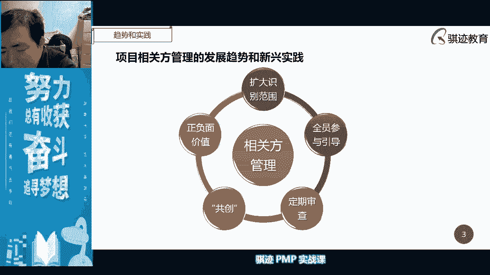

也有负面的相关方啊，那么相关方当中呢，我们会考虑相关方面的复杂性。

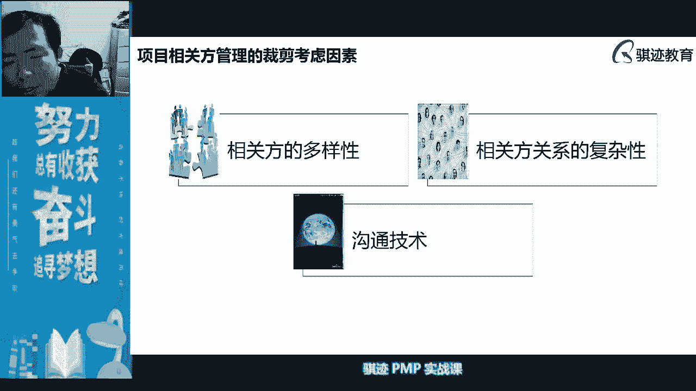

多样性，还考虑到沟通技术啊，所以p p当中呢，其实我一直有一个这样的观点，就是我觉得p p当中呢，我们的相关方管理其实有一点略有一点，为了怎么说呢，为了那个描写描写啊，其实相关放在很多的理论当中。

是和沟通管理放在一起，没有单独的相关方管理，它就是沟通管理，因为相关方和沟通是紧密结合在一起的啊，服务在一起，啊who when where，没有why啊，没有，我没有y和y啊，五个w是什么，和外。

啊当然你可以这么认为啊，这里面的同学你可以这么认为，都可以没有问题啊，可以啊，这个不是这个细节，我们到后面再讨论啊，那么在一个项目当中，我们会有各种各样的相关方，比如说智力团队的相关方。

still commit committees啊，董事会啊，然后sponsor我们的我们的发钱对吧，po program manager，property value manager啊。

这是我们的顶头上司对吧，然后项目团队，project manager team啊，项目管理团队啊，specialist，我们的专家，我们的技术的团队的主管啊。

然后呢有我们的客户向我们的客户work level star啊，decision maker啊，working level them就是什么，就是更多的相当于什么啊。

是工作级别客户就更多相当于使用用户啊，我们的项目产品的用户，decision maker呢就是高层次的客户，这些客户呢就是说能够做决定的就decision maker啊。

然后呢其他的团队还有什么regular agency啊，我们常规的一些机构啊，常规的机构society at large，大型社会组织团队啊，啊family啊，家庭啊，这些东西都是一些其他团队。

这些都构成了我们项目中的各个相关方啊，好，那么对于治理团队啊，我们在pp当中讲，治理团队呢我们要进行对对，他们来要争取支持，然后呢团项目团队呢我们要展现领导力啊，要要项目经理要展现领导力。

这个项目客户呢我们要保持友好的态度，友好的关系，其他团队呢我们保持和谐啊。

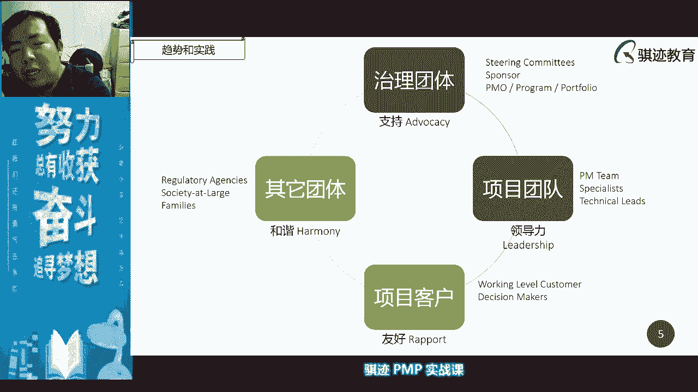

harmony啊，那么项目的信息区域当中，我们讲相关方当中呢会有权力高，权力低，支持度高，指数低啊，权利由高压指数最高的就是我们同盟军啊，那么在这个当中呢，我们讲项目至少在初期一定会有一个同盟军。

那么同盟军是谁啊。

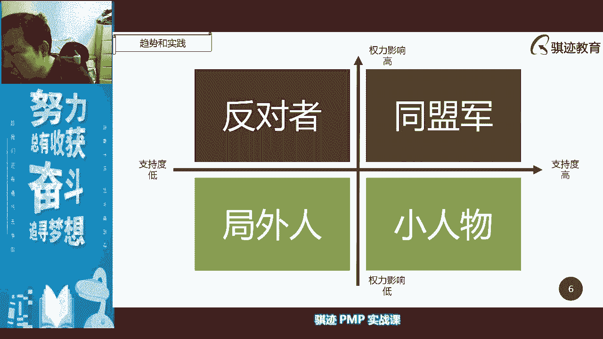

发起人啊，注意发钱是我们，至少在项目初期是你的同盟军啊。

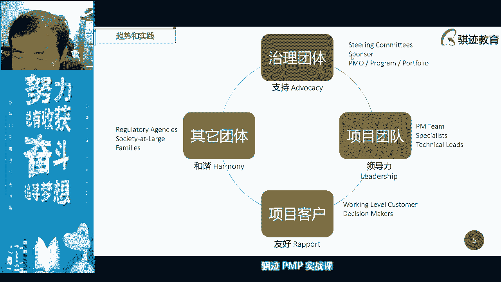

同盟军他权力高，能够给你提供资金和资源啊，力啊支持度高，因为知度要什么项目是他发起的，肯定支持了，不发起支持什么项目对吧，那么如果权力高啊，而制适度低呢，他可能是你的一个阻力反对者，那么权力低。

然后呢知识知识度呢高呢是什么，他是个小人物啊，认同你的小人物，最后一个权力又低，技术低呢，他是个局外人啊，无关紧要的小角色啊，好那么这是相关方的啊，我们讲了各个啊角色当中的一些定义啊。

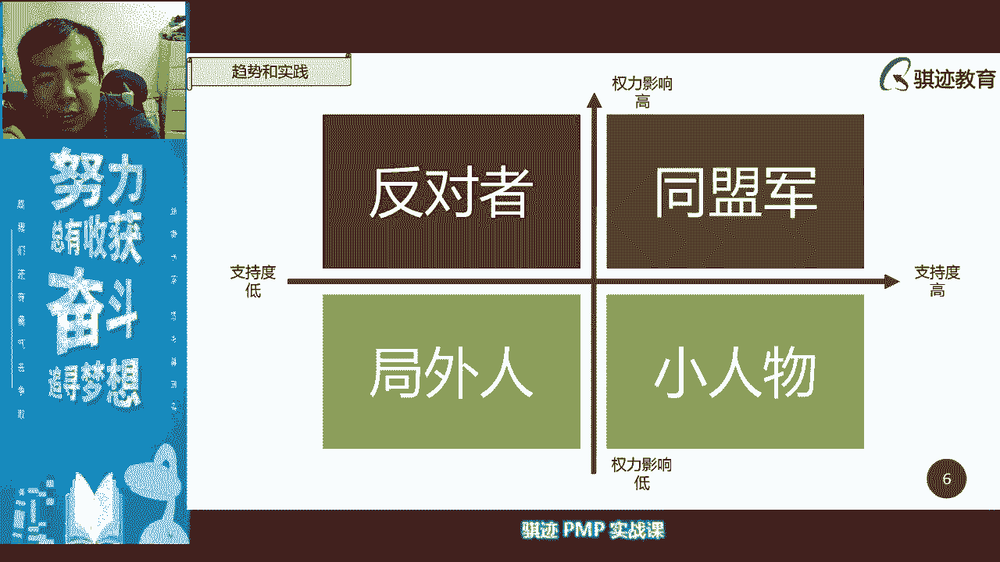

定义，那么我们我们最最主要知道像发起人呢，他是权力高智度高对吧，客户呢他知道项目资金呢也是发啊，也是权力高，支持度高的啊，其他人就未必了，其他人就未，那么相关放大主要有四个子子过程识别，规划管理和监督。

但是这个词构图很简单啊，但是有一点要注意，相关方管理当中是唯一一个唯一一个，识别再规划了，其他的你记不记得都是先规划再识别的，记不记得对不对，我们其他的都是先规划再识别，是不是只有相关方式先识别再规划。

那么为什么是倒过来的呢，是因为识别相关方，一它是在启动的时候就开始做了一个项目，初期如果你人都不认识，你怎么做项目对吧，第二规划相关方的参与，是要根据人参与的人是怎么样的，才能去制定参与计划。

那么这个管理计划是什么，是啊，没办法去实施啊，你需要做什么呢，先要去识别相关方，然后才是什么规划相关方的参与啊，这点是要注意的，所以识别相关方式虽然是识别，但是它其实属于启动过程组啊，然后规划。

然后执行。

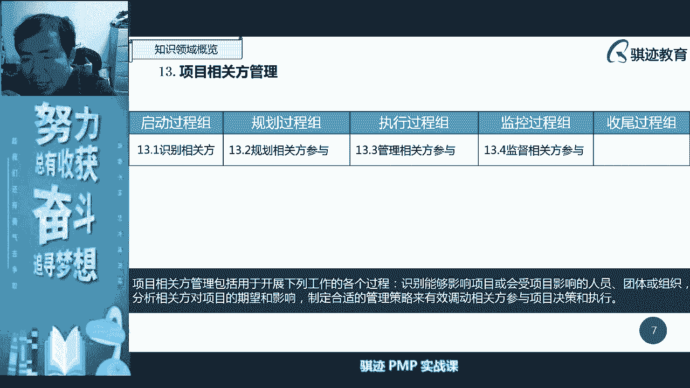

然后结果啊是这样一个过程好，这是相关方的一个我们知识领域的一个关系，总结啊，大家可以看一下，那么第一识别相关方，识别相关方当中呢，我们会识别各个相关方诉求，分析他们的利益啊等等等等等。

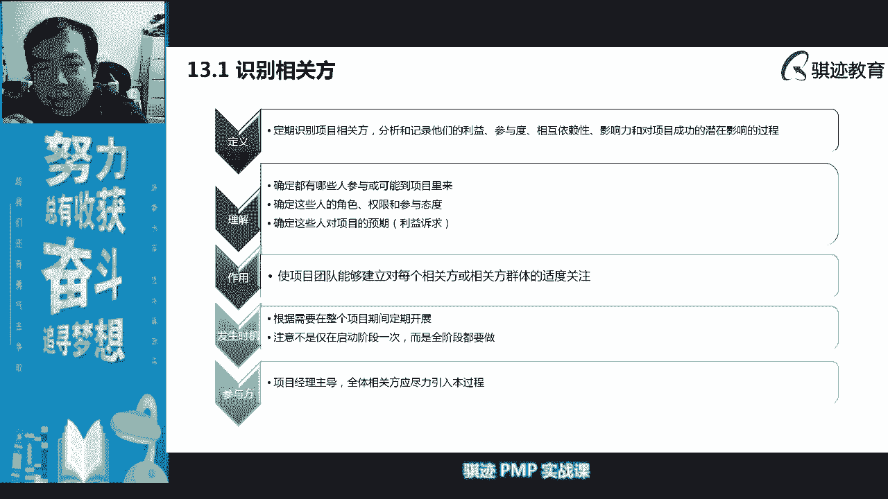

但是注意啊，注意在相识别相关方当中呢，我们的相关方的定义和我们的在人力资源当中，对于我们内部团队的资源的人的属性，定义是不一样的，你们记得吧，记得我卖过那个关子吧，哎来往谁在公屏上进，现在就告诉我一下。

在资源管理，人力资源管，资源管理呢，第五版叫资源力资源管，第六版叫资源管理当中对人的定义有四个属性，是什么属性。

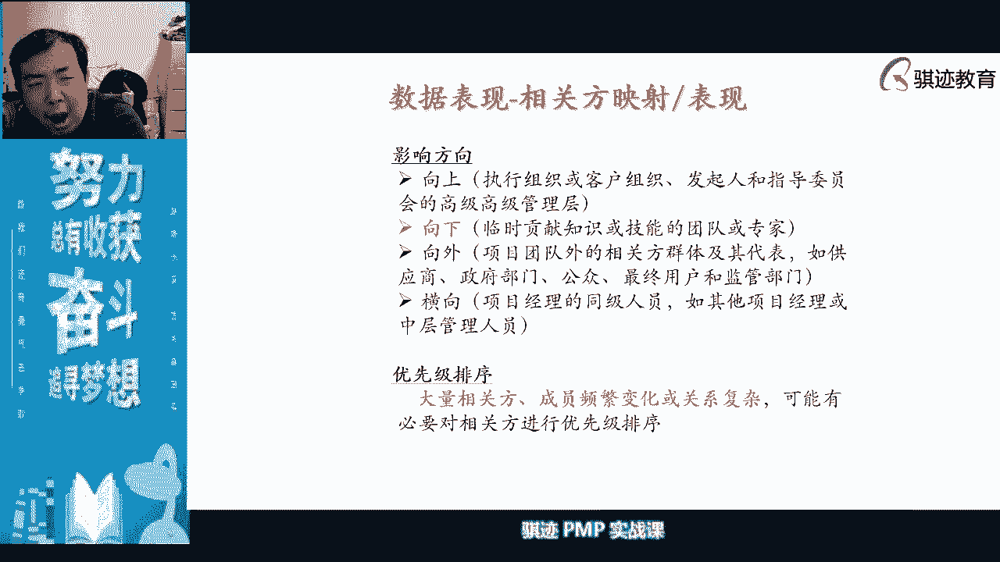

哪四个属性，请告诉我，在资源管理当中对人有四个属性的定义，记得吧，来谁能告诉我一下，啊如果回答出来的同学，虽然是很小的知识点，也是能记住的，但是记没记得我在资源管理当中说过了，曾经说过的，自由观念中。

对人的描述和对相关方对人的描述是不一样的，有没有记住这句话，不确定性，人的不确定性不是这个呀，我们在资源管理当中没有说过人的不确定性吧，啊只是讲项目的风险当中，会讲项目的最大风险总是来自于人。

咱人的不确定性对不对，但是我们不是在资源当中说的，对吧啊，张慧芳同学啊，你这回答不正确啊，有没有人知道有没有回答过，那么这样的话，第一个回答出来的同学啊，我请他喝可乐怎么样，是不是又掉出去了。

我看到很多东西好像好像掉出去了啊。

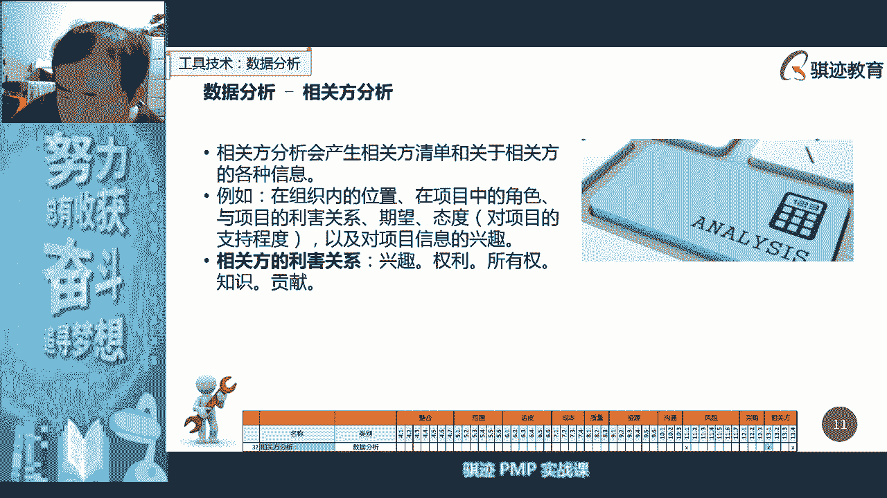

我问一下，有没有啊，有没有人告诉我啊，ok啊我发现很多同学可能掉出去了是吧，啊我们稍等一下，稍等一下，啊我刚刚技术，我们学校的技术说了一下啊，说这个事情好，大家回来了没有，角色权力职权能力啊。

你们是自己回答了吗，ok啊，角色职责职权能力啊，对的啊，孟庆鑫同学和杨威同学角色职责职位权利案啊，杨伟同学说的不对啊，孟群新同学说的是对的啊，ok说的是对的，ok great啊，那好那我们下课啊。

我请孟庆鑫同学喝啊，给他给他给他发发啊，一杯可乐，一瓶可乐的钱，ok啊，好恭喜恭喜啊，这么说对，我们在资源管理当中，我们把人看作只有这样四个属性，第一它的在项目中的角色是什么对吧。

这个其实和我们的相关方式一样，但是后面几个是不一样的，他的权力是怎么样，他的能力是怎么样的，他的责任是怎么样，是对吧，那么在相关方分析当中，我们不能用怎么，因为刚才那个描描述角度仅仅适用于什么。

仅仅适用于我们的内部，相关方，要用我们的资源，但是在外部相关当中，那我们就不能这么描述，所以我们会用什么适合贡献，啊是这样的好，那么相关方呢又会产生各种各样的影响，相关方在对项目中的影响呢。

当然不用向内向内就是自己对吧，那么说穿了就是全方位对吧，向外呢影响外部相关方横向的影响，同级别的其他的其他的相关方啊，这是影响方向啊，啊当然我要我要补充一句啊，因为pmbok第六版我们用的词叫相关方。

如果你们以后外面看到有个词叫干系人，那么它就是相关方啊，这是翻译问题，pmbok第五版和以前我们叫做干系人啊，干系第六版叫做相关方，那么它的英文翻译都是在stack holder啊。

stack holder s t a k e h o l d啊，stack hold啊，利益相关者其实英文的直接翻译叫利益相关者，叫上官猫啊，那么优先级排序，那么如果一个项目当中有大量的相关方。

并且相关方关系错综复杂的，就要优先排序，那么也一样，优先排序是为了什么。

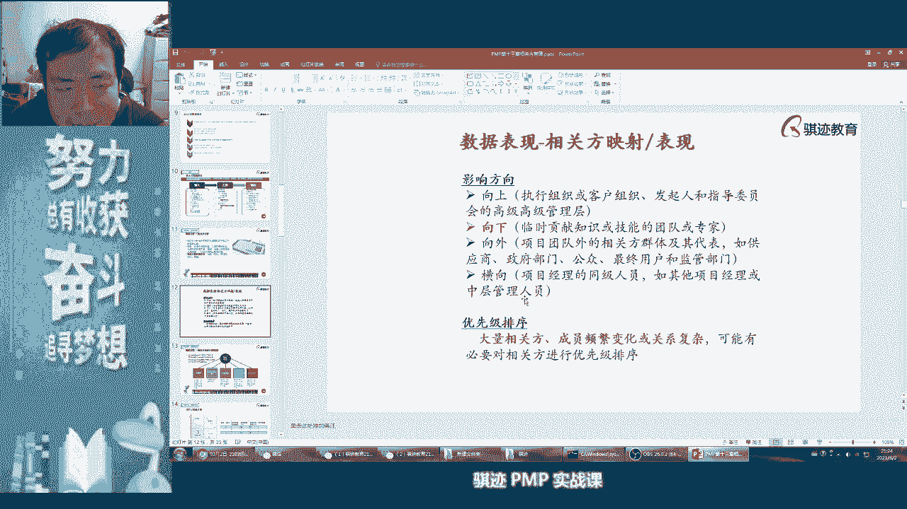

如果就是为了一点，就是为了什么，能够有效的管理最关键的，对项目影响最大的相关法啊，它的排序顺序就是按照应对项目的影响，从大到小来的，对吧啊，那种呃影响小的，然后呢对项目作用不大的，对项目的影响不大的。

这种人呢就容易被货，就有可能说我们只花很少的精力呢，去管理就可以了啊。

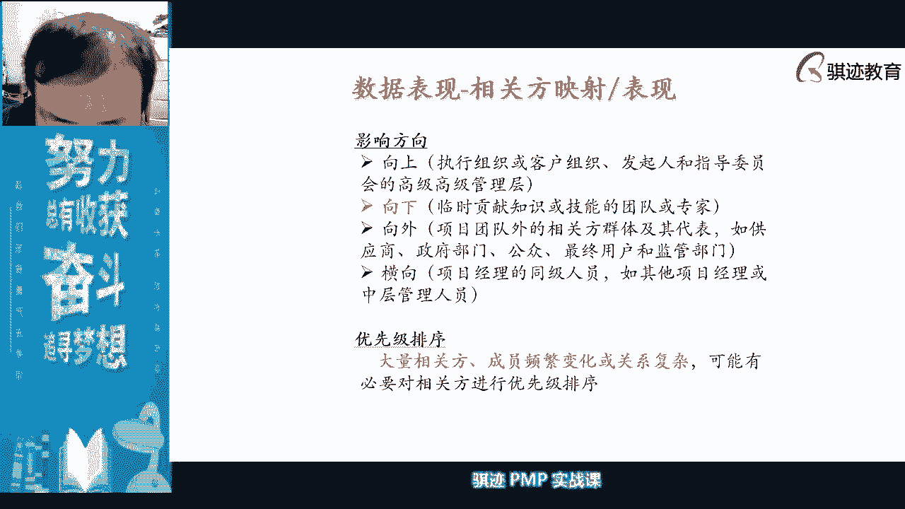

那么相关方分析当中呢，我们会用方格，我们叫做矩阵啊，方格啊，然后用立方体凸显模型，影响方向和优先级顺序呢去进行数据表现，ok啊数据表现，其中呢相关方立方体和凸显模型是第六版，新增加出来。

方格呢是第五版所所使用的啊。

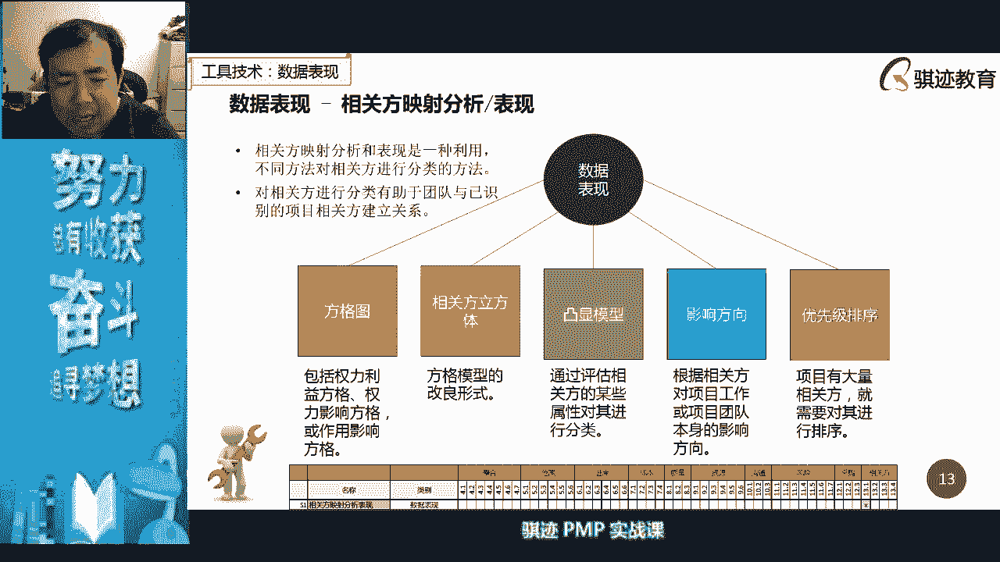

我们一个一个来看，那么相关方当中呢我们有很经典的啊，仅很经典的一个方格叫权力利益矩阵啊，这是书上讲的叫权力利益矩阵啊，权力利益矩阵呢，就是讲从权利和利益的两个角度去看，这个相关方是怎么样的。

如果他权利又高，利又高，那么他对你的项目呢是有最大的影响力，那么他应该被重点管理对吧，如果他权力很高，但是呢对你的利益相向美利益相关线很低，那么你要让他开心满意就可以了啊，中等，那么同样的。

如果他跟对应的项目权利不打，但利益相关呢，那么你也要什么随时告知他啊，这叫随时告知，如果他跟你项目全，对项目来说，权利有低，利益又低呢，那就监督花最小的精力就可以，那么它的影响程度是最低啊。

好那么是这样，那么重点管理是什么啊，就是说花最多的精力去管监督呢，就是做最小的精力管另起，马云是干什么，只要满足他的对项目不多的诉求，因为他的利益相关度低，所以他对项目的诉求也低。

你只要满足他对项目的诉求，让他开心就可以了啊，让他开心啊，那么随时告知是什么呢，啊就比如说你手机欠费了，是不是会收到短信啊，您的手机欠费，为什么我们每个人都是三大电，中国三大电信运营商的权利，第。

但是我们对于这个电信服务使用，都是利益相关度很高的，我们每个人都是权力低而利益高的，三大电信的相关方相关方，所以三大电信对我们的处理方法就是，随时告知您的手机欠欠费，请谁请及时充值对吧，您的流量已用完。

随时告知，明白了吧，好那么记住权利，利益还有两个维度也可以使用了啊。

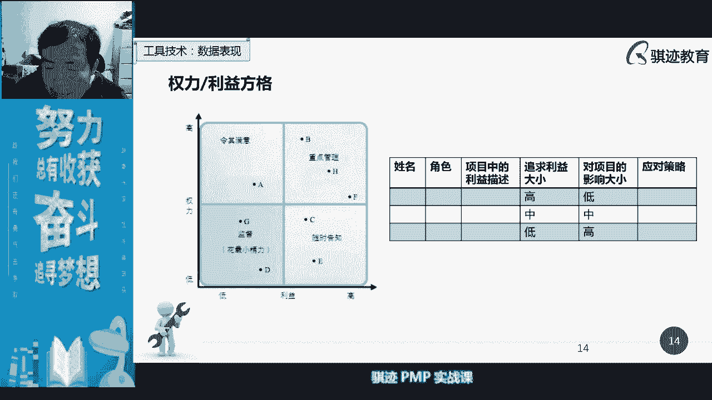

我们的p站没有写，叫做啊，你听我说啊，叫做影响作用，权利利啊，权利利益影响作用啊，权力影响方格作用影响方格。

它其实是四个方格，2222相搭配，叫做权利利益影响作用，四个维度，选两个维度化成一个方格，去表现相关方处在哪个位置，然后我们用这样的方式来表现，是重点管理呢，还是什么令其满意呢，还是随时告知呢。

还是监督注意啊，所以权利利益方格，只是我们这个四选二的方格组合当中的一种，一共有四种对吧，四个就是四种搭配啊，不会把它倒过来了啊，啊那么记住在pmbok的第五版和第五版之前。

权利利益方格用于描写复杂关系的组织当中，的相关方的一个表现啊，但是呢在拼搏和第六版当中，他已经降格为关系比较简单的项目，比较简单的相关方，不复杂的那些简单项目的关系，表现的一种工具啊。

数据表现的一种工具，明白了吧啊今天一定要注意啊，如果考的是t pm的第五版，它是用于什么表现复杂关系，如果是考的拼搏和第六版呢，他就是考的他表现的简单关系。

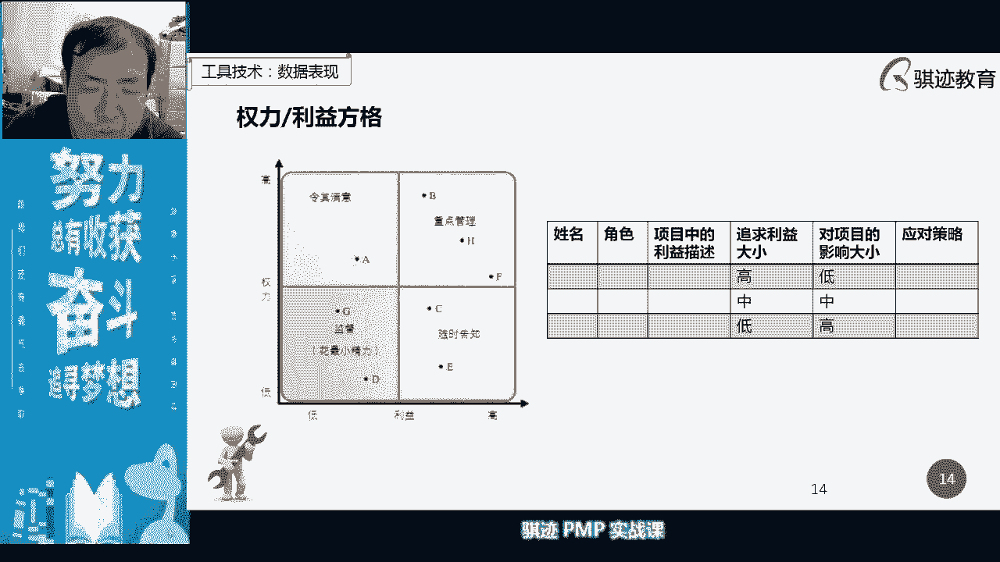

那么怎么表现复杂关系呢，来了啊来了，叫做立方体，立方体呢就是其实说你们可以考试，不会让你画图对吧，很简单，去相关方，立方体就是表现什么权利利益影响作用，这四个维度选三个维度进行组合。

来表现相关方的一个立体的一个位置，那么您只要记住四选三就可以啊，四选三是啊，四种选法对吧，四种选法啊四好，但四选二是不止四种选法对啊，是我数学学的差，是我数学学的差，那么相关方立方体我们记住就是四。

权利利益影响作用，四个选三个去组成它的三个维度，xyz 3坐标，然后呢表现相关方到底处在哪个位置上，它用于描述什么大型的复杂的关系，复杂的啊，情况复杂的项目啊，就我们要是这样想，那么在这样的书之后。

我们会发现什么。

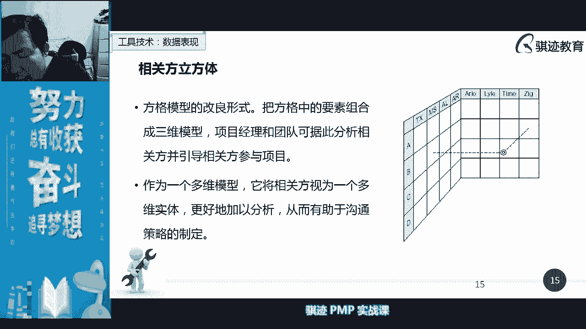

因为因为我们讲项目是分不同阶段的项目，在不同阶段当中，相关方对于项目的影响呢也是不同的，所以我们要根据这样的情况呢，我们又出了另外一个工具，叫做我们的凸显模型啊，三连啊，三连三连啊，三ln model。

sellin model，那么这个model当中是起什么作用呢，就是将相关方案放在一个立体的方式当中去，表现它与相目的临近性，紧迫性和合法性，以及他和项目相关程度，比如说有个相关方，他权利高利高。

但是他可能在项目的后面一个阶段，才对我们项目有重大的影响，那么它对我们的项目来说，它就是一个很远的一个相关方，那么它在这个模型上近大远小，他都有，在模型上对我们来说。

看上去就是个是一个比较小好一个相关方，而有些相关方案虽然权力不高力波，但是它与我们项目的相关性呢非常紧密，它近近大远小，那么就近大它看起来就比较大啊，使用这样的方式去用立体的方式去描述相关方。

在整个相关方的环境当中呢，相关方社区当中我们有个词叫相关方，社区当中呢，它的它的利益地位啊，是这样，所以它增加了相关性，紧迫性和关系性这样一些东西，好那么这是相关方啊。

这是我们凸显模型当中的一个一个表示方式啊，一个表示方式，但是它只是表示什么啊，我们潜伏的相关方和我们的相关啊，他表示我们相关方是怎么样处在权力紧迫性，合法性这三个圈当中是会扮演什么样的角色啊。

角色这凸显模型，但这不是凸显模型，在一个完整的凸显模型当中的一个完整表示，这是它的定义表述啊，ok啊不用两句很多，这个不用两句很多啊，考试也不会考这个图，放心，ok啊，这很容易理解对吧。

我就不在这就不再多说了啊，那么相关方的优先级排序适用于什么呢，当然我们有大量的相关方相关方的人啊，病毒很频繁诶，你们到底谁负责这个事情啊，这关系很复杂，变动很频繁，在这种情况下。

相关方和团队相互之间呢有复杂关系的时候呢，我们就会使用什么相关方的优先级排序，排除我们经历范围内能够照顾到的，优先级高的相关方和优先级低的相关方，进行合理的工作，日程工作的经理安排和人力安排是直播吗。

当然是直播啊，ok有同学居然质疑不是我直播啊，你看到了看到了吗，是直播啊，大家看左下角时间啊，是直播，这是我们的相关方，那么最终我们会输出一个什么东西呢，识别相关方之后呢，我们输这个相关方登记册啊。

相关方登记特有相关方的身份信息，联系方式扮演的角色，他的诉求对吧，然后有它的相相官方的分类方法，注意我们也是一样，识别相关方就和我们识别风险一样，识别风险之后，我们有风险的风险的啊，它的特征对吧。

风险的描述，但是没有风险的什么啊，有风险的分级，但是没有风险什么应对措施，相关方当中呢我们没有相在识识别相关方当中，第一次出现的风险登记特难，没有相关方的沟通计划，对应的沟通就是没有的。

要在后面我们在规划，相关方参与当中才会不全啊，注意这一点就和风险当中，我们识别风险当中是没有正式的风险责任人，和没有正式的风险应对措施的，要在定性分析时候能用对吧，定性分析和故障风险一定得有好。

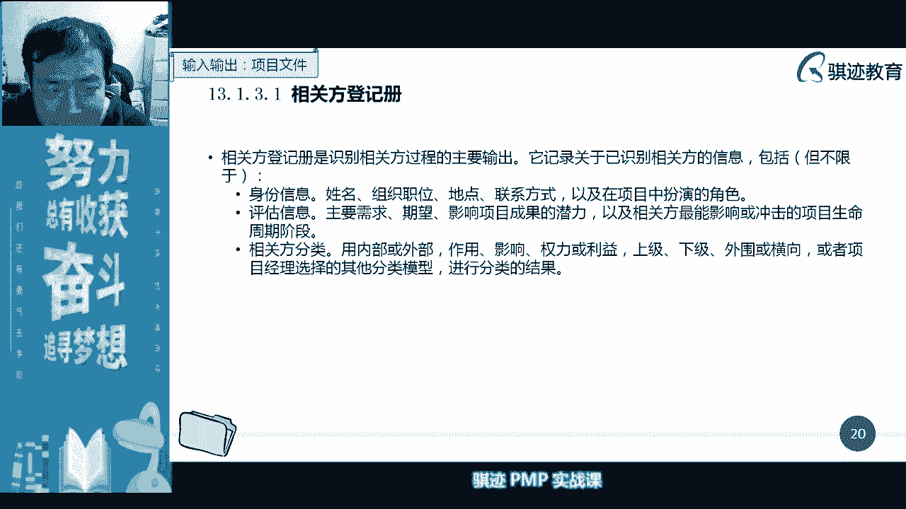

这是相关方的识别，识别完相关方之后。

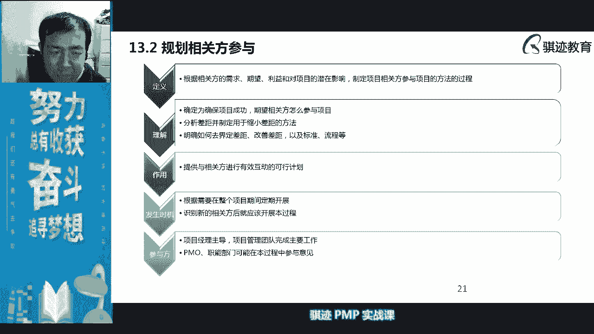

我们才开始做规划，规划之后呢，我们就输出一个什么相，只是出于唯一一个东西，相关方参与计划还输出一个东西，很很奇怪的东西，叫相关方参与度评估矩阵啊，这只是一个老外的一个一个一个一个呃，呃关工具。

但工具呢在评价很多大量人群的时候，是挺实用人少的。

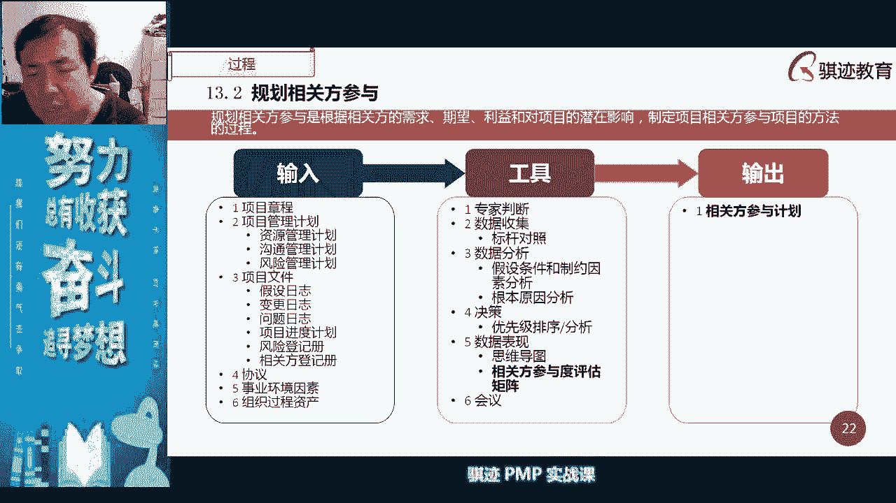

项目当中呢这个东西呢就没什么大意思了，好那么相关方屁股矩阵是这样的，我们先把各个相关方根据当前的状态呢标出，相关方对项目呢是不知晓抵制中立支持和领导，那么领导呢就是说亲身参与其中。

并且呢带领大家去工作的啊，是这个意思，支持那就是我在资源上，行为上，精神上支持对吧，你往前冲，我在精神上支持你对吧，支持，那么c呢代表current当前状态，d代表什么desire期望状态。

那么通过这样的评估矩阵，我们就可以找出当前相关方的啊，期望参与的程度，一，我和我们的希望相关方的参与程度之间的差距，项目的参与程度之间的差距，然后通过这个差距呢，我们可以适当的开展沟通。

将相关方对项目的支持呢逐步逐步提上，那么当然管理相关方当中也有一个概念，我们知道希望相关方呢高支持适当期望，因为什么期望越高，失望容易越大，所以相关方最好保持合理的期望，因为期望过高之后呢。

会容易产生不满，反而会有负面，所以要保持合理的合适的期望，有时候呢我们就要相关方面要控制它的期望，但是呢要希望他对项目的支持度越高越好，期望度呢要合理才是最好的一个状态。

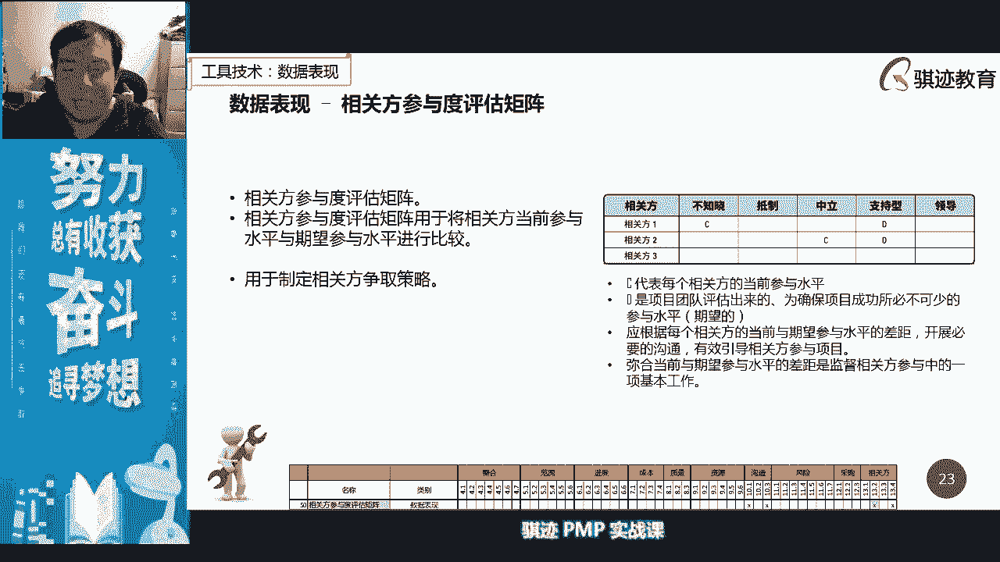

然后呢我们会制定一个相关方参与计划，相关方参与计划呢是一种啊我们主观上的啊，用于促进相关方参与的一个计划，那么因为人是不能够控制的，不像东西对吧，所以这个时候呢只能说是先engagement。

是参与计划engagement，那么这个应该问当中呢，我们更多是什么，通过干预对相关方的干预，通过路边相互的沟通来期望他达到一定的，我们他参与项目的程度，但是大量的相关方，我们是管理不到的。

所以我们只能说相关方参与计划的engagement，不能说是management，在英文当中只能说是控制他们的参与啊，好是这个意思好，那么这是相关方参与计划啊，一个列表列表啊。

这个呢是相关方的我们的呃期望的评估矩阵啊，我们的评估矩阵，然后这是相关方的一个沟通的计划，相关方的沟通计划，相关方的名字啊，沟通的需求，我们沟通的媒介方法就是我们的what啊，好，啊好，然后呢。

这是啊when和often，when和often好，what呢是我们沟通什么东西，比如说我们沟通当中最主要的一个，沟通的东西是什么，好，请在公屏上打给我，项目经与相关方沟通最主要的一个沟通的啊。

东西或者工具或者是什么玩意儿，或者文件是什么，请在公屏上告诉我，是什么开会啊，开会开会是不对的，会议记录不对的，项目经理，最主要的在相关方管理当中的一个沟通物，是什么东西，或者沟通文件是什么啊。

不是开会啊，是我们的绩效报告，定期和不定期的绩效报告，因为开会都是假的，业绩才是真的，明白吗，绩效报告，项目的状态，报告和绩效报告是我们最主要的沟通啊，资源电子邮件，这是工具对吧，会是一种工具啊。

都是不对的啊，相关方登记册，注意相关方登记的当然不能够什么，当然不能够沟通啊，这只是相关方登记测试，应该项目经理严格保密一样东西，这怎么能传出去呢，反正别人知道哦，原来他也参加项目了哦，他也参加项目的。

那你这猴子玩，这绝对不对的啊，所以我们讲沟通的内容，最主要的一个东西有什么，绩效报告和状态报告，好那么相关参与当中呢，我们会列举相关方与，列举所有相关方之间的一些关系啊，我们和相关方之间关系。

然后呢我们会讲怎么样去让相关方参与到项目，将来他的参与途径是什么样啊，那些参与的途径啊，比如说门卫啊，李大爷他是相关项目上市的，那么他相关方是什么，权力高不高，其实还行对吧，力高不高不怎么高。

那么干什么权力给力啊，令其满意对吧，每次跑到门卫正义大哥李大爷点个头哈个腰，没时间再递根烟对吧，以后我们的客户现场来干活的时候对吧，某位李大爷直接就放我们进去对吧，干活方便多了对吧啊，是不是。

这就是一个相关方案，那么李大爷参与我们的项目的主要形式，什么途径是什么气，让它什么用，让我们用最快的方骷髅，最短的时间，把我们放到客户的现场当中去干活对吧，这是门卫李代以来相关方的参与的途径对吧。

什么叫空调扇，应该没有这个效果好，是是是讲我的讲的笑话，冷了啊啊。

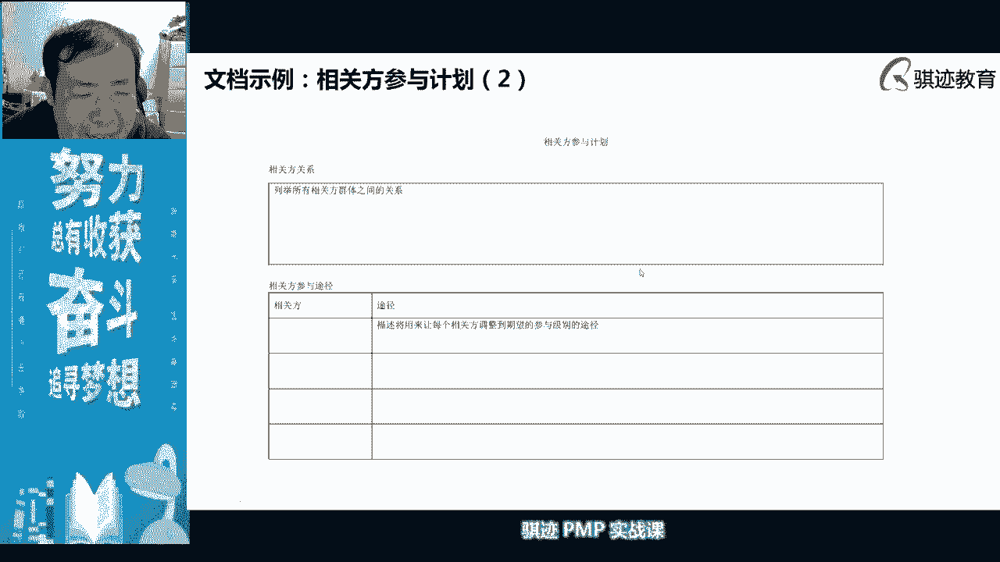

这是我们的相关规划，相关方参与规划完之后呢，我们就开始什么，好我们开始有管理相关方参与啊，管理相关方参与，那么管理相关方参与当中呢，我们讲什么，主要就是日常工作中和相关方进行沟通啊，管理层。

然后呢看和他们进行沟通交流，看他们的反馈，然后呢进行什么进行管理，那么管理相关方参与更多的指的是什么呢，满足其诉求，处理问题，促进相关方合理参与这个过程啊，就是去实施我们的规划，相关方参与这个过程。

定期给他发报告，然后定居跟他说啊，对项目的感觉怎么样，如果内部相关方说哎活干的怎么样啊，外部相关方说哎呦客户客户李老啊，张大张老板啊。

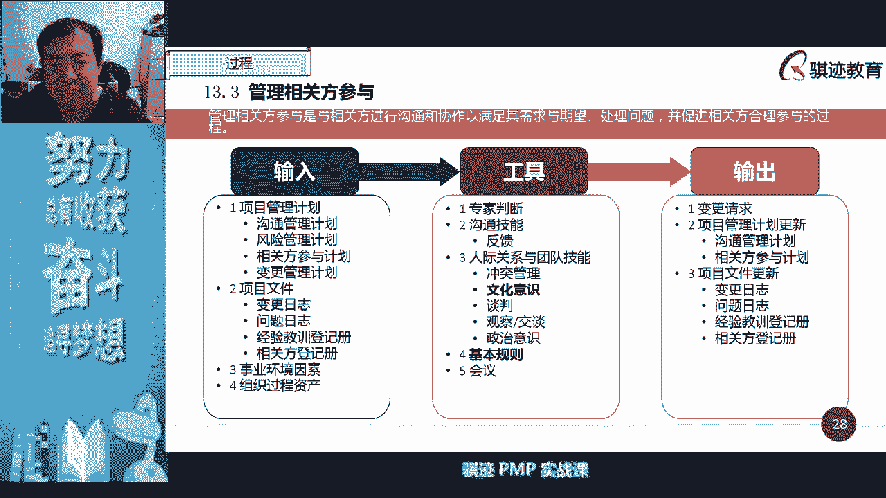

你看我们的活干的怎么样对吧，那么在管理相关的参与当中呢，又有文化意识，文化意识指的是相互之间彼此的文化认同对吧，文化的敏感性等等这些东西啊，注重沟通交流啊，中国人的是什么啊。

就我们讲沟通当中就叫中国人是高于境，高语境，这是什么，说话相对含蓄，西方人呢说话是低语境，说话直向直白啊，这就是文化差异对吧，文化差异，好那么管理相关方，管理相关方参与当中呢，我们讲如果是内部相关方。

我们就会用到一个什么团队章程，记得吧，资源管理当中我们记得把团队章程对吧，是规划资源管理输出的团队章程记得吧，规划资源管理啊，所以团队章程不是规哦，我们在规划相关方参与输出的。

而是规划资源管理当中输出的，那么为什么，是因为团队是内部资内部的相关方，它是资源，所以有资源管理去管更好，所以其实是基本规则，基本规则可以让相关方有效的参与项目当中来，内部相关方也是相关方对吧。

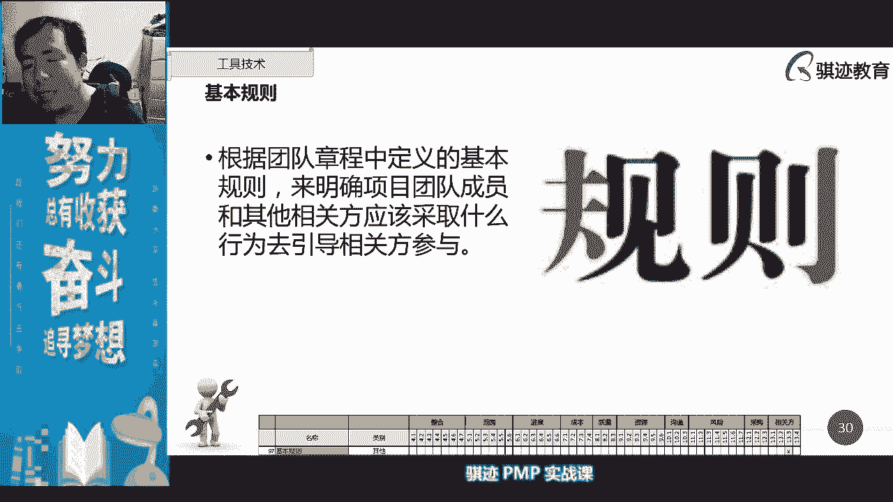

男人也是人，女人也是人，人妖也是人，对吧好。

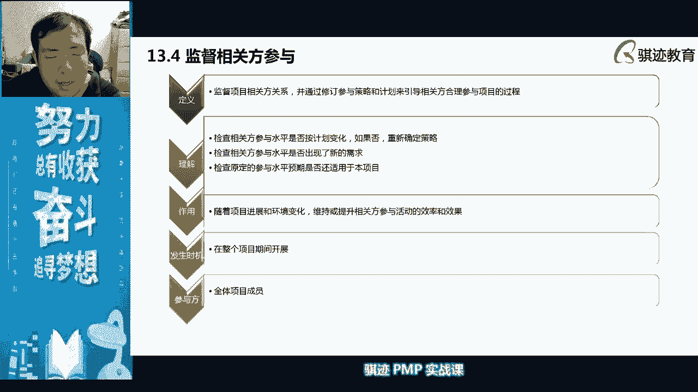

那么最后一个监督相关方，监督相关方面也就更没啥好说了啊，就是说定期看看大家有没有有没有好好去沟通，啊对吧，有没有定期发report啊对吧，有没有认真来开会啊，大家对项目的态度呢有没有好转啊，做这些事情。

对这个事情ok啊，这些东西都是框架性比较虚的，更多的时候呢，相关方管理其实就是项目经理的人际关系管理，和项目角色的人际关系管理，明白了啊。

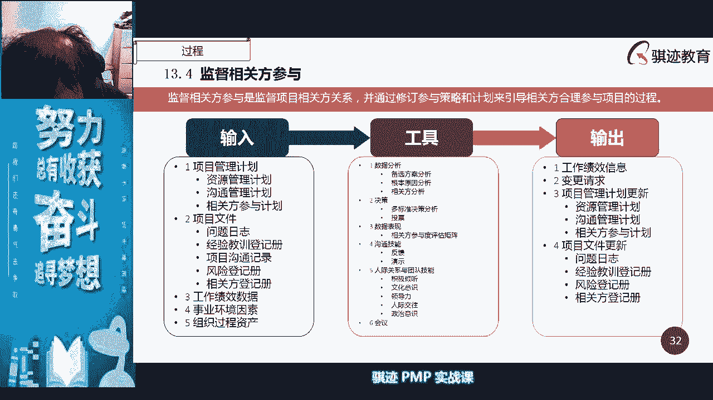

是这样一个意思，啊是这个意思，好那么这就是我们讲的相关方，啊有位同学在我们直播期间问我题目啊，很有意思啊，这位同学喜欢在直播的直播期间做题目啊，然后来问我，挺有意思啊。

好这是我们相关方的一个知识结构的总结，ok啊大家看一下就可以了，相相关方考试呢是所有考试内容里面最少的，哈哈十十大知识领域里面最少的啊，因为这个东西呢嗯没有什么太好的，因为人际关系中的东西。

更多的是一种人的情商啊，人的为人处世，很多东西他是很难用理论去描述的啊，但是一个一个项目经理，他的相关方管理玩的好，那必然是一个高情商，懂沟通，然后善于观察人和管理的一个人啊，就是这么个意思。

明白了这个东西很难用理论去演描述，只能用只能用心去体会好，那么相关方管理的内容呢，其实就讲到这里就差不多了，我们本啊本班a班的所有的啊啊，那么就结束了，识别相关方应该在何时开展一，第一道选什么。

识别相关方应该什么时候制定项目章程之前啊，对吧，项目章程没有制定的时候是什么样，你就要先识别谁啊，发起人，所以当然应该选b啊对吧，先生是第一个人发起人呀，没有发起人就没有项目对吧。

因为项目章程当中也含有相关方，那是什么关键或者是主要相关方，以及什么关键资源，那个资源叫什么，叫做预分配，记得吧啊第一题选b啊对吧，好好，那么第二题，押题对于相关方管理哪一项是不适合的。

每个团队成员都对相关方管理负责啊，比干系人管理啊，说啊，当然我这里打字不精确啊，相关方管理提高了相关方需求的满意程度对吧，c帮助解决相关方相应的事宜，敌加强了人员的协同行动的能力啊。

那么第二道题目是什么，选选什么好啊，非常好啊，我看到很多同学都选a啊，第二道题目很简单啊，选a啊，相关方的题目就比采购呢要简单多了啊，选a对吧，我记得为什么，是，因为相关方管理当中。

主要负责是项目经理和项目管理团队，不是所有的成员都适合管理相关方的，因为这需要有一定情商和人际交往能力，有些同学只适合做什么做技术对吧，有些同学适合什么管人，好那么第三道题目。

某跨国项目涉及不同国家多个相关方，合作方，合作方有些属于竞争关系，有些属于从属关系，项目经理应该用何种方式去表现相关方的影射，第三题选什么，第三集选选什么，第三题选当然应该选择，鼻的，为什么我们讲权利。

利益方格可以用来描写简单的关系，但是啊小的项目，但是这是一个跨国项目，是个大项目对吧，合作方关系复杂，有些是竞争，有些是从属，那么在这种情况下，是不是应该用凸显模型，要比权利的方格会更好对吧。

因为他们没有说是什么，有没有邻近性，紧迫性，合理性这些东西，所以如果有权利利益立方体是最好的，但是没有立方体，选凸显矩阵也要比权利利益方格呢要来的好，所以这道题目最恰当的答案应该选b啊，选b明白了吗。

项目经理识别疑问，相关方，并表示本项目的结果将影响到他的绩效，项目经理应该如何管理啊，第四道，对啊，有时候题目就是这样，你知道最佳答案他都没有选呀，没有选呀，凸显模型凸显凸显模型，没有凸显啥的啊，模型。

随时告知ok同学们选选d的是啊，过来砸场子的是吧啊，我们讲啊，并表示要影响他绩效，高影响到技巧，它的利益相关度高不高高，我们讲利益相关度高，权力高，那么应该怎么管理呀，当然应该选b重点管理了。

如果这道题目改一改，它纯粹是好玩，那么应该干什么，选a令其满意，因为利益不相关，但是呢权利很高，还是让他满意，对吧啊，所以第四道题目我们讲没有改题目情况下，第四道题目应该正确，答案应该选b。

不让大家选对了没有。

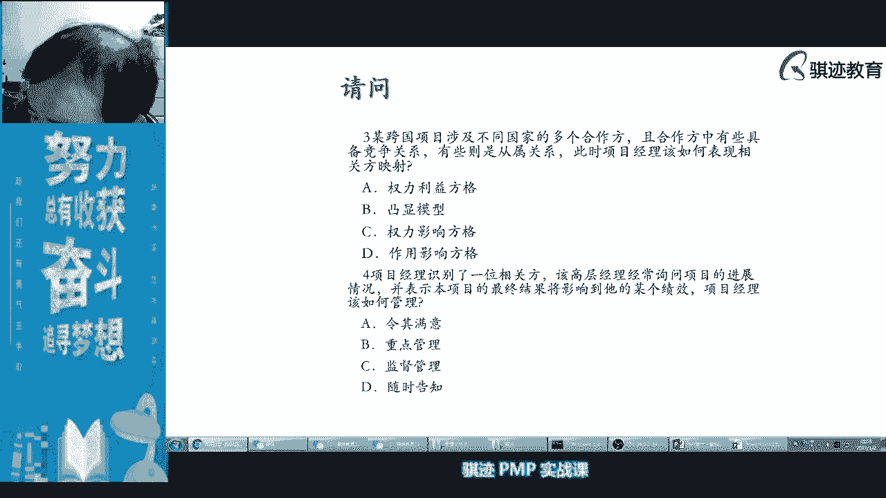

好那么经过啊呃我们那应该有两个啊，两三个月的啊，我们奇迹教育本次p np的，我们的培训班的视频直播教学，我们就基本就进行进行到这里了，然后呢我们还有十分钟时间，大家可以在公屏上呢，然后呢跟我交流一下。

有什么想法等东西，有什么还有什么疑问都可以跟我交流一下，那么我不会离开大家，我还在群里，你们有任何的问题都可以艾特我，或者加我微信，私下问我可不可以好，我们我们是我是不会离开大家了。

所以本来是说我本来说还要带大家进行，但是因为啊工作安排的关系啊，为了带软带软考，所以呢后面吴老师会在家也也是一样的啊，然后大家如果有兴趣的，也可以去听一下吴老师课也是不错的啊。

他也是我们经验很丰富的老师啊，所以大家呢请啊认真的啊学好我们的pmp课程，争取在最后一次老板的pm当中通过好，那么我要说的话，那基本就说到这里，那么接下来几分钟呢，大家可以在公屏上问我题目啊。

微信号多少啊，这位同学就说的啊，今日学明日网怎么办，明日再看视频录像啊对吧，微信号多少啊，这位同学你就说的啊，我们在群里吗，如何刷题啊，那么说到如何刷题啊，我我我有这样几个技巧，第一啊。

开个系统讲解吧啊很多题不明白，你不明白，一个一个问我就行了，没关系啊，那我跟你这么说啊，我们一个个来回答啊，首先要回答一个很多同学都感兴趣的，如何刷题，刷题是有技巧，怎么刷题呢，刷题我们刷的是什么。

你如果这道题目你知道很自信的知道正确答案，并且选对了，ok这道题目你可以把它pass过掉，如果这道题目你不是很自信的，但是选对了，那么你在选对之后呢，你要想一想理由是什么，那么我们重点管理是什么。

重点管理是什么，你完全不知道这道题目答案怎么选，又选错了的题目，那么请你把它记录下来，然后呢再复看，复看以后呢，然后看一下它的题目理由是什么，他的知识点在哪里，这个知识点可以扩张扩张呢。

在哪里去解释它的条是在什么样的条制线下，去解释这个知识点应用在这道题目上，你去导致选这个答案的明白没有，这就是刷题的一个技巧，当你把足够多的错题都能积累起来，然后进行复刷，我们知道错掉的题目。

你就把它积累起来进行复试，刷了多之后，你会发现啊，你错的题目容易错的题目越来越少了，不会错的题目越来越多了，那么就慢慢慢慢的在走向成功，当你坚持不懈的在这几个月里面不停的刷。

说到最后你做什么题目大部分都能成功的时候，那你考试就不慌了啊，这是我的经验，不让满足你的要求吗，真题会发给你吗，当然没有，我也想要真题，哪来的真题啊，同学啊，你想多了，你想多了，我只能说。

啊有个同学说谢谢大师，辛苦了，我不是大师啊，辛苦了，谢谢谢谢，谢谢感谢啊，还是说敏捷怎么理解，敏捷就是一种快速的敏捷，就是一种快速反应，快速迭代啊，通过自发驱动的一种呃项目管理方式，来取代传统的按计划。

按部就班的一种相应方式的一种方法，它适用于轻量级环境，至于很多什么环境啊，项目的结果，项目的目标呢是能够轻量级迭代，就是它的迭代更换，改换了这个成本很低的那些环境，都非常适合于敏捷，明白了啊。

然后我只能说你可以就这么理解啊，就是说一切轻量级的项目，当我们能够用自发的方式，让团队成员用自发的方式去推动这个项目，并且呢我们是更少的计划，更多的工作，不断的调整，更多的迭代去完成工作的时候。

那么我们已经开始往敏捷方向走，可以装个题目，讲到这，刚才解释过了啊，近日学民众啊，这些都显示过了没有，真题篇博客的翻译不友好和难度，看不懂怎么办，同学翻译看不懂篇，博文的翻译其实是还是比较严谨的啊。

比考试翻译好多了，偏博可看不懂，那么我觉得你可以看的慢一点，其实是看不懂，如果你在片博客上哪一点看不懂，请照片截图下来告诉我，我来帮你解释，可以吧，ok啊，屏幕和大部分人写的东西其实还是比较容易懂。

ok啊这一点你要相信，因为中文版经过这么多版的改版下来，他其实大部分内容都继承下来，其实大部分内容都是一样的，它的这种经典改版下来，其实它的阅读性是可以的啊，没有那么的不堪，没有那么。

具体到哪一动就看不懂，你可以问我啊，没问题，看书时间多一点，还是刷题时间多一点啊，同这个问题问得很好，李永毅同学啊，你这问题问好，那么看书时间呢我建议在这个月和下个月，就是3月份和4月份呢。

你们看书的时间更多一点，刷的时间更少一点，看书主要看pmbok，结合我们的讲义和视频看的更多一点，题呢可以呢，有时间你就刷一刷，等到后面两个月呢，你刷题的时间更多一点，看书的时间更少一点。

到最后一个月冲刺的时候呢，你就全力去刷题，权力就是刷题啊，然后呢，但是到最后几天呢，你就不用再努力去刷题了，除非你前面没怎么刷啊，然后呢你更多的是什么，看一看书啊，在最后经验总知识总结一下。

提炼升华一下，在经过那么多刷题的锻炼之后呢，你再总结一下经验，就可以达到更好的效果，咱们有题库吗，应该是有的啊，你问一下学校有的啊，如果你们有你们如果真的需要题目的话，以后我可以分享一点给你们好。

自学有什么建议啊，自学建议很简单啊，我们讲每天至少两个小时的有效自学时间，翻pm博客书，然后呢翻ppt看我的视频，脑子里回想一下我们学的这个章节，他的讲的主要内容是什么，重点是哪些，有哪些子过程。

他的知识点关键点在哪里，老师讲的东西我都记住了没有，如果没有记住，我去回看啊，这是一个自学衡，去回收回看啊，这是一个自学的很好的一个方法，13章内容简单串一下，ok啊，无期啊。

无期同学总是给我出一些敏捷，是不是用其他词翻译可以可以呀，马世豪同学，你这个这个很好啊，敏捷还可以用另外一个词翻译，叫做雅乐居啊，雅乐居你去外面搜一下雅乐居地产啊，就是敏捷，好希望13章内容简单串一下。

就什么，13章内容就是说我们要通过认识项目当中，从一开始项目的一开始认识项目当中各个人，然后呢针对不同的人，他们对项目的诉求期望和态度，去制定一个相关方参与项目的一个计划，相关方的属性，对吧啊。

相关方的属性，他们的能力，知识贡献啊，这些东西全力啊影响兴趣，然后呢，就这有针对性的给他们去制定，他们的相关方的沟通计划，沟通啊，沟通啊，沟通方案和他们的期望点在哪里，然后呢制定出计划之后呢。

再去实时沟通实施相关方的管理，我逐步让他们参与到项目当中来，最后达到理想状态，哦哦op啊，有点咳嗽啊，这然后呢最后呢监督啊我们的相关方的效果，那么在识别相关方当中呢，我们可以使用权利利益方格这种方式。

去识别简单项目的相关方的关系和他的位置，然后呢可以使用凸显模型和相关方立方体，就是去进行识别复杂的啊，去表现复杂项目当中的相关方的，各个的所处的位置和它的状态，以及它的临近性紧迫性啊。

这些东西这是相关方的一些啊主要的知识点啊，所以相关方的知识点不动不动啊，考试能带手表吗，同学考试不能带手表啊，所以考试现场有钟，所以不不用戴手表啊，戴手表会有烦，会有被抓作弊的危险，所以请把手表收起来。

第四章到第13章总结一遍对吧，啊看我发的书还是看ppt都要啊，我就给你两个字，小跟一句话，小孩子才做选择，成年人都要，我都要那个徐锦江，那个那个狮子头，我都要啊，就这个意思啊，都要啊，考试尽量不要带表。

因为你代表是可以的，万一你的手表上了发条，为什么有任何响声，只要被现场的普尔文老师认定你的手表有响声，或者任何有提示，他可以有权算你作弊，所以带带有风险，所以我不建议大家带手表，如果真的要带手表。

只能带没有任何电子功能的机械表，但是现场万一出现纠纷的话，是以老师为准啊，会很容易吃亏，所以现场如果你担心考试有问题的话，你可以带一只纯机械功能呢或者石英表，但它纯机械表面也行，但是不能有任何响声。

不能用任何闹钟啊，不能任何其他的电子记忆功能都不可以啊，啊那勉强还可以，如果你不确定的话，你带一只这样的表，在考试前问一些老师能不能使用，让他解检查，并且考试当中始终放在桌面上，不要去动它。

会减少纠纷的可能，讲义当然要看啊，都要啊，所刷到的题目在考试中有多少几率刷到啊，同学我们所讲，理论上来说都不会有真和真题一模一样，但是p m p考试当中的知识点大量都是重合的，所以只要你刷题刷的足够多。

你总能发现有些题目虽然答案和提问啊，略有区别，但是他的论点是一模一样的，会有这样的一个情况啊，ok这就是我们的重合点，明白了吗，然后偏偏考试的知识点，大概在556 百个左右啊，也不粗略统计。

大概在五六百个左右，所以如果你刷题刷到1000道，那么理1000道以上，那么理论上来说，你任何的题目啊，在p考上，他所考的知识点应该都，ok，看书上少对呀，书上是少呀，ppt是把精华部分和主要内容对象。

但是书上也有些东西啊，p p t上有些东西是没写，书上有也有的啊，你回去看一下，各有各种书是全面，但是他不会特地突出考试重点，ppt肯定是针对你们考试做优化的对吧，拼搏哥哥觉得书有问题，太干了。

那是因为你没有潜下心去看啊，老师有时候翻篇博客，还觉得讲的觉得他讲的太太少了，太吝啬字眼，最后讲的再细一点，还要就是这个意思，所以你说明没有用心去看啊，什么东西啊，老师做pm多久了，如何顺利转型。

ok啊，说到顺利转型这个事情，我靠现在已经超时了，那么我只说呃，我把问题问完啊，解释完啊，项目转型呢最主要是什么，就是说你要从管理职技术职能转型，管理人最主要是什么，提高一个情商，提高一个协调能力。

在组织当中表现出你的管理潜力，给领导看，上级领导看到，然后呢，主动承担起一些项目管理的职责，我做运动也可以转吗，当然可以转哦，好我是纯机械表发条的啊，吴奇同学啊，你这是在凡尔赛吗，ok啊谢谢啊。

我买老是买不起机械表，那现在都不带了啊，考研连手表都交给兵哥哥，带不进考场了对吧对吧，哪里有1000道题目啊，软考是不是比pp更是一样，并不是啊，偏僻，是现在广泛各个行业都认可的，一张项目管理的证书。

软考更多的认可，都是集中于国企系统和政府系统啊，题目在哪里刷，学校会提供刷题的题库的啊，不要急，有有关内容请咨询班主任和我们的课程顾问啊，老师倒是劳力士的啊，吴奇同学，如果我有劳力士的话。

那么我就把劳力士手表送给你，因为我真的没有劳力士啊，如果我有玩具表的话，我才不会把玩具表送给你，但是我真的有玩具表啊，啊有啊最后一个问题啊，最后我们回最后回答一下雷超翔同学的问题啊。

韦少侠的同学们问老师题啊，一个题目到这偏僻考试是这样，四个小时考200道题目，你们算一下四个小时一共是什么，一个小时60分钟，四个小时，240分钟刷200道题目，所以平均一道题目应该是一分钟多一点点。

但因为考虑到计算题和人的体力问题，我推荐考试的前100道题目，大家每道题目的用时控制在50秒到45秒，答完后100道题目呢，你可以延长到一分钟到一分钟多一点点打完，然后呢因为中间可能存在一些计算题。

可能存在一些纠结的题目，你可以略花多一点啊，所以我很推荐大家在刷题的时候，刷到最后的几道题，几道题目你专门找一套题目，完整的用四个小时或四个小时以内时间，一口气从头刷到尾，不要停，全部刷完。

然后再去对答案，以检验你对时间的把握和控制能力，ok啊，这是我给大家的建议，啊好那么我们今天的课程就就差不多到这里啊，问题都回答完了，那么后面还有很多问题呢，如果大家还有问没有问题啊，我在群里啊。

我在群里你就要找一下我们呃讲师谢阳啊，就是我ok啊啊叉老师就是我啊，所以你们在群里就可以了哦，你们在加我微信都可以啊，尤其欢迎很多前年轻貌美的啊，我们的女学生加我啊，当然男学生也可以对吧。

啊咨询一下软考试，咨询一下软考的事情啊，关于咨询软考的事情，你可以加一下我们的，我们的班主任和课程顾问啊，啊或者加我的微信也可以啊，你们可以叫班主任顾和顾问，他们啊会有会有那个工作电话留给你。

你可以去咨询啊，因为关于这个东西呢，我必定选我，就比如说我们课程呃收多少钱，然后报名怎么报这些东西，我讲的不一定是最权威的，对吧啊，我说的这个数也不一定是啊啊最终的数对吧。

所以你们你找那个我们的那个张老师，张婷老师啊等等，其他啊其他的一些我们的课程啊，顾问啊等等都可以好吧，你怎么没进群啊，ok你肯定在群里啊，如果彭华军同学，我没有进群，请你联系我们啊。

奇迹的相关的老师把你拉进群好吧，肯定可以，好那么我们今天的课程就到这里，大家拜拜啦，我们保持联系哦，我们以后有机会大家有兴趣可以带大家可以呃，找个时间，然后呢我们开一个直播室，然后呢我再跟大家聊聊天。

吹吹牛都真的是可以的，我们学校是可以开的，没问题，你们向他反映一下啊，来想去学校里反映一下，抽个有空的时间啊，我义务不收钱给大家回答问题，表演才艺对吧啊，唠嗑吹牛的，然后凡尔赛啊这些都行。

只要大家开心就好好。

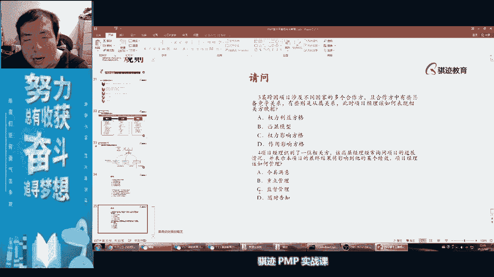

那么我们今天就先到这里吧。