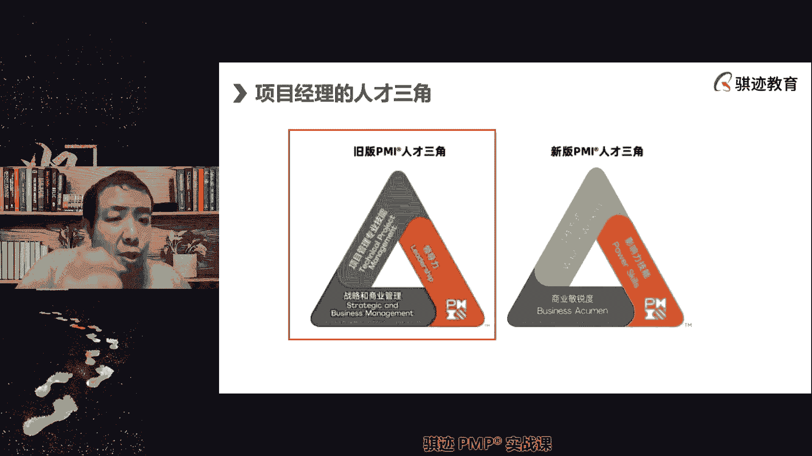
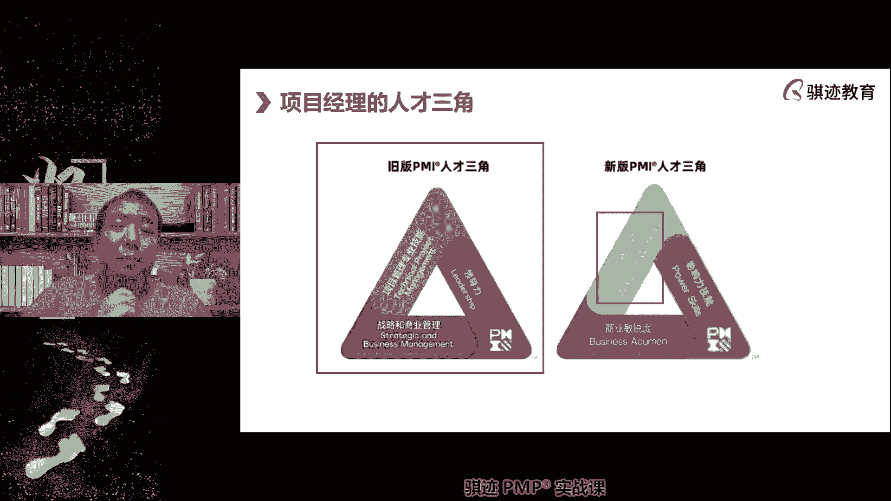
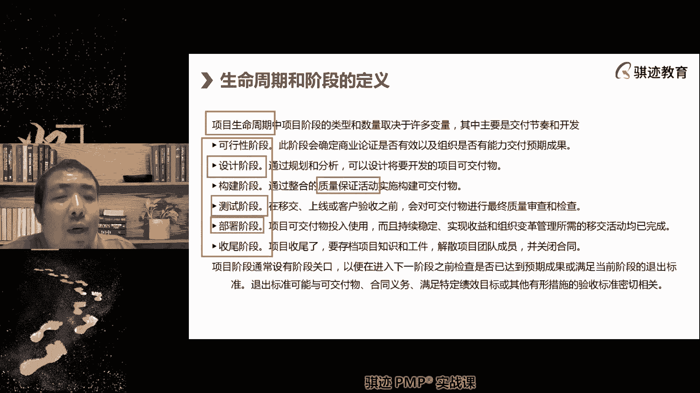
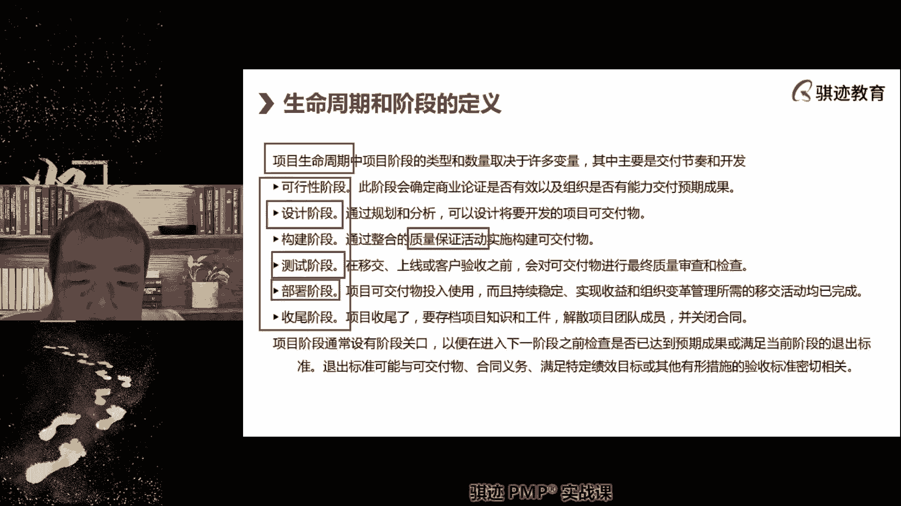
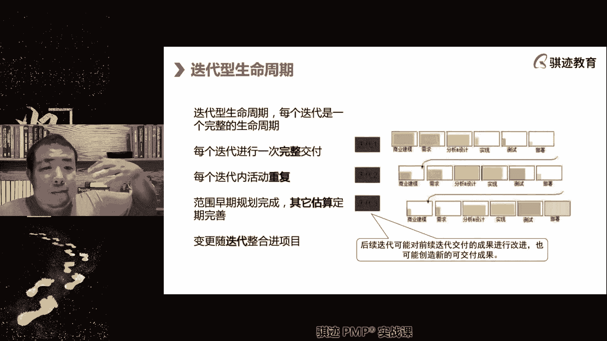
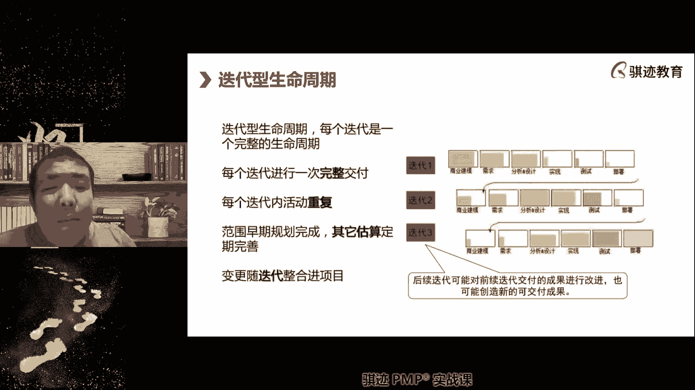
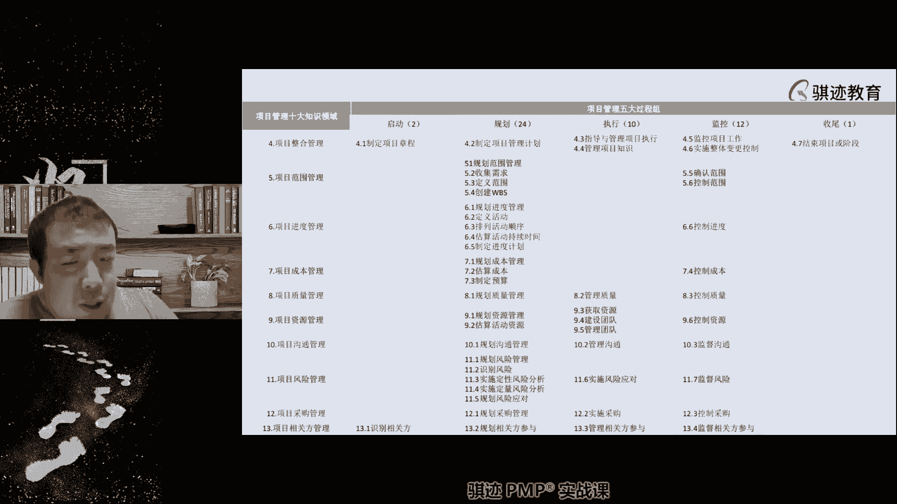

# PMP认证考试课程最新完整免费课程零基础一次通过项目管理PMP考试 - P41：PMBOK第七版 第一章 项目管理引论-2 - 骐迹PMP - BV1Sb4y1f7Yt

好嗯那么这个是PMI的人才三角。

在PMBOK第七版的时候。

PPMI提出的，第一版的就是旧版的人才三角啊，人才三角PMI在旧版的这三阶段，认为，项目经理应该具有这三方面的核心技能能力啊，包括的项目管理的专业技能能力，项目的领导力和战略，战略管理能力啊，那么来了。

我为什么要讲这个新老对照，因为现在考，如果考试考你，我就问你，他都是问新的PMI人才三角，但是我怎么讲。

新的知，我告诉你的是这个演化过程是怎么样的啊。

这才是比较有意思，那么新版的人才三角呢，他改为了工作方式。

影响力，技能和商业敏锐度，你看这两边的形状是一样的。

三条边也是一样的，三条边表述的内容也是差不多的，但是它们的区别在哪，区别就是项目经理的要求，就说能力要求不是更高了，而是更宽泛啊，天猫认为项目经理不需要很深，但是要够宽，就是你对于你的管理的宽度啊。

所涉猎的范围，所能掌控的程度要更宽敞一点，有同学问战略和商工业管理指的是什么，就是项目经理要不要管我，那就先问一下我们的课程的第一个问题，项目经理要不要管战略，项目经理要不要管战略来公平理回答我啊。

项目经理要不要管战略，对不需要，那么嗯，你要，不用你只是个小小的项目经理，等你做到项目组合经理的公司的决策层，你得考虑这些事情啊，项目经理是不用管战略，那么什么叫战略和上呢，项目经理要了解战略。

在老板的视频中就讲，项目经理不需要去管理战略，只要执行战略管理所下达的战略任务，中的组成部分就可以了，但是你对你的项目的战略任务是什么，要有理解，比如说比如说你的项目是开发一个新产品。

那么你在整个企业的战略体系当中，也就是我们的价值交付体系中的目的是什么，探索新市场，尝试新玩法，这是你的战略赚钱是不是你的战略目标。

不是你的战略目标，组织不指望你这个新产品能赚多少钱。

希望你打开一条新的道路。

所以在旧版的我们的呃人才三角当中，战略的目的是什么啊。

这个但是这个问题问的非常好啊，战略的目的，了解战略目的是干什么，知道你的任务是什么，在战略层次，你项目的任务是什么，只有知道这个你才能够管理好项目，对不对，那么我们也一直说项目管理当中，项目要贴近战略。

达成组织的战略，项目才有意义，没有考呃，有些卡的同学，你可以把分辨率调低一点啊，没看见我这里网络挺稳定，相当稳定相当稳定啊，我有时候我的路由器可能有会有一些，我现在长边拼着啊，我可以给大家看一下。

我拍我拍个照片，在群里给大家看一下，我的这个是相当的稳啊，啊那么这是我们旧的什么，那么新版战略和商业管理变成了商业敏锐度，这对项目经理要求就更宽了，因为组织的战略是受到外部商业环境影响。

新版的PMI当中这条紫色边，此次便是RO大正，大家问到战略指的是未来发展的线路对吧，是未来发展的方向，应该说是战略是如何实现未来的，一个大方向的指引啊，你可以这么理解认为吧，那么为什么叫商业免费做。

是因为企业的战略受到外部商业环境的影响，所以项目经理不不不但要知道自己的企业，在外部商业环境下应该扮演什么样的角色，然后要知道外部商业环境对企业的影响，而且透过企业的战略对项目的影响也要了解到。

而且我们往往是扮演的角色是什么，我们扮演的角色是乙方项目经理，那么你不可避免的要跟甲方，在商业上有很多接触，这种商业接触如何去处理，如何去同时维护自己的利益和甲方的利益，那么他要有商业敏敏锐度。

Business acuum，项目达成可以理解，我完成了项目战略当中的一个任务啊，OK啊这对对，你可以认为他是站立动作，一块拼图啊，一块拼图啊，这是一条边啊，这是我们俩的一条边。

那么第二条边是什么工作方式，什么叫工作方式，就是项目经理不但要自己会运用不同的项目，管理的方法和模型，更要学会干什么，能够用不同的角度和姿态，用不同的方式带领大家做好项目工作，那么这个之所以这么这么写。

就是因为什么，项目管理的自从PMI全面引入敏捷的这个理念，就是说这个体系管理的体系之后呢，那当然当然这个也是也是也是必然的一个趋势，就是在敏捷的环境中，项目部经理的角色职能发生了变化。

工作方式也发生了变化，从直接安排工作，变为了指导工作如何去有效开展，注意我的描述是不再直接指导工作，而是指导工作有效开展，从间接管理，从直接管理变成了间接管理啊，这就是一种工作方式转变，所以项目经理呃。

偏曼认为应该懂得不同的工作方式，你在预测型的管理当中呢，有预测性的工作方式啊，就是你应该能够直接果断的安排，所有人如谁应该做什么，如何去做，遇到问题应该怎么解决，以你牵头来去解决这所有的事情。

而在敏捷的换项目当中呢，那谁直接管理啊，这个问题问的非常好啊，尾号7616，总结问题问的非常好，谁直接管理团队，自己直接管理的自组织啊，这我们在敏捷的专题课上讲到团队自组织啊，这就是敏捷能力。

那么在敏捷当中呢非常好看，就没讲到项目经理就不再直接管理的，而是让团队自我管理，它起到的是维持这个自我管理的秩序，和推动这个自我管理的水平不断提高的过程，那么为什么这么做啊，这个篇幅展开的就很大。

我们在敏捷专题课会讲啊，我们在后面当中也会提到，但是敏捷专题课会细讲，为什么要这么做啊，那么对人的要求是不是提高了，你要在预测性当中直接指挥所有人，你看把人当木头人啊，你做这个，你做这个，你做这个。

而在敏捷的环节当中呢啊你们怎么做，你们自己决定，但是呢我会给你们一些意见，然后按照什么原则方法遇到困难，我建议你们应该怎么处理对吧，你看这是不是两种不同的方式，项目经理如果要求高一点啊。

就如果如果你要资深一点，你要会综合运用这两块东西，你要这个就就是讲到有个有一个中国老祖宗的，高呃高级词汇啊，我一直觉得呃呃我们先讲啊，叫收放自如。

有时该收就是你直接管控，有时该放，发挥人的主观能动性。

如何做到收放自如，这就是一种工作方式，所以项目管理当中的很多理念和原理，其实中国人的老祖宗早就有啊，中国人祖先的朴朴素，智慧的早就体现出这个东西，但是我们现在用更科学的方法，把它表达出来而已啊。

那么这是工作方式啊，那么在混合型当中，其实对项目经理的，项目经理的呃呃要求其实反而更高，为什么你既要能够用敏捷的方式去管理。

也可能是在敏捷，因为在转型敏捷转型过程当中获得部分回应。

敏捷的方式当中，可能团队不适应或者做不好，你还得切换回预测先去换啊。

工作方式的多样化，能力的多样化就更重要啊，所以片方认为新时代的项目经理应该什么技能，管敏捷，也能管预测，还能管敏捷和预测的过度混合型，是不是对人的要求是很高的，所以你们的考试我们之前讲过1/3，1/3。

1/3啊，敏捷1/3，预测1/3，还有敏捷和预测的混合体，1/3啊，就是这么来的，明白吗，所以他这么考试也有他的道理啊，当然对我们同学来说，考试来说你要学的东西更多了啊，只要去比偏博客第六版的老考纲。

和之前的考试相比，只是要学懂的东西更多啊，好那么这个第三条边啊，只是影响力原原先的是什么，是领导力。

影响力和领导力有什么区别啊，影影响力更加强调影响力更加的强调的是什么。

是能是一种软技能，能对别人施加影响啊，我一直跟别人解释老师什么叫影响力啊，影响的就是不运用权力或者没有权利的情况下，别人也愿意听从你的意见去作出行为，这叫做影响力啊，比如说你是一个技术权威。

谈到某个技术问题，团队应该用什么样的技术方式去实现，那么当你发言之后，别人会不自觉地把你作为正确，按照你的意思去做，这就是一种影响力啊，项目经理的影响力来自于多个多个方面啊，来自多个方面。

那么第一方面是什么，我认为的第一方面是什么，激发别人对你的信任，一个有影响力的人，一定是一个被别人信任的，你想想看，如果别人不信任你，别人会听你的意见吧，肯定不会，啊啊知道吧。

所以影响力一定是基于信任了，所以怎么做一个被别人信任的人呢，就是呃要一种言出必行啊，要要有一种什么信守承诺啊，啊这样这样一个行为才最容易获得别人的信任，所以我就想当然，今天就是一个反面例子。

我们今天的上课晚了那么一丢丢对吧，晚了一丢丢，那么这就是一种啊影响力这种消耗，但是问题还不好，我们下次一定注意对吧，影响力的在人与人关系之间，第一次形成很重要的一块是什么东西啊，你能不能守时守约啊。

因为这会影响到别人对你的第一印象，OK啊我们今天讲的，我们我以自己亲身举了一个负面例子，那么接下来影响力会体现在哪里啊，你如何去别人跟别人沟通，跟别人打交道，用自己的魅力，注意魅力不仅仅来自于外表啊。

你看我这个人像帅哥吧，不像对吧，但是我自认为我这个人影响力还可以，哈哈我认为他是有预谋，不是阴谋，我真的是今天是那个，但是我这个人从来不会说我做错了，我硬要说自己对啊，我错了就错了，我们要承认啊。

影响力啊，不像不像不像啊，镜头是带美颜的啊，你们知道啊，我这个是美颜开的最低啊，美颜开的高，你们绝对认不出我哈哈那影响力来自于什么，来自于一种行为和内在品格的感染力，这是一种影响力啊。

我如果是个品德高尚的人，我很容易有影响力，知道吧啊如果我是一个什么啊。

很有事就说我很能说很能有说服力的人。

我很能运用表情，我情商很高，这些都会带来影响力。

都会戴眼镜，我很会人际交往啊，啊逢人说人话，逢鬼说鬼话，这个这个当然有点贬义啊，这也是一种影响力啊，这些恰恰也是项目经理应该具备的能力啊，就是这种能力，我觉得那么领导力更多体现在哪里啊，你所推崇的方法。

你所推荐的方案，你所要走的线路啊，去实施的呃，方向是能够带领大家做正确的事情，走向成功的，当你能达到这一点，你就有领导力，所以领导力和影响力还不一样，有些人脾气很臭，态度很恶劣啊。

但是呢他每次说都能说得对，都能带带领团队带来成功，给大家带来好处，这个时候呢虽然他在大家心中没有什么影响力。

但是他有很高的领导力，但是领导力其实你其实也是影响力的一部分。

大家也愿意听你啊，大家愿意听你，不是因为你的人脾气好，而是因为什么你能把事情做得对，这就叫零道理啊。

Leadership，leadership就是能够leader能够走在前面。

带领大家走向成功，做做做正确的事情啊。

所以最好的项目经理是什么，既能大家带领大家做事情做成功，又能够感染大家，让鼓舞大家，或者让大家认可，大家心甘情愿听你的，听你的话，跟着你走，哪怕遇到挫折也不会啊，灰心丧气，然后举个例子啊。

这种就是影响力，当两者合一的时候，你就是一个非常优秀的管理人才啊，我们不夸张啊，这样的人其实在现实社会当中也是很吃得开，很吃香的啊，OK啊那么这就是pi的人才三角的解读啊。

那么我们回到前面看啊，商业敏锐度我们前面讲了什么，我们要了解我们这个项目所处的行业。

法律法规，市场行情对吧。

经济周期这些东西，以前PMI说。

项目经理其实什么专心管好项目的事情，就像有点闭门造车。

而现在我们觉得什么这个事情不怎么干，你要了解外面的行情是怎么样的对吧。

市场规律是怎么样的对吧，然后我们处在上升周期。

整个经济环境处在上升周期还是下降周期，还是平稳周期，震荡周期对吧啊，我们的跟客户的关系怎么样啊，对吧啊等等等。

我们的商业模式怎么样等等，这些都要了解我们的生意是怎么做起来，生意当中面临哪些挑战和问题。

这些都是商业敏锐度啊，这对项目经理要求就管的宽了。

或者说不一定管，但是你的认知就宽了。

PST分析吧，这个不是属于商务的性，非常好，这个这位叫啊，这位叫大诺诺的同学，这句话说得好，这个本来是商务之责，但是现在越来越多趋势项目经理要了解商务，要了解商业。

这是一个发展趋势的啊，在很多的乙方角色当中，项目经理就是半个商务，对不对啊，如果你们如果有较多的各种行业的人，在很多的行业领域当中，项目乙方的项目经理就是半个商务啊。

好，那么我们讲前面，我们讲的就是说人在三角中的工作方式，叫或懂得敏捷啊，还有超敏捷啊，敏捷至上的大规模敏捷超敏捷啊，懂得混合啊，也当然自己要懂得预测，预测是每个项目经理预测型的管理方式啊。

懂得什么叫做项项目治理对吧，懂得进行需求跟踪，风险管理，日常的各种各样的管理方法，这些管理和工作方法，都是项目经理的根本和基础，但是呢光懂一些传统的，比如说像风险管理，日程管理啊，范围管理啊。

政治管理啊，已经不足以满足项目管理的诉求了，还要懂得混合性的管理方法对吧。

要懂得设计思维啊，注意啊，设计思维这四个字放在这里只有四个字啊，如果你们学一些其他理论，这个是我懂的，设计思维有五步，如果你想要深入的学习设计思维，它可以是一门课，如果要浅浅地学。

他可以讲一节课叫做design thinking啊，这这里只是四个字而已啊，但是PMI的课程当中呢。

我们这里就不展开了，did i thinking怎么用五步啊，他每一部里其他细化了很多环节，design thinking的核心理念是什么，换位思考，如何正确的运用换位思考来解决问题。

发行商业机问题啊等等等等等都可以，PEST还有L1啊，PEST就是我们后面课程会讲到的啊，我们现在有个叫提示清单，P e s t l e r tel，还有BUCA多了啊，OK啊这些概念现在层出不穷。

那么这是项目经理在项目环境中。

应该具备的核心能力，在这个当中有一项能力，注意有一项能力以前是没有环境当中，或者现在只是包含在我们的影响力技能当中的，是一项什么能力，但是是项目经理平时运用最多的一项能力，但是他现在不是单列的。

而是包含着影响人的能力，你们想想，项目经理平时做的最多的一件事情是什么。

是什么对沟通。

那么沟通为什么不列在这里面啊，这是我以前在讲PMBOK第六版的时候。

我经常讲人在三角里面经常讲的，为什么沟通没有在例子里面，哎不是还真不是进度管理，进度管理不是啊，注意啊，那有些同学说进度管理，项目规划，项目经理不会一天到晚的去管理进度。

他进度可能一段时间再去检查一下啊。

一段时间内重新对项目的规划一下，但是不可以时时刻刻去做这个事情，项目经理在项目中。

时时刻刻做的最多的事情就是沟通，但是沟通确实不是一个单列项，是为什么，因为沟通重要，但是沟通不能由一个人来承担，项目中的沟通，在项目管理到一档一定复杂程度之后，它是通过规划和团队共同执行来实现。

项目经理只有一张嘴，两只手对吧，你一天能沟通多少人。

如果项目很大，人员很多靠你一个人是沟通不过来的。

你一定要有良好的沟通规划和，然后依靠团队去做内外沟通和内部沟通。

所以沟通不仅仅是一个个人的能力，而是你的团队能，也是你对于这个团队设计的结果啊，所以它不仅仅是一个人的，我们讲的人才三角，这三个角是你自己个人的，当然我们期望啊，p mi现在的设定。

我们期望如果你在团队中，不仅仅你具有这个深层筛选能力，而且如果大家都有的话，那就更好啊，对包含在工作方式呢，其实包含在这里啊。

沟通其实很多时候包含良好的沟通，其实包含在我们的影响力技能里面啊。

沟通看到吗，保安在这里啊。

好这是项目经理到底应该具备什么样的能力，什么样扮演什么样的定位角色，这个描述有效的沟通如何学习呢，嗯我们会在沟通的相关的绩效域里面会讲啊，我们会讲如何进行有效的沟通啊，那么我们也会在敏捷课程里面。

其实敏捷当中的沟通其实我挺提倡的啊，现在越来越多的项目管理中沟通确实有提升，敏捷沟通啊，等到我们敏捷这节课会讲啊，会讲到不要急项目管理课的，你不要看pp的课，可能嗯你们也就听听。

有这么这么这么这么这几个20几个晚上。

其实内容挺挺丰富的啊，给你讲的东西挺丰富的好，那么我们节奏慢一点啊。

接着接下来我们讲项目中的各个生命周期啊，这个是要记住的。

项目中我们会有各种生命周期，最大的周期叫做产品生命周期，什么叫产品生命周期就是一样，产品从设计创造，交付使用到淘汰消亡的整个过程，叫生命周期过程，这是项目中最长的生命周期，而且注意啊，而且注意的是什么。

那产品的生命周期就是下面这个看到了吧，而且什么，往往一个较大的产品，是通过诸多项目来完成它的生命周期的，所以项目的生命周期一般都短于产品生命周期，所以比产品生命周期短一层次的是什么。

小一个层次的是项目生命周期，一个项目或者多个项目，通过项目的努力来完成一个产品的生命周期，比如说拿项目一啊，是产品的引论阶段啊，引理论阶段，那么这个项目很有可能是什么项目啊。

那么这里最后一下项目一很有可能是什么项目，或者什么类型项目，不一定要很具体啊，在这个产品的生命周期当中，项目一可能是什么项目，测试下，一我尾号123号，为什么是做测试啊，调研项目实验性对，这些都是对。

就是前期论证探索测试验证之类的，都是很有可能是项目一定要做的事情，它是整个产品，一般这是个非常复杂大型产品的第一阶段对吧，那么第二阶段项目二和项目三就可能是什么，我们的开发项目开发交付。

我们通过项目和项目三将整个产品搭建起来，并交付给客户，那么项目四项目五，项目六呢，成熟阶段什么产品已经开发完毕了，我们对产品进行持续的更新优化，铁蛋啊，概念啊，看老板更重视哪一块吧，这个倒不是这种。

这是自然规律啊，自然规律，那么等到项目期呢，则是这个项目淘汰，这个产品淘汰，可能我们从项目期开始又是另外一个轮回啊，啊那么这些就像我前两天发朋友圈一样，萨尔那加的无尽轮回的起点，我们把一个旧产品淘汰了。

往往要用一个新产品去取代它，这项目期可能就是这个产品的消亡，淘汰阶段我们逐渐逐渐会去淘汰掉这个产品，不再向市场提供啊，互联网太常见了，对的是的是的啊对，但是有些东西项目既不是那么好做的。

就比如说微软现在早就停止了，windows7的那个叫什么支持对吧，但是win7还有很多人用，比如像像我查老师，我我我的台式机还是装了windows7，win10永远活在我的虚拟机里。

因为我觉得win10是win10不受我控制，win10这个微软后台的控制太厉害了，我不愿意让我软王者他永远活在我的心里，我就有问题对吧，所以windows要淘汰win11不是又出来了。

win10可能要也要淘汰了对吧，也要淘汰了，也有可能停止支持了，但是这个淘汰和停止支持，转换的过程没有那么好做，真的没有那么好做的啊，对于有些产品来说，只是讲一讲啊，好那么我刚才举的例子正好就回答了。

有位同学问老师淘汰阶段应该怎么做，就是另起一个产品，然后引诱用户从老产品跳到新产品去咋了。

那么这一，接下来我们继续讲项目的各种各样的设定啊。

这一页设定，那么就说明了项目的层级关系啊，项目当中的层级关系啊，那么在这个层级关系当中啊，那么但是这个这一部分呢，现在PMI的设定呢考的比较少了啊，但是人家要知道，项目之上为什么要有项目集和项目组合啊。

第一点一个组织当有一定规模之后，他所进行的项目往往有多个，如果多个项目都需要什么有关联，都需要进行放在一起进行协调管理，它就会形成一个层级，叫做项目集，用于协调一系列有关联的项目，比如说啊。

比如说比如汽车研发当中经常就有汽车研发，现代的汽车研发都是什么，先研发平台，然后基于平台去开发汽车，所以平台开发是一个项目，平台之后呢，呃呃生产各种不同的车，是各个独立的项目，但是车要生产的成功。

要研发的成功，离不开平台的研发，知道吧，所以有些公司把平台玩到了极致啊，那么你们知道吗，像什么啊，是地球当年地球最速SUV，兰博基尼的沃瑞斯和奥迪的Q7，和和大众的途锐啊，都是一个平台，他是先研。

因为兰博基尼的奥迪，大众都是大众集团，下面他在研发的时候呢，先研发这个汽车平台，然后再用这个平台呢去给不同定位的车型呢，去运用使用来开发汽车，可以降低成本，提高效率，所以你会看到什么呃，像途锐啊。

沃斯啊，Q7啊，他们组成了一个啊什么平台，我忘记了哦，大众什么平台的项目集，他们都是在这个平台家具研发的，只不过各自侧重点不要啊，然后每一个车型的研发呢都是一个项目，那么他们共享一个平台。

这就实现了什么1+1大于二，大家不用各自独立去研发车辆的平台啊，车辆平台设计，从而什么提高效能，降低成本也降低风险，啊这就是我们什么啊啊这就哦我刚才看一下，因为我们5月份考试的同学还在问问题啊。

看一下手机，这就是我们刚讲的项目级的意义进行协调，还有一些情况其实都是什么，项目与项目之间要抢夺争夺关键资源，比如说我们这个项目和那个项目，都需要用这个专家，但是专家一天只能干多少钱。

80个小时或一个周只能干五天对吧，专家拒绝加班对吧，人家专家人家牛叉，那么怎么办呢，我们我们成立一个项目集，然后规定啊135啊，这个这个专家给你项目A用二四嗯，专家到那个项目上去干活协调啊。

稀缺资源也是可以的，这项目集，那么项目组合它的管理层级又不一样，那么大家看项目组合，这个层级之上是什么东西啊，是组织的战略目标，组织的战略目标，所以项目组合，是为了实现组织的战略目标而来的。

那么大家看啊，大家看下面啊，看我框框框出来的项目组合就是PFMP啊，我们前面讲的项目机就是PGMP，所以当你们学完PMP之后呢，你们可以有兴趣可以学那个PGP啊，PGMP现在开始有中英文双语的。

以前老师学的时候是全英文的啊，对英文不好的同学来说，这个这个这个这个这个难度太大，那么平PFMP就是项目组合，那它的英文呢你看看portfolio，portfolio这个这个什么意思啊。

股票投资组合也叫破获利，所以类比一下是不是就明白了，项目组合管理的意义是什么，从组织那里啊，为了实现组织战略目的，哪一笔钱拿一笔资源不一定是钱，也可能资源拿来之后呢，像投资股票一样啊，这个项目投一点。

那个项目集九点，注意啊，项目组合比项目极大，所以它下面可以管几个项目几啊，这里投一点，那里投一点，但是我投下去的这些钱和资源呢，要能实现组织给我的战略目标，比如组织给我们这个项目组的战略目标是什么。

提升市场占有率10%啊，这是我们的战略目标，那我们拿这个钱呢啊，投入研发，投入市场运营销啊，投入公关对吧，那么研发市场营销和公关相互之间有关系吧，可能完全没有关系，新产品研发和公关完全没有关系。

对不对啊，但是他们都是为了能够在未来提升我们产品，市场占有率10%，而努力的建立战略目标进行，所以项目组合下的项目及项目，甚至包括运营可能相互之间是毫无关联的。

但是他们放在组合在一起进行投资，投入资源，可以实现组织的一个高层次的战略目标。

这就是组合的意义啊，有同学问，那么数据中台和ERP是项目结项目组合，那要取决于你组织的目的，如果你把它放在一起是为了什么，能够很好的两者整合在一起，那么它是项目集，如果你把它放在一起的目的是为了干什么。

是为了实现组织的战略目标，比如说我们要进行数字化转型，这样一个战略目标，那么它是组合，取决于你的目的是什么啊，好好那么继续往下讲啊。

好。

好，那么在篇博客的第七版当中提到了一个概念，叫做产品管理啊，那么产品管理不同于，不同于啊啊不同于项目管理，产品管理包括了什么啊。

包括了一产品生命周期当中的项目集管理啊，这是偏包括第七版新理论。

它包含了项目及管理，包括了相关的项目子项目及项目级的活动，所以产品管理可以看作是针对一个拿到。

我们把它拖起来了，产品管理更高的第一是针对某一个产品。

它的整个生命周期内的诸多项目。

乃至这些项目所组成的占项目集和项目组合。

进行管理的一种形式。

它是针对产品的，所以嗯就像嗯就像那个那个什么呃，比如说我们像字节跳动对吧，字节跳动下面有什么有抖音对吧，有那个叫什么飞书对吧。

这些都是什么，针对不同项目产啊，这不就是不同产品管理的那么抖音，飞速上面自然有很多的，下面自然有很多大量项目项目基金开展。

它是以产品作为管理分类的一种管理形式对吧。

就像大众点评下面有什么啊，优美团大众点评。

美团是一家对吧，那么大众点评是一个产品的产品管理的一条线。

那么美团是管理条线，它们相互之间既有融合，但也有自己独立性对吧，问产品经理的还是项目经理的这个东西问的。

就他们的职责不同，职责不同啊，今日头条皮皮虾抖音，其实阿里系比较明显啊，这个我们举个例子啊，不深究，举个例子明白吗，第二个产品生命周期当中的项目管理啊。

那么产品管理政策上面就是这种方法，将产品的功能开发的程度作为进行监督啊，那么它会项目管理在产品生命上的项目管理呢，它会更细，更贴近产品的某一一大块功能来进行，做一个啊。

功能或者一个阶段的功能和实现和交付，来进行管理啊，好那么有时候呢会反过来啊，这个概念有点搞啊，大家其实要记住，就是有时候呢我们产品比较小，注意啊，这个时候呢产品是小产品，但是呢业务部呢是大业务部。

或者是我们的范管理范畴是大管理范畴，小产品大范畴，这个时候就反过来是项目集内的产品管理啊，项目及内的产品管理，就比如说很多做电商的就是这种形式，比如说我们电商会有什么海外电商部，它其实就是个项目集。

海外电商部当中可能什么，我们向海外卖几百种产品，我们将这几百种上千种产品呢，分为多种不同产品类型对吧，有美容美美容美发产品对吧，有零食类的产品，有生活便利类的产品等等等等，那么它的每个产品都很小。

都不足以对它进行什么，是以产品为主进行管理，但是呢他们的产品啊又具有一些共性。

都是这种电商类的产品，所以我们用电商集合的一种方式对它进入。

反过来了，产品概念反而小了，而项目及概念反而大了。

来进行管理了，这时候呢是小产品大管理，前面一种呢是大产品啊。

相对较小管理啊，相对小小管理其实不小啊，我们通过这样一系列管理呢，能够能够通过应用产品管理能力，因为因为比如说都是比如说零食类的辣条，比如说是火腿肠对吧，比如说是QQ糖，这些都是零食。

他们的管理方式是类似的，产品管理的泄露等等都是类似的，我们通过可以对它进行集中式管理，来提高管理效率，K可能一组人都是管零食的。

他们管理特性差不多对吧好。

这个就叫做什么项目体内产品管理啊，这个特点虽然产品管理是一个不单单独的领域，有其知识管理，但是它的项目集合，项目管理的是这两个的关键整合点啊，所以偏科的第七版提到了，项目管理和产品管理的相互关系。

产品管理有产品管理的产品经理，项目管理有项目经理，他们两者是合作关系，没有谁大谁小，现在给你解了明白了吧啊，虽然可能有些是大产品，有些是小产品，但是它们两者的定位不同，没有谁大谁小。

产品经理更多的面向市场，要对市场负责，要背市场KPI指标，项目经理更多的是面对实现，要对实现负责，一般不背KPI指标啊，不背市场的那种，可以开始，好这就是产品管理和项目管理的一些交集啊。

好继续好，那么来了我们前面讲了，继续往下讲啊，项目的生命周期当中，项目自身我们也有它的生命周期对吧，它的生命周期当中呢，点这里我们罗列了典型的生命周期类型啊，这个大家可能都看得懂啊。

尤其是搞it的LIT领域当中的生命周期，特别的标准啊，相当特别标准，所以他一般会有以下这些注意，不是所有的阶段，所有的项目都一定都有，这些是可选件，你可以从这些抽象概念的阶段当中抽取。

这些阶段的设计来组成你自己的项目啊。

这种相当于标准件，让你抽取来自己自定义啊。

有同学说产品经理对价值负责，项目经理对交付负责。

那这也不对啊，现在拼不过地，基本不是跟你说了吗，也要对价值负责。

只不过产品经理面对市场要对市场负责，项目经理面对结果要对结果负责啊，这是真的区别，就是项目经理主要做什么，这个东西，客户喜欢和满意的东西我要尽可能生产出来啊，然后去交付给市场，产品经理是什么。

我这个东西为什么为什么卖不过同行，我要对这个位置就这个意思啊。

给大家举个小例子啊，那么所以可行性研究设计构建测试部署和收尾，是我们典型的几个阶段，项目我们后面会讲到，项目会分为若干个阶段，但是项目不一定都有这些阶段，不同的项目可能就会有不一定都有啊。

馋诶，有尾号3366同学啊，今天大家回答问题还比较热烈，非常好啊，产品和结果有什么不好，产品是有形的，好比一只苹果，我经常说法是一只苹果，你这只苹果吃了就可以给你带来愉悦，对不对，什么是结果呢。

你来听张老师的课，来我们琪琪上上课学习，然后考过了PNP，拿到了这张证书，凭借着这张证书，你跳槽，然后升职加薪，迎娶白富美，走上人生巅峰，这是一个结果，明白了吧，哈哈当然当然PB正手没那么大魅力啊。

但是这是你往人生更高处走的一块坚实的台阶。

是可以做到的，但是没有那么高高度啊。

举个例子，考试通过是一个结果啊，我们来学PNP最终目的是很重要的一个，最终目的是为了考试能通过，这是一个结果对吧，我们不是为了那张纸啊，PNP证书那张纸一张纸不值那么多钱啊，一张纸大家自己家里打印。

打印很便宜的，几块钱就搞定了啊，那么这是生命周期各个阶段，分为可行性设计构建测试部署收尾，我们稍微介绍一下啊，因为今天时间也不早，但是该讲的细点讲的细点啊，第一节课总是会讲的慢一点啊。

可行性就是看这个事情能不能做项目，很多时候的第一阶段往往都是什么。

先看看这个事情能不能做，不能做，我们先尝试一下，做不了，我们后面就不用花力气真正去做对吧，尝试第二个，如果我们能做，接下来我们会对它进行设计设计规划，看看怎么样一步一步把东西做出来。

设计又分为高层次设计和细节设计，还分为属性C参数加这个后面再学设计，我们叫做三重设计啊，我们经典的质量管理论当中有三重设计啊。

概要设计，细节设计和参数设计啊啊这就不说了啊。

啊越讲越扩展，第三个是构建啊，我们真正的去把这个东西实现出来，要有品质保证啊，做出来不能粗制滥造，有品质保证，把这东西做出来，做出来之后呢，我们要验证，那么我们要进行测试啊，看到测试很多T就知道啊。

跑跑测试用例测试，驱动开发等很多IT同学就可以了，注意测试不是所有的东西，所有的项目都有测试，不是所有的项目都有测试啊，或者说有些项目测试是没有意义，或者有项目根本不做事也是有的，不是一定必须的啊。

但是大部分的项目呢，或多或少都会有相应的测试，比如验收也是一种测试对吧，最后还有部署，就是将这个东西投入使用啊，那么部署这件事情呢，以前PNP呢也提到，但是没有特别强调，其实这个在价值交付当中。

部署是非常重要的一个环节，什么意思啊，举个例子啊，我给客户生产了一台机器，这台机器通过验收意味着这台机器有价值吗，过程是根据不同的行业项目形态来了啊。

开始结尾是肯定可行性，也不一定有了，有些项目就不做，或者没办法做可行性研究上来再说，也有的啊。

一样机器通过了验收，它就是有价值的吧，不是为什么，因为一台机器它对客户真正有叫什么，我把这些机器安装到客户的生产现场，能他任务客户能用，我们为客户生产这些机器，去生产客户想要的产品，它才是有价值的对吧。

如果我们是个工业项目。

我们给客户生产了一台流水线上的机器，这台机器只有装在流水线上，并能正确的工作，产生客户想要的结果的时候，它才是有利的。

所以部署是最终实现价值交付的一个，非常关键的阶段。

但是不是所有的项目都需要部署的啊，也一样啊，因为有些项目是不需要部署的啊。

就好比你考p mp需要部署，不需要。

只要你考试通过，自动就拿到证书，结果就出来了，不需要部署。

没有部署这个概念对吧，好，最后收尾呢就是总结经验教训，然后是结束项目啊，最后收收尾啊，结结束结束收尾呢，一般几乎所有的项目都需要或多说少都需要，那么这是不额项目的通用的概念的。

这些阶段可以根据本项目特点进行组合，也可以重复，比如说设计可以多个阶段都在做设计，我们从最初粗略设计到详细，可以做多个阶段对吧，构建也可以多阶段构建啊，一阶段构建什么，二阶段都是可以，所以可以组合。

可以跳过，可以省略，根据你的项目需要，自己像搭积木一样去搭起来就行好吧，这个能理解吧，那么我们以接下去啊。

接下去我们以预测行为例啊，我们以预测行为例，跳的有点卡啊，我们以一个没有，我们以预测行为例子啊，来讲述一下呢，在预测型，这是一个预测型的项目的例子啊，但是是通用的项目例子项目总归会有的吧。

前期准备阶段啊，我们会有前期准备阶段，然后呢一直到我们的可行性研究和立项完成，前期准备完成完成，然后进入项目的什么章程，制定项目的章程，制定项目章程制定完成之后呢，项目高层次设定都设定完了。

那么启动阶段就结束了啊，然后进入准备阶段，准备阶段就是对项目做各种各样的规划，这是以前PO第六版，对项目生命周期的标准描述啊。

现在已经被我们前面的那几个自由组合，给取代了啊，但是这个也跟大家还是要提一下啊，是的，然后项目的各种计划做完了，接下去干什么，进入执行工作啊，我们会进入构建啊，测试构建和测试其实都是执行啊。

然后为监控项目的过程，最终收尾结束，项目收尾之后的东西呢，可能会移交给运营去进行持续生产啊，这就是一个典型的预测型的项目生命周期啊，那么它呈现出来的特征呢，就是我们接下去讲的三大类项目生命周期的。

第一类叫做瀑布型的预测性啊，这是进入到我们今天上课的尾声了，但是啊越来越重要了啊。

所以大家还是要集中注意，第一节课会讲的稍微多一点点啊，第一种生命周期类型是我们讲的三大类预测，敏捷和混合当中，第一类预测预测生命周期类型，我给他一个中国的成语啊。

古语啊来描述它的特征，叫做啊，大家很多同学都已经听过，很多同学叫谋定而后动，叫做谋定而后动，就是先把所有可能做完的计划给他做完了，然后一步一步往前走。

不回头把事情做完，这种项目的生命周期类型就叫做预测性，他是先预见未来需要做什么，然后用最优化的方式把东西都安排好。

一步步错。

有同学问开始和结束必须有过程，是不可以没有过程，可以有可以没有，但是总得有开始结束对吧，过程取决于自己啊，要爽由自己对那个广告词是吧，那么预测型啊。

我们回来啊，预测型的特征，某地二活动，他追求的是什么最高效。

就不要误解啊，确实是这样，他追求的是最高效率，因为所有的事情都计划好了去做是最有效率的，但是有个前提，你们知道预测型它的最大前提是什么，要想预测型有效的工作，他一定要有个最大的前提，什么检，怎么剪辑。

知道吗，明确资源充足，资源充足不是前提啊，不是说用预测一定资源通目标，明确创新可行性不好，不环境变化不剧烈，变化较少，环境稳定，需求明确对就是这个意思啊。

环境需求，环境明确带来需求明确的预测性。

最大的挑战和敌人是什么，剧烈变化的环境和需求，因为你每次因为我都否定了你，每次一改我所有的计划都得全都来过，会严重降低我的效率，有类似项目经验啊，人脑洞开的不错，但是不对啊，所以预测型适合什么项目啊。

环境变化不剧烈，需求稳定明确并且稳定，需求如果很明确，但一天晚上变化也不行，明确并且稳定，环境稳定，需求稳定，不改变或者改变的很少，这种适合预测性，他其实效率其实很高的，而且预测型为什么受人欢迎啊。

一预测型的这个行为方式就是人类的行为方式。

我们每个人做事情都是不是有脑子的人啊。

或者是思维比较稳重的人，都是不是先思考好怎么做，然后再去做，是不是是不是我们成熟的人，成熟稳重的人，大部分行为都是这么做的对吧。

属于特性，所以比较符合人的行为习惯，但是缺点就是不适应变化啊，那么预测型呢，长期占据了人类生活当中的项目形态。

主要因为从古至今人类社会剧烈变化，大部分都是变化时都都不太剧烈啊，只在最近这100年变化特别剧烈，在以前的时候呢，我们都可以慢悠悠的做完谋定而后动这些事情，但是现在的社会进步越来越快，变化越来越快。

所以没办很多场景当中没办法再用预测性，所以才有了之后的这些类型，之后的这些类型都是在最近这100年内。

还有啊，古人是有很朴素的迭代增量敏捷这种思想，但是呢啊不成体系。

因为古代没有这个环境啊，一直到近代100年才有这个事情好。

那么继续往下站，好那么接下来就有迭代型和增量型，什么叫迭代型啊，就是每一次迭代就产生一次新的产品。

每一次迭代产生一次新的产品，通过老产品给新产品提供经验教训。

提供啊新的需求来实现不断的演进，这个时候迭代已经体现出了一定的什么，体现出一定的适应性，二，所以迭代呢是属于在偏颇和第七版的新分类啊，领先分类不是这么分的，新分类当中已经它是归于混核心。

它是归于混合型啊，那么有些同学说老师迭代敏捷什么东西，我搞不清楚，能不能举个例子，哎你们还没问，我就说了，是吧，我们举个例子，什么是迭代IPHONE12345，现在IPHONE几啊。

IPHONE14对吧，IPHONE的每一代你会看到都比上一代有所改进，但是呢又有不一样，你每一代的IPHONE是不是都得要用七，最新一代IPHONE是不是每一代都得重新购买。

所以IPHONE的生就是产品这个历程，每一代都是一代的迭代，它吸取了上一代的经验，然后根据当下人们的需求去设计下一代，所以你讲到这个人，我也一直不太喜欢TIM库克啊，不得不说TIM库克是个成功的商人。

他比乔布斯啊圆润一点，乔布斯就是很注重创新，很很固执，所以乔布斯能设计出很惊艳的产品，提姆库克呢最能设计出什么，适应市场需要的产品，所以你会看每一代的IPHONE，都是体现出市场最需要什么，就给你什么。

比如说当大屏幕手机兴起之后，乔布斯当年很长一段时间，都不喜欢大屏幕的手机，但是题目过后涨啊，这是涨涨涨多。

苹果之后市场需要大屏幕的手机，所以苹果就把屏幕做的越来越大。

对就迎合市场需求对。

有人问里程碑是个什么概念，我们等到讲到进度管理会讲的碑啊。

敏捷可以看作是预测到经过敏捷过度吧，是的啊，所以迭代，每一次的迭代结果都会产生出一个新的产品，比如说车汽车汽车经常用什么某某型汽车。

2021款，2022款，2023款，2024款对吧，他每一次都是迭代，但是每次都是新的车，迭代和敏捷的最大区别是敏捷，不论敏捷里面的内，自己内部的改进过程也是迭代，但是它不论怎么迭代，它都是同一个产品。

1。0版的，2。0版的，3。0版的，4。0版的，它都是一个产品，不会让用户重复购买。

或者不会让用户重复购买，整个部分，他可能最多让用户重复购买。

增加的那个部分，它都是对于一个产品的不断改进。

迭代呢则是对于一类产品的不同一类产，一系列产品当中的不同产品的不断改进，用上一代产品来经验来改进下一代产品，这叫迭代，明白了吧，所以迭代有什么它的缺点啊，因为他要完整的交付一次啊，注意这个点。

他要完整的进行一次交付，所以迭代在迭代的过程当中是比较长的，它的周期是比较长的，所以迭代的缺点在于交付速度慢敏捷，为什么心情就敏捷，相对迭代的有个优势，就是交付速度快，因为现代社会人们耐心越来越差啊。

市场淘快鱼吃慢鱼啊啊走在前面的消灭，落在后面的这种场景来越多，人们越来越等不起，所以迭代这种形式呢也显得节奏略拖沓啊，在很多场景，但是它依然有很多场景当中适用，为什么迭代有什么好处啊，它不用推倒重来。

所以有些动物场景当中需要推倒重来，成本很高的呢，就不能就就不能使用敏捷啊，敏捷经常会推倒重来，但是在很多的场景当中推到同样成本太大，所以用迭代会更好吧。

好那么一样作为混合型过渡的一种，从预测下敏捷过渡的用生命点叫做增量，增量什么意思呢。

就是有一个最基础的产品，然后你客户需要什么呢，我在这个上面呢每需要一个新功能，新需求，我就在这里面独立开一条线，在这上面呢搭起一部分交付给你，大气一份交付给你，这个讲的还是比较抽象，我给你举个例子啊。

这是我的老听过课的同学肯定知道，所以我就选了一个例子，你家里装修硬装的时候呢，是预测性，因为一次做完不可能反攻，反攻成本很高的对吧，布线啊啊的地面找平啊。

砌墙啊，水电煤啊等等这些东西，但是等到软装的时候呢。

他就是个增量过程，你们如果家里装修过，就知道软装怎么整啊。

哎我这里想想要放把椅子，哎我明天说希望这里墙上挂一幅画，后天我觉得呢哎这里画放一个盆栽不错，你的每一个新的需求，都会产生一个新的小的一个呃增加线程，然后我们通过计划设计构建呢。

来向我们的产品进行什么增量的交互啊，这里增加一点内力，增加减，所以家装真正的结束是什么，你家里被装修成你想要的家的样子，不再往里面添添加东西了，加装就结束，所以软装这个阶段其实很多人的生命当中。

生活当中会持续很长，可能好几年我家里始终觉得缺点什么，这里加一点，那里加了进来，直到我觉得满意的，这就是我喜欢的家里秧子装修在真正结束，增量是不是也不增量，不迭代，增量只是往上面加，他不一定会舍。

他是不会舍弃，也不会放弃的啊，这是简单的往上面去加啊，啊有同学问迭代中最重要的是不是保留上版本，不是不不不迭代，你的你的迭代已经是开开始往敏捷那边啊，迭代不一定会保留上篮板，可能上一个版本很失败。

我们吸取的是失败经验，下一个版本开发的是完全不一样的产品，再说我们重新卖点市场啊，这是景点，但是我这个描述更多是偏T偏软件的，这就是增量，你知道吧，就算这个技术，那么为什么要讲迭代和增量呢。

因为敏捷的形式很有意思。

敏捷这种形式我们就要讲了，是最适应变化环境这种形式他在交付上，我们敏捷后面有专题会讲啊，他在交付上是这形式，就是迭代加增量。

不断的在迭代周期内去进行更新更新改良改良。

同时又不断的往里面加东西，加东西，加东西，加东西加东西来满足市场日益变化的需求，但是敏捷放弃了什么东西啊，我不再追求一次性就定义完产品，我根据市场的需求来决定接下去做什么啊，这是敏捷的最大特征。

他不再预测未来，所以它叫做适应性吗，什么叫适应，适应就是他放弃了谋定而后动啊，所以敏捷有个词，有另外一个成语词叫做随机应变，我不再会预先预判会发生什么事情，我根据现场情况随机或根据当前的商业环境。

商业要求，随机应变的去做出反应，做出改变来最好的适应市场，所以这其实我们今天课程讲到最后，这也其实呃呼应了前面讲的。

我们前面讲工作方式啊，我们讲的工作那个工作方式。

商业敏锐度和影响力，记得吧，为什么要商业敏锐度啊，就是为了最快速最准确的，最全面的抓取市场的反馈，来对我们的项目的交付内容进行调整，对项目经理要求，你要知道外界要求什么，才能让你的项目要交付。

对所以敏捷的特征是什么，快速迭代，频繁交付啊，那么敏捷之后有你们，我们是不是觉得前面有个词叫超敏捷，那么超敏捷就更有意思了啊，就是如果我PY的对于聪明这个定义呢，我没有仔细查，如果以我自己理解定义对吧。

大家有个词，如果搞IT的，你可能知道啊，第一名opp s devios这两年很流行吧。

这个我觉得就是更聪明一点。

他的交付是实时交付，持续交付，当然它适用的范围就更窄了啊，DEVS基本上现在就活在IT领域里啊，跑不出IT，注意敏捷这种形式脱胎与IT，但是现在应用的很多都是无形可交，付成功的场景，比如说艺术创意啊。

比如说金融产品啊，比如说是一些那个什么咨询服务啊等等。

都是使用敏捷的管理方式啊。

生命周期方式好，但是这个呢我们具体敏捷怎么运作，敏捷怎么运作，我们会在敏捷专题课做做非常详细的这节课，仅仅给大家起个头，告诉大家，在这一块当中，我们有这三大种主要类型形式，好吧好。

那么今天最后这节课要讲的是一个设定。

这个设定讲完我们今天就结束啊，这是什么设定呢。

这张表格大家熟悉吧，很多老同学很熟悉，这是偏播客。

第九啊，不不，第六版算是嘴瓢了啊，第六版的子过程表一共49个，那么在PMBOK第七版课程当中，这张表在不正将不在，作为我们的叙述主体，我们的叙述主体将围绕知识预进行，但是这里面的内容将被插了插了20。

拆散融合入知识欲和我们的主题课当中，这里面所教会的知识，根据考试要求会略作删节调整，我们会做叫做裁剪啊，那个裁剪这个词汇讲，然后融入到我们课程当中，但是我们的讲述主体不再按照这个条件，但是话说回来了。

大家如果想有兴趣的话，可以去网上看一下啊，和学习一下，PMBOK第六版的这个知识体系的描述，对于大家了解项目管理也是非常有帮助的好吧，那么这就是我们今天上课的所有内容。

我们今天上课将项目管理的一系列基础设定，全都讲讲了一遍，下节课我们会讲价值交付系统。

好吧好，我们今天的课就上到这里，那么感谢大家的支持，也谢谢大家的，已经背完了，上面那个不需要费下，现在已经不需要费下，现在已经不需要背下，但是熟悉知道是有好处的，有好处啊，明确跟你们说有好处。

但是不需要背下来好吧，那么我们今天的课就上到这里，感谢大家的支持，也感谢大家的小小体谅啊，今天稍微有一点小的意外波动好吧，还需要再看一遍第六版吗，不需要啊，可以跟着我的看。

但是如果你额外有进去看一下第六版，也是极好的，好我们今天的课就上到这里，拜拜啦，对跟第六问题很大，但跟着我学知识点还是有的，知识点还是有巴巴拉，今天上的有点懵，对今天的课就是会有一点概念比较多。

所以一开始的同学可能会有点难以接受啊，有任何问题我们下了课，还可以在我们的微信群里讨论，有任何问题可以在群里艾特我，问我题目，问我概念区别的都可以。

