# PMP认证考试课程最新完整免费课程零基础一次通过项目管理PMP考试 - P4：PMBOK第六版 第二章项目运行环境-4 - 骐迹PMP - BV1Sb4y1f7Yt

所以这些人理论上是没有偏僻证的啊，但其实现在有多少人也开始有偏批证啊，理论上应该是没有偏批证了，名篇名字，然后呢，他们跨部门去协调人的资源的能力呢，比较弱比较弱，因为他们什么他们是小巴子啊对吧。

到别的部门去借人，那么别的部门经理会不会买你账啊，不一定吧，你这那怎么办呢，有向自己的部职能经理汇报啊，说你帮我去协调一下对吧，有没有可能有有可能，所以他一般只负责传达或者做出有限的决策。

所以他项目做得到吗，做不到，他也是做小项目，但是大家可以做很多小项目啊，所以弱矩阵的特征注意啊，我们回到考试的话，弱矩阵的特征就是它是由职能部门里边的职员，担任项目经理，或者担任项目协调。

元旦权力有限啊，可以做跨部门的项目，但是呢一般做不大，所以还是小项目为主，但是他解决这个事情，就是他因为很多职员，所以可以做很多小项目，很多选项好，那么企业解决了一个项目数量瓶颈的问题，企业开始蒸蒸呃。

日上开始欣欣向荣的发展，发展发展之后呢，你们这么管，老是让职员去管，他们专业能力不够，不懂得偏不懂得pm，不对吧，不懂的项目管理呢不知道什么啊，启动规划执行监控收尾，项目管呢可能很拖沓，经常会出问题。

我们招两个专业的人干来干专业的事情啊，这个时候公司招了两个或者若干个，专业的项目经理担任我们的项目经理，这时候呢，我们的项目的组织结构类型又开始进化进化。

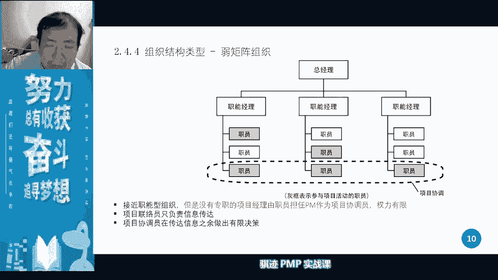

注意平衡性矩阵有什么特点，大家可以看到，平衡性矩阵的特点是，我们第一次有了什么专业的项目经理，那么意味着这个人只管项目，除了项目之外，他不管其他的啊，因为我们项目多了，而且项目越来越重要了。

这个时候我们当然找一个专人去专管了，让他专心去做这个事情，那么这个人呢就有专职的项目经理，但是大家看这个人在屁股坐在哪里啊，啊屁股在哪里，坐在职能部门下面，所以它其实是向职能经理去汇报会吧。

但他可能是有可能有些公司里面的项目经理，地位比较高一点，但是呢他总的来说是隶属于一个职能部门的啊，他的专业化程度很高对吧，然后能够管大型的项目，这时候呢一个组织可能会有一个。

有些大型的项目由某个职能部门牵头，然后呢有职能部门内的专业的项目经理，作为项目经理啊，职业的全职的项目经理做项目经理，去跨部门协调一些大型的项目，但是呢它的局限性是什么，项目经理并不彻底掌握资源。

并不彻底的掌握资源，他要跨部门协调呢，要比职员矿工协调肯定多一点，因为他毕竟有这个抬头嘛对吧，但是呢依然和别的职能部门去商量啊，能不能借我这个人用两天，那个人能不能用两天吧，会有这样的情啊。

好歹但是好歹人家是专业的对吧，不一定全权掌握项目资金，但是呢和项目，项目经理呢和职能经理的权责基本是对的，所以一个公司如果它内部设有专职的，虽然在职目前是有专职的项目经理的话。

他要把这个项目经理地位不会很低的，但是他因为在职能部门下面，但是依然受到部门的限制对吧，我就这样的情况，但是管理的专业化水平高了，专业化程度水平高了，能够管大型的项目对吧，所以这个时候组织是不是对项目。

重视程度越来越高了，依赖程度也越来越高了，然后有所有的有越来越多这样优秀的，像小王这样考过了pb证，现在开始专职做项目的项目经理之后呢，企业发展的更好了，然后像小王这样的人越来越多了，然后企业觉得什么。

我们既然已经做到这个程度了，那么我们是不是应该把这些给优秀的项目经理，集中起来进行管理，给他们更好的支持，让企业做更好的发展呢，嗯yes yes，we do对吧，然后我们就进入了下一个形态。

企业非常的重视和依赖项目管理，好有位同学说跟书上的不一样，和和你们的讲义不一样，但是你们以我的为准就可以了，好吧，以我的为准，会啊，因为我的更容易理解一些啊。

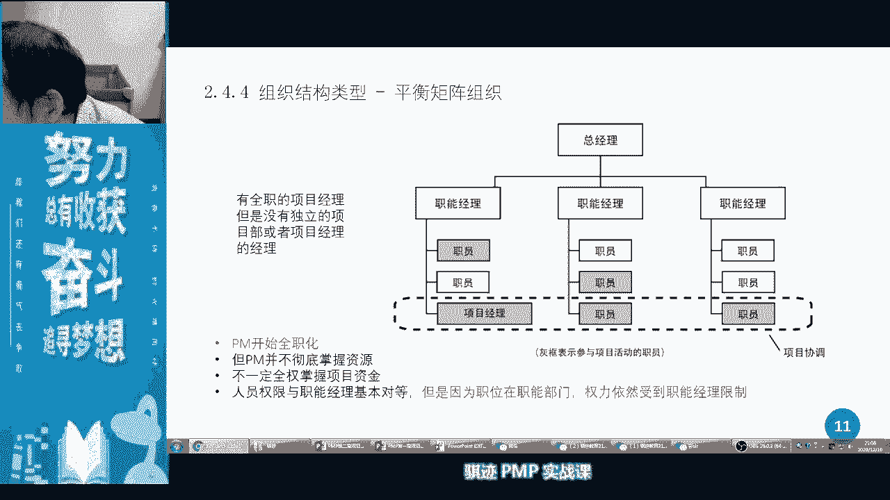

更容易理解，考试的话以我的为准，不会错好，那么就会进入一个强矩阵的状态，强矩阵状态进入强矩阵状态，大家看到特征是什么，很有意思，有项目经理的经理，我们一般称之为项目总监啊，是项目副总啊，诸如此类。

反正项目经理开始从部门职能部门当中拖出来，那么项目经理从职能部门当中脱出，有什么好处呢，有什么好处，他就不在一屁股，不在职能部门下面，那么他人屁股坐在哪里，是从哪里思考，我们都在项目部下面，项目总监。

项目副总下面，那么我们更多的从整个企业的项目，管理当中去考虑了，他的管理呢会更加专业，管理人家专业，然后呢不会因为在职能部门就偏向这个嘛，比如说我是我是it部的项目经理。

那么我做项目肯定更偏向于t一点对吧，我是呃市场部的项目经理，我的我做项目可能更偏于市场一点，不会有这种事情，他更多的偏偏向于什么，着重从全局，从公司的利益角度出发去管理项目，这是不是更专业更好啊。

对公司是不是更有利，所以这种情况下，企业当需要项目经理，因为企业对项目依赖程度已经很高，项目可以直接决定企业的成败存亡的时候，那么我们就会把项目经理，从各个职能部门那拉出来抽出，然后成立一个项目部。

有一个项目总监，然后去做管理，所以大家可以看到会有一个项目经理经理，所谓的项目总监，项目副总也好，它下面有各个项目经理，但是他的特质是什么，项目经理下面有没有人，项目经理有没有人啊，没有人。

他的人呢还是在职能部门下面，职能部门下面，但是呢因为他是在项目经理经理下面，所以他不受职能部门的制约，所以他是它的本质上的权利，其实和职能经理是相同的，但是呢仍然要跟别人协商，他获取资源能力更强了。

所以等着组织大型的复杂的跨多部，跨多部门的一种项目啊，这种形式是非常好的，那么夸多部门非常好，那么这个时候我们来了，项目经理的职能经理权限相同，但是呢资源需要谈判，对吧啊，所以大家看清楚。

这是强矩阵的矩阵架构类型啊，考试很很喜欢哪几个图给你做辨析啊，这是强矩阵，那么这时候，项目已经对一个企业的存亡产生巨大影响，既然项目对我们公司这么重要，我们公司已经离不开项目，干脆我们公司改成项目制。

改改成项目，是这个时候呢我们就会有最后一种形态。

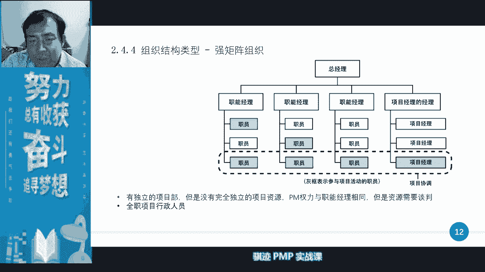

叫做项目型组织，项目经作者好，我们市场生活当中，经常会有项目型组织的这种组织方式啊，他会成立一家公司，这家公司的可能一个比较大的boss啊，或者是一个二boss 3 boss啊。

他肯定就会是一个项目经理，全权负责这个楼盘项目，当这个公司把这个楼盘开发完了，然后呢，这个项目经理呢可能到另外一个新开发楼盘呢，去担任项目经理，会是这样，那么项目型组织它会有什么特征啊，很明显。

项目经理现在头上连项目经的经历没有了，他的权利就更高了，对不对，而且最关心什么，我下面有人下面有人，我下面有人，下面有人用，很重要，他有完全的资源的调配权利，在有完全的资源的调配的权利的情况下。

他可以做很多的事情，可以做很多的事情，然后项目呢可以发挥出很大的作用和能量，那么企业这个时候完全依赖于项目生存，那么如果一个企业原来有职能部门呢，它的职能部门可能就被打散，纳入到项目当中去。

纳入到各个项目当中去，在项目经理手下干活，这个时候呢组织已经完全依赖项目，ok这就是一个组织，一个组织从完全不依赖项目，逐步逐步逐步演化到完全依赖项目生存，但是确实并不太多的企业。

行业类型是完全依照项目去生存的。

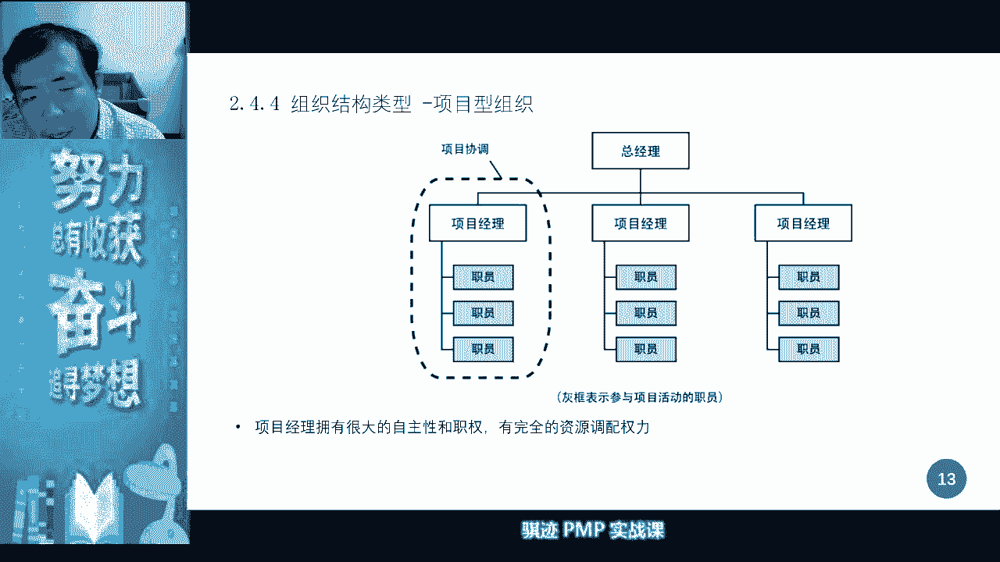

那么在这种情况下，有些组织呢觉得项目非常重要，有些组织觉得项目非常重要。

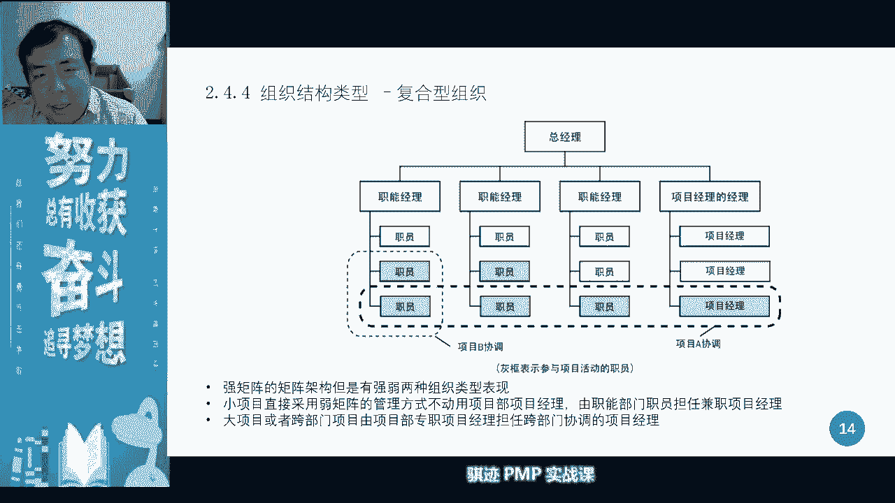

但是呢我又觉得呢完全依赖项目是生存的，又不太合理，那么它会采取什么方式呢，它会采取两种方式，第一种方式它会从项目型注意啊，但这是课外知识啊，它会从项目型倒退回什么。

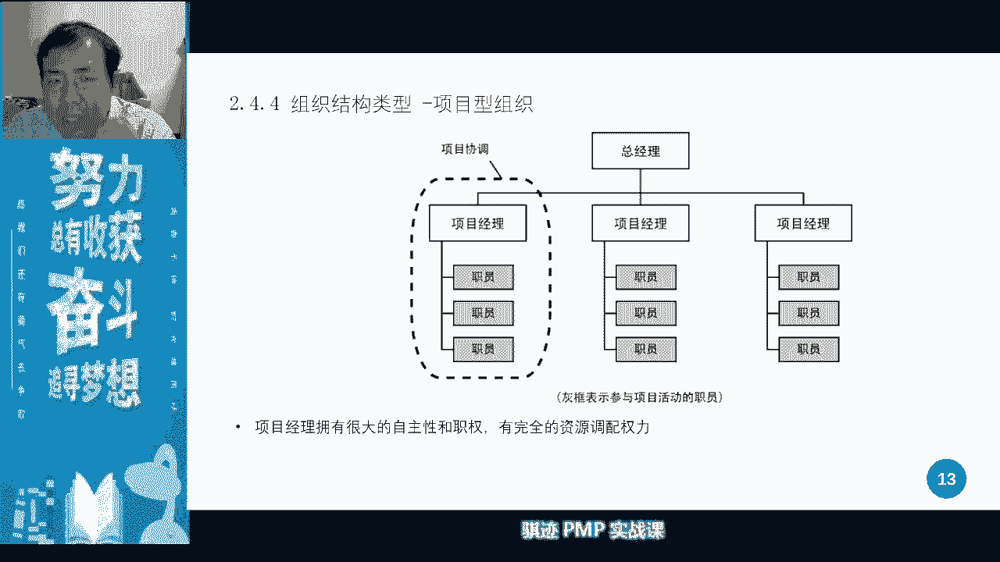

强举下，唉老实说你不是说对于这个东西不是往前进吗，我们对项目越来越重视，应该是往前进，怎么会倒退回来啊，你听我说这个时候呢，职能部门变成了什么专业的支持的职务吗，它不再是一个什么啊，直接去挣钱的。

所以倒退回强取这种组织类型的时候，项目项目经理他们是负责挣钱，他们项目其实下面也有人啊，他们你要知道他们项目也有人，职能部门下面呢也有人，但是职能部门更多的做什么呢，做服务支持，给项目部做服务支持。

比如说财务，我们讲如果一个项目部配一个财务，十个项目部就配十个财务，在全国大型的房产公司，比如万科啊，保利啊啊比如恒大，他们在全国有很多很多个楼盘，每个楼盘都不看，都做，要搞一个财务部。

是不是人力资源是很浪费的，那么他就会搞一个什么东西啊，现在很流行叫财务结算中心，财务结算中心，财务共享中心，他把这些人集中起来，给各个项目提供支持，它是个支持部门，不再是可是一个资源部门。

而不再是一个什么具体管理部门，它只提供支持，所以这时候职能经理可能是一个什么啊啊，财务共享中心的一个经理，然后呢，你项目当中有任何需要涉及到财务的时候呢，直接搞财务共享中心去进行结算。

那么我的项目部里就不用再安，单独安排一个财务啊，财务人员了，这个时候你会看到，有时候有可能一个公司里面的一个财务，财务部呢可能要啊，项目部呢每个项目呢可能要两三个财务对吧，如果项目很多的话。

一个公司可能要上百个财务，那我建立财务共享中心之后，可能只要二三十个或者334 十个，最多50几个，我可以减到一半的能力，达到同样的效果，还提高效率，何乐不为呢，这时企业依然非常依赖于我们的项目。

但是呢他利用这种支持形式倒退回强矩阵，对项目进行支持，这也是可以的，这是一种啊，这是一种，那么另外一种呢，我们在从强矩阵进行演化的时候呢，我们呢并不走完全的项目制，因为企业觉得啊确实觉得项目质量很。

项目很重要，但是呢我们企业确实呢，有时候依依靠日常经营来生存，完全依靠项目呢也不现实。

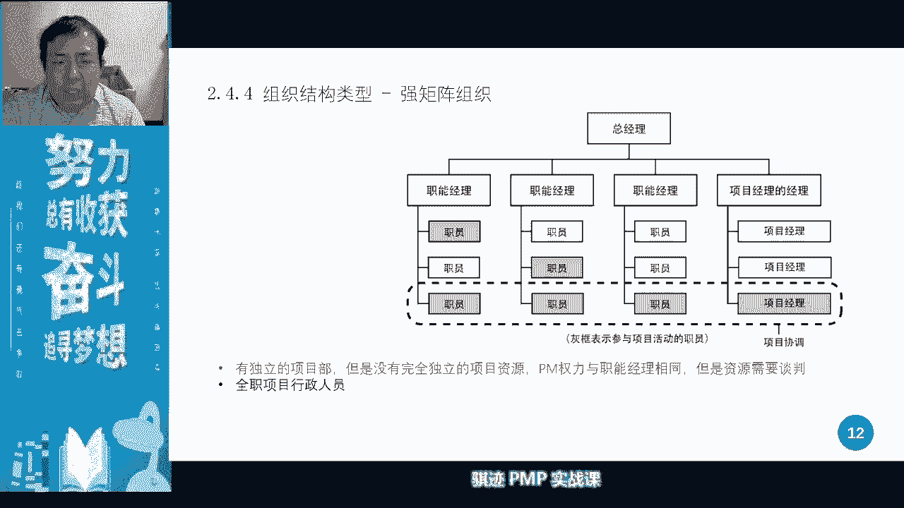

这时候呢我们企业会走一个什么东西啊，叫做复合型组织啊，注意考试是很喜欢考复合型组织的，我们原来的p p t当中没有这一页，所以如果有些同学对这个东西有感兴趣的，大家可以这里仔细看一下啊，仔细看一下。

但是这个肯定会考我们原来pp当中，因为是按照框架，有些东西有些落后，是按照第五版的框架是没有复合型组织的，但是第六版肯定是有复合型组织啊，注意这点会考，那么它就会有一个叫复合型组织。

复合型组织是什么意思呢，你看它的构架，我们先看复合性组织，它的构架是怎么样构架，有职能部门吗，有职能部门啊，有项目吗，你有项目部诶，这不是强矩阵吗，老师老师，你个大忽悠，这不是强矩阵吗。

ok对复合型组织的一个特点，就是它的组织构架是强矩阵的，但是你发觉这里多了个圈吗，诶有意思对，所以复合型组织，它的特征是会有强矩阵和弱矩阵两种表现，那么什么意思呢，啊实践当中就是意思什么意思呢。

当我们有些小项目的时候呢，我们就直接采取弱矩阵的管理方式，不动用项目部经理，因为项目部经理都是大爷对吧，他们都是管大项目的这种小case呢，你们直接自己关掉它，会不会动用项目部经理去管这些事情。

一般呢是部门内部的一些小项目，它有直接职员来进行什么管理，这种这种表现是不是一个弱局阵的表现，对不对，大家想一想，前面讲过弱矩阵吧，这是一种弱矩阵的表现，但是呢啊然后他有职能部门的职能。

职能部门的职员担任兼职的项目经理，但是呢如果要公司要搞大项目，我们要搞搞个大动作，那么他就会有项目部出专业的项目经理，进行跨部门的组织啊，一般大的项目都是要跨部门的对吧，搞啊跨部门的大组织。

这时候有项目部来出，这时候他也表现出一个什么东西啊，这是不是一个强矩阵的表现，对不对，所以复合型组织我给大家总结一下，就是说强矩阵的组织构架，但是有强弱矩阵两种表现形式啊，这里的写在这里，强矩阵的构架。

强弱矩阵两种组织的表现形式，所以当你考试当中如果有这样一个表现的话，复合型组，好所以考试的时候千万不要遗漏这个，因为这是第六版增加的啊，我们的p p d o没有啊，ok啊呃大家学到这里是不是都跟上我了。

然后如果嗯都清楚的话，大家在可以在公屏里打一个get gt的get，来个明白get，或者还有不清楚的可以在公屏里跟我说一下，然后我会把这个全部过一遍，因为项目的组织结构架构考试肯定会考。

但是呢不会考很多，一般就是一分啊，这是又是一分，啊我看一下有多少同学get了get，嗯参与过的同学还不够多啊，我看到很多get是我很开心啊，但是我们有600多位同学，然后没有几个get对吧，ok啊。

我希望所有的同学，都应该参与到我们上课的互动中来，你不仅仅是在看个直播，所以有些同学大家可能比较忙，或者有什么事情，有些同学是这样抱着玩对吧，那吃着饭可能打字不方便，但是你的脑子必须在这里啊。

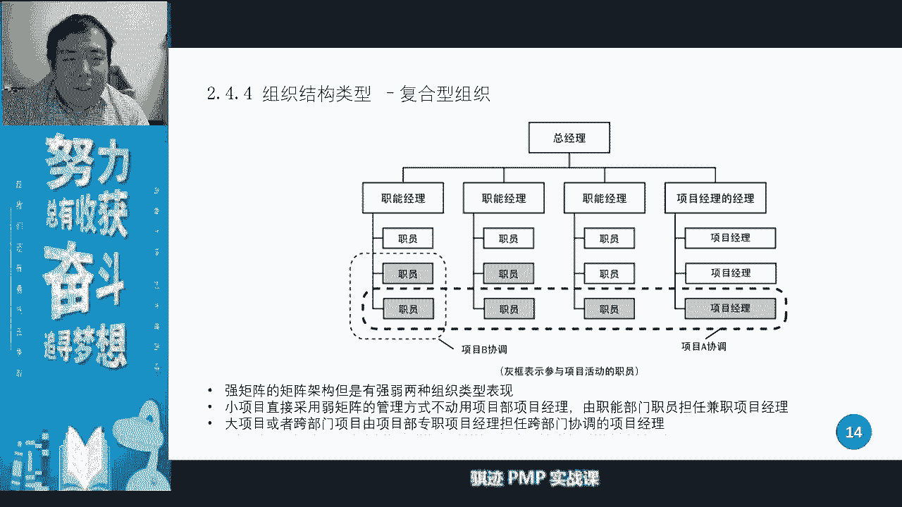

好ok可以跟上了，再过一遍啊，有些同学说再过一遍，再给我表啊，第一种组织完全不依靠项目生存，我先不看项目生存，那么这个时候呢组织会使用智能型，职能型的特征是什么啊，我们现在只讲特征了啊。

只会针对考试讲特征，我们的特征是职能经理担任项目经理，第一点职能经理担任项目经理，第二点有可能会有兼职的项目协调员，由职员担任，职员担任特征是什么呢啊职能经理的精力有限，所以不可能管很多项目。

跨部门协调，大家也比较困难，而兼职的项目协调员来又几乎没有权利，所以一般只能搞数量很少的小项目啊，这是职能型项目的组织特征，ok get了吗，ok啊，如果你们，如果你们对下面的文字觉得有帮助的话。

等会我在课后把ppt给你们分享一下啊。

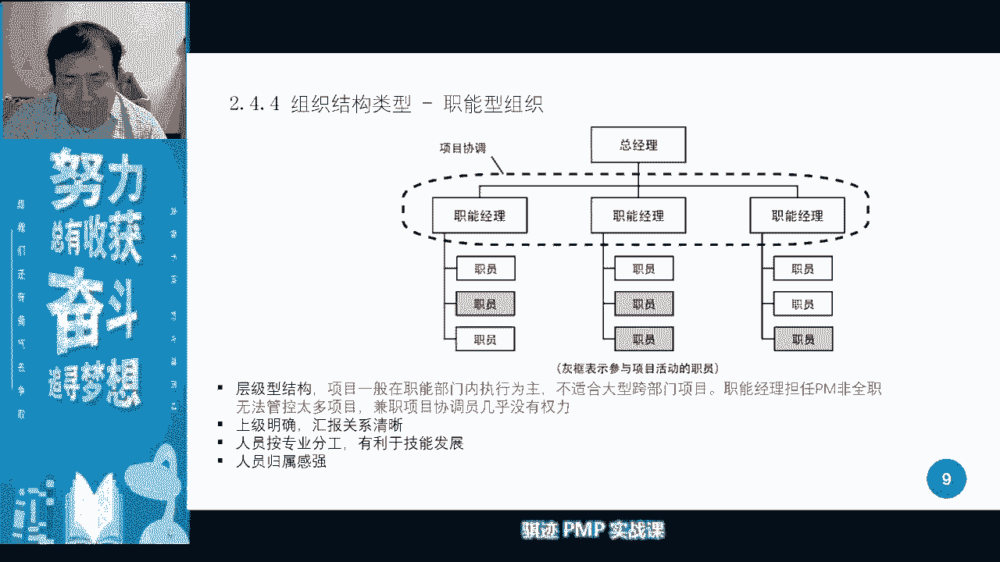

这是第一种，第二种呢是弱矩阵，弱矩阵呢依然是和职能性一样的构架，是没有项目部的对吧，只能职能型也是没有项目部的，入职的也没有项目部，因为面对很多的项目难以管理，所以他就把我们的项目呢交给职员去管。

职员作为项目兼职的项目经理，或者叫做项目协调员去管理项目，那么他们的权利呢非常有限啊，有限跨部门的协调呢比较困难，只能做出有限的决策，一般呢只能做一些小项目，一般大家只能做些小项目。

但是呢他因为职员数量比较多，所以可以管理诸多个项目，它可以解决一个数量问题，这是弱矩阵，弱矩阵，弱矩阵当中没有专业的项目经理啊，这是一个它的特征，但是又有职员去担任项目签。

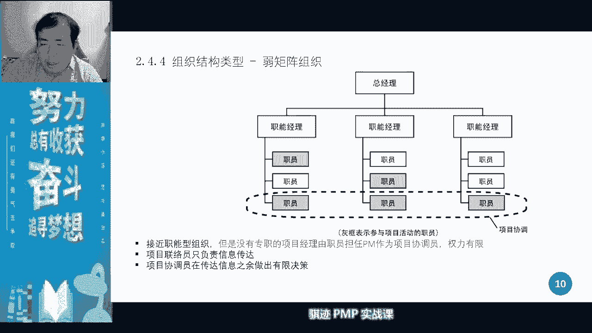

那么这是弱举债，什么时候开始出现专业的项目经理啊，平衡型矩阵，平衡型矩阵，强矩阵，项目型和复合型的组织，这几这四种类型呢是有专业的项目经理的，这时候从平衡型矩阵开始，我们就出现了专职的项目经理。

专职的项目经理管什么专业管项目，它可以管比较复杂的大的项目，但他是他人在哪里啊，在职能部门之下，他的职能经理之下，他有一定的权利，但是呢依然受到职能部门的制约啊，屁股坐在职能部门下面，有一定这种制约。

这是它的特点，但是呢他管理项目呢可以管理比较大的项目啊，大的项目有专业的知识技能，这是平衡型的矩阵的一个特点啊，构架依然是职能型的构架，没有项目补，注意没有项目补啊，但是项目经理呢全职化专业化的啊。

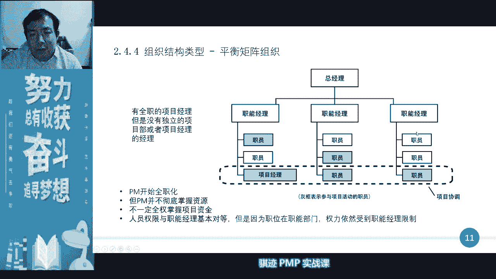

这是平衡性矩阵，那么平衡性矩阵之后呢是强矩阵，强矩阵是什么特征啊，它的最大特征是什么，有项目部了，有项目经理经理，我们就称之为项目总监或者项目副总，全权管理各个专业项目经理。

然后有专业的项目经理来去带动各个项目，项目经理呢有没有资源啊，没有直接资源，项目经理的资源呢从职能部门里去要，不听命于职能经理和职能经理一般是平级的，所以呢他们的权力会比较大，然后依然呢。

但是值资源呢依然要和职能部门去商量，但是他的权力会大一点啊，来点这是强矩阵。

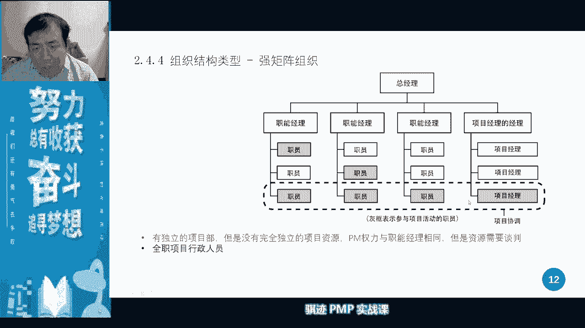

当当当当强矩阵的时候呢，公司已经非常依赖项目去生存了啊，那么最后一种呢是公司完全依赖项目生存，那么就是项目型，项目型的特征呢是没有职能部门的，是没有职能部门，所有的人职员在哪里啊，在项目经理手下。

项目经理有很大的权利和自主性，能够完全的调配资源去做事情啊，项目经理，这时候项目型也没有项目部，而是直接每个项目经理，项目是项目总啊，不准叫项目管家，我就这样，所以这个时候项目经理其实已经升格了升格了。

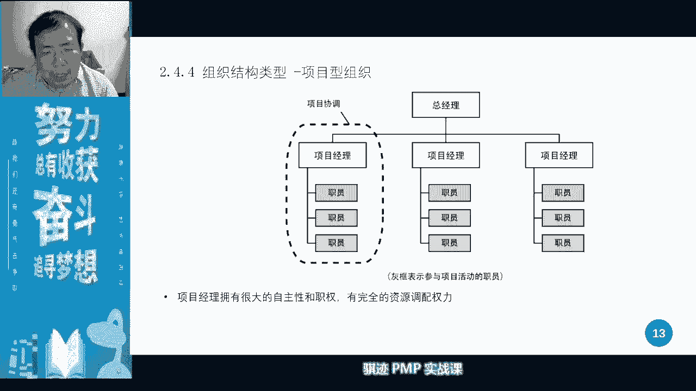

这是我们的项目型组织，那么在项目型组织之后呢，我们还会有一种比较特别的啊，第六版新增加了叫做复合型组织，复合型组织呢，它的组织架构呢和我们的强矩阵呢是一样的啊，项目部下面面归属于所有的项目经理。

然后职能部门呢提供资源，但是呢他会有强取证和弱矩阵两种特性，当做一些小的项目的时候呢，它有强弱矩阵两种表现特性，那么当做一些小项目的时候呢，我们不动用项目部的啊，项目经理，专业项目经理。

还有职能部门呢自己出职员，当兼职的项目经理，把项目也做了，一般是小项目部门类项目，当做到大的跨部门的项目的时候呢，我们就动用项目部的专业的项目经理，去进行指挥和指导，所以他有强弱两种矩阵表现，明白了吧。

强矩阵的配置构架，但是有强弱矩阵两种表现，这就是复合型组织啊，考试主要就考这几种，我们现在又复述了一遍，不知道大家都明白了没有啊，都明白了没有呃，如果明白的话，我们就继续讲，如果个别的同学没有明白的话。

那么我们在课后再继续给大家做解释啊。

有些同学可能还会有疑惑，那么前面是我们讲的都是矩阵类型的，矩阵类型的，那么我们这里可以看一下，这是矩阵类型与其他类型的相比较啊，相比较，那么我们可以看到职能型，它有助于专业技能的培养。

但是呢项目经理呢几乎没有权利，这注意，这中间的项目经理往往是一个，我们的兼职的项目协调员，那么沟通呢比较复杂，沟通比较复杂，我们讲矩阵型肯定是有个人记在项目部里面做，又有在什么职能部门里面做。

所以呢要加要加强项目经理呢对资源的控制力，所以我们前面的表述当中，一直说项目经理对资源有什么样的控制能力，对吧，他屁股在哪里，项目型的项目经理权力很大，员工呢对项目忠诚沟通呢比较有效，但是缺点是什么。

资源使用率低，大家注意啊，资源使用率低，这是一个很大的特点，所以我们讲，为什么有些公司从项目模型又回到了枪局阵，就是要把那些利用率低的职员，整合到支持部门当中去啊，是什么呢，这时候举个例子，大家记得吗。

啊那个例子财务共享中心，it共享支持中心，对吧啊，诸如此类，然后呢缺乏归属感，不利于我们的专业技能的发展，这是各种，这是几个各种典型的经典的手机结构的特点，比较啊，ok啊希望大家这个这一章学过之后呢。

这个得要注意，这个考试肯定会考，肯定会考好，那么我们讲在我们的项目的组织当中呢。

会有一类很特殊的啊一个角色，这个角色呢叫做po啊，不知道你们公司有没有po啊，啊po po的英文全称叫做project management office啊，它是一个并非项目部啊，注意啊。

天猫不是项目部，但是有些公司呢将项目部和po的整合在节日，它并不是项目部pm，那是一个项目管理办公室，但是他其实做的更多的事情是项目治理啊，所以这是一个中文翻译的问题，注意po更多的作者是一个项目治理。

作为判断货物，它会有个适应追责啊，它所以很多人问啊，老师po是干什么的啊，po和一个p猫project manager office和一个project manager，他们到底有什么区别。

ok啊我跟你听，我跟你们玩玩道来，首先项目经理的目标是什么，项目经理目标肯定不是肯定不是没有蛀牙对吧，我们的目标肯定不是没有蛀牙啊，项目经理的目标是项目成功，这是毫无疑问的对吧，po的目标是什么。

是项目管理的妥当和项目支持的得当，以及项目的健康程度这些东西啊，所以po更注重的是什么，不是结果，而是什么，它的支持管理和规范这些东西，它更倾向于governance，更倾向。

但是他有一部分是management，但是他不直接对结果负责，po更喜欢过程透明，可控有序啊，这是po的角色，而我们的pm的角色呢更多是什么啊，希望是management successful啊。

管理成功，东西交付客户满意啊，组织挣钱皆大欢喜，这是po和pm的一个本质区别啊，本质区别，所以有时候po和pm是会打架的嗯，所以有些组织当中为了避免打架怎么办呢，他就没有项目部。

他把项目经理的放到po下面，听从po的管理，将po本来是一个项目管理办公室，这角色变成了一个项目部角色，它既带有组织架构的治理，我们前面讲o p m这种治理角色，又带有项目管理的角色，双重角色啊。

会有这样的特征好，那么这是我们讲的一个我们辨析区别，所以考试当中pm和po的区别呢是会考到的啊，注意是有可能会考到，那么讲pm一般分为三种类型，注意pm只有三种类型啊，不存在混合型，注意pm只有三种类。

第一种叫知识型啊，第一种知识性，这个叫做就相当于叫基本款啊，啊我们这里很多同学买车了的，或者想买车或者即将买车对吧，买车车里面有个叫基础款啊，就是什么配置都没有的，叫基础款啊，我们也可以有。

有时候也叫俗话就叫叫啊入门款入门款入门款，所以po都有一个入门款，叫做担当顾问的角色，强调要求，项目经理一定要采用统一格式的报告模板，你可以高考，那看的东西，是不是所有的项目报告的格式是不是应该一样。

去看各种各样不同的格式，对不对，有这样一个特点啊，所以它会提供模板供你参考，然后提供最佳实践，比如说你要做一个i t项目，i t软件开发项目，它可以提供给你个时间。

我们建议呢这个项目呢采取适应型叫敏捷型啊，我们可能占据一个传统的工业开发的项目，那么我可能采取的是预测性，有可能我们采取，我们是面对一个市场剧烈变化的一个项目，然后呢我们可能是要做手机，那么可能是什么。

用迭代器对吧，是这样的类型，所以它会提供最佳实践，然后提供一定的培训给项目经理啊，项目团队成员一定的管理，团队成员一定的培训，以及来自其他项目的经验教训，这个经验教训注意啊。

大家注意这个经验教训就是什么，就是我们的前面讲的叫而组织过程资产，做的过程资产，所以组织过程资产在项目和项目之间传递，是通过谁来传递的，是通主要是通过pm来传递啊，我可以把它打在，组织过程资产。

尤其是经验教训总结是主要是，应该说主要是通过po在不同项目之间传，这主要是从，所以所以当你在完成一个项目加总结经验，做完结报告的时候，你的这个报告有一份一定要给谁，一定要给pm啊，注意啊，这个是归档。

这是归档，明白了吗，所以pm也负责历史经验和归档，这这份工作天猫还有一个什么角色呢，有一次考试考题考到了啊，就是说我们项目经理需要寻找资源，那么资源从何而来，屏幕会提供资源吗，pm不会直接注意。

不会直接提供资源，但是它会提供资源的来源，为什么po能提供直接的，因为po可以从历史的经验当中去找啊，以前这个类似的项目使用过哪些资源，这个资源现在处于哪里啊，比如这个人已经离职了，那就找不到了啊。

这个人正在某个部门里面做，他曾做类似的东西，那么你可以通过pmo的咨询的方式，顾问的方式去找到合适的资源，来支持和为你的项目工作，所以p o p猫会间接的提供资源，直接的提供资源的来源来支持项目。

所以它是支持性，所以他对项目的控制程度很低啊，相当于给你做顾问，你听不听，你不听也行，只要你管好项目，他没关系，所以这时候这种po一般是在很多企业当中呢，是啊是一个支持性的部门啊。

他不是想受阅权力比较低，但是这是所有po注意啊，这一点很重要，这是所有po都会有的一个角色，所以无论是什么样的po，只要你的组织当中有po，那么他一定会有什么东西啊，会有知识性这样的职能啊，答疑解惑。

提供模板，提供培训和提供实践给给你组织经验，而组织过程资产经验教训总结给你资源来源，对这些角色都是pm有的，所以当一个项目经理，不知道从哪里获取知识和信息的时候。

你可以知道pm这是所有的屏幕都应该有的啊，如果他拒绝，如果你可以拿今天上课的方面说啊，这p课讲的不信你去找p m p啊，不是不信你去找pmi啊，ok因为pm也要遵循pm的管理，也要遵循pm bo。

好那么第二种来了，第二种叫做支持加治理，叫做控制型，我们第一种叫做支持性，第二种叫做控制型，控制型实际就是什么支持加治理，它不但提供支持，还要从要求手，通过各种手段要求项目服从，什么叫项目服从呢。

你要遵守，要有强有强制手段，要求遵守我的各种p猫制定的，或者p猫从组织那里拿来的各种规章制度，规章制度，比如说它是什么呢，他会说我给你颁布了1234567，去掉徽章制度。

那么我可以通过什么定期的对项目进行，项目审计的方式，看你是否遵守的规章制度，如果没有遵守，就会对你采取一定的措施，比如说接管项目，终止项目，控制项目或者是取消项目注入材料啊，这个这种类型的叫做控制性。

它不直接干涉你做该做什么，不该做什么，但是他会用组织的政策框架来进行，对你进行指导和叫做指导帮助，这种叫做控制型，那么它对于项目的控制程度的中等中等，所以在控制性当中呢，po最喜欢做的事情嘛。

对项目进行审计和对项目来进行定期的审查，那么控制型的pmo呢，它一般有一定的组织授权，有一定的组织授权，所以他会定期找各个项目经理开会啊，然后你汇报一下工作，然后呢要求你呢啊对于他察觉到了。

有些问题呢给出一个合理的解释，但是他不会直接要求你啊，按照他认为的什么方式做，这是不符合他的权限范围的，注意这叫控制性，它的特点特征就是支持加治理，这是第二第三种呢啊，有一些行业会采用它叫指令型。

这种类型的po就直接去下达指令，直接去会可以项目去下达指令啊，那么这种类型为什么po变成直接下达指令呢，是因为一般采取这样形式的po呢，它的行业会有个特点，就是什么高资本投入，高风险，他经验呢比较宝贵。

会有这样的，一般会有这样的特征，在这样的特征下面呢，每一个项目经理的出现的问题，都有可能对组织造成巨大的影响，但是我们对于一个大比较大的组织来说，有可能不足以有大量的足够经验的经验，这个时候呢。

我们削弱项目经理的很大一部分工作的权限，把它归纳归入到有丰富经验的实践经验，丰富经验的是我们所谓说是老师傅的，那个po的手中，让他们对项目来进行下大线条的指令啊，大线条。

所以指令性他所谓下的指令并不是说具体啊，就是张三，你明天去干什么，李四女呢，她不是像这种指令，他是下什么指令啊，他说某件事情应该按照某方法去做，这个方法线条总框架是这样的，然后呢。

你项目经理呢具体去安排一些细节性的东西，项目经理变成了一个什么呃，类似于下项目助理或者讲项目协调员或者跑腿，那那说那两天就跑腿啊啊，这个时候呢，项目经理对于项目的细节仍然是有控制权的。

但是对于项目的整体把控呢，整体把控权呢没有是没有的，是上交给了我们的指令型的pm，是这样，所以它具有支持加治理加管理，采用这样的方式对pm的要求非常高，但是同样的这种组织也很难承受得起什么样呢。

因为项目失败所导致的巨大损失，所以他需要用这种呢pm，对项目进行最严格的把控，将经验呢最大程度的可能呢，分享到各个项目当中去，所以这样的项目这样的pm会在哪些行业有的，比如说像制药行业。

比如制药行业里面很多的像研发新药啊，这样他们就会用这样的啊天猫，比如像啊，或者是一些重装备制造的一种制造企业，也可能使用这样的pm，它们的特征都是投入非常巨大，项目一旦一旦失败。

会对组织造成巨大的冲击影响，这个时候呢是使用po的指令型的，会更好的把控整体的全局风险，是这样，那么这是pm的三种不同类型，大家都听明白了没有呃，我给大家留一点点的时间，然后大家如果没有听明白的呢。

啊在大家在公屏上打一个听明白了，如果没有明白，大家可以问我，关于这部分问我哪里没有听明白啊，我等一会儿大家，ok啊有些东西ok嗯明白了get明白，ok啊啊今天好像明白了同学挺多的啊，蛮好啊。

我讲的慢一点啊，但是今天的内容比较少啊，明白的同学很多啊，不明白的同学大家可以在公屏里啊，有些同学说老师啊，项目经理算不算po成员，ok这个问题的话是取决于组织的架构，有些我们已经讲。

有些公司当中将项目部归入在po下面，那么po是属于啊，pm是属于po的一个成员的，有些时候是不隶属于的，那么他们是分开的两个机构，啊p有些同学问po有没有权利去在控制型当中，当时有。

如果他对项目的审计发掘和审计和治理过程中，发现项目经理不称职，那么他们就有证据可以证明，这个项目经理不适合这个项目，支持性不行啊，知识行不行，项目不符算不上po，那么要取决于什么，除去项目部。

更多的是一个职能部门，它是只是管理项目那个部门，pm除了管理项目，还要管理知识，管理最佳实践啊，管理的治理过程啊，这当时有现在越来越多的组织项目部和po呢，职权职能呢越来越回想，越来越混响，那么其实说。

啊其实说有些时候项目有些公司是没有项目，为什么他们使用的矩阵，他们使用的组织架构当中，是使用平衡型矩阵的架构，项目经理是在职能部门里面的，他不属于项目部，也所以就没有项目。

但是他们会有个po去支持那些项目经理，或者去控制那些项目经理啊，会有这样的情况，啊有些东西说pm和pm的区别再讲一遍，嗯我们这样讲吧啊，ok项目经理工作的驱动力和目标是什么。

为了结果项目的可交付成果被呃客户验收，被相关方验收，项目取得成功，为组织挣钱，为组织取得利益，有行利，无形利益啊，这是项目经理的目标，目的是这个天猫的目的，并不是项目的个别项目的成功。

而是整体项目的管理的管理水平，管理水平，它的管理水平体现在能不能符合最佳实践，能不能持续改进，能不能有效地利用，合理利用组织资源啊，能不能在符合组织的规范，他从这些角度去看管理项目，管理项目就是这样。

所以他不并不关心项目到底成不成功，项目失败了和po也没有直接的关系，项目成功了也合性变不了，它只关心你的过程是不是受控，是不是合理，是这样，不知道大家听明白没有，他们的驱动力和工作的驱动力。

和他们的目标是不一样的，这是po和pm的区别，所以有些项目经理，他们从项目经理角色转成po的角色的时候，他们呢会有一些定位偏差，他们仍然会去管过多的结果事物啊，忽略过程失误啊，这就是个角色转变。

所以pm和pm在很多的企业里面啊，认知是有会有些模糊，但是如果你的pm，如果你的pm pm啊，a project manager office，你这个office本身是指令型的话。

那么其实他们的最终结果，驱动方向还是一致的啊，但是前面两种知识性和控制性，他们的啊驱动方向是不一致的，他们的工作驱动力是不一致，是不是有很多项目的组织才会设计比我们，当然啦po也是要还钱的呀，对不对。

如果我们的公司项目很少，我们为什么设一个po呢对吧，一般会有一定的项目量的，公司才会考虑设一个po去对整个项目做支持，所以当然肯定会有一定的项目量呢，对吧啊，这位同学大家问的也很好啊。

指令性的项目经理和职能经理有什么区别，ok啊，如果一个项目它是指令型，如果一个国项目它是指令型的，上面是指令性的pm的时候，那么它的职能部门就是纯提供人的，纯提供人啊，那么这种情况下，项目经理是跑腿的。

职能职能经理呢是纯提供资源，整个项目都是听命于pm的智慧的，所以它会用在哪种项目的组织架构类型，最有可能就是我们的项目型，项目型或者是强举人，所以有时候不一定有职能经理，或者有时候有职能经理呢。

但是职能经理是主要是纯机工资源，他对项目的干涉能力很有限，会有这，啊有些人问呃，其他部门不support的项目经理怎么办，这在项目经理的沟通和管理技巧，个人决策当中会讲到啊，我在下周二的课程呢。

我会讲到，如果他不support，就展现你个人的魅力，你的影响力，你的领导力对吧，然后你的沟通能力知道吧，项目经理呢是在组织当中工作，也会受很多制约，就要靠你的很多人的软技能能力去。

就觉得当然如果这些都不行的话，那么你需要一个有钱有力支持你的爸爸，那个爸爸叫做发起人sponse，可以吗，好不知道回答你的问题没有，那么我们讲完这一段之后呢，我们呢今天呢主要课程就讲完了。

一定要带着脑子回答，谢谢啊，尤其是注意本周的题目当中的坑的数量更多了。

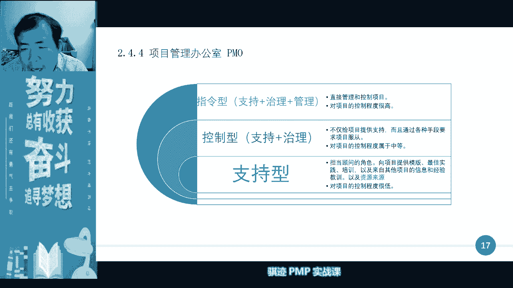

归档的第一其他项目中制定的项目管理计划啊，第二归档的本项目的相关方人员名单，第三项目公告网，项目，政府公告网站中有关本项目人员的核准名单，他们分别是什么，请作答，好同学们请回答。

请在我们的直播间里边公屏里面刷答案a啊，有些人就选a两个a还有吗啊，直播间的同学有一点注意啊，大家参加互动一定要积极踊跃啊，我们现在直播间呢在线人数有700多个人，但是我现在看到的答案数量和7万人相比。

比例还是比较小的啊，我希望大家好认真啊，好有一个同学勇敢的选择了c嗯，很好，我跟你说，不一定所有人都选的答案就一定是正确的啊，啊还有同学选d啊啊a占的比例比较高一点啊，又b那么a b c d都全了。

非常好，啊有很多a，好我再给大家几秒钟时间，我再给大家30秒时间好吧，啊想一想想一想，我们想一想，组织过程资产是什么定义，事业环境因素是什么定义啊，好a a b c6 看的多啊，以a以a为主啊。

以a为主，ok啊好啊，恭喜啊，大部分人还是对的啊，答案是a，第一道题，答案是a，好我来讲解一下啊，第一题答案是a，那么第一题的答案为什么是a呢，是第一其他项目中制定的管理计划，因为它是其他项目当中的。

那么本项目要使用肯定是从po那边去拿过来，对不对，他已经经过归档了，它是一种组织的知识库当中的东西啊，组织过程资产，所以他很显然是组织过程资产，所以我们上来就可以把c排除掉啊，c排除掉，那么看第二个故。

经过归档的本项目相关人员名单，那么我为什么提归档的呢，是说明肯定本项目已经结束了对吧，项目结束资料交给po，所以他也变成了一个什么诅咒人，自然好处是什么呢，进行借鉴啊。

如果这道题目我把归归档的这三个字去掉了，那么这个东西既不是组织过程资产，也不是税环境，它是本项目当中的一部分资料啊，因为它没有被归打注意啊，当然这个呢卡的稍微略微细，那你要明白这个概念，第三个。

政府公告网站上有关本项目的人员核准名单，那么政府网站上的信息，他核准哪些人，不核准哪些人，我们项目能不能影响，当然是不能影响，所以它是什么样的事业环境因素，它是事业环境因素，对他是什么样的事情。

它是外部的事业环境因素啊，注意外部的事业环境因素，那么如果他要是内部的适应环境因素怎么改呢，如果他是内部事业环境因素的话，那就是公司公告的本项目的人员的核准名单，那么他就是个内部的事业环境因素对吧。

因为公司或者是政府决定了你能用哪些人，这些东西能你能改吗，不能改，你要服从上级对吧，啊有些同学说啊啊其他项目是其他公司的，对吧啊，同学啊，注意这个提示里面不要这么钻牛角尖啊，我的abcd就没有一个选了。

对不对，偏p m p的考试有个特点是a b c d，答案肯定会有一个答案是对的，所以如果你说这个是其他公司的项目中的，制定管理计划，那么a b c d4 档就没办法都选了对吧，他什么都不是。

那就没法选了，对不对，所以不会存在这个事情啊，ok好ok但是你的这个这个对于这个理解啊，上课我讲的东西你听进去，我我很我很开心啊，你把我上课的内容听进去，我很开心好，我们看一下，没问题的话。

我们进入下一题，下面说说明了啊，下面描述呃，项目管理办公室pmo除了哪个啊，我们po的描述当中哪个是错误的啊，注意除了考试当中，大家要注意p m p的考试有个特点，一定要注意关键字。

除了意思就是说什么其他的三个都是对的，这个是错的，所以这个其实就等于是什么，我们要找一个错的啊，所以考试的时候有一个技巧，如果有些同学比较粗心大意啊，注意考试有技巧把关键词圈出来啊，我给大家打一下。

好呀，po第一po关注项目规划实施，协调和组织母体和客户总体的目标的关，相关联的资金项目啊，第二po可以授权，成为每个项目初始阶段的决策人，第三批p猫参与项目人力资源的选择和在派遣，对吧。

第一项目和项目经理，项目pm和项目经理追寻相同的目标，并受相同的需求的驱动啊，我们上课前面刚刚讲过这道题应该选什么啊，这道题应该很明白了吧，他们不是情从相同的驱动去触发的。

所以一般默认情况下是不是相同啊，这当然这道题目呢，当然我要我要讲这道题目是要讲一个设定，如果没有说明pmo的类型，默认是支持行啊，这是考试的默认，这是考试默认，所以这道题目是告告告诉你们另外一个信息啊。

这道题目怎么怎么选，其实很简单选题，那么考试有个默认，如果没有告诉pm的类型，那它默认是支持性，啊所以d是正确的啊，第二道题是敌是正确的，ok能理解吗，没问题啊。

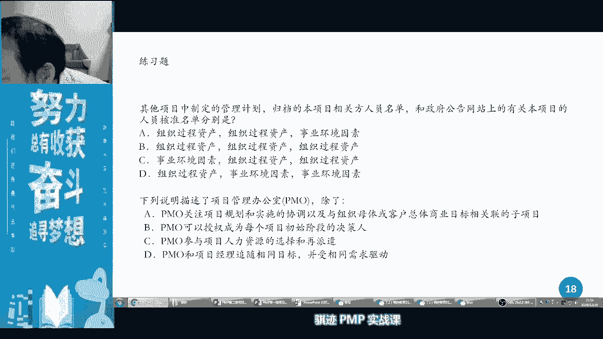

这刚刚讲过，这道题应该是比较简单的对吧啊，后面就开始难了啊，我们开始来了，好第三题，a大是一个新上任的项目经理，他对接收此项目呢感到缺乏了解，那么他不可以从以下哪个渠道，进一步了解项目的情况对啊。

进而难于其到了解项目的进一步情况啊，a咨询所在组织的pmb，与项目的客户和前任项目经理沟通，那么c翻阅项目章程和项目管理情况的，查找组织的组织过程，资产文档啊，那么第三道题目选什么，请作答，呃。

有同学在公屏里问你打的字在哪里看，我留在了公屏上，这公屏的内容应该啊，他们说是会保留的，互动当中是会保留的啊，大家可以在回看的时候再看到啊，微信群，那么我的微信群再打一遍吧，好吧，a b b。

ok啊我在我在两个微信群里都各打一遍啊，ok啊方便有些东西a b d要v或b，什么叫要v呢，没看懂啊，ok啊ok啊，还需要给你们点时间吗。

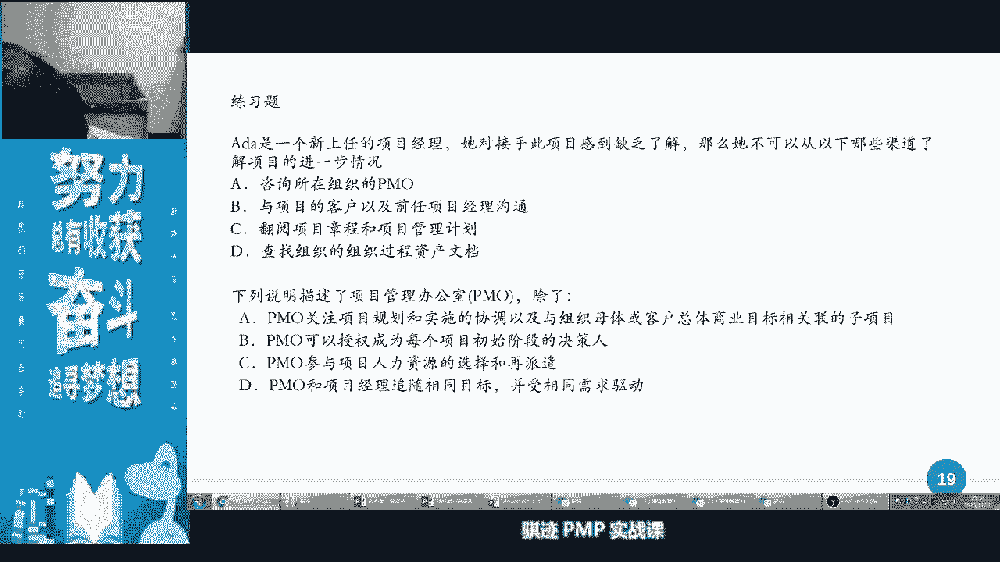

再给你们30秒啊，再给你们30秒，这道这道题型挺有意思啊，ok这里面所有的题目都是我出的，你们外面都搜不到啊，这些，动脑子想一想啊，动脑子想一想啊，题目都是带坑的啊，要么c要么皮啊。

有位同学说要么c要么比啊，考试能选两个答案吗，啊当然不行啊，考试只有唯一的答案啊，考试如果能选两个答案，通过率会大幅度降低啊，不定项选择题的难很多啊，所以你们还是希望考试只有一个答案会比较好。

ok啊我来回答吧，b属于从其他公司获取信息的，获取信息没有关系啊，我们说不能获取信息，要注意啊，使用在工作中，使用某个其他工组织的文档和获取信息，了解信息是两回事情啊。

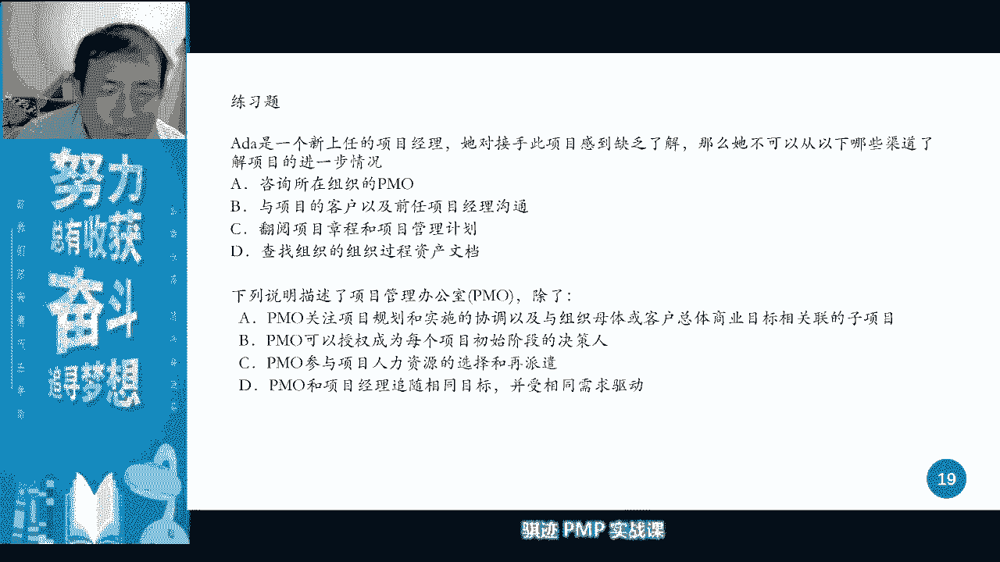

注意啊，所以这道题的答案，我知道看到大部分同学都是错的啊，这道第三题的答案其实应该是d，第一为什么听我说。

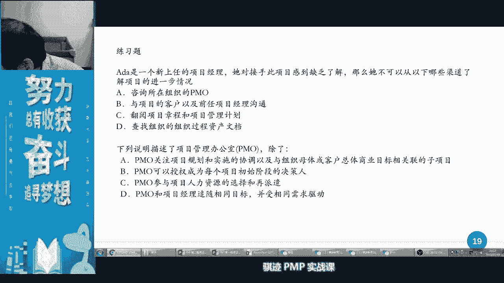

首先a对的吧，a肯定是对的，所在组织的pm，对于项目的支持管理是会有跟进的，所以他会知道当前项目的状态，或者是当前项目的，至少他会知道当前项目的初始状态是如何，他是可以知道的，所以它是可以咨询的。

对不对，ok所以a肯定是没有问题，b与项目的客户和前任，项目经理沟通也是可以的，为什么是可以的，项目经理当然是可以和客户和呃前任去沟通，了解这个情况了，虽然是非正式的。

但是我们并没有说是要正式的去了解对吧，他只是个人去了解对吧，所以从这个从于情于理都是可以，你说时间工作也是你去接手这个工作，你知道是不是坑，那你当然可以去问问前任为什么走了，他为什么是走。

他有可能是跳跳槽去一个更好的薪水，更高的地方，所以他没有挖坑给你，也有可能这个地方这个这个项目太坑了，他做不下去了，所以他把这个坑甩给你，对不对，所以你问他当然可知道啊，这个是没有问题的啊。

无论是时间和工作还是可以的对吧，他说新上任接手啊，那肯定没有结束呀，那么c翻查项目章程和项目管理计划，那当然是可以的，项目章程当中对项目有整体性的描述，和高所有高层次的信息，项目管理计划。

对项目有有所有的详细的规划和和定义，所以这两个东西是其实是最好的对吧，最好的啊，客观描述最好的，d为什么不可以，因为项目正在进行中，查找组织的组织过程，资产文档，项目很有可能还没有归档过。

所以它的组织过程资产是没有归档过的，这个时候他是查找的话，是有可能是找不到的，所以d是我们最差的一个答案，那么为什么有些同学说啊，我项目课是不是可以多阶段，每个阶段是不是也可能归档对项目，如果是多阶段。

每个阶段有可能是要阶段性的归档的，所以它是可以找到的，所以这道题目就是典型的pmi的四个都对的题目，那么从这个四个都对当中，我们讲d是所有四个答案当中最特殊化的例子，所以d是四个最正。

四个都正确答案当中最不正确的，所以应该选d，这是偏僻考试的一个特点，就是会有四个都正确的答案，或者有四个都不怎么正确的答案，要选择一个四个都正确，答案里边最不正确的或者四个都不正确。

答案里面最接近正确的那个答案，才是我们的答案啊，不知道大家明白了没有，c不是项目经理准备的资料吗，他如果有项目章程，项目管理计划，那么当然可以看了，我们又没有说他没有项目章程，那么它默认是有的呀。

ok啊有的同学要注意啊，p p里面要抠字眼，不要过于抠字眼，这个题目是有很微妙的东西的啊，ok我为什么要把题目做成这样，因为这个难度比较接近于考试难度比较接近啊，但不hao还没达到考试难度。

考试我考这道题目是偏简单的，前任项目经理如果离职了呢，那也可以问啊，没关系啊，问什么也可以问了，是一个新上任的项目经理，新上任接受此项目，说明之前有人啊，我的描述没问题吗，还是觉得c有问题啊。

c没问题啊，他可以放项目政治，项目管理计划没有问题啊，啊ok啊，所以这道题目，其实大家我要给大家传递的知识啊，信息点是什么，一做题目的时候不要认死理，第二做题目的时候，如果四个答案你觉得都是对的。

或者从理论上都讲得通的，选择一个条件最为苛刻才能讲得通的，那那个自动这个条件，这个答案可能是最最容易是错的啊，知道考试当中都是这样的，考试有时候会有四相，反过来会有四个答案都是错的，都不理想。

那么你只能选择一个最接近于理想的答案啊，就是考试当中比较恶心的东西啊，项目章程啊，项目章程是项目的开始呀，没有项目章程，项目怎么开始啊，他既然是个新上任的，之前已经有前任了，那么肯定这个项目已经开始。

那么肯定有项目章程了对吧，他查找组织的组织规定呢，说不一定这个项目经过归档案，你要知道他查找组织中，当时他查找组织的组织过程资产文档，他们说这个项目归档过，明白吧，啊自己去查看资料。

公司内部资料的人员没有啊，是所有的项目进行加上客户吗，ok不要过于钻牛角尖啊，模拟题做多了的话，你们就知道啊，不要过于钻牛角尖，pmp的考试如果过一段牛角尖，并算出来大部分答案都是错的，ok明白了。

我只是让你们体验一下考试的，有时候会有这种啊相对恶心一点的题目，是就是就是这么出的啊，就是这么出的，玫瑰档你是查不到的啊，对ok啊，就是这个意思，因为我如果把题目写得太清楚，查找组织当中哦。

如果我再把题目说项目没有被归档过，那么你们肯定知道d肯定是错的对吧，那个其实就没有对你们产生启发和锻炼意义的，我是故意的，明白吧，我是故意的啊，好我们做后面的第四道，下列说明了下列说明。

描述了项目管理办公室的职能，除了什么东西啊啊sorry呃sorry啊。

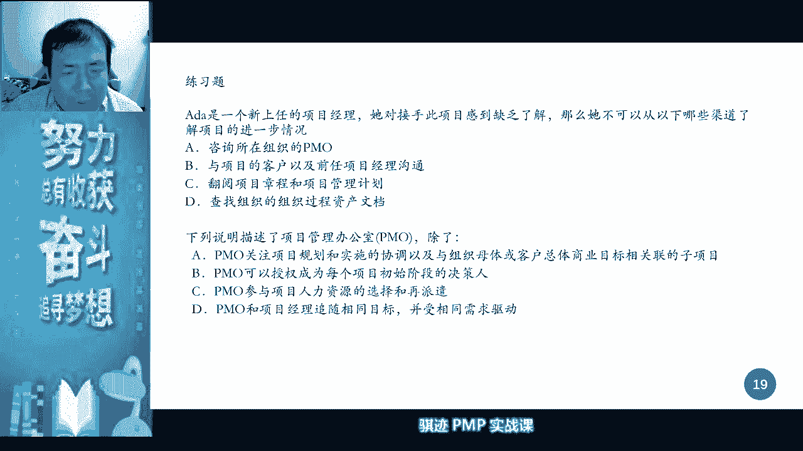

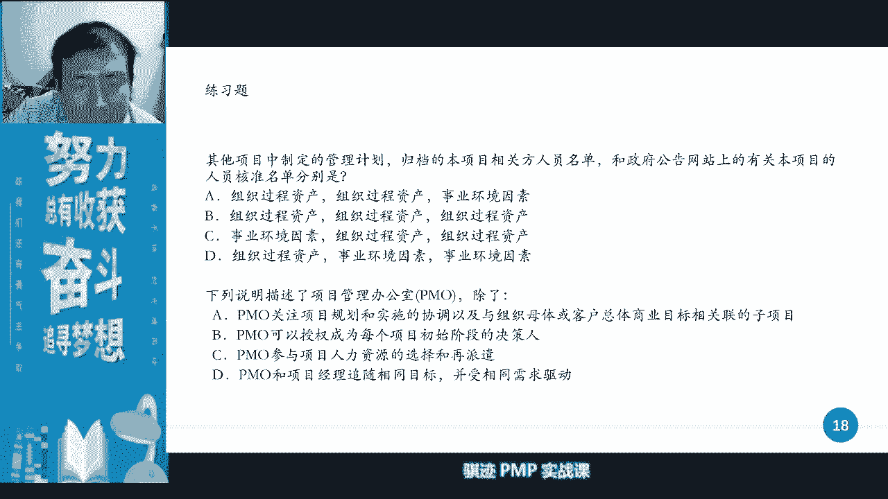

那么这道题目跳过去，不好意思，这道题目我贴错了啊。

这道题目重复了，不好意思，听错了啊，我出题目的时候，我先把题目出好。

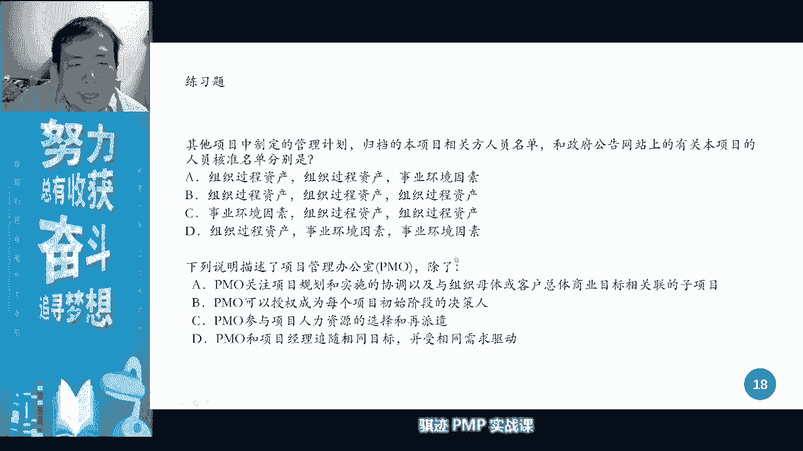

捏上去捏捏，重复了，我们做下面的这段是下面的啊，ok啊，我们做下面的，不好意思啊，那么下面的对于项目繁多，对组织影响较大，需要使用较多的项目环境，哪些项目矩阵比较适合，强矩阵b弱矩阵c项目型d复合型。

请作答，是不是我，我相信大部分认真回答了回答的同学啊，是不是都有疑惑，这道题目好搞啊是吧，到底哪个好纠结，是不是，ok啊我非常开心啊，终于有一个同学答答出了一个正确答案啊，正确答案啊。

那么因为时间的关系，我就不卖关子了，正确答案是a a c d啊，正确答案是a c d啊，哎老是个骗子，是不是老是个骗子，不是说都是单选吗，怎么会有怎么会有多选对吧，ok啊这是我故意的。

那么这道题第一我为什么要挖坑坑，你们是因为为了让你们看清楚所有资源，p m p里边考试考，现在越来考的越来越恶心了，所以像这种字眼一定要看清楚，字眼看清楚啊，像这种字眼看清楚我是故意写的。

其实这道题写哪个比较不适合，其实更好，直接选b就可以出来，我是故意的，啊那么为什么这个就是要让你们有纠结，如果凡是你，我就要当然答案不重要啊，重要是第一，如果你在选这道题目的时候纠结到底，纠结了半天。

到底是a还是c还是d，三个都纠结过了，哪怕你选一个，那么说明ok你今天的课程已经理解了啊，很重要的一个知识点啊，说明你已经理解了，纠结过对acd都是正确的，都是正确的啊，我是题目出故意挖坑的。

考试不会这么出，但是我是故意挖坑的，所以选单个同学k成功的被我挖了坑，但是很恭喜你们掌握了知识，对于第一个选出c的同学，我就表示恭喜啊，非常感谢这位同学，对他表示恭喜感谢啊，概念非常清晰，审题非常仔细。

如果你们考试当中每一道题目，就像这样仔细去审题，所以当然你前提肯定是单选啊，那么我相信你考试当中肯定会避免很多坑，这是我给你们的传递的信息，明白吧啊，这道题目是a c d。

但是这道题目的最好的除法是哪些项目，矩阵类型比较不适合，所以选b即可，但是我们这道题的答案是a c d，只要你在做这道题目的时候有过纠结，说明你今天的课程已经认真听过了，所以这是一道测试啊，门槛题。

看看你有没有今天好好测试过啊，所以我的题目当中是花样精百出啊的坑很多的，所以大家一定要跟着啊，ok非常好，我只看到一个呃，看到一个正确答案了，糟老头子坏的很哈哈套路，啊复合型和项目型也是矩阵类型。

也是也是啊，因为他们也是有矩阵图的嘛，这些，想撞墙哈哈哈，啊比较有参与感对吧，只是参与，ok啊，我们做下面的做下面的啊，讲第六道项目经理，杰瑞是一样是一名专项项目专职项目经理。

他真正在负责一个大型的项目，但是遇到的困难是呢，他的资源调配权力很有限，为此他不得不经常与上级的职能经理，来进行反馈，那么反问沟通，那么杰瑞所在的项目矩阵类型最有可能的是啊。

那么这个词关键词什么最有可能，所以它肯定只有一个答案最对吧，只有几个答案，所以这道题目不会有多选了啊啊ok啊，这老头子不会，这道题就不会在这挖坑挖，你们对吧，一坑挖两次就没有意义，ok最后一道题请作答。

好有同学选c，有同学选，有同学选d啊，有没有同学有a选a就全了啊，选a就全了，啊前面那道题目，a c d3 个大三个都是最适合的啊，所以前面到底是挖坑呀，我故意挖坑给你们考试是不会这么问的啊。

我故意挖坑，我是让你们纠结一下，我是故意让你们纠结考验你们，让你们自己考验自己有没有今天认真听啊，说句不该说的话，你比上个老师强太多啊，谢谢表扬，谢谢表扬啊，谢谢表扬啊，啊我们的直播间不能刷火箭啊。

否则你给我刷了十个八个超级火箭啊，谢谢谢谢，哎呦真的有选a的，好了啊，a b c d都全了对吧，ok啊我们就不动卖关子了，已经十点多了啊，这道题目首先我们要收集信息，偏偏考试当中有很多信息是给你提示。

第一项目经理杰瑞是一名专职的项目经理，ok下面四个类型当中，哪些类型是没有专职项目经理的，我们讲职能型有专职项目经理吗，没有对吧，专职的项目经理是没有的对吧，他们都是兼职的项目经理。

职员间的或者是职能经理兼的，所以a和c马上就被砍掉了，他正在负责负责一个大型的项目好，那么平衡型和强矩阵能不能，复旦大型项目是可以的，对吧是可以的，但是遇到的困难是呢，他的资源调配呢权力极为有限。

平衡型和强矩阵都有可能有，那么可能资源是有限的，但是平衡型更容易什么有限，对不对，所以他不得不与关键词上级职能经理反映，项目经理的职上级是谁啊，是项目经理的经理，所以题就不符合了。

所以这道题阅读到这里就可以得出结论，应该答案是比平衡型，第一他是一名专职的项目经理，可以负责大型的项目，但是呢他要与他的上级职能经理进行沟通，权限呢有限，所以它是平衡型最为恰当。

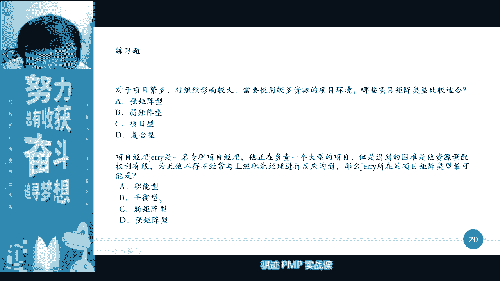

ok不知道你们明白了没有，腿。

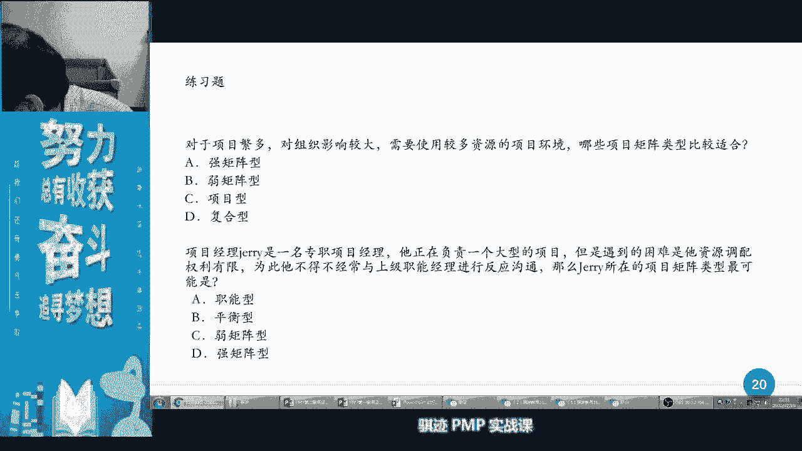

好ok啊，还有两道题哦，sorry，我后面好像又加了两道题啊，我们在那讲讲讲两道题吧，ok啊，我故意故意给你们挖点坑对吧，ok啊，后面的可能比较简单一点啊，在项目组织结构类型当中，对于矩阵性来说。

下面哪个是对其最突出的优点，a优点啊，注意是优点a双重汇报关系，b项目团队成员呢有家的感觉，c可以得到专业知识进行提高，比有利于提高资源利用率，你们选哪个啊，这道题目其实很简单啊，啊选d啊。

有同学选d还要选，还要选其他的吗，ok我们抓紧了，我们又拖了一会儿糖，对吧啊，哎都选d对吧，ok啊那就非常好，我们不太等太多时间了啊，答案就是d啊，答案就是d，ok啊，矩阵类型的特点是什么。

有利于提高资源使用率对吧，职言职职能型的有家的感觉对吧好，那么最后一道题目，又有一个同学最每一道题目都答对了，对吧好，最后一道题目啊，项目经理被授权自主招聘整个团队。

并可以从项目管理办公室来获得资源库和顾问，但是pm呢会对项目做做定期的财务风险，审计工作，并给出指导一点，那么这是哪种pmo的实力呀，a支持b控制，c指令d混合，是哪种，好啊，有位同学有两位同学啊。

比较伤我心啊，比较伤我心啊，pm的实力当中从来没有一种实力叫混合型，我讲没讲过混合型啊，这个很伤我心啊，最后结束的时候我心被伤了一下啊，没有混合型啊，啊对我是为了你们过对吧，压场压场，我是为了你们过。

就我来说，我觉得你们过才是我最大的收获和动力啊，ok ok啊，大部分同学还是选择对啊，最后答案是b最后答案是b啊，因为是什么题目是什么呢，题目是项目经理自主招聘，整个团队从po获取资源和顾问。

就是po所有po的基本类型叫支持型，但是po呢又可以做定期的财务审计工作，并给出指导意见，那么它就是控制性了对吧，但是po并不直接干涉项目经理的管理，所以它是一个什么中档的，我们的中档配置的叫做控制性。

所以选b好，ok ok啊好，那么今天的课程就到这里结束了，然后大家有个别有问题的话，我们在微信群里继续问好吧，好哦，有些东西还选还选a啊，大家要注意啊，因为有做定期的财务和风险审计工作。

所以他已经不是简单的a了啊，ok答案是，ok好，那么今天的今天的课程就到这里，谢谢大家，我们下周二见啊，今天因为没有什么计算题的内容，所以我就没有留课后作业，好吧好，那么就这样，大家拜拜来。

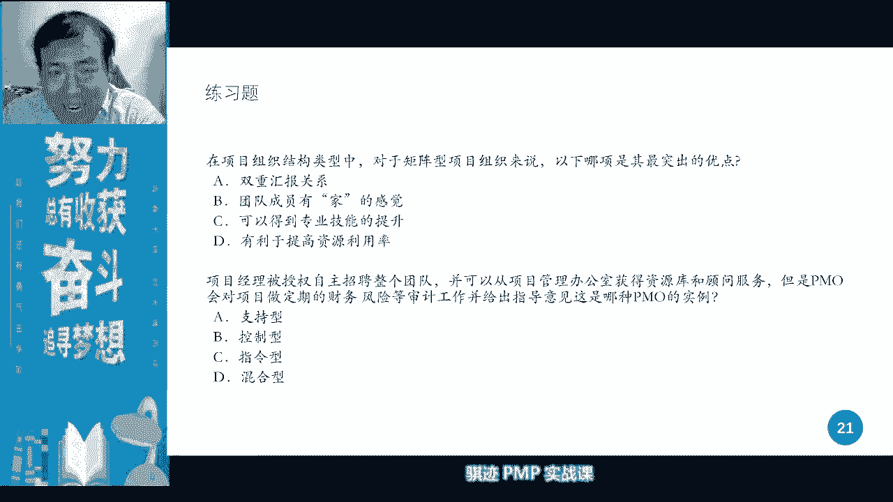