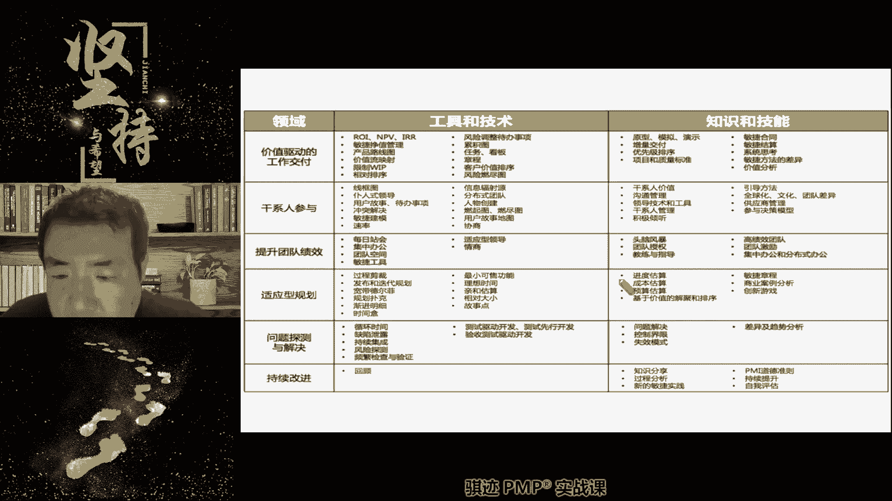
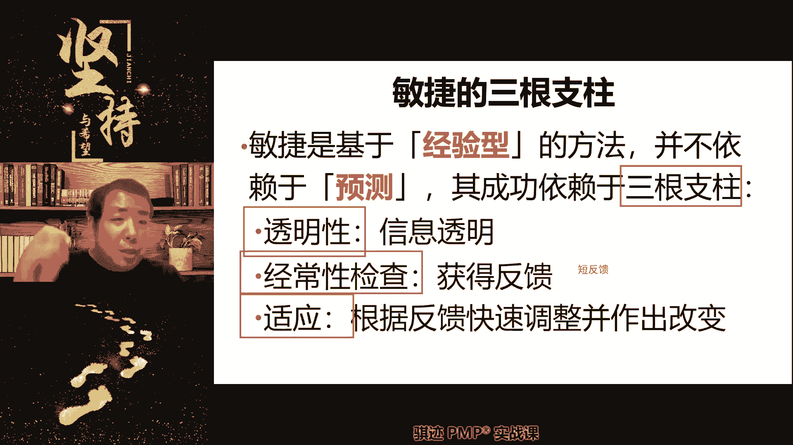
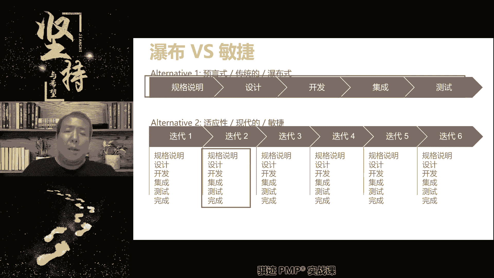
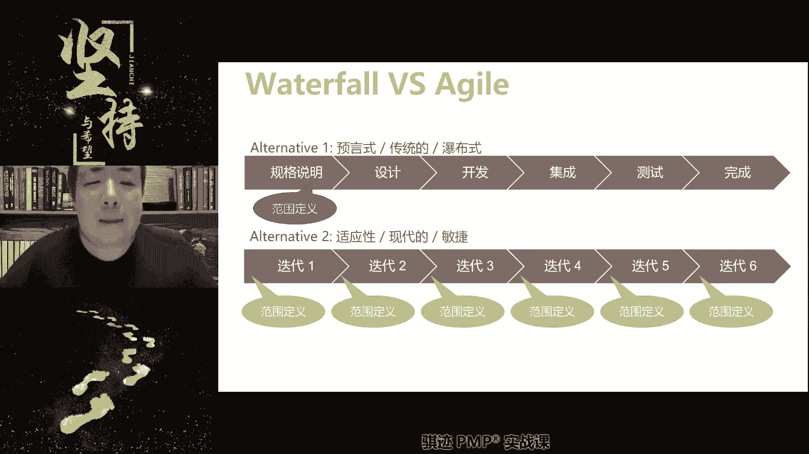
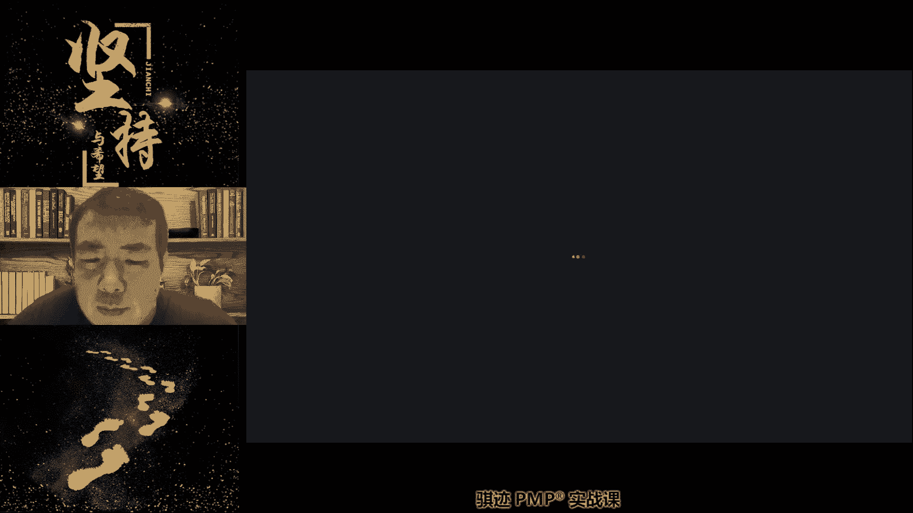
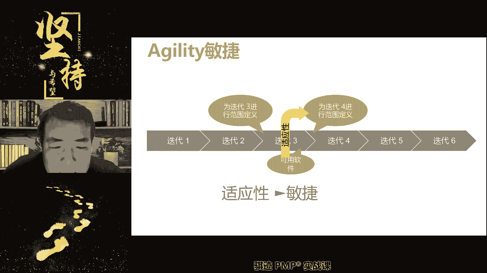

# PMP认证考试课程最新完整免费课程零基础一次通过项目管理PMP考试 - P60：PMBOK第七版 第十一章 敏捷专题上 -1 - 骐迹PMP - BV1Sb4y1f7Yt

好同学们，我们先开始今天的课程好不好，我们先开始吧，好那么我们今天开始上的是敏捷的专题课，是讲敏捷的方法，我们之前上课的有很多，提到敏捷的方法和预测的方法有很多的不同啊，好上课了啊，同学们上课了。

我看看多少同学先到其他同学，今天听到的同学明显就少了啊，好，我们前面讲的敏捷的方法与那个有很多的不同，那么，呃那么呃我们敏捷的方法之前讲了，它的适用条件是在环境多变的情况下就使用了。

然后他的思想方法和我们的预测性也有不同，那么到底是什么样的敏捷方法呢，我们会在这个专题课上去讲啊，我们会在正经课程讲啊，那么今天来的同学是不是又要过节，又不好，又认真听了对吧，参加直播的数量。

同学们见少了很多同学都迟到了啊，好但是我们敏捷的方法当中的很多，其他的呃思想方法，概念其实和我们使用的预测是一样的啊，和我们的预测形式是一样的，所以啊所以我们并不会特别的加敏捷，去上一上课。

那就变成那个我们的敏捷的那个专题课啊，PMI有敏捷，有专题课，有ACP有专门这样一个认证啊，老师老师你在练习题做马上做了，我们会在课间练习的时候去做一下啊，可我们会在课间练习做一下题型的很好。

你们这个题型的倒是很好，上节课我们会在课间练习去做啊，我们先讲课啊，先讲课，那么敏捷的我们的方法，当敏捷到我们的方法当中呃。

和很多的pp和ACP啊，我们VCP的课程来举例啊，我们都会有商业论断，肝吸管理等等一些东西哦，等会稍微等一会啊，不好意思不好意思，我稍微离开一下，我刚才去洗手间洗手间，我去洗手间，稍微等我几分钟好吧。

离开5分钟，离开5分钟去下洗手间，不好意思，肚子有点不舒服啊，不好意思，哎同学们不好意思回来，我回来了啊，好我们继续好吧，不好意思啊，我们嘿嘿嘿嘿，我肠胃有些肠胃有些不舒服啊，回来了。

我们继续开始讲啊啊那么我们讲的额敏捷，我们并不会特殊的开个全程，去加敏捷的各个方方面，因为敏捷当中的很多设定和预测型是一样的啊，它也可有可预测性，一样会有干系人管理，会有项目章程，但敏捷里面叫敏捷愿景。

会有政治管理啊，当然我们之前的我们的成本那一章就讲了，当然这个概念大家都知道啊，也一样会有质量管理，质量管理所遵循的原则是一样的，我们会讲啊，然后也一样会有风险管理啊。

一样会有需要持续改进软技能等等等等，这些方面，这和我们的PMP的通用课程是相通的啊，和预测型的当中的管理方法是相通的，我们在敏捷专题课程中，学的是和我们预测行不相通的，我们默认上课的一些设定不完全一样。

或者要细入深入讲的那一部分啊，所以这个课可以看作是我们PNP课的主体，的一个补充，因为现在PMP课程当中有百分之呃，50的成分的场景是敏捷场景，但它不一定考的就是啊敏捷的专有的知识。

他有可能是考的是和PMP相通的那些知识，只不过它的场景是敏捷的啊，现在讲的是多少页啊，现在讲的就是我们敏捷上节课呀，就是沿着上上期那节课可以讲的是，上节课讲的是一个延续基础。

这只是我的那个课的那个前沿啊，这是我的讲义的前言，183页，对的啊，OK明白，这就是敏捷专题课的啊，我们的啊，那个那个相应的一些上课的一些讲的内容啊，那么我们学习的要点是什么呢，我们的敏捷课的专业知识。

我们的实践，我们的术语啊，我们的一些场景，那么我们的我们的课程因为不是讲的，讲的是PMP课程，不是ACP的每节课啊，所以我们的课程当中呢在讲到敏捷的时候呢，我们基本上以理解和考试够用为主啊。

一级考试高中要多啊，然后我们是会讲的比CP的课程稍微浅一点，其实也潜不了多少啊，会稍微浅一点点啊，是这样去讲好，那么这是我们的课程组成啊，我的敏捷基础啊，概念啊，打造团队和敏捷框架等等这些东西啊。

那么其中同学们要注意，我们前面这些部分会上第一节课，然后后面这一部分呢会上第二节课啊，然后第三节课呢会讲敏捷的框架，那么在讲前两节课，像今天这节课和节，和端午节后的几节课的时候呢，有些同学可能会犯晕。

因为我上来不可能先讲敏捷框架，因为你们根本没有基础认知，但是敏捷在这个讲概念之前，我要讲这个框架之前，你们能够接受敏捷之前，我先讲一些概念这些，但是敏捷的概念确实与我们的啊，实践当中，我们常用的。

尤其是预测性为主的项目管理，这些实践和基础自然思考方法呢会略有区别，很多同学会不容易接受和适应敏捷的设定，这个主意，所以有很多同学反映就是敏捷的，前两节专题课上下来呢，他就觉得听得云里雾里啊。

但是你一定要认真听，概念还是尽量吸收，因为所有讲到的概念会在第三节课，就是框架当中才会运用到啊，我会把它组装起来，告诉你们命局是怎么玩起来的，因为一开始就告诉你们敏捷是怎么玩的话，你们没有概念。

很容易理解错误，或者是生搬硬套其一些不正确的概念，所以先要把概念弄去啊，所以敏捷的这个管理模式和我们呃预测型的，就是大家比较容易接受的，预测型确实就有这些差异啊，这是他的这是它的天然的特点啊。

所以为什么人类的管理项目，一开始运用的都是预测性，然后才会去发明敏捷的现代敏捷，但是敏捷里面的很多思想呢，其实古人也有也有贯彻的投资，但是它不系统是这样一个东西，所以大家学的时候呢。

千万不要一开始就学诶，老师你讲的东西根本理解不了啊，什么东西根本你们啊，你这因为所有讲到前两节课讲的东西，会在第三节课运用到，然后我会告诉你们那些设定为什么要这么设定，因为在框架当中它就这么运用。

能够产生生产力啊，这是课程当中我们开始的时候给大家设定，因为你们前几届上，听我的敏捷的专题课的时候啊，这部分就是呃大家反应比较多，老师怎么去理解啊，对不要急啊，我们呢有些课的课程是你一定得认真听全了。

才能理解的啊，不要说一节课不听老师我就没听懂怎么样啊，不要急躁，学习要心，不要心浮气躁啊，呃为什么还多讲这一句呢，是因为我们的同学在我们这一届的同学啊，给我了解，可能跟社会环境有关系。

就是说目的性比较强，然后呢呃说是功利性，学习的功利性也比较强，就希望上完课能够听懂的话，能考证，这个固然不错啊，学习确实是会有带有功利性，但是过强的功利性并不利于你掌握东西啊，还是耐下心来。

不要浮躁的去理解理论和，为什么理论是这么设定，好吧啊，所以学习是一步一步的啊，不也不要说老师啊，我这个考试怎么办，老师考试能不能通过这些东西，考试最终能不能通过和拿拿到证书，是取决于你平时的慢慢积累。

而不是说老师给你划个重点，你背一下就可以了，这个是不对的啊，就算你考出来了，这张证书也对你来说只是一张白纸啊，如果你工作中真的需要用到，项目管理的概念的话，那么对你来说，这个课其实你就是白学。

就为了这张证书，所以我希望你们还是能够从课程中，持久的去受益啊，OK啊，等会我把东西放下，我的桌子好乱好好，那么接下去有同学说啊，敏捷T用的多，但是还是其他行业预测性居多，对的，那么敏捷出现的背景。

最早是从软件工程开始出现的，那么它就软件工程危机啊，呃搞it的同学听说过啊，你们听说过有个词叫软件工程危机吧，就是最早人们在软件开发领域，发现了预测型的这种谋定而后动的管理模式。

项目管理模式或者开发模式不是项目啊，开发模式无法适应变化变化，需求变化特别剧烈，然后呃，市场环境变化特别剧烈的这样的环境和设定，然后如果我们强行使用预测性，会发现成本和代价以及效果都非常的高昂啊。

效果非常的差，所以我们在开始反思传统的预测型的一些缺点，包括过程开发过程过长，无法适应环境，预算容易超支，进度检查困难，最终交付不一定满足要求，人员联动啊等等等等等，这些东西它都是预测型。

当面对剧烈变化的市场环境当中，所展现出的一些弊端暴露尤其明显，这叫软件工程危机，然后敏捷的主导思想，再从软件工程危机的这个人们的反思之后，开始脱胎采用敏捷的方式，用是随机应变的这种开发方式而产生的。

所以同学们有同学说的没错啊，IT用的句子是的，但是现代的敏捷管理的相互的相应的概念，其实已经超出了软件工程范围啊，任何的可交付物，注意啊，任何可交付推倒重来的成本不太高的。

需要适应剧烈市场变化的都可以使用敏捷，但是这两个条件并不在所有的行业都成立啊，所以你会看到什么，我们举个例子呃，马斯克打发火箭了，就知道马斯克的那个啊猎那个猎鹰一号对吧，然后上去蹦炸了吧。

但猎鹰号之前马斯克的发射了好多次那个火箭，他这个火箭开发的过程中就运用了敏捷的思想，他在开发过程中迭代了好多次，不停的迭代迭代，然后上去下来，上去下来，然后蹦蹦蹦，然后一点点来。

这个过程其实就是敏捷的思想啊，那么在是上个月吧，马是上个月还是哪个月，是好像是上个月马斯克的那个猎鹰号的第一次，那个就是那发向月球轨道发射，就是猎鹰一号的那个火箭，后来不是失败了吗，但是那个失败之前。

猎鹰号其实做过很多次尝试，从身高几百米到身高几公里，到一直升高到接近大气层，他做过好多次测试和实验都是什么啊，都是从失败走向成功，不断的去迭代的，这个从发射火箭这种这种事情上。

其实你看了在适应变化和迅速改进上，都已经能够运用敏捷，这个它的开发过程就是敏捷的啊，我们可以看到敏捷这个方法其实越来越路，子会用的越来越宽，越来越宽，它会适用于所有需要进行不断迭代，改进和需要适应。

不断适应市场变化，这种环境啊都是可以使用，而不仅仅是IT的啊，甚至现在很多的制造业，它也开始尝试使用传统的制造业的管理模式，就是预测性，再加上敏捷的某些可以被快速替代的啊，就像我们上课讲的汽车行业。

就是的，我研发一款汽车，它是预测型，但是汽车上的软件呢，它是命运阶段发的对吧，这就是混合啊，我们之前讲的混合型对吧，这就是一种混合，它不是要从什么从预测到敏捷，而是敏捷和预测，在不同的可交付成果的。

不同的部位去发挥作用啊，这就是敏捷出现的背景，当我们要适应环境，但我们要快速迭代，当我们要提高人员效率等等等等，这些大量快速交付，当这种场景是有这些需求的时候，我们就可以尝试去使用敏捷。

但是预测性仍然有它的作用啊，因为预测性的谋定而后动，它的执行效率是高的，敏捷，因为他需要他要能够敏捷起来，它是有一定设定条件的，我们后面会讲需要什么外部快速反馈，良好的沟通团队不能太大。

对要频繁的呃产生与外界产生发布啊，反馈反馈发布的这种交互循环，才能有效地敏捷起来啊，所以他也是有条件的，所以并不是说敏捷就是万能的，什么东西都能有敏捷，这也是错的啊，取决于场景好，这就是敏捷的啊。

出现了背景，那么在敏捷当中，我们使用当中呢，我们会注意到我们经常会遇到这个情况，是市场需求瞬息万变，很难实现产品需求明确，而完整的收集就是我的产品永远在变化，就是现在的社会有个特点是什么。

你交付出去的东西永远做不到完美，我完全适应市场，因为市场的需求总量在变化，我今天需要这个，明天就需要内容啊，世上就像我们家女儿的嘴巴一样啊，很刁钻，今天想吃这个，明天想吃那个。

他永远不会固定的喜欢某一样，或者永远固定不会喜欢某一类，它会随着啊市场需要，也就是所谓的心情啊，或者等等一些一些其他因素不断的变化，永远预测不准啊，就像时尚潮流一样啊，所以这个时候呢你需要跟着环境。

因为你没办法改变嘛对吧，你就只能跟着他懂啊，另一方面技术发展也是日新月异，所以最需要功能的可实现，性能也面临着多重不定因素，这些就是导致敏捷的产生啊，所以敏捷的思想当中我们是有一个什么思想啊。

注意首先要放弃一个思想，就是所有东西能一次性做对啊，我们做项目总是希望一次性做对是最省心有效，这是个美好的愿景对的，但是在越来越多的环境当中，一次性做对是不可能实现的，你先要放弃一点。

所以你在做项目设计的时候，我们又讲到之前我们讲了什么啊，开发周期啊，开啊生命周期和开发方法，那个绩效遇到给我们讲很多的时候，你一次性使定义完整产品的生命周期，和开发的所有内容是不现实的，也是不科学的。

他要逐步完善或者是不停的完善，永远没有终点的去完善，你要你要有能够接受这样一个现实啊，事实上很多的产品，现在越来越多的产品都是这样啊，所以在这种设定下，你才会去考虑我们用什么方法去实现它。

这个时候你就会考虑使用敏捷啊，敏捷就是针对这种环境而来的，那么敏捷说穿了啊，我们接下来就开始讲敏，慢慢讲敏捷，敏捷说穿了是什么东西啊，那我们在这些第一适应不断需求，我们前面已经强调很多了对吧。

第二以人为核心，为什么是以人为核心，就是敏捷，认为解决不断变化，需求不断变化，市场环境不能化，然后无法一次性完成交付，这个中间的途径，一定要依靠人的主观能动性来解决，那么它正好是针对你是什么东西。

针对于我们之前讲的啊，针对我们之前讲的预测型的一个缺点，什么缺点，预测性当中把人看作是一个木头人，也就是说项目经理，我们前面讲预测性的管理方法当中，比如说我们讲现有项目日历对吧，我们有每天要干什么活。

每天要什么人，把人安排到活上，这个时候人相当于是个木头人，我项目经理教你今天干什么，你就干什么，我项目经理不叫你干嘛，你就不干，这个人是不是木头人，这种时候人的效能是相对比较低的，对不对，是不是。

那我问你们，你们日常的工作当中，是领导叫你们干什么，干什么的情况多，还是领导没有说什么，你们主动去完成工作，这种场景更多是哪一种场景更多，是哪一种，是你主动去选择工作，并完成自己决定做什么去完成更多。

还是领导叫你做什么，你做什么更多，所以啊很多同学都很厉害嘛，主动完成啊，那么这就是一个主动工作和被动工作模式啊，不好意思，哪个，好那么主动工作，那么那会更有效，因为你自己决定做什么或不做什么。

或者先做什么的时候，你会更多的去考虑什么啊，这个完成的过程和我如何去优化它，主动完成的赚的多，对的啊，这句话说的好，同学们啊，尾号1152的同学啊，这这句话说的好。

未来的社会当中或者现代社会中已经是这样，如果你的工作当中主动工作的成分更高的，一般来说你的薪水更高，被动工作的多着呢，领导就你们就去做什么，你看机器人，木头人就做什么，一般薪水就没有前者高啊。

就是总体而言啊，但不代表个例，对吧明白了吧，所以我们的敏捷是倡导什么，第二者，那么他是怎么做到的，它是将啊，注意啊，我们之前已经讲过很多项目管理，比如说规划，比如说范进程啊等等，那么敏捷的本质是什么。

第二句的已经会是什么，将一部分注意我的描述，将一部分项目管理的权责，由注意权利和责任两个同时啊，由项目经理身上转移到团队身上，项目经理放弃大部分的直接干预和安排的权利，转而将这种权利。

同时也将责任移交给团队自己去完成，所以我们后面会讲到敏捷团队是什么，是自组织，团队自我组织，自我管理，那么这样的好处是什么，给予了团队尊重，给予了团队自觉，自然容易激发团队成为了什么。

自觉性和主观能动性，从而激发生产力，这种主动工作模式灵活性更高，效能更高，但是对人的要求也更高，所以敏捷不是说你想敏捷就敏捷的，敏捷的一个前提是什么，很多老板说啊，我不管372 11，人家团队是敏捷的。

我们要敏捷，这是错的，敏捷首先对人的要求就变高了，所以如果你想你的团队是敏捷的，一定得是提升人的基本水准和素质，我们我们讲敏捷团队当中会有很多特征的，你满足特征，并且能够有效的让敏捷的项目经理。

能够被管理起来和带动起来，它才能敏捷，所以为了敏捷而敏捷是错误的啊，有同学说老师练习的，我看到这段感觉敏捷是一种思想方法，是载体，是人对是的，这个这个理解完全正确，所以敏捷它不是一个固定的模板。

所以我们讲敏捷是什么时候，它不是一个固定模板，他也不是一种可以直接重用，所以敏捷不是说固定的套路必须100亿，按照什么做，这是错的，这是形式上的僵化啊，也不是一个流程，而是一种根据团队放权给团队。

激发团队，然后去让团队主动地想办法适应环境，来做出开发，做出改变，做出的交付，那么敏捷当中的交互形式，我们之前讲了敏捷的交付形式是迭代加增量，那么迭代加增量就体现出，我前面讲什么东西无法一次性做对。

或者东西永远不可能完全做对，他需要持续不停的改呀改呀，改增加增加增加来满足市场需求，那么在这种情况下，我们的交付就是什么，迭代加增量对吧，这个之前我们讲过吧，什么叫迭代加增量。

定期的尽可能频繁的去交付东西，或定期或者不定期啊，也有不定期的，定期或者不定期的频繁地向市场交付，这个是迭代属性体现，那么在每次交付当中呢，都努力增加新的东西或者改进性的东西，这是增量。

然后一直保持这样一种频繁的交付，每次交付总能多一些新的东西，改进一些新的东西的，这种方式称之为迭代加增量的开发方式，但是这仅仅是一种交付方式，它的内核不是简单的迭代加速上，注意啊。

迭代加速仅仅是它的交互方式而已，他是这么交付出去，外人看起来你们就是什么啊，有两周给我们发布一个新版本，或者三周给我们一个新产品，每次东西呢都有新惊喜啊，这是从外部干系人，从客户和外部干系人当中去看团。

实际上并不一定是字母内核里面并不简，简单简单是什么，内部可能我们要实现这个过程需要团队是吧，不断的改进，不断的配合，不断的融合提高，他也需要团队管理，也需要进行什么啊，风险管理。

也需要进行质量管理等等等等，这些东西都是需要你，甚至也需要一定的什么成本管理，这些都是什么，都是呃客户看不见，但是我们会去做，敏捷是这样一种内核啊，这种内核明白吗，它与我们之前讲的什么。

做完做一个完整的计划，然后一口气交付，每个人都是项目经理的木头人啊，牵线户木头人傀儡啊，项目经理叫你干什么干什么，不叫你叫你就不干什么的，这样一种管理模式形成了本质区别，这才是敏捷。

当然中间的内内涵会越来越丰富啊，我们会讲细节内涵也丰富，所以这就是敏捷和呃预测性的最大的不同的啊，表征点啊，这个可以理解吧啊那么敏捷的有三大支柱，那么首先要讲敏捷当中，因为我们认为什么有一个思想方法啊。

注意敏捷当中的概念是很多的啊，请记住理解，一定要接受，一定要在脑子当中接受这个理念，因为在遇到敏捷环境题目时，你就得用敏捷的理念去回答，否则就会答错，首先第一个理念要记在自己脑子里。

无论你接受不接受难敏捷，认为未来是不可预测的，因为你不知道用户什么时候，就会提出一个什么啊，稀里糊涂看似是无理的要求，但是它是代表市场，人家是出钱的买单的人，所以你就得满足他对吧，客户永远是上帝。

明白意思吧，你的上帝是一个不可琢磨的，所以敏捷当中，首先认为我们的未来的需求和未来，会做成什么样子，是不可预测的，在不可预测的前提下，所以我们是基于经验而非预测及干货，什么意思啊，已经发生过的事情。

我们把它总结出来，这叫经验，我们只会根据过去怎么样去做有线的规划，但是绝对不会认为未来先去做主观判断，未来会怎么样，我们认为我们无法判断未来，我们怎么去规划未来，根据市场反馈来规划未来。

所以敏捷当中这个概念记住啊，它跟我们的日常的常识和认知可能是有区别，就是我不知道我后面一个阶段之后做什么，我不知道，我等待市场告诉我后面怎么做，我才这么做，我不会主观判断后面会怎么啊，就像所以敏捷。

为什么市场就像天气琢磨不定，很难预测，所以我不会说预测说啊，明天因为天气预报说明天是晴天，所以我就不带雨伞，我不会这样，当然我也不会认为说明天是下雨，带雨伞，我永远是根据什么哦，今天我们是下雨了。

外面雨下的很大啊，那么我根据今天这个下雨的这个态势，我认为有限的，明天那也可能是下雨，所以我明天打雨伞，但是后天我打不打雨伞出门，对不起，我要根据明天发生什么才决定，比如说明天他不下雨了，放晴了。

那么我要根据什么，后天早上天气情况来决定我出门打不打伞啊，就是举一个很简单的例子，我绝对不会一些预测号，明明天不下雨了，所以后天肯定也不下雨，所以我明后天就出门不带伞，我不会做这种结论。

因为呃客户需求就和天气一样，很多时候难以预测啊，呃有些同尾号336同学这个话题讲的好大，中国几十年的改革开放，可以理解为预测加敏捷，这个话题有点大了，不能说这个就不是项目管理。

但是你可以认为是什么改革开放，就是一种什么根据在现实当中进行摸索，所以他和敏捷其实是有很相似的地方，但不完全是敏捷啊，不完全是民间，但是确实有那么点味啊，因为社会改革和社会治理。

对于这个框架来对敏捷来说，这个讲的就有点太大，而且整个国家的机能运作啊，我们讲这个大一点，整个国家的技能运作，它是会有很强烈的惯性的，所以你说用敏捷这种方法在治理国家的时候，其实是会出乱子啊。

敏捷是小而快，但是国家呢是大而全，毕竟并且慢啊，所以一定程度上有那么敏捷的味道，但是并不是说治理国家就能有敏捷啊，国家社会有整个国家的治理运作啊，一个国家一个文明甚至一个文明在运作。

他是会有一定的很强的历史惯性啊，这个就不再展开了，这个话题讲的有点大，如果要讲这个东西的话，我可以给你们扯一节课啊，就不扯了啊，所以敏捷依赖三个支柱，注意啊，接下这个概念是我们讲敏捷值，只相信经验。

不相信预测，所以他怎么知道未来会发生什么，要依靠这三者三根支柱啊，透明经常性的检查和适应，那么第一个什么叫透明啊，就是信息透明，所以敏捷当中有接下去一个理念啊，这个理念也是很多同学难以适应，敏捷当中。

无论是客户，该系人，外部人有什么信息，应该尽可能通过各种方法，尽可能的向团队进行传达，同时后面这个理念很多人就不接受，就是团队有什么变化，有什么信息，有什么情况，也应该尽快地向客户传达。

这就是所谓的信息透明，我们有什么情况，第一时间都会告诉客户啊，任何的客户想要知道的可信货可见，想要知道的可以知道的信息，都应该能够最快捷地从我们的各种渠道，让客户知道。

这一点就是很多的传统的项目管理当中，所无法接受，为什么传统的项目管理，认为什么不同的人应该接受不同的信息，但是信息沟通的不透明会带来反馈的不及时，也会研究透明性，会影响后面两个就是经常性的检查和适应。

因为信息的不透明，会导致我们无法及时获取所有的外部反馈，也就导致我们无法根据反馈快速的做出调整，所以透明的目的是为什么能够获取反馈，能够迅速自动调整，然后做出最适合市场需要的产品，来迅速投放到市场上。

这这才是敏捷真谛，所以敏捷当中我们认为什么我们做的对错与否，重要不重要不重要，重要的是客户怎么想和他需要什么，当我们充分的进行与客户之间和国外部，该县相关方进行充分的沟通之后。

我就我们就能把这个循环走得越来越快，当这个循环越来越快之后，它就进入一种正马态，什么叫正马太，我们产品做得好，客户就会满意，然后客户会提出更多的好的产品需求，我们得到拿到产品需求之后就会做得更好。

然后形成一个正反态，从而使我们的产品价值越来越高，产品价值越来越高，会给项目带来成功啊，那么这个就回到了，其实最终就回到了我们篇博客第七版所讲的，项目成功的标准，在第七版改的是什么，创造价值是啊。

所以敏捷也是目标与创造价值啊，我们做了对错好不好，或者是不是会被客户喷，或者是会泄露一些我们内部的信息与否，并不重要，重要的是能够让客户给予反馈，从而帮助我们迅速调整和改变和改进，这才是最重。

这个思想方法和我们传统的传统的日常呢啊，我们的日常管理和项目管理，是不是是不是是有差异的，对不对，你们想一想，是不是我们在很多日常管理当中呢，不希望外，尤其是外部的干系人相关方了解过多。

我们的内部信息对吧，这是一个很正常的日常管理的一种思路吧，但是这样一种管理会导致反馈的削弱，可小和适应性的削弱啊，这是有违我们的啊，敏捷的原则和思想啊，好那么敏捷当中除了这个之外，我们还讲究什么。

有个东西除了反馈之外，我们还打给你们打一个词啊，名字当中很强的一个东西叫做什么叫短反馈啊，什么叫短反馈啊，就像电路里面的短路一样，就是我们希望反馈的路径越短越好，什么事情都直接说，不要拐弯抹角。

不要依靠中间人告诉我，因为信息过了一道，他就有可能会什么啊变味或者是意思会错啊，你们啊你们都玩过那个游戏吧，叫做靠背不走样，拷贝不走样都玩过吧对吧，为什么copy不走样，走到后面都走样了呢。

就是因为信息传递的环节越多，他在拷贝的过程当中就什么走样的就越多，所以敏捷的出什么，最好是点对点的直接沟通，跳过中间商，团队自己内部的，我们后面会讲到团队自己内部的，最好也是相互之间点对点的沟通。

不要通过项目经理自己内部就是直接，当然这个这种沟通方式快速有效，但是会有代价，什么团队不能做得很大，团队做得很大的时候，沟通开销就会剧烈的上升啊，就会剧烈上升，我建议我们前面讲过啊，就会剧烈上升。

所以敏捷后面讲团队一般是不大的啊，敏捷团队一般是不大，不会超过十个人，就是这个道理，因为沟通开销会迅速上升，好，这是我们讲的敏捷的三个支柱和敏捷。

依赖什么东西，那么接下去讲一个敏捷管理当中，一个非常重要的概念叫做管理风格，我们之前讲过，我们之前讲过六种管理风格，记得吧，敏捷当中的管理风格，是更接近于我们六种管理风格当中的服务型。

但是要比服务型更加往前一步，比较接近服务型，更加往前一步的是仆人使用的，不认识什么叫做仆人士，仆人士与他相对的领导是，那么什么叫做仆人士，同学们啊，你们猜测一下什么叫仆人识，管家养要学得非常好。

对的项目管理原则当中像管家一样对，不认识就是管家一样，对的没错啊，这个说的非常好啊，记得前面的课程啊，仆人士，那我给你举个例子啊，就怕你们理解错误啊，仆人士也不是真正的地位，像仆人，注意啊。

在哪怕在敏捷当中，敏捷项目经理或者叫school master，或者叫敏捷倡导者，或者叫敏捷教练等等等，这些他们的实际权利还是大于实际权利，还是大于团队的，但是为什么叫仆人士呢，就我们打个比方。

大家玩过DOTA吧，或者玩过王者荣耀都玩过对吧，那种都是515的对吧，这个当中你们知道吧，就是如果我们玩职业比赛啊，如果看打职业比赛，像撸啊撸啊撸啊，王者荣耀啊，那个叫什么那个那个那个DOTA。

他们都五五，职业战队都会有一个队长啊，带领比赛，队长是负责场上指挥和做决定的，那么往往玩队长的人，他玩的什么决赛都是辅助，包鸡包眼，负责钻研啊，负责支援团队，因为这个时候什么他是并不是担当主力的。

而让团队担当主力，自己做辅助，但是他帮助大家做出什么正确的路径选择，但是最终决定由大家做，但是我们帮助大家去走向成功，这就叫做辅助，所以某种意义上我们要类比，让大家比较容易理解。

敏捷项目管理当中的领导者，管理者，他的领导力风格是仆人，就是管家式，决定权在团队身上手中，但是我会告诫你，帮助你，辅助你做好工作啊，同时我会包机包线啊，啊我会帮助你辅助好，如果你不小心被人家抓了对吧。

你的那个C位被人家抓了，我会安慰你吧，重新再来啊，没事请大侠重新来过啊，没事对吧，然后还是会给你包鸡包眼包红包来对吧啊，诸如此类，这就是仆人氏，明白了吧，它比服务是会更与团队贴近，但是会把决定权的决策。

决策权和决定权更多地交给团队啊，只在只在关键的地方呢起骑行指导的作用啊，所以你可以把仆人士看作什么啊，那种电子竞技游戏里面的队长啊，就是这个意思，组织后卫OK明白了这个比喻一说。

那就是不是就就就很容易理解了啊，所以不认识的领导者就跟我们前面做管家相当，管家是领导者，其实是仪式是一样的啊，啊他不会做决定，决定权，将决定权由，项目经理转移到我们的呃团队市场啊。

但实际上对整个项目起到负责的最终责任呢，仍然是交不起，这点记住啊，我们后面会讲到，比如在团队当中，团队管理当中决定团队成员的调整，你要调整团队成员啊，你要调整调整团队成员的决定权的呃，权利是在哪里啊。

还是在我们的项目经理手里对吧，其实还是在项目经理收的，只不过项目经理将这个呢放权给团队，承认了而已，好这个能明白就好了啊，那么中间有些特性是什么，敏捷呢是并行的，迭代的，是随时变化的，渐进明细的。

然后流程文档是足够的等等，这些东西我们之前都讲过啊，那么流程文档为什么是足够的，而非详尽的呢，我们后面会讲一下啊，我们会讲到这个概念，因为敏捷当中，我们讲要把最多的精力花在直接创造价值上，写文档。

注意啊，任何在项目的环境当中，写文档是不会直接创造价值啊，好那么接下去我们负我们回忆一下这张图，我们在之前的先导课，其实讲过敏捷和瀑布呃，之间的一个一些区别的那种讲话，敏捷当中，敏捷当中呢。

我们是通过每一次的小的迭代循环来什么，实现迭代加增量，而瀑布呢则是一口气只做一个循环，做完之后直接交付的这种形式啊，这是他们的一个交付和运作的本质区别啊，这个大家回忆一下，我们在先导课上讲过，还记得吧。

所以在敏捷当中，我们每次迭代结束都会交付一个可用的软件啊，我们其实这里因为是从ACP里面角度讲，就可用了，就叫可用的可交付成果啊，那么瀑布型只会在最终完成的时候，交付可用的软件成果，那么增量型是什么。

什么时候才能交付，最终可用的是在最后一次迭代完成才会交付，成品，中间是会交付，但是交付的是半成品，那么迭代型呢，他每次迭代出来的东西都是不同的产品，而非同一产品，敏捷和迭代的区别就是。

敏捷始终是针对一个产品来不断的迭代更新，而迭代型呢则是对针对呃，一类产品做不断的改进，然后卖给市场再做改进，再卖给市场，他迭代一次就会卖一次啊，消费者为了这种迭代得重复掏钱啊，就像我们经常说的。

汽车稍微改一个什么啊，什么外观内饰稍微改一改，就算新一款啊，改就算改款了啊，小改款改款了以后就可以拿出来当新车卖了，那么你买了前一年的车跟后一代车呢，基本上没啥区别，但是你要换成后一年车，你得重新买车。

对吧啊，所以汽车的设计交付等等，这个过程它是迭代而非敏捷，就是这个道理啊，如果汽车是敏捷的，那对不起，你去年买的车，你今年出新款了，我可以免费去换一个，对苹果手机也是一样啊。

好我们讲敏捷当中我们的范围定义呢会什么，每次迭代完成之后也都有范围定义，这是为什么，来我们前面已经讲过来，想一想，为什么敏捷是每次迭代开始前，或者前一次迭代完成之后都有新的范围定义啊，为什么。

而预测性只会有一次范围定义，这是为什么，有没有同学能告诉我一下，这是为什么，对敏捷当中是使用更多的使用渐进明细，而且他将每次迭代完成之后，扔给市场的产品去获取从史当中的反馈，融入到下一次迭代当中。

不断的去适应啊，对大家这个描述的很对啊，相当于新的需要，对的是的，所以我们的产品不是一口气做到，我们认为接近于完美或者完成的这种状态，而是通过市场反馈逐步逐步完善，所以它的范围当然是从从小到大。

从最小功能产品到最大啊，我们后面会讲一个概念叫做MVP加mm f啊，我们看第二题啊，这就是我们的敏捷啊的范围上的不同。

诶等会有点卡了啊，那么敏捷当中呢我们会使交付特征就会是什么，迭代加增量，这个我们之前讲过了对吧，那么我们的迭代其实包含什么，每个迭代周期内我们都会有小而精的什么啊，相当于整个完成过程都会有，有同学说啊。

苹果的手机是迭代型的，苹果手机的系统IOS是敏捷型的，对的没问题啊，啊你也可以举例是华为手机对吧啊，那么以下两个东西呢是讲的是什么，是迭代和增量，有的同学这个可以图示告诉大家一下啊。

给大家阐明一下什么是迭代，什么是增量，那这就是迭代，我们的迭代当中呢，我们是由什么，由圆圆形逐步向最终型的这种演变叫做迭代，增量呢，只是从局部慢慢慢慢慢一块一步不就拼起来，拼到全呃，呃全量啊或者完整。

这叫增量，那么这两者结合起来就是什么啊，我们先在局部进行什么啊，从原始或者叫从粗糙到精细，然后再完成另外一个局部，从粗糙到精细，然后一步一步按照拼图，每每拼上去一块，再进行什么惊喜。

这样的过程最终完成蒙娜丽莎的画像啊，这就是迭代加增量，incremental and iterative啊，这两个词大家英文也要知道啊，后面以后你们学过P之后啊，这种关键的英文词都知道啊，敏捷叫阿J。

这个知道啊，你们可以去搜一下，有一家房地产公司也叫阿娇，叫雅乐居，嘿嘿嘿，不知道怎么回事啊，有同学问迭代交通就是敏捷吗，哎我已经说了很多遍了，之前有没有仔细听，迭代加增量是敏捷的交付表现形式。

但不是它的全部，它只是给外界人感谢，因为你每次都说东西，你看我对于对于用户交付来说，我用户每次拿到东西的这个过程，就是这样一个从局部粗糙到局部精细，然后再加一个局部粗糙，局部精细，再加个局部。

然后直到完整，这样的过程，它的交互过程从外界人看起来，他就是迭代加增量，但它背后的实质而则远不远远不远不止于此，明白了，所以不能简单的认为敏捷就是迭代增加，这是错误的啊，这是错误的啊。

那么敏捷的词就叫other啊，那么敏敏捷当中我们的交互性呢是incremental，增量，incremental就是增量，iterative就是迭代。

Incremental ended iterative，迭代加增量，增量加迭代是它的表现形式，啊阿贾，你们网上搜一下雅乐居也是用这个词，所以我记得有一个地方，有一条路可以叫做敏捷大道，你们网上去搜一下。

好像是太湖还是西湖旁边有条路叫敏捷大道，其实那条路本来应该叫雅乐居大道，我觉得呵呵，你们去看一下，真的有这条路的啊，好敏捷的过程，适应的过程就是说外界给予定义，然后完成这个外界定义。

然后再次接受外界的范围定义，再次完成过程适应外界定义，也就是外界范围定义，就是外界需求的这个过程，适应外界需求的过程就称之为适应性，那么适应其实并不止于敏捷，其实还有一些其他方法我就不讲。

所以在偏僻的世界当中，适应型就是敏捷型啊，你们只要记住这一点就行了，适应型就是敏捷型啊，好吧好，那么我们接下来讲完，讲完下一页。

然后我们休息一下啊，开始讲我们的敏捷宣言和相应的东西，那么敏捷开发训练注意这啊，这个四个原则最好是能够背出来，因为这个对于大家做后面做很多的题目，再做一些比较简单的敏捷题目当中。

可以直接使用敏捷开发宣言进行判断，那么敏捷的价值观，注意它描述的是一种敏捷价值观，在敏捷的价值观当中，首先我们的宗旨最高宗旨是什么，你就告诉我在敏捷的价值观当中，我们的最高宗旨是什么。

敏捷当中最高宗旨是什么，满足客户需求讲的low了，始终专注于创造价值，哎不是快速任务，完成任务，这个也讲了，road始终专注于创造价值，我们始终专注于做最创造价值的事情，以不变应万变，谁跟你说的啊。

尾号934的同学给我打出去啊，谁跟你说，不变应万变的敏捷就是要变得快啊，哈你这个背道而驰啊，属于逆反派来打出去，价值利益最大化，就是始终专注关创造额和交付价值啊，所以基于这样的价值，就基于这样的价值观。

所以我们有如下这些东西明白吧，所以才会有如下这些一个体的互动，剩余流程和工具，这个怎么解释啊，就是敏捷当中，我们鼓励能人和人之间直接沟通的，不要走什么弯弯绕绕，不要走什么啊，什么狗屁流程。

这些都是浪费时间，浪费价值的行为，能人和人之间直接说明白的，就不要发电子邮件，不要走OA啊，这个可能很和我们的日常常规管理，可能是很很很相违背的，但是这个就是敏捷价值观啊，虽然我们我们说。

虽然我们说呃敏捷不是说不遵循，绝对不遵循任何流程和工具，这也是不对的，就是我们说，如果能够通过人和人之间的直接沟通来解决的，就不需要再从流程和工具去解决啊，也就是说明明两三句话就能解决的事情。

就不要再去开个会解决啊，明明我们发个微信就能解决的，就不要再发电子邮件，解决了，明白了，这就提升了效率，效率就意味着更多的价值，国内有这样的做事风格吗，当然有同学们，你们可能隔行如隔山。

你们很多时候没有体会到啊，当然有啊，有些企业甚至很极致的追求这些东西啊，非常极致的追求这些东西，互联网经济的这这种企业里边很多啊，啊国企和私企啊，国企和外企可能会相对更偏向于右边一点啊，这是第一个。

第二个可用的软件，高于详尽的文档，那么什么意思啊，什么叫可用软件，其实这里也可以，什么是可用的可交付成果，比如说敏捷当中，我认为什么给客户文档写的再好，不如把东西做得更好，我们要写文档要不要要够用就好。

突出两个字啊，主打敏捷当中文档主打两个字够用啊，都主打四个子房子，房租不够啊，够用就好，主打四个字，啊有同学说啊直接聊，那不不那不没有留下痕迹，所以这个就是一个什么东西啊。

敏捷当环境当中我们要建立起相互之间的信任，如果大家都是为了防备对方，这个事情做起来效率是高不了的，所以这就是我说不是所有的环境都适合敏捷，当这个环境充满不了信任的时候，他是敏捷不起来，明白你没发现吗。

每天发电子邮件，每天开会所浪费的时间，其实都是一种低效的行为，每天都我们的工作都依赖于详尽的文档来展开，那么它也是有必要性啊，当然这一条更多的来自于什么，以前传统的软件工程当中。

对于这个过程的详细记录和描述啊，所带来的一些工作量的大量浪费啊，这个可以追溯到很久以前啊，以前他们有句话叫IBM里面一个人写开发，八个人写测试啊，16个人写文档啊，是这么说的，我觉得类似于这个意思啊。

小公司最适合敏捷，不并不是很多大公司也用敏捷对吧，所以敏捷的环境当中，我们会不会讲到，要想建立起敏捷环境，首先要把自己团队内部环境气氛要搞起来，要相互信任，这是后面的事情啊，所以在这种情况下。

大家都财运什么，人和人之间沟通，我不需要留痕迹，你我说的事情不会赖你，你也不会赖我，我们会啊很有彼此默契的去做好这件事情啊，国内我会我曾经与很多非常高能的，很多工程师啊等等也合作过啊。

就体现过这种敏捷环境，其实说人在当中是会啊，不自觉的效能都会高起来的，包括我也是啊，这是环境改变人和督促人啊，那么可用的可交付成果要高于详尽的文档文档，敏捷当中的文档应该什么够用就好。

敏捷并不是说不要文档，也不要流程都不说啊，应该他们都是什么，够用就好，把最多的时间和精力，前两条都是他的目的是什么，都把最多的时间精力投入到什么，投入到可交付成果的创造，如果是软件行业，就是开发。

对有些同学说的很好啊，应该是内容大于形式，成果高于一切繁文礼节啊，对这个表达也很好，就是这个意思非常好啊，我们重要的是实质，好，那么第三个客户变化，合作与客户合作高于合同谈判啊。

敏捷当中我们是不抢和预测性不一样，不强调依据合同进行履行，或者依据合同进行磋商，而是强调什么应该和客户合作，及时响应客户的要求，与客户进行合作，一起想办法解决问题啊，因为这样才能创造最大的客户价值。

这个也能理解吧，这个可能很多场景我能理解，那么但是这要做到这一点是因为什么，敏捷的合同往往是一个什么，往往是我们之前我们正好讲过之前采购合同，敏捷的合同是什么合同，工料合同啊。

敏捷的合同或者是约定的一种框架合同，也就是说敏捷合同当中我们往往谈的是什么啊，现实现迭代次数，或按照一定的人工量去完成这个事情，然后呢我们并不定义范围，我们只定义工作室的人力投入量。

或者约定我们的一个工期或者约定的迭代次数，然后去开展相应的工作，然后去开展相应工作，那么这样的好处是什么，我们就不再纠结，不会纠结于一点，就是预测型，经常会有这个事情应不应该我做，我们这行客户约定。

我跟你叠，我给你迭代20次，在这20年来内，你要尽可能给我反馈，你反馈的越多，我做出的东西就越符合你的诉求，至于要你要做什么不要紧，只要我来得及做，我都给你做，这个时候。

甲乙双方的矛盾就会什么一定程度得到消弭，呃有的同学问的问题我都不知道怎么回答，因为我可能我不了解什么电缆铺设，这好像就我觉得电缆铺设这种项目，应该是预测性更多一点吧，好。

那么最后一个最后一个响应并网高于最新计划，这个大家可能理解对吧，敏捷当中我们就尽可能不做计划，因为计划在敏捷当中是一个负面词汇，记住啊，考试的时候请注意在敏捷的工作呃，开发环境当中，计划是一种负面词汇。

因为计划代表着预测，我们不做过多的，不是说我们不做计划，而是我们不做过多的计划，我们不做过多的预测，而由交由市场来决定我们接下去做什么，这是第四点意思，所以这就是敏捷开发运营啊，也就敏捷软件开发运营。

那么虽然我们说右边是有价值的，但是我们更重视左边啊，那么这四条东西可以帮助我们，在偏僻考试当中啊，对于那些题目做出选择，你就要牢牢的记住，敏捷的这个四个价值观的宣宣言，四条就宣言。

那么很多的题目就能选的出来啊，凡是说要制定详细计划的呢都是错的，凡是说依据合同执行的，基本也都是错的，凡是说文档写的越细越好呢也是错，凡是说根据流程来的呢啊大部分也是错的啊，不能说绝对啊，明白吗。

因为左边更有价值，明白了没有好，这是我们的敏捷开发宣言好，那么我们讲到这里呢，稍事休息一下，休息之后呢，我们做一下第九呃，我们不是地折折，我们第九节课的这个成本管理的练习题。

然后继续讲完我们的今天的后半年内容啊，所以敏捷的里面的概念你们发现吧，我们这讲到这里的课的，很多的概念都是与以前的不同，或者推翻了以前的设定去做的，为了能够实现原先预测性无法实现的东西。

我们会推翻一些设定，这些被推翻的事情，可能会导致有些同学在理解上可能有些不接受，不适应或者不理解啊，这些都是很正常的，所以你们有任何不理解，可以在合集需求问我，或者在群里问都可好吧好。

