# PMP认证考试课程最新完整免费课程零基础一次通过项目管理PMP考试 - P67：PMBOK第七版 第十四章 干系人绩效域-2 - 骐迹PMP - BV1Sb4y1f7Yt

对该学生的分析。

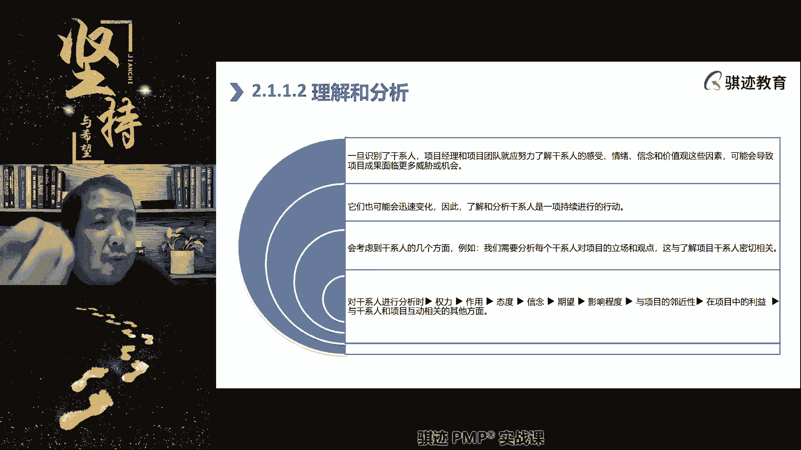

我们进行优先级排序，好有同学说我们的画面不动了，没关系啊啊大家卡不卡，我应该是不卡的吧，有可能有各位同学网络可能有点问题吧，没问题吧，啊嗯我们啊我们回来啊。

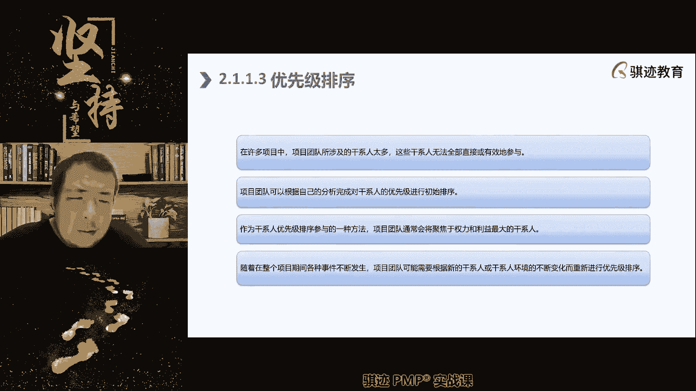

我们可能被打断一下，那么所以我们对于刚性的管理，因为项目中的干系人总是数量很多的啊。

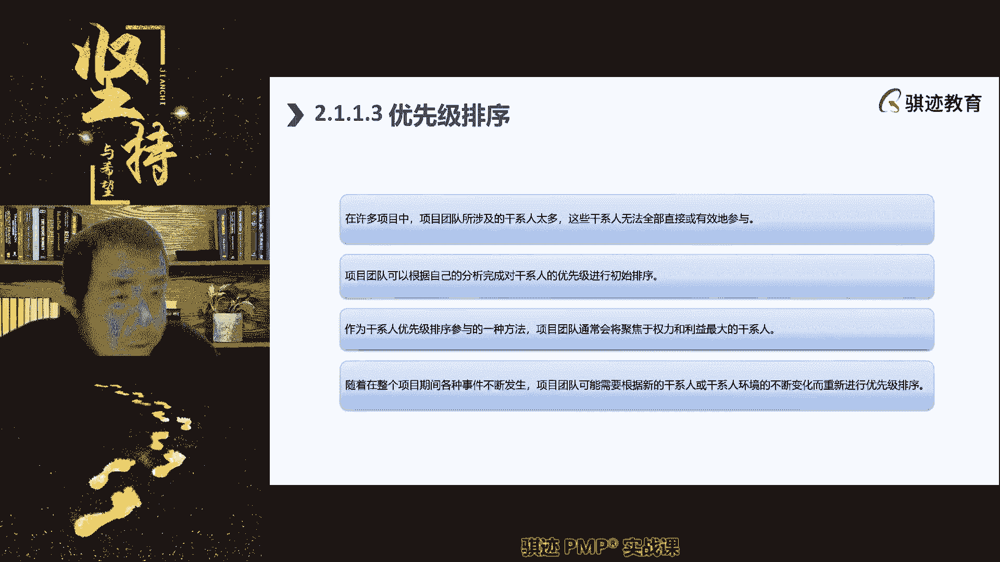

无论什么项目，干性的数量都是很多的，所以我们要做重点管理，将最有限的精力投入到最重要的人的干系。

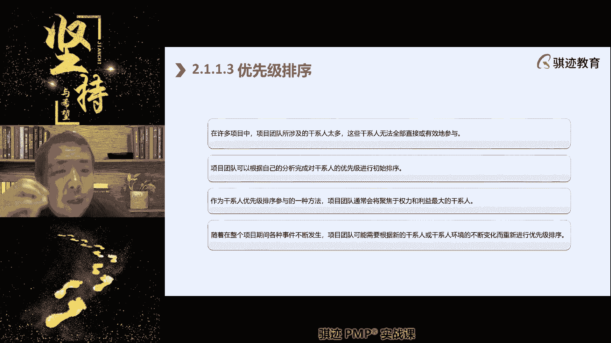

人的管理实践当中去，所以我们会进行优先级排序，注意啊，优先级排序在管理当中啊，都是一个非常重要的一个法则啊，我们的后面的啊不确定性及教育，就是我们的风险管理当中也会使用的，优先级排序，因为风险也是管的。

管不过来的，所以你只能抓重点，所以优先级排序的目的都是为了抓重点，包括需求，为什么也要优先级排序，也是要抓重点，关键需求啊，所以在干性的识别过程当中，我们自啊和管理过程，当我们自然也针对于识别的干型。

进行优先级排序，注意这个优先级不是不变的，而是动态调整，因为我们前面讲什么，干系人可能在某些阶段对我们项目影响很大，但是过了某些阶段，那可能就影响很小，比如说政府部门的某个实权官员。

可能在你拿到政府批准之前，他对你项目是个至关重要，你拿不拿不到这个呃，政府的批文，你的项目就做不下去，但是你一旦拿到了这个批文呢，他对你来说就没什么作用，把太监批准你了，那么你就可以往下干了。

他对你的影响就很小，所以你要看项目处在哪些阶段，与你项目当前的关键工作相临近，相影响的，以此来动态调整你的优先排序，知道吧，还有呢要注意点啊，这个这个又回到又讲做人啊。

就是说你不是说等到要用到这个人的时候，你才去打磨的啊。

就是又是一句中国人的古话，中国人古人当中与人打交道的其实朴素思想的，有一句话，我小一直小时候我妈就跟我说，叫做人不能有时有人啊无啊有事有人无事无人，就说当你求到别的人的时候呢，你就眼里有这个人。

当你不求到这个人的时候，眼里就没有人，这是不行的对吧，所以我们对于干性人的管理。

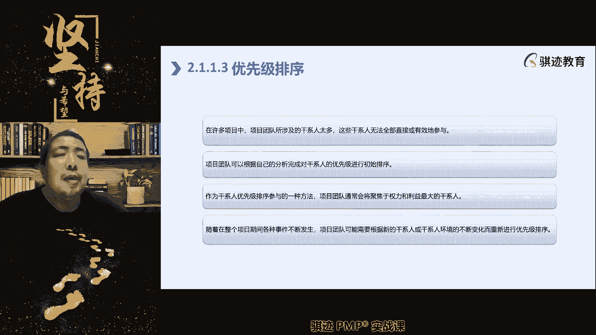

在理回到理论上都是这样，我们对于该系统管理当中，当我们可能已经开始需要运一个运用到这个，在项目中要运用要使用的，或者要涉及到这个干性之前，我们应该已经及时的提前，对这个干系人进行管理参与啊。

我们我们讲后面讲叫管理参与，就是跟他进行接触啊，对他进行影响，然后让它正确的定位，在我们的项目当中已经开始这么做了，不要等到啊一定要要运用到这个人。

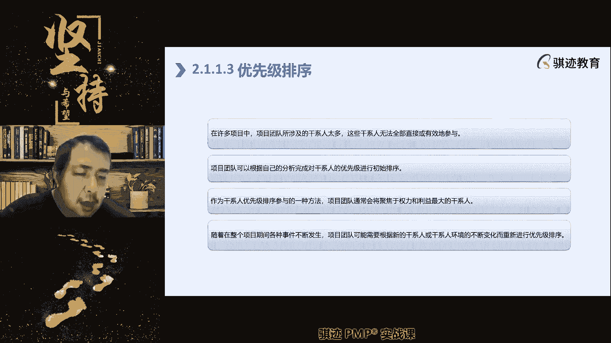

或者涉及到这个人的时候，你才去跟别人打交道，这时候呢有时候就就很多场景当中。

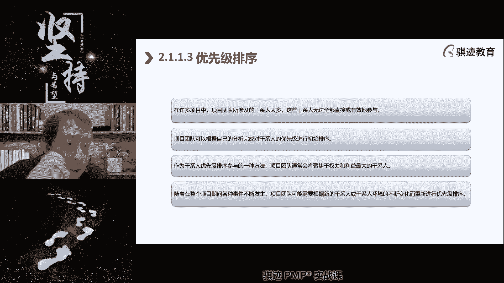

就会显得对人的不尊重或是对人的不重视啊。

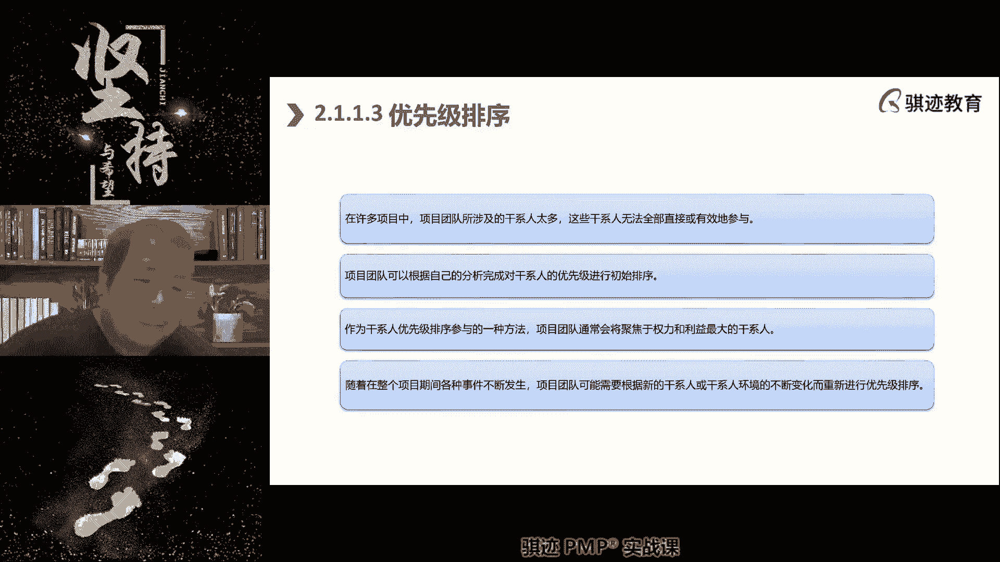

啊这个也是为人之道啊，其实中国外国都是这样的，就是当你要求到别人的时候呢，你才去出现在别人面前，当你不求别人的时候呢，你就像消失不存在一样，你这个人的做人其实是不够好的，明白这一点吧。

所以干性管理的一个点就是什么，你首先要预判到你在后续的工作当中，会涉及到哪些干系，预先于给他们啊，接触宇轩与他们接触，然后设定恰当的项目参与程度是非常重要的啊，后面我们讲到参与会讲什么是参与程度啊。

然后根据这些我们排优先级顺序，越是对接下来的工作有较大影响的，它的优先级就越高，注意吧啊因为接下来马上就要用到这些人了，所以他优先级会更高一点啊，那么不当前直接用到呢，可能看呃呃优先级可能稍微会低一些。

但是有一些人他的优先级始终是很高的，说客户发起人像这样组织的高，与组织与项目相关的高层，这些干系人都是优先级很高的。

因为他们是权力高，地位重的人。

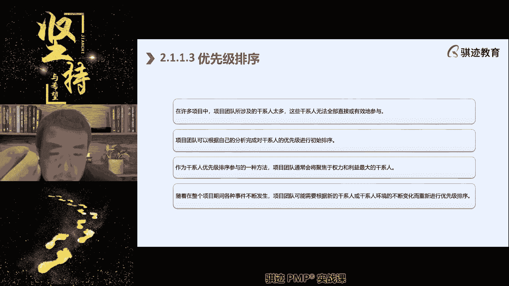

我们后面会讲到，他们始终是应该重点管理的人啊，在干事业管理当中。

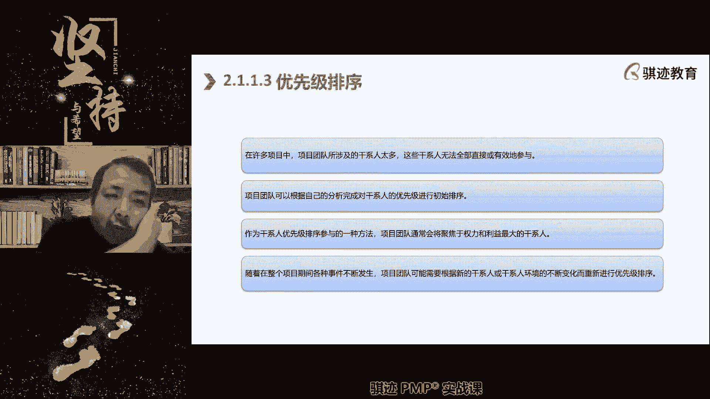

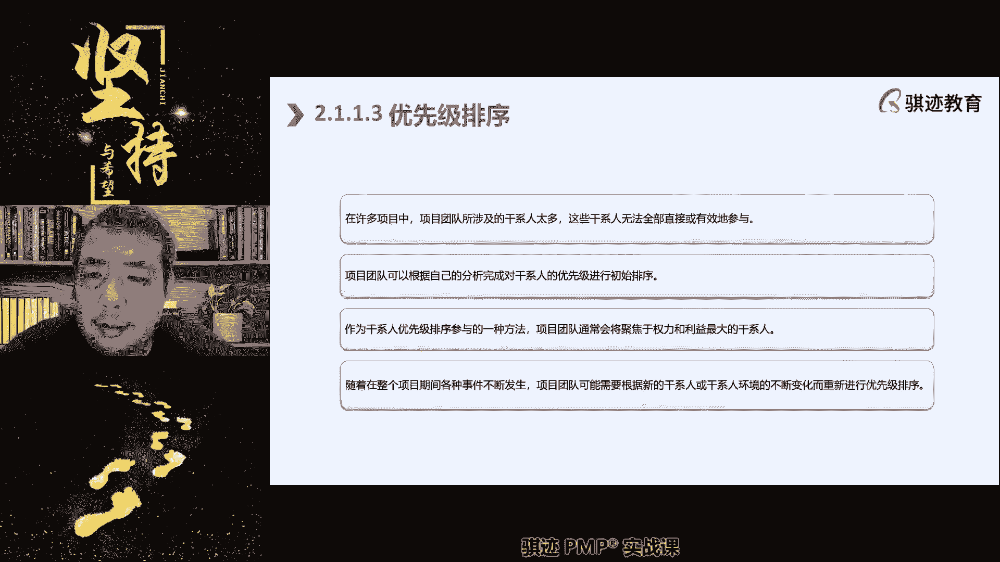

接下去说了，那么接下去我们就会开始什么干系人参与。

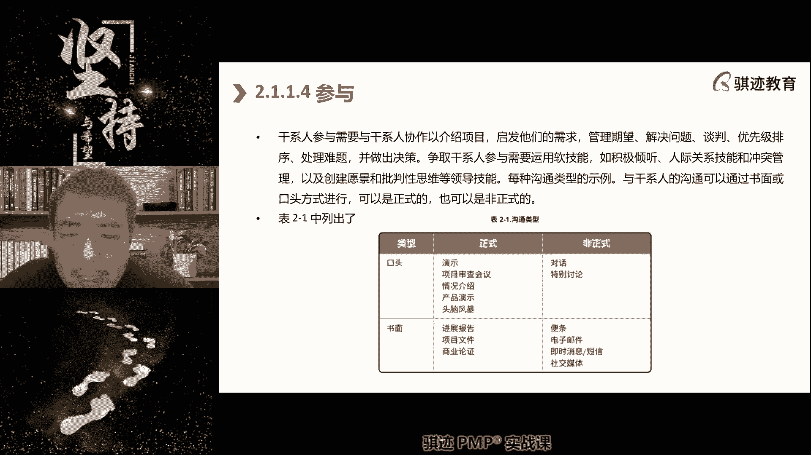

干系人参与是什么，是你与干系人接触。

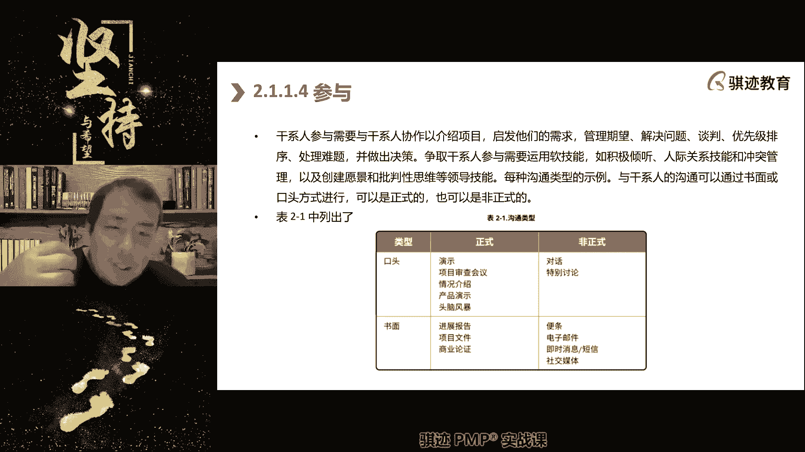

并通过你或者项目管理团队，你通过项目管理团队来使得干系人能够，正确的项目当中啊，发挥它正确的价值，这个过程你有很有可能是没有办法，指挥和限定别人怎么样，但是你要引导他，诱导他怎么样。

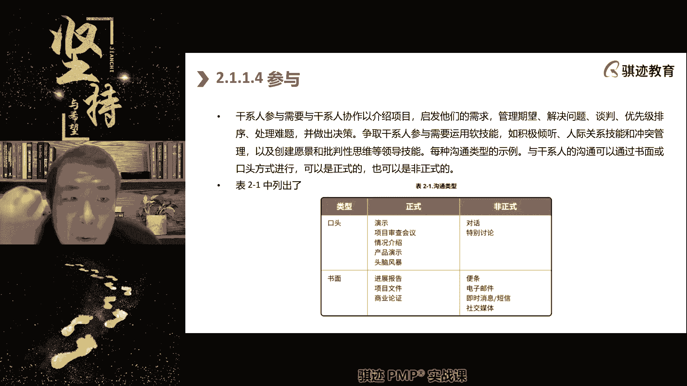

啊比如说我们举个例子啊。

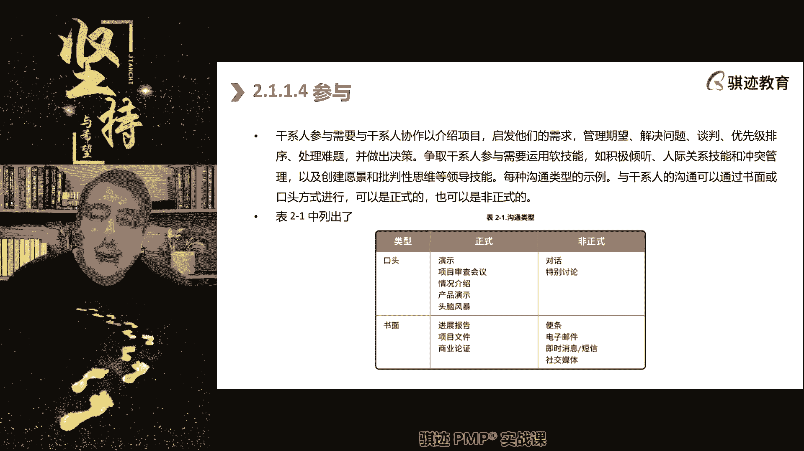

叫甘心参与，我们举个例子啊，比如说你的某项工作一定要客户的验收签字，你的某项工作一定要客户的验收签字，但是呢客户什么时候配合你验收签字呢，不知道，那么他也你也没有，但是你也没有权利决定。

客户什么时候必须面签字签字签字，但是如果某一阶段的工作不批准验收签字，可能就影响到下一阶段的工作，那么这个时候你就要对客户具有验收，签字权利的那些干县呢进行重点的参与管理，比如说什么，你在即将达到。

即将达到本阶段要签验收签字状态之前，就可以提前与那些有签字权利的那干县金，沟通了啊，我们项目马上要做出成果了，到时候为了你能看的，到时候为了能够及时的签字啊，麻烦您，那到时候我们看一下你在什么。

您在什么时候有空，最近这段这段时间，什么时候有空来参与一下我们项目，对我们项目进行验收，莅临指导，你讲的话所讲的客气点啊，有求人办事嘛是吧，这么客气啊，然后能够能够签字对吧，然后预先安排好时间结果。

但是我们讲客户在我们的之前学的里面呢，客户能决定是否通过客户验收，但是客户并不能直接去指定项目范围。

他只能指定去需求，所以如果客户在验收之前。

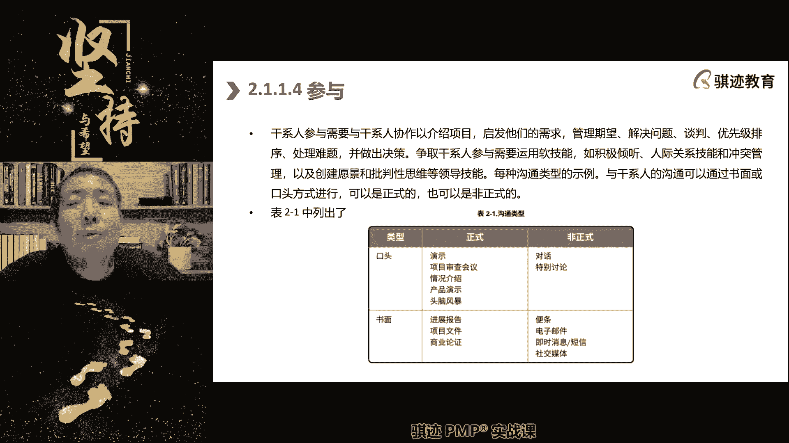

他提出了，他认为很专业的，他们认为很专业的一些意见，那么你应该适度的进行什么控制啊，告诉就是暗示明示或者暗示对方啊，你的意见我们会重视，但是你与我当前我们当前的工作提的部分要求。

与当前的工作呢可能并不具有必然的联系对吧，控制干系人的参与，因为有些人会过度参与项目当中，什么东西都要掺一脚啊，你们工作中肯定会有些人对吧，什么事情都要掺一脚，明明跟他不相关的。

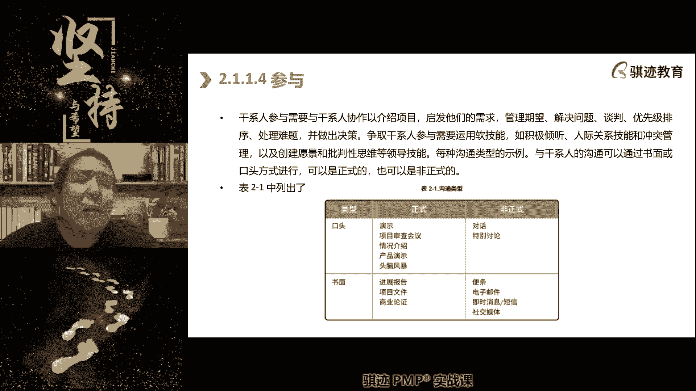

还要发表点意见啊，搞得大家很烦，这个时候你要体现出项目经理的管理能力啊。

要使得他的行为可以在你的受控范围内。

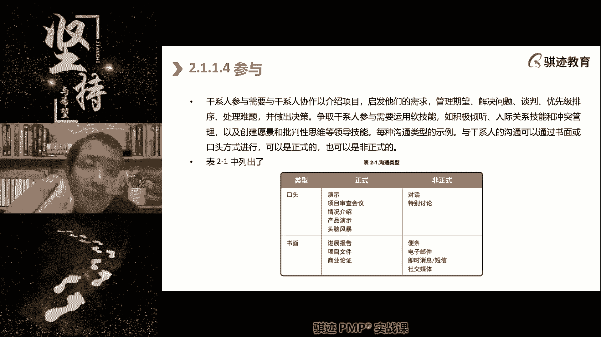

去发挥它的作用，而不要去施工，有同学说老师讲讲怎么请吃饭，哎这个和上课就没什么关系了啊，这个是属于人际关系，有空给你们讲好吧，我们先把课程讲完啊，所以我们可以通过与干系人的沟通来。

控制引导干系人的参与过程，比如说你你担心某个你比如说你识别出某根弦。

它能比如说跟按承接上面那个例子啊，它可以审批你的项目经验收你的，但是你通过之前，对预先对于干系人的了解和识别，知道这个人很就很喜欢出点馊主意啊，他自觉的水平很高啊，什么东西都喜欢管一点，搜一点。

那么怎么办呢，怎么控制这种干型的参与呢，那么就是说如果我们如果我们不能够，因为他是客户代表，你能管得到，客户代表肯定管不到对吧，你作为乙方，对甲方爸爸我们是谦卑的啊，混口饭吃的乙方啊，甲方爸爸提意见。

我们可当然当面拒绝，肯定是不好对吧，那么我们可以采取什么方法，很多同学就有实践了，我们可以就是说像像古人一样啊，我们可以故意卖两个小破绽，在让他参与项目的验收过程当中，可以故意卖两个很低级的小破站。

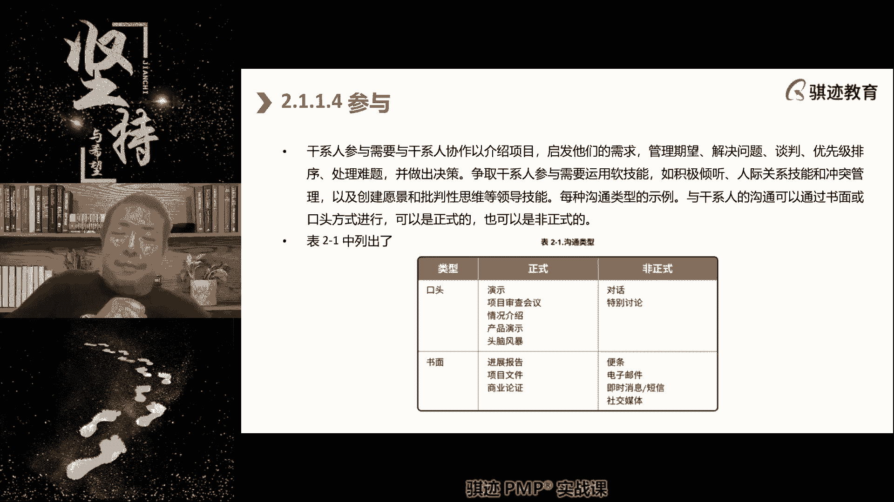

让他故意发现，然后他说哦，你这个东西要改一改，这样的改一改，那就会有很好的，怎么就是其实我们是故意漏出破绽，它前面提好改进意见，我们后面就可以把这个东西改掉，故意漏给他，然后就可以避让他得虚荣心。

或者让他的啊专业感觉得到充分满足好。

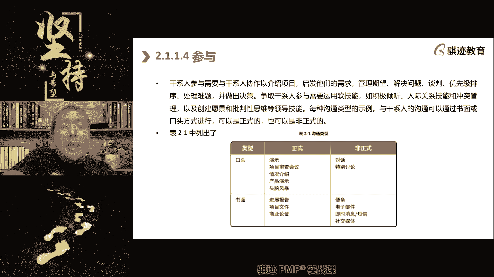

那么接下来就好办了对吧，人家生命满足了之后就好办，然后呢你可以找恰当的时机，比如再把这个话题岔开，哎哎呀辛苦了，幸亏专家指点了吧对吧，给人家进点烟，进点酒，请人家吃顿饭，然后这事情就过去了。

很多专业的项目经理在在这这种场景当中，知道怎么样适当的卖破绽啊，来防止肝咸过度干预项目当中的东西，万一他你什么破绽不能拿，他硬要挑你刺，可能把有些事情因为他有客户，你又管不到，反而可能把你做得好好的。

项目的成果造成造成很大的干扰对吧，你不如故意卖个破绽给他，这也是一种技巧啊，当然这种东西有很多的，不建议我们讲的前面这种场景啊，还有一些呢是比如说什么，还有还有些时候呢是什么，该行人可能他很懒。

或者觉得项目就他你他对你的项目很重要，但是你的项目对他呢没有那么重要，他可能你跟他说十句，他可能什么只会回你一句，那么这种人这或者这样一类角色，你就要更多的提前和他沟通，尽可能在有限的沟通频率下。

将信息的丰富量提升，就比如说你可以比如说你知道对方是这种人，打了一次交道，知道对方这种人，你就把要跟对方沟通做这东西列的非常的清楚，一条两条，三条四条，五条，六条七条，然后希望对方拿到对方的反馈。

而且你要呃如果再写的细节，对方怎么反馈，反馈形式什么yes或NO，什么多少数值等等，类似于小或者以什么形式等等，都给对方写的清清楚楚，一次性扔给对方，然后让对方一次性的尽可能反馈给你。

足够的信息啊，以便于展开下面的项目活动，这也是一种参与沟通的方法，明白了啊，这些都是我们实践当中如何去管理干系人。

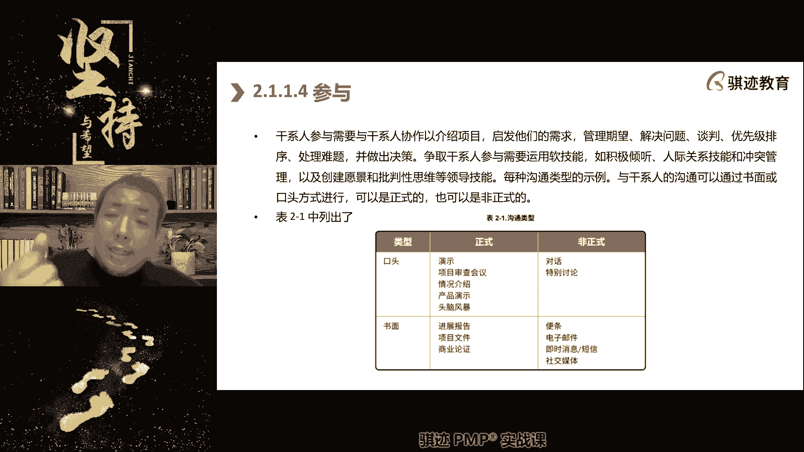

参与当中会使用到的一些实践方法，那么该行业的参与其实也有涉及到一个东西。

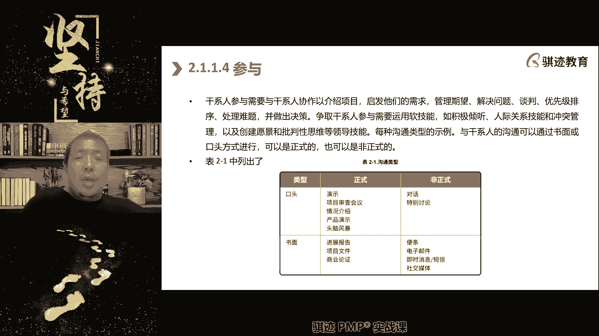

叫做期望啊，我们这里有一个词叫做期望，今天的这节课，其实实际理论和实践结合很多的啊，其实你们如果实践做的多的话，其实我讲的很多东西其实你们很会理解，但有些同学可能不是从事这方面工作，可能就难一点啊。

那没有关系，那么我们有句话叫什么叫期望越大，失望越大，但是我们用另外就是没有期望，就没有动力，所以管理该行人参与要调动起他的期望，但是要让他的期望保持在合理水平啊，比如说你想要某个干系人啊，组织内的啊。

我们公司内的不是你项目内的干系人，支持你的项目的某些工作，那么你要给他一个期望是什么，我们项目如果做成功了啊，可以满足你的什么某些诉求，或者说可以达到某些呃有益的结果啊，对你是有帮助的。

那么你对我们项目就有期望，当有期望这事就好办了对吧。

人嘛都是利益驱动的，当你对我们项目有期望，那就好办了对吧，那么但是如果你给他画的饼很大哦，我们这个项目做完，对方当然如果你饼给他塞下去，让他吃下去固然很好，但是对方如果接触下来发觉什么。

你并不是像你画饼画成这样，他就会期望越大，失望越大，所以要合理控制对方的期望，才能够最有效的什么，能够让他参与到项目当中啊，就像啊哈哈举个例子啊，我瞬间想起就像我们小时候啊，我小时候很少用这种手段啊。

但是也会有时候会有考试考完了，知道自己考试成绩考得不怎么理想，比如说我以前经常的时候，我在小学到初中的时候，经常跟我混混说，哎呀这次考试考的没有那么好啊，让他们首先要有一个合理计划。

用这个成绩没有那么好啊，年级前十你是不要想了，可能年级前20前30还能混一下啊，啊不我不要怀疑我以前就是这个水平啊，我有时候当年小学到初中的时候，有时候男的都能考一次年级前一，年级第一第二这种。

当你觉得发挥不好的时候，你就开始管理相关方的期望，管理相关方期望，让他对你觉得说哎呀啊，虽然你这样很失望，但是你觉得觉得哎呀算了啊，我对你的本次考试定位啊，父母本次考试啊。

你们你就是搞个班级前五就差不多啊，那么最后考试成绩下来了，比如说你考个班级前二啊，那他反而他虽然对你期望不高，但反而超出了期望，反而去父母来说也好啊，回去省得吃板子了，对吧啊。

我以前父母小时候父母对我要求比较严格啊，有时候没有考到英语考试考到100分啊，或者年级拿个前几啊，都会回去吃丸子的，也不是人情世故，这是一种很简单，就是用一种很简单的东西帮你们理解啊。

所以期望是很重要的东西，所以我们在管理跟前参与的时候，要给他们合理的期望，我们的项目应该能够做到什么样的程度，可以带给你带来什么好处，或者能解决什么问题，你可以把这个最终实际很大程度呢说的低一点。

那么最终能达到结果的是，可以略微超过肝炎期望，会达到最好的肝性的心理效果，那么他也会给你项目经理带来好处，下一次你再去寻找张先生支持的时候，他就非常愿意支持，比如说我心里希望你能给我带来。

比如说40分的好处，结果你给我带来了50分的好处对吧，如果你上来跟我说，我上来就把别人问一口吊起来，我能给你带来100分的好处，结果你只给对方带来50分好处，下次别人就不愿意相信对吧。

这也是不能做一锤子买卖对吧。

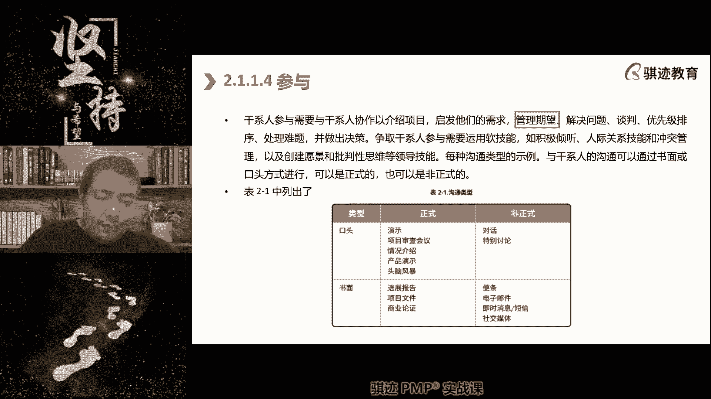

所以管理期望也是管理采取短语啊，呃合理期望。

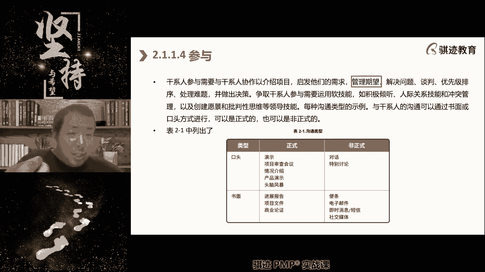

所以我一直说有一句话你们也可以记一下啊，叫做合理期望，积极参与参与项目支持呢要积极，态度要积极，但是对项目的期望呢要合理啊，要肝先保持这种状态是最好的啊，那么要想让钢琴宝这种状态叫一个沟通。

就像我们前面讲的举例的沟通啊。

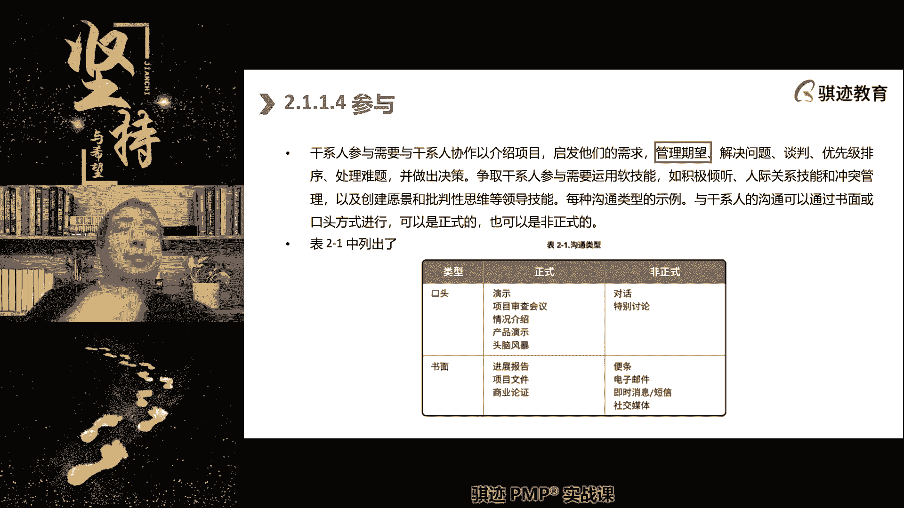

你可以用正式的沟通，非正式的沟通啊，项目经理注意，我们很多时候真正对别人的产生影响的，能够呃管理到干系人，参与的往往是非正式沟通更多啊。

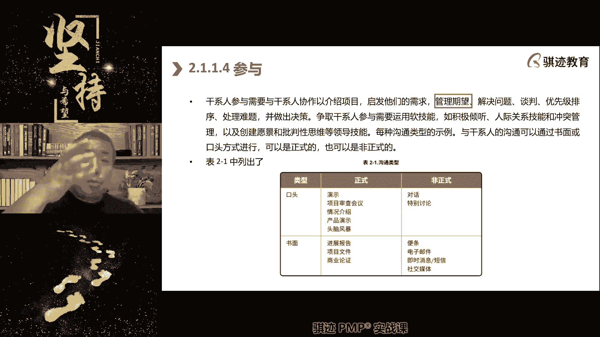

好你继续讲好。

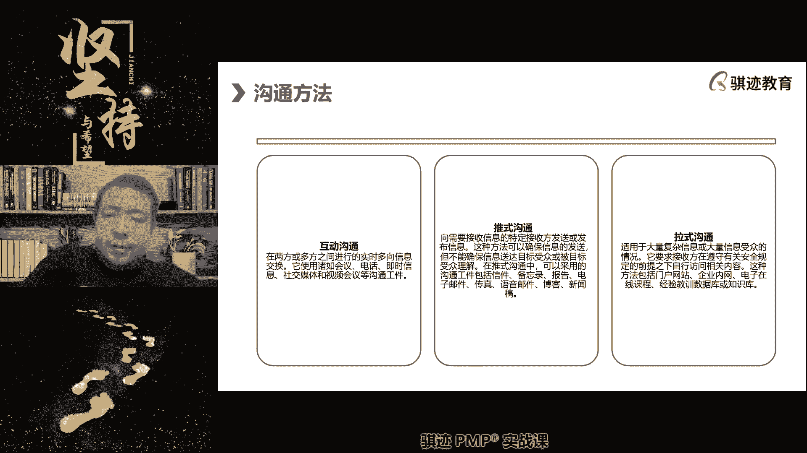

那么沟通当中呢我们要讲啊，我们因为把那个参与和沟通合起来的啊。

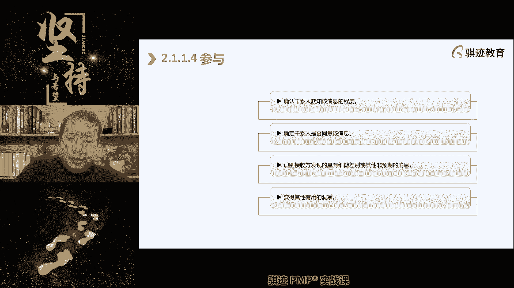

那么沟通当中呢会有一个考点啊，注意会有一个考点，明晚还有跟我们明天有礼拜四，还有啊还是有课的啊，今天的课是补昨天的课，因为昨天我去做手术了。

做完手术之后回来之后，学校担心我，那就改到今天好，那么沟通当中，我们因为沟通和干系的合在一起的。

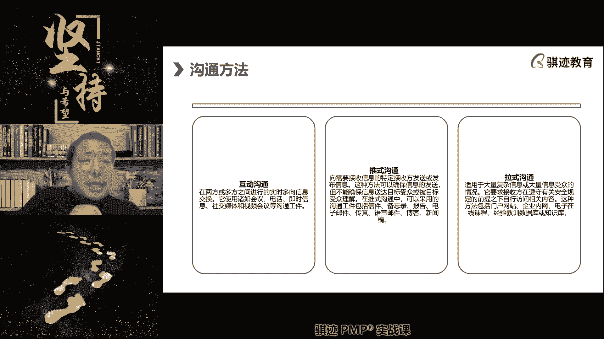

那么沟通当中就有一种，就就有一系列的沟通方法，这个我们就在这里就在这里讲了啊。

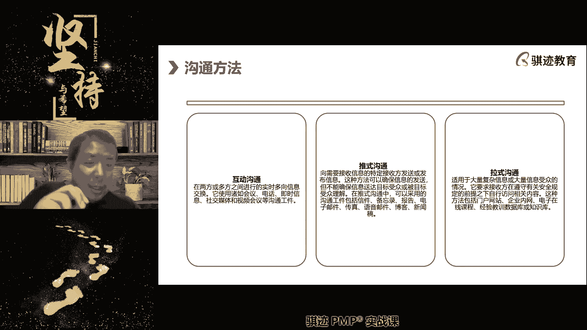

沟通当中会有三种主要的沟通形式，第一种形式叫做互动式沟通，什么叫互动式沟通啊，就是沟通的双方实时的交换信息。

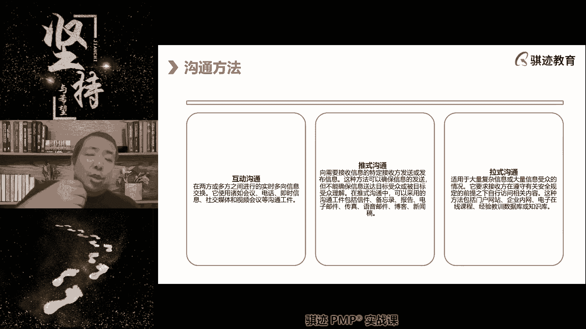

这叫互动式沟通啊，我我和对方实时的交换信息。

就叫互动式沟通啊，那么我们要不要开视频会议，把打电话啊啊面对面交流。

这些都是互动式沟通，那么他有什么好处啊，请记住啊，沟通不能依靠单一形式，项目就是沟通应该多种形式结合的，互动是推迟大型互动结合啊，我们后面会讲互动式沟通有什么好处啊，信息传递快，交换效率高。

而且不容易被误解，比如说我们俩面对面沟通啊，我说一句，你说一句这种误解是很难的对吧啊，面对面对吧。

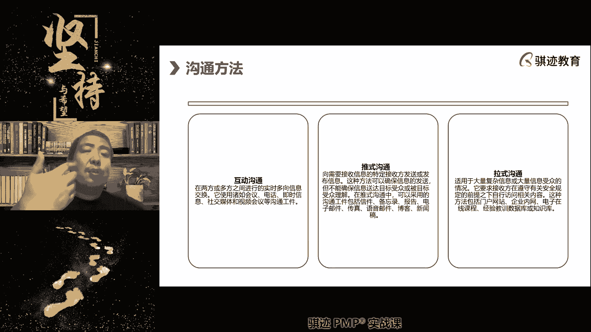

我们之前讲过对吧，人和人之间沟通误解什么隔一个人，隔一个人，隔一个人沟通对吧，叫靠背不走样，大家以前都玩过这个游戏对吧，这个就是典型的什么沟通隔环节多，造成什么，造成了沟通的隔阂和误解。

那么在互动式过程当中就不存在，因为大家实时面对面，或者直接的进行信息沟通啊，这是互动式沟通的好处，那么互动式沟通的缺点是什么，互动是沟通的缺点是什，有没有同学能说一下。

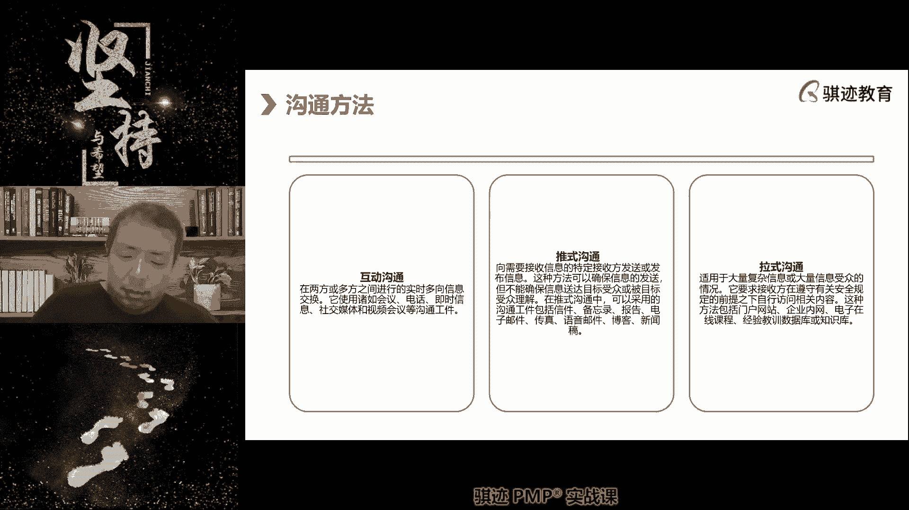

信息泄露，沟通成本高，沟通是双向输出，容易偏离目标时间的互动，是沟通有这样的缺点啊，所以也不是说都要一互动式沟通，会占用所有参与互动式沟通的人的时间，所以当库是沟通的参与方越多。

那么总消耗沟通时间就越长，这就是为什么在敏捷的沟通当中，我们都讲究快速精干对吧，因为什么只能说三的啊，我们干了什么，准备干什么，有什么问题，B为什么要这么精炼，就是尽可能的节省所有人世间。

因为互动是沟通啊，如果比如说像开个大会，如果时间一长，所有人都不能不要干活了啊，我呃信息不好保留，就没有这个缺点啊，那我我见过一个很糟糕的互动沟通啊，有经常有些企业，那么他管理者呢也不能说不上心。

就是说他管理者会定期开整个部门的会议。

一个部门可能上百人开整个部门的会议。

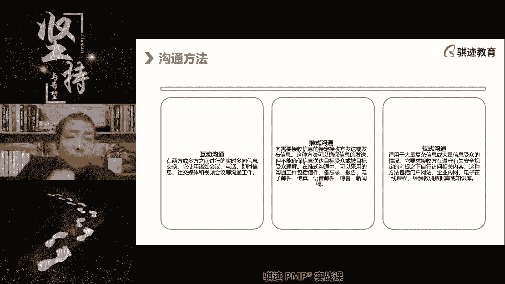

然后每个人呢都会参与到所列的话题当中，结果呢每周开个周会，每次开个周会都要有个大半天，是一整天的时间，你可以想象一下，一个部门上百人开一天的会，就等于这个部门，实际上所有人的供有效工作时间只有四天。

这是不是一种巨大的资源浪费，所以互动式沟通如果频繁和时间长，会导致大量的人力资源的开销，因为开会是不会创造任何价值，请记住，开会是不会创造任何价值啊，它只是信息的一种啊沟通方式而已啊，所以开会啊。

以开始是会面对面会议为主的互动式沟通，他会消耗大量的参与相关方的时间啊，因为你要实时参与进来，会消耗大量的时间，所以这个度应该严格控制和把握啊，所以在一些管理机制不太好的公司，经常会有这种现象啊。

就是领导都什么整天都在开会，要了下药，到下班之后，财控去处理走向的工作，领导也自己工作做对吧，领导的白天主要工作是开会，所以有一些企业当中，为什么领导总是喜欢在下班的时候开会，可能不是因为呃。

呃有可能也不是因为领导他故意要让你们加班，而是因为领导在白天那时候没有空，拉着你们开会，但是领导被人家拉了一天会之后，他要在当天去总结一些东西，要把很多东西交代给你们，这个时候临下班了，他就拉你们开会。

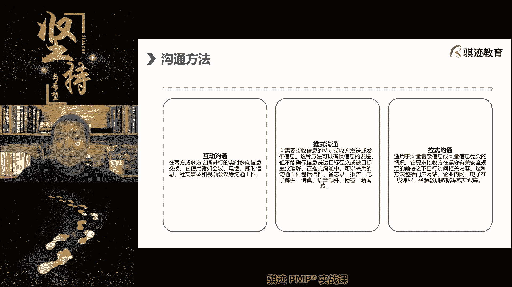

这是一个体制机制不良造成的，向下传递所带来的负面结果。

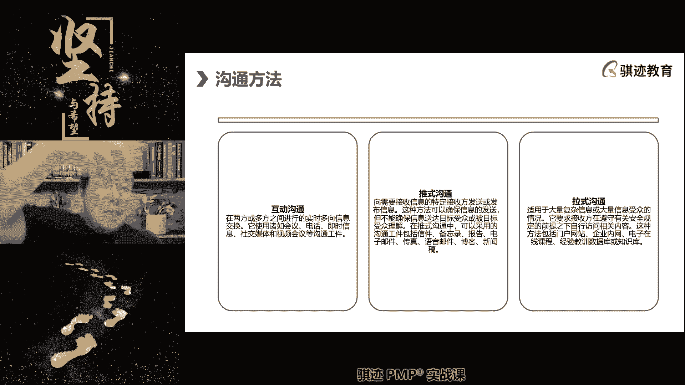

就是互动式沟通，占用过多的工作时间，别洗了查老师，我没有洗，我就是告诉你明白啊，也有很多傻缺领导，他是故意就让你们加班。

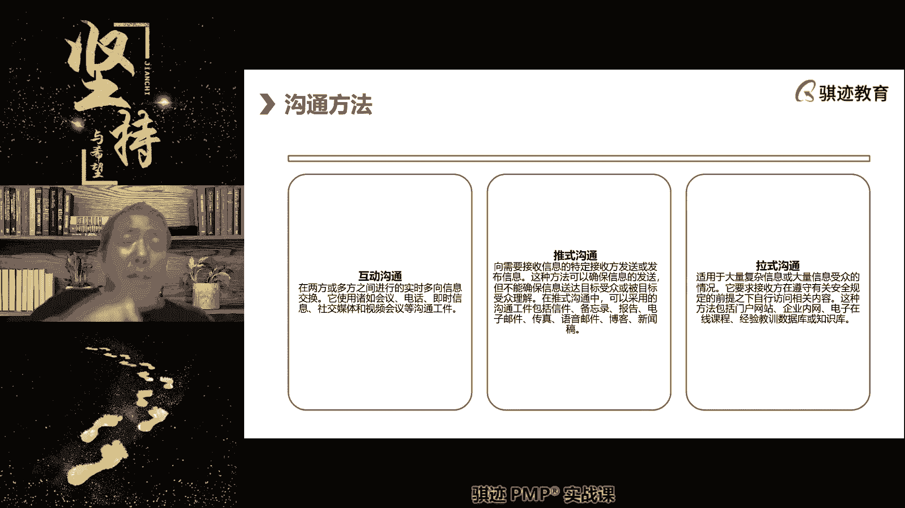

然后再去，但是也有些领导他真的是无奈，他整天的是实实在在的排满。

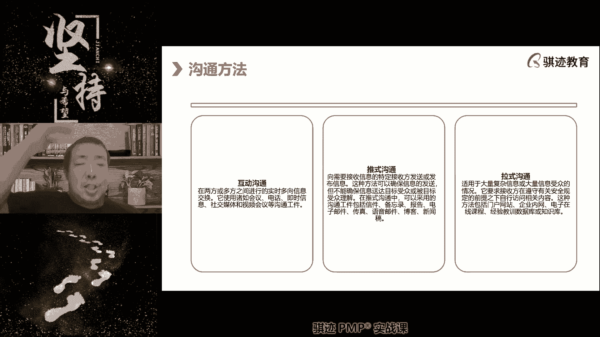

只有到了下班他才有空，他的才能跟团队去关照一些事情，他没办法，所以才给下了班，给你们开会啊，对很多的领导就是喜欢晚上干活，就是这个道理，在一些大型组织当中，他往往都是晚上发邮件。

晚上就是因为白天都在开会，被人家互动占用是吧，这这不是你们明白，这是一个客观存在的事实，但是这种管理模式肯定是存在问题，好我给你们说一下，这就是互动式沟通的缺点，那么第二种是推式沟通。

退市沟通的典型代表着什么，电子邮件发邮件大家都知道对吧，退市沟通是什么沟通呢，受众他的沟通是单向的，有受众就是信息的接收人是指定的，由发送方指定的啊，我发给哪些人啊，是指定的。

然后呢一次性发给指定的受众相关的信息，明白吗，所以这种方式呢叫推迟沟通，推进式沟通有什么好处啊，受众确定，所以我想给别人看见，我就写在里边，如果我想给别人看见，但这东西对这个人不太重要，我就抄送他。

如果我只想给他一个人看见，但是不想让别人知道，我就密超对吧啊，BCC逆超他对吧，发送抄送和密超。

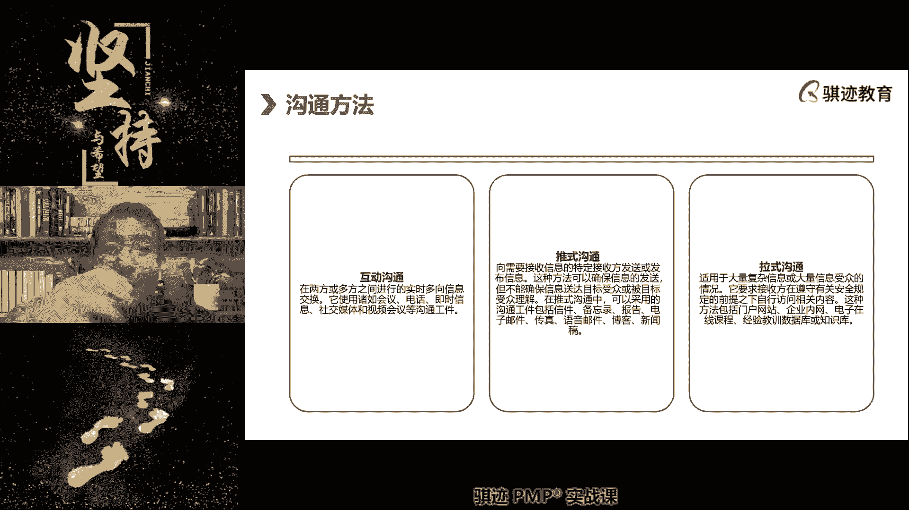

但是有区别，大家知道知道知道对吧啊，这就是推迟沟通，推迟沟通好处是什么，受众确定啊，然后呢不会实时的占用时间，你可以在任何有空的时候呢去收看邮件啊，那么大家可以让受众沟通的受众方和发送方。

能够呃有呃自由的时间去调配啊，什么时候看邮件啊，比如什么时候看邮件，什么时候收收报告，但是呢它也有它的缺点是吗，邮件这种杂技一沟通效率差，这是第一，因为邮件一来一回，大家工作都知道是吧。

用邮件一来一回特别浪费时间啊，所以敏捷当中我们讲啊，非必要，我一般不用邮件沟通，就是这个道理，实时沟通我们讲究效率。

第二邮件像类似于邮件这种推迟沟通，他很难一次性沟通复媒体信息，什么叫负媒体啊，我邮件推送一般很难推送一个视频吧，一段语音很难吧，或者我要推送一段互动的内容的视频很难吧，这些东西都是邮件做不到。

或者你一个邮件群发出去。

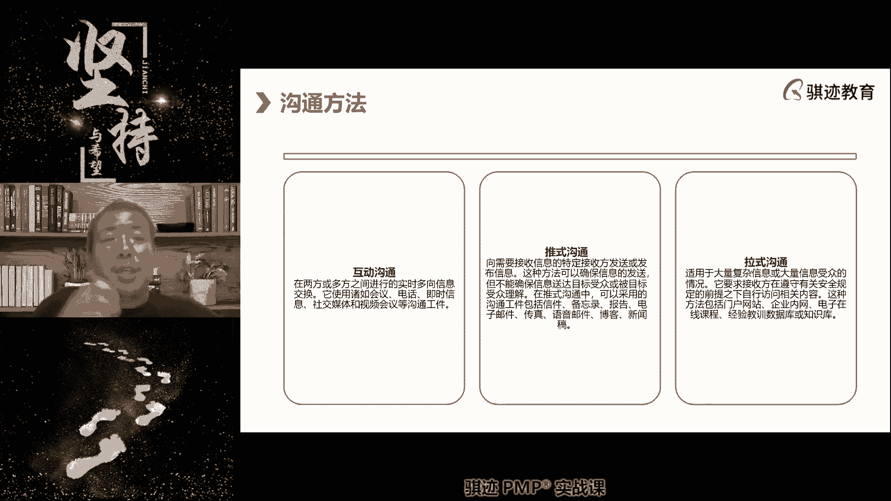

里面附件是几百兆的，上一个T的啊，一个G的。

这个时候你可能没办法通过邮件系统，因为会被什么拦截掉对吧，诸如此类。

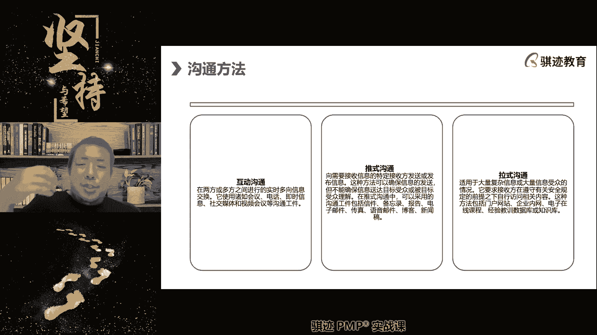

举个例子啊，诸如此类，所以这种推送呢往往是什么，往往是简单信息是受媒体，就是以文字为主的载体，所以他的表达能力有限，反馈速度慢啊，但是受众确定受众确定。

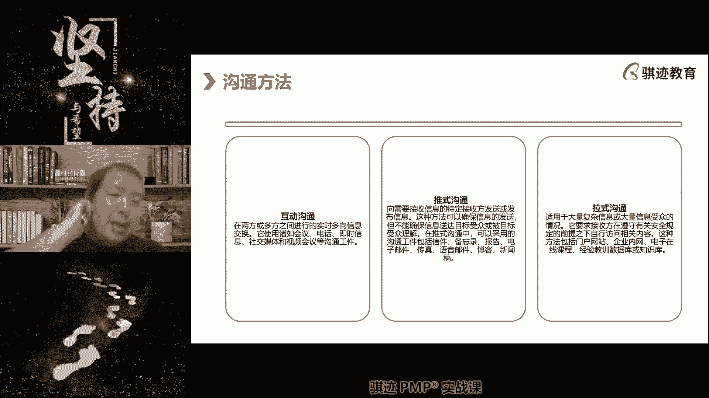

对的啊，所以这种形式也是可以使用，但是要知道缺点，那么与此相对应的，我们用第三种叫拉式沟通，什么叫拉式沟通啊，就是我将指定的信息，复杂信息放在指定的地方，然后任由潜在的受众自己去拿。

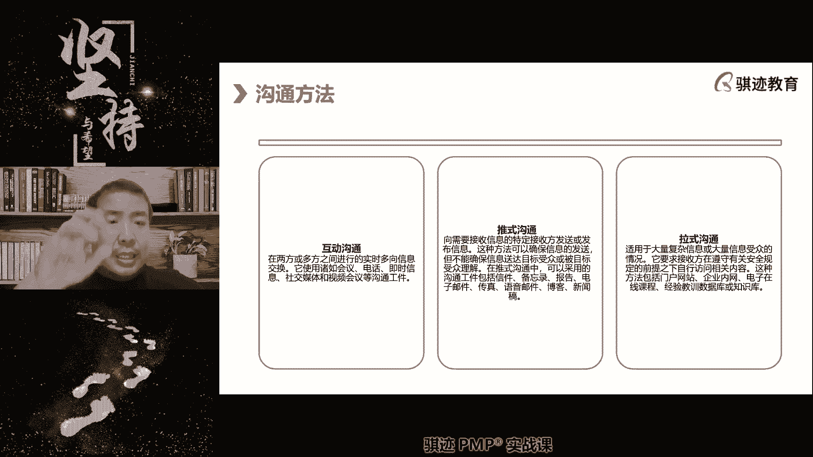

比如说我们今天上完课，我们会将查老师的课放在小额通的网站上，大家有些同学今天晚上可能有活，没办法干活啊，所以没办法干活，所以没办法呃，呃干活没办法来看直播，我们可以事后看录播，看录播就是一种拉式沟通。

对我们将知识文档放在我们的内部网站上，我们的内部公告人啊，或者我们的经验教训知识或数据库里，然后让有需要的人自己去取这种沟通方式，就叫拉式沟通，拉式沟通考虑什么，可以描述一个复杂的事情。

或者用用用用丰富的信息来沟通我们的内容，但它的缺点是什么啊，受众是不确定的，你并不知道对方看了还是没看，所以我给你们上课，在线上课有一个缺点，就是我不知道你们认真没有听啊。

如果我们是如果听我看我看上我的线下课的话。

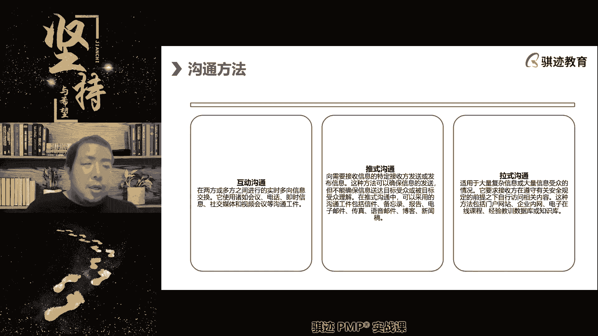

我线下课哪怕现场有100个人，100多个人啊。

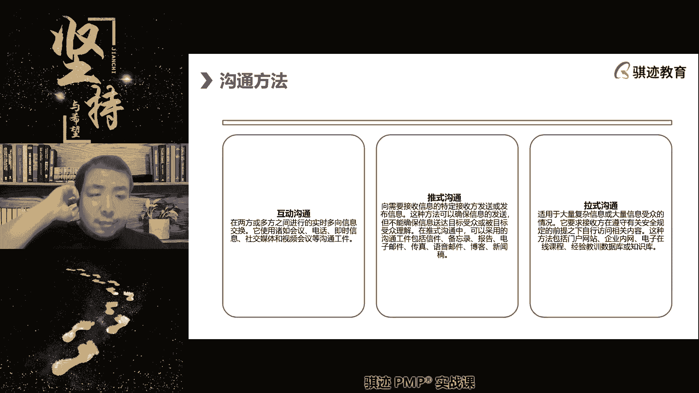

一个教师上百人，我也能关注，几乎所有同学的学习状态。

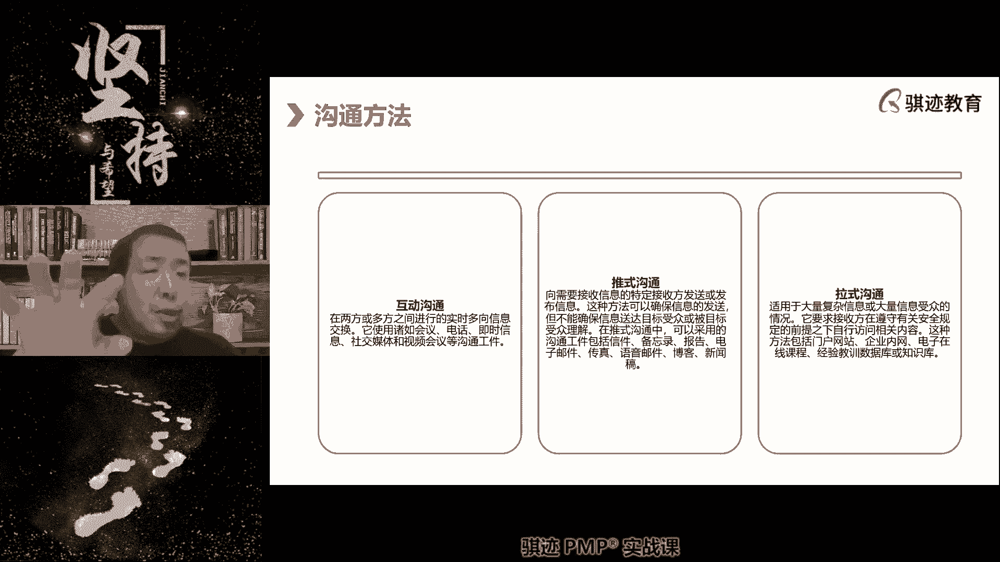

如果有些同学明显不在神走神了，我会提醒一下啊，或者让他起来回答问题，回答个问题，我可以实时的知道对方的信息反馈，有没有认真的听我的课，但是在线我就没办法看到你们。

所以我有时候会为什么上课会问问你们问题啊，是希望把你们吸引到上课当中来啊，所以在线的直播教育本质上是一种什么，推式沟通和拉式沟通的结合啊，这是我们在干性管理当中会选择的沟通方式。

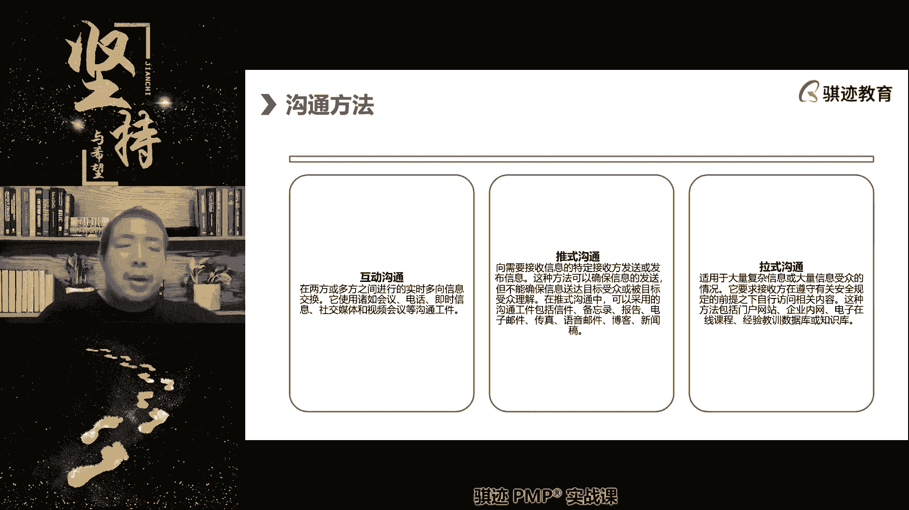

注意不同的沟通方式使用于不同的场景。

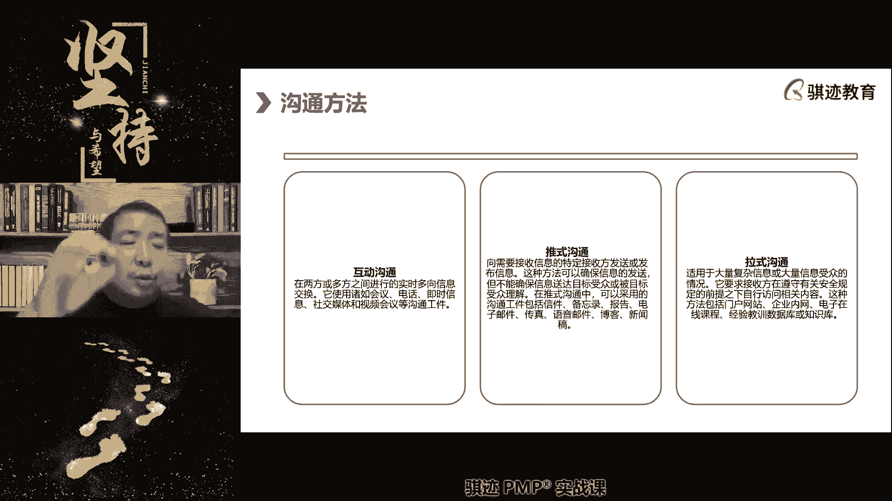

它没有绝对的优劣，适合不同的沟通场景需求啊，我们只有运用正确的沟通方式，就是所谓的号，那个HOW的号，才能达到该系统所期望的沟通结果，直播并不是纯粹的互动式波动，因为直播当中我给你们的信息占绝大多数。

你们反馈给我的只占很少数。

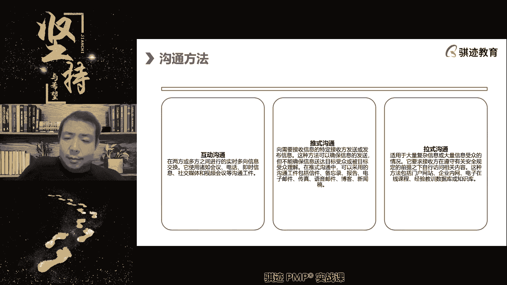

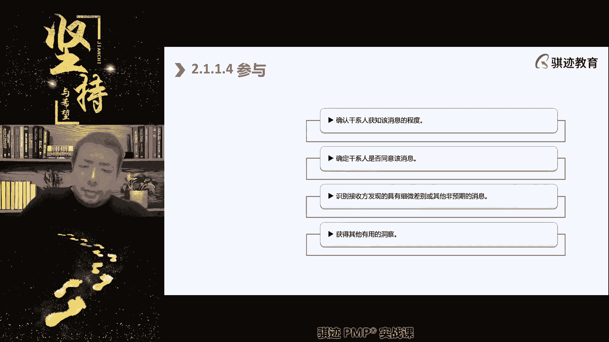

好这就给你们总结的啊。


如何区分干性的边界，就是我在P站给你们总结的啊，这个前面我们已经说过了对吧。


Who what how when public。


那么我们前面讲过，总是先检查沟通这个五个W有没有做好，做好了之后再去看该行人的啊，对他的定位，对他的规划有没有做到，那么就说这个叫做什么，对于肝咸的参与的规划啊，按照PMBOK第六版的说法。

叫做该系人参与计划，你们可以记一下啊，万一他考的是用老老的知识点，这干性呢叫做干系人参与计划，那么沟通呢是什么，我们的沟通规划和沟通过干系的沟通管理计划，这两个是不同的方面啊。


之前讲过了的赘婿啊，好，那么接下来我们就讲一个干系人，如何去重点管理，我们会有一个权利利益方格啊。


那么第七版的教材呢，又回归到了最传统的干性的权力地位方格啊，而嗯很少提那个权力利立方体和和凸显模型啊。


但是我们会在后续我们讲的那个工具专题当中，会提到一些啊，这个这里先不提，那么我们会把该写分为呃，根据他的权利相关性和利益相关性，分为这四个象限来进行管理，那么当这个干系人对我们的项目权力很大。

权力就是英文叫power，他有时候呢这个字你英文这个词的多义词，power既代表能力，能量，也代表权利，所以原书当中power这个解释比较模糊啊，我们更多的理解是理解为权利啊，那个power。

当他权力很大，利益相，这里的利指的是利益相关性很高的时候呢，我们应该对他重点管理好，我们这边刚刚讲过哪些人默认都是重点管理的，来关那个公益大师，我刚刚跟大家薛吉讲过，哪些人在项目管理中肯定是重点管理的。

发起人高层客户主任是什么东西啊，注意用户不一定是爱你的表达，就那个了啊，用户不一定是客户，是因为用户只是使用的人，他不一定有发言权，你不一定有单权利，客户是买单的人，买单的人一般来说权力都很大啊。

高层发起人啊，还包括如果有客户的，还包括客户啊，默认那么其他的就根据不同的项目来取决，所以权利又大，利益相关性又大，我们自然要重点管理啊，那么如果这个人呢是权力很大，但是跟我们的项目的利益相关性很低呢。

我们是使用的是令其满意，那么这个这种人往往是什么人啊，那么这个很明显就是我们公司当中，和我们项目不太有关系的，公司高层或者客户的角度当中，和我们项目没有直接关系，但是有一点点间接关系的客户呃。

相关方改写这些人呢就是令其满意，他们可能也很有很有话语权，但是因为与我们项目不太相关，利益相关度不高，他们往往是不会运用权力，对我们的项目的关心和期望程度都很低的，都很低啊，有些同学说啊，对智利委员会。

这也是啊，客户总攻，嘿嘿，客户总工也不一定，是不一定是那个利益相关度低啊，有可能也是很高的，所以这个时候呢我们就要使用令其满意啊，什么叫令其满意，通俗的话解决他怎么爽怎么来。

可以来就说他只要觉得爽了就可以了啊，不需要他深度的参与项目，因为他利益相关度不高嘛，他深度参与项目，他们没有动，只要让只要让他感到满意开心就好，比如说某个公司的高层，它呢跟我们项目的不太相关。

但是呢偶尔也跟我们项目的有一些基础，那么他这个人呢怕麻烦，好亲近，那么你对他最佳的管理方式是什么，只在最关键的重要节点给他发发报告，平时的时候如果他不过问，你就不给他发报告，因为他嫌烦，你知道吧。

这时候他就满意啊，你没有忘记我，但是你也不会来骚扰我，这个感觉你明白了吧，啊，呃好这我就不多展开了啊，这就好比什么东西啊，女神对她的舔狗就是这种期望，你不会忘记，但是不会再骚扰我。

因为我虽然在我的心中是你的女神，但是啊呃我对你是不屑的对吧，开个玩笑啊好那么第三种人是什么，他与项目的利益相关度很高啊，另一块它的相关度很高，但是他没有决定权，那么这个时候呢。

就随时告知这种这种人典型是什么，是用户啊，尤其是最终用户，比如说我经常喜欢举的例子，我们每个人都要用手机对吧，我们成年人每个人生活当中都离不开手机，离不开手机号码，所以我们都是三大运营商的什么用户吧。

甚至是客户吧，但是我们对三大运营商有没有影响力啊，有没有权利啊，没有，所以运营商是怎么对待我们的，丁寄来的短信，您的手机已欠费停机，请及时充值，这个就叫随时告知，明白了吧，也就是说当相关方。

干系人对于项目没有什么影响力，但是呢项目对他的利益相关度又较高的时候呢，当影响到他的利益的时候，会及时告诉相关方，但是他没有权利该写，但是他没有权利决定项目的东西，这就是这个时候就使用随时告知对吧。

那么最后一种呢就是叫做监督，就是说权利利益又低又低，就说不太相关的，沾点皮毛的，又没有权利，就没有利益的啊，你沾点皮毛就要监督一下啊，这种人呢啊我经常喜欢举的例子，就是什么。

我们项目是一个工地建设项目啊，我们工地请了一位看门的老大爷张大爷，那么我先问你们，张大爷属于项目当中的是什么，是什么一类的吧，工地看门的张大爷，所以项目当中属于什么类。

第一不是你张大爷还是有一定的权利的，但是我们项目和张大爷是向我们的项目的成败，和张大爷是息息相关的啊，张大爷更多的应该是偏向于C就是随时告知哎，张大爷注意了啊，最近最近这两天啊，我们工地上小偷挺多的啊。

给我留着留着眼睛盯着啊，要告诉他一下就行了对吧，看门老大爷吧，也就看个门的权利对吧，你指望他，得有人问老师，这个利益是客户利益，是我们的利益，这个利益指的是相关方干系人，我们的项目对于相关方干写的。

就是我们对他的这个领域，就比如说我们项目干得好，比如门卫张大爷，如果我们项目干得好啊，项目干得好，那么我们项目上每个人都能发奖金对吧，自然的张大爷也能拿到一份奖金对吧，门卫也是人对吧。

所以我们给他利益相关度很高，但是呢张大爷呢没啥权利，只能看个门对吧，那么如果是张大爷相对，我们项目当中就没什么利益了，所以这个利益是我们的项目相对这个关系，它的力度有多大，没有没有没有。

张大爷相对我们项目当中就利益就很低了，因为我们找个看门大不容易吧，国举的不是张大爷，什么人，是用监督啊，张大爷的侄子啊，小张他侄子不一定姓张对吧，张大爷的侄子小王，小王呢有时候会来工地看望他的张大爷啊。

这个时候呢与你项目呢也没啥关系对吧，那么你就最花最少的精力盯着一只眼，那么你某一天发现什么东西啊，原来我们工地频繁失窃钢筋，就是张大爷的侄子小王敢偷我们的钢筋，然后一把把他抓起来啊，这就叫做监督啊。

平时如果没有什么事情，就说一只眼睛瞄了一下啊，知道一下就可以了，但是如果有问题的呢啊，我们要对他进行监督啊管理，所以如果小王不从我们的项目偷钢筋，他和我们的项目是几乎没有什么关系对吧。

他是属于权利率又低，利诱低对吧，我们项目又不给他小王发奖金对吧啊，我们项项目又不给给小王带来任何好处，所以他小王也不能决定我们项目上任何东西，所以他的权利和利益都很低啊，但是如果他来我们项目偷钢筋了。

那么它是一个有害的干系人，我们要对它进行什么监督和支持啊，然后呢把张大爷给炒掉。


因为张大爷放纵自己的小侄子小王，到工地偷钢筋对吧。


OK我举举这个例子告诉你们啊，什么是监督，就是这个意思啊，举个例子啊，不用不用太过于纠结啊，考试也没有考那么细啊，说实话考试没考过，对张大爷的侄子小王啊，如果他来工地上看望他的张大爷了。

那么他也是项目的干系，他是一个非常边缘的干系，哪怕他不来偷钢筋，他来看望唐大爷，因为也来到我们项目上，万一他在项目，我们项目上不小心被我们项目上什么东西啊啊，石头砸了一下，说是什么什么。

被我们项目上的什么什么东西给搞了一下，就受了伤对吧，我们得赔钱，和我们项目有潜在的影响关系，是的啊，跟我们项目占了那么一丁点边的，也算感谢。


不要怀疑啊，OK这个呢稍微理解就行了啊。


稍微理解一下就行，因为它潜在我们前面讲的。


它潜在可能受到项目的影响来对，OK好，那么接下来我们讲一个工具，这个工具我觉得很傻，但是呢忒强哈哈啊，得讲，这叫做相关方参与度评估举证，这个东西挺傻缺的，虽然这个概念我们经常会相对用到。


但是我老外这个地方还是偏理论的啊，那么这个矩阵是什么意思啊，就是我们对所有项目中的相关方法，其实就是该写啊，当然这个是因为从第六版考过来的，第七版这个东西也会考，但是这个改成干系人啊，大家知道就行了。

我就不改字字眼了啊，干系人对于我们项目有各种各样的态度，他的态度我们一般会分为四类，不知晓抵制中立和支持啊。


有额外的一类叫做领导啊，领导你可以认为什么是积极投身于项目当中，那么我们会对所有的啊，所以至少是主要的，或者是有一定优先级的干系人进行什么，这个评估，他对于当前项目的态度和期望是怎么样的。

和我们希望它达到什么程度进行分析，会列出这样的很傻缺的表格啊，那么这个表格当中，C代表当前干系对于项目的态度，第代表我们希望他做到的程度啊，这个表就到相关方参做评估矩阵，那么这在考试当中经常会考到。

虽然这个东西很少经常考到，那么它是什么作用呢，想要知道为什么干系人没有如我们期望的那样，对项目进行支持，或者干系人为什么会表现出对项目的抵制，那么我们应该查什么工具啊，就查这个相关方参与度评估矩阵啊。

我不知道PMI为什么特别喜欢这个东西啊，所以你们就记住，当我们要知道当前的相关方的期望和和态，度状态的时候，我们就会去查相关方参与度评估举证啊，那么如果考得深入一点的呢，如果如何提高相关方的支持程度。

那么我们先会去查这个矩阵，然后根据相关方的态度和期望，来采取针对性措施啊，注意这我会给你们讲一讲啊，如果相关方对项目不知晓的当前的态度，那么应该怎么办，应该给主动接洽相关方，高干线，告知项目的内容背景。

然后让他能够了解项目，如果相关方抵制项目怎么办，相关方如果抵制项目，应该和相关方进行沟通啊，啊告诉相关方，那么别人如果抵制你，那么十有八九肯定是什么，你与他的你的项目与他的理念或者利益相冲突。

那么这个时候呢与相关方沟通，然后呢我们求同存异，然后我们啊晓之以理，动之以情啊，然后呢化解他对项目的抵制啊，抵制如果相关的对项目既不支持也不反对啊，那么我们应该怎么办，应该更深入的啊与相关方进行沟通啊。

这些东西啊啊我们之前其实也讲过啊，你们最好是记一下，如果相关方是中立态度的，那么我们应该更深入的给相关方干系人啊，进行沟通，提供更详细的信息来干什么，表达项目的成败进展，和利益与相关方之间的关联关系。


把他把项目和相关方之间通过利益关系拉近啊。


从而获取相关方干事的支持。


能够使它变为支持性，那么我们默认啊这个东西啥，就在于，我们默认相关方都应该最终状态是支持项目，哪种类型，对实践工作当中演示啊，注意画饼都是不好的啊，甚至有时候你都画不出饼，所以要想别人支持自己。

最好的办法是什么，给出实实在在的利益，哪怕是很小的，但是实在可以的做到的这种利益给相关方，那么这个才是一个什么好的办法，那么领导是什么，积极投身于项目，带领大家啊啊对项目做出贡献。

这个时候态度就非常的积极了，他不需要特别的设定，那么一般来说只有内部干系人，我们会期望他达到领导项目的程度啊，外部干系，因为我们讲内外有别，以及讲我们讲干型参与项目的规划和设计当中。

我们一般不希望过多参与，主要是适当参与，一般不会使用领导这个层次，好明白了吧，这是相关方参与度评估矩阵的作用和意义，如果你们这个东西定义不是很清楚，你们其实只要知道呃，如果考试考题问到为什么相关方呃。

实际的表现与我们的期望有差距，反正考题当中相关方有差距的，有差异的，很容易就选到什么相关方参与度评估矩阵啊，就干性的参与度评估矩阵啊，用这个工具来分析差异，找出原因，总的来说无论多离谱，先沟通对。

万事先沟通这句话总说的不错，万事先沟通，沟先沟通总是不错啊，所以很多的选项当中，如果你不知道怎么选的话，你可以优先考虑沟通一下项目管理的啊。


一大艺术就不就是沟通吗。


好那么考试一个小家，那么该行人最终呢我们会形成一个什么。

干系人的参与计划，在干系人参与计划当中。


我们会设定买啊，不一定是每个人啊，主要的要优先管理那些干闲参与到项目的程度。


他应该了解到项目的信息的程度，以及他应该期望给项目做出了贡献程度，这些都是事先我们设计好做好计划。


这个计划就叫做干系人参与计划啊，当干系人没有按照我们的期望，达到该行人参与计划的时候。

我们就会使用相关方参与度评估矩阵及评估。


为什么没有达到它，它的差距在哪里啊，那么针对不同的干系人参与项目。

我们要设定不同的沟通规划啊。


设定不同的话，如果他深度参与项目。


那么我们就跟大的沟通要更频繁，更直接，信息量更大。


如果他参与项目程度浅，那么我们的沟通可能可能更多的是什么，是以项目绩效报告。

定期报告为主对吧，不同的人啊，用不同的沟通方式。


所以针对不同的人，我们会使用不同的沟通规划。


这个也是非常重要的啊，那么这个就就就就就就就什么用我们的古话莲。


就是见人说人话，见鬼说鬼话，但是你要正面理解这个意思，其实说的没错啊。


要用别人听得懂的方式，然后沟通他，然后引导他找到自己。


你希望他在项目中的一个定位。

好吧好，那么顺便说一句，在沟通规划当中，我们最重要的那个what是什么。

项目绩效报告对于预测性来说，最重要的沟通是项目绩效报告。


对于敏捷来说最重要的沟通是什么，信息辐射源，你们请记住啊。


你这当中最主要的沟通对象什么，信息辐射源，因为在信息服务员上。


它可能是一个看板，也可能是一个电子屏，也可能是一个白板，然后呢，我们会将最新的状态在上面，用自动化或者人工的方式去更新在上面，以便相关方能够实时了解信息内容，这是敏捷的方式。

那么预测型呢更多的是使用了什么。

我们的工作绩效报告，定期的工作绩效的报告，这些东西张嘴就是。


好哦，今天的时间有有一点点那个有一点点那个。

啊九啊。


因为最后我们还会因为沟通的技巧没有啊。


没有沟通的技巧啊，No no no no，只有只有相关方的啊，干性的纪晓雨，所以我们最后要讲一个工作呃。

是实用自己做实用小技巧，开会啊开会，那么开会有这样几个步骤，我们要给大家简介绍一下会怎么开，是最为啊是最为合理有效的啊，我给大家介绍一下，有些同学可能不擅长开会，或者根本不知道怎么开会。


才是正常正确的开会方法啊，那么第一如果你要开会，首先要什么，你设定这个开会会开会的目的是什么啊，我们日常工作中经常会有什么东西，有些人觉得什么一有什么问题呢，又有什么东西就开个会啊。

但是开个会呢又没有明确的目的和主题，导致工作效率低下，有没有这种情况，有的听懂掌声啊，听懂掌声，在公屏里听懂掌声，所以开会第一要务就是什么，搞清楚这个会议的目的和主题是什么，先把目的和主题定下。

接下来根据目的和主题展开会议的议程，就是会议我们会讨论哪几个小议程啊，topic啊，我们会讨论哪些点，每个点或什么，或者讨论哪几方面的内容，对吧啊，这个也是很重要的，那么这两个是要项目经理预先准备好的。

因为没有准备议题和议程，开会就会漫无目的，像无头苍蝇啊，一群人那边开了几个小时，结果不知道什么东西啊，就很糟糕，其实是一群就是一群人，我们往往无效的会什么是一群人浪费时间。

陪着个别的几个嗡嗡的苍蝇在那边浪费时间啊，听懂了还可以再涨上，很多时候的无效会议都是这样啊，要有明确的议题和议程，有了议题和议程之后呢，我们会使用什么设定恰当的形式，是面对面的开会还是站会还是座谈会。

如果使用站会，我们告诉所有人，这次是站会，所以应该使用展会的规则，就是什么有屁就放，没屁憋住，尽可能快地沟通证券信息，用严格的沟通规则，如果不是这样来告诉大家，沟通的形式，开会的形式。

好那么接下来这些东西定好了之后呢，接下来很重要的事情先不要急着安排，会，先从最重要的就是我们讲，以大比较大型和重要的会议为例啊。


先从最重要的会议参与人开始去约时间，这个重要是指的是如果缺了这个人，我们的一切讨论都是没有意义的，从这个角度进行排序。


而不是谁的权利地位最高啊，而是这个话题缺了谁是最没有意义的。


从这个角度从高到低排序。


然后去续约这个排序，降序排序的前几位的那些人有没有空来参加，如果你至少能够约到啊，因为一般遵循八二定律嘛，这个降序排列当中，前几个人他们有一个共同的时间点的，以他们共同能够参会的时间点来安排。

接下来的会议时间，这样的话你才能达到一次性把会开清楚，并且不会浪费大家时间。

否则要么这个重要的参与人不在，要么那个从小参与者啊，对不起，这个会，然后跟这个开完了再跟那个开，然后两个会还并在，结果还并在一起，就是合不起来，然后再开一个会，无效会议的第二种形式，就是这样。

总有人缺席啊，明白了啊，听懂了可以继续长生，如果你们有共鸣的都可以长生啊，好这个好了之后呢，你就开始安排会议的时间，那么接下去那些不太重要的与会人呢，你也是强调尽可能参会，但是他们已经不太重要。

但是你不要表现出他们不太重要啊，我们要尊重每一个人，但是我们每安排会议的时间，恰好都是那些最关键的人，有空的时间，你只要明白自己心里明白这个原则就可以了，然后去发出会议邀请，这个会议邀请时间。

就是我们刚才定的那些时间啊，然后告诉大家我们的会议的安排和议程，如果这个会议比较大，你还要安排什么，每一个议程它的持续时间，比如说这个话题我们准备讨论30分钟，这个话题准备讨论20分钟。

合理的安排有限时间呢，因为那些大佬们往往是很忙的，他们可能不一定能全程，不一定能全程参与会议，那么这个时候你告诉别人。


每个议程发生在哪个时间段，然后告诉然后甚至可以做的更细一点。


每一个议程最关键的参与人是哪几个，然后别人可能没办法全程参与会议，但是他可以在需要他的时候切入战场，不是打游戏啊，切入话题，然后参与讨论也能起到最好的开会效果，明白了，但是能够实现的前提是。

你对这个议程的管理很明确啊，如果是大型会议，比如说现场会议呢，还要安排什么行程，比如说我们要现场找个酒店开会，你要安排好啊，就几点到会场，几点签到，还有什么酒店可能要入住对吧，然后还有什么。

还有中间还有什么茶歇，五品安排休息时间，比如你要开一整天的，会不可能一整天大家都在里面讨论，不要累死的，对应该开两个小时或一两个小时。


喂我们休息一下再继续吧，中间还安排吃饭。


好这些都是会议的组织安排。


然后你会议的邀请发出去之后呢，要尽可能的收集每一个人的会议的反馈。


然后呢知道当会议开始的时候，有哪些人会来参加，哪些人不会来参加，以便于你及时的对会议进行微调啊，尽可能的让呃，尽可能多的人来有效地一次性开会解决问题，这是开会的一个总体原则啊，那么到了开会的这个时间呢。

我们应该什么，作为项目经理。


一般都是会议的主持人啊，你应该把控整个会议节奏，但是呢如果是大型会议的，因为经常会出现一些啊讨论过于热烈。


或者某个话题，那可能是什么啊，不受控制延长，所以你可能应该留有一定的冗余时间，如果有些话题讨论的特别快一些的冷场的呢。


你应该会有备选主题，这个剧叫什么东西啊。


大家知道啊，主要电视台比如新闻联播，就是这样的新闻联播，大家看就是央视的新闻联播，他噔噔噔噔噔噔，那个音乐放起来就开始播，有时候播的时候会在新闻联播的最后一段呢，他会播一点新闻。

播到时间它会突然之间就卡掉了，被突然之间卡掉的那些新闻，其实都是都是备选新闻。


因为主新闻的时间不够长，所以最后那些是凑时间的，凑够时间咔嚓就下了啊，我们开会其实也是一样，如果主议程讨论的时候速度意外的快。


那么总不见得冷场了。


那么就是什么，你可以准备一个或者若干个备选主题。


以免以免冷场啊，明白吗，这个也是大型会议的一个什么啊，一个一个技巧啊，然后呢，如果你主持，你作为项目经理，你主持的是大型会议，那么你可能来不及记会议纪要，那么你一定要什么安排。

一个人专门给你在做会议主持的时候，旁边做会议纪要啊会降，然后事后呢要进行什么会教的发布，那么在安排做会计较的同时呢，你作为主持人呢还要安排好会议节奏，让在这个时候要什么权力地位最高的人。

在会议的最后进行总结性发言，然后尽可能要诱导这个总结性发言的这个人，或或者你提前给他准备好总结性发言词，这个词呢是你事先要准备好的，就开这个会的一个最主要的目的啊，或者是目的之一，然后让他最终总结发言。

用最有最有权力地位的人进行总结之后呢，然后能够把会议的最终结果能够敲定一下啊，所以会的总结发言其实起到的是这个作用啊，你要记住啊，会不能白开，最后能够一锤定音的人，要能够有总结发言。

然后马上其实你就可以根据这个总结陈词，再加上你的会议纪要，让每个人去进行确认这个会议的内容，接下去就可以按照这个会议的精神去执行，明白吧，好然后呢，我们会确保适当的受邀人能够出席，我们在开会的时候呢。

我们会事先如果可以的话，可以事先制定会议规则，比如说每个人严格限制，比如说我们这个议程是一小时，那么如果一生一小时，我们可能规定每一个在这个议程中发言的人，发言时间不得超过5分钟。

那么可以确保至少有什么，5分钟和一小时是什么关系啊，我们至少可以确保20个人左右，中间还有一些转接的时间对吧，这个确保十个人左右是能够表达自己的意见，对吧，啊啊，这个这些东西都是你事先在开会的之前。

要设计好的啊，大型会议的一些动作其实都是事先设计好，但是你要准备好预案，万一在设计之外有行为发生，你要能够来得及处理，那么作为一个高水平的会议的主持人，你要能够处变不惊啊，当然这个对人的要求就高了。

能够在会议过程中能够及时的化解冲突矛盾，比如说会议的某两个人在谈，谈着谈着谈什么，火药味越来越重了，你能插科打诨。


或者是制造各种小小的意外，将这些火药味给压下来，对吧好，教你们一个非常无聊的小技巧。

比如说在会会议的过程当中，两个人因为某个某个议题大家意见不合，突然之间你就知道这晦气，开始就知道这火药味开始浓起来，那么如果是现场会议，主持人会怎么办，这么一个小技巧，你可以现场就是说啊。

每个人有一些都放一些饮料，矿泉水和杯子，主持人也可以用，然后呢你可以故意把自己的杯子摔在地上，打散的，咚一下的时候啊，这是一个很无聊的，咚一下，摔的时候马上就这种时候，马上所有的人兔吸引你的杯子啊。

你马上主持人就可以拿着话筒啊。


不好意思，大家我们会议讨论特别热烈，我听得懂，我听着都走神了。


然后不小心把杯子拿回来，他说对不起，然后你就给顺势的把这个话题给岔开，这是一种技巧，还有很多种技巧啊，然后尽可能控制会议。


在和谐友爱和和睦的气氛当中去进行下去，如果有人在开开会发言的时候呢，讨论时间超时，你可以用各种方法来去提醒他，比如说那话说了，他就上头了，啊啊啊啊，说不定你可以，暗示一下啊。

OK啊这个东西就是有很多都是小技巧，那么就不在啊，不特别强调了啊，你们可以自己在工作中去寻找自己，最有效的一些小技巧的啊，还有一些比较损的啊，比如说有些人，比如开会，老师说话刹不住车。


一说就花了好久，那么可以怎么安排某个人某个小朋友啊，无足轻重的小朋友，这个人说话上头的时候呢，哎给他手机打个电话，然后他手机铃声只要一响起来，他会去看一下手机，马上就给患者哦。

哦我们的某某某某某某同事啊，某啊某某啊。


这嘉宾啊发音真精彩，但好像有些人事物的感情，那么这样吧，我们继续把我们继续。

我将话题往前走，我们继续讨论一下，这这这怎么就可以把话题给抢过来。


旁边去歇会，你讲的时间太长也是个小技巧，打电话好，这回这个是可以有呃有效的控制会议节奏啊，然后呢及时处理会议中期望和冲突，然后呢，会议的记录者应该及时记录会议当中的重要的，不用所有的牛啊，重要的内容。

行动决议等等等等，如果需要落实到人呢。


要及时落实到人，哎因为打断别人的发言呢，在不同的组织和场景当中都是不一样的。


有些场景中比较含蓄，直接打断别人写的不礼貌，所以你用各种方法，有些公司和有些组织企业文化就比较直接low，contact对吧，你就可以直接打断他，但是人嘛总是希望有尊重你。


直接打断确实有点难堪对吧。

哎这取决于场景啊，那么最后一点就是会议开完了。

一定要有会议纪要，重要的有结论性的会议，一定要有会议纪要之后要有确认，发给所有会议的参与方。


让如果是有后续跟进行动的，要会议的参与方进行确认啊，如果他不确认我们的会议的主持人，比如说项目经理要和他们进行单独沟通啊，这个会议交给你们看看有什么问题吗，没有问题帮我确认一下啊，确保会议不是白开的。

很多的会为什么白开啊，是开会的时候淘汰很好的，没有企业会议纪要，会议纪要没有确认，过段时间之后说啊，我说过这个什么啊，我答应过吗，我不知道啊，你有证据吗。


明白了，这就是开会啊。

好那么最后呢我们在相关方的啊，该起人的这个这个管理过程当中呢。


我们还需要对该型来进行什么监督，所以监督呢就是经常跟踪肝性的状态。


识别到哪些干系人退出项目了。


跟我们项目相关的有哪些干系的，新加入项目，哪些干系人呢对我们项目态度发生了变化啊。


那些干性对于项目的满意程度是不是提高了，要经常性的去跟踪评估考量。


那么这个呢是要通过监督来完成啊，我们也可以用问问卷调查来进行嗯，好那么这个呢不多说了啊，这个是取决于各个项目的不同需求的，复杂的项目呢可能监干性的监督会更重要，那么简单的项目呢。

干性监督呢其实就没有那么多好。


那么最后呢我们讲讲肝性干性的管理。


会影响到项目各个方方面面，注意啊，尤其是内部干系的管理，其实就涉及到团队啊，那但是所有该性人的啊，该嫌人的啊，绩效率会影响到其他所有的绩效率，所以应该是项目经理日常工作中，不可或缺的一部分。

我们最终还是回到点题，回到我们这个课程之前，最初讲的项目管理，本质上管的是人，虽然你不一定有权利去管，但是你和你打交道。


主要打交道的是不是事情，而是人，你要把人搞定啊，这就是干性，好吧好，那么这就是我们今天上课的所有内容好吧，然后我们明天开始讲，我们的团队绩效与团队绩效率，可能会分两个课时去讲啊。


因为团队非常重要啊，考试也是版本之子，该系人呢在新考纲出来之后呢。


也是啊，题目增加了也，所以大家对干性和沟通里面的相关概念，尤其是我们前面讲的一些重点概念，一定要牢牢掌握好吧，然后今天的课后练习呢，以及明天呢明天没有客户联系啊，那么等后面两天我手稍微好一点。

因为大家谅解一下啊，伤着啊，你打字不方便好吧。


等我后面方便的时候，我会把课后练习补上啊，我会做出我出的题目都是原创的题目啊，给大家进行练习啊，当然我也会抽一些以前的题目混在一起，给大家练习，好吧好，那么我们今天的课就上到这里。

那么我们明天晚上再见啊，今天是补昨天的课，昨天我去做手术对吧，那么明天我们是正常上课啊，希望大家也是尽可能参与直播啊。


我们的考试也临近了，那么最后讲一分钟再讲一个事情，就是我们有很多的模拟题，我拼不过哪一页，哪一页的具体模式，我回头翻一下书啊，书上肯定是有有一些是第六版的内容啊，什么你们最主要还是跟着我的视频来。

我们的模拟题是管够的，我们的练习题也是管够的，所以不要急，我们后面会有大量练习，我们先把基础夯实，概念理解清楚。


事倍而功半，不要急，后面让你们做到吐，有的是好吧好。


那么我们今天的课就上到这里，拜拜喽。


历年真题理论上是没有的，因为偏僻的考试的题目从来就不会公开吧拜拜，但是我们的模拟题当中，确实会有很多历年的题目啊。


