# PMP认证考试课程最新完整免费课程零基础一次通过项目管理PMP考试 - P9：PMBOK第六版 第四章项目整合管理-10 - 骐迹PMP - BV1Sb4y1f7Yt

cp通过啊，张三的变更请求已经被通过，通过了一条意见是无条件通过，所以我们决定于某年某月某日进行变更实施啊，他会更新这条，然后更新完了之后呢，因为张三的这个功能，新功能的一个动力变更已经实施了。

导致我们的成本增加了5万块钱啊，这个5万块钱呢将用什么方式进行处理，对吧啊，然后我们的项目基准呢由此而改变啊，预算会上升，多加5万块钱，多花5万块钱啊，像这样好，这就是一个变更的一个一个这样一个过程。

那么这个过程呢大家要熟记，并且要结合实际去熟记，如果不能熟记，那么那么记住以下的我们的变更的流程啊，第一步啊，记住我们先辩口诀，第一步正式提出，第二步询问分析，第三步呢尚未评估，第四步呢更新文档。

第五步呢实时变更，第六步呢更新基准123456对吧，也太粗了，那么记住这一点型，但是记住询问分析这个过程当中，他会在变更日志当中开个头，某年某月某日，张三提出变更结论是什么，不知道我开个头。

但是最主要的更新是在哪里更新的，再自然一更新，那么我们会把相应的结果更新上去啊，这是最重要的啊，因为这个结果我们要反馈给谁啊，变更的提出方，如果cdp去掉了，那我告诉变更方。

你我们虽然很想跟你做这个事情，如果你还想做呢，那么你就找c c b的人喝茶去对吧啊，ok啊，明白了明白了吧，这是变更当中非常重要的六个步骤啊，正式提出询问分析，上回评估更新文档，实时变更更新基准。

但是这个全程当中我们要保持变更的日志呢，要随着我们的状态变化呢进行更新对吧，好同时要记住各个环节定义，项目经理能批什么变更，不能批评什么变更，还要记住什么东西啊，发起人要额外的去批。

如果cc比里没有发起人要额外的去批，我们涉及到发起的那些变更，涉及到客户变更呢，要客户再额外批啊，这个都要都要记住好，那么关于变更这些东西呢，我会找一些变更的题目给大家来做一做啊，做一做啊。

做一做很多人就会出篓子的书，勺子啊，我们来做一做练一练啊。

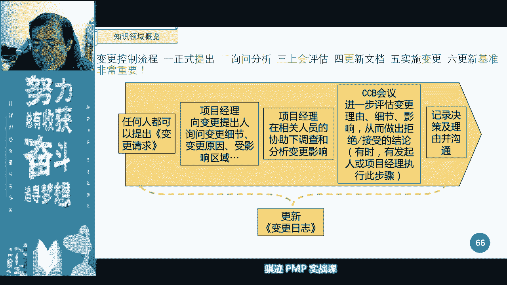

我就过去看一下题目好，那么继续往下讲，实施整体变更控制当中，所有超过授权范围的都应该有c c b审核对吧，它是变更的决定者，所以ccb也叫做变更背锅侠啊，知道好，那么我们要科普一个东西啊。

首先第一个科普很简单，在有一些理论当中呢，ccc b又叫做change advice board，叫做c a b啊，这两个是一个东西啊，我们在p n p里面叫cc，比我们在io里面呢叫做c a b啊。

在很多一些其他里面也叫c a b，有什么版权就问，所以我们就就这么掉了啊，当然其实是一样的啊，所以变更的整个流程呢会贯穿管理呢，会贯穿于整个项目始终，项目经理对此要做负最终责任和管理责任。

但是没有决定权，决定权在cctb手里，只有通过了审批的变更，才能纳入修改后的基准，对吧啊，整体变更控制的一个关键，就是任何变更都会对项目管理知识呢有影响，我们在我们在前面讲了，为什么变更。

我们在之前讲了，为什么变更一定要有项目经理来管理控制，而不是有一个特定的角色来管理，而且是要在整合管理当中管理的，ok啊，请把这个理由打在公屏上回答出来的同学，回答的最完整的同学啊。

要要给一个大红花对吧，大红花啊，或者可以啊，获得老师的香吻一枚，请打到后面啊，为什么我们之前讲过啊，为什么变更应该由项目经理在整合当中负责啊，去整体负责，为什么，而且要项目经理对负最终责任。

请在公屏上回答啊，这有助于你们更加深的理解，为什么我，们上节课讲过的啊，因为项目经理要被授权负责整个项目，ok这个呢比例不能算错，如果p np的考试里面呢有两个正确答案，这个可以是次选正确答案啊。

ok啊，ok啊，这位同学在群里面说影响所有啊，这是他的责任对吧，ok啊，整合是项目经理不能给别人的啊，ok啊这没有讲到最点子上，但是你们的理解已经接近了ok啊，但是上课上我的课一定要全神贯注。

我相信很多同学已经听过单身，你们忘记了，再给你们加深一下印象，为什么变更要在整体的管理当中，要在整合的管理当中是由项目经理负责呢，是因为你不知道一个变更动力会影响哪些领域，比如说客户要增加一个需求。

功能需求就会可能导致进度的延长，范围的扩大，成本的增加，质量标准的改变，风险的增加，资源使用量的增加，会引起一一系列一串的后果，那么不同知识领域自己的管理当中，很难应对于这样的不改变。

那么只有一个人可以在全局据评估和管理，这就是为什么要在整合当中去管，而且有项目经理去管，因为一个变更，往往不仅仅影响变更所针对的那个领域，还会影响到其他的领域，明白了吧，好明白了吧，ok明白了。

所以这是管变管理变更的一个特性，那么时间工作也是当你们在实践工作中，管理项目的张东变更当中，一定要多长几个心眼，一个看似平民不起的变更，也有可能产生蝴蝶效应，会慢慢的赢，会逐渐扩大。

影响到其他的各个知识领域当中去，一定要防止这种蝴蝶效应，知道吗，所以考虑一个变更，不能仅仅在某一个知识领域去考虑，比如说我要做一个质量标准的变更，但是它可能引起的一系列变化。

是你项目经理单从质量当中无法考量，所以你需要对它进行整体，然后呢又交由cc比，由他们从各个部门各个负责啊，单位和负责部门或者各个领导的各自的角度，从全局当中去考虑这个变更的影响，明白了吧。

这就是为什么要放在整合当中，有项目经理管理，ok啊这个我就后面就不再讲了，但是你对变更有一个清晰的认识了吗，ok啊，所以我要后面讲的一点，在实践过程中非常重要，任何变更只要达到了影响基准的影响。

影响范围，精度基准的这些东西都应该走c c b，如果你不走流程出了问题，你项目经理也要承担完全的职责，而且要承担不遵守组织流程的呃，一系列职责的责备啊，但是只要走了流程，大部分的责任是由c决策。

决策的代价和问题是由cc b去承担的，你仅仅承担执勤的责任，注意的，虽然说项目经理对此负担最终的责任，但是并不是全部责任，明白吧，所以这就是为什么如果可以走cg b，项目经理其实应该把过去甩给cg。

明白了，这就学以致用，还有一点，因为大部分组织里cc b开会比较拖沓，所以当你不想做某些变更，但是又推不掉的时候，你拿ccv挡箭牌可以挡回很多，那些可做可不做的，变明白了吗，这叫项目管理的啊。

厚黑心理学，ok啊，你们以后就拿c c b当挡箭牌，当有些客户相当方提出一些难缠的要求，然后要你去做某些事情的时候，你就拿ccb当挡箭牌，说这个叫ccb过会啊，我们cc b一个月开一次会。

所以做这个事情至少要一个多月以后才能授权，做对吧，我是无权做这个事情了，所以你能不能等，如果你能等一个月一个多月，那么你就等对吧，那么很多客户说哎呀这么烦算了，不做不做不做啊，但他就过了明白了。

这可以用来应对于项目需求当中的一种需求，叫做什么，叫做额外或者叫激情需求，他一时脑子热出来的需求，这种需求呢很快就会消失的，ok好又教给你们一个办法，ccb是个很好的挡箭牌，ok不知道你们学到了没有啊。

我们学到了已经公屏里打过了对吧，我们反正明白了，你们就打一个明白了吧，或者怎么样就表示意思也可以啊，以表达对主播讲的这么辛苦的一种肯定，谢谢好，那么变更里面的一些要点呢。

我已经在这里面已经呃呃交给你们了啊，交给你们了啊，那么具体之后的变更的很多内容呢，和之后的我们的模拟题当中呢会遇到情况呢，巨山啊，玉山开路遇水架桥，我们去解决它好吧，所以变更的题目是非常多的。

在pmp考试中，但是不要怕啊，这些东西都掌握了，都是分数好，我们继续讲讲，那么我们讲变更授权的权限啊，项目经理呢通常是可以授权，我们不用改变基准的那些变更啊，尤其是在紧急情况下，批准否决啊。

改变基本变更，客户呢能够批准按合同实施的某些变更要求啊，只是我们一个定义啊，这个定义要清楚啊，这一页你们可要记清楚，但是也不难对吧。

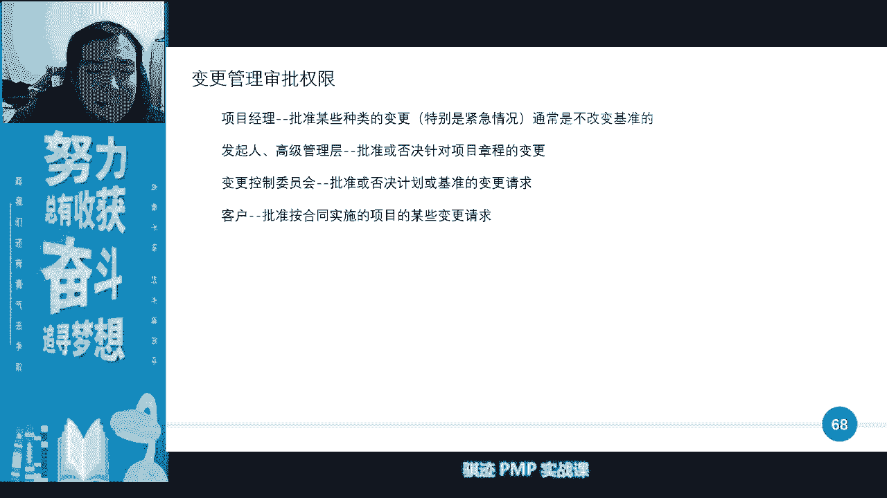

要记清楚啊，下次两个字叫金啊，金钟，再其次两个字报国，那么吃完之后呢，你就变成一个脚底刺精忠报国的江山了对吧，所以你的你的配置呢就改掉了啊，定义就改掉了，ok啊脚底刺精忠报国，那是谁啊对吧。

那你看啊背后刺的一圈字，一圈诗词呢就岳飞对吧，所以岳飞当岳母刺字之后呢，岳飞的配置就改掉了，他就变成了一个精忠报国对吧，一心抗金的一个啊伟大的将领将领啊，所以这就是改变配置的重要性啊，改变配置。

所以岳母刺字就讲述了一个改变配，通过变更去改变配置的一刻实力啊，ok啊这是一个非常歪的，拿历史去歪的做一个比喻啊，识别配置项记录并报告配置的状态，并且对配置来进行实施和审核啊，这在很多配置管理当中都有。

配置管理呢在p n p考试当中不怎么考，但是会提到，所以你大致知道他是什么意思就可以了啊，他在另外一些理论当中呢会提的比较多，比如说啊ioi t i啊，我在i t的服务管理当中呢，配置呢会讲的更细一点。

ok pb当中大家只要知道这个定义就可以了，但是注意变更必然会导致配置的改变对吧，变更变更本就是改对吧，改了肯定会配置改，这一点要注意，所以改只要你做执行过变更。

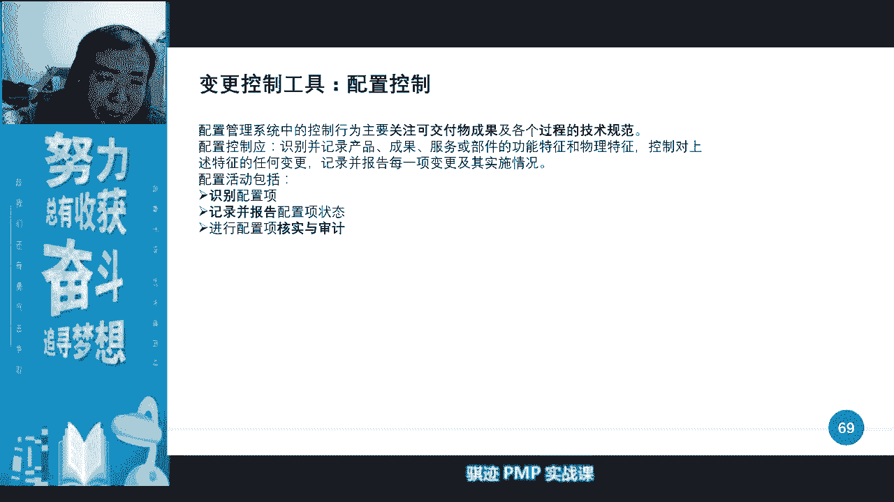

那么配置一定要做相应的修改啊，就是这样一个情况好，那么我们在变更当中呢，我们会做怎么样做变更，变更的方式的方案怎么样，我们会有一个东西工具叫多标准决策分析，所谓的多标准决策分析呢。

就是列出各种各样的可能性，然后进行加权评分啊，这个呢我觉得挺简单的，大家概念理解就可以了啊。

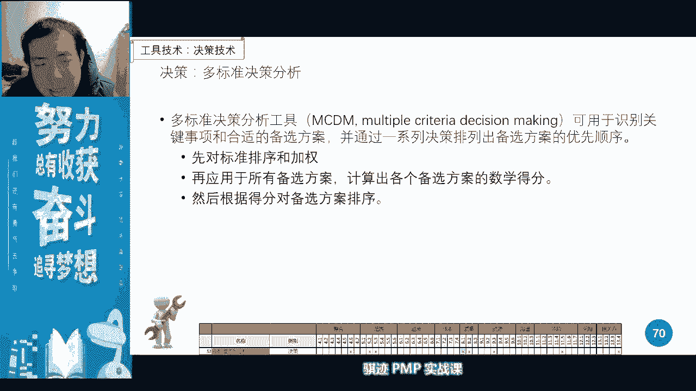

概念理解可以，这个也不是考试的重点，我们变更当中呢会有很多变更的控制工具啊，会现在有很多电子化的变更工具，那么又来了，这时候p m s是不是变更控制工具，也可以是变更工具啊。

现在很多项目管理信息系统也带变更控制啊，所以pm s也可以是变更管理控制控制，所以b m s很多能的这个工具是很多能的啊，好大家可以知道了解一下就行了，但是呢pm s这个是作为啊，我们。

作为我们啊嗯常用工具，一般变更管理一般不怎么提这个东西啊，但是你可以提前用，有的同学问啊，一般公司应该没有c c b吧，ok如果一般的公司，如果很多公司没有专设cg b站职能。

那么我们可以在项目章程当中经由发起人批准，可以针对本项目设立一个cc b啊，注意定义，如果公司有专门的cc b这样一个形式，那么我们要遵从公司ccb，或者公司某一个职能的ccb这样一个流程，如果没有。

我们应该在项目管理计划，变更管理计划当中，这样一个角色和他的成员名单，并且定义本项目的变更控制流程啊，注意啊，这些是可以根据本项目去定制的啊，可以去定制，明白了吧，不知道啊，我的解释呃。

我的解释让这位四个石头同学啊，能不能明白了啊，石磊同学啊，四个石头对吧啊如果明白了就好啊，这个这个问题提的提提的挺好的啊，提的挺好，所以cdb可以来自于组织，也可以来自于项目对吧，ok你们还有问题吗。

明天我继续了啊，k变更这段讲的特别慢，因为变更确实很容易考，那么做完变更之后，那么我就会做什么变更日志的更新对吧，日志更新项目文件的更新对吧，尤其是跟基准相关的啊，就是自带更新会经常受感。

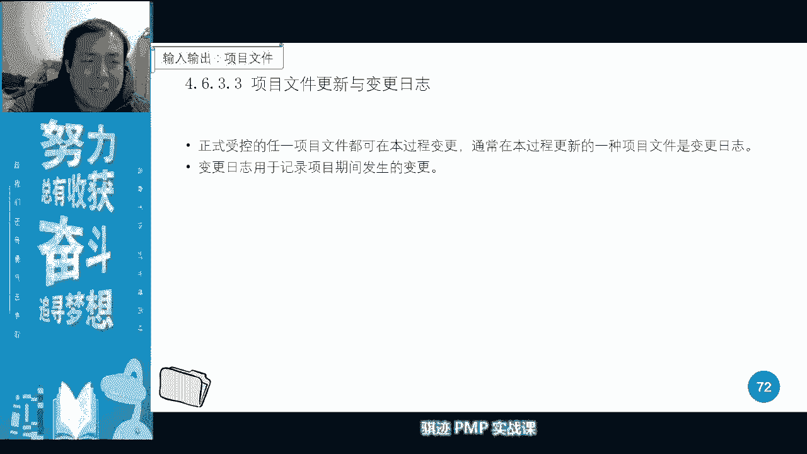

这是一个变更的逻辑过程啊，大家看到可以变成逻辑过程，那么这个逻辑过程呢不用记，我觉得你更多的是要记住什么东西啊，变更是怎么做的，这个过程我觉得你们可以看一下，然后熟知就行。

尤其要记住手机变更有哪几个步骤，第一步做什么，第二步做什么，第三步做什么，第四步骤什么，第五步做什么，第六步做什么，以及变更有四种类型，分别起到什么作用对吧，不能做什么，授权变更当中谁可以审批变更。

谁要额外的去审批变更对吧，这些东西要记住啊，要记住，ok好这个大家看一下，那么因为这个ppt都有，所以我就不想一想，大家回去仔细看，如果在中间有一些很细枝末节的，有问题的，可以向我提问，ok好吧啊。

我会非常的开心，大家在看书和看ppp当中发现问题之前呢，有些同学向我问一些很细枝末节的问题，我非常开心，说明大家看书看的很认真，只有看书看得很认真的人，才能够问出细枝末节的问题啊。

这是一个非常让人开心的事情，很感ok啊。

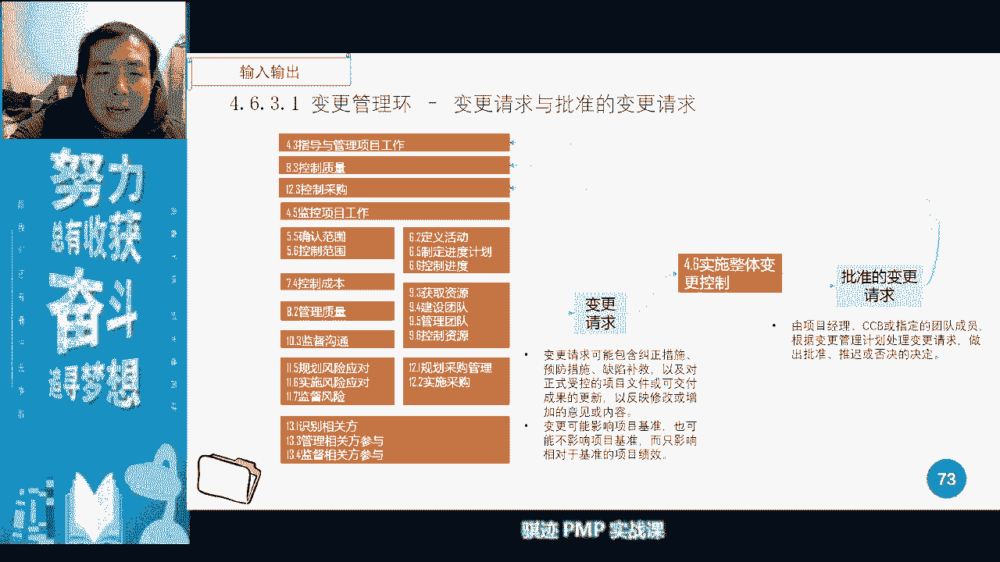

好那么我们讲最后一个子过程整合管理，最后一个组合叫做结束项目和项目阶段啊，就是收工收钱，但是注意啊，结束项目不仅仅收工，收钱也要付钱对吧，年底了要做过什么事情啊，结清农民工的工资。

现在拖欠农民工的工资是很危险的事情，知道吧，要进去吃豪华套餐好，那么我们不开玩笑，继续讲啊，结束项目和项目阶段主要做什么呢，结束我们项目的一切活动，或者本阶段一切活动做好善后，结束项目。

项目工作呢是最后一项工作呢是解散团队啊，庆功会不属于本本工作的本过程内的工作，ok啊，注意注意这句话是这个ppt我们p p t的，原我不是原作者啊，原作者写的，但是轻工会应该怎么说啊，不是必要工作。

但是是可选工作，明白啊，不是必要工作，是可选工作啊，注意啊，那么项目完成和上扣当中呢，验收和验收后流程，我们注意啊，验收完成之后，我们要交付一系列验收文档，但是验收并不在结束项目工作里面。

而是在哪里的啊，我们后面会讲确认范围是验收对吧，然后但是确认范围做完之后呢，你要最后做项目的结束文档，验收文档的时候呢，是在结束项目和项目阶段做的，然后呢还一眼收获的流程，东西要移交啊，一觉之后呢。

要在后线上就安装了，然后就调试了，然后呢客户能正常用了吗，那就结束了，那么接下来项目要做总结吧，过程呢要做评价啦，然后呢各种文档要做记录归档啦，满意度要调查啊对吧，资料归档啊，这些东西都要做啊。

那么注意一点，如果考试问一个很刁钻的问题，要注意一点，项目结束之后有没有项目相关的活动要做，有有一个会很特殊，叫做满意度调查，那么有可能在一个项目已经结束了之后，才有组织用一定的形式进行。

对本项目一系列结果的满意度调查是有的，这是合理的啊，注意啊，是合理的，但是已经不是有项目团队去做了，知道吧啊，项目已经结束了，并不影响项目结束，这一点要注意啊，那么合同结束之后呢，合同相关的满意度调查。

也在本过本过程中内完成啊，这个合同注意这个合同指的是什么，合同是指的是采购合同啊，注意这个p p t呢描述啊，这个ppt当中这句话呢描述略有不精确，采购合同结束之后，采购的结束也是在我们结束项目阶段呢。

是而且是一个前提，要结束一个项目和项目阶段，一定要先阶段先结束，本阶段应结束的采购活动啊，后面我会继续细细细跟，继续跟你们讲，同时呢我们还要什么释放资源，释放资源，然后呢要想要有po去牵头。

然后呢我们进行经验总结对吧，如果有多个阶段呢，可能项目的阶段结束呢，很多个阶段结束，我们在第一节课就讲了，什么项目的阶段和阶段之间要结束，阶段还要进行什么阶段的交接关卡。

将经验和可交付成果呢传承到下一阶段去做，有利于下一阶段开始，记得吧啊这记得啊，那么讲到采购，采购的结束。

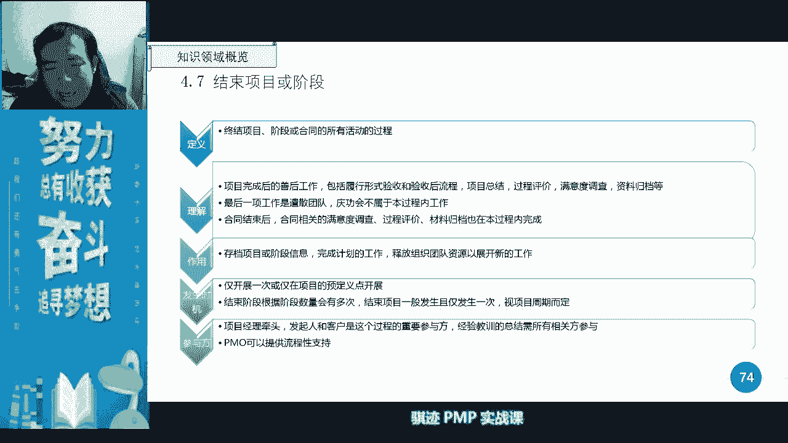

是结束项目和项目阶段的一个什么东西啊，起点所以看到啊啊几点针对里面就会有个协议，这个协议当然是甲方的协议，但是我们最终的结束当中呢，这里反而没有写啊，我们采购也是截图项目的一个前提。

那么采购结束项目前提要结束到什么程度，注意啊，这是我要跟你们讲的，你们要记住第一所有应该付的钱要付了啊，不管甲方爸爸节不给劫你钱，你要可以借给你的丙方儿子钱，你是个乙方对吧，甲乙丙三方对吧。

甲方爸爸不给你钱，你不能以此为理由不借钱给丙方啊，啊丙方孙子啊，注意丙方孙子，这是违反商业道德的，发票上面千万不要写餐饮啊，因为无法报销，开过玩笑啊，ok啊，我们开个玩笑，要钱货两清对吧。

第三因为你是采购，在采购当中，你是相对于是是属于一个甲方的角色，那么对你来说，你一定要对这个东西，这个采购结果呢要做验收再结束项目，项目阶段一定要做验收，注意你是一个验收人，而不是被验收人。

然后呢要相应的验收文件做签字画押，同时呢要也要让你的贝塔，你的被采购方，你是采购方，被采购方呢将结果呢移交给你，然后呢你将什么，你将就是钱付给他，然后要让他把发票给你这个采购。

才能结束结束项目的整个项目，或者项目一个阶段的所有这些采购工作之后，才能去展开整个项目的结束工作的输出，明白了吧啊，这是一个前提，那么除了这个前提还有什么前提啊。

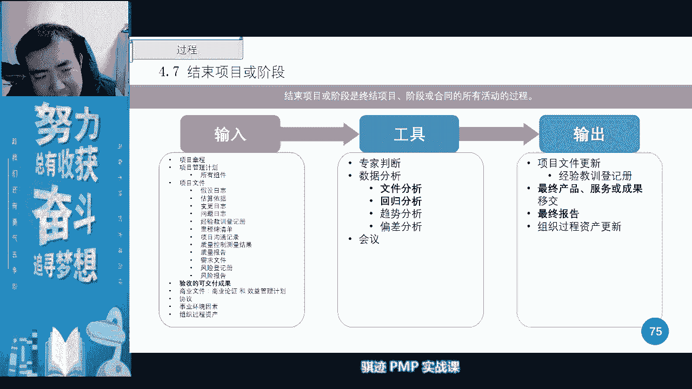

除了这个前提下有什么前提，还有什么要将各个文档结束，还有什么前提呢，要把各个财务相关的环节结束，这些都是结束项目的一个前提的必要活动啊，账要关掉文档呢要搞好对吧，该总结的总结，该画押的话押。

同时所有的这些东西要经得起审计考核啊，这个不仅仅是理论实践也是这么要求的啊，这要求尤其还要注意一条啊，这些东西大家可能会知道啊，不要达到达到完工推出的标准，关闭未关闭活动，所需要开展一些活动，要结束。

总结经验，移交产品对吧，改进测量满意度，尤其注意的是第七条，如果项目提前什么纸啊，终止啊，结束的那个终止，暂停的那个终止，说明项目还没结束啊，不用写项目，如果提前终止掉了，停掉了，那么还要根据写。

还要根据制定指定，这是制定指定，不是制定啊，来调查提前终止的原因，体现为什么终止，这个原因，要额外的写在项目的报告和相关文档里，为什么终止呢，因为甲方爸爸不肯付钱，所以我们不得不挥泪甩卖，对吧啊。

原来几十块几十块，现在卖几十块对吧，ok啊啊又有老师又讲段子，但是给你们加深印象对吧，江南皮革厂倒闭了，为什么要倒闭了，不肯付钱对吧，导致我们项目也终止了，对吧啊，ok啊，这个一定要注意啊。

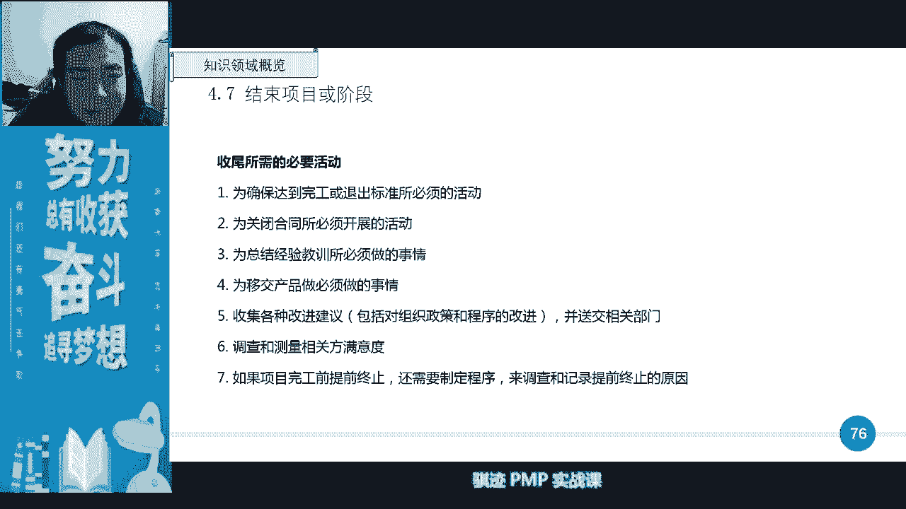

好，那么我们在项目的最终的一个项目可交付成果，接地是什么，项目可交付成果最终移交，将这个东西移交给我们的用户，假如将它移交给我们用户，那么最终的移交过程当中呢，服务团队。

服务和成果呢可以交给另一个团队去运营啊，那么这个时候很有可能怎么是怎么移交呢，是由我们的项目团队向水移交，向运营团队移交，由运营团队在骑生命周期过程当中，持续地进行运营维护和支持，注意啊。

所以一个项目可能它的开发生产验收和交付，是由项目团队做的，但是它的运营维护更新呢是由运营团队做的，注意啊，会有两个不同的团队去做这个事情好，那么项目当中我们还可以开什么会啊，项目的收尾报告会必要开啊。

不一定必要开啊，客户总结会呢不一定开，但是建议开经验总结，经验教训总结会呢应该是要开啊，庆祝会庆功会呢啊如果做成功，建议开开了有什么好处，让团队们可以开心一下，让领导们可以开心一下。

同时呢可以收获人脉对吧，这个钱不花了，等项目结了，你就没得花了啊啊老师又教你们，教了你们些奇怪的知识，你们的奇怪知识又增长了，ok好，所有这些东西大家是否都明白了啊，这些东西都是我们项目在结束当中。

所需要做的事情啊，项目的结束阶段的这个子过程，在整合当中的内容不是很多，但是还是有要点啊，主尤其是注意要怎么如何去关闭采购对吧，怎么关闭你相应的文档，怎么犹犹豫，是哪些东西要写，哪些东西要总结对吧。

这些东西都要注意的啊，还有最后怎么移交要注意啊。

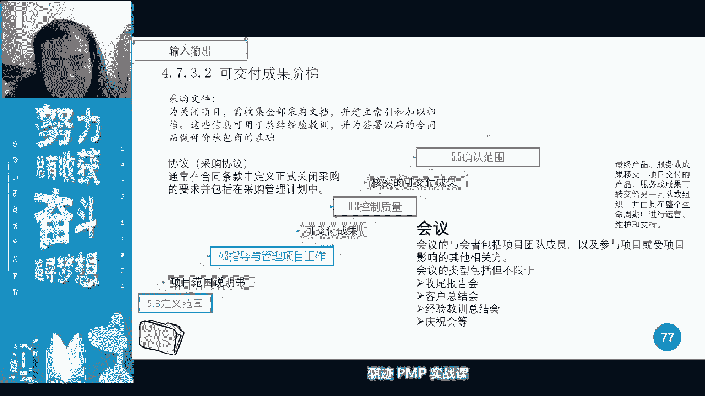

那么讲到这里，我们的课程已经渐渐进入尾声，那么项目最终在结束的时候，我们要写一个注意啊，这是整个项目结束的时候一般会写啊，项目阶段结束了会有个阶段最终报告啊，但是项目一般是在最终全部结束后。

会写一个整体报告，那么他会用一个最终报告，去总结整个项目的绩效啊，注意这个报告非常重要，这个报告就体现了一个项目经理啊，非常强的主观能动性，可以妙笔生花，死的写成活的对吧，呃瘸的写成瘸子。

写成刘翔对吧啊，潘长江写成姚明，这就是你们的能力啊，因为这个东西是你的performance performance，整个项目的概述，项目的范围最终做成什么样的范围，它的范围最终是怎么样评估的。

然后怎么样去达到的，完工的依据，这个完工项目的范围的完工依据，要有客户的证明啊，客户认定你达到它的范围了，你自己认为达到是没用的啊，好质量目标我们完成了怎么样质量目标，质量的评估结果是怎么样，实际的。

我们的相关的核实信息怎么样，然后里程碑交付和偏差，原因就是说项目的进度最后实际怎么样完成的，感觉在这个bug中体现，尤其是进度，尤其当进度出现比较大的偏差时，要体现啊，如果注意。

如果你的项目提前或者按时完成了，由于兄弟们的努力，由于本人的高超的项目管理技能，项目按时完成，如果项目延期完成了呢，一定要写，由于各种不客观客观条件不利因素，我们项目仅仅延期了半年完成啊，注如此注意啊。

这一点一定要写啊，然后呢最后呢项目成本，项目成本这个东西呢要注意啊，项目的最终报告，如果涉及到项目的实际成本等等的东西，要取决于你和用户之客户之间的约定，如果你的和客户之间约定是固定成本的合同。

注意这一部分不要给客户看，否则客户会看的心里很堵啊，我这个项目最后付给你100万，你用30万的成本做完了，赚了我70万，你小子有点心黑啊，对啊，有时候有些事情就是这么做的啊，注意这一点千万要注意啊。

如果你的成本呢是和客户约定，我们在采购管理中会讲合同，成本合同和总价合同，如果你的客户和客户约定呢是按照成本来，合同约定好，我们和项目客户约定我们的成本目标是100万，最后呢我们是95万做完的。

我们为客户节省了5万，为此我们项目呢抽投了2万块钱对吧，然后搞了团建啊，这句话划掉，实际成本产生偏差，原因对吧，这些原因总结，最后的产品服务成果的确认信息的总结啊，客户已经根据下列这些。

确认本项目的各个指标，各个性能，各个范围有达到要求，客户愿意接收，然后怎么样，然后在某年某月某日，在什么阶段情况下，我们将这个东西移交了客户啊，确认功能正常完毕啊，这就是项目的总结报告。

这个报告呢会对你的performance产生影响啊，对于考评影响为什么呢，项目经理动画项目是不是各回各家，各找各妈对吧，那么你回到项目部也好，你回到职能部门也好，是不是这个东西是你的业绩考评啊。

你的年级k p a啊，年底的13星14星，15星16星啊对吧，都在梦里可以拿到了啊，ok啊，老师说话是不是很闲，是不是很闲啊，ok啊，但是这是就是真的啊，所以报告写得好，奖金不会少啊，不要紧，不会说。

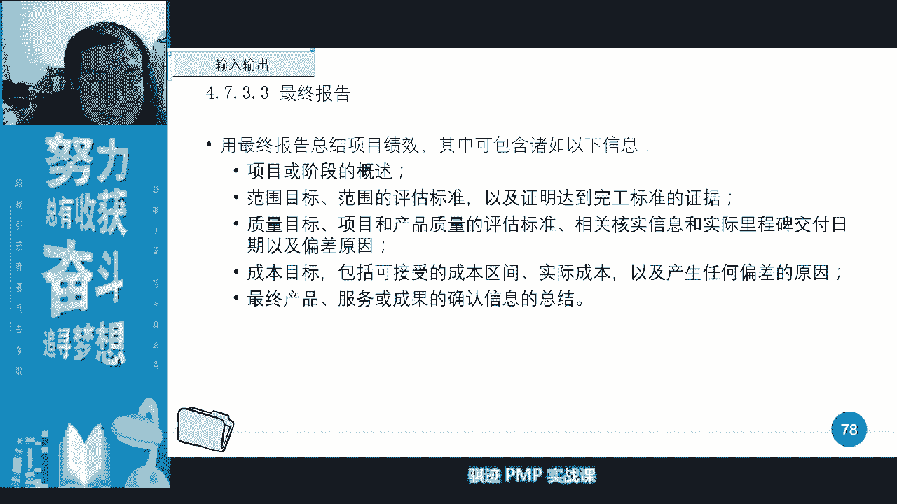

好那么我们在项目的工具技术当中呢，会使用文件分析啊，这些是我们常见的啊，用各种各样的文件，根据我们项目过程中产生各样的文件。

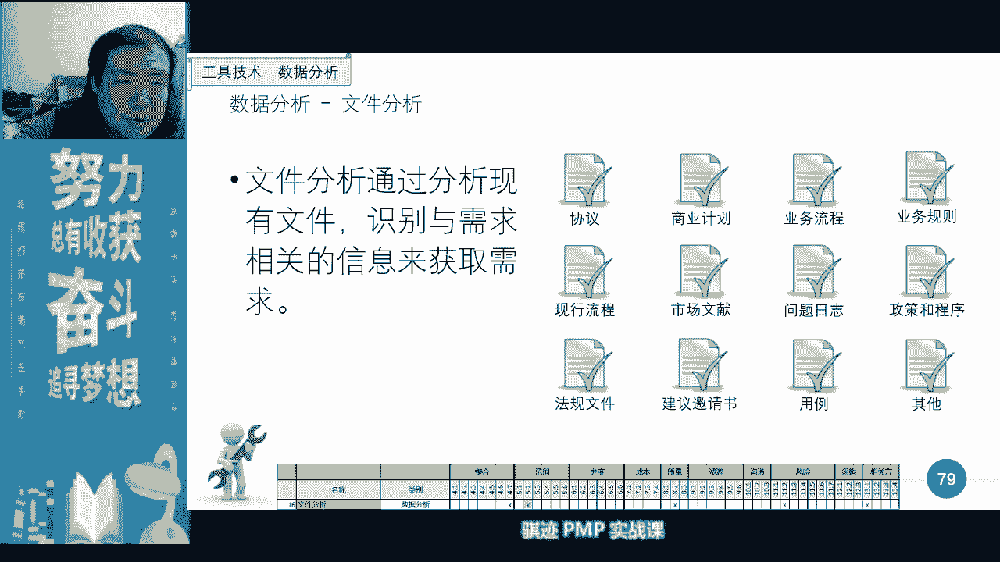

去写最后的报告对吧，最后的结果根据回归分析去写结果啊，回归分析我们这里稍微提一下，回归分析不是一种，我们pp里面常见的一种工具啊，考的不太多，但是呢也经常考，那么回归分析是什么意思呢。

ok啊回归分析从原理上来讲，其实不像p p t里面讲的啊，p p t里面讲的这种分析其实叫做什么，叫做散点图分析啊，ok所以这个用力呢是有问题的，那么回归分析更多的是什么呢。

它是表现出来的东西是像我们散点图一样，但回归分析更多的是什么呢，如果我改变一样东西，如果我改变一样东西，那么我把改变之前的状态代入各种参数，代入到改编之后的这个模型当中，看看改变是不是有效的。

或者是不是影响到前面的东西，叫做回归分析，一般是在我们做变更，做改变的时候会使用的啊，那么回归分析还有什么东西呢，是用来验证什么和什么东西呢，确实是相关的，或者改变是有效的会用。

所以它确实在数据表现上会是像散点图一样，但是它并不是直接去确定两种关系的，一种方法啊，回归分析在很多应用上呢，是在定义上是会有差异的，ok啊但是大家只要明白这个意思，一般用于验证，你要记住。

一般用于验证改变是不是有效，或者改变之后是不是符合原来规律的一种方法，就可以了，好吧，因为这是p np的啊课程，所以对于这些数理的东西来定义呢啊不深，仅仅将在理啊。

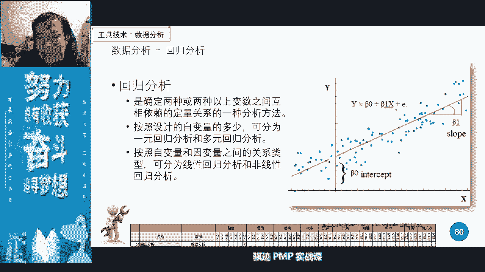

理论的知道了解就可以了啊，是这样一种工具，好，我们最后再总结一下，各个知识领域的所有的内容啊，作为我们理论课程的结束，项目整合管理从哪里开始，从我们的制定项目章程开始，这是一个什么啊。

启动过程组制定项目管理计划开始，它依据我们商业文件协议呢，然后呢进入什么规划阶段，规划阶段能做什么，主要是做项目章程啊，所以做项目管理计划，项目计划就是把项目章程呢做细化，制定出基准为止。

所以项目管理计划没有基准都是耍流氓对吧，智能从各种基准基准和项目文件做出来之后呢，就按照这个文件呢就干就完事了，开始去干，干的过程中呢，作为一个项目经理，作为一个管理员啊，作为一个管理人。

不是一个打工人，而是个管理人，要做项目各方面做监控，得出各样监控数据，监控信息监控报告，最后以报告的形式交给各个相关方啊，注意记得我讲的报告分不同版本对吧啊，ok小知识。

项目管理过程中不可避免的会有什么会有改变，那么我们作为改变，我们就要易于整体变更控制，然后我们要我们要接受变更，然后呢进行方案分析，然后方案上报上会上课之后呢，要更新项目变更的变更日志状态。

然后就实时变更，然后做变更经验的总结对吧，谁有权做什么授权的变更批准对吧啊，发起人批准什么跟项目章程有关的，高层次利益有关的客户呢，批准跟合同有关的啊，这些东西一定要记住住啊。

变更的这些内容要深深地纳入到你的脑子里，脑海里中啊，大家一定要好好学好，那么在项目的管理过程中，是不是会有很多知识总结啊，对知识总结大家就会有知识经验调研登记册，同时呢管理知识并不仅仅是总结就完了。

要什么把知识传播开来，让项目团队中各个人呢，通过这样一种知识的分享呢，达到了一个什么经验的增长对吧，这是一种非正式的培训，那么正式的培训呢，要通过我们的我们的建设团队啊，近视团队呢去实现啊。

他用培训这种正式形式，比如说我给你们上课，那么项目经过这么辛苦工作呢，最后就进入了什么结束阶段，在结束阶段当中呢，我们要把采购收尾对吧，把钱付了，东西收好，发票收发票收好啊，然后呢向甲方需要钱。

然后然后把账给结清了对吧，然后把财务账关掉，把文档归档好，然后呢进行结尾收尾，然后收尾的最主要干什么呢，把东西移交给客户，然后呢剩下来的维护的活呢，烂摊子呢啪甩给运维对吧，然后就结束了。

结束当中还有结束之前，到了还要写好总结报告，要在项目团队解散之前写总结报告啊，那么有人要问项目结束以后写总结的话，可不可以呀啊当然不可以，你就不算人了，你就不算资源了啊，你就白干了，你也从项目里拿钱的。

项目经理要从项目里拿钱了，记得所以这个时候呢你要在团队解散之前，把一切总结归纳，提高这些事情全做好，然后一股脑的全扔给po进行归纳，然后该开会的开啊，该开清灰的开始清工会做了失败了，该开总经验。

我总结啊，项目如果提前终止呢，记得写好原因对吧，这就是整合当中项目经理应该管的七件事，开门七件事，柴米油盐酱醋茶，对吧啊，项目经理七件事，章程管理管理计划指导监控和收尾，同时还要管知识和整体变更啊。

这就是我们的项目经理的七件事，ok那么通过今天的课程，不知道大家已经吸收了没有，如果没有吸收，掌握没有关系，请在明天再回看一下，或者后面再回看一下，注意啊，可以回看的，不要急好。

那么我们今天的课程内容讲到这里，好，那么ok啊，大家觉得没有问题的，在公屏里打一个木有没有问题啊，或者木有问题都可以，有问题的呢，大家可以在微信群里，我们课后的单独问啊，因为时间不多了啊。

但有些同学还要准备休息，有些同学还要奶孩子对吧。

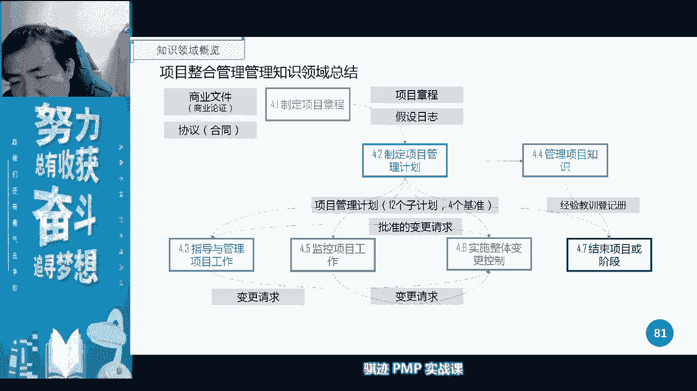

好no problem啊，ok啊，很欣慰啊，有人拿no problem，有problem，群里说没关系啊，群里说我随时都在，对吧啊有时你们想象不到的时候，我也在线对吧，比如说你说试试看。

凌晨两点艾特我一下，我就说凌晨三点回你，ok第一道题目，项目经理参与项目章程制定，它需要进一步判断这个项目，下列哪一项是最好的主意，进行项目的判断，那样主要注意a会见发起人。

b收集组织过程资产c特别关注啊，在b收集过程呢特别关注历史精英，c参考商业文件，第一考参考合同，工作说明书选哪个，ok第一道题目选，等一下，第一道题目选哪个c c c c a b啊，没有选d吗。

啊你没有选d，因为d没教过的吧，啊哦不是c就是a啊，个别有个性的选b对吧，ok啊很好啊，项目章程有有些有位同学在微信群里打了啊，应该参考项目章程输入，可这是非常重要，但是这道题的关键大点是在哪里呢。

啊这个题当然非常简单，关键到底在他要进一步进行项目的判断，注意这个表示什么，一是本项目，二他要做的是判断，那么最好的方式当然是商业文件了，项目的商业论证，商业论证就是判断这个项目值不值得做的一个。

判断的科学过程，所以看这个东西是最有效的，是不是啊，所以答案是啊，不知道你们猜对了没有好，我们第二道题目，你最近指定了某项目的项目经理，负责你组织的关键活动，你想给项目经理权限去应用在组织的项目上。

你应该使用哪个文档，ok啊，第二道题目选什么，我就不念了诶，资源数据排档比工作分解结构c项目章程，第项目范围说明书应该选那个，第二道题目，这道题目啊，如果你们选错的话，那么我的心脏会很痛啊，我的心好痛。

我的心如刀割对吧，ok啊，不唱了啊，再唱，你们等会又要说mercy了，对吧啊，当然选c的，没有什么好说，项目章程是授权项目经理开展项目活动，使用组织资源的正式授权文件。

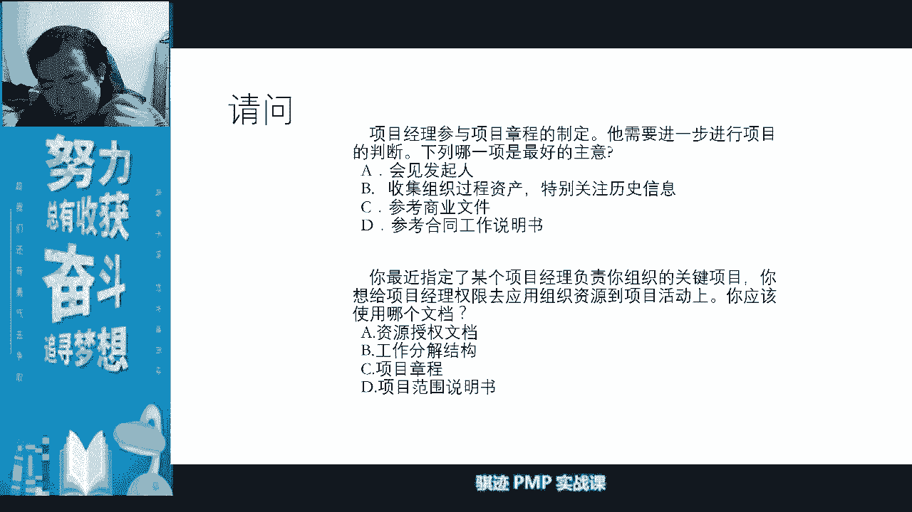

对啊，当然是选c，还有别的选项吗，第三道题目ok啊，非常好，当你制定项目计划的时候，可以将项目信息共享的过程列入，那下面讲哪个计划，项目信息共享啊，这道题目呢啊列到这里呢啊有点小问题。

但是呢可以回答对吧，我怎么样共享信息，a绩效报告计划，b沟通管理计划，c信息系统计划，第风险管理计划哪个，第第四道题目选哪个啊，第三道题目选哪个，选哪个别别唱啊，ok不要紧，等题目答完了，我会献歌一首。

a b c都有吧，ok啊，那么这道题目会有大量的我们没有学过的东西，对不对，但是没有木有问题，我们首先来看有没有a这样东西，有绩效报告计划吗，项目项目管理计划里边有没有项目啊，绩效报告计划木有对吧。

所以a排除掉有信息系统计划吗，木有排除掉，那么哪个看起来最像是信息管理的过程啊，空啊信息共享的过程啊，一个是风险管理计划，一个是沟通管理计划，那么当然选b了啊，当然选b喽对吧，不知道你答对了没有啊。

好我们再看下一道distrika，负责某大型建筑项目，但项目的后期呢，客户提出了一个大的变更，他评估了变更的影响，并将变更引发了时间的成本，告诉了客户，客户位置既没有安排时间，也没有安排预算。

瑞克卡处理这些这些事情的最佳办法是什么，a请管理层向客户解释为什么这样，b与客户开会，搞清楚客户为什么要提出这种需求，c什么也不做，他是项目经理，他说了算，比让客户寻找更多的资源。

作为变更的预算应该选什么，第四大。

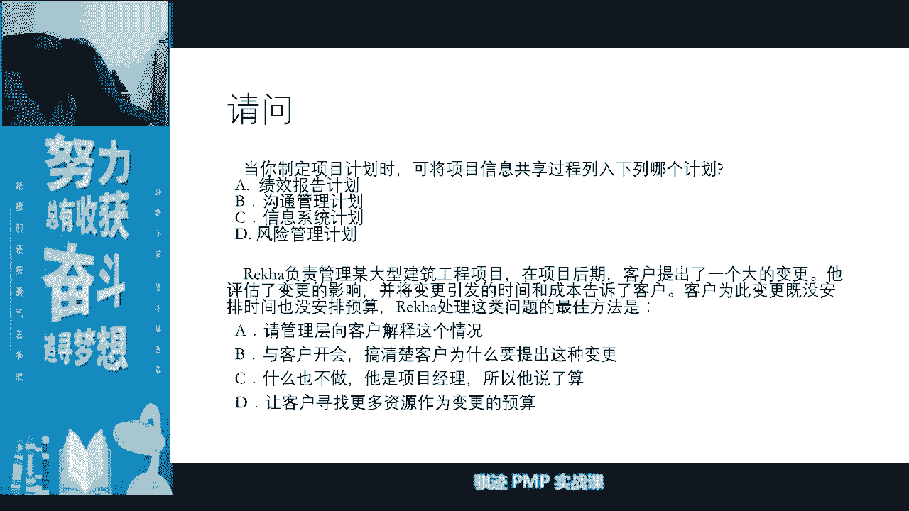

好第四道应该选什么，我来答一下啊，第三应该是什么，啊我看到有个同学啊，什么a货b哪有偏僻考试蛋来画一锤子买卖好。

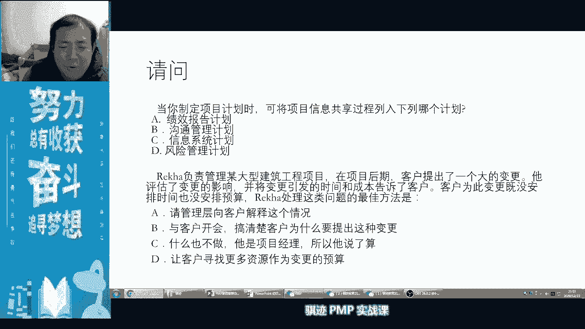

谢谢，有大量的同学选b为什么选b呀，为什么不选什么东西啊，先分析对，ok啊，我在微信群里看看，写b ok发现我非常好，有些同学选d当然是选d，当然是从常理上轻量来说是这样，但是你没有根据理论来答。

pp要根据理论来答对吧，但是有些客户就是这么啊蛮不讲理怎么办呢，所以d其实不是一个，理论和实际上都不是一个非常好的答案对吧，那么首先啊恭喜选b的同学当然比答对，那么我们就这样当一个用。

当一个客户提出了一个变更动力的时候，首先要他正式提出对吧，那么这道题目没有讲，有没有正式提出，我们姑且认为他正式提出了对吧，因为没有特别说明，那么客户提出之后呢，是不是我们要对他进行沟通啊。

了解他提出这个动力的变更的动力的一个原因，并且大家正式记录下来，所以跟客户开会对吧，那么我问你们如果在实操当中，我们应该选什么这道题目，第四道，如果在实操当中，我们应该选什么，其他当中选d啊。

好ok你们也错了，实操当中还是选b，你们被挖坑了啊，实操当中为什么还是选b，因为客户提出这个变更了，变更进门安排时间也没有安排整，这个是一个无理要求，当一个客户提出无理要求的时候。

你不应该顺从无理要求这个思路去做，你应该搞清楚他为什么提出这种无理要求，也有可能对客户对某个项目的内容呢，产生了错误认知，导致了这种变更请求，那么当你帮他解除了这个问题之后，他的变更自然不用你做了对吧。

他提出了一个不合理要求，你就按照他的要求做啊，比如客户说我要星星好，我要我给你找一只动物园的星星，客户马上说啊，我要天上的星星，你也你也跟客户说啊，我搭乘嫦娥，我大声啊啊，嫦娥6号去天上摘颗星星给你啊。

对不对，你要搞清楚客户为什么会提出这个东西的理由，当然也是开会啦，对不对，找出客户真正需要的东西，可能客户只是表达不清楚，他把地上的星星变成了天上的星星，对不对啊，然但是这个就千差万别了吧。

所以注意也是先跟客户沟通啊，不问理由啊，要沟通对吧，看流星雨被套路了哈哈套路。

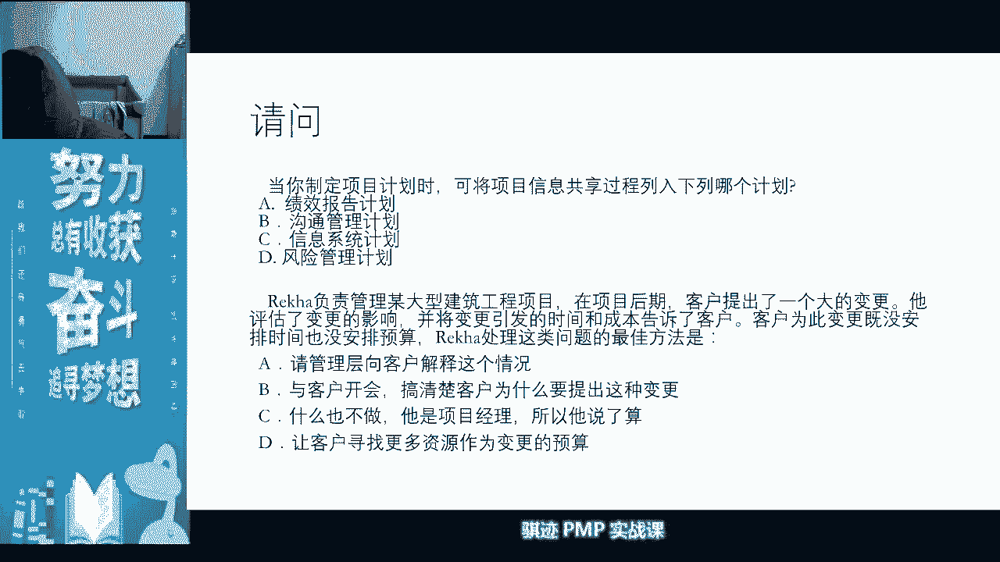

这就是套路呀，管项目就要有套路，没有套路是不行啊，在我们做第五道题目啊，ok啊，第五大题目，下列哪一项不是项目管理计划的子子计划啊，这个是不是一个送分题，千万不要送变成送命题啊。

哈哈哪一个第五大题目选哪个。

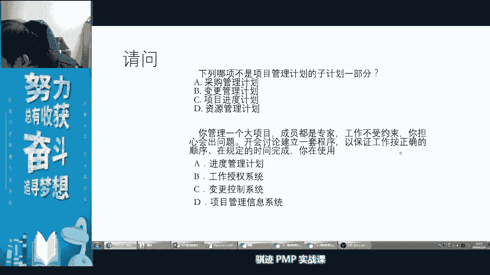

有的人没有那个，b c d啊，我们。

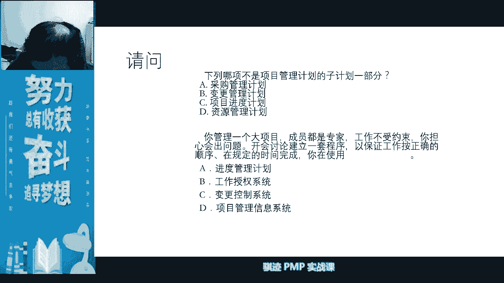

好老师有点打嗝啊。

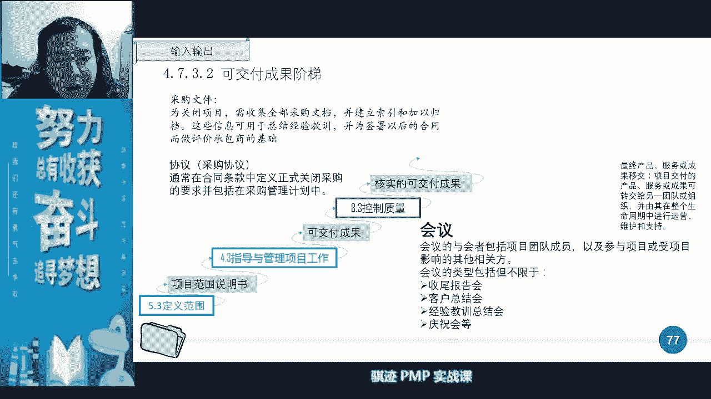

请你们忽略，那么我们回去看一下啊，到底有哪些。

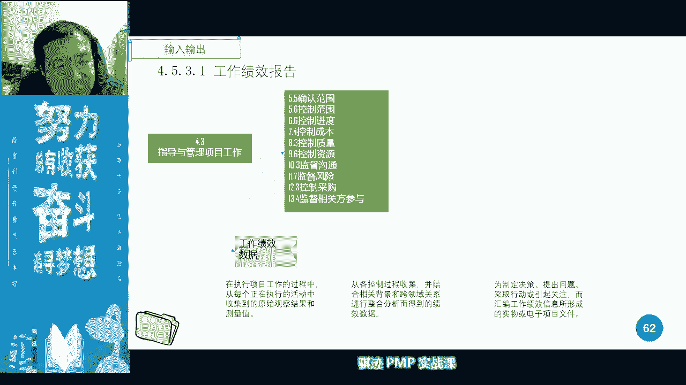

啊ok啊。

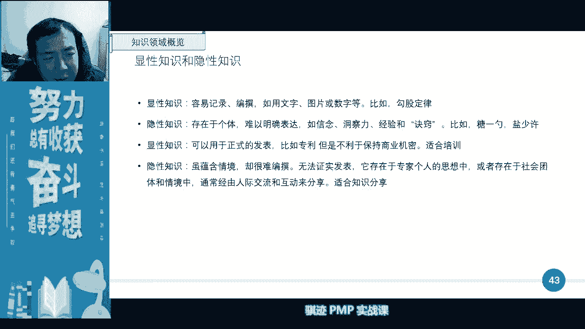

我们要翻得很远很远，在很远很远以前，到底有哪些啊，眼睛一看就是马有项目进度计划，只有进度管理计划对吧，资源管理计划有没有质量管理计划，有没有变更管理计划，有没有都是有的，只有项目进度计划没有。

只有什么进度管理计划和进度基准，注意啊，注意用词不用测啊。

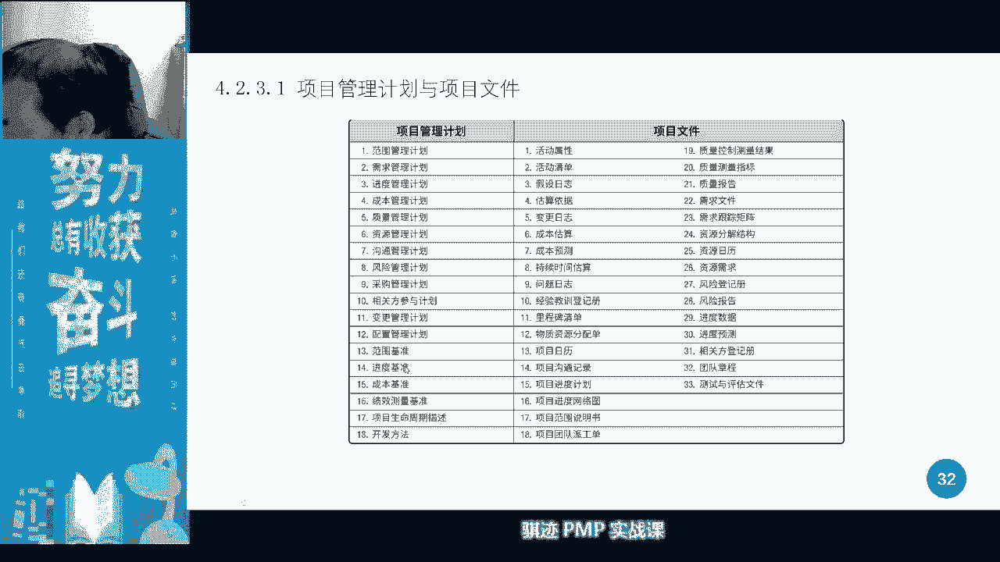

所以pmp考试当中有些东西呢该记还是要记。

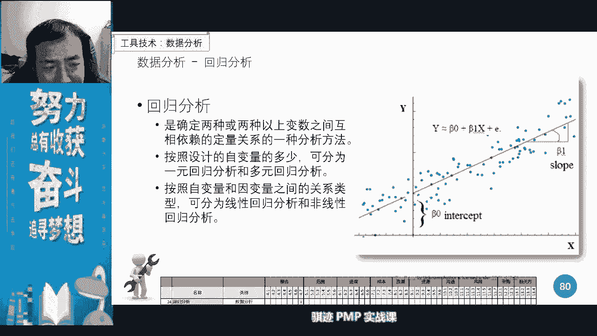

但是你理解之后呢，很容很就很容易哎呀，sorry，跳出来了，不好意思。

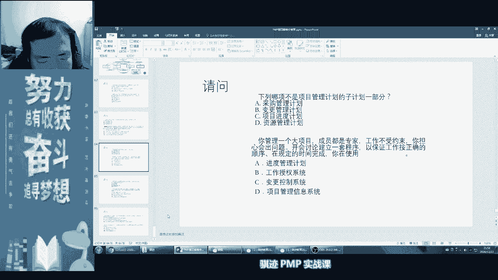

好该机甲设计，有些东西呢啊还是还是很容易记得住的，所以采购管理计划有没有变更管理计划，有没有资源管理计划有没有有，但是没有一个东西叫项目进度计划，只有叫进度管理计划和进度基准，对不对，ok啊蒙对了啊。

同学蒙是不行的，p p考试200道题目，靠蒙的话，你是欧皇还能通过考试，谢谢万一你是非酋呢，非洲部落总酋长呢对吧，我们的考试目标是什么，哪怕你是非洲部落总酋长，你也能通过考试，对吧啊。

好我们看下一道题目，你管理一个大型项目成员都是专家，工作不受约束，你担心出问题，开会讨论，建立到程序，保证工作按正确的次序在规定的时间内完成，你在使用什么样的工具啊啊这个是不是学过，好第六单项选什么。

选a，a，选，a和d还有b对吧，ok啊，选a的同学完全就没有理解我们讲过进度吗，首先没有吧，对不对，虽然在规定时间完全没有对吧，我们而且他讲的是什么，他的题目设定是什么，成员都是专家工作不受约束。

你担心出问题，所以对他们进行约束，所以进度管理计划不是用来约束专家的，所以肯定不适用对吧，那么这个当中明显可以看到，b和d是可行的选项，那么应该选b还是选d啊，那么从提示当中讲，开会讨论建立的一套程序。

保证工作按顺序按规定，所以它不仅仅是授权，也是什么一个工作的流程，和一个工工作安排的一个管理，所以p m s会更适合一点，所以这道题目选b会略微更适合一点点啊，当然没有d笔也是可以作用的啊。

所以这道题目呢正常是d。

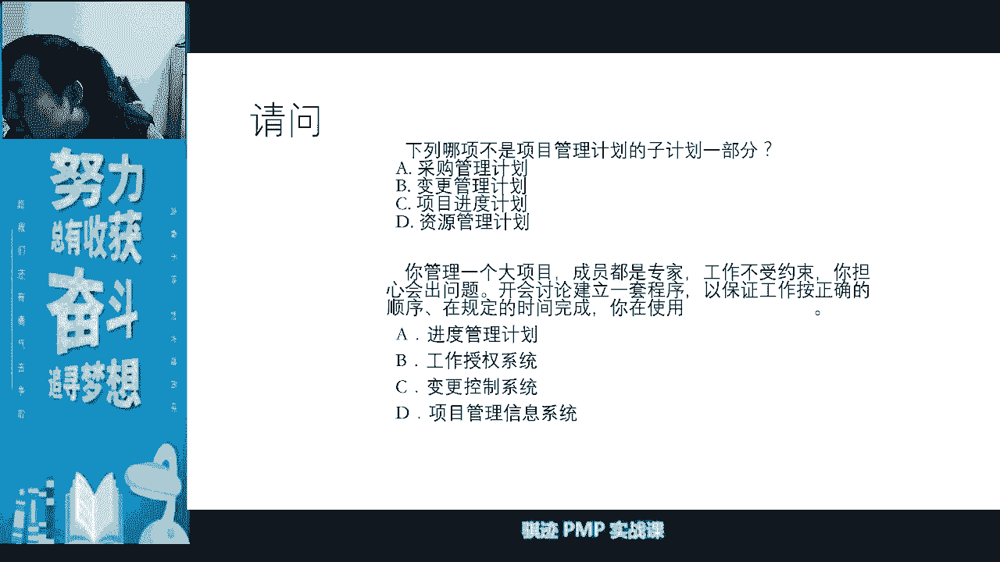

重新答题，不上心，选对了没有，好在后面大题目。

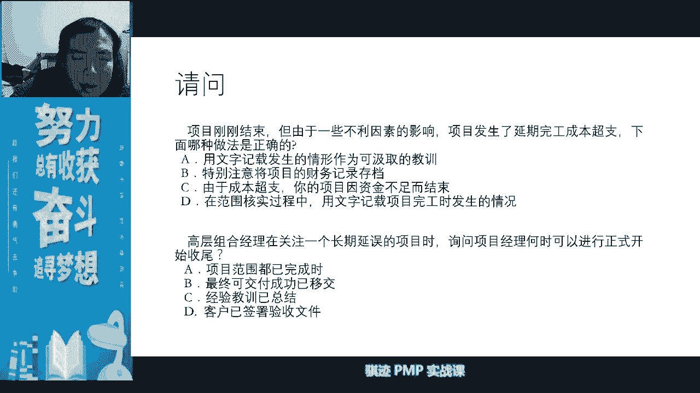

好好哦，我们一道题目好，项目经理，项目经理计划定期展开新品小组茶话，会让项目分享团队心得，这是什么样的技术啊，请告诉我a知识管理，b信息管理，c建议将军登记的敌信息收集啊，这道题目答不对。

简直是对我的一种对不起，好这道题目应该选什么，啊一屏幕都是a对吧啊，有同学问到底比一下低啊，前面的题目是敌啊，前面那对么是敌，这道题目的答案是a啊，答案是a啊，答案是a，那么很简单的是知识管理吧。

如果这道题目放的是知识管理和团队建设，那么选哪个还是选择知识管理，因为这是一个茶话会和兴趣小组赛，就算是非正式的培训，所以他不是正式培训，所以不能选团队建设啊，注意啊，我们人我们的资源管理。

人力资源管理还没有讲到，所以这里没有做辨析，但是注意如果做辨析仍然是知识管理对吧，我们上课反复强调，过了啊，考试不会错好后面的题目，项目经理接到客户的联系电话，希望增加一个对他们来说非必要的功能。

并且不准备增加预算，你怎么回答，a功能非必要，应当拒绝，b客户变更，应当同意调整方法要实施，第一客户应交一份书面的饼干请求，这道题我们该选什么，很简单的吧，鼻鼻啊啊sorry，有同学提出了一个东西。

我鼻子有点鼻塞是吧，ok啊，ok我现在以dog和boy来说，好吧啊，确实略有点小鼻塞，略有点小比赛啊，这道题目很简单啊，你你看我们的过程当中，客户提出变更要有一个什么要求啊，正式书面申请了。

所以正式书面申请肯定是在提交c a b之前吧，cc b之前吧，所以这道题必然是选dog，而不是选c对吧，是不是啊，这道题明显是选dog嘛啊ok啊，这段应该没有什么议论了吧啊ok好啊。

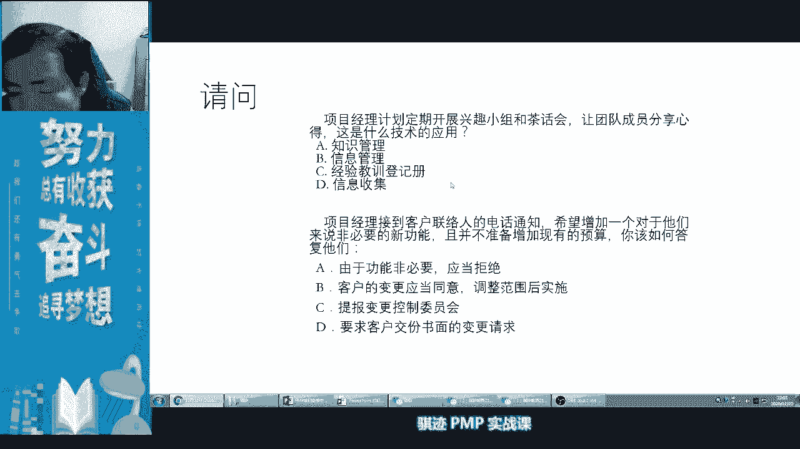

有的有同学说啊，这道题目你管理一个单项，就是说你在正在使用什么东西，这道题目的最佳答案是dog啊，这道题目的最佳答案是dog啊，我翻过来看一下这道题，最简单的dog啊，不是不爱，是dog dog。

在没有dog的情况下，可以考虑选不啊，可以考虑去玩，如果有dog的dog会更精确一点，因为它不仅仅是授权，还有一个什么安排工作。

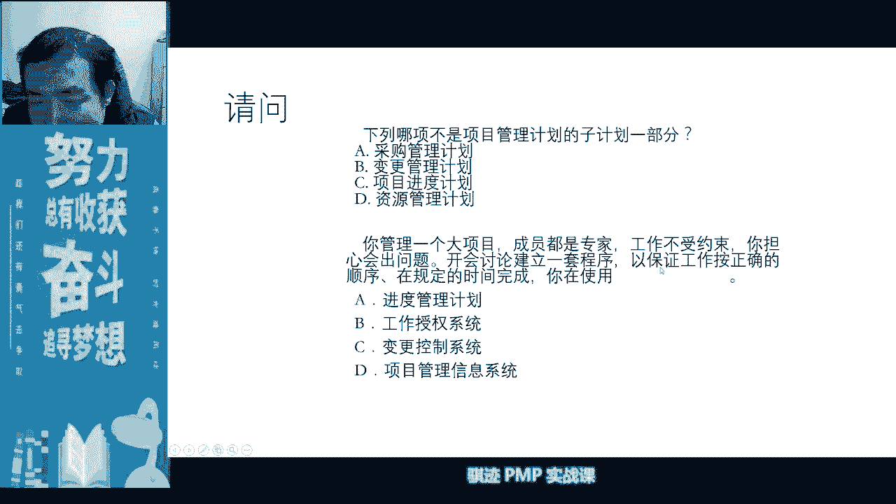

和按顺序完成这样一个东西。

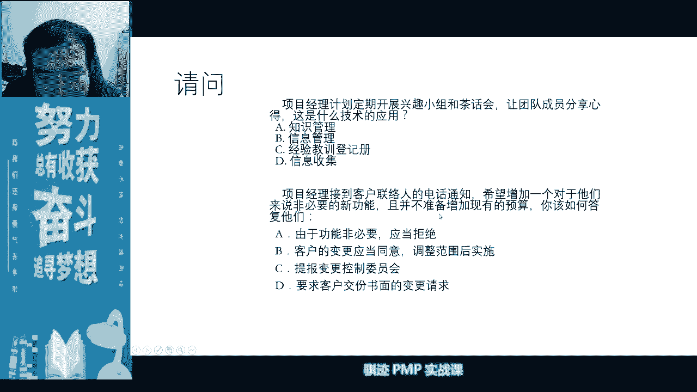

ok好我们继续最后两道题目了啊，倒数第二道项目刚刚结束，由于一些不利因素影响，项目发生了延期，并且成本超支，哪种方式是正确，答案a用文字记载情况作为可以吸取的教训，b特别注意将项目财务报告呢存档。

c由于成本超支，你的项目因为资金不足而结束，第一在合适范围过程中，用文字记录完工发生的情况，倒数第二道请作答，应该选哪个，答案也是很明显的吧，应该选哪个，倒数第二段应该选哪个，ok啊，有同学选a。

有个学生选dog，注意啊，你们选dog是因为我跟你们说了，项目终止，所以要记录完公式发生情况对吧，所以不用额外去记录这些事情，所以a是最佳答案，是不是啊a啊，所以倒数第二道呢正确答案是a啊。

而不是dog，不是dog，ok更加不是博爱，为什么要注意财务情况，项目超支很正常啊，老外搞一个项目，什么三三百万的项目，做成3000万完工很正常啊对吧，好最后一道题目。

询问项目经理何何时可以正式开始收尾，那么什么时候可以开始收尾呀，开始收尾啊，所以最后一道题请作答，选择dog，客户已经签署验收文件，还有其他的没有啊，dog dog dog dog a啊。

好我们项目方法都已经完成，ok啊非常好，这道题目其实说实话是结束项目，项目阶段的一个输入是什么对吧，我们讲a是不是输入，不是输入，输入是什么，可交付成果已经被验收了，客户签了验收文件了，才是输入对吧。

范围完成了之后，是不是先要内部验收啊，然后客户眼熟啊，对不对，还早着呢对吧，a不是b是什么，是输出，可项目成果的最终移交是不是一个输出啊，而不是开始啊，它是一个结束的产物对吧。

c经验教训总结也是一个结束产物，对不对，ok啊，这是考验我们应该哪个是输入，哪个是输出，对不对，所以什么时候可以开始收尾呀，客户验收了就可以开始收尾，这是当然这是起的条件之一啊。

ok最后一道题目的正确答案是dog，不知道你们答对了吗，好我们今天的课程现在就讲到这里啊，我们下课稍微晚了一会儿，那么我们周四的课程将开始讲范围管理，好吧，ppt稍后会放出，明天或者是今天晚上。

或者是明天我们会放出下一节课的ppt，那么在课程的结束最后呢，呃大家可以公屏上，如果大家有同学愿意的话，我给大家献歌一小手对吧，好那么我开始唱了，没有人没有人反对的话，我就可以唱了，亲亲的我的宝贝。

我要越过海洋寻找那已失踪的彩虹，寻找那已失踪的月亮，好好了，就清唱一小段啊，我要去哄女儿了，那么大家拜拜，按照惯例，我们要像我一个好。

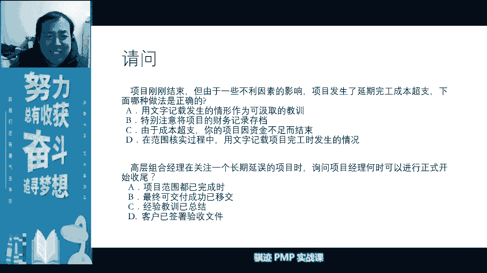