# PMP认证考试课程最新完整免费课程零基础一次通过项目管理PMP考试 - P1：PMBOK第六版 第一章引论-1 - 骐迹PMP - BV1Sb4y1f7Yt

不行卡死了啊，ok大家调整调整一下，尽量使用wifi和有线啊，好那么我们的课程正式开始啊，欢迎大家来到奇迹教育，欢迎大家来到我们的奇迹教育，2103班级的pmp课程，大家好，我是大家的讲师，很很荣幸。

很高兴能够为大家讲授pm博客的理论体系啊，pmp的课程的知识，鄙人姓谢，谢谢的谢单名，一个阳太阳的阳好，大家可以看到我看到我的样子了对吧，ok我的样子不重要对吧，知识是重要的啊，那么首先我们在开课之前。

我们要进行一些开课前的课程内容简介，那么偏僻的课程一般是以三个月为周期，我们的三个月后呢，我们的3月份会进行一次考试，然后以通过获得p m p的考试证书啊，然后呢，相结合为主的。

我们不能光依靠课堂上讲的内容，就能够通过考试，就要在上课认真听老师给你们梳理的知识点，然后呢在课后呢自己去再去学考考试，考前呢在做上完所有的课程之后呢，这样呢才能够有效的有效率的。

高效的高成功率的通过考试啊，我考试，那么啊，我先讲一下我这个上课的一些风格和规则，我的上课风格是规则这样，因为我们是夜间上课两小时，所以我们在课间呢就不安排休息了，大家可以自行安排自己的活动。

但是我们有几点要注意，第一点，我们上课是直播课，但不是看网络直播，所以精神状态是不一样的啊，这个这个和我们平常有区别，如果是在你们上，我再上我的听我的现场课的时候。

大家会知道我会关注每一个人的精神状态啊，关注每个人电脑慢慢听课状态，我我希望大家都全神贯注的去听这门课啊，不要示意按照看网络直播这种感觉去上课啊，这是不行的，第一点，那就是说要带着脑子，带着心去上课。

不能光带着神去上课，否则你左耳朵朵进，右耳朵出，这是没有效率的，第二点，上课课了，所有的同学无论是不是已经拿，应该得大部分同学，绝大部分同学已经拿到讲义了，拿到讲义的同学要把讲义放在手边。

然后呢要有一支笔，要有一支笔，然后呢笔呢要在讲义上写东西，或者在自己的笔记本上写东西，要记笔记，我在上课时要求同学记笔记的啊，这个和其他老师可能不一样，因为因为记笔记是一个促进你们记忆的过程。

而且是有很多重点的知识，我会在我的我的pb播放的ppt当中会展示，我的嘴巴当中会讲，我的重点，会在上课的内容当中会提醒你们，哪些东西是要记笔记的，大家务必把这东西记下来，因为我凡是说要记笔记的东西。

肯定是考试非常关键的啊，没有讲义的同学没有关系，你可以先看我的p p t，然后呢找一本笔记本，找一本笔记本，然后啊啊把笔记本打开，然后我会把关键的东西，你现在笔记本记下来，然后结合讲义也可以啊。

呃讲义的电子版是不用想了，有知识产权啊，ok但是讲义我的啊，我的电子版是经过修改了，然后如果有同学啊，老师我在上课过程中没有听清楚，他说老师我网络卡了，然后老师呃，我老师我有点事情离开了一会儿怎么办啊。

很正常，没有关系，我们是有课程回看的，但是建议大家好，跟着我那种节奏走，因为上课的内容是节奏是相当快的啊，所以最好大家是现场看会更加好一点，更身临其境的感觉，那么说到上课的风格啊。

大家可以听听得出我的嗓音，我的上课风格呢，我的上课是这样的，我在说重要的内容时会把它放慢，我在说不重要的内容是呢说话会加加快，然后这些呢都是为了突出重点和非重点，当然说没有绝对的重点和非重点。

我讲过的每一句话都有可能会考试考到，但是重点会考的东西我会讲的特别的细啊，一般可能性考的概率不大的呢，我会讲的相对粗一点或者快一点，但是关于上课有任何内容，大家如果有意义，可以直接在公屏上跟我进行交流。

然后呢我会有些东西，没有听懂的东西，大家可以根据大家要求，我们再细讲一下啊，这是可以，所以大家一定要抓住这个机会啊，抓住这个机会，然后要不要因为如果你没有听懂或者有这样，然后你再去回看的时候。

有时候可能就不一定讲的会讲那么细啊，我是会根据大家的反馈去细微的调整内容，我们的上课当中，95%的内容呢是必讲内容，但是有5%的内容呢，是会根据大家的反馈进行调整啊，这是我的风格。

会根据大家的反馈进行调整，如果大家理解的深，好的呢，我会讲的更深入一点，理解了理解的差一点呢，我讲的更细一点的，可能就不太会深入啊，好那么是这样的好，那么接下来呢我开始啊啊啊。

当然我之前在我们在课前的热身的时候，我已经讲过了，我在上课当中我会经常会提一些问题，这些问题呢对大家来说呢是要带着脑子回答的，也就是我我提的问题，不是说啊你回答啊，是是是哦，不是不是就可以了。

我的提的问题有可能是yes和no都是错的，明白了是，你一定要在听懂我的课的内容情况下，做出正确的回答，有时候是回答yes，有时候回答no，有时候既不回答一些one no会回答不确定。

有时候回答说要看情况，或者说按照具体情况来做回答明白吗，这是要带着脑子，我希望大家在我们的微信群里回答的越踊跃，越有自己的想法也好，因为回答了踊跃想有想法，这可是帮助你记的啊，是这样啊。

这是我们的上课风格好，那么因为是夜间课两小时关系，我就不安排课间休息和上上洗手间，这种这种时间大家可以自己酌情酌情好，那么在上课开始之前呢，我们先讲一些预备知识啊，什么叫知道的过程呢。

你要有了对这个事情也在了解，这叫做知道，第二个呢叫做了解，了解是什么呢，你会有一定的知识点，但是你的知识点呢不全面或者不系统，第三个层次呢叫做掌握理解，掌握理解，掌握就是说你对于知识点呢明白了比较透彻。

明白了比较透彻，并且呢能够结构化的记忆，这是我们比较理想的去记忆知识啊，能够把学到的东西运用到实践当中去，这是第四层的东西啊，第四层是比较啊，要学以致用了啊，学以致用了。

当然这个东西呢没有那么快能够掌握，第二层到第三层，啊了解和掌握，至少要把大部分重要的知识点要了解，同时呢要最好能够做到结构化的掌握，为什么做结构掌握偏僻了很多的考试也好啊，考试为主呢，很多东西也好。

考试导向型的结果也好，它都是什么要求你结构化的掌握知识，你要知道这个结构是怎么样，逻辑是一步一步怎么样的，前前面和后面是怎么连接起来的，才能够很好地回答问题，所以你光知道一个知识点是没有用。

可能这个知识点在这个语境环境下是对的，在另外一个语境下就是不够正确的，这是偏僻的一个特点，所以大家一定要结构化的知道它里面的知识，并且能够掌握好，才能够有效的去啊答题，然后通过考试啊，这是一个特点。

所以上课的时候呢一定要不能听光听点，而要以点带面，以面带立体啊，这样的形象好，那么上课一定要记住，我们最后在开课之前，我们还要记住一个事情，就是说一定要记笔记啊，我的上课会强调要去记笔记好。

那么我们上课做了一个开场白，简短的开场白啊，啊阶段开场白，然后呢我们又做了一些基本的一些规则啊，等等一些东西，那么我们接下来呢就开始讲我们的p课程，pp课程，那么我们p m p的第一章呢叫做项目的引论。

项目管理的引论啊，就是我们的一些基础设定啊，技术定啊，这是我们pp截止到2018年，安利你们各项认证认证数据啊，就当认证数据大家可以了解一下，所以p n p在国内的考试呢，认证呢已经通过了非常普遍了啊。

但是呢质量证书依然很有用，在很多时候呢，pp考过p m p并不意味着是什么，但是如果你没有p m p的话，哎有些同学说网络卡可以啊，有些同学说网络卡吗，如果呃卡的同学打一不卡的同学打二好吧。

我们公屏上看一下，我一边讲一边看啊，看看是不是有问题，是不是我有问题啊，那么偏僻的证书的作用在哪里，是如果你没有这张证书，他是个门槛，如果你没有这张书，人们会认为你不具备项目管理的经验和知识能，力。

是这样的情况，但是有战争中并不代表你有这种能力，但是说有这样证书有什么好处呢，你会和很多一样有其他p n p证书的人呢，有共同语言，有common sense啊。

共同语言common sense这种东西呢非常重要，只要有了共同语言之后呢，很多人认才会认同你啊，大家都知道对吧，也就说共同语言就像什么酒之后喝过酒了，大家都是哥们儿啊，就是类似于这种意思啊。

ok啊大部分同学的网络20就可以了，这都是打二的，ok啊，那就没有问题，那我觉得我这里就不需要调整什么好，那么所以这就是p n p证书的一个e啊，很多人说考出p单位里也可以报销，可以升职加薪啊。

这也是p的另外一些意义等等等等对吧，ok好。

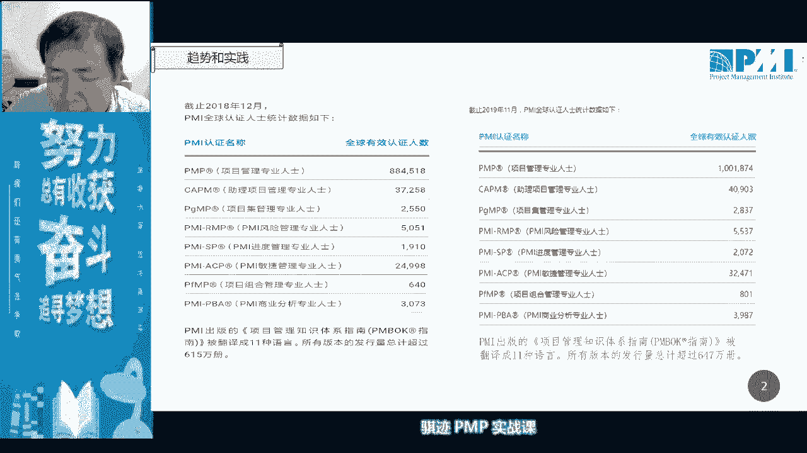

那么我就不多说了，这个啊这些就不多说了，那么p p呢一共整个课程呢分为13章，13章，我们呢课表已经发给大家，大家按照课表进行分解啊，可是呢那么13章，其中前面四章呢是我们的啊一些准备啊。

前前面的四张呢是我们准备啊，三张是我们的准备，后面的45678 90 11，12 13呢是是我们的十大知识领域啊，是我们每一个管理的知识领域，ok这是大致的概念啊，这后面的每一个章节当中的管理内容呢。

我们都会学啊，学循序渐进的讲啊，不要急啊，那么讲到p m p呢，我们又提到另外一个词汇叫做pm bo pmbok，大家看啊，为什么不是pm b o k啊，那什么意思呢。

那么pp里面我们所说的pmbok它不是一本书，而是叫project management，birdy of knowledge，是知识管理主体，这是一本相当于在pmi的定义下，关于项目管理标准。

相当于一个标准，他已经成为了一个美国国家的协会标准，n啊啊n n a r a n s i的标准啊，所以它是一个美国的很多国家标准，接近于向全球标准，它是一个全球管理的一种标准。

它是以这种标准为基础去描述的啊，所以这标准描述的，所以我们以后看到pmbok的，记得千万不要多加一个o啊，否则你就被当成门外汉了啊啊，然后p m p呢是什么，它是它的其中一个认证啊。

我前面看到有很多其他的认证，但是国内最为流行和通行的是p p m p p m p，其他的有两个人知道我们后面会介绍的啊，是p g m p和p m p，所以这是p np的一个含义定义啊，含义定义。

那我们的pp当中为什么pp好呢，我们花啊花几秒钟你讲一下啊，pp好是因为它普遍认可良好实践，说实话pp是一种什么万金油，它适用于所有的项目管理环境，适用所有的项目管理管理，但是呢它的缺点是什么呢。

它不会针对于某一个行业一个领域，但是呢任何一个行业领域的项目管理呢，它必然是也是很大程度上符合p np的标准，只是在他特定环境做一些特定化的，继续的优良改良和进一步的细化工作啊。

所以pp是一切项目管理的一个基准技术好，那么我们介绍一下pp的一些基础的背景啊。

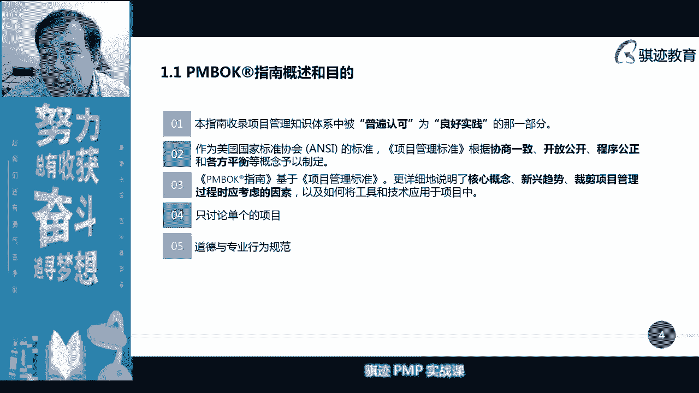

基础背景那么偏僻，上课的惯例，按照老外的惯例，我们上课上上来先会讲一些啊道德，法律法规和职业道德诚信评比当中，我们讲有责任，尊重公正，诚信等等等一些东西啊，这些一些东西，但是注意pp里边啊。

现在已经考的比较少了，以前的话里面最多在一个哦公平公正的道德，专业的环境当中，什么是最大家觉得什么是最重要的，或者是最应该遵守的啊，你们可以在公屏里打一下，什么东西是最应该遵守的，最重要的。

第一要遵遵守了，在一个社会环境中或者一个项目环境当中，规则啊规则啊，龙啊嗯嗯诚实，ok啊，公正法律，ok啊有同学啊，好嘞好嘞，非常好非常好，ok我看到很多同学回答了，在一个项目管理当中过程当中。

最应该遵守的底线是法律，注意这是毫无问题，那么第二个呢大家要记住啊，所以记住但是不一样啊，但是要记住在很多方面，关于呃关于我们的道德规范，以及关于我们的为人处事行为规范方面，有一个东西也是很重要的。

叫做文化，首先必须遵守的是法律法规，第二个必须遵守的是文化，公司的组织政策啊，组织的组织政策，同时必须遵守的是责任，尊重工程和诚实啊，注意啊，现在因为啊道德与专业规范这些东西呢。

在第六版当中呢考的比较少了，但是实话这个一样注意，有可能会有考试啊，会考到有可能，ok啊所以要明白这一点可以，所以我们要先遵守的是绝对不能触碰的底线，违反底线叫做法律。

接下来是会对我们项目产生巨大影响的，就是说当地的文化，当地的文化，因为项目不一定在，比如说不一定就在中国，他也可能中国文化和美国文化可能就不一样，文化中，其次要一定要遵守的是什么，组织的规章制度。

组织规章制度政策，除非组织规章政策，政策与法律相违背啊，与与项目所在地的法律相违背，那么以法律为准，以法律为准啊，好那么我们在整体框架上，我们今天的课程会讲项目运行环境。

那么我们后面会讲项目的项目经理角色啊，项目的值得指南等等一些内容啊，这是我们的一些啊，今天讲的是指南，接下来会讲到项目。

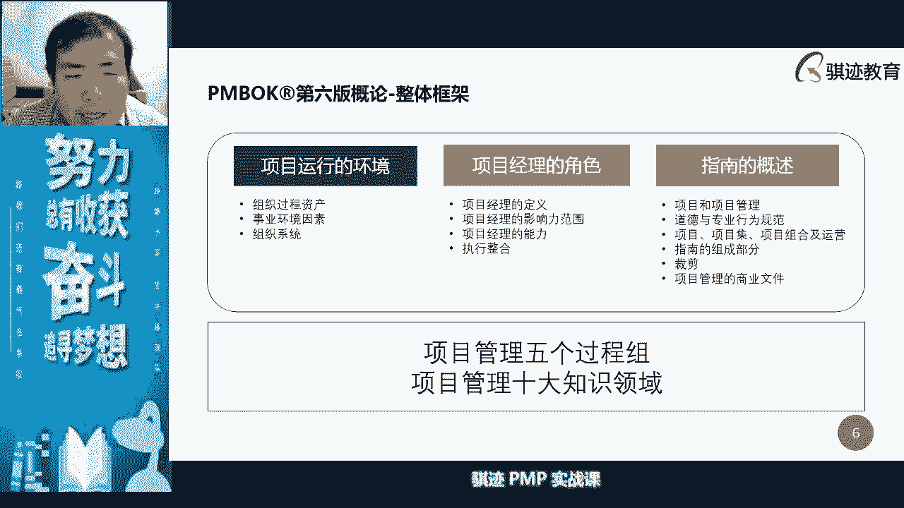

工程环境和项目经理的角色啊，这样的整体框架，那么首先我们要对项目做出一个，做出一个定义啊，项目是什么，项目是为创造独特的产品服务成果，所做的临时性工作，那么这中间有几个要素，大家可以看一下。

这有几个要素，项目是一种产生独特产品服务的结果，所以它是unique独特的，那么为什么是它的独特来自于哪里，首先它的独特来自于和运营相比，项目的成果是以前没有的，或者是有改变的啊。

注意所以项目可肯定做出东西和以前不一样，所以他做出的独特的产品服务成果，我们称之为产出的成果，我们称之为可交付，叫做deliverable，ok啊，大家可以在自己的呃讲义的纸质讲义的讲义上。

或者是在大家的自己的笔记本上，记下这个英文单词，deliable，ok deliver我可以留言哦，为什么记得，因为这个词其实说是在很多场合，我们都是用专用词，我们不会在p n p的这个知识领域范畴里。

我们不会说什么啊，outcome吗，output啊，或者什么工资啊，这这些东西啊，这些都不是我们的专业术语，所以你在如果在项目讲项目管理，或者在项目管理参与某些环境当中，你讲deliverable的话。

就显得你是学过pp啊，这个这个当然是一个小tips对吧，你要显得你怎么学过cp的，如果你要用运用到中文的工作环境，那么就叫可交服务，叫做可交服务，如果是英文的环境，你要一定要写deliable。

deliable，ok啊，我说什么词，大家可以看，大家可以看到我屏幕的左上角，那右上角，sorry，右上角大家可以看到吗，把屏幕的右上角可以看到吗，啊这个deliverable。

ok啊这个词要记住以后呢就要学过拼p之后呢，要用专业的词说专业的词啊，说专业之前的你比较有什么格对吧，然后呢可以唬住别，这是也是有些人觉得学p np唬得住别人，那么接下来说我们说为了独特的产品服务成果。

那么我们要组建一支临时团队啊，临时团队，所以项目的团队都是什么呢，啊我们我们可以看上一张ppt，也可以上一张图，对项目的团队是什么啊，所以项目的团队都是临时组建的，在组建完工作完成，达到我们的项目目的。

项目结束或者没有达到项目目的，在项目结束之后，终止之后，终止之后，一个是终结的种，一个终止会讲啊，然后我们团队会各回各家，各找各妈，所以我们是临时性的，而一个运营团队呢可以持续性的工作。

他们可以在一直在一起工作，长期工作是有可能的，但是项目呢往往是临时性的，往往是临时性的啊，那么项目呢它是临时性的工作，还有个什么事项目另外一个意思是，不但团队是临时性的，而且它的周期是有临时性的。

他不可能一直延续下去啊，它会在一个或长或短的时间之后呢，它就会结束，这是项目的临时性的特点，那么有没有可有没有什么项目，啊有没有人告诉我，没有啊，没有有同学干脆说没有，没有很好，其实是有的。

但是它依然是临时性的，那么我举个例子啊，这个例子我一直喜欢，就很有意思，按照自己房事活着哈哈什么意思啊，就是有一个大学好像是哪个牛津还是哈佛，忘记了某个大学，他要测定一个什么东西呢。

他要测定沥青的粘稠度，大家可能听说过测定一个沥青粘度怎么测呢，他拿了个漏斗，一个漏洞，这个漏洞里面放了十公升，好像是100公呃，十公升好像是一公升的那个沥青，然后呢在漏斗下面放一个接着一个东西啊。

接了一个一个烧杯，然后呢把这个环境的封闭起来，沥青的就知道非常粘稠对吧，然后他每这个沥青，好像每1年左右才能往下滴一滴，然后呢这1l的漏斗要滴完呢，大概需要大概两三百年，100多年到两三百年对。

然后呢等到这个滴完了，我相信很多人一辈子肯定已经过去了，这个是科研项目，但是他依然是有始有终，他依然是一个临时性的工作，但是他会超出你的一生，这是个很特别的例子，但是你记住了，通过这个例子记住了。

项目总归会有始有终，所以他是个临时性工作人，也会有聚有散，我们都是为了一个独特的产品服务成果而来，当我们达到目的了，我们就会散去啊，ok大家现在对项目的特征有没有理解啊，这个项目的特性啊，这要非常理解。

那么项目总是为了什么新产品，新服务，新成果而做，那么这些东西呢有什么特点呢，什么叫独特性呢，就是说以前没有被组织，或者没有被甚至没有被人类曾经做过啊，所以没有做啊，像我们国家最近有一个很大的项目啊。

很大的项目，大家知道嫦娥5号，知道吧，嫦娥5号我们马上就要返回中国了，马上马上返回中国大陆了，然后嫦娥5号是中国人，第一次从月球上采集土壤回到中国啊，这是中国人的第一次啊，我们在几十年前。

曾经啊被美国人赠送了一刻月球的土壤，这一克月球的土壤，中国人利用着很宝贵的，仅仅的一克的月球土壤，然后做了大量的基础科研，为了我确实，但是确实是为了中国的科研呃，登月视野。

探索宇宙的事业做出了解决了最大作用，那么这次中国人通过嫦娥5号这样的项目，通通过发射啊，落地绕行再回来，这样一个过程，中国人将会从月球上，采集2kg以上的样品回来，整整是当年中国人获得了2000倍。

然后我们获得了更多，不能够用金钱价值衡量的科研项目成果啊，当然这中间要克服了诸多非常极多的一些挑战，所以这是非常独特的产品服务成果啊，这是一个很伟大的时刻，我们在做，我们在现在，都将经历这样一个时刻啊。

我们未来会经历更多这样的时刻啊，我们在见证历史，we are history对吧，就像今年我们见证了太多历史，ok啊，那么我们废话不去就继续说，但是项目大家都明白了。

都是为了独特的新的产品服务成果而进行的，如果是以前重复有的呢，那就不用项目，那么从这个引申当中，我们就可以引申出一个什么东西呢，项目是会改变一些东西，或者项目会达到一些特别目的的啊，我们后面就会说啊。

我们会不会看到，项目就是为了达到一些特别目的而存在，但是呢我们讲项目会不会失败，项目肯定会失败对吧，项目如果失败了怎么办，那么他就会什么终止啊，终止大家注意啊，注意大家看我的鼠标。

这里主要看我鼠标这里啊，注意用词，这里有一个叫中止和终止项目，有时候会中途停下来，但是呢不取消，这叫做终止，项目呢有时候呢会中途停下来，再也不做了，这叫做终止啊，中文上发音是一样的啊，当然字面上不一样。

大家一定要看我的屏幕，那么项目如果终止了，那么这会产生什么结果啊，就项目经理就会把已经做出的结果，已经做出成果来要移交，同时呢项目经理要做什么要做，为什么做项目前面一个种植啊，注意是前面这个中指。

这个中指呢中指原因啊，如果项目中间要停顿了，要暂停一下怎么办呢，那叫终止，那么我们也要在最后项目最后做完的时候呢，要解释一下为什么中途要停下哎，因为钱不够了，或者钱暂时没到位啊。

或者因为项目环境不成熟啊等等等等啊，那么在这个当中呢，我也想举这个例子啊，还是中国人探月的例子，中国人当年其实在2017年到18年的时候，中国人就想要发射嫦娥5号去月球采集月壤，但是为什么没有成功。

一直到成型，一直到现在，就是因为长征5号当年的发射失败啊，晚了2年多啊，所以这个这段时间内，嫦娥5号的这个项目呢，月壤的这个采集这个项目被终止，注意是哪个钟啊，是中间这个钟啊，是中间这个中。

但是他没有停止，所以我们这次登长长征5号再次成熟了之后，我们继续这个项目，然后获得了，目前看已经接近获得了成功啊，最后要最后等一步，最后等最后长5号回来啊，我们的采集器回来，ok，都给我讲没了。

哈哈哈啊，我看一下东西啊，ok所以项目的可交付成果会持续的存在对吧，所以他是临时性。

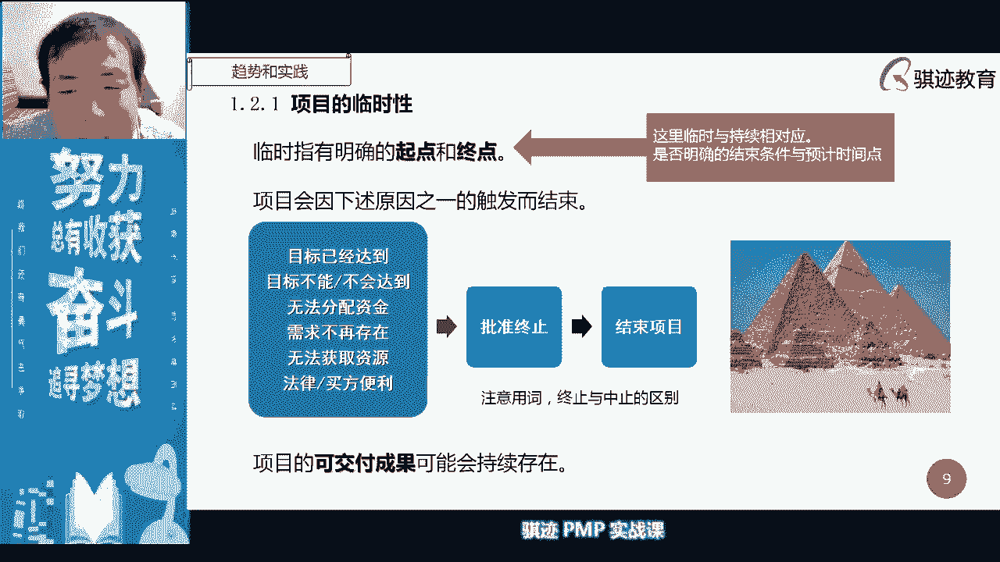

ok啊，这时候讲，那么项目呢会有一个渐进明细的过程，什么叫渐进明细呢，是随着项目的不断的推进进展，那么项目的内容呢会逐渐的丰富化，具体化，明细化啊，p上都有，然后项目的风险会不断出现啊。

但是这里呢大家请记好笔记啊，记下笔记，先记一下笔记，什么笔记，项目我可以打在群里，大家可以也可以记下项目在开始的时候，什么东西最大风险，因为不确定性最大，项目在什么时候风险最小，结束的时候。

因为一切都确定了，好ok啊，因为我们这里有两个群，所以我会发在两个群里都发一下啊，那么项目什么时候变更成本最高呢，结束的时候拆迁项目结束，为什么项目当结束的时候，和所有的东西是不是都已经做完了。

你再去改变一样东西，是不是成本很高啊，要推倒重来，有可能对吧，项目什么时候做变更成本最低啊，开始的时候启动的时候，因为什么什么东西都没有做，我们只要稍微改一改就行了对吧，啊ok啊，有人积极。

有没有两个群啊，微信群人数上，这里面有两个群，所以我要把另外一群给贴一下啊，好啊，大家这个概念明白了啊，看看就行了啊，这是一个我们项目当中的进行特征，所以项目其实是随着项目的开展，风险会逐渐逐渐降低。

虽然风险会不断出现，但是每个风险在一个管理良好的项目当中，都会被逐渐被克服掉，所以项目其实本质我们讲啊，当考试不会这么说啊，考试不会怎么考试，只会问你什么时候高什么低对吧，这个会问概念上。

但是其实管理和项目从本质上讲，就是要克服不确定性，就是要克服风险，要如果一切都确定了，没有风险，那么他不用项目这种形式做，它可用运营的形式就做的对吧啊，明白我意思吧。

啊这个是这个是很很清晰的啊，所以我们回来看项目专案，所以有什么临时性渐进明细性和独特性，那么项目还有一个特性叫做不确定性啊，这里p p t上漏了一个项目，有不确定的项目，为什么项目有风险对吧。

项目和运营最大的区别就是项目带有不确定，再有风险，项目同时深入记一句啊，当然考试，但也不一定考，但是你们要明白，项目的不确定性是最大的，不确定始终来自于什么，人人是一个项目当中最大的不确定，啊明白了啊。

ok啊这个这一点大家要记住啊，项目管理项目有时候的工作，你的性质本质，你从很多角度看。

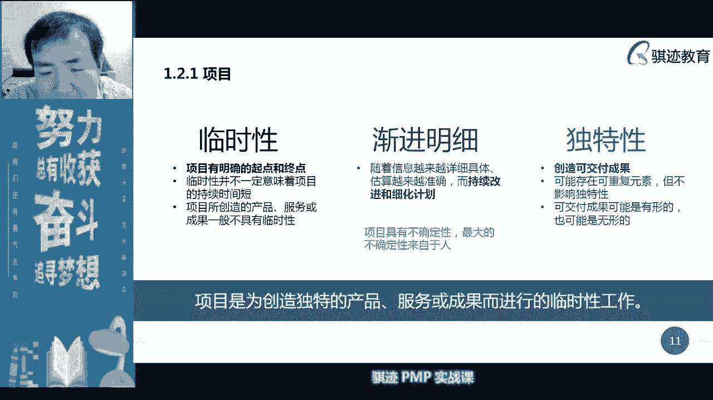

就是为了克服不确定性而存在啊，客服不确定性，那么项目有什么用呢，我们讲项目有什么可交付成果有什么用呢，都是为了创造价值，价值呢又分有形的价值和无形价值，有形的价值呢其实说唱都可以用马尼钞票对吧。

那么项目有些东西呢，没办法用华盛顿和王爷来表示，那么就用什么是一种认同，社会认同啊，社会认同，人类认同和一种美誉度这样东西来表示啊，所以你看项目会创造商业价值，一种是有钱能用钱衡量。

一种是不能用钱衡量的啊，那么在我们用钱衡量，那就很简单啊，这些都能看得懂，那不能用钱衡量呢，我跟大家稍微解释一下商用对吧，就是商业信誉度，品牌认知度，品牌认知度，那么品牌认知度是大家都知道啊。

比如说你们要喝碳酸饮料，你们第一个想到的是什么啊，全世界的人们大部分都想到不是可口可乐，就是百事可乐对吧，然后就分为可可乐，但是你会从可想到碳酸饮料这样的东西的话，你马上就会想到对吧。

所以这就是品牌认知度对吧，那么比如说我们说到elsorry啊，我碰一下，比如说如果我们说啊中国的国酒是什么啊，股价赶上酒驾的那个那个那个那个对吧，那就走了，茅台茅台，那么啊这还有说我们为了公共利益对吧。

为了公共事业对吧，为了大家和人类的幸福对吧，还有什么商标对吧，有个商标，商标的商标形象对好，战略一致性，最后一个啊，最后一个叫生育对吧生育，那么这些都是一些什么不能用钱衡量。

但是呢有些时候比钱更重要的东西，它有它也是会成为一个项目，也是啊有些同学说汾酒啊，拿拿你的对于酒的历史其实很悠久的，历史其实了解的也不错啊，严格意义上来说，汾酒是茅台的师傅，茅台的师傅。

茅台镇当年的酿酒的，很多记忆是传自于山西汾酒，山西汾酒，这个你们可以去研究一下啊，咱不是说谁是否决一定就更好对吧，只不过啊时也利也星野王也对吧，啊啊啊ok啊，有些同学还是还是挺积极。

踊跃参加我们的互动了啊，那么项目那我们再继续讲项目特性，那么项目因何而来，我们讲项目来源于哪里呢，我们讲项目来源，其实最初的来源来自于一个动机，这个动机来自哪里的左翼，其实说我们说项目最最最最最的来源。

所以很多公司的很多公司的项目来自于什么，老老啊，老板能明白我意思吧啊来自老板啊，他也拍脑袋，但是拍脑袋不认错，有时候拍脑袋的想法经过合理的过程，确实能够变成一个好的项目。

那个给组织和大家带来巨大的收益啊，ok以来最需求答案肯肯定来自于需求，对这个毫无疑问，所以项目当中大家可以看到啊，学了句需求来自于想法这个东西就可，但是其实项目很大，大量的项目并不直接来领取。

而在于什么，而对于一个想法，一个一个id，一个理念，然后呢他通过什么东西来进行保障啊，可行性研究，可行性研究，然后再通过什么商业论证啊，大家都知道啊，然后商业论证可行性通过了之后呢，就开始立项了。

然后开始什么开始做项目就来了，当然这些东西背后，那也可能是什么新技术的要求啊，市场啊，相关方啊，业务改进等要求，那无论怎么样，那么做项目它会带来什，对组织来说会带来什么好处呢，会带来组织的改变。

会让组织推动组织从当前走向未来，可以把组织往前推，通过不同的项目，组织可以进行什么进化演化啊，情况有话好，那这个话题呢当然我们就不多展开了，因为时间关系再往上讲呢，可能我是能讲。

但是可能大家没有那么多时间去学其他东西啊，只要知道这点就可以了，其实核心了，我们可以稍微给你讲讲核心改主要改了什么，改的是文化，改的是构架，改的是组织的核心驱动力，的核心竞争力和驱动力的新的方式。

ok啊当然这个就说的高大上了啊。

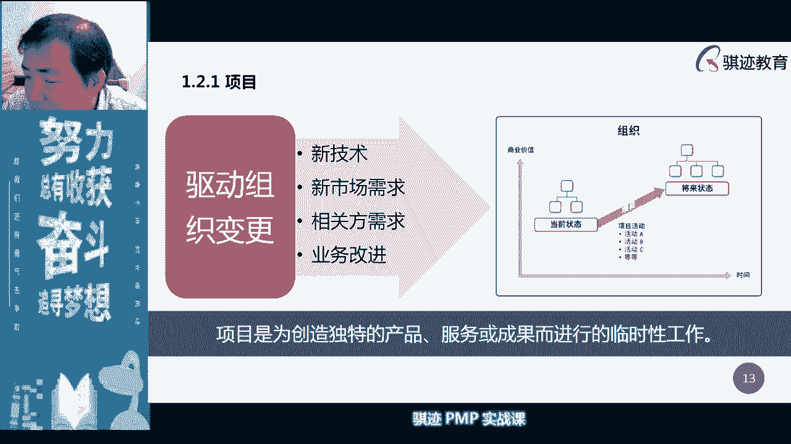

好那么项目管理重要性啊，这里稍微提一下看看无所谓啊，因为这个考试不会这么傻的，问问对吧，什么项目呢，为了什么呢，主要是为了什么，达成业务目标，满足相关方期望解决冲突对吧等等等等。

那么项目当中呢我们要管好什么东西啊，管好业务管理相关方，管好交付，管好冲突，所以项目经理本质上是一个什么baby cup babysitter啊，保姆啊，想看看孩子的保姆，你要看着你的项目。

作为一个孩子，一直到成人啊，一把屎把你要把他拉扯大，这就是像啊，这就是项目经理的一个啊，通俗通俗定义这项目管理重要性啊，这这也没啥那么讲项目大家做管理的项目当中，大家会看到啊，啊这一页我自己加了一些字。

大家可以看到啊，这些字是要记啊，是要记的，但是大家跟我们大家都在外面，很多管理项目会看到项目除了是一种形式，叫大家看项目之上还会有其他的形式存在，叫什么叫做项目集和项目组合，项目集和项目组合。

那么几何项目组合啊，那么项目集和项目组合是和项目有什么关系，首先首先管理层次上来说，肯定是项目组合在更高的层次，这是毫无疑问的，所以我们先讲项目组合和项目集当中，那个层次啊。

项目项目组合和项目当中的一个词叫项目集，项目集，项目集是什么意思呢，就是说如果我有很多个项目啊，注意这里要跟着我啊，这里比较重要啊，如果我有很多个项目，如果这些项目存在协同效应啊。

注意我的词存在协同效应，那么把它放在一起管理，可以达到我这里写了一个叫1+1，等大于二的这样一个效果的话，那么我们就会采取项目即将形式，就比如说我有一个开，我有两个同样的开发项目，软件开发项目。

地下两个软件开发项目呢，叫共同使用某一个开发平台，那么我如果各自去做开发平台的话，就是相当于效率浪费，进度浪费，那我可以怎么办呢，我可以把他们俩作为一个项目集来管理，那么在项目级管理下。

项目及经理可以把这两个项目共用的，这个开发平台，作为一个项目的共同活动进行统一调配，大家各出两个项目，各出一部分资源，从而达到一个什么1+1=2，当它被开发出来之后呢，可以给a项目用，也可以给b项目用。

不要重复发明对吧，大家听过这句话，达到这样效果，同时呢一定程度上协调资源的相互分配，在内部相互配啊，不要争吵，相互分配也是起到这个作用啊，注意它的更多的作用是进行协调协调啊，但是它也有资源氛围作用。

但是是次要的啊，ok只是在他们可自己应该拥有的范围之内，进行控制，这是项目集，那么什么是项目组合呢，项目组合就要占更高一个层次啊，是在一个组织战略的层次，所以一般来说管项目组合的人呢。

项目组合管的是什么，项目组合管的是企业有限的项目资源，有限的项目资源，但是呢我要投入的项目当中，平均投平均到底意味着什么，每个项目都拿不到应该有的资源，很有可能每个项目都那我只能选择一部分项目。

而放弃一部分项目或者优先某一部分项目，然后呢让某些项目来做等待，所以我们前面不是学到一个项目的中指，那个中间的中那个中指，就是说有些项目的优先级不高，我先让他停一停，可不可以，可以啊。

项目级就是做这个事情，项目就是东项目集团，就决定哪些资源先给哪些项目，或者项目及项目组合，sorry啊，sorry，这就算就做这样的事情，决定哪些资源优先给哪个项目集，或者哪个任务去使用。

它的目的是什么，最大化，注意啊，你可以在旁边写写，最大化组织的利益最大化的去实现，这里我们可以看一下组织的战略与目标，注意这是项目级的主要目标啊，可以啊，所以我刚才说我在说话是不是比较慢。

我说话慢的都是重要的东西啊，记住啊，这里可以圈一下，那么项目组合上面所承载的是什么，一个组织的战略目标，战略目标战略是什么，因为什么strategy啊，战略目标市场是一个组织的使命和远景使命啊。

我们可以我们可以稍微介绍一下使命叫做mission，愿景呢叫做vision，什么样的愿景，愿景就是说一个组织未来准备变成什么样子，使命呢，是一个组织和未来准备做到什么程度。

就好比说你们的人生愿景和使命是什么，来你们在公屏上给我打一下，你们的人生的愿景和使命是什么，愿景是to b，你们准备变成什么样子，使命是什么，你们准备做到什么，做什么事情，做到什么程度。

你们可以随便随便发一下啊，那我们接下来会举个例子，然后跟大家解释啊，管理啊，像我们的一些一些一些一些内容啊，那就可以在公屏里打一下，啧。

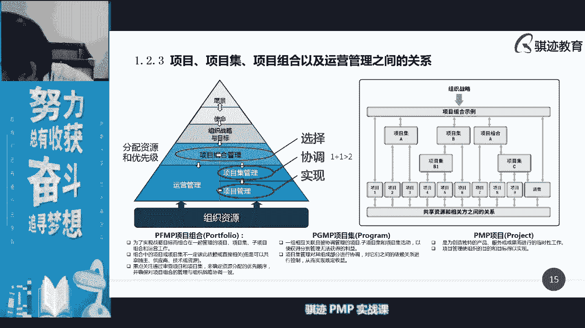

ok有人和我互动吗。

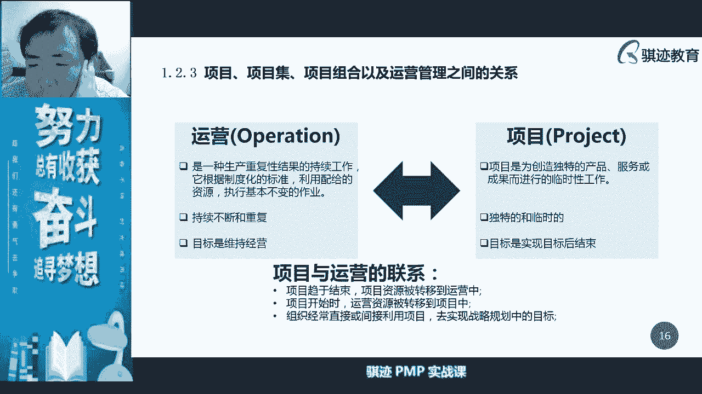

愿景更好的生活使命挣钱啊，这位这位同学实在，但是是呃结果和那个略有偏差啊，愿景愿景是不工作，成为一个不工作啊，不劳而获的社会啊什么的对吧，ok啊，愿景快乐的工作快乐生活，使命就是挣钱啊。

愿景其实不是一种过程，而是一种什么状态状态，那我们我们啊愿景使命挣一个亿，愿景挣钱啊，ok啊，有大家的大家的，大家的心情可以理解，都想挣钱对吧，大部分人都想挣钱，to be活在当下，老师使命过好每一天。

愿景诗和远方嗯，使命计划哈，ok，那，然后我们都学过这样一句话，ok财富自由好好过，每一天啊，我都学过这样一句话啊，为中华崛起而读书，这是谁说的啊，你们可以打在公屏里，我科技学校啊，这样就不用互动对吧。

为中华而崛起，为中华崛起而读书，这句话是什么，这是他的使命愿景是什么啊，这位伟人的愿景是什么，创造一个人人平等，未来社会美好的一个崭新的中国，这是他的愿景to b，那么战略是什么。

通过充分发动群众的觉悟，然后去影响大部分人，然后再来改变这个世界，对吧啊，这就是什么组织战略目标，那么战略目标我们组合是在，那么我们的组合是我们的项目组合是什么呢，搞很多歧义，然后把队伍拉起来。

可能一起去组合，合在一起，然后再创建根据地对吧，然后找建立根据地了，然后建立什么啊，我们的解放区啊等等等等这些解放战争当中，这一切到从抗日战争，解放战争一系列措施都是一个一个项目。

这个项目最后的成功最后达成了我们的使命，也达成了我们的远景对吧，有些同学啊，有些同学啊好像是中文就是中文了，谢谢啊，东西啊，有些东西不要忘，不要忘记我们祖先的很多啊，我们的我们的前前任。

前辈的伟人所说过的很多东西啊，还是不错的，有道理，啊举个例子大家能够现在能够理解吧，啊能够理解的啊。

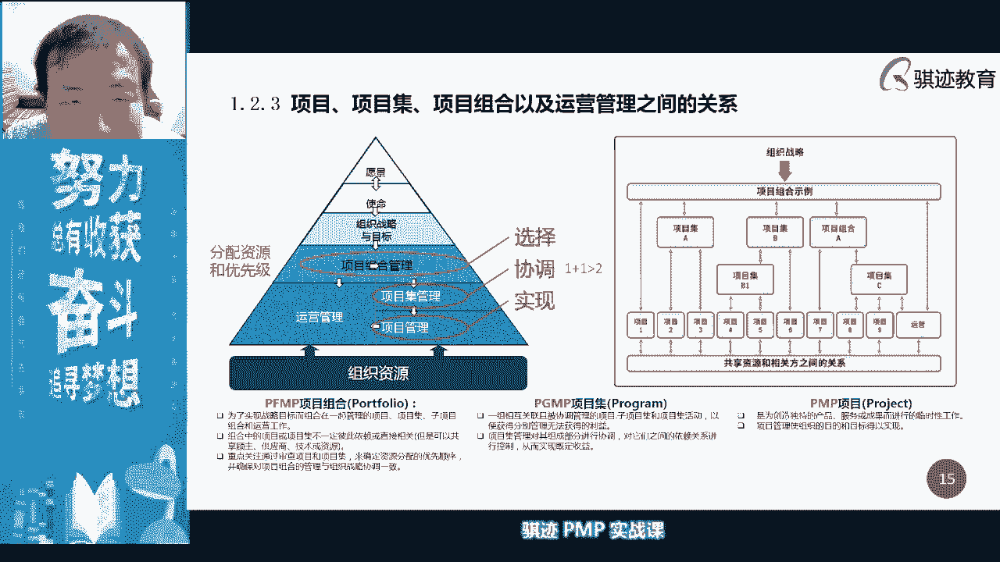

好我们继续往下讲，然后呢，项目项目集和项目组合是会考的一个内容，我刚才举的例子大家已经比较能理解了，那么考试还经常有时候会提到一个什么，什么是项目，什么是运营，运营是一种。

大家可以看作是一种机械性重复劳动，机械性重复劳动啊，目的是维持，但是呢他只要不发生其他情况，它会永久地持续下去啊，理论上和理论上，但是他做出的东西呢是独特的，他做出了东西之后呢。

可能会被移交给运营去做持续性的东西，为什么项目做出的东西可以交给运营啊，就在于项目把所有的不确定性，不能实现的路径呢都克服掉了，困难都克服掉了，所以它可以较为运行啊，这就是项目和运营的区别。

将我们的原曲，那么我们举个例子说什么啊，我们举个例子是吧，比如说你啊你家里的领导跟你说啊，然后呢你先去上去试，要么面没发好，面发黄了，要么呢呃面发了，发过头了，要么呢就现没蒸熟对吧。

然后做了很多次之后呢，你做出了一套完整的流程，然后呢你就跟你们家领导说啊，然后我就把这份工作交给你了，那么你们领导说啊，为什么你不做，你是负责家庭运营的，我是负责做项目的，你是职能经理，我是项目经理。

所以一个事情不存在不确定性，不存在风险之后就由你来干啊，o所以男人是应该去闯了对吧，女人是应该去守的啊，这个这个的话以后你们学过我的pp课程之后呢，大家可以，大家可以以后在家里呢可以套用起来啊。

帮助大家可以解脱一部分家务工作，不好意思啊，学p n p的很重要的东西，就是学各种各样的套路啊，套路越深对吧，项目做的越好，啊有些同学还要还要本质啊，说谈恋爱是项目对吧啊婚姻是运营很好对吧。

因为谈恋爱是我不确定，然后把老婆骗到手了，把老公骗到手了，然后就是运营了，ok也行也行，好很好啊，反正大家这个能够理解就可以啊。

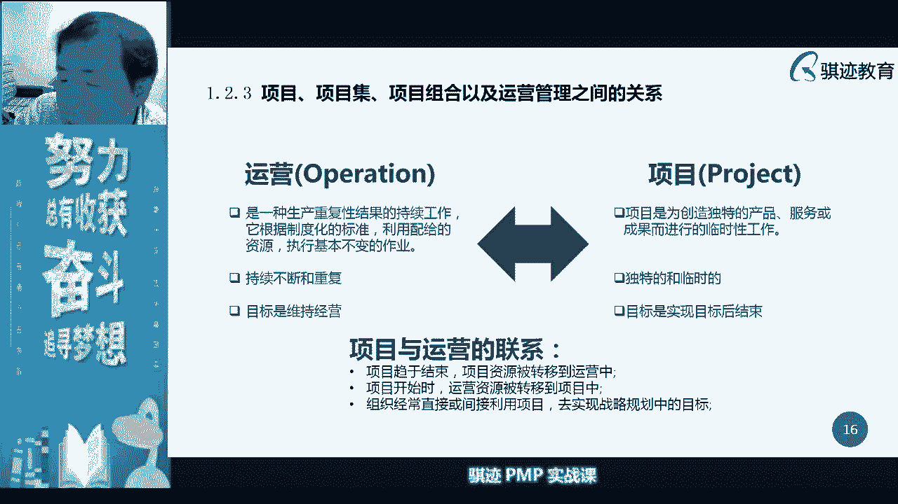

就是有时候会考的啊，那么这这这个当中呢，我们讲项目和项目及项目组合及运营当中呢，会有一个东西啊，大家可以看我的鼠标，然后鼠标有个叫o p m，什么叫o p m呢。

叫做organization project management，组织级项目管理，什么叫组织级项目管理，它是一个项目或者项目管理吗，不是它是一个框架，注意啊，首先o p m是一个框架，是一个管理框架。

它是干什么啊，你看这是个o p m的示意，它是个管理框架措施，我们无论哪一级的项目，项目集，项目组合，都必须符合o p m的规范要求去管理啊，这就是o p m，好偏o p。

然后所以o p o p m呢是一种执行，那种框架性的执行的一个框架，那么o p m呢我在我给发家大概要当中会写，大部分的组织当中呢，都会有p po来进行指导和监督，有呃我们的o p m的工作啊。

大部分能读出去也有效，o p m，o p m的框架管理呢，会在更高层次的呃之上来进行管理，比如说实际上董事会啊等之类也会有，ok大家只要知道一下o p m是什么东西就可以。

它不是一个具体的项目或者项目及项目组合，这样一个层次，而是一种框架啊，使用为管理规范框架大就可以这么认为就行嗯。

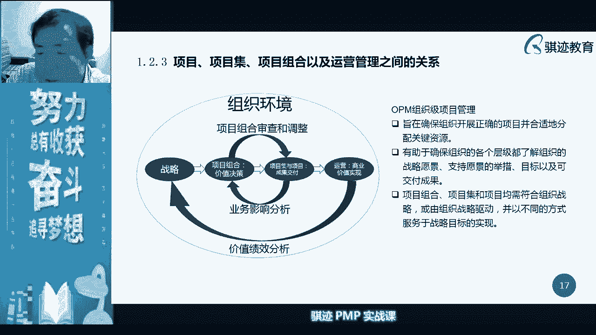

ok，好那么我们看啊，这是我们前面我们讲的是一个项目的定义，属性的一些背景啊，我们先来看一下，我们在偏僻当中，把相项目整个一个管理体系氛围是哪些东西，第一它分为什么东西呢，它分为生命周期，逆风生命周期。

大家可以看这是x轴，我们先从x轴看齐啊，xo xo是一个生命周期，生命周期就像一个人一样，人有哪几个生命周期，一幼年童年对吧，幼年，然后童年少年青年壮年，中年老年年最后一个是什么嗝屁对吧。

那么每一个生命，人的每一个生命就这样东，都有自己应该做的事情，对吧，那么何意思啊，就来了，幼年要做的什么事情啊，活下去啊，活下去啊，活下去很有意思啊，你不要听这个东西很哎。

我这要知道在没有新中国新中国之前，在没有新中国之间，在新中国成立之前，在人类的英雄没有发展之前，新生儿的死亡率是很高的啊，我说没有现代医学，没有国家的先进的发达体系的吧，呃可能在座很多人不存。

就可能不存在这个世界上啊，尤其是在有现在的那个那个那个那个，生育技巧等等之前啊，所以以前所以以前啊在中世纪的时候，欧洲有一句话就说你老婆生孩子了，和你老婆死了，有时候是差不多意思，差不多意思对啊。

这是人的新生儿的关卡是什么，是幼年幼年，然后是童年，童年是干净，干什么，要长得快，要长得快，长得快快长大，他们长大有基本的行动能力对吧，要长得快，那么童年后的少年呢，知识先学知识对吧，还学道理。

做人的道理，再到青年啊，青年青年青壮年的时候呢，就开始为社会贡献做劳动，那么青年壮年过去之后呢，就是什么中年中年呢，就开始什么利用丰富的经验呢去提升，就提升社会，提升家庭很多的提升。

然后呢开始做一些哎人生当中必须要做的事情，比如说繁衍后代啊等等之类，承担社会责任，然后呢中年之后呢就是老年，老年呢就是说什么啊，享受人人对吧，享受生活或者是发挥余热对吧，最后一个阶段大家都懂得对吧。

啊哈啊，那就不多说了，所以项目和生命周期也一样，它也有很多的阶段，它有很多的阶段，我们把项目的生命周期阶段呢，会在一个项目当中会分成若干个阶段，每个阶段都会有他自己的目标，每个阶段会有自己的他的关卡。

我会在自己关卡，我们后面会详细说，ok不要急，那么这是x轴，那么y轴是什么呢。

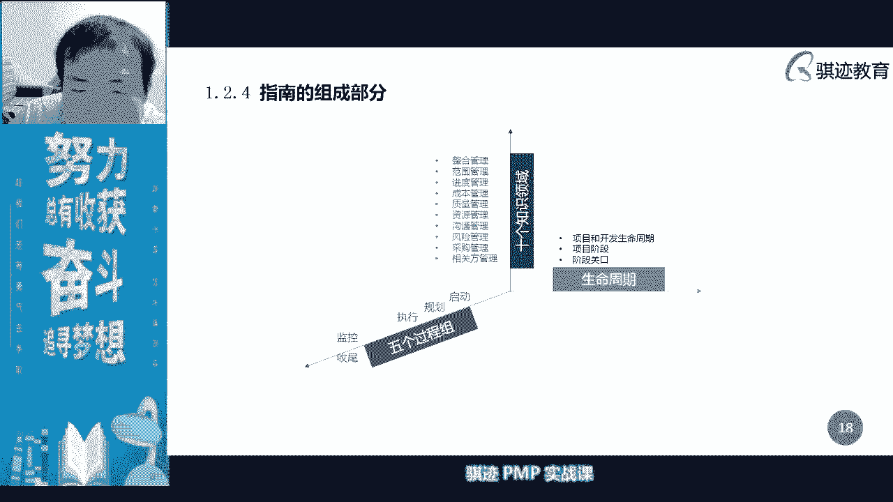

y轴是实战知识领域，它是我们pm博客里面讲的。

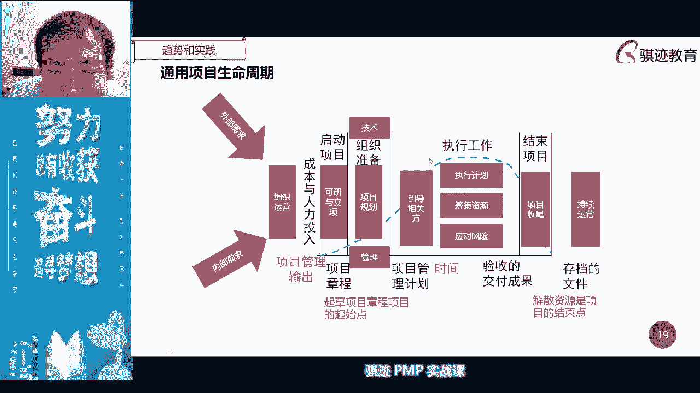

利篇博客当中所描述的，利用我们的专业知识，管理的十个最主要的知识方面，十个最主要的知识方面啊，好这个后面呢我们在后面的课程当中会一一，每个方面可以讲，那么偏偏白认为平白认为管理一个项目。

如果管理好了这十个方面，一个项目就肯定能成功啊，所以我们我们的管理工作，总会在十个方面去入手，这叫十大知识领域，然后呢一个项目当中呢，我们总会有这样一个周期，这个周期周期五个过程组就相当于一个周期啊。

那么周期就是相当于什么人无关，无论是你在青年中年老年晚年对吧，啊讲了讲的有点那个啊，你都会经历过一天的一天，总会知道吧，早上起来对吧，然后洗漱对吧，然后吃饭，然后工作要么是看电视对吧，然后吃午饭。

继续看电视啊，然后呢晚上吃晚饭，然后啊再洗漱一下，然后呢再继续看电视，然后呢睡觉，这叫五个过程组，人的一天都是这么过来的，每个人的一天他就是这么过来对吧，正常工作生活和作息不正常的另外几对吧。

所以五个过程组是我们看到任何项目，活动的过程都会执行的一些一系列的动作，ok你可以这么看，看做就行了，所以这是我们描述一个项目，详细的描述一个项目的各种各种各种要素。

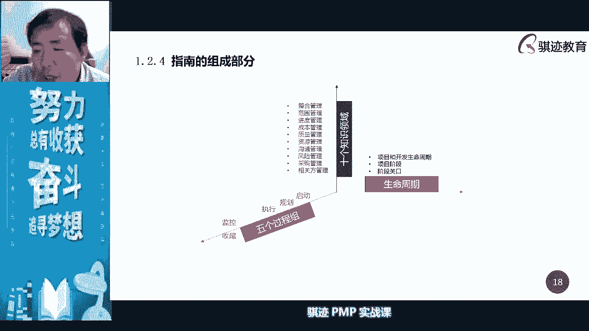

好我们看后面会呃来详细的看一下，首先我们讲会有通用的一些项目生命周期啊，在一个项目当中，注意，我们会有很多从外部需求开始的一些组织运营，然后当我们组织运营，不能够满足我们的需求的时候。

我们就可以产生什么项目动议，有了项目动力之后，大家注意看有什么可言与立项，可行性研究与立项可以研究理想，其实在可信研究立项之后呢，这个后面还有一个东西，大家可以在ppt上记啊，很重要的一个东西。

在项目章程之前会有一个很重要的东西，叫做商业论证，大家可以在pp上记一下，然后在自己笔记本记一下，叫做商业论证，商业论证有时候呢是和可行性研究呢，立项呢是并在一起的，我们叫做商业文件啊。

商业研究有时候呢我们是分开的，取决于这个项目有多大，有时候如果项目越大呢，我们会把这些每一项工作做得越细，如果一些小的项目可能就并在一起做了，但是无论怎么样，我们在项目最后决定立项开始做的时候呢。

我们就会开始做一个事情，叫做什么，其他的东西叫做项目章程，什么章程，项目章程我们这里看到是一个项目对起始点，是一个项目的起始点，项目上成啊，是一个项目的起始点，一个项目的开始边界是项目章程，注意啊。

项目章程注意我的用词，一个项目的开始点，真实真正的开始点是项目章程得到批准，得到批准，这是项目的开始点，然后呢我们就开始做各种准备和规划，准备和规划准备过完之后呢，就开始执行。

执行过程当中呢可以要要进行重新的规划，重新的调整，然后应对各种各样的风险，进行各种各样的筹措，然后管理各种各样的相关方等等等等这些东西，最终呢我们目的是交出我们可以验收和交付的，可交付成果，可交付成果。

那么在验收和交付成果之后，最后之后呢会有一个什么呢，会有一个项目的收尾，注意项目的，我们讲项目是有始有终的，项目是有这种弄的，然后解啊，解散项目资源是项目的结束点，注意啊，这个考试会考到项目当中。

一个项目当中，一般我们认为考试当中一般都会认为，解散资源是项目当中做了最后一件事情，那有人说老师我把我的团队都解散了，然后我在写项目报告，可以吧可以，但是你这个不是白打工吗，你也自己也是项目资源啊。

你自己也是项目资源对吧啊，所以最后一件事情都是检测项目，检在检测项目资源，你要把所有的事情都做好啊，这是我们的项目的结束点，然后呢存档文件持续运营啊，这是项目的一个生命，通用的项目的生命周期。

但其实呢这个过程并不是直线型的，他有可能会有一些很多重复啊，或者一些其他的方式啊。

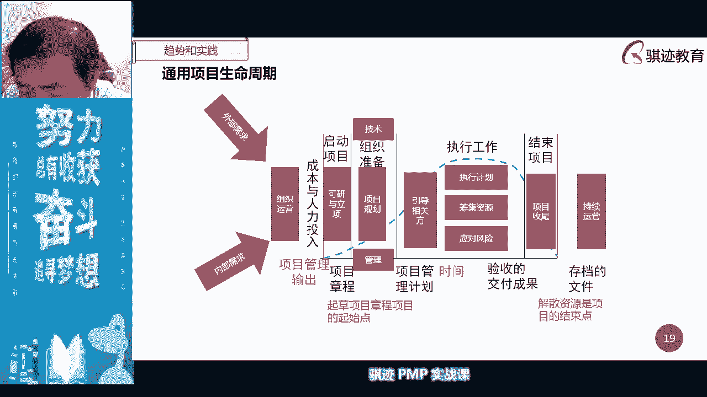

我们后面会继续讲，那么项目当中我们讲如果一个项目比较复杂，比较复杂，它会把项目分成很多子项目，我们或者我们会认为是什么项目的阶段啊，那么我们这里也可以举例，比如说举例啊，中国我们中国人去探索月球。

我们就分为多少钱，第一个阶段是什么呢，我们先啊是月兔1号还是嫦娥2号，好像是我们落在了什么呢，月球表面，然后我们用远程遥控的方式，遥控我们月球表面的月，好像是月兔2号月球车进行进行开，进行那个那个探测。

然后后来是因为好像是月球表面的灰尘的关系，最后它太阳能板没办法再收集能量，最后后来那个车休眠，不过已经超过了我们的设定哈，啊，这这块第一步，能够有我们自己的机械和设备的存在，在月球的正面表面啊。

这是项目的第一阶段对吧，第二阶段是什么，我们拍的嫦娥4号啊，好像是月兔2号，然后呢登陆到月球的背面去，这个难度就大了吧，难道因为月球由于被潮汐锁定的关系，始终是有一面对着地球，有一面是背着地球的。

背着地球的那一面温差会尤其的大，环境会尤其的恶劣，而且因为月球的阻挡是没有办法直接进行通信，它必须要有一个中继通信的过程，所以这个难度更大，当年前苏联都曾经尝试过月球表面的登陆，然后都失败了。

中国人是第一个啊，只是中国人，第二步看看能不能在一个复杂的环境下，能够找到月球表面的登陆啊，好有同学问项目章程是什么意思，ok后面会解释介绍项目章程是什么，不要急，同学啊，不要急，好好好，不要急。

后面会讲，那么第三步呢，我们的登陆月球的第三步呢，就是我们现在讲的啊，我们派嫦娥5号过去好吗，采集样本，那么项目的地，中国人探索月球的项目的第四阶段是什么，就是什么，有人探测登陆月球，有人探测登陆月球。

ok啊，所以项目各个阶段，你看每个阶段其实它有都有什么东西啊，我刚才我们讲的，我们探索中国人探索月球的各个阶段，他都有一个什么阶段关卡，那么第一阶段，我们派一个呃月兔1号到月球表面上去，正面上去。

那么就验证了什么，我们远程遥控月球表面的工具，第二呢第二个呢我们的月球背面登陆，那么有研究什么复杂情况下的，我们月球的登陆性是不是继承了第一阶段，又在第一阶段提高了，只有在前面两个阶段成功之后。

才有现在这次的嫦娥5号，我们去把月球上的土壤采集坏了，这个功能，因为它更复杂对吧，所以项目的每个阶段有什么特性啊，这是会考的，第一将上一阶段的，将本阶段的可交付成果移交给下一个阶段使用，这是第一个。

第二呢我们会总结经验教训，教给下一个阶段，第三个呢如果有偏差的话，我们会在阶段关卡呢进行偏差纠正，以确保下个阶段能够开始，那么开始，这是项目的各个阶段的一些重要东西啊，这些东西都会在阶段关卡去做。

同时呢我们会在阶段关卡来进行绩效的评估，看看下一步怎么做，有一些项目我们可能在做的时候呢，不知道他能做成什么样子，我们会分多个阶段做，通过绩效评估来决定我们到底要成本长度啊，啊什么成本好，我们会讲。

然后我们会讲啊，比如说我会讲个例子，比如说你有一个供应商，有个新合作供应商嗯，从来没有合作过，然后呢你有一个1000万的大项目要跟他合作，那么你怎么做呢，我问问很多人说啊，你遇到这种情况怎么。

第一你上来先给他100万的，100万的单子，100万的单子，接下来如果他做的好呢，给他一个200万的单子啊，再评估一下，200万单子做了好了之后呢，然后再给他一个什么300万的单子，300万单子。

300万单子做完了之后呢，再评估一下，如果他做做完了呢，那么最后一个400万都给他，一步一步一步来类似，但是数值可以调整一步扩大，一步一步扩大每一个阶段，根据绩效来评估它是否符合你的要求，如果不符合。

那么你随时可以终止和他的合同，所以这时候这种合同叫做多阶段合同啊，大家以后在做项目中，如果遇到很复杂的情况，为了避免损较大，对组织造成较大损失，或者避免较大风险，大家可以采取这样的形式啊。

这是给大家送给大家的，ok好，这叫项目阶段关卡，所以每段关卡时我们都会进行什么绩效评估，也是我们的工作啊，好这是我们的阶段关卡的定义啊。

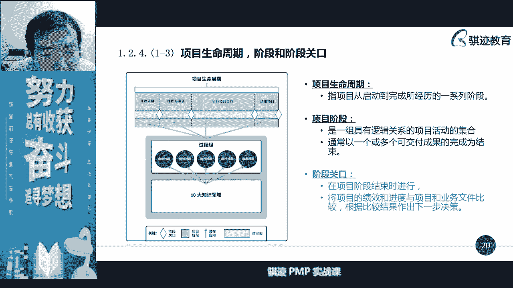

那么我们在项目的阶段过程当中呢，我们讲会有很多种的不同的项目，生命周期可以选择，我们在默认描述一个项目的周期当中呢。

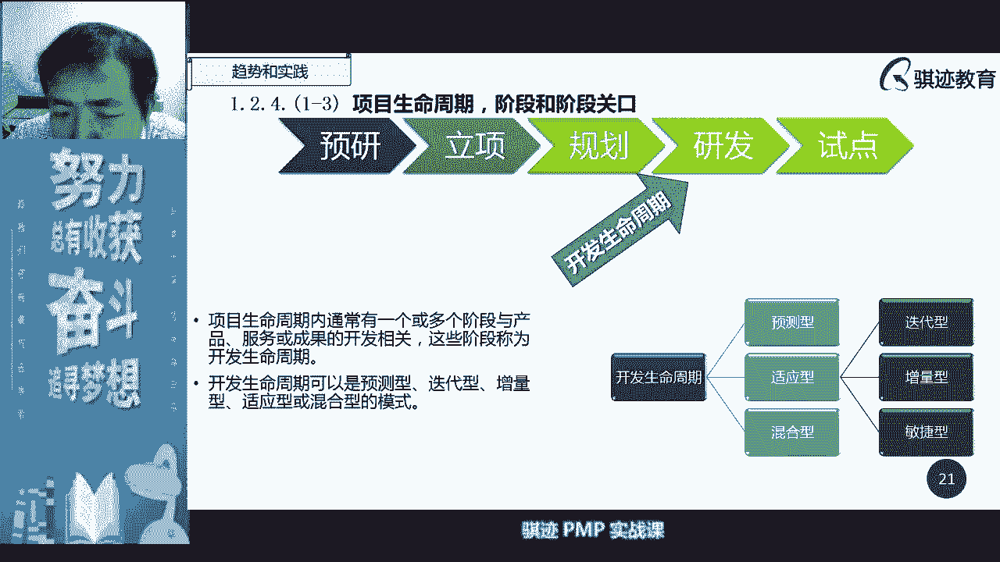

我们会用什么样的周期啊，我们会用瀑布型周期啊，也叫做预测型，什么叫瀑布型的啊，我们这我们可以在打着英文，可以打在英文的啊，可以调的平台叫water for，water for，预测性就是水流直下。

还能不能还能不能回来啊，不能，所以一个waterfall类型的项目一般都是什么啊，往前走不回头，往前走不回头，ok啊这这里就开始就是很重要的那种啊，像p m p考试声明周期类型是必考的，注意啊。

这个所以要紧跟着我啊，那么预测型生命周期有什么特征呢，第一尽可能避免变更，尽可能避免啊，这大家注意看新型命名，一次规划完成，然后一下子统一交付，所以他what f，大家可以在旁边记一下瀑布型的生命周期。

它的交付叫做爆炸式交付，爆炸式交付啊，爆炸式交付，他一次性把所有东西都给你，那么预测性生命周期有什么优点啊，现在是越来越多人觉得，预测性说明就是垃圾对吧，瀑布型垃圾啊，一听到什么项目管理。

现在都提提提项目管理，必提敏捷项目管理对吧，ok但是预测性是有好处的啊，是什么好处，这给大家树立正确观念，预测检验项目生命周期的好处是如果注意啊，我的用词如果一切都不变的话，一切都不发生改变的话。

预测型是最有效率的，前提是一切都不变啊，一切都不给，而相反如果一切都不变的话，同样使用不同的开发周期，同样一件事情，预测型效率其实要比敏捷高啊，这跟大家的认知是相反，但是我们的社会是在不断变化吧。

我们的环境是在不断变化的，我们的商业是在不断变化，照招额一朝一夕都在发生的改变进化，所以这个前提是现在越来越难以成立，所以这就是预测型，为什么越来在很多的我们的实践工作当中，越来越乏力的一个原因啊。

然后呢预测型还有一个什么东西，前提条件呢比较麻烦呢，就是它难以达成，就是预测型，注意大家也要记下笔记，预测型的生命周期，他在一开始就要详细定义工作范围，最大程度的详细定义工作范围，好注意。

大家可以在自己的笔记本上记一记啊，好上午的课是要记笔记的，我前面已经说过了，对不对，要详细，要认真的记笔记啊，要带着脑子记啊，这得给我记一下预测性的生命周期，要有最大可能的详细的声明。

想要这套可能详细的项目范围，电影，最大可能啊这个是非常重要的啊，这个记住，因为后面会有比较知道吧，这个考试经常会考啊，再提一遍，预测型生命周期要有最大范围，最可能的详细的范围定义，项目范围定义啊。

这是一点，那么大家可以看到，因为顺流直下做事情，是不是我们人类做事情的一般的方式对吧，都是按部就班的做对吧，所以它是完全计划驱动的，很自然的啊，一切岁月静好的时候呢，确实最有效率挺好的。

但是呢事事岂能尽如人意，所以针对于预测型的诸多缺点。

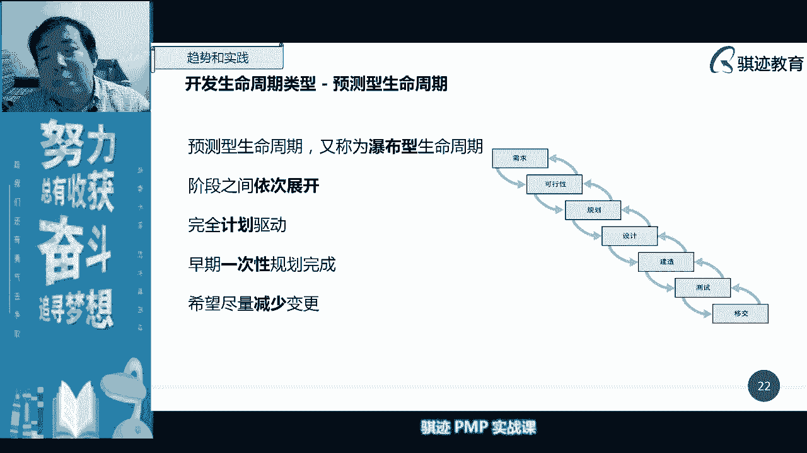

所以我们要开发出人类，又想出了其他几种，若干种的啊生命周期类型啊，我们看第二种叫做迭代型，那么迭代型的特征是什么，第一啊注意啊，我们现在我们现在讲的东西，很多是为了考试的做，所以你要注意啊。

第一你要记住，现在写笔记，第一，迭代型一向来没有完全的详细的项目范围定义，它要通过迭代逐步去探索，寻找出最适合的一个产品，结果或者可交付的结果，所以他没有对象，所以他去摸索。

所以迭代型的特征适用于什么特征啊，是需要进行摸索的一个呃，呃商业环境需要摸索的，你根本不知道怎么去怎么定义才是正确的，时候需要去摸索，人用迭代性是最好的啊，迭代型的一个很经典的特征是什么呢。

大家可以看到手机，看到吧，我手上苹果的手机，看到了手机是不是每年要迭代一次，迭代一次，苹果每年都要迭代一次，要出一只苹果手机来骗你们的肾，对吧啊，肾机肾已经偏到剩12了对吧，ok啊。

所以苹果手机都是每年一迭代的，但注意啊，但是这里要注意辨析，我们后面会讲敏捷型，迭代和敏捷型到底有什么区别，迭代是每次都完成一个完整的循环交付周期，并把它交付出去之后，我们拿到的是什么。

比如说苹果手机的啊，iphone一代大家不知道，很多人用过，我也没用过，但是我见过啊，iphone一代的手机是很成熟的，所以iphone一代其实卖出去并不特别多，但是呢产生的冲击是很大的啊。

那么它带来的是什么，他给苹果公司并没有带来特别大的利润，它带来最大的好处是什么，给苹果公司关于触摸屏手机，带来了巨大的市场反馈和经验，所以迭代很多时候传承在每一次迭代，传承传承的是什么，是经验。

而不是传承上一次的结果，它有可能整个结果都抛弃掉了，所以大家会看苹果1代二代三代四代，后面几代，你看每一代的样子都不一样，到现在苹果也每一代都有区别不一样，对吧啊，当然现在苹果现在越来越趋于迭代。

比后面那个浴霸对吧，摄像头越来越多，ok啊开个玩笑，所以迭代是很多时候在一个迭代周期，一个迭代周期上都是什么，迭代的经验成果和和我们的持续改进，一些一些呃有益的结果内容，同时呢帮助产品越来越完善。

越来越满足用户的需求，这是迭代的特征，而敏捷的特征，敏捷在开发的过程中，它并不是完全抛弃上一次迭代，注意是迭代周期啊，它不是迭代过程，迭代周期当中的一些产品，而是把它逐步逐步的完善优化的过程。

所以这是迭代和敏捷的很大的一个区别啊，体力量敏捷很大区别，所以迭代的过程中可能把整个范围全都抛弃掉，但是敏捷呢一般不会全抛弃掉，敏捷一般不会把范围不断的完善，这是迭代和敏捷的区别。

所以考试的时候记住一定要注意什么是迭代，什么是命运，迭要听清楚，明白了吗啊，没有明白的同学的话，自己记一下，好记一下啊，所以迭代它很难有很详细的啊范围，但是呢它的范围呢会有个粗略的范围。

但后期完善完会有逐渐完善，甚至会逐渐全部推倒重来也是有可能的，所以迭代也适用于什么东西呢，它是用一个产品周期比较长的，然后不断的推出像摄像参数产品，或者是有些东西可以完全推倒重来的。

轻量级的产品都是可以的。

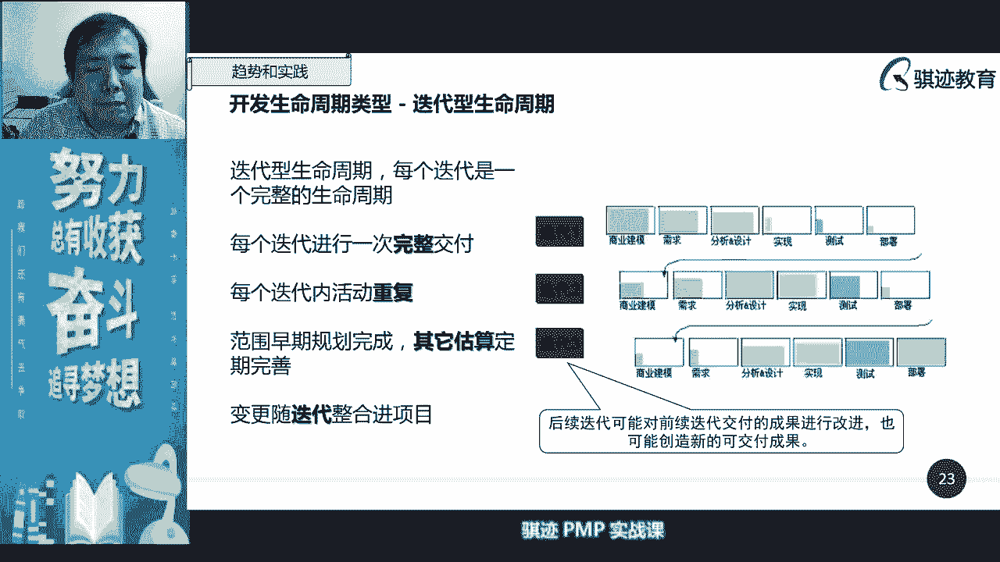

所以这是迭代型，但是有一些项目类型呢不能够推倒重来，比如说比如说啊，比如说那你们家新买了房子啊，买了一套新房子，然后呢我们要新房子是不是装修啊，装修完之后硬装装完之后，软装的时候。

软装很多时候就是个增量，什么增量呢，我先在这里呢放一个摆件，我在这里呢加一个灯，我在这里呢放一块毯子，他每一次都是在原来基础上增加一点点，增加一点点，增加一点点，每次增加的东西呢都不会被抛弃。

但是呢只有在逐步入增加完成之后呢，项目项目才能完成，它和迭代会抛弃甚至全动抛弃不一样，它是足够的要加的，这样的情况下呢，项目呢不容易走回头路，然后呢可交付成果呢会逐步累积起来。

我们的成果呢会不会保留下来，所以它就是个增，所以这这种方式会增量啊，增量呢它的范围呢，一开始会有一个很小的初步范围，逐步逐步逐步增大，范围逐步逐步增大，就像我们的软装一样。

会从一个小的很小的范围逐步逐步增大，装到把你的家装饰成为一个温馨的，你自己喜欢的家啊，这就是一种增量，所以以后大家如果想到增量是一种什么情况，咱就可以想到家里的软装，硬装装完肯定是没办法，别动了对吧。

软装就是一个增量的过程，慢慢往上加一点，这个这里放瓶花，放花瓶，唱个花对吧，那那那那边挂幅画对吧啊，打补丁是增量，打补丁是打补丁是增量啊，打补丁当然是增量了，w0 当然重量对吧，这你打了后面是补丁。

并不并不会把前面的补丁取消掉，对吧啊，ok打补丁是增量啊，所以程序总是补丁越打越大了，对吧啊，ok啊好，这是增量的方式，所以呢我们在后来的开发过程中呢，发现一个特点，增量的优点是什么。

它一个小的增加都有都有，可以把进行可交成果完善，它的速度，响应速度比较快，然后呢迭代的方式呢。

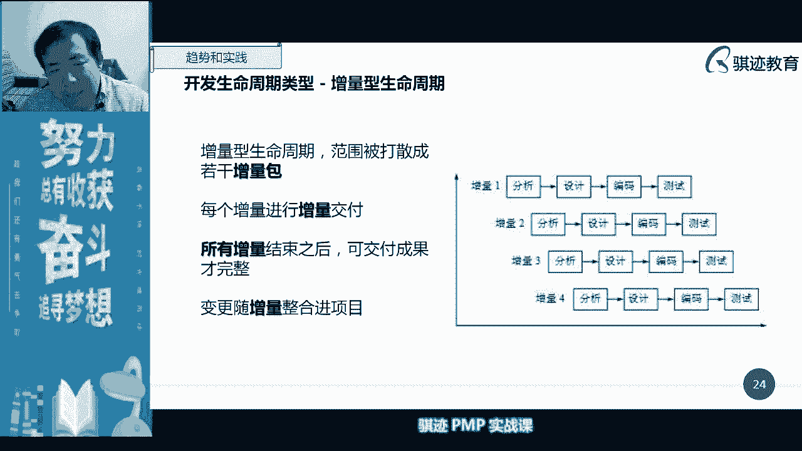

它的周期比较长，它要经过一个完整的一个开发周期，大家可以看到我们的事例当中可以看到，因为完整的开发商业建模，需求分析设计，实现测试部署回头机的完整，他说的周期比较长，而且可能还会把东西都扔掉。

有没有一个又可以快速反映市场需求，又可以快速交付的产品，又不用把它全部扔掉了一个方式。

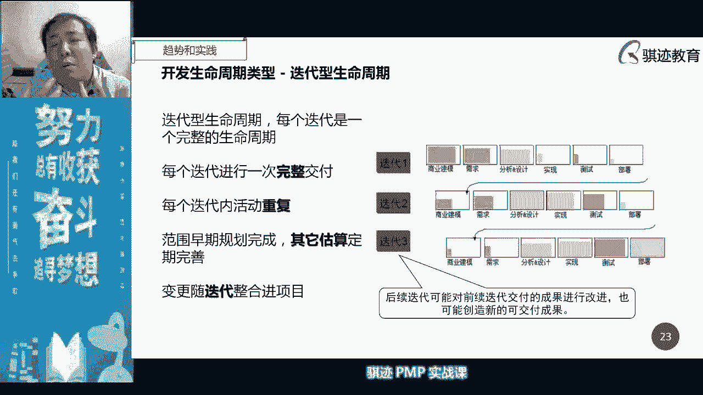

所以我们最后就人类就想出这个办法啊，叫做敏捷性，要做适应性，敏捷性适应性呢它有哪些特征呢，我们先讲完特征啊，注意，ok啊大家注意听啊，有位同学问啊，有些同学问这个ok啊，我们然后可以课后一次嘛。

我就不一一回答，因为这个东西提问经常是很多人都会，很多人问问啊，注意首先特征啊，敏捷性是比较容易考的热门的一个知识点啊，首先敏捷型有没有详细范围的定义，注意敏捷性有没有详细范围定义有。

但是它的最初的那个详细范围定义，只是一个很小的版本，我们敏捷当中定向提个东西叫mvp单品，mvp产品叫做什么，最小可用产品，它只定义一个非常小的东西的详细范围，然后呢他每次的增加功能增加特性。

增加版本都是根据什么外界对他的要求，需求变化，需求变化，所以敏捷没有呃，传统的我们的我们的预测型那个项目啊，预测型项目生命周期当中，那样的最大范围程度的详细定义是没有的，但是我们有最小范围程度详细定义。

然后我们的范围是根据市场需求的变化，逐步逐步逐步完善填充，当填充的足够完成我们这个项目的目标的时候，那么它的范围就结束了啊，是这样的特征，明白了吧啊这个要注意啊，这是敏捷的一个专门是敏捷玩法。

那敏捷的它有一个特点什么，它会有一个迭代周期，但不是迭代，那么什么叫迭代，是它在一个周期当中呢，会完成一个比较小的类似于迭代这样的过程，但他这个过程并不是要推倒重来，而主要目的是什么。

通过对于当前产品的一个改善，和对新需求的一个分析，然后把把一部分能做的新需求，然后推向市场，获取进一步进一步的反馈，所以敏捷的第二个特征之一，敏捷的开发和敏捷的周期必须是什么啊，要有足够反馈才能做的啊。

如果没有足够反馈，敏捷是不能进行的，这点要注意，一定要有足够的反馈，所以敏捷过程当中，我们会想方设法的去做什么获取反馈，这样一个动作获取完会那么敏捷，通过一个又一个的迭代周期，最后实现。

我们想最终想要给交付给用户的一个什么啊，一个呃产品结果，最大生命的意愿，它要比预测型，好合理多了，ok啊，这就是敏捷和预测和增量和迭代的区别之一，能不能听明白，ok啊，我们来一个示意图啊。

对有些同学做跟增量有点明显，o这跟增量其实不是一样，增量并不局限，并不着眼于更改以前的东西，第一第二增量在做的时候，它只着眼于增加的那一小部分，但是它不会进入一个全部的循环。

当然敏捷就是一部分一部分的运作，即使是来源于增量，所以它跟增量很像，很正常，它是增量和迭代的组合。

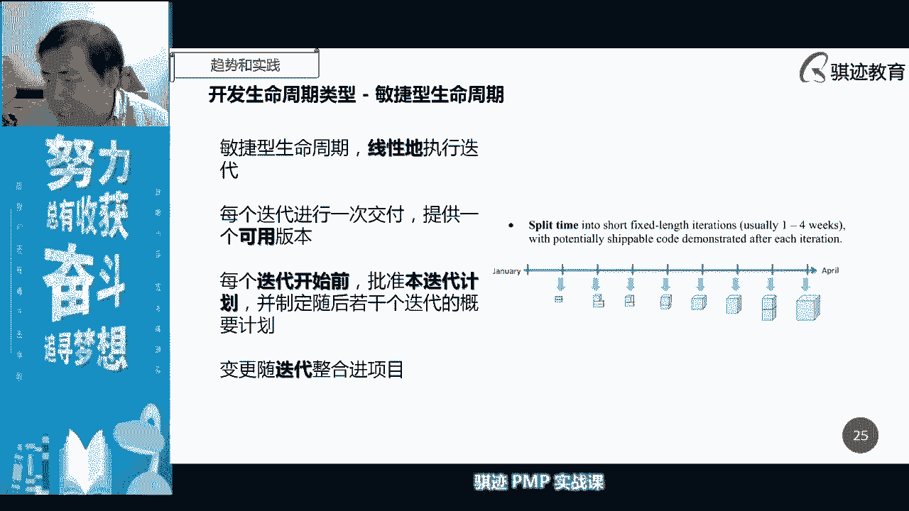

再加上一些一些基准啊，ok是这样的，那么大家可以看一下这张示意图啊，摄像示意图，这套设计都很呃，很明显的表现了我们的敏捷和瀑布的啊，一些区别啊，敏捷和瀑布的区别的辨析，是我们项目管理考p mp考试当中。

很喜欢考的一个点，敏捷并不是迭代和增量，ok啊，这个话大体上是正确，但是是不完全正确的，又体现了迭代，但是敏捷还有它自己的特点，敏捷因为教社交，敏捷开发和敏捷管理啊，不在我们的课程啊，这一期的课程里。

如果我不希望大家在学下一期课程啊，如果大家不信要去学下一期课程的话，会讲的更细一点啊，这一版是最后一版，我们不用讲新，那么敏捷，ok，新需求，有些同学问新需求算增量还算敏捷，注意这一点。

这个问题问的非常的好，首先生命周期是由项目经理去定义的。

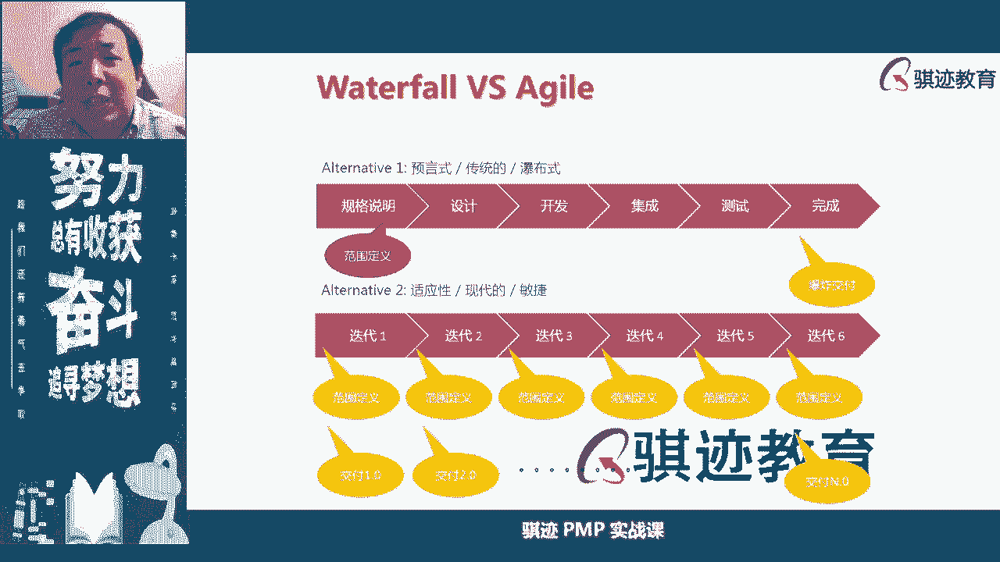