# PMP认证考试课程最新完整免费课程零基础一次通过项目管理PMP考试 - P10：PMBOK第六版 第五章项目范围管理-11 - 骐迹PMP - BV1Sb4y1f7Yt

开始今天的课程，我们的课程是范围管理啊，好那么范围管理我们在课程之前，我们讲范围管理，范进程，范进程是我们项目管理的三个基准要素之一，对吧，所以有三个基准范围呢又是所有事情的支母啊，项目的基础的知母。

因为只有有了范围才能决定时间和成本，所以范肯定是先有范围才会有时间成本的，这一点要记住，但是范围随着范围的确定了，时间成本也随之确定，但永远是时间和成本，是随着范围确定而确定的啊，当然也会反过来影响。

但是影响，但是主要是以范围去影响时间和成本的，是这样一件事情啊，所以范围管理呢非常重要啊，是帮助我们去从真正的从一个落手点，实际操作的一个知识领域，去让我们了解和知道项目的内容，是怎么去管理的。

范围主要管的是内容啊，ok啊好，那么这是范围管理，我给大家概念，那么范围管理首先当中我们要知道是什么啊，我们范围内应该做什么事情对吧，我们首先有个抽象概念，范围内应该做什么事情，范围里面做什么事情呢。

其实范围大家知道就是有了解，知道范围项目要做什么事情，来自于客户需要我们做事情，什么事情对吧，那么我们讲传统的p啊，我们的偏僻的默认描述角度是啊乙方角度，所以在项目管理的作为，在项目管理的过程中呢。

我们主要考虑是甲方需要什么样的东西，甲方需要什么样的东西，所以甲方血的东西会成为一个东西，叫做呃叫做怎么说呢，嗯叫做用户需求啊，有位同学有位同学说啊，也有同学说给我那个新人那个动作啊。

ok啊pass pass，ok，我们后面再讲叫做用户需求，那么用户需求是甲方，我们的甲方老板需要什么东西所产生的，这是项目的主要推动力对吧，一个东西乙方要卖给甲方，是要按照用户需求去推出去的啊。

用户需求去退出去，那么除了这个之外会有一样东西叫做项目需求，那么项目需求是什么东西的啊，这个很多同学呢可能就嗯理解了，就是说没有什么概念了啊，我给大家举个例子，最后大家理解一个项目要做什么事情的时候。

他肯定会有用户需求和项目需求组成，那么怎么样去记忆呢，假设我是一个项目，我这个项目要将用户交付一颗苹果，要要交付一个非常非常非常好吃的苹果，那么我们知道，如果要交付一个非常非常好吃的苹果。

那么我们要干什么事情啊，为了这个苹果，苹果能直接生产出来了，不能，那么你需要生产这样一个苹果，我们需要先做什么事情呢，对先要种苹果树对吧，苹果从树上长出来的对吧啊，人类的3d打印技术还没有做到。

能做苹果这个程度，所以苹果是从苹果树上长出来了，所以要吃一只啊，要教父已知非常非常好吃的苹果呢，那么我们一定要什么，我们一定要先种出一棵非常好的苹果树，它能结出那个非常非常好吃的苹果。

所以相互的需求是那颗苹果，但是我问你们，你们平时买水果的时候哦，会介意这个苹果是从哪个苹果树上长出来吗，不会care，你只知道最终结果，但是苹果树是不是一个绕不开的一个需求啊，这个需求不来自于用户。

但是有时候来自于满足用户需求的前提，或者是一些辅助条件，这种前提和辅助条件就叫做项目需求啊，所以项目需求是为了帮助用户去帮助项目，去达成用户需求所产生的需求啊，所以你你以后记住一个项目的需求。

就像一个交付一个交付一个好吃的苹果1样，那么这个好吃的苹果的背后，肯定是要有这棵苹果树的对吧，所以你要为用户不但要生产出这个苹果，还要什么，还要种出这棵苹果树，而进入交付的时候，苹果树用户是看不见的。

它又不care他，只要苹果，但是依然苹果树种树这个需求依然是存在的，这个两部分都要纳入到项目范围当中去，对不对啊，都要当中去，所以一个项目在项目范围当中，他自己要的需求，但是是必须的啊，非用户需求。

非用户就我们的项目需求啊，所以在有些理论当中呢，我们也把它称之为功能性需求，用户需要的是功能对吧和非功能需求啊，叫非功能性需求啊，所以这是项目范围的一个概念啊，它的范围才能说是完整。

但是用户需求和项目范围之间会有怎样的变化，他是怎么样从需求变成我们的范围了，ok我们的后门课程会讲啊，它是有一定规范的，不是说用户提出需求，或者我认为项目有这个需求，它就它就进入范围的，不是这样的啊。

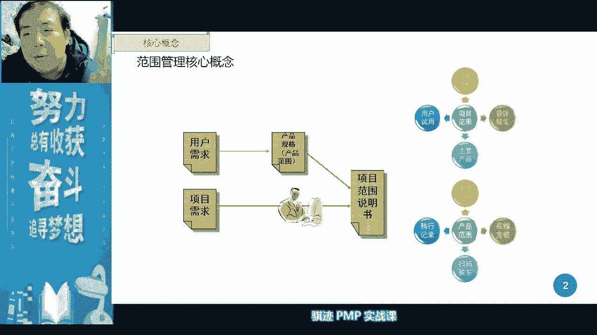

我们后面的课程当中会讲到好，那么范围感概念，核心的概念里面还讲了什么，我们要力求避免未计划的工作啊，避免镀金和范围蔓延，所以在这个p p t当中呢，这一页ppt当中我们又提了一下啊，镀金是团队主动做的。

主动讨好用户了，没有经过变更对吧，范围蔓延也是套路，主动主啊也是没有经过变更了，但是是项目团队被啊用户压榨压迫对吧啊，所以要求额外做的东西啊，也是没有经过变更流程的啊，所以它无法纳入绩效啊。

这一点是要注意，所有其实说严格意义上来，除了项目团队以外，从外面要求你改变项目的范围，而没有经过变更流程，没有经过审核同意的话，都叫做范围蔓延啊，这里仅仅指的是客户发发起方，那么以项目团队之外的要求。

项目改变范围还没有经过我们的控制的，没有经过整体变更控制的，都叫做范围蔓延啊，应该这么说，广义是这么说，所以额外的工作呢不能纳入绩效啊，纳入绩效啊，讲到绩效这个东西后面会显示到风险管理啊，很有意思。

会显得风险管理，还还要涉及到什么人力资源管理这些东西，对吧好，后面在讲到相关的知识领域上，我们再慢慢讲啊。

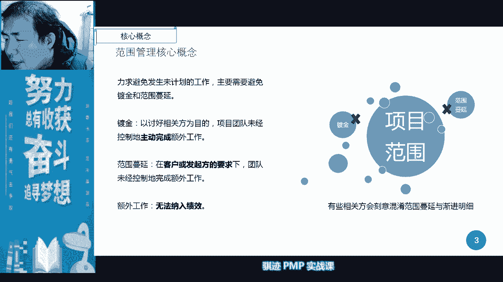

ok啊我们那么我们继续那么讲，传统的我们的项目呢放范围管理的核心理念，怎么我们的预测性是这样做的，一开始先做设计啊，设计我们稍微讲的细一点点啊，一个预测型的项目，它首先上来是做设计阶段啊。

先把这个项目对它进行设计，设计阶段当中呢又是按照渐进明细去做的啊，这里面可能没有什么叫渐进明细呢，就是近期详细远去粗略，同时除了近期详细，远期粗略之外，在实践当中我们一般是先做高层次设计。

所谓的框架设计，先把架子搭好，然后呢再做详细设计，所谓的high level design和low level desig，然后再转入底层设计，会考虑低层设计的一些问题，但低层设计当中不能落地。

那么没有意义对吧，但更主要是考虑一个框架性的问题啊，整体性的问题，又有一个概念叫做设计冻结，那design frozen，这什么意思呢，因为设计当中会产生很多的理念，喜人的想法，需求会不断的改变。

如果在一些呃比较困难的项目，复杂的项目或者是争议比较大的项目，这种变化会永无止境，如果你不加以控制，会永无止境的滚动下去，所以你们在设计阶段有一个事情，就是说我的设计需要有一个时间限制的。

他要到一定时间就截止了啊，这可能在很多工程设计上，当同学可能会更更加的啊明确啊，就是说我在设计阶段呢，我会有一个阶段允许大家自由发挥，从高层次上能发挥，但是应该是逐步收敛，而不是逐步扩散的。

所以最后大家总会逐步逐步会统一到一个节点，在这个节点上我们不允许在改动设计啊，不允许再改动设计，那么说不是有变更吗，high level和low level点赞设计完成的某一。

到我们设计语言设定目标的这个节点之后，你可以改动，但是就必须走变更流程，那么在这个节点之前呢，大家可以不用走变更来着，而自由的去发挥和那个去呃，争取对自觉觉得自己觉得这个有道理的，这种设计方案和设计。

要求和设计参数对吧，无论是高层次低层次，逐步逐步去过渡，这个过渡呢是收敛的，同时有一个截止日期叫做design frozen，设计终止冻结日期，在这个日期之前呢是可以随意做更改，但是在这个世纪之后呢。

是不能随意做，更要走变更流程啊，这样才能确保一个生命周期后呢，他总是向前走，而不是无序在那里不停的讨论啊，很多的很多的项目为什么有呃，昨天我们有个微信群里面啊，贴了啊，贴了一个图片啊。

一个甘特图项目预计是在那，比如说前几个月好久就开始了，但实际执行可能好几个月，我最开始中间发生了什么，任何事情都没有执行，发生什么，就是因为需求的反复震荡变化，导致了设计反馈成长变。

导致施施工工作执行没办法的去落实啊，这是一个很典型的例子，很多的项目在初始的设计上都会有这种事情，都会这种事情啊，那么无论是高层次设计，低层设计做完了之后呢，它就会出来一个什么叫详细范围啊。

详细范围大家可以p p这样看啊，这就是详细范围，那么有了详细范围之后呢，我们会去就开发验证一个一个阶段啊，这是我们后面再会讲的事情，然后呢在这个范围当中呢，我们要做什么事情啊。

我们在范围管理这个当中要做控制范围啊，控制范围的注意，当然我们后面会讲，控制范围，其实要做的事情，并不是说是控制进度或者控制成本，而是控制内容，不要超过我们设定的这个详细设计的，这个定义边界，对不对。

然后去开发啊，所以这个例子当中我们开发的是什么呢，是一个我们的共享单车的一个一个功能啊，这是用预测性去做，所以它会按部就班的一个阶段。

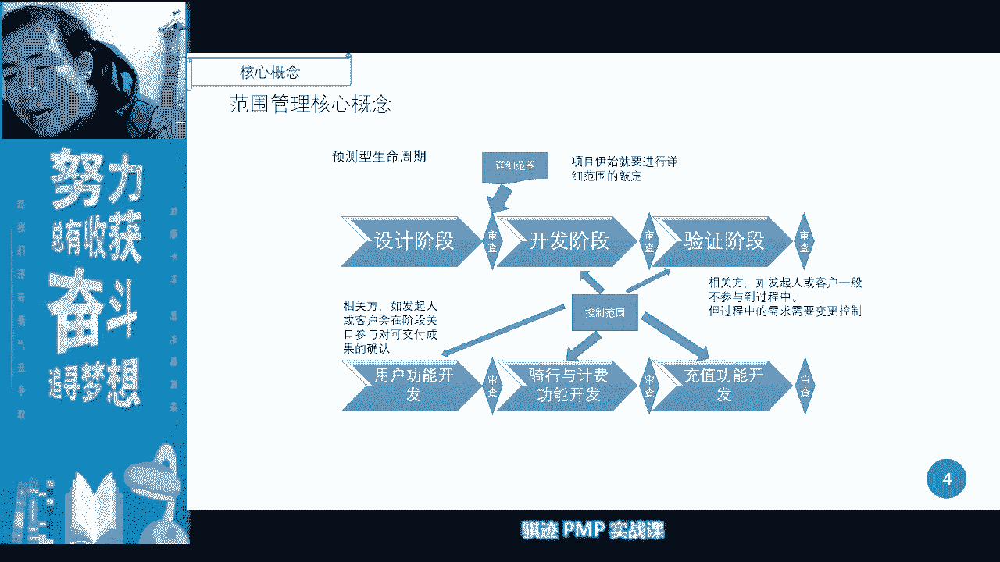

一个阶段一个阶段去做对吧，那么我们的核心理念当中，这是预测性，所以预测型不太适合像共享单车，共享骑行这种啊快速市场快速变化的这种环境，所以它更适合什么敏捷和叠啊，敏捷和适应性对吧。

那么在敏捷和适应这个过程当中呢，我们会有迭代周期去迭代，迭代最敏捷的一个实践框架，swam的框架里面就会有迭代周期啊，迭代周期啊，注意啊，敏捷不是一定要固定时间的迭代，tom box固定时间迭代啊。

只有swarm这种形式才会有固定迭代的啊，另外一些敏捷形式，可能它的迭代周期可能是可变的啊，或者怎么样其他用的方式实现的啊不一样，所以敏捷的主流目前还是主流的，com这种方式的情况下。

它是用一个一个迭代周期去做，而且迭代周期是固定的啊，那么他在他在做的时候呢，它就会定义一个基本功能，然后呢通过一个一个迭代周期呢，把它的基本功能呢一个一个去实现，在实践的过程中呢，从市场当中去获取反馈。

去改进啊，这是我们的敏捷的生命周期的范围管理，那么在这个过程当中，我们并不是那么敏捷的环境下就来了，我们并不是直接了解用户有用户注册充值，扫码和骑行记录这些需求，而是通过一次又一次的迭代去完成啊。

完成了，那么就像我们之前讲的一个例子，大家记得滴滴打人啊，我们讲了一个滴滴打人，滴滴二人过程中，我们一开始也不知道用户什么对吧，因为共享单车大家因为现在已经都很熟了对吧。

所以大家可能对共享单车这种方式都很容需求，但是共享的当初出来的时候，大家可能真的不知道用户需要什么对吧，所以我我觉得啊我们更好的一个例子，就是我们刚才当初那个滴滴打人对吧，滴滴来说，因为没有这个。

相信中国没有这个相应软件是违法的对吧，那么我们根本就不知道用户什么需求，这个时候用我们的传统的预测，瀑布型就很难做对吧，那个例子当中，预测瀑布型可能要等很久才知道这样来，但是市场就被友商占据对吧。

所以我们要通过迭代一次一次去摸索，了解用户到底是想要什么东西，精确的需求是什么东西，对吧啊，这就是敏捷的优势，地方啊，范围的优势，所以敏捷当中呢它会有一些基本功能，那扫码骑车，骑车记录这种基本功能。

但是呢他后面的一些功能呢，是要通过我们的反馈迭代去实现的，而不是敏捷一样，等所有的东西都摸清楚了再去做啊，所以敏捷的范围和我们迭代的范围，那种高层次设计，低层次设计的范围方式，是不是。

获取途径和和我们的管理方式是不一样的啊。

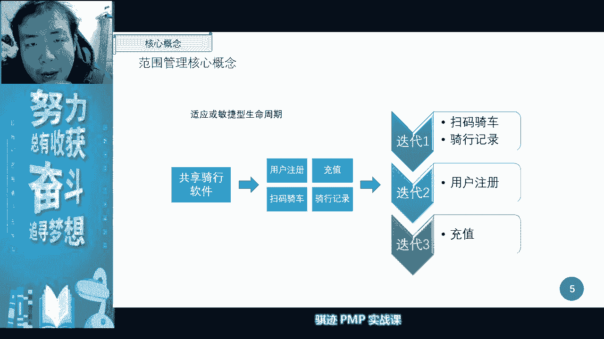

这大家理解一下啊，好那么在适应和敏捷的过程当中，大家看看我们在第一次做的时候呢，我们的待办事宜呢是什么，迭代代换时间，我们先要做扫码和骑车记录对吧，然后呢，后面还有用户充值和用户注册这两个功能呢。

可能没有那么急，我们先把前面两个做起来，然后做起来之后呢，我们在后面两次迭代当中，逐步逐步摸清楚用户的需求，然后再一个一个一个，植入到我们的应用程程序当中啊，这是我们敏捷的适应的。

我们生命周期的范围的管理管理一种方式啊，这和我们的传统的，我们的预测型的这种管理方式啊。

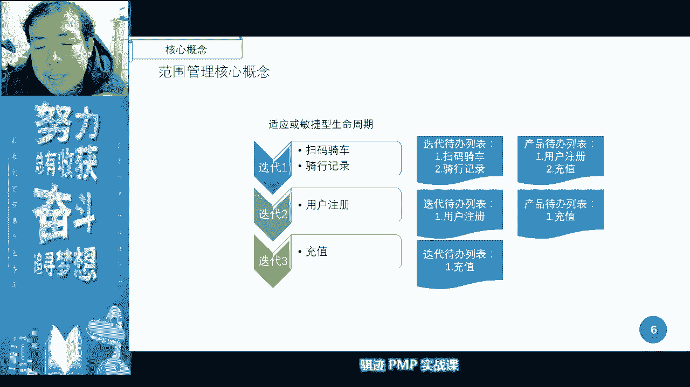

这种管理方式是不是不一样啊，传统预测运行方式，大家看到项目的范围，在设计这个阶段就固定住了对吧，固定住了，那么显然它很不适应于后期的开发。

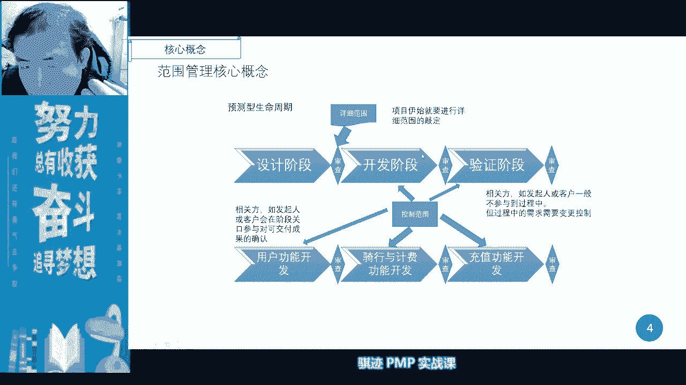

和后期的改变，根据市场进行调整对吧。

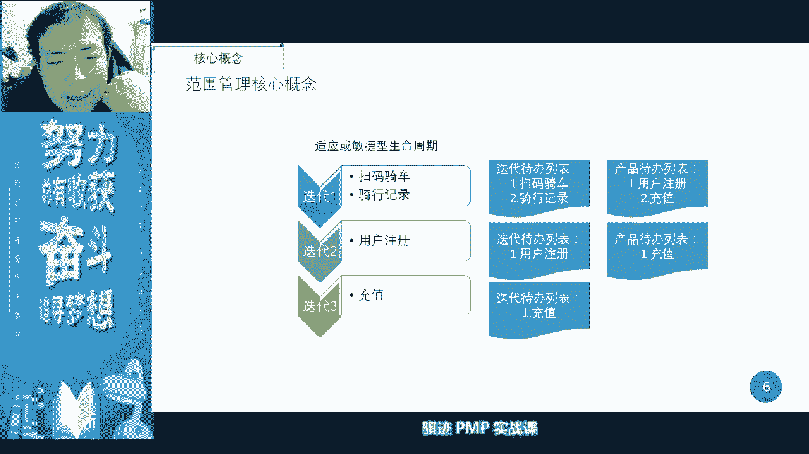

ok啊好，这是我们的势力范围调整啊，我们如何去调整，那么我们在第一个迭代周期当中，大家可以看到我们在传，我们在敏捷性当中会有一个什么现象呢，比如就呃就像我们这个例子当中。

我们的第一次迭代中方向什么用户计费呢，方收费方式它不合理，或者它有多种计费方式需求对吧，有些男用户呢喜欢按次计费，有些呢用户呢喜欢薅羊毛，但是呢它是潜在用户对吧，我们可以给他什么充值。

然后呢然后呢是可以送他计费方式诸如此类，所以计费方式呢会变得很复杂，所以我们先把它放在代办事，叫blog blog bad b去等待进行实现，然后在迭代二当中呢，我们去通过用户计费的一种啊认知之后呢。

然后我们把它功能呢进一步完善，纳入到迭代二的功能实现当中去，同时呢我们又需要什么去完善用户的信息，因为完善用户的信息对我们企业发展好处啊，互联网企业用户信息就是一个宝贵的资产对吧。

所以他会在用户迭代二当中，将完善用户信息放入到我们产品的待办事项，并且在迭代三当中去实现它啊，这就是敏捷当中，适应当中我们的范围的不断的调整，所以敏捷和视频当中它会实现一些基本功能，一开始。

但是后面的功能呢它会随着市场的反馈火和啊，我们的开发产品的需求，然后不断的去加入到我们的产品当中，直到直到充分完善对吧啊，所以这是敏捷的一个特点，范围是在不断调整，所以敏捷的项目只有在在项目结束的时候。

你才能说它的范围是完全固定下来的，而预测型呢它在项目的一开始，那范围就大致固定下来，允许就变更，那极力避免大变更啊。

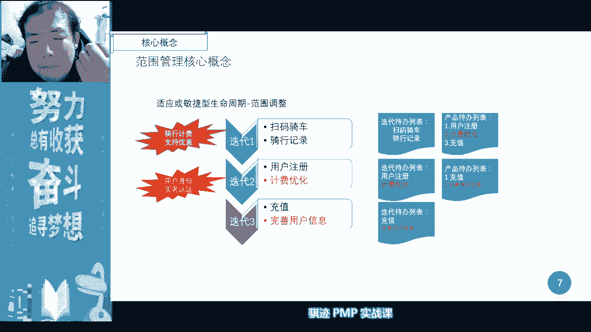

就这样啊，这是我们的一个敏捷适应的生命周期对吧。

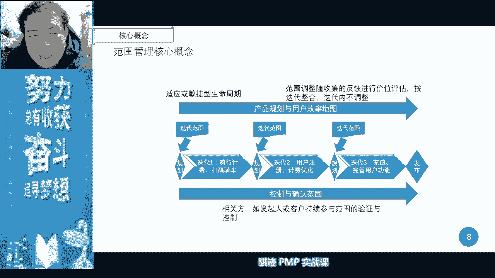

这个就是我们按照我刚才讲的啊，ok啊那我就不多看了，我们开始讲后面的内容呃，项目管理范围发展的趋势是什么呢，要纳入商业分析啊，纳入商业，其实说纳入商业分析和实践需求呢，其实就说说了。

就是现在的项目管理当中的范围，不仅仅要着眼于项目的能够实现，还要着眼于什么啊，能够和我们的商业，我们的业务结合起来，和我们的市场结合起来，就是能不能和赚取我们的有形收益和无形收益，去结合起来。

说出来的就是这点啊，这个项目的发展趋势啊，大致知道一下就可以了。

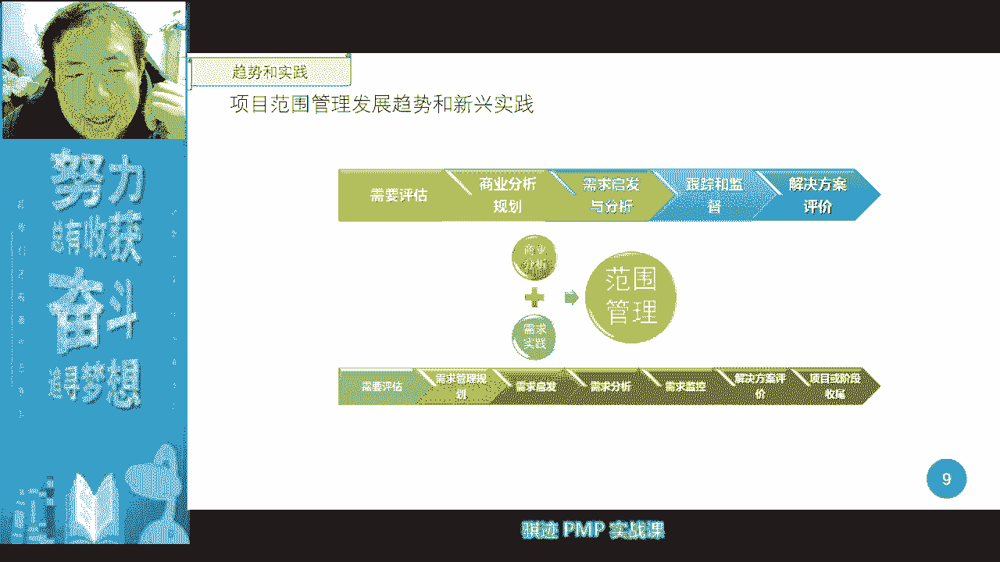

那么项目范围管理当中呢，我们会也会采取一个裁剪对吧，如何去裁剪呢，我们需要有知识和需求管理，用确认和控制，有开发方法，治理等等，需求等等方法，各种要考虑要素去控制某些我们的范围，是否是设定边界在哪里啊。

那么当然项目范围管理的，项目范围管理的一个特点是什么呢，就是它是从框架到具体详细内容，它是一个先框框架的过程，所以管理范围，我们在实践当中都是从框架大的框架开始啊，但是无论是敏注意。

无论是敏捷还是预测型，他们都是从一个框架开始，只不过敏捷的框架比较大，它是开放型框架，它随时可以往下搭，而预测型呢它是个封闭式框架，它一开始就限死了你，然后往里边打，所以方向不一样。

明白吗啊那么我们讲一个不恰当的比方。

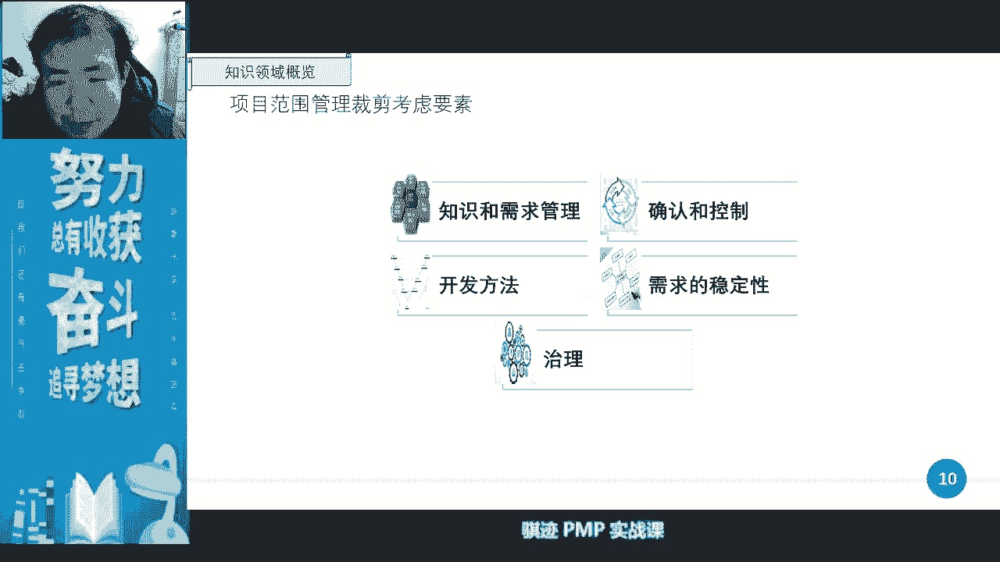

但是你们可以认知的比方啊，我们我们可以我们后面可以看到ppt啊，这就是范围管理，注意啊，后面这段的比喻其实很帮助你们理解范围管理，它的子过程，1234566个子过程是比较多的对吧。

他的六个子构造的逻辑是什么样的呢，首先规划范围管理，做什么事情，做的是先制定方法论啊，我们制定个方法，这个范围应该怎么管，我们先定好规矩，中国人有句话叫无规矩不成方圆，先定规矩，具体事情怎么干再说。

我们定规矩对吧啊，就像就就像那个让子弹飞，里面有有有一段台词对吧，然乡绅先捐，带着百姓一起捐，然后乡绅捐呢全数返回百姓捐的三七分账，对不对啊，有那么一句话对吧，这是他们什么做这些坏事情。

先知情也要先这个做坏事情，骗捐的这些坏事情，这个项目也要先定规矩，具体落实实际工作呢后面再说，但是规矩是要定好这个规矩的核心，就是说怎么骗钱，对吧啊，怎么骗钱，所以这些东西呢是要定好。

所以第一步先定规矩，所以记住范围管理的第一步，先定规矩，定了规矩之后干什么，开始广泛收集，广泛收集呢，先不贴框里框架，先看看用户到底是天上的星星，还是地下的星星对吧，还是还是胸口带的五角星。

要看用户的需求是怎么样，去决定我们的框架是怎么样啊，是这样的，所以第二步是收集需求，注意需求和范围过程当中，我们后面会讲具体工具需求并不一定啊，并不直接就等于范围，它是要有一个选择裁剪啊。

放弃增加识别啊，更新的这段过程还有一个变更啊，那么收集完需求之后，第三步定义范围，那么定义范围是干什么事情呢，定义范围是给你就是开始画框架，我们前面说了是先从框架开始，只不过预测型的框架呢先把框架画死。

往里边发展，而我们的敏捷性框架是开放性框架，往外方向发展，因为敏捷框架小往外发展，而kr预测型框架呢大往里面充实，是这样的例子，不知道你明白啊，那么在这个定义方法当中，两个不同的生命周期的方式啊。

就体现出巨大的差异的，前面的混合范围管理和收集需求，可能方式呢都差不多，如何去做，差不多只要敏捷的，更注重周期性的胶体去收集啊，但是预测性也不是说只收集一次就结束了，他也有周期性收集。

但这不是主要的方式好，那么定义当中你可以我们举例定义范围，就好比说是什么东西来定义一个人的属性，比如说你是上帝，上帝创造人啊，今天是圣诞节的，按照西方理论，上帝创造人，中国中国是哪个啊。

哪个神去创造人啊，女娲对吧啊，中国是女娲，西方人是上帝去创造人，那么创造人的时候，如果我们按照预测型的方式去创造人，怎么定义呀，女娲就会说啊，如果中国人是按照预测，女娲就会说人应该是有什么一个脑袋。

一个身体四个，这两只手，两只脚，一个眼，一个鼻子，一个嘴巴，两个眼睛，两个耳朵，这样的方式去定一个人，这个框架是不是一个框架，但我们知道这个东西做出来之后，并不等于人的具体内涵内容对吧。

人的组成具体组成是什么，骨骼肌肉神经企业对吧，啊啊主要就是这些东西的，还有肌肉啊，还有组织，还有肥肉对吧，像老师这种这个这个成分就比较多一点，你们有些人有些女同学可能成分就少一点，对吧啊。

去逐渐逐渐丰富的定义，最后形成一个范围基准对吧，就形成一个人的真正的详细标准对吧，而西方的人，西方的人啊，西方的神话很多东西怎么定义的呢，他他定义什么上帝，西方的人可能西方的神。

上帝可能用敏捷的定义方法啊，我先捏他个面团，这个面团就叫人啊，但是呢觉得啊上帝觉得啊，我们先用敏捷的方法先建个这个面团，像泥团一样，面团一样的东西，它有不会跑又不会跳的吧，这个东西又不能动，没意思对吧。

所以人呢可能什么需要有一个肢体运动能力，所以我们在第二期呢，那人的创作过程呢，再给他两只手，两只脚对吧，两只脚两只脚呢，但是他有两句像剧呢，但是他没有脑子，没有思想，没有思维对吧。

上帝那我们说西方神话里，上帝创造人是为了啊给上帝解闷对吧，有一个原因说呢，所以呢他就给人捏了个脑袋，然后有自己的思想，但是呢他发现人很孤单对吧，这时候范围就改了，所以上帝创造了女人，先创造男人。

亚当对吧，再创造夏娃，那么我问你们下挖的呃，创作是哪里来的啊，男人的一根肋骨对吧，男人的一根肋骨所创造的啊，所以你看到范围变调了吧对吧，一开始定义一个人，他发现定义的吧，人还分男人女人。

男人女人创作过程还有区别，当然这是神话，我们仅讲神话啊，所以你可以看到西方的神话当中，捏人往往是一个什么啊，是一个敏捷的范围过程对吧，通过市场的不断需求，环境的不断需求，我们把人的定义呢越来越改对吧。

最后请了个人，比如说如果啊如果西方世界和东方世界，如果是割裂的，西方世界里的上帝，如果觉得啊人应该有三个胳膊才是正常的，那么他们可能最后创造的东西就跟我们不一样，对吧啊，这都是一个定义范围的过程。

无论怎么样，但是无论怎么样，我们最终的结果啊，如果人的定义最后的结果是唯一的话，那么无论怎么样，我们最终都会把人的这个身上最后形成的过，形成的这些部位啊，具体细节都会定义清楚，所以人都是有什么啊。

四肢躯干骨骼对吧，肌肉体液对吧啊大脑对吧，脑子是个好东西对吧啊，然后呢啊还还有五官啊，这些东西所面积组成的对吧，最后详细详细就不详细，所以定义范围并不是直接就把人的详细做出来，而是把它框架做好。

只不过这个框架形成的过程呢，敏捷和预测是不一样的啊，这是为什么着在这里花时间琢磨着墨，给你们说这件事情，因为只有把框架做好了，后面在第四步我们才会说什么，创建工作分解结构。

创建w b s w b s就是详细的定义，你生成了某个部分了，比如比如说你身上某个部位，比如说手是怎么形成的呢，手是由手上的各个骨头，每一个手是由哪几节骨头组成对吧，掌骨还是指骨对吧。

股东外面呢可能还有什么要有要有皮囊，要有皮肤对吧，皮肤里面还要有肌肉，每块肌肉跟骨头怎么连接的，中间血管是怎么走的，神经怎么走的对吧，嘟嘟嘟就逐步渐详细，当他详细到足够够用的时候呢。

w b s就形成了对吧，就是这样的过程啊，抽象的理解这样的过程，那么形成完成之后，行程完成之后，接下来一个过程什么就确认范围，就是验收对吧，我们说啊女啊，中国的神话里，东方的神话里，女娲补天之后。

女娲补天之后，那么人就自由了对吧，那么确认范围，那么东方的神话里面，人是怎么样确认他成为能够成为一个，世间万物的一个一个这主观能动者和主宰者呢，是女娲娘娘创造了我们东方人类之后呢，不再干涉人间了对吧。

人开始看着依靠自己的主观能动性开始做了，西方的神话人是怎么样通过验收的呢，就是啊西方的神话更便宜一些对吧，然后下挖呢吃了跟亚当呢，吃了一个蛇给的苹果对吧，苹果然后吃了个苹果之后。

他们又开热自我意识了对吧，上啊上帝认为啊，所以确认万玩家是吃那个苹果，真正成为人的一个确认确认范围啊，验收的结果，所以确认范围呢，就是说是一个达到一个验收标准，但是这个验收标准是我们和客户事先约定好了。

但是在这个过程之前呢，我们要一个内部验收，内部验收是通过质量控制去完成的啊，这里要注意我们这上一节课讲到过几次的，就是我们可交付成果的那个生命历程当中，讲到了对吧，ok所以求证过范围之后呢。

我们的范围呢就完成了，完成之后呢，然后我们最后一个不死过程呢，就是叫做控制范围，所以所有的我们讲所有的知识领域里面，都有一个子过程，叫做控制子扩张，它是用来监控对吧，监控是全过程，是全方位，全过程。

全时段的啊，对于管理和项目来说，所以每一个知识领域都会有一个监控制过程好，所以你看我刚才跟你们说了这样一遍之后，是不是你就理解了范围管理，它的整个一个慢慢慢慢慢慢过成了一个脉络好，如果你还没有理解。

没有关系，我们在后面的课程中，会逐步逐步的一层一层一层去展开，对吧啊，一层层展开，那么展开到最后，那么你应该就理解了啊，ok啊，这就是我们的课程的开始。

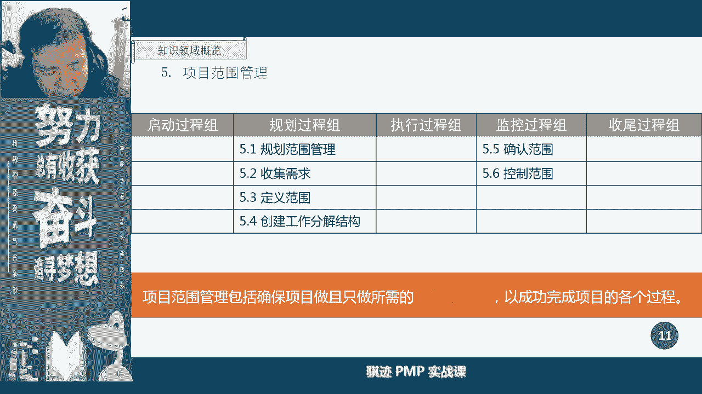

那么接下来我们要开始讲我们的方管理，具体内容啊，这是我们范围管理的一些具体的一些知识领域，总结啊，当然这是你们p p t上有的，但是呢在一开始看这个信息的时候呢，我觉得作用不是很大，作用不是很大。

因为一开始你们对这些东西都没有感知，没有认知对吧，我们一个一个按照范围管理的开展的顺序，一个一个把它展开之后，可能对他们有认知，当我把这个知识领域全都学完，在下周二的课程当中把它全部学完之后。

那么所有的东西可能就啊就能够理解了好吧，然后你回来再看这张图，可能我们就解释的脉络就可以解释清楚了对吧。

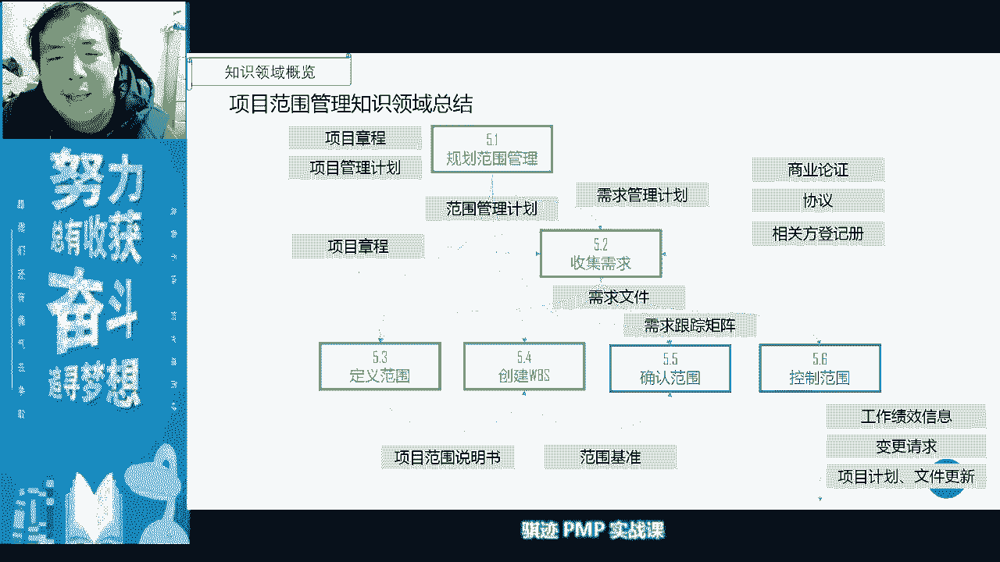

好那么我们讲管理范围第一件事情是什么啊，请告诉我管理方面第一件事情是什么，是立规矩啊，是立规矩，直立规矩，那么立规矩这样一个过程过程当中呢，我们应该干什么，先定方法论对吧。

所以规划范围管理是不会直接输出具体范围，甚至没有什么范围框架，它只是定个规矩，对不对啊，ok啊，所以第一个规划范围是的主要目的是什么，是立规矩，所以大家请大家把在公屏上把做规矩立规矩啊。

可以打在公屏上啊，这规矩，好请大家把立规矩对，记住了没有啊，记住没有，ok啊，记住了之后，让我们继续讲啊，那么规矩是怎么立的呢，规矩是怎么立的呢，规矩是这么立的啊，那么首先规矩。

首先当中我们要看范围是怎么来的对吧，需要定来源，那么首先所以递归这过程中，我们首先看来源是怎么样从需求到范围，第二呢我们要注重什么东西呢，如何去收集需求啊，如何去收集需求。

然后怎么样做什么需求到范围的这个转化过程，会去在这里面定义对吧，然后呢我们还要注意什么，范围，应该是跟因为范围的管理，我们前面讲和生命周期是紧密相关的对吧，然后所以我们要定义我们的发生管。

规划范围和范围，管理的发生的时间点，如果是预测型的呢，瀑布型的呢，我们就在开始的时候和变更的时候去做，如果是迭代型的呢，敏捷型的呢，我们就每次迭代时候开始做对吧，那么我问，那么我来问你们一个问题。

如果我们在现在设规矩，我们使用瀑布型，那我问你如果是瀑布型的话啊，如果是瀑布型的话，那么规划范围管理是不是仅在项目这里就要讲，仅在项目开始即变更的时候，开展规划范围管理啊，首先。

是不是仅在项目在公屏上告诉我，是不是，嗯好很好，有些同学说是有些说不是的吗，啊注意啊，我上课问问题的风格大家都已经知道了，对吧啊，所以要带着脑子去回答了啊，但有时候是故意忽悠忽悠你们。

也有可能是挖坑给你们的，对吧啊，ok等凡事凡事跟自己来，ok非常好啊，我看到了有很多同学已经开始回答了啊，是是是yes是的，ok很好啊，答案是是的，对规划范围管理当中，除了我们要进行一些变更。

我们的方式要变更之外，几乎我们只会在向我们瀑布型，只会在项目开始做规划范围管理，那么接下来有个问题，瀑布型的项目如果不考虑变更，是不是范围的定义也在仅在项目开始的时候做，好接下来请告诉我啊。

如果我们使用瀑布型，并且现在暂时不考虑变更的情况，是不是范围的定义，也仅在项目开始的时候做啊，开始的时候就是我们规划的时候做，好我看到很多同学打yes啊，yes，非常好啊，你们就噎死了对吧。

你看掉坑里去了吧，注意不是的啊，规划范围管理在瀑布型，一般是仅在项目开始的时候做，这个是对的，定义范围我们会定期和不定期的做很多次，所以不是只做啊，只在开始的时候做了，那么所以这个表述是怎么理解的呢。

第一定义范围就是制定范围的框架的时候，项目开始的时候确实做要做一次，对不对，但是我们讲项目是不是有多阶段的，每个阶段的时候，有没有可能他的项目范围要进行定义的，重新的细化和重新的认知啊。

所以它有可能在不同阶段定义范围的时候，定义的是不一样，有一些项目可能在项目一开始的时候，对后面几个阶段的项目是不，后面几个阶段的内容是不会去做定义的，因为一开始不知道，要取决于第一个阶段做的怎么样。

明白了吧，还有呢是因为项目随着范围管理的深入，它的范围有可能会因为各种情情况会发生变化，所以会产生变更，所以范围定义会什么，会在项目当中会定期和不定期的产生改变，知道吧，所以规划范围几乎就只在瀑布型。

仅在项目开始和变更的时候，我会开展一次，其他时候是不会开展，规矩不能常感，我们前因为说我们一直说规矩不能常改，经常改的规矩它就不是规矩对吧，因为一天到晚改就没有严肃性。

但是内容和框架它会随着环境变化确实会变化，所以它会开展一次或者若干词不定词，取决于需要明白了吗啊，考试的时候一定要记清楚这个概念啊，记清楚这个概念啊，渐进明细啊，有些同学说对对，渐进明细可以啊。

但是渐进明细可以也可以这么解释，从一个大的框架来看，也是一个渐进明细啊，ok没有问题，所以非常好啊，所以，所以很多同学啊现在就是说啊，可脑子现在开始逐渐清晰的逐渐清晰啊，所以这是规划。

规划范围的管理的一个主要的内容啊。

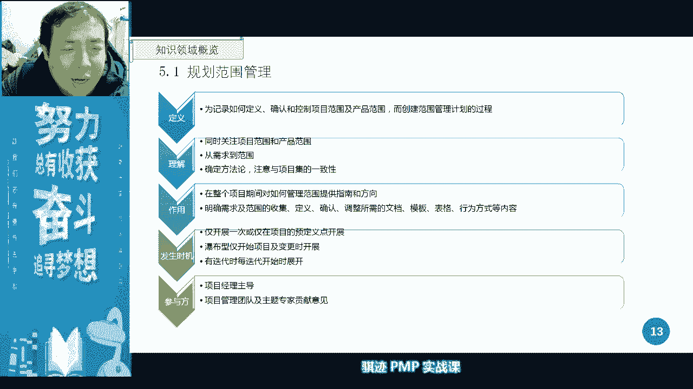

主要的内容，那么固定范围的范围当中呢，我们会有各种各样输入输出啊，我们来详细看一下，输入当中主要靠依靠项目章程，因为项目章程当中有最初始的项目，高层次的定义还是描述啊，上次有一个同学在群里问。

项目章程中有一个项目的高层次的定义，还是描述，答案是描述description啊，ok再记一下啊，所以他不会去定义什么东西，因为一个项目它的章程里最主要是什么，我要达到什么目的，至于范围呢。

我会给你个描述，但是具体由你项目经理自己去定，只要达到我的目的就可以对吧，就像一句话是什么，我不管过程如何，我只要结果对吧，还有其他的项目管理计划，那么规划范围管范围，管理范围管理输出的规划。

范围管理输出的范围管理，计划管本来就是范围管理计划一部分，那么为什么要输入呢，因为很多的其他的子计划的管理计划一些呃，呃内容的描述，有可能会对我们的范围管理呢造成影响。

所以呢会进行进一步的细化的定义啊和更改，所以它也是其他的计划，会影响到范围管理计划啊，ok然后工具呢我们主要用专家判断数据。

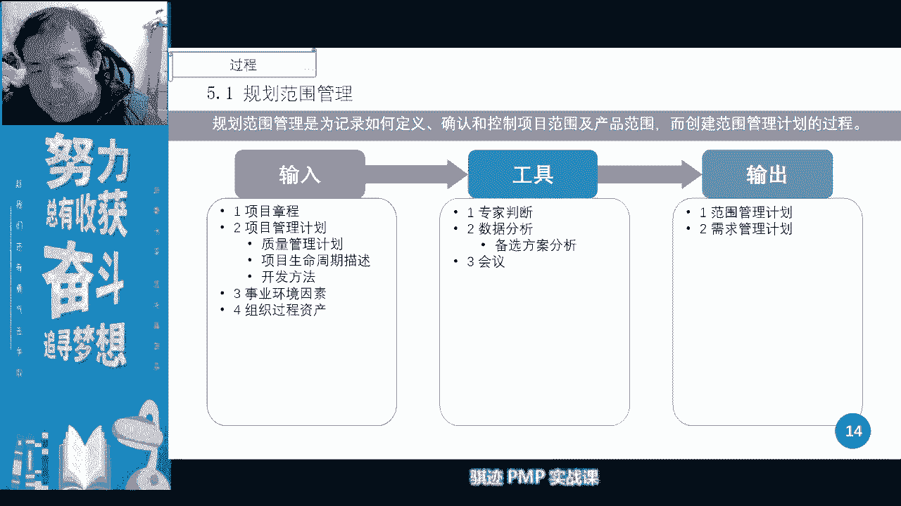

分析会议啊，这种方式好，从定义上来看是什么，是项目管理计划的一个组成部分，它用于定义制定监督控制确认范围，它是一个规矩啊，所以我们前面已经在公屏里打了，他是一个规矩规矩，那么中间看到范围管理计划。

主要用于对下列工作过程的注意啊，我红字标了一下ppt特点，它是做出规定，不是直接定义啊，这里不是直接定义，就是做出规定，规定你怎么做，但是具体做的内容呢，我不知道，那么它规定哪些方面呢。

以规定项目范围说明书啊，项目范围说明书，项目范围说明书，英文里面有一个英文字母叫scope of work，of work啊，简称叫做soo w就成了咱们的啊，那么讲到这个东西呢，就是说呃这个东西呢。

我们都会在定义范围当中呢，我们会讲啊，这个东西呢在pmbok的第五版和之前，他的解释有点模糊啊，有这就是有同学搞不清楚，所以第六版当中呢，他干脆变成了另外一种表述形式啊，表示另外一种表示形式，那么叫。

但是它控制这个过程中，会定义出项目范围的说明书啊，这个后面这个说明书怎么定义，和里面的什么东西，我们后面会细讲啊，不要急，第二个呢，它会规定怎么样通过项目范围说明书，创建w f s啊。

那么项目范围说明书就是一个框架对吧，再详细的框架它也是一个框架对吧，w bs呢就是你的躯干，你的肉体就是项目详细的项目方面说，就是你的人的整个一个外观描述对吧，你你有两个眼睛，一个鼻子，一个嘴巴。

两个耳朵对吧，你详细描述对吧，谢老师，有什么两个小小的眼睛对吧，但是光靠这个能不能形成啊，我这个五官啊啊不行对吧，虽然眼睛是挺小的对吧，但是不行，那么应该怎么样去形成呢。

要靠w b s w b s当中会详细定义你每一部分，比如这个眼睛长宽高是多少，有多少水分对吧，里面的角膜是多少厚，能够看见什么样的东西，分辨率是多少对吧啊，那么顺便问个问题，你们知道一个人的眼睛呢。

可识别的像素是多少啊，ok啊，我们稍微差一分钟，你们知道人的一个眼睛能可识别的像素是多少，上亿的，上亿了啊，ok啊，这位同学啊，那你给讲人类啊，人类的眼睛的像素其实只有400万啊。

你们可以去查一下人类的眼睛呢，分辨率是400万像素这个水平，那么为什么人还有高分辨，是因为人的眼睛呢基本像素会通过人的大脑，人的大脑是一个非常强的一个图像处理器，非常强，它可以迅速的把人的眼睛看到。

这些像素进行组合，然后形成一个画面，所以人的眼睛的视觉是可以有欺骗对吧，但是人的眼睛很强的一点在于什么呢，人的眼睛它的变焦能力是任何现在相机左臂，人的眼睛从极远到极近，从进入到动物的这个变焦过程。

只需要非常非常极短的时间，零点几秒就可以完成了，但是我们的相机不可以啊，我们的很多的光学设备不可以，ok啊，所以所以这是人的眼睛形成的一些特性的定义，和它的内容以及组织部分对吧，当他描述的非常详细。

能够制造出来之后，那么他就成为了一个什么人，这样一个可交付成果当中的，一个w bs当中的一个最底层的一个东西，ok啊，我们后面会再讲啊，这个工作方应该是在下节课讲，下节课可以好，那么第三个东西呢。

我们会做出规定啊，我们还是讲规定啊，不是讲内容啊，做出规定是什么，我们要规定如何去维护和审批项目基准，就规定了在什么情况下发生什么样的事情，我们应该怎么样去管理基准，哪些东西是要纳入基准范围管理的。

哪些不用，对不对啊，这是一种规定啊，那么有了这个规定之后呢，我们就可以去维护项目基准了，那么这一条是什么意思呢，就是说如果有道题目问你，如果有道题目问你，项目经理需要对项目的某些非常细小的部分。

认为是需要进行变更，这种变更呢不影响用户的功能，但是影响项目的项目需求，那么项目经理应该是应该查阅哪个文件，去执行上述变更，是查阅范围管理计划还是查阅变更管理计划，先查阅哪个啊，请回答，ok非常好。

因为现在讲范围管理计划，对于你们就回答范围对吧，你们这是一种投机取巧啊，但是考试也要记住，为什么先查范围管理计划呢，是因为放不过去的话，定义你这个变你这样一个小的改变。

是不是达到了整体变更控制这样一个程度了，他会去定义对吧，如果达到了，请遵循整体变更控制流程，如果没有达到，那项目经理有授权可以自己去做，对不对，那么这个规矩在哪里，立的是在范围管理计划当中群力的啊。

所以应该先查阅范围管理计划，再去查阅什么东西啊，再去查阅我们的变更管理计划，ok啊明白了吧啊，这就是这个当中放入调查当中，他的立规矩的意义，对吧啊，最后一个呢是在正式的验收，已完成了可交付成果啊。

那么他这个这句话正式验收已完成，可交付了什么意思呢，就是说验收应该是怎么验，这句话的意思就是验收应该怎么验收对吧，我们在范围管理化当中讲，我们要实现什么样的内容范围，那么实现之后呢，我们没有具体讲范围。

但是我们实际上无论怎么样呢，范围我们的验收，比如说按照分阶段去验收，还是整体一下验收，还是既做计验验收呢是客户确认为主要依据，还是以功能，在生产环境当中能够正常运行为主要依据，诸如此类。

会做出这样一个规定，这些规定呢都是在范围管理计划中去制定的，当然所以范围管理计划当中的一些内容，当然是要什么东西啊，是要我们客户去批准对吧，你怎么验收去规定的，当然要客户认同批准，注意啊。

所以在实践过程当中，我们怎么去管理范围范围，怎么去定义，最后怎么验收的，是要客户认同我们的做法的，对吧啊，所以你们在做项目经理，在开始正式干活之前，跟用户在干正式开始干活之前。

一定要把这段呢跟客户确认好，我们的验收方式是怎么样的，我们的验收策略是怎么样呢对吧，我们验收边界是怎么样了，谁可以定义什么东西，谁可以负责什么东西对吧，客户可不可以对范围的做出怎么样的一些啊，认定对吧。

我们都是在范围管理计划当中去定义好，明白了吗啊，这要跟客户确认的啊，然后呢根据项目需要方向盘那句话，可以正式非正式的非常详细的高度概括对吧，小项目的呢肯定就是高度概括的非正式的意思，意思对吧。

大项目呢呢就要正式的写的清楚了，要非常详细的啊对啊，所以范围关系话都有个特点，小项目呢都非常简单，高度概括，而且不太正式，大项目呢就一定要有非常详细啊。

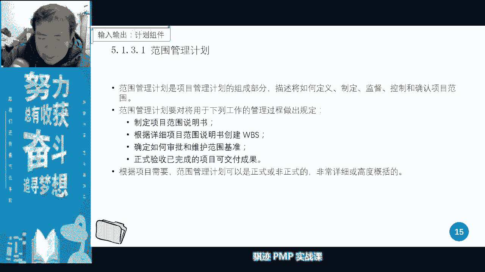

而且正式好，那么这个呢是我们呃p p t上所写的一个，我们阳光俱乐部接待大厅改造项目的一个范围，管理计划啊，还有管理计划，那么这个是一个事例啊，这个是个示例，那么我们从这个事例可以看到什么呢。

我们在制定详细的范围说明书啊，然后呢创建的vbs维护范围，基准项目交付真用关系变更，这是我们前面讲的这几块吧，啊这几块，那么这几块当中，他他是想相对详细一点定义的啊，实时采用的方法是采用什么样的方法啊。

这个呢大家大致看一下几，大家大致大致看一下就行啊，但是就是说呃范围管理计划我们就讲了，尤其跟客户相关的，比如客户最关心的成果怎么交付，这个是要跟客户去确认的啊，那么所以他这里看项目中。

任何完成工作完成之后呢，都要进行验收，如果w p s有说明的呢，就根据说明验收，如果没有说明的呢，走我们每日成果元素，所以这个项目是什么样的项目啊，他的验收方式是每天的工作进展，直接由客户在现场验收。

这种方式他不是最后交结果，而是说什么现场每日啊，所以它其实是一个什么装修项目啊，我们知道装修项目有什么特点啊，所以说比如说他这里有隐蔽工程对吧，因为隐蔽工程是这样，你东西封上去了。

我们装修很多人肯定家里装修过，装修的时候，如果你把东西封上去了，那么你什么东西看不出来，如果里面做的不合格，你是看不出来的，所以一定要让客户确认签字之后，才能把很多东西都封上去啊。

所谓隐蔽工程局里面放水管啊，放电线啊，放这些东西啊，放各种各样的管子啊，就我们称之为引放置管子和线，称为隐蔽工程，这些东西因为这最后是看不见的，所以一定要什么，客户目测现场认确认书名后再封进去。

否则以后出现纠纷非常麻烦，你总不现在为了证明这个东西把它挖出来吧，对吧，就像让子弹飞里边明明吃了一碗，明明吃了一碗粉，然后说你吃两碗粉，你最后总不见得把肚子切下来了啊。

那个那个那位同志有勇无谋的同志对吧啊，吃一碗粉，人家说吃他吃了两碗粉，然后没给钱就把兔子肚子剖开来，人不死了吗，啊就这个意思明白了啊，好这是我们讲的可交付成果的一个验收验收，那么关于项目范围的变更呢。

它就定义为了把控节奏呢，对范围进行严格控制，不允许任意增加未取工资，也不允许删除工作啊，所以这个其实这个意思是什么东西呢，不并不欢迎我们的什么项目的改变，那么前而言之说，这个项目是一个敏捷性的项目。

还是一个预测性项目，请在公屏里告诉我啊，是个敏捷性项目还是一个预测性项目，好ok啊，那好ok啊，有同学回答了啊，预测性项目对啊，ok没有问题对对，我告诉你们，所以很多大型的装修项目从经常会做。

从与预测性项目做成敏捷性项目，为什么就是客户需求反复更改对吧，ok让相互经历有苦无言啊，我所得所谓的敏捷其实不是真正敏捷，就是意思客户需求反复更改，导致范围没办法控制啊，看上去有点像敏捷对吧啊。

客户说做到哪里我们就做到哪里啊，会做成这个样子对吧，这就是一个范围管理不好，不完善的一个一个像一种项目表现形式，那么最关键的是什么呢，一开始就没有跟客户约法三章，也就是一开始没有做什么。

和我们的客户做好范围管理的一个规矩确认，所以立规矩还是很重要，明白了吗，明白了啊，要先把规矩了，而且这种规矩像项目管理计划这种规矩，跟客户要现场签字确认啊，让他确认花押啊，以后再有这样的话。

我们按照规矩办，按照规矩办对吧，当然客户耍赖是另外一回事情啊，说说另外事情好，那么我们讲了一个，那么这个例子呢，我不只不是细讲啊，大家有兴趣可以自己去看一下就行了啊，这只是个示例。

那么随后我们讲我们要制定范围管理计划。

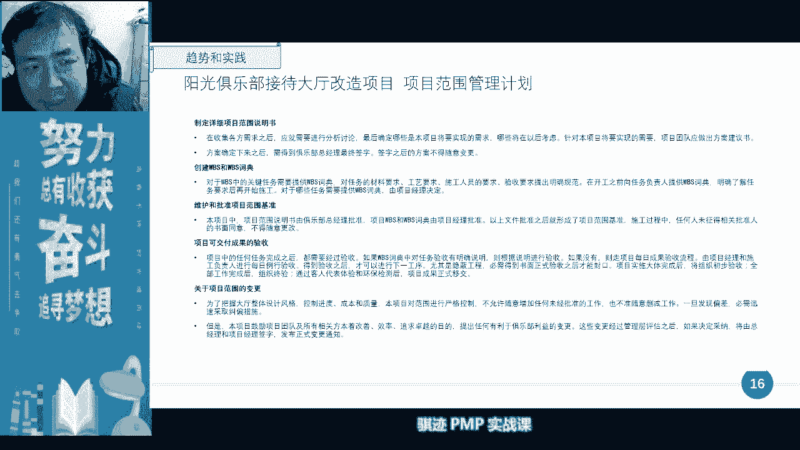

那么随后我们在制定过程当中还有制定的东西，很有意思啊，这个呢就要提到一个这个本章节的第一个要点，范围管理计划啊，范围管理sorry，不是范管理，范围管理当中制定管理计划是唯一特殊的。

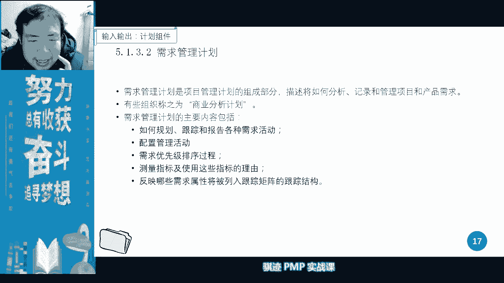

唯一一个什么东西啊，一个规划子过程输出两个管理计划的输出，两个管理计划，你看它一个是范围管理计划，一个是需求管理计划，那么我们p m p里面有没有需求管理啊，单独有一张循环没有。

因为范围和管理是紧密相关的，所以他放在一起讲啊，所以在范围管规划范围管理当中，它会输出两个管理情况，要记住啊，所以考试的时候突然之间提到啊，需求管理计划是从哪里输出来的，好有没有需求管理，没有需求管理。

他哪里出来是从规划范围出来啊。

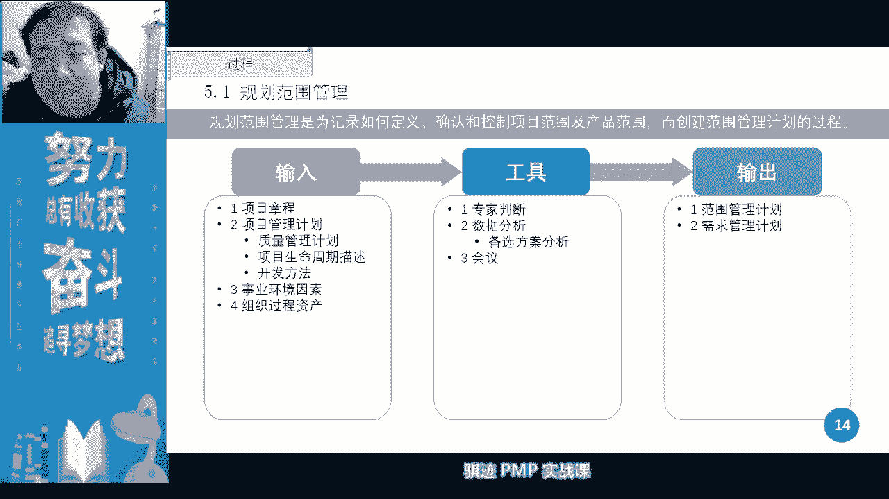

这个不要忘记认生啊，那么为什么要制定需求管理计划，是，因为需求会直接决定范围的组成方，式和组成内容，那么需求管不好，范围也管不好啊，这是这是一句很真理啊，非常真理的话，需求管不好，范围就管不好。

那么所以为了管好需求，我们要干什么，接着要什么管啊，管好范围，所以我们要接着要管好需求，那么管需求，需求管理计划呢也是一个立规矩对吧，管理计划都是立规矩的，所以管理计划当中，需求管理计划当中。

我们主要做的那些呢是定需求的规矩是怎么样，第一规定怎么样去规划跟踪报告需求啊，但其实说是非常重要，为什么需求的来源有时候会很多对吧，怎么样去报告需求，跟踪需求，规划需求其实是门学问啊。

因为有时候客户会怎么样呢，会突然之间脑门一拍啊，然后啊我有这个需求，请给我做，这样就会导致什么呢，导致我们需求管理无度啊，那么一定要让用户呢，从我们认可的正规的方式去报告需求。

第二个呢是需求应该用一种正式的方式去描述，规范的方式描述，否则的话，我们怎么样知道用户的真实想法是什么呢，对吧啊，就比如说你描述一个人，他一个需求，他的他的需求是什么呢，他的就说我要吃，我要吃米饭。

假设你这里是呃，假设你这里是北方北方，我们知道面食吃的多，面米饭吃的少，那么你要吃米饭难住了，我们家里没有米饭，那么这个时候呢你会发觉什么，这个用户的需求说我要吃米饭，这个需求呢其实不规范。

应该怎么规范的描述呢，用户说应该是怎么描述啊，用户的根本需求什么，我饿了，那么我是一个南方人，我更倾向于吃米饭，如果有米饭吃，最好没有米饭吃，吃面条也能甜鸡对吧，那么你根据这样。

用户这样一个明确的详细的可实际的需求，然后你再规划怎么样去满足客户需求啊，用户饿了，我们看看有没有米饭，没有，外面买不到啊，买不到，那么怎么办呢，我们跟用户说，面条能不能将就一下，还可以将就。

所以是这个需求就满足了啊，明白吗，所以这一切的过程当中，一定要有什么有一个需求管理计划，规定我们是怎么个需求客跟客户沟通需求的，这些需求应该是怎么样定义对吧好，这是第一个。

那第二个呢是我们的配置管理活动啊，需求呢因为肯定会涉及到配置，所谓的配置就是描述我们可交付成果的一个啊，一个定义啊，一个一个属性和定义，那么描述可交付成果的属性定义呢，那么就需要什么和我们的用户。

客户的需求连接起来，连接起来，因为用户的每一项需求，都会直接的关联到配置啊，那么我们会定义什么东西呢，用户的怎么样的需求描述，会直接影响如何去影响到我们的配置，会是这样的东西。

当然这个不是配置管理的最主要的内容啊，最主要其实还是对对于需求的活动的正规化，和需求的一些优先级的排序，而如何去选取需求，那么第三个内容啊，就是优先级排序啊，优先级排序我们就讲到了啊。

我们就讲一下需求的一些定义，我们讲需求呢大家可以看一下啊，我在公屏上打印有一个需求的管理方法，大家可以看一下哦，叫m o s c o w叫莫斯科法，莫斯科法，那莫斯科外面怎么描述，这是一种方法。

大致介绍一下啊，考试不不太会考啊，就是怎么考试方法呢，就但是实际上怎么做呢，就是我们报考需求会定义为m是什么，must必须啊啊c呢是什么could，可以啊，4s呢设的最好能够对吧。

还有有些东西呢后面后面还有哪些呢，是不用不需要的，不用的啊，这些需求，所以需求应该满足的需求总是有限的对吧，那么哪些不是所有的需求最终都能大幅，绝大部分项目当中，不是所有的需求最终都能实现的。

所以我们要将最应该能实现的项目，而项目需求呢纳入到项目的范围当中，当然了，这就是一个需求，我们转变为范围的一个一个方面啊，第一要需求和规范，第二呢需求要有优先级，一满足高优先级级级的需求为先啊。

好那么这就是要这就要求什么要求，需求管理计划的进行管理，需求管理情况进行管理，就指导这需求怎么样去控制啊，那么需求管理情况，怎么样去选取和定义那些需求，这是为了筛选什么东西啊。

因为你要评判一个用户的需求，你要评判它呢，它是基本需求对吧，人的基本需求是什么，吃喝拉撒睡，是不是啊，这是人的基本需求吧，人缺了这任何一样啊，应该说都不能生存对吧，呃不吃肯定是要饿死的啊。

喝不喝要渴死啊，布拉撒的话憋死对吧，不睡的话是困死对吧啊，这是人的基本需求，那么人的推荐需求或者是期望需求什么啊，吃得饱，穿的好生活，幸福家庭安康，巴拉巴拉巴点点东西对吧，这些东西是要在吃喝拉撒睡之上。

其实满足的，那么人还有一些叫兴奋需求或者叫激情需求，一时间的需求什么啊，我要成为一名宇航员对吧啊，不是说不能实现，但是说你成为我们在屏幕当中，之前的小伙伴们啊，同学们，你们要成为宇航员的概率非常非常小。

不能说没有非常非常非常非常小，对吧啊，我要成为第一个登陆火星的人，那么你比马斯克还先去对吧啊，ok啊，所以有时候有些需求，但是一种兴奋需求，它往往是达不到的，或者是不切实际的，对吧对吧。

比如说在你在你现在比如说啊现在这个阶段，那么谁对你学p p g而言，什么样的需求是基本需求啊，学好知识这个基本需求期望需求什么呢，知识形成体系并能运用到考试当中，对你们现在来说，兴奋需求是什么。

我要成为一名项目管理大师，对不对，不是说不能实现，而在当下阶段这个不切实际对吧，ok啊，所以这些东西呢都会有一个需求管理去进行管，然后需求管理还管什么测量指标和它的指标，使用方法对吧。

咱们就衡量最后一个呢是反映这些需求，如何被纳入到跟踪矩阵当中的追踪节奏啊，那么这个之后会涉及到我们收集需求，所产生的两个文件，一个叫做需求文件，一个叫做需求跟踪矩阵，这个有两个什么，有什么区别。

有什么定义，ok啊，我们卖个关子。

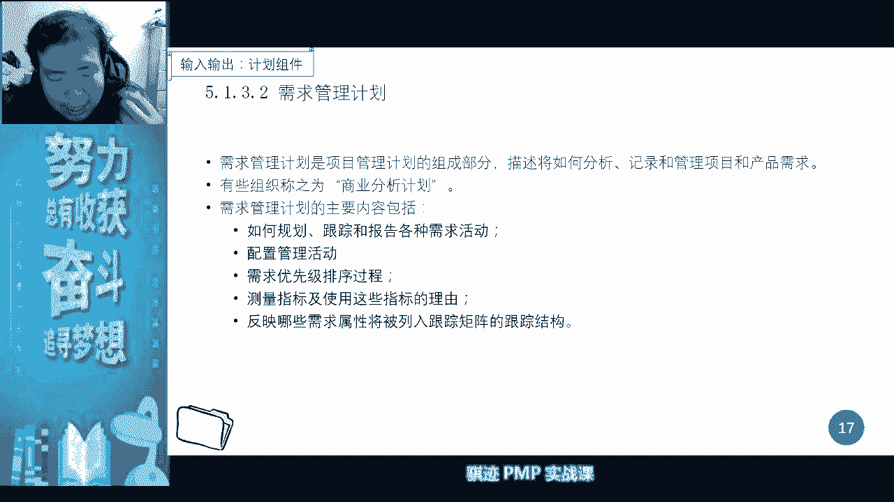

下回分晓啊，下回分晓好，我们进入下一集了，那么我们呢又讲啊，我们在这个阳光俱乐部接待大厅的改造项目，我们需求管理计划当中是怎么样的呢，首先我们讲瀑布式的生命周期，所以一开始你就要把需求提出来。

那么需求管理计划会要求，如果我们是瀑布式的，那么一开始就要把所有的需求给我提出来，还有没有要求，没有要求截稿了啊，截稿之后再提需求就会走，变更会很慢啊，不一定能实现啊，所以你这是我们的需要管理一句话。

所要表现的意思，明白了，那老师比较粗，这个比较粗俗啊，这个是个表达比较粗俗，但是实际工程中就是这么表达的啊，没你要跟用户说清楚啊，我们的规矩怎么样，第二呢我们定义如何去收集需求好吗。

我们的需求呢是以什么调查对象，以居住科普作用为主，那么所以我们要需要什么一对一的访谈，市场调研，对不对，我们就基本就和法兰特是一对一市场调研，如果我们要收集潜在需求怎么办啊，来我们考验一下。

如果我们要通过一个不让用户知道，但是呢要让用户参与我们的调查，去收集用户的潜在需求，我们之前学过哪个方法，哪个方法来打在公屏上，我们需要收集收集一群有代表性的用户的需求，但是呢我们希望收集真实需求。

希望用户呢在真实的环境下，真实的自然的环境下来去表达他的需求想法，那么我们可以用什么方法，哦非常好非常好哦，ok给你们点赞啊，啊在公屏上打出焦点小组的同学啊，我给你们点赞啊，没有白学。

ok啊这个经我讲个故事啊，啊预制蛋糕粉的那个故事大家已经记住了对吧，这就是这种方法，那我问你们如果要大量快速收集需求，那么应该使用什么方法啊，我们就不卖关子，自己写的啊，书面的问卷调查。

问卷调查是一种快速的收集需求的一种方法，对吧，快速的需求，大量的标准化的就是收集需求啊，但是问卷调查也不是万能，而且向下恰恰相反他是很难的啊，如果问题的要准的话啊，而特朗普一败涂地。

其实到最后还是搞得蛮紧的对吧，ok我们稍微扯一下啊，不扯远，我们再回来，所以在需求管理的需求管理计划当中，我们会定义如何去设计需求，各种方法啊，收集各种需求方法，那么我们显然在这里这个当中啊。

这个当中我们的需求收集当中，其实我们没有采取什么方法，没有采取什么专家意见，专家判断对吧，因为这是一个面向于客户的项目，所以客户的体验会更重要，我们就不听专家意见对吧，然后呢我们需求收集起来之后呢。

我们会讲怎么样去评审需求，按照优先进行排列，优先级排列，我们按照什么样的方法，科学方法进行排列对吧，然后最后呢我们在需求评审当中呢，最后我们会把需求呢收纳进去，然后进行归纳，然后呢如何去管理收集对吧。

项目经理怎么样去负责进行需求的收纳，整理对吧，然后事后呢我们怎么样去做需求跟踪，我们讲需要用一般都是用需求跟踪矩阵对吧。

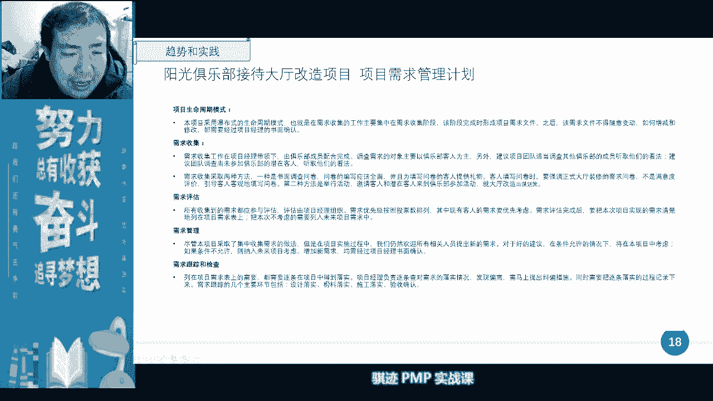

去跟踪好，这就是个需求管理计划啊，需求管理计划的实力好。

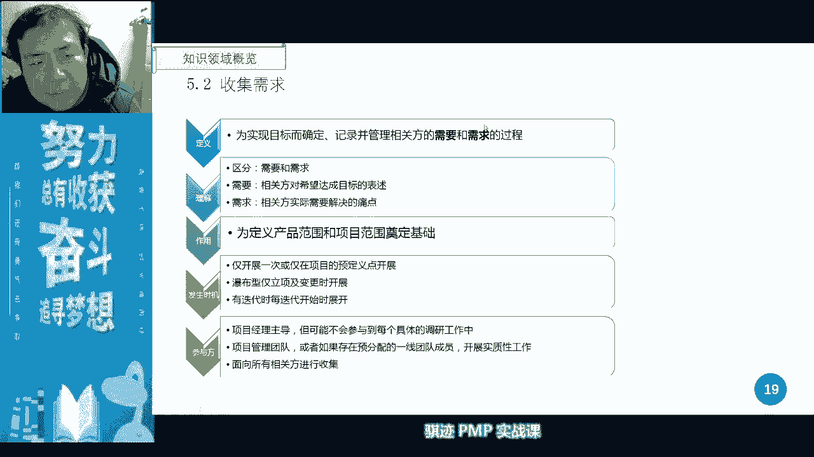

那么我们范围的规矩做好了，我们的需求管理和规矩做好了。

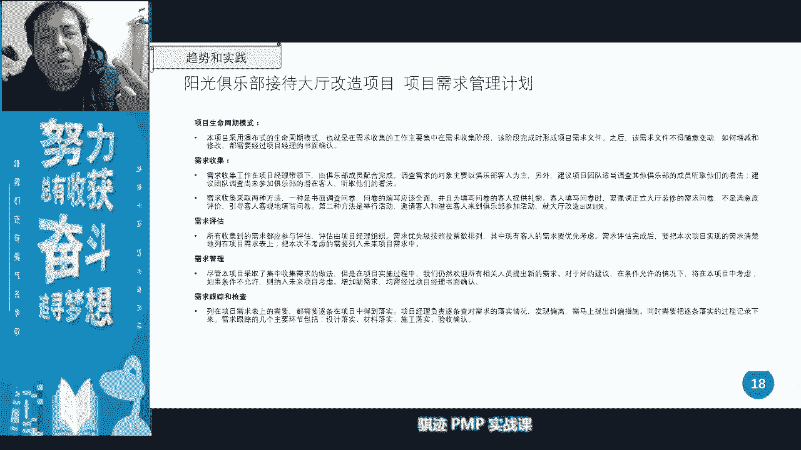

接下来看什么收集需求了吧，数据需求的目的是干什么，管理相关方的需要和需求过程，所以我们是一个把一个收集需求的过程，其实是一个把用户的一个非规范的非标准的啊，主观的一个需求变成一个什么规范的。

客观的能够工程实现的啊，定义清楚的这样一个需求的描述，并把它纳入到范围的这样一个过程啊，注意啊，我说了用户的表达，当时需求表达一般都是非规范的，非直接的啊，表达的可能是不一定清楚的。

不一定是在表达了这样一个一个表达过程，所以它并不能直接运用在我们工项目工程当中，直接运用能够运用什么，是经过整理的规范的一种需求表达啊，ok啊，所以虚拟用户经常跟你说啊，我要比如说我啊，我要吃饭对吧。

那么吃什么什么内容烧成什么样子对吧，那我要吃肉吃什么肉对吧，牛肉羊肉猪肉了是吧，什么肉对吧，所以用户给你的表达往往都是不精确，因为有时为什么呢，因为你要想，你们每个人也是某些项目当中的用户对吧。

你们的表达时候也只是表达自己的诉求，其实你们也不一定真正知道自己的诉求在哪，或者你们也无法自己去表达，对不对，所以也需要我们项目范围管理的人员，项目经理和项目团队呢，去把他这个东西收集过来。

然后呢精确表达，所以我们在实践工作当中去收集需求当中，项目经理啊，这就讲实操了啊，不是讲啊考试，但考试也有可能会考到啊，概率不大，但也有可能实操当中一个项目经理去收集需求，比如说我们一对一访谈。

面对面去收集需求，一定要多问，先多听再多问，第一在你多听的时候，一对一的时候，比如我们访谈一对一，大家看过鲁豫有约吧对吧，就是那个扫把星访谈对吧，谁上谁倒霉的那种访谈的时候，先要让被访的先讲出一个话题。

要访谈时就发挥在他发挥的时候呢，不要打断他，让他提供最可能多的信息，但是你不是说光听就行，你要在收集信息的过程当中，要把这些需求呢要有一个罗列提纲，同时呢脑子里又有清晰的一个整体照片。

这个人想要什么东西，他在描述的过程中还有哪些东西在实现上，需求最后总要实现，实现上还有哪些欠缺的，等他表示完之后呢，那么从我们的角度，我们要向他问，把这些你认为还没有模糊的进一步细化。

明确的东西呢进行细化，所以访谈的方式，需求方式啊，就访谈是一种需求方式，它的需求的定义上要求什么，要深挖一个问题呢，不断深入对吧，就比如说我要定义我要吃肉，你首先第一个问题问什么啊。

访谈别人如果有问题啊，如果不说了，我要吃肉啊，这一餐我要吃肉，我们的项目是烧一顿饭，这餐他们一定要吃肉啊，肉怎么怎么样，然后你第一个问题要问他是什么肉，猪肉牛肉羊肉你有没有忌口对吧，不能吃猪肉对吧。

如果你是印度教信徒对吧，你不能吃牛肉对吧，如果你是佛教徒，你只能吃素了对吧，你要吃的是能不能吃肉，佛教不能吃肉，能吃肉，吃人造肉，人工肉现在是有人工肉的，对吧啊，大豆做的对吧，不违反戒律吧。

啊那么接接下来一步你的肉要怎么做法啊，你要红烧的还是清蒸的还是刺身的对吧啊，接下来呢是说你最后还有一个说什么，你这个你这个对肉的品质和质量，要有什么要求对吧，差不多，那么问到这个程度，那么是不是。

所以一个差不多就行了，所以问一个需求，你一定要深入的求问细节，你细节问得越深入，那么你对用户的需求把握就越好，也避免你以后的反攻，所以深入去挖掘需求，是一个项目经理的一个非常好的功力，他的需求挖得越深。

越能够帮助团项目，项目团队在以后的工作当中顺利开展，不要走弯路，项目很多时候为什么会有反攻，为什么会有需求的变更，为什么会有各种各样的争吵，就就是因为当时挖掘需求的时候，没有挖的特别的细。

你挖的越细越繁琐啊，让人看着觉得很啰嗦，但是事后你会发现什么，这个东西为了避免你绕弯越有帮助啊，这是至理名言啊，所以挖需求是收集去的，挖需求不要怕啰嗦，一定要挖得深，挖的细。

哪怕相关方觉得你啰嗦也没有关系，但是总比你事后去做反攻，去做更改，再去做重复性的工作，甚至闹出纠纷要好吧，是不是这点希望你们记住，收集需求一定要细，一定要考虑周全啊，还要考试的考虑各种设定。

比如说我们刚才在吃肉，那么我们还要问什么东西啊，是不是要问一下你准备在哪一餐吃早餐吃肉，晚餐只有午餐，吃了夜宵吃肉，对不对，你是准备当零食吃，还是准备当正餐当中的一啊一个吃，对不对，你是你是准备什么啊。

吃冷的还是吃热的对吧，冷食还是热食，对不对，你怎么自己吃，还是便于跟别人分享对吧啊，诸如此类，你是不是有摆盘要求啊，这些东西都可以通过一定形式，你可以把它挖掘的细越细，对你来说实现项目的成功啊。

就需求的实现程度，成功当中呢越好，ok这是不是对你们很有用，如果你们觉得有用，请在公屏上打出有用，如果没有用，请ok没有问题，你可以打无用对吧，老师会虚心接受啊，然后继续讲课，啊这是收集需求这个过程啊。

我们仅仅访谈这种最经典的这种收集需求例子，去讲，去讲啊，那么收集需求最主要是什么，要啊，我们前面讲了，就希望对方表达目的的描述，然后实际解决的痛点，然后再关注细节对吧。

它的作用呢主要是为了产品的定义呢服务的，像我们的范围呢电机服务的，所以收集需求呢一般呢在瀑布形态，仅在立项开始的时候去收集对吧，所以那收集需求往往会在项目一开始，就是瀑布新开始收集。

但是但是啊就是瀑布型，如果他有多个阶段，他每个阶段会渐进明细收集，所以这句话呢并不足够精确，它是确实仅在立项当中会去开展，但是他如果是多阶段的，或者是采取渐进明细的明细的方式。

那么它的明细需求是有可能进行，重复开展的对吧，所以需求其实我们前面讲一下高层次需求，低层次需求对吧，整体性的需求呢往往确实可能在瀑布型，经在开始的时候呢开展一次，后面就不开展，但是详细的低层次的需求呢。

往往是随着项目的进展呢，去逐步逐步深入挖掘的对吧，所以这个p p t呢在这里描写的不够，不够精确啊，所以这是我给你们讲出来啊，这一点就跟我们前面的范围一样，因为需求收集多了，范围是不是要重新进行定义啊。

啊是相关联的，明白了吧，啊有些同学说了啊，说了一个问题很好啊，啊有些东西说了啊，让我们专业程度，让我们自己去想啊，这种情况是有的，那么为什么会这种一客户很傲慢啊，客户很很傲慢对吧，他态度不好。

有可能了对吧，但是他是讲方法吧，第二种呢客户自己也不清楚什么东西，但是他不愿意被你看穿，那么这个时候你不应应不应该点穿客户啊，啊不应该，那么应该怎么办呢，那你应该问的分析方法呢，就是说改变一下。

