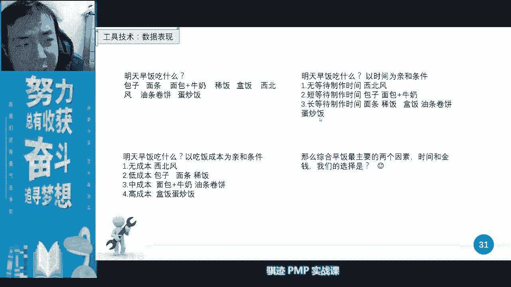
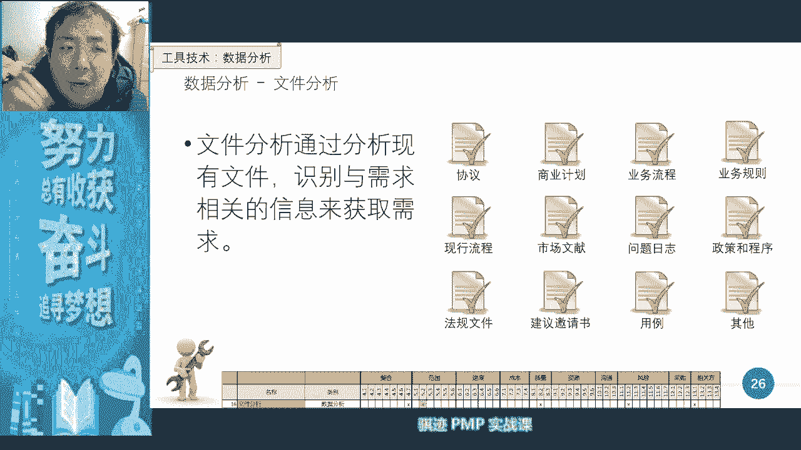

# PMP认证考试课程最新完整免费课程零基础一次通过项目管理PMP考试 - P11：PMBOK第六版 第五章项目范围管理-12 - 骐迹PMP - BV1Sb4y1f7Yt

可以通过口头圆心法啊，我我称之为口头啊，你可以用口述的方式去描描写，描述几个你认为最典型的，你以前如果经验丰富更好，举几个以前做过的最典型的例子，或者最典型的方法，或者比喻给客户说，然后说啊。

你你的需求是不是更类似于哒哒哒哒哒，某某某某某某方式，或者某某某某类型，某某某某产品，某某某某过程，是不是这样的，如果不是我换一个，或者说我说几个，你认为是最接近哪个，如果你说这个都不接近的话。

那么我们先按照你这个做的方法，让我们回去呢，整理一个可能的一些圆形的方法啊，然后再给你进行进一步的探讨，一定要把这个东西就落实啊，千万不要闷头做一收集需求的，很重要的原则就是什么。

如果你这个需求确实要做的，一定要把这个要做的需求在能够做之前，一定要把它尽可能落到实处，并且能够确定的细节越细越好，这样避免反攻，并且让对方签字画押啊，不要对方说啊，你自己会去想。

想了想了之后呢啊人家说这不是我当初要的，那么甲方其实一方面刁难你，一方面可能他真的不知道，你要跟他反复去啊，宁可事先事前被人反复打脸，也不要事后反复反攻，就是这是个原则。

啊有些同学说吃肉是先问为什么吃肉，是饿还是普通蛋，反正是第一不拿油问是吃什么的，就会问向办方误导，ok啊，有同学提出不同意见啊，那是取决于什么项目，我们说这个我们的项目是给啊。

我们这个项目是给客户做一顿晚饭，对吧啊，如果我们是要招待一个客户或者解决一个问题，则是另外一回事情啊，要根据项目背景来收集，需要根据项目背景来ok啊，那具体具体的方式是可以讨论对吧，ok好。

那么我们继续来继续来啊，那么需求当中，项目经理可以主导整个需求设计过程，但是不可能参与每一个细节讨论对吧，所以我们的管理团队乃至一线团队呢。

都可以去收集需求啊，收集可以收集，那么需求当中我们就有一个很经典的原则啊，叫smart原则啊，s m a r t s是specific啊，specific就是细，它这里叫独特性，其实就是细分性啊。

细分性个性性啊，细分性独特性，第二叫measurable啊，可度量性就是说它是客观可测量的，客观可测量，attentive attential是什么意思啊，可达成的就是说可以做到的啊。

你收几个收几个需求做不到，他说啊，比如说你说我要去啊，我要到太阳上去对吧，根本做不到，人类现在做不到，上去会烧成焦炭对吧，做不到啊，然后相关性relevant啊，要跟我们的项目相关对吧。

要跟某个方面相关，最后一个time wander啊，就是有时间限制，做下去，肯定会有个时间跨度，什么时候去完成，或者在什么时候有效对吧，那么我们讲收集呃，前面我就讲需求是指我们产品的特性。

能力和具备的东西，他收集的时候呢是主观的，但它收集完成之后，细化之后的呢，他应该最终被写成一个客观的一个描述，以便纳入范围啊，以便纳入范围，所以数据需求呢将成为我们工作分解结构，w bbs的基础。

也成为我们其他的一系列所有基础，所以项目的内容的技术来源是什么，需求需求需求。

那么收集需求之后呢，我们开始什么，然后我们开始进行什么需求的一些工具，用这种方法对它进行什么归家归纳整理啊，这个中间就会非常有意思，注意这里所有标黑的都是一些重要的知识点啊，所以收集需求的工具当中。

偏偏最喜欢考的就是工具，知道吧，这个工具当中。

工具当中我们讲啊一对一访谈对吧，访谈用于什么，了解高层次的需求，用于机密性的需求，然后呢访谈也有助于什么，也有什么方式使用访谈，就是说如果客户是一个比较比较内向的人。

或者是比较就是倾向于啊面对面交流的人，有些有有些客户呢，有些相关方呢他比较倾向于直接沟通，他讨厌间接沟通，或者有时候访谈是为什么要访谈，是因为有时候沟通人家不愿意留下记录，比如说经常我们看到新闻。

据某不透露人士的相关，巴拉巴拉巴拉透露啊，透露巴拉巴拉巴拉啊，什么东西，就是这个时候呢他往往是用访谈对吧，我们最常见的保密型的访谈是怎么样的访谈啊，举个例子啊，比如说我们俩交了一个保密的信息。

但是这个保密信息呢我不愿意留下任何证据，也不愿意证明是我说的，那我可以怎么做啊，我可以我可以邀请啊，我需要透露信息的那个人，我还想他去洗澡，我们俩在澡堂里一泡对吧，把衣服一脱。

要求两个人呢在泡在澡堂里的时候呢，在水里面的时候呢，两人讲啊，这时候呢我们身上不能带监听装置对吧，电子仪器什么设备都不能带对吧，然后呢两个人都没人说话啊，这是一种很常见的。

我们用来去沟通一些不愿意被第三方知道，不能被转发的一些信息对吧，然后我跟你说了，你去告诉别人，然后就问我，我一概不承认，除了这门也不承认，你也没有任何证据证明我说过对吧啊，这是这也是一种访谈。

只要是一对一的，都可以认为是访谈啊访谈，所以访谈一般是用来采集这种信息的，所以访谈的缺点是什么，它的采集到的需求信息，往往是主观描述出来的啊，因为用户和相关方很少能够很客观的，很规范的去描述他们的需求。

所以用访谈这种形象往往是主观的啊，并往往是并不能直接利用的，那些需求需要经过加工和整理，可加工整理，ok哈所以大家知道吧，当初很多时候啊，说到这个访谈，当初很多时候啊，当年啊他们很多时候就是用澡堂。

在澡堂里泡澡的方式去进去，商业商业沟通，商业交谈谈需求了对吧，男性有优势啊，那有些同学说男性有优势，没关系呀，女性也可以啊，我们可以找个女的谈一谈呀，没关系啊，女的和找女的谈啊，老师是不找女的谈啊。

会会会被会被你们嫂子打的。

对吧好，那么第二种工具呢，我们前面讲过焦点小组不讲了对吧，焦点小组是什么啊，一个自然环境对吧，有一个托，然后用这个托呢，让大家启发大家去说出对这个产品的期望对吧。

我说过了好，那么第三种调查问卷调查，问卷是一种非常经典的收集需求的方式，收集需求方式，那么这个方式呢会向众多的受访者呢，快速收集信息，那么除了快速收集信息，问卷调查还有什么优势啊。

问卷调查还有个优势是什么，它的问卷问题是事先设定好，所以他收集过来的信息是规范的客观的信息，这种规范客观的信息非常便于我们进行什么啊，数理统计，开展统计分析非常方便，而且呢随着现代媒体的发展。

问卷调查呢非常适合我们分散在全国各地，甚至全球各地的人呢去做一个问卷调查，好非常有收集信息，那么问卷调查是不是，就是完美的一种数据收集方式，它有什么缺点，ok啊，我们在公屏上打一下。

我问你们问卷调查有什么缺点，啊有同学说老师讲课能不能休息十分钟啊，两个小时注意力注意奶奶消耗太多了，ok啊那么我们讲完这一部分的工具技术，我们休息一下，好吧啊，有些同学说啊啊休息十分钟，那就十分钟吧。

我们顺从一下，ok啊我们等会休息十分钟，继续讲，等我们这一段讲完，这小节讲完啊，k老师都不觉得累了，准确性差啊，其实不是啊，这些你们都没有讲到点局限性回答，ok啊，这有一点点接近啊，不一定全面啊。

有一点接近啊，收集信息有限，其实你问卷做了大的吗，其实收集信息其实也挺多的啊，好那么我看到了很多我们的互动回答啊，挺不错的啊，脑脑子确定真实性对吧，ok啊，ok你们表达意思有点有点接近啊。

有点问卷调查最大的问题是什么，问卷的设置，会对这个收集的信息产生重大的影响，这是一直是问卷调查，那为什么呢，比如说我们现在坐在我们现在坐在教室里面，比如我发一个问题想问你们。

你们想不想不想参加pmp考试，你们肯定点我们想参加p考试，对我们想拿证书啊，好那么等到考试之前狠再问一大家，大家想不想参加拼命考试，很多同学都推荐我爱考试实在太难了，我没有时间学，我不想参加考试了。

然后等到你考试结束之后，再问你们想不想参加p考试，啊啊我们都不想加va，我都考过了，不同的时间，不同的阶段，不同的环境设计会对，就一是会对这个文件夹产生巨大影响，第二人在不同的阶段和环境当中。

对于偏对于问阶段的方式呢，接受多段会非常不一样，比如说我举个例子，你们所在的所在的城市，比如说你们所在城市或者所在的地区，比如说他说我们先开先开通一个交通工具方式，这个交通工具呢。

可方式呢比跟传统公式的方式不一样，然后呢，可以让你们更加啊快速的从某地到达某地，但是价钱呢贵一点，你们愿不愿意，那么受访者在填问卷调查，就觉得哎呀多一种选择中就好了。

大家肯定选择支持支持支持我们支持顶好，那么来了，然后人，然后政府根据这个问卷调查去造这个交通方式，比如说快速轨道交通对吧，然后直达直达线对吧，等到造出来的时候，很多人呢就开始想了，真的去做的。

哎呀要多花一倍的钱，就节省十分钟，十几分钟有必要吗，哎呀还要火下，比如说这个轨道快速轨道交通下来，还要换其他的公交交通方式，公交方式哎呀不方便他不方便，我还不如做其他的东西。

当人不在这个切身利益位置的时候，他们往往会从一个自身的利益角度啊，自身期望的利益角度去做的事情，但是他在这个自身切身利益角度，它就会采取什么啊，风险收益或者收益损害的利和啊，b端这个比较方式。

去做人的选择可能就不一样了，明白吧，所以问卷调查这个问题的设定会有这样的问题，第三个就是很多同学说的问卷调查，这个调查方式往往会对人产生误导，比如说我问你啊，我给你们做个问卷，答谢老师课上的好不好。

第一个选项非常好，第二个选项好，第三个选项还还不错，最后的选项一般，那么第二个问题是，你们觉得新老师讲课最好的地方是哪里，我只要设置这两个问题，这样那么在前面设置这两三问题，慢慢慢慢。

你们就会把回答问题的设定设定成什么，谢老师上课肯定是好的对吧，那么谢老师上课到底好不好呢，其实应该是取决于你们客观自身认定，而不是问题，是调查给你们设定的环境，对不对，这就是问题调查很多局限啊。

问题调查曾经曾经影响过中国的命运，你们知道不知道这样安全故事啊，这是我很喜欢说这个例子啊，在问你点啥，我很喜欢说这个例子啊，那么这是这样的啊，当年在中国啊，我们后来不是解放战争了吗，败得这么脆这么快。

很重要的一个原因是美国人不再愿意制裁，为什么美国人不再愿意制裁，悟性的一个问卷调查，当年的时候在二战结束之后，然后要选美国，然后不是罗斯福而挂掉了吧，一个叫杜鲁门对吧，后面知道杜鲁门，一个叫杜威。

然后呢，当时美国的问卷调查调查，然后呢，某光头就轻信了问卷调查，把八宝欧印在杜威身上，政治捐款，然后呢忽略杜鲁门，没想到一投票的时候，大家反而屁股坐在a，然后再投票投在b点。

屁股坐在杜威那里投票投给杜鲁门，杜鲁门上台了，你想某光头能有好果子吃吗，所以美国人中断了一系列的啊，哎也有道理，但其实武装的运营就是政治对吧，但失败的命运不可逆转，但还能多撑几年，结果就是因为美元被卡。

当然本身就是因为社会负担很重要，民生疲弊，然后呢，解放战争就打了那么几年，对吧啊，ok啊，这就是一个非常经典的问卷调查，如果不是这样的话，可能有非常有可能，中国的当年的解放战争可能历史要更长一点。

历史更长，阶级意味什么，有更多人可能会牺牲于无，明白无误的牺牲于中国的内战，对吧啊，ok啊，这个非常有意思的这一系列故事，非常有意思，什么求生意识就有我哪有求生意志啊，啊ok啊ok啊。

我们说的我说的都是事实，你们可以去搜啊，说说事实，我们很客观的说对吧，好，那么这是问卷调查啊，我们所以你们明白问卷调查难点吧，问卷的难点在于专业化的去设计一个问卷调查，要能得到一个接近客观的结果。

非常难，但它的方法和过程非常好用啊，好我们这接下来讲一个讲完一个标杆对照，我们稍息休息，有同学说要休息对吧，我觉得我上课两小时我都不带休息对吧，你们听课听两小时还要休息一下，ok啊你们要加强专注力啊。

我当时我知道很多同学上了一天班再去上课，确实很累啊，我体谅你们好，我们讲最后一个啊，标杆对照英文叫benchmarking，benchmarking标杆，所谓的标杆对照就是什么。

当你啊就其实跟做人是一样的啊，其实你把你把收集需求当做做人，我现在不知道我这个人应该怎么做，那么我应该怎么办，我看一下我的公司里谁是做人做的特别好的啊，比如说我们的公司的部门老大，我们的公司的老大啊。

他的做人有什么优点，然后呢我把他们他身上那些优点呢拿到我身上，我没有，那么就成为我这个人做人的这个，项目的什么需求，然后呢我去按照他的优点呢，去把我这个人呢做人呢做起来，当当我到达到他这个程度的时候呢。

我标杆就换了，换一个更高的标杆，比如说更高行业里面有个谁做的非常好的，我们以他为标杆，然后呢再收集需求，然后呢再把我这个人提高，人的提高是不是这样的过程，很多人提高就是这样，以别人为标杆。

直到你找不到标杆才能自由发挥，对吧啊，所以标杆对照就是找一个最佳实践，或者是非常好，你觉得非常好的一个一个目标，然后呢参照两个之间的差距，然后呢把这个差距作为我们的什么，作为我们的需求的一种输入。

对吧啊就好比说对吧，某些手机对吧，一直拿苹果手机做标杆，然后说我们说我们是标个对标苹果，然后我们做出什么东西对吧，然后苹果没倒，然后某些手机倒掉了对吧，ok啊啊，那么具体我就不点名了对吧。

啊这就是用标杆对照，反正大家知道标杆对照可以用来收集需求，我们后面还会学到标杆，用被罩还可以用来什么去制定成本啊，粗略的去制定成本以及其他的一些功能，比如质量标准也可以用标杆对照啊，这些都可以。

反正只要采取找目标，找差距这种方式，那么它就是使用什么标杆对照，ok好，那么我们这里稍事休息一下，现在是九点半，我们到09：40好吧，09：20，现在09：28，我们到09：40。

然后我们继续回来上课好吧，十分钟啊，就十分钟，你们休息一下，缓一缓好吧，老师现在还没有累，你们已经累了，所以你们还给你缓一缓，十分钟，40分回来上课啊，我们内容还没有讲完，后面很多内容了啊，还没讲完啊。

啊有些同学啊啊说老罗对吧，啊ok啊，这不是我说的，你们说就你们说吧，有些同学说啊，修记需求应该在规划范围前面，不对啊，先做规矩再收集啊，你不做规矩，你怎么收集的东西怎么能规范呢，对不对。

先把规矩做好出去，只有一个东西啊，我们只有一个东西是先去识别或者说收集，你认为是收集，再是那个相关方，相关方是先识别，然后再做回局啊，我们叫他学到相关方再说好吧。

好我们来看一下啊，有同学在上课之前，然后然后给我发了一个截图啊，有同学说他也是，他也是刷了一个刷了一个56对吧，我们抽奖56啊，那么中奖一共有两个同学对吧，ok啊两位同学，那么我们课间休息在线的同学。

调研不属于提前收集吗，调研是调研，更多是可行性啊，很多时候调研只是看可行性能不能做呀，具体做什么东西是要通过具体去收集的啊，好所以我们这次总共有两位同学啊，ok我相信大家，所以这次总共有两位同学啊。

中奖啊，抽到的奖啊，一位是邓鸿飞，一位前面是谁啊，我已经愣住了啊，一位那个东西叫叫朱晓明对吧，ok啊，这个两前面另外一位中奖的同学，中奖的同学啊，新闻号56，加我一下微信啊，今天是西方节日圣诞夜啊。

星巴克咖啡券一张，邓鸿飞同学已经因为有了微信了啊，然后我先去我先去买咖啡去我先去买咖啡去，啊有的同学说还有抽奖吗，我靠你想让我破产，ok啊，哎呀呀，怎么怎么买券呢，等会我去买个星巴克券啊。

嘀嗒嗒嗒嗒嘀嗒嗒嗒嗒嗒，让我看看星巴克券有哪些券，我靠啊，单倍圈啊，单背圈啊，购买全部门店可使用时段啊，咖啡券，ok啊我的我的我的星巴科技已经送出去了，第一章啊，另外一个同学请联系我一下，ok啊。

摄像头给你们看一下，看到了没有，看到了没有啊，我老师言而有信对吧，好老师尽管讲到咱们讲到哪一节，对呀，我直播白送你们了对吧，我全送了，看到吗看到吗，看到了啊，看到啦，对吧，我为你们打工啦。

好祝小明同学看到了吧，我们也送出礼物了啊，这一共有两个同学啊，hello啊，你们两个人同时中奖啊，让我那个，哈喽啊我要我要送两杯咖啡啊，今天晚上给你们打工了啊，啊有些同学有些同学问老师最佳时间怎么理解。

翻译一下白话，所谓的最佳时间的意思就是啊经过实践检验，经过实践检验证明，这个做法是目前来说最有效的啊，叫做最佳实践啊，就是这个意思，就某种做法，如果在实践当中被证明是最有效的，或者是最能提供效率的。

或者效率最高的，我们称之为最佳实验，英文叫best practice，practice，为什么会有这个环节，因为这位同学你来晚了啊，我们今天已开课之，开课之前三分钟，我们所有在线的同学啊。

吉吉抽了一个我们圣诞节的，然后我们我们啊出勤奖啊，送了两杯小咖啡对吧，然后鼓励一下大家啊，鼓励一下大家，因为这些同学安时啊，保证虽然他们可能也很忙很累，但安师保证认认真上线了。

所以又加上圣诞节理应给他们以奖励啊，但是你们呢啊，你们有很多同学没有按时上线对吧，大家都有各自有各自的困难，和那个那个呃很有要忙的东西，但是人家同学按时上线了对吧，所以我奖励一下人家有问题吗，卡住了。

你以为双11双12抢购了，还卡住了啊，这是不是理由，你早点早五分钟登录呢对吧，以后不要迟到了啊，以后不要迟到了啊，破产哈哈对吧，好我们休息啊，还有三分钟，我们还有三分钟啊，三分钟之后准时回来。

我们继续讲啊，有一天同学讲，我们准备讲到哪里啊，我们今天会讲到，我们会讲到本章节结束啊。

本章节结束其实还会有一点，在讲到定义范围之前。

我们讲收集就讲完，因为收集里面有很多工具啊，然后你们休息了十分钟。

我可能后面还要略微要拖一会儿堂啊，略微要拖一点点糖啊，因为后面还有很多工具要讲，这些工具呢考试都有可能会考到好的，然后呢因为这是范进程，我们后面的实践的知识领域的第一个，所以我会讲的节奏慢一点。

后面有一些知识领域点知识点会非常的多对啊，所以我会讲的更呃更有效率一点，就我有些东西不会重复讲了，反复讲啊，反复讲或者很着重讲啊，但是你们一定要仔细听，ok吧，这也是为了你考试通过。

也是为了你们扩展知识啊，时间应用对吧，呃范围管理要讲两节课呀，对呀，要讲到工作分解结构，范围管理是讲两节课，后面是讲定义范围和制定w bs和确认和，因为确认和确认范围和控制范围的内容比较少。

所以后面两节课，后面一节课的主要内容是讲，定义范围和制定w bs啊，那也是非常重要的内容，好吧，因为一节课当中讲太多的重点内容，我可以压缩的讲的很快，没有问题，但是讲太多你们来不及吸收，ok时间宝贵啊。

我们说好说好，10。40就10。40上课啊，这是个约定，很多时候项目经理，我们讲最大的美德是之一是什么，守时啊，这是约定，还有一分钟，我们到时就上课啊，ok啊，但是我今天只是说有同学提出来想休息一下。

所以我中断，但是我后面不一定每次都会有课间休息啊，课间休息这一点要注意，课间休息，因为我觉得我们是晚上上课两小时一上课的，所以课间休息的话，我觉得并不一定是必须的啊，因为我一般如果上全天。

白天全天的课的话，我是一上午才休息一次啊，一上午再休息一次，因为偏僻的内容很多，因为我想给大家多讲点啊，当然因为你们其实在家里的话，去上课的话，其实在家里听课的话，你们也可以不说要休息一下。

你们可以上个厕所，可以自己走过去对吧，不像课堂里啊，其实还是有一定自由度的啊，好我们开始继续10。9。40啊，前面讲了一个我们工具啊都回来了吗，奖励工具叫做标杆对照，那么标杆对照呢是我们设计工具的方式。

它最主要是找一个标杆对吧，那么我们有了数据，数据收集之后呢，进行数据的一个分析，会有一个这样一个分析分析的一个方法呢，叫做文件分析啊，所有的文件分析就是看各种各样的文件，来找出东西啊。

这个是为什么放在这里呢，因为看文件确实也是项目经理找出一些需求，这个方式，注意啊，文件分析大部分分析出来的，项目经理和项目团队分析出来的，大部分都大部分都是项目需求，不是和用户直接关联的啊。

而是跟项目需求所关联，大部分都是因为我项目当中用户的需求，大部分是从用户层拿到的，项目经理通过文件去分析，大部分的不一定绝对啊，看项目不一样，大部分都是项目需求是非直接的，非功能性的，非直接的需求啊。

是这样，但是呢具体方法呢每个行业，每个项目，每个领域都不一样，所以呢偏播客和我们的课呢，都没办法直接跟你讲有什么方法，因为方法太多了，不同的行业有不同的领域，不同方法对吧啊ok啊，咱们提一下。

有这样一个工具叫做数据分析，工具叫做文件分析就可以了。

那么在我们收集需求当中之后，如何去排列需求，生存需求的一个序列表呢，我们就会有一个决策叫做投票决策，我们之前的课已经讲过了对吧，有一致同意，大多数同意，相对多数同意，记得啊。

ok这个工具就不多说了啊，角色还有多标准分析，就是打分对吧，用数学打分的方式去讲，这个呢也没什么多讲啊。

我们之前好像也讲过了，那么这就是个多标准角色的一个例子，多半人的例子就是说我们通过成本吸引力，维护维修这样一个各种标准，然后呢根据不同的权重来评判，我们到底要买受邀机，跑步机还是乒乓球桌。

最后得出的结论呢是卖瘦腰肌，其实你们知道啊，在这个例子当中啊，呃为什么最后买受压机啊，是因为受压机最不占地方，没有想到吧，用户的需求就是这么诡异和隐藏和隐晦，因为瘦腰肌最不占地方。

因为这三样东西对于不太爱运动锻炼的人来说，最终都会去扔在角落落灰，但是跑步机是跑步机和乒乓球台，都是太占地方，受邀鸡不怎么占地方，所以其实看上去这个权重是三，其实这个权重是10~20啊。

就这当然就这个意思明白了吧。

ok啊，好那么我们收集完需求之后，进行数据表现和数据分析，尤其数据数据表现的时候呢，会有一个图，这个图经常会考叫做清河图，清河图是什么啊，将大量创意，其实这里是将大量需求进行分组，技术进行进一步审查。

所以亲和度可以对潜在缺陷进行分析，所以亲和度也可以用来进行什么缺陷，质量当中缺陷分析啊，这是一种方式，那么清河图他肯定会按照某一个条件进行亲和，这个亲和度原理啊，就是氢合的原理。

所以我在这里呢给大家举了个例子，举了什么例子啊，我们来看看很有意思，这个例子我们举个例子，明天早饭吃什么，那么明天早饭吃什么，我们会有各种各选项对吧，然后呢南方同学呢更喜欢吃稀饭对吧。

然后呢还可以吃稀饭啊，盒饭如果兜里什么都没有呢，可以喝西北风对吧，还可以吃油条卷饼，那么在这么多选项当中，我们怎么去判变选择的，无从选择的对吧，同时我们也不知道就适合哪个，我们是哪一组。

那么我们怎么样去把它这个选择，尤其当你有选择困难症的时候，是不是这个就无从选择了，好那么我们按照下面一些条件去亲和啊，首先我们还是决定明天吃什么，但是呢我们用时间为亲哥。

我们知道早早上吃早饭最主要是什么，一个是花多少钱吃，因为人们总是吃早饭，不愿意花太多的钱了对吧，大家可能吃晚饭愿意花100块钱吃一顿晚饭啊，但不同城市消费不一样啊，啊在老四所在城市消费。

上海消费特别高对吧，然后100块钱也能就已经能吃个，稍微像样点对吧，在有些城市100块钱可以吃的很好，但是吃早饭一般来说，绝大部分的城市早饭一顿花费，一般大家都愿意都在十块或者十块以下，会更多一点啊。

给当然跟经济条件有关系，那么还有一个就是吃早饭时间特别紧，大家都能愿意把时间省下来，用来什么多睡一会儿对吧，所以吃早饭呢，我们第一个先看下时间，你轻松时间什么样的吃什么样的早饭。

不用等待等待时间和制作时间，河西北风对吧，利等啊，不用等嘴巴张开就能吃到对吧，多多方便多省力对吧，这是第一种，那么第二种等待时间很短，肯定外面买的对吧，蒸笼一掀开你拿，然后直接就走对吧，不是稀饭。

早上在冰箱里一拿对吧，牛奶一热对吧，早饭不建议吃冷牛奶对吧，伤胃对吧，我们吃热牛奶，牛奶一热，也是一种，第三种呢是长时间等待的，比如面条对吧，早饭一般外面是没得卖的，快速早饭卖面条面条的吧。

所以面条肯定自己家里下，要时间吗，要时间对吧，然后稀饭稀饭要煮啊，要时间的对吧，盒饭对吧，和稀饭就算不要煮，我们说诶预先预先做好了，这不是电饭煲定时做好了，那你要吃的吧，对稀饭肯定上来比较烫。

你要慢慢一口一口吃，这个时间要换对吧啊，比如说盒饭，盒饭更加要买的吧对吧，要买油条煎饼是不是要在摊位面前等啊，这些都是长时间等待对吧，然后这样就做出一个亲额，做出亲和之后，如果你的最后的选项和偏向。

是偏向于长时间等待的，还是偏向短时间等待的，那你可以根据偏向做进一步的选择和分析对吧，然后呢如果我们在吃早饭呢，是以考虑是以吃饭成本为例，如果我们早饭摸一摸兜里什么钱都没有，怎么办，喝西北风对吧。

如果洞里摸一摸呢啊只有两三块钱啊，那么比如一两块钱，那么我们可以花一块钱买一个卷子面对吧，下个挂面对吧，就能吃饭了啊，一块钱是能买到外面的对吧，然后呢我们可以花一块多钱到两块多钱呢。

然后倒点米煮一个饭啊，煮个稀饭，那就更便宜了，配点配点酱菜小菜就可以吃饭，中等成本对吧，面条成本要高一点对吧，所以它是中等成本，油条卷饼卷饼呢也是一样对吧，高成本，万一你再多加几个蛋呢对吧。

但是也说甜的再多加点其他料呢，是不是成本就高了对吧，ok我们举个例子，还有盒饭也是对吧，叫个外卖盒饭随便在哪里种，总共十几块，20几块总要吧对吧啊，那么这个例子就是告诉我们呢。

我们通过亲和就可以有一定标准，告诉大家把哪些和哪些选项聚集起来，然后根据自身的条件，那我们早上看，如果我们早上又要能够节省时间，又不想花钱，我们的早饭应该吃什么，请在公屏里告诉我，咱们治疗。

好你们在公屏里打，我们继续讲，后面讲啊，你们在公屏里可以打一下，好，这是一种这是亲和度，所以是一种其实是一种整理和归纳的一种方式，但是它也有助于帮助我们去选择，明白了吧，西北风，哈哈啊。

我们早饭喝西北风是最省力又是最省钱的对吧，对吧好，那么我们后面这种数据表现是思维导图，注意思维导图和我们我们讲的名义小组，这是两种比较容易混淆的啊，我们放在一起讲，思维导图和明星小组都是第一点。

都是基于什么东西啊，我们的头脑风暴，brainstorming都是基于brainstoring头脑风暴，但是他们不一样的是他们之后的方法呢不一样，思维导图的方式是什么，才是分支。

我不抛弃或者不着重任何一个分支，但是我把它归类，对不对，归类归类啊，归类啊，比如说我们还是讲吃饭，吃饭里面我们讲吃什么东西的时候，我们可以用思维导图是什么，我们可以吃中餐，西餐对吧，这是两个分类对吧。

我们还可以按照比如说中餐里面，我们再进行分类对吧，所以在吃饭这个主题上，我们首先可以分为中餐和西餐两个一级分类，二级分类呢如果我们吃中餐就多了对吧，鲁菜川菜粤菜对吧啊，还有什么菜啊，还有徽菜是吧。

扬州菜八大菜系是不是八个分类啊，好然后我们可以一级一级分下去，最后决定吃什么对吧，是什么啊，所以思维导图是一个把一个各种各样的想法，需求，如果在需求这个领域是把各种各样的想法，需求归啊。

就是说通过归纳整理整理成不同的归类，帮助我们进行系统性的去观察，这个需求来自于哪里，怎么分类的一个工具，注意啊，所以它的归类它注重的是一个归类分类啊，归类分类啊，然后呢民营小组是一个什么样的技术呢。

它是一种促进头脑风暴，就它也是基于头脑，但是他的目的不一样，它是什么，排优先级顺序，它更注重的是一个时间和效率，因为我们知道通过头脑风暴去收集需求的时候，大量的需求呢是开脑洞的，我们我们讲头脑风暴。

有一点是不要阻止大家开脑洞，但是脑洞开完了之后，大量的脑洞，其实很多的脑洞是缺乏实际落地意义的，那么怎么样去有效的讨论有实际意义的呢，我们要进行排序，所以民营小组，更多的是头脑风暴的一种排序的方法。

他通过先开脑洞，然后呢记录所有脑洞想法，然后呢对脑洞想法呢进行排序，然后我们会针对一些高优先级的脑洞，进行进一步的探讨，o所以从理论上来说，这两种技术是可以放在一起用的，我们可以先进行排序。

然后呢进行思维导图的整理，可以吧，可以也可以思维导图整理，然后选择最优先级的分支进行讨论，可以吧也可以好，所以这两种方法都是可以的，思维导图的方方向是不是不一样了啊，我是不一样的啊。

思维导图更注重什么分类归类啊，明星小组跟注重什么牌中优先级啊，这是一个什么，他们之间最大的一些区别，所以考试当中说，我们使用一种优化的需求搜集方式，这种收集方式主要针对于需求的优先级进行。

同理我们主要靠或者说主要注重考虑，高优先级的那些呃，呃创意性的高优先级的一些需求，那么我们可以采用什么技术啊，就叫是我们讲的叫做名义小组，如果我们考虑什么，将我们各种各样的需求来进行归类进行讨论呢。

我们可以用什么技术啊，思维导图啊，注意啊，这就是关键词考试，看到分类归类需求的分类归类，就关键词很有可能是思维导图，考试的时候考到啊，我们跟对优先级需求啊，或者其他的一些东西来进行优先级排序。

很有可能就是什么，就是名义小组，明白了吧啊，什么叫做名义小组啊，所谓的名义小组，就大家组成一个名义上组成一个小组，然后呢进行进行分组讨论，然后呢大家在集体来进行进行，我们进行集体来进行对它进行投票。

排序是这样，是这样一种处理方式啊，ok啊，具体的这些东西呢我们就不细细展开了，因为考试当中没有那么考到啊，具体玩的上的名义效果其实有一套规范的啊，他会讲的会比较民营小组怎么玩，一套规范的会讲的比较多啊。

我觉得我们现在业余时间关系就不多讲，因为名义小组有时候是这样的，因为我们可以讲一点，就是说为什么要名义小组，因为有时候讨论一个点子的时候，如果人特别多，比如说我们几十个人一起讨论，就会叽叽喳喳会很乱。

我们会我们会建立几个名义上的小组，进行分组讨论，然后把这些东西呢合起来，合起来之后呢，我们会进行对所有的东西呢idea来进行排序，优先优先级优，排完优先之后呢，我们针对高优先级来会着重进行讨论。

所以叫做名义小组啊，叫做名义小组，好，那么我们在工作中，还有一个叫做被动的一个需求，表达什么观测交流，什么叫观测交流呢，就是我们不跟你直接说，我偷偷的看偷偷看啊，或者是旁从旁观观察。

观察交流用用于一般用于收集什么东西啊，你们注意叫做收集隐藏的啊，隐藏的潜在需求，潜在需求啊，用于掩藏潜在的需求，好观察交流啊，观察交谈，有时候马路上交谈啊，我随意的交谈，随机交谈也是一种需求收集方式啊。

好这种这种收集需求的，一般呢是当使用者难以后，不不容易表达自己需求的时候，他用这样的方式来的啊，随机的啊，所以观察交谈有时候会使用这种随机方式，但是你也可以刻意的去寻找某些人，进行观察交流。

所以观察交流和我们的访谈不一样的地方，就是观察交流一般用在一些什么非正式场合，使用非正式方式，让用户呢能让被需求，被收集者呢，能够在一个自然的状态下去去进行表达，或者他根本不知道自己在被收集需求。

明白了吧啊，它和访谈一对一外访谈必然是一个正式的，然后呢对方是知道你的目的了，然后他也能够清楚地表达自己需求的，那么我们会用访谈啊，所以如果可以用访谈的话，访谈会比观察交流更容易收集一些明显的需求。

但是如果你要挖掘一些潜在需求的话，观察交流会比访谈更好，因为人总是有时候会容容易掩饰自己，明白了好，那么还有一种工具技术啊，叫做引导式讨论，会用一种特定的引导工具，帮助大家把需求和产品结合起来。

这个中间呢是我们篇播客第六版会提到的，叫做ja d和q f d以及用户故事，user story啊，那么我们这里以及q f d作为一个例子，给大家做一个演示，那么用户故事呢一般会用在我们的it行业里面。

会叫user story，就是用户呢会告诉你一个故事，这个故事当中呢会表达他的需求啊，会给你一个case，一个场景，你自己从这个场景当中去挖掘他的需求，那有时候呢我们要开发一个新产品。

它没有场景怎么办呢，我们会用一个东西叫做q f d去展开啊。

q问题叫quality function啊啊development quation function，quality function development，这是一个q f d的一个具体例子示例。

大家看到这个事例当中，大家看到有多个维度，我们通过多个维度就像那多标准决策一样，对它进行决策打分，大家可以看到啊，但这个角色我们很有意思，它的x轴是什么啊，市场的需求，y轴呢是产品的什么产品的特性。

这样一个交叉呢，我们会得出一个什么东西啊，得出一个他的交叉分，得出一个交叉分，调查分之后呢，我们再合什么，我们的工程措施的重要程度呢，再做一个调查，然后又会有一个什么会有竞争力比例，一个分数。

这个分数最终呢通过一定的方式，最后祭出什么，我们最后得出的一些我们需要注意的要点，这个要点，比如说最后软硬程度是要是中部偏心对吧，符合国家标准，诸如此类一个一个一个一个排序，最后得出一个标准啊。

这就是个q f d考试当中，不用知道的这么详细啊，这个方式一般在工业生产企业的项目当中呢，会使用的多，在轻量型的企业啊，在快速适应市场变化当中呢，这个这个q f d呢会用的相对少一些啊。

这是一种比较传统的需求收集方式，叫质量功能展开框，那些function啊，development啊，那么这个东西呢不要求大家啊。

对他有很深入的研究，大家只要知道看到q f d j a d用户故事啊，主要我们叫user story，这三个东西就知道他是一个引导，是讨论研讨会的引导，是讨论会的这样一个工具。

它用于收集需求就可以了，好吧啊，我们就不多讲了啊，那么最后一个呢是我们叫做啊，最后第二个呢叫做系统交互图，系统交互图呢是我们pm和第六版新增加的，所以有可能会更容易卡到一些，他不是一个真正的系统设计图。

它只是一个演示图，它用来干什么，它这个工具用来干什么，我们做出了一个系统，做出了一个产品，我们要向用户去解释这个产品，怎么样应用到用户环境当中，怎么样和用户交互的，所以这叫系统交互图。

它注重的是人机或者是人，设备和人和产品之间交通沟通的方式，用这种演示的方式从用户那里进一步挖掘，有可能可以进一步挖掘深入的用户需求啊，是这样一个工具，所以它叫系统交互图啊。

所以它是一个你只要知道他是一个演示工具，用于演示我们的系统是怎么样去和人去进行交，互的就可以了，他可可以是用来进行最后确认需求当中使用，也可以用于什么，进一步确认需求的细化当中会使用啊，注意我的描述啊。

可以用确认用于确认需求，或者是你还有什么进一步的要求吗，啊但是它一般来说是总是一个层次比较高的，那全局的角度去描述我们一些东西啊，它更多的是用于哪些产品呢，i it方面的产品。

或者是一些面向于客户人的应用方面的产品，会比较更多一点，这是pmbok第六版新增加的。

然后最后一个我们的工具呢，是我们这一系列工具里边，最最容易考的工具之一啊，所以这里要最后打起精神，所以我们今天到课程，但是一定要注意这个工具叫做圆形法，注意我这里给你加了一个词啊，叫圆形法。

它的关键词是什么，如果你在考试当中关于需求，如果考题你觉得他是在考需求，如果他的需求当中，他描写到了要减少需求不确定性的风险啊，所以这个工工具也可以用在风险管理当中，是风险减轻的一种手段。

如果他说需求需要渐进的去明细的，现在不知道需求很模糊，那么我们会使用什么东西啊，唉叫原形法prototypes，同时原型法也是我们在迭代，或者是在我们的呃，适应性或者敏捷型项目当中。

会使用那种常见的一种方法啊，因为本质上迭代早期的一些产品就是一种原型，为以后的产品奠定了一个什么东西啊，奠定了一个啊基础与收集，进一步的收集用户区，所以他是用什么，用户对这个需求没有感知。

或者用户根本不知道他有自己有个需求，用于借用这样一种方式去进行需求收集，我先给你一个产品，你有个概念，然后你告诉我，我再给你一个原型，做了几百原型之后，用户的需求是不是你就明确了啊。

叫prototypes啊，这个是非常常用的一种工具，常考的一种工具啊，叫原形法，它的关键词是渐进明细，风险减轻，请给我记住啊，ok如果记住了，请在公屏上打，记住了这个东西以后，还在风险里会再次讲到一次。

但是这个词和这个方法会经常的在pp里考到，叫圆心法，它符合了渐进明细的概念啊，所以考试的时候如果涉及到需求，涉及到风险，如果他提到了渐进明细，提到的风险减轻，那么它可能几乎就是一个什么东西啊。

使用方法叫做原型法啊，所以考p n p很重要的点就是看关键词，找到对应的知识点，好有些同学们圆心法就是通过圆形的迭代，逐渐明细去逐步明细需求，对同学，你这个说的很正确啊，当然也不是一定防守。

可能做出来的东西太丑了，用户说直接推倒重来也是有可能，但是只但是至少证明了一点，用户不要这样东西，就像爱迪生发明灯丝一样对吧，他试了一个不行，再试一个对吧，所以爱迪生发明灯丝之前所试的1000多种。

不能成为灯丝的工具，只不过他们都失败了，失败啊，ok啊这个是非常重要的考的啊，我们再提一下，可以啊，那么圆信法为什么好难为他做出了具体的产品，虽然它可能比较粗糙或者比较原始。

但做出具体产品人类有直观印象了之后呢，就容易提出他真实的需求，挖掘了他真实的需求啊，明白了吧，好那么前面讲的都是工具技术。

那么最后我会讲两个pp里面，考试经常会考到最喜欢搞脑子的一个两个，最后两个概念，就是我们收集需求当中所所使用的两个文件啊，一个叫做需求文件，一个叫做需求跟踪矩阵。

首先我们要记住的一个东西是非常重要的东西，这两个有什么区别，最后两个都是用来记录需求的，只不过注意一点啊，需求文件里面注意一点，第一需求文件里是记住所有的需求的，不管你做不做这个需求都应该被记录下来。

那么如果考试问你，用户说他曾经提出过一个需求，但是最后做出来产品当中呢，没有反映出他的需求，那么项目经理可以从哪里去找到用户，当初怎么样提出这个需求的原始记录在哪里啊，在需求文件里。

但是他可能因为没有被纳入范围，所以他被没有被纳入需求跟踪矩阵啊，注意，所以它区别就是，所以说如果要确定用户是否提出需求，应该查到一个文件啊，需求文件它里面有用户所有的需求都在啊。

客户所有相关方也不是用户啊，所有相关方提出需求都在需求文中登记，但是我们想要看，那么我们讲不是所有的需求都能实现，在我们的需求的选择明细当中，只有可以跟踪的，我们写的可以跟踪的，能够完整的协调的。

并且满足相关方意愿的，可以实现的，才纳入基准，注意这句话其实不完整，纳入基准之后的需求应该被登记在哪里呢。

登记的需求跟踪矩阵，所以需求跟踪矩阵是一种什么必然要做的，它里面登记的都是必然要做的需求，这种需求必然会纳入到项目的范围基准，明白了吧啊，所以纳入到需求跟踪矩阵，它就为什么要跟踪啊，就是他一定要做的。

而且这个做呢要落实到人的啊，这是我们pm博客当中的一个，这是pm博客的书当中，我们原始书当中的一个一个图片，大家可以看一下它这个图片有一个什么缺陷，你们知道吧，跟踪矩阵，跟踪矩阵。

这里边跟踪的时候没有落实的负责人啊，所以书上原书，其实有些东西也跟实际呢有点差距啊，你们如果自己要用需求跟踪矩阵是好的，非常好的，大量的项目实践都证明，需求跟踪矩阵对于管理项目的范围去落实工作。

是有帮助的，那么需求跟踪矩阵其实应该在这里再加什么，我们的需求的落实人，谁负责实现这个需求的，然后目目标的完成的时间在哪里，当前状态在哪里啊，再这样加几个诸如子，再加几个就完整了啊。

ok好，我们再回到需求文件，需求文件，那么需求文件和需求跟踪矩阵的区别，你明白了，我们在最后提一遍啊，不不多提了，需求文件里边含有所有的需求，所有相关方提出需求都在里面，无论你这个需求多离谱啊。

多不靠谱，只要他能够用书名的方式记录下来了，都应该记录在需求跟文件里面对吧啊，那么记录的需求跟文件里面的东西，未必能够反映在项目范围内，它要经过进一步的筛选和决定对吧，但是只要我们要事后去确认。

用户有没有提出这个东西，我们要去找需求文件对吧啊是这一点，那么需求跟踪局，需求文件当中的格式呢是多种多样的，所以呢需求文件呢有时候会写在这里讲，它的格式是多种的。

所以需求文件它并不是一个描述很规范的文件，它往往是按照主动的，更加是主观的描述方式去描写需求的，它的格式，因为需求需求文件来自于用户，各种各样奇怪的需求的，这种需求就没办法规范着你描述的。

所以它更多是一种主观描述，更多是文字描述对吧，内容提要，如果有附件的话，加点附件是这样的，那么它可能很难被跟踪量化完成，那么这些东西需求大就要么进一步细化，要么就放弃了，叫做一个子集。

叫做什么可以被跟踪量化了，纳入基准范围的，叫做需求跟踪矩阵的里边的需求，这种需求呢必然是什么，一规范的，二可量化可跟踪，可实现的三呢已经纳入啊，已经纳入什么范围基准，这些需求会登记到需求跟踪矩阵当中。

那么它在初始状态下呢，它会有什么需求的描述，但是这种描述就是一种相对规范的描述，然后呢它会跟我们的商业目标，商业价值的联系在一起，然后呢，它会有一个在项目当中如何去实现的目标。

之后随着我们的项目的范围定义的逐渐深入，移到w bs分解完成之后，他会跟w bs里面的可交互成果，香菱是有可能啊，不一定全部都要联系在一起，然后呢，它会定义，什么时候应该把这个需求交付完成出去啊。

这个东西为我们之后的，为我们之后的啊去完成范围呢，提供了一个跟踪工具，那么如果啊ok就是这两个工具的定义，文件的定义，那么如果考试当中，如果问你客户提出了某个需求，最后呢。

客户说他提出的需求在项目最后的结果当中呢，没有体现，项目经理要确认这个需求是不是应该，或是不是已经被完成了，应该看哪个文件，如果是看他是不是已经被完成了，或者是他是不是应该去做看那个文件。

这看的是需求跟踪矩阵啊，如果这个看需求是不是真实存在，应该看哪个文件，看需求文件，明白了吧啊，收集需求就这么两个输出啊，需求跟踪矩阵里面的需求，是需求文件的一个子集对吧，子集这个子集呢是什么。

必然要做的，纳入范围的清晰的明确的，可做到了诸如此类的这些特性的这些子集啊，ok它成为了我们之后去定义范围的一个基础，ok了，那么我们今天的课程内容呢就讲到这里。

下次呢我们从定义范围开始，一口气定义范围w bs。

然后确认验收啊，和控制范围一起讲的，那么今天的课程就讲到这里，大家还有任何的问题的话，我们可以在微信群当中继续交流，好吧好，那么结束了，最后要不要先稳一个啊，我们有些同学说老师说噩梦制造者是吧。

那么就不让啊。