# PMP认证考试课程最新完整免费课程零基础一次通过项目管理PMP考试 - P12：PMBOK第六版 第五章项目范围管理-13 - 骐迹PMP - BV1Sb4y1f7Yt

9度这这简直就是温和的温暖温暖的春天啊，哎好不撤不撤不撤不撤啊，我们开始开始开始开始好，我们继续讲第五章范围管理，我们讲范围管理的后半截部分对吧，啊，后半径范围，我们稍微回顾一下范围管理的内容啊。

我们讲范围管理，主要是讲的是，怎么样去确定一个项目该做什么事情呢，啊这样一个知识领域对吧，大家坚强吧，那么第一个我们要确定哪些混蛋的范围呢，一个是用户测的需求，一个是我们项目测需求。

项目需求我们也称之为非功能性需求对吧，我们上节课记得把老师举了一个，给用户交付苹果的例子，用户要吃苹果，那么这是一个用户需求，但是苹果不能凭空造出来对吧，那就需要什么东西呢，需要我们种苹果树。

这是一个项目需求对吧，然后用户需求和项目就结合起来。

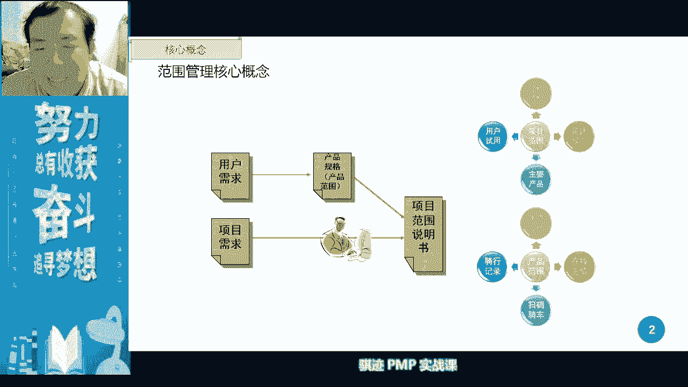

就是我们项目的范围，那我们的项目管理当中，要极力避免什么镀金和范围蔓延对吧，我们讲过了，镀金呢是主动讨好范围蔓延呢是客户的，客户强迫团队要去做这两个事情呢，都是在没有什么没有做变更的情况下去做的啊。

所以它无法纳入绩效，所以这些东西呢会和我们的pmi的规范。

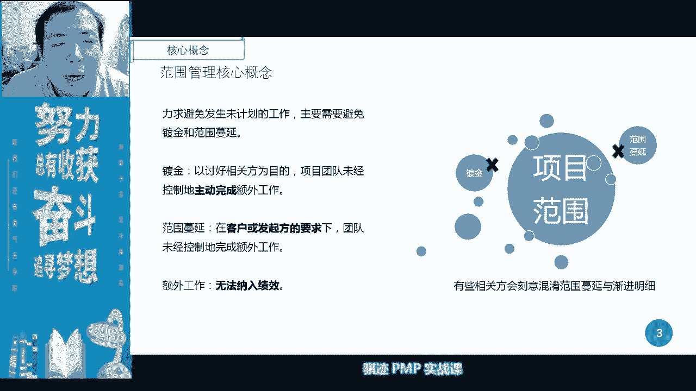

项目管理理念相冲突，好，那么我们讲项目管理当中，我们根据不同的项目生命周期类型，或者不同的不同的管理方式啊。

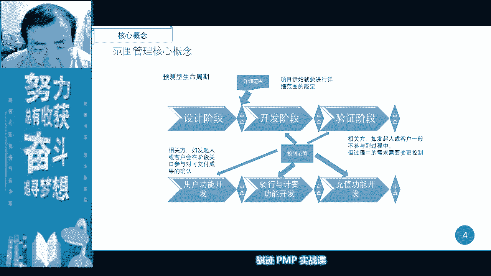

ok好我们举了一个呃扫码骑车的一个例子，然后呢举了一个，后面还举了一个阳光养老院装修的例子对吧。

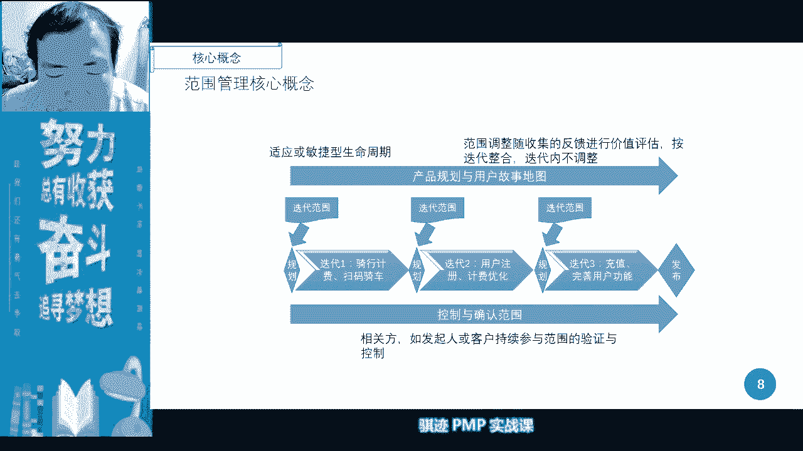

那么重点内容呢我们是稍微这过了一下，然后呢我们讲项目房项目的范围管理当中呢，分为这样六个子过程对吧，第一个是规划，第二个是收集，第三个定义，第四个分解，第五个确认，第六个控制，那么规划范围管理呢。

我们讲就是一个树立规矩的过程啊。

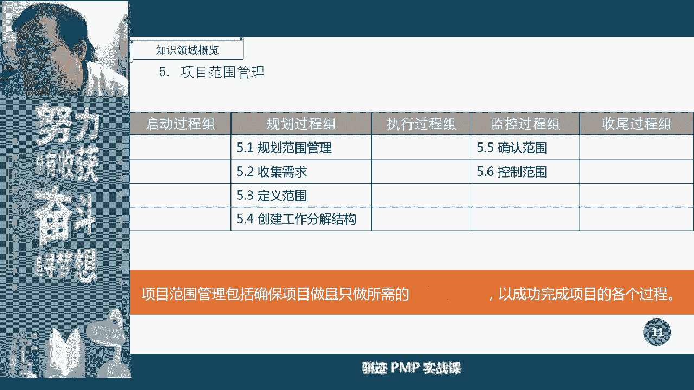

树立规矩好，我们上节课讲了一个如何去树立规矩，这样一个过程啊，我们过程内容都讲了，咱们就不再详细讲我们的中间的内容过程，所以如果大家呃有些东西还不明白啊，大家可以回看一下上期的内容啊，那么收集需求里。

我们讲也会有各种各样工具会去收集，我们会用什么原则。

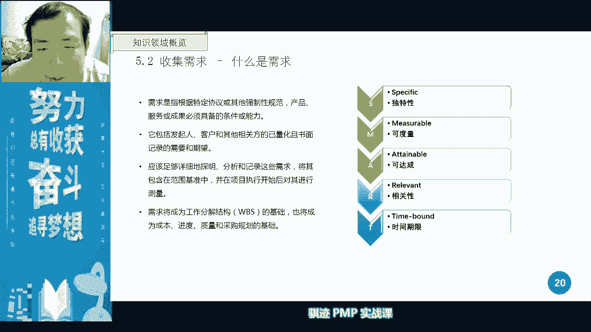

smart原则啊去做啊，但smart不是偏偏要固定要考的啊。

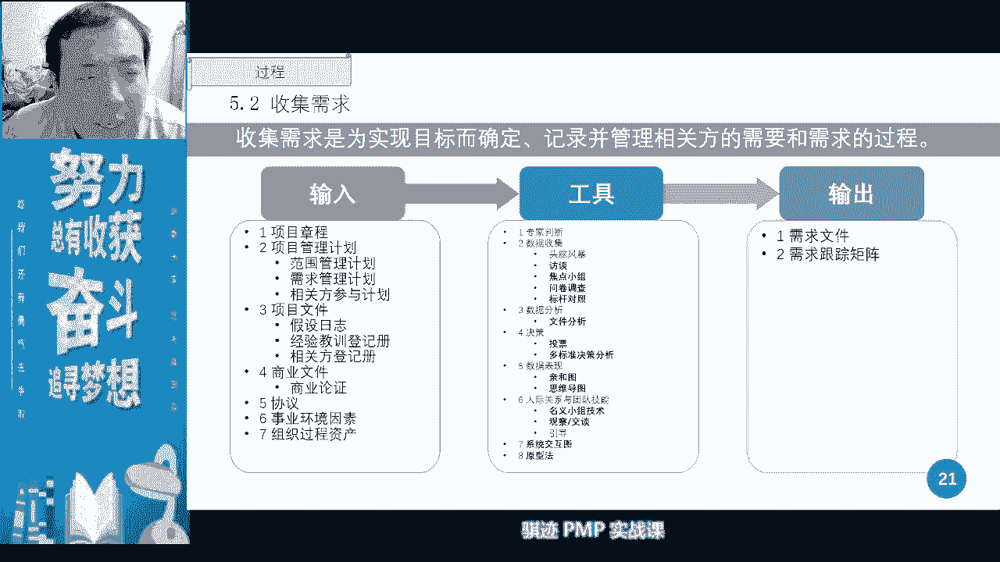

那么收集工具收集的需求当中，我们会有什么访谈，焦点小组教就经调查标杆对照。

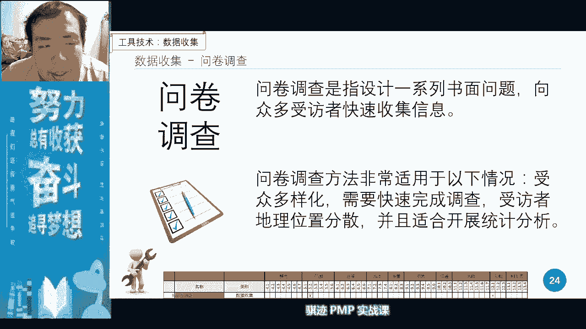

所以要记住这四个工具，这四个工具经常都会卡啊，这四工具的特征反弹是一对一的，机密性较高的工具。

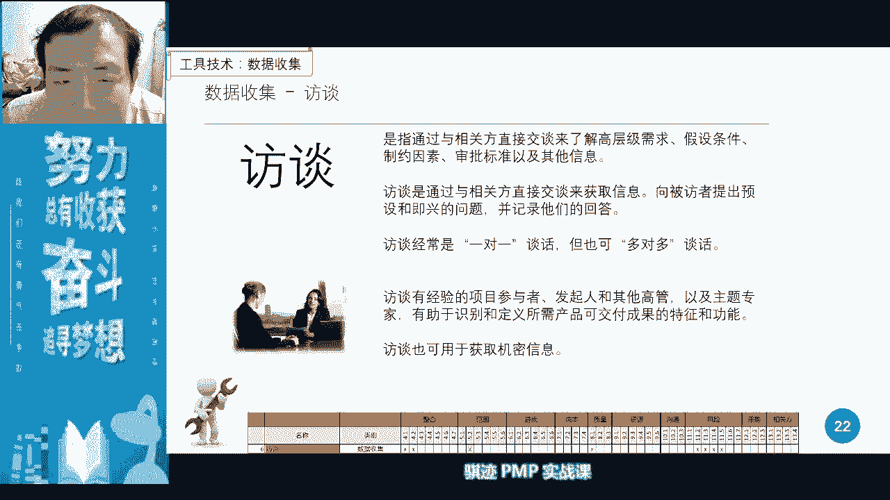

那么焦点小组呢往往是什么，让用户在一个自然方式下，用启发的方式去让他们去啊，进行信息共享和对于我们产品成果服务的。

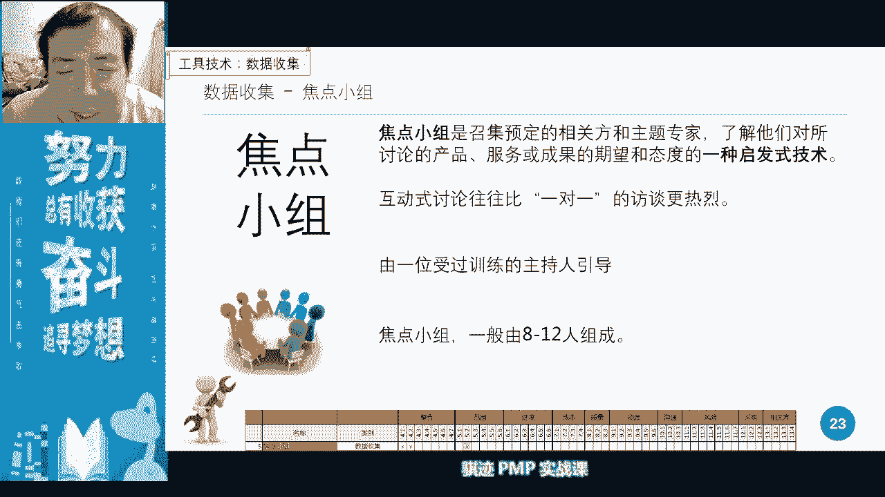

一种期望的反馈对吧，调查问卷呢快速标准化，大规模快速收集。

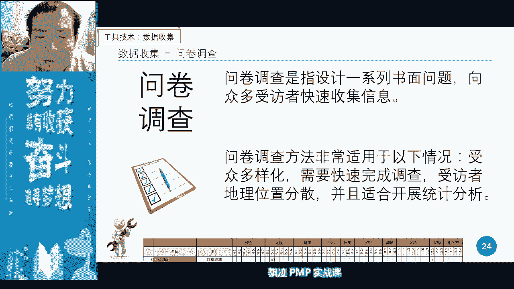

适合地理位置分散，但是缺点呢设计问题非常难，标杆对照呢是我们快速的去运用啊行业的标杆，然后作为我们的一个需求的和需求内容的收集。

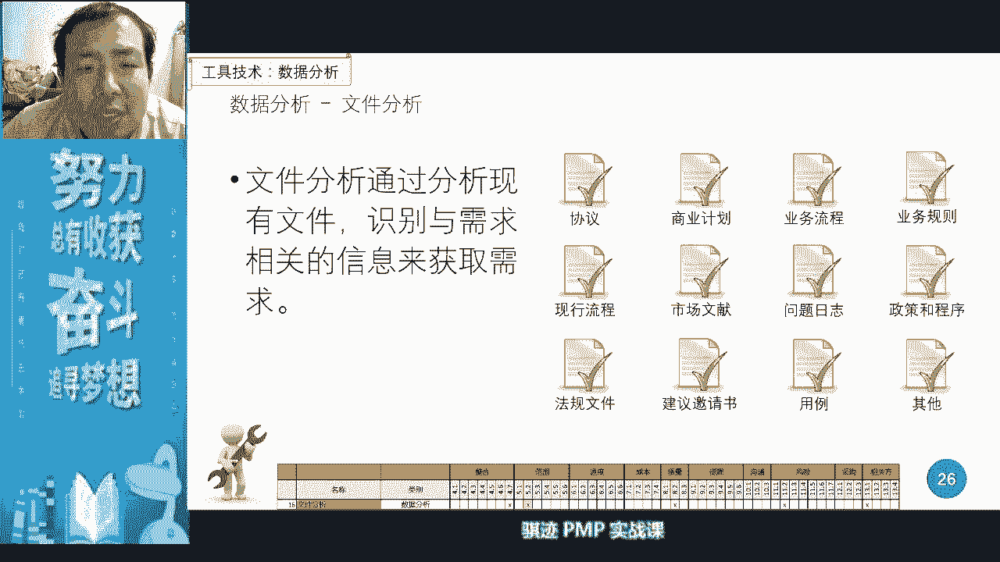

对吧，这些东西呢我们都后面都已经讲过了，然后亲和度大家记得完啊。

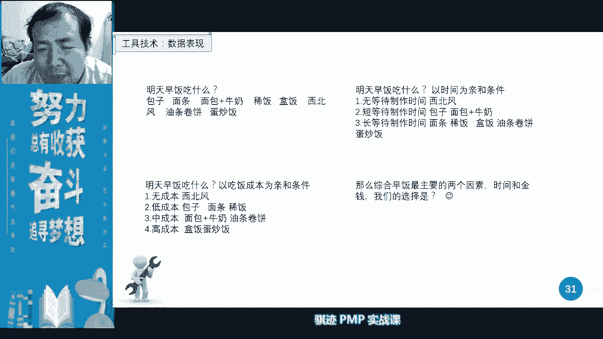

我们早饭吃什么了啊，最好的还是吃西北风是吧，行名义小组啊，q f d啊，需求文件，那么最后呢我们在我们在需求的收集当中呢，最后说了两个东西。

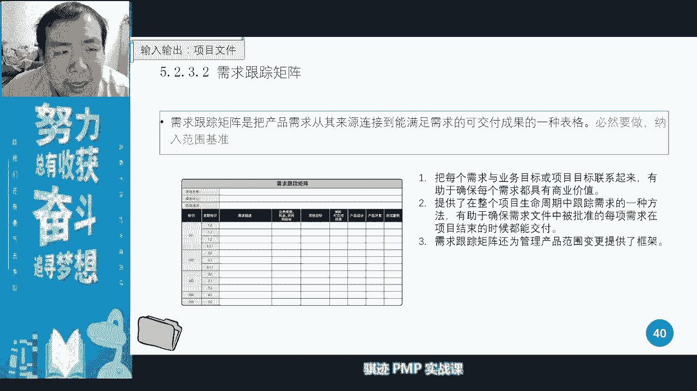

文件很重要，一个是我们的需求文件，记得吧，需求文件呢是所有的需求都要登记上去，不论向官方提出什么样的荒唐理由，只要他正式提出了，你就能把它登记进去啊，但是呢他未必一定做，那是要做的呢。

肯定会体现在需求跟踪矩阵当中，但是说第一次更新，需求跟踪矩阵当中的那些需求呢，还有可能会精进一步，经经受什么项目经理的我们的一些啊，那裁剪只有纳入到我们的项目范围，说明书当中来呢。

才会成为我们正式的一个需求啊。

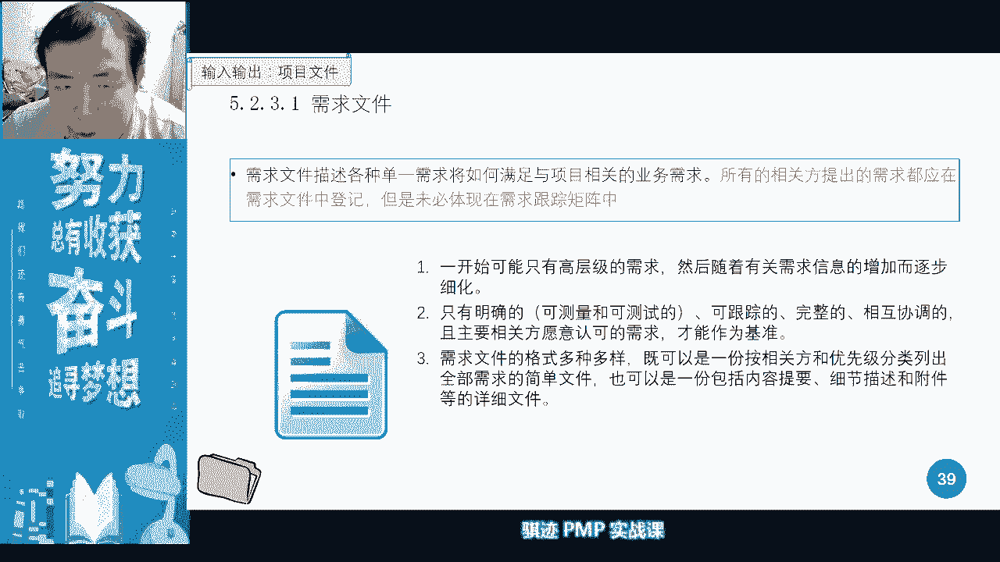

正式的一个需求体现的范围当中，所以因因此我们开始今天的课程内容啊，我们稍微花了五分钟时间过一下，快速过一下，ok啊，那么我看一下啊，怎么掉线了，怎么只有两个人在啊，等等稍等，好我看一下。

怎么会只有两个人在，很多人掉线了吗，稍等稍等啊，我觉得可能有点问题啊，大家可能稍等，嗯都在呢，但是我为什么看在线人数这么少啊，我们稍等一片刻啊，啊这样火我们火力全开，然后我们火力全开的。

然后让所有人所有在现在在直播间里的人，全部在公屏里打，打一一打一打一打，在直播间里打，我看看有多少人，那我看到直播间里的人数现在很少，只有16啊，所有在直播间里人打一啊，我我看一下，因为我也没有掉出去。

但是我发现在线人数突然降的很少，只有十几个人，我来观察观察一下啊，稍等我来观察一下，好在直播间的打一个一啊，再打在直播间的统统都打一个18 20个，那我让我让我让我们学校的技术人员看一下，好吧啊。

稍等啊，显示有问题是吧，我来问一下技术人员，稍等啊，因为我怕有些东西有些东西掉出去啊，数字再重新上升啊，显示，显示有问题啊，我不知道，但是你们不能说有些人啊，我们有些同学，我们有些同学打了一。

他就一定在啊，因为还有很多人都不止，还有很多人不止，因为我们有我们这个课堂课，这个课程系列会有很多人啊，会有非常多的人，稍等我们稍等几分钟啊，没关系啊，后面的时间充裕，啊噼里啪啦打字声。

ok我们很好啊很好，然后，在的人都打一啊，点赞都打打一和点赞，然后我来看一下到底有多少人还在嗯，没有问题，估计估技术人员说，可能是我们的系统显示有问题啊，大家如果都在的话，ok没问题，点赞打一啊。

刷一下，ok如果没有问题的话，那么我们就继续开始啊，因为我担心那些有些同学掉了啊，错过课程就不太好了啊，ok啊好谢谢大家啊，我看数量还行，服务器出问题了，为什么程序员出来干活，不是应该运维的干活吗。

好好好，那我们继续开始，好的啊，今天有点波折对吧，天气不好，然后服务器有点有点小波动对吧，好，那么我们讲，我们接下来要学的的一个过程是什么啊，第三个子过程是定义范围，定义范围是什么意思呢。

啊是指我们详细的去描述一个产品成果，服务的边界和他的标线收标准啊，所以它的定义当中有一个很重要的东西是边界，我记得在我们上一次课，我们上周的课结束之后，就说啊项目的定义范围，他做的什么事情和什么内容。

和我们的啊，而范围呢定义范围是我们更多的是我们的定义，它的边界就是人的轮廓在哪里，我们讲如果用一个形象的比喻来说定义范围，就好比说是什么是人啊，女呃女娲大家知道中国人是女娲造出来的。

是老外是上帝造出来对吧，我上面讲过啊，中国人定义范围，那么就是女娲啊，什么捏人对吧，那么女娲捏人的时候，他先怎么捏的呢，它定义范围就是先有人有一个躯干，然后呢有一个身体躯干啊，然后有一个双腿。

有个双手四肢，然后一个脑袋对吧啊啊，然后呢再进一步呢，四肢当当有有我们的手指脚趾对吧，然后我脸上有五官对吧，然后再加上一些头发，然后再加上一些体毛，加上一些器官组成人的整个轮廓范围。

但是女娲定义完完人之后，她为了能让人能够变成一个活生生的人，能够动起来，那么他要定中间人的身体当中诸多的细节，才能让人动起来，对不对，这个诸多的细节就是人的内部的构造啊。

人的内部构造什么东西构造成的是我们的血肉，神经啊啊体液细胞对吧，血血液，然后诸如此类这些东西啊，这些东西构成这些东西是我们身体的细节，但是可能每一个人身上都有某些很小的细节，可能都略微有些不同。

但是大致都符合一些医学标准，但是这种东西呢定义呢非常的详细，不可能在对一个人的简单描述当中，像我刚才所说的，我们的四肢啊，躯干啊，人的五官啊，脑袋啊，这东西就这么轻易地描述出来。

所以这些东西呢是人的细节的一些底层，我们称之为w bs，而一个嗯一个人，任何一个人啊，除了极个别的同学，大部分都是什么，有四只对吧，躯干啊，脑袋啊，五官这种方式，这种这种组成方式所组成的啊。

所以这就是一个项目的定义范围，那么项目先要定义一个什么范围呢，就是说我在一个项目当中，我要定义哪些事情是我要做的，哪些事情是我不要做的，那么为什么要定义有些事情要做，而有些事情不要做呢，啊请问啊。

有没有同学想过项目在定义范围的过程当中。

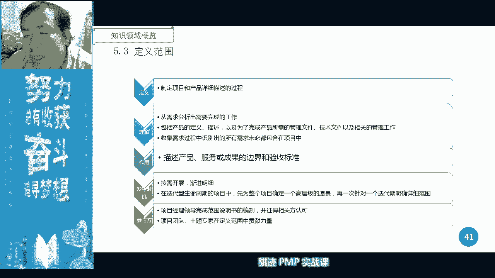

会定义一个项目到底有哪些东西是要做的。

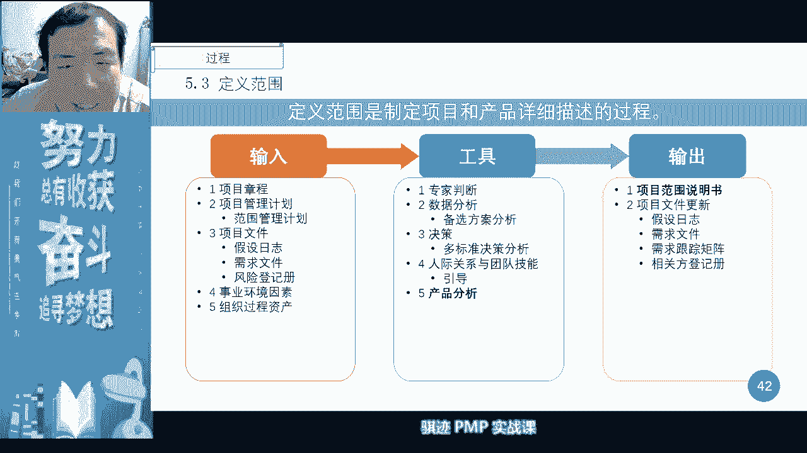

哪些东西是不要做的啊，那么为什么要定义哪些不属于我们的项目，不属于我的项目啊，请在回答的公屏上告诉我为什么有，为什么项目当中，会有哪些东西是不属于我们的项目，啊这个非常考验你们对项目实践经验啊。

实践经验呢也有考验啊，防止镀金和蔓延，ok啊，这个答案呢也非常好，very good啊，这从理论上回答的非常好，防止镀金蔓延，我就写了哪些项目属于做，所以如果相关方要求我们做。

我们就可以说这是不在范围内的啊，然后如果团队要做，我们就是说团队说不允许团队做，因为他不在相互发好，非常好，这个答案非常好啊，那么在实践当中呢，在实践中还有哪些东西。

还有哪些原因导致我们必须要写不属于项目，控制成本嗯也可以吧，便于城墙，蒋丞我可以啊，便于讲成这个略牵强一点吧，好吧，略牵强一点，好嗯那么我说吧好吧，那我来说啊，我们就不浪费过多的时间，一个项目当中。

为什么要写明哪些工作不属于项目，是因为你这个项目当中，如果你不写，仅写明有哪些东西是属于项目的，而不写明不属于项目的，那么会造成一个什么结果呢，如果这个项目里面呢这部分工作属于自己人做，我们内部开发。

那还好，那么对我们来说，对于因为我们都是甲方，那么对于甲方来说，那那这些事情呢呃都问题不大对吧，多花点人工能力，要采购的话，就麻烦了，如果你不写成写清楚项目的边界和范围，哪些是边界范围外的。

那么我们的供应商，我们的乙方就可能什么把这部分东西呢囊括性，我们在项目的采购合同当中，那么从而向我们多卖一些我们不要的东西，从而向我们多收钱，关键是多收钱，这部分东西可能不一定是你需要。

那么所以项目当中啊，这个东西是呃，很就是说很多时候有些甲方很多很很不注意的，是，就是说为什么要把哪些东西不属于项目，要写进去，就是因为乙方有可能会很鸡贼的，把一些甲方不是很主要的，然后呢一并卖给你。

然后多收你钱，多收你钱，就像我们经常买东西的时候就会冲动消费一样，如果你不跟营业员啊，服务员说明啊，这个东西我不要，他会说哎这个东西挺好的，来加一点加一点啊，这个东西也挺不错，放在里面啊。

然后你这个加一点那个加一点，你会发现什么，你的采购很多东西呢就超出范围去买了，实际买回来了，你发现它作用不大，就浪费钱了啊，实际上更多的甲方角都会这样。

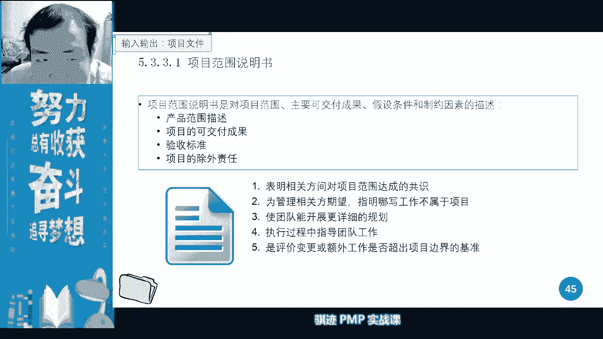

所以项目范围说明书反过来说，我们在定一个项目，定出项目的项目范围，说书书这个过程当中，主要是由谁来编写项目范围说明书的，主要是谁来编写的，项目范围说明书主要是谁来编写的啊，我把话筒调整一下。

这样大家可以听得更清楚一点，甲方ok啊，甲方和乙方那就不要说了，发钱发钱人明显不对啊，你们的回答就错误了啊，ok啊，我现在是不是话筒声音更响一点点对吧，那么我可以嗓音降一点点啊。

那么这个你就明显不对了啊，发起人是不会写项目范围说明书了，你这个太过分了啊，那就不对，一般来说一个项目，如果甲方对这个项目的内容比较熟悉的话，一般是甲方来写项目范围说明书。

scope of work叫做s o w啊，我们常写的字呢，为什么要甲方来写，因为甲方会定义项目的边界和验收标准，这样才能告诉可能潜在的乙方，这个项目要做哪些内容，做哪些内容啊，所以如果你让乙方来写的。

乙方无形之中总是希望把这个东西怎么做，大一点，做大一点，可以多卖钱啊对吧，所以要写好边界和边界之外的定义啊，之外我们不做啊，就是这个意思明白吗，所以s o w一般都是甲方来写，但是会有一种情况。

甲方写不出来s或者一开始写不出来s o w，那怎么办啊怎么办，ok啊，我们的偏僻当中没有讲，但实践当中我们经常使用一个方式，就是比如说你要这个项目，你要进行招标，那么甲方如果对招标的内容不熟悉。

不范围不熟悉，连范围都写不出来，详细怎么办呢，就很容易被乙方坑了，所以它会有一种很特殊的形式啊，我们在这里做一下扩展，今天的时间是比较充裕，做一下扩展，那么他会用一种形式叫做二段制招标，二段制招标。

什么叫做二段制招标呢，啊当然我们在采购里面还会讲，就是说我们先招一个项目解决方案，然后根据这个解决方案的专家评审呢，再去进行项目的啊范围的定义啊，范围定义，那么这时候我就用例子注意采购管理当中。

我会再用这个例子，比如说你是一家医院的院长，那么你们这个医院的生意挺好的啊，然后呢医院不够用对吧，然后呢你会做一件什么事情呢，你肯定会说开一个分院对吧，开一个分院，开个分舵。

那么你会另外选一块地方开个温度，但是医院里大绝大部分的人对于造楼房，造医院精通啊，不精通，他们对于治病救人很精通，但是对造楼房造医院就不一定精通了吧，那么这个时候甲方的人。

很有可能是写不出他那样啊一些专业的诉求，尤其是医院的房子可能和普通房子不一样，还有各种各样的治病啊，医疗啊，各种各样的考量，它可能是一些有特殊规划要求的一些建筑，那么他就对他来说就更不行了。

那么只有怎么办呢，那么他就会什么找一个乙方，或者找一群乙方来给他写s o w，然后呢写完之后呢，根据最好的s o w呢再进行招标，最后获取一个什么合格的乙方去做建设啊，会有这样的例子。

所以你们记住这个例子，等到我给你们上采购管理的时候，我还在用这个例子讲采购管理当中，二段制招标是怎么招出来的啊，ok好，那么先明白一点，那么我们刚才这个描述当中。

就是说我们通过对产品详细描述这样一个过程，然后呢定义的产品的边界，那么这个产品边界当它被定义出来之后，它就天然的会拆除，有可能会拆除两部分，第一部分可能是什么啊，甲方自己做的项目范围。

那么他就会直接进入的吗，甲方的项目团队呢去进运作，但是第二部分呢它有可能是自己不能做的，那么就开始什么开始，那么乙方会拿到这个sr的w，以及它所对应的合同进行一个什么项目的趋势。

所以一个甲方的范围定义是，另外一个乙方的项目范围输入啊，不知道你们明白这个意思吧，啊所以这个过程其实是一个相关联的过程，相关联好，那么只有把这两部分都完成了，才能说甲方项目，也有可能对吧。

最后呢都就都变成了一个什么东西啊，都变成了一个采购的s o w，采购的合同里面的s o w啊，会有这样好，那么我们再回到乙方角度，因为p m p的课程内容我们默认是乙方角度，那么我们的项目定义范围呢。

就会在项目初期就会展开，因为我们讲过项目是范进程范围是十起手的，没有范围，进度和成本都是白搭对吧，那么那我们就开始定义范围了，我们肯定定义范围肯定是从一个高层次，定义到低层次对吧。

那么首先定义肯定定义高层次，但是在高层次定义当中，我们依然会遇到那个问题，低层次所有东西定义清楚，答案是未必，尤其是复杂的项目，所以我们会进行迭代的重复定期更新，这个迭代重复定期更新。

就叫做我们的发生时期当中呢叫渐进明细，所以定义范围这个过程工作呢会定期展开，不仅不仅仅执行一次，哪怕是预测性，但是呢我们又要求什么预测现象，就尽可能详细范围，这是不是矛盾，这不是矛盾啊。

所以我们一般会在预测型当中，我们在初期尽可能完全定义什么高层次范围，因为只要有高层次范围，我们就可以进行什么一采购招标对吧，因为采购招标不用很详细的范围，只要高层次的界限和哪些做。

哪些不做的一些边界和一些条件就可以，第二呢我们预测型是按部就班的做，所以并不会直接就将未来要做的工作，一下子做完，所以我们可以先近期详细，再远期粗略去完成工作啊，会是这样一种情况。

所以项目经理呢应该带领项目团队来完成，我们的范围说明书的制定啊。

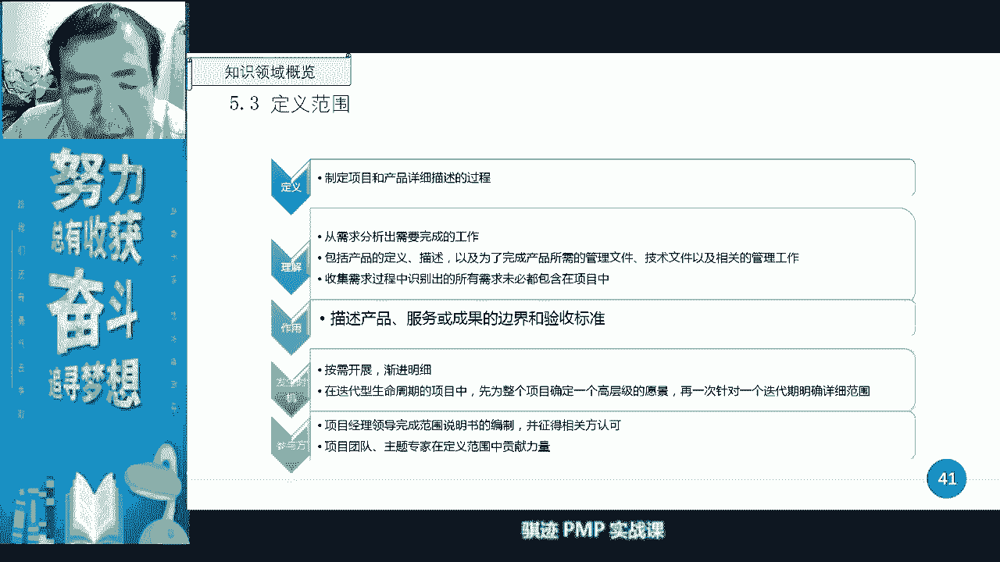

这是我们定义范围的一个过程和逻辑过程啊，不知道大家明白了没有，所以这是我们项目范围，达到项目范围基准的第一步，制定sow项目范围说明书，这是一个非常重要的输出啊，那么项目范围自然也来自于。

依据与项目章程所描述的项目的高层次的描述，以及我依据我们之前利好的规矩，什么项目范围的范围管理计划，然后也依据什么需求文件依据，依据我们的我们的需求的啊，呃需求跟踪矩阵对吧，然后各种需求问题啊。

这个pp当中呢略有一点点差池对吧，这里其实没有列需求跟踪矩阵，其实应该列需求跟踪矩阵啊，所以这个p p t上略有差池，其实两边都应该有啊，两边都该有ok啊，但是因为我是在这p剧场改的。

我怕你们改太多就看不懂，所以我就我就没有改这个，所以两边其实都有需求跟踪矩阵，但是呢在我们输出之后呢，定义完范围之后，输出需求给的女人是最精确的，我们上来呢就会把需求呢我们讲过，需求会分为三类。

第一类叫做基本需求对吧，第二类呢叫做期望的需求，第三类呢叫做兴奋的需求，我们一上来就会经过初步的判断，会把所有的基本需求，和尽可能多的什么期望需求，放在我们的需求跟踪矩阵里。

然后呢项目经理在定义范围这个过程中，再进行这一个动作，叫什么啊啊叫做裁剪，通过裁剪来进行项目范围的最终确定，在最终确定当中呢，我们最终的需求跟踪矩阵呢会再做一些微调，然后最终确定范围，当然了。

这个东西里边涉及合同，我们讲又要讲要和合同的范围相匹配，对吧好，所以他受很多方面制约和因素制约的啊。

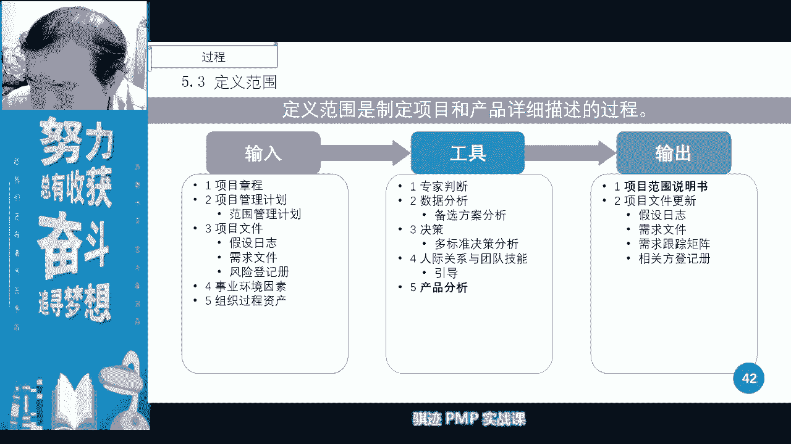

好，那么我们首先来讲，定义项目范围的当中的一些工具技术，第一个工具技术叫做备选方案啊，备选方案，背向方呢是指，我们可以有多种方案去达到一个目的，但是不同的方案可能采取的路径是不一样的。

我们看看哪个是最优的，但是注意备选方案所定义的范围，并不一定说，这个范围就一定会按照这个方向去进行，因为随着项目的进展，我们可能备选方案会改，那么项目的范围也有可能随之安徽产生修改啊。

那么想打个比方说我们要提高经营效益，我们可以干什么啊，增加产量，降低成本和提高价格对吧，那么在降低成本当中呢，我们可以在一些措施啊，那我问你们降低成本当中，哪个措施是最立竿见影的，哪个措施呢又是什么。

你们觉得最不好的，最不好，啊我喝口饮料啊，我喝口巴黎水啊，不要以为在喝啊，老师没这么牛叉，那么我问你们，你们觉得哪个啊，我们就这就这个例子来说啊，我们稍微扩展一下这个例子来说。

六啊你们觉得六是直接立竿见影的吧，改用降低成本的原料啊，就偷工减料了，提高价格，你们觉得学长ok啊，各有各的说法，我说现在社会当中啊，现在社会当中啊，我们能看到的很多的其实都已经看到了。

其实都已经做了啊，现在社会当中很多场景当中，在这个市场当中，资本最喜欢用的是什么，是三第二种降低成本当中的三啊，裁员和降低人工工资，因为人的成本是越来越高了，而且人的成本存在一个特性是1l难降啊。

工资是一容易涨，工资难于降工资对啊，六偷工减料是降低成本，那个其实六是最不好的，对其实六也是最不好的啊，对于产品来说最不好的，对于人来说啊，裁员和降低工资是最不好的，对吧啊，所以我们每一个打工人。

都不希望什么被裁员或者降薪，对吧啊，ok啊，这个是一个就是你从这个当中可以选择，这，你看有时候当我们面临一些怎么说呢，啊非常不好，就做你个项目经理，作为一个项目经理将面临一个非常好的困，非常不好的困境。

需要提高经济效益，我们可能项目的效益不佳，所以我们要进行增加效率，增加效益要提价，可能很难提对吧，在很多情况下，市场竞争提价很难提，增加产量的话也不一定卖得出去，对吧啊，也不一定能够增加得了产量。

所以降低成本成为很多企业的无奈的唯一选择，那么在降低成本当中呢，所以就会这些选项对吧，其实很多的选项企业都这样做了，很多企业都在做了对吧，大家可以看到，对不对，它所以不是b型的，必然可以相同。

第二设备技术改造降低消耗，这个呢也不是必定都能行的啊，所以很多的企业更倾向于使用什么样的方式啊，三裁员对吧啊，很多节更多的倾向于三啊，那么说三会降低质量，影响质量吗，不见得啊，管如果管理的好的话。

三并不见得一定会降低质量，那么四培训员工提高效率，这个见效就更慢了对吧，批量订购原材料，降低单价，买的不好买，但是原材料买的价格的顶峰，只有增加我们的单价对吧，六改用降低成降降低成本的原材料。

ok 6是可以的，但是就属于偷工减料对吧，带来一系列的质量风险啊，所以看到项目经理，有时候面临的就是这样一种什么困境，有些事情呢直接能够带来效益，但是危害很大，有些事情呢不会降低很多的原则和品质。

但是见效很慢，但是项目当中有时候确实很残酷，就是说你做不了很快见效快，你有可能就会被淘汰对吧，所以备选方案有时候呢，就像项目经理的工作一样，为什么提到就像项目经理工作一样，你有时候身处无奈。

只能进行妥协是吧，所以有时候项目经理很多做很多裁剪啊，做很多个解控制啊，甚至说有时候被迫去裁剪工，降低项目员工啊，员工的工资啊，裁剪我们项目团队成员啊，诸如此类，这些工作有时候是很无奈的，很无奈。

并不是说项目就一定很丰盛，很无奈啊，有时候项目当中就是面临着这样的无奈的东西，所以你你要明白，但是这些东西东西呢绝大部分的情况下，别人是不会去理解你，不会你，你不会期望你不要期望一个被你降了薪。

或者被你裁了员的员工能够理解你对吧，你也不要期望什么你用降低成本的，降低成本的原料偷工减料，然后给客户带来一个不满意，然后客户会原谅你，不会啊，这些代价都让你自己默默地承受啊，默默地承受好。

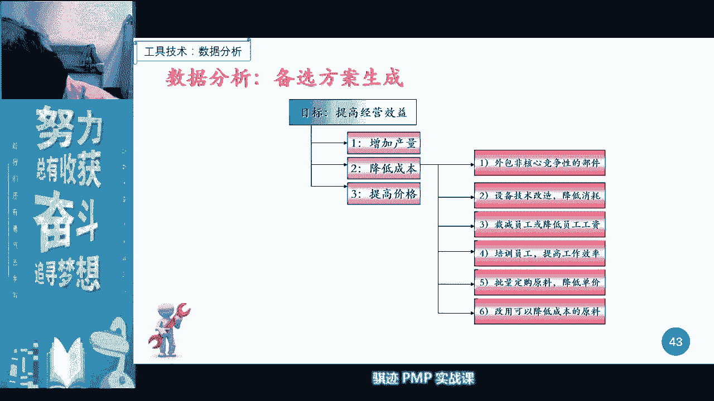

好我们再看下一个，那么我们在项目管理当中，我们要进行我们的范围定义，我们可以做一个东西叫做产品分析，产品分析可以用于定义产品分析，针对我们的产品和服务呢，进行逐一的问答和交流，然后合金啊。

成果的一种转变啊，但是这个呢没办法细说，因为不同行业都有自己的一些方法啊，一些方法，比如说产品分析，需求分析，价值工程价值分析等等，每个行业不同的产品都有自己不同的方法，所以没办法统一描述。

但是他没有办法细说，因为不同行业差别太大了啊，你们只要知道，产品分析是我们定义范围的一个很重要的工具，就可以了，好那么我们的项目放，那么我们在项目当中，我们对产品呢进行了定义之后呢，输出的最主要。

最主要的一个结果就是项目范围说明书，第一产品范围的描述，第二产品的可交付成果，那么有人说，产品范围的描述和可产品可交付成果，是什么关系呢，就是范围指的是你的边界在哪里的边界在哪，可交付成果呢。

最后要输出什么样的结果对吧，出什么样的结果啊，所以这两个东西呢并不一定是一样，事情也有可能是不同的，就比如说我们说我们项目产品范围是，为客户创造一个苹果，以及种出这个苹果的苹果树士项目范围。

但是我们的可交付成果是什么，仅仅指客户能够验收的，可以吃的苹果，对吧啊，我们不会把苹果树交付出去，对不对啊，因为客户不需要交苹果树，然后还有验收标准对吧，我们讲苹果应该是什么，有多少大小对吧。

比如说我们以苹果为例，有多少大小，那么有有怎么样的标准啊，有多少重量，甜度如何，对不对，会有一定的标准，那么我问你们苹果能不能做出一个标准的，我们就这个例子来说，苹果能不能做出一个标准的验收标准来。

可以嗯，有些东西可以啊，非常好啊，那么为什么可以呢，那么我可以举个例子告诉你们，苹果是可以的啊，所以我们想象当中很多东西，比如像农产品啊，很多东西其实都是可以的，为什么苹果是有苹果期货的啊。

很很有意思啊，苹果在我们的中国的期货市场里是有期货的，凡是有期货的东西都可以被标准化，因为期货就是一个高度标准化的标准合约，才能进行交易的，对吧啊，所以苹果是可以被标准化的，我们所以我们工作当中。

很多你看似不能标准化的东西，都是可以通过一定的手段标准化的，比如大小体积，重量和含量之类的这些东西啊，特性这些都是可以标准化好，所以这就成为了我们的一些标准啊，这就成为了一个标准。

所以验收必须要项目范围书，如何去验收以及验收的方法和验收的标准对吧，我们要用什么样的方法验收，比如苹果我们的验收方法是什么呢，直接咬一口能不能啊，啊不行，为什么不行啊，是因为苹果的里面不知道我们咬一口。

你说吃的是甜的，我说不甜的，要有一个标准的方法啊，所以项目方案时一定要写明验收标准，以及他的验收方法啊，这点是由他们写明的，那么这个验收标准将会在后面使用到，在哪个使用到，一定要记住啊。

项目范围书所在的定义范围，这样一个验收标准，会在我们之后的确认范围中使用的，所以如果在确认范围中，我问你们，我们在哪里定义了我们的，或者引用了我们引用了哪里定义的，我们的验收标准，你要记住。

要回答是在我们的定义范围当中使用的，定义的啊，然后在验收我们的确认范围当中，外部验收确认范围当中去使用啊，这点千万不要忘记，在另外一个地方呢也会引用到，就是说我们s o w的字后面的字典。

我们后面会讲到，也会使用到验收标准啊，这一点要特别注意，以后考试当中问你营收高从哪里来啊，范围说明书里定义的啊，但是有一点注意啊，质量验收标准哪里来啊，质量验收标准和验收标准是两回事。

质量验收标准属于质量一块的验收标准，但不是所有的标准都是质量的验收标准，另外责任嗯，卡了吗，ok没卡，刚才卡了没卡，老师有点卡，今天好卡，ok到底砍没砍啊，那绝对没有卡的同学打一啊，卡的同学打二。

没关系，告诉我一下，卡吗，我这里的网络好像挺好的，你们稍等啊，等会。

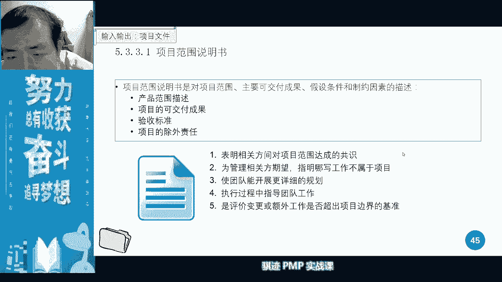

你们稍等。

老师这里挺好的，你们看见我的屏幕了吗，挺好的啊，我的网络基本是正常的，基本是正常的，一阵一阵啊，是不是自己缓冲，有自己这里有点缓冲啊，不卡一阵一阵的好吧，我这里的网络普卡，但是我不知道平台怎么样。

但是我觉得我的直播好像今天确实呃，在平台上好像略有点情况，略有点情况，有点恢复啊，可能啊，这是可能是平台的关系，ok啊，但肯定不是老师的关系，我拼一直开在这里。

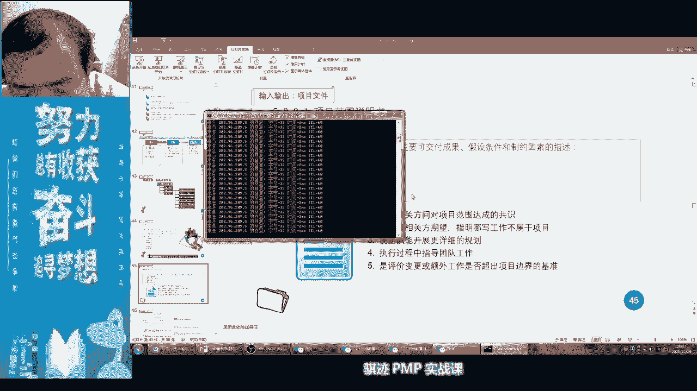

好吧啊。

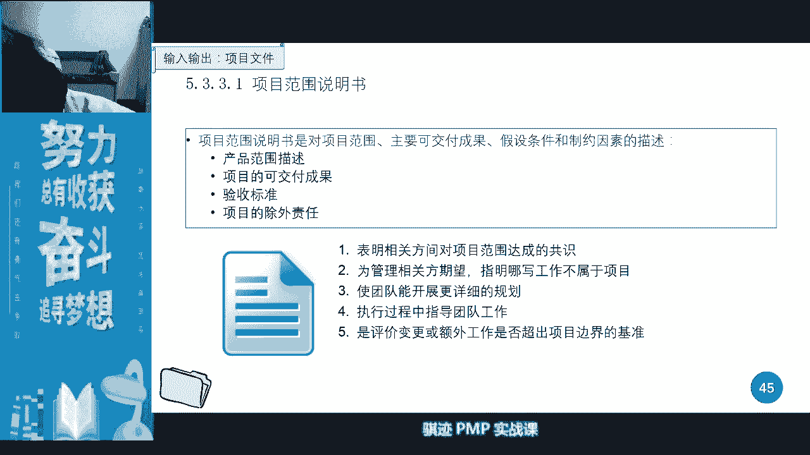

就是拼局域网，同学你看清楚这个ip是公网ip。

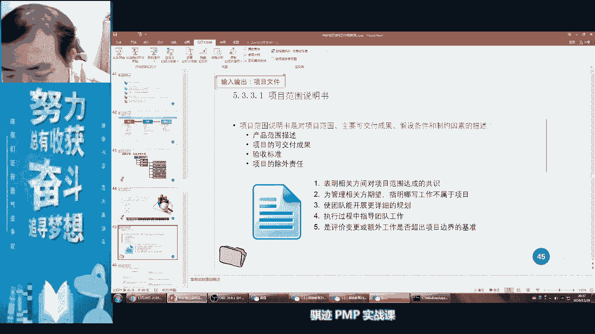

这个是上海电信的dns，202096。209。5啊，同学啊，ok啊，老师也是搞it出身的。

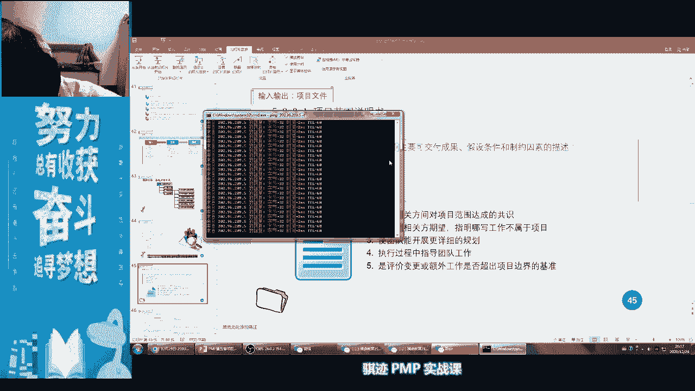

啊所以这个请不要质疑我，好吧啊，这个请不要质疑我，这个还是会的啊，这个这个都不会，我就没法混饭吃了，不能恰烂饭了对吧，好那么我们继续讲啊啊如果有些同学卡的话，大家忍受一下或者刷新一下啊之类的啊。

这个也没有，我也没有太好的办法啊，好那么我们继续看，那么在定义项目范围说明书当中，那么我们会表达相关方对范围的达成的共识，所以要跟客户确认，所以如果你是乙方帮助甲方去定义的话，如果你是一个甲方。

你定义出项目范围说明书去招标，招标招了之后，一定要让乙方，关于这个项目范围说明书做一个什么确认，我们可以达成啊，要在合同里写明可以达成或者表达的意思，请不要质疑我就卡住了啊，ok啊，又卡了一下哦。

这个有点。

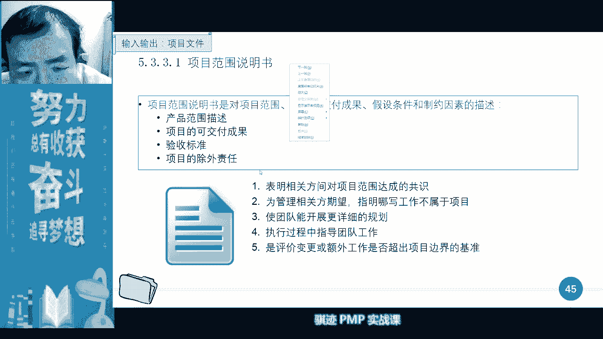

哎呀这个怎么说呢，啊我去找一下学校，技术稍等啊，稍等，好我跟学校技术沟通了一下啊，我的拼音应该是非常正常的，但是拼只能解决死活问题对吧。

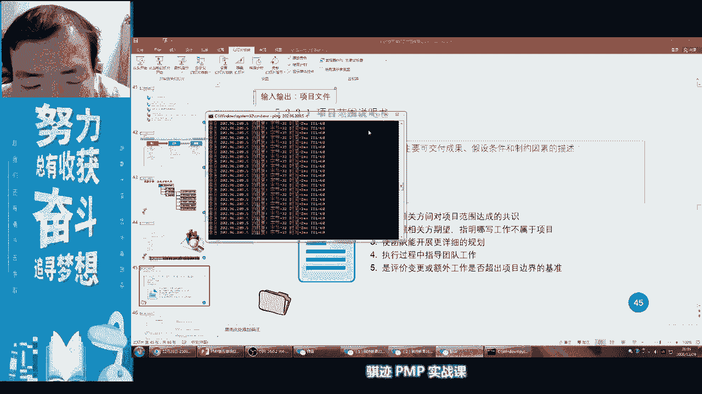

不一定拼正常，就一定是网络呃，正常啊，这个倒是有有有有老师是还是有清醒的啊。

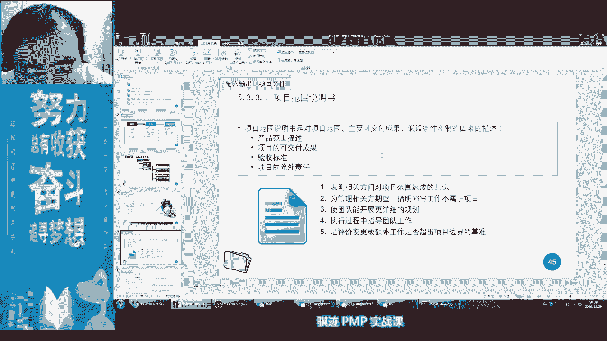

知识的认识对吧，好，我们继续来吧，好那么接下来那么我们继续讲啊，那么我们在工作当中，所以要所以要注意一点，就是说如果你是甲方和乙方，那么分别要和对方确认我们的工作的啊范围啊，达成一个一致啊。

尤其是你是乙方，一定要跟甲方确认对吧，否则他不付钱对吧啊啊那么以此为基础，我们要以今后的项目，要以项目范围说明书为基础，展开更细的规划，也就是说w bs啊，这是非常重要的啊，也以此为主，看看是否过界。

过界了就是什么，如果没有经过变更，就是什么，就是我们的范围蔓延或者镀金啊。

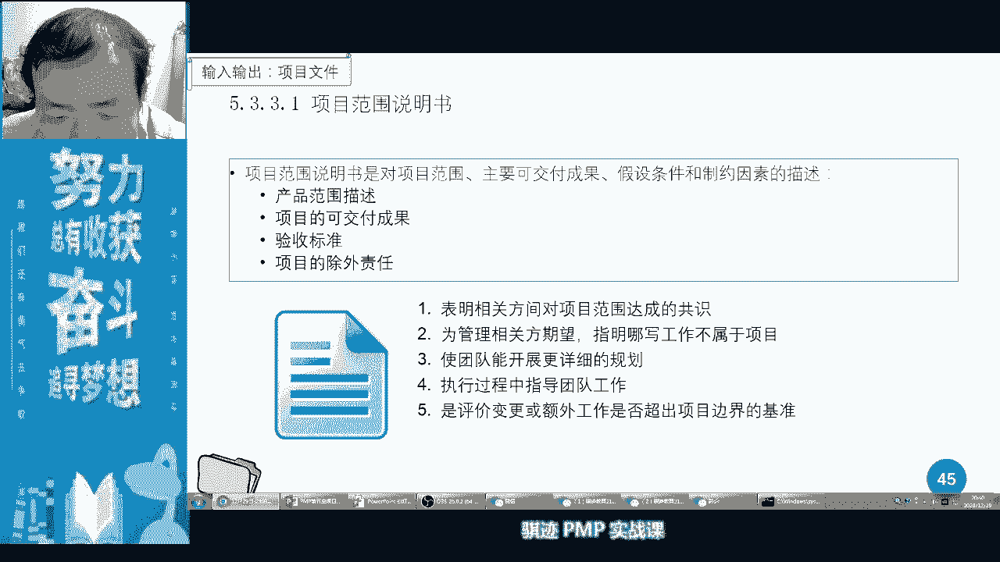

那么继续啊，这是一个项目方位说明书的事例啊，示例，那么它描写的是某某某某范围对吧，它会有产品范围的一个描述，注意描述啊，也会可交付成果的描述，验收的描述，例外的描述啊。

这是一个很常见的我们的一些描述形式，描述形式当然就是说如果你很专业一点的话，如果你的对于项目了解很专业的，你的项目描述应该是一条两条三条四条啊，要根据你的工作呃，想要工作的结果，一条两三次。

想要写的非常明细啊，非常明细，然后去作为我们项目的一个边界定义，我们也知道这里面要描写哪些做到什么程度，什么程度之外是例外啊，要有明细，那么我们项目范围说的这样一个事例啊，老年公寓改造，老年公寓改造。

我们讲老年人的改造，公寓改造呢它分为什么除旧，然后呢施工，然后呢最后一个我们要进行验收啊，就出验和中验，那么它的验收标准是渐进明细的啊，这是一些项目里边的详细一些范围，那么项目的边界是划到哪里呢。

那么这个里边所有的之类的，我们讲可以看作是什么土木，我们的呃硬装对吧，然后一些水电隐蔽工程，那么项目的制约因素就是我们要描写数学啊，早上不能太早，晚上不能太晚对吧，要在8月1号之前完成验收是吧。

这些是我们项目范围说的一个事例啊，大家可以稍微看一下，这个是一个相对还是比较简单的，但是我们在实际工作中如果可以写详细，这里应该继续写详细，有哪些地方可以写详细啊，这就是讲讲究实践了啊。

第一旧楼装修拆除，这里当中其实可以写一大堆怎么拆啊，旧楼装修拆除拆到什么，就像我们装修装修你的墙面，拆除旧墙面应该拆到哪里啊，我们经常会说要铲土铲到红砖啊，我们的我们的墙面的主体结构的砖。

是不是红色的砖，我们讲做铲除要铲到红砖，是不是这是一个标准啊，或者你随便铲两下，没有铲到底的话，是不是中间很可能产生很多的装修隐患对吧，可能会产生装修菠萝啊之类的啊，那么我们的产出要求什么，铲到红砖。

然后所有的圆圆心的结构要完全不保留的，全部都要拆啊，拆除出去，这是我们的项目要求对吧好，那么第二个比如说完成设计，那么我们完成要完成什么设计，要详细到什么程度的设计对吧，要写清楚啊。

要详细到比如说每一面墙，每一层楼的设计都要完成对吧，也有可能啊，所以这里的每一点可交付成果的，每一点都可以详细到一个，能够不容易模糊的一个边界为止，这是一个项目范围说明书的定义，边界的一个原则啊。

名字不知道，这就明白了啊，所以这也是其实说的什么意思啊，就是说如果这不是一个老年公寓改造项目，而是一个我们的啊家庭装修，那么你们知道啊，所以你们知道怎么保护自己对吧，你们可施工队去签啊。

那么你应该签的时候，家里装修怎么了，尿检除旧我们要除到什么程度，你要写在上面对吧，哪里哪面墙要铲到什么程度对吧，什么东西一定要拆掉，什么东西呢，一定要什么啊，平整整洁啊啊地面一定要找平。

找到什么程度对吧，这些都应该写的要细节一点啊，啊细节一点，但是这并不是说我们去直接定义的结果，注意啊，这只是边界，这是我们定义的一些边界啊，具体什么样的结果是这么，其实这是另外一种方式定义的。

啊那么我们会定义啊每一面墙，比如说你们家墙比较多啊，每一面墙我们讲啊a面墙啊，比如说靠南面那面墙，那么我们铲除之后，如果我们拆w bs就可以定的这么细啊，比如说是南面墙，那么这个墙面铲到什么程度。

然后呢这个墙我们准备变成呃多少长多少宽，多少厚的这样一个状态，这个是定义详细的不变色细节啊，ok好，那么我们后面会在打vbs里面再细讲细讲，不要急啊，所以这是一个项目范围说明书的定义。

所以你把边界定的越细，对你来说是越是一种好的保护啊，好的保护好，那么定义完的范围我们就开始做什么，做w bs的一个拆解了啊，w bs拆解是一个乙方项目经理的基本功，基本功啊是一个乙方项目经理的基本功。

那么一个乙方项目经理是应该负责什么，拆解wb s，那么我问你们甲方项目经理，一般情况下要不要拆解w b s，唉请在公屏里告诉我，就两个选项，对吧啊，什么啊，ok啊也是需要的吧。

我觉得那位叫古文海的同学啊，讲的好像有点道理啊，大部分情况下明明确确定价1万应该都要的啊，ok啊我们讲的是实践啊，我们讲的是实践，实践当中，如果这部分工作属于乙方的，一般情况下啊，特别情况例外啊。

如果比如说那个乙方项目经理，和你是拜把子兄弟对吧，那那那那必须要对吧，如果我们在一般情况，一般是不需要为乙方去做w bs拆解的，反相反乙方有责任，针对于甲方的s o w去做拆解啊，这是第一个。

但是如果这个工作不是交给乙方，而是甲方自行完成的呢，它是需要甲方自己去做的vs拆解，所以一般情况下是根据情况所需要的，但是对于针对于乙方的一部分，一般情况下是不需要的，一般情况下是不需要。

那么为什么乙方不推荐，尤其是不推荐甲方为乙方拆w bs呢，是因为啊注意啊，这就使用了，因为w bs是决定了我们的工作的，详细的完成的颗粒和组件的过程，如果你甲方去替乙方做了定义。

那么就代表着这个事情的规划责任，从乙方落到了甲方，乙方反而推卸了这个责任，知道吧，如果之后我们在对针对于打bs开始工作，那么应该由甲方，应该由乙方所负责的那些职责被转移到了乙啊，甲方身上。

那么乙方就免责了，这是不应该的对吧，这应该是乙方责任，因为你拿钱就要替人干活啊，所以在这种情况下，你们知道s o w如果可能的话，尽量由甲方来去定义，但是如果把一份工作交给一部分工作，交给了乙方。

乙方拿到的s o w，然后拆解为w vs，这样一项工作是由乙方自己来完成，甲方仅仅参与什么东西啊，拆解完成之后的共同审核和确认啊，注意这一点，一定要注意共同审核和确啊，这是应该是乙方做的事情。

哎有些同学说各管各的对，这是对的啊，各管各的，这说对啊，有一说一，所以创建w bs就是创建工作分解结构，是我们项目范围基准呢最关键的一步啊，制定出项目范围之内，所以我们的工作从一开始的立规矩到收集需求。

从不wifi的需求转换成了规范的需求，然后登记到我们的需求文件和需求跟踪矩阵上，然后以此为依据，制定了一个粗的范围，叫做项目范围说明书，然后最后一步就是制定细的项目范围，叫做w bs，那么当然了。

w bs的中文大家都知道对吧，叫做工作分解结构，walk up breakdown structure，work breakdown structure，工作分解结构，那么w bs也一样。

一般都是在项目初期第一次展开，但是呢会在项目过程中渐进明细，渐进明细，那么如果是迭代型呢，就会什么在每一次叠开之前进行展开啊，展开啊，所以无论是迭代还是预测，一般情况下都会见经理。

除非你的项目比较简单啊，可以预测，很容易预测，那么就一下拆完，所以一般以方式采取渐进明细的方式啊，那么我们会讲在乙方这个拆的过程中，我们叫我们叫分解的过程中啊，专业词语叫分解啊。

我们会讲一般会怎么按照近期的详细远期做，近期拆到比较低的层次，远期比较高的层次去做这个事情好。

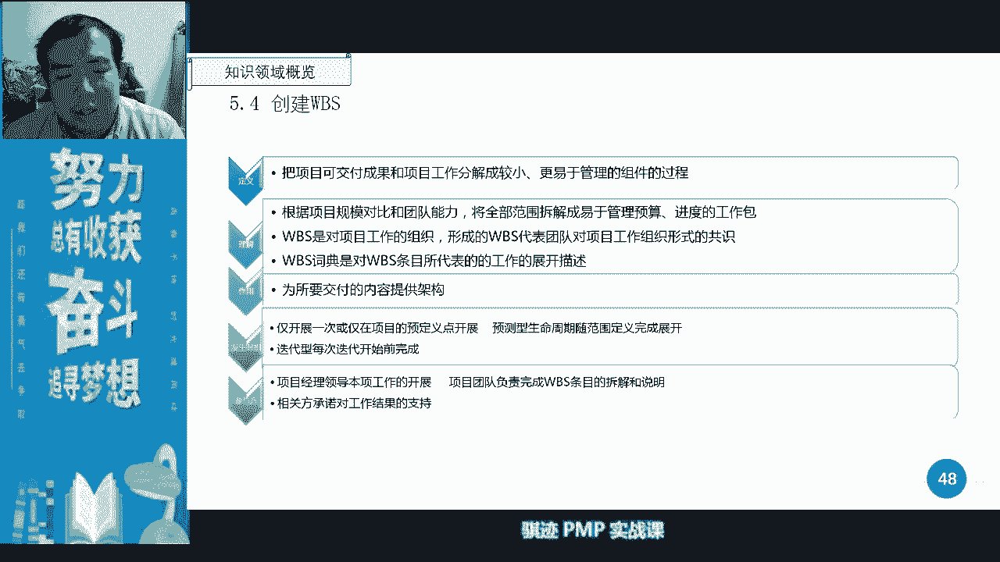

以及它中间各种概念还是比较多的啊，那么创建w bs呢，是把我们工作结构呢分成更小，更易于管理的过程啊完成。

那么什么是w bs，就是工作分解结构，那么工作分解结构一般拆拆拆拆拆，我们分解到什么样的程度，不分解了，这个程度不分解了啊，这个这个有点绕口，有点绕脑子对吧，最小的一个工作结果单元。

可以认为只认为它是项目工作结果的，最小的一个单元啊，最小的，那么我们继续来说，我们继续来说，我们还是按照苹果树来说好吧，那么讲用户需要的工作呃，呃内容是什么，一颗苹果，我们这个项目呢。

要分为苹果和苹果树两个范围来做，因为用户需要苹果，但是我们需要种苹果树，那么如果我们把苹果树分解，我把苹果的分解分解分解，就是我们最终需要最细的是什么，能够长出苹果树的那个枝芽对吧，是我们的。

但是要让这个树的枝芽长出苹果，我们需要哪些工作啊，要施肥除虫对吧，后果对吧，要把苹果可能要用个用个套子，只套塑料套，要套起来对吧，然后呢要减脂，这些过程都是一些动作，它不是结果，而是动作。

它会在我们后面课程会讲，我们周四课程会讲的进度管理当中，会继续解决的啊，这要注意进度管理上解决了，那么我们只是最值定义啊，我们工作中我需要什么，最终能长出一棵树上。

我们定义要能长出100个或者50个以上，比如50个以上，能够挂苹果的汁，苹果汁对吧，苹果汁，然后后面才会长苹果啊，当然要先开花的，开花花有长，想出能开花的枝，然后长出苹果，最后呢再把苹果剪下来对吧。

那么只是我们的项目范围里边的最小的啊，那么同时交付给用户的那个苹果，但是树的枝干，我们的分支的枝干，你可以想象一下啊，所以w bs的分解并不是分解到实现过程，而是分解到一个细小的局部结果的一个过程啊。

那么要分解到实现这个过程需要什么，需要在进度管理中动作把它分解为活动啊，大家可以看到啊，这页ppt，最后一期是分解到我们的成果和腰部成果，而不是分解了活动本身，ok啊这个你有了啊，有了啊好。

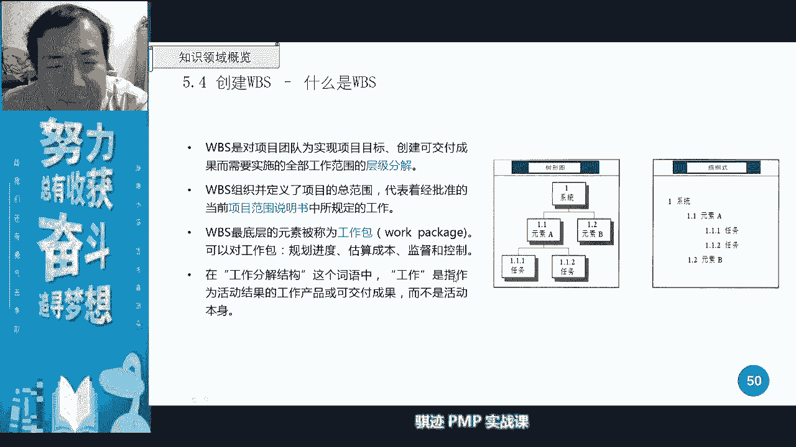

那么我们继续讲，那么分解到vb s有这样几种原则啊，第一个我们已经讲过了滚动规划，近期详细，远期粗略啊，那么第二个叫100%原则，什么叫100%，就是说我们的项目范围要100%的。

被体现在这个w bs的工作分解结构里边，无论体现在哪一层，你就有些可以抵现在的嘛，低层没有问题，那么第三个原则叫不可分再分解原则就是什么，当我们分解到最底层的时候呢，我们就不能要再把它进行继续分解。

如果继续分解会怎么样呢，就没办法定义的，会没办法实现，比如说你要分你要分解成什么，左半个苹果，右半个苹果，是不是这个就没法实现了，对吧啊，要可实现的情况下，不能够再分很大啊，那么第四个叫信息透明原则。

就是说我们要我们要有信息的透明，要告诉所有人，这个要告诉所有项目的相关方，这个东西的定义是怎么样的啊，也就是说尤其是甲乙双方要对这个东西呢，要有信息透明对等啊，最后一个两个原则之一呢。

第一个叫做八个小时，80个小时原则，一般会定义为工作80个小时完成，那么一天工作几小时啊，一天工作八小时，八个小时，差不多十天，所以我们一般会玩啊，但是一周工作五我一周工作啊是40个小时。

所以两周工作80个小时，那么基本上就是工作十天，也就工作两周对吧，我们计算做对啊，但是80个小时不是一定的，有些小的项目呢，我们可以甚至用使用十个小时原则，或者使用十个小时一天多对吧。

或者是20个小时的40个小时都是可以的，反正按照天一般来说按照人的自然周期，按照比如说两三天，半周或者一周或者两周，那么为什么要定义呢，因为在一两周内，人对于事物的确定性还是比较高的对吧。

超过一两周变化就多了，所以wbs被认为是什么，要定义，在80个小时或者之内能够完成的一项工作，有人去负责，后面还会有最专门针对这一节的描述啊，那么我们先不讲，不良人的或者说是团队也可以啊。

人不一定只是我们物理的，两周啊，两weeks对吧，不一定啊，有些快速项目，甚至w bs会被定义为什么东西啊，定义为天啊，也可以啊。

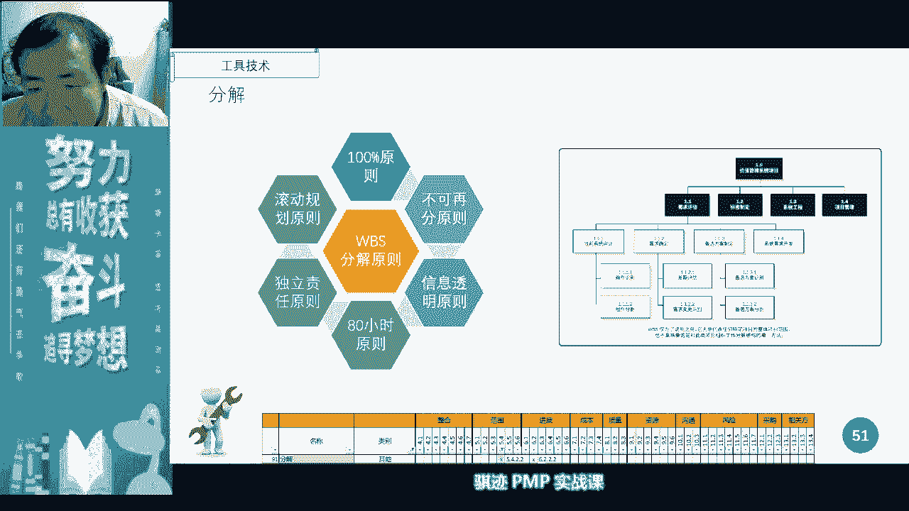

这是非常快捷敏捷的一些项目啊，有可能会好，所以我们在w vs管理当中呢，我们会用到一个很重要的工具，它在我们的进度管理当中会被再次用到，叫做分解别composition分解啊，那么分解是一个什么呢。

就是让东西拆分拆分拆分的过程，拆分拆分拆分的过程，那么这个拆分呢我们最终就是拆分成了，不能再拆分了，或者是什么呢，它在能够在两个周一周或者半周注水，你自己去定义的最小颗粒度能够完成的结果。

我们称之为什么，那么它的过程都是会用拆分，那么在范围当中，在我们的进度当中呢，我们就拆分成活动啊，我再次复述一遍，所以在w b s在创建w b s过程当中，最终的产物是可交付成果，它是个名词。

但是呢我们在活动定义就是进度管理当中的，活动定义当中呢，我们最终产物是什么，是工作的活动列表，它是一个什么，是干哪些活，它是个动词，都用这个东西叫做拆分分解啊，decomposition。

那么我们拆分一个w bbs，一般的方式都是啊，注意啊，第一点啊，后面就开始有很多技巧的东西，近期详细远去租赁，这个说过了对吧，那么拆分过程当中呢，我们会要核实看看是否是拆分恰当的。

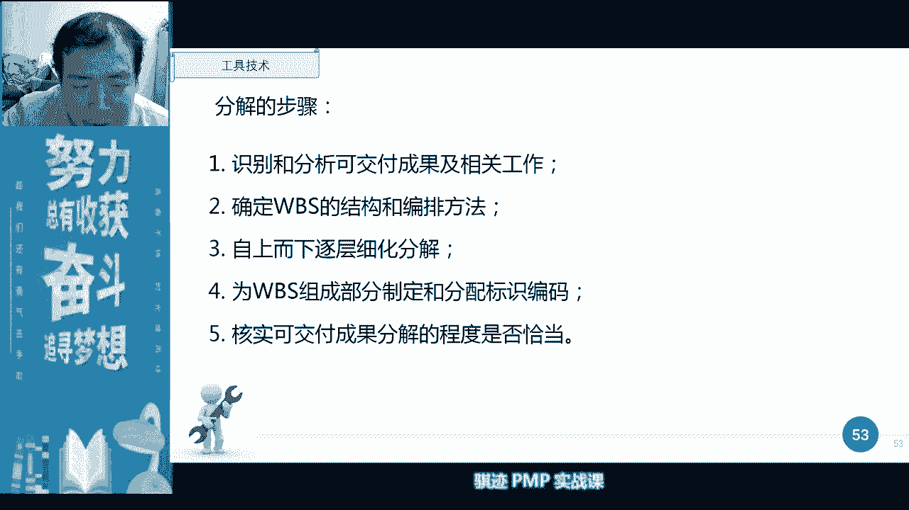

同时要对它进行编码，编码我们的w bs词典再说也可以。

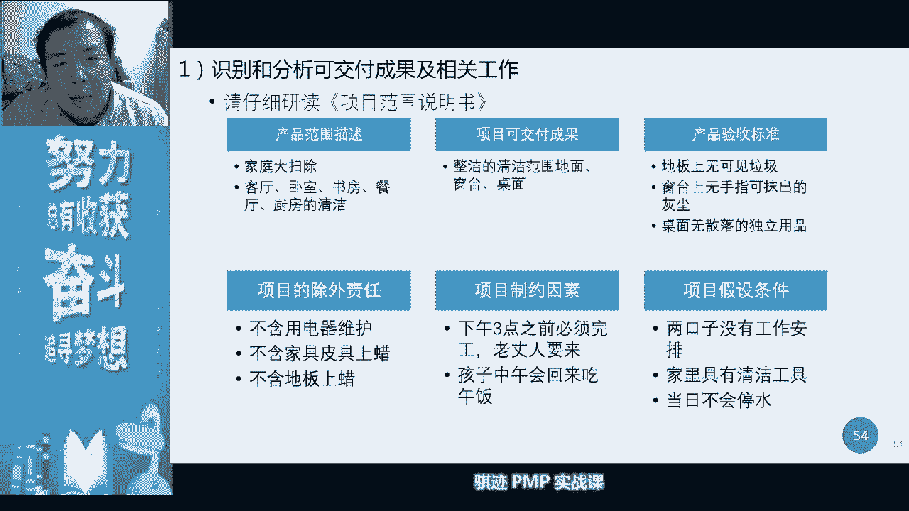

那么拆分当中呢我们会注意啊，我们有两种拆分方式啊，一般常见是两种拆分方式，那么第一种呢是按照什么项目的阶段来拆分啊，所以建模的阶段拆分得，第二种呢是按照项目的可交付成果来拆分，可交付成果来拆分。

是会有这样两种方式，那么有没有这种混合型的方式是可以有的啊，所以这两种方式呢有时候会混起来，用主观目的，只要让大家能够看得清楚工作是怎么背，所以拆分的过程当中，并不一定要拘泥于一种方式。

但是呢拆分的过程呢会有另外一个定义，大家可以看到啊，拆分当中我们会有第一层项目，第二层阶段，第三层产品成和交付成果，一般来说w bs的拆分会有什么东西啊，会有四，最多会有四层，但是最多不会超过四层啊。

啊有可能有些特别复杂的，会插到五层，但是一般不建议插到四层，那么w那么问一个问题，为什么w bs拆分一般我们就拆到四层结束了，你们知道啊啊请在公屏里告诉我，为什么wb s一般最多只猜到四层，hello。

怎么又没反应啦，为什么最多只才分到四层啊，诶没有人回答吗，这个问题太难了吗，呃sap structure，因为第四层就是最小化了，便于查询，是因为拆是工作，不是啊，拆分过细，拆分复杂度成本会增加。

ok啊非常好，不是啊，这个这个这个理解不对啊，那么是这样，我可以去告诉你们，这样拆分成第四层，最菜系的不好管理，对这个有可能啊，这是一个我觉得相对是次要原因，拆分为什么拆分成四层。

是因为最主要还是这个东西是给人看的，那么拆分的太细，最后哦不好管理，最主要的原因是什么呢，反倒不是因为人对于一项东西的分解结构，一般理解最深，是理解到四层，超过四层仍会失去层次感。

会失去层次之间的逻辑感，明白了吧，会失去这种逻辑感啊，这是人的一个啊，这是人的一个弊端啊，我们就这样，最近一直我们讲常识，传说了啊，我在第一层，他在第五层啊，这要注列或者他的第三层这种表述，这种表述。

其实就描写了人的思维层次的一个深度，人一般能承受的思维层次的深度，一般在四层左右啊，五层已经算是很极限了啊，那么这是人的一个，那么如果让计算机去拆分呢，啊如果让计算机拆分，计算机能拆分到100层。

可以加分到原子对吧，可以拆分到原子，这就是人和机器的不同啊，人是没有办法去在拆分这么细，这么细的情况下去做一个逻辑的链接和理解的，这就是为什么wb s一般都差4000。

那么说老实说我这里有个特别复杂的项目，特别工作量大的，要拆到五六层，可不可以啊，可以，那么你就把最顶上那几层呢，你拆开顶上第一层和第二层的拆分拆开来，分成多个w bs，我们讲我们用不用说一个项目。

只能有一个w b s，是不是啊，那么当你有多个w bs的时候呢，是不是也能工作，也能工作啊，他们也能工作，所以你可以把最顶层的拆成若干个w bs，分别进行描述，它的结构呢就相对容易理解啊，是这样。

但是一般来说也就拆到五层到顶了一个事情，如果不是极端复杂，一般不用拆五层，一架一般不用拆五层以下，就像一个人，没有一个人可以把一张纸可以折叠，什么折叠超过九次啊，当然有人证明过。

一张纸可以在很极端复杂情况折叠11次，但是真的是吃饱饭没事干的人，我们日常的只是不可能折叠19次以上了啊，ok好，那么就是这就是这个原理啊，那么就是类似原理，是造成我们wb s一般就用四层最多啊。

不知道大家明白了啊，好那么这是w b s的一个编制方法，编制方法啊，这个编制方法呢是我们这两种方法，是我们最常用的，一个是第二层，按照阶段来编，一个是第二层，按照可交付成果来编啊。

好那么我们可以回过来去看一下。

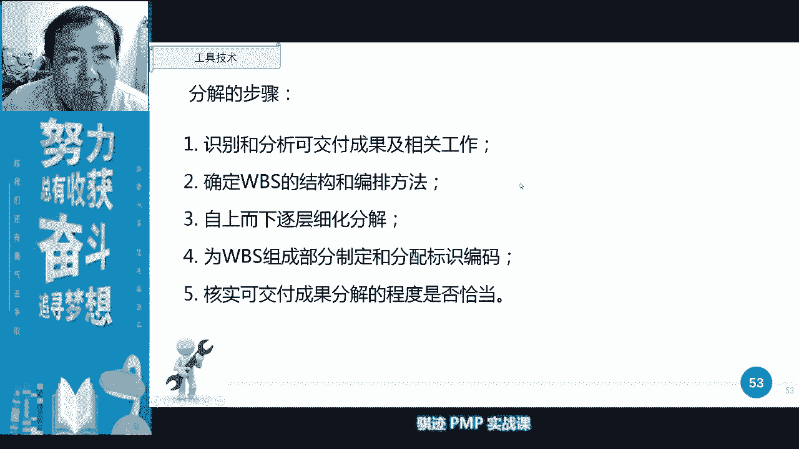

如何去编制w bs，但是我们要注意，无论怎么猜到，贝贝斯最终拆过来的结果要100%，覆盖什么范围说明书啊，这一点一定要注意啊，我们在拆完档位别四之后，一定要回，我们要回归测试。

看一下所有的w bs的内容，是不是覆盖了整个范围，说明书要不大不小，正好大了呢，就是什么镀金对吧，小了呢，客户不答应对吧，那么我们可以看到这是一个项目的范围说明书，对吧啊，项目范围说明可交付成果。

验收成果，那么我们项目的除外责任对吧，然后诸如此类啊，那么我们可以针对这样一个结果呢，可以拆一个w b s，那么我们讲这个项目是什么，家庭大扫除，家庭大扫除，那么分为客厅，卧室，书房，餐厅和房间。

这是第一层，是不是，那么我们可以进行拆，比如说我们以客厅为例，我们拆第二层，椅子对吧，然后客厅的一些比如说啊一些家具对吧，比如说是鞋箱，比如说你们客厅里比如说有鞋箱连连着门，有鞋箱。

或者你客厅里呢有什么有电视柜，电视机对吧，也有可能啊，那么这些东西是第二层，那么第三层有个是什么啊，最下面还可能加一层什么，就说啊你可以定义我们大扫除血相当中的，比如说每一层我们的电视柜的每一格。

每一层对第一层，第二层电视柜可能分成两三层对吧，然后呢桌子呢分为桌子的正面对吧，可以分成桌子的啊，里啊底下对吧，也要擦一下桌子，是不是底下要擦一下，有时候对吧，然后呢我们的客厅当中呢，我们的椅子。

我的椅子可以分为什么椅子的，我们的擦灰要擦一下对吧，然后呢我们地板呢可能还要客厅点地板呢，还可能要打一个蜡，是不是可以分得近细一点，差不多就分到这样吧对吧，我们在规划一个工作，比如说家庭大扫除规划工作。

我们会不会规划到要求家庭大家庭大扫除，客厅里面去做清洁，要求对客厅里的每一个椅子当中的，每一个雕花的每一个角度进行详细擦拭，会不会这么起定啊，比如说你的椅子上面有雕花对吧，一个一个红木椅子上面有雕花。

要求对雕花的每一个角度都要进行详细擦拭，不能有灰，有没有可能啊啊一般不会啊，一般除如果除非是强迫症患者，一般不会定义这么洗对吧，所以定义到啊椅子对椅子进行擦拭，或者在椅子擦拭之外呢再进行。

比如说一些保养对吧，红木椅子做做保养还是可以的对吧，就可以了啊，所以这是我们根据产品范围，说明书进行一个一个定义的，最细的一个可能，太卡了，闪退了哎呀，好那么我们可以按照这样的原则。

对于客厅卧室书房餐厅，我们的厨房呢啊啊做一些整体性的一些啊。

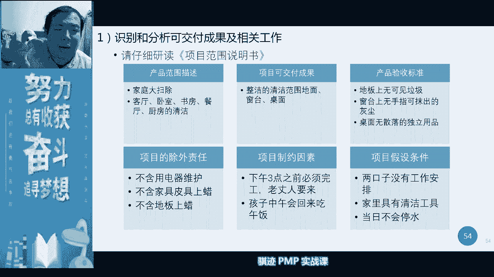

从整体到逐一些w逐级的分解，逐级的分解，ok这就是我们w bs的一个依据的来源，那么你会描写到你。

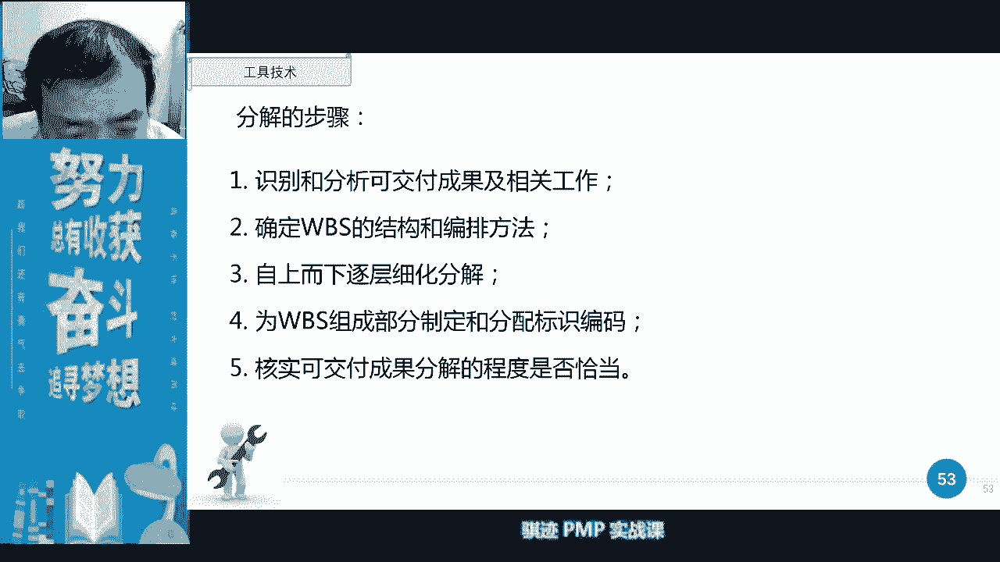

那你会看到什么，当我们做一些w bs分解的时候呢，我们会发现有些事情是可以一起做的啊，一起做的，就是可以一起做，比如说我们做工作的时候呢，会有这样一种情况，比如说我们要去给地板打蜡打蜡。

客厅的地板和房间的地板，是不是属于w bs的啊，我们讲前面这个项目例子当中稍等啊。

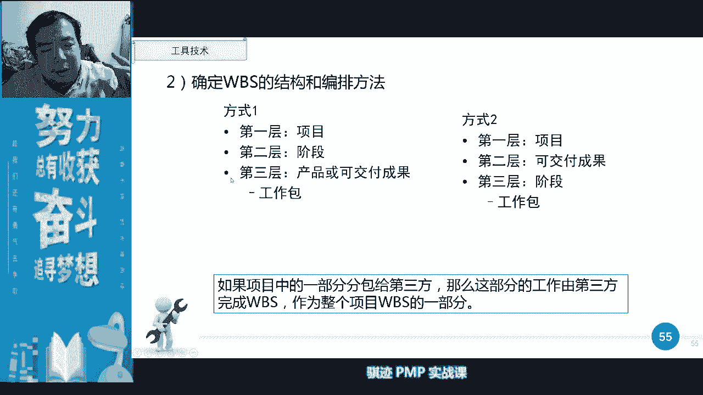

前面项目这个例子当中，客厅的地板和卧室的地板，是不是属于w bs分支里面的，两个不同的分支啊，是不是两个不同的分支，但是这两个不同的分支，是不是都有一个相同的工作，叫做什么东西啊，叫做地板打蜡。

那我在做这个事情的时候，你们家里会不会什么地板打蜡，先客厅打一遍，然后结束不打啦，接下来呢卧室在地板打一遍了，会不会打啦，不会啊，他不会只做一个要打蜡，要拖地板，要上蜡，肯定会一起做对吧。

所以把客厅地板打蜡，房间地板打蜡，卧室地板打蜡，当厨房间和餐厅一般不太会用地板对吧，他就不需要打蜡，这些工作放在一起做，是不是能够进行有效的协调和提高工作。

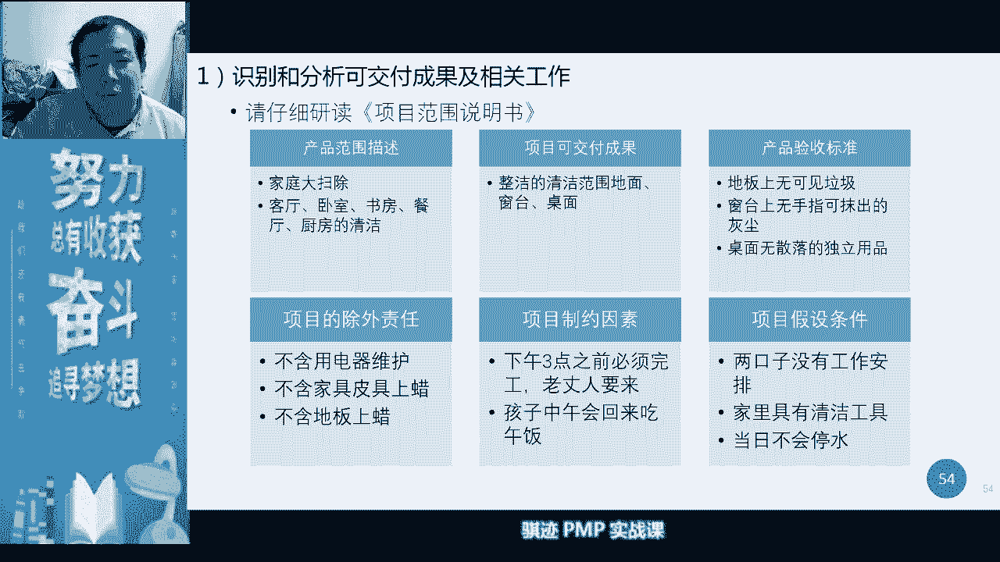

所以这样一些事情我们会把它归为一类，这一类呢是超越w bs的，各个不同的w是分解的不同分支的，可以有效的提高效率，对不对，你们想想啊，所以我们会把它划在一起，不把它分开来，就是这个道理，所以叫做规划了。

规划在一起，好那么我们在制定w b s当中呢，比如说叫控制账户啊。

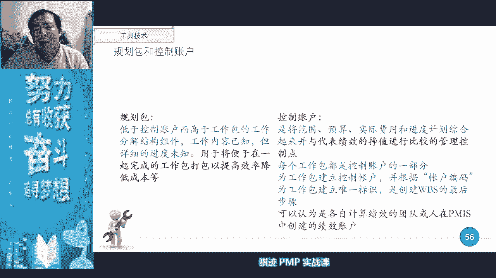

我们继续以这个家庭房间的大扫除为例，那么我们控制账户，在家庭大扫除这样一个项目当中，我们会有哪几个控制账户啊，很简单，小孩组，老人组和成年人组啊，各三个账户，小孩组呢就是什么小孩子呢，就是什么爸爸啊。

比如说你们家两个孩子有两个小朋友，这两个小朋友呢是共同考核绩效的啊，共同考核绩效，比如说儿子啊，和女儿要一起配合的对家庭进行打扫，那么爸爸妈妈呢也要对家庭应当，但是成年人呢可能干得多一点。

所以他们的控制账，他们的控制账户里面的绩效，考核标准呢要高一点，小朋友呢要求低一点，所以他的控制账户里的绩效呢要低一点，老人呢年纪的大，他一般呢做很少的事情或者做不做事情啊，他的公众账户里面工作呢极小。

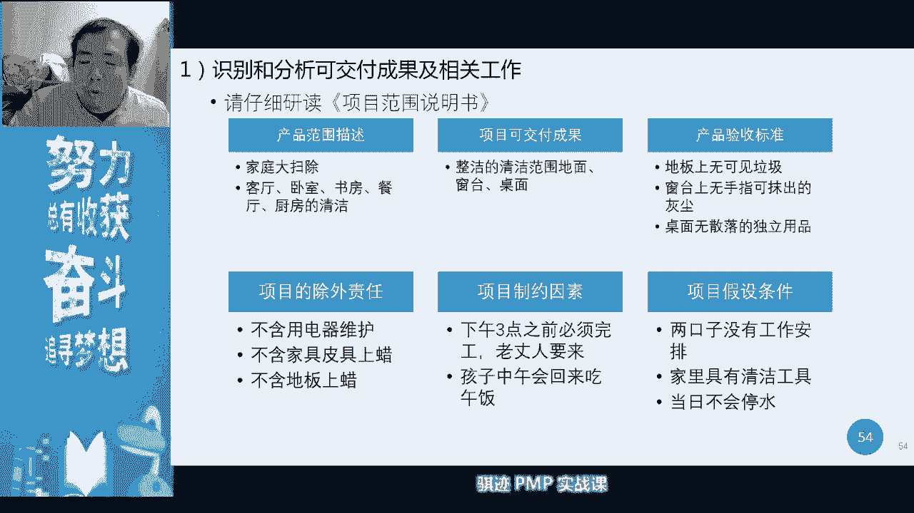

每个人就可以在脑袋上呢按一定的t啊。

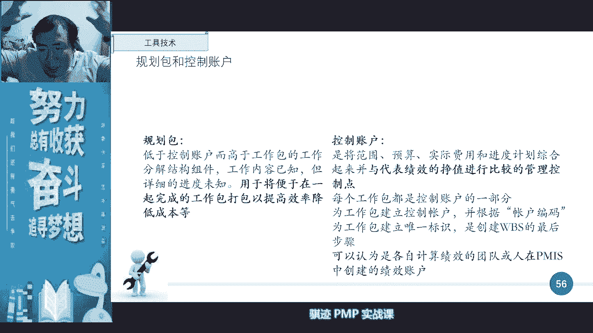