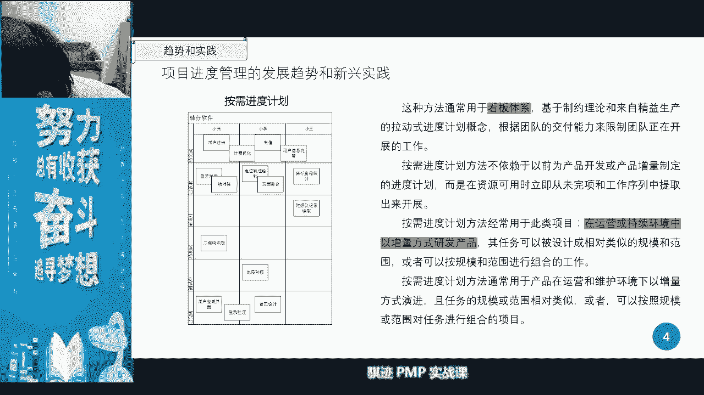
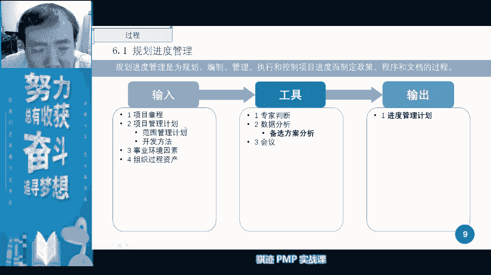
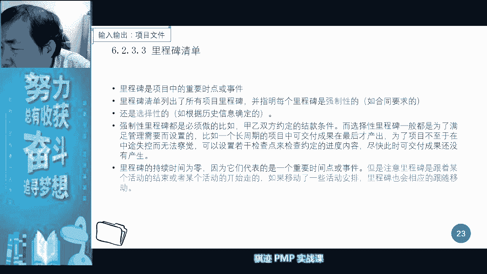
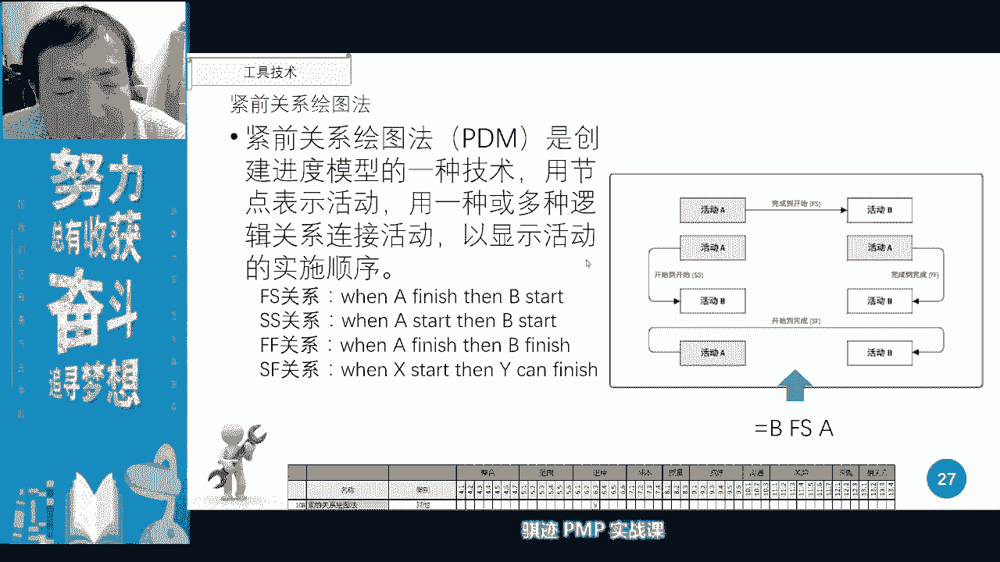

# PMP认证考试课程最新完整免费课程零基础一次通过项目管理PMP考试 - P14：PMBOK第六版 第六章项目进度管理-15 - 骐迹PMP - BV1Sb4y1f7Yt

能把话筒离的声音离得自己近一点好，那么我们今天的课程就要开始了啊，今天的课程我们讲的是诶，我拿一个手机作为时钟，今天讲的是我们的进度管理啊，进度管理当中，机动管理当中我们要讲的内容就比较多了啊。

我们首先来看是一个要看啊，大力水是不是看到万里水了啊，给你看一下，大力水要准备喝的，我先先喝，上次被你们批评过老何饮料，我现在喝白开水，啊卡20点了啊，八点啊，现在开始啊，那么我们就不拖了啊。

又同学卡了好，那么我们现在开始，我们今天讲的是第六章啊，第六章项目进度管理，项目进度管理呢，内容的本质衔接呢正好适合我们的第五章，项目范围管理呢是一个扶缝的衔接过程，那么什么叫无缝的衔接过程呢。

就是进度管理的起始的起点，就是我们上面一章，我们上面一个章节，上面那个知识已经讲过的范围的最底层，范围的最底层是什么范围的最底层，记得吧，可实现了一个可交付成果的一个单元。

那么我们今天就要在项目进度管理当中呢，首先把它分解，肯定000啊，要剁开啊，就像我们嗯烧排骨对吧，我们把排骨一节一节一节剁开剁，剁成一节一节，这一节一节，那就是活动，那么用活动去实现我们定义的最小的。

可实现的那个可分割，可实现的我们的可交付成果，这就是项目进度的一个和范围，进度的一个交接的点，所以他们是无缝衔接的啊，那么在进度管理核心概念当中呢，我们主要进度是干什么。

进度管理最主要的目的是提供给大家，详尽的一个计划，表现出这个项目会在一个一段时间内，怎么样去进行开展啊，是一种掩饰，这种演示，这是进度管理主要目的，那么项目进度管理在实践工作中呢很重要，为什么。

如果如果你要向你的发起人，领导上级甲方爸爸汇报工作，那么他们可能问你最多的，最频繁的一个深刻问题，就是项目现在进度怎么样啊，所以进度是最容易被问到项目状态的，一个知识领域，因为没事情。

甲方爸爸一般不会问你，什么项目最近风险状态如何，项目资源方向如何，他永远是问你什么项目当前进度如何，做出了哪些可笑不成功对吧，这是甲方最容易关心的啊，发起人是最容易关系啊，项目进度如何，我们倒没倒挂。

项目经理负责去收钱啊，有些行业里面项目经理比较惨啊，乙方的项目经理不但负责把活干完，还要什么向甲方收钱对吧，因为我们可能跟甲方约定啊，某些里程碑达到之后呢，要向甲方收款啊。

这时候呢苦逼的乙方项目经理就出场了，然后屁颠屁颠的跑到甲方那边去找甲方说，哎您签个字，然后打个款了对吧，然后银行还个账，然后再屁颠屁颠的跑到各个领导那边去签字，说不定还要屁颠屁颠报到财务那边去要账。

然后被财务说啊，这这个月没钱，这个月涨经结了疯了，下个月再来，好配合，笑脸啊，这就是我们很多苦逼的乙方项目经理，的生活工作的一部分啊，啊稍微描述一下，有些同学的啊，七彩生活啊，好开个玩笑。

那么进度我们回来，进度管理的核心概念是什么啊，提供详尽的计划，说明项目如何进行交付啊，是一种啊用于沟通和管理相关方期望的工具，为绩效报告提供的依据啊，这是我们进度的核心概念，进度当中会有很多图啊表啊。

横道图，网络图啊。

这些东西好，我们就会后面一个讲，那么项目管理的信息趋势呢是第六章，每个第六章我们讲都会有一个特别特别的东西，叫做信息趋势，我会有一个叫未完待，具有未完成像的迭代进度计划啊，这个呢一般是我们什么。

一般是我们在使用敏捷开发或者迭代开啊，迭代滚动式开发，迭代式开发，迭代的生命周期类型当中会经常使用的，那么它会在每一个周期呢开发一些新功能，并且呢通过收集反馈呢得到一个什么，得到一个改进和一个新的需求。

然后呢把它作为未完成项，在下一个周期当中呢进行开发，那么这样适用于什么，小批量多批次的进行交互，以便最快速的能够实现价值，这种适应性的在产品情况当中越来越普遍，越来越多了。

尤其是对于公众的是轻量型的越来越多了啊，天天年底追涨啊对对，到年底了啊，各位做乙方项目经理的同学啊，又到你们苦逼的时候了对吧，盯着甲方去要账了啊，啊那么要账的时候要注意什么东西呢，要不卑不亢。

虽然这年头啊借钱的是孙子，欠钱的是大爷，但是呃甲方那些甲方那些大爷呢嗯惹不起，但是呢你要跟他们斗智斗勇，斗智斗勇啊，有时候本身要甚至要做到像007这样，关键相关方，然后看看他们什么时候出现。

然后一下子窜到他们面前，把相关的表单签字，表单扔在他们面前对吧，让他们哑口无言啊，ok啊我又我又不小心说出这些东西，所以我当年啊做甲方项目经理的时候，我是比较善良的啊，我们该怎么样就怎么样啊。

一般不会对我的，我们的可怜的乙方小伙伴做过多的欺负啊，什么东西对吧，那当然我对乙方的要求是挺严格的，但是我对乙方啊啊工作之外的要求呢，大家都相互理解的，你不要以为你现在做甲方就一直做甲方以后。

你也屁颠屁颠的跑到甲方那边去讨钱，对吧哈哈ok啊，就不多说了啊，能不能讲新兴趋势还是总结按需进度计划，按需进度计划呢往往应用于什么，使用于看板体系啊，像我们很多的，像这里这里看起来就有很多小看板对吧。

这个小钢板当中呢，越往下面就什么完成度越高啊，就像俄罗斯方块一样，一个一个往下掉，我们就要尽可能的把我们的各种的啊，工作内容呢尽可能往下面掉啊，那么按照这个需求，那么先调哪个大，取决于我们的需求。

取决于我们的环境，以增量的方式进行开发，这叫进度的啊，按需的进度计划，所以这种计划使用这种进度计划的时候呢，我们甚至可以打破什么东西啊，可以打破我们敏捷当中，比如说我们使用sram的时候。

使用sram的时候，我们所使用的固定的项目周期啊，我们可以打破，甚至可以打破固定的项目周期，然后进行按需的进行交付交付，项目在进度管理领域需要裁剪考虑，当我们这管理项目上当进度时候，当然要考虑裁剪对吧。

我们考虑生命周期，考虑维度，技术支持，资源可用性啊，诸如资源。

那么来了，接下来是重点啊，重点是这个不是这个页面，这个页面的这个顺序啊，在进度管理当中呢，我们有六个活动，一个是规划，第一个是规划进度管理，第二个是定义活动，第三个呢是排列活动顺序，第四是故送活动时间。

第五呢是我们的制定进度计划，第六是控制进度啊，那么它为什么是这么排列的，六个是不是挺多的，是不是挺乱啊，但是它为什么是这么排列呢，其实这就是一个管理项目进度的一个逻辑过程。

那么这个逻辑过程我先给大家概述一下啊，是怎么了，进度来源于范围对吧，大家知道了啊，那么活动这个东西的特性是什么，先要排列顺序，才能够确定每一个活动的持续时间，当你把所有的活动时间。

顺序和逻辑关系都排好了之后呢，还要考虑资源约束，当你把资源约束也搞定了之后呢，就能制定进度计划，当你制定出了进度计划呢，你才有进度基准，有了进度基准之后呢，你才可以监控进度。

所以这就是进度在管理上的一个逻辑顺序啊，所以你记住这个顺序特点就是另外一个活动，如果孤零零的放在那里，它是没有任何意义的，一你不知道它有时间多长，因为不同的在活时间轴上。

不同的位置进度的活动的长度可能是不一样，第二季活动的，它的顺序，也对活动的各种会产生各种各样的影响啊，所以活动首先要被定义出来，但是呢他是不先要定位才能要定性，定完信之后呢才能够进行组合。

那么所以如果我们把在项目的进度管理当中，如果我们把活动看作是乐高积木的，乐高积木大家喜欢娃娃啊，是一个很好的丹麦，乐高是个很好的丹麦牌子，对吧啊，居家旅行啊啊败家败家的很好的一个东西，对吧啊。

说到说到这个东西，就是说如果大家想要败家的话，就想要让对方上自己的仇人，败家的话就给自己仇人的儿子买一套乐高，让他迷上，然后仇人家自然就慢慢的就败家了，对吧啊，这是一个以前很古老行吗，那如果是女孩呢。

女孩的话，大家就买一个一个我们的啊娃娃芭比娃娃，然后送给她，然后小姑娘就着迷了，然后家里一堆芭比娃也就a a a就败家了对吧，ok啊回来，那么我们讲定义活动就是什么，然后乐高积木呢一开始呢要什么。

要把这个积木呢进行排列啊，先搭什么在它上面做排列，然后呢估算活动长度，相当于估算乐高积木和积木之间的，我们的这个长度宽度，然后让他们能够很好地拼接在一起，制定项目管理进度计划，进度项目的时间管理计划呢。

我的进度计划呢是什么呢，然后看看他们中间是不是有怎么样约束对吧，有些时候资源这个这个积木的资源不足，这个积木可能是说不能够支撑柱类会有约束，要把这些约束解除，然后就搭出了我们整个项目的一个拼图。

当你当初项目拼图的时候，项目的进度计划就有了，项目就基准了对吧，然后呢去控制，所以你可以以后在记忆当中，你可以把一个项目的进度管理看作是一个什么，搭乐高大乐高是不是先要把积木全都拆散。

然后一个一个积木全都拆出来对吧，第二呢把积木进行排序，进行按序列进行搭建，第三个呢搭建之后呢，要把积木里边各个积积木相关之间的长度，宽度呢要算出来算是好，有人说a p p崩了啊，我刚刚我这里看没问题啊。

我这里记得挺好的啊，第最后一个呢就是说最后第二个呢，就是说然后呢我们再把这些问题都摆出掉，排除掉之后，就能打出一个一个乐高的积木模型对吧，最后呢控制进度啊，就像我们之前这些做的呢都是排计划。

最后控制进度呢，就看实际进度进行当中会有哪些问题啊，这是进度管理的一个特征啊，先是规划，然后定义定义排序，排序呢估算估算以后呢制定进度计划基准，最后呢控制精度啊，这个一定要记住这个顺序，记住这个顺序。

你所有的子过程就都记住了啊。

好我们先来看第一个子过程啊，不要记第一个字和第一个子过程是我们的规划，进度管理，规划进度管理，每一个每一个知识领域的第一个子过程，都是规划啊，某某瓦里，但是呢精度规划管理当中的内容不多啊。

内容最多的在后面啊，大家不要急啊，后面几个知识领域有非常多的内容，那么规划进度管理主要做什么呢。

也是一样定规矩对吧，那么来了测试活跃度，来了来了再来把，再把定规矩打在我们的公屏上啊，看看有多少同学在活跃，啊我趁机喝口水，啊定规矩对吧，我们之前已经在定过规矩是什么规矩啊。

制定规划我们的项目的范围管理，定规矩制，制定出了范围管理计划和我们的需求管理计划，那么接下来规划当中呢也要定规矩，定规矩，怎么样去管理进度，管理精度和管理范围呢，可能它的规矩呢内容呢略有不同啊。

没略有不同也不用。

那么就是怎么样的不同呢，大家可以看到可以在后面的内容看到啊，那么规划首先规划进度管理当中呢，我们一样会使用一种方法叫什么啊，就是这样啊，但是大家大家这里注意啊，这里当中我们规划范围管理当中。

为什么要输入范围管理计划，是因为这个其实这个其实不错的啊，因为为什么呢，因为范围管理计划会跟规划范围，规划进度管理得出的进度管理情况相匹配，范围怎么管，是不是跟进度怎么管是相关联的啊。

所以这两个呢要相互参照，所以是有意义的啊，怎么开发呢，开发方法和我们的进度怎么管，也是有些关联意义啊，所以这是有关联意义的啊。

那么我们工具当中呢，我们会用备选方案分析，这个我们就学过了对吧，有哪几种方案，我们一般会选择一种主方案，然后多种备用方案进行管理，跟这个范围是一样的啊，那么精度管理计划最主要是定义什么。

我们的进度模型是怎么定义的，我们的发布和迭代长度啊，注意第二个，如果涉及到发布和迭代长度，就意味着是什么，不是叫迭代，就意味着它是一个迭代型或者是适应型的项目，生命管理周期，那么它的进度管理呢。

和普通的预测性是不一样的，这点要注意不一样，第三个是精准准确度和计量单位，准确度和计量单位，计量单位很有意思啊，项目不同的项目，它的计量单位是不一样，比如说小项目，它的计量单位是天按天来管。

甚至非常小的项目是按小时来管，也有的啊，非常迷，你的项目很快速的要完成的项目，它是按照小时来管，也有的，一般呢是按照天来管啊，如果是一些比较大的项目，它会按照什么来管，按照周每周啊。

比如说你这个项目要做1年，那么你每天管一管，制定金融啊，国进度计划呢也略微有一点太过繁琐啊，他很多事情可能中间的表达呢不用做那么细，我们叫颗粒度会更加适合一点，好，和志愿适合点啊，稍微看一下啊，公平啊。

那么有些项目会用年来作为月，会作为计量单位，作为月假呢，他是个非常大型的项目，按月去记的啊，已经是个非常大型项目，只有非常大型的组织，才会用按月来计算一些计量，那么有没有按年按年呢。

一般都是国家型的大项目啊，国家型大项目，比如说中国人的，就是按年来进行切分对吧啊，那么就要看绕回对吧啊，然后呢再登陆，然后再建立空间站，这些计划是中国人在登月这个项目当中呢，一个一个按照年来切分的啊。

年年一般不会，一般在我们的日常当中不会有，如果你能管理到以按年作为计量单位，的项目当中，ok你已经是一个非常成功的项目管理者，但是你可能不一定是项目经理，总规划师这种这种层次的啊，非常棒啊。

所以计量单位管得越大，一般都代表着什么呢啊管的特别大的时候，就代表什么，你的能力提升的非常高了，ok啊闲话一句，然后呢计量单位啊，我们计量单位之后呢，我们在进度管理计划当中会有组织的程序链接。

是什么意思啊，是因为我们在进度管理当中，会和我们组织的各个规范相管理啊，相规定相相联系啊，所以要有组织的程序的链接啊，这会指向一个组织的组织过程，资产表示我们的进度管理计划，遵循了组织的最佳实践框架啊。

可能来自pm的詹姆斯，然后有项目的进度维护模型，模型的维护怎么样去维护的，它的临界值是怎么控制的啊，项目的进度临界值，比如说怎么定义项目是不是延期啦，比如说项目时间落后于，比如说原计划的105%。

大于百分之原计划的1。05%分钟，已经是什么延期了啊对吧，因为有时候差一两天，其实在很多大的项目当中不算什么绩效，如何去测量的，确定完成百分比，怎么去确定我完成了百分比进度的规则对吧。

埃及如何去做绩效报告，是这是进度管理计划的一些组成内容啊。

但是明白一下就行啊，那么下面这个势力文章是进度管理计划，某某项目日期，我们的进度方法呢是关键路径法，关键练法和其他方法，ok啊，这里涉及到一个东西叫关键练法，关键练法呢是pm博客第五版当中提到的。

第六版答案已经不怎么提了，已经没有了，你平博哥的第二版去搜，我好像是已经搜不到了，但是我们稍微提一下关键链和光机路径法，后面呢我们在讲关键路径法当中稍微提到，这是两种方法，原来传统项目管理当中。

我们会把一些约束呢，我们会呃不进行先不进行处理，然后呢留有储备，当当约束发生的时候呢，利用关键链当中我们来进行了进度储备，进行应对，这种叫做关键练法，那么现在越来越多的项目管理方法呢。

我们是会在项目执行前尽可能的将所有啊约束，尤其是关键路径上的一些约束，比较资源运输的先排除掉，解决掉，然后呢去排列，然后再去进行排列项目的啊，关键路径和项目的长度，这种方法呢叫做关键路径法。

关键路径法在很多的场景，它的表现的适应性和它的一些呃，可靠性和可预估性能要比关键练法好好，所以呢逐渐逐渐，关键路径法成为了一种很主流的方法，关键练法呢相对没有那么主流了。

所以pm和d6 版的就没怎么提啊，就没怎么提，然后呢我们的进度管理工具有什么呢，叫进度软件啊，报告软件，还有政治软件啊，这些软件都可以称之为什么，请在公屏上打给我啊，这些软件都可以称之为什么软件啊。

都可以称之为什么东西，那么我们还有精度计量单位偏差对吧，我们在这个当前的进度绩效呢，我们要求控制5%之内无需纠偏，8%呢预防10%，那就要进行纠偏对吧，这是设设定的临界值。

偏啊啊临界值的一个一个设置指数对吧。

然后设定了报告报告的一个报告格式啊，这是进度管理计划。

那么这个做完之后呢，我们的进度管理呢的规矩呢就做完了啊，规矩做完了，ok啊，非常好，我看到了pm对吧，pm啊非常好，我们刚才所说的进度软件，报告软件和政治软件都是p m s的。

这一这个统项目管理软件的一个统称啊，project management information system promise，p i m sorry。

这个我没教过啊，有位同学多打了个i好，那么定完规矩之后，接下来的动作就是什么，定义活动啊，定义活动，那么定义活动，我们看到如果说广义上来说，这里会有一个解释，可分解出的可可实现的最小成果。

但不是最小颗粒，什么是最小颗粒啊，活动是最小颗粒，项目管理当中最小的活动是活动，是这样隔离啊，所谓的分解啊，decomposition拆除活动，称之为我们的定义活动这个过程啊。

然后对它进行规划管理的是基础，所以定义活动当中呢，我们是由项目经理带队。

主题专家，项目团队一起完成啊，可能向官方参与，ok这就不多说了啊。

那么定义活动当中，我们要遵循使用那个工具规矩，是第二次出现叫decomposition分解啊分解，那么分解在分解w b s的过程中，它解出来的都是什么名词，但是在分解定义活动当中，他只解其实只解一次。

下面就没有结构，所以它只多一层，这个多一层呢层这一层挫折是一一系列列表，活动可能不分先后对吧，就像我们我们讲，有时候名单不分先后，养活动是不分先后，因为先后是后面排列活动顺序的时候才会有的。

在分解的时候不分先后，把它统统统罗列出来就行，那么如果它被分解为活动了，那么就意味着它是一个过程。

它是个动词过程好，那么我们看，这是我们讲活动的三种最主要类型啊，活动三种类型，一个项目当中总归会有这三种活动组成啊，这来了啊，这个呢虽然pm博客没有直接讲，但实际工作当中呢，我们今天要明白啊。

总归能分解出三类活动，第一类就是我们最常见的当中，叫或者叫分类型活动，那么这类活动的特点是什么啊，直接计入绩效的，可以通过什么工作的投入和产出，直接寄得出来的迹象啊，这是我们活动的最主要的主体。

就比如说啊我们举个例子，我们以这个这个呃这个活动类型当中，我们以我们的啊建筑工地的一个呃怎么说呢，就是建筑工地的建筑项目，作为一个活动分解的一个基础啊，那么建筑工地当中，如果我们要啊有一个可交付成果。

叫什么，砌一面墙，而是大家都往网好差，ok嗯有些同学说网卡不卡是吧，不卡啊。

这可能是个别同学的问题啊，大家可以看一下啊，老师这里的话应该是不卡的。

我的网络还是依然很稳健对吧，依然很稳健啊啊应该是没有什么大问题了啊，对吧好我们继续讲啊，那么活动当中，如果以其一个建筑工地有项目为例的话，那么建筑工地项目当中，如果我们拆除的可交付成果是一面最小的。

是一面墙的话，那么这面墙是不是一个可交付成果啊，那么药气这面墙，那么我们的活动当中，肯定必然有一个主题的活动，这个活动可能重复执行若干次去完成，叫做砌砖对吧啊，大家到工地打工都工没有啊。

砌砖是一个啊活动对吧，有可能有些工作当中什么地面砖，砌面墙砖多少钱，或者是砌块砖多少钱啊，中国人的人工呢比较不值钱，所以中国人是按照钱来算的，老外的人工比较值钱，就像澳大利亚这种地方对吧。

地广人数劳动力昂贵的，他们是按照起一块赚多少钱的啊，所以所以很多老外为什么没事情要自己去家里，奇传奇扬，是因为人工请不起，他们比较抠门啊，不是因为说动手能力强啊，你们明白啊，开个玩笑啊，那么这是砌墙。

那么还有哪些活动是叫做支持性活动呢，知识型活动呢，但是他是辅助型活动，但是对我们的工作呢是有一定帮助的，什么意思啊，比如说你要砌墙，你要砌砖，要砌砖，那么砌砖需要什么，一需要搬砖，是不是啊。

二呢需要拌水泥，搬砖和拌水泥就是两个支持型活动，那么什么叫支持型活动呢，就是说我不我给你拌水泥的时候，我不能说为你欺这一堵墙，我去办水泥，我可能很多堵墙都在那边砌，我一起拌水泥，然后大家分。

这会你用对吧，搬砖不可能为仅仅为你这一堵墙，我去搬啊，这堆砖过来，我可能是说为整个一幢楼里面的各堵墙，我搬砖搬一次砖，大量砖搬过来，所以它是一个什么，它它是一个不产生直接产出过的，一个辅助性活动。

辅助性活动，那么它会用于支持我们，用于支持我们的各个各个工作项目啊，各个工作项目啊，那么第三种呢是依附型，叫做分摊型，项目分摊才是项目当中，自投中呢对他来说不易分解成等，但是与可怜本可以投入成正比分。

他呢这个呢描述呢比较含糊，其实什么意思，我问你们，你们如果要工在工地打工啊，啊假设你们偏偏没学好，去工地打工了，工地打工，那么你打工打到中午要干什么，要吃午饭嘛，所以很多的工地。

尤其大型工地都会设置有一个呃设置，有个机构叫做工地食堂啊，工地食堂，工地上农民工食堂对吧，那么农民工食堂里边烧菜做菜，做菜是一种分摊型活动，为全局整个工地呢进行什么支持。

但是呢它不直接产生什么有作用的结果，而是什么就给大家进行均摊，所以分摊性活动呢是给大家均摊，但是有这个东西的支持，我们工作更容易开展，所以这是活动的三种类型，大致大家大家大致了解一下剧情啊，明白了。

所以我说一个工地当中我们砌砖的人越多，是不是食堂人吃饭的人也多，所以他和他俩是会产生啊对应的一个啊比例关，系，投入会有一个正成一个正比的比例关系，对吧啊，功力越大对吧，食堂就越大啊，就是这样一个概念啊。

不知道大家明白没有，这个比喻是不是挺形象的对吧啊，砌砖机器人了解一下啊，ok安徽那是另外一回事情，你还让不让我们民工，我们民工兄弟活了啊，ok啊老是想用科技取代人对吧好。

那么这是讲活动的各种类型，那么我们接下去讲活动的核心概念，大家看啊，这是我们在范围管理当中，我们曾经讲过的一个例子啊，这是一个w bs分解例子，dbs的最底层呢是可交付成果，大家看见没有。

那么假设我们有这样一个可交付成果，一它是一个什么啊，制造一个动力齿轮，制造动力齿轮，这个是一个交不成果对吧，它是个实物，它是个名词，那么要得到这样一个动力齿轮要怎么办，第一个从钢条上面切下一个钢片。

一个啊硬度达到一定要求的一个一个钢片，一个胚钢坯对吧，第二部呢，第二部活动呢是什么，在cnc的加工中心当中设置，怎么样去加工这个齿轮对吧，现在这个社会都已经用自动的机，机床加工的这样的过程了对吧。

我们哪有用手工一个机做的很少有，除非很特殊场合，第三步呢，我们把这个齿轮的钢片呢，放入到我们的cnc车床当中，让它自动进行加工，就得出我们想要的动力齿轮的对吧好，那么这个三个活动组合起来。

是不是就是能够帮助我们得到交付物一，这个动力齿轮啊，是不是啊会帮助我们交付得到交付动力值了啊，这就是一个我给他举的举的一个形象的例子，从这个当中就可以看到，在这一层当中都是一个结果，但是这个层以下。

我们拆出来的一个一个一个活动，都是一个什么动作过程，你看看这些都是动作过程，切钢片编程加工，它都是一个以动作为主的一个描述，所以活动都是一个动作过程，活动都是一个动作过程。

啊有同学问人力投入与分摊怎么区分啊。

刚才我们说过，我们再讲一讲啊，那么可以讲一讲，没关系，人力投入是一种什么全局共享的，但是他是间接产生结果的啊，不直接产生最终结果的，但是是辅助间接产生结果的一种劳动活动，而分散型呢。

活动呢是完全和我们的结果没有关系的那种啊，叫分摊型分摊型，但是这种分摊型呢这种工作呢是必要的，如果没有这种必要的工作呢，我们其他的工作开展了就可能有困难有难度啊，会有这样的意思。

那么我问你们工地没有食堂，能不能干活，能干呀，只不过工人兄弟就吃饭就麻烦了，自己去买饭啊，工作效率就下降了对吧，诸如之类，但是没有，如果你去砌墙，没有人去什么拌水泥搬砖呃，我们的我们的墙能不能砌起来。

肯定不能砌起来对吧，注意这是知识性活动啊。

人力投入型，人力投入性。

好但是这个不用太理解的太深啊，这个因为新冠第六版已经不考了啊，但是呢大家在实际工作当中知道啊，有这种类型啊，不仅仅要拆分出直接产生结果的那些活动，还要拆分出一些什么啊，不转正这些结果的可能是依附性的。

或者是知识性的这样一些活动，好，那么继续往下看，我们拆出的活动就会拆出一个东西，叫做活动清单，activity list，在activity list当中呢，我们会看到什么啊，我们会看到这些活动的名称。

所以这里是我们的分啊，sorry，这里是我们分类的两极对吧，分两集，这这个其实代表的是我们的活动编号，在这个例子当中是活动编号，那么拆到这里为止仍然是什么，但是拆到这里的时候呢。

这里所有的东西都是什么活动的行动组成，行动组成，那么我们通过一项有以前的活动呢，在这里列出呢，然后指导我们整个项目当中需要做哪些动作，完成什么相应的动作，这实际上这个例子，所以这个例子大家可以看一下啊。

和我们的b s分级，在这边呢已经是我们的活动清单啊，这个表达其实比较好，因为这可以什么，你看编码是相互，线圈是联系1。11。1。11。1。2对吧，那么打水是人类活动，买肥料是分散活动，是这个意思吗。

啊绝对不是啊，大家都不用太纠结啊，买肥料呢是可以是分摊的啊，确实啊买肥料呢确实是可以分呃。

呃不是买肥料，不是满肥料的啊，满肥料确实可以是分摊的啊，没问题。

它不止谁产生，但是它是支持可以啊，ok啊这不用太不用太介意啊，只给大家介绍一下好，我们继续往下讲，那么有了活动清单之后呢，活动还没有结束，因为这里面每一个活动他的活动内容。

具体的活动内容的定义呢还没有形成啊。

所以我们还要继续对它进行滚动式规划，然后呢把它越来越来做的越来越细，滚动式规划也是我们常常用的一种技术，这种技术叫做近期详细。

远期粗略对吧，那么滚动式规划呢会得出我们活动清单的，所有的一个综合清单，最终会走出，那么一开始的时候，他只有近期的活动清单，最后呢会有所有活动活动清单，当项目进行到一定程度就有了对吧。

然后呢，滚动社会化，还可以逐步逐步帮我认清这个活动的属性，活动的属性有哪些内容呢，第一在活动的初始阶段的活动的属性，这个标识和w b s标识相连接，w b s标识记得又和什么相连接。

和我们的控制账户相连接对吧，因为要绩效考核，绩效考核这个这一条会后面会继续使用的啊，所以活动的编号可以最终把我们和有个活动，和我们的控制账户呢相连接，那这样的情况下呢，我们可以直接的为每一个控制账户。

来进行绩效考核，你干了多少活动，那我给你寄多少绩效啊，是这样，那么在活动编制完成的时候呢，然后呢活动的紧前活动，紧后活动啊，有些同学来问我，在群里面什么叫紧前活动，就是紧急紧紧的。

在这个活动之前发生的那个活动叫紧前活动，同理紧紧地跟在这个活动后面，发生的活动叫紧后活动啊，今后活动中间没有别的，没有别的其他活动，怎么就比如说嗯就比如排队，排在你前面的那个人就排队。

比如说上地铁坐地铁排队，上地铁上地铁的时候，排队紧紧的，就排在你前面的那个人呢叫井前人对吧，排在后面的那个叫紧凑的人人对吧，就是这个意思，那么排地铁最可气的就是排在你前面，那个人挤上去了。

然后你挤不上去，最开心的是刚好你挤上去，你的颈后人挤不上去，是不是有点心理，心里有点不太好对吧，ok啊，ok我来了，那么还有什么逻辑关系，逻辑关系我们后面会讲，活动会有相互之间的勾稽关系对吧。

提前量之后量也会在后面讲啊，不要急，那么活动当它越来越明细了之后，当我它的位置确定了，它的需求确定了之后呢，每个活动自然有他的资源需求，需要什么样的人，什么样的设备，什么样的资料，什么样的钱啊。

什么样的条件，然后进行集训，进行生产活动啊，他会有这样描述，明确描述就在后面逐步开展，明细了之后呢，会越来越详细会有，然后还有强制时间，比如说有什么活动啊，只能在白天干的，有什么活动只能在中午干的。

我们我们讲我们讲一个段子，有什么事情只能中午干的，坏事，因为坏事做坏事早晚会被人家发现，所以中午干最安全，是不是挺冷的，哈哈哈ok啊，所以会有强制时间对吧，做坏事一定要在中午做，早晚会被人发现。

啊这翻译不接地气啊，可没办法啊，这个这个没办法有更接地气的翻译了，啊啊啊，这是官方翻译啊，所以你以后也用啊，这个是官方翻译，也是官方的官方术语啊，这些东西你只能是接受啊，还有制约条件，假声音啊。

制约因素，假设条件对吧，那么活动属性还可以识别在哪里开展这个活动，开展这个活动的项目日历对吧，这就是啊这个后面俩后面继续详细讲。

不要急好，这是一个活动当中，我们要罗列了一些这一切的一些东西，注意啊，活动当中呢还有资源要求，根据活动的属性可以确定我们的地点和好适应，和它的活动类型，活动属性渐进明细，活动定义呢越清楚。

以便我们后面展开进度管理工作，这里是我给大家特别指出加上来的啊，注意不同的w bs可能拆分出同样的活动，一个叫做工作吧，叫炸鸡，一个叫做炸猪排，但是不论是炸鸡和炸猪排，他们在做这个动作的时候。

都有一个相同的动作，叫做高温过油炸，高温过油炸啊啊不知道大家有没有知道啊，炸鸡要做的好吃，鸡要炸两遍对吧，然后炸猪排做的好吃，猪排也要炸两遍，第二遍炸的时候是为了让它外脆里嫩，所以第二遍要高温过油炸。

但是要炸的时间短，但是要油温高歘一下就可以捞上来，所以大家要想的炸猪排啊，炸鸡啊这种东西做的好吃，第一遍呢炸个六七成熟对吧，然后呢捞出来让它晾干，尽可能晾呃呃放凉，让它温度散掉。

然后呢把油温升高再加一遍，然后迅速捞起来炸个几十秒，或者说多长时间迅速捞钱，然后呢它就会外脆里嫩啊，所以老师就是这么样吃成个胖子的，好明白了，所以不同的bp 4可能拆分成开，分出相同的活动。

那么为什么要提这句，相同活动或者相近活动放在一起做，对不对，比如说我们烧一桌菜，我们需要烧鸡烧猪排，那么鸡猪排青菜都需要有一个活动，什么菜场买菜，我们肯定不会买一样菜，好意思菜场，所以我们会把买鸡啊。

买买鸭，买猪，买青菜这样一些活动呢统一放在一个啊活动，我们讲活动的一个组合里面均匀，这么菜场买菜海战中进行，ok，ok啊有同学也是挺会吃的，炸鸡好吃，先煮再晾干再炸，ok也行啊，各有巧妙不同，ok啊。

这是说明白大家意思了吗，啊大家不知道明白我意思吗。

好那么讲活动的拆分当中还会拆分成一类，我们可以称之它为特殊的活动，叫做里程碑，里程碑你可以看作是一种非常特殊的活动，为什么它是一个持续时间为零的活动，持续时间为零的活动，所以他可以。

你可以认为它是一个重要的时间点和事件，但是你也可以认为他是一个特别特殊活动，也就是它本身没有意义，但是呢它是个标杆标记，标杆标记啊，那么它有什么作用呢，只帮助我们指出到某一个时间点为止。

应该达到某一个特殊的状态，或者达到某一个特殊的事件啊，达成某一个事特殊的事件是这样，所以里程里程碑当中呢会有两种里程碑，一种叫做强制性里程碑，一种叫做选择性里程碑，什么叫强制性里程碑啊，就是必须做的。

比如说甲乙双方结款条件啊，所以这两天我相信很多乙方苦逼的项目经理，正在正在毫无人性的压榨你们乙方的工程师，那不惜一切代价将项目达到某个强制性里程碑，以此为依据要求甲方给你们结款，因为快到过年了对吧。

ok这就是强制性定位，那么甲方结款的前提是什么，你一定要做到某个我们合同中约定的，一定要做到的事情啊，这并并且经过我甲方确认，那我再给你结款啊，所以这种事情对于甲方乙双方来说，就是一个强制性。

那反过来说，乙方只要他做到了达到合同的要求呢，甲方也必须给他结婚，不结款，就是拖欠农民工工资对吧，后果很严重，然而选择性里程碑呢，一般是为了满足管理需要设置的，管理需要设置，比如说我一个项目做要做1年。

最后在1年结束的时候，大家才能做出最后的产品，那么这1年过程当中呢，什么东西都不会产出，那么你不会说，我们要等1年之后才能知道他是不是项目是，是不是是受控制或者失控，那么到时候1年之后，如果他做不出来。

是不是这1年就浪费了，就很多时候是不能接受，那么怎么办呢，我们可以说如果这个项目做1年才能做出结果，我们要求每个月对吧，或者每个季度我们要做一次检查，我们要检查当前已经做过哪些工作是吧。

然后呢我们设置一些判定条件，如果你做过哪些工作，哪怕没有可交付成果出来，也认为是什么，你达到了我们的里程碑，但是你也必须要做过哪些工作，那些做过的工作就是一些重要的活动啊，不知道大家听清楚吗。

就是一些重要的活动，那么可以设置若干个，在这个过程中，甲方也可以反过来说，设置若干个检查点来检查约束进度，以此尽管尽管尽管此时可能缴获可交不成果，但还没有产生，因为什么甲方也怕什么东西啊。

你到时候做出来的东西做不出来，那我是不是经常检查一下对吧，乙方倒是不急，因为这个项目为什么他是最后才出成果，所以很有可能是最后才一次性付款的对吧，乙方倒是不急，甲方倒是急，万一这个东西我最后做不出来。

我耽搁很长的时间，我耽搁不起，这就是里程碑的作用，它分为强制的和我们的选择性的，那么里程碑的持续时间为零，但是要注意什么，里程碑总是跟着某个活动的结束，或者是某个活动开始走的，如果移动了这些活动安排的。

里程碑也会跟着动，那么比如说我们举个例子，什么叫里程碑，比如说里程碑啊，中国经济啊，经济腾飞的里程碑是什么，中国加入了世贸组织，所以这个里程碑是一个时刻，那么这个时刻是什么，算是什么动作啊。

中国和世贸组织的有关成员签署入额入世协定，签署那个动作所产生的，它是伴随着签署那个动作所产生的一个里程碑，对吧啊，所以里程碑总是跟着某个动作开，结束了，好开始或者是某个动作开始对吧，当你们报名。

当你们报名开始到奇迹来开始学pp的时候，这也是个里程里程碑，这个是什么里程碑，可能是你人生当中的一个里程碑哦，这个里程碑可能是什么标志，你的人生从此走向了另外一个平行宇宙，你从一个简单的干技术的啊。

死宅变成了一个什么啊，情商高情商高智商啊，懂沟通，有颜值，会管理的一个管理人员啊，ok啊ok啊，我们公平，你可以稍微谈一谈，但是啊不要太说太多，我们就换工作啊，可以你可以交流一下啊。

有些有些项目是挺奇葩的啊，它属于用很大的管理缺陷好，这是里程碑，所以里程碑清单也会伴随着我们的定义，活动而产生，但是一般里程碑都会粘着某一个活动的开始，或者粘着某一个活动的结束去走。

课后作业算不算选择性里程碑啊，这个问题问得好啊，里程碑一般是标志着某个重点的事件啊，它一般标志着什么达到某个状态，所以课后作业的结干完，做完一般是一个什么里程碑。

标志着你又多学了一点知识，或者你又被打击了，好我们继续向下看活动的属性，我们在活动属性当中可以看到啊，啊会定一个活动详细的内容，比如说这是一个一看就知道这是一个什么啊，一个码农的一个工作活动啊。

这个码农工作活动嘛告警管理列表的拉取对吧，编写程序加载啊等等等等，这些颈前景和关系呢后面再讲，这里不用看的特别细啊。

大家只要注意到它一些描述就可以了啊，元素的描述就可以好。

当我们把所有的活动定义出来之后，我们在这样一个偶当我们回到前面。

看我们在这样一个活动清单当中，我们有没有把活动进行前后安排，没有啊，他什么时候讲，他他可以是杂乱无章的，也可以是按照一定的方块去区分的，但是他干起活来并不一定会顺着这个干。

比如说这个里面就是啊我们开工前的准备，定岗定编成本预算工期工期计划，质量计划，采购管理，并不一定是按照这个顺序执行的吧，他可能是打乱执行，并序执行都有可能的，所以定义完活动时候，活动是杂乱无章的。

就好比说是什么呢，就好比说是你把一块肉噔噔噔噔切成很多肉丁。

这个肉丁这个是杂乱无章的啊，那么接下来我们要做一个强迫症的活动。

就是什么呢，把这些肉丁呢排成一个顺序啊，啊排成一个顺序，排成个什么顺序呢，一会儿排成s字，一会儿排成个鼻子对吧，老子啊，老师又讲段子了对吧，ok啊好吧，主要是因为新年的第一天，然后看到大家比较高兴啊。

啊讲讲段子啊，稍微讲几秒钟就行啊，好，那么接下来的活动就是我们把各种各样砸烂了，无章的活动，把它重新定义，为什么重新定义为顺序定位，有顺序的活动的顺序，那么活动顺序就是这么开展的。

那么在定义活动顺序当中，我们就接下来就要排列活动顺序，就要接下来做一个很重要的事情，就是说什么绘制我们的关系图，景前关系图和我们的一种各种依赖关系啊，好，老师讲饿了一个啊，ok啊。

你们这个我知道有些同学可能晚饭也没怎么吃，就来听课啊，这个我很感动，但是大家啊该吃的时候吃一点，饿着肚子听课有时候也不好受啊，容易分叉，好我们来看看排列活动，排列活动顺序有哪些，要注意点。

在输出的时候要注意点，它会输出一个东西叫进度网络图啊，项目的进度网络图，注意进度网络图在默认的p m p语境下，里面有一个特点，它是不带有什么东西啊，时间长度的，它是不带有时间长度的啊。

所以说如果说我题目上问你，说我要问你啊，我们从哪张图上可以看出项目持续时间多久，或者某个路径时时间需要耗时多久，能不能从进度网络上看，默认情况是不行的，除非做出进度网络之后，在这个进度网络图基础上。

我们又更新了它的各个活动的活动时间才可以，但默认是没有的啊，这一点要注意，特别注意，啊这是我们输出的输出的一个很重要的东西，然后接下来呢我们很重要很重要的一个工具呢，就是绘制颈前关系法。

当然让我们在课余时间的时候，我们也讲过颈前关系法，有一个对比对照的东西，pmbok第六版也不讲了，叫做啊dim啊，间线关系法啊。

后面会讲到啊，那么首先我们现颈前关系法，什么叫颈前关系法呢，它是一种创建进度光线的模型，用于表达关系啊。

那么紧前关系法的首先特点是什么啊，我们看到它的特点是什么，第一很重要的一个特点啊，这是非常重要的一点，你们要记住就是活动是在框框里的啊，当然了，考试当中为他画个圈，你们就不要不认识啊，活动是在框框里的。

然后呢项目当中的时间的历史啊，我们叫叫叫历史时间的经历，这个历史啊，这个历史啊也是在框框里的，伴随着活动一起都在框框里的，活动和活动之间的界限代表的是什么东西啊，代表的是他们的逻辑关系，也叫勾稽关系啊。

财务上叫勾稽关系，代表他们的逻辑关系，所以颈前关系法在这种绘图方式上，更看重的是什么，是一个逻辑，活动和活动之间逻辑关系的一个连续，它更多是逻辑关系连续啊，那么颈前关系法当中县和县啊。

活动和活动之间呢一共有四种关系啊，四种关系，那么哪四种关系呢，第一种呢叫做fs关系，就是这样，第一种叫fs关系叫文，where a finish sb start，当a完成的时候。

b就开始是不是b是a的什么活动，请大家公平啊，b是a的什么活动，在第一种，这个好鼠标放在这个b是a的什么活动，请打在公屏上。

什么叫在框框里啊啊这位同学啊，这不就是框框呀，看了吧，这个就是框呀，这是一个方框啊，是不是在框框里，啊这是一种绘图方式，我们会把活动画在一个方框里的框框里。

ok啊这个可以吧，b是a的什么啊，吼吼非常好啊，我看很多同学已经回答正确了啊，b是a的紧后活动，a是b的什么，啊你在大家可以在公屏里打a是b的什么，唉对a是b的紧前活动，反过来b就是a的什么紧后活动。

因为这条线当中没有其他的活动了，所以他们俩是紧贴着的啊，所以现在大家明白什么叫颈前颈后了吧，ok啊上课就知道没关系，就看自己看的时候，有时候看着晕晕的，看不懂，正常啊，那么这是第一种关系。

第二种第一种关系，第二种关系叫ss ss是玩a start then be that，当a开始的时候，b也开始，他们俩叫同时开始是吧，开始大概要同时开始，那么同时开始的时候，它会有个什么有个箭头。

因为他们俩是同时开始的，所以a指向b和b指向a是一样的吧，是一样的对吧，是一样的啊，所以这个时候无所谓，a指向b和b指向，因为但是在后面有一种有提前滞后量的时候呢，就不一样了啊，就不一样了。

ok啊我们后面再继续讲啊，不要急，一个一来，进度管理当中很多概念和成本，管理上很多概念一定要慢慢学啊，概念一定要一次性搞清楚是最好的，否则越学越混啊，接下来有一种关系呢叫when a finish。

zb finish，两个人一起结束，就a f s a，f f b或者b f f a都是一个关系啊，这里一张a s s b b s s a都是一个关系，一个关系啊，所以谁指谁无所谓对吧无所谓。

那么有一种关系呢啊就比较特殊了啊，那么叫sf关系，就when x start than y can finish，当x开始的时候，y才能结束，那么我为什么用x啊，x和y这里不用a和b啊。

因为怕你们搞起来啊，这里恰好有一种关系很有意思，这里是a f s b，这里有一个是a s f b，那么当你看到a s f b的时候，它等价于什么东西啊，b fs a因为什么a的脑袋指着鼻的屁股。

那么就等于b的屁股指着鼻的屁股，指着什么a的脑袋，把它反过来对吧，b的屁股指着a的脑袋对吧，这是不是a的屁股指着鼻子脑袋前面，他们两个关系不是反过来，是不是不要这两个位置颠倒一下，就是b的屁股。

对的是什么，a的脑袋，o所以这叫b f s a b f s a啊，所以a f s b，那么就是b f s a转过来是一样的等价的啊，ok所以这pdm当中就是有这四种关系，但是注意的是什么啊，啊。

我们95%以上的活动都是a f a，f s b的，所以当我们的线条上没有任何标记的时候，我们默认都是fs关系。

明白了，ok啊，所以我们看到这张图上没有任何的关系，标题就默认就默认什么，这个所有的线默认都是fs关系，when a finish then c start。

where a finish then b start，when a finish then d start，a结束了c开始a结束了，b开始a结束了，b开始，有时候呢会有一种非常特殊的画法呀。

有些时候有些会有些项目当中呢，会有种非常特殊画法，它会把比如说c这个活动呢设置长度，历史长度为零，当它长度为零的时候，它就不是一个活动，它其实是一个什么里程碑，里程碑啊。

啊不太等价，哎你把b哒哒哒哒哒哒哒移过来，把这a哒哒哒哒哒哒移过去，是不是两个是屁股对着脑袋了，a f s f b就等于b f s a啊，当你你可以想一想呀，当a开始的时候，b结束了。

是不是就等价于比一结束的时候a开始了，这个逻辑是一样的啊，就是你可以想一想，当a结束开始的时候，b就可以结束了，是不是af s f比例是不是这个意思啊，a s f b是不是这个意思啊。

那么反过来就是b结束的时候，a就会开始，是不是一个道理啊，当然你不要把逻辑当中啊，我们的逻辑关系当中，我们讲的充要必要这种条件带出去啊，没有那么严谨，ok啊，你知道一下就行啊，这个关系知道一下行。

考试的当中呢简单的辨析一下这个关系就行，呃sf有没有例子啊，不要急，sf后面就会有例子啊，今天比上周还要卡，哎呦ok啊，互换一下就可以理解了啊，可以哎，对对对啊，可以啊，你要不要急。

我们后面会有个例子给大家看一个例子啊。

后面会有个例子，拿这个例子，啊这个例子，但这个例子当中没有sf关系对吧，sf关系，但是你把它反过来想象就可以啊。

那么这个例子等会这个这个例子我等会儿看啊，我们继续看一下这个前面的绘图法。

我们颈前关系当中，我们所有的这些关系会读出来之后呢，我们就是会尺寸了，pdm颈前关系绘图法。

那么这是一个景田关系绘图法的一个例子，这个例子当中大家可以看到啊，这两个图，这两个图，这两个活动h和i活动呢是同时开始的，但是这里有个加时，这就意味着什么，它有一个东西叫做延迟加。

就意味着延迟简单就意味着提前啊，后面会有个东西叫提前量和滞后量，啊我们就会有个提前量和智慧量，那么我们讲完成委工清单，和我们景观建筑的划分，这样一个事情呢，是当晚伪工清单完成的时候，景观划分开始对吧。

这是一个是sf还是f s，这是一个fs关系对吧，那么反过来也可以说当景观建筑划分的时候，那么我们就可以关闭违工清单了，那么这个时候呢景观建筑划分，sf完成伪工清单一样吗，是不是啊，是不一样，对吧ok啊。

所以不用那么严谨，不用太过严谨，说箭头怎么指啊，这个这里没有，但是有一点在有提前滞后量当中就有关系，但是提前滞后量当中呢，我们不讲这种转换啊，我们仅仅将这种概念考试呢很少会讲转换啊。

这种概念当然你要理解这种关系就可以，那么这个当中呢它会有个减两周，什么意思啊，就本来说这个景观开始的时间是从这里开始，应该是从这里这里在这里开始的时候，是不是一个啊我们讲的叫啊fs关系啊。

对很经典的s f s关系，但是他提前了两周，就相当于把这个活动往前挪了两周，挪了两周，某两周之后呢就变成伪公斤，那完成之前两周景观建筑划分呢就开始坏事啊，所以这个东西大家脑子千万不要绕啊。

这这这叫提前两周，那么还有一种呢啊这里这个题目，这个题目所用的这个呃所用的例子呢，有一点点难以理解啊，有一点点难以理解啊，那么这个什么呀，叫做滞后两周，什么意思啊，就是这个关系是什么关系啊。

这个关系是从脑袋指向脑袋，这个是个s关系对吧，这是个s关系啊，这个图用图利用的不太好，我们的ppt用图利用的不太好，这个是s就表示这两个事情呢是同时开始做的，但是被指向的那个人呢减了15天。

就意味着什么，它往后挪了15天，但是这个例子不太好啊，ok啊那么我们看一下啊，等会儿我们看一下啊，那么这个例子之后滞后，这个应该一般我们都是用加的。

这个已经写了一个特殊的剪了，这个例子不太好，等会我们在课后，我给大家在群里面发一个。

好吧啊，我觉得不太好，但是这是原来ppt。

这是我所使用的这个例子不太好，那么我们可以看一下，这个是个比较好的例子。

你看啊这个s比较好的例子，这是一个滞后吧，这个例子不太好。

这个应该是一个滞后，应该不是这么画的啊，这个是h和i他们俩的，本来是同时开始看到啊，这两个不能动，这是s，但是呢因为i把被它移到后面去了，所以s是加时被指的那个家伙呢多加那个十，他就往后延迟那个时。

否则i是不是应该出现在这里，是啊吹好，那么这批电动s当我们没有延迟，没有提前的时候，是不是就是这样的s对吧啊，那么如果没有默认没有任何啊非默认的情况，像这样一种纸，其实不要看线那么长，其实是什么。

当b结束的时候，直接一就开始了对吧，是这样一种逻辑吧，啊当b结束的时候一直接就开始啊，但是如果这里他特别写了fs加15，就意味着什么，f活动的结束到集活动开始，中间这个隔了多少天啊，15天15天。

那么这个图现在也来了，这个图的画法当中有哪一块画法画得不够完美，或者画的画法有瑕疵，但是不算错的，请告诉我啊，我们这个pdm图例当中，这个图例是输上来的啊，不是我特别啊，这是输上来的啊，标准教学书上来。

这个图例当中恰恰有一个画的不太完美的地方。

