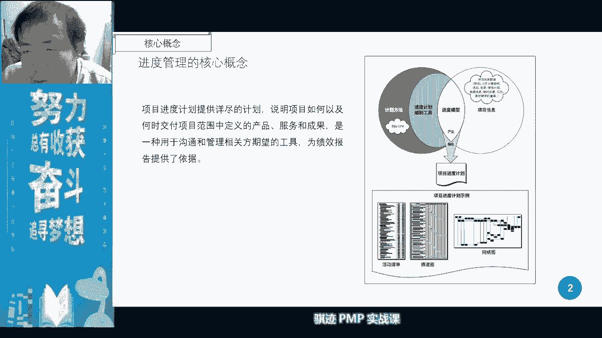
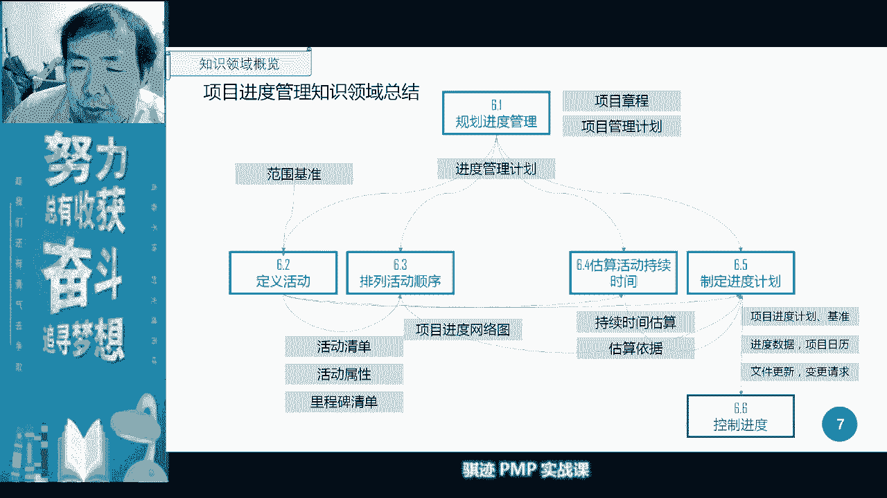
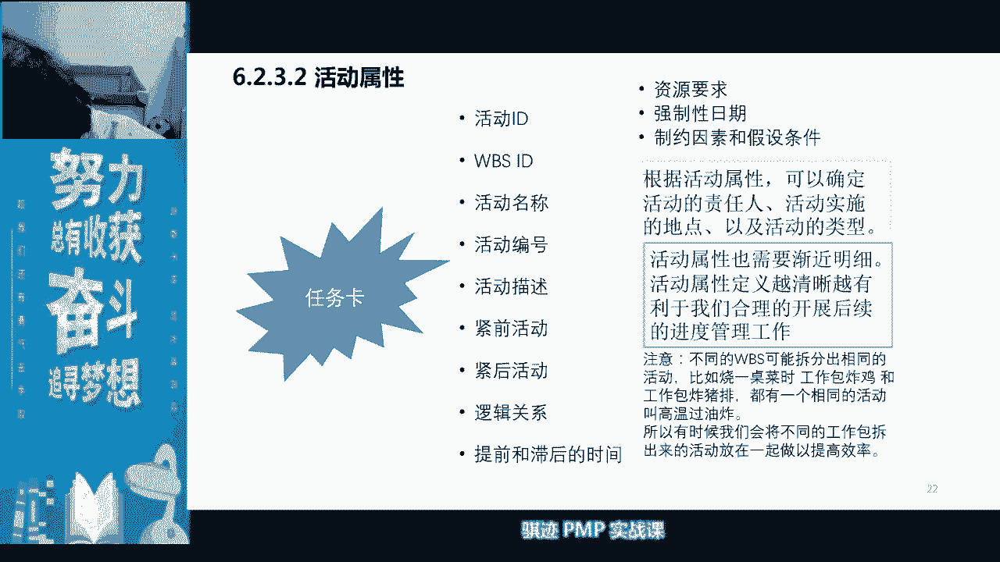
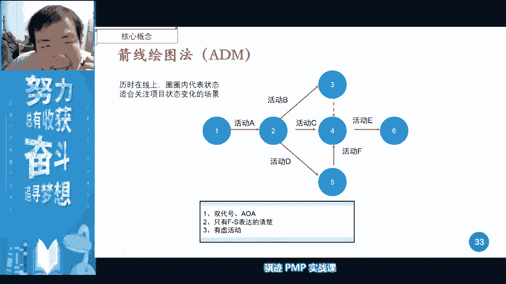
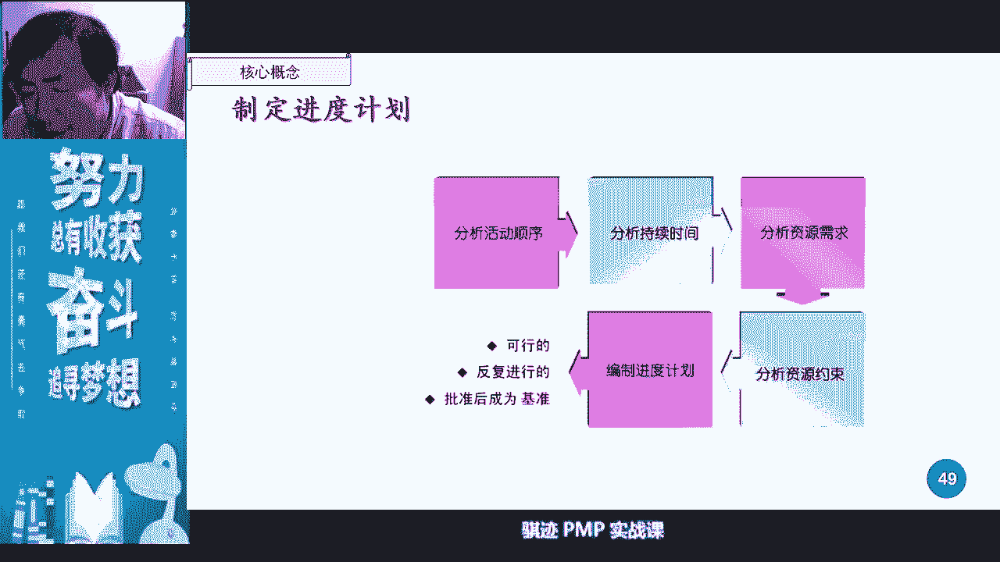
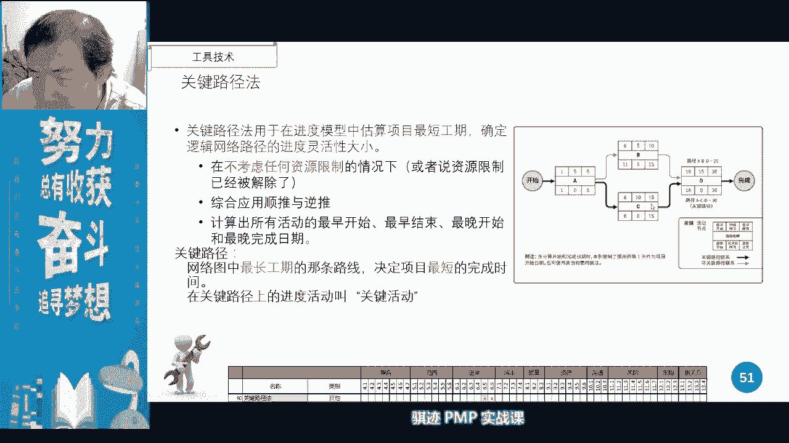
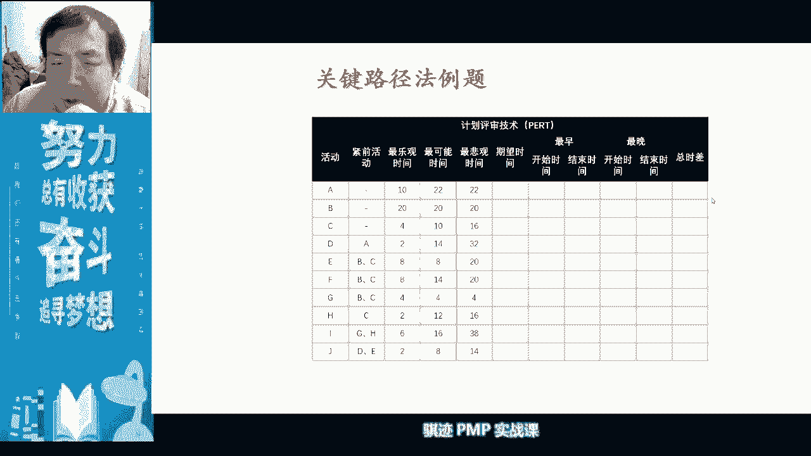

# PMP认证考试课程最新完整免费课程零基础一次通过项目管理PMP考试 - P16：PMBOK第六版 第六章项目进度管理-17 - 骐迹PMP - BV1Sb4y1f7Yt

因为我们正好等一下，有些同学嘛，我知道我们总有些同学会进来的，慢一点，好的我收起来好，大家好，我又来了啊，我又来了，上节课讲的进度的内容，上节课进度讲讲进度的核心概念，里面是我们。

进度是相关方最关心的一个知识领域啊，当然大家没时间做项目经理，最容易的遇到一件事情啊，就问你啊进度怎么样啊，进度落后不落后啊，就这样啊，这是最大家最关心的事情，所以精度管理呢非常重要啊。

是连接着我们的范围管理来的，有范围管理。

那么在管理当中，我们在实践当中发展出了适应性，这样一种生命类型的进度管理，他的经管进度管理主要用迭代的方式来体现啊，所以我们看的适应型生命周期的，它的进度如何呢，主要看它的每次迭代的工作量。

和完成的工作效率，好好发展，除了按需进度安需进入，更多的时候是啊甚至打破周期，按照以增量方式进行持续的进行发布的啊，所以按需进度呢很多的，现在我我们会有那么ci cd这种形式啊。

在很多的it领域会使用到，那么我们讲进度管理当中呢。

我们会考虑啊一个活动从它的定义开始，会逐步考虑这个活动的逐步明细啊，有这样一个概念，对吧，这个大家都知道，那么其次在一个活动当中，在一个活动当中，诶啊手机号登录了，ok在一个活动，在一个活动当中。

我们首先是对它进行定义，然后呢要决要其次呢要排列它们的相对位置，相对位置排到了相对位置之后呢，才能估算他们的理想状态的时间，最后呢要排除制约因素，最后制定出进度计划，大致是这个思路啊。

所以大家在上次课听完之后，如果对这个过程有深刻认识的话，今后记住这六个字，过程就非常容易对吧，先规划再定义，定义的时候排序，排序了之后再扩散时间，最后排除制约因素，制定进度计划，就进度基准。

最后控制进度是这样的过程好，那么我们继续往下讲，所以这个这个过程一定要记住啊。

所以在这个过程当中，我们讲进度是来自于我们的范围的啊，先用范围基准，先有放到基准下面的wb s，有了wb s之后呢，我们才制定出了进度，有进度清单啊，有活动清单，sorry，不是清单，活动清单。

活动单下面有活动清单，活动属性里程碑清单，注意啊，定义活动当中还输出一个里程碑，不要忘记对吧，然后呢，我们接下来呢就排列它顺序排列的顺序，得出了一个进度网络图，注意进度网络图是一个逻辑关系图。

它在初始状态下是没有任何的时间呢，它只有逻辑关系啊，不能作为我们项目的时间呢啊，进度的基准的依据啊不行，那么接下来呢我们要在理想状态下进行估算，每个活动，因为他也知道相互之间关系的嘛。

我们就估算它理想状态要多少时间，然后得出估算依据对吧，然后呢我们根据在机科学界会讲，根据实际情况呢进行调整，然后解除除一些约束啊，解除一些啊不可能实现的一些条件啊，进行妥协啊。

然后就是最后得出实际可行的一个项目的进度，结果啊，最后呢控制进度差不多是这样一个逻辑啊，然后能够把这些逻辑记住，记不住了。

没关系，回去再好好看一下啊，好好看一下好。

那么第一个呢也是规划进度，规划进度呢也跟其他的之前的哇。

我们学的范围管理是一样的啊，主要立一个规矩做规矩对吧，好吧好，他的规矩里面规矩是什么呢，我们是使用什么样的模型去做管理进度，然后呢如果他是敏捷的呢，它是怎么发布和迭代的对吧，如果他是预测型的。

那么多久更新一次对吧，然后时间计量单位我们讲可以按天计，按周记，按月季，按年纪对吧，按年纪非常少啊，然后还有遵循哪些组织的，组织链接等等这些东西啊，大家这里看一下，这是规矩，然后这里就不多讲讲了。

这是一个模板，不多讲嗯，接下来呢定义活动，定义活动当中定义活动，定义活动当中大家可以看到啊，我们关键是要滚动。

是规划，但是呢滚动式规划和分解呢其实同样重要，分解也很重要，我们之前已经运用过一次对吧，我们w bs啊，就是用分解对吧。

然后呢我们再继续分解为活动，你要活动三种类型对吧，然后活动当中活动当中一定要记住分解出活动，你能记住，但是呢我们分解出活动之后呢，活动是个动词，它有个过程，它是个实现过程。

一个w bs必然会分解出一系列的活动，这一系列活动全完成之后呢，这是它的原理，分析师的活动不足以实现它，那么说明你还有漏的东西没有分解啊。

也有可能有些东西呢我们讲前面是什么，分摊型的或者依附型的对吧。

依附型的支持型的这种东西啊，这是一个活动清单，例子，活动清单呢要和我们的我们在vbs单相挂钩啊。

然后呢要详细的去描述我们的，详细描述了我们的呃整个活动里有有哪些内容。

然后呢又通过活动属性来来进行对应活动，然后描述了颈前颈后等等啊，这些里边呢活动属性的各种属性，有些是在我们定义活动中就有了啊，有些事呢要通过我们后续的啊一些子过程才有。

比如说紧前活动和紧跟活动是哪里有的好，紧前活动和景和活动，是在我们执行完哪个子过程之后才有的，来，请在公屏里打一下，我看看，顺便看看有多少活跃度，啊你们再这样上课不认真听，我要一个了。

我要进行抽奖活动了，对吧啊对吧，按时上可能啊，抽奖有小奖励对吧，不按时上课，人要有小惩罚对吧，ok在公屏里打出啊，井前几何活动，是在哪个子过程当中被制定出来的，啊有些东西只记得fs啊。

我说哪个子过程子过程fs这种关系，而且是默认关系对吧，对排列活动顺序是对的啊，定义活动呢啊如果说定义活动，那说明你就没有好听，活动一开始分解出来是没有颈前颈后的啊，也可能并不是井田井号对吧。

比如说我们又要说啊，我们看这个例子当中，比如炸猪排，我们要说炸猪排了对吧，你们有些人没吃过晚饭，就要就要就要馋你们，比如说炸猪排，炸猪排，你你在做炸猪排的时候，是不是你猪排是现买，然后现炸的，不是的呀。

你很有可能是什么，今天早上买菜的时候，或者昨天买菜的时候一起买好的对吧，然后呢今天晚上呢从冰箱里拿出来再做的，所以他活动可能不是接在一起的，对吧啊，所以注意啊，就一定是相互之间就是几千年后的啊。

他还要考虑到一个工作效率，就比如说你买菜，我们一般人除了工作比较闲的，一般人工作买菜的话都不可能说什么，天天去买菜对吧，我们总共很多人也挺懒的对吧，买一次菜不知道吃个两三天，三五天甚至一周对吧。

然后扔在冰箱里啊，所以他很有可能不是警先进后的对吧，好ok都明白了啊，是活动顺序决定了哪些是颈前，哪些是紧扣啊，和他的逻辑关系对吧，那么提前滞后时间呢，提前滞后时间呢，等你t来来来再继续工兵力打。

我们再稍微等一下其他东西啊，稍微再等一下啊，后面就再也跟不上，我们就不管了啊，那么提前滞后时间，问你是从哪里来的，是从哪个子过上来的，啊哈哈我就知道会有啊，大家都知道我问问题风格对吧，我就知道有分歧啊。

还是排列活动顺序啊，啊我知道了，估算凡是填估算活动时间的同学啊，ok啊你们又你们又上套了对吧，还是排列活动设计，因为排列活动顺序之后，我们会有一个什么记得吗，我们排列活动顺序有个f s s f。

然后有一个加几天，前几天那个就是提前和滞后的时间啊，对吧对吧，对不对啊，所以啊你们又被我挖到了，注意啊，提前之后时间也是排列活动顺序的决定，这但是提前了之后，之间只是相对于两个活动。

相互之间会有前后可以移动的那些那些时间啊，但它跟和整个时间轴其实没有直接关系对吧，讨论太深不深啊，同学啊，如果考试问你考到一道题，问你啊的当前执行，当前执行了一个什么，当前执行了排列活动。

排列活动顺序的子过程，执行完成之后，请问项目经理的活动清单当中的活动属性，有哪些可以去填写了，然后让你选一下，然后你就傻眼了，是不是是不是我很容易考这道题吗，这个题很容易考的，就看你的概念呀对吧。

这不难啊，记住概念，直接一分到手啊，记不住吗，直接一分扣的对吧，这个这个是我们直接就学过的对吧，套路太深啊，同学们记住啊，p m p考试就是套路，你们最后一次考试将面对的是pmp考试。

改版前的终极套路之套中套，吃饱了走走，因为偏僻，改版之后的大家上次那个也看了啊，上次那个也看到过，改版之后他考试的形式变多了，更贴近实践了，他可能以后就不再用这种套路形式去考你们了。

所以你们将面对的是p m p多年考试来了，套路的大集成的最后一次演示啊，之后的套路呢就会可能会减少，但是呢考试的内容跟天气工作，实际对你们的工作经验要求会更高啊，ok啊，所以我的套路还是不错的。

就怕以后连套路都没有了。

好那么我们继续讲啊，我们在定义活动当中还输出了里程碑对吧，我们有选择性里程碑和强制性里程碑，对于甲方来说，他可以有权利要求，所有的里程碑都是强制性的对吧，因为你乙方要不要签这个合同啊对吧，要不要钱啊。

但是对于乙方来说呢，有些是强制的，甲方强压给你了，还有一些呢是你自己可以决定的啊，可以决定的，那么你可以自己去设定用，一般用于检查一些工作状态之类的啊，我们讲过啊，所以里但是里程碑注意它的持续时间为零。

代表一个重要的时间点啊，在某些图当中的里程，在某些图里程碑会设定被画成一个活动，但是它就是一个历时为零的活动啊，这要注意李程碑呢总是跟着一些活动的，某个活动的开始或者某个活动结束去走的。

它标志着一个事情的发生和，一个重要的时间节点的到来啊，所以移动了一些活动的话，里程碑又跟着会跟着动啊。

好，那么我们定义完了活动之后就可以排列顺序了。

对吧，排列顺序就来了啊，然后有一个同学在群里面，我们已经踢了颈前关系那个翻译啊，我一下老师一下子忘记了，所以啊ok啊，感谢同学网上搜了一下，其实我是记得，但是我我忘记了那个题怎么翻译的啊。

d其实就是那个diagramming啊，颈肩关系会读法，我们上次说过了，对吧啊，然后我把它贴在群里啊，感谢那位同学啊，叫presidence啊，戴尔官是绘图法，绘图方法。

其实其他是呃presidence是颈前关系，dging是绘图mather的方法，对颈肩关系法ok没毛病啊。

老铁没毛病好，那么颈前关系法当中，我们啊我们这是运用在活动排列，活动顺序当中的，你讲紧急关系法有很多种，很多个关键要点啊，这个时候我们考试重点金钱关系我也肯定会考，因为做一个项目经理。

画绘图都回不来的话，实在是有点丢人啊啊，但是关系很简单，就四种关系对吧，我们讲f s s f f f s f啊，fs是我们默认的关系对吧，从结束到开始。

where a finish them be start对吧，a finish别start，在很多情况下就可以等同于什么b finish，a start对吧，哦不不不，sora finish。

b start就等于是b start a finish对吧，一样的啊，其实是一样的，ok啊这四种关系要明白，考试当中呢我们默认都是f s播标特殊，外面都是f s啊。

ok这个要知道，那么颈肩关系法呢，它的活动历史在活动内，活动内线代表的是各种各样的关系对吧，各种各样的关系，然后呢这是一张锦星光下关系图对吧，我们讲这个图上有个瑕疵啊，这个是pm博客上面的一个地图。

这个地图是有瑕疵的，把它移到这里来会更好对吧。

ae到这里来会更好好，那么呢我们知道既然有关系，他就各种各样的强制性关系和外部依赖性关系，那么为什么讲这个呢，这个呢上次课呢，因为我怕你们脑子搞音就没讲，这里稍微可以讲几秒钟啊，各种关系其实无所谓。

关系主要是什么，取决于你什么，有时候关系是可以打破的对吧，有些东西呢你是可以依赖可不依赖的，有些东西是可以打破的，有些东西是可以用花钱打破的，但有些东西是绝对不能打破的，比如法律对吧啊。

那所以说有当我们为什么要讲这点，就当我们排列完顺序，然后后面要进行呃，呃估算活动时间，最后我们要制定网络计划的时候，当我们遇到需要可能一些调整啊，解决解决一些问题的时候，依赖关系的强制程度和重要程度。

就成为我们的一个考量点，因为如果可以花一定的代价，把有些依赖关系打破掉的话，那么我们的呃我们的进度安排会更更灵活，更灵活，所以要看这依赖关系的程度对吧。

那么我们看到吗，提前量和滞后量看到吗，这是提前好，这个是提前量，之后量呢是我更新之后的啊，这是pm博客啊，第六版当中的时候啊，第五版那个上面印的有些东西的不太精确啊，所以我们上次讲的话。

可能有些同学没听懂，我们这里稍微重复一下，在提前量滞后量这个呃一块当中，我们可以看到啊，如果这个这个活动以这样关系，是不是这是一个什么关系啊，fs关系对吧，fs关系应该是他结束，他直接开始了。

但是它有一个-2提前，就是意思是什么，这个活动呢，绿化施工本来是制作委工清单的一个后续活动，但是呢他把它提前了，就是说两个活动呢会有两周的并行时间，并行时间啊，并行时间是这样一个，这叫提前量。

所以-2都是往前后面被指向的，那个负的都是后被指向的那个往前提的啊，记住负的都是就被指向了往前提的啊，那么相对应的如果是加的滞后量呢，就是被指向的往后移往后移，它有一个加15的滞后量。

那么这个大家可以关系就看到看到吧，因为本来是两个是这是s s关系是同时开始的，但是他加了个15，那么就是被指向的往后移了15天啊，所以这个图表示呢就非常清楚了，非常清楚了啊，好吧呃，有不明白了吗。

这个有不明白吗，啊那我那我问你们个问题，那么本来是他要用15天时间，本来是s开始的，现在是s加15的话，这个关系在这种特殊的情况下，可以等同于什么，可以等同于fs关系，为什么，因为他往后面挪了15天。

其实等等他指到他的时候，就等到他开始的时候，其实它已经结束了已经结束了，但是呢他们俩没有强制依赖关系，这个活动的结束并不是依赖，只不过他们两个正好是按时间都能排的啊，ok啊这是一个特殊的例子。

特殊的例子，那么你们可以不用考虑这个例子，但是你们在管理项目也知道，有时候如果你呃在两个活动，比如说fs关系啊，s s关系时候，如果你提前知乎链加的太多的话，他可能相互之间的关系啊和联系就被打破掉。

对吧，ok啊都明白啊，我们能听懂，没听懂，能不能听懂的同学请忽略啊，就是我们还是要满足考试为主啊，ok那么这就是一个fs减两周啊，就往前移被指的往前移，这个是那ss呢加15天，就是往后移。

被指向了那个活动往后移还可以啊。

ok好那么这是一个进度网络图的示意对吧，这个示意当中这个画的不太好的，就是这个几何h对吧，你往这儿指急就是结束，我急往正网址呢就是这个结束在很多的时候呢，如果他没有这条线的话，其实是无所谓的。

因为没有这条线的话，也有可能h是开始直接指向结束对吧，但是很多时候呢没有这个箭头，这个图呢就会有问题啊，所以这个图我们总体来说画质有问题，但考试还好不好，不考画图，那6月份的考试就不知道了啊。

sorry i don't know啊，ok那么我们稍微介绍一下间线绘图吧，叫d m d m主要表现是什么东西呢，一个项目的进行过程中的不同状态，所以他的活动和历史呢是在线上用圈内的，圈内的不同状态。

来表示一个项目的状态的改变啊，所以他专门注于用于什么，专注，用于就是说非常关注项目状态的一个一个一个，时间进度的表示啊，所以a d m呢只有fs关系。

他没有其他任何关系的对吧，然后我们讲pdm是默认fs关系。

但是可以有其他关系啊，但是a d m只有fs关系，否则他就不清楚了啊，记不清楚了，好ok这六位介绍一下。

大家能看懂看懂，看不懂的话，可以小窗我们上课就不占时间，然后我们把我们把活动顺序排列之后，就开始估算活动时间啊，注意估算活动时间，在初始状态下的时候，其实它是考虑的是一个理想状态，考虑的是理想状态。

因为很多事情，你上来如果考虑的条件太多的话啊，我们在排列排一个项目排队的进度的时候，上来考虑太多的时候，你就没法排了对吧，我们先把很理想的状态呢先排出来，然后呢再把各个制约因素呢。

假设假设制约因素呢加进去，然后看看会有意想一个一个往里面加，所以你的项目呢肯定一般来说，肯定都是被比你最理想的持续状态要长的啊，是要长的，所以我们一开始估算的时候呢，会有类比估算。

比较毛估估留下比较大的空间，然后逐步逐步精确，然后逐步逐步把各种各样的假设，条件因素来加进去，同时这个这个过程像这样一个过程啊，从类比到参数，这种估算过程也是伴随着我们范围的明确。

后面有讲一伴随着成本的明确，是相互之间进行协调统一的进行的啊，我举个例子，比如说我们我们至少一个项目，我们本来估40天的对吧，先类比估算估40天，然后呢我们做参数的估计呢，我们这个40天呢可能不够精确。

可能要到42天，然后呢发现如果要42天做的，我每天都要干活，然后周末要干活，要加班对吧，加班了，加班费觉得成本太高，我们项目赚的不多，那么决定周末不加班，那么是不是周末又要有好几天不能干活对吧。

然后忘了拖拖拖，可能要拖到60天啊，估算当中发现有些活动呢有风险，我们讲很多的活动，当它汇聚和交叉的时候，它是会有风险的啊，那么我们会把它带额外的多加点时间啊，就是我们会讲对吧，所以煮煮五锅。

所以你看最理想的可能是60天，咕噜咕下来可能是什么，只要65天可能做完对吧啊，但是你的估算，我们讲最后在估算的时候要估算一句，为什么不这么估算呢，就是因为我们已不加班对吧，周末不加班。

然后呢有风险的活动呢，有时间冗余对吧，然后呢是参照历史模型对吧，我们有行业的成熟模型的，据估算对吧，然后有类比其他项目这种估算为依据。

然后做得出的差不多是这个意思啊，不知道大家明白了没有啊，那么类比估算特点对吧，速度快准确，第一耗时少对吧啊这个大家都知道啊，拍脑袋想一想对吧，但类比呢我们在考试当中呢会有什么。

我们他如果让你说是做类比估算，他肯定会告诉你什么，我们参照了某个项目，然后呢按照某个项目按照比例系数，比如说那个那个项目呢投资是100万，我们这个项目投资1000万，那么放大十倍对吧。

其实这种方式其实挺不科学，但是呢如果你在没有资料的情况下，你是不是上来可能只能用这种方式先算对吧，接下来我们会用参数模型啊，参数模型呢会使用到各种各样的数学模型，公式等等啊，他那各种各样的成本啊。

花销啊，精确度啊都中等，但是非常依赖数据模型的有效性有效性，你讲有时候呢当你没有之前没有历史实践经验，那么时候呢你可能就没办法，或者说这个这个活动呢，你没办法做拆解的时候拿。

那你只能使用参数估算作为最后的估算依据了。

啊，估算依据，然后我们讲我们说如果有些事情真的是，从来大家都没有做过，或者有些事情呢呃参照别人的事情，每每个项目都完全不一样，没办法参照，那么我可能用三点估算去做估算测评对吧，然后呢有个三角和贝塔啊。

我们默认是这里的一种啊，大家看我鼠标默认是我们的公式当中呢，除以六一份最乐观加一份罪，被关家四份的最有可能除以六，这样的方式进行得出一个三点式估算啊，3。4估算在pm博客的老版本当中。

我在pmbok第五版当中呃，也起源于叫p r t计划评审技术p r t啊，这个呢在第六版中已经不怎么用了，ok有一种，那我们非默认的，如果他考试啊，如果你不信，真的好，真的遇到了三角估算。

那么你要知道一下啊，三角估算就比较粗糙，就是直接三三个数字，最大最小最有可能除个三啊，这种来精确度不高啊，精确度不高。

那么接下来最精确的一种就是什么，但是它依赖于什么啊，依赖于或者严重依赖于你的成本和范围的分解，你要成本范围分解到最细，那么你才可以直向上估算对吧，那么也有可能资源分解到最细，因为资源就意味着钱嘛对吧。

那么你分解到最细的时候，所以它很依赖于那个啊，其他的知识领域的支撑啊，所以他成本最高，耗时最长，精确度最高啊，我们其实也可以渐进明细啊，这里没有提，但也可以，为什么呢，比如说我自己上估算的时候。

我对近期的工作呢，然后对一些远期的工作呢，我可能从什么控制账户开始估算，可不可以也可以对吧，大家记得控制控制账户概念吧啊也是可以的好，那么我们在估算当中，我们就要涉及到应急储备和呃管理储备对吧。

我们叫应急储备呢是不计绩效的，是应对已知风险的啊，那要有应急储备积极下的啊，是应对已知风险的啊，项目经理支付，因为什么我们识别过了，做好准备了，所以这个理应及我们的技巧管理储备呢，是应对未知风险的啊。

因为没有经预测到估计到，所以一般只能花钱解决，所以这不能够记我们的绩效啊，这样注意学到这里就可以了啊，我们在风险和成本当中会详细再解释好，那么我们的风持续时间，我们讲一下项目当中。

我们对于持续时间的估计呢，所以但是要指出一定变动变动区间，因为你如果动来动去，有可能有些项目变动特别大，你就没办法估算它的持续时间了啊，但是这种估算的持续时间呢，仍然是最理想时间啊，最理想时间。

然后又有估算依据对吧。

我们前面有各种各样估算，有估算依据了对吧，那么有了这些之后呢，我们上次讲了啊，那么我们今天的第一第一部分的课程啊，但是切的我觉得是很值的，因为这些东西后面就不会再讲，但是非常非常的重要啊，非常非常重要。

那么首先请大家把所有的这些活动，他的期望时间列出来，然后呢将这些活动的啊，将这些活动的呃，所构成的一个我们的进度网络图列出来啊，ok好，那么这样，大家在自己的电脑前列，然后我给大家每个人十分钟时间。

现在是08：29，08：30，我给大家每个人十分钟时间，每个人将这些东西算出来啊，我希望大家每个人都自觉动动手动手动一下，然后呢我在我的电脑上，我在我的电脑上，我也动手算一下，帮大家一起算一下。

然后我们的进度网络图已经画好了，因为电脑上画图线画的比较慢啊，我已经画好了好，那么现在开始啊，十分钟十分钟开始，每个人给我动手，然后做完之后，我要求如果能如果能够十分钟内做完的同学。

尽可能的我们在我们在聊天室，或者是在那个我们的微信群，聊天室和卫星群，把我们贴到，贴到我们的聊天室和微信群当中啊，ok啊贴到聊天室或者贴到微信群，最好是贴到聊天室当中啊，画进度网对画进度网络图。

同时要算出每一个活动的期望时间啊，因为这个是涉及到后面，我们要所有的这些东西的，我们要涉及到他的啊一些进一步的属性，讨论好，每个人开始十分钟啊，我在电脑前做啊，我觉得我应该是够的啊。

第一个活动我们最乐观，最有可能最悲观对吧，第一个活动3+20+6，括弧括弧除六等于多少计算机来啊，老年人对吧，29÷6，那么来了等于4。8，对不对，等于4。8，4。8，我们讲一律按照整天来计算，五啊。

五，第二个第二个活动，10+48啊，15，除六，加48，加15÷62。16，就是13对吧，第三道题目，第三个活动，sorry啊，是，20+100+32，每个人都算一下啊，请每个人都动手算一下啊。

算完之后就要把你把你们算的结果，发到群里来啊，拍个照片或者就是各种各种手段都可以啊，ok啊，我们来算一下，152÷6 r3 点就是26对吧，r3。5，那么那么这就来了啊，第四个活动大家可以看到啊。

567567是不是中心对称的，那么一看就知道啊，第四个活动直接可以出答案啊。

这是技巧，大家看到了啊，第四个活动当中，你看最乐观，最有可能最悲观，正好是567，以六为中心对称的啊，ok那么在这种情况下，你可以直接就出它的答案，必然是这个中心对称的，必然就是六啊。

既然必然就是中心啊，第五个，第五个是不是也中心对称啊，还是六吧啊，我们来算一下，36+10诶，不是啊，不是除六诶，不是啊，sorry sorry，那就错了啊，那就错了，2~64啊，不是东西，7。

69888，嗯462 14+13 14÷65。6啊，66666啊，那也对，基本上是中心对称几，几乎是中心对称啊，六第六个，嗯第六个十十10 14 16，10+14x4+16，那么这是多少呢。

等会我把这个缩小一点，82÷64，看不清楚题目，ok题目在你们本地有没有ppt啊，你们ppp都可以看，都可以看得见的，ok最有可能为什么乘四啊，那那那又暴露出来了啊，最有可能为什么乘四啊。

最有可能我们是三角和贝塔，为什么不用excel拉公式，ok我是手算你们考试的时候有没有excel，我这边你们手算一遍啊，所以每个人给我动手算一遍，每个人给我动手算一遍，你们考试有没有给家用啊。

这这这么算多久啊，这么做没多久啊，你看看没几分钟啊，现在算我已经算只算用了五分钟啊，你们所有人算一下，拖下这个计算很快的，ok啊，赶快默认是贝塔分布的，不要给我偷懒，每个人给我算一遍啊。

第七道gt到12加，14x4+22，2+56加，等于15对吧，那么第八个249，五对吧，第九第九个是最复杂的对吧，第九个是，65+70x4，加上85÷6等于，考试有计算机的，有的，但是没有给zl。

这就是为什么不让你们用给zl去算啊，7171。6，那么就是72，60+5+17，13。14对吧，第十个是14，好，ok ok啊，我们再往下面一点点，那么11，7+8x4+11÷6等于。

7+32+11 a50 除以68。3，3399，加13+15，上限是52+15+82。5，63，最后一个，乘4+34，都算出来了吗，都算出来了没有算出来的同学，然后群里贴给我一下啊。

44+10+34÷64对15，ok我算完了，正好十分钟，ok啊好，我已经算完了，不知道你们算完了没有，反正我是算完了，大家可以看我的屏幕，ok啊，啊pi当年考试是一人一个计算机的，后来计算机丢失严重。

然后改成大家共享计算器了啊，ok啊有同学在群里面啊，贴出来我们的这个话啊，线路啊非常好啊，我已经看见了啊，好我给大家看一下，有位同学灵魂画图，我给大家看一下灵魂画图，非常好啊，表扬这位叫曹自身的同学啊。

动手我跟你说，考试的时候就要动手，知道考试的时候没有人帮你的啊，就要动手一下，就要自己动手，知道吧，ok啊也非常好，有同学贴在群里了啊，非常好，灵魂画图，大家给大家看一下，结束，ok啊非常好。

每个人都自己动了手了。

ok啊非常好好，那么这个题目的图就是这样的一个图，对吧啊，这样一个图，ok啊很多很多的同学，这里其实呢我给你贴一个大家图，在旁边给大家看一下啊，啊这个图是谁画的也挺不错的，我们群里画的啊。

也有把结果算出来，考试有可能就要这么画图的，知道吧啊但是这个这种题目加减乘除，只要会算的同学是是中国人，会算加减乘除的，同学都都可以什么算出答案的啊，ok这道题目不难不难，为什么在动手一下。

让他感受一下这种计算题，也感受一下考试的时候不会让你说的那么多，但是肯定会有这种计算的步骤，然后问题来了，所有人都现在停一下啊，如果没有做完的都停一下啊，非常好啊，积极参与都非常好，非常非常非常开心啊。

大家其实都积极参与啊，那么问题来了，那么呃我借我借一位同学的这个图来看一下啊，天天给你们参照一下，那我问你们在这样一个图当中，现在你作为一个项目经理，当看到这张图的时候，那么我问你们这张图当中。

你们认为哪个活动风险最大，我如果要要压缩项目的进度，我最应该压缩哪个活动，最不应该压缩哪个活动啊，请告诉我在公屏上告诉我，ok啊，这是这是一些实操的概念啊，实操的概念，非常好，我看到微信群里。

我们的聊天群里嗯，ok啊好，所以今天的课确实确实有很多活动，一和四应该有人说风险最大的是一和4k啊，那么最应该压缩哪个活动呢，大家觉得最应该压缩哪个活动，啊非常好啊，ok 4的风险越大为大。

为什么四的风险越大，ok啊我来解释啊，大家大家看来理解都是不错的啊，他是5678的，5678的前置活警前活动，所以四如果出了问题的话，整个工作链也出问题，有人说老师123 11。

12 13不是也是唯一的路径上吧，但是它和其他的工作的交界面是不一样的啊，其他的活动最多像11只有三个交界面对吧，九和十都只有什么三个交界面，交界面越多的活动，这个活动在执行的过程中越容易出问题。

所以这个项目如果我要放冗余时间啊，应该放哪里呀，应该放在4k，恰恰不应该压缩四，因为四是最容易出出事情时，影响面最大的，因为会影响一系列活动的发生啊，所以恰恰不应该压缩四啊，因为而且四也没啥油水。

好像说你们看四九几天最应该压缩的是，一般是一个项目活动当中历时最长的，同时呢所处的地方呢有风险又没有那么大的，所以很明显是应该是九，因为九最长久，明显的很长，有70几天，所以应该把酒给压缩一下。

因为越长的东西是不是越大对吧，就像减肥一样对吧，一个胖子像我这样的胖子对吧，减十斤肉和我们群里有些同学啊骨瘦如柴了，或者有些女生对吧，身材很苗条的，减十斤肉是一个概念吧，老师们出去征战，桑拿出身汗。

跑个步啊，弄两拳一个呃，一个礼拜也不用，可能三五天可能十斤肉就显现，有些东西减十斤肉，简直要他老命了是吧啊，那么有什么方法减肥最有效的，加班加班加班是最有效的减肥方法，ok啊ok啊好。

我们掌握了一个概念，什么概念啊，我们后面也会提到，就是汇聚分支越多的这些活动风险越大，越不应该去压缩它，而反而要给他一定的冗余时间对吧，就是我们前面讲的要给他一定的储备，而我们像九活动这样的时间。

历时特别长的这些活动，我们应该给他啊进行压缩，然后能能够直接压缩掉我们整个项目的历史，因为九这活动其实正好可以几乎肯定不用算，就知道他肯定在关键路径上压缩，它可以压缩整个项目时间对吧好。

这是一个项目经理管进度的一个最基本思路，明白了吧，有些活动它关系到很多其他的活动，这种活动呢不要去压缩他时间，因为很很有风险啊，反而给他一定荣誉，有些活动呢跟其他活动关系不大，但是那活动特别冗长。

这个时候呢你就把精力放在那些活动上，看看有这个活动有哪些步骤呢是可以优化的啊，又坏好，这就是我们这道题的详啊，呃讲的内容不知道大家明白了，过劳肥，嘿嘿嘿哈哈。

好好好，那么我们继续往下讲啊，那么接下来我们要做的就是制定进度计划啊，这道题目我们刚才做的那道题目呢，正好帮大家把上节课学的一些计算，我们的贝塔计算精度，网络图的绘制呢，所以做了一下啊。

接下来呢我要进行制定进度计划，在我们制定进度计划当中，我们要考虑到一个很重要的东西，就是说什么资源需求和制约因素了对吧，资源的制约是一个项目进度当中，制约因素最大的一个制约方向啊，这最大的一个制约因素。

但不是唯一的，比如说天气，比如说这两天天气特别冷对吧，大家无心干活对吧，进度肯定就会慢对吧，好像有些有些时候啊，天冷了就是没法干活，也有对吧啊，天热了就没法干活对吧，春天特别困，也没法干活对吧。

夏天太热，有没有秋天呢适合出去郊游，也没法干活对吧啊，所以各种各样的制约因素制约着我们的干活，要把这些东西都克服掉啊，要把这些制约因素克服掉，有些制约因素呢是可以克服掉的，有些是在客观的存在。

叫做我们的事业环境因素没办法克服的啊，你只能进行化解对吧，只能接受对吧，诸如此类啊，好那么我们在制定这个进度计划当中呢，我们会通过运用比如说各种金融工具啊，运用关键路径法生成我们完整的地图。

是六格网络图啊。

我叫六宫，我叫他六宫格啊，好我们后面就会看到啊。

慢慢来，我们那这这个子过程的内容特别的丰富啊，首先我们制定进度计划的，制定进度计划，其实是只有几乎完整的去执行了一遍，我们从定义活动之后开始过程，我们会重新进行分析活动顺序，这个时候会考虑什么活动顺序。

在排列活动顺序，我们考虑尽可能的将什么，将活动放在有最好的资源利用条件的位置，进行执行对吧，进行执行啊，啊就比如说啊，就比如说如果我们现在是个建筑项目，建筑项目，那你可以看到什么建筑项目，建筑工地施工。

他们最喜欢在什么时候施工啊，大规模进行推进施工，最喜欢在春秋两季施工，为什么夏天施工环境特别恶劣啊，今天要站高温啊，什么东西环境特别恶劣，春秋两季呢气候适宜，都有时空，冬季呢因为会临近春节。

并且施工不变，所以资源利用率不高啊，所以如果你要安排的是一个活动顺，序，是一个项目的施工的话，建议大家最有可能是在春秋两季去施工啊，会比较好，然后呢就是排列不同的活动，放在不同的顺序，不同的位置呢。

它会有不同的时间持续时间，这个和我们的事业环境因素有关，这个时候就要考虑事业环境影响，然后分析持续时间，因为我们有些时候迫不得已，只能在一些条件不利的情况下执行某些活动，那么他肯定持续时间。

要比原先预计的什么要长啊，我们经常说的一句话啊，你每天我们每个人每天啊，比如说早上都要起床对吧，夏天起床，我问你们是不是1年之中起床时间最短的时候，一你早上起来很热就睡不着，第二你起床起来。

尤其是男生是吧啊t恤一套裤子一拉对吧，牙一刷，冬天起来呢，先被窝里缩一缩对吧，然后起床先把袜子穿好，再把棉毛裤穿好，在迷毛衣再穿好对吧，然后再抖抖嗦嗦的去烧点热水，然后刷牙洗脸对吧。

然后东西也不能拿来就吃，还要在微波炉里热一下对吧，炉子上烘一下对吧，然后这他妈半天可能半个小时才能出门，这就是活动持续时间在不同环境，事业环境因素下的不同的差别，的一个最好的例子啊。

所以你们以后就想一想，很多活动并不是你想当的人认为啊，他应该多少时间，多少时间，你要考虑到客观环境和环境，那么客观事业环境因素分析完之后呢，我们接下来就要分析什么，分析我们的资源需求，资源需求。

那么看看不懂活动有哪些需求，那么资源需求可能和其他的更多因素啊，发生关系，比如说成本，比如成本，我们后面那章会讲到啊，我们的项目的钱不是天上大风刮下来的，我们可能要分阶段投入钱。

可能有些阶段呢我们需要用资源的，可能钱花完了对吧，钱花完了就没得资源，就呃也就没得资源买了对吧，你不能叫农民工啊，你可以叫农民工对吧，暂时性啊欠薪干活，但你不能让农民工一直欠薪干活对吧。

比如说你你的员工两三个月发不出工资了，你还让他干活，那干什么干对吧，然后呢分析资源约束啊，分析资源约束，那我看下资源运输当中呢，我们一是资源的可用性和数量，那是资源的能力，第二是三是资源的态度对吧。

各种各样的因素都会影响资源，这时候呢我们要找出他的非量化因素啊，比如说有些有些事情只有这个高级资源，稀缺资源能干对吧，那么他就是一个因素，他可能这个人呢身体不太好对吧，然后呢干着干着呢。

哎呀不要身体不行了对吧啊，然后然后比如说要休息对吧啊，要要考虑到各种各样的非量化因素啊，就去考虑，所以分析资源因素当中，我们会有一种技术，后面会讲的叫做资源平衡，就是什么啊，有些稀缺资源。

有些活只能这个专家干，但专家身体不好怎么办，你不能让他老加班对吧，你只能说什么，这专家干完了啊，他是活在那里，但是专家不能让他熬夜，不能让他太辛苦，那么让他明天干，后天干，把活动时间拉长对吧。

会有这种事情，那么考虑到诸如此类，这么多因素都考虑进去之后，那么你的项目进度，一般情况下都会比理想状态要拉长，等到拉长了之后，我们通过妥协调整啊，甚至通过裁剪放弃一部分不必要的活动。

或者并不是急需的活动，最终制定出一个项目进度计划，这个计划呢就成为了基准啊，这个成为基准，一旦它成为基准之后呢，他就有严肃性啊，我们就按照他执行了，因为已经给你进行裁剪调整了一个过程有了。

那么你的这个过程应该是你的这个进度计划，作为一个成熟的啊，有机富有经验的，成熟的项目经理，应该是有高的可执行性和高的可呃，可能成功的可能性，依据这个进度要经执行了啊，当然啦大家懂啊，当然了。

这个如果什么事情都能让你预料到，你就是一个这个世界的神了对吧，当然是不可能遇到，所以很多时候呢你只能尽可能预测对吧，让它可能性更高一点，他总有意外啊，管项目的最大乐趣就是总有意外等着你。

总有surprise等着你，ok啊好，那么讲到这里来了，那我可以再来讲啊，这就是我前2年比如说搞一个项目对吧，然后最最重surprise是什么东西呢，就是人多，我觉得没有人能够控制的啊。

比如说我一个有一个项目，我要我要有一些设备，比如说我要从美国买，然后美国和中国打起来了，好然后怎么呢啊，大家抢着要在加关税之前要进口进来好，你的设备呢，订单呢本来说预计一个月能够到货的。

现在变成两个月才能到货啊，这个surprise你想都想不到的对吧，就做项目编制进度计划当中，有些事情你是能想到，有些事情永远想不到，但是呢你要用尽最大可能性，将一切可能性考虑进去。

让你的进度计划有最大的可能性，事实是实施成功的可能机会，这是我们的一个原则。

ok啊好，那么我们继续往下讲啊，如果后面的内容还是挺多的啊，那么精度网络计划是一种什么，它是一种综合技术，它综合了什么关键路径法，资源优化的技术，建模的技术储备，分析的一个技术，以及审查网络，对吧啊。

我们刚才看那个活动，我们讲活动四，就是一种关键路径上的高风险活动，因为它有很多的后续活动和一个警前活动对吧，所以他是个高分流，所以我们经常要去审查一下，我们的进度网络图啊，那么在实际的项目当中。

我可以告诉大家，你们实际项目当中，如果你把整个项目所有的活动，做出一张关键网络图和进度计划，这个进度网络图和关键路径法的图做出来之后，你会发现大量的活动是复杂交叉的，所以这个中间的复杂活动程度呢。

并不是前面那张那么简单的图，能够表达出来的啊，它会有很复杂的关系，ok好。

那么我们进去看一个一个来看，不要急，第一个是进关键路径法，这是我们非常啊考试必然会考啊，非常不可能不考的呃，一个知识点，关键东进化的英文叫cp m啊，critical pass mazement啊。

那么cp m是什么呢，注意啊，大家这里注意跟着我来，这里有一个东西一定要注意，在不考虑任何资源限制的情况下。

那么这个前提是什么啊。

就是说当我到了cp m的时候，其实我已经经过了一个什么啊，我们前面制定进度计划的一个分析资源，这个阶段已经过去了，而且已经把资源约束已经排除掉了。

才能做cpm，所以做cp m做关键路径法一个非常重要的前提，永远也不要忘啊，如果题目是你提示里说，我们有哪些资源约束还没有解除的，那么它不能用关键路径法，注意啊，这个一定要记住。

或者说资源限制已经被解除了，那么也可以用在关键路径法，这一定要注意啊，那么关键路径化当中呢，我们会考虑正推和逆推，我们一定要结束，找出一个活动的六个关键时间啊，大家可以看到旁边这张图。

这个叫我叫就叫六宫格对吧，我叫它六宫格啊，这个六宫格什么意思呢，我先给大家字面解释一下，后面我们快来看详细定义啊，这个格子左上这个格子叫做最早开始时间，表示这个活动最早可以在什么时候开始对吧。

然后呢右上这个呢叫最早结束时间，表示这个活动最早可以在什么时候结束，那么他们中间这个五，来表示这个活动的持续时间，这个活动持续时间大概率就是从哪里出来的，那请告诉我这个活动的持续时间大概率。

我们是从哪种计算方法出来的，估算方法出来，啊请告诉我，诶同学啊讲三角的三点呢，同学呢可以，但是不够精确啊，贝塔估算三点估算当中的贝塔估算三点估算，当贝塔估算啊，白塔法哪有白塔贝塔法好吧。

ok啊字打错了啊，ok啊，所以记住考试的当中如果算这个，如果要算这个值的话，记住啊，多数都是从呃贝塔过来，多数都能被他过来啊，o那么贝塔那个公式所以要记住对吧，然后下面三个格子呢。

这个格子呢叫做最晚开始时间，最晚什么时候，这个活动应该开始做了，那么相应的这个格子也是什么最晚结束时间啊，但是但是这个格子叫什么，这叫总浮动时间，ok啊，总浮动它不是自由浮动，这总浮动时间啊。

后面我们会定义讲这个呢稍微复杂一点，所以这个六宫格当中会有一个特点啊，我们后面会讲点上面三格呢是可以横向计算，下面三格千万不能横向计算，谁计算谁是笨蛋。

谁计算谁是笨蛋。

那么我们来看一下，我们既然讲到了有这样一条关键路径法，关键路径上的目的是找出一条关键路径对吧，比如说这个图例当中，这是一条关键路径，因为这条路径最长对吧啊。

那么那么接下来自然也会有什么有次关键路径。

我们讲关键路径当中，一般它的总浮动时间一般为零为零，因为这条路径是最长的路径，这条路径每延迟一天，项目就延迟一天，但是这条路径呢比这条路径短，为什么这两个活动是他们共有的。

但是这条路这个活动比这个活动短五天，所以在这个非常简单的例子当中，我们直接可以看出，这个这个活动可以五天的浮动，所以他最早最晚开始时间，和最早最晚的结束时间，各有什么五天的浮动对吧，五天的浮动。

这个是这个是要注意的啊。

要注意的，那么关键路径法当中，我们首先要找出关键路径和次关键路径，那么关键路径往往是总浮动时间为最少的，往往通常为零啊，但是要注意一点，你们在看关节路径的时候，一定眼睛不要花考试。

万一有人给你挖个坑就完了，关键路径法当中，关键路径不是不是活动最多的那个路径啊，不一定是活动最多的活，而是总时长最长的那条啊，你不要看到有条路径什么a b c d f g h，另外一条路径是什么啊。

b c e有可能b c e3 个活动比你a b c d e，f g h可能还要长，就是它的时长还要长，注意啊，不是活动练最长，而是时长最长啊，注意这一点要注意啊，很多同学同学考试当中很容易忽略这一点啊。

或者搞搞错这一点，第二呢，关键路径如果和次关键路径呢，长度呢如果越接近，他们风险越大，那么当然次关键路径的定义，大家可能也很容易，和关键路径的长度最为接近的那条那条路径，称之为什么次关键路径啊。

而且一个精度网络当中可能会有多条，次关键路径，有可能会有多条作文，那么有人问老师啊，关键路径法当中有没有可能有两条关键路径，我说在特别特殊的场合里面会有，但是我一般不会推荐这么做。

或者是说我们会把这两条的长度恰好一模一样，又是最长的两条路径，会有一条呢我们把它化解掉，化解成比较短的，以帮助我们的国减少管理难度啊，同时管理两条管理路径，这个压力太大啊，风险太大。

同时呢我们的次关键路径呢，如果和关键路径越接近，那么就意味着什么风险越大，为什么，因为两个月接近，只要次关键路径上，任何的活动有稍微多一点点的延迟，那么关次关键路径就会在实际运行当中。

我们的项目的运行当中变成真正的关键路径啊，那么就麻烦了对吧，项目就可能要延迟了啊，这是要非常注意的啊，磁关键路径和关键路径越接近，项目的风险就越大，所以在接下来当中我还我们会看到一个例子。

所以要压缩一个项目的时间，不仅仅是压缩关键路径就可以了啊，啊有些同学有个同学在公屏里问，总时间等于各个持续时间相加吗，是的，ok啊这个理解是对的啊，总时间得各个各个活动持续相加的总和。

各个活动持续相加的总和啊，那么我们继续讲啊，要压缩一个项目的时间，不仅仅是压缩它的关键路径可以，而且要一并压缩次关键路径啊，所以你可以看到，比如关键路径长度是30天次，关键路径长度的25天次。

关键路径的次关键路径呢是22天啊，那么项目呢如果要20天内完工，就必须什么压缩关键路径，十天压缩次关键路径，五天在压缩次次关键路径呢两天才能实现，所以你会在这个例子可以看到，我们仅仅要求压缩项目时间。

是要压缩十天的时间，从30天压缩到20天，但是我们实际压缩量是多少啊，10+5+12 17天，所以一个项目比如说啊，比如说相关方或者领导就要求你啊，这个项目给我压缩一个礼拜，然后你跟我，你跟领导说啊。

实际我们的工作量可能要压缩什么，持续时间可能压缩两三个礼拜，ok他说啊，为什么这样，那你跟他说这个项目难度比较大，我们已经可能采取了，可能是快速跟进啊，我们后面说什么啊，我们就像高高度高度适应的。

我们的项目周期对吧，很多活动已经叠在一起做了，你再要压缩的话，压缩一个关键路径，那么很可能另外一个只比它短一点点，来次关键路径就变成关键人也要压缩，然后呢另外一个侧关节又压缩，然后要一并压缩多个路径。

最后导致我们总压缩量远远大于一个项目的啊，一个项目的我们的实际的完工，完工的那个时间量啊，所以那么来了结论是这样的一个项目，如果他使用的快速跟进，使用的高速高度适应，使用的多个项目路径同时并行的。

这样的形式用得越多，一个项目的风险越大，那么压缩一个项目它所需要的时间，实际时间的累积要比你在项目实际压缩的时间，天数要多得多，不知道你们理解了吧，就像这个例子当中，我们项目才压缩了整个进度。

压缩了十天，但是我们实际压缩的工作量，工作的时间是多少，17天，所以很多时候，如果相关方和领导发起人叫你说哎呀要压缩，要赶赶工，你会告你就要用这个事情告诉他，如果你要赶工多干一天，可能我在在实际工作中。

我可能要多干两三天才能完成，你那个一天的进度压缩，你要明白这个意义，所以如果你要压压缩，可以应该干什么，请掏钱啊，因为掏钱才能够赶工，才能够加班，付加班费对吧，pmi说的啊，不付加班费的加班都是耍流氓。

ok明白了吧啊这个角色用它，所以以后以后你们做项目经理的，如果有人说啊，压压压缩一下进度，你要告诉他啊，我们的项目其实已经进度已经很紧张了，我们已经使用高度适应行了，已经快速跟进了很多。

很多的工作是并行起来做的，你要压缩的话难度很大，成本压力很高对吧，要给钱啊，你要用你要用科学的方式去解释，明白了吧啊千万不要傻啊，是啊，铁憨憨的一压缩压缩压缩一个礼拜好嘞，压缩对啊。

我们关节路径的几个活动压缩一下，然后发现非关键路径的长度变关键路径，然后就傻了，客户天天耍流氓，对付流氓，你就要用比他更流氓的办法对吧啊，有位同学拿吃牛肉饼汉堡来比喻对吧，吃一层可能是要十口。

但是你吃三层就不是那么简单了，ok啊你这位同学太坏了对吧，然后有些同学可能还没有吃饭，或者正在吃饭对吧，有些同学手上的啊方便面顿时就不香了，对吧啊，ok啊，呃，可能付出的代价与项目的快速跟进程度有关啊。

这些概念都要有明白啊，这这不仅在考试当中，实践当中都是很重要的。

好我们继续来讲什么叫总浮动时间，在一个项目当中，任意一条路径可以延迟的时间啊，所以说任意一个路径上，所以这是一个活动当中，一个项目当中，从一头到另外一头，整个一条链路可以大家共享的。

注意是共享的延迟时间最多是几天，我们讲为什么关键路径上一般总浮动为零，因为关键路径就是最长的，对吧你他延迟一天，大家全都延伸，所以我们要不给它浮动时间，所以这个时候呢，关键路径一般总浮动时间为零啊。

一般啊注意后我们会有特殊情况，所以这就是总浮动时间或者叫进度灵活性，然后什么叫自由活动时间呢。

大家可以看到啊，我们往往看啊，什么叫自由活动时间呢，比如说这个活动，这个活动呢可以往后面移什么一五天啊，也可以往前面呢一五天对吧，那么就是这个活动在这个很很简单的例子当中。

可以前后五天他正好和总部东移植，为什么它是因为它是在这个非关键路径上，只有他一个活动，如果在一些复杂的时候呢，他可能只能往前移两天。

往后移一天，那么它的前后前后这个活动之间呢，只能什么有很小的浮动范围啊，所以我们一般都说自由浮动时间指的什么，不影响后续，或者是其次还讲不影响前序的情况，警前的情况下可以自由浮动。

所以如果我们讲自由浮动，我往往只单讲一个活动，他的在很小的局部能不能来回做啊，来回微操对吧，反复横跳而讲，总浮动，一般是指整个一条路径，在整体上有多少的冗余时间啊，这是两个概念，不知道大家明白了没有。

好那么我们开始正式讲啊，正讲，然后我们先讲概念，但是这些概念呢不要求大家记住啊，不要求大家写一上来就记住，那么这个概念当中我们讲这是最早开始，这是最早结束，最晚开始，最晚结束这个活动的持续时间。

我们用贝塔去计算，这是活动名字，这是总浮动时间，指的是这条链路，在整个逻辑路径上能够移动多少天对吧，然后呢上面这里有一个公式啊，这个上面有个公式，最早开始时间加上持续时间是什么，记住要减一啊。

要减一等于最晚啊，最早结束时间，最早开始时间加持续时间减一等于，最早就是上面是横向，可以计算这些，大家注意考试千万不要忘记这里减1-1好，这是上面横向，下面有没有横向，下面没有横向啊。

下面谁横向谁是笨蛋啊，以后记住这句话啊，我们在再算我们的关键路径法的，我们的六宫格的时候，谁下面横向三格计算谁就笨蛋，所以也不难啊，好那么如果我们涉及到多个活动怎么办呢，那么我们按照逻辑上可以可以。

可以知道一件事情，对吧啊，逻辑上可以知道一件事情，后面的活动最早的开始时间，肯定要比前面那个活动最早结束时间要晚一天，对吧，哎为什么减一啊，哎这位同学问的非常好，那我们来举个例子啊，今天是几号啊。

今天是几号，我们来看一下时间，今天几号，今天是7号，对不对，假设现在有一个活动，它持续一天，那么他从7号开始做，几号结束啊，是不是7号结束，假设这个活动从7号早上开始做，然后持续两天的几号结束啊。

8号结束，是不是7+2-1=8，持续两天7+1-1=7，七就明白了吧，ok没有啊，所以这个一定要记住啊，这是我们的自然机日历的一种方法，活动日历是我们之前讲过的啊，活动东西我们之前不是讲过的吗。

就是我按照按照之前我们讲的，就是说每一天的啊，这个之后我们也会讲，不要急啊，活动日历这方面讲，就是当我们排除了所有活动，它对应的工作的时间了之后，我们可以在一项一个日历日历，台历一样上面一页一页去记啊。

只要你们的iphone里面的，你们如果有iphone的iphone里面有个日历calender对吧，上面calender上面有每天每天你可以把记住时间，就是这种叫活动日历啊。

ok这个嗯开口跟当前的内容那没没有太大关系，我们有问题的话，我们可以课后单独讲啊，然后我们讲在活动当中，如果涉及到前后两个活动怎么办呢，我们讲最早结束时间，肯定是要比后面那个时间要多一天，而且早一天。

或者是说什么后续活动的最早开始时间，肯定要比前序活动的最早结束时间，是不是要加一啊，比如说我有一个活动，他的颈前活动，比如说今天结束，7号结束，那么我后面活动几号开始，8号还是吧对所以如果你有一个活动。

有个活动啊，今天我们这个活动叫什么啊，上p m p课对吧，这个活动最早开始时间呢，7号持续时间呢一天对吧，最早结束时间呢一天啊，他从8号开始对吧，我就不信你们今天上完课，有些同学会看啊，明白了吗啊。

ok啊，好那么这个这个题目当中呢，首先这个这个是我们基本的公式啊，这是基本的公式，但是基本公式呢记起来比较复杂，你们只要记住几个原则就行了啊，这个中间减一不要忘记，第二下面横向不能计算，横向不能计算。

这个千万不要忘记，因为为什么要反复讲啊，像像像像像像像像像像什么一样的呃，像像那个叫什么孔乙己啊，什么我不是孔乙己，像什么，就一天到晚就反复唠叨的祥林嫂，算了算了，我像祥林嫂一样老是跟你唠叨。

因为历年总归会有那么几个同学一到考试啊，就蒙蒙圈了，然后什么都不记得，然后就下面横向一计算，然后知道这个分数就铁定丢了，所以我要像祥林嫂一样滴答滴答滴答，一天到晚啊，逼答一下啊啊然后呢你们才能记住对吧。

你们一天到晚就是晚上睡觉的时候，也记得老师关照下面三个，千万不能横向卷，随便随时随即算，随时笨蛋对吧，那就好了，那就考试就不会了啊，好，那么这个呢我们讲关键路径法的，这个六宫格和关键路法。

整个一套做的方式呢是比较复杂的，所以纯讲公式，你们很容易忘记，所以我们下面有一道例题为例，注意啊，从现在开始一定要非常紧跟着我，第二呢考试明白，考试是不会比这道例题再过于复杂，只会比较简单的啊。

有点同时我们在讲后面这道例题的时候，你会看到是什么东西啊，我和前面我们之前讲课讲过的一个pdm的画法，当中会有多个开始和多个结束，同时你要在这个过程当中要找出所有开始，所有解释，这是为什么。

我在上节课强调这个事情，为什么你们后面会看到啊，好我们开始看，这是一道关键路径法的计算题啊，这个计算题当中大家看啊，这里是有这样，这里是一个我们的这个例题，那么这个例题呢。

大家有空的可以把期望时间算一下，我就不算了，因为期望时间其实也挺简单的对吧，最乐观时间加最悲观时间加四分的，最可能时间除六啊，这就扣一，但后面这道题目，如果他叫你中间填一个格子填的话，你们是填不出来的。

你不画图是填不出来的，我跟你们说。

