# PMP认证考试课程最新完整免费课程零基础一次通过项目管理PMP考试 - P17：PMBOK第六版 第六章项目进度管理-18 - 骐迹PMP - BV1Sb4y1f7Yt

后面这道题目，如果他叫你中间填一个格子填的话，你们是填不出来的，你不画图是填不出来的，我跟你们说，你们铁定填不出来，那么怎么办呢，画图啊，只有画图好画图，第一步先是画出逻辑的，我们先看a b c。

他有警衔活动没有，那么a b c如果没有顶尖互动，他们是什么，请告诉我，请在公屏上告诉我，非常好啊，abc是开始啊，对所以abc是开始，我们因为没有紧急活动是很容易辨认的。

所以我们一开始就能把一个活动左往右找出，开始是比较容易的啊，开始所以我们讲pdm当中会有多个开始对吧。

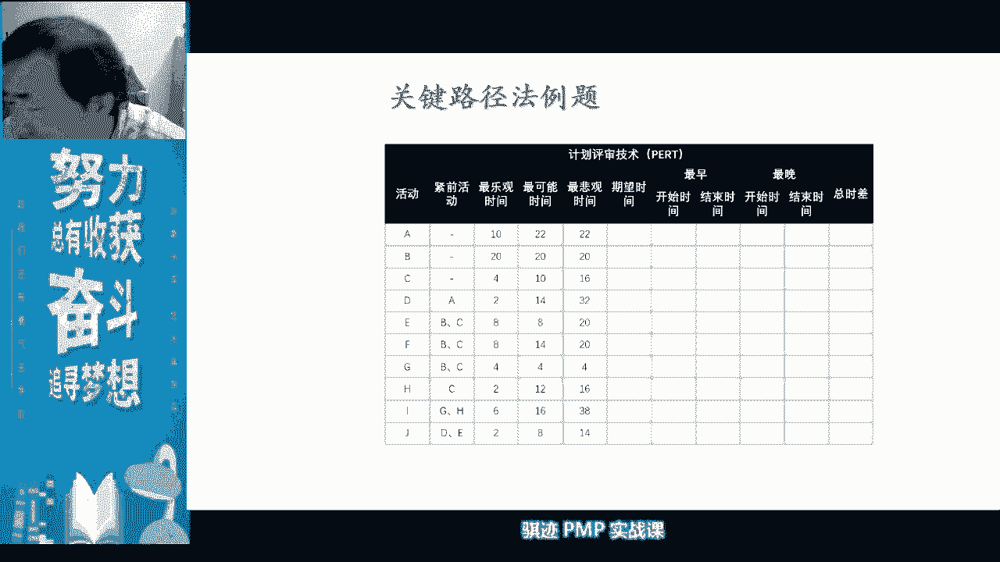

a b c是三个是开始啊。

三个都是开始，然后再看d跟着a只跟a，反正管他的颈前仅有a，所以d是颈前只有a对吧，然后呢e呢e f级呢紧接都是b c。

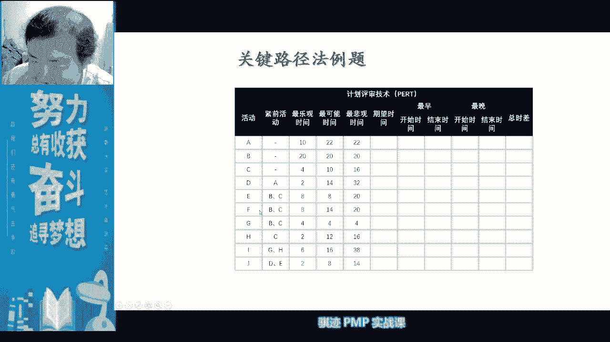

b和c啊就来了啊，我们很多时候的内容的一些关键的一些辨析，好那么h呢是仅有一个颈前c，仅有一个井前c的对吧，然后呢i呢是跟着截取的，结是跟着提意的啊，i是跟着截取的，结是等d。

所以第一步我们是不是可以把这个画出来，这个画出来之后，这个图叫什么图，请告诉我啊，ok啊我们不急，慢慢慢，这个题目要慢慢讲，但是我希望一遍就能帮大家教会，我们的画法叫做pdm的画法对吧，p dm画法。

颈肩关系绘图法，但是我们画出来这个图叫什么图呢，我们之前学过叫什么图呢，哎pgm都出来了，我靠你讲pdm就算这是什么图呢，哎对这个就是进度网络图啊，有些同学这啊打出来字还是不错的，但是有点懒啊。

网络网格进度网络图啊，进度网络图对吧，这就是一个单纯的进度网络图对吧，什么都没有，但是他告诉逻辑关系吧，有了对吧，那么第一步有了之后。

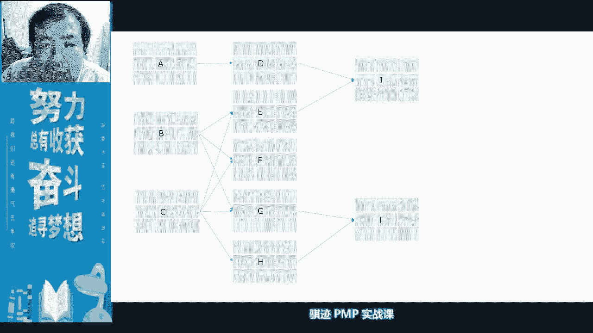

我们知道每一个活动的时间都能计算出来吧，好每一个活动的时间都能计算出来。

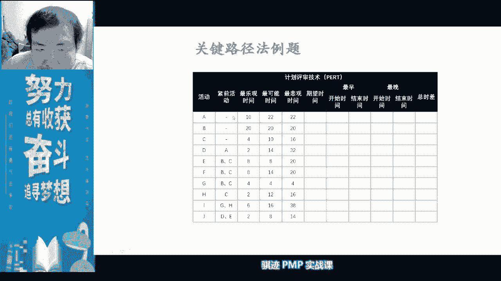

所以我这里就直接把每一个活动的时间，计算出来对吧，他们那么第二步我们注意我们画冠军，我们现在目标是画出关键路径法，所以第二步是把所有活动的持续时间画出来，对吧啊，现在这个每个活动时间都有了吧。

得了啊对了，那么在这个过程当中，因为我们题目设定没有设定，他们相互之间有约束和限制，资源不足，所以我们默认是什么资源限制已经解除了，资源限额限制已经结束了，所以我们直接就可以把这个时间填上去了啊。

直接可以填上去，在实际工作当中，有时候我们要考虑到这个活动安排在这里，是不是会受到相互制约，是不是会受到这当前这段时间的客观事业，环境因素的限制，对吧啊，诸如此类，时间可能会根据客观的环境会有所变化啊。

会有所变化，好ok现在没有，那么就可以我们按照理想状态来做，那么第三步是什么，ok啊，首先我们这里是填啊，咱们第三步就开始顺序的做啊，第三步是什么，我们可以找出有了这个时间。

是不是我们就可以找出所有这些路径啊，可以进行路径遍历对吧啊，有些图呢很简单，路径变了一看就看了，这这个图你看得出哪个是关键路径吧，看不出来，那么就老老实实的进行路径遍历啊，我们路径遍历时结果是什么呢。

a d e43 天对吧，比一节bbf一个一个一个一个一个一个一个，那就算是路径遍历啊，路径遍历ok啊，呃让我想想啊算了，那么今天时间关系我就不让你算了啊，回家，但是有一个事情回家，所有人不允许偷看啊。

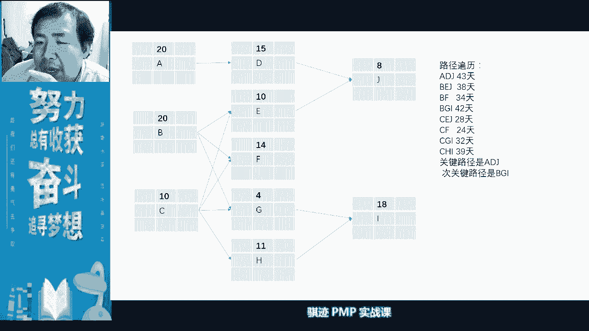

所有人对着这个页面给我重新算一遍，然后所有的这个过程重新画一遍，画出来，如果做出来或者我跟我的不一样，或者有问题的话，请回看录像。

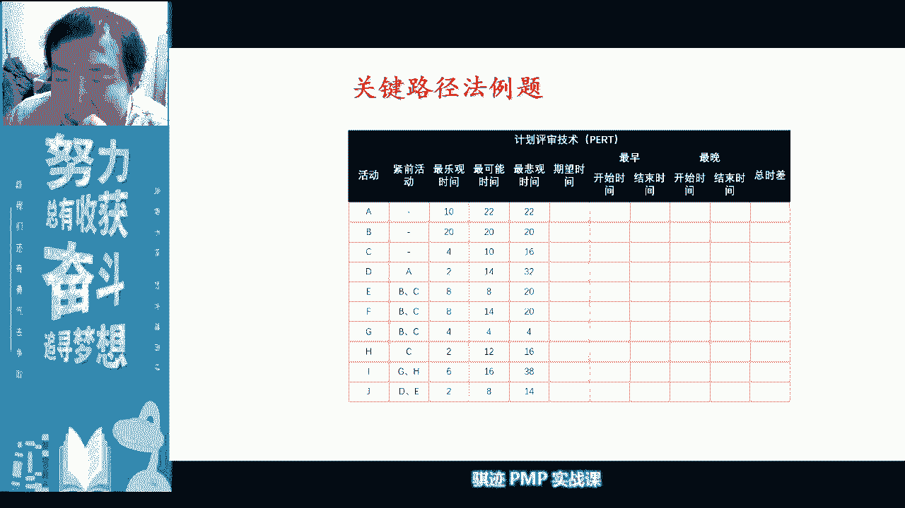

好吧啊，好那么我们进行路径遍历，遍历出来之后哪个最强呢，a d j最长，所以关键的就是a d解，42天，那我请问a d j和bgi仅差了一天，那么这个项目的风险大不大，啊项目的风险是大的。

因为两个非常接近啊，注意啊是非常接近的啊，打打打啊，非常接近啊，很大的好，那么关键路径出来之后，然后我们可以接下来做下一步事情了，首先我们讲关键路径，如果没有特殊的题目设定它是什么，它是总浮动为零。

所以最早开始和最晚开始，最早结束，最晚结束都是一样的对吧好，那么我们就可以很容易做一件事情，关键路径的他的这个六宫格线圈，因为这是开始关键路径的a d结，a d结，它是关键路径对吧，然后a又是开始。

那么a开始，那么就是说一开始第一天开始一对吧，那么第二天就是20对吧，然后d呢二这就是21+20-1，就是20嘛对吧，然后d呢就是21，21呢加15-1，注意啊，减一就34，然后呢他的那后面紧跟一个减。

所以直接解直接是35就行了，那么想那么有时候有些同学啊，老师那么节后面不是跟着一吗，因为这条是关键路径，因为这条是关键路径，所以我们肯定b和一在经过笔合一活动之后，肯定已经这里结束了。

所以你可以这里其实可以不用考虑，因为这条关键路径，所以这个肯定会比这个小对吧，肯定会比这个小，否则这条和这条就是都是关键路径的对吧，因为结是共享的，如果这条比这条长，那么它是关键路径。

所以因为我们已经知道它关键路径，所以我们不用考虑这个，直接可以把这个35写出来，35八四十三啊，又因为它是关键路径，所以向下直接照抄30 30 40 43，43，35，35，21 21啊，一一。

那么来了，这里应该填零还是应该填20啊，仔细想想啊，仔细想想，这里应该填的是零，所以我这里20是打个问号，如果你计算的时候上下一填，脑子一脑子一热，把这个20填上去了，上完课，啊晕了啊，有些东西晕了。

怎么晕了，ok啊34，ok那我们讲的太快了是吧，不急啊，那么再重新来不急，首先我们讲的关键路径都是明白的吧，这没问题吧，因为这个时间都会自己写出来了，算出来了对吧，没办没问题，因为这条是关键路径。

所以那么这条关键路上最早最晚都是一样的，因为它的总幅度为零对吧，所以我们可以这么算，他第一天开始持续20天，那么他应该什么时候结束，什么时候结束，第20天结束，另外1+20-1=20对吧。

又因为d后面啊，ea后面紧紧跟着一题，d有只有一个警前活动是a，所以敌直接比他这里加一就可以做完的，最早开始21，21，从21号第21天开始，持续15天，那么21+15-1就是什么，就是啊减一对吧。

就是35啊，34，又因为啊又因为这是条关键路径，所以我们可以不用上来发现这条观点，我们可以不用考虑其它了，这个30可以不用考虑它，当然是后面算就可以算出来，因为关键路径总是最紧密的进行。

因为关键路径没有总活动嘛，他们三个活动是紧紧贴在一起的，所以他肯定是跟在34后面，就是35了对吧，35，那么35再加上8-1，就等于43啊，那么后面来了三，因为他算出这个43之后。

上面这三个都已经算出来了，对不对，那么你需要算下面三个关键路径，恰恰有一个，啊，嗯我算错了吗，嗯让我看一下啊，是不是我算错了吗，30啊。

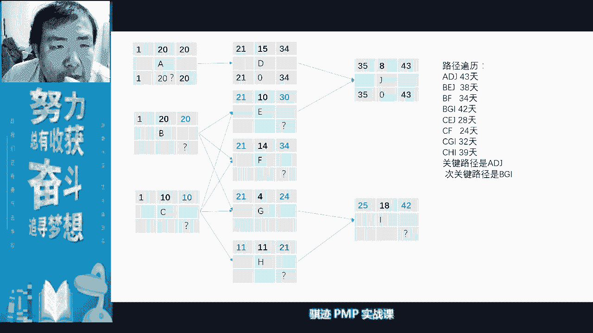

这里算错了，我写错了算了，兄弟这是我写错了啊，这这不是那个算的啊，这是35，这是35，这36，sorry啊，这时候我写错了，打字打错了不影响不影响最终结果啊，sorry，ok啊好。

那我等会我下课的时候发一个更正版啊。

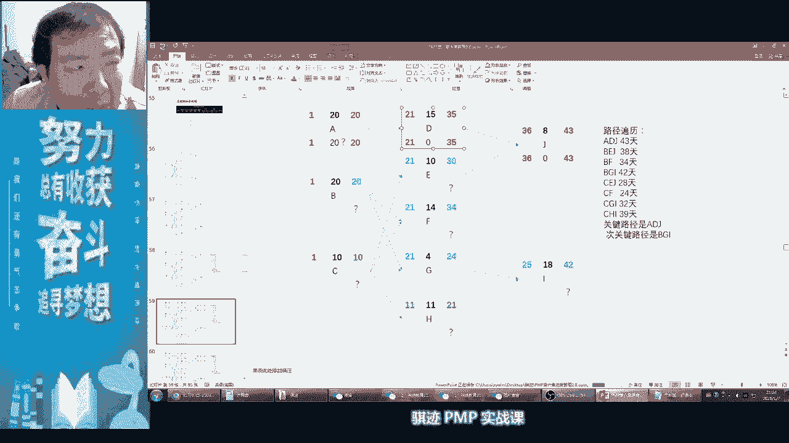

ok这是我打错了，这是应该21+15再减一，应该等于35对吧，这就对了啊，ok啊感谢这位同学啊，感冒无奇，这位同学啊，算错了对ok啊，这就对了，这样就对了吧，ok啊，那么我们继续讲啊。

那么我算出关键路径的结束，这个结束时间恰好是什么，恰好是我们关键路径的时间，也是整个项目的结束时间，所以关键路径的结束时间就是项目结束时间，因为它没有浮动，所以它最早最晚都必须在这一天结束对吧。

所以他最晚就必须什么43天，所以上下上下上下都是照抄对吧，既然它没有浮动，所以它的总浮动时间就是什么零零，这里是什么，这里是22日零啊，这里就是一个零，所以关键路径就画出来了，对不对。

ok啊啊当然我ppt写的有点小问题对吧啊，ok接受pp ok啊，大问题没有对吧，有点小问题啊，好那么关键路径是出来了，那么其他的路径怎么算，ok啊，注意后面紧接跟上啊，紧接跟上其他路径怎么算啊，是的。

开始的话，那么我就可以不用考虑，因为他没有警前对吧，他就也是从1号开始，1号开始对吧，加20持续20天一呃，第一天开始持续20天，那么就在第20天结束一啊，1号开始第一天开始呃，持续时间。

那么就在10号结束，第十天结束对吧，就可以，后面来了，很关键啊，ef级是跟着活动比和活动c的，那么他们的最早开始时间应该是跟着皮，还是应该跟着c，ok啊，当然我这个图示当中画的比较清楚。

他们必然是跟着比，因为什么比比c长，你看到了吗，b是20天，mc是十天的，所以比晚结束，因为他们是颈前颈后的关系，所以他们的最早开始，必然要比b的最早结束要晚，但是c呢很早就结束了，但是c结束没用啊。

b还没有结束，他们都不能开始，所以我们得出了这样一个正推的一个结论，就是在算上面三格最早开始最早结束的时候，所有的紧后活动的最早开始时间，都要比所有前序活动的最早结束时间的那个，最晚的那个还要晚一天。

你看这是20，虽然有点拗口啊，这是20，这是十，所以他们都必须什么21啊，跟着时间长的对可以，那我说的比较官方一点，我就说的比较严严谨点对吧，所有紧后活动的最早开始时间。

要比最晚结束的那个最早结束时间还要多一天，所以这些都是选21对吧，那么为什么有一个人不是21呢，然h不是21，为什么不是21啊，因为h紧紧跟着的是什么，只有跟着一个是c，所以他只要考虑c就行。

c 10号结束，所以到11号就可以开始，对不对，好，那么在这种情况下，所以他们三个的最早开始是21，它的叫11，他们的历史也知道21+10-1=30，21+14-1=34，21+4，简易的24啊。

都这都出来啊，这是21好，那么这里又来了，既然这个横向做出来之后，i活动它的两个紧前活动都出来了，所以他也可以出来的对吧，一个是24号结束，一个是21号结束，那么他应该几号开始，一个是24号结束。

一个话说，那么当一个25号开始了对吧，22号开始没有意义，他还没有结束，是不对的，要冲突了对吧，所以他应该25号开始，25再加上18，就等于40k啊，好致词，通过这样一个过程。

我们是不是所有的上面三个都画出来了，同时关键路径的下面三个也出来了，但是问题是下面怎么定义啊，这些这些打问号的地方，最晚结束时间怎么定，是不是这就没法算啊，这个办法算我最晚最晚什么时候开始吧，直接算。

有办法算吗，没有办法算，啊有同学问a的总负重时间多少呢，那我问你反过来问你a的总负重时间多少啊，如果你已经听懂的话，你很容易知道a的总浮动时间是多少，a的总不能时间零啊，因为他在关键路径上啊对吧。

而且a是下面这个三格能横向计算，不能横向计算对吧，又因为啊因为我们知道他在关键路径上，所以它总不动，直接可以填出零啊对吧，ok啊这些都是非关键路径，那么之后我们会在算他的总浮动时间的时候，我们会有计算。

就有算法可以算它啊，不要急啊，还是很容易啊，哎有位同学说用ms project或者p6 分分钟搞定哦，很好啊，沉默，这位同学说的很好，如果考试允许用project的话，我觉得也没有问题啊。

考试如果允许的话，我们先知道原理对吧，project很容易很简单对吧啊，这我用倒算，ok这位同学啊啊ok啊，可以啊，对最广当然只能用倒算，那么倒算就涉及到一个问题啊，现在灵魂拷问。

我问你这个到目前为止还是进度，网络图还没有成为关键路径法，关键路径图对吧，然后我问你们这个图中有哪几个是结束，哪几个是结束，请在公屏上告诉我，哪几个是结束，好非常好啊，我看到有同学打节哀节哀啊。

非常好啊啊啊，哦我看到一位叫赵景彪的对吧，赵锦标的同学打f g i非常好啊，赵锦标同学是我看到的第一个答出正确答案啊，注意f也是结束啊，这就是我为什么问问题啊，所有的问题都是带着带着帮助你们学的啊。

ok啊嗯呃有些同学个别不理解的，我们可以单独把f j是那个的啊，ok那为什么f f有紧扣吗，啊注意啊，所以没有打f的同学注意啊，f有紧扣吗，f没有紧后没有紧后活动，我们上节课讲过。

节没有紧和活动没有紧急活动，f也没有紧扣活动，j fi都是结束，那么为什么要找结束，就是因为结束一个活动的时候，我问你们关键路径，因为它没有总不到，所以最大结束就是最晚结束。

如果关键路径是43天最晚结束，那我问你们其他的非关键路径，最晚可以什么时候结束，咳咳咳咳啊，有位同学叫刘浩东的说，为什么你们答案都是老师问题，还没有问，是43，ok啊，43ok好啊。

你直接打数字也是可以的啊，那么记住一点啊，我们先来讲记住这点非常关键，为什么要走出所有的结束，就是所有活动的最晚，所有活动的结束的最晚结束时间，日期就是关键路径的最晚解锁日期。

因为关键路径是比如说这个题目是43天，我其他的结束只要也是43天，最晚结束项目是不是就不会做，就是不是就不会延长，对不对，这是可以的，所以这是这些结束最晚的时间，所以这中间最关键的一步就是什么。

所有活动的结束时间，和关键路径的最晚结束时间是一样的啊，这是一个关键，所以我们可以直接把这个填过，这也是43，这也是43，有了这个43，我们才能够反推，对吧啊，好那么来了，这里是43之后。

我的f4 是不是43，那么f是43，43-9啊，再加一是不是就等于35，是这么算的吗，好那么认为我f这个格子算的对的同学，请在公屏上打一，认为我f的最晚开始时间算的不对的，请在公屏上打二。

啊有位同学说一定是43吗，啊当然一定是三，我说最晚呀，最晚就是最最最最晚可能是什么时候呀，当然是43了对吧，42不是20，42天，42天我还可以比40天再晚一点，我们讲的是极限值，对吧啊ok啊不对。

那就对啊，所以为什么强调这个我要强调一点，下面三格是不能横向计算，那么它怎么计算出这个这个格子呢，啊不要急，我们来啊，看这个例子，我们讲这个i这个活动是结束吧，是结束啊。

那么i活动的最早结束时间是42天，最晚结束43天，中间差了几天啊，差了一天，是不是啊，那么它的总不动就是一对不对，那么他既然最因为一个活动，无论是最早开始，最晚结束，还是最最晚开始，最晚结束。

活动自身的长度是不会变的，是不是啊，是不是，如果活动自身长度不变的话，那么他往后移一天，往后一天变成最晚最晚最晚开始，最晚结束，那么它是不是最晚开始也是往后移一天，所以它的计算应该是应该是这样的啊。

这个这个减这个最晚开始减，最早开始就是总浮动，最晚结束，最晚开始建，最晚最早开始是总浮动，最晚结束减最早结束时总浮动，下面减上面是一下面减上面是一，所以你只要看看的时候，要看这个上面的差值就行了。

这个上下差一天，这个上下肯定也差一天对吧，最早开始和最晚开始的差值必然和什么，最早结束和最晚结束差值是一样的，最晚结束比最早结束多了一天，那么昨晚开始肯定比最早开始什么多一天，所以啊这是26对吧。

就出来了，那么同理，这个是43天结束对吧，43天结束，这个是34天结束，中间差几天九天，所以这里是九对吧，这里是九，就是这么出来，那么既然这个最晚结束比最早结束晚九天。

那么最晚开始肯定也比最早开始什么晚九天，所以这个应该多少30，所以这个单词大概是30啊，所以这个就出来了，出来之后我们依照葫芦画瓢对吧，因为这个是根治治安的，那么这个照抄过来对吧。

因为这个活动他最晚什么时候开始啊，我只要34号开始，是不是就不违法，所以就可以照抄，这个呢可以直接照抄，因为他后面仅有一个紧扣活动结，他是35号最晚开始，那我34号最晚结束就行了对吧，好。

这个可以照抄过来照抄，然后呢这个应该是30啊，注意ok这是30，所以这个出来了之后呢，这两个就出来了就出来了啊，集合a h就出来，因为它最晚是26号开始，所以这两个活动只要最晚25号结束就行了，吧对吧。

以道理来推，那么这个就是25，这个就是25好，那么这些格子出来的时候，最后一步来了，b和c这里关系是不是很复杂啊，关系复杂对吧，问题不大，那么怎么样定呢，我们前面记得我们正推过去吧。

这个这个这个要比这个呢要什么ef级的，最早开始时间要比b的最早结束时间要大一，那么是不是存在这样的规律，就是ef级的最晚开始时间，要比b的最晚开始时间要大一啊，哎对这是对的啊，所以我们这里已经算出来了。

这是30，那么这里算上可以得到少，这里是上下差四，是不是啊，这是最早结束，最早结束是30点，最晚结束34，那么上下差还有四天，那么他也可以差四天，就是25号，他可以最晚开始了，他是30号，最晚开始了。

这个是哪几号呢，这上下差一，那么就是22号，那么一活动是25号最晚开始f活动了，30号最晚开始集活动是26号最晚开始，那么b活动几号最晚结束，请在公公文箱告诉我，从刚才我们口算，我故意不把字写出来。

我故意不把字写出来，然后让你们要心算一下，b活动应该几号最晚结束，ok非常好啊，我看了大量同学打了29，那么你们想一想，这里如果填29，我这个最晚29号结束，这个是几号，最晚开始啊，是25号开始。

我前续活动29号才结束，后续活动25号就开始了，冲突了没有冲突了没有冲突了没有，那么这个是30号不冲突，这个是22最晚要开始了，那么这个是不是应该是什么，21看到了21，所以我们在逆推的时候。

要先要把前序当中，后续当中所有的最晚开始时间写出来，那么前序的最晚结束时间要比他们四个，三个数字当中最小的那个还要小一，是不是才不违反，对不对，我所有故意问你们有没有，为什么有人算出22啊。

ok啊22这个有点过分了，这个是22呀，所以你这个21啊对吧，所以我们最后啊啊这这是呃。

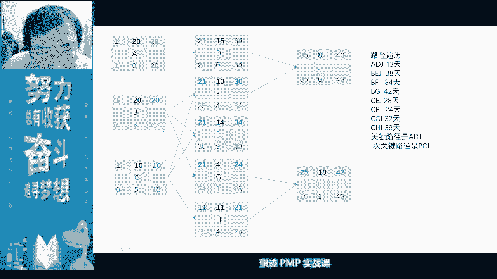

等一下我这写错了啊。

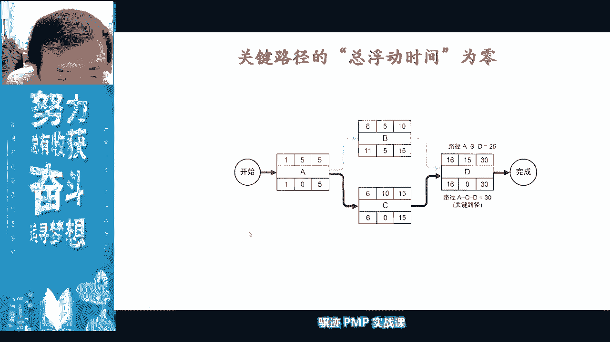

啊老师这个题目写的啊，那时候写的有点小问题啊，这个是这个应该是22对吧，22，那么这个应该是21ok啊，但是瑕不掩瑜对吧。

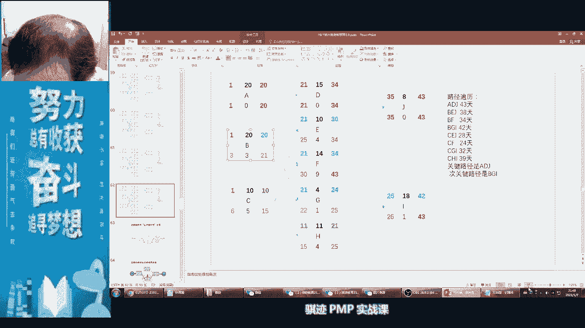

所以这个应该是22号，这个应该是20 22号最晚开始，那么这个应该是21号最晚结束，所以要跟着他对吧，所以这两个颜色应该是一样的，你看这个数字跟它比，不违反他不违反他不违反他，是不是应该找一个最小的。

还要比他小一，还不能违反规律对吧，老师我觉得用日期可能比数字更容易理解一点，对，但是pm现在用的标准还是用数字啊，还是用数字，ok啊ok啊，那么考试当中呢有可能用日期，用数字p mi标准还是用数字的啊。

因为它要是项目的第几天要算第几天，我就比较方便，那么同样的这道题目在这里是不是也违反了。

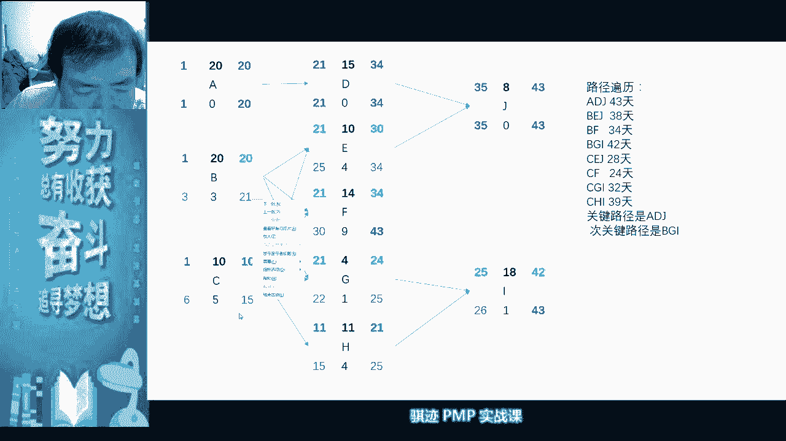

啊，所以这个p p t，当时我做的时候可能是有点有人有点累啊，所以这应该是14对吧。

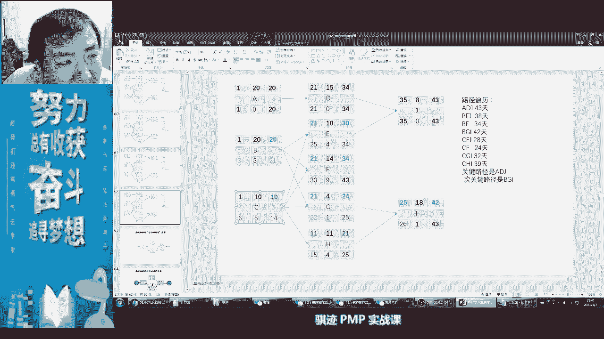

好现场改，所以最后你会看到为什么这里是14就行了，因为c后面跟的是15，25，30 20 20 55，是不是最小的那个数字，要比最小的那个数字还要小一。

还要小一对吧，啊所以这个也错了啊。

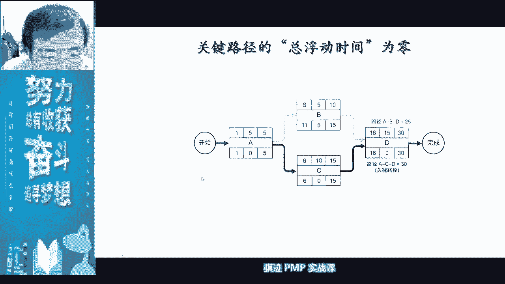

这个也错了，对吧，这个上下差了四，这个上下也要差四对吧，ok啊，这就没问题，这个上下这个上下差了几，这个是21，那么这个是一，这是2k啊。

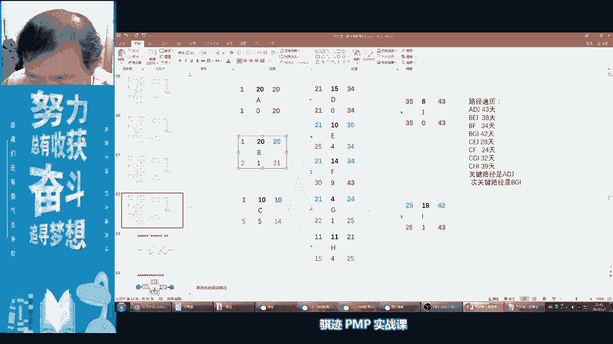

ok好等会我这个p p t更新再给你们一遍啊，ok通过这样一个路径路程，是不是我所有东西都推出来了啊，当然我这里写的，因为考虑到视觉关系，后来我改了很多遍的那个视觉颜色，可能改的有点晕了啊。

自己也改晕了，好这就是我们最后推出来的一个过程，那么这个过程是不是都学学会了呢，ok啊好，那么我们在快速的过一遍啊，快速的过一遍，过的是一个思路啊，过的时候是一个思路好。

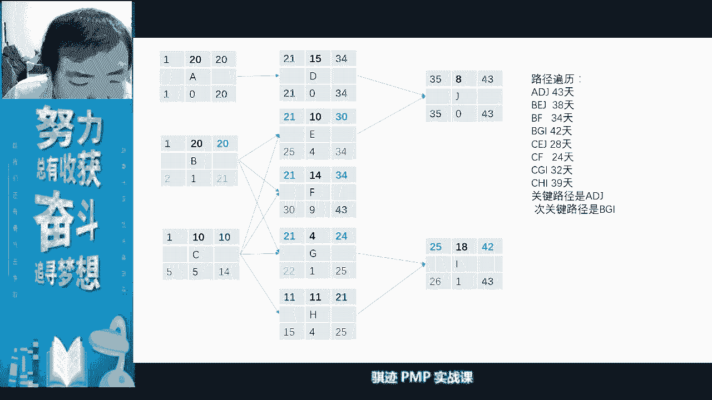

那么首先来首先先来思路的第一步将，如果我们要制作一个关键路径法的图表，那么第一步先把所有活动的期望时间算出来，第一步。

第二步制作进度网络图，注意制作进度啊，注意它们之间的勾稽关系。

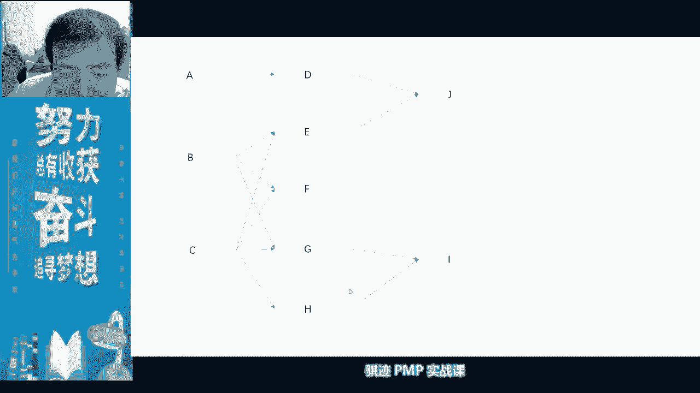

所以同时需要注意的是什么，从开始开始画开始，因为很容易找没有警前活动。

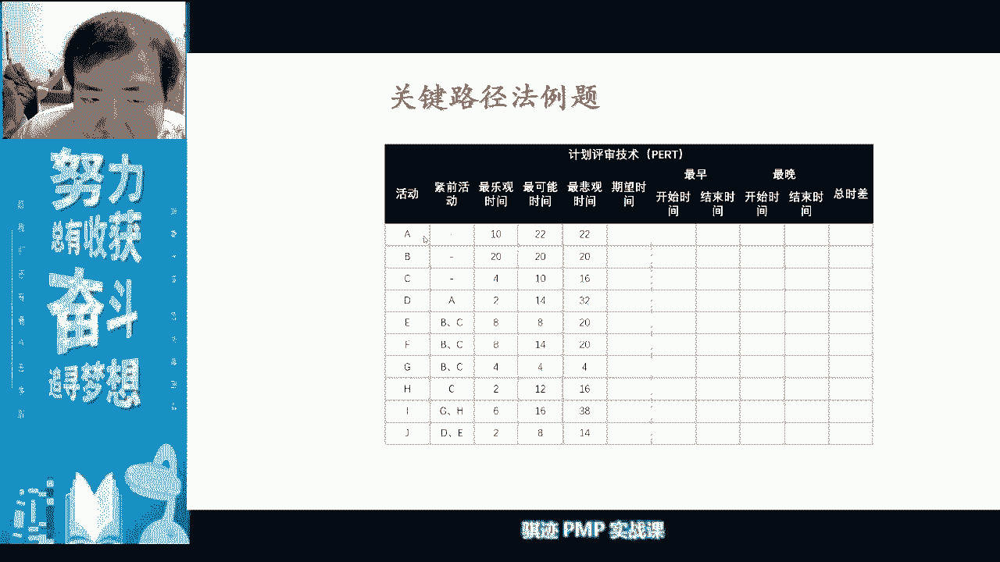

把它的进度网络图画出来，第三步将他们所有的持续时间算出来，因为持续时间前列我就算标在上面，就标在这章当中的上面一个，第四步，第四步，将他们这个所有过程当中，所有的路径的便利算出来。

所有的便利路径算是找出关键路径，找出关键路径很关键啊，关键路径找出关键路径之后，因为利用关键路径，一般情况下没有特殊设定，总浮动为零，我们可以得出关键路径的最早开始，最晚开始。

最早开始最快的都是一样的诶，这一套可以全标出来啊，当然这套在后面我改成零，好关键路径出来之后呢，我们其他非关键路径从正向正推进行，正推正推的方式是什么呢，啊最早开始加持续时间减一的最大减速啊。

最早开始加持续减速，当有多个警前活动的时候，当一个活动有多个警前活动的时候，他一定要比所有警前活动当中，最晚结束的那个结束时间还要多一天，所以这是21，他跟着他有两个21，20比十大。

所以是21 20比十大a t但是h只有一个，所以他只要11就行了，好按照这个规律，那么24和21比24大，所以他就25就行了，然后呢正向的上面的三格都可以推出来，那么下面最晚时间怎么推断。

一定要找出所有的结束啊，注意这个图当中的f啊，一定要找出所有的结束，那么这个当中可以看到这个图当中有三个结束，一个是节fi，其中i节是关键路径的结束，所以我们可以利用一个原则，关键路径的最晚结束时间。

就是其他所有活动的结束时间啊，这个是非常关键啊，啊这也所以我们可以把它43直接照抄回来，然后照抄过来之后可以进行计算了，因为照抄过来之后，我们发现那些照抄过来的活动，我们上下的最晚结束时间。

最短时间会有时间差，这个时间它就是总浮动，允许有，比如说这里i里面有一天，那么我们最晚开始时和最早开始也有一天的，总浮动一天一，所以这个25就加一也是26，这个呢是上下差九天，所以这是34，加9=43。

那么这是个9g在这里，所以这应该是21+9，这里是30啊，不是横向级算得到，而是纵向计算得到的，一定要注意啊，纵向计算得到了好，所以这应该是30啊，这是例子，那么这里呢当我们有简单关系和关键路径。

非关键路径和关键路径的结束，简单关系直接给照抄，因为它只有一个直线，它是它的颈后，他的颈前对吧，所以他是35，那么就要跟着他34号结束就行了对吧，所以我们可以把这些东西都照抄回来。

照抄回来照抄回来照抄回来，照常回来之后呢，我们就得出了，这是34，这是43，这是25，这是25对吧，这是30，那么最后一步难的是，当有多个活动在逆推回来的时候，当有多个活动最后逆推回来。

算最晚结束时间的时候，怎么算呢，前序颈前活动或者前序活动，他在最晚结束时间，要比后续所有的最晚开始时间，最小的那个还要小一啊，那么来了，那么因为这里我们算出来一是25开始，f30 开始，即使22开始。

所以b后面接着e f及三个，那么b就是只能是22号结束了，因为22 21号结束才能够什么服满足，最早最晚开始时间当中的，最早的那个集是22号的啊，是21，所以b呢下面就出来了，20和21年中间差了一天。

x 10十十差是一总数总数都是一，所以他的2号开始好，那么c活动呢，因为它多了一个h，恰巧呢h的最晚开始时间呢是15还要小，所以他只能跟着15来着。

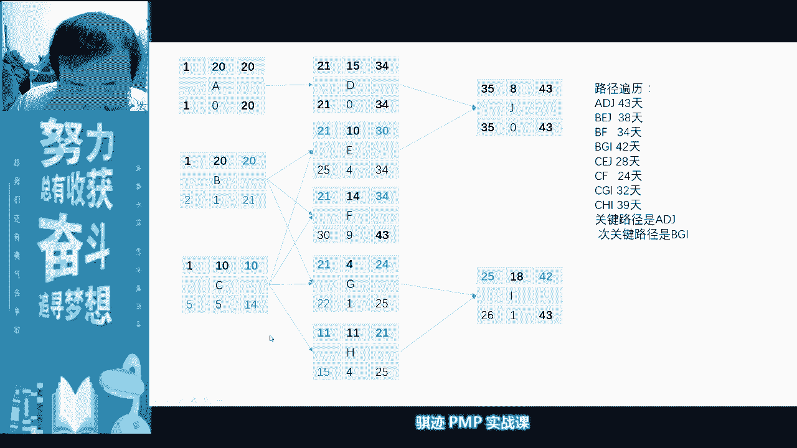

他就是14，那么上下时差啊，sorry这还要改一下，上下时差呢就是四天就是四天。

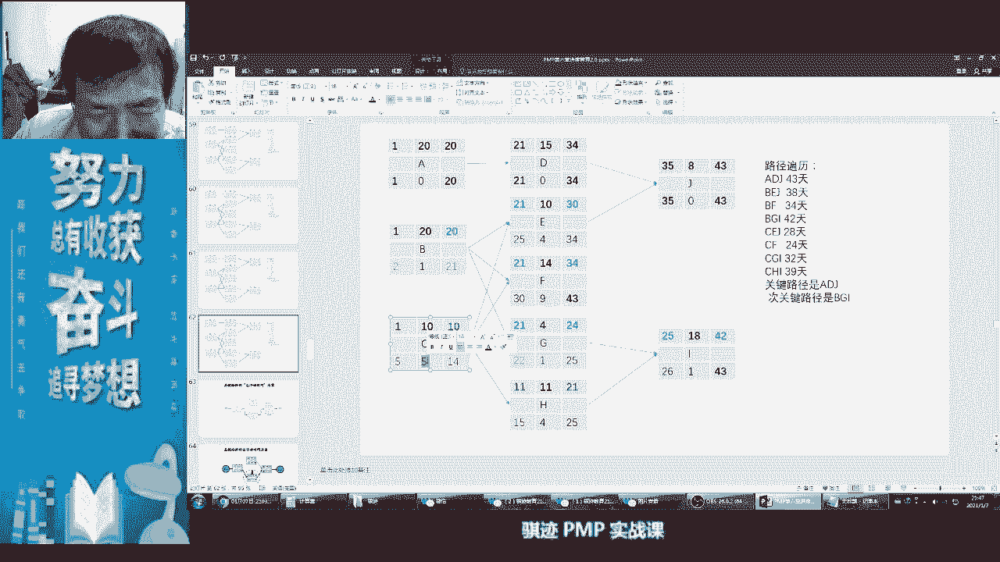

那么最终他的最晚这最晚看时间就是五天，好，这样一套先过去过去过去再回来回来回来之后，我们的关键路径法的关键路径图就出来了，不知道大家明白了没有啊。

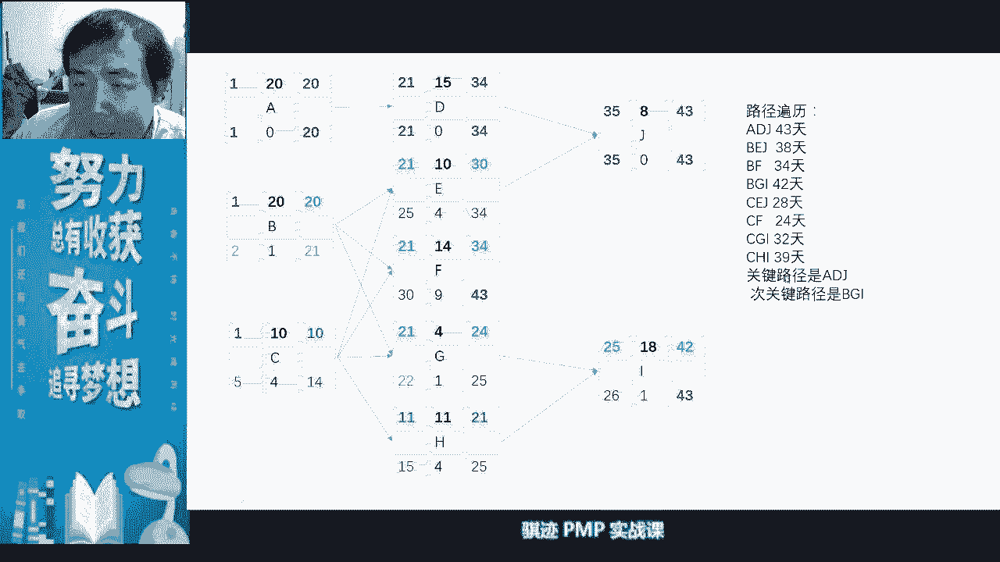

所以步骤就是这样一些步骤啊，我们，温故而知新温，第三遍啊，第三遍最快速了啊，这边就不讲细节了，第一步算出所有的期望时间。

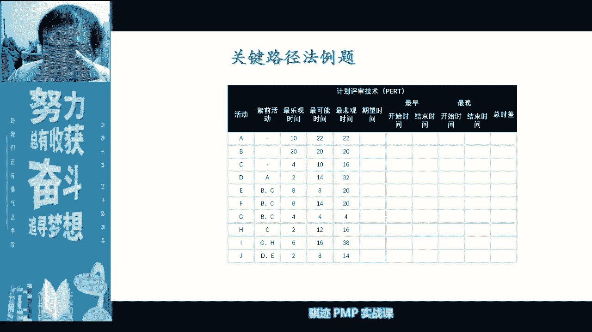

第二步画出进度网络图，第三步啊，标出所有的进度时间之后，便利出我们的关键路径，然后关键路径上所有的六宫格全部填出来，然后其他的路径上呢按照顺序的方式，一一个一个算出来，正推正推过来之后呢。

我们找出所有的结束，然后所有的结束的呃，最晚结束时间就是关键路径的结束时间，然后根据最晚结束时间来进行逆推，逆推原则当中和正推一样，郑州当中呢是要比后续活动，呃前序活动的最晚结束时间要比后续活动。

所有后续活动的啊，最大最小的那个值呢还要还要小一，就是21和14啊，然后就所有的东西都出来，ok ok啊，这样一推推一遍，推出来之后，所有的东西都都已经出来了啊，所有东西都已经出来了。

好这就是关键路径法，再有最后我们再画经络网速，那么在一个项目当中，如果你的活动很复杂，就是按照这样过过程，一个一个正推在一个逆推，但无论怎么样，只要推出来把这个所有的格子画出来之后。

这个就是关键路径法的关键路径图啊，整个项目就尽在你手了啊，那么进度进度基准就来了，那么为什么进度进来来了呢，每一个活动有它开始的时间，有它历史，那你就可以在日历上，比如说他是1号开始到22级时。

你就可以在日历的1~20甘特图就拉一个当，拉一个长条，1~20每天都有一个活动叫做a对吧，那么1~20号还有哪些呢，b也是1~20号都有a对吧，1~22还有哪些呢。

一到10号有个c 10~21号呢有一个h对吧，也是在1号到20号内做，所以你在日历上你会看到1号到20号，有a b c3 个活动做完，还有一个h差一天对吧啊，然后呢因此这个类推方法。

你在这个这个甘特图上，再以时间轴为啊为标尺，标尺的甘特图上，你就看到会看到每一天会有哪些活动在进行的，ok吧。

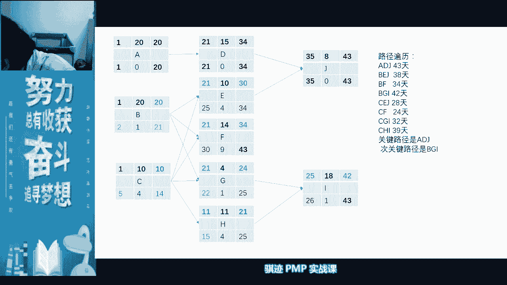

好那么通常意义上这个题目就讲到这里啊，不用再继续讲啊，我们要抓紧时间，通常意义上关键路径上的总不动时间是为零的。

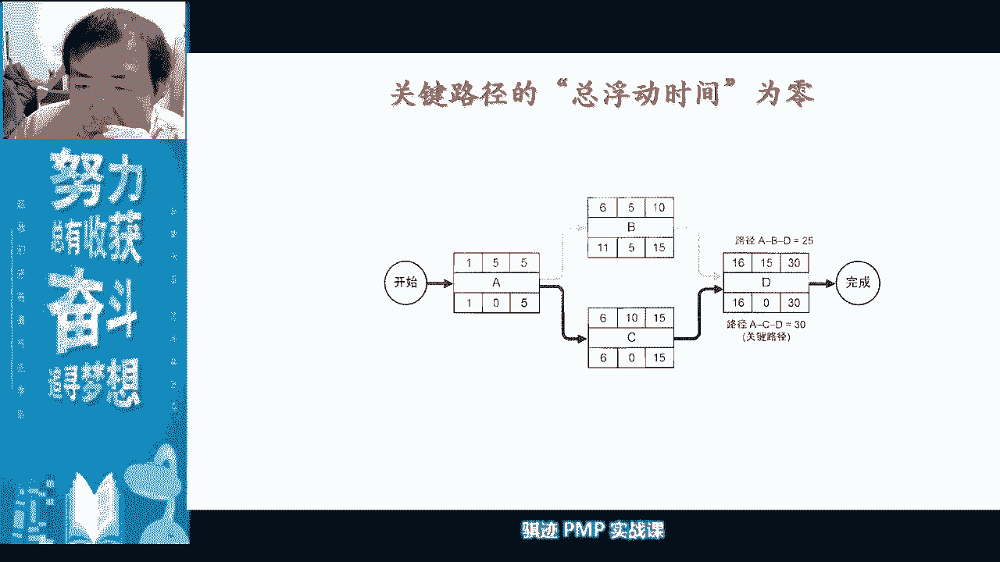

但是呢我们会有特殊的情况啊，什么情况呢，比如说我们算出来，关键路径上单时间多加了一天，那么就可能什么他的总不能为-1的，你看到吧，这是种特例，如果关键路径上总不多，时间为负数，说明什么，说明这个活动呢。

或者整个关键路径呢需要压缩一下时间啊，压缩一点时间，因为可本来说这个关这是条关键路径，它的总时长是五天加11天，加15天是总共多少，五，加11+16+15，对31，他应该第31号结束。

但是呢我们强制要求到30号减速，是不是这a cd这条关键路径上，是不是有一天有一个活动肯定要压缩一天时间，对吧啊，会有这样一种情况，那么有时候注意啊，我们为什么前面讲呃，通常来说都是总浮动时间为零呢。

是因为如果我们提示当中让总浮动，关键路径总浮动不为零，那么他肯定有一个前提，就是会有一个强制结束时间，而且他的强制结束时间是什么，是晚于我们关键路径的最早结束时间的，比如说这道题目当中。

但是呢我们提示强制要求我们在32号结束，所以关键路径就有了什么两天的总浮动，看到没有，那么关键路径都加了二，其他的路径呢也加二对吧，全局通通加二，啊这很容易理解啊，好这个讲完之后呢。

我们就要开始讲我们的资源平衡啊，我们的资源优化和我们的进度优化技术啊，注意资源平衡，进度优化技术。

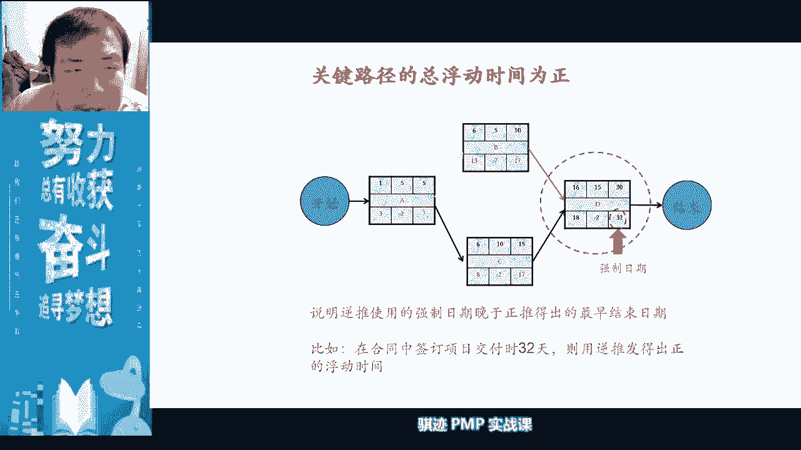

这个当中呢这些概念呢啊是比较是比较关键的，但是呢是比较搞脑子，所以今天可能会讲的慢一点，因为今天我们就讲关键路径法那个比较慢吧，所以这个会讲的慢一点，有可能我们的时间呢会略微晚于十点啊，略微晚于十点。

首先我们前面讲了，关键路径法的前提是资源不受限制对吧。

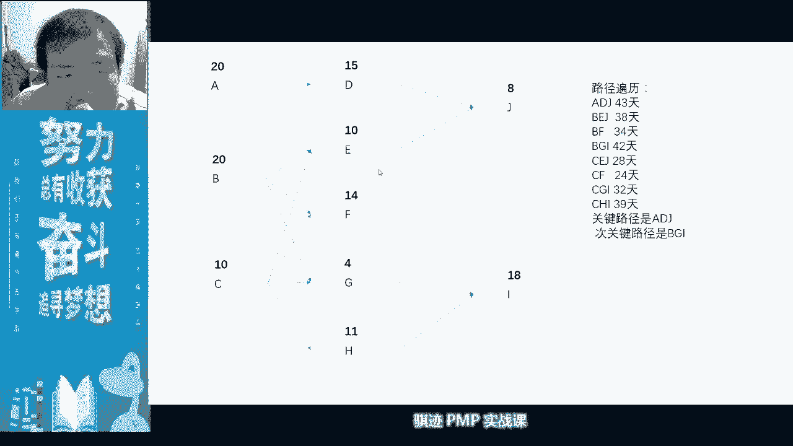

我们可以看一下啊，关键路径法的前提是什么，资源不受限制，不考虑资源限制。

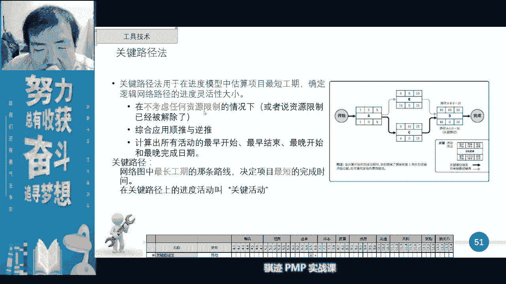

但实际工作中会有资源限制吗，会有比如说啊你的你的员工。

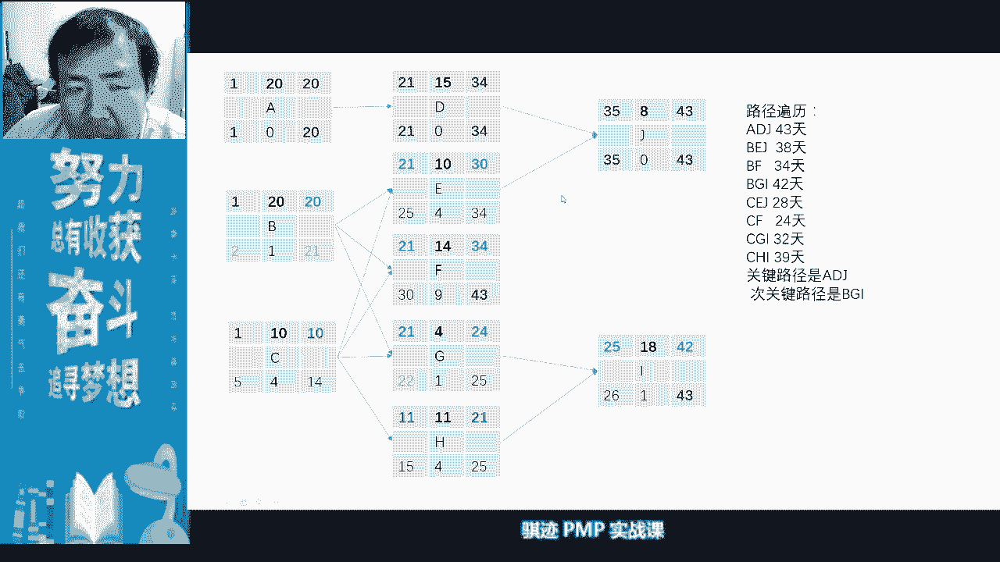

你的员工，比如说连续加班啊，比如说加班三天了，然后他们这个活动当中，可能后面做事情呢就做的不太好了，那么你不得已你可能什么要让他们休息一下啊，又要休息一下，这个时候呢可能什么就会把什么进度延长。

以换取资源的合理使用，所以这种时候呢就叫做资源，第一种呢资源方优化方法叫做资源平衡，所以资源平衡一般都是指的是什么，一般意义上啊，一般意义上指的是资源被过度使用了，或者是资源有限。

那么我为了能够资源的合理使用而牺牲进度，所以我这里给大家特别写了一个牺牲进度，用牺牲进度的方式去换取资源合理使用，所以关键呃或我不说，关键在资源优化技术第一章等资源平衡。

它绝大部分的应用场景都是把进度延长，进度延长啊，以换取自己资源的合理使用啊，这里有个例子，大家看到吧，我这里有个例子啊，他们和修两个人干干a b c3 个活，那么第一天呢休要干16个小时。

他们干八个小时，那么显然修有点太累了对吧，那么怎么办呢，我们把a b c的活动呢，把b活动呢挪到第二天，把c活动呢顺延到第三天，那么在这种情况下呢，tom和秀呢每个人两个人。

每个人都都可以只干八个八个小时，就不用加班了，就比较轻松一点，不会那么累，所以进度呢就从两天被延长到了三天，这就是一个资源平衡，资源平衡好，好那么资源平衡有时候很少见啊，很少的情况也可以试试。

也可以是提前进度啊，但是这比较少，比如说呢我们在资源上当发现什么，在某一个时刻或者某一个活动进行当中，发现什么呢，有些人呢忙的忙死，有些人闲的闲死，如果那些闲的人可以帮忙的话。

我们就会把那些闲的人搬过来，帮助那些忙的人一起干活，这种时候呢我们移动的是移动，或者利用的是资源，但是活动是不变，当我们把资源利用过来的时候呢，我们就会什么我们就会提高精度，反而有可能提前进度。

有可能啊提前进度，但是无论如何，一般来说我们使用资源平衡的方式，一般都是在一般都是在关键路径上使用的啊，关键路径上使用，是针对于共享资源和关键资源所使用的啊，一般情况下好，这是资源平衡，所以记住两点啊。

记住两点，资源平衡绝大部分情况下是什么，通过牺牲进度来换取资源的合理使用，它会导致啊项目进度的延长，如果在关键路径上的话，就会导致什么都，就会导致关啊项目的总时间延长，如果在非关键路径上。

有可能让非关键路径变成新的关键路径，也可能导致项目的延长啊，有比较少的情况是什么呢，会有资源使用的不平衡，然后我们呢我们可以通过一定的技术，将闲置资源移动到急缺的使用资源的活动上。

以达到提高资源的使用效率，从而能够反而有可能会提高的，提高我们的工作水平，然后呢提前进度，这是资源平衡，ok听明白了没有听明白，我进行下一步啊，这个很重要，第二种叫资源平滑，资源平滑移动的是什么。

移动的是活动，注意啊，资源平滑的时候，移动的是活动，将活动移动到资源，最有能够利用资源的那个那个地方去啊，只有那个资源，你看这土地当中，a活动本来在第一天干，第一天干到发起者第一，第二天干翻就是什么。

第一第二天活太多了，b c的活太多了，到第三第四天呢，c活动干完了，资源使用量下降了，那我们把a活动呢往后挪一挪，这时候呢一般a活动呢是不是一个必要活动，或者是一个呃紧急活动，那么a呢是个自由活动。

我们把a呢往后挪一挪，这样的情况下呢，可以让资源使用的峰值下降，从而优化我们的资源使用啊，所以这叫资源平滑，所以资源平滑最主要的目的是什么呢，让资源的使用的峰值呢下降，让资源的使用峰值下降。

但是呢它不会改变的关键路径，这种移动不会敢问他一般是什么，只在自由浮动和总浮动时间内进行调整，所以a你看到它从这里移到这里，就是从第一第二天移到了第三到第五天，那么a这个活动其实就是从最早开始的第一天。

最早开始移动到了什么，移动到了最最早第三天开始对吧，是不是利用了自由浮动时间，或者总浮动时间对吧，起到了一个什么移峰填谷，将峰值填平，将股值提高，移峰填谷对吧啊，这个时候你看似移动的是人。

其次是移动的是吧，是移动的是活动啊，这种就叫做资源平滑，它不会改变钢中心，但是不是所有的项目情况都可以，资源平滑，也不是都可以使用资源平滑来提高效率，以争取能够提高精度啊。

资源平滑在在日常的一般工作上呢，是很有很有可能能够提高功能，因为人的资源使用量下降了嘛，那么每一个资源的可用使用，相对来说就会提高一点点对吧，然后效率会提高一点，进度是有可能会提高的。

但是不一定能够实现，如果能够实现的话，是有可能进行优化，甚至有可能会让项目呢做的快一点点的，但是不适用于所有情况，他可能无法实现所有资源的优化啊，比如说a这个活动，a这个活动可能就是后续活动的紧前活动。

他必须在第一天就开始做，否则的话后面的活动就要延迟，那么a活动就不能动，当然这个像类举例子当中，这个项目当中a活动不能动的时候，那么你这个资源平滑这个滑的过程也就消失了，也就是这个机会就消失了啊。

所以这个能划的前提是，a后面没有紧接着的紧后活动，它能够自由移动，才会有这样一个资源平滑的机会，这是一个非常重要的概念啊，这两个是非常重要概念，这两个概念呢很多同学在考试当中容易搞错，没搞错啊。

因为这两个概念呢，平时不做项目管理的同学呢不太能理解，ok啊我们今天这里先提一提啊，下次开课之前，下次我们课讲成本之前呢，我会再提这两个东西啊，再稍微再提一下啊，因为这是考试经常会能考。

所以不明白没有关系，那么你就要记住一点啊，只要记住这两点，第一资源平衡动的是什么，移动的是资源，以达到什么合理使用资源啊的目的，但是可能会牺牲进度，但是有可能呢自然是我过于充裕，但局部失匹配不均匀。

那么我们通过合理的将闲置资源，放到需要用的时间上来，然后达到加快进度也是可能，但是这种概率比较小啊，啊一般他都是牺牲进度，而资源平滑呢是把活动移动过来，移动过去，它的总浮动时间内。

一来一去能达到什么目的呢，资源的峰值呢能够移峰填谷啊，移风填古有可能啊，有一定可能能够加快项目进度，加快项目进度，好是这样一个概念啊。

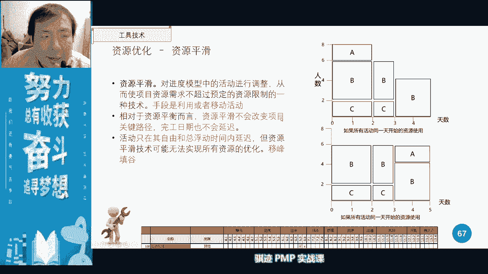

好那么我们在进行我们的呃进度啊，进度计划的制定当中呢，会进行假设场景分析，用于分析各种各样的影响因素，无论消极和积极的啊，这是我们的一个工具，那么这假设场景分析呢我们之前也用过了啊，也讲过了。

就不再多讲了对吧，比如说冬天夏天啊，主人之类好。

那么后面有一个工具非常重要啊，这叫模拟，在进度当中会使用的模拟蒙特卡洛技术，ok我把特地把字样分大，你们在自己的书上呢，你们，那么你们在书上呢你可以看到啊，我有些同学讲怎么平滑，ok啊。

这个这个平滑只是个例子啊，你们可以设想一下，他没有讲他具体的啊，它的依赖关系，所以你怎么滑都行，其实其实其实怎么滑都行啊，好我们继续讲模拟，模拟是项目呃偏僻考试啊，老板考试到目前为止。

最喜欢考的关键词的高频词之一啊，他叫蒙特卡洛，蒙特卡洛模拟是什么意思呢，我针对于项目当中，比较时间或者某一个工作时间这样一个变量，我进行随着时间变化的一个推测，看看它的概率变化多久。

比如说我说我们模拟一个东西怎么模拟呢，模拟一个随着时间变化，我们项目当中工程师的工作效率的变化情况，我们会发现什么呢，我们通过模拟发现，工程师在工作12个小时之内的时候，他的工作效率呢保持一个高峰。

比如说这是12个小时之内，他是高峰，它的工作效率就会急速的下降，那么我们用模拟就可以分析出很多，在进度当中的风险，所以据此我们可以认为说，我们在项目当中不宜安排一个工程师，否则虽然时间很长。

但是效率会下降，错误率会上升啊，这就是蒙特卡洛的，做模拟这个技术的一个作用啊，这是仅剩一仅仅是一个例子，还有很多例子当中，我们都会通过模拟这样一个simulation。

这样一个方式来进行monte carlo simulation，这样的方式，对某些东西的变化趋势呢进行预判评估，以得出我们应该怎么样去安排的一个，最佳时间啊，明白了没有，ok。

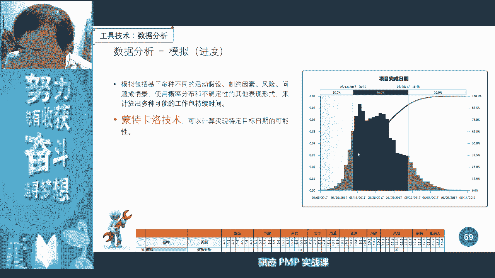

啊那么前面指的是对于资源的一种优化技术，后面我们会讲最后一个本啊，本章节最后一个关键概念叫做进度压缩，什么叫进度压缩，很简单啊，第一个叫做赶工啊，赶工是什么意思，请给我打在公屏上啊啊我们已经赶工了对吧。

我们也已经赶工了，现在是22：01了啊，那么我们今天会快点结束，下节课呢，我们下节课的成本上半截呢，我们会我们会比较时间比较宽松，我们会在这里再讲一遍啊，请在公屏上打出赶工的定义，ok啊。

加班加班加点加班，ok啊啊你们的定义是可以，但是要记住一点啊，今后一定要记住偏麦的地赶工就是加班，记住是有偿加班，记住一定是有的，无偿加班都是耍流氓啊，耍流氓好，你们有你们以后对抗无偿加班。

996007，你就说这是偏歪不允许的对吧，当然老板把你炒鱿鱼了，不要来怪我啊，好所以赶工就是一种什么利用资源，投入额外的资源，利用钱买进度的一种技术，只要是投入钱买进度都叫做赶工。

比如投入钱去买额外的资源来加快速度，就叫做赶工啊，再看啊，投入额外的多了，请两倍的人工，但是请两倍的人工，不一定进度就能缩短一半对吧，有个有个例子就有个例子挺好的，就说女人怀孕一次要十个月对吧。

然后产品经理就希望什么十个女人一起怀孕，一个月就给我给她，她想要的宝宝，对吧啊，所以有时候呢赶工不是万能的，有些时候情况下是赶不了工了对吧，都是自愿加班好，所以赶工就是一个用资源换。

用资源换时间的一个子，那么如果没有资源，比如说我们项目处于进度落后，那么怎么办呢，也有一个办法叫做快速跟进，快速跟进就是什么呢，我们把事情叠起来做对吧，本来是一个挨着一个挨着一个做，现在呢通过项目经理。

纯熟的管理技巧和良好的管理技能，我们将项目的很多工作叠起来做，叠起来做是不是就快了，但是事情叠起来做意味着什么，事情和事件之间的干扰变多了，依赖关系变得更加复杂了，稍有不慎就会相互影响对吧。

所以对我们的管理要求就增加了啊，所以快速跟进是可以不花钱，也可以抓紧进度的，但是注意快速跟进，不能追赶错过的里程碑，这是为什么，是因为你在把这个活动，比如说这个活动往前移的时候，比如里程碑在这里。

你往这前移，是不是里程碑也往前面移了啊，所以快速跟进不能够不能够追赶错过里程碑，但是是能够缩短整个项目的，或者局部项目的进度是可以的，但是快速跟进的风险要比赶工风险大，因为赶工是花钱的。

不花钱你还想落着好对吧，就像中国人现在玩游戏对吧，不花钱不氪金，你还想打得过氪金玩家吗，对吧，ok所以如果可能的话注意如果可能的话，需要追赶进度的话，进行精度压缩的话，如果题目设定没有特别设定的话。

我们首选赶工，次选快速跟进啊，首先呢因为赶工风险相对也有风险，但是风险相对快速跟进要小，然后效率要高，快速供给风险大，而且是什么效率相对低啊，是会有这样的情况，所以首选赶工，如果题目设定当中有设定。

成本很紧张啊，诸如此类的，不愿意多花钱啊，那么你只能选快速跟进，明白了，好然后我们最后介绍一个敏捷的发布规划，roadmap和发布远景，我们的我们的vision对吧，然后其中了发布钙化发布轴。

它会在一个时间轴呢通常是3~6个圆当中呢，发布各产品的各个功能的一次开发，一次开发的一个，一个相当于里程碑一样的一个标记啊，通过这样的方式呢，我们会告诉用户，我们的每次迭代的交付结果是怎样。

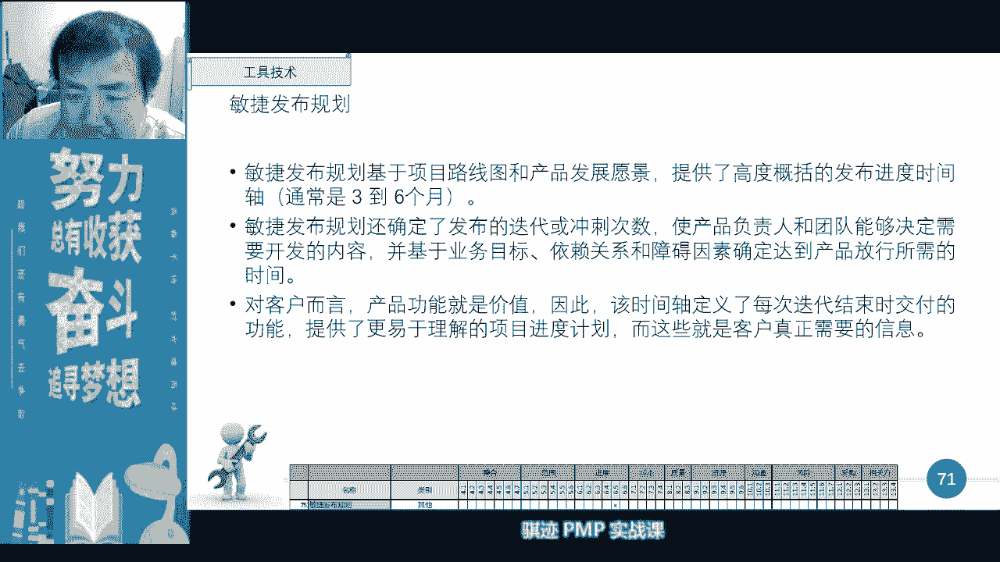

这些东西呢就是客户真正需要的啊，ok之前通过我们这样的进度阿索卡安排之后呢。

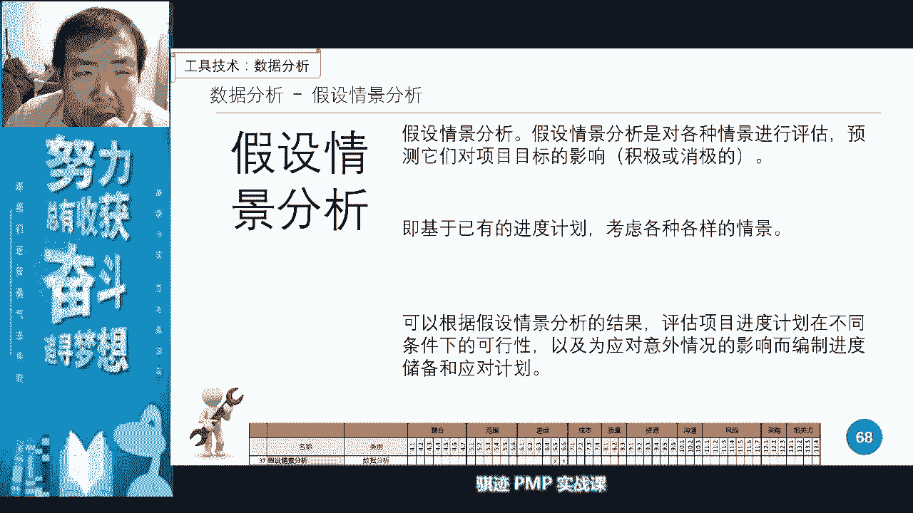

我们最终就得出了一个我们的进度基准，进度基准就是在项目啊，这项目的进度管理当中，就是我们的进度计划，项目进度计划啊，就是我们的精度基准。

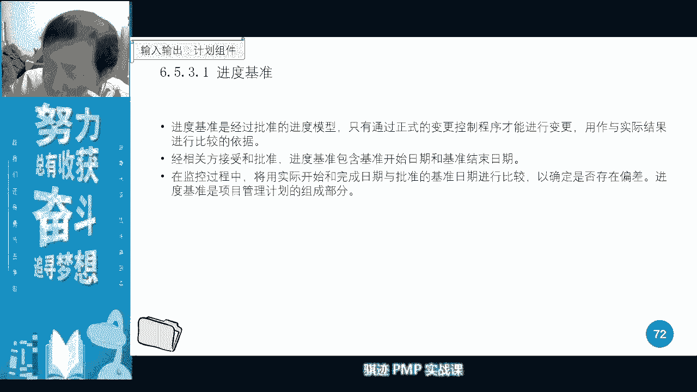

做完什么事情他都用标准，是不是有了这张图后，有了这张图后，这张图之后是不是我们就知道项目每天干什么，比如说今天是项目的第32天，我们应该干什么，你看32天正好在这里啊，我应该正在做题，a b c做完了。

d正在做题对吧，正在做题，正在做题集已经做完了，h已经做完了对吧，很准看结合i哈，结合癌呢，截还没有开始做，i in开始做了对吧，所以我们如果现在正在项目的第30天呢，我们正在做什么。

正在做第一正好做完啊，a f正在做i正在做节，还没有开始做啊，a b c g h都已经做完了，你看啊，这个可以就可以在时间轴上也可以画出来的吧，对吧啊，今天这语速语速是不是太快了啊，没关系啊。

下次我再讲一遍啊，错过里程碑不太理解。

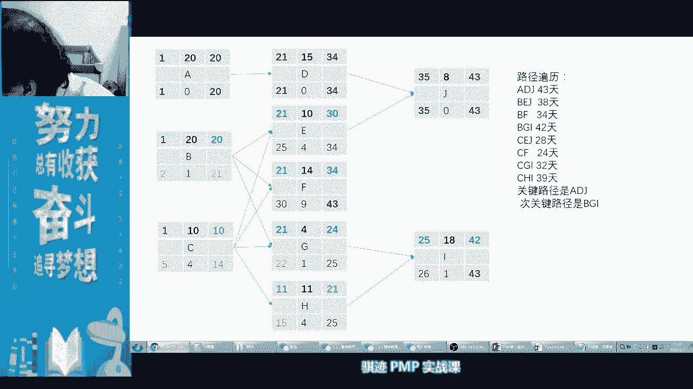

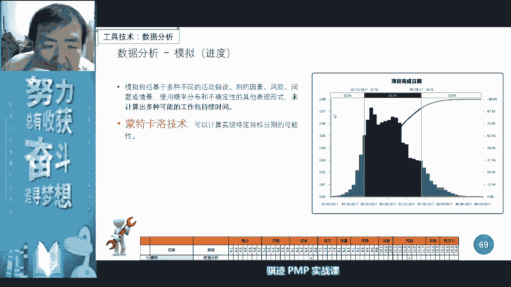

错过啊，什么叫错过，你们比如说比如说啊，我们讲项目有一个里程碑，它是接在这个叫活动一，活动二，活动三，他是接待，他是我们家，里程碑肯定是依附于某一个活动的结束，或者依附于某一个活动开始，记得吧。

记不记得，那么如果里程碑是在活动二的结束的，这个这里的时候，那么是不是就意味着是不是就意味着，如果我把这个活动二往前移，是不是里程碑也在往前移啊，但是实际工作还在这样做，那么如果说我们现在已经。

我们如果现在我们的项目的，项目的实际的时间轴已经到了九这个格子，这里的时候了，里程碑即将错过了，我们为了追赶里程碑，把这个活动往下移移，是不是还没等做了，是不是里程碑已经凑过去，对吧，ok啊。

所以这个东西就是说为什么pmi的设定啊，快速跟进是不能规制改里程碑的，因为里程碑其实是依附于活动的，而不是依附于特定时间的，当然有些时候有些强制里程碑，甲方设定的强制里程碑，它是依附于时。

它是依附于时间而不依附于活动，这个时候是可以追赶上的，但是pmi的pm博客当中的标准，默认设定是不可以追赶的啊，ok就行了，好那么我们最后形成进度基准之后。

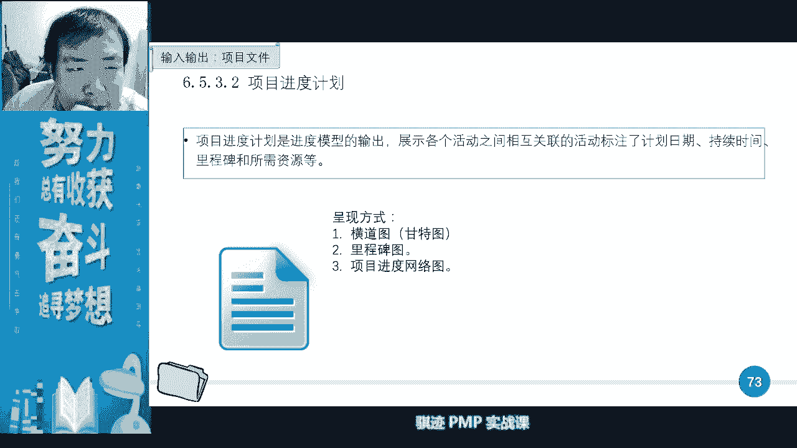

我们就会做出一个项目进度计划，项目进度计划就会用甘特图，我们刚才做出那些东西都会用甘特图来发明啊，甘特图记住也称为横道图，buchat ga cha也是bucha，是由亨利gto开发发明的啊。

那么有一点记住，甘特图在默认状态下它是没有逻辑关系的啊，注意是没有逻辑关系的，前无之间是没有逻辑关系，勾稽关系的啊，所以进度网络图是有逻辑关系的，那么甘特图能不能做出逻辑关系。

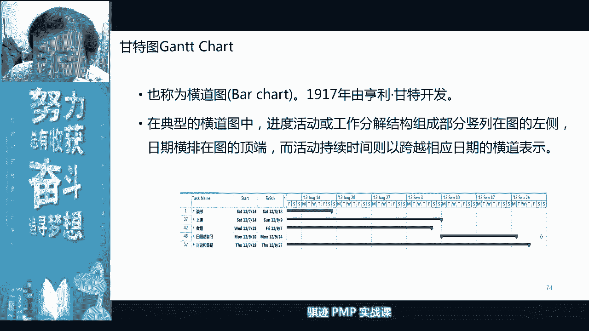

可以他就有逻辑关系的，甘特图逻辑关系的感特殊啊。

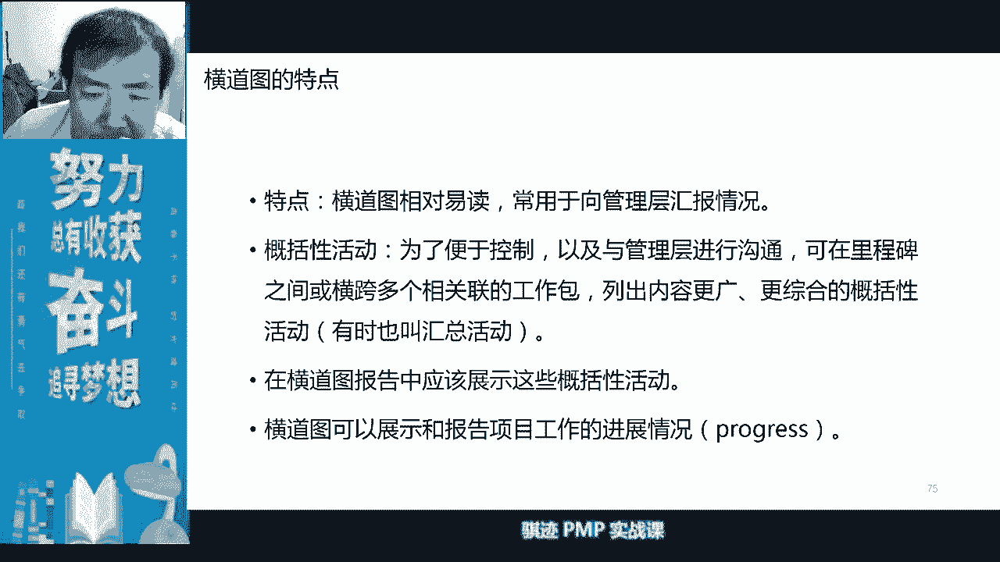

大家可以看一下，那么后面再看啊，然后第二个图那叫里程碑图，那么这种图一般是用来表现什么东西啊，给甲方做报告的，或者给发钱爸爸做报告的，我们会在这个时间轴上标出若干个重要时间点。

然后呢根据当前报告日期和当前进展报告，我们错过了哪些里程碑，我们做完了哪些里程碑啊，这个镜头就可以看到当前进展，做到这里，我们完成了两个里程碑，但是要求我们当前时间呢应该已经还要做完，盖盖要。

所以我们就错过了一个里程碑，那么这两个当前进度和里程碑实际时间之间，差距呢是20个工作日啊，-20就说明我们工作落后了20天，就是这个意思好，这是一个纯网络图，看到吗，网络图和甘特图最大的区别。

网络图是有关系的，看到有关系的关系啊。

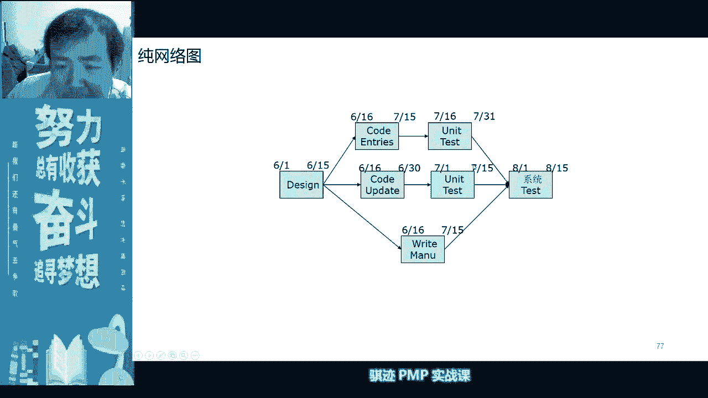

甘特图是没有关系，那么甘特图标怎么有关系的呢，来了叫做逻辑甘特图，我叫逻辑横道图啊，这个当中你看到这里就是线头了吧，有了线头就可以有关系啊，现在当中我们现在应用环境当中。

project microsoft project是默认就是有逻辑关系的甘特图了，已经是默认了啊，但是有时候呢我们为了画得好看，因为有逻辑关系干的都有个什么问题啊，线太多之后不太好看。

所以有时候为了好看呢，我们会把逻辑呢藏起来。

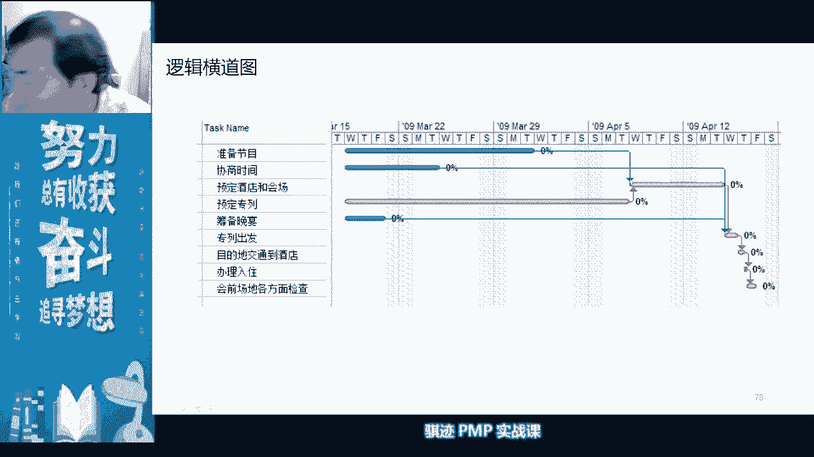

好那么这是实标逻辑图对吧，按照时间标签，这个也是我们经常用，这是一个时间轴对吧，也是常用的啊，这就不多了，大家可以自己看一下，那么做出我们的进度计划之后呢，就会做出我们的进度数据对吧，然后等等。

还有项目日历，项目日历就像是一个项目的台历啊，每天我们可以看到每天应该做哪些活动，哪些活动应该做怎么做，我们后面学过资源知道啊，每天有哪些资源可用，每天需要用哪些资源，都会在这个台历日历台历上写的啊。

当年在没有计算机辅助，没有project，没有这些东西的时候，项目经理怎么安排项目进度的，没有电脑的时候怎么安排，你的就是拿一本日历过来，每天在日历上写一写啊，今天干什么，今天干什么，先把图画清楚。

画一个很复杂很复杂的图，图画准确之后呢，再把每一天分解出来的，每一天的活动写在日历上一页写，就像就像你们的啊，手机当中呢，呃苹果手机当中日历这样一样的啊。

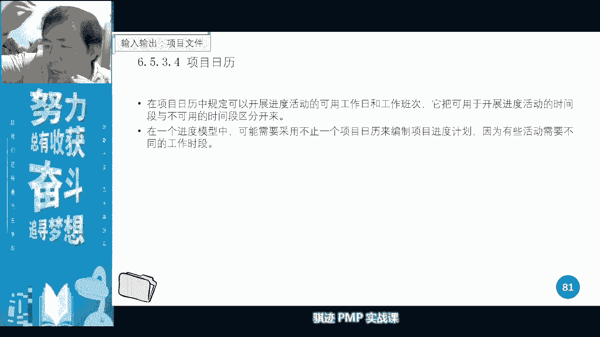

好那么最后进进度的管理当中，最后一个呢就是控制进度，控制进度是判断当前进度是否存在偏差，注意他只考虑进展到什么东西，他对范围的增加缩减是不考虑的，范围管理当中的控制范围呢，他只考虑范围的增加和缩减。

他的进度做到哪里是不关心的啊。

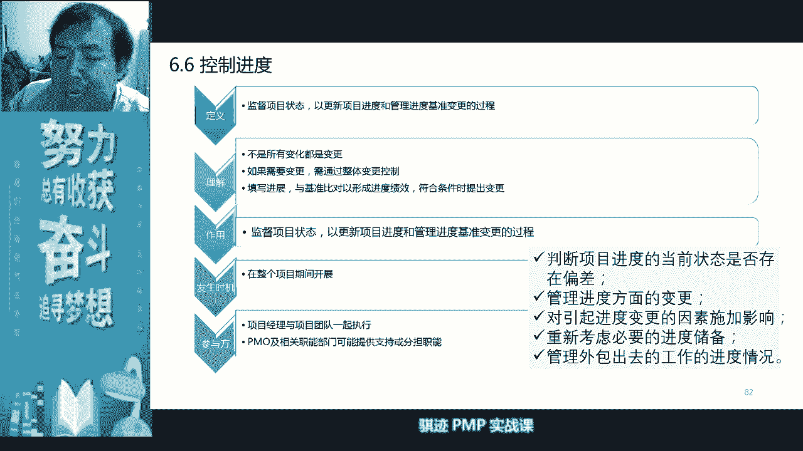

这要注意，那么进度控制当中呢没有什么特别要讲的。

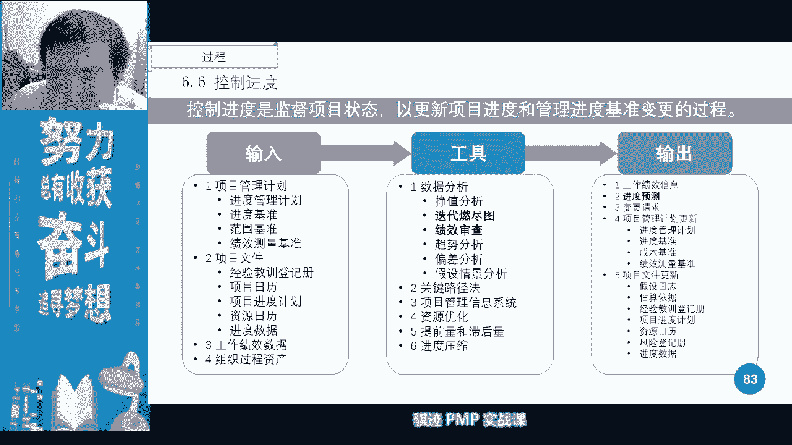

唯一要讲的东西就是什么迭代燃尽图啊，burn out，burn是burout，but not chat啊，好像是忘了算了，我因为你忘记了啊，那么迭代答案清楚是什么意思呢，它是一张用于汇报的图。

那么他首先会在这个图上呢，这跟比比值的线一看就是不是实际工作线对吧，一看就是计划工作线，这是我们计划要做成这段工作量啊，然后呢我们会有一个实际的这样工作线啊，工作线，那么实际工作线在这条图上。

来了这个线的状态是好还是不好，请在公屏里告诉我，哎呀我的女儿在门外喊我，ok但是不要紧，我还是会先给你们讲完了，哪怕今天时间超了啊，今天其实本来可以不超时间，但是我觉得时间隔得有点长。

我怕你们忘记前面讲了，我们进度网络图，因为进度这两节课其实很很重要啊，很重要，所以一定要周二周四给你们好好上完，因为下周的成本要也跟进度一样，也很重要啊，但是成本的第一节课呢时间比较宽裕。

但是进度和成本这两块东西，是计算机当中最复杂的啊，也是教学当中最难的啊，ok不好，为什么不好，是因为他预期结束的时间要比我们的啊，计划的时间短，所以迭代燃进度当中，如果我们使用到的是对于进度的分析。

那么这条实际曲线在基准线越下面越好，记住一下嘛，但是我后面会学到一个东西叫储备量进图啊，后面会用的储备啊，当我们使用储备燃进图的时候，那条线呢在基准线越上面好，为什么储备肯定是用的越少越好，对吧啊。

你管理的越好，那么风险可能发生的就越少，那么我们应对风险所花的钱就越少，但那么储备就用的越慢，是不是就限制越上面啊，好你明白这个意思就行，burn down chat啊。

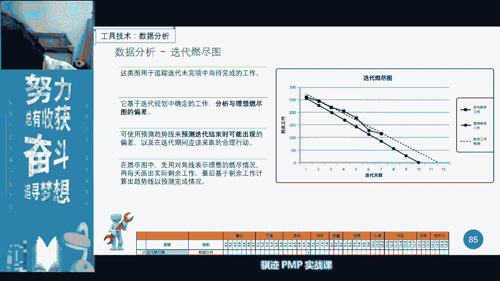

sorry，我忘记了啊，bon chat对不是bout好，我们在控制绩效，当控制进当中还会用绩效审查啊，绩效审查我们会用e v m调整几下啊，在下一个章节成本当中会讲，在下周会讲啊，ok不要急啊。

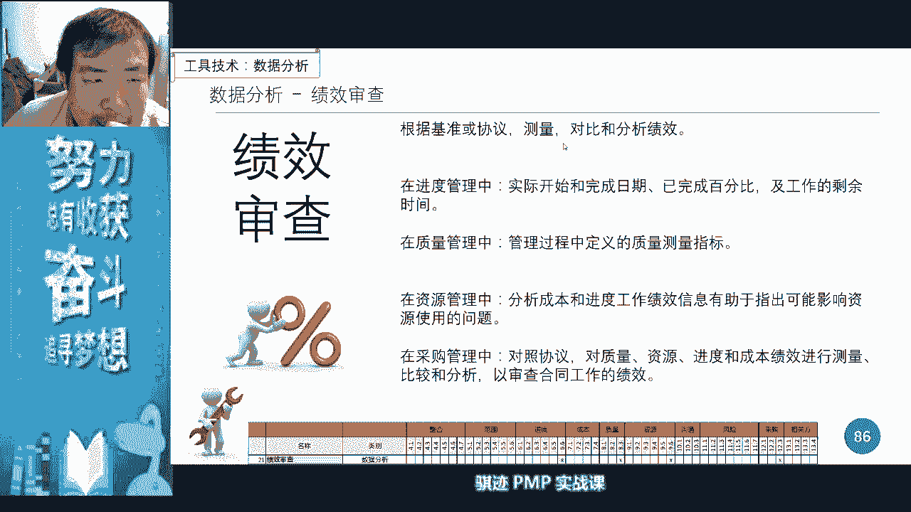

那么绩效审查这里就讲还有趋势分析，偏差分析对吧，我们前面已经讲过了啊，这个当中会用趋势分析和平台分析，那么在进度当中它是可以用到sv和sp i的啊，a4 名叫做schedule varise啊。

我都是在他背过，所以下周一定要给我那张表，所以上的单词中文，英文和英文缩写要给我背出来啊，suv叫schedule，variance，叫进度偏差。

scar s spi叫schedule performance index，叫进度绩效指数。

好最后呢我们在控制进度呢会有进度预测啊，看看进度是不是啊，会以后会怎么变化啊之类啊。

ok这就是我们进度的项目的进度，管理者当中的所有内容。

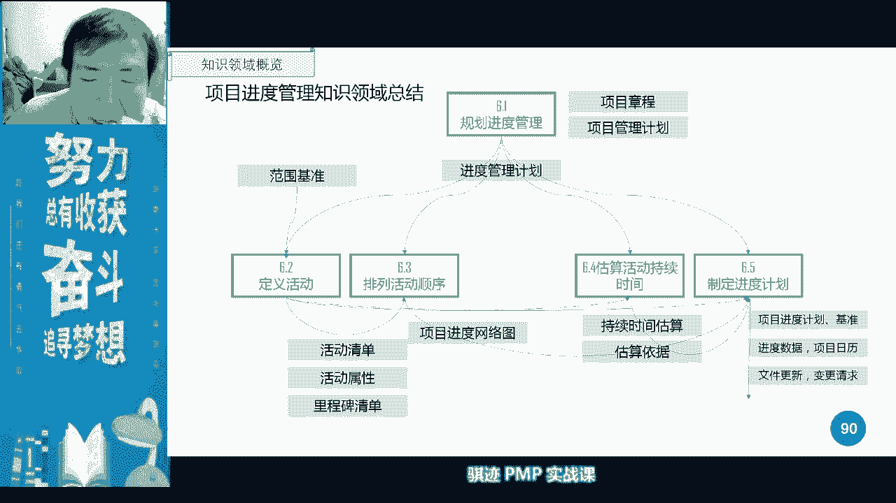

还没有完，第一道关键路径的时间为-20，如果关键路径上有两个活动，那么也可能意味着什么，a b c d请作答，一大，啊有些人说延迟不是很正常的事情，为什么不好，但一件事情能按时做完当然最好的了。

虽然不是说延迟就不能接受，但是尽可能都做不延迟呀对吧，不延迟肯定比延迟好对吧，那么延迟肯定相对不延迟来说要差对吧，选d满足攻击有可能力是压缩，ok啊d是正确的啊，-20就意味着什么要压缩20天啊。

关键路径压缩20天对吧，ok啊这个没有问题好，那么第二道这道题目大家都对啊，有人选b啊，为什么别啊预期提前20天，正20预期是t2000 啊，-20他特地写了-20。

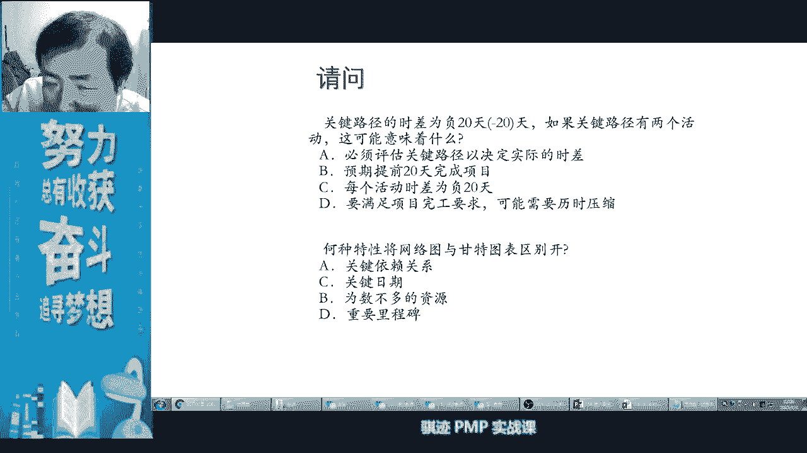

就意味着压缩20天啊，我们看一下那个图啊啊有同学各位同学忘记了。

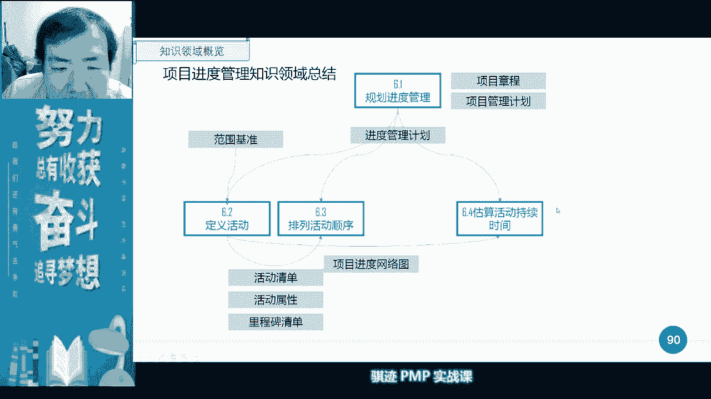

快速的切到那个图，标记没记得啊，不是这也能吐丝，记得吧，-1就要压缩一天，你看到了吗，要压缩一天，是不是-20，是不是要压缩20天啊。

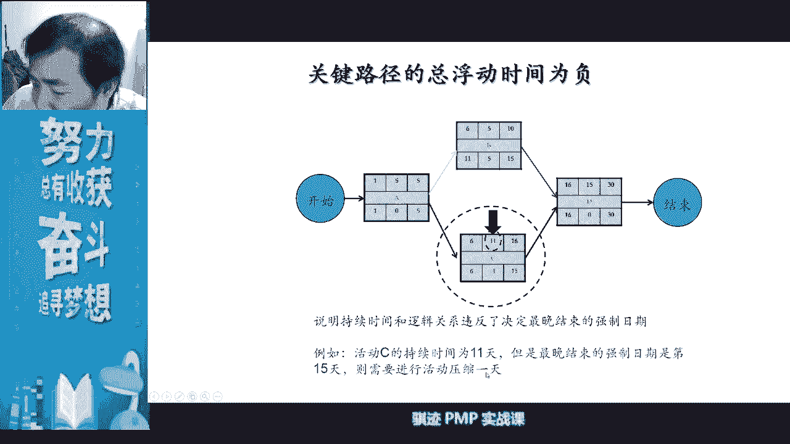

ok。

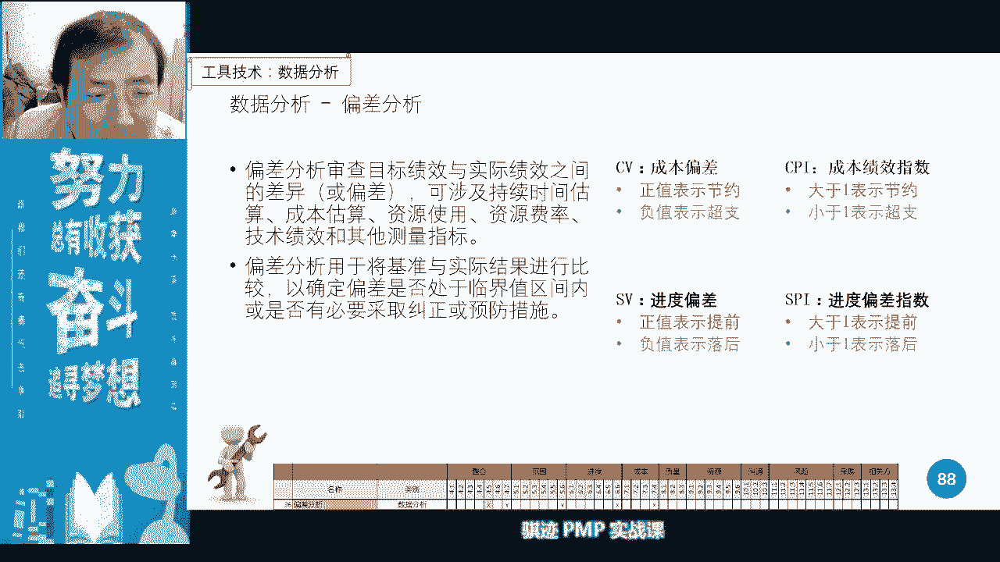

那第二个第二道题啊，第二道题，第二道题我们讲过吧，甘特图和进度网络图的最大区别是什么，依赖关系对吧，第二道题很简单吧，进度网络图或者叫网络图，它只有依赖关系，甘特图呢只有什么东西啊，只有历史时间。

所以它们的区别是关键的依赖关系，如果没有这一条还有什么东西啊，标准的网络图是没有整个项目的整体进度的，时间的，甘特图有，所以如果没有关键依赖关系的话，你还可以，如果有其他选项。

还可以选有整个项目的历史时间，甘特图是有的，因为刚做出甘特图的时候，已经有什么有关键路径了对吧，ok啊，所以这道题目我前面刚刚强调过，还是比较简单对吧。

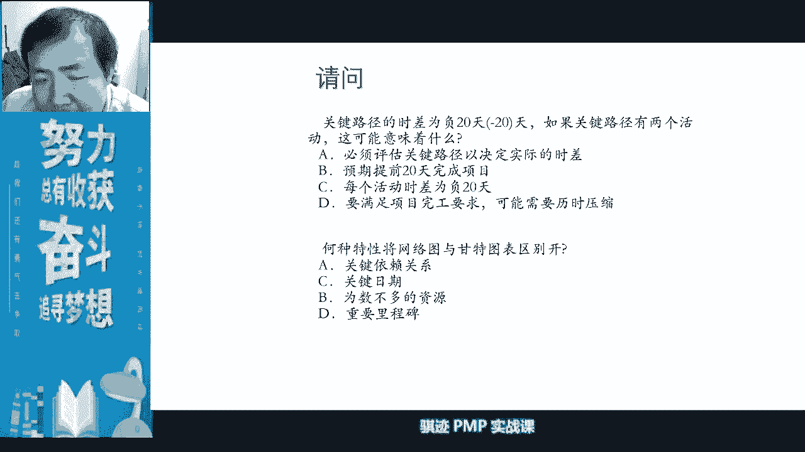

第三点，为了拟定项目进度计，你过程一定重复这样所有时间，然后这工期为十天，某些需要50天，最可能是20天啊，来给我动笔算一下，那么最短最短时间，最长50天，最可能20天，那么请算一下，赶快算一下。

第三道应该几天，好我也来算一下啊，最有可能是20，20x4就是多少，80+10+50除以多少除以六啊，那么这道题应该选b，为什么选b啊，算出来是23。333333333对吧，然后进一下24。

但是答案里没有24，哪个答案和23。333最接近23，所以选b nb，ok非常好，那么第四道，第四道进度计划，不考虑一下哪一项，a对造成进度基本因素一样，保证变化是有利的，比确定进度变化。

进度进化已经改变，c管理时间发生了变更，敌根据用户的需求更新计划选哪个，第四道题选哪个，啊有同学们如果有24呢，因为24当然选24了，我们说过吧，最接近的那个，但是要往前进啊对吧，你要往前进。

因为默认只要超过这个数字肯定往前进一啊，这是我们原则，不是说四舍五入没有四舍50往前进一，因为前一天是不能完成的，我们已从能完成的那最小的那一天算有选，有选b有选题对吧啊，第四代有选b选题，ok啊。

这道题答案应该选dog，为什么选dog，因为注意啊，dog的错误的地方等于客户需求，首先改变的是什么，客户需求改变的是范围，然后呢范围才可能影响到进度计划，所以范围从范围改变影响到计划。

这个过程是由项目经理来决定的，而不是由客户决定的，所以一个项目当中，客户可以对范围进行改变要求，也可以对我们的啊，甚至可以直接对项目的进度进行要求，但是进度计划必然是项目经理通过科学的管理。

根据项目的进度管理计划所制定出来的啊，客户不能够注意，这是一个项目原则，无论是理论实际，客户不允许直接插手干预项目的进度计划，因为客户比如说希望这个项目，比如说一般都是希望提前了，希望项目比如提前五天。

但是进度计划的改变，不是说一个时间就这么简单，我前面说了，是压缩这个压缩那个改变，这个改变那个才完成了，对不对，这个过程应该是由项目经理决定的，而不是由客户经理决定，记得吧。

我们有可能要同时压缩关键路径，甚至要压缩次关键路径，才有可能达成这个这样一个进度计划，所以这个过程不应该有客户控制，因为我们是专业的项目，是我们负责，明白了啊，考虑购物需求，根据双方签字并跟你玩了吧。

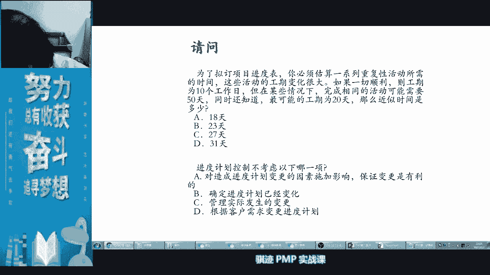

你这个也行吧，但是这个呃也行，可以也可以这么理解，但是我的解释是最正确的，明白了，客户无论如何不允许直接插手进度计划，它可以提要求，但是怎么实现，由项目经理通过修改更新项目金额来实现啊。

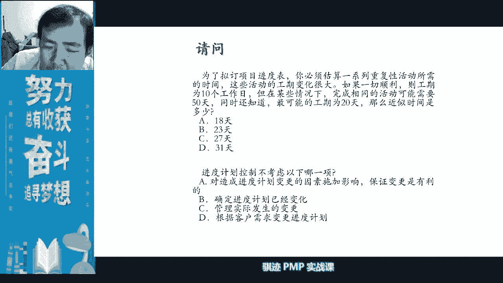

好第五道，活动清单是因为什么，那么其实这个题目就是问，其实就是问哪项是最适合对于活动题材的描述，对吧，a作为项目范围提供有有文件说明，b确保成员能够理解如何完成工作，c被项目经理作为备忘录提醒。

第一在项目中心的具体技术文档应该是哪个啊，boy啊，还有选哪个呢，抓紧，第五道选不爱，都选报啊，永远不同意，挺好啊挺好，都选不啊，那就没问题，第五章选b啊，没有问题吧，为什么呢，因为活动清单里有什么。

是有对这个活动的进行进行一些描述的啊，对于这活动这些描述，它能够帮助团队的理解如何完成a，c呢活动基站初始状态还没有进行排序，没有在时间轴上定它的位置，所以不能作为备忘录对吧，注意对吧啊，初始状态。

所以我们现在讲的活动应该是默认状态对吧，然后我们技术档案，活动清单里面并没有讲到有关技术的事情，啊ok好，那么第六的，第六章每当项目经理从合同办公室得到通知，一个一个一个合同已经和卖方签订完毕。

他应该检查什么东西啊，之前那么这个一看就是什么，应该检查这个合同刚刚签完，什么东西都没做，那么上来第一步先做什么，从进度方面来说，第一步先做什么，我们讲项目的进度管理，第一步是做什么，项目的金额。

第一步是建进度啊，进度管理计划对吧，这里没有啊，第二步是什么呢，定义活动，所以这道题应该选什么，选a啊，为什么不选b呀，估算活动是我们后面一步对吧，后面一步的后面一步第一是什么定义活动。

第二是什么排列活动是你，第三才是估算活动时间，记没记得，同学们啊。

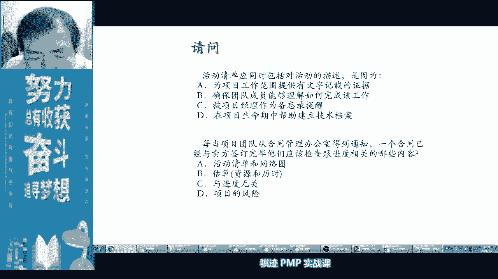

好，那么第七道，好我们看第七章啊，在进度网络分析的项目经理调建议调调内调整，超前和之后，项目经理的意图是什么，不使用超定制项目就不准确，一旦进度定义下来，超金之后就失去意，项目经理不需要调整它们。

有效的使用车进度将达成时间可能性，同学们，这道题目你们觉得你们还会选错吗，第七道，啊哦，我只能说啊哦嗯，这个已经是项目执行过程，我们现在讲的是进度网络分析啊，好sorry，弹出了一个东西。

弹出一个奇怪的东西对吧，驱动更新啊，这个一看就知道应该选d啊对吧，利用超前之后，是让我们的活动放在一个最有利的位置啊对吧，能够达成目标的可能性最佳呀对吧，你说中国人也理解题的描述是不是最圆滑的。

最不会错的对吧，再打第三选d咯，ok啊，第八个第八个，ok当进度进压缩的时候，我们可以在关键路线增加资源，这就是必须进一步考虑什么东西，哎来了，是不是这样讲过啊，第八题很简单啦，第八题很简单吧。

第八题应该讲什么啊，这个我们要压缩进度，增加资源，要考虑什么事情，历史最长，这是要进一步考虑什么，考虑什么，不是考虑哪个任务啊，同学们，当进度压缩的时候，你可以在关键路径在上面增加资源。

这时候要进一步考虑什么事情，ok当然应该选b呀，啊我首先来解释为什么不选dog，注意进度，计划当中，历史最长的任务不一定在关键路径上啊，同学们是不是啊，虽然他在关机的时间可能性挺大，但是不一定啊。

他可能有一个任务，比如说做50天，但可能另外的路径上，他可能有很多任务不都是十天，20天，30天累计起来比50年大，有没有可能有可能的，对不对，所以最长的任务不一定是我们要考虑的事情，而是什么。

如果我们要压缩进度，是不是有可能出现新关键路径，记得我说的例子吧，30天压当20天，是不是我们实际努力是要压缩17天，而不是十天，记得那个例子吗，所以应该选什么，选boy啊，选不爱啊啊记着我的例子啊。

深深的记着我的那个例子对吧啊，次关键路径啊。

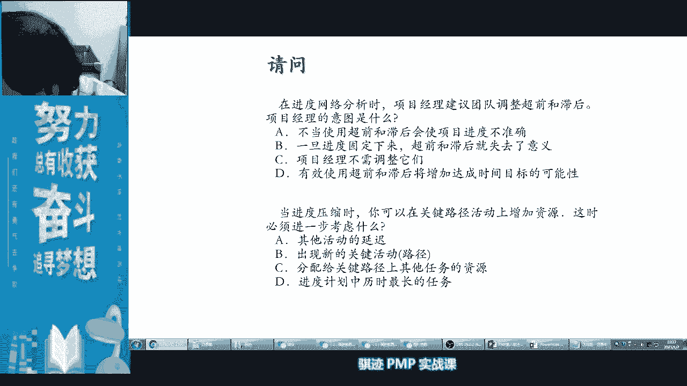

非常好，还有次次关键路径ok好，第九道第几道啊，第几道第几道经啊，团队分析单竞价发现关键里程碑没有完成，造成延期，项目经理应该怎么做啊，第九道有没有人选c的，我先问你们尝试风险，有没有有没有选c的。

第九条a对，尝试赶工啊，这很明显，因为赶工和快速跟进都有的话，如果没有特别设定，就就选a赶工，如果这道题目如果是如果是团队放弃，但你要发现进度关键里程碑没有完成，而且成本超支，这个时候就应该选b了啊。

这道道题现在选a，但是如果他多加一句，成本超支，就应该选b了啊，d是最最最最最最最最不应该选的，为什么有一件事情你做不完你就不做了，这是不是最不好的态度啊，你做不完，努力做是一种是一个能力问题。

你做不完就不做了，是一个态度问题，明白了吧啊，c就耍流氓的无偿加班，对吧啊，996007啊，好最后一道题目，项目经理用什么样的技术，我们公司的司机，执行的项目经理，可以用什么样的技术工具和技术。

汇报当前项目状态，给给相关方啊，这个我们刚刚学过选什么，第十道，第十道很简单了吧，第三个选什么，哎dog啊，好ok啊，我看，很多同学选了dog，ok我们学过的工具技术，实际精度几点是可以表述。

但是它不是一个技术，它要结合什么东西啊，你要结合我们的甘特图，然后画上我们的实际进度节点和我们的啊，当前应该达到的一个节点才能表现对吧，它单独使用是没有意义，所以dog是对的啊，迭代燃尽图。

我们学的是用来进行汇报的一样工具，为什么进度网络图不能汇报，是因为进度网络图上面没有时间，默认状态的进度网络图没有时间对吧，只有关系，颈前绘图法是一种绘图工具，它不是一个实际状态工具。

它可以把计划画出来，但是他没有办法把当前的状态画出来，明白吗，所以敌是最适合的啊。

和我们的老师的鼓励，奉献的老师，今天是无偿加班奉献对吧，老师今天多上了30分钟，我为什么要多花30分钟，就是希望这个章节你们一定要学好，一定要学进去，我在下节课开始后，还会把今天讲的一些东西再复述一遍。

目的是这个章节一定要学会，因为pvp考试当中进度和成本是最喜欢考的。

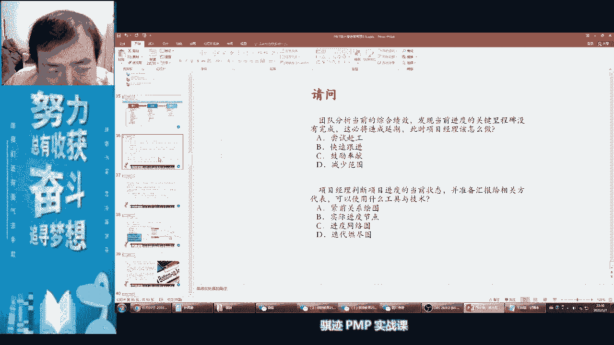

最喜欢考的啊，因为范围里面考呢大部分是考的是定信的东西，但是进度和我们的啊成本是要考定量的东西啊。

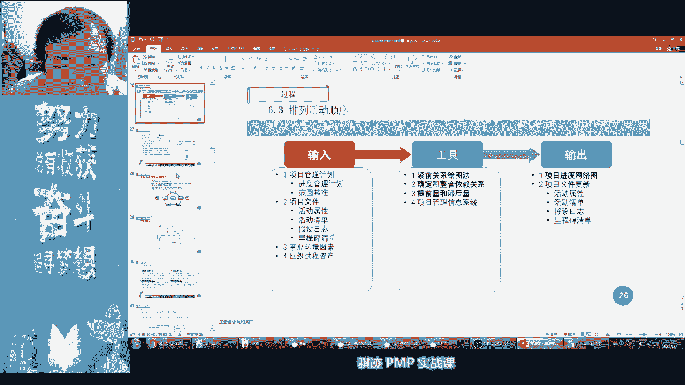

但是定量的东西那是一定要我们掌握了，大家能够有一个加深深深刻印象，万一啊有什么东有什么东西，没有关系，我们下节课还是复制当中，大家可以提出来，可以在微信里面我们继续交流，好吧，今天已经很晚了。

大家辛苦了啊啊大家晚安，拜拜啊啊，为了不让大家做噩梦，我就不稳了，对吧，say gobye。