# PMP认证考试课程最新完整免费课程零基础一次通过项目管理PMP考试 - P18：PMBOK第六版 第七章项目成本管理-19 - 骐迹PMP - BV1Sb4y1f7Yt

会非常好啊，做完广告了啊，还结束啊，我们上两节课呢，把项目进度管理呢啊交完了啊，教完了，然后呢我们今天快速的过一下。

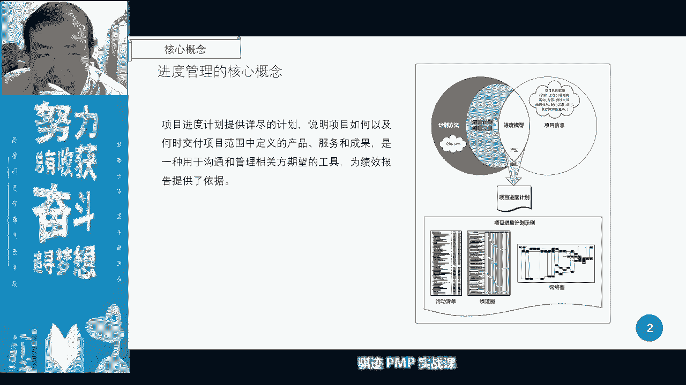

我们讲主要有哪几个流程啊，主要有规划进度管理，定义活动，排列活动顺序和估算活动时间，最后制定进度计划，所以它是一个我们记忆当中是怎么记忆的，先定规矩进入规划进度管理，然后再去定义活动，然后排列它的顺序。

然后估算的时间就根据最根据最理想情况，没有约束情况去排列啊，活动顺序，然后估算活动时间有，然后呢再考虑约束的情况去解除约束，最后做出进度计划，逻辑上就是这样一个逻辑啊。

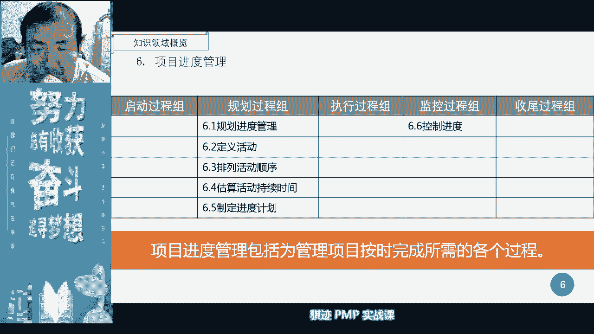

好差不多是这样一个逻辑，那么这个这个逻辑进行当中。

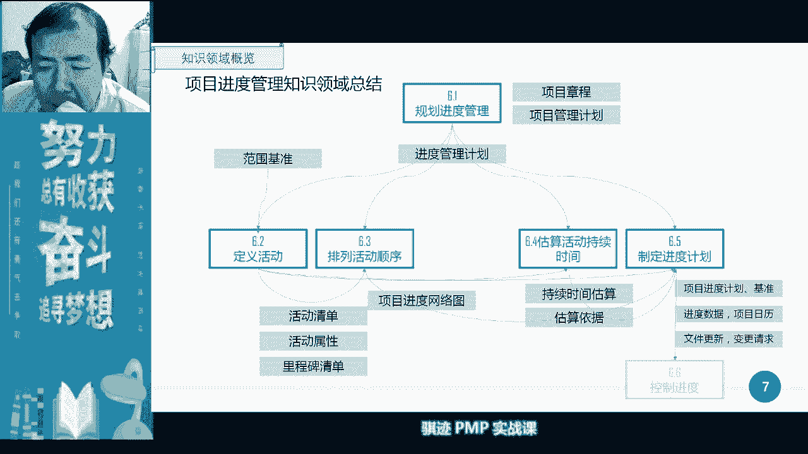

第一步是我们定义活动，定义活动呢啊这个是规划和进步的管管理计划。

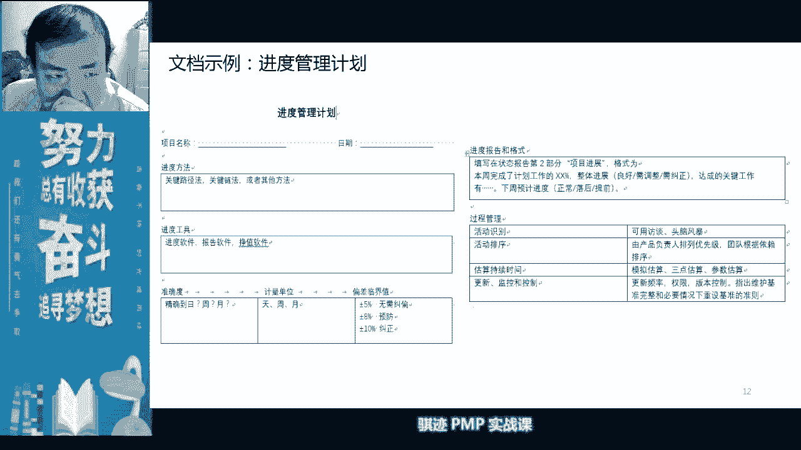

规划我们进度，在规划进度中，我们会规划一些以下这些啊。

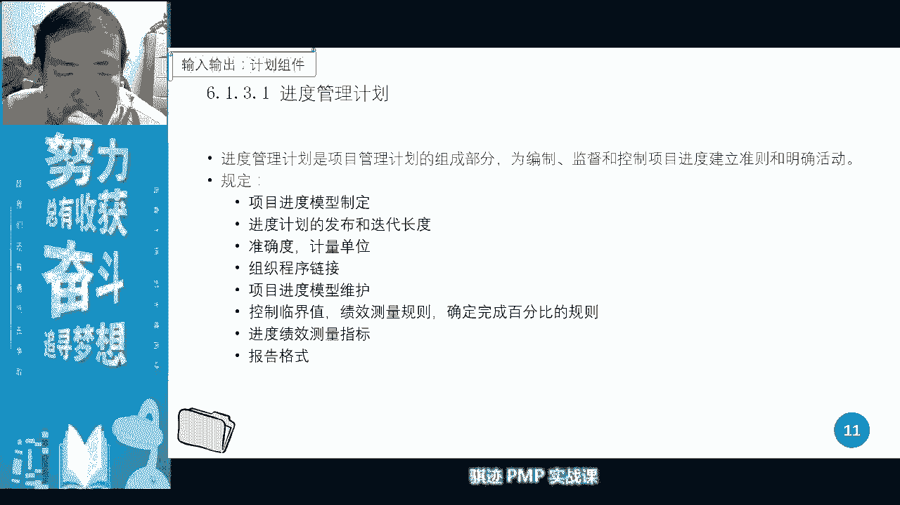

指标和一些一些条目啊，我们就不细说了，那么规划之后就会进行定义活动。

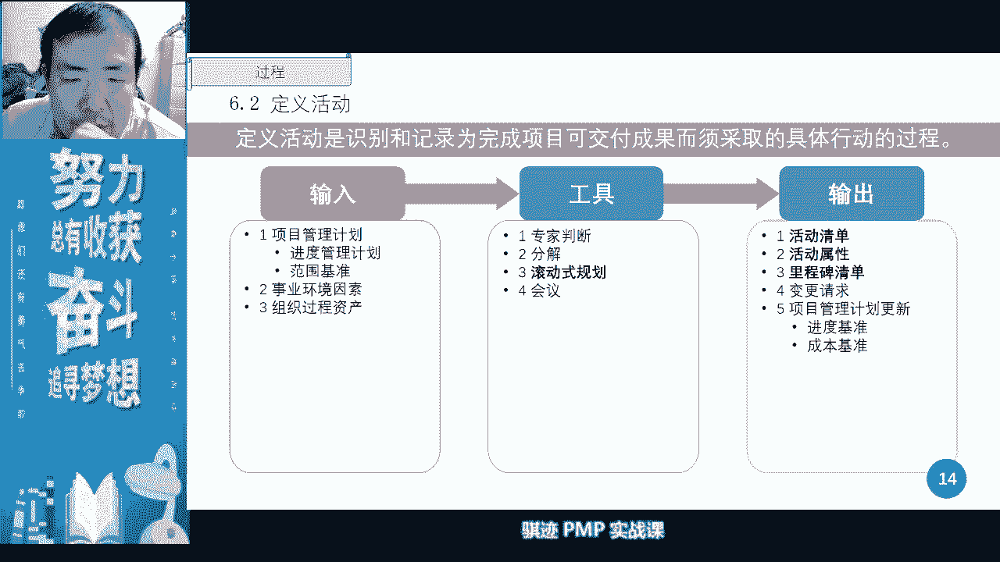

定义活动最主要输出两个我们的活动清单，通过分解出活动清单和广东式管理，对吧啊，我们帮助大家再回忆一下，这个过程非常重要，首先把活动定义出来，我们今天会讲到成本当中，会讲到，我们大部分的人力资源成本。

是来自于和其他的成本是来自于活动的，所以它的来源不一样。

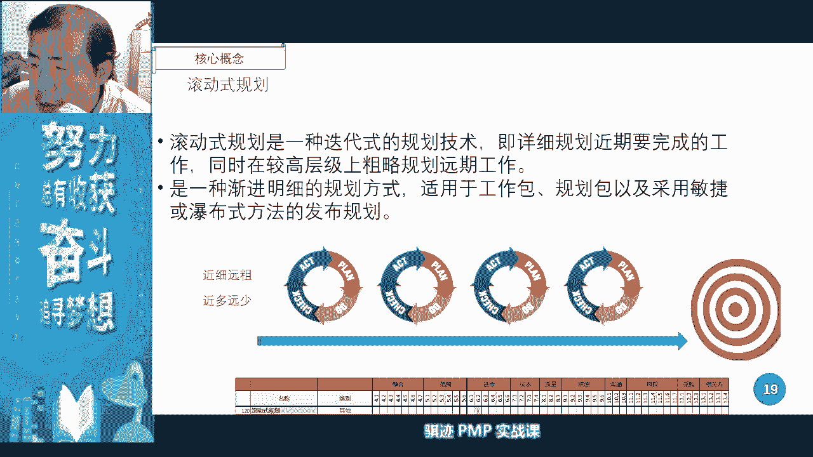

然后会出活动清单，它是一个没有排列顺序，没有勾结关系。

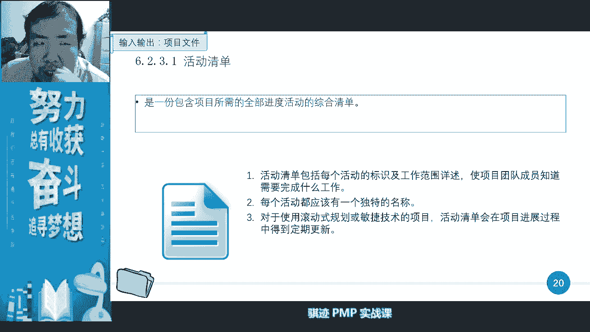

仅仅是一个清单啊，它没有形成结构，那么还有回他的每个活动的一个属性，在属性在之后的活动当中呢，我们会把属性啊填充完整，比如说紧前紧后活动啊。

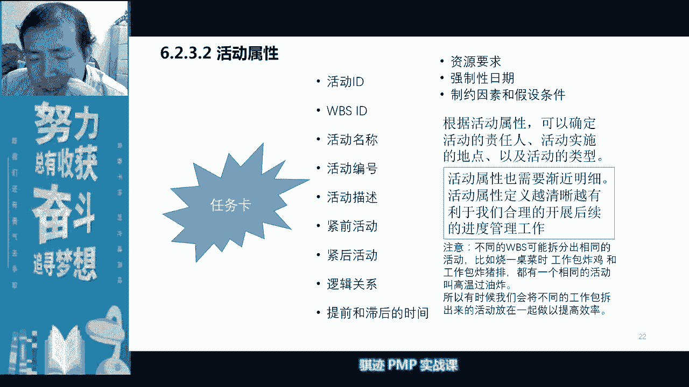

逻辑关系啊，提前之后时间资源要求等等啊，活动进来之后呢，我还输出个里程碑清单，要指出哪些里程碑啊，注意里程碑一清单当中有个历史里程碑，有些是甲方给的叫强制性的，有时候自己设定的叫选择性的。

然后呢我们在采购那一章呢就化身为甲方，那么我们可以乙方会去试设置里程碑啊。

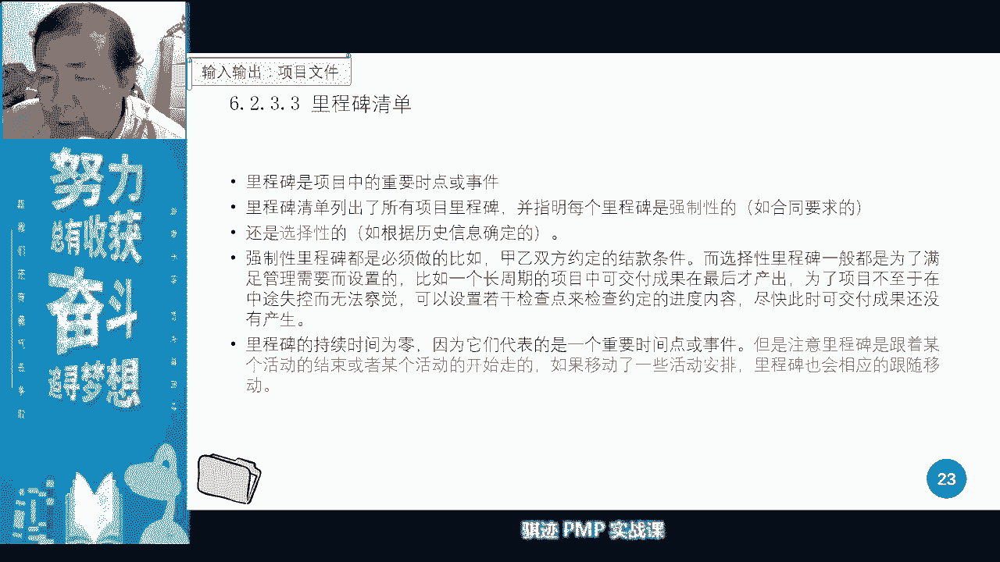

这也是要注意的，那么接下来是排列活动顺序，排列活动顺序当中，我们会用到一个颈前关系吧对吧，我们有四种关系，f s s s f f和s f4 种关系，但大家脑子想想啊。

a f s b是不是就简单等于b f s a对吧啊，那么我们讲s s和s f，s s f f以及f s s f这四种关系当中，都有提前量和斥候量，体系向量和吃货量是谁被指向谁做移动，负的呢是往前移。

正的呢是往后移啊，这要注意啊，负的是往前移，正的是往后移，谁被指向随移动啊，差不多是这个意思啊。

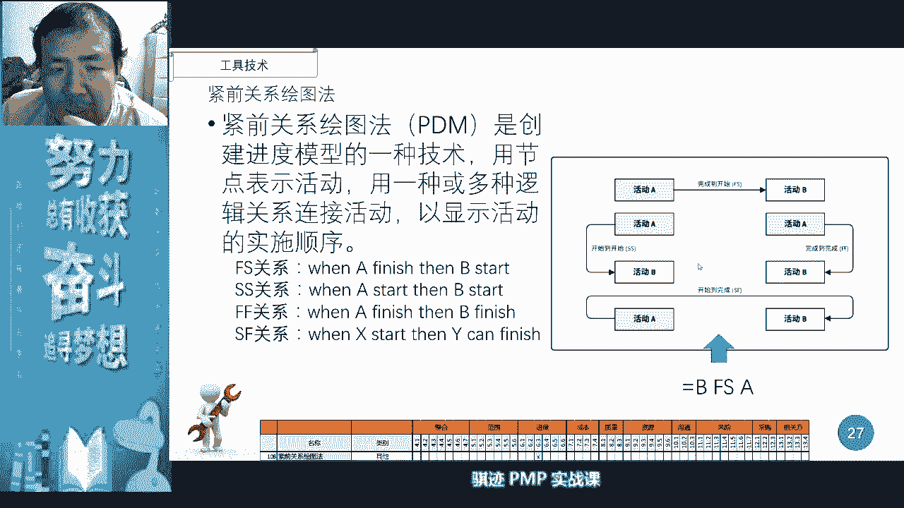

大家记得吧，啊什么叫颈前关系法的特征是什么呢，活动在框框里面，历史在框框里边，线表示逻辑关系，如果线上没有特殊标明。

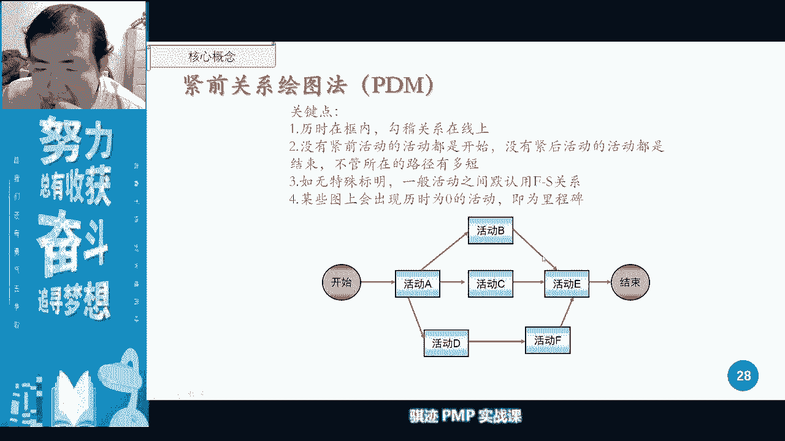

那默认f s关系啊啊这是一个图的举例对吧。

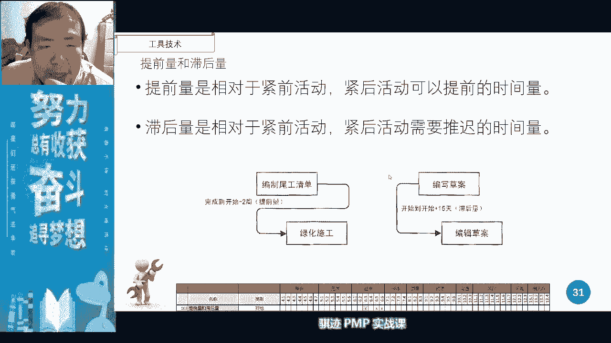

然后呢我们又讲到了有利依赖关系，内部的外部依赖关系，选择性依赖关系和强制性依赖关系，那么我们还讲了一个a d m对吧。

叫间线绘图法啊，这是一个简单的界线绘图法，那么有了我们的关系之后，接下来我们要进行什么，我们有一个进度网络图了。

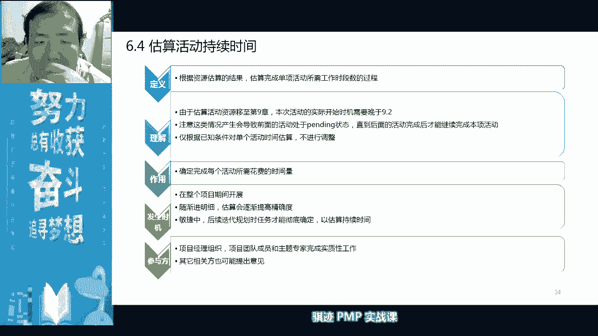

有了pdm是不是有进度网络图了对吧，有进度网络图了，有了进度网络图。

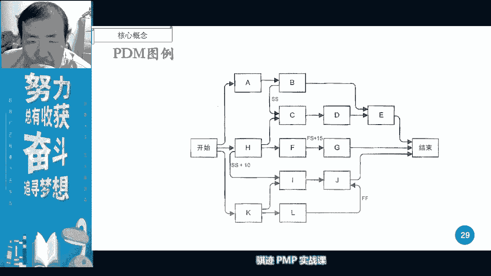

我没有逻辑关系，但没有持续时间，所以接下来要估算持续时间过量，实际时间当中我们有类比估算，三角估算参数估算，注意这些这些三种估算在我们的考试当中啊。

考试当中同时也会用来估算什么，估算我们的进度啊，估算我们的进啊，估算我们的进度，估算我们的成本，也有可能估算我们的一些什么，比如说是质量方面，或者是呃呃呃风险方面也可能都会用到。

也有都有可能用到啊，那么估算当中唯一种要计算呢，叫做三点估算对吧，我们默认用贝塔估算方法，起源于p p e r t对吧，这是贝塔公式啊，贝塔的一个公式，那么在贝塔过程当中，我们会有啊标准差这样一个概念。

那么标准常态分为六个西格玛，我们的中心轴左边的是三个西格玛，中心的右边是三个西格玛，所以考试当中呢我们这只要说出中心点啊，所以我们在群里有一个同学讲了道题目啊，当然是在a一群里，二群里可能没看到。

也不知道，那我跟大家讲一下，就有个题目，假如说有一个项目，我们最晚呢是最晚的是七天完成啊，最晚是是是呃七天完，最小呢短时间七天完成，这不是七天完成，是18天，最短是18天完成，最短的是18剪完成哦。

哦sorry我那个题目有点忘记了，我来群一点翻一下记录啊，我提问了忘记，呃让我看看有没有让我看看，sorry啊，我来看一下啊，我看快翻到那条记录了，啊那么稍等，那么在这个季度当啊，在这个题目当中。

他说是最早是最乐观是六天完成，最被最乐观是六天完成啊，注意看我的鼠标啊，我把鼠标换一下，我把鼠标换成嗯啊，sorry，不是这个，我把鼠标换成激光笔啊，我把鼠标换成激光笔，那么呃换成荧光笔啊。

我们说这里边最早这里是什么事啊，这里是左边，这边是这算是这里，这里呢是六天完成啊，左边是六天完成，就是最小的，最大的呢这边呢是18天完成啊，18天完成，那么18和六呢中心对称。

它的最有可能的是过估计为九天，那么我要算首先要算三角贝塔，那么算出来的期望时间，那就是多少啊，期望时间就是一个11天，它的中心轴是11天，然后你会看到它就围绕着这个中心轴来。

那么我们把我们把呃这个题目当中6~50，左边最小是六天，最大是18天，这个题目呢我们把它六等分，六到18里面正好是12，12的六等分呢正好是多少啊，12。6等分正好是一个啊两天，所以两天是一个西格玛。

正好是切六块，相当于西瓜切六块嘛，那么一个西瓜皮的长度是12啊，那么一块就是两天对吧，中心轴就是11，所以这个题目他是这么问的啊，我把它贴到群里，然后贴到聊天室里面啊，给大家做个例题。

但这个题目现在越来越少了啊，我给大家讲一下啊题目，那么这个题目当中可以看到，那么我们可以很容易算出一个什么，通过我们的三角贝塔可以算出什么，我们的贝塔值是北大值是11天，我们的中心轴是11天啊。

首先可以确定11天，然后呢因为我们中心值是11，那么它对它来说，我们的九天和13天能完成呢，九正好比11小，二，13正好比11大啊，他正好是左右各一个西格玛，所以它宽度是两个西格玛。

我们从这张我们从p p t上这张图可以看到啊，宽度为两个西格玛正好的它的概率是多大，它的概率就是呃换成比它的概率，就是这个它的概率就是68。26，68。26，28。26，那么如果我这个题目里问。

如果时间为什么啊，为七天到，如果是七天到15天呢，那么七天正好是加41，七，是11~45呢正好是11+4，那么它的概率就是59。46，我11。46k啊，所以标准中的题目就是这样做的啊，可枯燥而无味啊。

就是这个样子，所以大家能够知道这个算法就行，所以就但是这种考试形式现在越来越少了啊，因为这是传统工业项目当中啊，传统工业制造项目当中，对于项目进度的一个精确估计的一个，可能性的一个估计值，在现代。

它是基于我们项目，不产生任何变化的一个估计值，但是项目当中现在越来越多的项目呢，都是对范围经常发生改变，所以你的估算时间用这种方式统计，数据方式啊越来越不精确了啊，所以这个呢现在意义越来越大。

所以以后的我们这届考试当中，可能出现概率没有那么大啊。

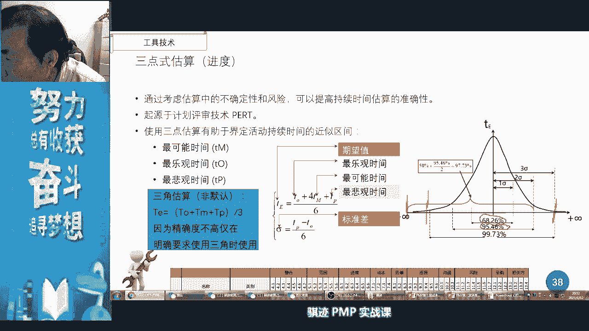

大家明白这一点，这是我们讲了我们的三点估算，所以我们要怎么从最最不精确的类比，估算到最精确的自下，如估算过，总共有四种估算方式啊，大家要注意，当然这四人多的方式，就像成本估算一样，成本估算也可以。

没有问题。

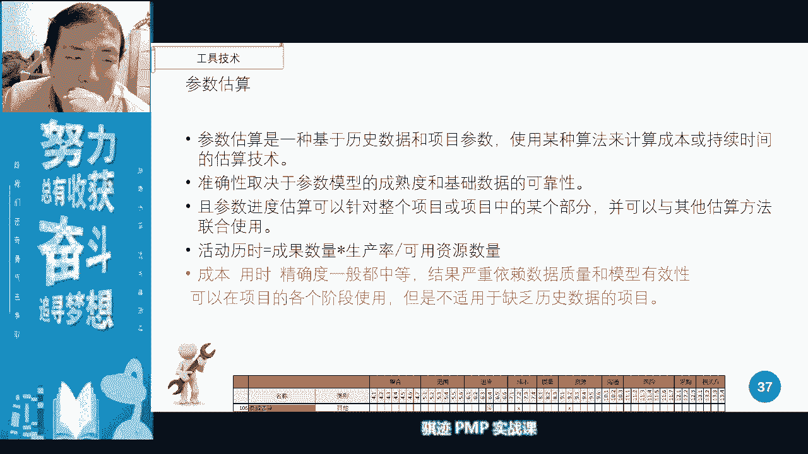

那么我们在进度估算当中，我们还要考虑到应急储备和管理储备，我们要考虑到进度的储备，分析储备，最后的结果就是什么，在进度当中我们会安排一些冗余时间，冗余时间。

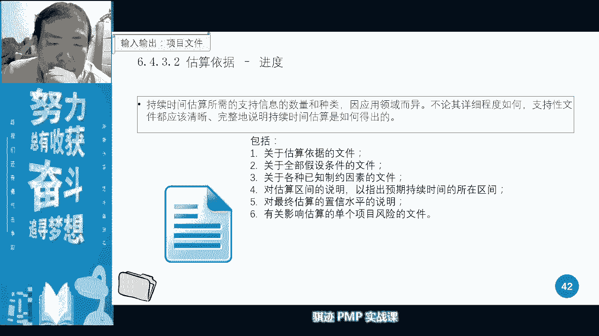

好那么这道题目呢是我们的呃。

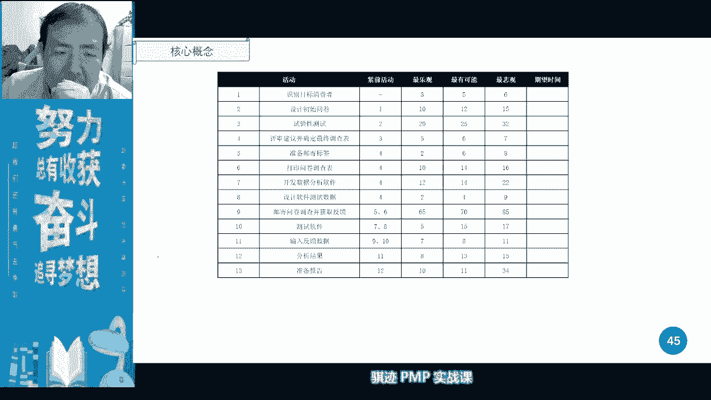

不知道大家做对了没有啊，然后最后我们制定进度计划，制定进度淡化计划当中。

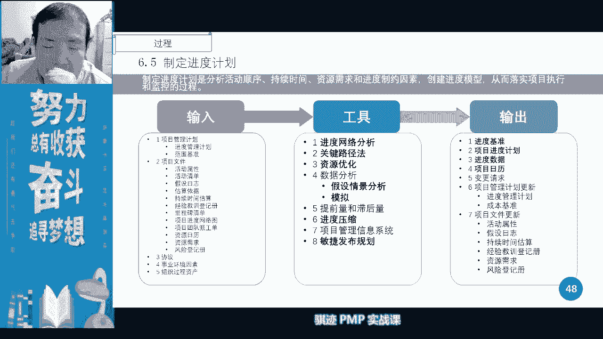

我们最主要的概念是一排除资源的限制。

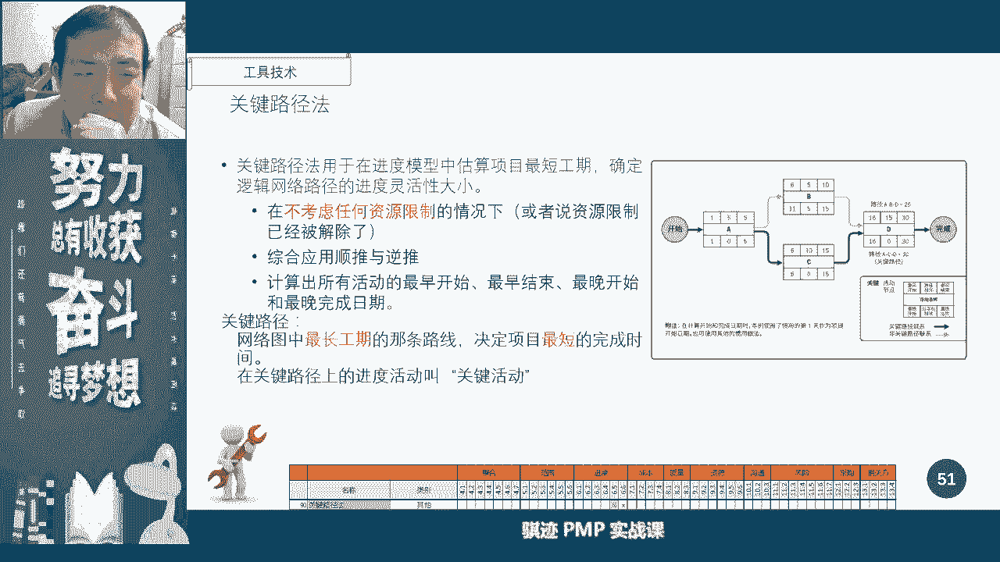

为了排除资源限制，我们具有什么啊，我们就一个首先要考虑一个东西啊，我们首先要考虑一个东西。

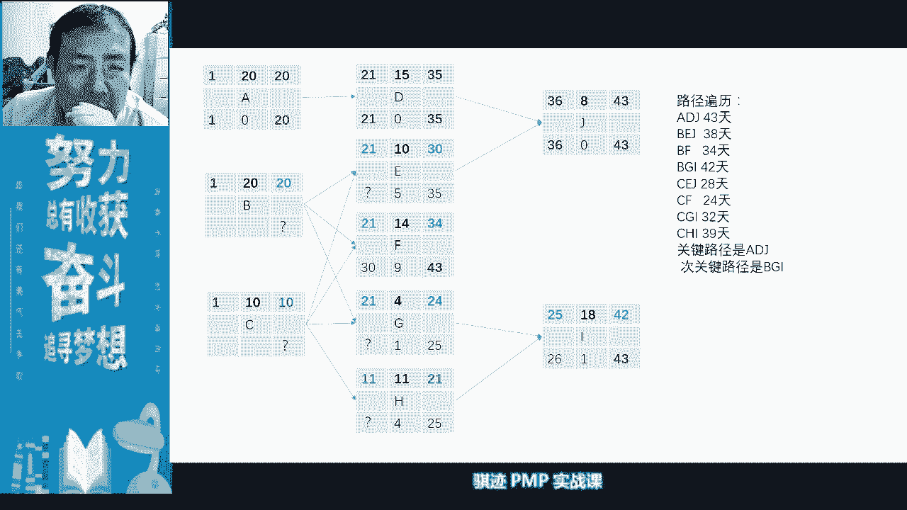

是我们的资源优化技术，也叫资源平衡和资源平滑啊，我们在我再讲一遍，什么是资源平衡，资源平滑，首先资源平衡它移动的是资源，资源平滑移动的也是资源，所以资源优化技术它是分配资源的，去合理分配资源的。

但是它的目的不一样啊，资源平衡注意听啊，它是主要的目的是避免资源过度的使用，或者避免在有些时段稀缺资源用不到，所以呢我们通过移动稀缺资源，或者移动稀缺资源的有效使用来进行什么，进行资源的合理调配啊。

从而以牺牲进度为代价换取资源的合理使用，那么会有一种很小的情况，或者什么比较少的少见情况是什么，我们会有闲的闲死忙的忙死的情况下，我们可以移动一些闲置的资源，去帮助现有资源来干活。

这个时候呢反而有可能提前进度，当然它是局部的啊，和整体的进度看来不一定相关啊，这种叫做资源平衡，那么什么叫做资源平滑呢，就是说资源平滑是移动的，是活动，在资源平滑当中我们就不移动资源了。

我们是移动的活动，达到一个什么一放田谷，一放填谷的作用，所以资源平滑主要针对于什么，优化资源的使用量，它一般是普通资源，但是它有个峰值，所以资源平衡主要是满足什么资源，峰值不要过高，否则就会造成什么。

有些工作日大家忙死，有些工作日呢活太长，大家又很闲，这种盲嫌不均啊，是这种情况，那么它通过移动活动来达到移风填补的，这样的作用，所以你看到有考试当中，能够看到我们主要移动的是活动，那么他肯定是资源平。

如果我们现在要合理的去利用资源，将资源，比如本来在一天用的分成两天，用，两天呢分成三天用的，那么这是资源平衡，ok不知道这么讲，大家明白了。

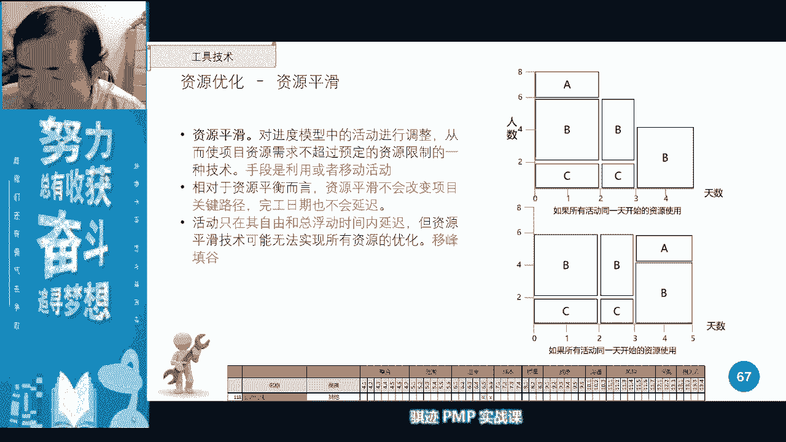

总结一下，就是这样啊，能够理解就行了，好那么我们在这个当中呢。

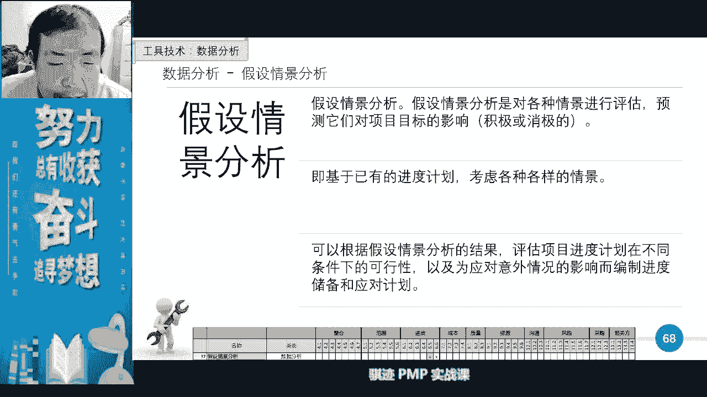

我们还有一个进度的优化技术，进度的优化技术呢，就是什么赶工和一个进度压缩技术。

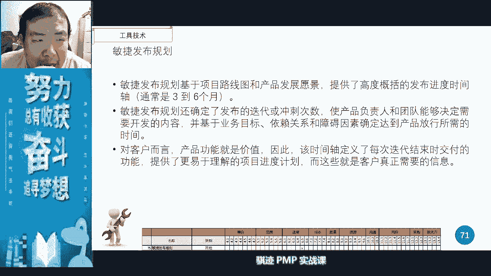

就是赶工和快速跟进，赶工呢就是加班要有偿的啊，快速跟进呢就是我们要是将活动呢叠起来做，它的风险更高，笔记赶工风险更高，所以没钱又想抓紧进度的时候会做啊，用于追赶时间，但不能用于追赶错过的里程碑啊。

啊进度的进度压缩技术呢赶工呢会优先使用啊，这是我们常用的资源优化技术。

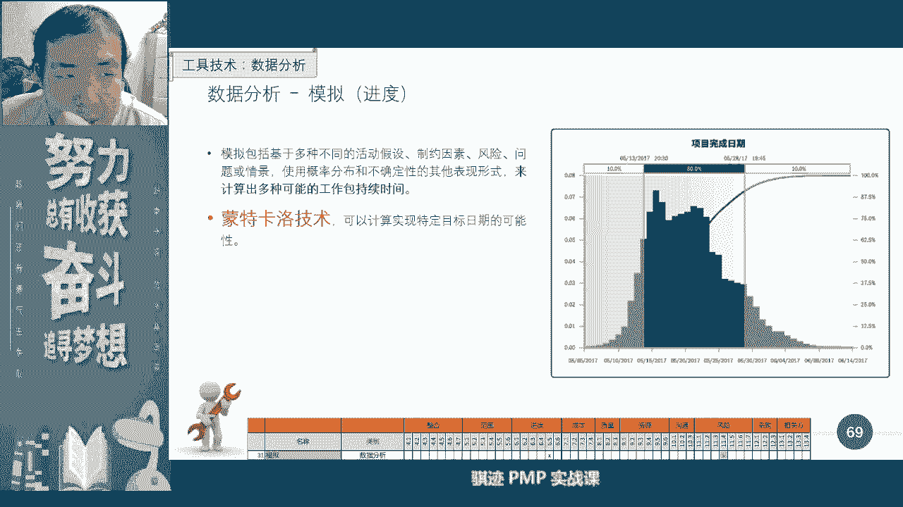

和进度的压缩技术啊，那么我们在这个之后呢。

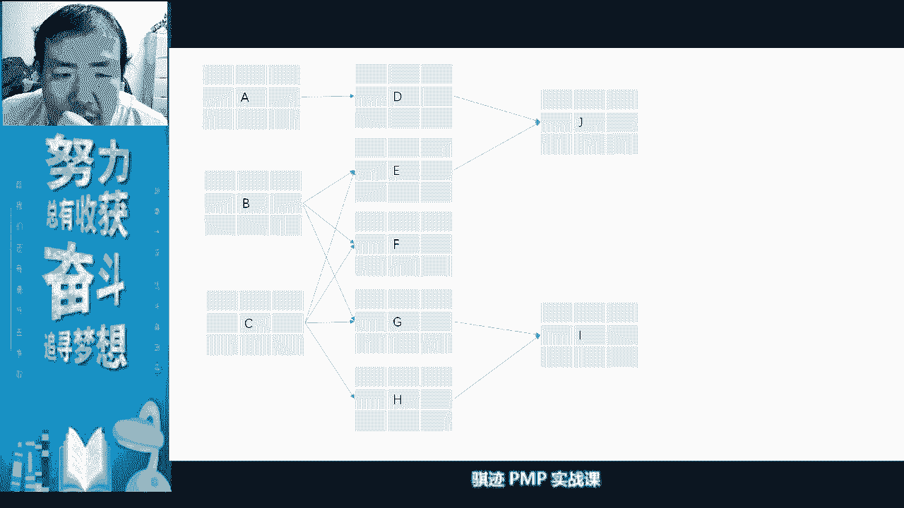

讲了一个我们关键路径图的画法啊，这个呢关键路径的法呢就不再提了，我们还是提一下关键点啊，在最后一次再提一下关键点，关键点第一我们首先算出所有活动的期望时间，根据三点估算对吧，根据三角贝塔。

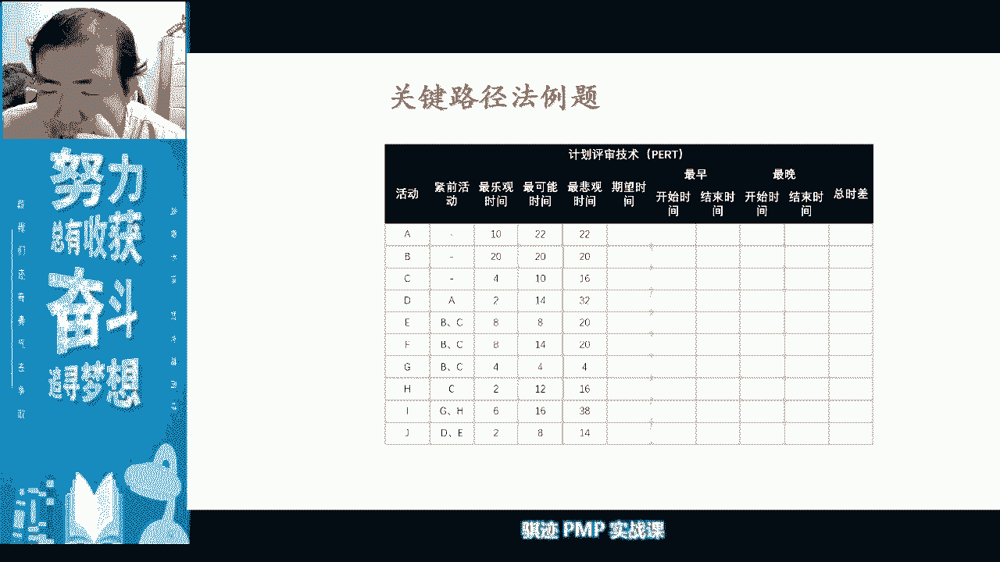

我们一般默认用贝塔啊，算出我们的所有期望时间，然后呢算完进入直线之后呢，我们首先把所有活动根据警前几何的关系呢，绘出我们的pdm图啊，这是张pdm图，那么在这个pdm图当中呢，我们会找出轻易的老树开始。

但是不容易轻易的老树结束啊，当我们绘出这个图之后，其实我们可以找出来f2 f ji，为什么f ji呢，是因为f ji都没有紧后活动没有紧，前活动的活动是开始没有紧，后活动的活动是结束啊，这是第一点。

绘完图，绘完图之后呢，我们就可以列出接下来列出什么东西啊，列出时间便利，因为我们有每个活动长度就可以便利出时间，我们就可以找出关键路径和次关键路径，有了关键路径四关键路径。

我们因为关键路径没有特殊的提示设定，我们说关键路实际上什么总浮动时间为零啊，总部车时间为零，关键路径在我们的图上已经标红了啊，总不动时间为零，那么非关键路径怎么办呢，根据关键路径跟关键路径相关的。

如果你的非关键路径，不是直接跟关键路径来相连接的呢，那没关系，我们可以把我们非关键路径的结束呢，最晚结束时间照抄关键路径结束时间啊，原理是只要我们非关键路径的最晚结束，不晚于关键路径。

是不会影响总的进度的，对吧啊，照抄过来，如果像这一条鼻一节，这种跟关键路径共享一个减速的呢，我们直接按照关键路径倒推就可以了对吧，倒推啊，那么在上面三个正推的过程中呢，是我们要遵循开始时间。

加上我们的这执行时间，减一等于我们的结束时间，后续活动呢肯定会被前序活动呢，强制要多加一天啊，如果有多个后续活动呢，那么多个后续活动，应该比最晚结束的那个结束的时间呢，还要多加一天，多加一天。

多加一天啊，始终满足这个规律的啊，我们就把正序全都做完了，然后倒序呢就通过关键路径呢倒推当前路径，倒车之后呢，我们看到比如说f这个例子，当成当成我们最早开始做，晚开始呢差了九天，所以总浮动脉就是九天。

总浮动九天啊，所以他这一格的最晚开始时间就是什么啊，我们的最晚结束时间减去我们的浮动时间，再加上一就等于这个格子时间啊，所以这个不是30，我是故意的，应该按照这个43啊，43减什么18啊，加一对吧。

对26或者是在上下这里差一天，最晚节开始和最晚开始，最晚结束和最最早结束呢差了一天，你这里上下差一天，那你这上下差一天，这里上下差九天，这里其实应该也是什么上下差九天，所以这里是30啊，30好。

通过这样的倒推，我们就全填出来了，那么如果一个有多个活动，共享一个颈前活动怎么办呢，那么紧前活动的最晚结束，要比之前所有的紧扣活动开始呢还要少一天，早一天对吧，所以这个时候这是多少，这里是26对吧。

这个算是上下差五天，这得商量差五天，这上下差九天，这个商阳差九天，这个上下差一天，这个上下差一天对吧，所以我要比这26，30和22最早的那个呢还要早一天，前后就不违反逻辑关系了，对吧啊。

想想20是不是要比这个21，21 21都要什么早一天，那么我21是不是要把b26 ，23和22都至少要早一天或者一天以上，这就不违反了，对不对啊，想一想这是不是不违反了，所以这里最后填的是21啊。

这里呢因为是有一个得了一个15，因为它是有一个15的存在，所以我之前的活动呢，那就必须提到14号结束了对吧，至此呢整个我们的关键路径图就做出来了啊，不知道大家明白了没有啊，因为我们时间关系。

不可能再跟大家完整推一遍啊。

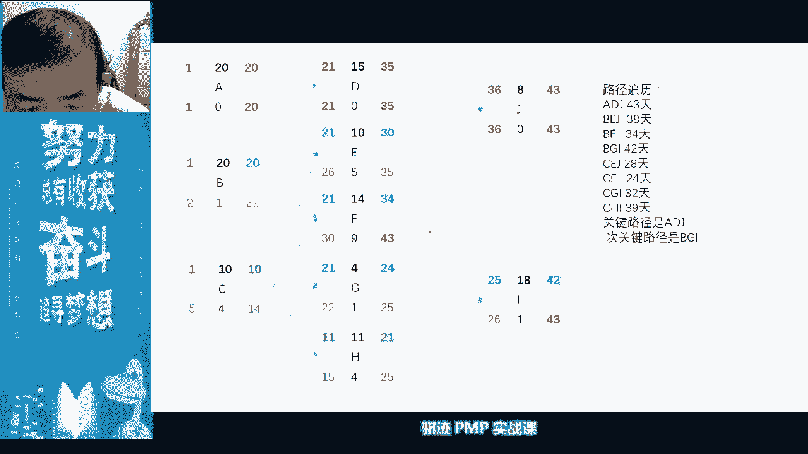

这个时间就会非常长啊，好我们讲总关键路径呢总不能往往为零。

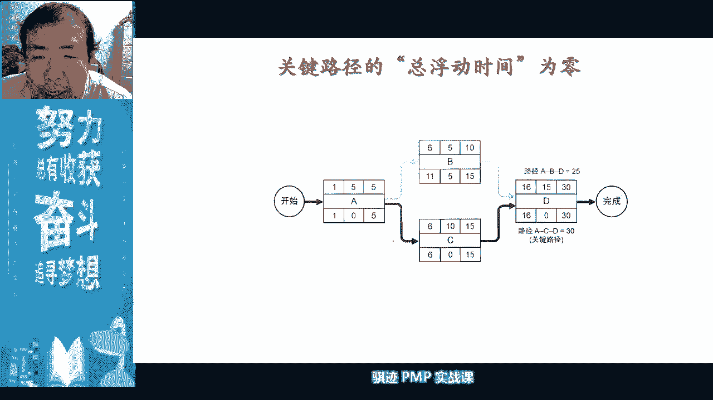

如果为负担，就说明需要精力压缩，我认为正常说明有一个强制结束日期，而且它的强制结束日期呢，往往要晚于我们的自然结束日期啊。

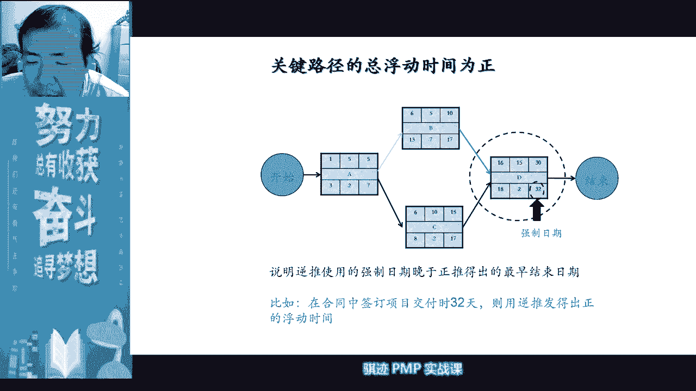

自然结束日期好。

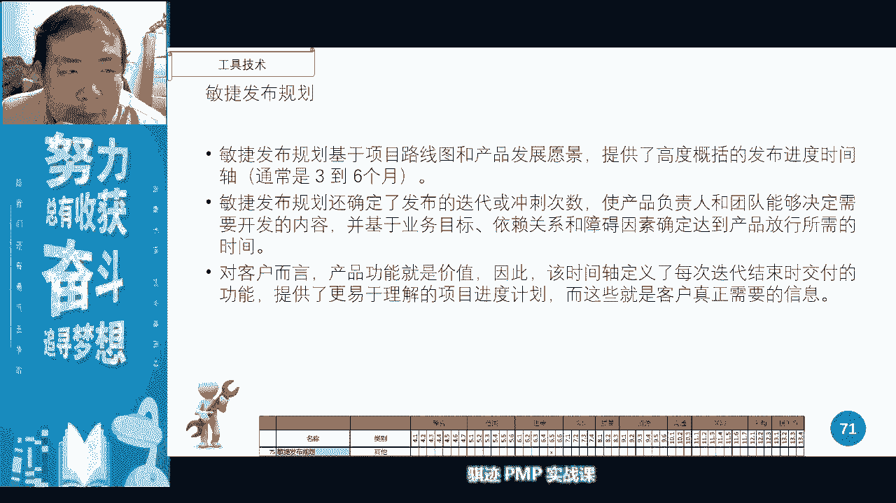

那么这个就是我们的啊，我们的进度基准，做出进度基准就做出了项目进度计划。

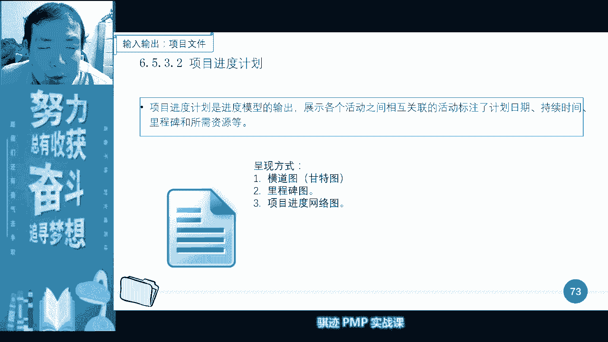

然后就可以做出甘特图，甘特图。

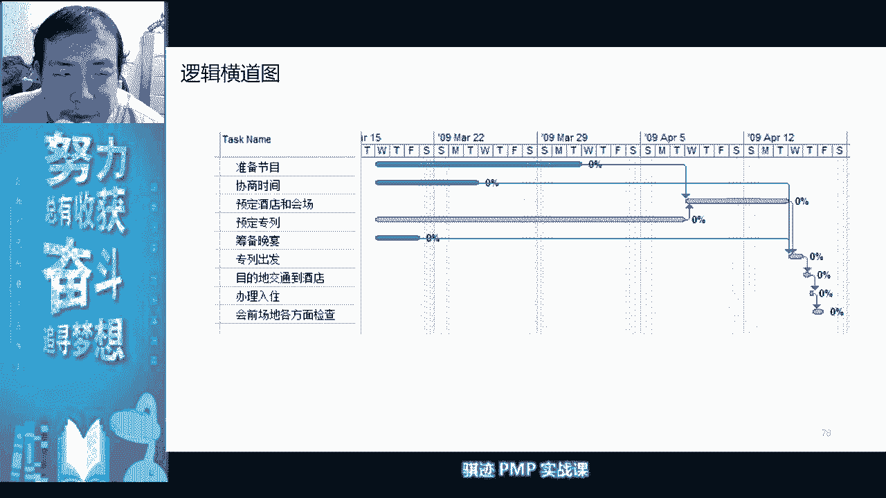

好这是我们的默认的甘特图啊，这是我们默认的里程碑图啊，这是我们默认有关系的逻辑甘特图啊，逻辑甘特图甘特图默认是没有逻辑。

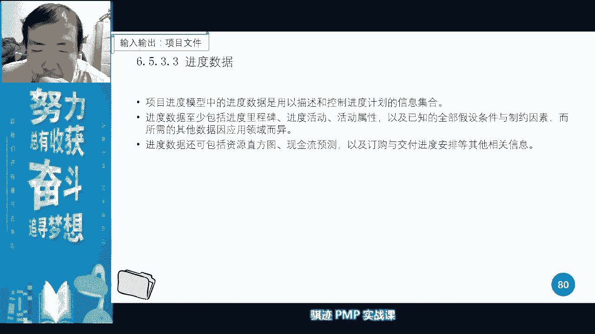

但是你可以做事有逻辑啊，好接下来呢是控制进度当中，我们会用到的工具叫做迭代燃尽图，我们讲迭代燃尽图，希望什么进度的线在基准线越下面越好对吧，我们在后面风险风险当中会学到储备站进图。

希望在这个基准线越上面越好，ok啊总觉得声音很不对。

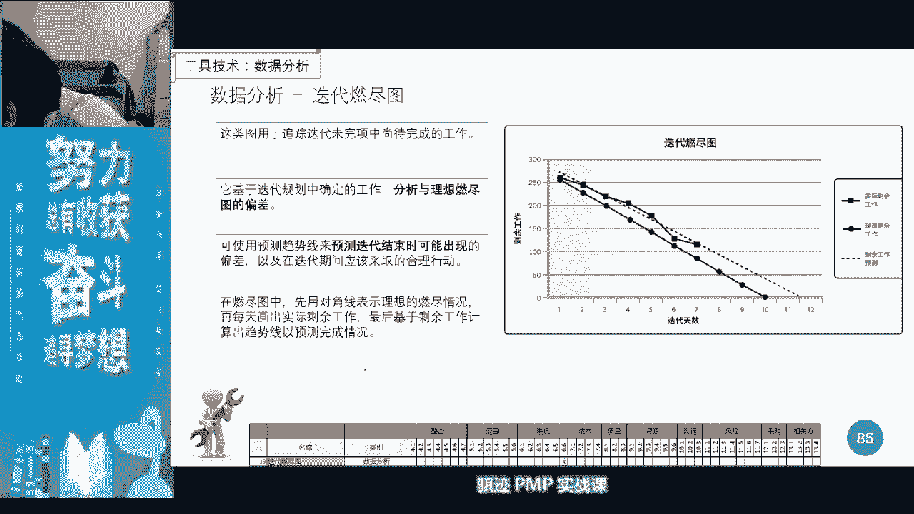

很刺耳啊，sorry同学，我今天有点鼻塞啊，sorry啊，让你让你的听感不是很舒服。

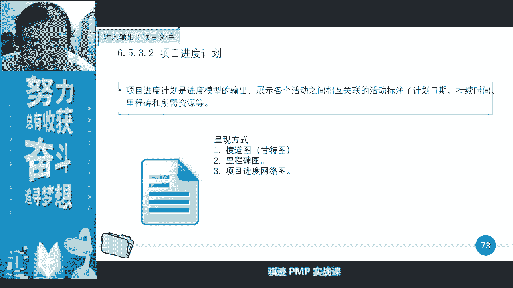

sorry嗯，有可能有可能确实有可能有些同学说啊，b的最紧前活动结束应该是20吧，比那里最近天王者22，那里22，这不是21吗，我们讲的是下面三格呀，下面这个对吧，没有问题啊，因为这是21啊。

所以这是21 20，所以最后面全跟的全是21，因为这三个是倒算回来，这是26。

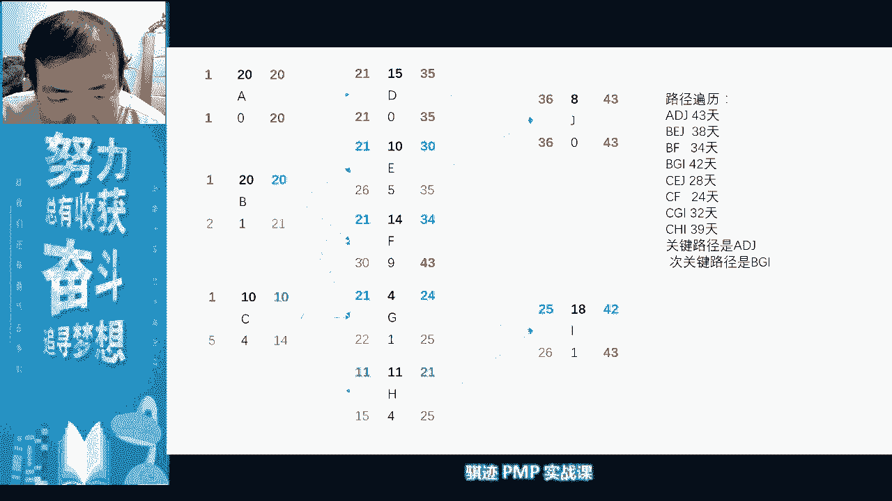

这是30，是22，所以这是21啊，做了，所以没有关系。

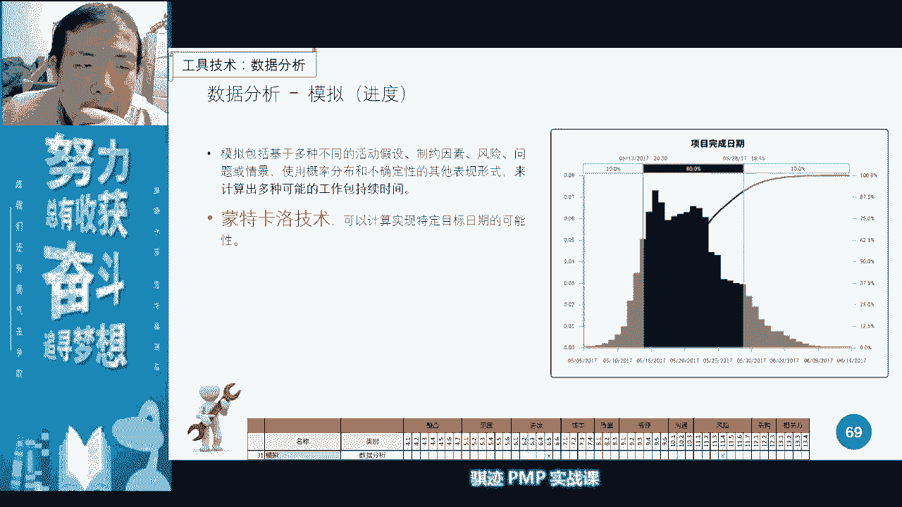

好这是我们上一节课的进度管理啊，我们用最快的时间过了一下。

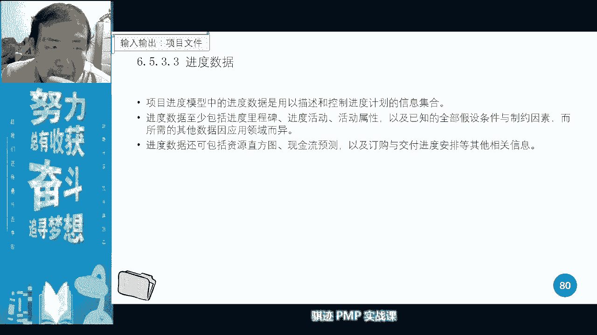

也花了20分钟，ok啊，今天呢ok同学们，我们开始啊讲第七章。

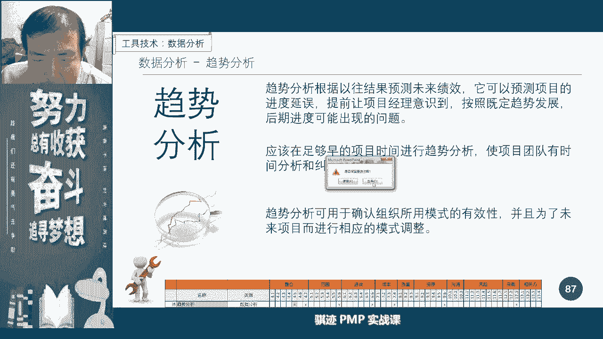

好，我们的成本管理，成本管理呢非常有意思啊，成本管理当中，可以理清楚我们一个长久以来的问题，变声器调零志零的声音啊，这个你们还上课有心思听我上课啊，调林志玲声音，这个你们上课就存在的啊，sm 2当中了。

对吧啊，你们可以把把那个那个什么高德导航调出来，让林志玲小姐姐给你们导航一下，啊啊ok我就是个糙老爷们嗓子，然后我的嗓子嗓音还是很有磁性的嘛，今天因为身体不太不是特别的舒服啊，所以大家谅解一下。

大家主要听内容，听内容，听内容好，那么成本管理当中，我们前面讲到啊，它会有一个很关键的东西可以解释的，就是成本到底是怎么构成的啊，从项目管理的角度，我们可以看到成本是如何构成好。

我们可以看到成本呢它的整个生命周期当中呢，会有从逻辑上会有各个因素构成，它分为整个生命周期的成本啊，生命周期的成本，生命真是什么意思啊，有很多的东西呢是有购置成本，维护成本，使用成本和淘汰成本。

不同的产品，不同的项目，它的项目产品的成本呢是不一样的啊，不一样它的项目过程中的成本呢也是不一样，分为很多类啊，我们会用后面细细慢慢品，然后呢，一个成本是怎么从一步一步啊啊，进行成本的累计集合。

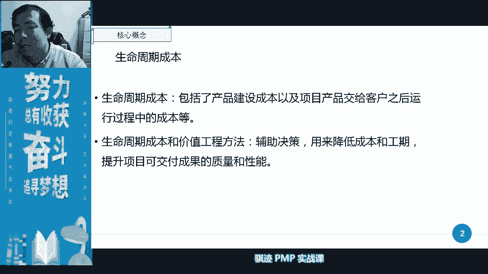

最后报做出一个报给一个甲方的最终价格啊，大家也可以看到那么一个项目当中，它会有一个全生命周期成本的概念，一个项目当中我们成本总是分为前期成本，建设成本，使用成本和气质成本啊，就是我前面讲的对吧。

那么现代社会越来越多的成本体现在哪里呀，因为用户最早期的时候，用户对于前期的购置成本是最为在意的，所以现在越来越多项目它会设计成什么，前期成本比较低，建设成本比较低，但是维护和使用成本比较高啊。

气质成本的效率高，或许设计成这样一个前轻后重的模式，这是现在很多现代产品和现代项目的一个特征，啊老师喝一口奶茶，嗯嗯好香，那么在成本的使用当中呢，啊和规划当中，我们做一个项目经理。

要考虑到一个项目当中的很多的成本，是不仅仅是购置成本，所以人们对于成本的概念最多的还是什么，这个东西买过来要多少钱啊，对于使用多少钱呢，概念不顺啊，一个产品它的成本有一，有些产品它的成本很很明显的。

体现在一个使用成本上啊，不知道大家有没体验过没有啊，比如说加装使用吗，购买净水器啊，你们不知道有没有体验，我很有实验体验，你家里买一个净水器，很多净水器挺便宜的啊，100多块，1000多块钱，几百块钱。

1000多块钱就买好了，但里面如果你换一套净水器的滤芯，然后他的滤芯的更换成本哪个顶大半个净水器，然后你换个两三次呢，不如买个新的啊，它的使用成本维护成本很高啊，厂家为什么这么设计呢，就知道什么啊。

你们买了净水机装上去轻易不会把它拆下来，因为很烦，所以你们就会觉用很方便的方式来去更换滤芯，来进行维持维护啊，维护啊，这是这样一个诶，这是这样会有这样一个概念啊，一边吧唧一边讲课，嘿嘿嘿哎呀。

被你发现了啊啊是不是很馋啊啊好，这是成本的概念啊，我们后面后面会讲很多成本，很有意思啊，会跟大家做一个科普啊，我们不仅仅是仅仅面对，不仅仅是仅面对我们的考试，我们会讲一些实践理论的知识啊。

好那么成本当中会有各种各样的成本，大家会看到啊，会有沉没成本，什么叫沉没成本呢，就是以花费的成本，这些成本是收不有个特征是收不回来的啊，比如说比如说你是一个男生，你要追一个妹子。

然后呢你是一个学校的在校学生啊，或者你刚刚大学毕业，工作没几年，收入很微薄，你一咬牙一跺脚，然后呢，花了3000块钱租了一部玛莎拉蒂的小吃车，然后呢去接你心中的女神下班，然后一起去看电影。

然后呢你看完电影之后呢，跟女神提出说，要想她做你的女朋友，然后他跟你说了一句，你是一个好人，我配不上你，所以这个时候呢你就哭了，你哭是哭什么，一你的感情受到挫折。

第二你租的玛莎拉蒂的钱成为了一种沉没成本，你说我你说你会跟租车公司说啊，我租了你玛莎拉蒂，然后我没有泡到女神，所以你把钱退给我，有这种说法没有啊对吧，所以你这个车就白租了，所以这个钱那就泡汤了。

捞不回来，这就叫做沉没成本啊，有没有触动我们啊，群里很多啊single dog的一些痛点啊，ok啊但是你们明白这就是沉没成本，所以这就是为什么，现在越来越多的男生不愿意追女生的原因。

是因为现在的恋爱过程中，男生的沉没成本越来越高对吧，越来越高，那么比如说你送给女生很多礼物对吧，最后呢你跟女生分手了，然后呢你也要不回来，这也是什么成本啊，所以有些男生呢为了减少沉没成本对吧。

跟女生分手之后呢，厚着脸皮一定要把送的礼物呢还回来对吧，好这就叫沉没成本啊，可以啊，机会成本，比如选择另外一个项目，放弃这个项目的收益引发的成本啊，什么叫机会成本，那就更简单了，我记触发了单身狗的怒火。

ok那我也是单身狗开始的对吧，老师虽然现在为人父对吧，带女儿，但是我当初也是单身狗，ok啊我们都是从新科道德过来的，对吧啊啊那么等女生来追啊，没关系啊，single dog，single dog。

single all the way，all the fall the啊，ok不唱了啊，再唱上句，同学们啊要给我大量差评了，对吧啊啊好，那么第二个机会成本，机会成本就是做另一件事情啊。

发起另一件事情的一个机会，比如说大家，我今天晚上来学p n p的，就是我们放弃了业余休息，放弃了打游戏，放弃了我还是玩赛博朋克，2077，放弃了大量娱乐，然后为了自己未来的发展，为了前途。

为了自己美好的前程，为了能够赚更多的钱，追到自己想追的女生而付出的机会成本，ok是不是听到这一段，大家又觉得生活充满了希望啊啊老师是很擅长，manipulate your emotion对吧。

好那么第三个叫做收益率递减，收益率递减，收益率减指什么，一个事情，投入越多，比如说一个项目资源增加了两倍，但是无法获得一半的任务时间啊，你那么典型例子是什么，一个和尚挑水喝，能跳两缸水，两个和尚抬水喝。

反而只能挑一缸水啊，三个和尚没水喝啊，反而就没水喝了，这是典型的三个和尚，还有一个什么呢，你就比如说你的项目当中呢，比如说一开始项目团队呢是五个人干活，挺利索的对吧，但是活很多，然后呢又加了一个人。

那么你的沟通渠道就大量增加，又加了一个人，然然后你会看到一个很有意思的现象，一个团队当中人家的超过十个以上的时候，他们的工作效率有可能不降不升反降，就是什么沟通占取了大家大量的成本。

所以很多事情啊小团队做了甚至比大团队要快，就是这个道理啊，沟通占据了大量成本，这也是为什么很多的项目当中，我们会使用项目经理作为沟通渠道啊，通过直接沟通改变为间接沟通啊，通过项目经理进行沟通啊。

因为会提高效沟通的总的效率，降低总成本啊，但是会牺牲单个沟通的一个效率啊，就是这个意思，这也是项目经理的作用，就是在一个项目当中减少，因为沟通渠道增加产生的收益率递减，然后有一个故事大家都听过对吧。

有一说有个故事说女人生孩子要十个月，然后项目经理说给你十给你十个女人，你给我一个月就生个孩子出来，然后呢我们再提高提高效率，就给你五个女人，你一个月帮我把孩子生出来啊，这就叫什么啊。

他认为就认为他理想世界不存在，这种什么收益率计啊，其实根本就没有收益率对吧，孩子一个呃，一个女人生孩子和十个女人生孩子，都需要十个月才能完成啊，ok好，那么这就是第三个，第四个呢叫做折旧。

折旧为什么是用成本啊，因为折旧涉及到一个东西叫做税啊，我下面给大家画一个图啊，可是这个图就很容易理解，ok那么折旧当中大家可以看到啊，我有三个曲线，第一个曲线叫做什么东西呢，叫做直线折旧。

假设我的折我一个项目，它的投入，大家看到这都是每年都是22222对吧，我们5年的折旧一共是折10万块钱啊，这是这是第一个折旧，第二个折旧呢是什么呢。

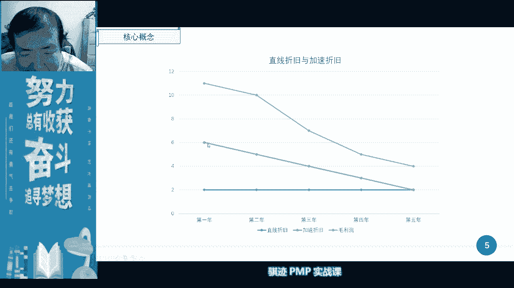

我觉得这个线有点小问题。

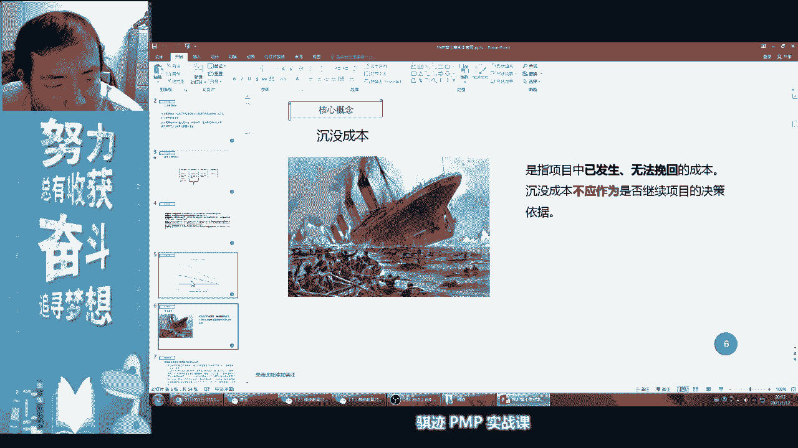

稍等我稍等改一下数据，嗯嗯嗯sorry啊嗯这是个零吗，等会我换，我换一下，更改图表类型啊，我跟大家不用不用，那么就普通的这些那就可以了啊，哎不得不更改啊，更改图表类型，折线图嗯，不是折线图。

普通折线图就可以了啊对啊，这个才是正常，sorry，我昨天调的时候有点调。

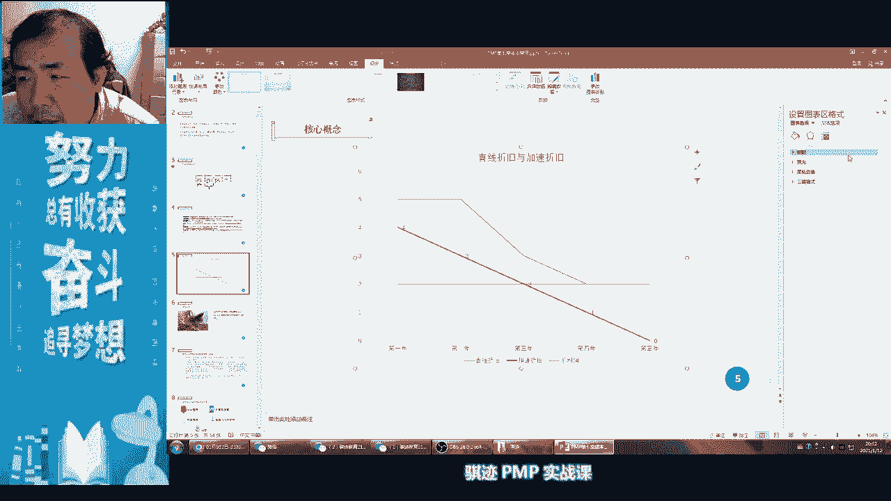

今天调了小问题啊，然后ok没有问题，我们继续看。

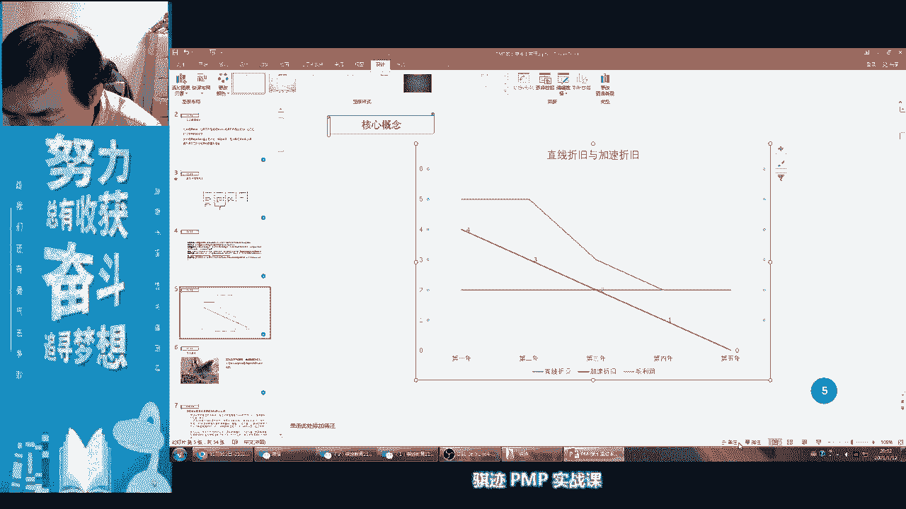

那我们看浦东的折旧当中，大家可以看到啊，我每年2万 2万 2万折5年，是不是一共啊，只有5年，这里也是2万，只有5年，是不是把所有的成本折完了，ok啊，我每年我第1年折4万，第2年3万，第2年2万。

第1年1万，第五第5年了，已经没有成本了，这是5年，那么你会看到个什么事情呢，所以一个项目当中在初期它产生的利润，账面利润就会少，账面利润少的话就会有什么结果啊，请在同学们，请在公屏上告诉我。

账面利润少就意味着什么东西，对纳税少非常好，一个项目当中，如果你的账面利润少，那么你就纳纳税少，但是折旧其实是一种什么一个项目当中，你已经投入了投资了，所以这个钱其实你是收不回来的。

大部分都是沉没成本对吧，所以折旧只是说在哪1年去财财务上去体现，是因为在利润，一般一个项目的利润体现是在项目完成之后的，最初期是利润是最高的，然后逐年逐年随着维护成本的增加而下降，那么在这个过程中。

会在利润早期比较高的地方呢，会把这个利润抵消掉很多，然后在晚期呢，让利润呢能够能够也能够尽量能够等到拉平，那么在整个曲线当中大家可以看到啊，这个面积，肯定你们会去算一下。

肯定远小于我们蓝色线和我们的灰色线，所产生的一个报价面积啊，会这样大家有序就可以算一下啊，所以直线折旧的总历年的总纳税额，历年总纳税额一般都会小一般东西。

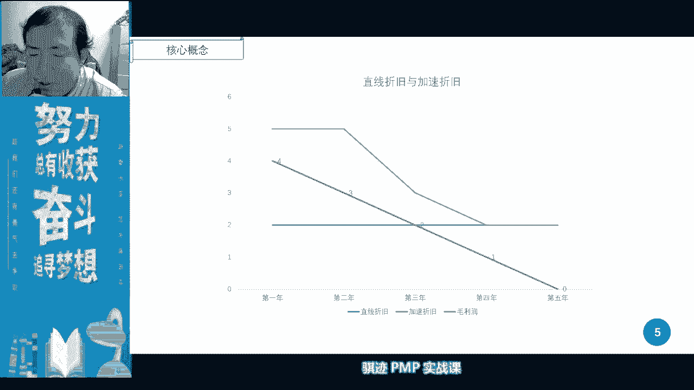

这就是为什么我们很多的项目当中，那么这个呢，接下来有个有个段子是我经常会讲的啊，有什么项目他们利润非常的体现在极端，体现在啊项目的早期啊，以及非常早的早期大部分利润极大问题。

提升项目早期项目之后的利润呢体现的非常少，但是我这个项目会使用直线折旧啊，有没有啊，当然会有，当你要需要故意用报表做出利润的时候，那么这个就很重要了啊，这是一个什么项目呢，那我给大家举个例子啊。

大家知道影视作品了啊，影视作品嗯将官方收益影响收益低吗，只是我问你啊，那么有啊，我们现在给他讲，有些同学说收益低啊，相关方没有影响，因为你要知道一个事情，就是说折旧并不影响你的现金对吧。

它只影响你什么时候去做账，你的现金收入还是一样的，但是你的账面利润不一样，你说相关方更观众到手到口袋里的cash，还是账面的perfect啊，他肯定是更宽重，什么道口袋里的啊，cash对吧，ok啊。

那么我们继续讲，影视作品，是不是一个绝大部分的利润，来源于我们早期的项目，早期啊，那么一个影视作品，大部分的利润产生于这个项目当中的，前完工之后的前三个月到前六个月，尤其是影视作品前面三个的前面六个月。

是不是说我们影片上映的，比如说或者电影上映，或者是电视台放映的最黄金的时间，你的一个电影能不能收回成本，就看初期的三个月，甚至就看最初的三个礼拜，对不对啊，除了少数性，少数电影我一开始没有口碑，放了少。

后面后面狂放也会有的，大部分电影呢都是什么，前面三个月到六个月决定能不能收回成本，但是呢有一家公司，他故意把这个影视作品，这个版权当然可以持续很久，故意把这个版权的这种朋友们呢，在一个很长的时间轴内呢。

用直用我们的直线折旧进行折旧，从而在早期项目的早期产生大量的人，这家公司就是已经退市，叫乐视，他的老板是谁啊，你们知道叫贾跃亭对吧，所以贾跃亭又有一个绰号叫做甲会计，甲会计，人家会计账做得好。

通过这样的方式，乐视公司当年就在账面上创造出了大量利润，但是把亏损呢留在了未来啊，留在了未来啊，这是一种很简单的，就能糊弄不懂会计的人的一种方式啊，非常呃突出的区别啊，所以你看大部分的视频网站。

优酷优酷土豆啊，腾讯视频啊，爱奇艺啊，他们的利润呢都是比较微薄的，因为他们大部分的成本摊销都是在他们的视频，影视ip的早期都摊销完成的啊，只有当年的乐视啊，要看上去业绩很好，都是什么。

他的摊销都是靠什么靠直线折旧完成啊，非常有意思好，这是折旧，大家不知道有概念没有，接下来一种成本呢叫做向价值工程，那么什么叫价值工程呢，就是说在我们设计一个项目的时候，身为一个项目产品的时候呢。

或者优化一个项目产品的时候呢，我们会对他整个项目的生命周期当中的成本啊，啊时间啊，利润啊，质量啊，进行一些创造性的方法啊，创造性的方法，这叫做价值工程，就是驾照工程用于设计新产品。

所以价值工程我们一般在一个项目，它的项目初期去定义产品的时候呢，去做设计啊，也可以用一下，也可以使用像价值分析，价值分析适用于老产品啊，好那么所以一个产品你要去怎么设计。

它其实是一个产品经理的一个一个职责啊，这里就不多展开了，所以大家知道价值工程是什么意思，指的是人，主要是人，大家知道对吧，很多人都是这样工作，一开始上手做的时候呢都是一个伸手，可能做的比较慢。

逐步逐步会快，那么所有的工人在逐步逐步，做得快的过程当中呢，我们的生产成本才会逐步逐步向量，所以很多项目当中，我们的项目成本是随着烧动生产率的提高，而什么成本啊逐步下降，达到或者是超过盈亏平衡点。

从而盈利的会有这样一个特征，比如说我们在这2年，我们为什么显示器越来越便宜了啊，i i t single dog，特别开心啊，这2年大屏幕显示器越来越爽了对吧，这是为什么有金东方啊。

京东方大量生产什么显示屏，但是京东方大年大当年为了大量生产显示屏，而他投入了大量资金，但是它的显示屏的流水线，可能是你年纪的好几年才能达到良品率，达到非常高的一个数值，然后呢才能进行盈利啊。

所以京东方前几年公司一直亏损，这2年开始盈利，所以它的盈利过程呢非常差，他的成熟非常慢，这是一个自然规律，自然规律是没有办法吗，没有办法完全摆脱了，你可以做的更好一点，从而呢让我们的成本呢尽快下降。

但是呢不可能完全避免这个规律啊，所以这要知道知道，所以作为一个项目经理，你在管理项目知道，不要以这个项目完全大家伙熟练，以最高效率进行运行的时候，它的成本去考虑，而是要要以什么。

要以这个项目大家一开始的时候都不熟练，这个成本去考虑，那个点啊，会有这样一个情况，这是一个项目成本，所以项目当中我们会发现算什么呢，就算是同样一个活动，同样一个活动在项目初期做和在项目末期做。

它的成本也可能是不一样的啊，这是一个概念，就结合到项目管理当当了，比如说啊，比如说你们要写一段代码，在你是一个开发程程序开发新手的时候，你的项目初期呢写一个代码，那写一个模块呢可能要两天时间。

然后呢你经过项目1年的锻炼，你在项目结束的时候写这样一个模块呢，可能什么只需要一个小时不到的时间，这就是一个熟练度的差别啊，所以一个项目经理应该考虑到，在整个项目适用性收集当中，不要把有些活动。

尤其是一些需要熟练度很高的一些活动，不要把开始的活动和结束的活动，两个成本视作一致，你要考虑到一个成本逐渐降低，熟练度逐渐提高这个过程。

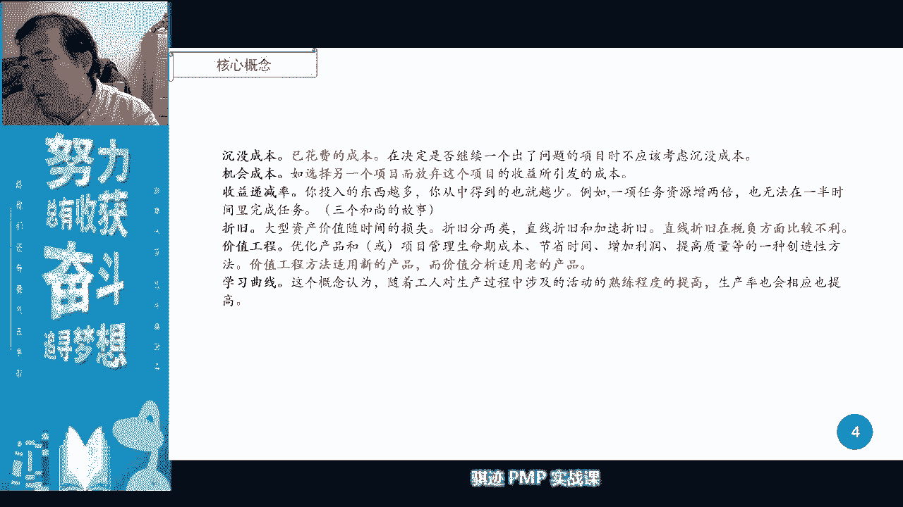

ok这个是不是很有启发，这是我们的途途中的一个势力啊，沉没成本，坦坦尼克号沉没吧。

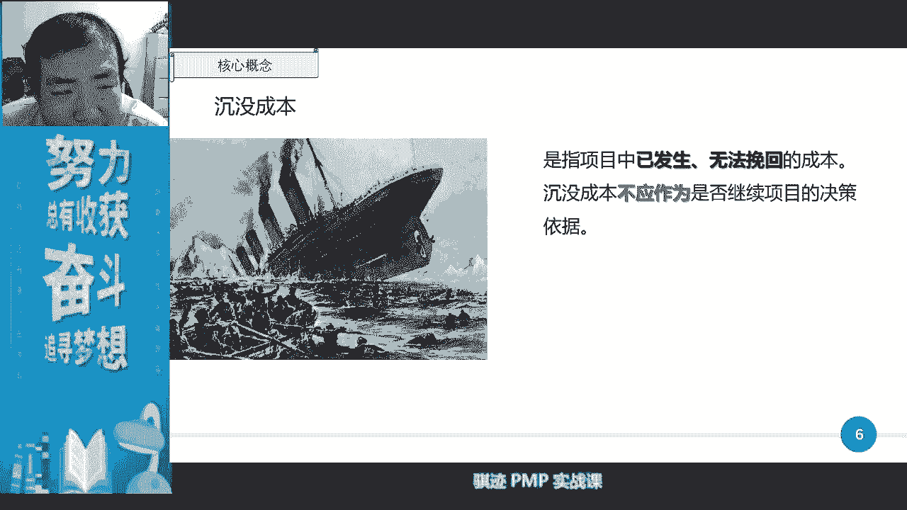

沉没成本，那么项目成本管理当中有什么新兴趋势呢，和发展实践的发展趋势和信息实践呢，是从我们后面会学到啊，我们米vs的课程会讲到evm，而扩展开这个叫e啊，earn schedule，就是正进度管理。

正德进度管理呢是e e v m，正值管理的一个延伸，他呢最主要解决一个什么问题啊，大家这个不用学pm，二pm的这个不考，但是呢他要知道这个概念大致意思就是什么，我们把每一件事情都看作是一个进度。

比如说这个活值两天，假设我们不是做出了在进度往里面，是不是做出进度的基准了，比如这个项目三个月做完啊，这是一个三个月的项目，那么我们会把每件活都标注为，相当于整个项目组进度的是吧，多少天一个价值。

比如做完这个，做完这个活动，我们相当于干了两天的活，做完这个活动呢相当于干了一天的活，当我把所有的活累积起来，等于整个项目的啊总进度的时候，有可能在没有意外的情况下，我们整个项目就结束了，是这样。

那么这个事情解决什么事情呢，解决了一个项目经理汇报工作，和进行绩效测量的事情，因为领导在实际工作当中最喜欢问你一个问题，项目现在进度如何，那么进度是不是用时间来表示啊，啊你会跟领导说什么。

我们现在项目进度偏差值是多少，比如说我们知道项目进度现在偏差值是5万，那么领导问你什么叫5万，就5万工作量，那么领导他又不知道你的项目，5万工作量代表什么对吧，你或者跟我们领导。

我们项目现在目前进度偏差是十个工作日啊，听着啊，落后进度十天，他会让你做什么，来来来，小伙子加个班啊，连假十天班，把工作进度赶上去，对吧啊，加班费呢没有呢，我请你吃泡面对吧。

ok是不是让我们有些同学的悲惨生活，就是这样的，对吧好，这是我们项目当中我们的正直正进度管理啊，他解决这样的问题，项目经理可以用一个大家很容易明白的时间，这个方式来去跟你的。

但是呢他在估算很多工作的时间的时候呢，没有正职方便，所以呢这个理论呢和这个理论体系和方法，体系呢，e s和我们的e v m呢各有它的好处用处啊，各有好处用处，e d m更适合用来控制成本。

e更适合用来什么控制进度啊，就是这样一个体系，好我们继续看真讲啊，在项目成本当中呢，我们会考虑预算和估算啊，我们考虑政治管理和考虑敏捷方法使用，会考虑知识管理。

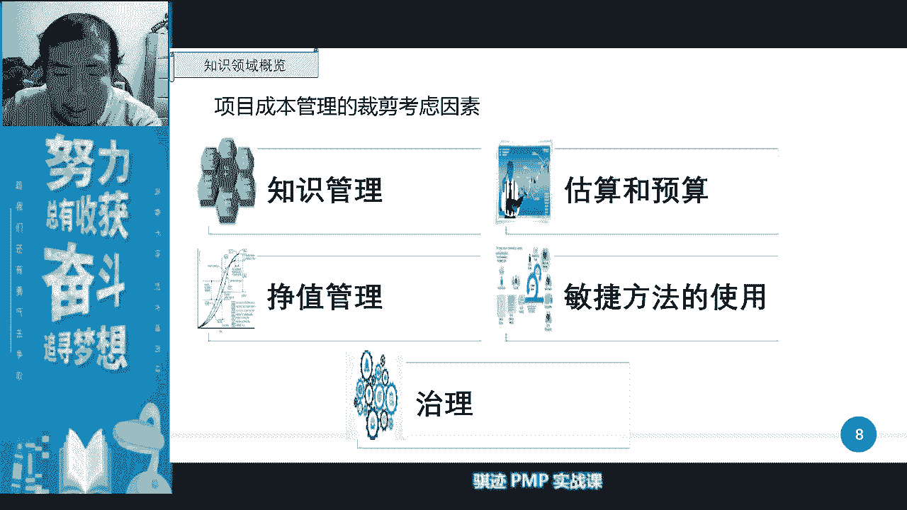

可以考虑治理啊，考虑这些因素，那么在项目的成本管理当中，我们会很简单的就执行四个过程组就可以了啊，一个叫做规划成本管理，一个叫做估算成本，一个叫制定预算，最后叫控制成本，没有执行过程。

为什么项目的成本是随着项目的其他子过程，执行而发生的，他自己不会执行的钱，不会平白无故的花出去对吧，他肯定要做事情花出去啊，所以它是伴随着别人划出去，所以他没有执行过程组啊。

这要注意好，我们现在先看第一个啊，这是我们知识领域的总结啊，这个当让大家看一下啊，一开始就要看一下就行。

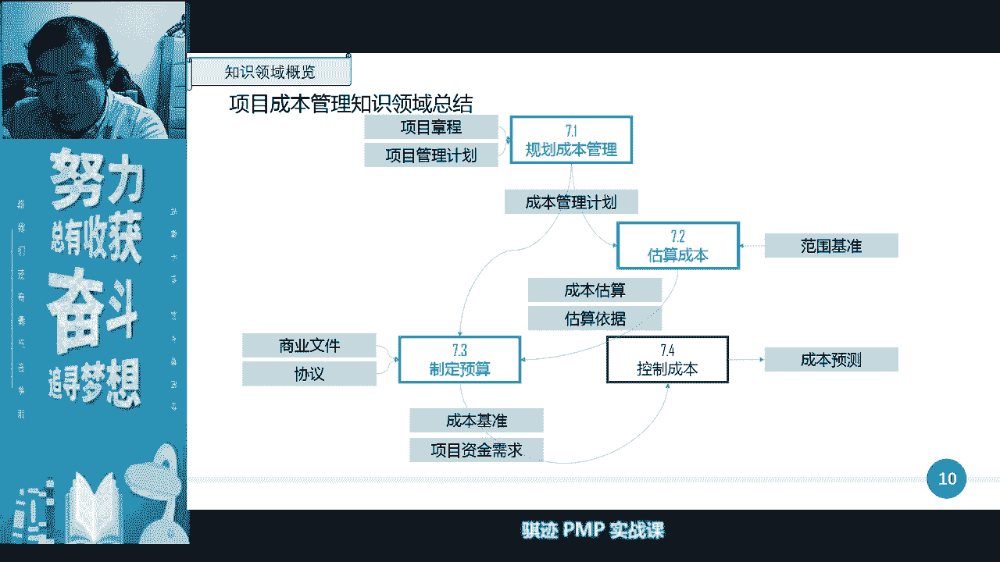

那么现在肯定规划成本啊，规划成本和其他的规划过程组啊，就是其他一个呃做规矩的作用啊，ok你们可以活跃一下，我们把做规矩这三个字打在公屏上，老师再喝口水，今天有点口渴，啊做规矩别样。

但是不是所有的规划过程组都做规矩啊，后面会讲到不仅仅做规矩，规划过程组啊，走过去啊，对不是所有的规划工作都会做规矩的啊，会有有一些规划过程组呢是不仅仅做规矩的啊。

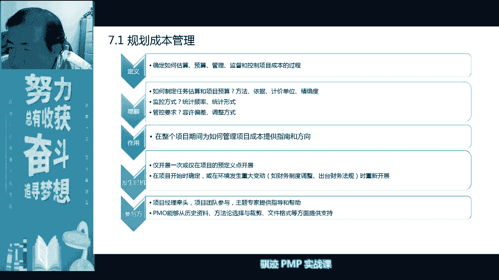

好会啊，记住了吧，ok啊，那么第一个做规矩做了哪些规矩呢。

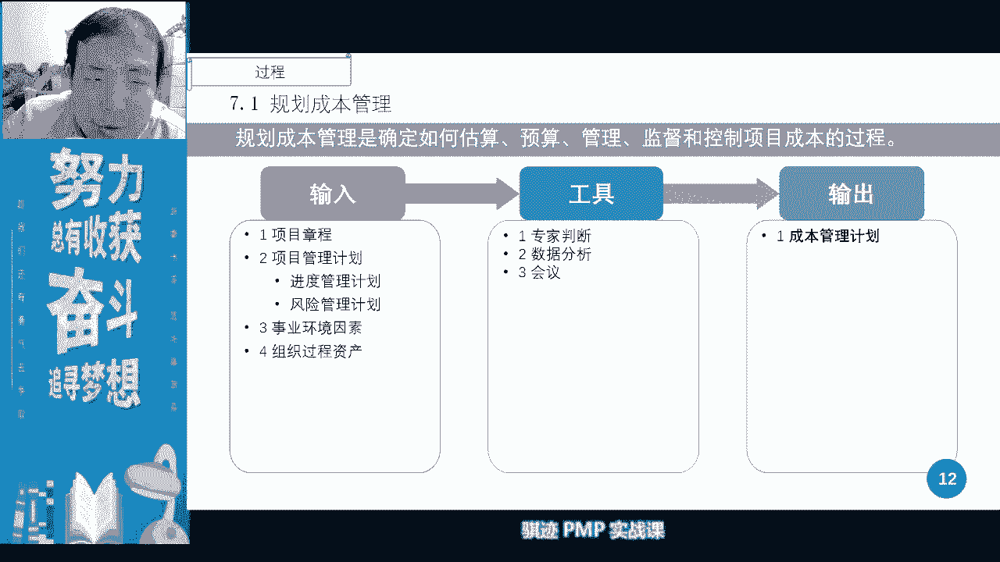

我们可以看到啊，他制定了一个成本管理计划，他首先制定了精度啊，我们的计量单位精准度就是说一般的项目，普通的项目，很多项目我们的计量单位是什么，是圆对吧是原，然后就像我们前面讲的，我们的进度管理计划当中。

我们的计量时间呢一般为天对吧，比较大的项目呢，它的计量单位就是万元啊，比如说像老师以前管项目，我我的计量单位是什么呢，我网购的项目计量单位是10万元啊，小于10万元的就基本上这就属于小钱，忽略不计。

忽略不计，或者是啊可以通过很简单的手段啊去执行掉的，不用不用再做很复杂的流程啊，就这样，10万奶茶，有人说是奶茶，你们过分了啊，一点点吗，不是不知道什么一点点，我我来了好我们认真点啊。

不要老是想着奶茶的事情，ok啊，我现在喝矿泉水就行了，过分了啊啊好，所以计量单位是决定了你其实体现出你个项，你一个项目当中，你的管理精准度和你的项目规模，如果我们要做一个上亿的项目。

你觉得有项目经理有没有必要管什么，几分几秒啊啊，几十块几百块甚至几千块，几万块啊，都不用管那么多啊，如果你做上亿的项目啊，就不用管那么多，所以项目的计量单位是取决于跟项目项目的啊。

当中的就是规模金额规模相匹配的啊相匹配，但是他有组织链接，它会根据组织的链接，组织的相对的流程呢进行控制，第二个呢是绩效测量规则，怎么样测量我们的项目的绩效控制啊，一些规则当触发某些规则的时候。

怎么样去进行调整，第三个是定义w b s用于测量进行控制账户啊，我们讲控制账户当中，我在成本管理当中，在进度管理当中呢啊和在范围管理当中，我怎么知道你的绩效对吧，在成本管理当中，进行赋值。

然后我们要认领，就像就像就像什么呃，美国西部世界啊，这个人悬赏500，这个人悬赏1000啊，1000多，我干了啊，500了，我干了啊，除非这样啊，放在不同的控制账户下。

那么每个公知账户是不是就有个工作总价值，通过看他们已完成的工作价值和工艺，应该计划完成的工作价值，就会知道他们的工作绩效的对吧，好那么接下来呢是你用的e v m技术对吧，e v m当中我们讲政治管理。

那么政治管理其实有各种技术，比如使用加权里程碑法，那么什么叫生理就没法呢，我怎么给你计算你的绩效怎么算，你这个工作完成多少工作量，我们是按照里程碑算的，因为很多工作有时候你没办法说，比如说你做了1/4。

那么怎么算呢，我只是说算是按照你完成一个里程碑多少，然后呢我给你寄多少的工作绩效啊，这个叫加权里程碑法，加权里程方法适合于什么，这些这个项目当中可以设置很多个里程碑，通过里程碑去计算。

但是如果这个项目当中里程碑非常少，这个方数量就不精确啊，因为要工作很长一段时间才会有绩效啊，这个时候呢绩效评估呢就会失效，第二呢就固固定公式法，比如说我们工作一天，我们绩绩效呢是工作是一天一天工资价值。

比如说是啊500块，那么我们就算算一天是500块，一天是1000块对吧，是这样，还要完成百分比，比如一个工作我们做了1/3，那么我们继如果这个工作价值是5000块，那么我们记1/3就是多少。

1660 60，1666块钱，6666666对吧啊，诸如此类，所以evm呢也有很多种技绩效的方法，但是它的计算方法呢只有一套，我后面我们讲啊，然后工成本的管理计划当中还有其他细节。

比如说对战略投资方式说明，比如说我们钱从哪里来，怎么花对吧，钱是怎么挣，怎么花的啊，怎么处理汇率波动啊，最近大家知道一件事情啊，美元汇率跌的很厉害对吧，比如说我们这个项目是给美国人做的对吧。

美国人付我们美金，但是美金现在贬值很厉害，怎么办啊，我们和美国人说，美金如果贬值超过了5%，我们要求额外加钱对吧，否则我们项目叫亏本对吧，这个叫这个呢，我们后面还会讲这个在采购管理当中也有。

这个叫做什么，这个叫做总价加经济调整啊，你看到吧，成本管理和我们的采购管理也是有联系的，看到吧啊好记录项目成本的程序啊，哪些东西算成本，哪些东西不算成本啊，比如项目当中。

比如说啊我们程序员小张吃了一碗泡面，他算不算成本啊，啊可以啊，就不算成本，他算消耗品对吧，一次性勾掉项目经理吃了吃了一份非礼啊，菲力牛排m9 的牛排，这算成本算成本，因为太贵了，对吧啊。

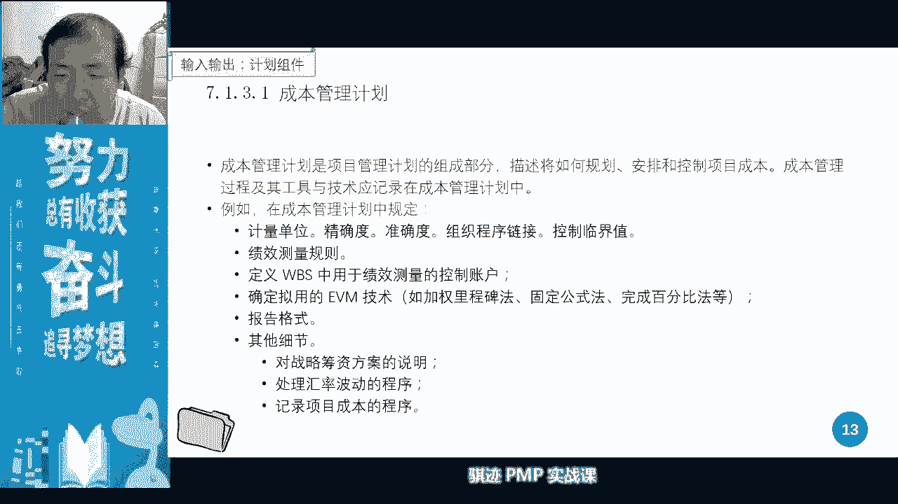

好这是成本管理，那么这是成本管理的一个例子啊，这个例子呢我觉得就没有什么好讲啊，我觉得意义不大，意义不大，那么你们稍微看一下，它只是一个我们的规矩。

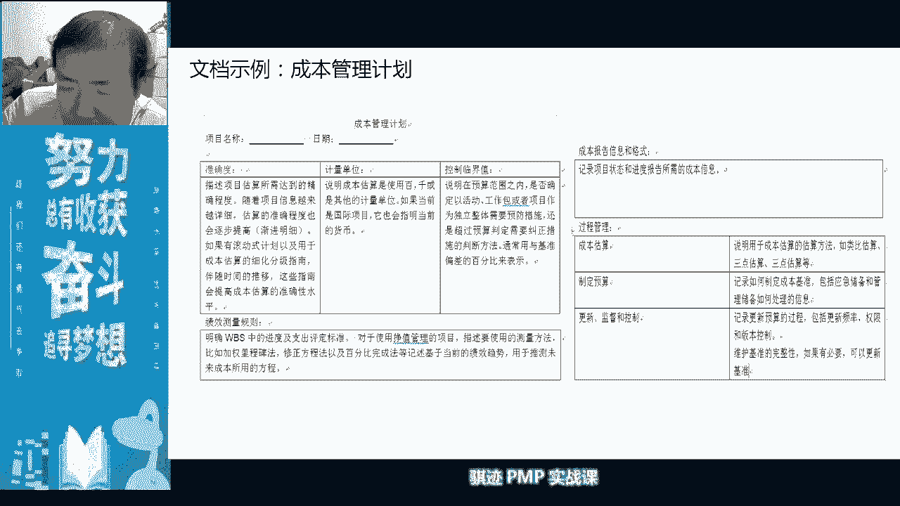

这个规矩是怎么做的啊，大家可以略微了解一下就行了解，那么第二步呢就是估算成本，注意这时候还没有预算，这是估计计算成本，所以这个当中就引出一个概念，项目当中有多少成本的算啊，我给大家讲一下啊。

你们的实际项目工作当中会有什么算啊，第一个叫做什么概算，概念上先抽象算一下啊，然后呢就是就框算画一个框框算一下，接下来呢叫做什么叫做估算，估计算一下对吧，接下来呢叫做预算啊，制定的有预算算一下啊。

预算来就比较熟悉，第二叫做叫做叫执行预算，执行当中会产生的预算，然后呢最后一个呢叫什么决算啊，最后在最后结束的时候呢，会有一个结算，对吧啊，结算，所以算这个东西呢可以有很多种算法啊。

它应用在项目的不同的阶段当中会使用到啊，所谓的估算就是通过估计得出一个初步的成本，叫估算，精细到一定程度，它就会通过组织审批变成了预算，所以估算是预算的一个前提啊，只有通过估算才能最后得出一个预算。

那么有些项目很有意思，它的预算是什么啊，我以前就遇到过项目，下面人也估不出来，给你200万去做啊，就这样，然后做一做，发现这个项目要1000万，然后你用200万去做，然后你这个就有点难度。

有点高了对吧好。

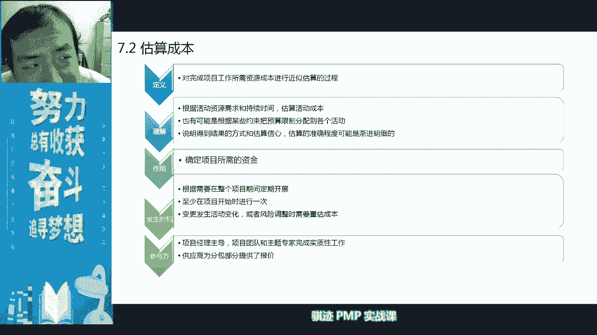

这叫成本估算估算估算成本，那成本估算当中呢，我们会随着像精确度会随着项目的进展来提高，一开始叫粗量级估算，i m叫做-25%到正75%，确定性的估算量是-5%到10%，那我问你们同学们。

你们公屏上告诉我，为什么粗量级估算它的正75%，挣这么多啊，-25%呢幅这么小，请告诉我这是为什么，为什么，钱多好干活，ok没错啊，成本都要靠大的考虑，都给自己预算点钱，ok非常好啊。

这个就牵扯了一个实际工作经验了啊，啊提早获得资金啊，跟提早获得资金倒没什么关系啊，这个是牵扯了一个实际工作经验，你们如果报过预算，报过预算项目就知道，各个部门帮我发起人去砍的对吧。

如果你一开始不报的多一点，然后你会被人砍的很可怜，但是项目当中总会遇到各种各样的意外情况，那么对有些人说作为风险储备非常好啊，所以曹自尊同学，你这个一看就是有经验的对吧啊，有所谓啊，学校里要交学杂费。

交500，交500 500块钱，你给家里报报个1000对吧，然后可以卡油对吧啊，所以很多时候啊我们粗量级估算爆的多一点，是因为什么项目可能会随着进展呢，会产生通货膨胀啊。

然后呢会产生一些意想不到的一些因素，这些因素都要去花钱克服，所以我们要多估一点啊，所以偏向于正多啊，哈那么老外为什么会偏这么多呢，加上5%，因为老外做项目经常是做到您那啊不能想象啊。

比如说比如说啊我们举个例子，然后德国柏林啊，你都说德国人严谨啊，德国柏林造一个新机场好，这个机场造了20年，然后给中国人造的话，中国人觉得100座机场也造起来，然后这个机场。

最后德国柏林的新机场造完之后呢，他们算了一算，最后的成本的花销呢是原来的预算了十倍啊，所以正75%已经算很客气，对吧，规避风险啊，注意所以注意啊，所以老外他们经常执行预算的时候执行，知道吗。

多个一倍两倍，15倍，十倍都是有可能的啊，都是有可能的，所以你们要记住这一点啊，记住这一点，ok所以他们的故障了，都喜欢一开始多攻75%很正常，当然随着项目的进展进行呢，可能最后他的估算也就到-5%的。

就10%啊，这是比较精确的，现在中国人的很多项目当中，他们项目呢也会有允许你的预算有一定波动，但是在波动的，一般的企业都在正-5%之间啊，一般正常，这是正常的管理嗯，嗯征服5%啊，5%。

那么在一个项目中，我们可以多种的估算方式，在不同阶段使用，当我们讲讲啊，就和项目的进度的当中的估算一样，一开始的呢可以是什么项目的，一开始可以是项目可以使用我们来类比，之后呢，还是用参数加上三角对吧。

最后呢我们越来越多的使用，老鼠洞印度造大吧。

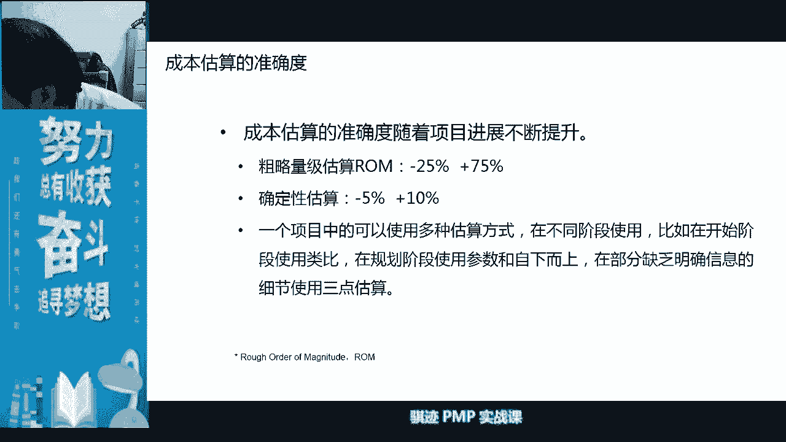

哈哈好，那么估算成本当中我们也会看到，大家看到啊，又来了使用的三点估算对吧，我们的储备分析和质量成本啊，看啊这些当中就会输出我们的估算成本啊。

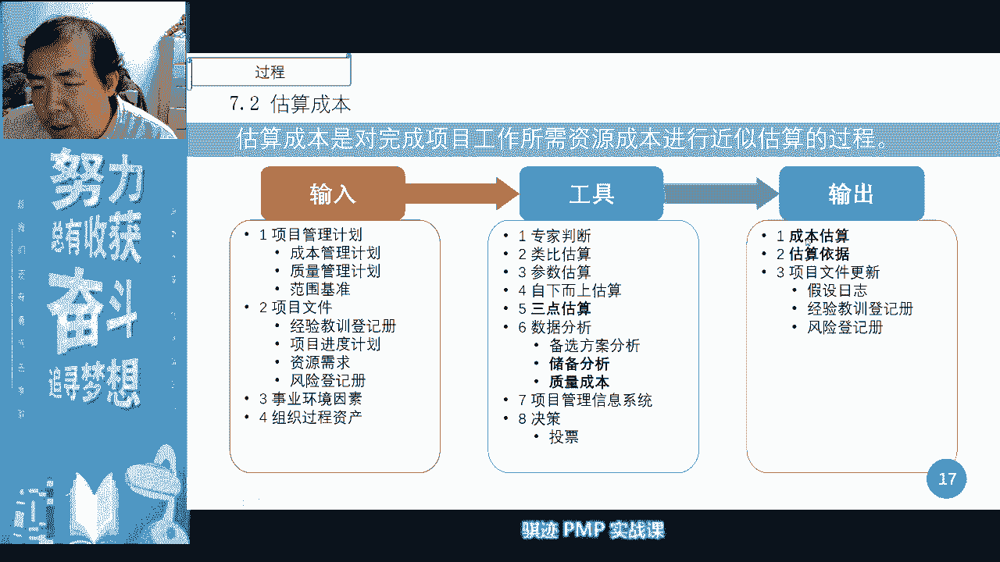

成本估算和估算依据我们一个月看啊，三点估算当中的成本估算方式，是不是和我们的呃，我们的进度当中的三点故障是不是一模一样，好嘞，ok算法一模一样，只不过把那个原来的我们的进度的那个t time呢。

变成了c cost，其他是一模一样啊，大家可以看一下pp的书，上面也是一样一模一样啊，除了字符不一样，其他的算法一模一样，所以你们不用特别记啊，只要记住默认用贝塔特殊提出就用三角啊，就可以。

那么我们估算成本当中，当然更要估算应对风险，很多时候要花钱，所以我们要应对于已知未知风险呢，要使用应急储备，应对于未知未知风险呢，要管理储备，同时我们这里管理储备是不是留了一个，为什么要用已啊。

已知应应急储备呢是要使用的是呃算绩效，管理储备不算绩效，这个后面留有伏笔啊，除了我们说应急储备是经过识别和针对的，有劳动成果，所以他应该被记记效以外，还有另外一个原因，后面会讲我们讲成本当中。

我们的数据分析量还有质量也会产生成本，我们前面讲的是风险会产生成本对吧，这是风险成本，储备成本是风险成本，质量成本呢，就是一个什么一致性成本和非执行成本啊，我们在质量后面会讲质量当中。

什么叫一致性成本呢，为了保证质量而花费的一部分成本，和为了测定质量和花费就不成本，什么叫不一致性成本啊，就是我们产品产生的次品补救或者赔偿，所产生的成本叫做废质性成本。

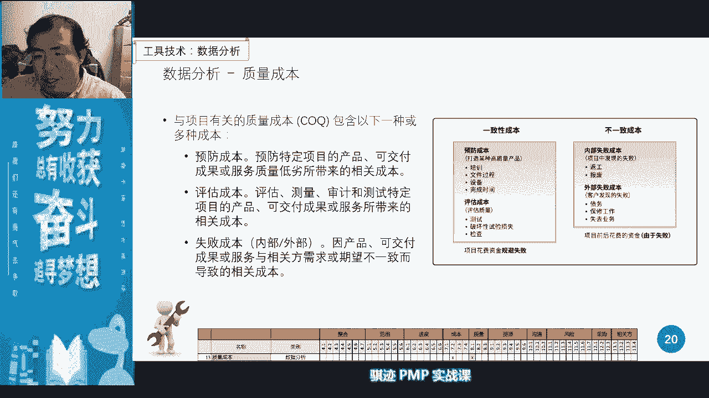

不一致性成本啊，我们叫废一致性成本，那么成本估算当中呢，我们会对一个项目完成的工作呢，可能需要的成本呢进行估算，同时要识别风险和我们的相对应的，计划位的工作呢，管理的储备来进行量化计算啊。

所以储备可能有时候建立的时候，是不是一级储备，而是在活动这个层次呢，针对于细节，我们可以留有储备，在更高一级的层次呢，整个项目当中呢，层级呢我们会留有整个项目层级的应急储备，当然活动储备不是必须的啊。

但是整个项目层级必须留有一定的应急储备，然后呢在应急储备之外呢，还留有一层额外的应对于未知风险呢，叫做管理储备啊，储备是咱这样结构，那么我们制定出储备之后呢。

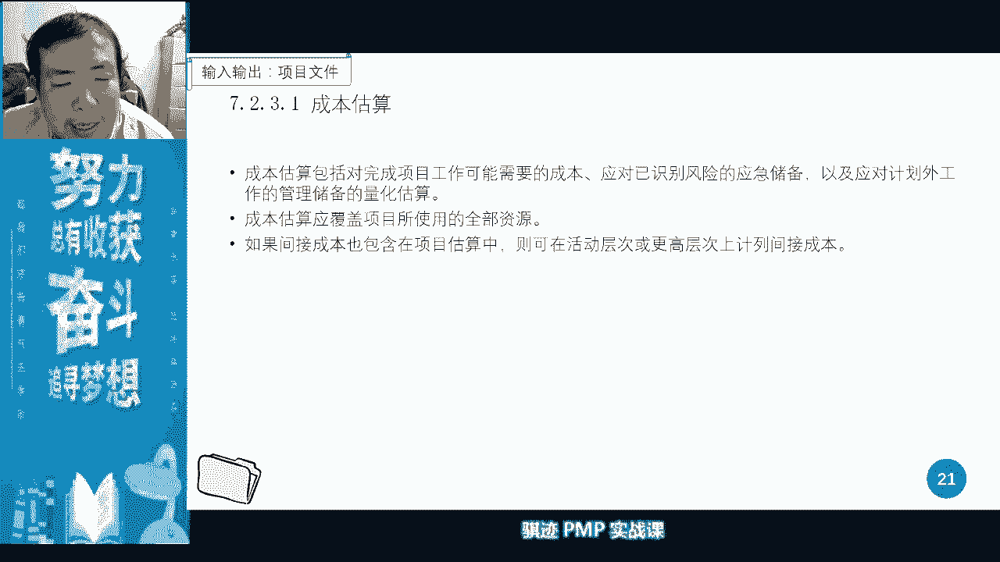

成本当中，我们制定出我们的成本基准账号之后呢，我们就出了一个什么叫做估算依据，成本的估算依据，你是为什么算最有成本的啊，不是来了，比如说你是个甲方，那你问你你乙方怎么算成本呢。

就是说乙方说我们这个项目要花人工，要花什么，要花100个人工，一个人工呢一天的工资呢是500块钱，100个人工呢就是5万块钱啊，100个公式那就是5万块钱，所以呢是再加上一些杂费和管理成本。

所以收你7万块钱对吧，这就是估算一句，所以估算依据在一个项目当中是用于给谁看呢，主要是用于给外部相关方，以我们的发起人，和我们的客户为主的外部相关方看的啊，所以这个过程中还会有个东西叫，估算的知性水平。

就是说绝大不就是说95%，或者85%或者90%可能性，最后的结果呢就是在我们的估算区间之内的，叫置信区间，运行区间。

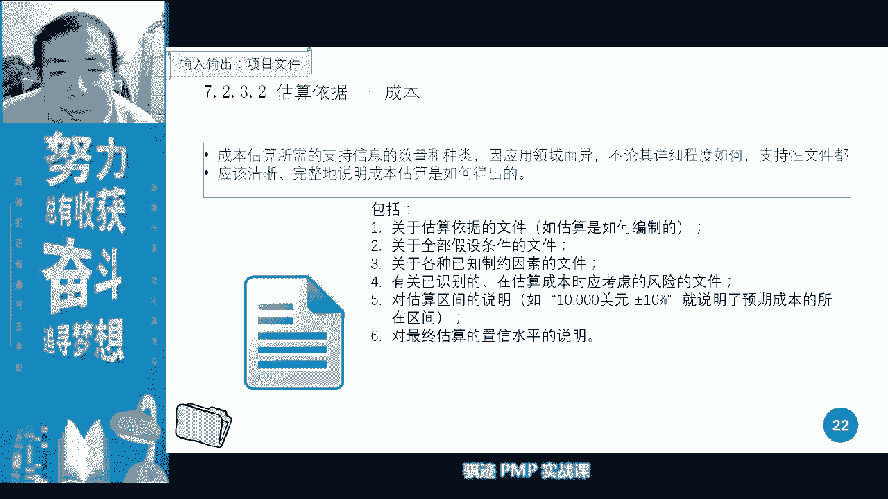

好这是一个活动成本估算的例子啊，我们按照w bs编号，这个资源呢会直接产生多少成本，间接使用到的成本，然后我们会最后把这个东西累加，就得出了一个什么啊，我们的估算额和估算方法。

然后呢我们再增加一些制约条件，假设条件制约因素对吧，假设工人周末加班费是多少对吧，假设工人春节不回家对吧，然后春节付多少工资对吧，是这样，啊今年今年我们估计很多人可能都会不了春节，对吧。

我们鼓励就地过春节啊，减少春运，然后避免什么东西啊。

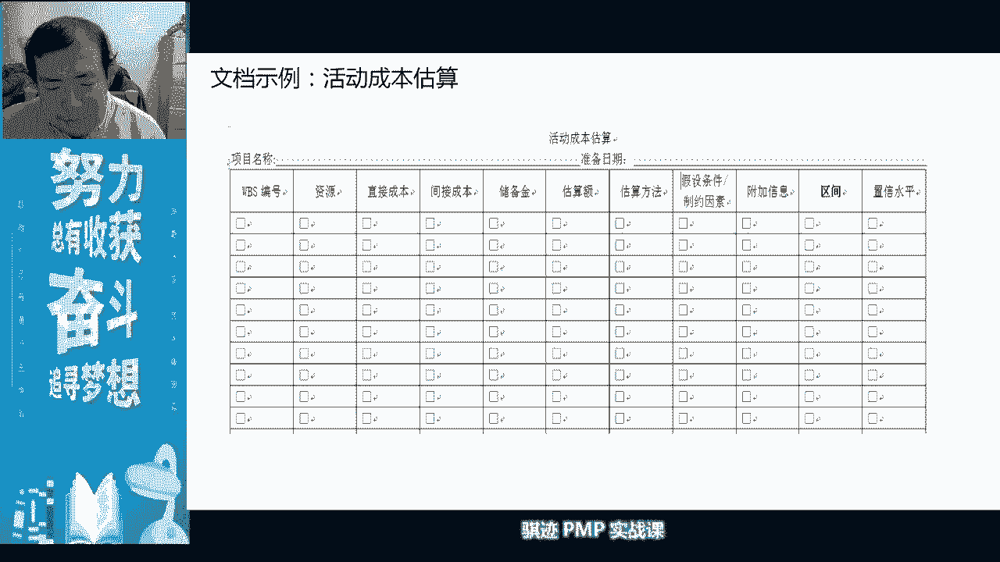

避免啊我们的新冠疫情传播啊，顺便说一句啊，这是对的啊，所以从我做起对吧。

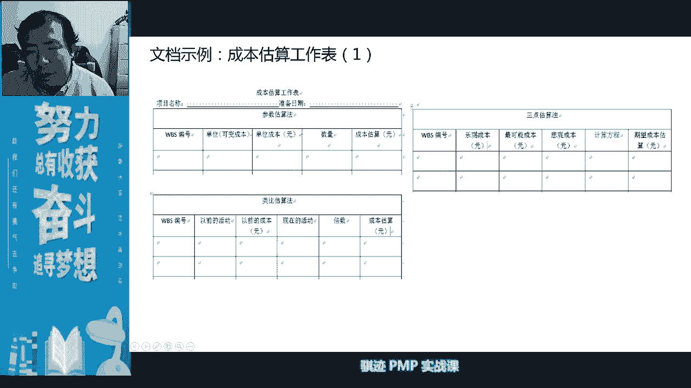

虽然我是不用回家过年对吧，我的家就在我我上班和住的地方啊，但是嗯我我也说，我们会可能啊尽量减少出门对吧，增增加安全性啊，为整个社会做出贡献，回想起我们去年对吧，也是这么过来的啊。

今年我们再接再厉努力吧啊可以啊。

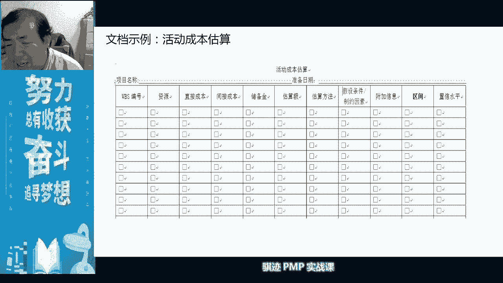

稍微插一句好，那么我们在估算成本估算表呢，我一个成本估算表，成本估算表，就根据w bs呢做出了各种各样的成本估算啊，把这些东西加起来，用类比估算和参数法估算三点估算啊，整整整之类啊。

这个估算的更多是什么，这个估算成本呢是什么，用参数对吧，单位成本对吧，这乘以什么多少单位得出成本啊，三点估算量是最乐观最悲观，最有可能对吧，类比估算是以前活动是怎么样的，现在活动怎么样了。

比以前活动和现在活动倍数是两倍，那么乘以二吧，跟哪里人那么好，上海本地人啊，啊上海上海人和上海本地人有区别啊。

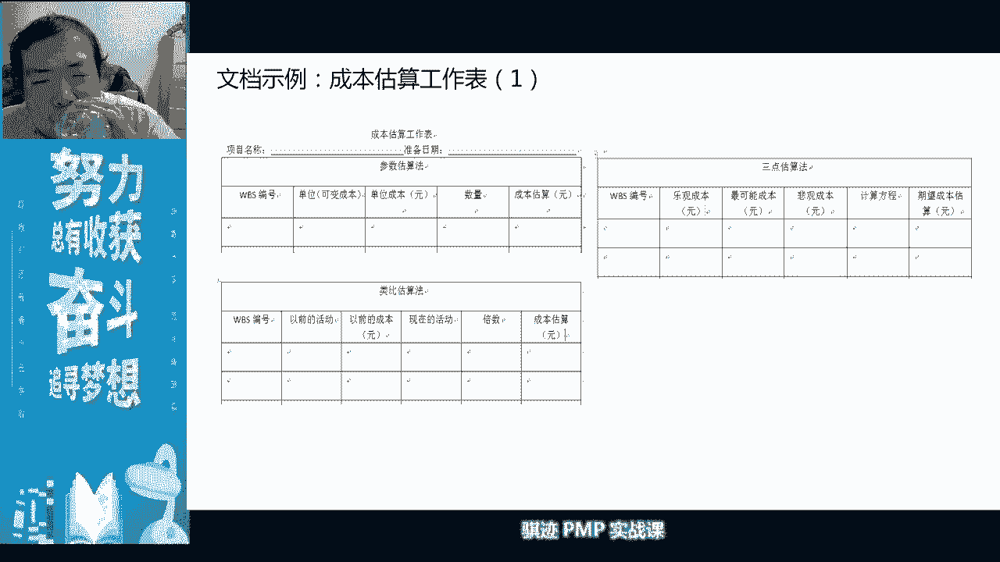

啊那就不多讲了好吧，咱们继续讲好，我估算表的一个估算依据啊，那么这个时候呢估算的比较精确啊，这个呢we vs估算的比较精确，它里面会有什么人工工时总共识对吧，材料用品啊之类的。

那么这个物和估算为什么这么精确呢，是因为这个w bs当中，材料用品我们可以从活动当中呢啊，材料用品设备对吧，我们可以从活动当中呢估出人工时间，人工比率，总工人工以及差旅费用和其他费用。

所以成本总是什么啊，我们后面讲资源管理会讲到成本，大头总是和什么和，一个是材料费用，一个是人工费用一起组成的，人工费用一起组成的啊，所以材料费用最主要来源是什么东西啊，然后呢活动最主要的成本是吧。

是来自于人，来自于人，通过活动去估算什么人工成本，一级级往上汇算，最后就得出了一个总成本，这也凡尔赛啊，我回家回家不用回家，只是说那个嘛对吧，这个不凡尔赛不凡尔赛，卡凡尔赛怎么说，哎我应该说什么啊。

你们不懂，如果我说凡尔赛，应该是说啊，同学们啊，我回家不能过年了啊，我的家乡我的家乡在纽约的。

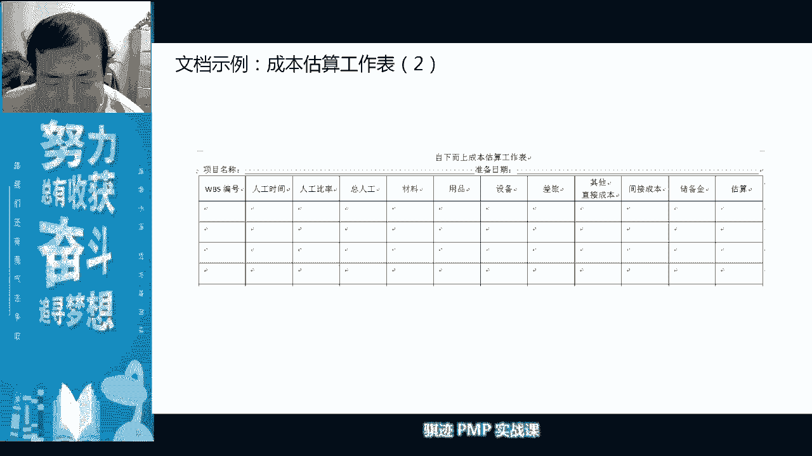

我的家，我的家，我的家乡在伦敦。