# PMP认证考试课程最新完整免费课程零基础一次通过项目管理PMP考试 - P23：PMBOK第六版 第八章项目质量管理-24 - 骐迹PMP - BV1Sb4y1f7Yt

有质量文化之后就能让大家基于这个文化，然后去进行质量的自呃，自发的去进行质量的一些改进和提高，不仅仅着眼于过程，而且着眼于提高啊，好是这样一个这个概念啊。

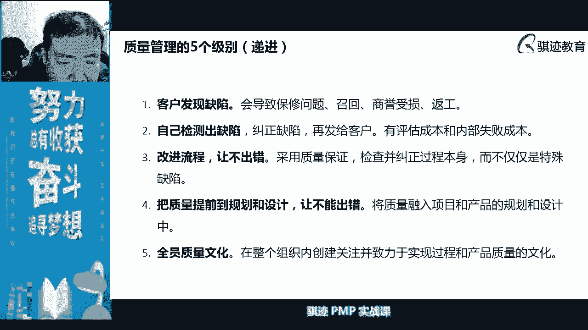

所以我们知道这五个递进几位卷啊，不用特别记住，不用特别记好，那么质量我们讲质量当中我们常见的概念啊，所以我们讲了半天，其实你看讲了一个小时还没有进入子过程对吧，所以有些同学问老师为什么只有三个字。

过程上两节课，ok，所以质量当中其实有很多东西可以帮助你理解，是很有意思的啊，好那么我们后面看一下概念，就是说很多时候呢，质量呢是随着我们的不断人员和机械的磨合啊，也有可能是机械的机械开始大家知道啊。

比如说很多东西需要磨合，一开始上来可能先运转的可能是啊，能运转的不是最状态，最好就像车子相当相磨合对吧，有车车子有个磨合期对吧，然后呢随着重复工作不断开展的，人员技术呢就会不断提高。

那么体现为什么工作效率的上升对吧，然后呢工作时间的下降，工作时间内下降，就比如说一开始刚开始看篇博客呢，需要十个小时看完啊，那么之后呢我们可能再看一遍呢，只要九个小时，再开篇就要八个小时对吧。

所以有件事情干得越多越熟练，它的平均的时长那就会越短，同时它的成功率就会越高啊，在有些事情上学有大部分的项目上，呃比如说你比如说有些东西，比如说你造芯片啊，比如说芯片芯片的那些流水线啊。

那些流水线的全息曲线，达到良品率90%上，所用的时间是按年计的，按年纪的，他们是按照每年每年去计划，这个产品的良品率能达到多少啊，是非常非常漫长，因为它中间涉及到的变量元素太多了。

所以如果你的企业的质量管理的质量文化越好，这个我们所表示的累计时间和累计产量，这个曲线越陡就会越来越陡，然后迅速的就接到接近于最佳状态啊。

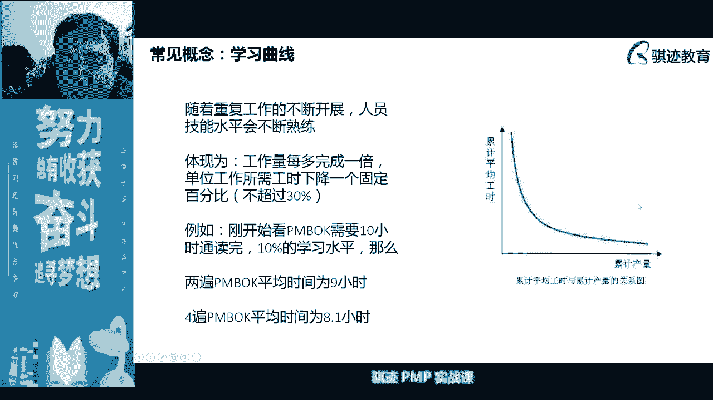

迅速就接近这样的，那么讲质量观点有什么新兴趋势呢，就是说我们要达成用户的期望啊，就要达成用户期望，然后呢p dc已经成为我们的基本框架了，然后呢我们要注重长期合作和注重改善绩效，然后项目经理承担责任啊。

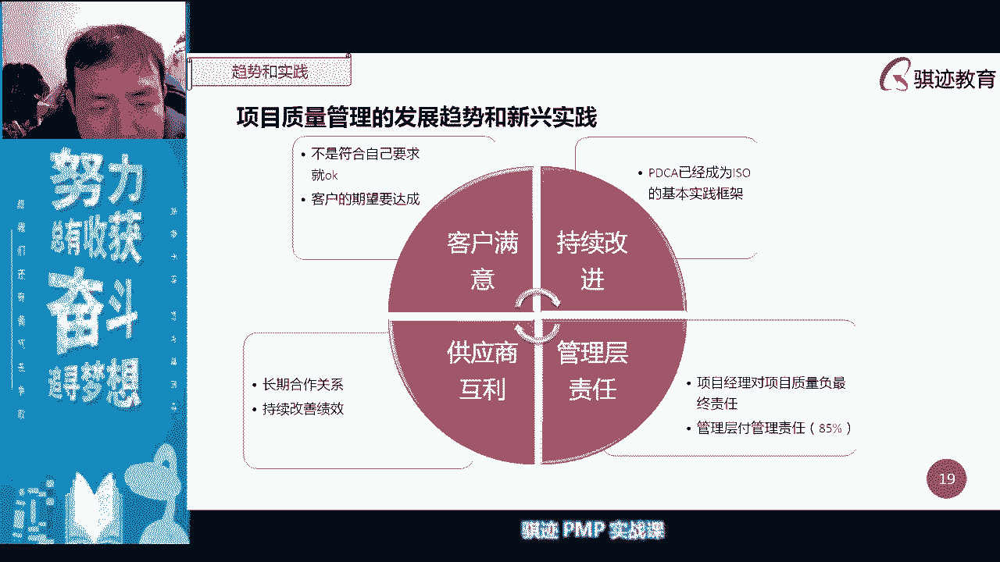

这个大家看一下，好质量当中呢，我们还会为考虑到什么，有些时候质量的诉求来源很复杂，ok这就开始慢慢讲到前面一个讲，为什么有时候算途经不算透镜啊，会有一个讲啊，你会呃注意听一下，就这么。

有时候质量并不一定是客户说了算，也不一定是项目经理说了算诶，有人说项目经理不是决定项目的质量吗，和等级吗，啊注意还有一个东西叫做法律法规和政策，国家的政策，企业的政策和法律法规。

同样也会那么涉及到一个什么东西啊，叫做质量啊，涉及到一个质量啊。

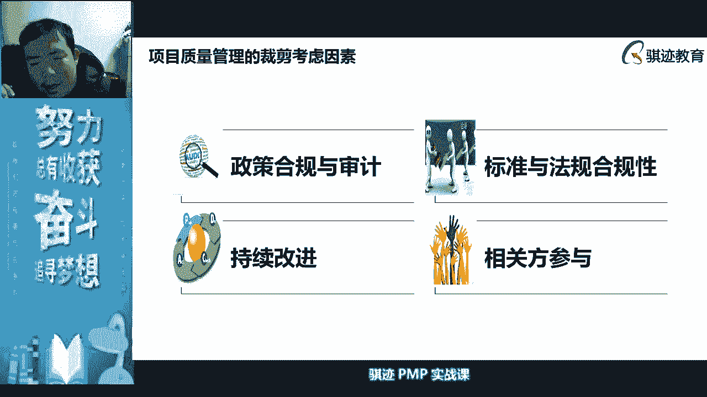

这个东西这个当中呢啊这样吧，这个当中呢。

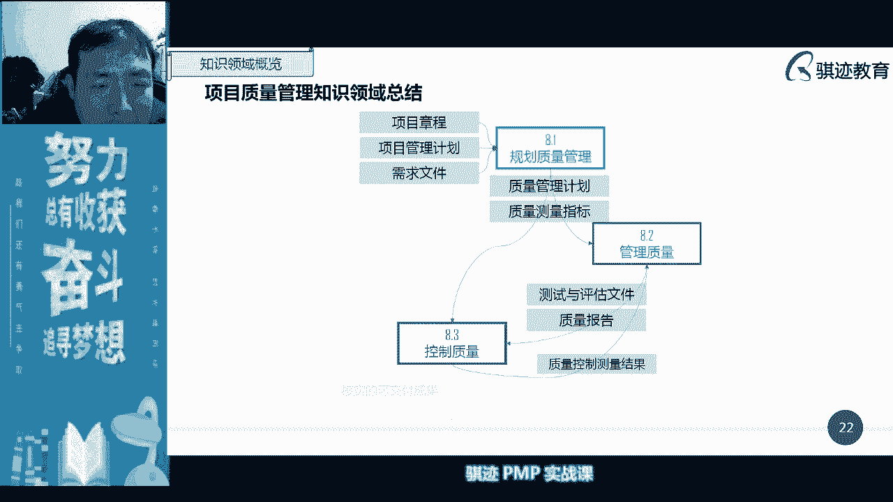

我给大家这个当中我们在讲子过程之前，我给大家讲一个真实的质量案例啊。

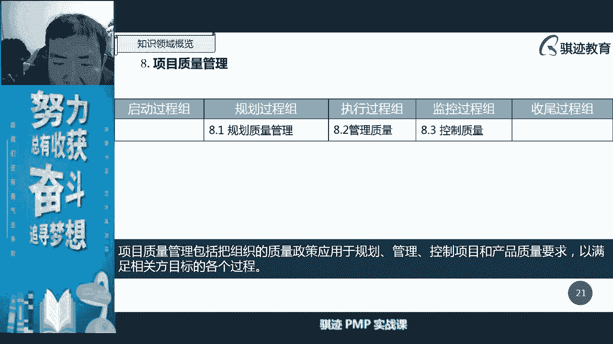

有可能有些同学知道真实的质量案例，就是讲质量这个东西确实是规划出来，但是他一定要遵守法律，那么到法律改变之后呢，质量就会改变了啊，那么这个故事是什么呢，就是说上个世纪七八十年的时候呢。

美国美国啊发生了很多起的交通事故啊，不是不一定是事业环境因素啊，你看对对对对，你看法律也是事业环境，对哎就是美国发生器可能去质量呃，交通交通事故，交通事故造成了很多人死亡，然后呢人们发现什么。

人们发现这些交通事故死亡的，死亡原因的很大一个原因是什么啊，车辆汽车的车辆啊存在缺陷存在缺陷，车子的保险杠以及一些安全作用，传单缺陷导致人本来可以不死啊，死掉了，然后呢人们就吧。

就是说比如说美国最大两家汽车公司嘛，一个通用，一个福特，就把这两家给告上去啊，刚刚就赔了啊，上个世纪78年的年代的，七八十年的时候，人命还比较不值钱的啊，两家公司呢就为这些事故呢就各赔了几百万。

几百万啊，就反正几百万差不多就差不多这个金额就赔吧，好这个事情呢好像看似过去了啊，不知道有什么好事的，不知道美国人，美国这个社会就是好事的人挺多的啊，啊那些记者啊，那那那些人去挖掘一下。

发现了一个惊天大秘密，我开始像说出了什么秘密呢，就是他们发觉通用和福特，当年早年早已经发现了这些有质量的缺陷，但是他们就不改，诶，这个事情很奇怪，你为什么不改呢，后来再进一步挖掘发现了，为什么他们不改。

是通用和福特研究过了，就说他们发觉如果出现了事故，四个人就要赔几百万，但是如果去改变那些东西，他们付出代价可能要上亿，那么对你来说，你一个企业来说，你愿意付几百万，还愿意付上亿，作为一个企业来说。

你肯定把人命用金钱看嘛，我肯定宁可你死了，赔你钱啊，我就不敢，然后这个事情就促使了人，人类历史上第一次的叫做强制召回，然后美国的立法者觉得啊，你要去罚通用福特款，罚完以后，他们还会这么做。

你要从根本上去医疗，永逸地解决这种以降低质量标准，以牺牲人命为代价去降低总成本，这种方式是可行的，那么你要去遏制它，你不能说通过罚款啊什么去解决对吧，你也不可能说一条人命赔几百万，在当时的话。

一定要人民币几百万是不可不适合，这会引起方便其他方方面面的问题对吧，有些东西不是质量造成，然后让人家赔几百万也不适合，所以不适合这么几点，所以后来美国人就想出招什么强制召回。

如果发现你的车子当中存在有安全质量隐患的，直接被强制召回，召回了所有飞行车长承担，然后车厂发现什么，你召回之后，如果被它对不对它进行修复，如果在的话，企业会承担巨大的损失，这个损失已经比不修复这个呃。

比修复那个质量缺陷要来得高很多了，这个时候质量的成本我们讲叫不一致性，成本大幅从原来大幅度的小于一致性成本，变成了不一致性成本。

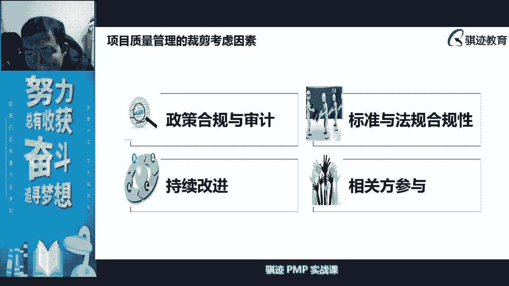

我们前面讲的不一致性大幅度的什么，高于了这个未知成本，大幅度的高于了一致性成本，因为它出现了什么，只要出现有任何瑕疵啊，质量问题，那么就要召回，用安全质量问题要召回，召回一次要付很多钱对吧。

然后召回修了出问题了，还要再召回这个成本，七两大汽车公司承受不了，最后他们决定什么修复这个问题，然后业绩觉得这个事情很好，然后从此之后质量当中质量当中，汽车的质量当中，召回成为了一种常态。

成为各个国家立法的一部分，所以现在很多这样汽车行业当中，为什么啊，有些车动不动啊召回来帮你免费换一个东西啊，你觉得挺好的对吧，这些都是当年用人命换来的，用人命换来的就是用的公司啊，这个公司是真实的。

你们可以网上去查，这里其实就涉及到质量成本和质量观念，ok啊好好。

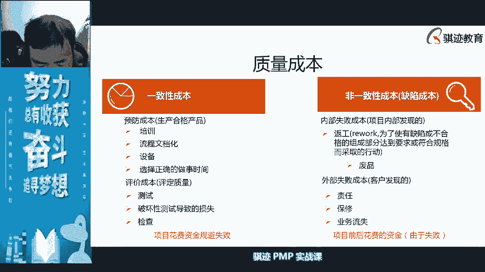

那么这个故事讲完之后呢，我们稍事休息一下。

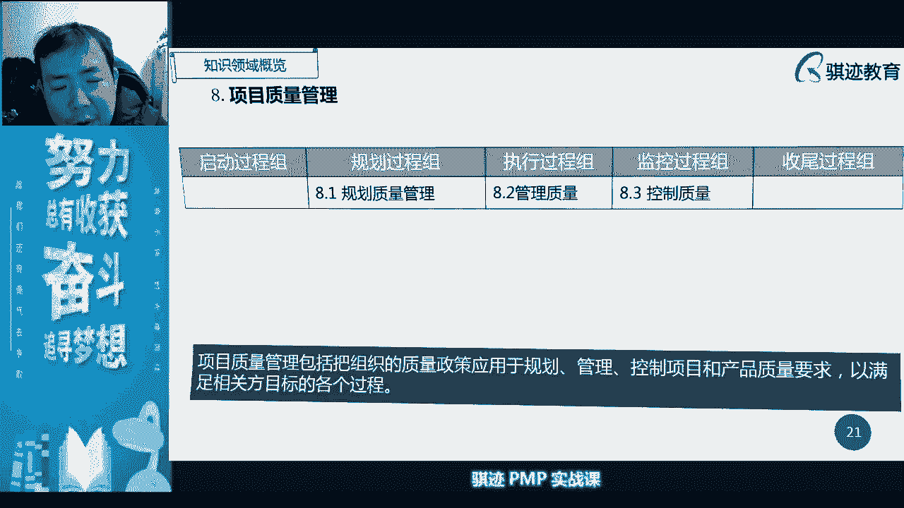

我们稍事开始讲质量的管理过程啊，质量管理过程很简单，只有三个子过程，但是这三个子换成器的内容呢也挺多的啊，也挺多，考点也挺多，指同时要注意篇幅和第六版简单，为什么比第五版简单，我跟你们说，简单就简单。

在质量这一块简单了，p波和第五版当中，除了范进程之外，考试丢分最多的领域就是质量，因为质量里面的专业程度深啊，概念比较难，容易搞错，错就容易错在这里啊，但是第六版呢把很多错了。

那些大师理论的东西都砍掉了，东西呢砍了精简了，所以你们丢分点就少了明白，但是依然有很多东西要掌握解决啊，明白吧，好我们稍事休息呃，休息完之后呢，我们接下来开始讲第一个子过程规划，质量管理好。

我们休息十分钟，现在是12：16，我们到12点啊，21：16，我们到21：26啊，继续回来。

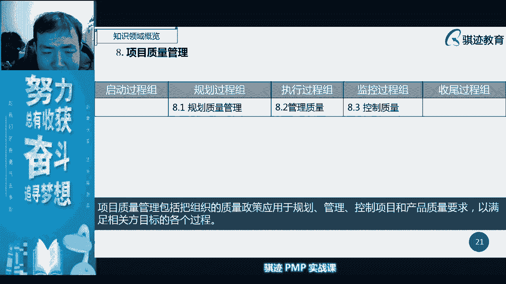

啊同学们不好意思，我老婆有点ok，他可能东西吃坏了，我去照顾他一下啊，今天今天插曲打断有点多啊，ok但是今天的课程其实本本来挺有意思的啊，稍微打的六点多，但是依然很有意思，我讲了很多例子对吧。

就是帮助大家去了解什么是质量啊，质量管理，什么是质量，什么是质量管理，其实质量这个东西，其实呃还是可还是可以扩的很大的啊，可以控到pp当中呢，对于质量的描述呢相对还是狭隘的，其实质量管理是门大学问。

大学问大学问啊，但是现代社会的改变，但是又同时的怎么弄啊，改也改变了质量，很多时候质量也变得什么呢，开始被别别别降维打击了，我想讲现在不知道数数字时代的质量，数字时代质量永远会存在质量吧。

我们永远和v u ca存在一起对吧，好那么我们到26分哈，还有四分钟啊，大家可以稍事休息一下啊，收拾继续啊，ok啊，然后我们今天会课程会，课时会略微略略略略略微晚一点点，晚于我们的十点钟对吧。

我刚才因为中断了几分钟，ok啊，我会我会把时间补回来对吧，要给大家保质保量，给开课讲好，对啊数字啊，有同学说是差异很难对，数字时代就是说呃，有个有个其实有很大一个特征，就是接受不完美与不完美共存啊。

传统的质量总是什么是趋向于完美的，我们的目标只是趋向于完美的，但是数字时代的话，我们的开始认识到了不完美才是常态，完美是才是攒态啊，是这样一种理念啊，这在其他的一些理论，我们其他的一些理论当中。

其实管理理论上已经有所体现啊，尤其是跟数字在紧密最相关的行业，像it行业，互联网行业，其实已经啊很多地方已经体现出这种东西，我听起，好大家稍事休息啊，还有三分钟，哇哈好惨啊啊我刚才看到了新闻啊。

北京大兴区有一位九岁的啊，男生应该刚刚上小学，然后确诊无感，无症状感染，然后学校里1081个人统统隔离，哈哈有点惨，卧槽有点惨啊，所以所以国家这么谨慎，然后为什么取取消考试，就取消。

4月份的p m p考试要推迟和6月份合并，其实还是有道理的，对吧啊，有道理，这个形式唉不好说不好说，就希望冬季尽快过去吧，冬季过去的话嗯可能会好一些，就跟流感一样，到了到了春季之后，3月份之后会好一些。

啊大家知道了，知道吧啊其实理论上来说呃，新冠病毒就是一个特大号流感，大号流感啊，不符合理论啊，就是通俗来说，通俗来说，ok啊，这6月份我们不知道，我们现我现在不知道啊，我现在哎同学们，我现在不知道啊。

到底什么时候开课，但是可能下一次课还是老老板，所以你们还有最后一次机会用老板考试，ok没有问题，肯定还没到第七版，放心肯定还没到第七版，有位同学说就在人家附近啊，你们家你们家离毒圈很近啊。

啊15安恙否啊，还好他现在还好，我等会可能我下课之后看情况，看看需不需要送他去急诊啊，现在还好没事情啊，所以今天抱歉大家啊，有有有有点小呃，小情况好，ok好。

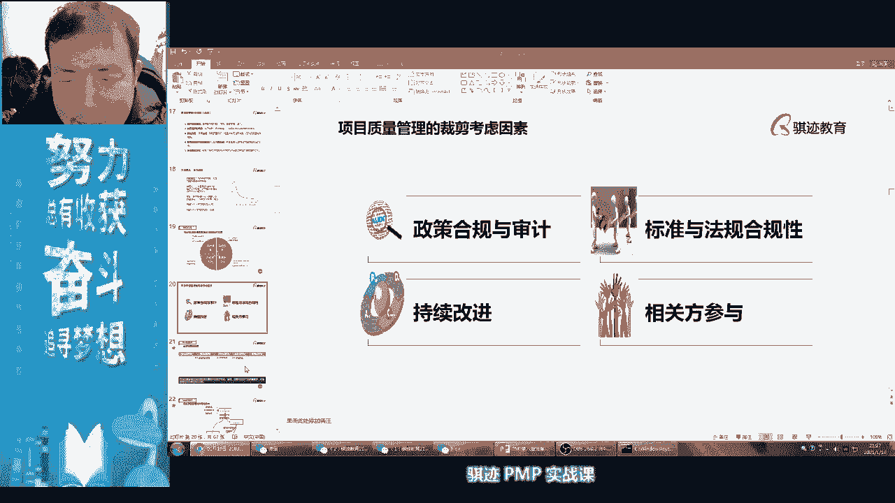

我们回来，同学们所有的人回来啊，我们继续上课，课程不能断对吧。

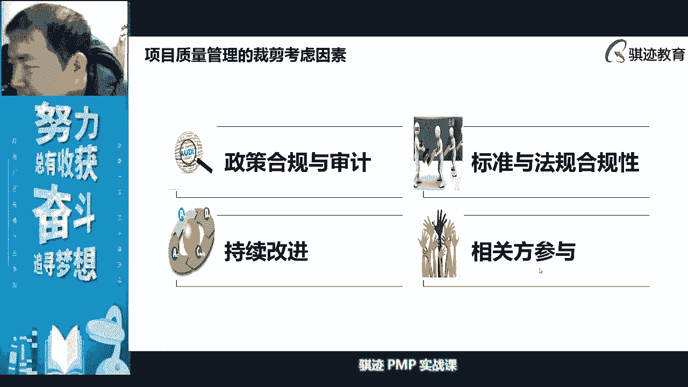

好我们继续开始讲，我们讲质量管理，质量管理只有三个子过程啊，分为一个规划指过程，一个执行指过程，一个控制过程啊，就是规划质量管理，控制质量和控管理质量和控制质量，那么在拼搏和第五版当中呢。

管理质量就是质量保证啊，第五版中我们认为质量的范围被扩大了，所以我们就改成叫做管理质量啊，管理质量是我们少数的执行，此过程中大家可以看到执行过程组非常少，当中的子过程非常少。

那么为什么有管理质量能放在执行呢，是因为质量的管理过程当中，有很多通用的工具可以放在一起讲，我们讲执行过程组的不同项目的执行，所以大家只能各自各自管，偏偏麦呢是没办法统一描述，因为项目和项目差异太大。

不可能去描述，但是质量管理这个知识领域当中的执行呢，它有共性，所以它就会共同的一起描述成为管理质量啊，是这样的特性，所以是所以你会看到管理者质量管理的三管理，项目质量管理这三个子过程恰好是一个什么啊。

事前事中事后规划质量管理是不是事前的管理，质量是不是适中的啊，光泽宇是是管理质量和控制质量是怎么界定的，就是注意一点啊，这个让你们要记住注意点，就是看可交付成果有没有被最终生产出来。

生产到一半还是管理质量，最终生产出来之后呢，就是控制质量的过程，就像娃生出来之后再怎么样，它也就是你的娃了，不能改了对吧，生出来之前呢，那都是什么管理质量对吧，啊啊所以供货质量你会看到什么啊。

不是结婚了，夫妻两个人备孕准备生孩子对吧，管理质量呢是老婆还上了，然后呢，嗯然后呢两个人呢就是定期的去做产检对吧，去做大牌gd n a检测对吧，然后去做各种验血糖代之类的东西，做做检查对吧啊。

然后呢最后呢孩子生出来之后呢，就是控制质量啊，啊踩足滴血对吧，检查手手手脚脚对吧，哎你们知道啊，当过父母的可能知道啊，女同胞可能不知道，男同胞是知道的，就说小孩子生出来之后呢。

呃男同胞会第一个被护士叫过去，然后呢护士会当面跟你说啊，小孩生出来的是男是女，几斤几两，什么时候生的，小孩子的全身健康对吧，手指手指脚趾是全的对吧，手脚是正常的，他会给你看一下，秀一下啊。

但是孩子已经被擦干净了，孩子生出来的时候身上都是羊水吧对吧，都被擦干净了，然后给你秀一下孩子是怎么样子的啊，然后给你看一下啊，确认一下验货无误，那么这个过程之后，这个过程之后呢就全是什么控制质量。

因为孩子已经造出来对吧，你孩子到底是什么，唐氏也好啦，还是神通也好啦，都已经都已经定性了对吧，都已经定性了啊，那么好，所以记住质量管理当中的三个子过程，恰好是事前事中事后，那么我们再插一小句。

在管理质量当中会有个工具叫做质量审计，那么质量审计是干什么的呢，就是我前面所说的对吧，你怀疑对吧，你怀疑这个东西有问题对吧，然后你去做dna鉴定对吧啊神d还有什么呢，你怀疑老婆没有按照你期望的啊。

质量和等级要求是去给你造娃对吧，然后你去查你老婆的开房记录对吧啊，ok这叫审计，明白了吧，他看的不是结果，不是查你的娃，而是看你的制造过程对吧啊，ok啊，是不是这样形象的解释很有意思。

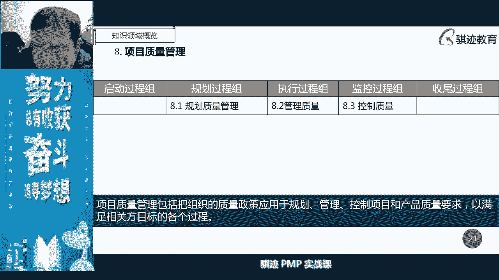

对吧好，那么我们先看第一个字，过程啊，我们这个逻辑关系我们是时候再看啊。

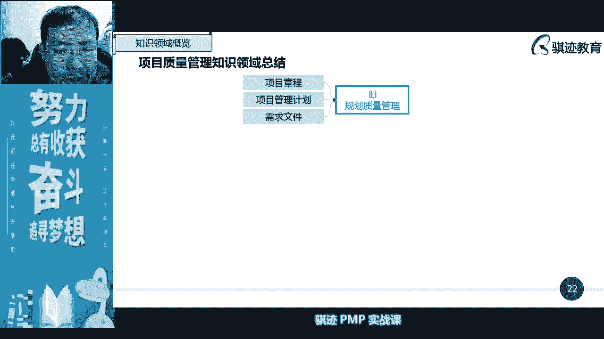

先看第一个字，观规划质量管理，那规划质量管理就是识别可交付的质量，标准和过程，以及描述它是怎么生产出来的这个过程，然后一所以当我们在规划质量管理当中，一会去定义他的所有的标准。

第二呢会去定义怎么去实现这个标准的方法啊，然后呢去定义的政策啊，去衡量一些啊，我们的各种各样的各种各样的标准和，定各种各样的一些办法规则，是这样一个过程，所以质量管理呢一般在规划质量当中呢。

一般是在什么项目最初始的时候展开的啊，最初始的时候展开的，但有时候也会在项目的不同阶段呢，重新展开开一次说呢，所以规划质量管理呢，因为它会涉及到后面所有执行质量的过程，所以它一般不会被经常修改啊。

这点要注意，但是一个项目在初始阶段，一定要有一定的质量规划管理，你可以小项目呢简单一点，大项目的复杂一点好。

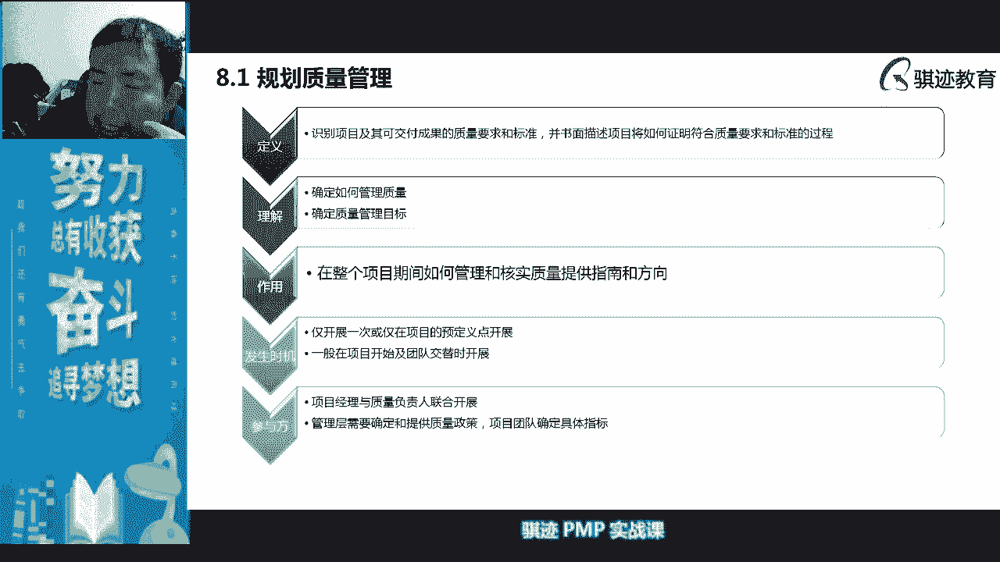

大家可以看啊，这个当中就有很多的输入输出的方法，输入输通了，我们重点看，因为输入当中会因为要提供什么，各种跟质量有关的东西，比如范进程啊，风险啊等等啊，这些东西啊会影响到质量。

那么这些东西呢输入呢并不太重要，因为不太会怎么考你，那么最主要是看你使用哪些工具啊，质量考试当中最难的东西都来自于工具，都在于工具啊，我们这里会讲各种各样的工具，然后呢最后会输出我们质量的。

相应的质量管理计划，质量测量标准啊。

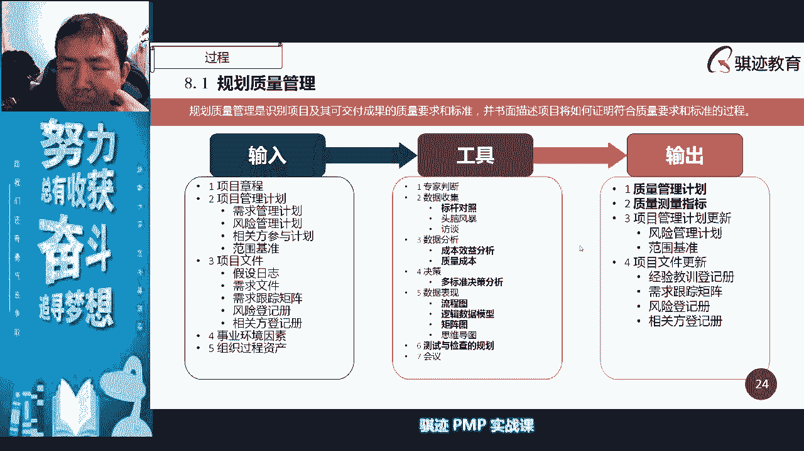

好我们一个看质量当中，第一个我们去收集质量当中会使用标杆对照，对吧啊，这个很容易理解很容易理解，比如说我们在质量管理当中，比如说我们想想做一款产品，它的质量啊是行业里面最好的。

那么你会找行业里面最好的那家的产品，来进行对照，对吧啊，那么这就是标杆标杆对照，对吧啊啊这个呢我们之前讲过也没什么多讲。

那然后呢，质量当中呢就会有个东西叫做成本效益分析，成本效益分析就是看这个质量，当然我们花准备花多少钱，去实现怎么样的质量啊，这个东西其实就有讲究了啊，这个东西其实有很有意思的讲究。

就是成本消息分析是用来评估备选方案的优势，劣势的，然后呢确定规划的东西是不是有效的啊，所以他会遵循一个原则，这是一个什么原则呢，叫做边际效用递减啊，大家看看啊，这个这条曲线就是很典型的叫s曲线。

它是一个边际效用递减，那么它的边际效用递减，一个递减的拐点是什么呢，啊待会我给大家解释一下啊，这个东西后面会，等会我会用笔做一个很有意思的，我们呢现场的一个啊一个描绘啊，好这里会有个点。

那么在这个点之前，在这个点之上，沿着这个点上面每一个点代表什么，我对应相应的质量的合格率，或说所相应花的钱啊，欢迎花的钱，但是注意是我相信这叫花的钱，但是这是不是成本，这是花的钱，那么在这个点之前。

它会呈现的特征呢什么特征，注意听我们说啊，我花一块钱，我花一块钱，比如我花一块钱在培训团队，我花一块钱在什么，在预防成本上，我花一块钱在质量检测上，我但是我可以从另外一方面呢去省下钱。

比如说什么我可以降低两块钱的，什么非执行成本，比如说我可以降低价值两块钱的次品，我可以降低价值两块钱的，那么这个时候我问你，这种质量投入是不是最有效率对吧，那随着百分比越来越上升的就会知道啊。

这个时候呢百分比我们讲质量的合格率，百分比最多也就知道100%对吧，不可能超过100%，那么无限缺距100%的过程当中，你的成本是不是成指数级的往上升啊，总共会有那么一个点，比如像这样一个点。

在这个点上呢，质量就会发生一个特征，什么有个特征，就是说我花一块钱的，我花一块钱的质量的成本，正好可以降低一块钱的质量损失，或者说带来一块钱的质量的收益，盈亏正好相抵。

那么这就是一个什么边际效用递减的一个拐点，那么在这个点之后呢，可能我要花两块钱的成本去，才能去换回什么一块钱的收益，然后同时呢能让质量的百分比来继续提高，那么这个时候是不是已经是不合算的事情啊。

这个你们思考先不要急啊，我继续说啊，那么我们就举个例子，举个例子，就算你这个图为例，假设我现在有两条线，有两条线啊，第一条线，那我换个颜色，换个颜色，假设第一条线，蓝线是客户对于质量的要求。

在这条蓝线这个位置，然后呢这是一个盈亏平衡点，就是我的边际效用的拐点，那么呢又有一条线，这条线呢是组织对于质量的一个政策要求，比如说组织要求质量一定要达到这样的标准，那我问你这里是个英雄，那我问你。

你的质量的合格率标准是定在这条蓝线呢，还是定定到这个盈亏平衡点呢，还是定到这个绿线，请告诉我，那么或者说你可以这么说，我的质量标准应该在这种情况下，应该定在呃，客户的质量期望，这条线还是定在盈亏平衡点。

这这个点所代表的这条水平线，还是定在组织了质量政策，这条绿线请告诉我，那个公平的告诉，有人说是客户的啊，内线啊，很好啊，有有有一位同学说客户的，我相信他肯定是经过考虑的啊，哪个高定哪个客户的质量期望。

组织质量政策率先ok啊，ok你们要理解一个事情，就是说我之前讲过质量是不是有镀金的，如果我定在绿线这条线上，是不是镀金了啊，这就回答刚才的问题，是不是镀金了，答案是不是。

为什么它有一个东西叫组织的质量政策对吧，我们前面讲的一口锅子，为什么有很多在做锅子的企业，一口锅子要质量要能够保用20年，而是说这个组织的质量政策，就要求它做成20年，那么组织为什么要这么做呢。

是因为组织认为20年的质量政策，可以给组织带来我们一个项目所不能带来的，或者一个产品所不能带来的市场的美誉度，这种美誉度，组织认为是对于这个东西的投入的，一种额外投入，相当于我在做无形广告，明白了。

所以这种情况下，这不是镀金，所以在这样一个设定下，当前状态我们当然应该选取什么啊，哪个高选哪个对吧，绿啊绿线高就选绿线的高啊，就选绿线啊，蓝线高铁蓝线就当，所以或者说就是当组织的质量政策，标准高的时候。

我们先组织这量政策，当我们的客户的期望高的时候，我们选客户应该选组织的质量政策，与客户的质量期望孰高的那个点，进行什么进行啊，叫什么设定我们的质量的标准啊，这是第一种好，我们嗯嗯等一下啊。

指针选项查出所有的墨迹好，这是第一种啊，那么来第二种啊，不要急，我们会有好几种例子啊，很有意思的例子，第二种当中我们还是说组织的质量政策呢，在这里，然后呢客户的质量要求呢在这里，那么在这种情况下。

在第二种情况下，请问我应不应该按照客户的质量期望去做，因为我问你们个问题，在这个拐点上，我正好是投入和盈亏正好是相抵的，如果要达到客户的期望，我是不是应该把质量推得很高，这会带来额外的看大家看到啊。

这一大段额外的我的成本，这个成本大家可以看到啊，我们成本在这里啊，这一段到这一段是我们的质量成本，对不对，额外付出指甲板，但是我们的质量的提高只有这么一小段对吧，只有这么一小段对吧啊。

所以看上去就是一个什么，投入大而收获小的事情是不合算的，那么我们应不应该去做这样一件事情，设定成客户的质量期望，答案是应该因为客户的质量期望，或者说这一甚至可能是什么国家的质量期望，或者是社会的质量。

一些标准要求会对我们产生硬性约束，这种约束情况下，哪怕你知道继续提高质量投入可能是什么，投入大于产出的事情，但是你也必须做，这是一个项目经理，在管理项目当中需要考虑到的一个取舍点啊，考虑到确实点啊。

这个点要注意啊，所以有时候你把一个产品的质量提高到，比如说合格率达到99。99%，其实是不合算的，但是要么国家要求你怎么做，要么什么客户要求你这么做，要么什么东西啊啊组织要你怎么做出，那你只能这么做。

尽管他可能在经济上是不合算的，但是你必须这么做啊，记得我跟你说，那个我们在休息前说的那个例子吧，通用福特那个例子啊，就是这个例子啊，好那么来了最后一种情况不要急啊，最后一种情况，嗯擦除所有墨迹。

那么在最重要最后一种情况当中，组织的质量的期望呢在这里啊，然后呢我们客户的质量期望呢在这里，那请问我应该取哪个点，请在公屏上告诉我，取中间最高的点成本拐点，ok啊ok啊。

我发我发现很多同学其实会答对的啊，应该取的是哪个点，你们知道吧，你应该取的是这个点，既不是组织的，也不是客户，而是应该取的是拐点，为什么你们知道为什么吗，因为组织和呃客户相比，组织的质量政策更高。

应该当然应该缺组织对吧，但是他组织这个点继续往上，是不是我对我来说，我投入了一块钱的质量成本，仍然可以赚到比一块钱多的质量的损失的下降，我是合算的，在这样一个核算的情况下，我为什么不去做，对不对。

我合格率提高一个百分点，我可能花100万，但是我合格率提高一个百分点，我做的东西很贵，我可能是什么，次品率下降1%，有可能说我可以减少200万的损失，减少120万的损失，我为什么不去做。

这个时候虽然质量标准超出了客户的期望，超出了我们的组织质量政策，但是我们依然是有利可图的，依然是合算的，我们为什么不去做这个是不是镀金，反过来说不是镀金，那么我们想一想镀金的定义当中怎么讲呢。

我们讲不会对我们乙方，我们角度是乙方角度，镀金是不会对乙方带来额外的好处的对吧，我们现在这种设定下可以带来乙方的好处，当然应该选择盈亏平衡点咯对吧，哎你明白了吧，所以那个叫绯闻丽的同学，ok啊。

那个绯闻丽对吧啊ok啊，著名女影星，明白了这就不是一种镀金了啊，这就不是一种镀金了，明白镀金是赔本赚吆喝啊，对啊这个理解非常好，赔本赚吆喝啊，ok哎对啊，这个理解挺好的啊，但不够精确啊，不够精确啊。

好那么这是啊镀金也会度讨好客户，也带来好处，我跟你说啊，这位同学可能经验不够丰富啊，这下不是赚的少了吗，ok啊所以呢所以呢你们不容易，我刚才说的是，我投入100万的，多投入100万的质量投入。

但是我减少了120万的质量损失，我这个时候要不要去做，当然去做，那么我一直达到什么点啊，我在额外提高的质量一直达到什么，我投入100万的质量成本，正好能够减少1万质量损失，这个平衡点的时候，我就停了。

这个平衡点，是不是比这个平衡点之下的那些点都要优啊，在成本上都要优啊，对吧啊，这不是赚啥啊，这不是赚少啊，这反而赚的更多了啊，所以这是有好处的啊，这好说啊，有些同学说啊，镀金不是讨好客户。

不是说也有好处吗，镀金对乙方来说没有好处，为什么你会把甲方的胃口调高，对吧啊，一个一个成熟的乙方的，乙方的项目经理是不会轻易去赌金，为什么你这次给甲方多干那么一点活，下次给甲方多干那点活。

甲方就会什么形成一种惯性思维，你会平白无故我多干活啊，不我不多付你钱或者不走变更的，那我下次就开始向你，你不给我多干活，反而我开始向你提出要求了，这个事情是不是就很糟糕了。

所以镀金是会有隐患的和问题的啊，所以不建议去镀金，对，因为我提高了投入，但是我降低了损失呀，减少了损失呀，是不是一样会降低成本对吧，到了这个点之后再去投入，只会纯增加成本，在这个点之前。

我们讲这个拐点之前，你增加了花费，但是降低了总成本啊，对吧啊，想一想是不是想想，好那么这是这这是这一页ppt，这一页ppt啊当中会讲的故事啊，所以在这一成本相与分析当中，大家可以看到吧。

在指向当中我会讲了很多跟大家有关的啊，可其实跟我们的实际工作中，其实也可能有些关系的一些思考啊，其实有意思啊，啊所以质量当中可以讲的内容很多，其实很多东西是直接结合实际的啊，对一位对有位同学说得好。

一味讨好客户会导致自身贬值。

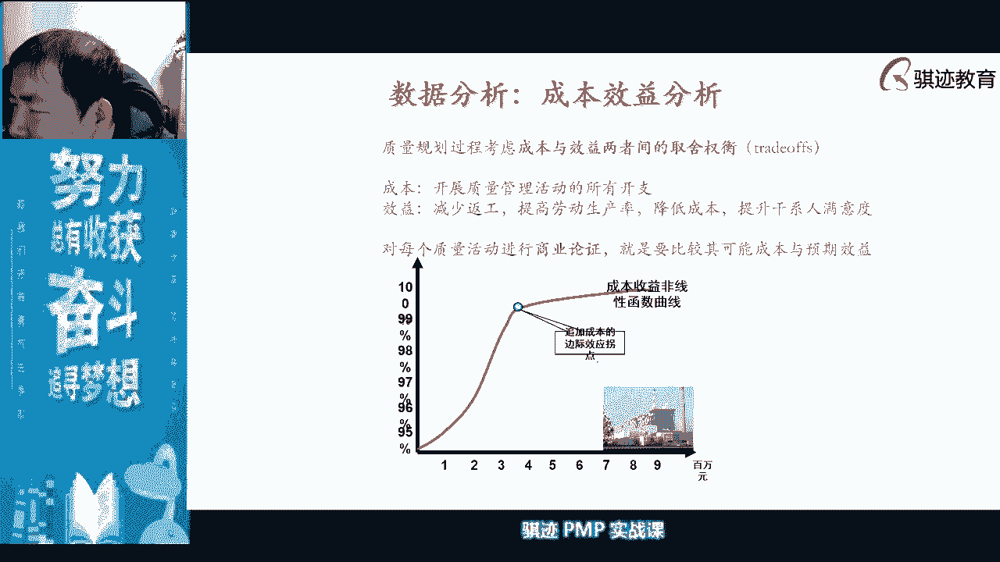

对还有呢啊，好这是我们的质量成本，质量成本我们前面已经讲过了，就不再赘婿啊，这是我们pm博客当中，这是我们pm博客当中啊，啊原图截下来，这是我们的关于质量当中，一致性成本和不一致性成本的一个定义啊。

大家可以看一下，就给大家记住了啊，质量分为三种成本，预防评估和失败啊，那么预防成本呢是最好的，应该最舍得花钱啊，我这里这是我给你们加上去的啊，预防成本是最好的，应该最舍得在这方面花钱。

评估成本呢不可避免，因为测测量评估，检测审计这个东西是一定在一个项目中会做的，但是应该以够用适用为主啊，够用适用为主，失败成本呢是最不好的，所以尽量可能避免，如果无法避免。

一定要努力让它尽可能的变成内部失败成本，就是不要让客户发现，我们自己尽早发现去解决啊，只要当中呢我们还可以使用多标准决策分析啊，多版本角色分析啊，这个大家可能也就比较熟了对吧，我们可以列出很多标准。

对每个标准来进行加权，然后打分，然后选出得分最高的方案啊，得分这个方案这个就很简单，然后质量当中呢多标准结分析是一种决策技术。

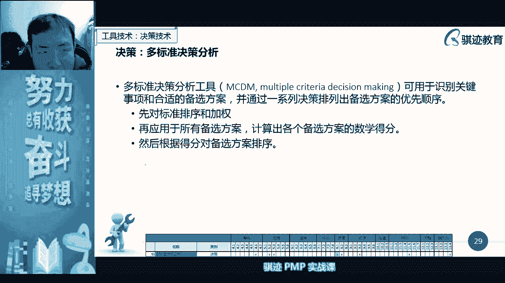

我们在数据表现当中，我们可以使用流程图去表现，那么为什么在纸张中提出一个流程图呢，是因为流程图可以将什么，可以将一些我们在呃前面所说的啊，这就叫什么前面所说的我们的p dm，我们的p dm方法。

颈肩关系吧，那种绘图当中不能表现那些逻辑关系表现出来，因为质量当中会有什么合格了，我是怎么做不合格或者什么，它会有一个逻辑判断的，我们的p dm里面有逻有没有逻辑判断，没有的对吧，它只有逻辑关系。

没有逻辑判断对吧，他只有说什么啊，同时开始同时结束，你先开始，我先开始对吧，但是呢我们的流程图里面它是有逻辑判断，它为什么啊，比如说是合格的会怎么样，不合格会怎么样，合格一部分会怎么样对吧，都会有。

可能他会有多个逻辑分支，它会有概率分支，这种情况下呢用流程图去描绘更更好啊，这就是个流程图的一个样图啊，那么至于流程图应该怎么走呢，大家可以打开大家的word excel ppt，然后插入一个图表。

里面有流程图，大家可以自己去熟悉一下啊，pp当中并没有特别讲流程图怎么去运用啊，大家只要知道，流程图可以用来描绘一个质量的一个输入，输出转化的过程和可能的分支，这样的东西好。

然后呢我们还会用使用逻辑数据，逻辑数据模型啊，逻辑数据模型在屏幕和第六版当中，已经不怎么考了，不怎么提了，所以大家看一下所谓基数据模型，意思就是把我们的东西呢可视化，可视化可视化啊，好矩阵图。

矩阵图已经不考了啊，矩阵图已经不怎么考了，ok我们直接跳过，大家看一下，所以说就是利用矩阵的啊，画图类型给我们绘出啊，识别出里边的一些质量要素啊，然后看看他们的关系之类啊。

那么质量当中呢我们还会用到检查和测试啊，测试检查的规划，在规划当中我们会设定质量是如何去检查，如何去测试的啊，ok好那么最后呢我们在规划完质量当中呢，最后呢我们就会就会输出一个结果，叫做质量管理计划。

质量管理计划不是一个纯立规矩的啊啊不是，这要注意我之前每次上课就是说啊，哪个规划我们叫它立规矩对吧，质量管理计划不是一个空泛的计划，纯立规矩，纯净的，它里面有具体的内容啊，它会列出我所使用的质量标准。

它所使用的质量工具和如何去管理质量的过程，它会设定这个流程过程，他会设定审查过程，它是有具体内容的，他会设定这个质量是如何，一步一步一步去完成的，这个完成的过程是要能够落地的才行，明白了。

所以质量管理计划当中很多东西是可以落地。

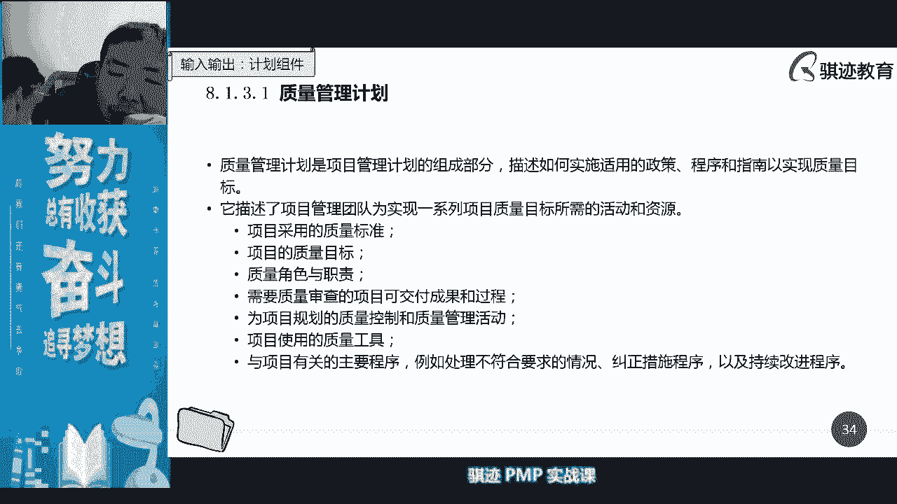

但是他没有具体指标，具体指标在另外一个文件里啊。

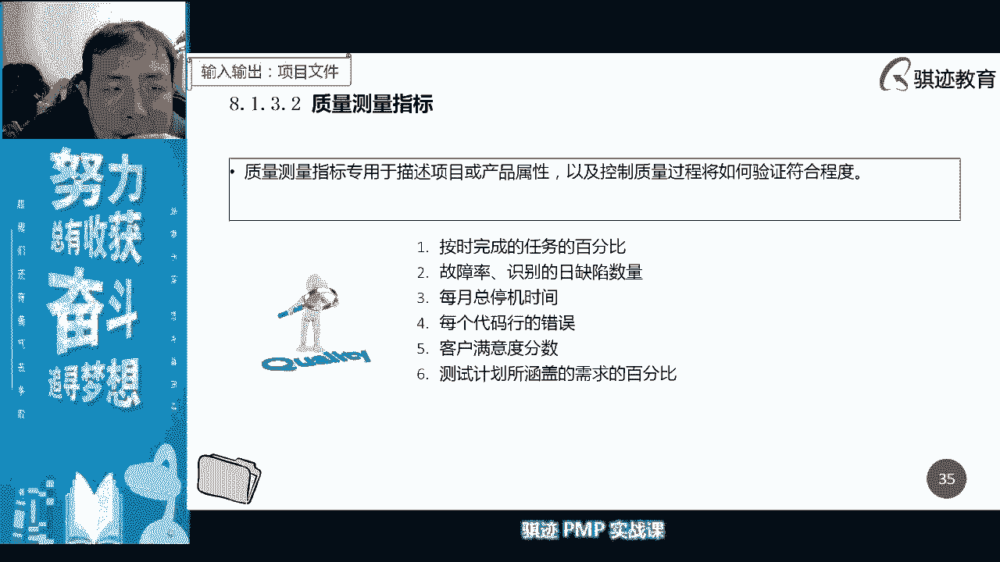

具体指标在质量测量指标里，那么质量管理情况是什么，告诉你这个过程是怎么样的，大致需要哪些资源，它的标准是如何的，用什么样的工具，如何去分配角色这些东西啊，尤其是这当中所定义的。

如何去审查我们的可交付成果，以及它的过程是非常重要的啊，所以质量管理计划当中不是一个纯立规矩的啊，不是一个纯理规矩，所以质量不是一个基准，你知道为什么质量做不到一个基准，质量没有质量基准为什么做不到。

我们讲基准啊，有些同学讲的叫质量管理情况，应该是个基准啊，你知道为什么不是基准啊，因为基准基准讲的是什么，它叫贝，它有个东西叫bassline，基准是不是有条线啊，那条线可以随着时间变化。

我们可以取任意一个时间点，知道当前时间点应该做到什么样的程度，质量是没有的，质量只能伴随的可交付成果的生产和交付过程，它出现状态变化，最终状态变化是不连续的，比如说有些时候有些有些产品。

有些项目它的过程是没有质量的，它只有最后结果有质量，对吧，比如说我们是一个创意型项目，我们要做一个做一个创意，这个创意的做的过程中，我们大部分时间花都在哪里啊，开脑洞对吧，然后去采风去想。

这个时候你的创意是没有的，你没有质量可言呢，你最后大家团队突然就蹦蹦出一个点子，这个点子符合客户的要求，做出了这个创意，那么这个时候你才用一些质量标准，看看这符不符合诉求，你才去评价。

那么这个过程就是直接从一个0~1的，一个过程，它没有终结，0。10。2，0。3，0。4，0。5，这个过程是没有的，所以他没办法做成基准，知道吧，所以质量是没有质量基准的，明白吧，它不能随时间变化。

它是非连续性的，它是间断性非连续性的啊，ok啊不知道你们明白了没有啊，所以我很欢迎啊，啊诸葛同学他说得很好，他的问题就定的很好啊，那么所以你们问题听的越多，越有助于去理解啊，为什么这个东西不是这样的。

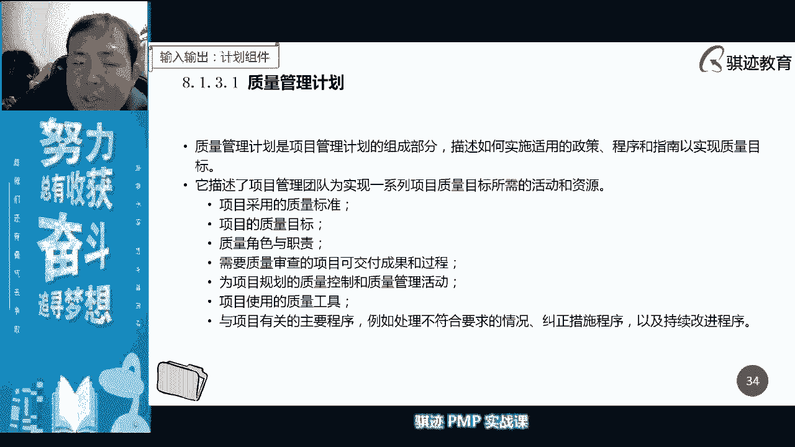

那么质量我们的质量啊，质量的规划当中呢，我们会提出另外一个东西叫做质量测量指标，质量测量指标是干什么用的，质量测量指标是用来定义我们产品的属性的啊，所以质量测量指标当中有具体的产品属性。

那么产品属性又会涉及到p m p里面，有一个另外有一个东西啊，叫做配置管理，会涉及到配置管理，那么当我们在定义完出项目的初始阶段，我们在项目的规划阶段，定义完质量测量指标之后。

一个产品初期的它的定义就被完成了，它的配置初始配置就完成了，但是这个配置会随着我们的变更去变化的，所以质量其实和配置相关，因为他没有在不同的项目当中不一样，有可能有些项目当中呢无足轻重没有关系。

没有也没有关系啊，但是在有项目中非常重要，比如像it开发，像这个工业产品的生产配置，就管理就非常重要啊，非常的重要，所以以及它的控制过程是会限制，所以记住一点啊，产品的属性以及它如何被去验证。

有什么验证啊。

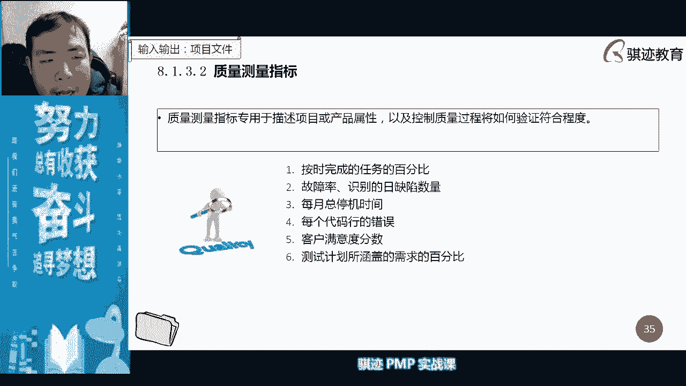

就是说我们所使用的一些质量标准。

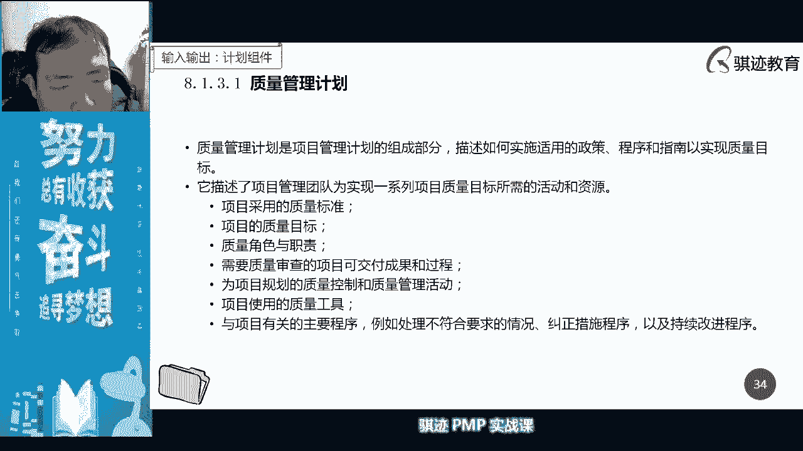

它是怎么样去定义的，怎么样去定义的，比如说它是按照百分比去定义的啊，它所以它它的指标当中会显示说是百分比，如果它是按照比如说曲线数量，它会有个数字，有些事情呢甚至是以什么是以零和一的，就有没有发生过。

还是没有发生过，他会用逻辑逻辑形的那种方式去定义啊，都会在质量测量指标当中去定义它是如何去啊，描述这个产品属性，同时它一定也会有什么这个属性，我到时候怎么去验收的验证呢，哈所以质量测量指标它有一问东西。

必然是会继承自哪里啊，知道吧，继承自客户的合同的附件，因为我们和客户所签订的这个合同，比如说我们是乙方和甲方签订的合同，他的合同里肯定会对质量有要求，它的质量要求将会被继承过来。

纳入到我们的质量测量指标，最后被细化和具体化，落地为我们指标的具体的指标的设定，和它的执行方法过程，以及如何去验证验证证明，那么当可交付成果生产出来之后，我们首先要自己去用质量测量指标去验证。

注意我的话啊，我的话都是有用的，去用质量测量指标去验证这个东西，实不符合质量，如果符合，我们就通过了什么，在控制质量当中，我们就说他通过了质量的内部验收，叫做控制质量，它成为了什么核实的可交付成果对吧。

但是客户验收的时候，它不是按你的质量测量指标去验收的，注意啊，它是按照我们和客户的合同的附件当中，有关于可质量的那些条款去验收的，所以质量测量指标在项目经理去制定的时候，一定要注意一个细节。

就是你你要保证你的质量测量指标，100%以上，可以上，体现了客户在合同当中描写了对于质量的诉求，客户在质量，在合同的质量当中诉求可以是不专业的，尽可能的专业，但是可以是不专业。

但是你的质量测量指标必须专业，能够落地，帮助他实现质量诉求，明白这个意思吧，很多项目他最后做出来之后，在验收的时候出现扯皮，又是什么，甲方乙方，双方对于质量这个东西的认定出现了偏差，当初谈的时候。

因为东西没有出来，大家都没有概念啊，一谈ok就脑袋一拍，干活了，等做出来发现大家对于质量的认识差异太大了，所以很多时候我们的实践会怎么样，在实在一个产品在交付用户之前，我们会在这个过程中和如果有可能。

如果不是对于公众的产品，我们会有可能或者对于有些时候用，对于公众产品，大部分公众，我们可以采用一些先进的方法和用户去沟通，这个质量是如何帮助他实现的，比如说我们使用原型啊，试用品啊。

demo啊之类的这些东西去看我们对于质量的理解，其中一个功能就是看我们对于质量的理解，和用户对于质量的理解是不是一致，避免最后东西做出来之后哦，完了客户要的是a b c，我们理解的是123。

虽然我们觉得a b c123 ，在工科男里面就可以是相对影射，但是客户是一个什么客户，是个死脑子对吧，有可能的啊，所以这个时候质量测量指标的制定，一定要符合我们的合同和我们的合同相对应啊。

好那么这是指规划质量管理当中的所有的a啊。

一些相关的一些内容啊，那么这一部分讲完之后呢，那么今天的课程呢基本上都在当时，比我原来预计说要稍微晚一点点，要稍微早一点点，还有两分钟，那么在这个最后的几分钟当中呢。

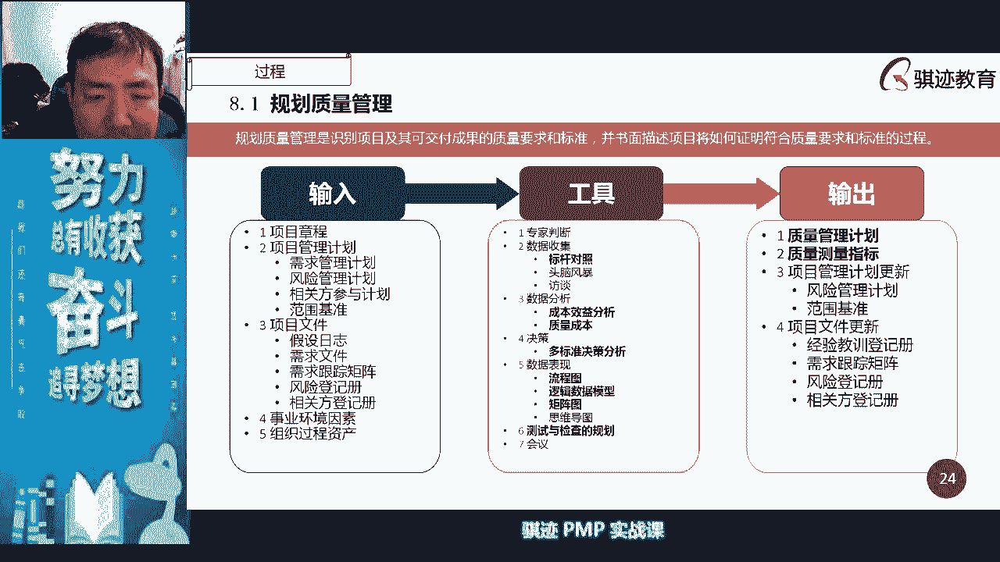

啊我希望大家今天回去之后呢，对于一些质量领域的东西呢。

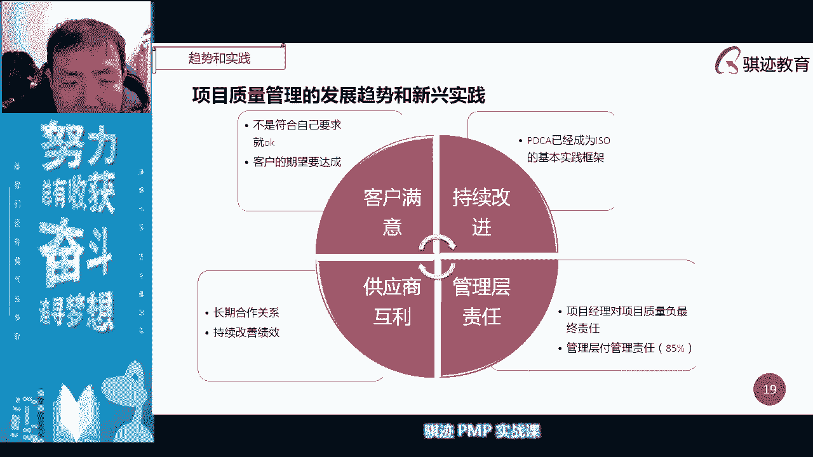

然后去看一下，过一下我们呢呃考试的安排呢，我明天的课程呢可能会取消啊，因为因为考试延后了，所以我们可能明天晚上就不上课了啊，具体以具体以啊教务老师，班主任在群里的公告为准啊，我公告为准。

然后呢我希望大家回去再看看啊。

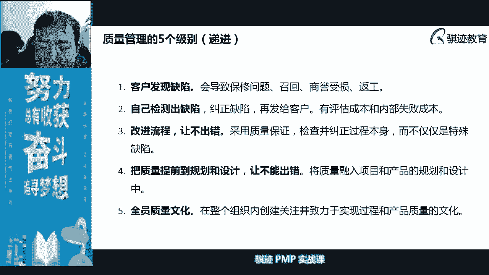

尤其是理解关于质量的概念，因为质量这块东西呢在我们工作当中呢很重要。

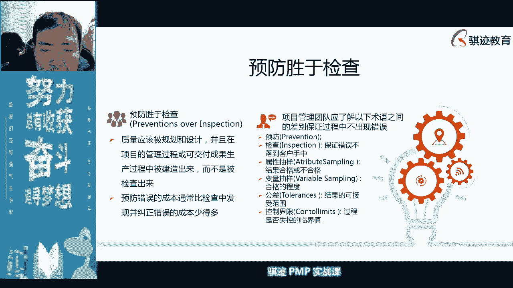

除了范进程是质量其实是很重要的，换工作，但是质量这份工作里面的概念呢。

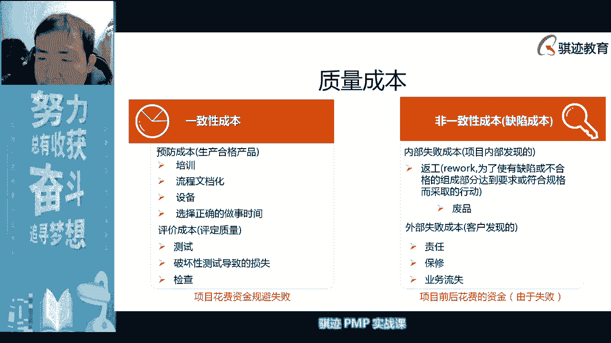

有时候呢人容易受传统质量的影响，观念的影响呢会有误解，所以你们今天会去想一想，你们在对质量理解当中有哪些东西偏差，或者觉得有些东西不够接受度高的和我说，然后呢我我会帮大家去解释，质量应该去怎么理解啊。

然后呢遇到问题呢可以更好的去进行，可以做起来，遇到问题呢可以更好的进行什么进行应对啊，一进行纠正啊，是这样一个嗯好那么今天到最后结束之前啊，因为今天可能耽搁了一些时间对吧，然后呢上课呢还是挺顺利的啊。

大家的反馈也挺好的，明天后天都有课啊，现在换成一三次的玩意儿，本来是其实是现在三次了，但是后来啊后来好像我们商量课，可能说还是改成一周两次，因为我们考试延后了嘛，所以我们把这个时间往后挪一下啊。

但是明天以老师通知为准啊，以啊张婷老师群里通知的为准，可以吧啊，ok那么在最呃，好吧，唱首什么歌让我想想看啊，嗯让我想想啊，呀哦哦在啊哎呀一下一下子愣着唱不出来，ok那么我们牵一首。

好吧啊今天今天那个今天中间略有中断啊，对不起大家啊，稍微有点事情，家里家里人有点有点身体不舒服，那我就那我就下次给准备一下，给大家开课之前啊，我们这用上课时间给大家唱首歌，好吧啊，那么今天就先到这里。

谢谢大家啊，谢谢大家理解啊，谢谢大家理解，回去好好看书啊，好好看书，不要受考4月和6月考试的合并的影响啊，好好看，该过得过，因为大家只有对于老版本容易过的，容易考试，容易过来说。

我们只有最后一次我last shot的机会啊，你就一枪命中，所以对于每个人来说，你们都要对自己有一个信心，就说我100%能过，我一定能考试能过啊，要有这个信念好吧，好回去认真准备啊，有些同学在毒圈里。

有些同学来离毒圈很近，希望大家都没事啊，大家都是开挂的，希望大家都免疫毒圈啊，好那么今天的课程就到这里，我们下次课再见。

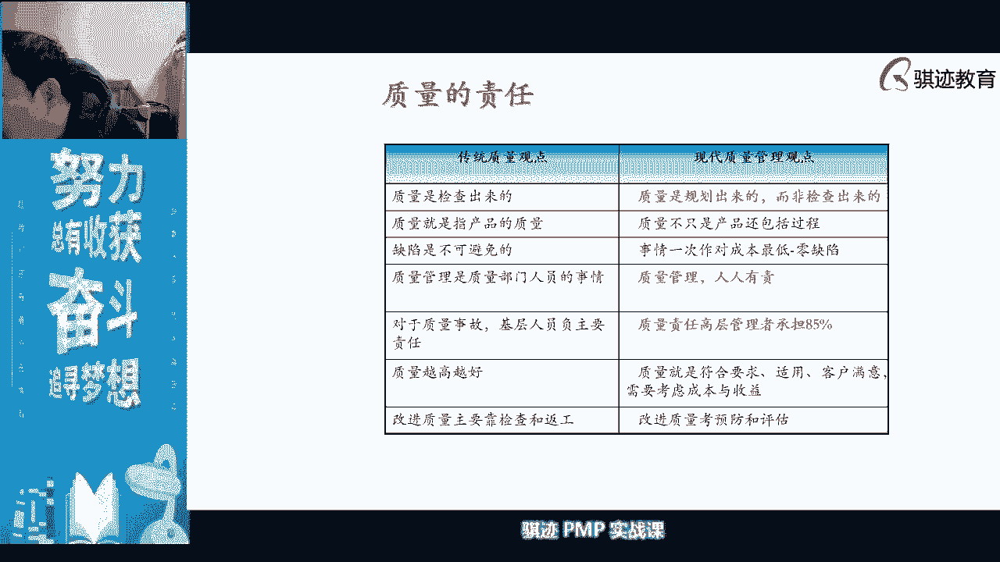