# PMP认证考试课程最新完整免费课程零基础一次通过项目管理PMP考试 - P25：PMBOK第六版 第八章项目质量管理-26 - 骐迹PMP - BV1Sb4y1f7Yt

偏向于易于维护修理，人家不考虑成本，人家觉得成本高，美国人且财大气粗，能接受，易于什么易于获得补给，他的弹药口径一致，ak的弹药口径和以前的历史上，以前的俄啊，俄罗斯啊，苏联所使用的口径是啊不一样的。

所以他要额外再生产一条流水线啊，所以这就是一种特点，知道吧，所以不同的枪械为什么他会被设计，看似m4 又难维护，又容易卡壳，又稳定性又不好，但是它为什么会出现它有它的特点，易于维护维护虽然成本高。

但易于维护，但是什么它的优化特点就是易于维护，然后呢子弹通用性强对吧啊，那我再讲一个例子，中国人的例子啊，什么山西醋和镇江醋对吧啊，那么山西醋和镇江醋是两种风格的醋，那么山西醋和镇江醋有什么区别呢。

山西醋是针对什么优化，因为山西人喜欢吃什么，吃面食，喜欢吃面食，这三西兔很多东西的是个什么，是个面食搭配的啊，很多面食啊，很多很多面条啊，以及一些山西的地方特色小吃搭配的，而镇江醋呢是江南的一种醋。

它更多的是什么和江南的鱼啊，啊下面向于面食和肉食类的，所以它的特点是什么，不甜浓厚，然后呢易于什么烹调，尤其是烹调什么面食和肉类啊，面条肉类镇江醋呢口味较为清淡，较为淡，带有甜味。

易于什么烹调什么我们的呃鱼类，蟹类虾类，所以他们各自有自己，面向特定地方的一些特定设计，所以他才能被传承下来啊，是不是很隐私啊，好这就是面向x设计，所以以面向x设计和会在我们的工作当中。

在很多地方去体现，所以有时候你会看到一样东西啊，为什么你会想，为什么这些东西设计出来会这么傻啊，会这么傻，我们再举个例子啊，啊上课我们再举一个小例子，就是说你们都接到过诈骗电话对吧。

接到诈骗电话是正常的，从来没有接过诈骗电话，没有收过诈骗短信是不正常，你会发现一个事情，诈骗电话和诈骗短信都特别傻，都特别傻，一眼就看出我是诈骗骗子，那么为什么要这么设计，其实人家很聪明。

人家知道真聪明，但是诈骗电话和诈骗短信就是设计成这么傻，这是面向x设计啊，明白了它是面向于傻叉的设计，为什么诈骗电话，诈骗短信它有一个成本是什么成本，他在他可能要打1000个电话。

1万个电话才能骗到一个人，那么他如果要想尽快的骗到人，他一定这个骗局不能太高明，他要能骗到傻子，但是要过滤掉什么聪明人，他如果你的聪明人比骗进来，但最终聪明人很难最终上当，那么他的过程是不是浪费时间。

所以他的骗局设计要什么，自动把聪明人过滤掉，把傻子给骗进了，所以面向于骗傻子的设计，就是我们的诈骗电话和诈骗短的特点，所以它的里面的言语和方式，故意就有那么透着那么一股傻傻的感觉，就是要把聪明人过滤掉。

明白了吧，他目的不是骗你聪明啊，所以你这种嗯像我们在课堂上，影响人家骗子效率对吧，调调戏人家骗子对吧，因为人家根本就不是人家的客户，目标群体就根本不是你，所以这就也是所以诈骗电话，诈骗短信的那种方式。

骗的方式就是用来骗骗子的，知道吧，这是骗傻子的，不是不是骗傻子的啊，明白这也是面向于x的设计，明白了很有意思啊，因为这个社会现在是什么高度专业分工化，专业高高度的专业分工化。

就必然带来什么各种面向于x的，df x的这种设计理念，好设计体系啊，ok啊，不知道这个大讲了，大家有没有体会啊，很有意思啊，好，那么我们会接下来呢。

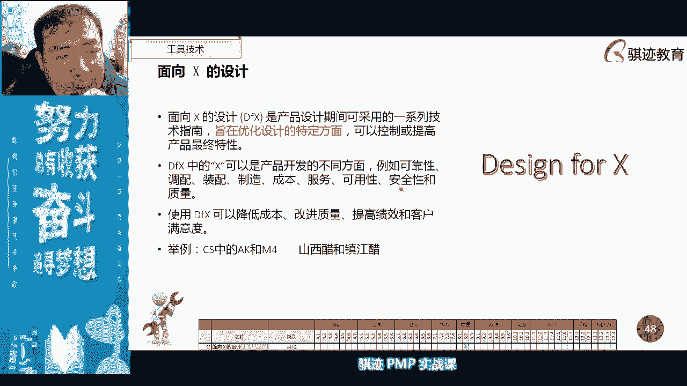

我们在管理指南当中会有一个问题解决，问题解决，那么问题简单，又是一个可以讲很长时间的东西啊，当然我们长话短说，因为时间不够啊，如果大家有兴趣的话，可以去学嗯，我们的软考当中。

会有更详细的问题解决的解决方案，解决方案思路，或者是学ito啊，搞i t也可以学ito，更更有更清晰的问题解决的一些方案思路啊，那么问题解决就是什么，它的基本步骤就是p p里面的基本步骤定义啊。

定义问题，识别根本原因，生成可能解决方案，选择最佳方案去执行，然后验证对吧，ok这个是没有问题的，但是我们讲和任何事情都要涉及到一个东西，叫实践会怎么样，在实践当中。

我们讲这个这个问题解决了一个逻辑流程，是不够完整的，incomplete，那么实践当中问题解决，我们通常是按照什么，第一步是什么，快速的去定义问题，快速的去定义问题啊，它定义问题指定义什么东西啊。

第一这个问题影响多大，第二这个问题呢程啊影响程度有多深，第二个呢影响范围有多大，程度范围除了范围，第二个事情解决问题是什么，我们不会直接快速的去识别跟美云，除非这个问题已经被我们识别过。

否则如果他是未识别过的一个问题，我们第一反应是什么，采取一些临时性的措施，迅速控制问题的发生和蔓延和失控，让它变得什么能够有可控不再恶化，然后呢范围不再扩大，然后呢我们同时去解决问题的同时。

然后再去识别更美名，然后去解决啊，后面的学生是一样的，所以解决一个问题，所以为什么要讲这一点，因为我相信我们在座的很多的同学，其实从本质上讲，大家的角色还不是项目经理，或者是还没有担任过项目经理。

你们很多时候工作的时候的四位是吗，是工程师思维，工程人思维有一个好处是什么，他很很喜欢什么啊，却根本上解决问题，很很喜欢挑战技术上的挑战，但缺点什么，很多时候太钻牛角尖。

所以很多时候呢会把一个问题呢变得复杂化，因为很多时候出问题并不可怕，可怕是没有正确的去处理问题，那么什么叫没有中心问题啊，就是没有把问题控制到损失和影响控制到最小，解决问题的最根本是什么。

把问题的损失和影响缩小到最小，才是最正确的解决问方法，那么接下来呢才是你什么，去通过识别根本原因去解决，因为有很多时候有些问题是不容易，什么上来就识别跟美元因的，那么这个时候你去十倍更美元，可能会浪费。

浪费宝贵的处理问题的最佳时间点啊，就像就像治病一样，比如说有个病人突然间倒在地上了，比如有个人突然倒在地上了，那么他可能是心脏病发作了对吧，那么你上来第一步是什么心，给他做心肺复苏呀对吧，不行的话。

就把他心脏按压两下，也有可能也好了呀对吧，你去识别根本原因，去找什么，它是什么啊，心血管的心脏疾病还是什么疾病，然后你分析了半天，然后找出根本原因，人家死掉了有什么用啊，我就举个这样的例子啊。

帮大家明白一下，ok啊那pp当中呢大家不用理解他啊，理解太多，根据这个流程就知道啊，但是这是我们解决问题的根本方法的一些要素，大家知道一下就行了啊，ok好。

那么接下来，我们叫质量改进，我们当我们识别到原因，比如说当我们识别到原因之后，那么我们接下来可能开始做了，什么叫做质量改进，质量改进就开始使用到我们的pd c对吧，pd c也是要学的啊，p是做计划。

拟定对策，d呢是执行计划，c呢是检查，评估改进和进行改进措施，所以pdc不是一个循环做完就结束啊，那pp里没人考，你们知道，如果我们在工作中质量当中做改进方法，那么pdc应该是一个又一个循环。

它的每一个循环的p都会接着上一个循环的a，明白吧，然后每一个循环的p都比上一个循环的p呢，要更进一步，更提高一步，这叫p dc啊，pdc不是原地转圈，而是不断不断不断转高，每一次转高呢都是通过a去提高。

提高之后呢，在这个提高以后的a的基础上再去做p明白吧，这叫p dc啊，那么pd c呢呃，我们常见的用用于评估的一个方法呢，叫六西格玛d m a i c啊，啊啊啊，define measurement。

implementation，d m a i c是六七格玛的五步行动，五步五步行动法啊，ok啊大家知道了解一下，那因为pmbok第六版把六西格玛也砍掉了，所以你们可以又少学一点啊。

否则这个又是一个搞你们脑子的事情，ok啊但是如果要学软考的同学啊，还是要看一看啊，等你们p m p考过之后，如果准准备考软考的话，这个东西仍然是有用的啊，因为你们用的是pmbok第五版。

ok啊是不是觉得压力又大了啊，好这是质量感情方法，p dc大家知道啊，p d c是个循环上升的，一个不断执行的一个工具的一个工具技术啊，一个质量改进方法不断循环上升啊，让质量是循环的上升去提高好。

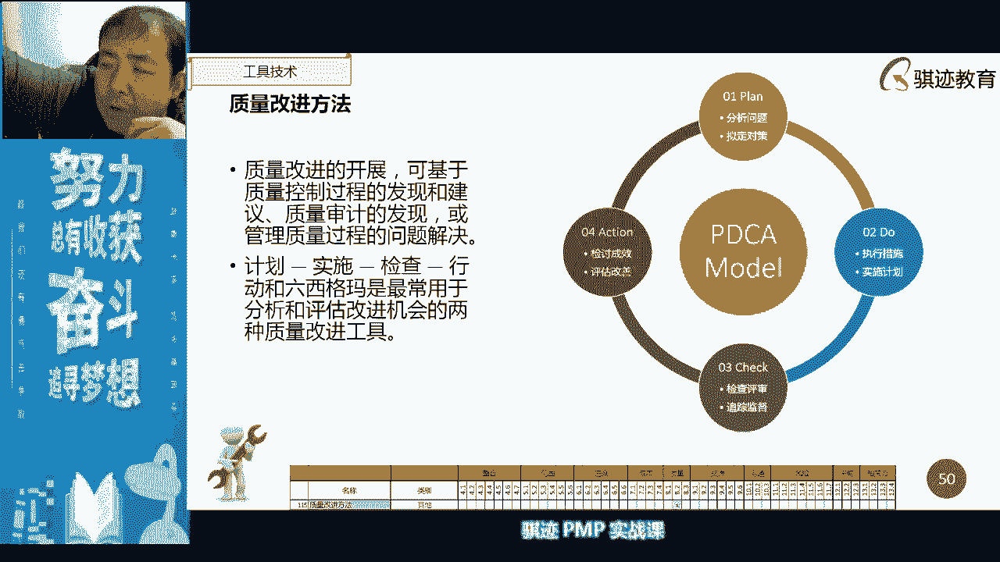

那么最终我们在管理质量当中，最后就得出两个很重要的文件啊，重要很重要文件注意它们的区别，第一个文件叫做质量报告，质量报告呢有点像我们后面也会讲的一样的啊，当我们没学叫风险报告一样的质量。

mod的意思是什么，它是质量总体性概括文件，大家注意我红色的字啊，记住它是质量的总体性概括性文件，它对单个质量缺陷，单个质量问题没有描写，他只对我们总体性的东西有描写，总体性上它会怎么描写。

比如说一个质量方程学，我们总体上质量问题当前是可控的，但是呢趋势正在变坏，然后呢我们当前存在哪些质量问题，管理上的问题，我们建议采取哪些措施去改进，会用这样的方式去描述。

这个过程当中是没有针对具体质量的，具体质量的单个问题进行详细描述的啊，没有啊，是这样的，这是这种文件，所以当我们要查看整体性的质量状况的时候，我们会看整体的质量报告，质量报告。

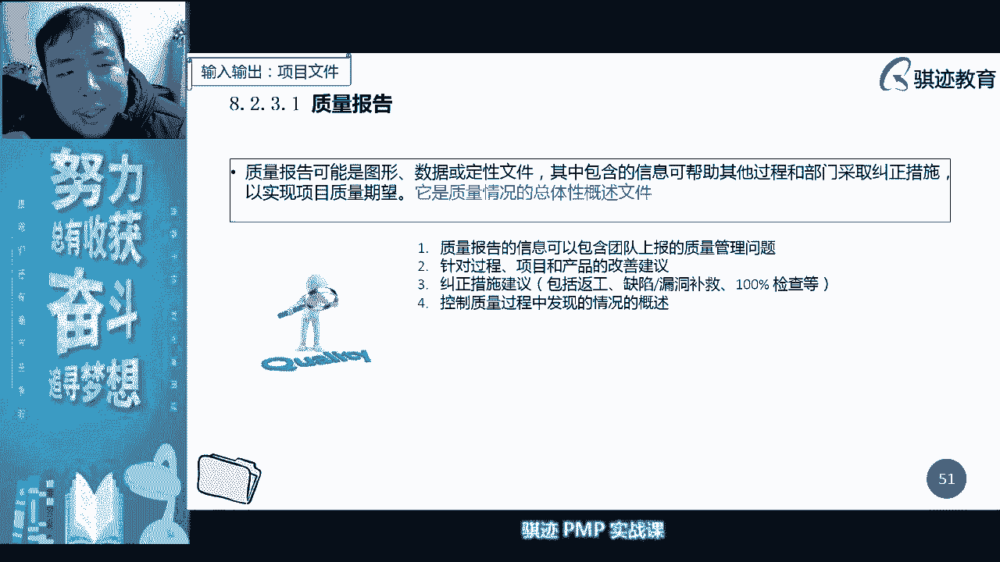

这是第一个，那么第二个质量的测试与评估文件呢，是我们第二个文件，这个文件里有我们所有质量测试的详细结果，所以如果考试问题，我们要知道当前我们的可交付物重量，大于1kg的比率是多少的时候。

我们应该看质量报告和质量测试文件的哪个答，案，是测试评估文件，因为它是具体的某一个质量参数的一个，详细结果啊，它还用于表现什么，我们的整体的质量目标的实现情况，比如说我们讲我们有100项质量目标。

然后呢，这一期当中我们实现了95%的目标，还有5%没实现对吧，我就这样详细写这些质量目标当中，甚至可以和挂钩，什么可以和我们的需求跟踪矩阵相挂钩对吧，ok这是质量测测试，评估文件和质量报告的一个区别啊。

这个一定要记住这个概念，考试有可能会搞区别的啊。

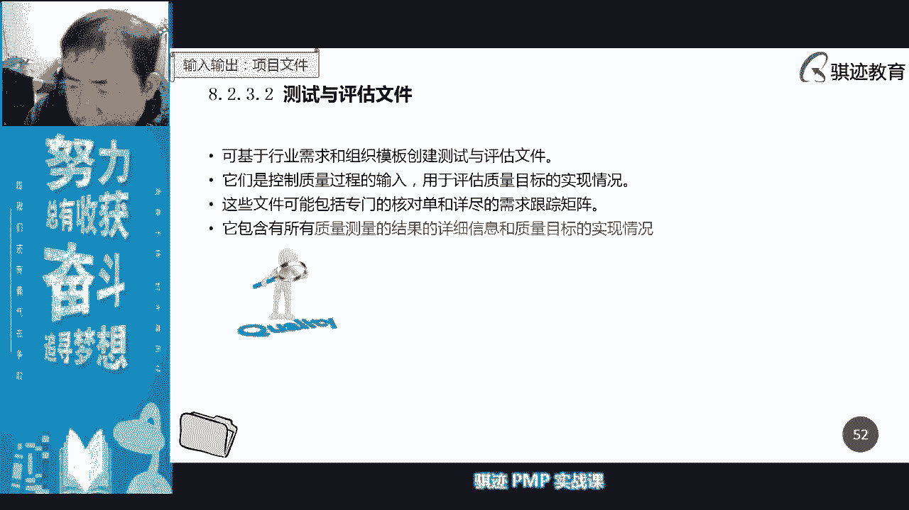

好到这里为止呢。

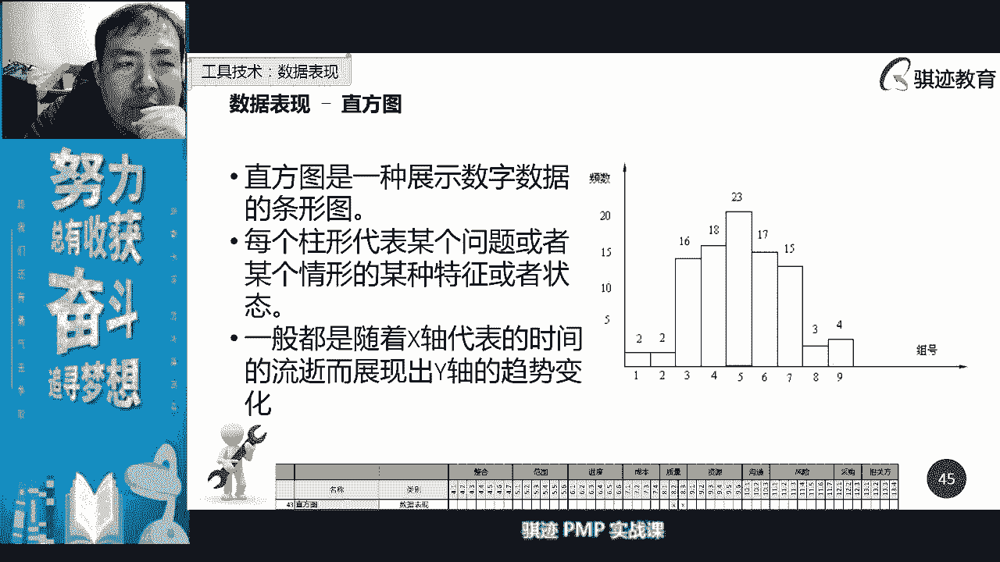

各种各种工具和方法啊，各种工具方法啊，大家都回忆一下，记得吧，根本原因分析的r c a report，大家给大家学过了对吧，过程分析给大家学过了对吧，过程分析里面主要有什么那个那个过程改进，对吧。

我们讲的精英里面会常用到一种叫做value stream，mapping对吧，价值价值流图谱对吧，然后呢我们在数据表现当中，因果图实传图，yy图，鱼骨图对吧，四个图都一样，用于表现什么。

我们的根本用于找到根本原因和主要原因对吧，记得吧啊流程图我们之前已经学过了对吧，就不再讲了啊，所以我们的社规划质量，设计质量当中我们会用到的，记得吧，流程图，因为流程图里面含有概率分支。

就是说如果是怎么样会怎么样，如果怎么样是怎么样，所以它会有概率分值，记得了啊，是上一节课讲的啊，直方图，直方图特点是什么，一般x轴都是什么时间，我们一般是表现什么，随着x轴是时间的变化。

我们y轴的那个参数和属性，质量的属性是怎么样变化的，对吧啊，矩阵图我们也学过了对吧，散点图会是想找关系积的吧，啊审计呢适用于看什么，看过程不看结果，注重我们的过程，不注重我们的产品对吧啊，记得啊。

然后面向x就是针对某些地方优化，有可能会放弃某些地方，而针对另一方面已经优化的，差异化的一个矢量设计，对吧啊，问题解决和质量改进方法p d c a对吧，好可啊，这些里边有大量的这些内容。

我刚才讲的所有的这些内容，记得通通要记住，考试都会考质量啊，那我再强调一遍，质量是除了范进程之外，考试当中最容易丢分的一个领域，因为专业工具多概念分啊，概念呢比较明明确啊，边界呢又比较明确。

但是呢分的又很细，所以很容易出错啊，第六版当中已经砍掉很多内容了，所以大家一定要拉好分啊，链接当中呢质量都是容易丢分的这块好，那么最后输出呢会输出，质量报告是整体的质量描述。

质量的改进措施啊等等一些东西的，而具体的我们的测试结果啊，目标的完成情况啊，看测试评估文件，ok啦，如果质量当中管理当中出现了问题呢，我们会进行变更请求，这种变更请求会是怎么等类型的变更请求。

来请打在公屏上管理检查当中，我们如果提出变更请求，我老是什么样的变更请求，加时间哦，来来来来，你这个ok啊，变更有哪几种类型啊，哎后面的同学有叫宋力强的同学啊，宋立强同学说的对的啊，主要是纠正措施。

还有一部分少部分可能是预防措施啊，非常好啊，ok啊，我看到宋立强同学是第一个说对了啊，很好非常好对吧，我们在管理质量当中如果出现了一些问题，是不是我们要进行纠正啊，所以会有纠正措施。

有可能他暂时没出问题，但是我们觉得可能会出问题，也有可能会少比较少的啊，相对比较少，一般情况下比较少的，可能会使用什么预防措施，预防以后会出问题对吧，缺陷补救其实比较少，为什么。

因为我们的可交付成果最终还没有被生产出来，曲线步骤非常的少，缺陷补救最常出现的是什么，后面的控制质量质量控制啊，ok啊，但是明白ok ok啊，确认不掉，所以你看我们偏僻的群当中。

很多的知识都是联系在一起的，不同的场景当中，变更请求是可能使用的是不一样的对吧，考试有可能会考到的啊，他可能可能给你个场景啊，告诉你说提出变更请求是什么类型，变更请求对吧，会有可能的啊。

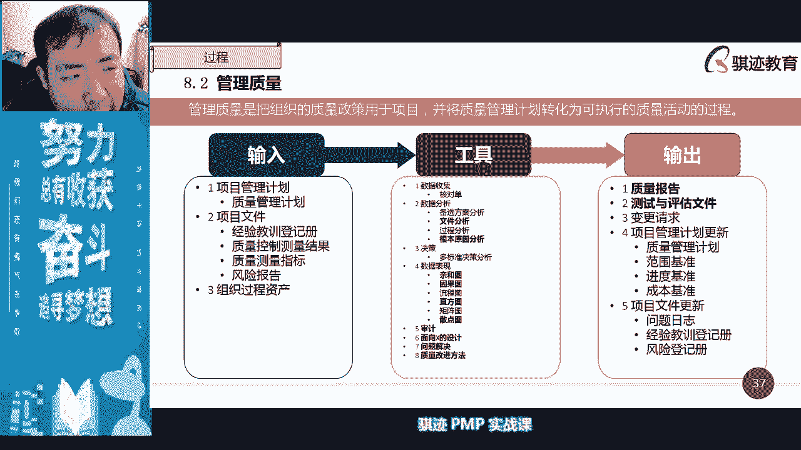

好那么我们管理质量讲完了，我们接下来讲控制质量，控制质量当中的点呢没有管理讲那么多啊，但是依然非常重要啊，要非常重要，那么控制质量目的是什么，控制质量到了控制质量这个阶段。

我们讲和管理质量的界限在哪里啊，可交付成果已经出来了啊，进入控制质量的一个标志，就是可交付成果已经被做出来了，最终做出来了啊，ok啊这这一点要记住啊，管理质量和控质量进行就，可交付成果已经做出来。

既然东西已经做出来了，还能改吗，不能改了，只能确定它的状态，所以我们在控制质量当中，做的最多的一个动作叫做检查，用于确定它的状态，明白了吧，同时呢控制质量是个控制过程组，所以它这个当中自然有所有控制组。

都应该做了什么啊，进行绩效评估，进行我们的啥啊，评估和测量和控制，然后看看达没达到我们的绩效啊，会是这样的结果，然后呢控制质量还有第三个工作就是什么，我们讲的控制质量有三个工作吧，第一个工作是什么啊。

或者你们记一记，我来给你们记一记啊。

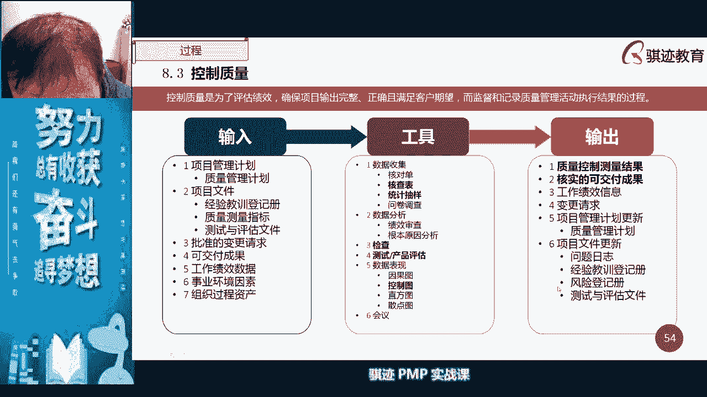

该机智啊，换机子，三个工作，好的三个作用，对可交付成果啊，成果碱性掉，我把它拱上来一点啊，对可交付成果进行检查核实啊对吧，输出什么啊，检检查核实输出核实的可交付成果对吧，这是第一个，第二个是什么。

绩效考核和结果的控制评审或者叫结构的评审，不要控制吧，结果评审对吧。

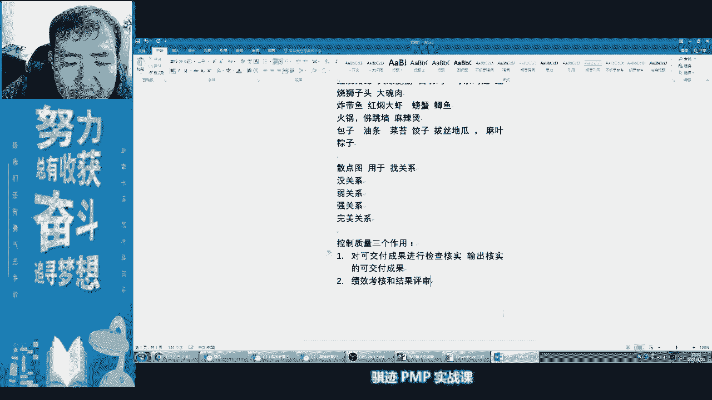

第三个是什么，第三个是吧。

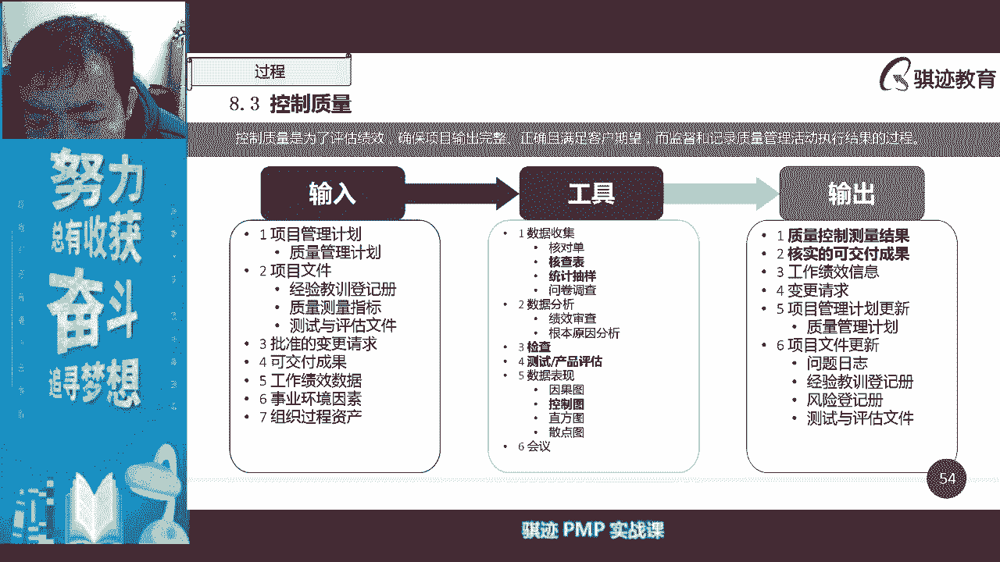

啊第三个啊，当然我把这个合并进去对吧，合并进去，第三个是什么啊，应该是呃对于未来可交付呃，呃可交可交服务，嗯生产过程进行改进建议，这是这是它的三个主要的工作作用啊，当然你也可以把可交付成果的检查和输出。

和什么这两个可以分开。

因为一个是啊属性检定，一个一个是我们的结果交付啊，都可以啊，这是我们的啊控制质量的三个主要的作用，三个主要作用，ok啊，这个要记住这个要记住，那么我们一个一个来看一个看好吧。

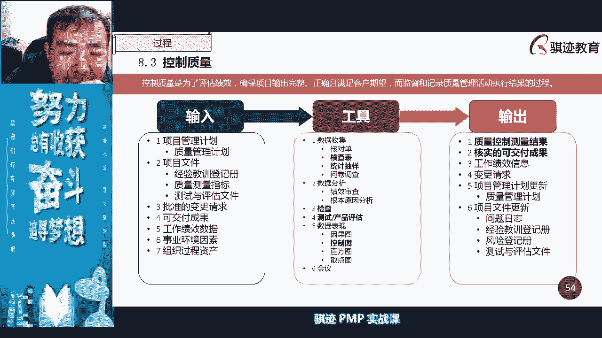

好我们控制栏当中呢，我们会使用一个东西叫合渣表，叫做checklist，check check list，check table啊，这个呢就叫技术表啊，这个大家一看就知道了对吧。

这个表一看就不用不用讲了啊，那么用于用于收集潜在有关于质量的数据，这些问题啊，在p波和第五版当中常常使用帕雷托鲁来表示，我们将帕雷托寻找主要原因对吧，ok啊就在第五版中已经不用了。

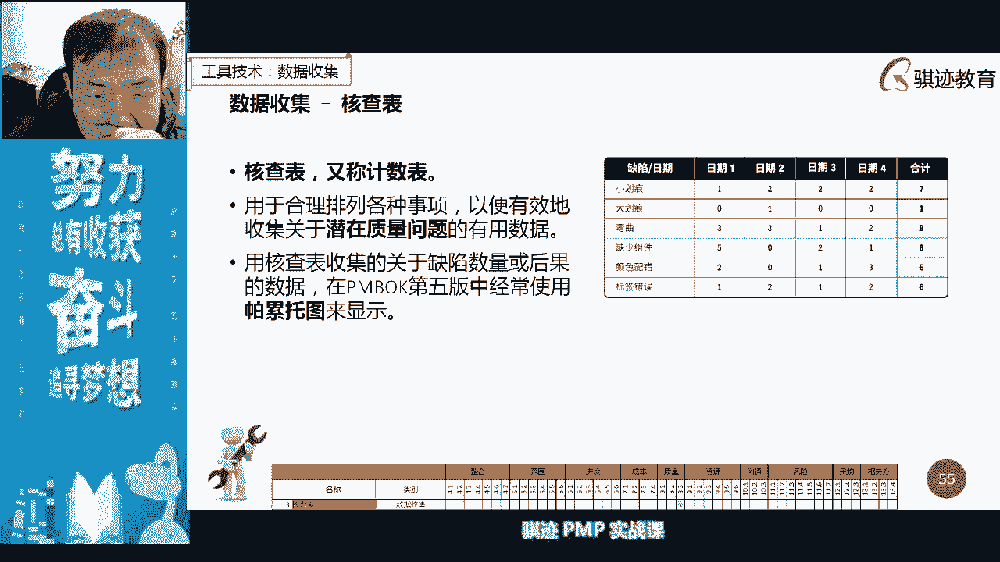

ok啊pass了啊，所以大家只要知道checklist这种东西就可以了啊，第二个呢叫做抽样统计，当可交付成果非常多的时候，那么我们会从可交付成果当中呢，抽取若干个可交付成果，那么超级多高的。

要么做用什么，用样本代表整体，只要你抽取的过程足够科学，就可以使用样本来代表整体，用于测量和确认质量。

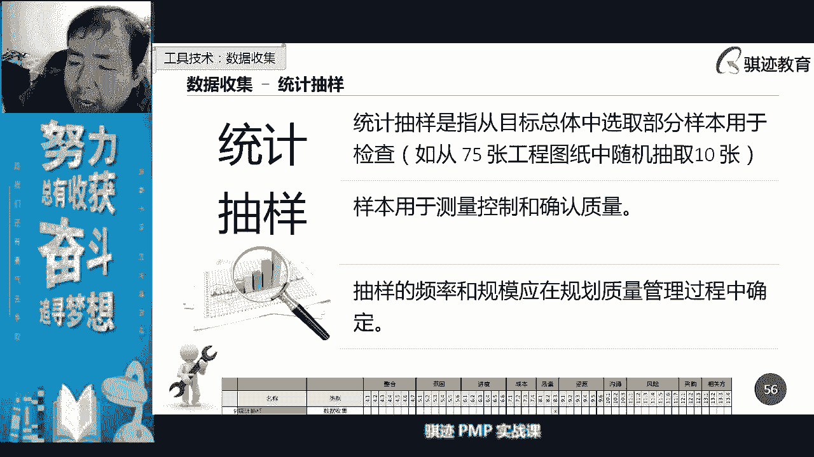

测量确认质量，啊，所以我们最常用的呢，空纸箱当中最常用的工具叫什么检查好，所以我们再回忆一下，我们讲前面讲的管理质量叫什么，college management，它当中的主体是什么。

quality assurance，q a对吧，q a那么事后的呢叫qc，所以一个企业当中往事前的检查叫q a，适中的检查叫q a，事后的检查叫qc啊，记住啊，q a q c。

那么qc呢叫quality check啊，quality control啊，check and control，那么检查是指检查的标准啊，所以我们注意，如果我们要使要进行q check的话。

要进行检查的话，那么我们要遵循什么，我们要遵循我们的质量管理计划当中，所规划的检查的手段检查的哦，我们的质量的参数，它的标准，它的检查方法，以及它的一系列合格不合格的一些标准，要遵循这个东西来的啊。

所以检查不能是随便检查的，我们所有的检查必须遵循质量管理计划啊，这相关的句话，所以检查可以是单个活动的结果啊，或者是一个什么控制账户结果，甚至是整个项目的最终产品都可以做检查啊。

都可以从小到大都可以要求检查，只要它被最终生产出来就可以啊，所以叫最终生产，就是后面不再有生产加工过程了，那么就参观了最终生产过程啊，检查也可以称之为审查，同行审查，审计和巡查，ok啊。

那取决于不同的场景对吧，审查就在这检查审查就可以了，同行审查呢是什么，要进行交换审查往往是在什么写论文，比如说有同行审查对吧，还有审计是请第三方审查，巡查呢是指什么，会有巡回的定期的检查。

所以这些术语呢可能会定义具体的定义，使用范围，ok啊，我们这里就不做信息解释，pmbok呢也不会考这么细啊，p m p不会考这么细，那么我们会使用到一个什么东西啊，叫做产品的测试评估啊。

这个东西很有意思，产品主要测试和产品评估参上有些同学啊，上次在问一个问题问我的时候，然后问他一道题目的时候呢，我觉得哦我觉得我也忽略了这个东西啊，但是它有一个非常细分的概念，什么叫做检查。

什么叫做产品测试和产品的测，产品的评估，它是有一个什么东西啊，有个区别，那么如果我涉及到的是产品评估和测试的话，它是一个什么有组织的结构化的调查啊，什么叫组织结构化的呢，我们前面叫审计上的是不是讲过了。

它是有预先设定好的流程，不允许你有随机性，不允许你有主观性，按照预先设定好的流程，一步一步一步一步，按照客观逻辑，客观性进行调查的结果，那么它主要的目的是什么，找出产品和服务当中的不合规的。

注意是不合规的，不符合我们质量规定的那些东西，而这些东西它主要针对的是什么，针对的是产品，针对产品啊，而我们的审计，那它也是结构啊，但是它针对的是什么，针对的是什么过程啊过程。

所以产品评估和整机的区别就是，一个针对于产品，一个针对于过程，虽然他们都是结构化的调查，但是一个是针对产品，一个是正确过程，而检查呢是更加泛化的，他只要用技术手段去确定我们的状态就行，他可以不用结构化。

只要知道结果就行对吧，我举个例子说什么，比如说我们要知道一个苹果甜不甜，什么叫做检查或测试或者产品评估呢，我把这个苹果什么切开榨汁，然后把这个苹果汁用糖分仪去测对吧，那么如果什么叫做检查呢，口咬一口嗯。

甜的就行了对吧，那么什么叫做审计呢，我不关心他苹果甜不甜，我就关心什么，这个苹果在生产过程当中有没有打农药啊对吧，有没有什么上面涂了蜡啊，知道大家知道吧，现在很多苹果为了好看上面的涂蜡对吧。

ok啊诸如此类好，这就是产品测试评估检查和审计的一些区别，不知道大家明白了没有啊，这是一个非常小的区别点啊，我希望考我见到考试呢几乎没怎么见到过啊，但是也确实有可能会考到，但是概率比较小。

ok啊当然小贵想大家如果碰到的话，就拿到一分是一分啊，评比考试都是这样，只要拿到一分就是一分，每一分都抓住了，你肯定能通过对吧好，所以我特地讲了讲嗯，有任何的万一有任何细节细节的地方都会跟我。

都会跟我进行交流，有可能有些细节呢，我在上课过程中也可能我忽略了对吧，我们要给你们去强调也有可能的啊，好这是测试评估检查和审计，我们将之前的一些区别啊，今天有区别，那么我们在质量控制当中。

会使用的唯一一个特别的图叫做控制图啊，控制图ok请请给我，请大家跟着我看啊，控制图是怎么画的啊，控制图就会涉及到我们前面上节课讲的，一些知识点啊，但是很有意思，啥意思。

控制图是管理质控制质量当中最重要的一个图，也是最直接考的一个图，但是管理质量控制质量当中有其他的一些图，有的啊，但是最主要就考这个，那么这个图是怎么画的呢，首先控制图会有一个上界和下界，大家看到了啊。

那么首先第一点上界和下界是怎么定的，大家记得我们上一节课讲的吧，呃上界和下界是啊，有我们上节课讲过一个概念，就是什么一个组织的质量政策，一个叫做客户的质量期望，一个叫做我们的质量的平衡点，对不对啊。

那么这些东西综合起来就会制定出一个边界，所以上界和下界应该满足，在实际工作中应该满足什么东西啊，组织的质量政策和客户质量期望，熟严苛的那个点分别在上下啊，分别在上下，比如说组织的啊。

质量某一个针对于质量的某一个参数，它的上下限分别是100~80，客户呢可能是什么客户，可能是呃105到什么，到105~85，那么你应该取什么，你要同时满足客户，那你只能取100~85。

因为你取任何其他的区间段，是不是都可能会超过一个要求最严苛的那个啊，不知道大家有没有啊，好我我给大家写一下啊，有可能有些同学没反应过来，比如说组织啊往外拉拉下来点，那组织要求我们在控制图中。

对于某零部件的重量，组织的质量政策要求，100~80，那么客户的期望，105~85，那么你怎么取才能够动满足啊，只有取，100~85才行吧，这个区间取任何其他的区间，是不是都要么违反组织。

要么违反客户对吧，这个100多把手正好取的是组织与客户当中，最严苛的那个区间，或者他们的交集，对不对，最严苛的交集啊，对是相交的部分对啊，ok啊是相交的部分对也是最严苛的那部分对吧，同时满足对对对。

对对对，非常好。

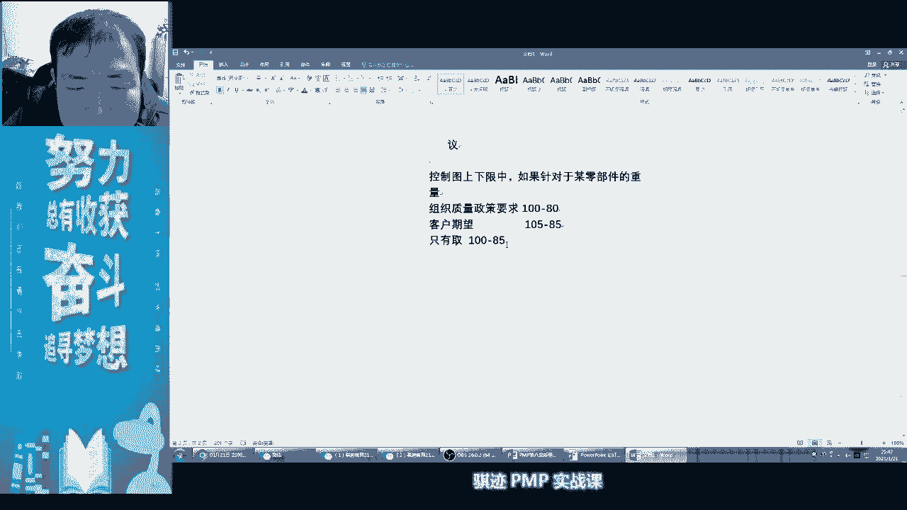

你们的理解都很好，ok啊好，那么取了上界之后，在取得下界之后呢，大家看到吧，一般这个中心现在我们取的是中值，一般情况下啊，除了另有特定行业说明以外，一般我们取的都是中心中心值，比如说上面是九呃。

100下面是80，那么中间就会取一个叫90对吧，然后呢我们的某一个某一个值呢，质量的值呢就会围绕这个值波动，对不对，所以在控制作当中我们会有两种状态，第一种状态叫什么。

当我们的质量的某一个值直接超过了上限，或者超过了下界之后呢，我们称之为什么什么东西啊。

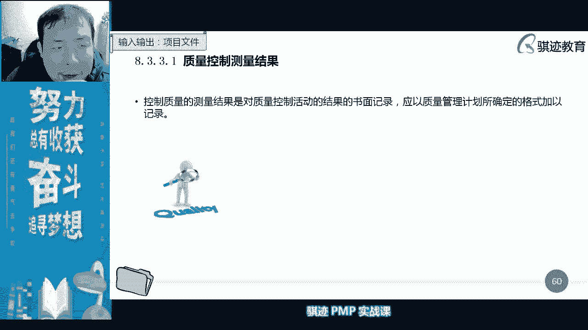

称之为第一个，称之为什么失控啊，失控失控，我们说超出了上下啊，上下限，直接称之为失控失控啊，超长，这是第一种情况啊，所以我们在图上可以看到啊，这个我们在图上在这个图当中。

大家可以看到这个当中这个点是不是就时空啊，对不对，ok这个点就是一个施工，所以超出了上界失控了，如果他在这里呢也是失控，这是第一种情况，第二种情况是什么，当有七个点连续落在一侧的时候，那么就代表着什么。

它的整个生产过程存在一个东西叫做异常异常，那么异常当你存在异常了之后呢，那么就意味着什么，我们的生产过程存在失控可能，但是我们的产品在这异常的七个点的，产品本身是不失控的，但是整个生产系统存在失控。

可能只能说生态施工可能需要进行检查啊，所以控制图会产生两个状态，第一个状态叫做失控产品，单个产品直接超出相衔接，那么它会产品失控过程呢也肯定是失控了，因为它生产出次品了嘛，对吧就失控了。

第二种呢是当单个属性连续七个点在一侧，要么偏高，要么偏低，连续一侧，但是它偏高偏低，不是说就是说比如说他偏低，比如说在一直在往中线走，是不是偏低也一样，只要在一侧就算啊，连续七个点在一侧。

就算是异常异常的情况下，它的生产的产品是不失控的，但是它的系统存在失控风险，明白我意思吧，存在失控风险好，我们在这里，我们在ppt上写一下，连续七点赞中直线啊，一侧称之为过程失控，但是产品质量本身。

我一定，产品和过程都失控啊。

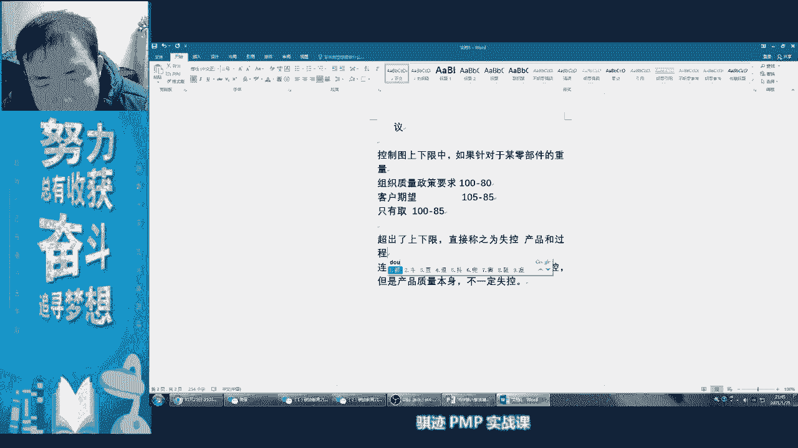

ok啊ok明白了，他会有这样一个概念啊，会有这样一个概念，这叫七点原则，七点规则啊，这起点规则，ok 7点规则第二条，七个七个点连续上升和连续加，ok啊，同学们，这个规则现在的第六版当中，你不用啊。

这个是原来的p p t当中啊，原来p上这个这个已经不用了啊，这个位置已经不用，只要七点就行了，好好，那么大家都明白了，那么又来一个问题，如果我发生了七点异常，那么我会在第几天知道出现第几起点异常。

第八天注意啊，只有你在七天活干完了，在第八天去检查的时候，你才知道，所以如果我要确定七点异常，至少需要八天在第八天才能知道啊，这要注意啊，是考试已经考到过啊，这个很好，反正很有意思啊。

好那么这就是控制图的作用，一个是判断失控，一个是判断异常对吧，那么实践当中，我们一般呢控制界限呢会在上下三个西格玛，什么叫三个加西格玛，三个西格玛是99。76对吧，就是说我们说我们上啊上节课啊。

上上上上节课，我们是不是上过那个最乐观最悲观，那个记得大家记得吧，三点估算当中最乐观最悲观，那么所谓的三个西格玛的位置，就是说什么上届是最乐观位置，下面是最悲观位置，然后以它为作为极限，一般是这么设。

但实际情况是我刚才讲的，要根据组织的质量政策，和客户的质量期望去定的，啊啊啊就是他们的交集对吧啊，是这样，然后呢，在实践当中有一点就是实践当中有不同的行业，它不一定是执行不呃，不一定是执行七点规则。

有些行业是执行三点规则，比较严苛的行业会执行三点规则，有些行业会执行四点规则，pm呢是按照最通俗最宽泛的要求，执行了七点规则，在实践当中，要根据自己行业和自己项目的相关规定去执行，明白了吧。

起点规则是pmi通用规则，它是最宽泛的啊，有同学问不是第七天吗，因为你第七天还在干活，你怎么知道是不是失控啊，你要第七天的活干完了，在第八天去进行检查的时候，你才知道是不是失控对吧，所以需要八天啊。

是在低洼填上一侧，有些同学说啊，到如果抄就是说在边界线上是算的啊，是算的是算的啊，在边界线上是算的，所有的线上都是算的，就是线上算合格，线上算是空啊，那么一般来说呢不会在线上，如果在线上呢。

一般啊我sorry sorry，我说错了啊，我表达不清啊，sorry我不就所谓的我们先讲一点，如果是上下界超界，我们将直接失控的，这如果定义直接失控的话，在上界和下界的这条线上的话，是不算失控的啊。

正好在边界上不算失控的，那么如果我们说7。1长的话，在中心中心中间线上的线上的点是不算的，它是算正常的，知道吧，他一定要在单边出去一点点，哪怕出去最小的一个单位，那么也算是在一侧的。

明白了吧啊就这样一点啊，但是这个呢不会考那么细啊，考试一般不会考那么细，一般不会考这么写，我觉得考试老师没那么无聊，也就是说他要连续连续七个点在中线一一边，至少多一个最小单位或者少最小一个单位啊。

这是控制图，控制图是光控制指南当中经常喜欢考这张图啊，所以你们一定要理解考试经常喜欢考，但是它不一定用图啊，它有可能用文字描述形式，其实考的控制图也会有的啊，那么你看到它看它是不是超界了。

一个质量是不是超界了，是不是稳定，那么它的描述当中如果有超界啊，是否稳定啊，是不是失控啊，这些东西你没有想到他可能在考的是控制图啊，ok我明白了没有好，那么最后呢我们会输出一个文件。

叫做质量的控制测量结果，那么它是以书面的形式记录，我们的质量控制测量结果，然后呢以质量管理计划所规定的形式加以记录，啊，啊最后呢我们在控制质量当中呢，如果通过了控制质量，也就是说通过了我们的内部验收。

我们就出了何时可交付成果，那么我们上节课也讲了内部验收，通过控制质量有个什么特点啊，我们是根据自己去制定的，客观的详细的我们的质质量政策，我们的质量测量的方案去进行质量测量结果的，它是客观的。

但是到客户验收去确认范围的时候呢，客户是根据主观的，以商业目的为最终导向结果去做验收的，所以这两个的影射往上次讲的是要注意的对吧，质量测量指标和客户的验收合同当中的。

客户验收标准应该是有完全覆盖的对应关系的，否则会出问题啊，我们上节课讲过了对吧，记得不知道大家记得没有啊，质量测量指标，我们的质量测量指标，质量政策啊，我们的怎样测量结果，应该和客户要求的确认范围。

所要求的合同当中所定的，我们的验收标准相对应，能够覆盖掉它，那么就能保证我们只要我们这里通过了，客户那边肯定能通过很多项目出，最后出出篓子就出了什么，我们觉得我们ok的交到客户那里了，就不ok了啊。

就o结b k了啊，好，这是最后我们质量管理知识领域的一个总结啊，我们通过我们的项目章程，项目管理计划，需求文件呢去输入到质量规规划，质量得出我们是吧，质量管理计划啊。

这其中当中其实这个这个ppt是不够完整，其实还有一个很重要的东西叫什么，合同当中对于质量的我们的合同，商业文件，合同当中对质量的要求去形成一个我们的规划，制定出我们的质量管理计划。

制定出我们的质量测量指标，然后进入实践实操环节啊，执行环节管理质量，然后通过各种各样的测试呃，呃通过我们的审计啊，通过我们的检查啊等等一些方案，然后呢最后得出什么，我们测试评估文件和质量报告。

然后呢纳入到我们的管理质量当中，得出我们的质量测量的控制啊，控质量控制的测量结果或者是改啊，我们的质量的啊变更请求啊，然后呢如果最终通过了控制质量当中呢，最后的内部验收。

那么我们就会得出一个什么合适的可交付成果，交给我们的啊，确认范围，这就是我们的质量当中的主要知识点啊，但是主质量当中有个难点，什么质量当中很多的概念呢比较专业化，它和质量管理呢密切相关，比较专业化。

所以大家呢回去呢，pm博客呢还是要好好细细看一遍，pm博客的第六版，所以大家一定要细细看一遍，这部分东西是很容易丢分的好，那么我们课程当中就上到这里，然后呢我们客户当中呃，如果有问题呢。

我们会继续进行一些讨论，然后我们今天的课程，第一道，在现代质量学者提出全面的质量观念之前，对质量行业的传统看法认为是什么，第一道请告诉我，第一题警告说，啊非常好啊非常好，有同学选c啊，非常好啊。

只要用了足够多的质检人员，错误就不会发生，这当然是错对吧，质量是个事前和事中的过程，事后只能去确定对吧啊，就就就像就是什么你你要确定你对不对对吧，你检查100遍，你错了还是错了，对吧啊，错了还是错的好。

用足够多的质检人员，用足够多的检查并不能改变质量的结果，并不能改变错误的发生，对吧，好很好，非常好，选c啊，第二道质量的等级和质量的等级由谁来决定，第二道，第二道题目，ok第二道题很简单啊，ok啊。

啊第二第二道选题啊，为什么有人选d呀，啊我我我被吓到了啊，为什么为什么会有人我也选d啊，第二道当然很简单，但要选也选c啊，ok第二道是选c吧，很简单呀，质量的等项目的质量和等级由项目经理决定。

客户可以制定我们项目的验收标准，但是过程质量怎么样是有项目，就像说我们讲举个就是做那个做桌子的事情，对吧，客户期望是5年，我们可以做20年吧对吧，所以最后的等级和它的质量，是由项目经理确定的对吧。

记住做锅的那个事情，5年10年和20年，为什么郭子要做成20年，对吧啊好，第三道，第三道，第三道下面各项都是质量审计的啊，一些动作，除了那个a确认实施变更p站变更请求，b验证过时修复。

c决定低效无效政策，dog决定项目是否符合组织政策，第三道选什么，ok啊，第三道的话我们的ppt嗯，有提到过啊，有提到过第三道选什么，诶第三道就不活跃了对吧，因为第三段好像动动脑子啊，前面都学过了啊。

第三道这种题目在老版本就是这个优势了啊，第三道如果如果是新版本，我跟你说，如果是有多选题，你们会死的更惨啊，会死的，刚才那么第三道一看就知道啊，a b c d都出来了，对吧啊ok啊。

第三道一看就知道应该选c呀，为什么政策是你审计能决定的吧，审计只能说什么啊，看看你有没有执行政策，符合政策对吧，那么质量审计看看有没有确认实施，已经批准名，跟女教师干嘛，有没有遵循质量过程啊，有没有啊。

对吧，就是实时批准变更请求吧对吧，这是有的啊，所以a是有的，a是有的啊，那么第二个验证过时修复有没有啊，当然是有的咯，审计当中我们看看有没有把呃，有没有遵循什么质量的缺陷补救，这样一些动作对吧。

这也是质量过程啊，也是过程呀，验证修复对吧，有没有去执行验修复，这个过程是不是也是验证过程啊，有的啊，c决定低效无效政策，低效无效政策是不是低效和无效是由组织决定，不是由我们你的项目的质量审计决定的啊。

所以c肯定不对，第一决定向我们活动是否组织组织政策，当然这这当然是对的啊，看看你是不是活动是不是合规对吧，我们说组织要求这个这方面质量当中，我们将不允许出现不合格品。

但是你的项目的规划活动当中出现不和平，是不是不符合我们组织要求啊对吧，所以a b c当中一看就是什么dc是不对的啊，c是不对，所以正确答案是选c，除了c对吧，注意啊，好第三第四。

下列哪项叙述质量成本是最佳描述，诶，它会自家苹果成本在其他地方节省成本，第二它会增加预防车门就在前面，c它会增加外部示范成分，检测下成分，第一才会增加内部示范成分，节省一下成本，最佳描述。

所以第四道应该做什么，一目了然，请告诉我，啊居然还有人选d，居然还有人选题，我觉得这位同桌啊，那位同学啊，临满之后，那位同学肯定是打错了啊，我觉得你敢打算，你真的是认为是迪吧啊还有位同学选a啊。

这当然选b的，我不想哪种成本是最好最值得花的预防呀，最越往前面的成本越是不是越应该花的对吧啊，预防成本是最值得花的，那么接下来是不可，我们想预防成本是最佳的，成本应该多多的在预防上面花。

可以挤上其他成本，那么评估成本我记得p p t写的吧，评估成本是不可避免的，但是要合理使用，那么外部内部失败成本呢啊尽可能的避免对吧，尽可能避免对吧，web是不是web是本来不应该有，记不记得啊。

好我们继续看啊，这道题我选b啊，不应该选其他的不应该了啊，第二个啊，第二第五道，第五大设计，六氪设计六西格玛可以有效的优化客户体验，降低成本，改进质量能做到方面，这是哪种技术的体现，丢了。

cba还缺一个d，我们就齐齐活了对吧，哔哔哔滴滴滴滴滴，ok啊啊非常好啊，我看到大量同学都选b啊，你们都是错的哈哈，只有一位那位曹自身同学对吧，他是对的啊，后面有一个王仲秋，他也是对的啊，选c，你看呀。

有效优化客户满意度，降低成本，改进质量，这不是面向x设计吗，你被六七个把这四个字带偏了，对不对，对不对，你看他的描述是不是面向x设计啊，提高客户满意度，降低成本，改进质量，是不是面向x设计，对不对啊。

这道题目明显应该选c嘛对吧，你们你们被六西格玛这四个字挖进坑里了，对吧啊，选c啊，有没有意见啊，没有意见吧，设计六西格玛，而且人家写的是设计六西格玛啊，人家不是说六西格玛可以，人家去设计六西格玛对吧。

当然这个有点字面挖坑的意思啊，当然表达的很清楚，这就是面向x的设计嘛对吧，人家已经写的很清楚了，好那么后面的第六大对吧，应该是第六大，好，抽样统计方法，可以确定项目的某些元素是否符合需求。

最大的优势在于什么啊，这道题目一看就知道了，第六道这个东西呃，一看就知道了，第六题应该选什么，啊选c对吧啊，没问题啊，初中统计最好方法是什么，只样本可以代表整体，无需100%检测嘛对吧。

但是抽样有没有说什么，低于1%可以精度的，这个不一定的啊，但是肯定无需百分之百检测，都可以得到满意的推论对吧，这个选c没问题啊，好那么啊sorry啊，那么后面第七道，也是一目了然吧，第七套，快进来吧。

控制的人应该有帮助吧，最后一幕有没有控制住，我们讲一个叫失控，一个叫做什么异常对吧，这个里面提到异常吗，没有，那么就看是不是失控了对吧，过程是否失控对吧，结果是否失望，结果是不是不合格对吧好。

那么就是选b对吧，这很简单啊，第八道，啊这个很简单，没有人选错对吧，第八道，为了表达质量目标的实现情况，项目经理可以用哪个文件汇报啊，质量目标的实现情况，哎呦你们是选的第七道的笔还是第八道的笔啊。

我看一下啊，诶诶诶诶诶诶诶诶诶，我就知道我就知道你们这些人的来了，我你质量目标的使用情况是一种什么，是一种对于质量结果的详细描述，这个应该是在测试与评估文件里的啊，你们都错了，选a的都错了啊。

第八道应该选b啊，测试与评估文件质量报告里是什么东西啊，质量的总体状况和他的这趋势已经改进措施啊。

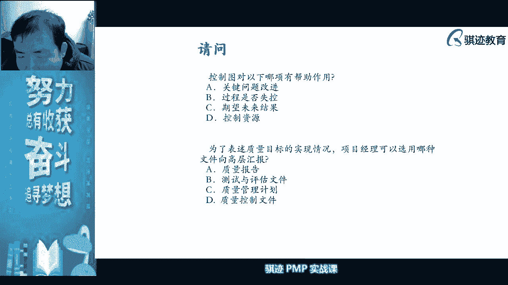

我们来看一下啊，那那那你们这些人呢，来来我们看一下啊啊啊啊啊那个。

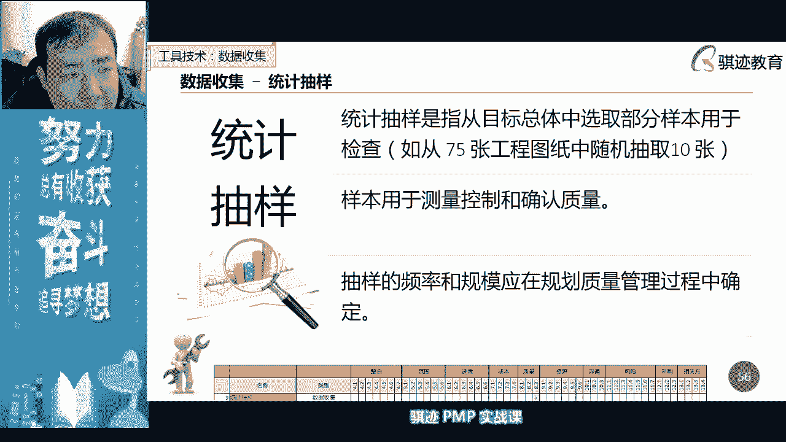

看到吧质量目标的实现情况，看到吧，和质量目标的实现情况，看到我特地给你们写了一句，用于评估质量目标实现情况，看到了我特地在这里给你写了一句，看到了吧啊有些东西还会错啊。

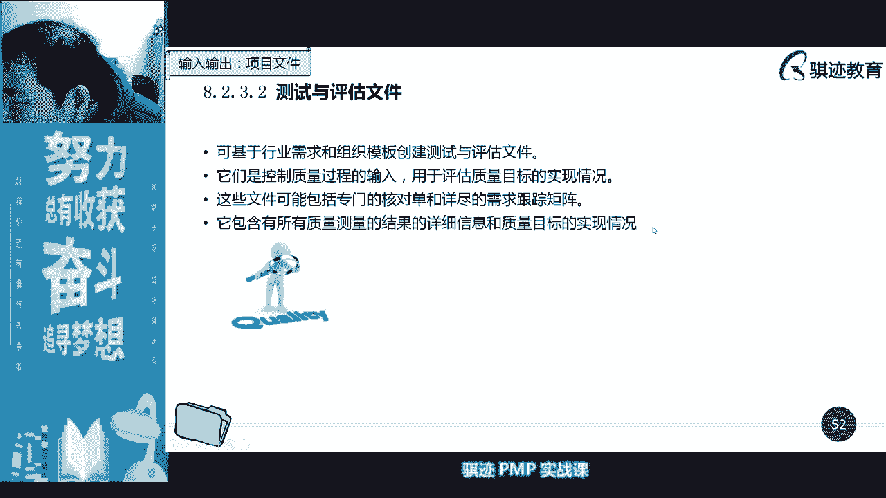

我们再看质量报告，什么质量总体上方的概述信息，概述信息对吧，它是图表数据和定性文件。

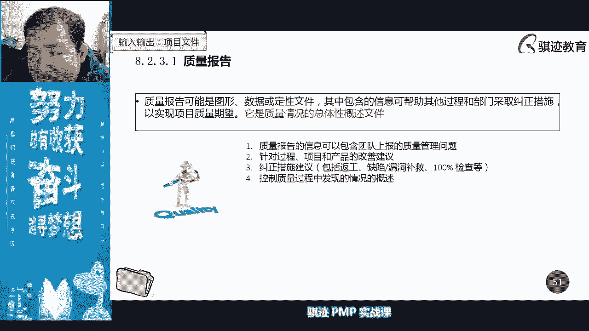

明白ok啊，对对对对对啊。

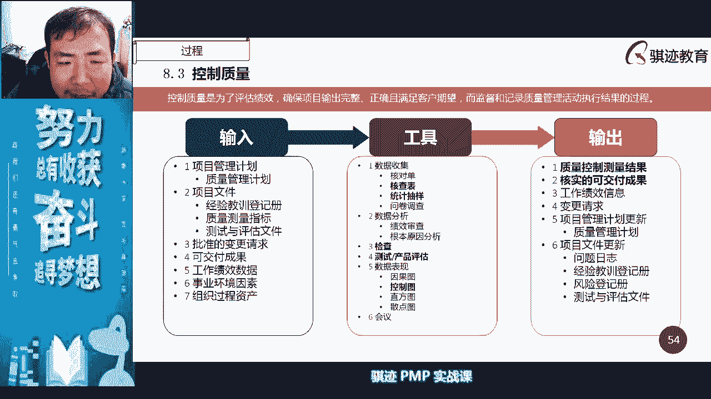

这位同学的思路就清楚了啊，明白了啊，ok啊，我们来看最后两道题目，第九题，第九题，标记一下题号哦，好好好标记下题号，这是第九题，第九题啊，第九题代名倡导的是什么东西啊，啊请大声告诉我。

这道题目也很简单吧，ok我下次编一下题目啊，下次编一下题哈，ok ok编一下题哈，ok啊，啊c持续改进pd c a对吧，持续改进对吧啊p是pen d是delay，c cancel啊，a是apology。

对吧啊哈哈，ok这不会有错的对吧，ok啊pd c记住了啊，这是老师讲给你们段子啊，这是p d c，这个这个段子是项项目管理圈子里面，大家经常用来经常用来开玩笑的一个东西啊。

pdc所以以后如果你们讲出这个段子，说明什么，你们已经在圈是圈里人啊，最后一道题目规划质量管理输出了质量测量，质量的结果，哪个不是质量测量指标结果的一个内容，规划质量当中我们输出了质量测量指标啊。

不是结果，所以我说错啊，质量测量指标哪个不是质量测量怎么样呢，里边的内容啊，第十道哪个不是它的内容啊，呃诶非常好啊，ok啊ok非常好，你们都学的这么好吗，ok啊非常好啊，那我挺开心啊，这道题挺开心啊。

质量测量指标里面没有描写，如何实施组织的质量政策，因为这是质量管理计划等等东西，对不对，所以这道题明显应该选a，第十道应该选a啊，非常好啊，第十道明天应该选a对吧，他其他都有，是不是质量在外面。

首先是描写我们有哪些指标，它的属性如何，第二季想要了解什么，我们怎么样去验证它对吧，第三个它是怎么样去定性的，准时性，故障性，可用性，预算控制性等等，这些东西都是指向测量指标的内容，对吧好。

那么今天我们质量就上到这里了啊。

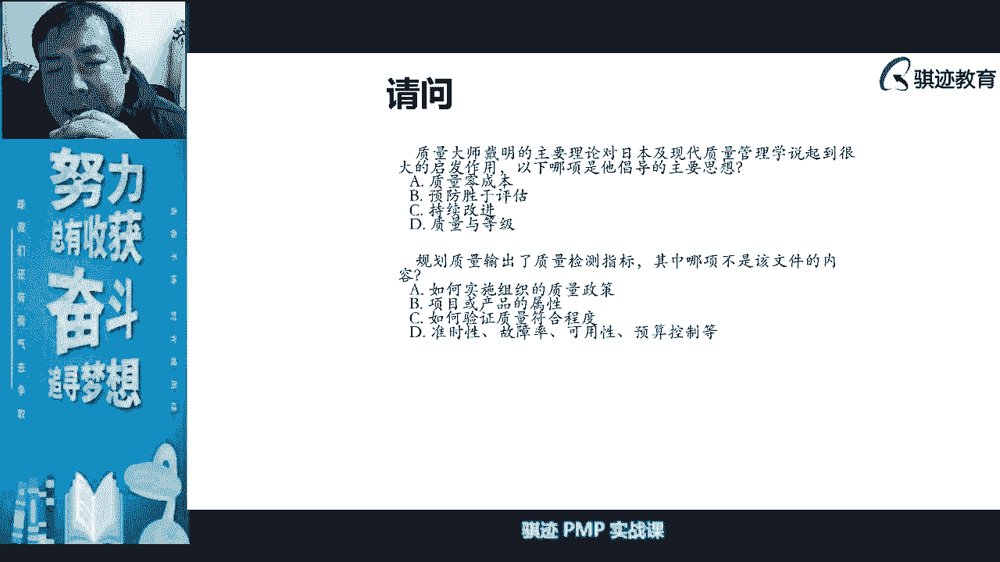

ok啊啊，虽然已经越来越到年底了。