# PMP认证考试课程最新完整免费课程零基础一次通过项目管理PMP考试 - P26：PMBOK第六版 第九章项目资源管理-27 - 骐迹PMP - BV1Sb4y1f7Yt

签到成功对吧啊，签到积分加一对吧，好那么今天的课程正式开始啊，啊今天上课之前跟过来跟大家打个招呼啊，我这两天人状态不太好啊，大家可以看到明天胡子没有我的，但是我是我是故意的啊。

我故意留了一个硬汉胡子形象对吧，ok啊但是人的精神状态不太好啊，但是我会尽量用最好的嗓音给大家啊，我有点感冒，放心，我不是新冠，我觉得我肯定不是新冠，我是新冠，没关系，我们家里不是六级网络。

不会把病毒传给你们，ok啊，我们开始上课，正式开始上课，同学们啊，没有签到的签到啊，资源管理是在pmbok第六版当中呢，是被称之为资源管理，在pmbok第五版当中呢，会是被称之为人力资源管理。

那么大家可以顾名思义可以听到啊，可以也可以这理解，那么在第五版和第五版之前呢，pmi呢是没有体现出，就是说对于实务管理和设备，资资产管理这方面的内容的，然后在拼搏和第六版当中呢，他终于认识到了啊。

不仅要管人，还要管钱对吧，还要管物啊，所以他就改名改成了资源管理，所以呢在篇博客的第六版当中，资源管理这一章呢内容呢稍稍的啊，呃子过程呢稍稍的做了修改，做了修改和合并，做了修改合并。

但是大体上还是差不多的，还是以管人为主，因为作为一个项目的管理者啊，主要还是管人，在资源方面还是管人啊，所以在这个章，在这个章节当中的知识领域当中呢，大家会学到很多的关于管理方面。

尤其是怎么管人方面的各种各样的技巧，会给大家分享一些我所能，我所知道的一些技巧和一些概念啊，所以这这一章节当中能够学到东西挺多的啊，不仅仅是应付于考试，而是对我们工作就会起到很大帮助啊。

好那么首先我们来看一下，那么资源管理就是管理好食物资源对吧，有效分配好食物资源，然后管理好人，组建好团队，管理好团队，差不多是这个意思，那么在现代的资源管理理念核心当中呢。

团队呢应该由特定的角色职责所组成，然后为项目目标共同努力。

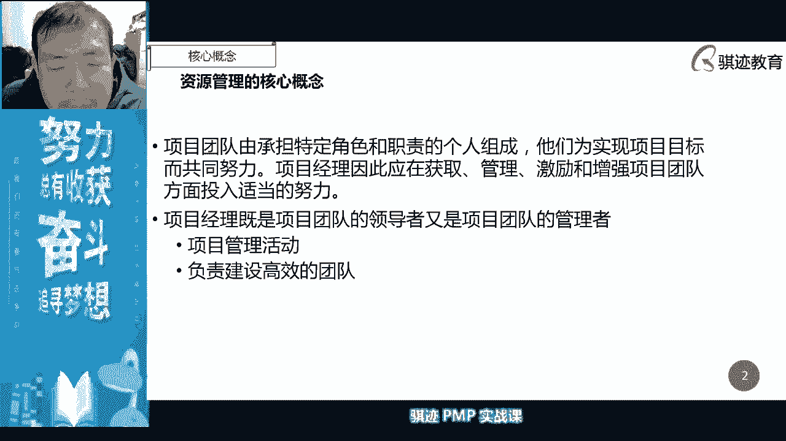

然后呢，我们要进行高效的团队建设，和项目管理的一些活动，所以在新兴实践中，我们现在会有各种各样的资源管理方法啊，资源管理办法，所以资源管理这章越来越趋向于，和人力资源管理上hr那那方面。

human resource那方面的理论呢相靠近，好我们在项目经理，作为一名称职的合格的项目经理，在资源管理这方面，尤其体现出项目经理作为一个管理者，他的情商啊，领导力。

影响力是对资源管理非常重要的方面啊，虽然我们讲领导力和情商的影响力这些方面，各种各样五大能力等等等，这些方面啊，是在项目经理的角色这个方面我们描述，但是起到最大作用的是在资源管理上。

因为资源管理最最关键的管的还是人，管人是不能用机械的方法去管的啊，管管的，那么首先我给大家在讲课之前，我先给大家讲一个概念，这个概念是书上没有的，那么我先问大家个问题啊，我以前一直上课。

一直问很多人问题，你愿不愿意被管理，你愿不愿意被管理，你愿不愿意被领导，如果有选择的，如果你有选择的话，你是愿意被管理还是愿意被领导啊，这个问题我可能都有问过，但是资源管理阶段就非常明显体现出。

就是说我们总是倾向于先领导别人，先影响别人，实在不行再去管理别人啊，那么资源呢，大部分情况下都是你的团队的内部团队成员，所以大部分情况下你是可以管理他们，也可以去领导他们，也可以去影响他们。

但是如果我们能用影响，用领导去做的话，我们一般就不会用管理，不用不会刻意用管理的手段去做，因为没有一个人喜欢被管理啊，几乎没有一个人真的喜欢不管的，有些人比较特殊对吧，好那么所以在与人打交道当中。

有一个很重要的东西是超过智商的因素，就是一个情商，eq emotion，emotion q啊，emotion q来萌新q，然后情商我们会讲到啊，后面是对管理当中起非常大的作用。

所以啊这个讲的我们很多人在学过来学，p n p当中，我们讲原始设定啊，初始设定偏man，认为你需要经过几年的项目管理的经验，至少有3年的项目管理经验，然后才能来考p mp的，在实践当中呢。

很多同学呢是没有实践经验，想去转型做项目经理，还好皮皮，所以这中间会有一个缺失啊，这个缺失呢其实对教学是有压力的啊，是有难度的，因为很多同学就难以理解，那么来你理解的这一点呢。

就在资源管理这章当中提的比较明显，就说其实管理一个团队，管理一个团队，你的情商这很重要，一个东西很重要的东西，对你来说，你的能力并不是最重要，在资源管理这块，你的能力并不是最重要的。

你的重要的点是你的情商，和你的对于整个团队的一些管理，的一些方法和认知，以及你和别人产生互动产生共鸣啊，我们要再说那些高高级点的啊，羁绊对吧，我们现在有很fashion的叫羁绊啊。

这些东西会对你的管理产生，更更为深层次的影响啊，所以我想说的是，如果啊我也看到我有些我也看到有点卡啊，如果我们啊如果我们想要把团队管理好啊，那你想要从一个技术管理者转型成为一个。

既而从从一个技术工作者成长，成为成为一个管理工作者，那么提高你的情商是一个非常重要的方面啊，很多的工程师为什么做不好一个管理者，最主要是他的情商就是没有提上去啊，他的想法，他的思维，他的情绪。

没有达到一定的管理者所需要的要求啊，这样好，那么呃稍微扯一点，我们继续讲啊，那么我们在信息时间当中，会有一个叫自主的团队和虚拟团队，ok啊，自主自团队来自于敏捷管理，敏捷管理当中啊。

我们奇迹也有一个课程是a c p的敏捷课程，在中间就会讲什么叫自主自产队啊，所谓自主团队，就是说这个团队呢，他是能够自我的，分散的去执行一些项目管理的工作啊，自我组织自我管理啊，是这样一个情况。

那么这个程当中呢，项目经理的作用呢就被削弱了，所以敏捷的团队当中呢，是一般是没有项目经理的，aja coach这样或者product owner这样的角色啊，那么团队的成员来。

自己承担了一部分项目管理的职责，所以他就成为自主的团队啊，如果团队成员呢又分散在各地，分散在不同的物理地点，所以就叫做虚拟团队啊，当然虚拟团队我们后面会讲啊，讲到了再说啊，它会有一些特性好。

这是我们的是新兴新兴实践和趋势。

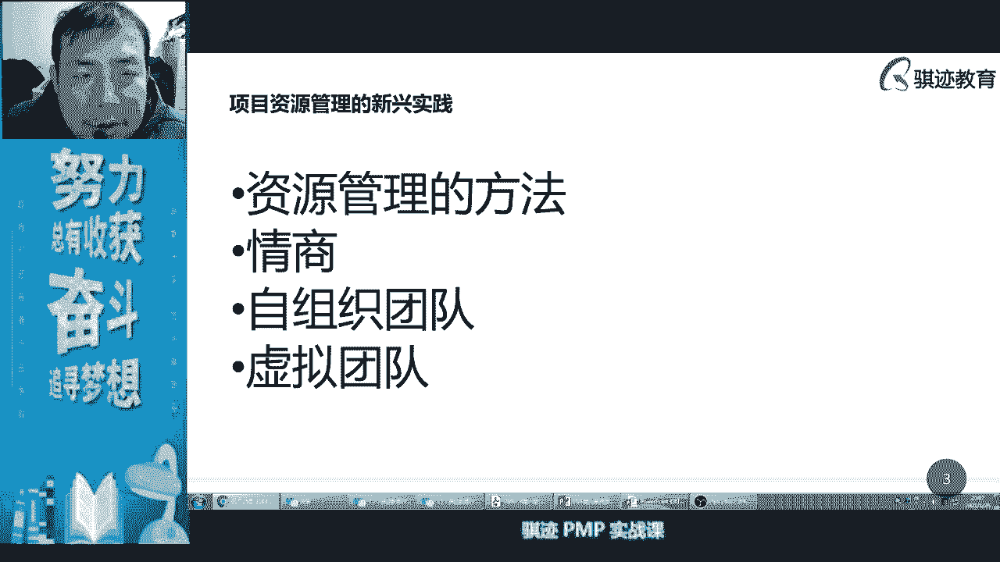

那么讲资源管理当中，我们会考虑一些各种各样的要素，团队成员如何去获得我们的资源是怎么样的，对吧，我们的物理位置怎么样，怎么样考虑文化的多样性，团队的管理和生命周期啊，文化的多样性有这样一个特点啊。

就是说在一个需要团队成员，高能的一个环境下啊，如果大家学到一些其他东西，比如说，那如果大家以后学到一些比较前沿的理论，比如说数字企业和团队的数字化转型啊，这些方面，那么你就会看到很多的理论。

是鼓励团队有多样性，比如说要有一个什么北方人，一个南方人，外国人对吧，男人女人还有一个什么啊，哈哈啊，诸诸如此类啊，就是说多样性很多，每个人能够从自己，能够从各个不同的维度。

对我们的一些问题提出自己的看法，和做出自己不同的贡献，这样的团队呢能够发挥最大的能量，而且不容易产生偏差啊，这叫做多样性啊，短信英文叫diversity对吧，好的，那么然后呢。

我们的项目生命周期呢也是我们要考虑到资源，在商品中不同的阶段呢，我们资源的需求量是不一样的对吧，我们的进度管理当中是不是学过对吧，记得吧，我们进度管理当中学过啊，我们家说进度管理当中。

关于资源方面容易优化啊，有些同学可能在学进度那一章当中，就觉得，老师为什么进度管理，要要讲资源平横和资源平滑，那为什么进度里面讲资源呢，就是因为资源里讲的是如何去管理，但如何去使用。

是在进度当中去使用的啊，是这样分割的，但其实在管理当中啊，在实践呢过程当中，其实我们并不会刻意的去分，进度管理和资源管理，我们会在这个过程当中，自然而然地把进度和资源放在一起去管啊，那从这个角度来说。

项目的资源管理和进度是非常相关的，和成本是非常相关的啊。

是这样好，那么我们讲在一个项目当中，项目经理，项目经理要组建团队，然后呢要要选择团队的人员，那么我们应该注重一个东西叫halo，halo effect，叫做光环效应，如果某个人在某方面很优秀呢。

就认为他其方面也很优秀啊，比如说你们认为我是一个很优秀的讲师，所以你们认为我也是一个很优秀的啊，很优秀的，很称职的丈夫，也认为我是一个很优秀的爸爸对吧，这就叫做光环效应，那么是不是呢，是的啊。

大言不惭的说是的啊，那么我是，那么我是不是也是一个很优秀的工程师呢，啊以前也是的，哈哈哈哈啊，ok但是不是所有的人都能说这方面也优秀，那方面也就能做好，这样也能做好那样对吧，所以一名优秀的工程师。

并不一定是一名优秀的项目经理啊，所以光环效应很让人会很容易会让人产生偏差，这这就是一个光环效应的一个偏差啊，我们后面会讲到啊，所以在对资源进行选择和管理的时候，要特地要特别要注意预防这种效应对吧。

好那么我们继续讲，那么资源管理当中呢过程呢是比较复杂的啊，是比较复杂的，那么啊也不是复杂比较长吧，不能说复杂，那么它也有一个规划过程组开头叫规划，资源管理是所有的啊，知识领域当中的规划是开头的。

也有一个监控过程的控制，资源是最后结束的，那么规划过程中，规划资源管理当中呢啊基本上也是以呃做规矩，立立规矩为主啊，立为主，但是他会有一些特别的东西，所以规划资源管理也会有一些特别的输出。

要注意它并不是纯粹的方法论啊，这点要注意，然后呢我们先规划，规划完之后呢，我们要去估算活动资源啊，估算中资源也是个规划过程，所以估算活动资源会和我们之前讲的进度当中，的哪一个活动相联系起来。

请在我们的公屏上打给我，估算活动资源往往会和我们之前讲的进度的，请带给我，好现在应该好多了啊，现在应该有些东西说卡，现在应该好多了啊，估算活动资源和进度里边的哪，哪项子过程是会经常会联动起来的。

有同学记得吗，还好啊，我这里不卡，好我来看一下，我来开个拼啊。

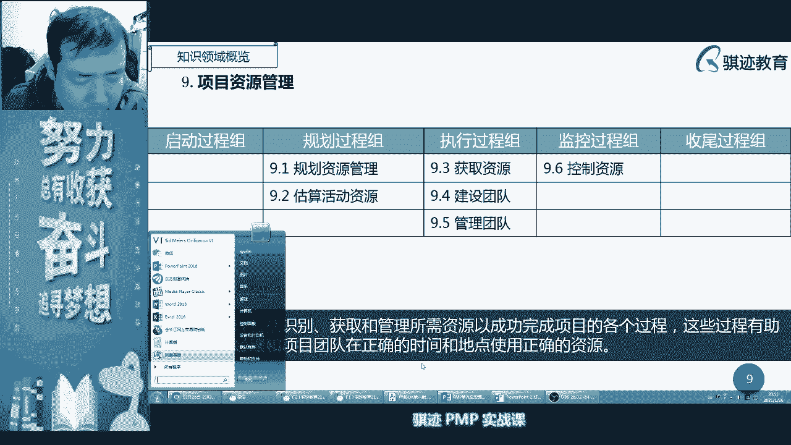

老师的网络很正常啊，至少，然后拼个这个吧，今天换一个。

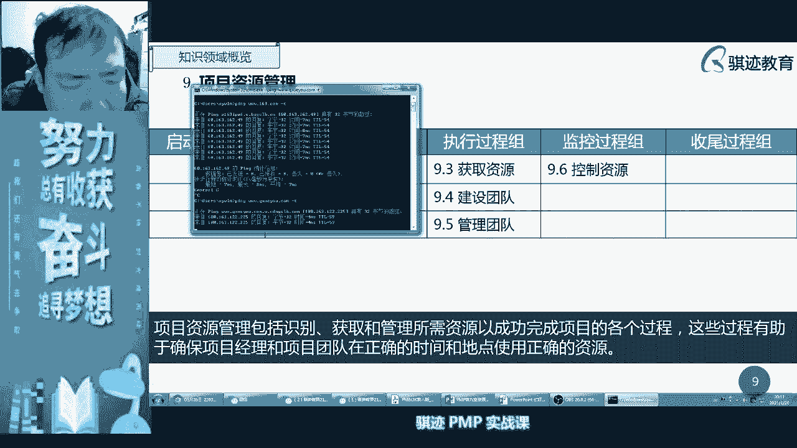

来看估算活动持续时间啊，成本估算啊啊这位同学啊，诶好像是有点点卡，那是q学友的平台，好像有点小问题啊，太卡了卡了啊，好，那我这样我向学校的技术反映一下，稍等啊，我先学学机会，稍等啊。

好像在学校技术反应过来啊，ok好，那我们继续，已经我的屏幕已经调暗了，调到最亮的还是好暗啊，超时请求超时卡，ok啊，我已经跟学校技术反应了啊，大家稍微忍受一下，忍受一下，ok好，那么我们讲呃，在我们的。

在我们的呃执行我们的资源管理的估算。

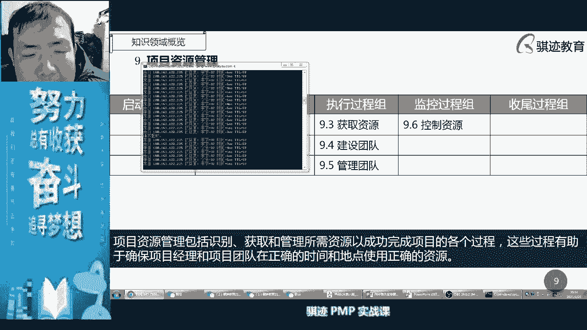

活动管理，估算活动资源的过程其实会和什么啊，有些东西已经答对啊，估算活动持续时间是和估算活动持续时间，互相联动，因为你要故障，活动持续时间，你肯定要知道你所有能用的资源对吧，一般来说投入的资源越多。

一般来说都是什么，会持续时间就会越少，但是投入资源越多，单成本就越高，所以我们会取一个平衡点啊，就这样，那么来估算了活动资源之后呢，我们呢会等待进度那边做完进度计划，那么为什么要等待进度做完进度计划。

因为只有等待进度做完计划，他才能告诉你整个项目历史当中在哪一些点，在每一天需要哪些资源，以此为依据，你才能去获取资源，所以获取资源的一个前提就是等待进度那边，确定了部分或者全部的。

我们在进度计划进度基准之后，然后我们再去获取资源啊，当然你可以预先去做准备啊，大体上你知道会准备这个可以是交叠进行的，但是肯定是以进度为先，以资源为辅，是这样的啊，大部分情况下大部分情。

然后呢获取完资源之后呢，大家要注意啊，呃所有的同学在我们的啊，自己的纸上的笔记本上或者哪里记一下啊，就是pn博客的第六版当中，这个名词大家以后第七版改为怎么样，也不知道啊，第六版当中这个获取获取资源。

这个名字呢有点误导性，有点误导性，它应该叫做什么获取并分配资源，所以获取资源其实是有个什么分配资源的过程，它一方面去获取，一方面会又会分配啊，所以应该叫获取并分配资源啊，你可以在自己的啊。

自己的的p p t的讲义稿上啊，纸上啊，什么去写一写啊，都可以，啊获取并分配资源啊，这有助于大家理解，那么到这里为止呢，我们所有的啊实物资源管理到交集就结束，因为东西是木有感情的对吧。

然后是随着我们的啊，随着我们的管理呢执行呢去进行执行就可以了，但是有一个东西呢是要注意的，就是说人是不一样的啊，人是不一样的，人是需要进行持续的进行各种管理呀，引导啊，控制啊等等等等这些东西啊。

一个叫建设团队，一个叫管理团队，那么建设团队和管理者有什么区别呢，ok啊在pb和第五版当中啊，如果你们要去呃考软考学软考的话，记住啊，这中间还有这前面其实还有一个子过程，所以资源管理，人力资源管理。

原来的pm和第五版的人力资源管理，其实有点复杂啊，它里边还有一个组建团队团队现在是组建，然后建设，然后是管理啊，现在组建和建设呢被放在一起了啊，没画那么细，就放在一起了，所以他在建设团队这一块呢。

那么建设团队和管理团队有什么区别呢，本质上是这样的啊，我给大家总结啊，给大家帮你分，便于大家记忆和总结，总体来讲，建设团队运用的是项目经理，关于权力之外的一些能力，比如说是影响力啊，领导力啊。

啊这等等这个各种能力，然后利用自己的情商，用正面的积极的方式，去促使团队成员效能提高啊，基本上是建设团是这样的，而管理团队呢更多的啊，当然也会运用一些领导力和影响力，但是更多的是运用什么项目经理。

项目章程所赋予项目经理的权利去做一些管理，取得管理啊，这个时候呢有可能就会产生一些冷冰冰的事情，比如说做的不好了，要处罚对吧，这个资源的不要表现不够合格，我们要从团队当中剔除出去，对吧啊。

会有就会有这样一系列的动作啊，会有这样一系列的管理过程啊，或者说发生冲突了，我们去解决冲突对吧，等等等等一些东西啊，所以在管理当中呢，管理团队当中更多的是一些冷冰冰的东西啊。

然后但是呢无论是建设团队和管理层，他们都用又会用到一样东西，什么东西呢，我们讲规划资源管理并不是一个空的方法呢，它会输出一个很重要的东西，叫团队章程啊，他们都会用到成长的，而管理团队会用的更多一点。

用管理要用团队章程这个方式去做管理啊，ok啊，这是他们的一些特点，所以建设团队管理团队，大家记忆当中，只要记住，建设的，几乎都是以正面的方式去促使大家效能提高，然后工作良好，心情愉快对吧。

不断提高等等这些，而活力团队呢主要是解决一些问题，他可能呢保证效能不下降，然后尽可能的将效能提高，但是他会用运用的一些权利设置呢，会用做出一些啊你不得不做的一些艰难的决定，对吧啊，那么讲到这里。

我要提一句啊，就是说很多时候有人觉得啊，当领导批评下属或者是开除下属，当领导批评下属或者开除下属，觉得啊挺爽对吧，其实你不知道啊，如果你作为领导，你去开除一个下属或者批评一下属。

你承担的压力和指压力和心理负担，其实往往要比，往往要比被你批评，被你看出了下属高更大要更大一点，所以管理不是这么好管的啊，好那么这是他们之间的一些区分啊，我这里先说一下啊，后面还会可能还会提到。

那么最后一个呢就是资源控控制，资源控制权，就是所有的知灵都有这个监控制过程，好，我们一开始讲啊，这方面会有很多概念变量。

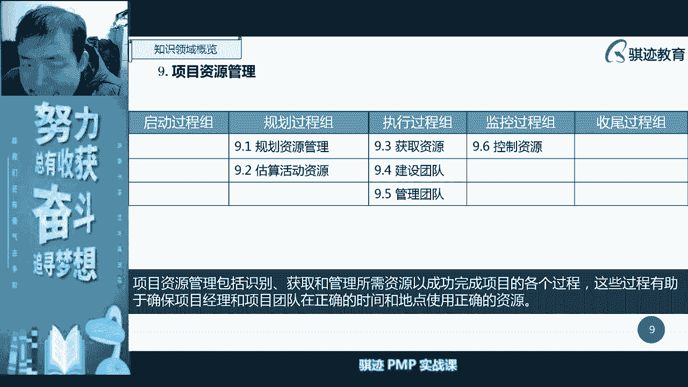

有意思跟你啊，我们一个来看。

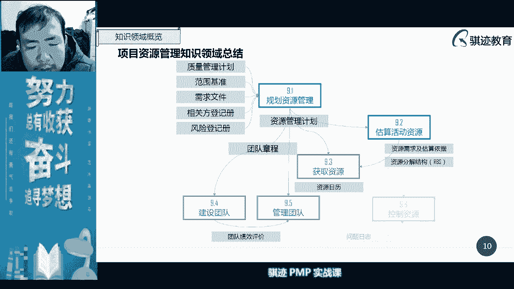

那么首先第一个规划资源管理，规划资源管理呢就制定方法论，资源管理的方法啊，资源管理的复杂程度啊对吧，然后呢经常会制定一些章程啊等等之类的啊。

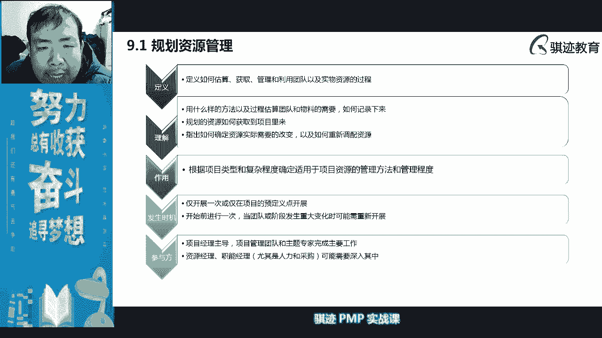

好大家可以看到啊，资源管理规划，资源管理要用重重要的几样东西在这里啊，第一个重要的东西是什么，责任分配矩阵啊，责任分配矩阵这种工作当中非常重要，经常会使用到的，所以我在讲的时候会讲非常仔细啊。

会讲的相对比较仔细，第二个呢是团队章程，我们讲这是一个团队的共同行为准则，价值观一些东西啊，对于我们管理是非常重要的，所以有可能的话，我们会在一个项目，在开始就制定好项目的团队章程。

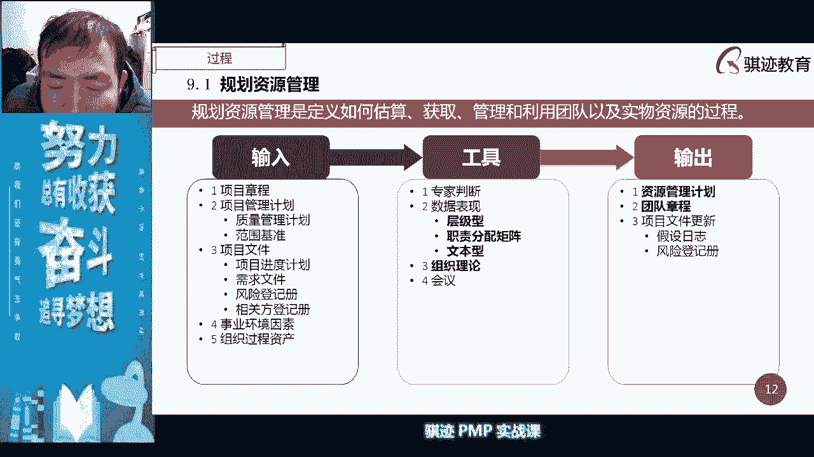

ok我们来一个看啊，首先我们在规划资源管理当中，我们首先设定一个项目，它的团队的一个分解结构叫ob s啊，讲的obs呢，我们就讲到了一个，我们之前学过一个叫w bs对吧。

叫work breakdown structure，那么obviously要organization breakdown structure啊，就是把组织呢一层一层分解，分解到最小的一个部门单元。

和最分解到最小人是吧，右边这张图大家看了，这就是一个obs啊，obs，那么obs里边会提供给你各种资源类别，各种不同的角色，但它里边是不会有具体的人的，这是一种分解结构啊，这是一种分解结构，注意啊。

这是用分解方式分解结构啊，分析结构，那么当你招满了人之后，你的o b s里面才有可能去，填满了各种各样的人啊，所以你在规划资源管理的时候，初始状态下o b s里边是没有人的，只有各个角色对吧。

我们右边这张图看到，这是一个公司里边的o b s啊，公司里面如果是一个，如果是一个项目当中的o b s呢，有可能什么最上面就是你项目经理pm对吧，项目呢可能分为三个团队，团队一团队挑战三啊。

团兵呢做什么事情，可能里边有几个工程师对吧，几个助理工程师，团队二里面呢可能等等等等，诸如此类啊，基本上是这样的分类方法，这是叫o b s的项目管理当中，就是我们进行资源的分类的啊。

它有助于帮助我们将所需要的人力，尤其是人力资源分清楚啊，o b s基本上是分人力的，分人力资源分清楚。

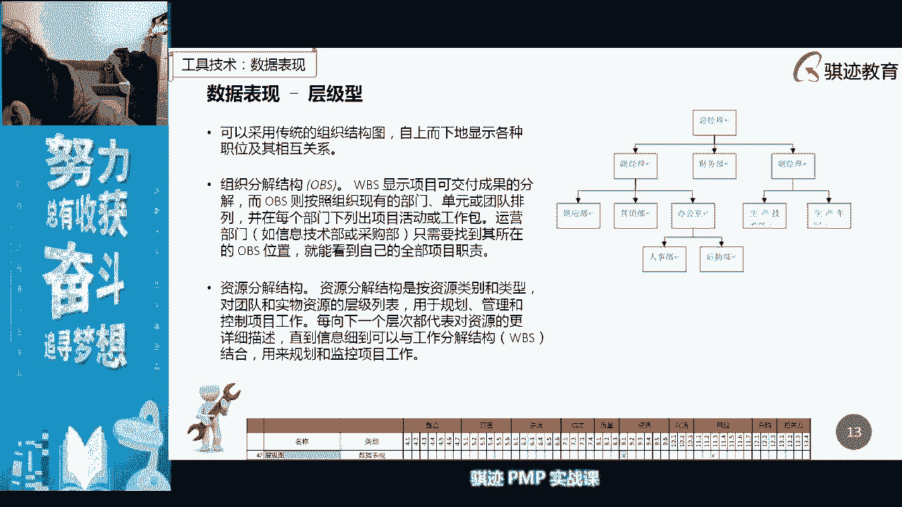

好那么我们继续往下讲，这个大家应该能够清楚对吧，应该能清，那么接下来呢我会推荐一个很多很重要的东西，叫做责任分配矩阵，i am i m，那么责任分配矩阵的一个实现例子呢叫i c i。

那么首先讲i m i am叫做责任，responsity and responsive，as i'm assignable matrix啊，是责任，怎么样去责任分配的一种一种工具方法啊。

它有很多种表现形式，其中我们最常用最常见的叫做i c i矩阵啊，因为它里面正好有四种角色，分别为ra i4 种角色组成一加一个矩阵，那么这个矩阵怎么玩呢，听我给你说啊，听我给你说。

首先我们讲一个项目当中是不是有很多个，我们讲有很多个活动要做对吧，有很多种种，就有很多活动要做，那么每一个活动呢，每一个活动呢都会有每个不同的资源，去加入运动，尤其是人对吧。

因为一个活动总要用人来去管理，原来去操作人来去触发对吧，那么这些活动当中呢，每个人的职责啊和扮演的角色是不一样的，那么有可能有些活动当中呢，有些人扮演的主要角色，有些活动呢在活动当中呢聊另外一次活动。

就扮演次要角色啊，那么怎么样，那么怎么样，我们要关心的点是怎么样在一个项目，诸多的各种项目的活动当中，能够保证这样几点，一，能够保证所有的活动都有人能够去执行，并且扮演好这些角色。

这是第一个都有人去执行，第二怎么能保证有多个活动能够相互之间啊，不干扰你再去执行，那么第三个怎么能保证一个活动当中不会出现，一个和尚挑水喝，两个和尚抬水喝啊，抬水喝三个和尚没水喝这种扯皮的行为啊。

那么最后一个也是怎么保证多个活动，能够相互之间有协调，那么以此我们制定raci矩阵去解决这些问题好，那么会看i si当中，我们把活动分为四类啊，和我分为四类，好符合我们活动当中的举人决策分析啊。

sorry，我们怎么把人的决策分析，那么第一种叫做responsible啊，叫responsible，叫负责的人，这个负责其实更倾向于什么去执行啊执行，所以我们左边当中，我们左边当中这个翻译的什么啊。

这是右边这张图呢是pmi的原版图啊，原版图ok啊，我看到有些东西就卡了啊啊ok啊，现在恢复了好，那右边呢是一个原版的图，那么右边原版图当中大家可以看到啊，怎么会有ai啊，i c4 种角色啊。

那么r其实是一个执行的角色，是一个执行者，执行者啊，a呢叫做accountable，accountable是个什么承担责任，承担后果的人啊，好承担后果人，那么我们讲每一个活动，如果像一个任务一样的话。

那么这个活动是不是应该有一个承担责任的人，还有一个什么执行这个活动的人，还有什么若干做辅助的人，然后这个活动做完呢，还有若干通知的人，所以做辅助的人呢我们称之为c a consultant。

a consultable，consultant就是咨询人，最后一个fi呢叫做informed啊，通知人或者叫知情人，那么在一个活动当中呢，我们可以看到总会是有啊这样一个角色啊。

responsible这样一个角色呢去执行，而有a这样一个角色去进行什么承担责任啊，承担责任从正面去承担责任，那么我问你们a和r在一个i si局，能不能是同样一个人，可以的啊。

所以有有些很多的时候我们做一些事情啊，比如我们以前中国有句话叫好汉做事，好汉当对吧，谁去做这个好汉，谁就执行做好汉的使命，谁有成，所以就承担之后做完神么，好汉做事，好汉当的这个事情当中。

大家会看到a和a是一个人去承担的啊什么的，那么什么时候什么时候，a和r是不是一个人去承担的，比如比如最简单的就是西游记取经对吧，就很简单，a是谁啊，唐僧二是谁啊，二是孙悟空对吧。

然后打酱油的是谁啊啊沙僧八戒白龙马对吧，然后出了什么事情，唐僧这个a呢是不会干活的对吧，唐僧只会说什么啊，悟空救我，然后悟空这个二大就来干活啊，然后呢帮唐僧擦屁股对吧啊，把唐僧给救出去啊。

所以a和a的角色就类似于像一个是唐僧，一个孙悟空，一个是负责承担责任，因为取经成功失败是唐僧要负责任对吧，他向他向李世民承诺了对吧，他向观音观音观音菩萨承诺了啊，他是承诺的。

那么二呢是一个具体当中干活的这个人啊，他不承担责任啊，除非他明显也有a否则他不承担责任，但是他具体干活，还为这个活呢承担主要的干活的角色啊，是这样一个东西好，那么有了这样四种角色定义。

有了这四个角色的明确定义之后呢，我们就开始了在一个项目当中，注意我们经常会在什么时候去制定i c i，我们经常会在一个大家之前有个会，大家记得没有，叫kick off meeting。

开工会我们会在开工会之前将这个r a c i，整个项目的r a c i制定吗，因为什么在开工会之前，我们已经做完规划了，那么我们有所有活动的详细的列表，那么针对于每一项活动，我们都只拍一个r。

只派一个a只拍若干个c若干个i去进行工作，那么这个表为什么要在开工会之前做呢，那么我们讲开工会是干什么用的，开工会是用来在开工之前，我们在执行之前确定好每个人责任，大家达成一致。

那么这个会上很重要很重要的一件事情，就是在当大家所有人的面，做一次i c e i的确认，就是将这个项目当中，所有要做的活动全部罗列一遍，当然我们讲活动是呃渐渐明细对吧，我们不可能全都分解出来。

但是有些活动如果不能分解的很细的话，远期粗略嘛对吧，但是所有的东西呢都应该分配好责任人，分配好承担责任人和执行人啊，然后呢在现场一一确认问大家有没有问题，以避免以后再扯皮，知道吧，这是在开工会当中。

一个有经验项目经理必然会做的一个事情，明确所有人的r a c i i c好好，那么有了这样东西之后，项目经理就可以确保一件事情，所有的事情都已经分配人去干了，同时所有的事情在我们分配良好的前提下。

都不会有扯皮，同时所有的事情都会有一个接口人，那么接口人是谁啊，就是那个a因为a要承担责任对吧，他就是一个最理想的接口人，然后由接口人呢在不同的活动之间呢作为接口，和对方进行接口啊接口。

所以这个这个接口呢往往就是我们前面学会的，叫做我们项目的组织接口，或者是项目的啊，工呃既呃工作工作接口，好当我们安排好了这些事情之后，那么我们项目就可以进行做了，那么做的过程中有任何问题。

我们先会看什么这个东西，如果出了事情，那么我们先找a对吧，如果这个事情呢没有做好，那么我们可以同时找a和r对吧，啊以此来看啊，c呢会进行辅助，但是他不承担责任，也不会主主要去操作，是这样。

那么i c i怎么样去避免扯皮呢，那么我们就会定义一个活动当中只会有一个a，必然是只会有一个a的，这是必须的必须的啊，只会有一个a就是只会有一个承担责任对吧，一个活动当中呢。

我们原则上之一也只应该有一个r，但是a和r可以同一个人，这没有问题对吧，但是也应该只有一个r，但是有一些特殊的情况，有些活动单个活动没办法拆开，但是他确实需要多个人同时去并行执行的，我们可以设置多高啊。

但是如果有一个活动要多干啊，比如说像这个i矩阵的事例当中，第三条提交变更请求，这一条有两个r，他就是因为这个东西可能拆不开，但是这个东西呢又必须有两个人去做，所以我会设置两个啊，好。

但是我们在工作当中会极力的避免，在一个活动当中设置两个啊，那么如果不可避免的发生两个啊，我们怎么处理呢，第一看看这个工作能不能被继续拆分，如果能够拆分，我们将会将这个活动拆为更小的两个子活动。

这样的话就会避免什么东西啊，啊两个和尚抬水喝，三个和尚没水啊，这种事情发生啊，会把它拆分成两个啊，拆分成两个或者多个，直到每一个活动只有一个啊，如果不能拆分呢，我们会要求a呢做好管理协调工作。

避免两个案呢产生啊扯皮产生扯皮，所以这是i c i矩阵的一个工作啊，i c矩阵从广义上来说，不仅仅可以用于项目，一切管理上的一些需要明确责任边界的责任，工作范围安排的都可以使用i ci。

它是我们日常管理工作中也是个好工具，所以当你遇到有一个事情，你要安排人来做的时候，那么你应该给你的被安排的人，就给他画一个i c i的矩阵，告诉他你们应该做什么，应该做什么，这样可以保证什么。

用最少的扯皮和沟通成本去完成一件事情啊，i c工具是非常重要的，也非常好用啊，所以我们很推荐，以后大家不仅仅在项目管理当中使用，也可以在日常工作当中使用啊，这是i c i矩阵的一个分配的。

一个具体事例和一个讲解啊，我讲的比较慢，但是这个东西我们工作中经常用，哪些非常的好用啊，好那么好，接下来我们还看到i c a的活，i c i的它的分配是依据活动，范围又来自于需求。

所以说如果你作为一个非常有经验的项目经理，你甚至可以做到什么，将r a c i矩阵我们的什么东西相连接，想一想啊，来公屏上告诉我，我们可以叫i c i矩阵与什么，我们之前学过的哪一个工具相连接啊。

可以达到更好的效果，请在公屏上打给我，啊有位同学说发尾工具，我说的工具不是知识领域啊，细一点细一点，w b s哎，我看到那个第一个啊叫饭啊，叫范范培栋的啊，这位同学啊，他是第一个答对的啊。

需求跟踪矩阵非常好，为什么，因为每一个需求都是从甲方把你提出来，对不对，然后呢我们需求有了跟踪之后，我们看看怎么落实，是不是安排到人啊，安排到人，是不是最后就能安排到什么c i矩阵的。

最后的这个啊人员安排对吧，所以如果当我们i c i矩阵和我们休，更能矩阵相join的时，候，像连接的时候，可以更好的去跟踪所有需求的具体时间情况下，在的过程啊就非常好的好，所以你们的实际过程当中。

可以和把它和我们的区域跟踪矩阵连接起来啊。

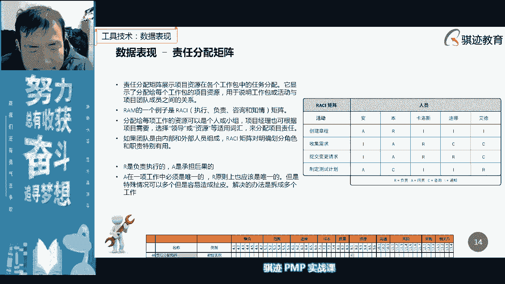

好那么继续往下讲，那么我们如果要描述团队成员的职责呢，我们会使用文本型啊，责任当我们分配责任会使用文本型去描述啊，就像一个档案卡会描述人的呃文本，那么在描述一个人的文本当中呢，我们讲他的人名是什么。

他的角色是什么职责是什么职权，什么能力是什么，对不对啊，好，那么我们这里注意在项目管理当中，有两个不同的知识领域，会对人的属性进行描述啊，描述对吧，那么第一个知识领域叫做资源，它会用四大属性进行描述。

叫做角色职责权啊，职权或者权利，还有能力，第二个呢叫做相关方，因为相关方不一定是内部人，也不一定干活的，所以在描述什么影响范围作用，利益兴趣对吧等等之类啊，我们在学校相关方再继续继续讲好，那么记住。

所以资源管理角度和相关上角度，对人的描属性描述是不相同的，你们弄的啊好，那么我们举例，以我举例啊，以我以我为例，我们来讲一下对人没有，假设我是我们奇迹p p项目啊，学b课程考试通过项目的。

我是你们的项目的项目经理，那么我的名字是查老师对吧，茶老师，谢杨超老师，那么我的名字是查老师，那么我的决策是什么，我的决策是项目经理，我的职权是什么，我的职权是决定一，我的职权是我的职权。

那我的职责是什么，我的职责是将你们尽可能将你们，最好是将你们每一个人都带过pp考试，这是我的职责，让你们每个人都顺利通过，最后一次偏偏不可拼，博科第六版的最后一次老板考试是我的职责啊。

所以我的职权是什么，我决定可以决定课间休息对吧，我可以决定你们谁来回答问题，谁不能回答问题对吧，这是我的职权，但是我的责任呢要让你们通过考试，那我的能力是什么呢，啊我的能力是什么呢，很简单。

就两个字会吹对吧，会吹啊哈哈，是不是很隐私啊，老师老师是不是很隐私啊，可以啊，所以这就是原来角色的这角色职责啊，啊角色职责职权能力啊，但是当我作为我啊信仰蔡老师下了课之后，那么我的角色就变了。

我变成了一名丈夫和一名同时也是一名父亲，那么我的职权是什么，我的职权是决定我女儿什么时候睡觉对吧，什么时候关灯也不一定睡觉，他不睡觉，我也拿他没办法对吧，我只能哄哄他对吧，我的支持什么。

什么时候关灯对吧，或者我的居然是决定啊，家里电视机看哪个频道对吧，当然当然不一定有这个权利对吧，老婆和女儿都比我狠的啊，有可能啊啊会这样，那么我的职责是干什么，照顾好女儿，照顾好妻子。

做一个好丈夫是我的职责对吧，那我的能力是什么，应该有的能力对吧，所以人在不同的场景设定中，他的角色职责职权和能力是不一样，在一个项目当中呢，他的角色职权职责能力呢是相对固定的，相对固定。

但是我们讲在项目当中，我们讲它是矩阵型的，对不对，所以人会在项目当中扮演一个角色，也会在项目之外扮演另外一个角色，然后在社会当中还有扮演角色，在家庭当中不等角色，所以我们要对人在不同的环境当中的角色呢。

进行定义啊，和他的职责职权能力进行定义啊，但是呢在项目管理当中，我们知道对他在项目当中的角色定义就可以了，一般只有一个啊，它的描述角度呢和我描述属性定义呢，和我们相关方当中对人的定义是不同的啊。

但我们学到相关方就是了，太卑微了，听到了卑微的声音啊啊叉老师在线卑微对吧。

好我们继续来，那么接下来我们来讲一个叫组织，organize，organization theory theory，组织者是阐述人，团队和组织的行为模式的一种方式，有效利用组织理论的常用技术。

可以节约我们的过程对吧，根据组织理论熟悉利用编码啊，然后适应我们的生命成熟度变化，从而认识到组织结构和文化的重感性，ok啊这就这个理论，大家知道会有这样一个理论叫组织理论。

然后呢这个理论会用一个方法论呢，然后呢讲述怎么样去管理好一个组织对吧，诸如此类啊，知道就行了啊，这个没有太大的强调表啊啊，然后我们在规划资源管理当中，就会输出一个东西叫做资源管理计划，注意啊。

资源管理计划会输出什么东西啊，会啊啊，规划资源管理中会制定规划资源管理法，sorry，sorry，我说说啊，如何获取资源角色资源能力职权对吧，组织的呃，项目的组织图就我们的o b s对吧。

然后我们还会主制定什么注意啊，我们会在规划的时候就制定好要怎么去做培训，怎么去做团建啊，有些东西听到团建两个字就眼睛亮了，诶，哪里有吃饭对啊，看看我后面会说不要急，怎么玩团建，我会说的啊。

怎么去做资源的控制啊，怎么去做我们的团队的认可和团队效能提高，这些都会成为资源管理计划当中的一部分啊。

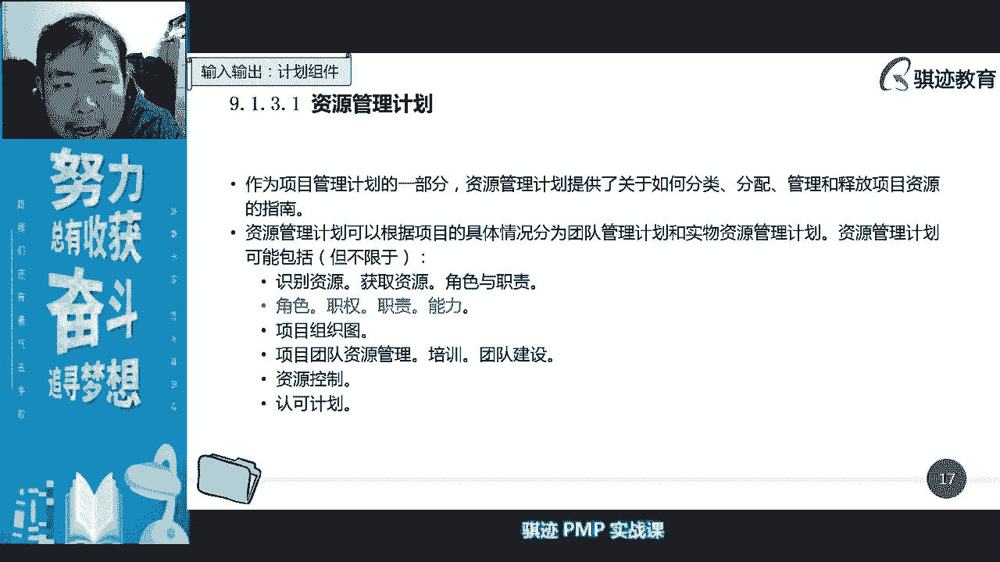

然后随着我们规划资源管理的啊输出，我们还会输出一个非常重要的东西啊，这个东西考的更多叫做团队jt，叫team chat啊，团队上是个什么东西啊，是一个团队的共同的价值观认识和工作指导，一个文件。

它里面描述我们团队的价值观是什么，我们是怎么沟通的，我们的决策过程是怎么样，对吧啊，所以但是注意一点啊，团队的价值观和咱们沟通是适用于不同环境，并不是说一个团队的团队章程越low逼，或者越高大上。

他就一定有效取决于情况啊，比如说我们举个例子，水浒传当中，水浒传当中这个108将，这108个土匪头子，他们的团队章程是什么，他们的团队价值观就是什么，共生死同存亡对吧，一荣俱荣，一损俱损对吧。

然后他们的团队他们的价值观是什么，大碗吃肉，大块喝酒，大块分金银对吧，讲究的是公平兼具效率对吧，这是他们的价值观啊，抢到什么，大家按照级别一定的规矩去分啊，所以水浒传你们看到看多了就会知道。

其实水浒传里面也分等级的啊，分等级啊，好那么这是第一个，那么第二，那么谁会当中他们如果出了问题怎么办，在聚义厅里边对吧，由宋江无用，这帮人呢，大家大喽啰呢，大家何以解决啊，那么冲突的解决过程就是什么。

大家何以解决，那公开解决啊，所以我们会和这个，何况我们后面讲的啊，我们去解决冲突呢又会联系起来啊，后面在管理团队当中会讲，那么水浒当当中他们怎么做决策的呢，就会是什么让宋江啊，让那个叫什么无用啊。

晁盖啊对吧，这几个核心人物大家一合计对吧啊，去打哪里哪里对吧，去去劫哪里哪里啊，就是这么个区域构成，所以水浒传当中的团队长就是这样，那么这个团队当中好不好，对这帮人来说是好有好处。

因为什么你要你要考虑到背景，水浒传战争，这帮人其实就是帮土匪，流氓，地痞无赖将混不下去的，对他们来说，加入了大量啊公平公正啊，反而会降低效率，大家最后呢没办法干成事情，没办法干这事情，抢不到东西。

水泊梁山这个地方又不是又不产粮食对吧，就是一个地理险要的地方又不产粮食，你不抢东西，你就活不下去对吧，所以没有效率的事情，虽然看上去政治很正确，其实毫无卵用，对吧啊，所以这个这不是一个适用的啊。

所以团队章程一定要适用于，这个团队所在的环境和团队的特质，以及它的项目特质啊，所以一个项目经理在规划资源管理当中，就要考虑到这个项目的背景特色如何，这个项目的团队他的特点如何啊。

如果这个项目比如说我们是个建筑工程项目啊，建筑工程项目，比如说我们要造一个造一个楼，要在很短时间造个楼，那么我们的团队肯定会设置为尽可能价值，设置为吃苦耐劳对吧，任劳任怨，不要考虑工作。

以目标完成为价值导向啊，这样此为这样的方式设置出来，团战的有利于我们更好的去完成项目啊，很好的完成，但是同时团队章程也是一个什么东西啊，也是一个受到企业文化影响，组织文化影响的东西，所以你的团队章程。

不可能脱离这个组织文化存在，它必然是一定程度上，要符合你组织的文化和你组织的价值观的啊，会是这样一个东西，好那么这是团队价值观，团队章程啊，那么团队章程呢会在后面呢，我们的建设团队和管理团队当中使用啊。

这个非常重要，所以记住，团队章程是在规划资源管理当中输出的，但是会在建设团队和管理团队，尤其是在管理团队当中使用，管理团队使用去解决冲突啊，好这点要注意啊。

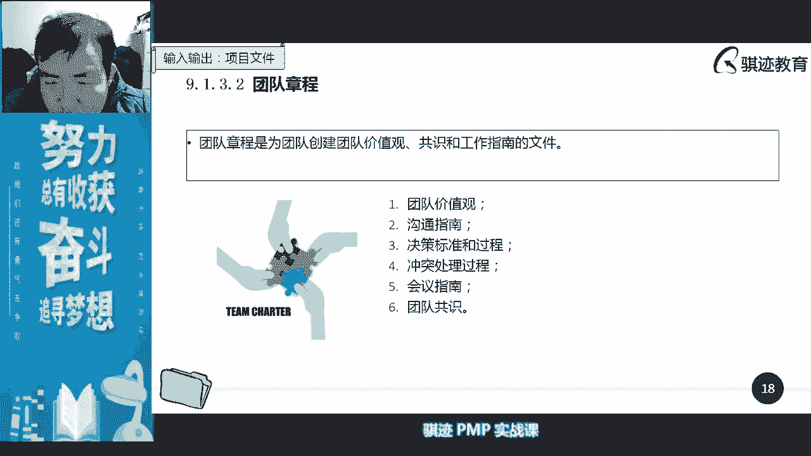

好那么我们规划完了资源之后呢，我们接下来一个事情呢，就开始什么估算活动资源啊。

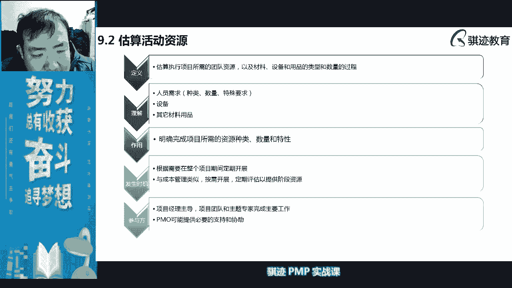

接下来第二是估算活动，估算活动资源呢比较简单，它的估算方法呢和我们的啊，进度成本的构造方法一样的啊，最精确的对吧有解，那么要注意的是，就是说，一般来说，估算活动资源，都是伴随着估算项目的历史项目时间。

而进行估算，或者这或者是伴随着估算项目的成本而进行，所以你在估算活动资源当中，所使用哪一种方法去估算，取更多的是取决于你进度是用什么方法估算，你的成本，是用什么方法估算的啊，所以估算活动资源。

更多的是伴随着他们而进行估算，那么我们一般不会用类比估啊，不会啊，会用类比估算这样的或参数故障。

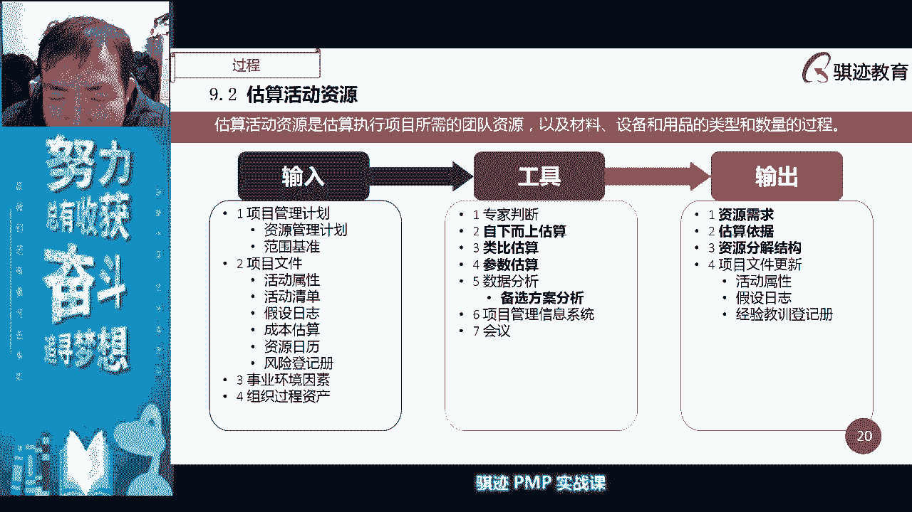

那么一般呢不太会用三角估算，因为三角估算这个东西，对于资源这个来说作用不大啊，所以也不会考试，所以它会有什么一开始的时候会有类比估算啊，项目一开始的时候数据不多，开始有规模了，所以大家耗时短。

精度低对吧，接下来呢会有什么参数估算，项目进行到一定程度了，我们对项目了解比较多了，我们可以用参数估算，因为是用模型，所以这些也是伴随着成本和进度的，参数功能所使用，最后一种呢，当我们有了基准之后。

注意啊，一般来说都是有了基准之后，我们有了成本基准啦，我们有了什么，有了进度基准了，我们伴随着这些基准成本和进度的基准，当然反过来说，这些估算也为我们的成本和进度，提供了最精确的依据。

所以这是一个啊迭代相互影响，相互之间平衡的过程啊，所以不像我们说的这么简单，一步到位的，而是什么，所以在进度的啊，我们会举个例子啊，项目一开始我们的项目多少时间不知道，那么怎么办呢。

先做一个做一个粗略的进度规划表对吧，类比其他项目清除计划表，有了粗略的进度规划表了之后呢，我们就有一个粗略的估计的成本估算，有了这么估算的呢，然后呢或者是有有一个粗略的我们的资源需求。

有人粗略这些需求呢，我们要知道一个粗略的成本，有了这些作业粗略了之后呢，我们在进度呢就进行细化，成本来进行细化，因为成本要和什么合同相匹配对吧，不要做亏本了对吧，进行细化。

然后呢我们来存在这个细化过程中呢，我们需要的资源越来越细化了，本来说要十个人，后来我们可以细化成什么，我们需要五个工程师，三个助理工程师啊，然后再加上两个呢，呃这小工啊。

可能是某样项目的工作的一个一个分解的，一个制约的需求的结果，然后最终呢当我们把进度标的基准排定了啊，呃进度基准排定了，然后我们当我们把成本基准排定的时候，我们的资源呢也但是资本没有基准啊。

它是伴随他们去发声，也会有最经济的资源，比如说我们需要工程师，比较无工程师里面我们需要点什么，两个高级的工程师，然后呢还有三个呢是初级一点的啊，3年左右经验就可以了，还有呢需要三个助理工程师啊。

1年左右到2年左右的经验就可以了，最后呢需要两个助攻对吧，所以这就是项目的资源估算，资源估算是伴随着成本和进度所进行的啊，要不要注意啊，具体的算法过程我们就不再细节了，那么资源过程中。

我们有可能会使用备选方案分析，什么叫配置方案性能，现在我们要考虑到，因为会考虑到各种各样不同的因素，对不对啊，那么有句话说得好，叫做三个诸葛亮顶啊，请在公屏上告诉我三个诸葛亮顶顶多少啊，顶九个臭皮匠。

对吧好吧，三个臭皮匠顶个诸葛亮，所以有时候我们会考虑到底是用三个诸葛亮，还是用三个臭皮匠，还是用一个诸葛亮，还是用三个臭皮，对不对啊，所以备选方案是考虑到不同分。

因为什么有时候当我们尤其是在资源比较紧张，或者是会用到稀缺资源的时候，我们一定要考虑到什么，有没有可能就有替代方案，或者有没有可能有规避风险方案，所以这个方面呢又和风险和我们的啊。

项目的其他的各个制约因素相关系啊，如果是这样的，我们要考虑什么，会有备选方案的分析，就是多种方案当中去选择集成，所以有时候项目当中你会看到诶，为什么你会问哎，会有些人对于项目经理安排不解啊。

项目经理你为什么唉，明明这个活派一个熟练工一天就能干完了，为什么你要派两个新手过来做三天呢，那么项目经理可能会考虑到，你的熟练工的人力资源可能是有限的对吧，你拍到这就不能拍到。

那里你如果所有的东西都用熟练工，万一熟练工有什么事情的话，是不是这个事情就做不下去了，那么是不是我要动用一些非熟练工的对吧，新手的工作让他去做一些简单的事情，增加他的能力也是可以的对吧。

所以这些都是一些备选方案分析的，在资源角度要考虑的事情啊，所以在管理项目，尤其是管理大型项目的时候，一定要考虑到人的各种各样不可测的因素，对吧啊，一定要考虑到这个事对吧啊。

尤其是比如说你的资源是女性对吧，你要考虑到女的，比如项目干燥，一半怀孕了对吧，然后什么每个月总有那么几天对吧，情绪不佳，这些事情都是要考虑到的啊，好那么继续往下讲，那么带识别了这些资源需求之后呢。

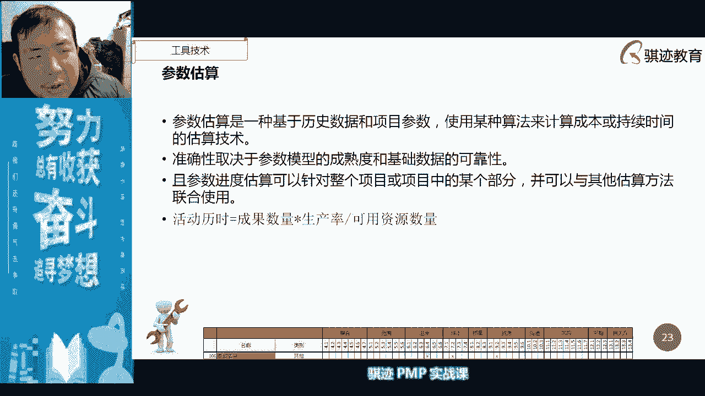

我们就会输出一个东西，叫做资源需求十位的一个汇总啊，这啊资源啊，资源需求的一个汇总，那么在资源需求的汇总当中呢，或者每个工作的每个活动，所需求的资源的类型和数量，将这些东西呢汇总之后呢。

就得出了整个项目所需的资源啊，一般来说，如果我们做到资源需求的一个汇总的时候，一般我们已经做到一个项目规划的一个后期，项目呢已经非常确定了，这个时候才能回去做汇总啊。

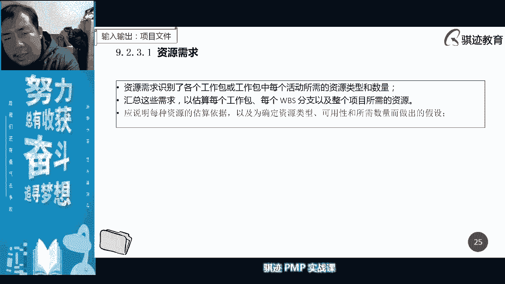

是这样，同时我们讲我们汇总出了我们需要怎么样的，多少资源，怎么样的资源，资源的各种属性如何，那么我们一定要有一个什么依据，为什么我们是这么去估资源的对吧，尤其是对于一些资源使用量比较大的。

以数量而见多的一些资源，那么这项目来说，资源啊，资源消耗大的项目来说，我们更多需要考虑什么东西啊，资源有哪种估算方法，它的估算可靠性程度如何，因为这些东西会直接影响到一些项目的成本啊。

和他的和他的项目的稳定性，哎有些同学情绪不佳，考虑是不是也能啊，有些同学啊，那你就不了解了啊，情绪不佳啊是很正常的事情啊，尤其是女同胞对吧，情绪不佳是很正常的事情啊，这是你要注意的对吧。

所以你在考虑有些事情的时候，如果你不买，有些事情啊，项目工作考虑清楚，那么到时候出风险怎么办啊，这是说明你经验不够对吧啊，作为一个项目经理，应该上知天文，下知地理，对人性洞察极为深刻。

这风险啊寥若指掌对，然后随手就像诸葛亮一样掏出一个锦囊啊。

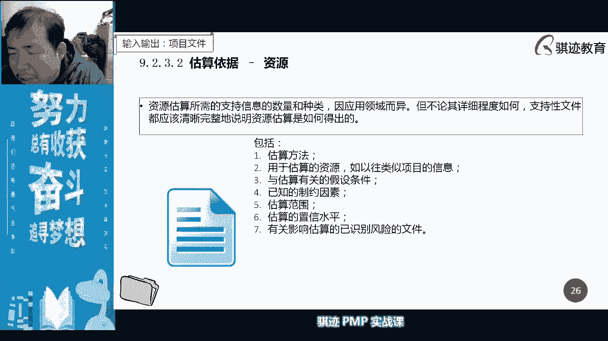

关键时刻打开再看，打开再用。

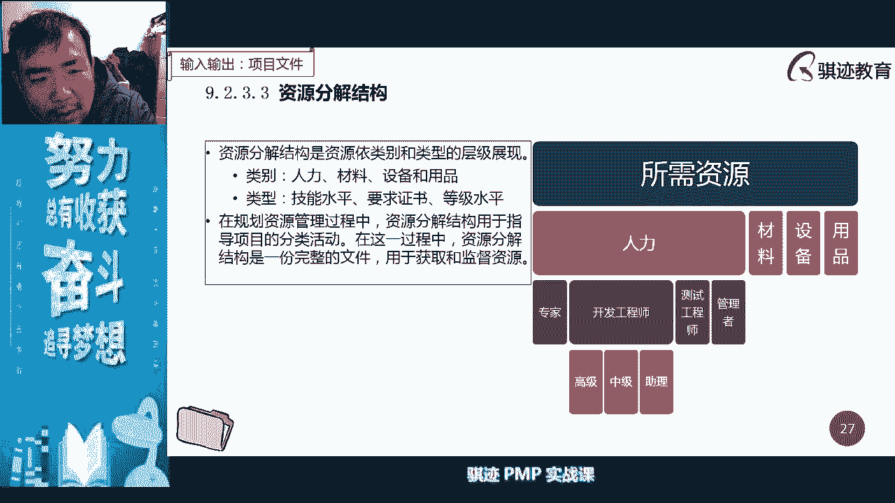

ok啊好，那么我们输出的第二个东西叫做估算依据啊，资源的估算依据为什么这么估的。

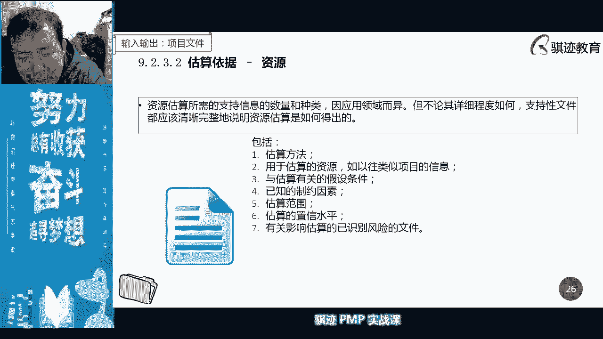

估的合理性如何，估算范围是怎么样的，波动情况如何啊，好看啊，这不要说，那么第三个叫做资源分解结构啊，又来了啊，这个当中就会有一个很麻烦的事情，资源分解结构也有个英文，所以就叫叫阿bs。

但是他会有很讨厌很讨厌很讨厌的同名词，叫做obvious，那么资源分解结构的abs是什么意思呢，叫resource breakdown structure，但是它有一个很讨厌很讨厌也一样的同义词。

叫做risk breakdown structure，所以考试的当中，如果你看到r b s，千万不要马上就认为它是资源分解结构，或者认为它是风险分析，而且分析啊他是在考哪个知识领域，注意啊。

资源分解结构的英文叫做r b s r bs，这个r是resource的意思啊，它指的是将我们的所需的资源，按照品名分类进行分，那么一个项目当中，如果我们按照概念大类来分，那么资源肯定分为一人二物对吧。

物就是钱对吧，钱就是物是一样啊，差不多一个意思啊，那么人是一大类对吧，乌南又分为什么材料，设备和用品，那么设备是一般是固定资产，或者是高价值的一些啊，装备材料呢一般是一个什么生产用的原料。

差不多是这样分就够了啊，那么每个项目呢会根据材料，设备用品，根据会根据一定的性质，或者根据一定的金额进行划分啊，进行划分就分类就可以了，那么另外一大类呢需要我们注意的，要进行细分的叫人力。

人类当中呢我们会把人类分成各种各样的，各种各样不同的啊划分方法，那么主要一般会按照人的能力啊，技能水平啊，就是这个意思大致是主流啊，以此作为我们划分依据，已划分出我们需要哪些高级资源，中级资源。

低级资源对吧，普通资源哪些资源是稀缺的啊，哪些资源呢是跑量的对吧啊，以此来划分，那么资源分解结构，就描写了我们对资源的一种分割，体现的一种结构描写啊，但是它中间有没有具体资源啊，是没有的啊，注意啊。

这个当中我们是没有嘴啊。

是没有资源的，因为我们在干什么东西啊，啊请看看我们标题叫估算活动资源，我们叫估算，所以我们还没有获得资源。

所以在初始状态下的资源分解结构，是没有资源的，注意啊，这一点千万要注意，在我们估算活动资源的时候，资源是不在资源分解结构当中，它只有品名目录分类这些东西啊，这个东西要特别注意，好。

那么资源分解结构有助于帮助我们，在接下去一个子过程叫做获取资源当中呢，啊去发挥作用啊，去发挥作用帮，有助于帮助我们，指导我们如何去获取我们想需要的资源啊，以及它的一些特性，好，那么估算资源。

估算资源这一章讲完之后呢。

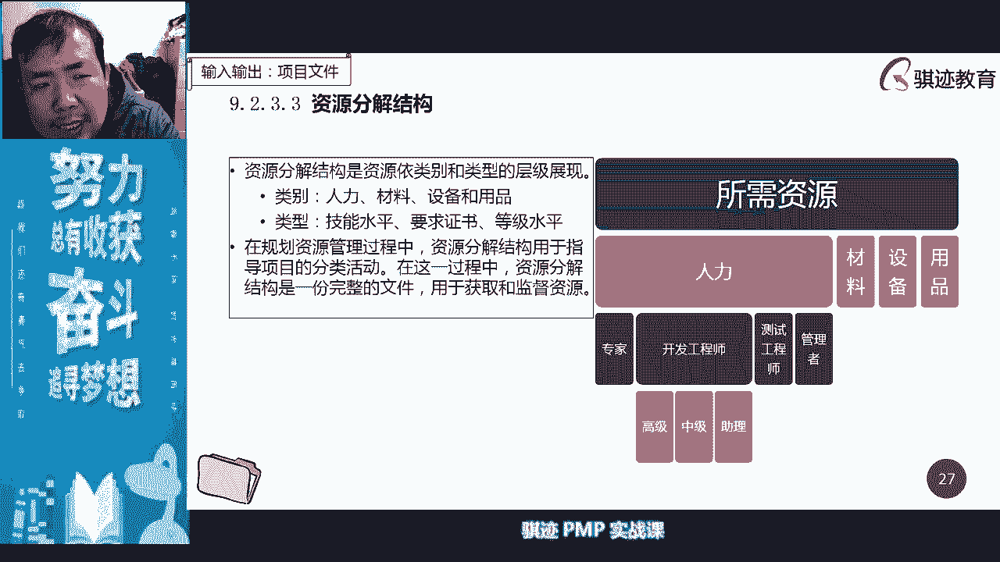

接下来就进入了获取资源啊，获取资源，获取资源就开始开始比较有意思了啊，获取资源，那么获取资源当中，我们有很多种获取资源的途径和办法，获取途径和办法，这个中间要注意啊，怎么获取资源当中会有几种获取办法。

那么在pmbok第六版当中呢，我们只会有一种获取资源的技能叫做谈判，在篇博客的第五版当中呢，还有一种叫做招募，会有种招募就要注意啊，如果你是准备考软考的，你要记住啊，我们按照一遇到pmbok第五版的。

我们的相关的啊设定，我们还有一种叫做招募，那么另外一种呢叫做预分配啊，预分配，然后呢我们在资源的组成形式获取形式上呢，我们可以用虚拟团队与之相对应的，那叫集中办公，集中办公好，那么我们先讲到这里。

然后呢我们稍事休息十分钟，我们到啊，我们到19。10分，我们继续上课啊，因为这节课的时间呢没有那么紧，所以我们稍事休息十分钟，然后呢，大家可以把自己的电脑和网络再调试一下。

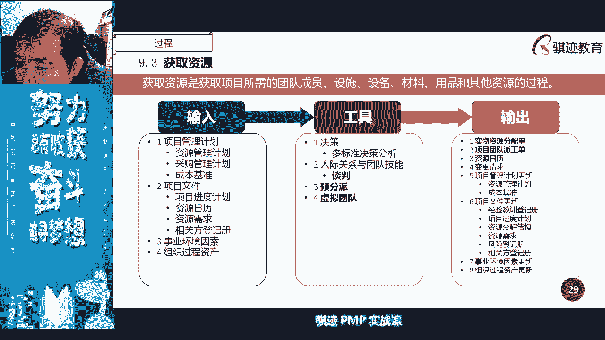