# PMP认证考试课程最新完整免费课程零基础一次通过项目管理PMP考试 - P27：PMBOK第六版 第九章项目资源管理-28 - 骐迹PMP - BV1Sb4y1f7Yt

好好时间到啊，我们回来了吗，大家都回来了啊，好我也回来了啊，我们继续讲，我们前面讲的是资源管理当中的前几个子过程，对吧，第一个是规划资源管理啊，然后呢估算资源，接下来我们要讲的是如何去获取资源。

那我们估算完了资源，我们知道需要多少资源之后呢，我们就可以去获取了对吧，所以获取资源其实我们前面讲了，它真正的意思其实是获取并分配资源，为什么这么说呢，大家看输出，这里会有叫实物资源分配单。

项目团队派工单，既然有分配和派公，是不是它是分配资源，所以这个子过程其命名呢不太严谨，应该叫获取并分配资源啊，我觉得这样比较合，好那么无论怎样，就是说这命名，此时只是帮助大家理解。

理解这个子过程干什么啊，然后我们想要获取资源，是不是要按照参照成本基准来对吧，要参照和真本基准，所以他树上呢会有成本基准，然后呢他他的书当中又会有资源日历，那么他的资源日历呢可能是可能是什么。

可能是事先定义好的，那么资源日历，也是我们最后我们输出我们资源的，一个一个制定资源的，然后获取资源，然后管理团队当中是输出的啊，所以知资源日历一方面是输入，一方面是输出，那就会啊，这个很有意思。

一方面是输入，一方面是输出，所以获取资源既输入资源，人力又输入资源力，那么说明什么呢，说明资源可获取和分配的过程，是一个迭代循环进行的过程，它并不一定是一次性的，那就往往不是一次性的，而是什么。

要分阶段，根据项目的需求和实际情况，进行分阶段的去获取分配，实现这个过程啊，所以他很有意思，输入和输出都有自己输出给自己，也就这一阶段呢，我们的输入输出，又可以成为下一阶段的输入输出，有这样一个特点。

当然我们会依据资源需求来进行资源的获取，获取之后分配之后呢，星期天的资源日历啊，会有这样，因为资源并不是说你一个项目，尤其是一个比较宽的，比较长，并不是说你的项目，一开始就能够锁定所有你所要的资源。

并且能保证它的获取，所以你要边做边去获取啊，边去争取，或是这样的啊，所以经常会有什么项目，由于资源不到位，我们没有能够获取到足够多的资源，或者必要的资源啊，发生中止啊，终止啊，这些都是有可能的啊。

所以获取资源，获取并分配这个资源过程会迭代进，在项目的整个历史当中会迭代进行很多次，是很常见的啊，啊是这样一个概念，那么总体上是这两边，这是我们讲的啊。

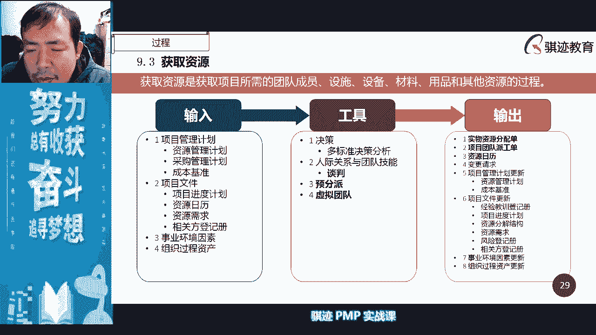

是一些重要的输入输出，那么后面一个来看，在我们选取获取资源当中，有一个很重要的标准呢，叫多标准决策，多标准决策啊，就是说我们会对这个资源来进行潜在的资源，来进行打分，看看怎么样啊，比如说又以我为例啊。

对于你们来说，在不上课的时候，我是不是融资源，是的x老师的可用性如何很高对吧啊，有胡九阴，只要你们群里艾特我，我必然会回答，有时候你们不爱我，我也会主动给你们回答啊，所以蔡老师可用性很高，成本如何。

成本极低，继续无对吧，你们问你们问我题目，我何时问，刷个火箭啦对吧，素质三连啦都没有吧啊成本极低，对吧啊啊，所以以后茶老师，以后哪天在b站上面开vlog的时候，记得要啊，要一键三连过来捧场啊啊现在没有。

以后或许会有哪天我有兴趣，我就会在b站上做个主播，对好第二第三能力如何啊，陈老师的能力还是很丰富对吧，有问必答，能够上知天文，下知地理，能力有非常丰富啊，经验呢经验和能力不一样。

地方经验是你人经历过的越多，才会有更多的经验啊，所以经验呢是一种经历，那么超老师的经历很丰富对吧，我我们从pm博客很早的版本就开始，一版一版经历过来，所以经验也很丰富，知识呢就更广播了啊。

你们可以跟我聊各种各样的知识对吧，从高大上的到low low low low的啊，都可以跟我聊技能，所谓的技能是指对你项目贡献的一种啊skill，一种skill，一种一种技巧性的能力啊，技巧性的能力。

也是很丰富的对吧，我们很善于给大家一些非常好的，一些各种各样的技巧，然后呢很善于用各种各样形象的例子呢，去开导大家啊，帮助大家，虽然你鼻音有点重啊，最近有点感冒，鼻音重，但是呢守时对吧。

国际因素我们啊是中国人对吧，能够能够用中国人的思维去沟通啊，啊国竞速其实也在一些大型跨国项目当中，国境是非常重要的啊，因为要考虑到文化，茶文化，然后语言这些差异啊，这是要注意。

所以这些呢只是拿我举个例子啊，要考虑到各种各样的方方面面，那么其实也不用过于频率，一般来说如果我们使用多标准决策技术，一般是使用针对什么关键资源，稀缺资源或者是高级资源进行什么，进行多标准决策啊。

啊比如说你要去，比如说你要去什么工地上招招几十个民工过来，什么搬砖，然后灌水泥灌浆的砌砖，这种时候我们需要多少标准，不用对吧，我们将考虑几个作用，是一啊有没有经验，以前搬没搬过砖的，第二啊。

一个月要一天干一天活，工资多少钱，对吧啊，最多的考虑一下他的工作态度好不好就行了，其他不需要对吧好，所以多半总结的技术呢使用呢呃比较费时间，但是它一般会针对高级稀缺的这些资源。

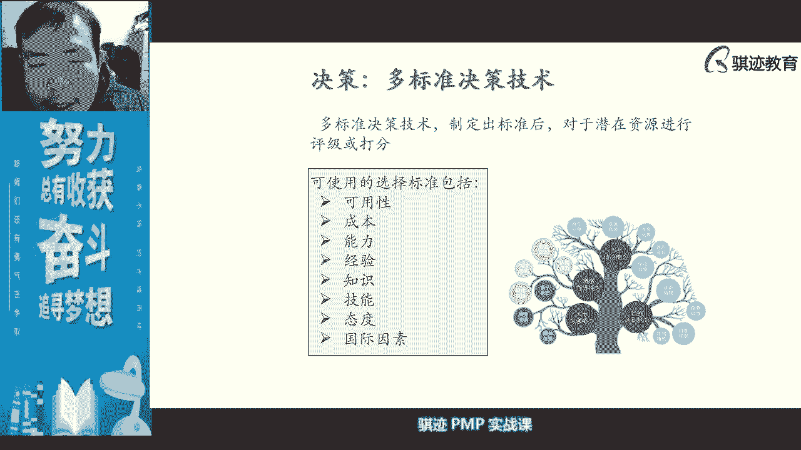

关键资源会使用啊，好支架，那么我们在资源的获得当中，就会使用到一个非常重要的工具，叫做谈判谈判啊，在篇博客第五章版当中呢会分为两种工具，一种叫谈判，一种叫招募，那么一种叫negotiation。

一个叫做recrud啊，那么什么叫negotiation，什么叫recru，那么我们有经常会有说这叫普通资源，叫做recool，对吧啊，然后呢能力是capacity的，歌，技能是skill，是这样的吗。

哦对没有问题啊，这位同学叫李霞的同学啊，理解的很好啊，解释的很好，英文就是这样的，capacity和skill没问题好，那么我们继续讲，那么谈判和招募，一个是用于稀缺资源，一个是用用于普通资源。

但是拼搏和第六版当中，觉得呢这个呢带有一点点歧视啊，所以就把那个recool呢给去掉了，就只有那个选项，但是其实知道大家项目当中，我们项目经理在资源管理这块上，永远是关注什么稀缺资源的获取啊。

尤其是人的稀缺资源的去获取啊，是这样的，所以大家如果是一个稀缺资源，那么大家会用什么样的工具去找工作啊，猎聘网对吧，猎兵王啊，博士直聘对吧啊，然后会用高级猎头对吧啊，嗯老师身边有很多啊。

这老师认识不少啊，高级猎头啊，妹子对吧，都长得挺漂亮的啊，所以你们以后以后如果成为高级人才了啊，想要跳槽了啊，你告诉我你们有什么能力想跳槽了啊，然后我去问问帮你们问问对吧。

ok啊然后把一些漂亮的类同妹子介绍给你，对吧啊，ok那么如果你们是be record呢，那么你们一般就用什么什么五一job啦对吧，中华英才网啊啊这就叫入库对吧啊，我们这个呢我们会在啊。

软考的课程当中会更加注重解释，这里就不解释对吧啊，那么老师如果想要去挣钱怎么办呢，老师会默默的打开五八同城对吧，然后看一下哦，这里最近最近招什么快递员哦，好去挣一下，可以可以赚点小钱，可以补贴家用。

然后晚上可以有时间来给大家上pp课啊，ok啊哈哈，开个小玩笑，开个小玩笑好，那么我们讲你给学a型当中，我们会和水，你给我选a h negra型，那么我们会和一职能经理，谈判啊。

是因为职能经理在大部分的矩阵的情况下，是掌握着资源的直接管理权的对吧，我们讲哪些项目，哪些形态当中会掌握资源管理权的啊，从我们的职能型若矩阵，平衡性矩阵，强矩阵都是只有什么，只有我们的项目型模式的。

所以弹幕情况下我们要和职能经理谈判啊，是呀，那么第二呢，要为什么要和执行组织当中的，其他项目团队谈判呢，是因为为了合理的协调分配，稀缺资源和特殊资源，尤其是他们的时间，因为稀缺资源。

特殊资源永远是在干活的，因为很多活没有他们其他人就干不了，所以他们永远是在干活的，所以一般来说，他们永远是不是在为这个团队占用，就是被那个团队占用，所以你要想获得他们的使用时间和使用权的。

只有和占用他们的团队的管理人负责人呢，进行什么进行沟通啊，这时候谈判就很重要对吧，诶你说唉老张啊最近怎么样啊，晚饭吃过了没有啊，哎呀我这项目遇到困难了，要么把你这里啊稀缺资源小李啊。

稀缺资源小李借我干两天活对吧，不会亏待他的对吧，好酒好菜来招待对吧啊来来来来，你先抽着啊，就这么说定了啊，明天啊啊小李过来干，干点活，马上就好啊，然后你就让他小李干了两个礼拜，天天996对吧啊。

项目经理有时候就是这么没有人性的对吧，因为为什么有些活只有小李能干对吧，你不抓紧利用小李的时间，你的项目可能就会受到重大的影响对吧，就可以影响你的绩效，对吧啊ok好，那么这是我们讲的啊，在执行组织当中。

跟其他的管理团队进行一个选型，那么有时候我们的资源如果从外部去获取呢，就跟外部组织供应商去获取，这个时候呢，有时候我们的女足运行更多谈的是什么呢，对方能提供什么，对方的价钱是什么。

这时候你会想要更多的关注点是什么，成本如何啊，关注的成本如何，在资源的分配当中呢，项目管理团队影响他的能力很重要，因为就如同在组装中，政治能力是吧对吧啊，这句话是很对的啊。

因为大部分情况下你没有直接权利去管别人的，所以你只能通过什么谈判去影响别人，可怜的项目，对啊ok啊，这位同学，如果你说可怜的项目经理，说明你对于做项目经理呢感触不够深，或者你要么经验不够丰富。

要么可能就没做啊，小目经理很多时候就是要跟人家去聊天，谈判对吧，就是这样的啊，太有意思，所以项目经理跟我们稀缺资源搞好关系很重要，他就愿意过来给你干活，然后其他像其他，然后呢。

还跟职能稀缺资源的职能经理搞好关系啊，人家愿意放人啊，然后其他的项目经理呢看到你有资源呢，就是帮忙放个水啊，对吧好，我帮忙来救个急啊，对吧啊，所以这时候做人是很重要的啊，做人是很重要的。

项目经理从比起管事情更重要一点是吧，希望会学会会如何去做人，好我们继续往下讲，项目当中还有一种形式很特殊，形式叫预分配，预分配是指针吧，在项目签订合同过程中，竞标过程中承诺派某个人来进行啊，讲到这个呢。

我就我就想讲啊，在项目当中，你如果作为甲方，我们现在切换到甲方，如果你作为一个甲方，那么乙方如果来进行进行投标，投标是不是要进行投标演示啊，啊投标要进行要进行投标的投标展示对吧。

叫presentation对吧，呃fp printation对吧啊，那么投标也是跟你这样讲标的那个人一般是什，么，是能力非常出色，因为这种人一般会在讲标，讲完一段标或者讲完全部标的。

它的标注标书演示之后呢，会要受到甲方的各种的问题的一个质问啊，甲方会出众，各出于各种各样的问题呢，问他问他各种各样的刁钻的，有可能会有一些普通问题，可能问一些刁钻的问题，有可能问他一些什么。

看似是普通问题，其实刁钻问题的问题啊，甲方会带有各种心态，比如说甲方手中觉得要炫耀一下，在其他甲方同事面前炫耀一下自己的专业能力，有些甲方呢对你不信任，有些甲方觉得呢看你不顺眼。

有些讲话呢觉得今天心情不好，要找人发泄一下，他都会问你各种各样奇怪的问题，这种时候呢作为乙方，你只有什么，对方打你的脸，你还要笑盈盈地迎着对方跟对方解释，你为什么要打我的脸，你打脸打我脸是对的啊。

这就是乙方比较苦逼的地方，但是乙方能够扮演这种角色的人，一般是稀缺资源和能力很强，这种人一般称之为什么啊，授权啊，授权啊，这种授权是一般做好的，授权一般是能力很强的，从中国同学都开始做起。

能力非常强的这些人啊，好那么这种人呢，我如果作为甲方，有时候我就会指定说诶这个人讲不讲得不错，很有能力来，我们要你这个项目可以给你们做，没有问题，但是你要接这个项目必须什么。

你这个讲标的人给我当这个项目来做事情啊，那么这个时候呢，因为这个人其实说他能回答处理问题，如果你纯粹是从能力上考研的，他能回答这问题，你觉得你对他的能力是认可，但是讲标的人并不一定等于是什么。

给你干活的那个人，可能跟干活的都是一些愣头青对吧，小年轻干货做的很毛糙，或者水平不高，讲标准的经验很丰富，但是他拿到标量他就走了，去做另外标了啊，所以不要售前的人比较苦逼，要么是在呃讲标的路上。

要么是在坐标的路上啊，是比较苦逼的，这个时候呢，我会把那些人呢要求他们作为预分配啊，分配到某个项目上，一定要他们来干活，那么这些人往往会有很强的，至少在项目初期对项目有很强的帮助啊，啊作为甲方。

这时候我就可以指定乙方承诺分配特定人员，比如说某个售前很资深的工程师，来进行项目的工作啊，那么在这个过程当中，乙方怎么应对，乙方一般是说啊满口答应是为了拿到，为了拿到这个合同，为了做成这个销售。

他会满口答应，然后拍摄人过来，然后做了一段时间之后呢，或者做了三五天，或者做几个礼拜呢，要根据项目长度不等的，然后呢，逐步逐步的就把这个人一点一点的时间，就挪出去，挪到其他地方用了，然后派一个人。

然后派人跟你说啊，这个人做的其实也不错了对吧，然后其实是一个小朋友对吧，刚刚参加工作也有可能啊，ok啊都会有这样的啊，所以预分配这种事情呢往往是不靠谱的啊，但是呢甲方可以通过预分配一种方式。

然后呢去指定他相信的人，或者是甲方真的是指定一个乙方特有的专家，只有这个专家的专有技能才能做到这件事情的，所以这就叫什么预分配啊，预分配，好那么还有一种预分配啊，大家在实际工作就可能啊。

所以我这里就要课程联系实际，还有一种预分配叫做什么呢，比如说甲方说啊，这个项目可以让你们做啊，这个工作可以让你们做合同给你签，但是呢你这个项目当中呢还要安排几个人对吧，这几个人呢是我的关系户的。

你要在安排我的关系户呢，在你项目里面呢拿工资，你干不干活，那随意，但是要在你那边拿工资对吧，就相当于什么啊，有些东西的啊，但是他是甲方爸爸，你作为乙方，你就很难拒绝，对，可以对吧。

这样的人就一分背景来对吧，还有一种人呢也是玉芬配啊，什么叫玉芬配呢，就是他是乙方的人，哎啊小叉对吧，你们听说你们接听那个新兴项目啊，可以啊，我这里有个小朋友对吧，他他工作态度还不错对吧，能力有限。

但是当你想不想锻炼一下啊，你照顾一下啊，知道啊，这也叫预分配对吧好，那么无论怎么样预分配，它都会因为他是在事前项目刚刚接是接的签订，作为乙方来说，项目刚刚签订，签下来项目刚刚啊呃准备启动。

或者已经在启动当中，然后就确确定下来要参与这个项目的人，叫做称作预分配，那么这种人呢，一般我们会把这些人呢，列入到项目的项目章程当中去，预先写入项目章程，约定，这些人一定要在我们项目当中。

扮演一些特定的角色啊，或者工作，这种就叫做预分配啊，体现了我们在项目当中，对于各个相关方的一种承诺啊，所以预分配的人员会在项目章程当中，会写在项目上啊，一般我们都会预分配，是承诺这种特定的人。

他们会有特殊的技能技巧，或者有特殊的关系，懂了吗啊，所以作为一个项目经理，如果你中途介绍某个项目，然后你看到项目章程或者类似于项目章程文件，类似于像玉芬培养文件当中。

你就可以明白这些人肯定是有background啊，所以一定要当心伺候好啊，要不卑不亢，好好对待，好好好，这就叫预分配啊，但大部分情况下呢，我们是针对于这些人呢，是我们完成项目的一些关键。

或者甲方指定一定要他们去做的好，那么语义分配相呃。

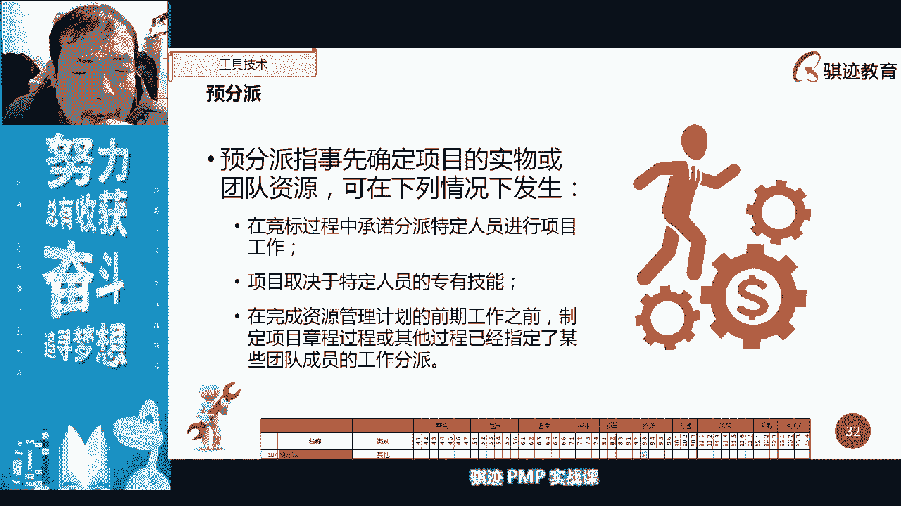

与分配呃有关的，我们会在我们的获取资源当中，去制定的一个方式呢叫做虚拟团队，注意虚拟团队在这里是一种团队组织方式，是一种工具，而不是说一个团队啊，所谓的虚拟团队指的是什么呢。

地理地点不在一起的一群人共同工作，组成一个类似一样团队的事情，是但他们地理点不在一起啊，注意地理点不在一起，那么曾经有好事的同学问我啊，老师什么叫d d点位，1z7 怎么来，我给他举个例子，我说啊。

我说的是啊，比如说像中国，那就相当于在中国，那就相当于不在一个省里面，可以认为不在一个地地地，那么有人问啊，老师您您是住在上海，那请问如果你的团队成员一个是在嘉定上班啊，上海的最北啊。

北面家电或者宝山上班，一个在上海的最南面，在上海的金山上班，他们算不算虚拟团队，那么我说啊，那么这种事情呢你可以这么看啊，那么在平时的时候呢，我们认为是它是什么，它不是一个虚拟态度，因为它可以在一啊。

它可以tx可以在一天内到达，因为我们一般认为啊，但这不是考试内容，但一般认为什么是虚拟团队，就是大家的上班地点虽然不在一起，并且大家不能在一天之内，或者在很短的时间内迅速聚集在一起的。

我们称之为虚拟团队啊，虚拟团队，那么在当前新冠时期特殊情况下，所有在上海的同学都不算作虚拟团队，因为你们都可以在省内自由流动，但是如果你的一个团队成员在嘉定，另外一个团队成员在上海的嘉定，在外面在昆山。

那么你们就算虚拟团队，因为你从江苏进上海或者上海出江苏，将会非常的麻烦，所以就算虚拟团队，虽然你们可能隔着一条河啊，ok啊我借借着我们当前的形势，正好说个段子啊，那么世界上最远的距离是什么啊。

我在昆山河这边，你在昆山河那边，我们相互之间却不能来回对吧，ok啊哈哈啊，老师讲一个很有意思的事情啊，有时候不一定写在项目框架中，也要写论文，是一个大佬的啊，呃亲戚对吧，你可以把它写在里面。

普通工作人员一般是不会写在项目当中，哪怕我哪怕我说，我说我后面会让他进入参与项目去工作的话，我一般也不会写在项目章程，一般是什么，非常重要的，如果写在项目当中，就意味着这个东西是非常重要，非常严肃的。

肯定会要他的才会写进项目账上，明白了吧，作为一个项目经理，这点权利你还是有决定的权利的，我决定你就来了，口头答应就行了对吧，项目里面你能做主的啊，这种事情可以可以不用写在项目章程里。

如果他是一个高级工程师啊，领国家特殊津贴的啊，他要参与到这个项目来，那么你尤其是你跟甲方承诺了啊，他肯定待会回到我们的项目上干活了，那么你必须把它写进项目章程，然后让你甲方安心，这就这就是区别，知道吧。

所以交换商人一般是一般是什么，一般是稀缺资源，稀缺资源，高级资源，稀缺资源啊，或者跟甲方承诺的那些人好，我们继续回到虚拟团队，那么虚拟团队呢，所以我们前面讲了个段子啊，当然其实也是给大家开个玩笑。

不要太严肃啊，那么虚拟团队它有什么好处呢，因为如果我们组成一个比较大的虚拟，地理位置比较分散，虚拟完成，那么我我们在无形之中就可以减少出差，出差的成本和出差的时间啊，出差时间，因为什么。

有些项目可能在全世界各地或者全国各地展开，如果我们执行组成一个虚拟团队，在所有需要展开项目的地点，都配置团队成员的话，那么我们的出差的频率和，这将有利于我们项目的降低成本，然后呢。

减少我们的不必要的等待和准备，时间和旅程时间，这些东西啊是非常好的，但是同样的虚拟团队也有缺点，缺点什么，因为大家不在一起，所以大家的沟通可能会变得很困难，有了现代媒体之后呢，会好一些。

但是依然会有隔阂感和孤独感，然后协同能力总是不如面对面，或者在一间办公室当中，当场当面去沟通交流这样的方便啊，所以虚拟团队的沟通成本呢，会比集中集中办公的这样的方式呢要大这大，然后呢他也容易产生误解。

然后团队呢不容易形成团队士气和，不容易形成什么啊，团队凝聚力啊，这是虚拟团队的一个缺点，所以要注意虚拟团队，如果我们要管理好，一定要注重什么时差，文化语言啊，老师以前管过训团队就经常遇到一个事情。

什么有一部分团队成员呢在美国，有一部分团队成员呢在中国，然后中国和美国呢，差了11个小时到13个小时，所以有时候什么时候开会变得很重要啊，那么怎么解决呢，那么要么迁就美国人，要么迁就中国人对吧。

后来我们想出解决办法是什么，就是有一段时一段时间呢，中国人迁就美国人对吧，我们晚上晚一点下班，然后开会或者早上早一点开会，有时候呢中国人签证美国人，他们呢啊对美国人迁就中国人，然后呢他们下班之后呢。

在家里给我们开会，因为反正都是网络开会嘛，中国人跟美国人又不可能经常飞来飞去，这个成本太高了，对吧啊，所以从这样的方式呢，我们可以去解决时啊，同时尊重了彼此对吧，尊重了彼此，然后呢有语言文化。

比如说中国人和美国人沟通啊，中国人可能更多的是表达的要直接一些对吧，表达直接一些啊，然后呢语言当中呢啊，让老美呢去理解中国人肯定有困难，但是呢我们会啊，比如说教他们一些简单的中文。

让他们领略到华夏5000年文化的奥妙对吧，但是但是大部分工作当中呢，我们还是有英文，然后呢方便沟通对吧，方便沟通啊，因为教中国人英文远比教美国人，英国人中文来得简单啊，这这一点是要注意，你要承认。

所以中文是最复杂的，所以我们掌握了这个世界上最复杂，但是表语言表达效率最高的语言，我们有两个字，好中文，是这个世界上语言表效，表达效率最高的语言之一啊，好啊，这是虚拟团队的优点和缺点。

那么虚拟要注意一点的是，虚拟团队的优点就是集中办公的缺点，什么是反过来也一样，虚拟团队的缺点就是集中办公的优点啊，所以虚拟团队和集中办公呢又是一个什么啊，相互之间有长有短，所以很多企业和组织当中。

尤其是大型项目当中，我们会使用什么，一定程度的虚拟团队加集中办公的方式，什么意思呢，就是我们会把人员集中在几个虚拟团队当中，但是呢不同的虚拟团队的办公点呢，又是有多个团队成员的聚集在一起。

它可以形成一个相当于集中办公的形式，那么在这个小团队当中呢，他们可以发挥出集中办公的特性，但是呢在多个物理地产中呢，它又能发挥虚拟团队的一个优势啊，优势哦对了，虚拟团队还有一个优势。

很重要的优势就是什么，虚拟团队可以解决一部分资源获取的难度和，资源的成本的成本压力，那么什么意思啊，比如说很多时候如果你要去招募一些稀缺资源，比如说高级工程师啊，高级专家。

他们往往都生活在中国的北上广深对吧，京沪穗深这些城市当中，然后呢你如果你的团队在上海，然后呢你需要一个专家，他在北京，他不愿意过来怎么办，那你只能用虚拟团队形式，跟他一起协同工作对吧。

所以如果如果只能使用半只用办公办，你可能获取不到这个专家这种稀缺资源，能和你工作有困难啊，这是虚拟团队的另外一个好处，还有什么好处呢，比如说你组这个心理团队对吧，然后阿三们组成一个虚男的。

让他在班加罗尔呢去接客户电话对吧，好滑溜娃溜娃哦，不是完了完了完了，那是日本啊，啊哈喽哈喽啊，this is this is roger，对吧啊啊，this is rogge对啊，诸如此类啊。

然后呢你可以通过虚拟团队这种形式呢，将一部分工作啊，一部分工作的团队呢布置在什么成本较为资源，成本较为低的一些地区，从而降低整个项目当中的资源成本啊，这是很重要的啊，所以你会看到什么，有一些项目当中。

他会他会有虚拟团队，但他虚拟团队一个团队呢可能分布在美国，一个团队分布在中国，还有一个团队呢分布在什么，分布在印度，然后印度人一般都是干那种最low最low low的活，对吧啊，就是这样。

因为印度人的人工相对中国人，美国人最便宜的啊，就是这个道理，萨瓦迪卡，萨瓦迪卡是泰国的吧，啊泰国也行啊，泰国还可以，但是泰国啊啊还可以，但是热带的人要注意一点啊，徐敬腾在注意文化。

就是处在更无更靠近赤道附近的人，行为呢会更加懒散一点，时间观念会更加长啊，更更加那个啊不同一点啊，尤其像泰国那个地方，如果你们去过泰国，去过去过萨瓦迪cam就知道啊，泰国人很喜欢什么啊。

早他在泰国的时区和呃，曼谷的时区和北京时间是一样的，但是泰国人很喜欢早上四五点钟就起来干活，然后他们因为白天很热，那他们就歇了，他们中午歇太阳了，你知道吧，因为太热了，有时候经常中午到40太热。

他们那会休息休息到下午，所以你让泰国人在中午干活了，要么你在办公室里空调很足，要么就是什么，要么是他们干活很懒很懒散，因为这天很热嘛，热就很热了啊，注意这种情况，环境情况也会有，很有意思。

好那么这是虚拟团队啊，给大家介绍一下虚拟团队，在当今我们的呃，越来越全球化的很多项目驱使下啊，虚拟团会越来越多对吧，所以很多的尤其尤其不仅仅是话就是跨国的，有时候国内也会有虚拟团队。

如说我一个团队在上海用于获取专业资源对吧，专家资源，因为专业资源都在京沪穗深嘛，还有一个团队呢可能是中西部的城市，更多的是什么，是需要消耗大量人力资源的普通资源啊，这些团队，然后呢去做一些苦力活。

这样的话苦力活的话，在二三线三四线城市的成本会更低一点，也会有，这是虚拟团队，那么与虚拟团队相对的就集中办公，我们后面再讲啊，当然我们讲这个正好是优点特点互换啊，好那么无论是怎么样，我们会使用工具。

最后我们都会输出一个东西叫做我们的资呃，两个东西，一个叫做实物资源的分配单，一个叫做项目团队的派工单，所以在这两个东西当中就要记住一点，就是项目经理要动用资源，使用资源一定要有正式的凭证。

那么它是怎么样正视频呢，就是实物资源的分配单和项目团队的派工单，那么我问你们资源是不是一下子全派出去啊，当然不是对吧，那么项目派公是不是一下全盘成分，当然也不是。

他是按照每天或者一段时间去派一次工的对吧，所以从这两个功能，所以这样输出当中，我们可以得出一个什么结论啊，就是获取并分配这个资源，也是持续地进行不断的进行的，知道了吧，不是上来就做一次就做完了。

而是持续不断进行更迭的去进行啊。

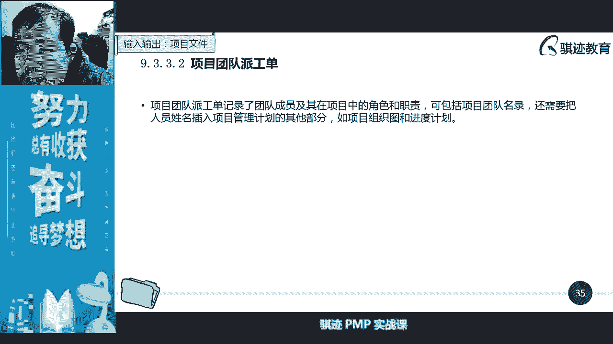

这个要注意，那么除这两个之外呢，我们会输出一个东西叫做资源日历啊，注意资源日历是项目管理知识领域当中，p m p考试当中非常喜欢考这个点，那么首先要注意资源日历有几大特性，第一个特性。

如果你要寻找一个资源，何时如何可用和资源最详细的情况，应该从哪里找，应该从资源日历里找啊，注意啊，这个就是结合考试了，我们就回到结合考试，资源日历是考试当中你能找到资源最详细的，可用性。

最细最清晰的最正确的一个一个来源，叫做资源日历啊，当然不一定你项目，如果你要知道一个资源在啊其他项目上怎么用，你什么时候会变成你的项目，用到你的项目，你可以去查其他项目的资源日历啊。

所以资源这点一般在一个项目当中，是个是公开的啊，是公开的，这是第一个，第二个资源日历，在估算和获取资源之后呢，上面会有初步的资源的一些每日的分布，所以叫资源日历，所以查资源日历。

我们可以按天按照原来的初始计划去了解，每天需要使用什么增强资源，使用资产资源这个注意啊，所以这个东西呢是最详细的啊，如果没有资源日历怎么办，如果没有资源日历，我们可以从项目章程当中找到高层次。

粗略的资资源的啊一些情况，因为项目教程当中是不是有预分配吗，对吧啊，有高层次的关系，相关关系，也会有这些东西，那么这里边也会有相应的啊资源费用，所以考试当中要注意啊，我们如果有资源日历去要寻找资源的话。

有资源日历去选资源日历是最容易找正确的啊，是最容易找正确，那么没有资源日历。

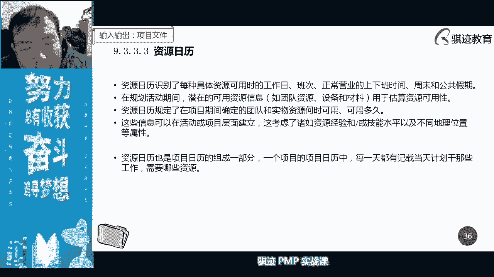

怎么有些同学没有资源日历，怎么没有资源日历，你可以找跟资源日历相关的啊，相相接近的东西，比如说呃如果它里面写，比如说有啊，我们的资源分解结构啊，资源分解构啊啊，资源的需求，这些东西或者相关方登记册。

都是可以拿来临时用用，如果实在没有这些选最好的选项，资源日历的话是可以用的啊，大家看书是可以用的，但是最好的选项永远都是什么资源日历啊。

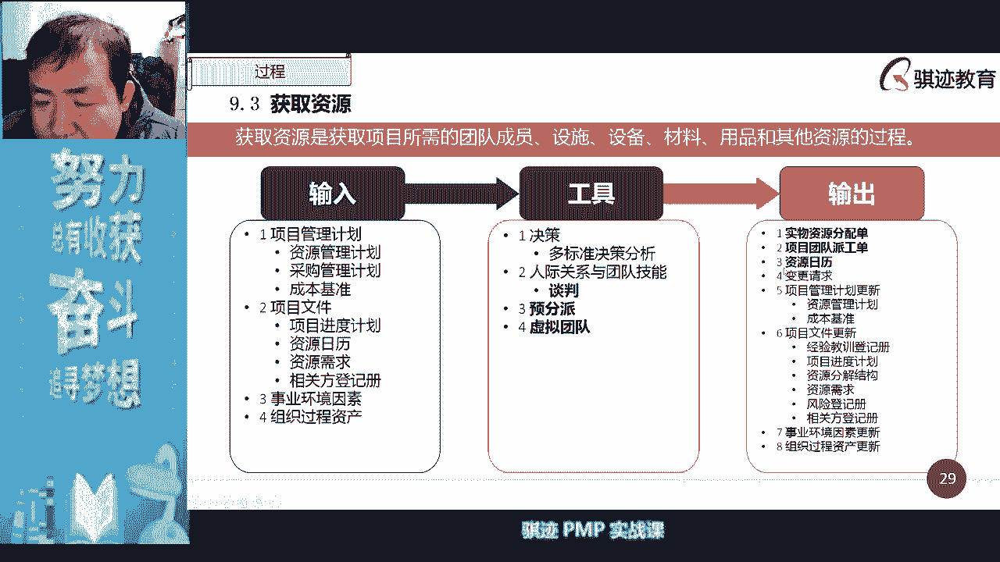

如果这些都没有了呢，你可以选择什么项目，长城啊，真要注意。

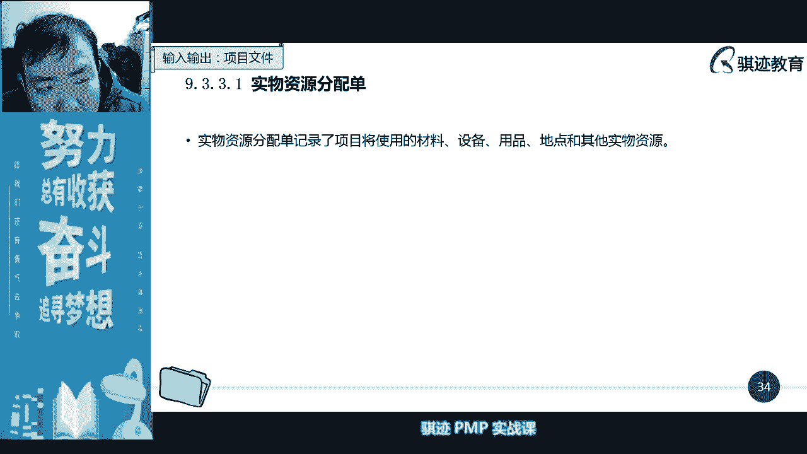

这是第一个，第二个资源日历也是整个项目日历的一部分，那么什么叫项目日历啊，项目日历指的是一个项目当中，每一天它会发生什么事情，这是来源于什么进度，他会预计会完成多少工作量，它是什么，是成本对吧，好。

花多少钱是成本，然后呢他需要哪些资源，就是来自于资源，然后呢他每天会面临哪些风险是怎么样对吧，然后还有来自近的呢，它的每天都不当天，是否是有里程碑的节点啊，这些东西共同构成了什么我们的项目日历。

所以资源日历是项目日历的一部分，卡门这部分，那么为什么会叫叫叫叫叫有资源的项目，人是原来还没有电脑的年代，就有项目管理，那么没有电脑的年代，项目经理怎么管理项目的各个方方面面呢。

他就把项目的各个方方面面呢，先理顺和我们一样啊，范进程啊，范围进度基准对吧，有了基准之后，是不是每天就能切开了，每天都有了，然后把每一天的进度计划安排买定了成本的，成本的啊。

预估的成本进度对应预估的成本，每天使用使用的资源，每天可能遇到的各种风险，每天各种各样的事业环境因素情况，对吧啊，诸如此类这些东西都记在我们的日历上啊，日历是不是一页一页去翻的，都记在日历上。

每一页去记啊，每一页日历上面都记满满积木，就积满了项目经理的各种各样各种各样的呃，管理啊，管理成果啊，信息成果，那么久而久之，它就成为了一种一种形式，项目经理当年在没有电脑是管理项目的形式。

叫做项目日历，这其中关于资源呢就是资源日历，明白了吧啊，所以这种形式呢后来在电脑普及之后呢，也被继承下来，因为我会通过一定的形式，也可以利用像日历这样的形式去看，每天会发生什么事情。

会用什么事情会做什么事情，会有哪些风险，会有哪些事业环境因素，对吧啊，诸如此类的东西好，这就是资源日历的东西，所以资源日历考试当中经常会考到啊，经常会考到，资源投入计划哦，哦同学啊，注意啊。

因为资源其实是不会有什么投入计划，不用这种东西啊，这里资源是伴随着每天你要做什么活动，而发生的对吧，今天不知道你要做三个活动，那么你就要安排三个活动的资源对吧，但是你可能安排了三个活动呢。

资源呢可能需要有需要20个工人，20工人，但是20工程当中呢，你当天呢你已经获获得了，或者预计可以获得呢，可能是15个，还差五个，那么它可能会有个缺口啊，所以资源的电容也会描述说。

比如说有资源缺口也会描述，所以这是一种动态的一种记录，一种状态的记录啊，它不是一种计划，而是一种动态的状态记录，根据每天去切分的我们的状态的变化，资源的状态的变化，的需求的变化。

以及它的当前可用自用状态的变化啊，是这样的好，这就是一个资源日历日历好。

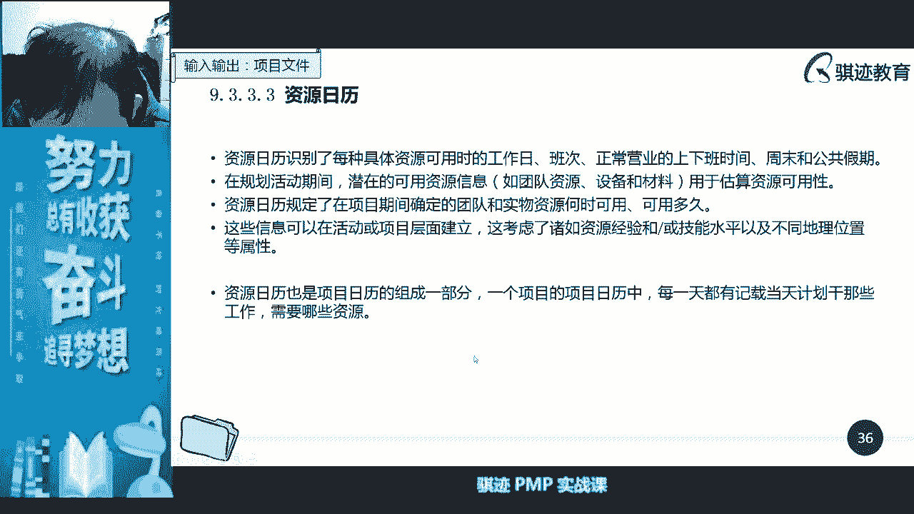

那么到这里为止，注意到到这里为止，到获取资源为止，我们讲的都是人自呃物，实物资源两部分的一个管理的方式，注意啊两部分，那么主要还是讲人，但是呢它会涉及到啊呃实物资源。

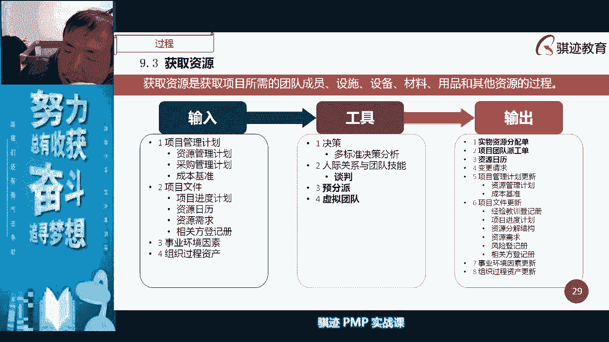

那么从后面这个章节建设团队开始呢。

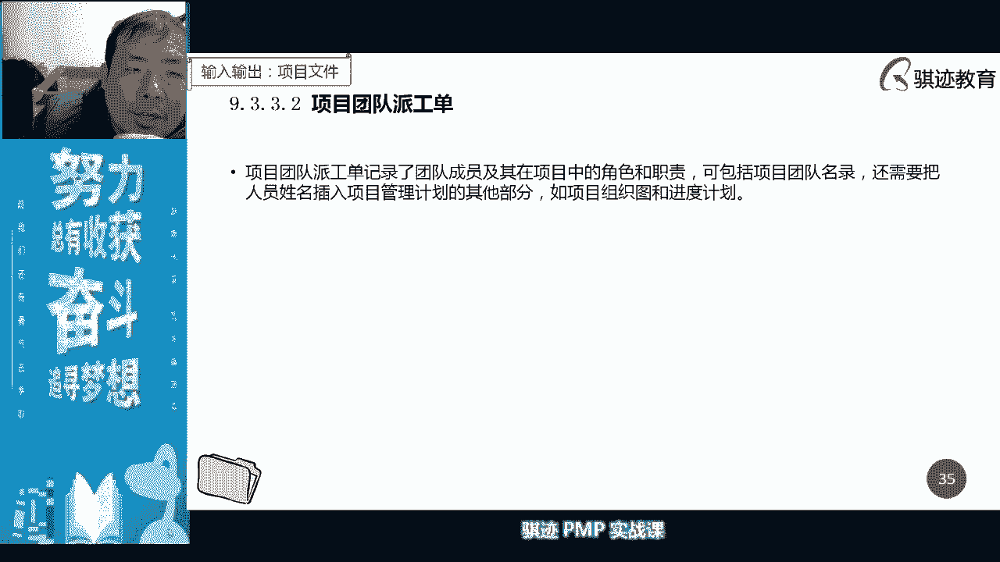

他就是以什么就是以啊纯讲人开始，所以建设团队管理团队都是纯讲人的，注意啊，是纯讲人，那么介绍呢和团长那里面呢，有大量的有有意思的内容啊，当时这节课呢就来不及讲完那么多，我们会先开个头，那么首先我们讲。

建设团队和管理团队的区别在哪里，界限在哪，就是建设团队更注重什么，提高能力，更注重什么，激发信任，更注重什么啊，那我们现在时髦叫in power，有team member对吧，赋能啊。

我们用fishing点叫赋能，更注重这些东西，更注重了人和人之间的羁绊啊，老师发音很多羁绊啊，注重这些东西啊，所以它更运用了什么，项目经理的各种软软的技能啊，比如说什么情商啊对吧。

然后比如说运用运用什么东西啊，项目项目经理，项目经理的这是个人人际关系能力呀对吧，比如项目经理的什么，比如说影响力啊，领导力啊这些东西啊，去做好事情啊，这我们再提一下啊，之前已经讲过了啊。

那么在建设团队当中我们要做哪些事情呢，一提高凝聚力对吧啊，提高凝聚力有什么办法，有些同学就想来一team building呀，team building在什么，在中国就是吃饭呀，对吧啊。

你们知道有个事情玩对吧，team building，每次公司一team building完之后就有人离职，为什么总有一些公司喜欢上啊，在休息日对吧，还要要求大家自费参加team building。

哈哈哈ok啊，开玩笑，然后呢还培训，所以培训也是建造团队当中啊，但是培训就和我们之前讲的那个大家记得吧，整个管理当中知识管理记得吧，和知识的分享是相关系，但是又有区别的啊，有区别的啊。

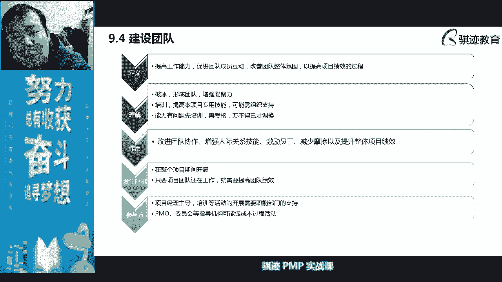

所以我们一个来看介绍的内容中会有各种工具，比如说集中办公啊，虚拟团队啊，沟通技术啊等等啊，那么建设团队当中为什么有集中办公啊，获取资源当中没有集中，因为集中办公不是一种获取资源的手段。

我们前面讲虚拟团队，只是说我们可以通过不在一个物理地点的方式，打破一些资源的约束去获取资源，所以虚拟团队在获取资源那一块当中，是一种打破资源约束去获取资源的一种方式啊，那么在建设团队当中呢。

集中办公和虚拟团队是一种什么，团队的组织形式，它就不是一种获取形式，而是组织形式啊，注意啊，那么当中我们会看到这当中我们要注重沟通，技术交流对吧，要注重激励，其实这里还少了一个要注重奖励。

激励和奖励有什么区别啊，然后呢注重团队建设，team building，team building，关于这个事情，下节课我们我会有很精彩的东西跟你讲啊，礼拜四请注意，千万不要错过啊啊认可与奖励对吧。

培训啊，然后呢呃团队绩效评价。

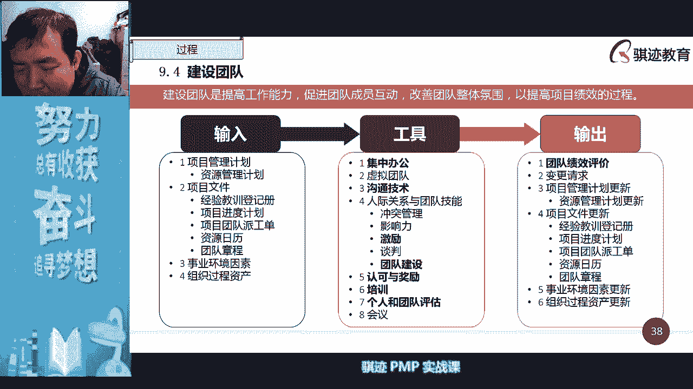

绩效评价如此，那么建设团队的主要目的是什么，提高工作能力，促进团队团结，改善团队气氛啊，所以一个团队要注意一点，就是在建设团队上要注意一点，一个团队当前绩效好并不一定代表当前团队的。

就是说效能好并不一定，但是当时他的状态好，因为他有可能依靠的是什么，团队当中的个人的一种能力，但是依靠单打独干和个人能力是不能够长久的，是不是不可持续的啊，一个团队要能够发挥最佳的能力。

应该是这个团队当中，大家彼此呢能够拧成一股绳，能够发挥集体的作用啊，产生协调作用，产生羁绊，这才是最好的啊，o所以明白这件事情，所以不是说如果你的团队当前，如果你的项目当前绩效不错对吧，进度领先。

成本节约对吧，工作完成质量了符合要求，那么就是说你的技巧是没有问题，就不要搞团队年龄，这不是的啊，所以这一点要注意，所以这一点也是你们以后像你们的啊发起人啊，领导啊，公司老板啊。

要求进行团建的一个理由对吧，注意团建设团队，所谓的团建并不是在绩效不好的时候才展开的，而是要在整个生命周期，项目的生命阶段都要进行展开，以保证始终让这个团队处于什么高凝聚力，高协作性和低摩擦成本。

这样这样一种状态，明白了吧啊，项目经理来应该创建一个促进团队协作的环境。

那么我们如何去实现团队有效运行呢，要用开放和有效的沟通对吧，所以这其实和我们后面一个知识领域的沟通，管理是相关的，要更有效高效的沟通，然后创建团队的建设机遇对吧，然后解决冲突啊这些东西啊。

那么当然解决冲突更多的是什么啊，是在管理团队当中会使用，但是解决冲突的结果，会影响到团队建设和团队气氛，所以项目经理来应该使用团队语言和文化规范，利用文化差异来维护和发展团队啊，促进相互信任。

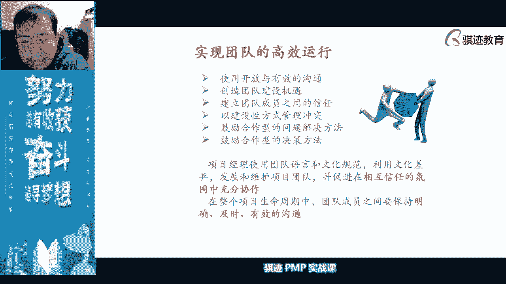

那么团队建设目标是什么，第一个提高完成可交分工能力就提高，就是用现代话就叫提高交付能力啊，有人有人问谢老师，9。3获取资源，9。4建设团队9。5啊，9。9。5，应该是管理团队。

是唯一三个对事业环境因素更新的过程吧。

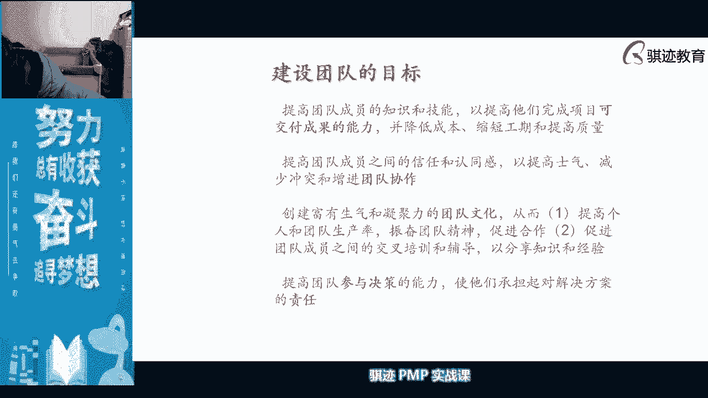

对事业环境因素更新啊。

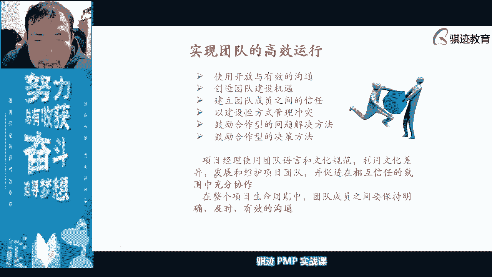

啊这位同学啊，吴奇这位同学很好啊，不是对二环他的事业环境因素的更新。

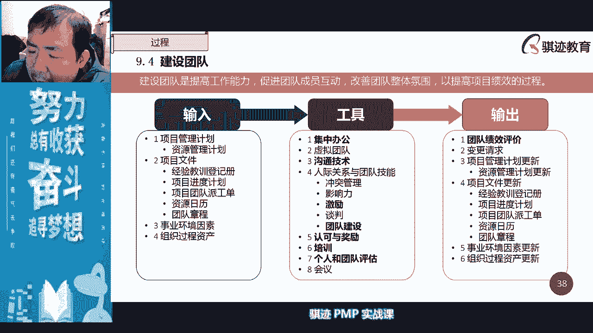

是因为什么东西啊，呃第一事业环境因素当中，人的能力是一种事业环境因素啊，人的能力和资源使用失业失业环境因素对，所以你说是唯三的能够更新对啊，所以但是他只更新一种，就是人和它附带的能力。

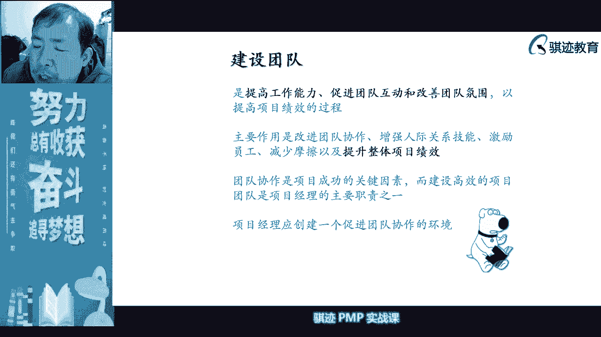

它是更新这个东西啊，所以有同学说是这三个是我们讲获取资源，建设团队和管理团队，是这三个是会对自由啊，事业环境因素进行更新的，对因为你多增加了一个人，对一个人进行培训，是不是他的能力提升了，能力提升了。

或者是整个团队的能力提升了，是不是事业环境都改变了，ok啊，但它不是一个短期的，是一个长期的对吧，说的啊，所以事业环境时不是绝对不能改的，但是他肯定不是一个短期行为，而是一个长期过程，唉对啊。

所以记住了啊，它的改制改一个东西，事业环境因素几乎都是不能改的，他只能唯一能改一个东西，就是在中长期提高啊，一般不会讲题啊，一般是提高团队的能力啊啊好。

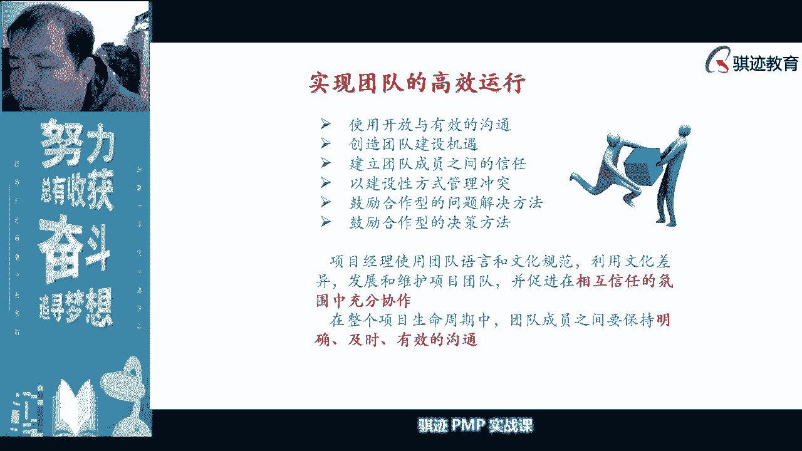

那么我们讲建设团队目标就是这样几个，第一提高交付能力啊，提高交付能力，这是第一个最重要的，提高成第二个提高团队之间的团队协作啊，那是减少摩擦和损耗，第三个啊创造团队文化。

那么这时候的团队文化来自于哪里呢，其实就来自于团队章程，来自于团队价值观啊，那么团队文化有什么好处呢，团队文化可以帮助你在很多时候能够，直接用文化就驱使人去干活啊，作为一个项目经理，他们经常说。

那么工程师为什么会乐呵呵的拼命干活，你要看到的本质，一是我有我有个人有强大的魅力和领导力，但这不是主要的啊，这不是主要主要的，是因为我们形成了一种团队文化，we are family对吧。

然后我们形成了一种啊团队的使命感，责任感这种东西啊，诸如此类的一些文化，这种文化会驱使大家放弃一部分的成见，放弃一部分的利益的关切，然后去做好事情，这个时候团队的啊升级和凝聚力就出来了啊，注意啊。

所以很多时候呢听上去啊，老师你说的很虚很虚的人都是为了挣钱干活，对人在大部分时间都是为了挣钱而干活，但是人不会总是为了挣钱而干活，人总是会有时候会意识到，它不仅仅是为了挣钱干活，不但要挣到钱。

而且要挣到一些钱之外的东西，如果你能让别人感觉到，不仅仅在项目当中能够挣到钱，还能赚到一些钱之外的东西，那么它就会提非常好的，能够提高他的效能，如果每个人都能这样，他就会形成一种团队文化啊，这就非常好。

然后呢还可以什么，通过团队成员之间的交叉培训来分享知识啊，调查培训，分享知识好，提高团队参与决策能力，让他们承担起对解决方案的责任，这是团队建设的目标，对有一点很说得对啊，团队文化要跟企业的文化相关。

对团队文化肯定要符合企业文化，如果企我们的企业文化是99600，70 11 六的话，我们是一个啊拼夕夕的啊企业文化，那么我的团队肯定也是个文化，团队文化是不可能脱开整个组织的文化啊，这个叫康威定律。

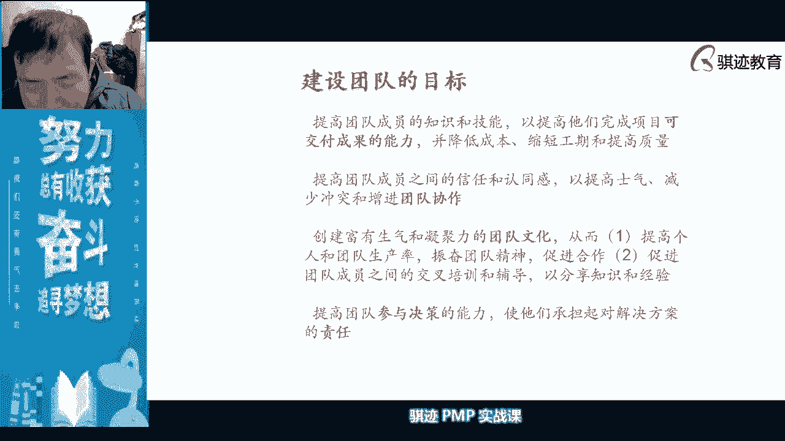

有兴趣可以自己查啊，我就不说了，好那么我们在今天最后的时刻，我们还是讲一下集中办公，集中办公其实和我们前面的虚拟团队，正好是反过来，什么叫集中办公呢，集中办公就是将很多团队成员集中在，同一个物理地点。

同一个物理地，然后进行干活，这样好处是什么，生物大家彼此能够相互促进，第二可以相互监督，唉大家知道相互促进，相互监督，同时呢沟通成本极低，有什么事情扯一嗓子，大家都知道对吧，同时呢还可以增加紧张感。

让大家保持一定的节奏感啊，节奏感，所以虚拟团队有个很大的缺点，就是说什么大家工作都是按照计划来，按部就班了，但是缺少紧张感，因为人不在人的旁边，相互之间就不会有紧张感啊，是人这个动人这个动物啊。

有时候就是一个高级动物，也没有进化彻底啊，就类似于像什么东西啊，就像蝗虫一样，知道吧，蝗虫就是单只的蝗虫，他的性格是很温和的，也不会怎么迁徙，只吃很少的东西，但是它很多的蝗虫聚集起来呢，蝗虫就变了。

黄忠就会啃食一切，他过经过道中间，因为他有焦虑感，据说蝗虫和蝗虫相互之间的聚集多了，很会谈教育，他就觉得别人吃婉儿没有吃，我会什么会饿死，我要我要拼命吃，哪怕我吃进去马上就吐掉，我要吃人也是一样。

像现在疫情期间，很多人在家办公，你会发现什么工作效率呢，往往就依赖于什么工作的计划和工作安排，管理者的安排计划和关心，而不依赖于什么，彼此之间产生的焦虑感和相互促进感，甚至有一些团队内部相互之间的比较。

不会产生于这，来自于这里啊，所以这就是集中办公好处，让大家置身于同一个地方对吧，然后产生焦虑感，然后产生什么产生相互促进感，甚至产生相互的比较感，这种时候呢，能会很很好的激发大家的什么生产力啊，生产力。

所以这是集中办公优点，但集中办公缺点也说了对吧，出差不方便对吧，如果项目在多个地点执行的话，出差不方便，第二呢集中办公，集中办公容易什么，容易被一锅端对吧，像现在新冠时期对吧，有一个同事中招了。

整个办公室就全挂了对吧，这是一个在这个时期特别特特殊时期才能讲了，一个一个一个很很有意思的小玩笑，对吧啊，所以这是集中办公的威胁点，所以经常有时候呢，我们集中办公会遇到什么风险呢。

比如说办公室有人感冒了，完蛋整个办公室所有人都会接下来就会感冒，所有人都感冒之后呢，晚了又要另外一个事情，团队效能下降，因为大家都生病了啊，这是极度万国的一个缺点啊，还有呢还有个什么集中办公缺点。

就是所有人都集中在一起呢，就意味着什么，大家的时间久了，大家的对于事物的看法，观点呢趋于一致，缺乏多样性啊，集中办公室也有一个缺点，就是缺乏多样性，大家看完很多人因为生活在一起久了嘛对吧。

在一起工作久了会缺乏多样性，这个时候呢很容很难，就是有时候不容易，就是说开展一些比如说什么头脑风暴啊，出出一些特别精彩的点子，在一些需特别需要什么，特别需要就是创造性的，开拓性的一些项目当中的。

集中办公的，会压抑团队的创造性，创造性，这也是他的缺点啊，啊所以集中办公呢也也是会有一定的缺点的啊，也是有一点缺点，然后呢人多了之后它会挤对吧。

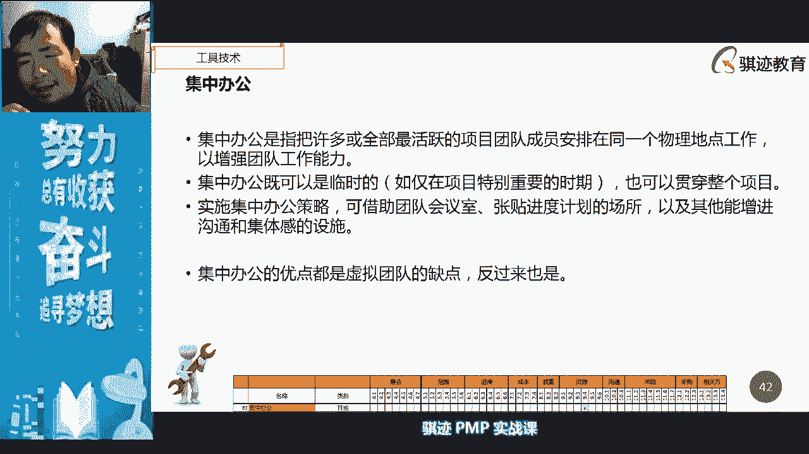

我也会挤啊啊，那么那些玩笑就不开了啊，这是集中办公的优点和缺点，那么集中办公的优点和缺点呢，但是他睫毛最大的优点还是沟通方便对吧，沟通方便啊，好那么沟通当中的沟通技术这些东西特性呢。

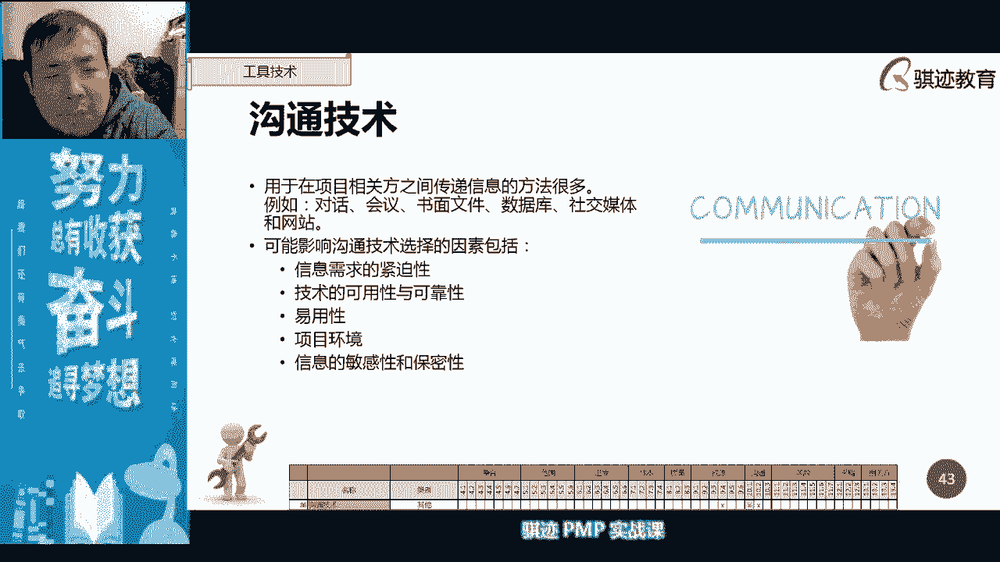

我们这在下一节课再讲，因为沟通里面的很多特性呢，我们在沟通管理当中也会讲好，那么今天的课程呢，我们就讲到建设团队当中的集中办公，请大家呢在周四之前呢，然后呢呃有精力或者有时间的。

然后然后呢大家也可以注重保护好自己对吧，然后外面呢啊不要出去太多啊，不要去一些高风险中风险的地区对吧，和家人团聚啊，然后和自己最心爱的人在一起好，那么今天的课程就到这里，我们下周四再见。

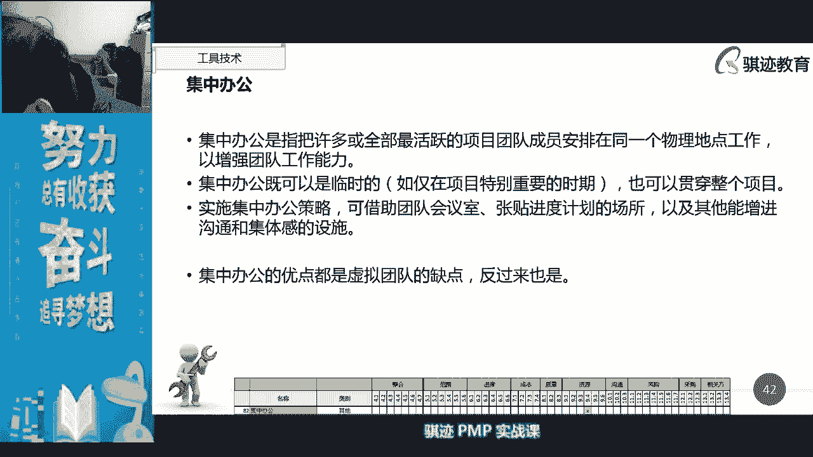