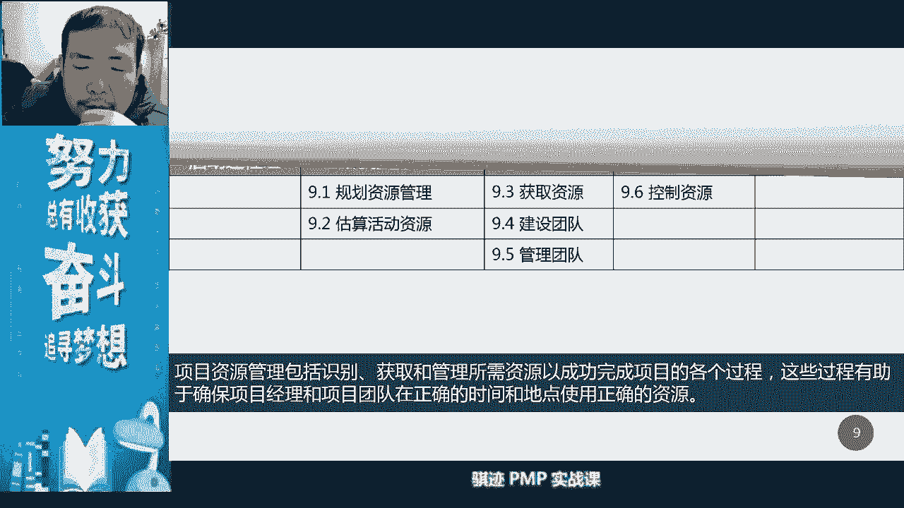
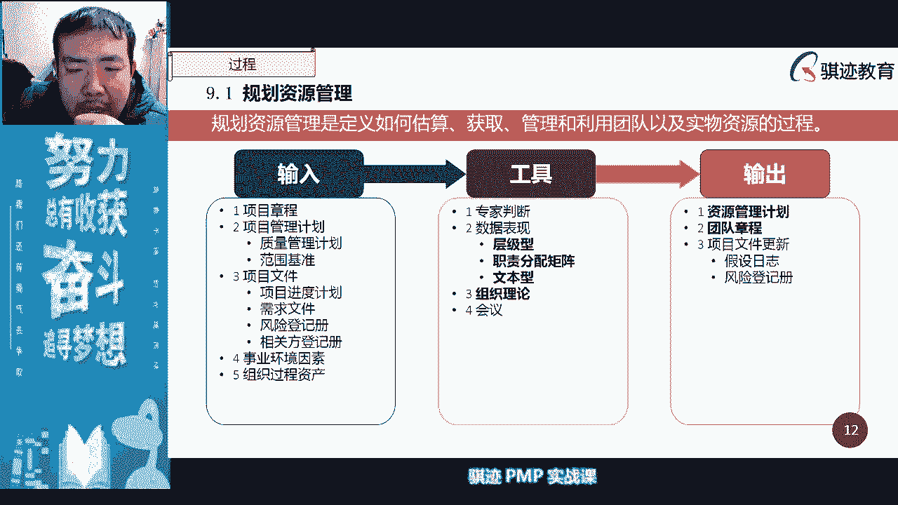
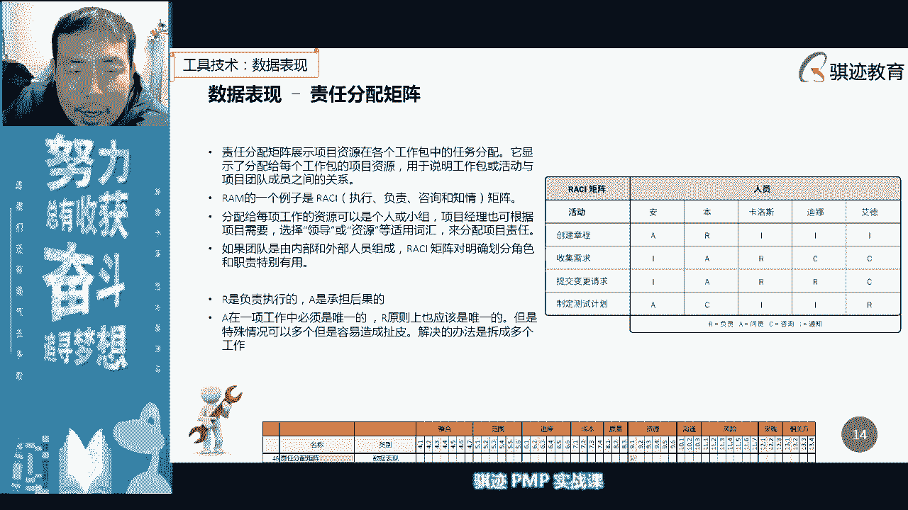
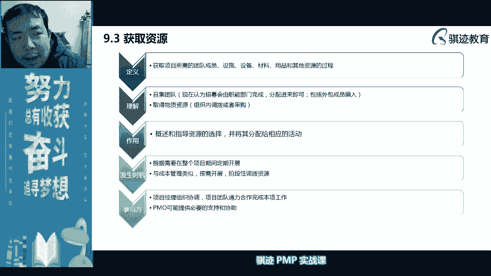
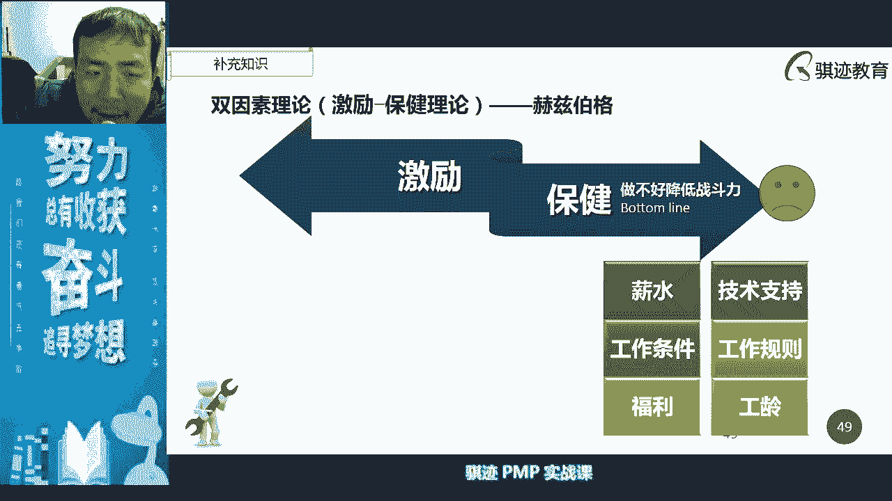
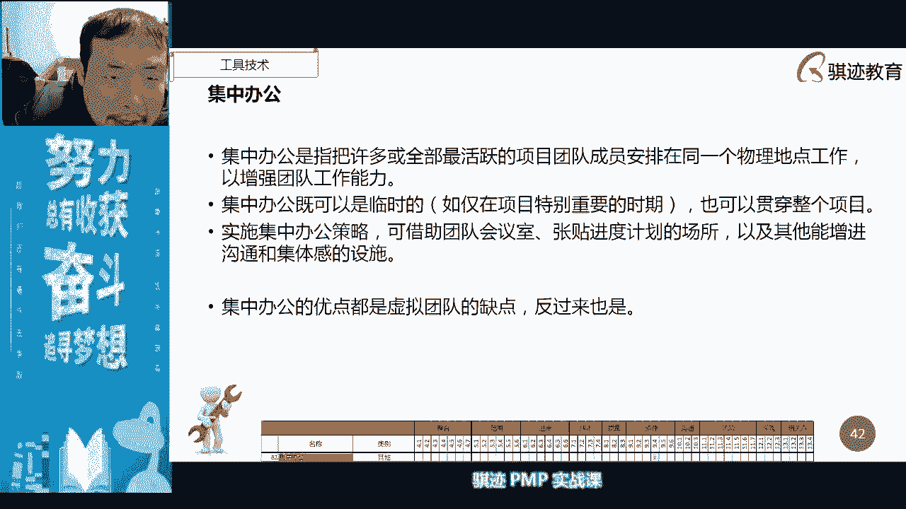
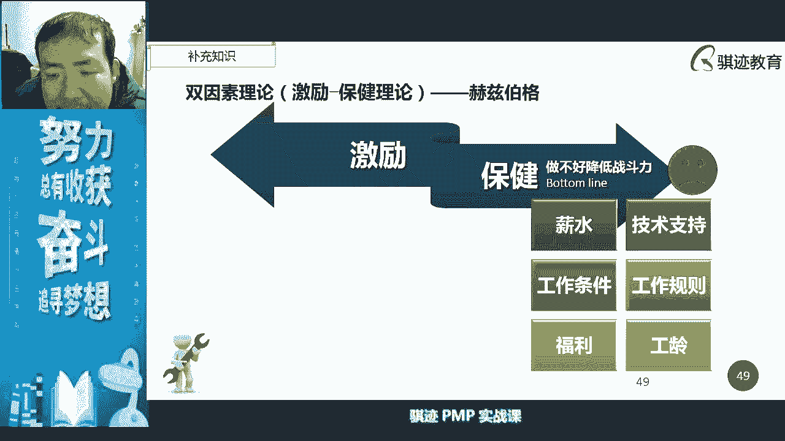

# PMP认证考试课程最新完整免费课程零基础一次通过项目管理PMP考试 - P28：PMBOK第六版 第九章项目资源管理-29 - 骐迹PMP - BV1Sb4y1f7Yt

啊好我们开始啊，我们先用非常快速的时间和节奏啊，啊复述一下，我们啊公布一下我们本本章节的之前讲的内容，那么本章节前面讲的是从开始讲，这是项目的资源管理对吧，资源管理在第六章中称为资源管理。

在第五章当中成为人力资源管理，在第六章当中增加了物的管理啊，ok那么我还是把还是把我的龙角散先放一放啊，我觉得好像可能影响大家嗓音，因为不是现场上课的话，那个啊好可以啊，这样嗓音就相对比较清楚一些。

那么你讲在我们的项目管理当中啊，上面的资源管理，资源管理的主要核心，管理的大部分方法和方法论呢，主要还是管理人对吧，然后管理人当中呢我们要注重啊，很多的就是说人的特性。

人的特性，所以我们在这关联中的过程，是子过程中比较多的啊，用六个子过程，我们实验室规划跟一样是规划，但是规划里面会输出一些特别的东西对吧，像团队章程之类的，然后呢去估算活动资源。

我们讲活动资源主要是什么，跟随着我们的活动的进度，我们在排列活动顺序，估算活动资源是随着排列活动顺序，然估算活动时间之后，就是这个这段时周期呢是迭代的进行展开的，所以它可能执行很多次，然后获取资源。

我们讲一个项目的周期如果很长的话，它获取资源的点那会很多，他可能分阶段的去获取资源对吧，因为过早的去获取资源的话，可能会浪费对吧，资源是有成本的啊，所以当然后面也会讲解，就是资源管理当中呢。

我们就是在控资源管讲，就获取完资源，如果不再有用的，应该及时释放，节省节省成本啊，所以获取资源这个子过程呢，也叫获取并分配资源啊，然后呢我们针对人的管理呢，我们还要建设团队和管理团队两个子过程。

最后一个控制权，所以一共有六个子过程啊，记住最后管理当中有六个子过程。

那么资源管理当中我们主要还是呃什么。

一开始讲了一个东西，主要东西i c i对吧，i c i是用来防止扯皮的对吧啊，那么一个矩阵当中，如果一个分配管理，然后矩阵当中应该只有一个a只有一个r，若干个c和若干个i对吧。

然后这个矩阵呢啊可以的多个，但多个容易，如果有多超过一个亿啊，啊容易扯皮对吧，我们用这个矩阵呢，在kick off meeting和kick off meeting之前，开公会之前呢进行明确责任。

防止扯皮，对吧啊啊这是个非常好非常有用的工作。

工作工具啊，你哪怕是不不做项目管理会用得到，接下来我们讲的是啊，输出了会输出，在制定项目章程当中，我们会输出资源，制定我们的资源管理计划当中，我们会定义人的角色权利职责能力对吧，我们需要哪些资源。

自我们的组织架构图是怎么样的，我们的培训计划，团建计划怎么样对吧，然后呢我们输出的重要东西是团队啊，团队章程，团队章程呢是在我们规划资源管理当中制定的，但是是在管理团队当中使用的对吧。

其实建设团队也会使用的，接下来我们就估算资源是伴随着我们的啊，进度的估算啊，成本的估算而展开了活动的估算啊。

类比啊，参数啊等等这样估算方式啊，ok啊这就不多说了，然后我们会产生估算依据和我们的rbs啊，注意rbs有两个对吧。

resource breakdown structure和啊和risk breakdown structure，我们这里是使用的是resource对吧。

我们后面学风险会见到啊，risk啊，好那么获取资源之后呢。

我们呃这是估算我们当估算估算资源之后呢。

活动资源之后呢，我们开始进入什么进入我们的啊，获取资源啊，这个鼻子还是有点有点塞着，不太舒服，那么获取资源当中呢。

我们记得吧，就是获取并分配，那么获取当中呢我们又谈判预分配和虚拟团队，注意虚拟团队这里是获取资源的一种工具啊，在后面的我们的建设团队当中呢，它是一种团队的组成形式啊，但获取的它是一种方式啊。

我们讲啊我们的多标准决策对吧啊，对人的。

尤其对于稀缺资源，我们要使用多标准决策，来决定使用哪些稀缺资源啊，然后获取资源当中，我们很重要的一个工具叫谈判啊，注意谈判，注意项目经理的谈判呢，需要要用自己的技巧和手段的啊，有时候要死皮赖脸对吧。

有时候呢要欲擒故纵对吧，然后之后呢要用人情关系和社会人脉关系的，也是组织人脉关系，去获取对自己最有用的资源啊，还有一种预分配是预先指定好了。

对吧啊，记得好，那么虚拟团队当中我们优点是什么呢，突破地理位置限制，降低成本，我们可以将不同成本的团队放在不同的区域，去降低成本，减少差旅费用，缺点是沟通不便对吧，团队的效能提高的困难不容易进行进行啊。

面对面的团建和面对面的一些，加深感情交流对吧，他在我们我们后面就会讲了，塔克曼模型当中，他比较相对其他的团队比较难，难以做到什么啊，我们团队之间的默契啊，成熟他跟莫蒙泰克曼模型当中的成熟啊，好。

那么虚拟团队的优点和缺点，正好倒过来就是集中办公的优点和缺点啊，这点要注意，最后呢，我们输出了实物资源的分配单，和项目团队的派工单啊，然后输出了资源日历，资源日历是我们项目日历当中一部分。

会记录在每一天计划干什么活的时候，会分配哪些资源，还有记录是在哪一天，项目的每一天，项目历史的每一天当中，我们有哪每天能有哪些资源可用对吧，以便项目经理可以进行机动，灵活的调整个每日的每日的实际工作啊。

所以做计划是一回事情，然后实际做又是一回事情啊，ok好那么我们继续那么讲。

接下来呢我们就来建设团队对吧。

建设团队当中呢，我们首先谈的目的是提高绩效对吧，增加羁绊对吧，增加羁绊啊，嗯今天记下啊，然后呢，是更加强调用人性的正面部分去激励大家啊，激励大家啊。

增加团队效能，增加大家的交付能力啊，是这样，然后最后呢我们讲了一个集中办公对吧，然后上节课就讲到这里，ok好，那么这节课就开始，我们只花了五分钟时间就稍微过了一下啊。

啊帮助大家回忆一下好，那么这个当中呢啊我们继续来讲，我们要很注重沟通技术的运用啊，功能技术呢我们会在我们的沟通管理当中呢，会详细介绍啊，详细介绍，但是在我们这里呢，我们主要讲的是沟通。

在建设团队当中的一些因素，一些因素啊，因为啊沟通管理当中也会讲啊，那么沟通话里讲的是就是说呃，会我们后面会讲到一个紧接着这里，然后在公众号里就会讲，沟通当中我们会发现不同的沟通技术，他能满。

可能几乎没有一个能够满足所有这些特性啊，沟通在项目的沟通，信息需求的紧紧迫性和及时性，技术的可用性和可靠性，易用性，项目环境的适应适用性和信息的敏感性，保密性啊，这些这些信息呢这些呃条件啊。

我们的沟通的这些条件，可能没有一个工具能够满足对吧啊，就举个例子，微信可以满足我们的紧迫性和实时性对吧，因为微信沟通非常快，但是微信沟通呢保密性可能就不够对吧，然后呢呃应用性很好。

但是呢不适合项目环境啊，什么叫适合项目环境啊，因为不同的项目它有自己的背景，所以你在管理不同的项目当中，可能会有项目自己背景的一些特殊的字，自己使用的工具啊，所以这个呢是要注意的啊，这要注意的好。

那么这个留在我们的沟通管理当中再讲啊，这里就不细讲好，那么接下来我们要讲讲了，第一个，我们在建设团队当中非常重要的一样工具，叫motivation啊，激励metoo motivation。

某些微信呢是指啊，事前促进鼓励积极行为的一种一种方法啊，所以你要记住后面的我们的采购管理会讲，是用的一个东西叫做成本加激励，成本加奖励啊，这些东西会提到什么叫激励，激励就是一个事前的事情。

激励是个事前的事情啊，所以你看到激励激励就是一个事前的啊，所以作为一个领导，肯定是要又要有激励，又要奖励，所以要事前和事后甚至适中，都要有对团队里有一个促进推动的作用啊。

这就叫激励motivation啊，那么激励呢我们会有很多种方式啊，很多种方式，那么这里来了就来了，那我的我问大家一下啊，那么激励当中是不是应该遵循一定的原则，去激励他啊，因为不同的人激励方式不一样对吧。

因为啊但是要注意点，激励不应不一定就是给好处啊，无论是有形无形机也可以也可以是一种什么，也可以是也可以是一种什么啊，教导基地也可以使用，教导基地也可以是一种什么指导，也可以是一种激励。

比如说我在比如说项目经理作为某方面专家，他可以指导某方面的我们的团队成员，对他们进行激励，然后指出他们工作当中不足，对他们是一种激励对吧，告诉他们其实还有更好的，能做的更好的那一方面，这也是一种激励啊。

激励并不是一定要给好处才是激励啊，激励呢要我们现在的激励理论讲，要针对不同的环境，不同的人人的不同因素会进行积累，所以我们后面就会讲到什么啊，我们的马斯洛的，我们的马斯洛的就是原理啊。

呃的塔克曼的原理和我们的啊，那个赫兹伯格的原理啊，分别代表了什么，塔克曼代表的是人和人之间的形成的一种过程，他讲的团队形成形成的一种过程，然后呢马斯洛讲的是人的不同层次，需要不同激励。

赫兹伯格讲的人的内部因素，外部因素也需要不同的方式激励啊，所以是这样，可不可以可以，但是我们讲实践当中那画饼，有些同学说画饼激励激励是画饼是可以激励，确实可以激励，但是画饼师的激励是会带有强大的副作用。

强大的副作用啊啊，ok所以你不要看着基地就是负的，那么基地其实可以很好的帮助一个人，去解决眼前的困难，然后呢促进他呢做得更好是可以的啊，所以他不是划定，比如说我比如说有些人工作的时候啊，我的一些朋友。

有时候工作的时候遇到困难和压力啊，或者是遇到困难或者工作很辛苦啊，他不想做了，然后我就怎么去激励他，激励他继续往前面走，你说做的好一点，你现在当前苦做的好点也没关系，你做了以后啊，做熟练做的好了以后。

你可以以后换工作，换到一个什么工作，是内容是一样，但是压力小一点的，或者更显清闲一点的功能对吧，发挥你充分发挥你能力所体现出的价值，你可以做到一些更好的对吧，你现在的辛苦是为了以前更以后做的更好对吧。

这个不是画饼，这是一种可以看得见的啊，人的努力会带来自身value的提高，这是一定的，只要你的努力方向对你的努力方式对就行，他肯定会带来自身的value的提高的，所以我一直倡导什么啊。

团队成员是需要激励的，但是你激励你需要弄清楚，就说第一我们的总的激励方向是怎么样，你希望团队用怎么样的方式去看待，你对他的激励，第二个你要弄清楚他的性诉求，所以是要用到马斯洛的理论，和赫兹伯格代理论啊。

后面我们就会讲，那么激励当中呢我们要注意是什么，激励和奖励都有一些共同的特点，就是说如果你要对一个团队成员激励，那么那你就要做到一个什么事情啊，比如说做到一个有个事情叫有个叫做啊，坚固和公平。

公平和坚固，就是说有些人呢他可能平时的绩效啊，表现啊或者能力有限，你对他的激励呢是一种促进提高，但是呢从别人看起来呢，因为我们人和人是不一样，你知道吗，我在工作上就遇到有些人能力不错，但是呢他这个人呢。

有些人呢可能会心眼小一点啊，心一点，有些人有些人呢可能生性敏感一点啊，老师其实就是一个生性敏感的人，看不出来啊，看不出来啊啊那么他们呢会很在意，比如说你是项目经理，你是一个团队，你团队的领导者。

他们会很在意项目经理是比如说对谁好，他会觉得呃是不受重视和冷落，所以如果你要去激励某个人，那么你一定要是什么，你一定要兼顾这被激励的这个这个人，周边的其他人的一些一些行为和情绪。

你可以你可以同时去激励很多人，但是用不同的方法，你对一些技巧不好的人，能力比较差的，你激励了鼓励他们提高对吧，你可以用一些呃不用画饼啊，我觉得画饼是个不太好的方式啊，这你要用什么，你要用一些感人的事迹。

去让他们觉得是有希望的，但是呢你又让他们觉得这是很现实的啊，这是一种这就是一种激励，比如说你会你会金身拿你的一部分，比如说你如果做的比较好，你是个比较资深项目经理，那么你会拿你自己的经历告诉啊。

你的团队成某个团队人员说啊，你知道，那么说当初我也这么经历过，当初我也二逼过，对当时我也傻叉过，当初我也犯过很大错误，但是又怎么样呢，只要我在不断的努力，最后获得收益的不仅仅是公司项目，也是我个人对吧。

鼓励他从负面当中走进来，就是这种激励对吧，那么你对于那些绩效好的人呢，你要跟他们说呃，因为那些绩效差的人做的不好，所以他们要动力对吧，但是你是相信他们的，因为技做得好，绩效好的人一般会有什么特征啊。

他们希望别人肯定他们不是，他们觉得不需要别人促进，因为做一个人能力做事情，做得好，那本身就会有什么特点，他会有自我促进，会有个争霸态，滚出来，因为这个马太做到极限，有时候会达到一定的阈值的话。

它就会停止，它会停止啊，因为有些人做的多了就觉得骄傲自满了，然后他就不愿意去做一些，他原来做过努力的事情，这时候呢你要去鞭策他一下，你要去推动它一下啊，你要从它背后去推一推他，让他继续往前走。

但他可以做的更好对吧，当然你要事后也要奖励他，这是也是必要的对吧嗯，你对他来说用应该用更高的期望，期许对他来说有让让他有更好的表现，这些东西来刺激他，让他做的更好啊，这是这是激励对不同人的一种机理啊。

那么其实呃组建团队当中，就是团队成员的后面会评估也会讲的，人和人是差别很大的，但是对于一个项目经理来说，几乎很少有完全没有用的人啊，你只要把人用对的地方，他总能发挥自己作用，大小定论对吧。

当你不把人放在正确的位置的时候，你怎么在激励他也是没用的，所以激励有效果的前提是你把人放在正确位置，让他用正确的方式去开展工作啊，啊这是一个很重要的啊，有有人说希望得到都希望得到任何对，是这样的啊。

所以项目经理在激励人的时候呢，最主要是什么，让他们保持啊，保持这是基地，有时候你适当的批评一个你的团队成员，或者批评你的一个工程师，也是一种激励啊，让你用一个很温和的方式去批评他错误了，然后把他点醒。

然后指出他的问题，然后你给他做一个正确示范，然后告诉他他也能做的怎么样，对他来说反而是个激励啊，所以我有时候也也很喜欢什么，我不希望别人有时候一天到晚夸奖，我觉得这个东西夸奖对你来说。

从来不会给你多带来半毛钱的收益率，也不会提对人能力有任何提高，除了满足你莫名其妙的廉价的虚荣心以外，没有什么特别好，但是如果有人愿意很善意的客观的批评你，我觉得是件好事情，因为他告诉你一些你欠缺的东西。

不足的东西帮助你能提高，对对你是有value的，对吧啊，所以聪明的人会有啊聪明的方式的一种激励啊，所以我们这个也是涉及到马斯洛的理论，好吧ok啊，那么我们会讲啊，我们这激励当中还有一个避免光环效应。

因为一个人在某方面好坏就是问题，所有好坏要注意这种光环效应啊，注意这其实是一种偏见，英文里面叫b i s bus偏见啊，激励和激励方案当中要避免这种偏见，ok啊这个是要注意好，那么首先我们来讲啊。

首先我们在讲激励之前，我们先讲一下几个我们的人际关系的理论啊，人际关系理论当中，pm里面虽然没有直接提，但是说这个理论是非常容易被考到了啊，在很多的管理理论当中都喜欢考叫做塔科曼啊。

塔克猫猫星塔克曼这个人，听说他跟毛毛心是确实是很，那么塔克曼模型分为五个周期啊，大家跟我来啊，人和人之间相处久了，就会产生各种各样的羁绊，但是羁绊和羁绊也是有差别的啊，所以人和人一开始就形成第一层羁绊。

叫做形成forming，forming是什么意思呢，大家开始相互认识，能够有一个基于一个团队的，一些基本的相处规则了啊，相处方式了，这叫forming，大家能处在一起了，就叫forming啊。

人在处于forming当中呢，是很难有相互协作的，相互工作协调的，所以我们如果处于第一阶段forming的话，我们基本上就是相互认识，而是各做各的啊，不能够捏在一起去干活。

所以你可以认为1+1就是等于1+1啊，也不是等于二，也不是等于三，也不是等于一啊，这是第一种，第二种之后呢，人和人之间相处久了呢，不可避免的有矛盾，对吧啊，这个东西我们后面会讲的啊。

比如说一个男的和一个男的相处久了对吧，两个人呢就会发生意见争执，然后两个人吵了起来，吵完之后呢，我们放了课下课，然后回家对吧，下班了我们去撸个串，喝个酒，第二天就关系就好了对吧，啊。

但是呢相反有些女同胞呢，可能相互之间会比较计较，女生和女生相互之间反而会比较计较，男生和男人有时候吵前一天吵架，第二天肯定就好了对吧，然后喝个酒什么东西就好了啊，但女人和女人呢。

更多时候呢有时候感情会更加复杂，错综复杂一点，错综复杂一点啊，所以会形成震荡啊，那么塔可梦模型震荡的一个很经典的例子，就是什么啊，以前我听过一个段子，就说啊，以前有个人读大学啊，一个宿舍里是六个人啊。

以前老的宿舍是一个六个人，现在不像以前在宿舍，现在说舒服很多的大学里面有学生公寓的，舒服多了对吧，一个一个宿舍就两人一间或者四人一间啊，我读大学是五个人，一间还行，一个宿舍六个人。

然后呢这个六个人一共建了五个群，哈哈哈哈啊嗯，那你可以想象这中间肯定发生震荡，人和人之间的不一致，人和人之间想法的不同就会产生什么啊啊啊，产生产生冲突，产生问题，那么他们的不一致性呢大于一致性。

所以他们就会相互之间难产生争辩争论，所以震荡有时候也是好事情，震荡有时候会产生一些在一些需要创意啊，想法啊，思路的一些开放性和创新性的项目当中呢，震荡会产生生产力啊，太过一致，有时候会压抑很多机会。

压抑很多机会成本啊，啊这是不好的好，那么所以震荡呢呃谈不上好，也谈不上好，但是是每一个团队要形成的一个必经过程，除了一些特殊情况啊，和我们会讲特殊情况，所以你要跟着我啊，他干嘛，模型考试非常容易考的。

非常容易考到啊，那么人们经过震荡之后，在项目经理有效的管理管理之后呢，他们的共同点呢就会慢慢慢慢慢慢大于分歧点，大于分歧点啊，那么这个过程呢可以是他们自然形成，也可以项目心理引导。

或者是项目经理在觉得震荡过于巨大之后呢，项目经理可以在某些时间，甚至可以调整团队成员对吧，然后比如说可以可以改成，比如说是呃，有些人掉进来，有些人调出去，会有些人从集中办公变成变成虚拟啊。

虚拟团队这种形式，然后去调整，最终人们会形成一个共性大于分歧的一个特点，这时候呢就进入规范叫norman农民之后呢，相对较为统一的价值观，相对较为统一的一个呃，方法论和相关条件统一的一个流程去做事情。

多少钱啊，那么这个时候呢，大部分团队呢啊和大部分表现一般的团队呢，差不多到这里就结束了，那么performance是什么意思啊，执行表现程度怎么，那么在这个时候呢，这是最关键的词叫什么叫trust。

那英文里面the team walking are open and trust atmosphere。

we are flexible is the key and heroic often of our little importance啊，啊然后就是说当我们行变成执行，表现成熟这个阶段的时候。

人们就开始相互之间才有开放的态度，同时呢相互信任对方，那么它的表现是什么，工作中开始有默契，相互之间能够产生配合啊，就是我跟大家解释啊，有时候p n p不会考那么深，但你明白什么是表现成熟了。

进入最后一个最好的阶段叫执行了，表现成熟的阶段了，那么它就是什么，它就是团队成员开始相互之间有默契，做事情能够相互配合对吧，我知道我接下来的一道工序里面，我的团队成员会怎么做。

那我会事先为他做好一切准备，让他工作顺利，同时呢啊团团队的其他成员如果涉及到我，或者如果诸如此类，然后团队来力争形成一个很好的氛围，然后用一个最有效率的方式进行工作啊。

这个时候呢就是performing啊，这是一个塔克曼认为，一个团队最佳的一个工作状态叫performing好，那么最后一个阶段呢叫做adjoin adjoining，adjoining呢是调整和解散的。

四调整和简单就意思是什么啊，团队呢最终有一天呢总归会进行调整，人员呢总归会有变动对吧，天下没有不散的宴席，在这种情况下呢，人和人之间的关系呢就被打破了，要重新形成啊，在项目当中呢，就是什么项目结束。

团队解散啊，这也是好，那么这个是塔可玩模型的五个阶段，一个团队总总归会经历形成震荡，规范成熟和解散这样五个阶段在项目里面，所以首先大家要记住，学p p t中学一定要学塔克曼，那么塔克班当中一定要记住。

塔克曼的五个阶阶段呢，它的意义是什么，这要记住啊，考试很喜欢考，他会用一个状态例子问你塔克曼啊，模型当中，这是他跟某模型当中的第几个阶段，对，或者他不用直接不问他们，这项目团队处于什么样的阶段状态。

这就是你要用塔克曼模型去回答啊，这是第一个，那么有没有可能，就有没有可能有些团队跳过某些阶段是可能的，比如说你的团队成员，大部分来自于之前的一个项目，那么他们可能之前已经相互之间认识。

他们可能上来就可以，直接是规范或者成熟就可以了，他们之间不需要磨合，大家只共过事对吧，是不是我上一个项目也是这群人做的，下个项目也是这群人做，那么这群人就不在人和人之间的人际关系上。

就不再需要很复杂的一些呃呃协调啊，那形成震荡这个过程啊，就可以直接成熟都是可以的对吧，那么塔克班模型有没有可能倒退啊，有可能比如说他的模型不同，团队执行到一半，很多的团队成员离开了团队。

新加入很多团队成员，那么新加的人和老人之间，新人和新人之间，老人和老人和新人之间有可能产生问题对吧，这时候呢我们可能会成熟倒退到规范，倒推到震荡啊，甚至说所有人几乎都被换完了。

那么可能就是重新倒退到行程也是有可能的啊，所以他可能模型是一个可进可退，可在某一个阶段开始的一个模型啊，那么也有可能是什么，我们大部分人呢都是从就是说老的项目来了，然后有问新人来了，我们一开始呢。

可能是基于什么规范的一个状态啊，然后呢但是呢呃在这个过程中，由于新人和老人产生问题，可能规范也可能倒退，倒退成震荡也是有可能的啊，啊这是可深可退的，但是最终一个管理良好的项目的团队。

总归会逐步走向我们的规范成熟执行，进入执行规范整数performing这个阶段啊，然后直到项目结束之后，进入adjoining adjoining啊，好这是塔克曼模型啊，就是人和人之间形成对吧。

那么了解他跟毛毛经，就了解到，我们的人是不会一上来就像机器一样的，就进入最佳状态工作，所以它是需要一个什么，需要一个过程，需求人去激励他，推动它，所以塔克某某某已经描述了人和人之间关系。

那么马斯洛描写了什么东西，啊啊啊啊啊，马斯洛没想到，那么在马讲马斯洛之前呢，我们会了解一下有一个理论啊，有个理论叫做麦啊，麦克格雷格尔，道格拉斯，麦克格雷格尔，这理论就xy理论啊。

就是人性当中呢会有积极的一面和消极面，积极的面叫做y利润啊，消极的面叫做x理论，人管理人的总的原则，就是把人的消极的移民呢压抑住，把管理人呢积极面的呢体现了啊，但是呢偏薄和第六版已经把这个理论砍掉了啊。

所以没有了，所以不考你这个东西啊，咱就了解一下，如果你考软考的呢，这个还是有可能要考的啊，如果你考p mp第六版呢，这个就不要考了，不考了好，那么我们讲接下来讲著名的马斯洛啊，这是马斯洛爷爷啊。

马斯洛爷爷，啊马斯洛爷爷，这个这个这个这个这个这个这个这个人，很有意思啊，那么他呢把人的需求呢分为各个层次，分为各个层次，那马斯洛的经典的原理层次在商中呢，人呢从安生理需求，安全需求，社会需求。

尊重需求，认知需求，审美需求到自我实现需求这个几个层次需求，只有在事实现底层的情况下，才下面一层情况下才能去实现上面一层，最终达到一个什么顶尖人，在绝大部分人在他的一生当中。

都是达不到自我实现这样一个层次的，只有少部分人可以达到啊，但是自我实践并不一定是，你要成为一个人上人啊，伟人啊，对吧啊，国国家国家领导人啊，这种才叫自我实现，不是这样自我实现。

最最终塔马斯洛的实现的订单的自我实现，是人的一个终极的梦想，或者人一辈子的最最大的梦想，然后最大的心理的认知的诉求，在社会当中自我的肯定的一种最终极肯定，当你实现了这种终极肯定的时候。

你会认为什么我自我实现了，但是马斯洛理论也说，人在使我实现一次自我实现之后，他会对自己提出一个，很多人会提出一个更高的要求，然后又经历私自我实现也是可能的啊，ok啊这是马斯洛原理的言论。

那么我们如果简单的来看，简单的影射马斯洛的和我们的。

在具体的团队管理当中呢，我们就会用到用到这样一个图啊，这个图呢比较简单，比较简单，把把所有层次呢呃分的简单了啊，我们讲马斯洛在啊层次理论，讲不同的层次需要不同的激励，所以不同的层次他的需求是不一样的。

那么他肯定干活打零工，那么肯定是需要什么，像温饱，温饱是一种生理需求对吧，正式工它不但需要温饱呢，还要社会安全保障对吧，我们会有固定的社会啊社会关系啊，那么作为企业的骨干，企业骨干。

那么他就开始有社会交往的需求，在有有这前两者的需求之上，开始有社会交往需求，到了管理层呢，它还是需要有追求荣誉和自尊和社会的肯定，那么最后一层呢，他就会考虑去吧，怎么样实现自己的最终的社会肯定啊。

社会肯定掉线了，没有啊没有啊，ok啊这就是啊，那么所以我们讲了那么多，是为什么，就是马斯洛理论去做激励，丢下去，记得把我们现在讲的激励，那么激励应该是怎么做的啊，根据不同的人层次的人给予不同的激励。

那么所谓的画饼就来了，是不恰当的，警惕什么，他给不在这个层次上的人，四，强行灌输和塞，加了高于这个层次的一种激励理念，他是不容易被人接受，或者会让人产生误解的啊，他的目的是让你错误地定位自己。

从而承担起你这个层次，不应该承担的一些职责和能力要求，只要所谓的画饼，那么画饼和勾勒远景，愿景和激励也是有区别的啊，我们后面也会讲，不要急啊，所以那么举开始举例子啊，那你怎么激励啊啊很简单。

生理需要对吧啊来来来，小张这个活干好了，晚上请你吃饭啊，晚上来了，晚上请呃，请你吃好吃的对吧，就可以，他们更多的是生理需求对吧，出来求财对吧，那么正式工呢它更更注重什么安全保障。

那么你可能说我们说工作做得好对吧，我们可以进行什么正式工啊，普通的员工的正式工作做得好对吧，我们可以进行什么啊，签无固定期限的劳动合同，劳动活动期间限的场景进行社安全保障对吧。

这是这是正式工的一个有效的基地途径，那么对于正式工来说，它的生理需求呢可能也要，但是呢相对来说，那就是一个更底层的需求，那么对骨干和管理层来说呢，它更多的是希望什么啊，有交往的圈子啊。

交往的圈子是这样的，那么在这个过程当中，你会看到项目经理处在哪里，项目经理处在哪里，项目经理处在骨干层和管理层这个加薪当中，大部分的人的项目经理呢都处在这个位置，所以项目经理很重要，需要了什么。

社会交往和社会肯定容易自尊，就是社会社会给予的肯定啊，所以很多人想想做项目经理最主要是什么啊，从一个做技术的啊，做技术的工程师的转型成为一个管理者，得到得能够得到社会的肯定，同时还能扩大自己的圈子啊。

所以我们会看到一个很很有意思的现象，就是说学偏僻的人，附带的附带了很多的收获是什么，他有了一个社会交往圈子，他认识了一些人，这些人跟他一样，也是处在这个圈子层次的人，扩大了自己和同层次人的社会交往。

或者是比他层次低一点，但是不会差很远，社会层次的交往，因为你要知道愿意在网上学p m p的，提高自己的人肯定是一个什么上进的人，社会层次不会很低，那么这学这门课就代表着对你来说，就代表着啊啊这是什么。

对你来说代表什么一个圈子的保证，有一个圈子的保障啊，所以很有意思，很多时候也是一种自我激励，也是一种自我激励，因为你在这个学学当中发现什么，很多人和你一样的，你得到的是你得到了群体认可。

有些人呢在企业当中呢，可能企业对他的认可不够，所以他在企业当中没有获取很多，但是他没有获取很多的企业的激励，哎呀很多人跟我一起努力吧，大家一起努力，为了更好的前程对吧，我们要么转型，从技术转型做管理。

要么从管理呢我们要会赚一个赚更多的钱，到一个更好的位置上去，会有这样的一个效果啊，很有意思对吧啊，那么那么老板呢肯定要实现的目标对吧，有些老板呢比较粗俗一点的吧，要住洋啊，住洋房对吧。

然后然后开豪车对吧，外面彩旗飘飘啊，但是这个价值观不对啊，对吧，ok啊，这个是管理层决策层，那么老师在哪里啊，我在最底层对吧，我给你们上课就是为了挣个饭钱，挣两个饭钱不多对吧，就挣一两个饭钱啊。

我就在那个最底层下面，我是在生理需求这一层啊，所以所以这当当当大家理解一下，理解一下对吧啊，所以对于老师来说对吧，以后你们以后如果哪天在外面遇到我了，或者我出去玩，你们遇到了啊。

请我吃个饭对吧啊别人不抽烟对吧，请我吃个饭啊，酒酒也不喝对吧，请我吃个饭啊，嗯请我喝点饮料对吧，请老师喝个芬达可乐什么啊，我就满足了生理需求就可以了啊，这就是所谓激励对吧。

然后我就可以偷偷都不会跟你讲对吧，你知道eva的四种算法吗，啊啊啊阿q的精神就出来了，对吧啊，大家记得吧，我们的我们在那成本管理当中的e v m对吧，我们说茴香豆的四种写法，e v m的四种算法对吧。

ok啊ok讲个小段子啊，好是老师在大气层，ok啊，你有些当boss前ok啊，不要当boss ok啊，那么这是激励，所以我们了解了这些激励之后，了解了这些不同的激励需求之后，呃。

我们就知道对于某某某一个每一个层次，应该用恰当的这个当前层次所最需求的东西，才能实现最好的激励激励效果，这就是马斯洛告诉我们啊，应用马斯洛的层次原理，告诉我们应该去怎么样做机理啊，这个是很重要的啊。

项目经理会激励人是很重要的啊对吧，如果项目经理不会激烈，那么他只会画饼对吧，画饼是一种很容易伤胃的事情对吧，比赛太多了，吃不下对吧，ok啊这是这是不对，所以你要知道怎么样去激励一个人啊，这是一种激励。

是一种很好的管理手段，因为它是正向的正能量对吧，所以激励恰当是不会产生负面效果的啊。

要恰当啊好那么最后我们讲一个呃，这也是考的叫赫兹伯格的双因素啊，ok啊这个ppt这个ppt做的啊，这ppt不是我做核磁，不真心所认为的人呢，分为内部因素和外部因素啊，那么首先讲什么是外部因素。

外部因素就是保健因素啊，还要healthy effect，healthy vica，工作条件，工作啊，工作规则，这些东西呢是外在给予人的一种激励因素啊，网络对于外界这些东西呢。

能够保证我的botline就是我们的底线，我们的工作体现不会降低，不会降低啊，那么保健因素是一种底线因素，但是保健因素并不是唯一的激励人的因素，那么赫兹伯格也说，激励人的因素当中还会存在一个因素叫做啊。

叫做内在因素，内在的叫做激发因素，激励因素啊，它就叫基因素，叫做翻译问题啊，expirate expiration，那么aspiration是什么意思呢，是它是一种内在因素，是启发人做得更好的因素。

因为光有钱，光有工作待遇等等一些东西，并不能让人做的最好，能让人做的最好的永远是内心的因素，内在因素，那么内测定是什么，成就感，有讨价型的工作啊，责任感提升，进步。

认可和工作本身的一些其他的其他的因素啊，是内在因素，人对于工作本身的一种认可，这种的，所以他更所以激励一个人，我们讲不但要注重他人在整个社会上的层次，还要注重什么东西啊，这个人它所关注的一些方方面面的。

内在的因素和它的外在因素啊，那么你要激励一个人呢，你可以有时候呢关注他的是他的外在因素，比如他工资不高，那么他可能工作的动力不足，那么你有可能什么加加工资，承诺给他加工资啊，加奖金啊之类的对吧。

那么有时候呢人呢并不是看着这个工作的钱，更多的不是看着工作讲什么，他觉得工作没有意思，或者他觉得工作很压抑，气氛不，那么这个时候呢，你要注重他内心的一些内在因素，然后再给他一点成就感，要教会他一定责任。

让他感受到了动力和压力，那么会做得更好，这就叫赫兹伯格的双因素啊，那么黑质不酸因素，其实最终最重要的点就是什么，如果可能的话，我们要同时对于内在因素和外在因素，也就是激励因素和保健因素同时的进行刺激。

能达到最好的效果，同时要保证两方面啊，是能达到最好的效果的，所以偏重了任何一个方面，激励的效果都不能持久啊，注意，所以激励一个人，从赫兹伯格的人来说，激励一个人，一定要是从这个人的多方面因素去做的。

基本等于过于过于偏重于外在物质，也不能过于偏重于什么内在精神需求对吧，过于品种内在精神需求就是画饼对吧，过于品种物质呢就是什么吸毒啊，吸毒啊，这个后面我们在奖励当中会讲的更明系列啊。

所以激励当中我们会有各种各样的手段，然后针对于不同的人去做激励啊，所以我们讲再讲讲回一些实践实操。

那么激励当中其实应该是什么，我们在一个管理一个团队当中呃，建设团队当中应该注重首先项目进行，该注重对于团队成员，我们团队如果不是特别大的话，应该对每个团队成员，他们那自身的各种特性。

针对这些特性去做对吧啊啊，那我能不能举个例子说，比如说你团队当中有一个富二代对吧，但是呢他刚刚工作对吧，或者刚刚试用期工作，他的团队的是社会地位比较低对吧，还没有转正对吧，那么但是呢他是个富二代。

他比较有钱，所以你的基地应该做什么，但是呢他又不缺钱，但是呢他又又要从当他的富二代那种，更富二代的话，他的物质需求呢没有那么强烈，它更重要的强烈是什么啊，社会认同和他内在的就是说工作责任这种感觉。

或者是刚刚工作参加工作的富二代这种，你怎么激励他干活，你要给他更多的什么注重赫兹伯格的。

首先你要更加注重赫兹伯格当中的，我们的啊双因素理论当中呢，我们的责任认可提升进步要给他，因为这是他可能更看重的东西，比起物质来说更看重这些东西啊，那么反过来说，如果你团队里面有一个啊。

比如说是年纪比较大的啊，比如说比跟老师差不多，或者比我还年纪大一点的啊啊一个老同志对吧，然后呢呃家里条件一般，家里工资条件比较压力比较大啊，上有老下有小，那么像这种同志怎么激励呢，他也能激励他。

激励的时候他更干重是什么。

因为老同志嘛，他可能是已经在一个企业中处于骨干层了，那么他的基地更多的是什么啊，社会交往安全保障，对对他来说很好的基地是什么，如果他原来比如说他在这个组织当中混乱的，比如说混得一般，那么你跟你。

你跟他具体说什么，你好好干，我给你提升的机会，第一我我给你想办法提升机会，那么我不能，项目经理很多时候没有权利去提升别人对吧，在组织当中提升，但是我说什么，我可以想办法带你参加一些高管参加的会议啊。

一些参加的活动啊，让你在高层次领导面前多露脸对吧，那你就多表现机会，比如说去汇报重要工作，我让你去汇报工作对吧，让你有各种各表现机会，能够提升你的自我的价值对吧。

那么在他的金赫兹伯格的运输方面呢，我们更多的保证它上它的保健因素对吧，呃比如说给他加点工资，虽然你可能那项目经理，你可能不能加工资吧，我给你多发点工呃，你工作干得好，给你多发点项目奖金可以吧。

这是你能控制的对吧，多放点项目奖金，什么东西呢，你老同志多分一点的话，谁让你挑对吧啊，这样呢针对不同的人，你首先要识别不同的相关方，然后根据不同的相关方，你的像不同的团队成员的特性。

针对他们的自身特点进行激励，会最有效的激发这个团队啊，所以要识人，基于人的基础上去进行激励啊，这是激励方面，项目经理激励一个人是很重要的啊，虽然这一点我就讲了半个小时，但这是很重要的。

因为一个团队如果你是在过项目开始之前，不把大家的激励，把他的工作进行充分激励出来。

那么就和塔克曼模型当中一样啊一样，人们会长久地处于形成和正当阶段，难以进入什么规范和执念，因为人没有主备充分被激励，传销没有主动地向前工作的动力，这个时候活是干不好的啊，这个就很贴近实践啊。

不知道我这个分享给对大家有没有帮助啊，有帮助的请在公屏上扣一，没有帮助的请在公屏上扣六六啊，啊好那么我们继续那么继续搞啊。

好那么这是激励，那么激励呢我们讲是一个事前的，对于团队成员的一个啊促进行为，促进行为，促进行为，那么我们除了基地之外，我们要让团队成员尽快的从形成震荡走出来，走向规范的成熟，那么我们需要什么。

我们我们需要使用一个工具叫做团建啊，来了啊，这一把这一段东西呢团建大家知道怎么回事啊，大家知道啊，大家团结的玩的多了对吧，这种东西呢是我们先讲理论，讲一句话，理论团结是通只通过各种举办各种活动。

强化团队的社会关系对吧，然后让大家更需要协调工作的啊团建，那么团建就不说，那么我们现在接下来讲的是什么呢，团建为什么在中国就变成了吃饭啊，有人居然打666啊，谢谢啊，谢谢肯定。

团建为什么就在一个啊中国的这环境当中呢，变成了一个什么，变成了一个吃饭，首先注意啊，p麦告诉我，以下皆为理论指导，并非本人yy啊，首先第一我们讲团建要根据第一点，pm就是pm说的啊。

这是pm bug在里面的理论啊，团建要根据项目所在的所在地的国家的文化和，要根据这个团队形成了人员呢，形成了他们的团队的章程和团队的价值观，进行啊，那么你们都是中国人，我也是中国人啊，你们都是中国人啊。

啊我也是中国人啊，中国人团中国人最喜欢吃什么，干什么事情啊，吃饭对吧，中国人是个饮食文化，所以吃是在大部分中国人当中啊，有华夏文化，你以你以为啥呢，ok啊啊，他们照样也喜欢吃饭的啊，酒桌上解决问题啊。

ok啊，那么只要是中国人对吧，我们想大部分情况下，我们的团队球员都是以中国人为主对吧，老外可以入乡随俗啊，我以前也经常带着老外一起听building对吧，那么在中国这个大陆这个文化上。

那么什么是一个最能产生文化，吃，因为人可以有不同的爱好，但是大部分中国人都有一个共同爱好，就是吃，我们是一个有5000年饮食文化的民族，对吧啊，中国人在地里面挖出来上千年的，什么什么什么什么汤啊。

什么什么什么啊，丸子啊，什么东西就有了对吧，瓦罐里面啊，你们自己去看新闻，我就不说了，这些东西都说明了一点，就是吃是一个文化共通点，所以用吃这个方式来进行team building。

最能够做到什么一个东西啊，认同啊，所以team building很多的一点是认同，外面为什么有很多什么team building制，玩什么公司，年会制完，然后就离职啊。

这是因为很多的搞team building了，尤其是hi guo照抄国外的很多理论，觉得有些事情做得很荒谬，或者很很很搞笑，讨好好好理论啊，讨好好领导，讨好上司，然后就很开心。

殊不知每个人的心思都是不一样的，这种野外啊啊破冰活动啊，什么野外活动，有些人很不感兴趣，你强行让他去做，会让团队的呃气氛更加尴尬，知道吧，还有些很有些听不定，做的很很尴尬，非常尴尬，我就不多说了对吧。

这些东西都是就是说要根据团队来，当然可以搞不吃的team building，但是每个人的想法都是不一样的，所以在中国搞team building最不容易踩雷的，team building就是吃饭。

明白了吧，这是最好的，所以这是为什么中国人看听到team building tb，就就想到吃饭的原因，所以这是一个正确的逻辑啊，那么king building的目的是什么。

team building目的是什么，提高协作工作效率，所以吃是不能随便吃，team building有哪些，吃哪些东西是最不适合tv 0式，第一第一我认为最主要的是什么，吃高档西餐啊。

有些团队有些团队领导啊，有些有些上市项目经理啊，啊觉得啊哎呀大家工作辛苦了，请大家吃顿高档西餐对吧，请大家吃牛排对吧，然后你会发现什么东西啊，哎牛排这种东西很有意思对吧，每个人且每个人自己的。

每个人自己的生的熟的都不一样，所以牛排是分餐的，知道如果清不掉，每个人点一份牛排，但我想每个人吃自己的，这个时候就很难有什么过多的互动，大家最多扯两句，如果有些人喜欢听，不常玩手机呢，对吧啊。

就像我老婆一样，我老婆除了睡觉的时候，其他时候手机不理解，你天到晚就在那里玩手机啊，这个时候你对这种人用team building吃吃饭，不是水打水漂了对吧，所以像这种过于正式场合的去吃东西。

反而不是一种很好的行为，因为人会变得很拘束吧，然后tpu那栏也还有一种形式，还有一种形式是什么，邀请过多的领导参加，然后人呢你说我听的标题，有时候男的邀请一两位领导参加是可以的啊。

当然前提是我们要把这个气氛安排还是可以的，其实可以拉近跟领导关系，可以让大家觉得更受领导重视，这是不错的啊，但是由于如果有过多的领导参加，过多层级的领导参加，或者是重大相关上去参加，或者还有客户参加了。

就为了让这气氛很尴尬，不利于促进协调，不利于促进协调啊，所以team building当中呢这点是要注意的啊，那么不要形式过于正式，不要做吃过于正式的东西啊，过于正式的东西。

所以team building最好吃什么比较休闲的东西，那么你那么我在公屏里就问你们，你们觉得team building吃什么东西最有利于提高，增进我们的工作协调啊。

这是我每带一届评批班都喜欢问大家一个问题，请把公屏告诉我，你们觉得tbeating吃什么，从要从项目经理的管理角度来回答我啊，team building吃什么或者用什么形式去吃。

最能够提高大家的协同作用啊，现在公屏告诉火锅自助，ok啊，大排档撸串，老师虽然嘴上不饶人对吧，其实心里还是很虚的吧啊然后等会下了，等会下了线，被被被被被老被为你呃，十十呃，被食嫂一阵一阵暴揍对吧。

啊撸串你摇骰子，哎呦喂这位同学你玩的很嗨啊，撸串喝啤酒，ok啊，我看到很多啊，上火锅爽哥啊啊火锅烧烤ok啊，ok你们说的其实都不错啊，但是有有一点要注意啊，有一点要注意吃火锅。

ok我们我们当时就是开发者来讲，就是当时讲tm确定当中火锅是个不错的，为什么火锅是要有个烫料馅料的过程对吧，然后吃火锅当中呢可以探一下，可以增加大家的协作对吧啊。

然后呢火锅当中我们吃火锅是盆子挺多的对吧，递过来递过去对吧啊，但是吃火锅有个东西是什么呢，我的观察下来啊，吃火锅有个小缺点，就是一开始的时候大家很积极的对吧，协作很好对吧。

然后呢彼此了解到你喜欢吃什么东西吗，吃火锅最麻烦的就是吃到一半之后，大家都吃差不多了，好就开始没人动了，大家就开始说，要么在那里吹牛尬聊对吧，要么就尬聊都没有呢，就是玩手机啊，火锅的时效性相对比较短啊。

撸串呢是可以ok带着一个小团队路程，但是如果你带的团队大，比如说十个人以上啊，十个人以上啊，比如说啊十几个人，比如说一起撸串的话，呃这个气氛不容易搞笑，因为撸串更适合小群里一点更多一点啊。

人多一点人他都不适合吃火锅，对这就是火锅的一个小问题啊，ok啊所以我我会推荐大家一个，我每次上课大家推荐大家吃东西，但是我不喜欢吃，但是我很多大家吃一个东西挺别叫吃小龙虾，为什么吃。

为什么吃小龙虾和食人，题目有点，因为吃小龙虾要用两只手吃小龙虾的时候，因为要用两只手吃小龙虾，所以你没第一，你没办法玩手机，知道吧啊这是一个东西，听不定现在里边吃着吃，听不定吃饭最大的一个挑战就是什么。

有人玩手机，但是你是tm beauty，你又不能规定大家不许玩手机，你强行规定大家不许玩手机，又很尴尬对吧，这个显得很做作，但是呢我们要让大家不玩手机怎么办，你可以让大家吃小龙虾对吧。

然后在吃小论的过程当中，你还可以进行一些活动，比如说我们比如说啊，比如说我们十个人，我们十个人可能分为两三个团队，两三个团队，我们开始项目经理说啊，今天放开吃小龙虾啊，今年小龙虾特别便宜对吧。

然后呢我们规规定一个小时，我们规定一个小时之内，哪个团队小龙虾吃的最多，哪个团队有额外奖励，好嘞，你会看到大家拼命协奏曲吃，但全程过程中要求团队自己动手，比如是拿小龙虾挑小龙虾，不必须自己动手。

但是给团队，团队和团队之间的男男生，女生之间可以相互帮助，你可以设置各种规则，然后呢大家从什么玩手机的这种啊，电子这种这种感觉中脱离出来，变成一种又又很兴趣，能满能满足口腹之欲。

第二呢又有一种竞争和和协作的气氛，这是个比较不错的办法啊，吃小龙虾，然后呢吃小龙虾当中呢，你还可以组织喝酒对吧，组织喝酒啊，然后吃啊喝啊，然后呢大家呢就非常开心了啊，这是一个很不错的办法啊，这仅仅是啊。

没有固定答案，我只跟大家分享一下啊，啊我觉得一切以吃为形式的team building里面，我们尽可能要避免什么各种人为因素的干扰，各种什么个体活动啊，尽量以群体活动为自助餐的。

自助餐一开始其实不错什么啊，比如说tm我们可以发挥协作对吧，那我看这位置，你去拿东西啊，你帮我带点什么，你帮我带，但是自助餐一旦挑完之后呢，咱就开始各网络吃，因为东西吃了很多，大家开始往嘴巴里塞。

都不说话了对吧，吃小龙虾有个特点，就是小龙虾有剥的过程，知道吧，播的时候你的嘴巴是空着的对吧，小龙虾就没办法一口一口往里面塞了，你肯定播一个吃吃一下，然后再去播，你有一个播的过程对吧，播的过程中。

人就要么就把喝饮料，要么就是嘛聊天，这时候呢题目必定自然而然的气氛就来了，现在为什么不开始收手机啊，所以我们讲听不听当中，一定要让大家处于一个自然放松状态，如果你上来就收掉手机。

不是一个很我觉得最佳的方案，ok ok啊，而且像我这种像我这种有好几个手机的人，对吧啊，也有了对吧，有些人可能说你把他手机收掉，他可能说哎我有工作对吧，那客户的联系我就就做个事情。

收掉手机不能干活怎么办对吧，人都有理由的对吧，或者说哎呀我老我如果手机不在旁边了，我电话啊，我老婆打我电话，我不接手机的话，我回家，现在要跪榴莲的，跪榴莲壳了是吧啊，怎么办，对吧啊好。

这就是team building给大家分享一下啊，所以team building注重的是一个什么，最适用于本地的团队文化的，能够促进他们进行协调，有效协调工作的一种形式啊，所以在中国那是吃。

可能在国外那就不一样了对吧，有可能在国外可能就是玩对吧，有可能国外呢可能一起读书啊，有些地方呢是呢听不见，像什么国外的肯定一起去到教堂就是什么，别人都是可以的，都真的都是可以的啊。

或者是家庭聚餐也是可以的对吧，中国人现在也有家庭聚餐啊，其实家庭聚餐也不错，但是对场地的要求高了一点点啊，场地要求高，一定要聚餐的人，家里要大一点对吧，啊那么最后一句也很重要啊，最后一句很重要啊。

非正式的沟通和活动，所以tm building里面基本上基本上不要用，很正式的规则不好啊，还有最后一句最最后一句啊非常重要，如果项目环境不断变化，要应对对面team building就要持续不断的开展。

学完这一段之后，大家以后在项目管理当中啊，项目管理当中，就可以理直气壮的用我今天教你们的理论去，向发起人要钱，说我们要搞题目定，而且要持续搞题目零对吧，这是偏偏教我们的，对吧啊当然你怎么表达可以。

但是你跟他说这是有理有据的对吧，有理有据的，你们现在知道怎么歪力了啊，ok啊，像轰趴这种东西呢啊不容易控制啊，为什么喜欢去ktv啊啊就是搞轰趴或者搞什么啊，跨年啊，就是这种活动呢不容易控制。

但是一有很多人有上有老，下有小的，不好控制时间对吧，他可能没有兴趣，家里有牵挂，吃顿饭的还可以，第二很多时候同事之间活动搞得时间太长了，然后容易搞出事情对吧，团队反而可能会受到重大打击啊。

这你们懂的对吧，ok啊这是tm p定好，tm p呢是在项目进行过程当中，会持续的进行进行的啊，这是一个进行过程，那么在一项工作做完之后呢，我们要做一个事后的肯定行为，叫做认可与奖励，任何奖励啊。

award award，那么认可和奖励是对于项目团队成员，良好行为的认可，另外任何奖励是应该是被计划好的，所以只有在满足要条件下才能认可奖励，所以我们在一个项目当中，如果我们要制定任何和奖励。

应该不是项目经理随性的，项目经理随性的这种奖励其实是不好的，知道吧，这是第一点啊，所以奖励不是随便奖励的，奖励应该是什么，事先定好规则的，比如说我要奖励，我要奖励啊，某某些行为，那么我不会针对某些人。

但是我会说在项目当中达到怎么样的具体指标，或者达到什么样的要求，或者实现某个事情做好，做好某件事情，我可以对他进行奖励，那么这个时候对人人是公平的，公平的奖励才是有效的奖励啊，注意这只针对于某个条件。

某个需求的奖励才是有效奖励，针对某人的奖励是无效奖励，那么奖励呢，可以使用正式的方式和非正式的方式来做出，可以使用认可和奖励方式，是可以是有形奖励和无形奖励相结合。

但是我们推荐项目当中使用无形奖励更多啊，那么来了我们供应商再回答问题，你们觉得你们希望得到从从一个啊工作者，不是从一个项目经理角度，从工作的角度，你们最希望得到什么样的奖励啊，什么样的奖励，ok啊。

来来来，一邦尼以带一，ok你从工作中最希望得到什么样的奖励啊，公会员告诉我一下，nb对吧，琴啊我知道他能琴啊，对从员工的角度啊，大部分人我相信都喜欢更愿意选择实际的，cash是最实际的对吧。

cash是不会骗人的对吧，但是来了，我们现在是从员工的角度，还是从一个管理者角度，我们是从管理者角度，我们是项目经理，所以从项目经理的角度，钱并不一定是最好的，从员工角度是最好的啊，所以看的角度不同。

所以得出的结论是不一样的，为什么，那我就给你举个例子，如果有a b c3 个员工啊，如果sinx 3创造团队成员，他们呢呃要对他们进行奖励，你事先制定好对他们奖励，达到某个指标进行奖励。

那么第一个月的时候呢，a做的是最好的，然后达到了奖励的标准了，你对a金奖励，比如说按照你们的理论奖励，比如1000块钱奖励1000块钱，那么a是不是很开心啊，很开心。

那b和c呢唉可能会略略略有一点点不满，略略略会有一点点不满啊，那么b和c就希望什么，下个月或者是下一个周期呢，我也能拿到奖励对吧好，那么事情呢但是呢a呢会受到奖励的，他会很开心对吧。

他会后面会考虑会做的更好，那么第二个月呢，如果假设如果仍然是a做的最好，那么仍然是奖励a那个事情就来了啊，你不考虑在这种情况下，a b c3 个人，我仍然给a1000 块钱的奖励。

这个时候你会发现什么产生了边际效用递减，因为上个月a刚刚拿到了1000块钱，这个月又拿到1000块钱，a觉得这个1000块钱他应该拿的，你们会想一想，你第一次拿到1000块钱的奖励。

和第二次拿到1000块奖奖励的时候，哪一次更让你兴奋开心和有何有干劲啊，肯定是第一次，是不是你们真诚地看着我眼睛，是不是第一次对你来说是印象最深的人的，第一次总是印象最深的啊。

比如说你第一次拿项目奖金对吧，好，那么这个时候这个时候a的刺激效用啊降低了，肯定是用来降低了，他觉得这是理所应当的，因为他做的最好嘛对吧，事实是他做的最好，但是这违这一定程上已经违背了我们的奖励。

出装是促进他做的更好，对吧好，那么b和c b和c就更不满了，咦为什么老是到哪，how old are you，老师，你拿奖励，这个时候b和c的不满，经济就增高了，你会发现什么好的作用呢变小了。

而负面的作用就变大了，好长此以往，如果是老是发生这种现象呢，就会发生什么，没有拿到奖励的人越来越消极消极怠工，工作效率来一下，而拿到奖励的人呢觉得无所谓，应该得的，然后整个团队效能反而会被降低。

我说的这个场景啊，有人说老师你的眼睛在哪里，你这个过分了啊，你的眼啊，你们这个过分了啊啊我们说奖励和激激励不是，但是奖励肯定是第一次是给你印象最深的啊，那我那我参加工作的时候，第一次拿到工作奖金的时候。

我觉得心里很开心的，哎呀呀还有奖金啊，然后拿了几百块钱，好像拿了300块钱，我就很开心，哎呀还有300块钱这么多钱啊，好歹拿多了诶，这个月奖金什么时候发啊，怎么还不发奖金啊，这日子怎么过啊，对吧。

很很现实吧，很现实，这是很现实，所以你管理这个角度和管理的角度看你，你的解决办法是一，这是什么，有几样几种指甲，第一哦，这个这个是给a下个比，给b下个月给c，然后就变成什么东西啊，奖励变异化了对吧。

那么a b c觉得这个事情原来是轮着来的啊，那么我们稍微干的好一点就行，但就大不了轮着来的吧对吧，每个人都会拿得到，就会失去了对于工作优秀表现，良好表现的一种认可和鼓励的这种作用对吧，第二种什么呢啊。

第一次给1000块钱，第二次呢给2000块钱，第三次呢给3000块钱，就像吸毒一样啊，不知道你们吸过毒没有啊，我也被吸过，我这只是猜吃有些东西的时候会上瘾，的时候会越吃越多啊，就像吃东西的时候。

有些好吃的东西，你吃一开始吃的时候什么，你觉得吃一点点就很好吃，然后你吃了做错了，要增大剂量才好吃，对吧啊，就像喝咖啡，一开始呢喝什么，喝很清淡的咖啡就可以，到时候呢咖啡越喝越浓，然后呢不过瘾了是吗。

要喝浓咖啡对吧，喝茶一开始喝淡茶以后呢，可能晚上喝浓茶人呢对于这个刺激呢会有衰弱，你就通过增强刺激啊，只要吸毒养，这个通过增强吸毒呢才会有什么东西啊，才会保对它保持刺激啊。

啊所以你们以后有时候可以去试试啊，去吸个毒体验一下啊，啊但是不要说我教唆你们吸毒啊，ok啊开个玩笑开个玩笑，所以这就是一个什么东西啊，这是个上瘾的过程啊，这种副作用是非常大，所以也不建议。

去促进大家做事情，这种到最后肯定会成本会无法接受，而从笑负面效应上也无法接受啊，人也会行为会被异化，怕大家本来是冲着理想来的，有一部分冲着什么工作以后提高能力，然后有更好的前途来到最后就是冲着钱来的。

这时候工作就被异化了，明白吧，所以无论如何，如果你在在进行奖励过程中，都是以有形奖励和物质奖励为主的，那么他多多少少会存在时间累积的弊端，所以你要避免这种弊端，更好的方式还是什么，有形结合五行。

以无形奖励为主，辅以友情奖励来避免这种事情，因为无心奖励可以满足人的虚荣心啊对吧，人的虚荣心有时候不是钱能买来的，而且这个东西没有那么高的成本，也没有那么高的什么边际效用，而且也不会有什么东西啊。

也不会有什么太多的上瘾效应，这是无心奖励的一个特点对吧，因为你可以创造出各种各样的虚荣，然后让人呢去感受什么，就就就像上瘾一样去做做事情啊，但它赢很快会消失，不会有上瘾啊，但是会有刺激作用啊。

所以我们讲我认为啊书上也认为啊，偏偏颇客也认为无形无形奖励呢会更好一点，服役有心奖励，但是有形无形都要有啊，光有无限奖励，没有心奖励，这叫什么，这也叫滑冰啊，也叫滑冰啊，也叫好，那么项目经理最后一句讲。

项目经理应该在整个寿命就这样，应尽可能的给予表彰，而非项目完成手对吧，所以说要奖励一个人，就要在过程中，因为奖励了马上就可以，什么总人被奖励，总是能马上能激发出更高的生产力吧。

那么这个时候对项目接下来进行会有好处，等你项目结束了还有什么意思啊，你只能说为未来项目，为你的人际关系，为组织了未来的工作效能体做了贡献对吧，对你项目其实没有好处啊，这一点要注意。

所以奖励和激励要及时啊，有有好的必要表扬，有差的必要批评，有好的奖励，一定要及时的奖励啊，当场反馈，但是要根据一定的客观标准来去奖励啊，这是最好的好，这是认可与奖励，所以奖励是事后的好。

所以我们回顾一下，我们将事前呢有激励，事中呢有tm building，事后呢与任有认可与奖励啊，这是我们的一系列的建设团队手段，它是使用的是更多是无形之手，去促进我们的团队的啊，效能的提高。

有效的无形奖励有哪些啊，哎这样，人的很多时候的无心奖励来自于很多的满足，人的一部分莫名其妙的虚荣心啊，我们就举举个很low的例子来说啊，举个很low的例子来说啊，就说很多很多很多很多老板会做一做。

这份奖励啊，比如说我们单位里有个员工啊，比如说活干的很好，老板会怎么无心奖励他，哎哎呦，这个同这个这位同事啊，这位这位员工工作辛苦了，来老板下班的时候来我这部，我这部兰博基尼带你回家，我开兰博基尼。

这种事情对你来说有半毛钱收益没有，最多发个朋友圈结束了，但是会让你在内心当中有极大的内心满足了啊，我问你，如果你你们公司老板，你是不是觉得很开心，虽然你没有拿到半毛钱，是不是，就是只要满足人的。

一定的莫名其妙的胸襟就可以了，对吧啊，这种后者呢有些比较low low一点的啊，比较low一点的，比如说公开表扬对吧，发个奖状对吧，然后呢，很多时候比如说很多企业喜欢说工作满3年，5年10年，20年。

15年20年，然后给你发个纪念碑对吧，这些都是什么认可与奖励对吧，这些东西又不能换钱的了，但是可以给你一个什么什么东西啊啊啊，可以给你一个install b的一种一种一种感觉和资本，对吧。

这是一种无心奖励啊对吧，人会无形之中就会产生企业的同感和较好感，那么在项目当中呢，比如说我们在做项目当中，比如项目完成第一阶段对吧，然后我们给每个人发一个很精致的第一阶段呢，完工奖章别在胸口对吧。

唉这也是一种虽然很微小，但是也是一种对吧，或者说什么呢，你工作做得好，比如说你是一个优秀很优秀员工做得好，那么给你一个什么奖励呢，这个员工比较喜欢爱笑啊，前提是他喜欢爱笑啊，来啊。

本来是说这个这个一期项目报告，比如说是啊项目经理去做项目管，来让某个员工代表。

