# PMP认证考试课程最新完整免费课程零基础一次通过项目管理PMP考试 - P3：PMBOK第六版 第二章项目运行环境-3 - 骐迹PMP - BV1Sb4y1f7Yt

hello，大家好，hell，然后好我们今天的课程正式开始啊，正好课程正式开始，好都到了吗，ok啊都到了，好那么我们今天的课程开始啊，在开始今天的课程呃，第一个内容呢我先跟大家解释一下。

因为上次就是说前天的课程当中呢，有部分同学反映啊，反映就是说我可能上课的内容比较多，然后节奏比较快啊，有些同学可能觉得跟不上啊，你让老师讲得慢一点啊，或者说老师你讲的再细一点。

ok啊这个是老师就是体现出老师的一种心情啊，当然啊因为第一节课有第一节课的情况，因为第一节课的内容会比较多，我讲我要表达他的讲的内容，其实大家知道就是看我增加很多内容，其实考试会考我增加的那些内容啊。

我看完那些内容，我呢尽可能的给大家传达考试中所需要的啊，很多东西啊，各种知识，所以呢不可避免的可能时间加长一点，然后呢呃我对大家的期望比较高，所以我对大家传授知识啊，传授的知识量比较大啊。

有可能有些同学可能跟不上，ok好，那么没有关系啊，只不过第一节课有些东西没有听清楚，我们等会在第一，因为第二节课的特点是内容相对少一些啊，当然不是很简单啊，也要很多有重点考试要考的。

第二节课的内容呢相对少一些，那么我们会先把第一节课的内容呢，我们复述一下啊，复述一下，然后呢嗯帮助大家巩固一下内容，但是我希望的是，我希望的是大家全都跟上，我跟上，我不要用一个很放松很懒散。

因为大家珍惜，这是呃第六版改版前的最后一次考试机会了啊，这个考试机会是非常难得，因为后改版之后可以预期到，肯定难度会只会上升，不会下降啊，是这样，我神经紧绷，神经紧绷，所以我上课其实是节奏比较紧绷的。

然后那样去要求大家上课了，所以希望大家啊大家注意力比较清晰一点，有可能因为很多同学可能刚吃完饭或者正在吃，一边吃饭，一边看我直播啊，我就理解大家大家都比较忙，但是还是需要注意力集中啊。

ok我们先来我们上，首先我们先进行一下啊。

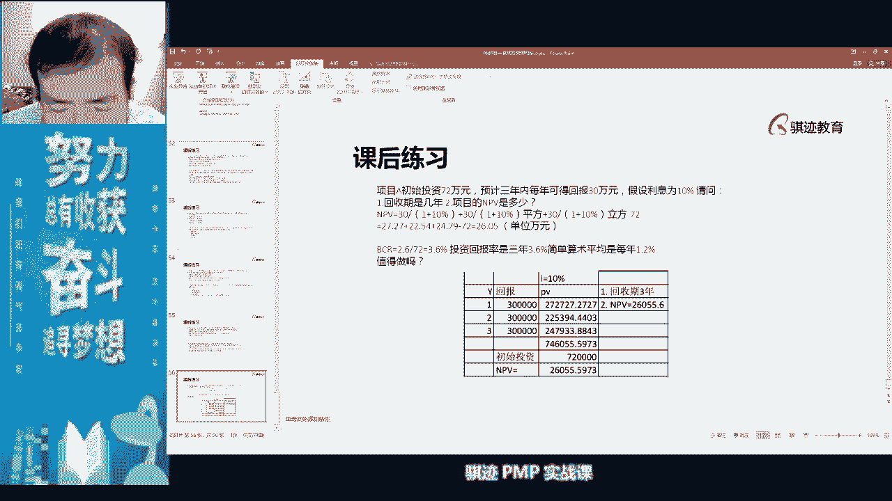

大家记得吧，然后我们的我们不再把第一节课内容回复一下，呃，它初始投资72万，然后呢预计呢每年可以获得一，然后预计每年可以获得的回报呢是30万啊，30万，然后呢假设利息为10%，假设利息有10%。

回收器是几年，mp v是几年啊，是这样一道题目，是这样一道题目，ok嗯嗯等等等稍等嗯，我好像啊，大家是不是稍等一下，我怎么觉得好像画面有点卡住了啊，ok啊有没有卡住没问题，那么这道题目大家可以看啊。

公式我们已经给出了对吧，我们在上课当中已经给出了公式，是先给出了np b呢，等于是第1年的收入啊，有同学在上课时课后问我一个问题，老数收入和利润利润是什么关系，我说收入就是你的拿进来的钱。

利润呢要扣除你的成本，如果题目提升当中，没有说当年的每年的成本是多少的话，那你直接认为收入就是利润，如果他说每年的成本多少的话，你要把成本扣掉对吧，那么我们这道题目当中是没有提到成本的。

所以你可以认为是没有成本啊，p n p考试当中一般不会提出太过复杂，计算题太过复杂，所以啊在这个题目中，我们就默认啊30万是呃收入，然后没有成本，但是它的成本体现在初始投入的72万啊，明白这个意思。

那么300000÷1+10%是第1年的，我们的啊净收入啊，呃动态收入的第2年呢是30万，除以一加10%的平方，第3年呢是一加10%的立方，然后呢减去一个初始投资72万啊。

这个呢我们有位同学在群里面贴了一张图啊，非常不错啊，我们要同学在群里贴这张图，这张图呢是显示了啊，每1年的利润和回报等等，这些图啊，非常清楚啊，那我就直接借过来用，其实说我也我也可以换一张图。

但是有的我就直接用对吧，然后我们最后得出的我们的npb是多少呢，啊我们的n p b sorry，我这里哦，我这里六点写错啊，六点写错是2。65万，2。65万，不是26。5万啊，这是老师写错了啊。

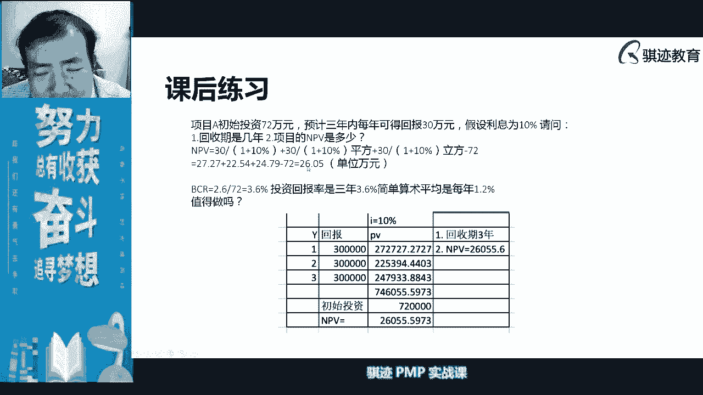

稍微有点笔误，那么我稍稍稍稍改一下，我稍微改一下。

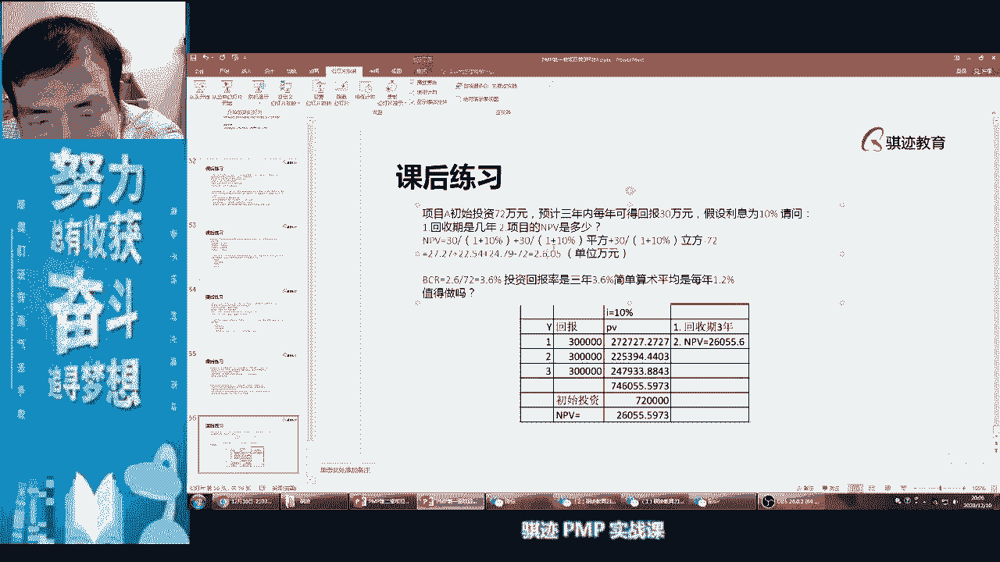

肯定比存一下，然后我们再重新开始啊，好我们的收入是2。65万，我们的净收入是2。65万，那么2。6万它是正的还是负的，首先第一点问你们是正的还是负的，那么是正的，所以这个项目可不可行。

如果我们在商业论证当中，这个项目是可行的，那么可行性报告当中，这个项目呢是可以做的，但实际上呢在我们的商业论证当中呢，我们就要考虑这考虑一个东西，就说投资回报率，那么投资过率怎么看呢。

如果我们比较简单的看的话，就是啊整个因为项目如果假设为3年的话，那么3年的进我们的进的投资回报是2。6啊，我们的动态投资回报是2。6万，我们的投资是72万，那么我们的投资回报率，3年的投资回报率是多少。

3。6%，3。6，那么简单的算数，平均的话，我们每年的投资回报率仅有1。2%，那么如果从商业论证分析呢，那么我们就要加一个其他的条件，比如说我们要求这个项目最低的利润率，如果是5%的话。

那么这个项目就不能做了，所以这个项目就不会被理想，那如果这个项目我们要求啊，每年的回报率不能低于1%，那么它是可以立下的，所以这是商业论证当中，看看这个项目值不值得，都是取决于额外的一些条件啊。

当然这个考试当中呢，大家很很容易就能辨析出来啊，所以大家在计算这些公式的时候，一定要记住啊，题目是很简单的啊，一定要记住公式就可以，那么这个bcr当中我们看一点啊，其实说。

如果我们按我们提升利息10%来算的话，这个回报率是相当低的，相当低的，那么仅仅能够覆盖刚将将能够覆盖利息，但是有些项目为什么收入非常低，甚至是没有收益，甚至是负收益，为什么要做呢。

有时候可能要解决一些什么剩余产能，有些可能是让我们在项目当中，有可能说要解决一些剩余劳动力，因为有时候有些项目设施如果你停滞的话，它的损失更大，所以说宁可亏钱，要把它运转着，会有这样的。

会有这样的行业特性，比如说啊钢铁行业啊，有些水泥行业啊等等，有些行业重资产的行业，他们的设备如果停止了再重启的话，成本非常高，成本非常高，会是这样，不知道大家都听懂了没有啊，听懂的同学。

我们在聊天室公啊，公屏里可以打一个一或者是啊，打个一或者打一个，听懂了，啊听懂了吗，好ok大家听懂了听懂了，ok好，非常好啊，这道题目是典型的p np的送分的计算题，那么为什么说呢。

pp当中几乎所有的计算题都会耗时，超过pp的考试的平均时间，我们考试是200道题目，然后考试四个小时，所以每一道题目的平均时间大概一分钟，略多一点点，但是计算题呢会，我们会略多花一点点时间去计算。

但是为什么说是送分的，因为大部分的计算题都比较简单，你掌握住之后呢，这分就是送给你的，他不用很高脑子，因为公式是死的，所以我希望大家在考试当中，把所有的计算题的分数都抓起来。

所以你看m p p的公式很简单，i r的公式也不复杂对吧，就是无非就把这道题目到10%换成一个r，然后把带带带进去算代入法，去算算出这个最接近的r就可以了啊，这些东西呢都是考试当中必抓分的。

都是必抓分的啊，好吧，我希望大家能够把这个很简单的啊，我们的投资回报的商业分析，投资回报的这些计算方法的记住啊，啊是这样好，那么我们这节课一开始呢，我们稍微稍微花一点点的时间。

建议有些同学可能说前面没有啊。

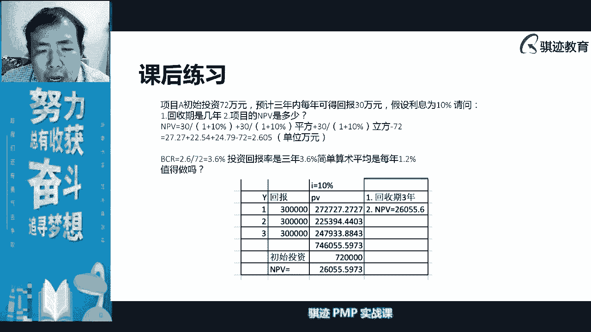

掌握住和理解有些东西啊。

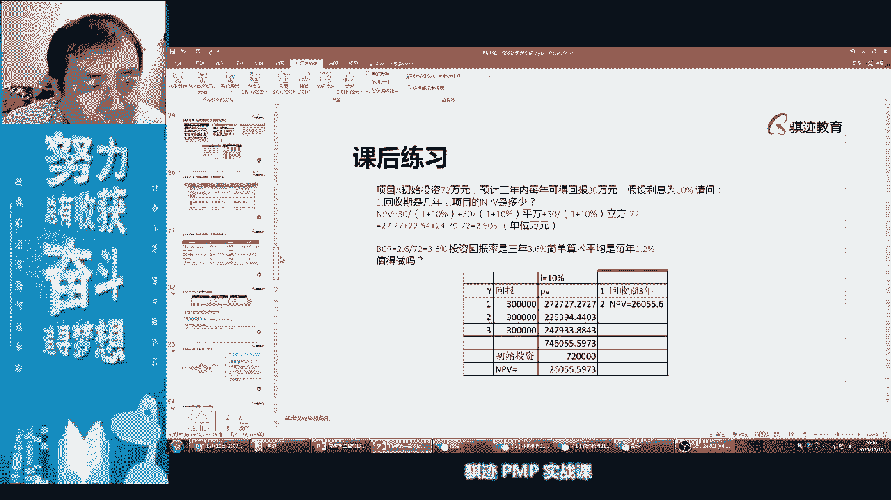

那么第一节课，第一节课当中，理论当中讲的是我们讲的是p m p的定义，项目的定义，项目的道德规范。

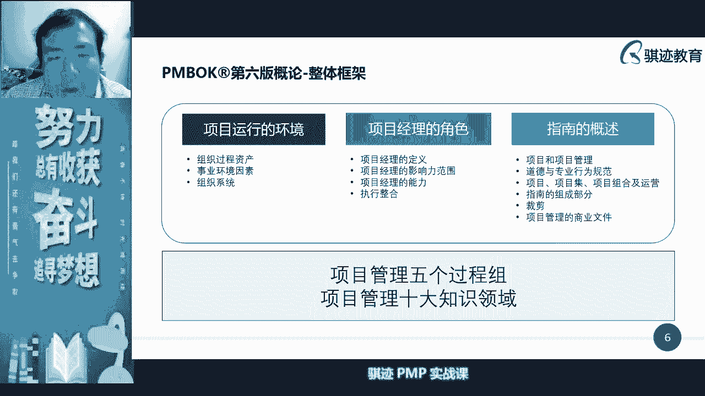

对不对，我们讲项目是一个为创造独特产品成果和服务，所做的临时性的工作，它它的产出呢叫做deliable，可交互可交付啊，是这样一个定义啊，那么所以它有临时性，它有临时性，然后呢他也有可能会提前终止。

它有临时性。

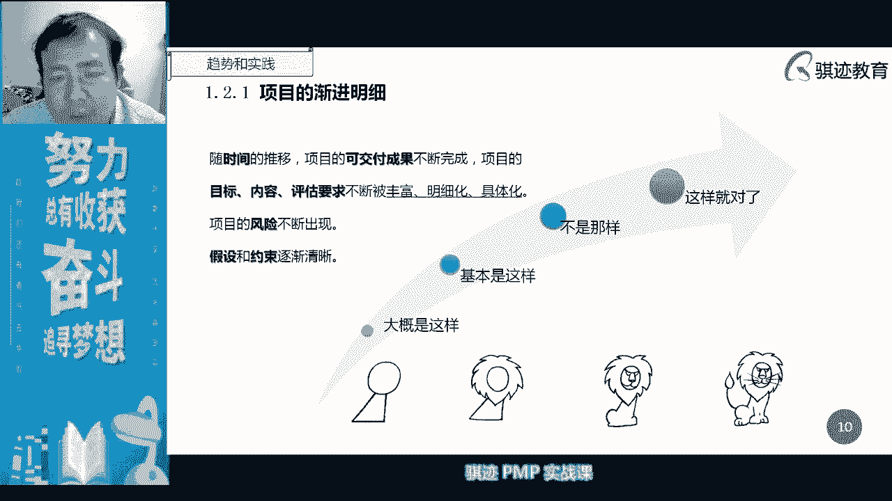

有渐进明细性，有独特性啊，还有不确定性啊。

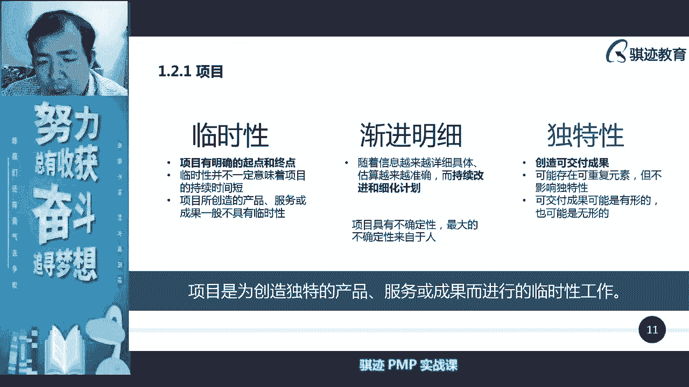

这就是我补充的有不确定性，ok这次大家都能理解吧，好那么项目会有有形收益，无形收益对吧，这都是比较容易理解的，大家回忆一下看看想一想，想想回一下，那么项目当中第呃第一第一章。

第一章当中相关项目的概念里面有可能会考的，另外一个支持是项目，项目结构，项目组合啊，有些同学说可能还没有搞明白，我们弄，我这里再讲一遍，项目组合是层次最高的，大家可以透视当中。

可以看到项目组合是层次最高的，咱们组合是干什么的呢，决定组织做哪些项目或者不做哪些项目，同时决定给哪些项目分配更多的资源，给哪些项目更高的优先级，是项目组合所决定的事情，它一般在最高的层次。

那么项目组合之下呢，我们会有项目集和项目，项目集和项目，那么项目及实现什么事情来做协调，1+1=2，项目和项目之间有时候会产生冲突，不一定是资源的冲突，有可能是工作协调的冲突，也有些人其他的冲突。

项目集主要起的是1+1=2的作用啊，我们这里会写1+1=2，是项目集起到协调的作用，而项目管理呢最终是为了实现我们的项目目标，达成我们的一些项目的成果，可交付成果是这是他们三个者之间的关系。

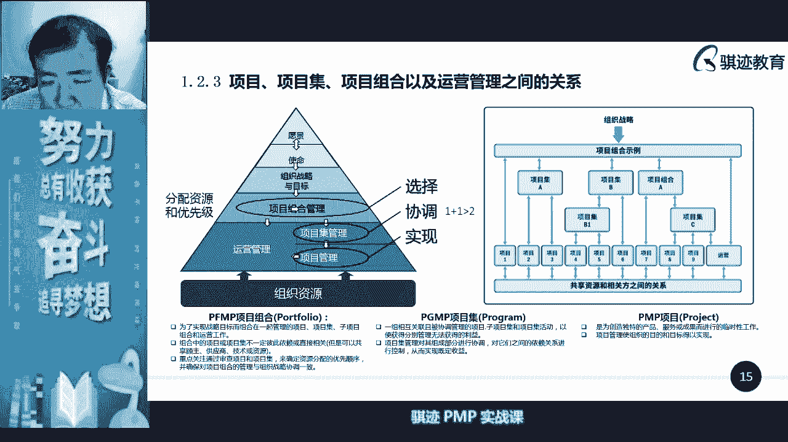

那么项目和运营之间呢是项目是独特的，临时的啊，运营呢是持续的，是标准化的，那么项目做完的一些成果呢会交给运营，当他把一些所有的我们的不确定性，都消除掉之后呢，我们会把它移交给运营去进行持续的实现价值。

持续时间呢啊，组织的一些成果需要的成果啊。

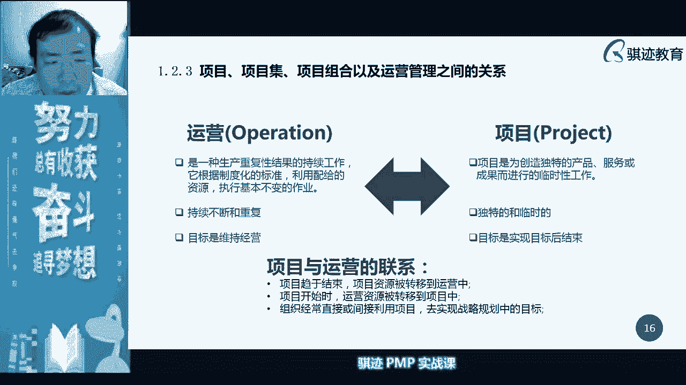

重复啊，这是项目和运营之间的关系。

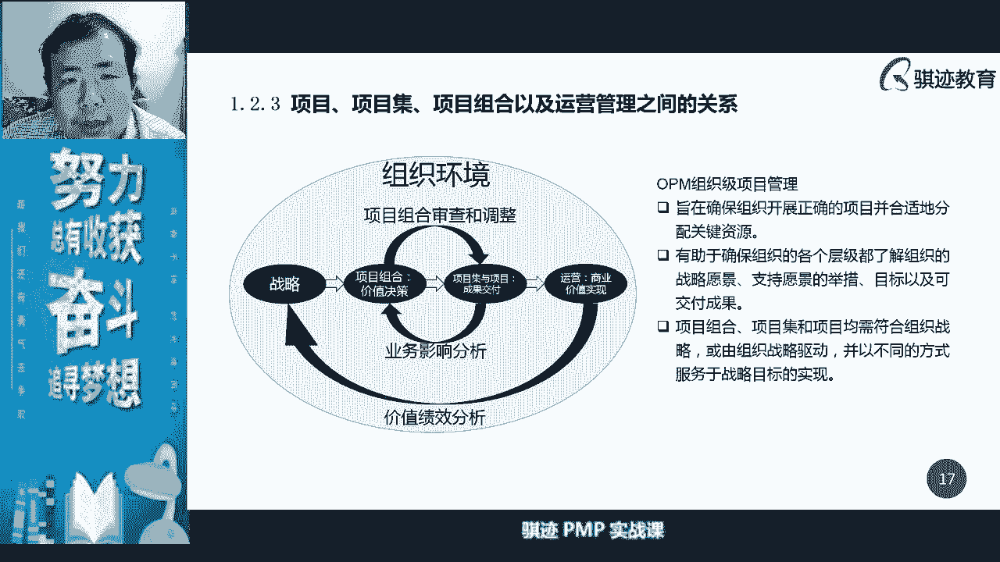

然后我们讲项目会有整个一个生命周期，项目的生命周期当中呢，我们讲项目的开始，是以项目章程被批准为开始的，项目的结束呢是以项目资源解散为结束了啊，大家以后在判断这个题目的时候，大家一定要记住啊。

项目什么时候开始开始，项目章程可以批准，如果说项目章程正在祈祷当中，实际项目可能没开始，那么项目也不会开始，但是如果项目章程一旦被批准了，通过了，那么项目就会开始，同时项目经理会被授权啊。

我们后面在下周二的课程当中会讲啊，你会提到这一点，那么这是项目，那么项目当中我们会有相关方的管理啊，会有执行啊，会有应对风险啊，筹措资源啊，质量管理等等一系列东西，随着时间的推移，我们会得出可交付成果。

最终我们将有可交付成果，通过内部验收，外部验收之后将移交给我们的客户啊，最终移交产生它的value价值，然后呢我们总结经验，最后解散资源，这是项目的整个通用的生命周期，但是它的整个过程实现方式呢。

会有各种各样不同啊。

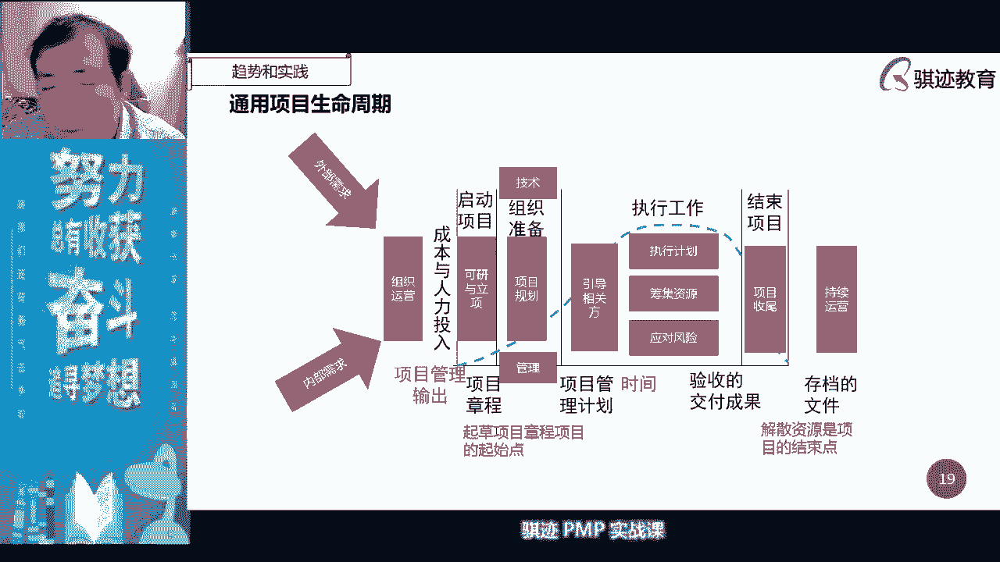

这个呢是呃我们的通用生命周期，那么我们在一个项目当中，如果这个项目是比较复杂的，我们会把它分成若干个段，一段两段，三段四段啊，就记得啊，我给大家上前天上课的时候，晚上上课时举的例子啊，我们先发射。

然后再登录，然后在啊最后在我们在取样回来，最后在人这有人登录对吧，每一个都是一个项目的阶段，每个阶段呢会从前一个阶段呢拿到成果，然后呢在这个阶段呢，以这个成果为基础来进一步进行开展，所以每一个阶段当中。

它也会有启动规划执行监控，收尾都会有对。

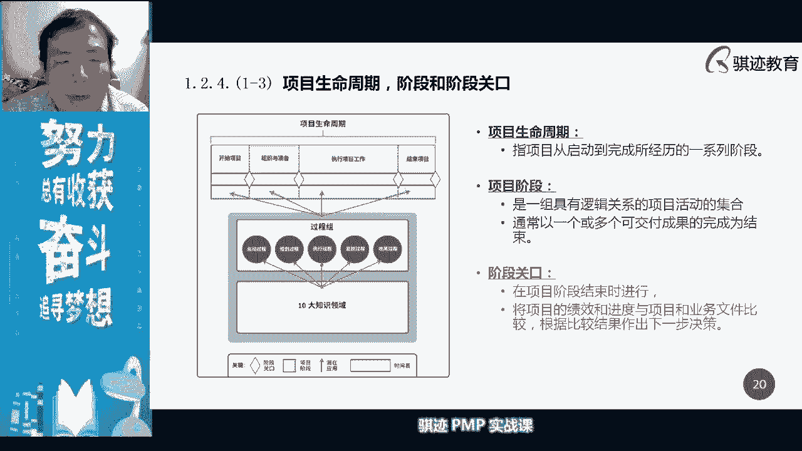

那么讲我们后面要讲了。

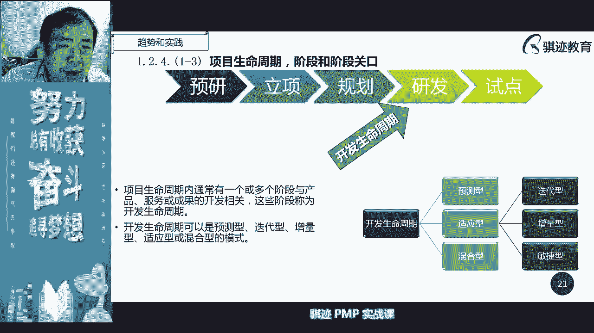

项目有不同的生命周期类型啊，这里同学很多同学啊，对这个概念呢略略有点模糊，或者理解的不清楚啊，那么我讲我们最传统的项目周期类型呢，是预测型，也叫瀑布型，什么意思呢，我们一开始把所有东西都计划好。

然后呢所有的东西呢一开始都准备好规划好，然后呢按部就班地做，最后一次性把所有的东西都交不出去，这称之为瀑布型，当不发生改变的时候，瀑布型是最有效率的，但是它最不能适应变化的环境，所以呢在很多场景当中。

我们不再是使用预测性啊，这是预测型特点。

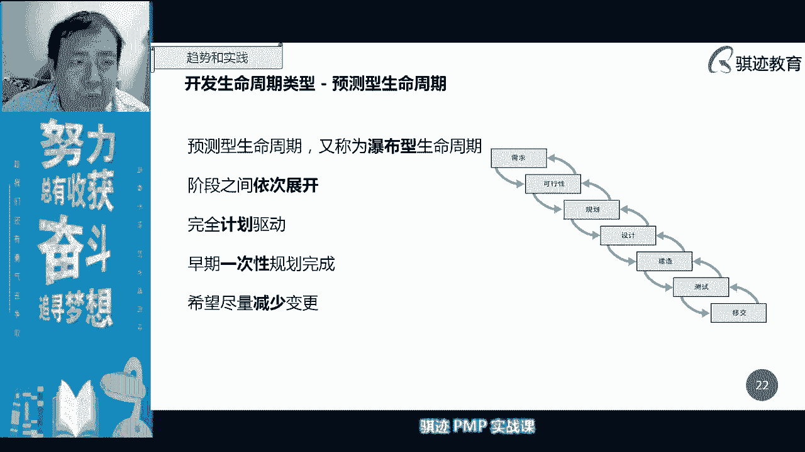

那么我们的迭代性的特点呢，是我们会不断的推出新的版本的产品，所以版本迭代，然后每个版本的产品呢，可能跟前一次版本呢会有一些相同，但也可能完全不同，他们有可唯一有可能去回去，继承的是什么东西呢。

是前一个版本得出的经验教训啊，经验教训或者是前一个版本部分成功的一些点，我们会把它拿过来，这是迭代性生命周期特点，所以迭代性当中呢它在迭代的过程当中，其实是不和外界进行交互的，这和敏捷是有区别。

他是收集完需求之后自己开发过程，但是他这个过程当中呢是类似于像预测性一样，也是按部就班，但是他可能过程比较快，所以迭代的迭代型的迭代周期呢一般不会很长，但是他在这工程是不会和外界交互的。

直到它扔向市场之后，才会跟外界交互啊，收取收取反馈重新做啊，这是迭代性的特点，这是和迭代以别，在于我们的敏捷的不同的地方啊，只要注意。

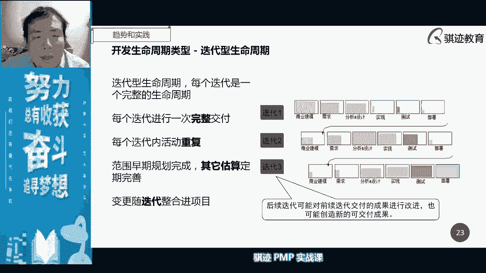

那么有时候呢我们的工作呢不能够往回退，不能够去推倒重来的时候呢，我们会更加会选择一个一生命周期类型，叫增量型，增量型的特点就是什么呢，每次往上增加一点，但是不会把原来的推倒。

我们原来的产品呢可能拿回来可以进行升级，可以进行复用啊，这是我们增量型的一个特点，增量型特点，那么增量型的特点当中，大家也会看到，也有分析设计，编码测试也有这样一个过程，但是他每次都是针对增量。

而对于我们的基础上一个版本的基础呢，我们不会去做改动，这和迭代不一样，记住迭代的话，有可能会把上个版本的很多东西会推倒掉，但是增量肯定不会推导，因为选择了增量就意味着推导的成本很高对吧。

大家可以记住一个例子啊，比如说我们家里的软装修对吧，就是一种很典型的增量型的生命周期啊，一点一点往上加，那装修的元素啊，环境布置的元素，这是增量型。

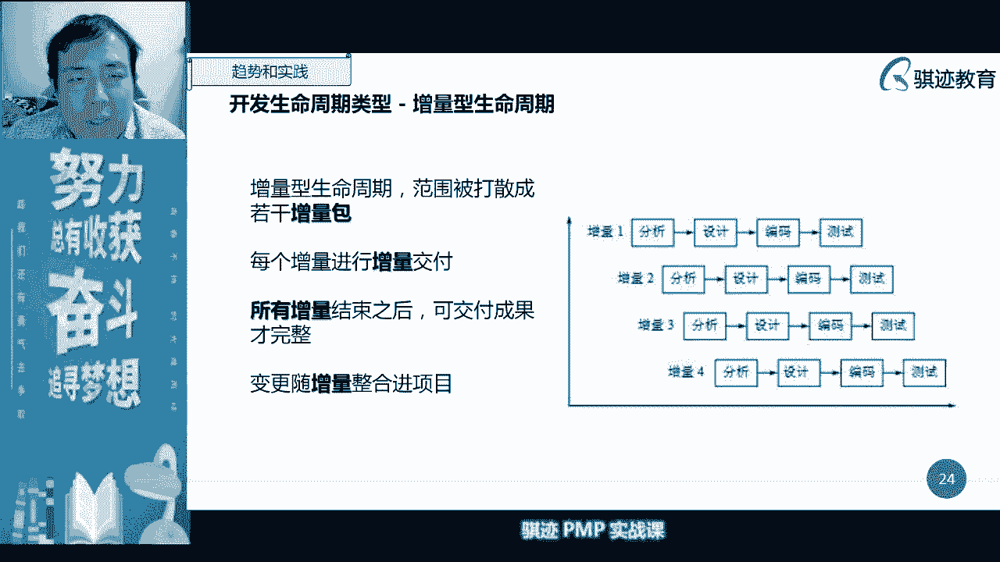

那么我们讲敏捷性呢，但是它还不仅仅是迭代增量啊，那么敏捷性特点之一什么呢，它每一个周期都有交付，那么这跟迭代一样，所以敏捷型的每一个周期呢也叫迭代周期啊，sorry我打个喷嚏，啊，不好意思，打了这喷嚏。

然后迭代迭代周期当中呢，我们会从外界去获取我们的需求，所以它在迭代周期当中并不是推倒重来的，而是什么是去获取新增量的一些需求的东西，所以你可以看作是在方式上，有点类似于d迭代加增量。

但是它区别真正和迭代加增量方式，有区别在哪里，敏捷是讲究一个呃迭代式的反馈改进的，敏捷不仅仅讲的是根据增量，根据反馈，然后进行做，他要讲自我提高和改进，就是敏捷的特点，所以敏捷会教父n个版本。

它的n个版本呢从版本上看呢更符合增量，但它的方式上呢又更符合迭代，但是他在一个呃我们团队的持续改进当中呢，又更接近于精益，敏捷是以这样一种啊结合体，所以敏捷不能简单的看作是迭代和增量啊。

注意这一点要注意，那么这是大家对于敏捷概念，那么我们在这次版本考试当中呢，对于敏捷只要知道这个知道这个程度，就可以知道这个程度，那么有一点要注意，敏捷是有初始范围，但是它只有很小的。

刚刚可以进行上限的一个初始范围，它后续的范围都是要什么，取决于市场反反馈的变化，如果没有足够的反馈变化。

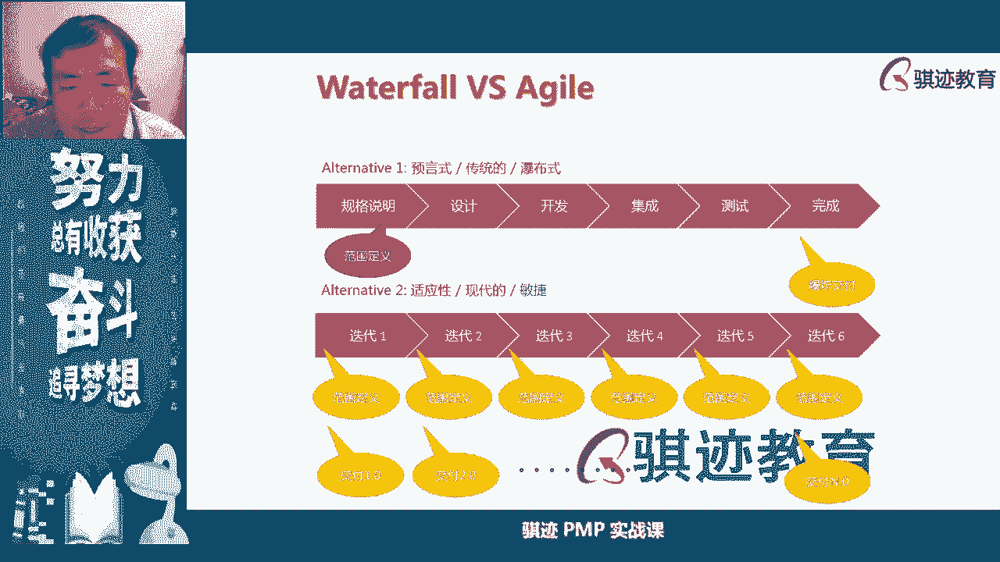

那么它可能它的版本眼睛就比较慢，这点要注意，那么还有一个高度适应运行的项目周期啊，这个是原来ppt没有的，跟你讲，因为这是在原书上有的，我们要知只要知道这个过程当中。

我们把原来的啊启动执行官做规划规划呃，呃做完做执行执行，做完做监控，这样一个按部就班的一步一步做的，变成用完大家同时执行，先后交错执行啊，这对于管理的难度呢要求提高了。

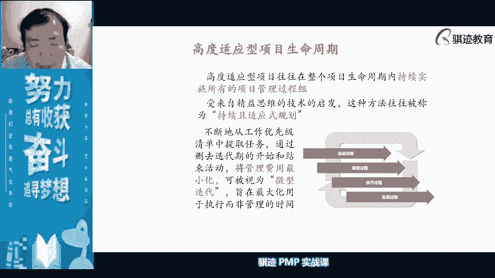

大家只要知道这个就行，ok啊这是一个我们迭代的示意，大家可以群里看到。

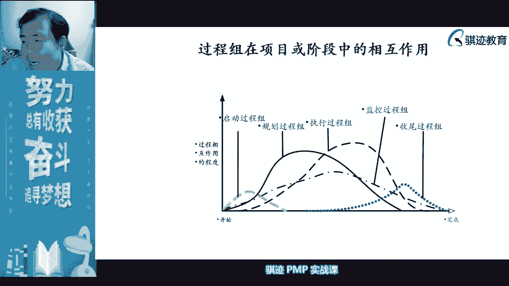

就是由我们群里有截图截图啊啊好，这是我们讲的我们各个不同的生命周期类型。

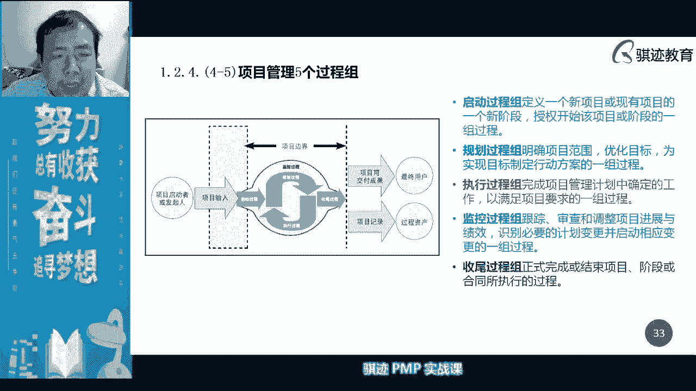

那么我们也讲了，我们在呃项目管理当中描述，所有的项目管理的动作，都会用一个东西叫做过程啊，他肯定属于五大过程组启动规划，执行监控收尾，那么他呢肯定会有输入输出和工具技术，叫做i t t o啊。

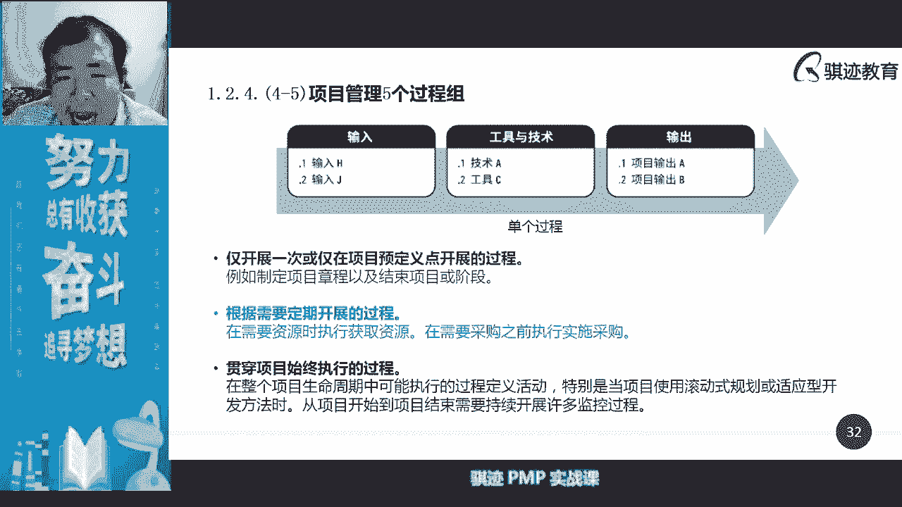

我们会以这样一个标准的形式来描述。

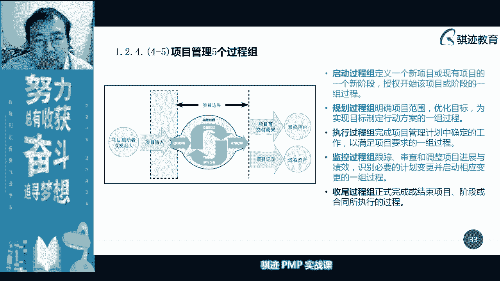

啊这是我们所有的子过程，你看从我们的x轴上来看，它是十大知识领域，从y轴来看，它是五大过程组，就这样，他肯定会有俩同时隶属于某一个知识领域，又隶属于某个啊过程组啊，但是我们一般描述的时候。

都是按照知识领域来进行一个知识领域，来进行知识领域来描述的啊，ok所以这张图呢我们我们上节课讲过啊，要要求大家在五节课上完之后把它背出来，很多同学来表达了啊，对于这个的信心啊，非常好啊。

这是可交付成果的一个逐渐的阶梯过程啊，大家在后面的课程当中会慢慢接触到啊，可交付成果呢，一开始就是可交付成果没有经过验收，那么先经过内部验收，是通过控制质量，然后经过外部验收。

需要确认范围变成验收的可交付成果，最后呢变成最终可交付成果的最终移交啊。

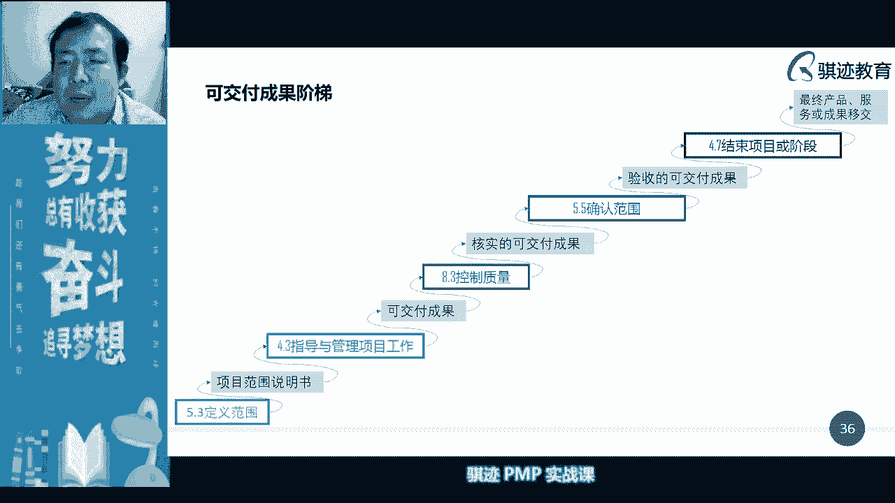

这样好，那么这是我们上节课讲的一些主要内容。

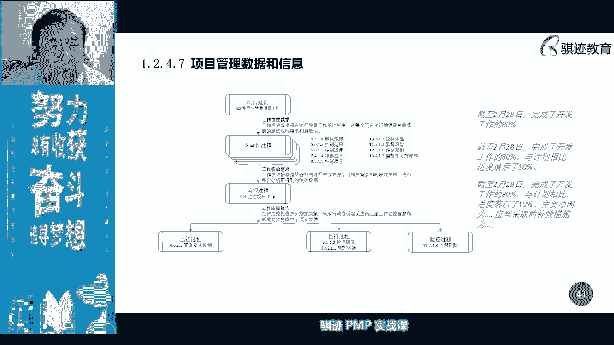

然后我们讲了一下裁剪，如何去裁剪裁剪，所谓裁剪就是说让项目成功的可能性最大化，为了这个目标呢，我们可能有些东西呢放弃不用，有些东西可能做的简单。

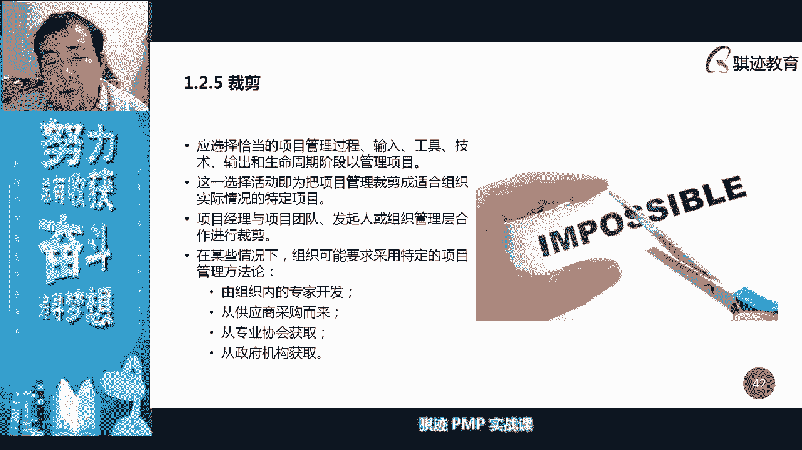

但有可能有些事情做的更细致啊，这叫做裁剪，好然后呢，最后呢我们讲了一个商业文件和商业论证，那么注意在pmbok第六版中，商业论证和商业啊，叫做效益管理计划，这个要记住，所以他是项目章程之前。

唯一一个出现的管理计划，那么他会不会带入到项目章程当中，会当然会啊，当然会，所以记住项目当中必然会体现消息管理计划。

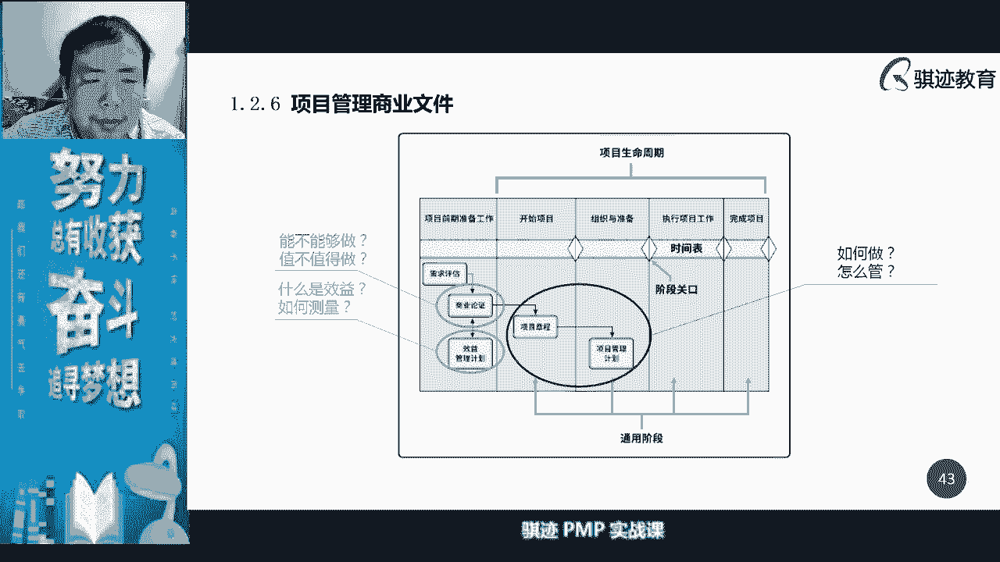

好ok这是我们上节课大致的一些内容啊，这是我们上节课的一些呃，最后呢我们的生商业计算，那我们里面的一些公式，那么大家稍微再回一下看一下啊，mp b和i r p，bp和r i这些东西我们都已经讲过了。

那么我们这里就不再赘叙了啊，如果各位同学还没有理解的，可以下课来问。

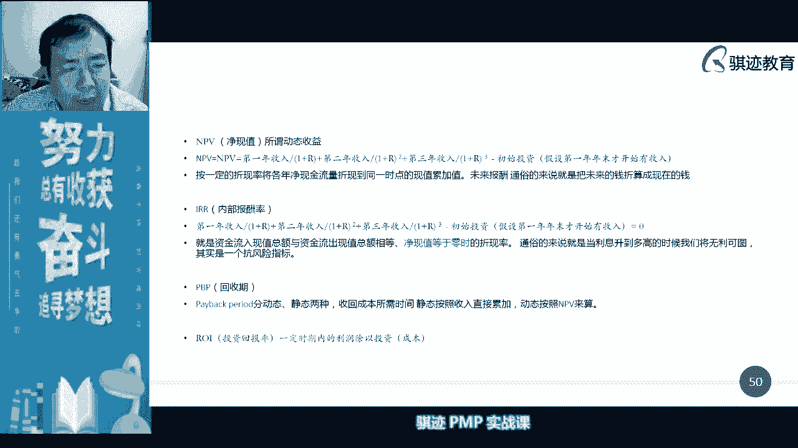

这是我们上节课的内容，那么我们在快速使用了20分钟时间。

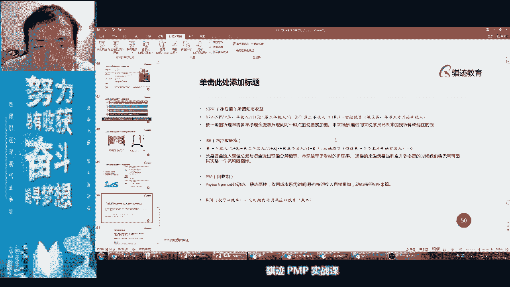

快速的过了一下之后呢，我们接下来要进入下一节课的内容啊，本节课的内容，因为本节课呢内容时间长度比较短啊，上一节课长度比较长，虽然都是一张，但是内容长度不一样，所以本节课呢长度比较短一点啊。

所以为我们不用担心占用太多时间，那么我们讲第二章项目的运行环境啊，我们第一章讲的是什么呢，同学们第一章我们讲的是项目的引论啊，第二章讲项目的运行环境，第三是项目经理的角色。

所以我把前面三张我把它称之为什么东西呢，我称之为一样东西叫做项目的天时地利人和啊，天使是什么，我们要做一件事情，是不是要天时地利人和，天时就是说是啊外界的一些呃，决定这个东西的因素，第一力量是接地气。

是直接影响项目的一些背景和它的环境，所以项目运行环境是一种地理，最后一个呢是人和是项目经理的能力，它决定了我们能不能把人捏在一起，把事情做好，所以第二章就是讲的是项目的运行环境，就是讲的是dd啊。

我们天使已经讲过了，我们还是讲地理，那么我们讲项目的环境当中，直接接地气的影响，我们项目的环境当中会有这两大因素，以及一个人的因素啊，两大客观的因素是什么呢，一个叫做事业环境因素，一个叫做组织过程。

资产从世界冠军之后走的光明之，什么叫事业环境因素呢，我们可以看一下啊，它是我们项目最最最最外层的一个环境，就像我们生活的环境啊，他们他会项目，我也会有个这样环境，项目的环境，有些东西呢你是无法改变的。

有些东西呢你可以影响到短期内不能改变，有些东西也能改变啊，但是要花费力气，所以一系列影响我们项目的一些因素，我们就称之为环境因素，它又分为组织外部的环境因素，和组织内部的环境因素。

组织外部环境因素呢是组织都无法影响到，你所在的组织都无法影响到的，而组织内部的环境因素呢是你可以，你所的组织是可以影响到的，但是呢你项目组不能影响到注意啊，所以从站在项目管理的角度看。

事业环境因素在默认条件下都是不能改变，不能影响的，因为你只是一个小小的项目经理，组织你不能管，对吧啊，国家你更不能管社会，你也不能管，你的职权只在项目范围内是这样，那么还有一种因素是什么呢。

叫做组织过程资产，它是一种什么东西呢，我给大家总结一下啊，大家看组织过程资产更多的是一种什么，是一种历史经验，这一夜大家怎么样，更多是一种历史经验，他告诉了我们有哪些东西可以遵循，哪些东西可以吸取。

哪些东西可以总结，是这样的东西啊，这是两大部分的概念，大家先明白一下，那么事业环境因素呢，英文叫ef啊，enterprise environmental factor。

组织过程资产的organization，procedure assessment叫op a啊，大家看一下缩缩写就行，稍微了解一下缩写啊，以后大家出去的话，有时候有人写啊，这个是ef，这个是oppa啊。

有些人是有点有点装的话，大家可以啊，大明白啊，他在他在干什么啊，ok大家可以看到一个特点，事业环境因素和组织过程，资产是我们绝大部分的，我们的i t t o，我们的i t u之一，也是绝大部分。

也就是说，我们绝大部分的过程的输入和输出之一，大家看到视觉环境速是40个过程的输入之一，组织过程资产是47个过程数值之一，我们总共有多少子过程啊，49个，第六版是49个啊，49个子过程。

所以几乎所有的子过程都有这两个因素，因为外部环境和内部的各种资源，都会影响到我们的项目的方方面面，所以它自然而然成为几乎所有的因素，所以我们后面再讲此过程当中，我们默认这些东西都会有啊。

所以就不会弹特别讲好，那么我们看事业环境因素，我们前面讲，又分为外部的事业环境因素，和内部的事业环境因素，我们先看外部的什么叫外部的环境因素啊，就是整个社会，你可以告诉整个社会。

项目对于整个社会肯定是没办法有影响对吧，社会文化和法律限制，对吧啊这个市场条件，比如说市场景气与否对吧，我们这个行业景气不景气与否对吧，法律怎么样，有些时候有些国家啊法律必须这么做对吧。

有些国家的法律就不允许这么做对吧，然后比如就比如说啊在中国对吧啊，你从事某些行业就是说是重罪，但那国外呢可能就是一些大不了的事情，甚至是合法的啊，所以这就是不同国家的法律的因素。

这些东西你没办法影响和避免，但是呢你必须遵守对吧，这就是事业环境因素，它会给你带来有利和不利的影响，接下来有个注意啊，接下来有一个注意，商业数据库和学术研究，这个为什么是事业环境因素呢。

因为商业数据库是大家社会公用的，而学术研究呢啊，而学术研究呢也是大家所为，全人类学术研究是为全人类服务的，所以这些东西呢你可以利用这些东西，几乎对你都是有益处的啊，是有益的。

所以大家看到商业数据库和学术研究，记住一点，这是外部的事业环境因素当中，对你举肯定是有益的，不会有害的对吧，是这样一种呃事业环境因素，但是有一点你能改商业数据库吗，不能改，不能改，你能改知网的数据库吗。

不能改对吧，你可以上去查论文文献的索引，可以，但是你不能够去改人家论文，那是不可能的对吧，学术研究就更难更难，是这样的啊，所以你没有办法去改变这样东西啊，没办法去改变这种东西，所以你只能利用。

所以它归为事业环境因素，然后呢政府和行业标准，财务考量，物理环境考量对吧，这些东西组项目组呢对他呢几乎都没有影响，没办法有影响力，然后呢组织也没有对他有印象，因为这web的对吧，你们的企业嗯。

我想也不可能说手眼通天到，能够改这个东西对吧，所以我默认情况下都是不会对他有影响，所以你只能默默接受，所以事业环境因素记住一点，友好有坏，有可能对你有积极影响，也可能有负面影响。

比如说比如说我们讲物理环境，比如说今年冬天啊暖冬，然后呢，你的项目要求呢只呃项目的执行金融环境以后，环节呢希望气温越低越好，结果呢今年是暖冬，对你项目造成不利影响，那你怎么办呢，你只能接受对吧。

然后但是你可以采取一定措施，但是这个环境你不能改变，就这样好，那么事业环境因素呢，另一部分呢叫做组织内部的事业环境因素，组织内部环境，他是组织的文化结构和治理，注意啊注意用词啊。

这里大家同学们一定要注意我说的慢了，所以组织的文化是一种事业环境因素，为什么要这么说呢，因为后面有一个是组织的过程，政策程序，它是组织的过程，组织过程的资产，它不是适应环境因素，那么这两什么区别。

有人能不能告诉我，一个组织的文化和一个组织政策有没什么区别，大家可以在我们的啊，我们的直播间里面可以说一下啊，文化，和政策的，有人能告诉我吗，政策是可以改的，文化长久形成，文化是价值观，政策是方法论。

ok啊那很好，我我很欢迎大家同学的这种表达，他们就会有一个直观和理性的认识啊，啊有人说类似道德和法律的区别，ok啊这也可以这么认为啊，文化比如孔孟文化政策就是法规，ok啊好你们的表达的没有错。

然后呢我们理解一下啊，因为这个事呢，有时候p n p c经常喜欢在这一点上考的啊，你们回过来，然后跟着我们啊，跟着我来，我们来辨析一下啊，ok那么大家注意啊，一个组织的文化文化。

一般它不会形成一个正式的文件，注意它不会形成一个正式的文件，甚至不会写在纸面上，所以一个组织的文化往往是一个形成了，一个像默认像潜规则一样的东西，潜规则一样潜在的一个东西，比如说比如说有些组织的文化。

比如说他就是一个狼性的文化，讲究激进，讲究不断的创造对吧，然后讲究回报啊，这是一个诅咒啊，有些诅咒的文化呢讲究无为而治，讲究方为格，真个人主观能动性对吧，有些组织文化呢可能什么上下级森严对吧。

上级说yes，下级不能说no，有些组织呢文化是什么呢，上集说yes，下一集可以说no，但上级而且会觉得下集呢很有个人主见，然后呢会把组织做好啊，会把组织的工作做得更好，ok这是取决不同组织的。

所以组织的文化是一个不会太成本，至少不会形成正正式成本的一个东西，而组织的过程政策程序必然是一个成本，成正式文章，在组织当中进行推行一样东西啊，这要注意，那么为什么要提这个呢。

是因为一个组织形成了一个文化，你作为一个项目经理能不能改，当然不能改啊，当然不能改啊，有些同学说哦，那你作为一个项目经理，你能改组织政策吗，但也不能改，但是为什么我们说不会写成正式成文呢。

因为如果一样组织的东西，如果他能写成成文，变成一个文档保存下来的话，那么他对你都是只有益处没有害处，因为他会指导你在这个组织里面该怎么做，才是被组织认为是正确的啊，这点要记住，所以如果能够被写下来的。

比如像过程政策程序，这才能被写下来的，无论他是怎么样定义的，你只要遵循它，就能够保证你在项目管理上，不会违反组织的政策，过程程序啊，你就是ok对的，他对你肯定是有帮助。

但是组织的文化呢不一定一他没有正式的成本，第二它可能是一种潜在的潜规则，所以它可能会对你产生正面影响，而负面影响，但是这些东西你又不能够去影响它，所以它归为事业环境因素对吧。

就比如说如果你在一个欧美企业里面，比如说你要求团队成员啊进行高强度的加班，那么肯定说很多很多人肯定说啊，就觉得不不愿意，然后组织文化呢也不会支持，然后但在一些国内的企业当中呢，比如说你要求高强度加班。

可能组织文化本身就是支持你，他就会对对你产生也对资源的使用，对你项目，资源使用产生一些有利或者不利的影响，ok是这样的，但是你会看到大部分的组织，几乎所有的组织都不会说，员工必须无条件的接受加班啊。

不加班就是错的，要开除，不会把这一条写在组织的任何正式文档当中，因为这是违法的哦，这是违法的，所以你们现在明白了吧，组织文化和组织过程中的区别，在偏僻的这个世界环境因素和组织过程。

资产这两个范畴当中的区别啊，这个所以要记住，所以我们强调这一点，因为这是pp喜欢考的一个东西啊，大家明白了吧，明白的话，在公屏里扣个一啊，大家管大家扣，我继续讲，那么请组织的内部的社会因素当中。

基础设施对吧啊，信息技术，软件资源可用性，这些都是组织内部环境因素啊，只是组织自己的属性，你做一个项目经理呢，也没有办法对他有很大的影响，极其有限影响，但是有一样东西非常特殊，有一样东西非常特殊。

叫做员工的能力啊，员工的能力啊，这一点大家要注意啊，这个东西是唯一特殊的偏僻，也喜欢考员工的能力，是一项事业环境因素，还是向组织过程资产，那么我列在这里，大家可以看到员工的能力是一项事业环境因素。

那那问题来了，我们说事业环境因素几乎不能改，那么在这里员工的能力能不能改，在公屏上回答，能还是不能啊，不这是帮助你们加深记忆，这一点很重要啊，这个这个点你考过好几次，能不能。

啊我已经看到有些同学说能有些说不能，还有没有其他答案的啊，我稍微再等你们一会儿，能改，但是有组织来改，ok啊很好，我觉得你们的回答都其实说ok你们就要回答了，从自己的认知观点上去回答就是非常好的啊。

非常不错啊，感谢大家参加互动，ok好，这个问题就是老师典型的问问题的方式，这是一个挖坑，回答能和不能都是不完全正确的啊，不好意思，你们别挖坑了啊，正确的答案应该是什么呢，员工的能力短期内不能够被改变。

为什么，劳动实践去改变的，所以员工能力短期之内是一个不能改变的，事业环境因素，但是长期来看它是可以改变的，通过什么改变，通过培训，通过培训，但是培训短期能改变的能力吗，当然不能。

就比如说你们短期内学了p m p，你们马上就说你们对管理项目很得心应手，非常熟练，会吧不会你们要通过实践的摸索，理论和实践的结合，然后总结经验啊，顿悟这些环环节的过程，你们才能说项目管理能力提高了。

所以员工能力短期内是不能改变的，但是长期内是可以改变的，通过什么通过培训和通过知识分享啊，这两个环节我们后面会讲啊，是也是两个考点，所以记住一点，考试的时候如果有员工能力，它是一种事业环境因素。

但是它是能改的，前提是什么，短期内不能改，长期可以改啊，所以培训不是一蹴而就就能改好了，ok啊好，这是一个告诉大家的点啊，时间会改变一个人啊，这位同学回答回答很好，直接换员工，直接换员工。

人的能力还是不一样，还是一样的，直接换员工就叫资源，更换资源啊，不是更换人啊，你是更换人，而不是更换人的能力对吧，你把人给换掉，这是资源的可用性和资源能力的问题啊，不是员工能力问题，ok啊。

然后我们可以看到，事业环境因素都是客观存在的啊，几乎不能改变的一些东西极其有限，几乎不能改变的东西，其中比较特殊的几个，我已经红字给大家屏幕上结束了啊，摘出来了。

大家可以自己在自己的笔记本上本上写一写啊，写一写，然后呢这是事业环境因素的特点，那么组织过程资产的特点是什么东西啊，ok大家可以旁边可以写一些组织过程，资产都是被归档的各类文档啊，你可以在旁边写一写啊。

我来帮你们在公屏上打打组织过程，资产都是归档或者减档，对吧，我们看组织过程资产当中啊，我给大家归啊，写了一下组织过程资产，都是我们归档过的一些文档，你看过程政策程序是不是都是写在纸面上。

而且都是正式文档嘛，他们都是经过归档啊，有一定严肃性，一个组织中有严肃性，对不对，所以说知识库当然也是经过归档，那么我为什么要提提这些东西呢，因为归档这个东西很重要，如果一项文档没有被正式归档过。

它不能称之为组织过程资产啊，我经常喜欢举的一个例子啊，我经常举的举个例子，比如说你从你的你从友商，我们讲友商，那里拿到了一份机密文件，那么这里面机密文件，你认为能够对你的项目产生巨大的帮助。

那么这份文件能够称之为组织过程资产吗，啊你们觉得能够称之为组织过程资产吗，啊你们可以在公屏上打啊，这个当将来我们就不等待，因为在线客的关系啊，互动时间有点长，我们就不等啊，答案是不能，为什么不能呢。

啊有些同学说能啊，为什么不能，为什么不能，因为你怎么知道这份文档里边，有没有埋藏了陷阱，有你怎么知道是友商故意泄露出来的这份文档，但是他要把一些关键的东西弄错，我会对你项目产生巨大的误导作用的。

你怎么知道，如果他没有正确的被归档，所谓的归档就是经过专家审核评定确认之后，他才能说是一个做出过政策，如果没有做这些动作，那么他对你的项目是产生有巨大的不确定性，它不能称之为组织过程资产啊。

但是你明白这个性质意思啊，归档的重要性，归档，啊有人说未归档被告啊，那是另外一回事，那是另一回事啊，啊所以组织过程资产大家记住一个定义，他肯定是一个文档，而且这个是文档，是被归档的文档。

而且它是一个组织内部被归档的文档，ok记住啊，归档文档他对你的项目居住有一点啊，它有两大类，一个叫过程政策程序，另外叫做组织的知识库，那么它有一个很大的特点，就是对你肯定是有帮助的，但是没有函数的啊。

没有函数，ok这就是组织过程资产的一个特性啊，那么我们在做辨析，很多时候辨析题的时候呢，如果他给你举出很多实例，大家呢可以怎么做呢，先想一想这个东西是不是事业环境因素，然后呢如果他是一个文档。

但是呢它是一组织内部的文档，那么你要想一想它是不是组织工程资产，好，这是组织过程资产和实事业，环境因素的两两大啊，我们的项目的环境的一个辨析啊，这个考试经常会考，考试肯定会有一道题目啊。

有些同学说诶一不就一道吗，我放弃不就行啊，p p考试没有一个知识点说可以考很多，保证你能过的p p考试永远都是什么，一个一个一个一个知识点，一分一分一分的抓住，当你抓住每一分的时候。

那么就意味着考试通过了，如果你每次都漏掉一份，那么你的考试是非常危险，明白意思吗，所以不要漏掉任何一个可以抓住这一分，好我们继续，那么呃就是我们讲事业环境因素，是指的是团队不能控制，这是我们的定义对吧。

这是我们的定义，那么组织过程资产呢，我们定义当中给大家补充了一个对吧，他肯定是有帮助的，肯定最多你看了一看觉得没帮助，但是对你也绝对不会有害对吧，好那么组织当中我们会有这样一个治理构架啊，治理构架。

智力构架呢会有智力构架框架和管理要素，以及我们的构架类型。

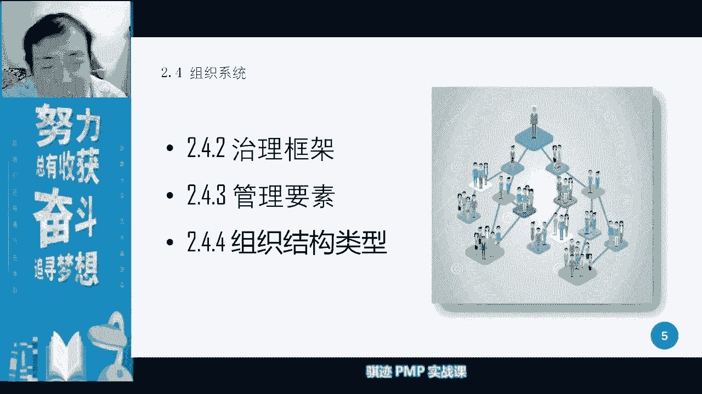

后面一个考试要点啊，那么治理构架当中，一个项目它会有一个项目的组织的治理，还会有一个项目的项目管理好吧，组织治理呢它的英文叫做governance，organization governance啊。

应该英文叫做organization venance，项目管理的叫project management，那么它们的区别我给大家写出来啊，对治理和管理呢有点模糊，另外中文那两个字比较接近啊。

大家以后可以看啊，大家以后可以啊，在外面看很多理论啊，定义都是一样啊，这里学过了之后以后，外面的理论就可以很明白的很啊，很容易明白，所谓治理，它更注重的是，你有没有按照组织的规定和框架去做事情。

他更注重是过程，你只要按照组织的框架过程去做了，那么组织认为他不会你的项目是可控的，不会有大的偏差，这就是所谓的gdance治理智，那么治理我们后面会讲到，会有很多治理的工具啊。

比如说审计就是一种治理工具，所以审计是不是看你的结果的，而审计是看你的过程了，比如说财务审计，做财务审计，但是你只要能证明你每一笔支出都是合理的，合规的，那么你的财务审计都能通过，哪怕你项目严重超支。

那也是很正常，那么反过来说，如果你的项目啊就算是在预算之内完成了，但是如果被财务审计发现你有乱花钱对吧，有没有的合理理由的花钱，比如说有没有发票的，或者是啊明显以非公允价格花出去的那些钱。

那么这可能也不能通过财务审计，或者要被追责啊，明白，所以这就是治理，它注重的是过程，而不是结果，所以这叫governance，那么与此相对的是什么呢，叫做管理，管理更注重什么，注重结果，注重结果。

管理就是说我不论你怎么做，但是呢你要把结果给我，作为一个项目管理，我们最主要的结果是什么，最主要的结果就是我们项目的可销服务，按时按量按质，把可交付成果交到我们的相关方的手里，这就是我们的管理结果。

所以他们注重结果啊，所以中国人的日常的企业在运作当中，更注重的是管理，那么治理呢只会在在实践当中，只会在一定的企业达到一定规模之后，才会考虑这件事情，但其实是一个组织的治理，其实是非常重要的啊。

所以很多的组织现在越来越多了，都从成熟的实践当中去拷贝一下，比如说财务管理制度啊，一个企业当中最最早会建立起的治理制度之一，就是财务管理制度啊，那其实说说是财务管理制度，其实它更多的是治理。

就说要求我们的财务的财务的运用，钱的运用要符合组织的规章流程，规章流程，这是一个治理，那么治理和管理当中就夹着一个什么呢，我们说的项目组合，项目集和项目治理啊，制定好了规则。

比如说我们我们前面讲了一个叫o p m，大家记得吧，o p m o p m就是一个治理框架对吧，我们用o p m对项目进行管理，对项目其进行管理，对项目组合进行管理，他对他们的。

对他们的过程进行什么治理，这是组织的治理框架，所以大家对这个结构现在有没有一个了解啊，ok pmp的考试当中对于这一块呢要求的不多，但是大家只要知道概念就行了，只要盖的概念就，那么讲到这一部分的。

我们稍事停下，因为今天的时间还是比较充裕的，那么我问一下大家，那大家对于之前讲的内容有没有什么问题，有问题的话，大家可以在公屏上打出来，如果没有问题的话，大家可以啊。

大家可以在公屏上打个ok可以打个ok，那么我们接下去继续讲啊，啊，因为上节课有些同学觉得上课上的太快了对吧，因为上节课的知识点很多，有谁一开始很多的同学可能跟x没有接触，当然了。

这跟偏僻的这门课其实其实是有关系的，那么偏我们这里稍微插一句话啊，插一段话，p np的这门课，其实说大家现在很多人现在来考p mp，其实呢是怎么说呢，是呃因为祖国的环境好啊，是在美国啊。

在美国偏僻的家乡啊，pp这门考试是要求有本科以上学历，同时要有3~5年项目管理经验才能去考，所以他是先去管理项目才拿证书的，当然中国人嘛对总是特别的好学对吧，我们都是先拿证书，然后再学以致用。

对吧啊啊中外方法不一样，但是所以明白，就是说老外有时候讲的那些内容呢，和中国人会方式汇率不同，就是这个道理，我们会在整合里讲或在整合里讲啊，不要急，项目章程，项目章程大家可以给大家可以提一下啊。

项目上相信所有东西都有，但是所有的东西都是高层次，你就明白这一点就行啊，好具体的，有些东西大家可以在课后啊，不是本节课的内容，大家可以在课后在微信群里跟我聊，跟我跟我探讨啊，ok我会很乐意跟大家回复。

那么我们继续往下讲啊，这是一个扩展知识，接下来就要管理要素，管理要素是个扩展知识，p m p考试当中几乎不会考，几乎不会考啊，我是没怎么看见过，那么我们权当扩展啊，扩展。

那么讲管理当中要让一个组织有效运转起来，它需要哪些元素呢，第一我觉得啊我觉得给大家标了个红字，因为有很多种因素，第一我觉得什么要有职权职责啊，职权和职责啊，这个我们在后面在人力资源管理中也会讲啊。

因为管一个组织最先管的肯定是人力资源，人力资源管理当中我们叫资源管理中也会讲到，所以要组织当中要授予工作职权，要有人，有些人呢做管理，有些人呢干体力活，有些人呢干技术活，有些人呢呃干辅助的活。

有些人呢不干活啊，都是合理的，都是合理的，那么组织要授予工作的，授予工作职权啊，大家分配角色，没有角色就会一团糟，接下来要有个什么职权和职责，职责就是责任，我们一般来说呢呃有句话叫什么叫能力越大。

责任越大对吧ok啊，因为在一个组织当中呢，基本上也是一个组织当中，基本上也是能力越高强的人，在一个组织运转运转一段时间之后呢，怎么会分配给更更更高的职责，但是不一定有更高的职权，不能更高职权。

那么职权怎么来取决于你的管理能力，当然也是一种能力啊，还要取决于很多其他的因素，大家懂的对吧，那就不多说了，然后呢光有这些东西单挑，有角色了不行，还有什么要分派任务，你要干活，要根据任务来。

那么任务来哪里来呢，那么有这样一些因素呢，组织就开始运转起来了，但是我们讲人活在这个世界上，需要干什么东西啊，要吃饭吃饭饭从哪里来啊，要用钱买在前面，所以管理要素的另外一个核心要素是什么呢。

是钱前薪酬薪酬啊，啊亨利法约尔我们提到了支付合理的薪酬啊，合理的薪酬，然后呢，现在呢呃管理员当中把这个合理薪酬，这个东西呢开始具体的细分化和场景应用化，有些时候呢薪酬呢要高于行业平均水平。

有些时候呢薪酬要等于很久没有，有时候薪酬呢要差异化，根据能力来，有时候薪酬呢要根据岗位来啊，所以很多的企业在不同的阶段，可能他的薪酬方案都是不一样的，若干年前很多的企业是什么。

它不是按照职责岗位来分配薪酬的，他是按照能力来分配薪酬的，后来呢有些企业呢采取混合制造方式，他要考虑职权，要考虑职责，还要考虑薪酬，所以项目当中，其实你会看到有个很有意思的现象。

就是有时候项目经理不是一个项目团队当中，薪酬最高的啊，所以大家啊大家在以后在实践管理项目当中，一定要记住这一点，你手下给你干活的工程师，技术人员可能工资比你海岛，这是正常的，这是正常。

千万不要有啊特别的想法，ok啊，这是正常，因为有些工作岗位，他就决定了它的性能水平就很高，你不得不给他一个匹配这个市场标准的，一个薪酬，否则的话人家就走了对吧，所以中国人的等级观念当中认为啊。

职位越高的肯定工资越高，这个在有些情况下是不适用的，在项目这种形态下，临时的性能啊，组织形态下可能更加不适用一点啊，很多时候你付的话，更多的是付给这个人的能力多少钱，不是因为有这个能力，我要买他的能力。

所以要付更多的钱，会有这样的情，那么我们讲管理当中还有一个很重要的东西，我觉得最重要的元素之一就是员工的士气，怎么样，怎么样保持调动，激发提高员工的时间啊，这在我们项目管理当中呢，也有提到。

在资源管理上面提啊，自由当中保持员工设计最主要的一个，我们的一个子过程是什么啊，我们后面会学到啊，建设团队，建设团队，建设团队，大家听到这个词，大家一定会想到这个团建，对吧啊，ok啊。

我们会在资源管理那那一章当中呢，会给大家详细讲一下啊，团建的特点啊，为什么有些企业一搞团建就有人离职啊，主要是自己掏钱，还要在休息日搞团建啊，ok啊这扯多了，ok所以说我们现在讲一下管理要素。

称为扩展管理啊，讲一下管理要素中，怎么去管好一个企业的一些管理要素，当然这是扩展知识，ok考试的话考得非常非常少啊，不怎么考好，那么我们接下来看一下啊，这是一张额外贴给你们的表。

但是这张书上有呢pm博客的第六版有啊，我们原来的p p t呢没有收录进去，这张表一罗列了pmi认定的所有的组织类型啊，项目项目的组织结构类型啊，组织结构类型，这其中呢我们最容易常考的呢是这几种职能型。

矩阵型啊，矩阵型矩阵型分为又分三种，然后呢还有复合型混合型对吧对吧，除了这个之外呢，还有还有什么系统型，简单型，多部门的类型和虚拟型混合混合型以及po型啊，ok好这些类型当中我们主要是以考试。

主要是以矩阵型为主，那么我们首先先介绍一下啊，首先介绍一下这张图，大家可以在书上可以找得到啊，所以我这里就大家也就不用截图，这张这张图书上可以找得到，那么我们首先就矩阵型和非矩阵型讲一个啊，区别。

那么矩阵型所谓的矩阵，那么它肯定有横横竖对吧，那么非矩阵型他就没有横竖，所以矩阵型与非矩阵型的区别在于什么啊，它有多重的汇报关系，但是呢他又有专门的项目的目的，这样的好处是容容易提高项目资源的使用效率。

又让项目呢不至于什么有太高的人力资源成本，有这样一个特性，那么pmi的叙事当中呢，一般不怎么提非矩阵性的东西，就搞清楚所有的矩阵类型以及职能型和项目型，它们的特点，注意啊，后面的ppt的内容。

我们和我们省上拿到讲义呢是不一样的，所以呢我会讲的稍微慢一点，然后呢大家呢如果看不懂或者怎么样的话，大家请把这个图截下来，当然我课后会把p p t分给大家啊，那么我的需注意啊，这里注意大家跟着我注意。

我会按照什么样的方式去叙述啊，我会讲一个类似于讲一个企业发展的故事，去叙述啊，就会更有代入感，然后我会我的叙述方式大致是怎么样，从一个企业完全不依赖项目生存，到完全依赖项目生存这样一个过程。

你当然一个企业有可能并不一定，完全依赖生存啊，但我们只是讲假设这个企业发展，最后完全依赖假设假设啊，那么他正好会经历各种各样的矩阵变化的过程，同时要知道有个特点就是什么啊，扩展知识告诉大家。

就是说一个项目的组织结构类型，往往和我们的组织的本身的结构类型相符合，这个东西呢叫做康威定律，大家可以网上有空可以去搜一下，可以百度搜一下，叫康威定律，好那么呃就这里就不多说了。

那么我们开始讲这个故事啊。

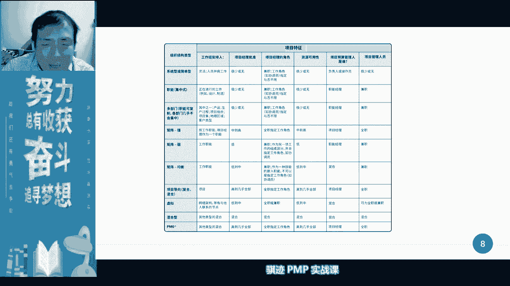

假设我们是一个很小的公司，人不多，然后呢有各种各样的部门啊，注意这里的p p t我们就换掉了啊，所以你要看着我，看着我的p p t下面的文字描述也有改变，假设我们是一家很小的公司啊不多。

那么只有几个职能部门，那么一开始呢，公司呢是以一个日常经营的业务为主的，但是公司需要发展对吧，我们需要发展啊，人不发展就会落伍，被社会淘汰，公司不发展就会被社会淘汰关门，我们公司的各个职能部门呢。

进行一些项目的推动，推动组织，让组织走到未来对吧，我们推动一些项目，那么这个时候呢就会产生项目，组织类结构类型的第一种类型叫做职能型，那么职能性的特征是什么啊，注意注意。

我在这里给大家标准说职能性的特征是什么，项目一般在职能部门中执行，职能部门中执行，所以你看职能部门当中就是职能部门，a职能部门b职能部门c，他在职能部门中执行，并不适合大型的跨部门项目。

它不是不能跨部门，但是它不适合在大跨部门，所以他的项目往往是有一个职能经理担任，项目经理的职能经理，但是职能经理是不是本身是有工作职责的啊，对所有控制他日常管理，日常经营嘛，让经营可能工作的就很忙了。

所以呢他可能经营呢非常有限，所以职能经理担任项目经理的特点是，它没有办法管理太多的监控他项目，因为它本身有日常职责，所以他肯定是非全职，这个时候呢，他往往需要一个项目协调员来帮他协调，这个项目。

往往是啊我们的项目的一个，我们部门当中的一个职员，但是呢这个人呢默默无闻，几乎没有权利，他只是个跑腿的传话的跑腿了，所以这是一种项目类型，这种项目类型呢虽然很简单，但是呢非常有效，有效在哪里啊。

如果这个项目的资源，在一个部门之内去执行的话，那么对他对这个项目来说呢，它职能经理有一定的调配，在部门内部呢有一定调配权利，那么对他来说呢，可以对项目呢有一定保证，但是有什么不好的。

如果需要进行兼职的项目协调，进行进行协调的话，这个协调员是没有任何权利的啊，注意这个人是没有任何权利的，如果他不是职能经理，他是没有任何权利的，同时跨部门的去协调呢很吃力，因为什么跨部门的协调之后。

别人可能部门是一个山头对吧，然后他可能要卖你面子还是不卖你面子，所以会有这样的情况，这是职能型，所以它适合什么，适合小型的项目部门内的项目，适合数量少的小项目，由职能经理担任项目经理。

然后呢会有组员去担任协调员，是这样的，然后呢他的上级比较明确对吧，项目经理就是职能经理啊，老大老道，下面全是干活的对吧，他可以任意调动自己本部的人，这是可以的，会不关心明星啊，专属分工明确。

有利于技能发展，归属感强啊，这是它的特点，但是呢他做不大做不了，但是对于一个小公司来说，初期不用做很复杂的大项目，这样的就够了，然后坐着坐着坐着，我们会发现一个事情。

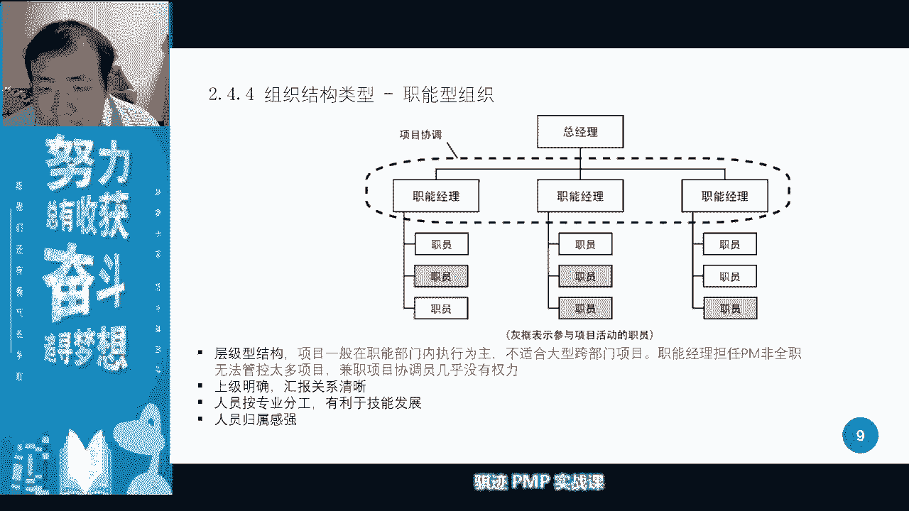

公司随着发展，项目越来越多了，项目越来越多了，这个时候你会发现有很多个项目同志在做了。

项目经理忙不过来了，这个时候怎么职能经理忙不过来了。

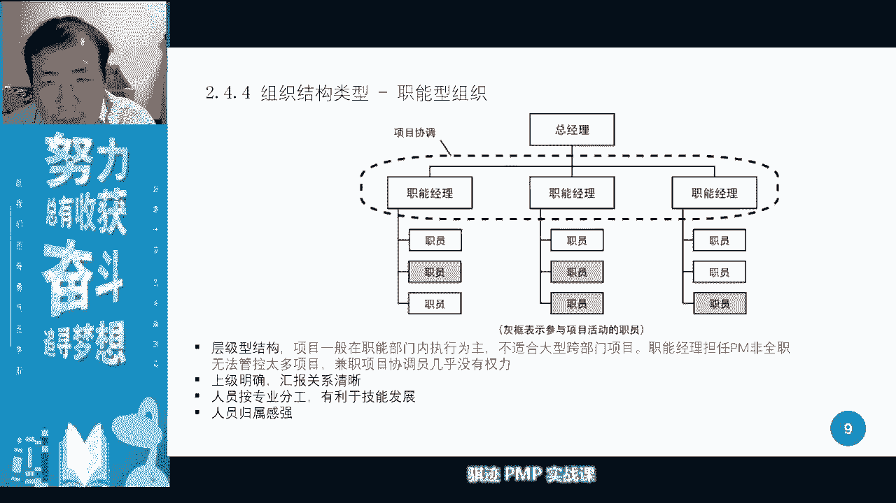

这时候怎么办呢，职能经理就回来了，哎小王，你过来啊，我们公司开始壮大了，小王你过来啊，我们这里有个项目，你来管啊，你来管啊，没关系，你虽然就工作了没几年，但关系都是你是一种锻炼职能经理，这时候呢。

我们的组织结构类型就从职能型，进化为了什么弱矩阵啊，如果找一个小王来担任，那么小王就是项目经理，他是所谓的项目经理。

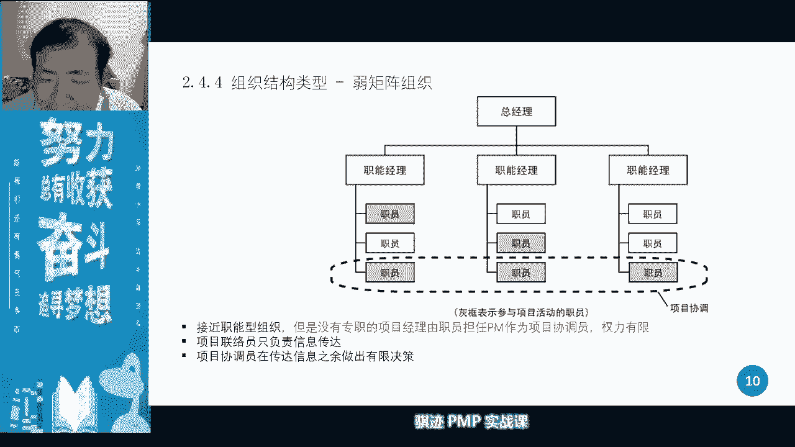

他真实的身份叫做项目协调员，他权力很有限。

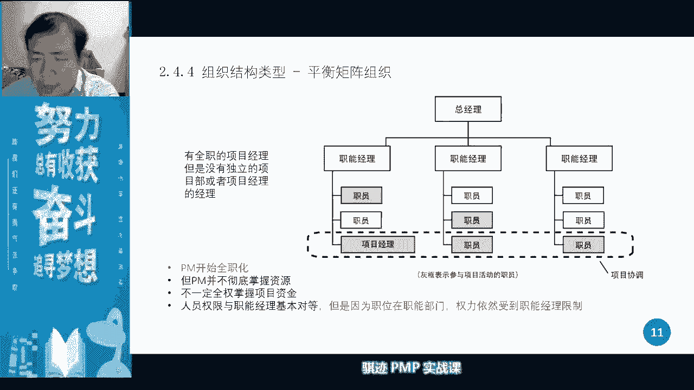

ok啊权力很有限，那么它有什么好处呢，他因为一个部门里面可以有多个职员，那么可以不同的职员担任不同项目的项目经理，那么对我们来说，日常管理来说，职能经理就可以把他的经历呢，重新拉回到了日常管理当中。

项目经理说他虽然是兼职的，不是专业的项目经理，那么他可以呢啊比较专心的去管一个项目，那么可以管的项目呢就很多，因为职员多的话，项目就可以管得多，所以他可以管弱矩阵，可以管很多小项目，可以挂很多小项目。

但是它的特征是什么，没有专业的项目经理啊。

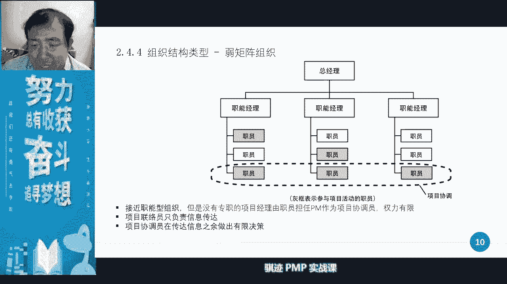

所以这些人理论上是没有偏僻证的啊。