# PMP认证考试课程最新完整免费课程零基础一次通过项目管理PMP考试 - P30：PMBOK第六版 第十章项目沟通管理-31 - 骐迹PMP - BV1Sb4y1f7Yt

把这章讲完啊，好那么我们先开始沟通呢是指的是什么啊，沟通指的是我们人和人之间啊，人和人之间相互之间交换信息的一个过程，叫沟通啊，沟通是我们和相关方啊保持配合，然后和大家之间进行默契的一个。

进行工作的一个必要的一个方式啊，所以呢沟通分为很多种，沟通内部沟通，外部沟通对吧，水平沟通，垂直沟通，正式和非正式的官方和非官方的口头，书面和口头啊，沟通有很多种分类方法，它适用于不同不同的场合啊。

所以项目经理是一个需要有很好，沟通技巧的人啊，就很很好沟通技巧的人啊，所以我们在沟通当中呢，就是很要很注重沟通的形式，沟通的方式，然后能够达到最好的沟通效果啊。

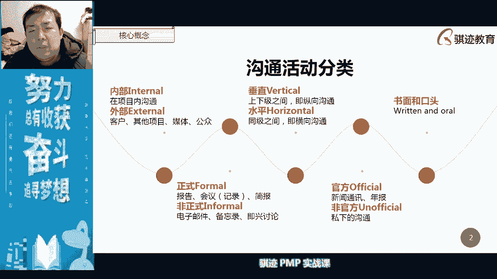

这是我们的沟通的一个目的和意义啊。

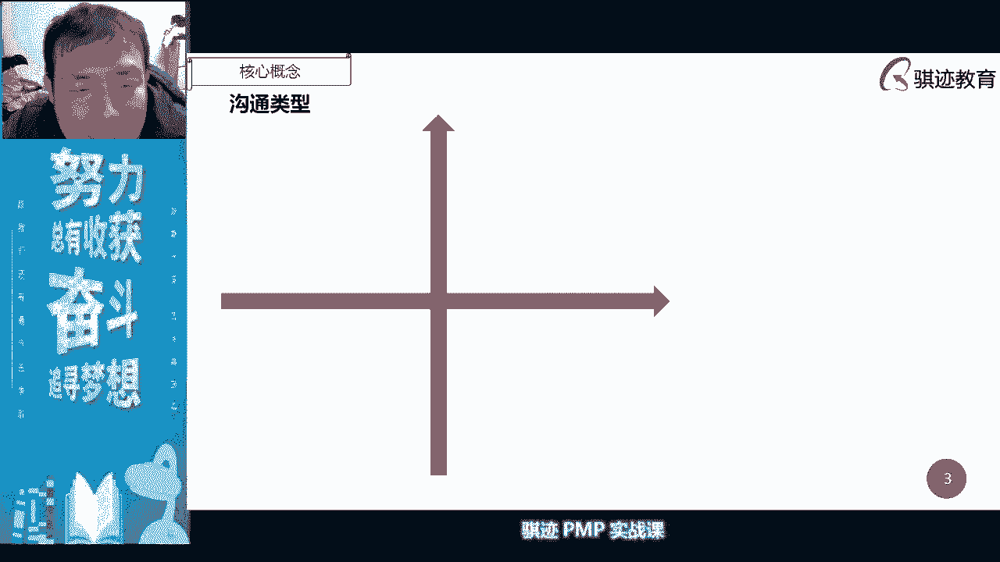

ok这个很简单，沟通当中呢我们主主要分类呢是这样分的啊，主要分类是这样的，我们分为正式的和非正式啊，我们之前前面讲过团队管理当中，我们资源管理当中讲的管理团队当中讲的，是不是啊，我们刚才冲突的时候。

一般都是使用什么非正式的啊，非正式的，然后呢才会用正式啊，私下里的话我们会用非正式口头对吧，像我和大家上课呢，基本上是用正式的口语去说，但是我会搭配一些非正式的，那么在交流当中，如果你用过于正式的口语。

过于正式的用词去表达一个意思的话，会导致对方觉得很严肃，很拘谨啊，所以非正式的呃，口头的啊，非正式书面的这样一些表达形式，也有助于沟通啊，所以沟通当中要取决于沟通的场景，那么越是需要明确意思严谨的话。

我们越是会选择正式和非正式的，书面和口头形式啊，如果我们越是需要有零在一个轻松的沟通环境，自然自然的交流的环境的话，我会选择非正式的口头的和书面的沟通方式啊，这是沟通，沟通当中大家也看到啊。

不仅沟通不仅仅是说其实沟通的话也有眼神，肢体语言和动作以及表情对吧，你好，老师上课就是经常给你们做表情啊，做什么东西啊，那么那还有各种各样的媒体形式啊等等图片啊，行为啊，这些也都是沟通对吧。

沟通当中会有很多的技巧，还有很多的技巧啊。

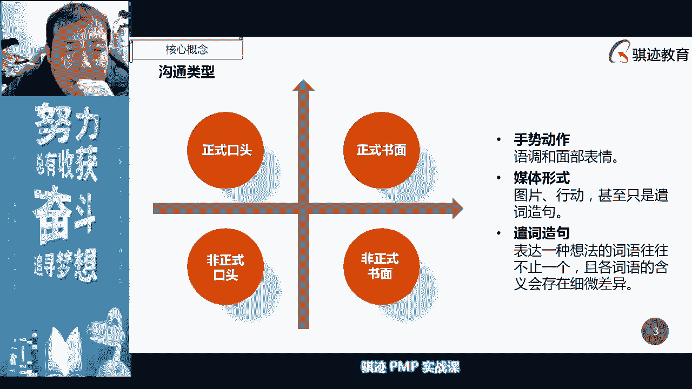

我们后面慢慢说啊，那么我们讲沟通当中，我们首先有个原则啊，有一个叫书面的沟通原则，会有这样一个叫5c原则啊，50原则是crackness，consciousness，clear，purpose。

coherence和controlling啊，control叫做五次原则，那么5c原则是一个非常好的指导，我们怎么样去做书面沟通的一个原则啊，那么当我们要书面沟通的首先是要什么啊，首先是要正确。

语法要正确对吧，语法要正确，老外的语法，这这个呢当然这个原则是从老外的，老外的语法当中呢，过去现在将来，中文呢是通过字和字之间组合，去形成这个意思啊，但是无论怎么样的话，就中文和英文都有表达时间。

表达假设表达确认这样这样一层意思，所以首先你要用正确的方式去表达，你要表达的意思，是做过还是没有做过，是曾准备去做还是曾经做过，然后呢又正确的拼写和字的语法对吧，中文有一个很厉害的地方呢。

就是中文的表达呢是可以，有些自然是可以颠倒的啊，大家网上肯定看过，那我就不说了对吧，中文的有时候自序可以颠倒，这非常好啊，看高热能力很强，但是这些颠倒呢就会给老外造成巨大的困扰啊。

中是中国人了都看得懂啊啊，然后呢第二个就叫crackness，那第二个呢叫做简洁，表达无多余字啊，就表达当中呢我们要进行简洁啊，然后呢直能够用最清楚的简洁的意思呢，去表达自己。

所以简洁和清晰呢是两个东西，我们在表达中要注意的啊，那么简洁和清细节意味着什么呢，我们能够如果能够用啊比较简短的话语呢，我们就比较不用讲了，很长很长，那么当然这不是一个必须要做到的事情。

就是简洁和清晰的表达，有时候呢是我们故意不做到啊，那么举个例子，比如说你想要你想要和你的相关方，某个很重要的相关方表达一些委婉的表现，也拒绝和不能接受，那么如果你很清晰地表达呢，很简洁版，no不行。

这样的表达呢会导致对方呢觉得你很冷静，然后呢你可以怎么表达呢，啊我觉得这个事情呢对我们来说，可能是在执行层面上可能会有困难，但我们觉得这个方法，我们可以用一个其他的方法去做。

所以我们不建议在这样的情况下找到啊，诸如此类啊，你用这样的方式表达，对方呢可能更容易接受一些，更容易接受一些啊，所以表达当中呢也要取决于场景，当然一般一般来说正式的表达我们都会用什么。

consciousness of consciousness和clear purpose，去表达自己的意思，表达这个意思，那么所以老外这个要注意啊，老外在表达意思的时候。

你在后转线和老外用英文去表达意思，尤其是注意是什么，就说你千万不要把你在学过的英文课本，或者是英文的文学著作当中的一些表达的东西，因为英文的文学著作当中的一些表达，他是为了优美，他是为了优美漂亮。

她会把字句写的很复杂，去表表达一个意境，这种意境呢是不需要简洁，但反而是需要复杂才能表达意境的，你千万不要把英文文学当中的很多，或者是艺术作品当中的很多的表达，拿到生活来进行沟通中表达啊，工作中表达。

这是不恰当的啊，注意工作中表达了不要写成文选项啊，所以千万不要什么啊，我们以前英文课文你要看什么从句，再套从句，在它分句，然后在什么在这什么起始句等等这些啊，这些表达的是非常的啊。

在日常工作是非常不好的，是英文的那个带有文书面文学表达的那种文章，所以大家的表达在英语学呃，文学英语文学的表达和日常表达是有差距的，千万不要把那个东西搬过来啊，这是一个这是一个很重要的经验。

那么当你如果不能够正确表达自己的时候，那你用最简单的词语去表达，也不要用很复杂的东西去表达啊，所以我否则会造成误解，接下来哪一个呢叫coherent啊，coherence连贯的逻辑思维。

所以和一个老外去表达的时候呢，但是老外的表达和中国人的表达呢会略有不同，老外的经常表达呢和中国人是主谓宾动状，补这种呢是倒装的，倒过来的啊，有时候我也会有这样，但是老外表达它有一个特点。

就是呃你在表达的时候呢，它按照逻辑的从大到小，或者从前到后，它会有一个逻辑递增的递进的这个过程，中文呢其实也有，但是中文没有那么强调，因为语言的不同，所以如果我们用呃，无论是用中文还是英文去表达的时候。

在工作的语言上一定要注意什么，一个逻辑的层次的递进啊，那么比如说举个例子啊，我们想跟相关方提呃提个意见，那么你首先要把你的你的意见的目的是什么，那么接下来就讲的是我为什么会提这个意见，然后这个意见呢。

然后会产生什么样的结果，然后呢我们会对他做出一个什么判断，以此为理由，所以我们形成了一个这样一条逻辑啊，有时候呢你把这种逻辑我打乱，或者是反复的用从句去套在一个句子里呢，会导致很多的逻辑呢变成混乱。

别人无法理解，这是一个连贯的逻辑，叫coherence，最后一个受控的语法和承接啊，要用图表和小节来控制语法啊，controlling啊，controlling就行啊，我们在表达当中尽可能使用简单句。

不要用复杂从句，有时候需要复杂从句的时候呢，就是你的从句呢要表达出正确的意思，尤其是中国人一定要准备注意啊，很多同学就是说英文文学看懂了就很喜欢学it，do你的it that用多了之后呢。

你很容易是什么，你在啊日常工作沟通当中，老婆可能问你的it指的是哪个it it it，你dot指的是哪个dt who那个who到底是哪个who啊，老外很容易搞不清楚啊，中国人有时候也会讲的。

你的语法有时候过于过于复杂，或者是指向过于多的话，会导致很多的东西呃，别人搞不清楚你思路，但有时候呢你是故意的，就要把对方搞混了哈，也有也有，这是属于高级应用方法，ok啊，那么我们在沟通当中呢注意倾听。

积极反馈啊，积极反馈啊，识别相关方的差异，理解文化差异啊，这是我们沟通中的5c原则，那么我们继续讲有一个梅拉病原理啊，梅拉梅拉宾这个人呢是一个嗯，就是语言沟通那个方面的，一个一个一个一个专家啊。

一个一个学者，他研究了人之后，发展人大部分情况下沟通的信息呢，element of personal，communication呢是由不对language去表达了，55%。

38%是voice and tom啊，嗓音和语调只有7%呢，是他说的词啊，很有意思，人们在沟通当中更关注的是对方的动作，接下来关注对方呢是对方的语气语调，最后再关注的对方是说什么词。

所以当我们在面对面用语言去表达的时候，那么你的词其实没有那么重要，重要的是你的人，你的动作都表达，就像我在镜头这样看着你们的时候啊，我看不见你们，我只看得见我镜头，但是我努力的想看着你们的眼睛。

看镜头的时候，其实就是在一种表达，这种表达，ok啊，这了解一下。

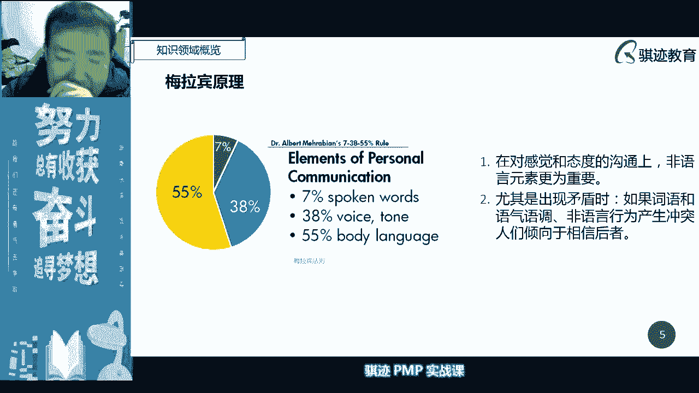

这不用考啊，这不会考，但是不会了解一下啊，那么我们讲在我们在实践工作当中，如果你要和对方，如果你要和对方进行面对面的沟通的话，这这是一个小技巧，有人今天又卡了啊，我觉得我不卡，我这里直播。

我自己看自己的屏幕，会讲啊啊我那我教你们想一想，当你们需要和别人面对面去交流的时候，face to face communication的时候很简单，就是说首先很多同学是不会不懂不会教的啊。

我曾经遇到过，我经常跟他们讲个段子，是我亲身经历段子，我以前我团队里有一个小工程师啊，啊也不算比我小几岁，有个工程师很有意思，他性格比较迷啊，性格还算可以，但是呢他不善于和异性打交道。

然后张恒要他和一个异性女同事要进行交流，然后他不敢，然后拖着我说一定要我去帮她做介绍，然后呢他就不敢抬抬头看人，然后不知道怎么样去啊开口说话，所以他硬要拖着一个项目经理。

跟扯到一件跟他们跟我无关的事情上，我我只好带着他去说啊，其实我跟对方也不是很熟啊，最多知道就一面之，然后对方只会跟对方说啊啊你好，我是某某某对吧啊，然后就是我们的某某某。

然后我他要跟你关于这个事情要交谈一下啊，不知道你现在有空嘛对吧，我跟他砍个头，开了刀之后，对对方呢可能比较懂教，然后就说上了啊，就是这样一个意思，所以很多人其实我知道很多人，尤其从工程师出身。

他是不擅长和人交流，不知道怎么和人交流，那么注意啊，和人交流，首先第一步你要懂得去看着对方，但是不要质愣愣的看着对方，那么我现在因为我们在上网课，所以很难直接表达，那么你们想象一下啊。

如果你的对面是我或者我的对面是你的话，那么我会怎么看着你呢，你会看到我现在看着你的时候，其实我没有眼神很聚焦的看着你，其实我更多的时候什么眼神是散的，所以第一如果你要和别人去交流的时候。

如果你如果你不太擅长运用眼神的话，那么你你要把自己的瞳孔呢稍略微放散，就是不故意盯着某个地方看，那种眼神往前看，然后呢第二接下来注意啊，你要把你的眼神专注在哪里啊，别人的鼻梁的这个地方看啊。

好鼻梁的这个地方，你把你的眼神专注在鼻梁的这个地方，眼神专注在别人的鼻梁的这个地方呢，是一个比较礼貌，因为什么你用你的眼睛盯着别人眼睛，别人有些人会觉得不好意思，有些人会觉得你有这侵略性。

有些人会觉得你只能看着我干嘛，所以看着别人的鼻梁是比较好的，但是如果你的视线低于看着别人嘴巴的话，你的整个的人的视线是会低下，然后造成对方说对方会很奇怪，因为没事要低着头干嘛啊，所以和别人沟通的时候。

当你不知道眼神怎么放的时候，你先自然的把眼神不要眼神聚焦放开，然后呢盯着对着对对方的鼻梁的，当中这里这个位置看啊，在鼻梁的中上放这个位置是ok的啊，是ok的，然后呢啊，一开始和别人交流的时候。

怎么样的时候呢，然后呢你可以微微的啊，你就这样微微的嘴角微微的笑笑，然后跟别人打招呼啊，初次和别人介面的时候呢，可以打可以打个hi，hello，你好，然后呢可以很漫不经心的用非正式的语气，可能啊你好。

我是欧尼亚很好，我是蔡老师的，很高兴很高兴见到你好啊，哦你好，我今天来是呃，是来做什么什么什么事情了对吧，然后正好可能呃想接近几分钟啊，用一下啊，就有一种比较客气的话，这是一种客套话。

但这种客套话呢在两个人啊，沟通双方两个人不熟的时候呢，是有效的，能够打破沟通的隔阂啊，对方如果反馈你的话，那么你接下来呢就会嗯，嗯慢慢的跟对方见沟通节奏，那么有经验的沟通者呢。

去调整自己的语言的表达形式，嗯如果有些人呢，有些人你和对方沟通呢，比如说有些人对方呢呃他比较内向，不太擅长说，那么你就稍微多说一点，以保证这个沟通呢始终保持持续，两个人沟通当中会有什么原则呢。

如果双方是沉默，没有任何人说话超过若干秒，一般3~5秒钟，然后就这个事情就会变得比较尴尬，知道吧，所以有时候呢，你可以慢慢的说一些和精灵主题相关，但是又不相关的事情，慢慢慢慢的把话题导入到想说的东西。

如果对方很擅长说，那么如果你又是在做访谈，我们之前取取过来访谈一对一对吧，做访谈或者是做调查，或者说或者是开会的话，那么你就可以让对方去说，然后呢你会跟着对方的说的内容呢，去思考你接下来会说什么啊。

一个有经验的开会者和访谈者呢，他会怎么样说呢，他会在听取对方的时候呢，啊可能隔一段时间，像我就会有点想隔一段时间嗯，点个头眨一下眼睛，故意这时候呢故意让对方看到嗯，啊是的，可以继续说嗯，哎用这样的方式。

然后等到对方呢说了告一段落之后呢，然后呢如果你想让对方继续说嗯，那么你就会把颜值的话题也插进去不了，比如说你说的那一点当中，你能不能细细的再跟我说一下对吧，诸如此类，然后将话题慢慢展开。

人和人之间的沟通，在一个一一个话题之后，如果能保持一分钟以上，你们双方之间能够有互动的话，人和人之间的隔阂，就会逐步逐步逐步的被打破啊，这是我的经验啊，所以作为一个无论是男生也好，女生也好。

如果跟异性去沟通的话，而是什么，但是你不要盯着对方看啊，千万不要盯着对方看啊，什么很友善的将目光放松，然后呢盯着对方的啊鼻梁的中上部去看着对方，很礼貌地看着对方，也不要哎嘿嘿傻笑。

也不要笑的很很很渗人对吧，嗯可以微微的笑一笑，微微的很微微嗯啊，就这样非常自然的微微的笑一下啊，然后呢就开始自己的对话，ok啊这是一个沟通技巧，你们你们以后你们以后呢。

呃比如说你知道你们很多人还是单身对吧，你们以后可以异性去交往，或者可能人家去沟通的时候呢，啊不要说什么拿课桌，哎同学就是这个板砖是你掉的吗，啊这这这么傻缺的话，比如说你想跟某个想认识某个异性对吧。

想跟大家交往一下对吧，想认识他，就说他你觉得他是你的菜对吧，然后呢你那你就可以说，那就说哎同学你好哎好哎你好，女生你好你好我我叫什么什么，我可以认识一下你吗，然后带着很真诚的眼光看着对方的鼻梁的中部。

然后呢呃如果你们是面对面可以伸出个手，我看我能认识你一下吗，啊然后呢，这样你要用一个比较低调一点的姿态呢，你会生出一个左手或者伸出一的时候，我是希望伸出左手，伸出左手，我能认识你一下吗，对吧。

有很有风度的样子，一般来说呃一个女生的不不太会那个，那么记住上来千万先不要，比如说你想认识一个女生，你上来签或者是一个认识一个很帅的男生对吧，上来千万不要哎，我能要你的微信吗。

这种事情中已经已经已经已经已经傻到透了，你应该说我能认识你一下吗，然后对方如果说啊，你想怎么认识我，然后那你就可以把话题讲开来，然后首先都可以呀，啊我觉得我觉得我想跟你聊聊沟通几句啊。

等两个人之间的沟通有一定的来来往往之后，你才问对方要一个微信，要个电话号码，或者要一个qq号码都行对吧，所以上来就问有一个一个异形要要要联系方式，其实是一种很傻的事情，ok啊所以这是我们给大家讲的啊。

所以作为一个项目经理，如果出作为一个你们现在是个工程师，以后想转型成项目经理的话，ok那么这些东西是你在工作中，实践中慢慢慢慢都是要摸索的啊，都要摸索，那么你在工作中，其实说看所有的人应该是带有什么。

带有无差别的啊，中性的眼光去看待别人的啊，不要看到小姐姐你就发光对吧，如果你看到一个很漂亮的小姐姐，比如说你是男生，看到一个很漂亮的小姐，眼睛发光，然后就怎么样，然后呢。

那你你会你会把这个沟通给带歪掉了，知道吧，那么在工作当中，你是你就看到所有人是个中性的，男的女的，什么都是一样的，你用一颗平和的态度去对待，看到你才能把一个事情聊好对吧，ok啊，那么我们稍微讲一讲。

后面还有很多的关于沟通的方面的例子啊，我们还会慢慢继续讲好，沟通当中心情趋势呢或相关方参与对吧。

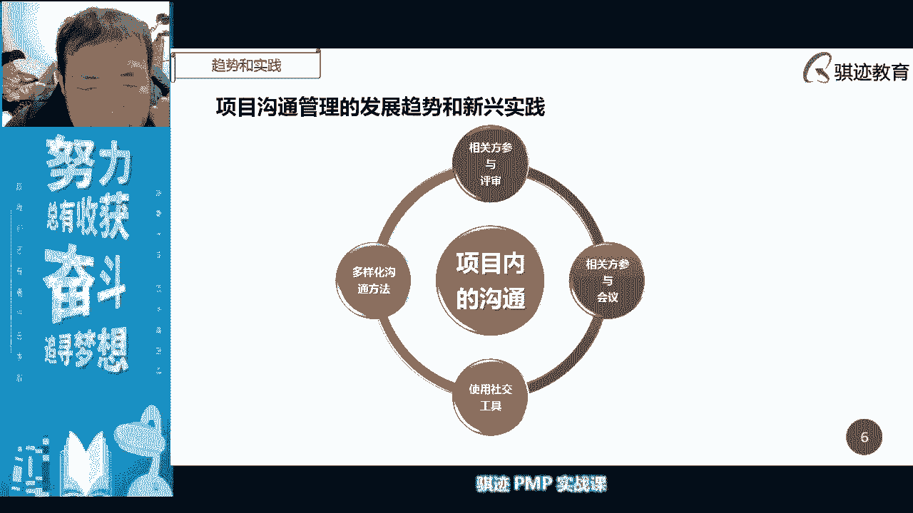

和多样化的沟通方式，使用社交媒体，会用相关方参与开会啊。

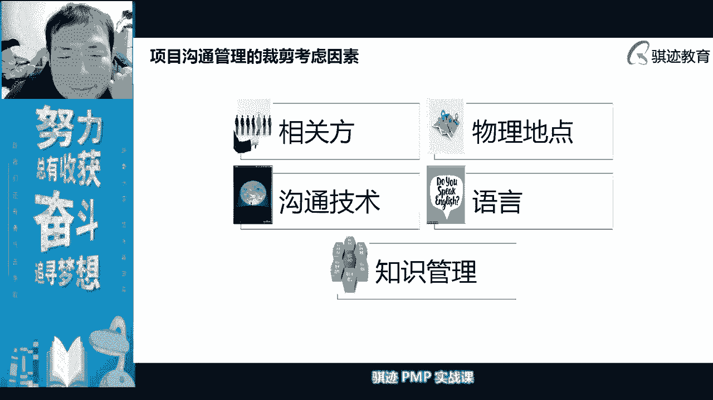

ok啊，沟通呢比较简单，沟通呢就一个规划，一个管理。

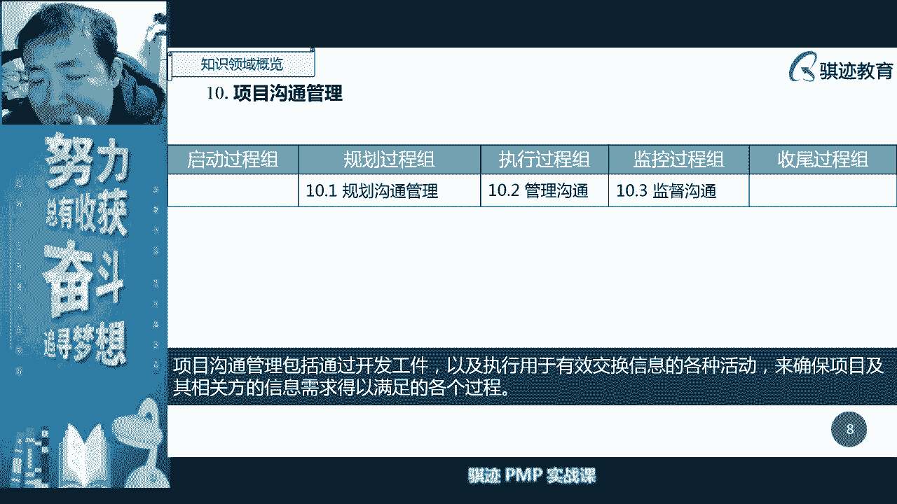

一个执行对吧，这三个东西比较简单啊，所以今天就只会讲一节课。

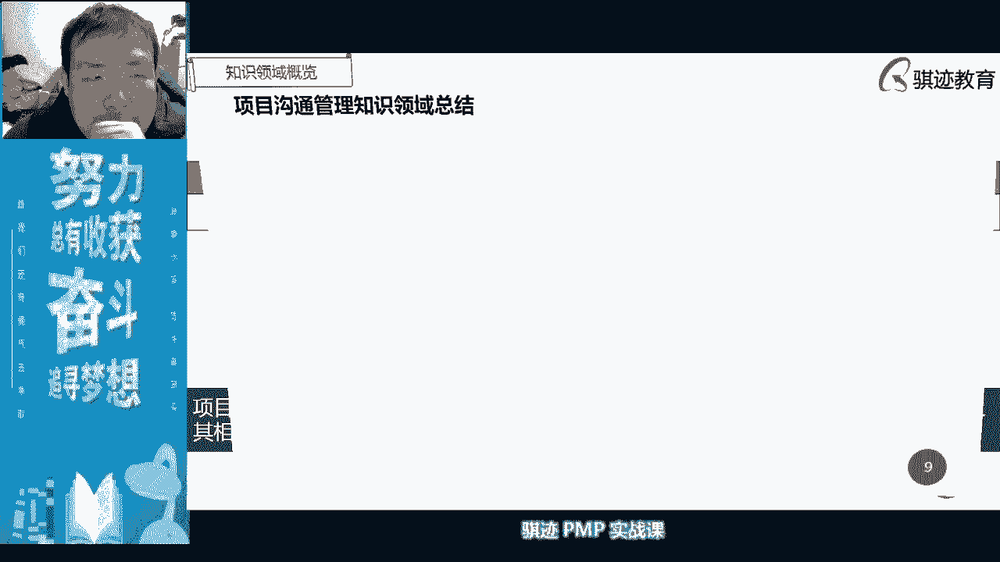

那么第一是规划沟通管理。

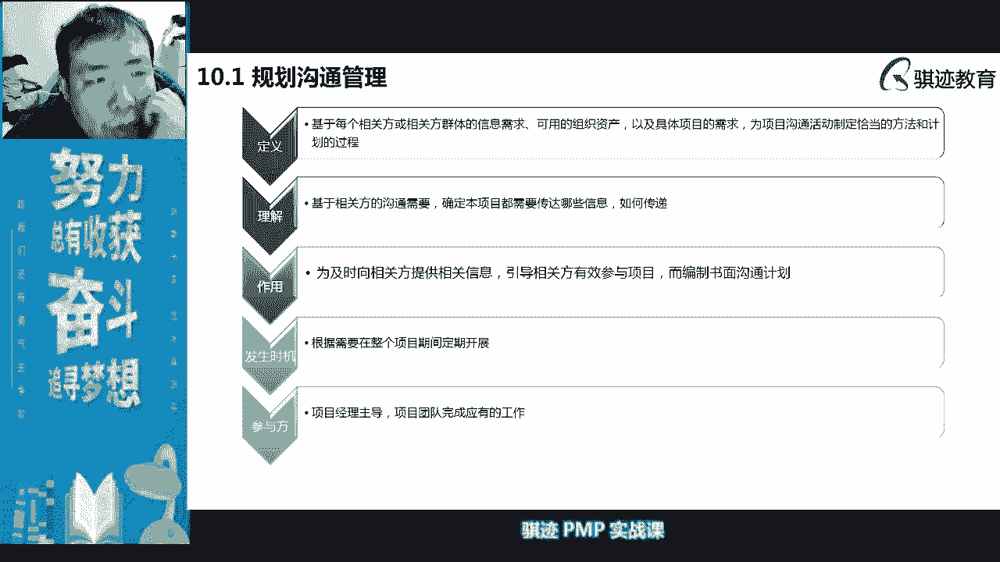

我们在一个项目的开始当中呢，我们首先会规划沟通沟通，要沟通规划，那么要沟通是吧，沟通的方法，使用沟通的技术和沟通的模型啊，这当中呢会有一个一些啊。

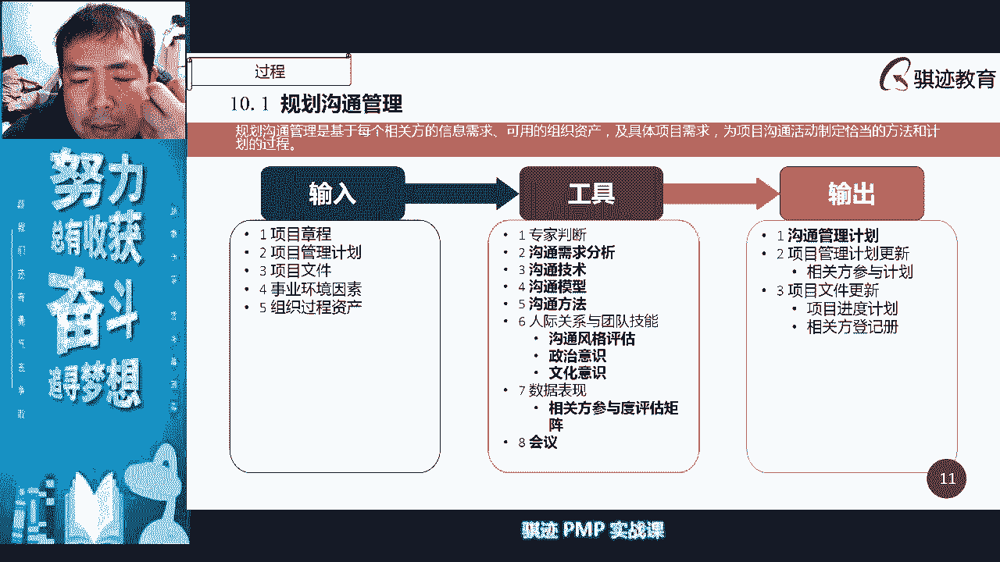

会有一些我们的一些工具方法，有可能会考到啊，好首先一点啊，我们首先会考到一点啊，是什么啊，是沟通渠道的分析啊，沟通渠道的分析怎么讲，你在一个项目在沟通当中，最初啊我们这里旁边有画有三个图。

大家可以看到啊，第一个是链式的，第二个是轮式的，第三个是什么，是全渠道式，全通道，mei channel communication，那么我们在一个一个团队比较小的时候，我们会采取什么样的沟通方式。

一个团队比较小的时候，我们会采取全渠道的功能，因为比如一共就三个人对吧，我们肯定人和人之间相互沟通对吧，然后多加了一个人呢，人和人相互之间沟通呢就渠道多了，你会发现什么，当到达到一定数量的时候。

全通道的沟通这样的方式，他的沟通开销越来越大，比如说你的团队里有十个人，那么如果是全通道的沟通，就意味着每一个人都要和其他九个人去沟通，这种沟通不是不行，但是你的沟通开销会很大。

你每次都要和其他九个人去讲某件事情，比如说你完成了某项工作，你要告诉大家你完成什么工作，你要跟所有九个人去，那么这个时候如果每个人都这么说的话，大量大家每个人大量的时间都在什么，告诉别人做什么。

然后接受别人做什么，这时候沟通开局就大，然后一个团队当中每一个人每增加一个人，那么沟通的渠道就会增加很多啊，所以当团队增加到一定程度的时候，全渠道沟通固然能够最直接的。

五点对点的直接将信息送到你想去送到对方，但是他的开沟通开就已经大了，这就是为什么在一个团队当中，当团队大到一定程度的时候，再增加一个人，几乎不增加生产力，就是这个道理。

因为这个增加人所带来的沟通渠道的一些浪费，会抵消他，增加一个人的人力所带来的劳动产出啊，会这样，这个时候我们就进入了什么状态，就进入了第二种状态叫做轮式沟通，轮式沟通当中，那么大家就不再直接沟通。

就像我们的网络结构啊，如果学it的就网络结构当中的中心点的核心啊，新型结构当中的核心，那么在一个团队当中，如果我们使用轮式沟通的话，这个核心人这个人一般是谁呢啊，请在公屏上告诉我，很好啊。

我看到有人回答项目经理啊，非常好啊，所以项目经理就是成为一个沟通的中心点，如果按照网络上的术语来说，你们就是这个嘛，你们就是个核心交换机，如果如果你呃，如果我们按照一些其他的认识的话。

你们就是一个什么啊，你们就是你们就是一个多岔路口的，一个一个一个核心，对吧啊，有东西，所以项目经理是把所有的纽带合计起来，因为我们可以看到有了项目经理之后呢，我们的沟通渠道就降了一个数量级。

呈数量级的下降，所以有了项目经理之后，我们的沟通呢虽然点和点之间，点和点之间的沟通呢变了，从直接沟通变为间接沟通，它的效率可能低了一点点，但是沟通渠道大幅下降，整个的沟通开销呢就会下降。

沟通开销的现象就意味着什么，整个项目团队的效能和产能就会上升啊，这就是轮式沟通，那么但是注意的是什么，项目经理自身的沟通的沟通极限也是有的，因为所有的人的沟通都不通，都会通过项目经理嘛。

这个时候你会发现什么项目经理也会极限，所以一个团队当他达到一定程度的时候，项目经理也顶不住，所以最后我们会形成一个什么叫链式沟通，链式沟通当中项目经理在顶端，但是项目经理和团队呢并不直接沟通他们。

他通过什么团队的团队主管，团队主管去沟通，每个团队主管带一个团队，他的团队呢相对比较小，他在团队内部呢使用轮式沟通，而在团队和团队之间呢，和项目经理呢也用一层轮式沟通，用两层的轮式沟通去完成一个呃。

整个项目当中的沟通，那么一个一个团队成员和项目经理，会差了多多少的，会有哪个两个啊，会有哪两条的就是沟通的呢，只是一个是团队成员到团队经理的，一个是团队经理啊，团团队成员到团队主管。

一个团队主管拿项目经理，所以他可以通过两条路径间接的两条了而已，那么一个团队成员都和他团队，另外一个人呢和轮式沟通是一样的啊，那么只有当那个是比较复杂的，当一个团队成员要向另外一个团队成员。

另外一个团队成员去沟通的话，还要通过他的团队主管到项目经理，再到项目经理，团队主管啊，项目经理，项目的另外一个团队，才再再到另外一个团队的团队成员，一共要走四条啊，所以链式沟通当中存在的问题是什么。

跨团队的沟通变得复杂了，变得复杂了啊，回去谈论这个问题啊，那么实际上概念ok这些概念大家要明白，所以我们一般会在老外的，很多的高能的团队当中呢，我会有一个原理叫做两个披萨的原理啊。

我直接问你们两个12寸的披萨够多少人吃，你在公屏上告诉我，嗯有人回答了吗，两个12寸披萨够多少人吃啊，六个人嗯，差不多嗯，ok啊，我看到有同学回答六个人可以就呃，所以老外认为一个团队当中。

如果他要高效能运作，又不用间接沟通模式，用直接沟通模式，一个团队会设成5~7个人会比较好，是最具有生产力的啊，所以叫这叫两个披萨的原理，5~7个人，5~7个人，那么很多的团队会形成怎么样的呢。

他不设团队主管，然后呢他使用多个链式呃，个扁平的链式沟通，那么他每一个团队，每一个团队的内部呢用全通道管理，仅仅当要跨团队的时候呢，他经过项目经理，经过项目，他把团队主管这一层呢。

项目经理呢不会单单对于什么啊，团队内部的沟通呢做协调，而让团队自己去决定，但是项目经理呢会对跨团队的沟通呢做协调，这样呢项目经理呢他的沟通渠道呢也少了，他的压力也小了啊。

所以这时候会反映在现在很多的项目当中，会采取这样的方式，就是用小的团队，但是用多个小团队进行沟通管理，然后当有跨团队沟通的时候，再通过项目经理，而不设团队主管这样的这样一个方式啊，ok啊。

whatever，那么无论怎么样的沟通方式，它都会有一个什么东西啊，叫做潜在沟通渠道啊，那么潜在沟通渠道一般是按照什么来计算，是全通道这种沟通的模式去计算的，那么它的公式是n乘以n减1÷2啊。

我们很简单，那么团队里有十个人，那么他的整个团队的潜在沟通渠道是多少个，是不是10x9÷2=45，对不对，好，如果十个人团队当中又增加了一个人，那么他团队同渠道是多少呢，11x10÷2等于多少。

等于50对吧，所以你会发现什么东西啊，仅仅增加了一个人，沟通渠道就增加了十条，那么所以这一个人的工作的效能，如果顶不上，十个渠道所消耗的人的精力时间的话，那我加一个人不加一个人，其实几乎没有区别。

这就是为什么很多团队工作当中，人家的越来越多，反而效能越来越差，对不对啊，明白了，所以这是p p考试当中，在沟通管理当中唯一要计算的啊，总沟通渠道或者潜在沟通渠道对多少啊，是n乘以n减1÷2。

这个公式记住就可以了，那么考试当中还要注意一个事情，做一个什么事情呢，说一个比较傻傻缺的事情，就是项目经理算不算人啊，听我表述，项目经理的团队有十个人，请问整个项目当中，内部相关方的沟通渠道总共多少。

请在公屏上告诉我啊，或者我换一个了，整个项目经理的团队一共有12个人，项目经理的团队有12个人，那么整个项目内部相关方的沟通渠道有多少个，12个项目经理有12个人，啊来了，到底是78还是66呢。

到底78还是66呢，你会看到前端渠道什么，答案应该是什么，应该是78，为什么他说的是项目经理的团队，所以项目经理没有算到那个团队里去，明白吧，如果这道题表述改成项目团队有12个人。

那么项目的团队的潜在沟通渠道为多少，那就是66，明白吗，所以你在考试当中唯一要注意的是什么，项目经理有没有算到那群人里面去，如果没有算，要加一，如果已经算进去，它的语言表达式算在里边了，不用加一。

ok明白了，好那么这个是我们讲沟通渠道的一个分析，所以在你在管理一个项目，设计一个项目，在规划一个项目的渠道的时候，你要根据人的数量去构化高中去了，那比如说我们项目当中有100个相关方。

那么你会设计怎么样的沟通沟通方式啊，问你们，如果我们项目当中有100个相关方，你会设计怎么样的沟通方式，啊非常啊非常的有意思啊，100个相关方，那么首先第一点，你准备用什么方式去跟他们沟通。

链式沟通的特点在于什么东西啊，链式沟通的那在一点它是你适合更多，适合内部的相关方，但是如果我说的100个相关，你并不一定见得适合链式，所以100个相关方我们可能仍然只能用轮式，由项目经理统一去沟通。

那怎么办呢，项目经理使用后面会讲到的叫推迟沟通，什么推迟功能的话，我跟这些人多多是吧，发邮件发群发一下邮件是不是很专业，如果你用100个相关的话，你用链式沟通，负责相关团队的那些团队主管。

然后带他们去下发，那么这个过程其实就有什么损耗了，反而不及这个有效率，因为这是100个啊，如果是1000个呢，1000个就有两种方法，第一如果是1000个的话，这个时候你会发现什么啊，太过庞大了。

他管不过来，所以这个时候呢我们会把这1000人分割，当有分割的时候呢，用链式就会更好一些，如果不能分割，或者是没有那么多资源金，内部的相关方去显著性分割的时候呢，我们还是用轮式。

但是我们会从推式沟通变成什么拉式沟通，拉屎沟通，那么什么叫拉屎沟通，我们今天用直播，视频直播，只开呃，开课就是一种拉屎沟通，我将信息传递给你们，但是我不知道有多，其实我是不知道有多少个人在认真听的。

但是你们只要想认真听的，无论是十个100个还是1000个都能听得到，这就是拉式沟通，ok啊，后面会讲，所以一个项目经理针对不同的项目有多少，相关方又怎么样，又要达到什么样的沟通效果。

你会使用不同的沟通模型去设计啊，这个其实有一点重要的有点重要的啊。

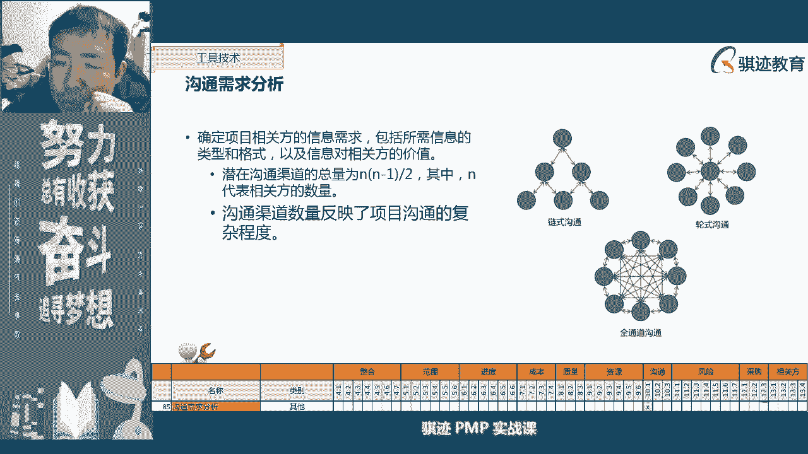

好我们今天讲沟通当中，我们会有依据于不同的沟通的技术呢，我们会选择满足不同的特性，这个特性正好我们在前面呢团队管理当中，资源管理当中呢我们从未讲过啊，紧迫性，可用性，易用性。

项目环境适应性和我们的敏感性，对吧，记得吧啊那么在这里我们可以细讲一下啊，那么这些特性都会呃有哪些东西要满足，比如说我要你们想想，如果我要满足项目环境的环境适用性，我要满足于易用性，我要满足于保密性。

我可以用什么样的沟通工具，请告诉我，啊有同学注意啊，没有广播室沟通的啊，我觉得我这里很好啊，来来来我要啊。

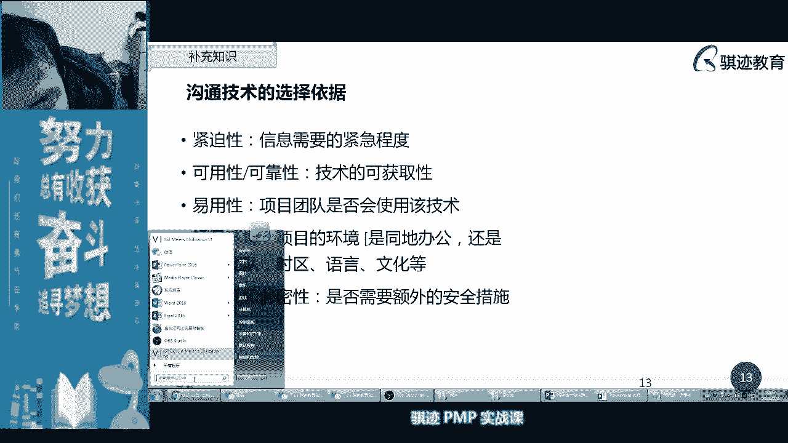

今天我觉得没有什么卡，你们注意一下自己的网络啊，看我的网络很好啊，大家可以看到啊，没有问题。

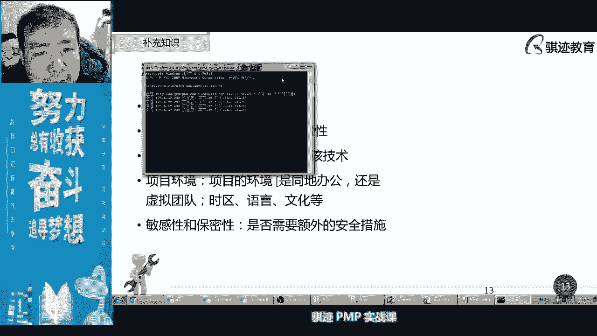

看到没有，很稳定啊。

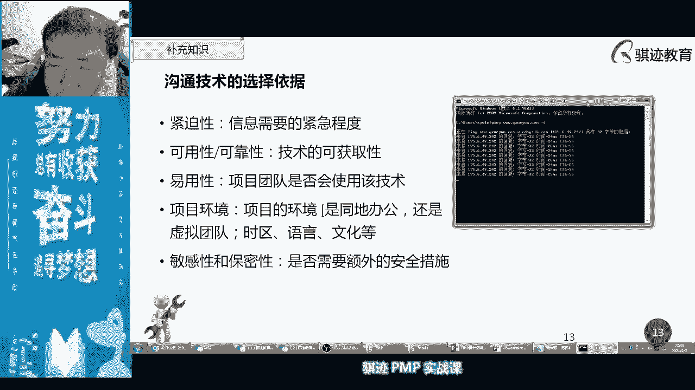

20几毫秒是很正常的，很稳定啊，好那我问你们拉群，那那那那那错了啊，项目环境适用性是什么意思啊，你的沟通能够和项目管理结合起来的，拉群紧急能造成什么易用性啊，拉群有没有保密性。

我跟你说是不是保密性比较差，这个不行啊，不行啊，拉群oa邮件啊，ok啊，那么要满足易用性，要满足环境适应性，要满足什么啊，敏感性保密性，那么我会我们会用到一个工具是什么工具啊，来我打个公屏啊。

之前学过的啊，叫pm i s，记不记得，因为pm s project management information system，满足了这个环境的环境适用性对吧，然后项目团队呢是会使用该技术的。

所以有易用性，然后呢他还比较保密对吧，但是他那技术可获得性，可靠性，技术和可用性的并不好，因为它只有在我们的项目环境当中才可以用，比如说只能在公司里面用对吧，除了公司可能就不能用了。

然后呢紧迫性不强对吧，一般紧迫性不强啊，所以有一个这样的概念，没有一个沟通沟通工具是所有的环境，所有的沟通条需要的条件都能够使用啊，那么我再问你们微信适合什么特性，我们沟通什么特性。

微信肯定可适合什么紧迫性和什么可用性对吧，还有易用性，但是不适合项目环境和保密对吧，电子邮件呢没有紧迫性，可用性很高，易用性也很高对吧，然后呢其他两个不是对吧，所以不同的不同的沟通工具。

它的沟通的满足的特性是不一样的啊，注意应该是没有一样软件，能够满足所有的这些沟通啊，所有的这些技术特性啊，所以我们根据不同的环境，所以我们根据不同的环境，不同的沟通渠道，所以我们要设计不同的沟通方式啊。

所以也有一个概念啊，现在有个概念叫做i t当中有个叫alini channel啊，叫全频道沟通，o m n i channel c h a n n e r in the channel management啊。

叫全频道沟通方式啊，这个这种沟通方式当中呢，我们会在不同的沟通方式来进行打通，运用多种沟通方式提供嗯，覆盖这里所有一切的沟通特性的沟通渠道，所以用户既可以使我们的团队和用户，既可以使用微信沟通。

也可以使用什么项目管理，项目管理软件沟通，也可以使用什么o a去沟通，那么但是呢它不同的沟通呢又有自己的侧重，但是这些东西呢又是可以打通的，在可打通的部分是可以打通，这样的话就非常易用啊，面对面沟通嗯。

微信拉群，所谓各种各样的拉群其实都是不安全的啊，微信拉群，那么你说啊，我们是个企业企业微信对吧，然后拉个群很安全对吧，企业微信你经不经过腾讯服务器啊对吧。

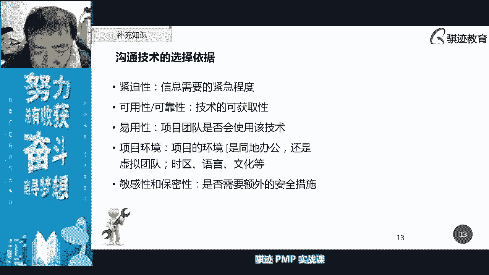

保密性还是要有一点的啊，ok啊我们继续讲沟通当中呢，我们要注重各种各种各种各样的沟通技术的。

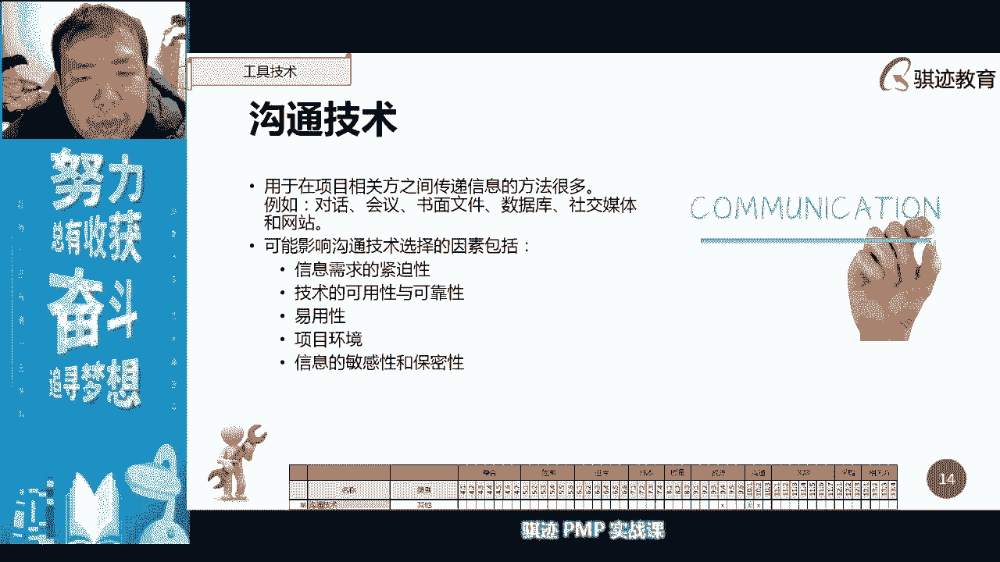

沟通方式的适用啊，沟通，那么沟通当中我们会设计一个沟通，沟通当中必然会有什么，有一方是发送方，有一方是接收方，发送方和接收方发送了，这是什么，通过编码解码解码编码来进行信息的传递啊，这是个抽象的概念啊。

抽象的概念啊，那么有时候说去澡堂丽丽搓澡，沟通ok啊，那么ok啊，那玩笑就稍微开心点，那么我们在沟通当中发送的解码编码就是什么，就是语言就是语言对啊，语言就是一种什么东西啊，解码编码方式。

不同的语言能够表达相同的意思啊，相同的意思，所以语言就是我们的编解码器，所以当你学会很多种语言的时候，那么也就意味着你在沟通当中有更多的编码，解码器可以进行编码解码，你的沟通的选择就会更多啊。

会有这样一种特性，会让这样一个特性，所以很多时候呢我知道很多我们游戏，国内很多的啊工程师技术不错，但是因为不会不会外语对吧，所以工作就受限，为什么，因为在和国际接轨的很多工作当中。

要求我们会至少一门外语对吧，啊会有这样的一个会有这样的，那么这个编码，那么编码解码当中呢会有一个东西叫做噪音。

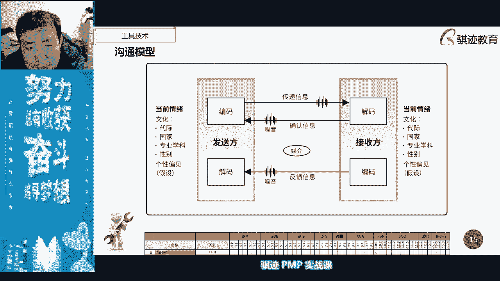

噪音噪音是什么，噪音是把我们的信息量传递y的，传递y的东西，文化差异这些东西，语言的差异都可能长成了噪音，对吧，都很噪音，噪音啊，比如说比如说举个例子啊，比如说举个例子啊。

中国人如果说啊中国人如果说啊我挺好的，如果你方成老外，有老外，你跟我说i'm fine啊，中国人就那么i'm fine，thank you对吧，能翻啊，但是其实安饭如果你在老外的很多语境里。

就是说他其实不好的，就是说勉强说自己好的那种意思对吧，这就是一种差异，因为是文化噪音对吧，然后呢如果你和一个印度人，印度人跟你说，你们一个印度人这个事情行不行，印度人给你点了点头。

那么他有可能是说不行对吧，因为在印度有些地方点头表示不行，摇头表示行啊，这就是文化差异，所以很有意思啊，这种这种东西的差异呢都都会很有意思，都很意思，所以我们要在沟通当中呢，要注重可能产生噪音的地方。

要进行确认，进行确认，那么很多时候排除噪音的一个方法是什么，使用书面的形式，而不要使用肢体和语言和嗓音声音这种形式，因为voice和act这种东西呢是容易产生歧义的，但是书面呢比较不容易产生歧义啊。

所以当你要确认一些东西是不存在噪音的时候，你应该让对方什么啊，打字打下来，书写写出来，这样就会避免一些一些差异和噪音啊，这是沟通当中一种特性，所以有时候呢我们会用到什么场景啊。

你和某人做了一次一对一的交谈，或者你和一群人开了个小组会，你就会有一个什么啊，你就会有个什么会议纪要，会有个什么交谈记录，然后呢你会把这些会议介和交谈内容，当场或者紧急的事后呢。

就发给对方去确认这个是一个什么，用书面的形式就确认你们在沟通当中，有没有产生噪音啊。

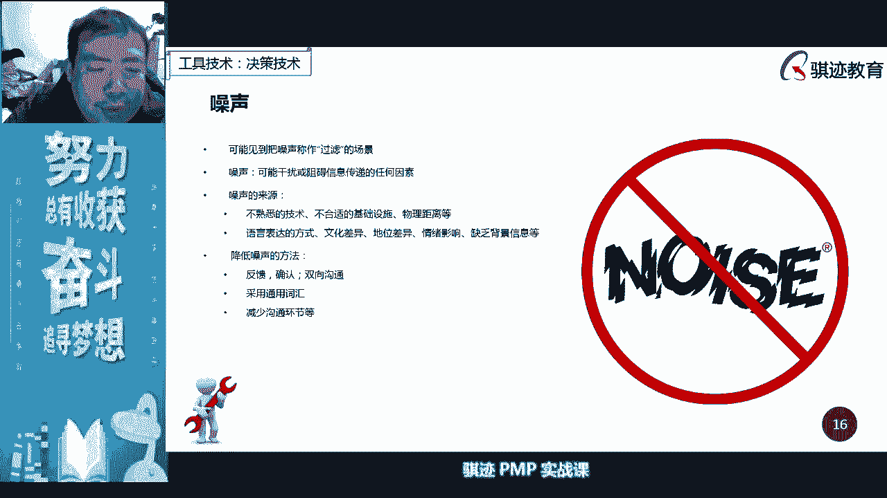

有没有产生噪音啊，这个pp电量就会有一个很有意思啊，啊那这里就是一个很有意思的例子，这个例子非常有意思啊，你有时间简史吗，你有时间简史吗，啊好这个例子是什么呢，神经病我有时间也不会简史对吧。

那么这就是利用了中文的谐音对吧，简史和简史不是一个简史对吧，啊这个这个其实也挺这个p p t做的，这段pv不是我做的啊，挺有意思的啊，所以这个事就是一个噪音，所以这个噪音产生了沟通误解，只有通过什么。

当他们两个会把字打下来，这只鹦鹉和这只猫会把这个东西打下来，的时候呢，误解就消除，我就这样说，这就是沟通啊，沟通当中千万不要小看噪音，因为噪音会导致很多的，就是本来能够很快讲清楚的事情。

或者很容易解释这种造成一些很大的麻烦，甚至有些冲突和呃问题，就是因为很细小的噪音所造成啊，所以项目经理呢应该注重，在有些沟通的渠道当中，设计当中要有去除噪音的那些环节，去专业的环节啊。

所以我经常也会在跟大家上课当中会这样做，比如说我说如果确认他有没有理解，或者更多资源，怎么样呢，我会在公屏上打出那些字，让大家知道啊，原来是你们要知道，原来是我表达这个意思，以免被你们的噪音。

脑中的噪音误解了我的意思啊，没有啊，我不是我不是我不是郭德纲的，这是原p p t作者吧，不是我，ok啊，当然这个不重要。

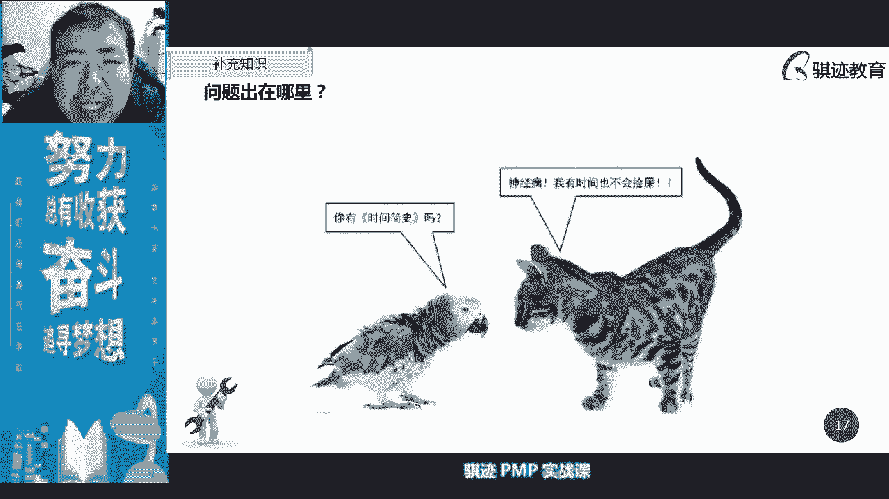

这些都不重要啊，那我们在规划沟通当中呢，要注重沟通方法，沟通方法呢分为分为这样几种啊，第一种叫做推迟沟通，什么叫做推迟沟通，推迟沟通就是把信息推出去，发邮件，传真，语音邮件，报告备忘录。

这些都是推迟沟通，推迟沟通，退市沟通有什么特点啊，注意你们可以在自己这里写一写啊，退市沟通有这样一个特点，退市的沟通它的受众是确定的，比如我发邮件，我是知道会发给100个人也好。

1000个人我只知道这100个1000个人，我是发给他们的，我发给他们之外的，不是我的受众，所以推迟沟通是制造受众，但是推式沟通有有它的缺点是什么，第一我不能除非后面加确认完全，否则我是不能够知道对方。

是否正确地接收到了我的信息，所以推迟功能的问题是，我不知道对方正确的是否正确接收到我的信息，第一第二退市沟通没有办法注意啊，我说的东西都是要注意概念，没有办法一次性沟通大量复杂的信息内容。

尤其不方便沟通，什么副媒体啊，副媒体对吧，所以因为邮件里面，大家一般不会有很大的附件对吧，然后呢很多的东西啊，曝光什么东西啊等等，都不都不方便放非常大的信息内容，所以它不适合沟通非结构化数据。

所谓的富媒体数据不适合不适合，所以他的沟通的信息量受限受限受限，那么与此相对应的，所以我们会有一个东西要怎么拉屎沟通，拉式沟通就是我们将信息放在一个指定地方，或者在一个指定地方呢进行广播。

随大家需要去接收收取，那么拉屎过多的好处是什么，它可以一次性放送大量复杂的信息，一次性放送大量复杂的信息，有我比如说今天就是个拉屎沟通的例子，有我在直播间给大家做什么做做直播，这就是拉屎沟通。

那么拉式沟通有什么缺点，拉式沟通，我是不知道大家到底有多少人受众的啊，所以其实我们看看现在直播间签到有100个人，但是我不知道这100个人是不是真正的都在看，有些人可能翘着脚在那边刷手机对吧。

有些人可能在什么东张西望，有些人可能在吃饭，有些同学可能在一边在饭桌上应付着甲方爸爸，一边在听我课啊，我很感动啊，那么这些时候我是不知道拉屎沟通，真正沟通效果的，因为我是不缺人。

我也不知道是你们是不是看，所以这是拉氏沟通的一些呃缺点，那么在这两个之外呢，我们又多了一个叫做互动式沟通，互动式沟通呢它是实施多项的沟通，他有一个确认收到和反馈的啊，像微信，比如像微信这种呢。

就是属于互动式沟通，比如说你跟微信给人打字，他的微信的屏幕上就是什么，对方正在输入啊，说到这个，我记得我的微信上有一个人，有一个人很很欠抽对吧，有一个人微信名字叫对方正在输入啊，这位同学啊。

这位同学很清楚啊，这就是一种什么互动式沟通，互动式沟通，对方实时的和对方进行实时的信息交换，那么互动式沟通有什么缺点啊，就是它的多项是受限，他的多项受限，所以如果我和你们进行互动式沟通的培训。

我就不可能和你们这么多人同时进行培训，我可能只能和少部分人去培训了，我才有互动式沟通啊，所以他的沟通的人的精力和渠道的占用，开销会比较大，受众面有限，互动式共同的受众面就有限啊。

所以我跟大家沟通只能算什么。

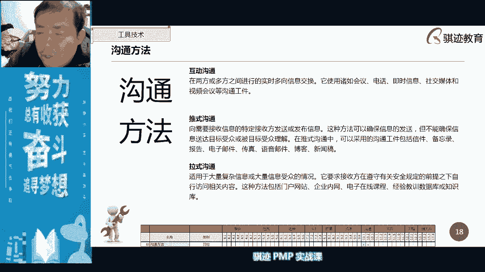

公平里教大家打个赞，什么东西啊，建议沟通就是互动式沟通，我们在规划过程当中呢，我们会注重什么，注重沟通和风格的评估啊，所以规划过程当中呢，我们会注重每一个人偏好于使用什么方式。

我们一般来说会尽可能的使用对方，或者各个相关方偏好的沟通方式进行沟通啊，这是我们讲在规划过程当中呢，有评估沟通风格的啊，所以有些人喜欢直接沟通，当面说有些人他不喜欢，当面说比较腼腆，有些人呢喜欢书面。

有些人呢喜欢口头的，所以每个人的偏好呢是不一样的啊，可能是偏好不一样，所以我们在识别沟通偏好的时候，尤其要注意识别重要相关方偏好，这其实是一个经验点啊，经验点，为什么很多同学呢很害怕一件事情向领导。

上级，尤其是大的领导汇报工作，这时候不要怕，你首先看啊，很多人不敢，有很多人呢其实工作做的挺好，但是不敢向领导沟通汇报工作，这时候没关系，你首先你首先先观察，你的领导的沟通偏好是什么，你只能过了。

你看看他平时喜欢什么啊，他是不是很喜欢回邮件啊，如果他很喜欢，如果你看你的领导很喜欢回邮件，你的领导呢很喜欢什么啊，网上就就是说啊回回什么内部论坛，或者网上喜欢回回评论。

那么说明他是一个偏好什么间接沟通的，那么这样的领导，你和他沟通号是什么啊，你应该沟通方式是什么，你先给他进阶沟通说啊，领导跟你沟通一下，方便吧，你比如说啊邮件沟通怎么沟通，然后呢。

再确认它能不能直接沟通或者剪辑沟通啊，当然要注意，直接沟通是一种最好的沟通方式，如果能够直接沟通是最好的，因为直接沟通最容易说送啊，说出啊，说清楚事情，同时呃和领导多直接沟通。

